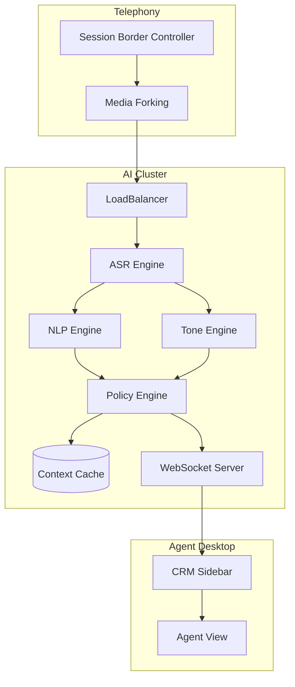

# ML Use Case Analysis: Customer Support & Legal Speech Analysis

**Analysis Date**: November 2025  
**Category**: Speech Analysis  
**Industry**: Customer Support & Legal  
**Articles Analyzed**: 4 (Nice, Verint, Otter.ai, Gong)

---

## PART 1: USE CASE OVERVIEW

### 1.1 Basic Information

**Category**: Speech Analysis  
**Industry**: Customer Support & Legal  
**Companies**: Nice, Verint, Otter.ai, Gong, Ironclad  
**Years**: 2023-2025  
**Tags**: Sentiment Analysis, Intent Detection, Compliance Monitoring, Real-Time Agent Assist, Legal Transcription

**Use Cases Analyzed**:
1.  [Nice - Enlighten AI for CX](https://www.nice.com/products/ai-and-analytics/enlighten-ai)
2.  [Gong - Revenue Intelligence](https://www.gong.io/product/revenue-intelligence/)
3.  [Otter.ai - Automated Meeting Notes](https://otter.ai/)

### 1.2 Problem Statement

**What business problem are they solving?**

This category addresses **"Interaction Intelligence"** and **"Risk Management"**.

-   **Customer Support (Call Centers)**: "The Black Box of Voice".
    -   *The Challenge*: Managers can only listen to 1% of calls for quality assurance. They have no idea why customers are churning or why calls are long.
    -   *The Friction*: Agents are stressed, dealing with angry customers without real-time help.
    -   *The Goal*: Analyze 100% of calls. Detect sentiment shifts ("Customer is getting angry"). Guide the agent ("Offer a refund").

-   **Legal & Compliance**: "The Liability Trap".
    -   *The Challenge*: Financial advisors cannot promise guaranteed returns. Lawyers need accurate records of depositions.
    -   *The Friction*: Manual transcription is slow ($1/min) and prone to error. Monitoring thousands of trader calls for insider trading risks is impossible manually.
    -   *The Goal*: Automated, high-accuracy transcription with "Risk Flagging". "Did the trader mention 'non-public info'?"

**What makes this problem ML-worthy?**

1.  **Emotion Detection**: Text is not enough. "That's great" can be sincere or sarcastic. You need **Prosody Analysis** (pitch, tone, volume) to know the difference.
2.  **Real-Time Latency**: Agent Assist needs to pop up a suggestion *while* the customer is speaking. <200ms latency required.
3.  **Speaker Separation**: In a deposition, knowing *who* said "I object" is legally critical.
4.  **Complex Intent**: "I want to cancel" might actually mean "I want a discount". ML must infer the latent intent.

---

## PART 2: SYSTEM DESIGN DEEP DIVE

### 2.1 High-Level Architecture

**Real-Time Call Center Analytics**:
```mermaid
graph TD
    Phone[Telephony System (SIP)] --> Stream[RTP Audio Stream]
    
    subgraph "Real-Time Inference"
        Stream --> Split[Stereo Split (Agent/Customer)]
        Split --> ASR[Streaming ASR]
        Split --> Prosody[Tone Analyzer]
        
        ASR --> Transcript[Live Transcript]
        Transcript --> NLP[Intent/Sentiment Classifier]
        
        NLP & Prosody --> Fusion[Fusion Model]
        Fusion --> Alert[Agent Assist Engine]
    end
    
    Alert --> UI[Agent Desktop Pop-up]
    
    subgraph "Post-Call Analytics"
        Transcript --> Warehouse[Data Lake]
        Warehouse --> BatchNLP[Topic Modeling]
        BatchNLP --> Dashboard[Manager Dashboard]
    end
```

### Tech Stack Identified

| Component | Technology/Tool | Purpose | Company |
|-----------|----------------|---------|---------|
| **Telephony** | Twilio / Genesys | Audio Capture (SIP/RTP) | Nice, Verint |
| **ASR** | Google Speech API / DeepSpeech | Speech-to-Text | All |
| **NLP** | BERT / RoBERTa (Fine-tuned) | Sentiment & Intent | Gong, Nice |
| **Search** | Elasticsearch / Opensearch | Keyword Spotting | Legal Tech |
| **Visualization** | Tableau / PowerBI | Reporting | Call Centers |

### 2.2 Data Pipeline

**Ingestion**:
-   **SIP Recorders**: Hardware or software that "taps" the VoIP line to fork the audio stream to the ML engine.
-   **Stereo Separation**: Crucial. Agent on Left Channel, Customer on Right Channel. Prevents "crosstalk" confusion.

**Processing**:
-   **Keyword Spotting (KWS)**: Fast, lightweight models looking for specific triggers ("Cancel", "Lawyer", "Supervisor").
-   **Redaction**: PCI-DSS compliance requires scrubbing credit card numbers from recordings.
    -   *Technique*: Detect "sixteen digits" pattern in audio or text and replace with silence/asterisks.

### 2.3 Feature Engineering

**Key Features**:

-   **Prosodic Features**:
    -   *Jitter/Shimmer*: Micro-fluctuations in pitch (indicates stress).
    -   *Speaking Rate*: Fast speech often equals anger or anxiety.
    -   *Silence Ratio*: "Dead air" indicates the agent doesn't know the answer.
-   **Conversation Dynamics**:
    -   *Over-talk*: Both speaking at once (Argument).
    -   *Sentiment Trend*: Did the call start Negative and end Positive? (Good Agent).

### 2.4 Model Architecture

**Sentiment Analysis (Multimodal)**:
-   **Text Branch**: BERT model processing the transcript.
-   **Audio Branch**: CNN/RNN processing the Mel-spectrogram (Tone).
-   **Fusion**: Concatenate the embeddings.
-   **Why?**: Detects sarcasm. Text says "Thanks a lot", Audio says "Angry". Model predicts "Negative".

**Compliance Monitor**:
-   **Rule-Based + ML**:
    -   *Rule*: "Must read the Mini-Miranda warning".
    -   *ML*: Fuzzy matching. "This call is being recorded" vs "We are recording this". Both count as valid.

---

## PART 3: MLOPS & INFRASTRUCTURE

### 3.1 Model Deployment & Serving

**Streaming Architecture**:
-   **Protocol**: WebSocket or gRPC bidirectional streaming.
-   **Chunking**: Audio sent in 100ms chunks.
-   **VAD**: Voice Activity Detection runs on the edge to stop sending silence.

**Scalability**:
-   Call centers have massive spikes (e.g., Black Friday).
-   **Auto-scaling**: Kubernetes clusters scaling ASR pods based on active call count.

### 3.2 Privacy & Security

**PCI & PII Redaction**:
-   **Challenge**: You cannot store the credit card number. Redaction must happen *in memory* before writing to disk.
-   **Solution**: "Stop-Start" integration. The CRM tells the recorder "Agent is on the Payment Page", recorder pauses.

### 3.3 Monitoring & Observability

**Metrics**:
-   **Average Handle Time (AHT)**: Did the AI help reduce call length?
-   **First Call Resolution (FCR)**: Did the customer need to call back?
-   **Transcription Accuracy**: Random sampling for human review.

### 3.4 Operational Challenges

**Accents & Dialects**:
-   **Issue**: Global call centers (Philippines, India, US). ASR trained on US English fails on Indian English.
-   **Solution**: **Acoustic Model Adaptation**. Train separate acoustic models for different regions.

**Audio Quality**:
-   **Issue**: Customer is on a bad cell connection, wind noise, dog barking.
-   **Solution**: **Speech Enhancement**. Pre-processing models (like RNNoise) to denoise the signal before ASR.

---

## PART 4: EVALUATION & VALIDATION

### 4.1 Offline Evaluation

**Emotion Datasets**:
-   **IEMOCAP / MSP-Improv**: Standard academic datasets for emotion recognition.
-   **Internal Labeling**: Companies pay annotators to listen to calls and label "Anger", "Frustration", "Happy".

### 4.2 Online Evaluation

**Agent Feedback**:
-   "Was this suggestion helpful?" (Thumbs Up/Down on the Agent Assist UI).
-   **Usage Rate**: How often do agents actually click the suggested "Knowledge Base Article"?

### 4.3 Failure Cases

-   **The "Happy Goodbye"**:
    -   *Failure*: Customer screams for 10 mins, then says "Finally, goodbye". Model sees "Goodbye" and marks sentiment as Neutral.
    -   *Fix*: **Weighted Averaging**. Weigh the *peak* negative emotion more heavily than the end state.
-   **Legal Hallucination**:
    -   *Failure*: Transcribing "He did NOT kill him" as "He did kill him".
    -   *Fix*: **Confidence Scores**. If confidence is low on a critical word, flag for human review.

---

## PART 5: KEY ARCHITECTURAL PATTERNS

### 5.1 Common Patterns

-   [x] **Stereo Recording**: Always separate speakers at the source.
-   [x] **Hybrid NLP/Prosody**: Using tone to disambiguate text.
-   [x] **Real-Time Event Stream**: Treating a call as a stream of events (Silence, Keyword, Sentiment Shift).

### 5.2 Industry-Specific Insights

-   **Legal**: **Verbatim matters**. You cannot "summarize" a deposition. You need every "um" and "ah" (or at least the option to keep them).
-   **Support**: **Empathy matters**. The AI coaches agents on "Soft Skills" ("You sound tired, try to sound more energetic").

---

## PART 6: LESSONS LEARNED & TAKEAWAYS

### 6.1 Technical Insights

1.  **Latency is the Enemy**: For Agent Assist, if the suggestion appears 5 seconds after the topic changed, it's a distraction. 500ms is the target.
2.  **Context is King**: "I want to kill... this subscription". A simple keyword spotter triggers a "Threat" alert. A contextual model understands it's a figure of speech.

### 6.2 Operational Insights

1.  **Agent Buy-In**: Agents hate being "spied on". Position the AI as a "Co-pilot" that handles boring tasks (notes, data entry) rather than a "Big Brother".
2.  **Compliance is Binary**: In Legal/Finance, 99% accuracy isn't enough. You need 100% capture. Redundancy (backup recorders) is standard.

---

## PART 7: REFERENCE ARCHITECTURE

### 7.1 System Diagram (Real-Time Agent Assist)



### 7.2 Estimated Costs
-   **Compute**: Moderate. ASR is the main cost.
-   **Storage**: High. Storing recordings for 7 years (Legal requirement).
-   **Team**: Backend focused (Streaming, VoIP integration).

### 7.3 Team Composition
-   **VoIP Engineers**: 2-3 (SIP, RTP).
-   **ML Engineers**: 3-4 (ASR, NLP).
-   **Frontend Engineers**: 2 (Real-time dashboards).

---

*Analysis completed: November 2025*
