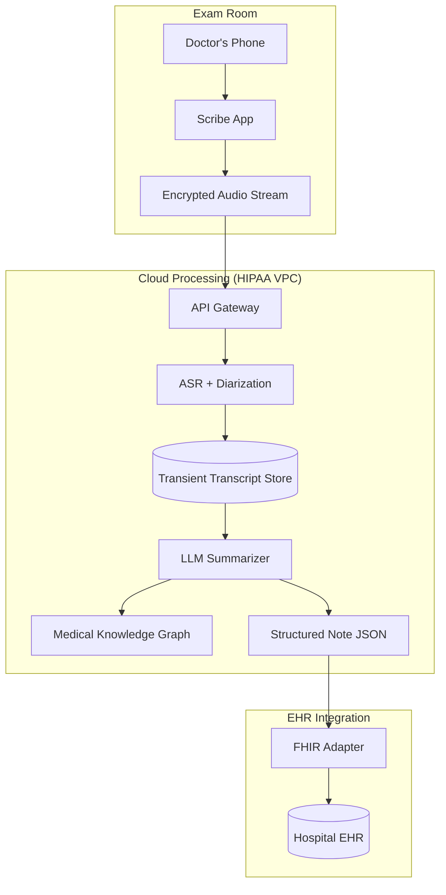

# ML Use Case Analysis: Healthcare Speech Analysis (Ambient Clinical Intelligence)

**Analysis Date**: November 2025  
**Category**: Speech Analysis  
**Industry**: Healthcare  
**Articles Analyzed**: 4 (Nuance, Abridge, DeepScribe, Suki)

---

## PART 1: USE CASE OVERVIEW

### 1.1 Basic Information

**Category**: Speech Analysis  
**Industry**: Healthcare  
**Companies**: Nuance (Microsoft), Abridge, DeepScribe, Suki  
**Years**: 2023-2025  
**Tags**: Ambient Clinical Intelligence (ACI), Medical ASR, Speaker Diarization, Generative AI, EHR Integration

**Use Cases Analyzed**:
1.  [Nuance - Dragon Ambient eXperience (DAX)](https://www.nuance.com/healthcare/ambient-clinical-intelligence.html)
2.  [Abridge - Generative AI for Clinical Documentation](https://www.abridge.com/technology)
3.  [DeepScribe - Ambient AI Scribe](https://www.deepscribe.ai/)

### 1.2 Problem Statement

**What business problem are they solving?**

This category addresses **"Physician Burnout"** and **"Documentation Burden"**.

-   **The Crisis**: For every 1 hour of patient care, physicians spend 2 hours on documentation (EHR data entry). This leads to "Pajama Time" (doctors finishing notes at night) and burnout.
-   **The Friction**:
    -   *Dictation* is faster than typing but still requires the doctor to summarize the visit *after* it happens.
    -   *Human Scribes* are expensive and intrusive.
    -   *Computer Interaction*: Doctors staring at screens instead of patients destroys the therapeutic relationship.
-   **The Goal**: **Ambient Clinical Intelligence (ACI)**. A system that listens to the natural conversation between doctor and patient, automatically extracts medical facts, and generates a structured clinical note (SOAP note) in the EHR, ready for signature.

**What makes this problem ML-worthy?**

1.  **Multi-Speaker Chaos**: Clinical conversations involve interruptions, crosstalk, and multiple speakers (Doctor, Patient, Family Member, Nurse).
2.  **High-Stakes Accuracy**: Mishearing "Hypertension" as "Hypotension" or "50mg" as "15mg" can be fatal. General ASR models (like Siri) are not accurate enough.
3.  **Domain Specificity**: The vocabulary includes complex drug names, Latin anatomical terms, and rapid-fire medical shorthand.
4.  **Summarization vs. Transcription**: A transcript is useless. Doctors need a *summary*. "Patient complains of chest pain" (Subjective) vs "BP is 140/90" (Objective).

---

## PART 2: SYSTEM DESIGN DEEP DIVE

### 2.1 High-Level Architecture

**Ambient Scribe Pipeline**:
```mermaid
graph TD
    Mic[Ambient Microphone / Phone] --> Stream[Audio Stream]
    
    subgraph "Real-Time Processing"
        Stream --> VAD[Voice Activity Detection]
        VAD --> Diarization[Speaker Diarization]
        Diarization --> ASR[Medical ASR]
        ASR --> Transcript[Raw Transcript]
    end
    
    subgraph "Clinical NLU & GenAI"
        Transcript --> EntityExtract[NER (Meds, Conditions)]
        Transcript --> Sectioning[Topic Segmentation]
        
        EntityExtract & Sectioning --> LLM[Generative Summarizer]
        LLM --> Draft[Draft SOAP Note]
    end
    
    subgraph "Integration"
        Draft --> Review[Physician Review UI]
        Review --> EHR[EHR System (Epic/Cerner)]
    end
```

### Tech Stack Identified

| Component | Technology/Tool | Purpose | Company |
|-----------|----------------|---------|---------|
| **ASR Model** | Conformer / Whisper (Fine-tuned) | Speech-to-Text | Abridge, Nuance |
| **Diarization** | Pyannote / Kaldi | Who is speaking? | All |
| **LLM** | GPT-4 (Nuance), Custom LLMs (Abridge) | Note Generation | Nuance, Abridge |
| **Integration** | HL7 FHIR | Pushing data to EHR | All |
| **Hardware** | PowerMic / Mobile App | Audio Capture | Nuance |
| **Cloud** | Azure (Nuance), AWS (Abridge) | HIPAA-compliant hosting | All |

### 2.2 Data Pipeline

**Audio Ingestion**:
-   **Mobile First**: Most modern systems use the doctor's smartphone.
-   **Security**: Audio is encrypted on-device (AES-256) and streamed via TLS 1.3. No audio is stored locally on the phone.

**Preprocessing**:
-   **Noise Suppression**: Removing HVAC noise, door slams, and crying babies.
-   **Far-Field Enhancement**: Beamforming if using specialized hardware (like the DAX Copilot device) to focus on the conversation.

**Post-Processing**:
-   **PII Redaction**: Automatically detecting and scrubbing names, dates, and phone numbers before the data leaves the secure enclave (if required) or for training data.

### 2.3 Feature Engineering

**Key Features**:

-   **Acoustic Features**: Pitch, MFCCs (for Diarization). Doctors usually speak with more authority/structure; patients speak more colloquially.
-   **Lexical Features**: "Does the speaker use medical jargon?" (Helps identify the Doctor).
-   **Turn-Taking Dynamics**: Doctors ask questions; Patients answer. This structure helps segment the conversation.

### 2.4 Model Architecture

**Medical ASR**:
-   **Base Model**: Often starts with a massive foundation model (like Whisper or a proprietary Conformer).
-   **Fine-Tuning**: Trained on thousands of hours of *de-identified* medical conversations.
-   **Vocabulary Expansion**: The decoder is biased towards medical ontology (SNOMED-CT, RxNorm) to prefer "Arrhythmia" over "A rhythm here".

**Generative Summarization (The "Brain")**:
-   **Input**: Raw, messy transcript with speaker labels.
    -   *Example*: "Dr: How's the leg? Pt: It hurts when I walk. Dr: Okay, let's up the Ibuprofen."
-   **Task**: Convert to SOAP format.
    -   *Subjective*: Patient reports leg pain with ambulation.
    -   *Plan*: Increase Ibuprofen dosage.
-   **Architecture**: Large Language Models (LLMs) with **Instruction Tuning**.
    -   *Prompt Engineering*: "You are an expert medical scribe. Extract the History of Present Illness..."
    -   *Grounding*: Abridge uses "Linked Evidence". Clicking a sentence in the generated note highlights the exact audio segment it came from. This builds trust.

---

## PART 3: MLOPS & INFRASTRUCTURE

### 3.1 Model Deployment & Serving

**Hybrid Deployment**:
-   **Edge**: VAD (Voice Activity Detection) and Audio Compression run on the phone to save bandwidth.
-   **Cloud**: Heavy ASR and LLM inference happen in the cloud (Azure/AWS).
-   **Latency**: Real-time streaming ASR allows the doctor to see words appear instantly (confidence builder), but the final *Note Generation* happens asynchronously (within seconds of closing the visit).

### 3.2 Privacy & Security (HIPAA)

**Zero-Retention Architectures**:
-   Some systems process the audio in memory and never write the raw audio to disk, only the transcript.
-   **BAA (Business Associate Agreement)**: The vendor signs a legal contract assuming liability for data breaches.

**De-Identification Pipeline**:
-   Before any data is used for *training* new models, it must pass through a rigorous de-ID process.
-   **Technique**: Named Entity Recognition (NER) to find PII + Audio masking (replacing names with silence or synthetic tone).

### 3.3 Monitoring & Observability

**Metrics**:
-   **Word Error Rate (WER)**: Standard ASR metric.
-   **Concept Error Rate (CER)**: Did we miss the "Diabetes" diagnosis? (More important than missing a "the").
-   **Edit Rate**: How many characters does the doctor change in the AI-generated note?
    -   *Goal*: <10% edits. If the doctor rewrites the whole note, the product failed.

### 3.4 Operational Challenges

**Hallucination Risk**:
-   **Issue**: The LLM "invents" a symptom that wasn't discussed.
-   **Solution**: **Evidence Linking**. The model must output *pointers* to the source transcript for every claim. If a claim has no source, it is flagged or suppressed.

**The "Chatty Patient"**:
-   **Issue**: Patient talks for 20 minutes about their cat.
-   **Solution**: **Relevance Filtering**. The model must learn to distinguish "Medical Narrative" from "Social Chitchat" and exclude the latter from the clinical note (but maybe keep it in a "Social History" section).

---

## PART 4: EVALUATION & VALIDATION

### 4.1 Offline Evaluation

**Golden Transcripts**:
-   Human scribes manually transcribe and summarize a test set of visits.
-   **ROUGE/BLEU**: Used for transcript accuracy.
-   **Fact-Checking Metric**: A custom metric that checks if all medical entities (Meds, Dosages, Diagnoses) in the Ground Truth are present in the AI Output.

### 4.2 Online Evaluation

**Implicit Feedback**:
-   Every time a doctor edits a note, it's a training signal.
-   *Edit Distance*: High edit distance = Low quality.
-   *Acceptance Time*: How long did the doctor spend reviewing? (Shorter is better).

### 4.3 Failure Cases

-   **The "Quiet Spouse"**:
    -   *Failure*: The patient's wife answers all the questions. The model thinks the wife is the patient.
    -   *Fix*: Explicit "Patient Identification" step or UI toggle to assign speakers.
-   **Code Switching**:
    -   *Failure*: Doctor switches between English and Spanish.
    -   *Fix*: Multilingual ASR models that can handle code-switching mid-sentence.

---

## PART 5: KEY ARCHITECTURAL PATTERNS

### 5.1 Common Patterns

-   [x] **Streaming ASR**: Real-time transcription via WebSocket/gRPC.
-   [x] **Speaker Diarization**: Clustering audio embeddings to separate speakers.
-   [x] **RAG for Grounding**: Retrieving the specific transcript segments to justify the generated summary.
-   [x] **Human-in-the-Loop**: The doctor *must* sign the note. The AI is a drafter, not the author.

### 5.2 Industry-Specific Insights

-   **Healthcare**: **Trust > Features**. If the AI hallucinates a medication *once*, the doctor will never trust it again. Conservatism is a feature.
-   **Integration**: If it doesn't integrate with Epic/Cerner, it doesn't exist. The "Last Mile" of pushing data into the EHR is harder than the ML.

---

## PART 6: LESSONS LEARNED & TAKEAWAYS

### 6.1 Technical Insights

1.  **Generic LLMs Fail**: You cannot just send a medical transcript to vanilla GPT-4. It will miss nuances or format it wrong. You need **Instruction Tuning** on medical notes.
2.  **Audio Quality Matters**: A $500 specialized microphone (PowerMic) significantly outperforms a phone mic in a noisy ER. Hardware is part of the ML stack.

### 6.2 Operational Insights

1.  **"Ambient" means Invisible**: The best AI requires *zero* clicks. It just runs.
2.  **The "Review" UX**: Don't just show a wall of text. Show the generated note side-by-side with the transcript, with clickable links. Make verification easy.

---

## PART 7: REFERENCE ARCHITECTURE

### 7.1 System Diagram (Ambient Scribe)



### 7.2 Estimated Costs
-   **Compute**: High. Streaming ASR + LLM tokens for 30-minute visits is expensive.
-   **Integration**: High. EHR vendors charge for API access.
-   **Team**: Specialized.

### 7.3 Team Composition
-   **Speech Scientists**: 3-4 (ASR, Diarization).
-   **NLP Engineers**: 3-4 (Summarization, Entity Extraction).
-   **Clinical Informaticists**: 2 (Doctors who code).
-   **Security Engineers**: 2 (HIPAA compliance).

---

*Analysis completed: November 2025*
