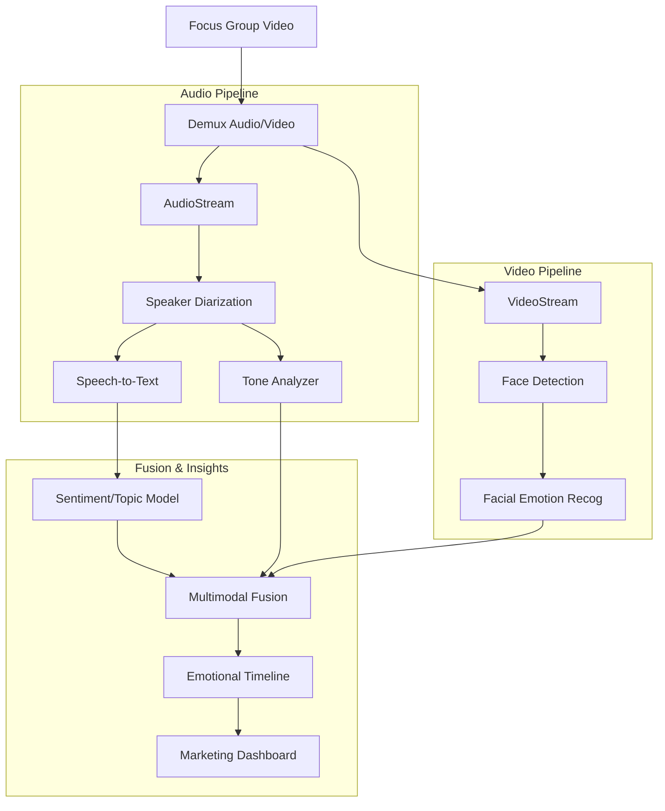
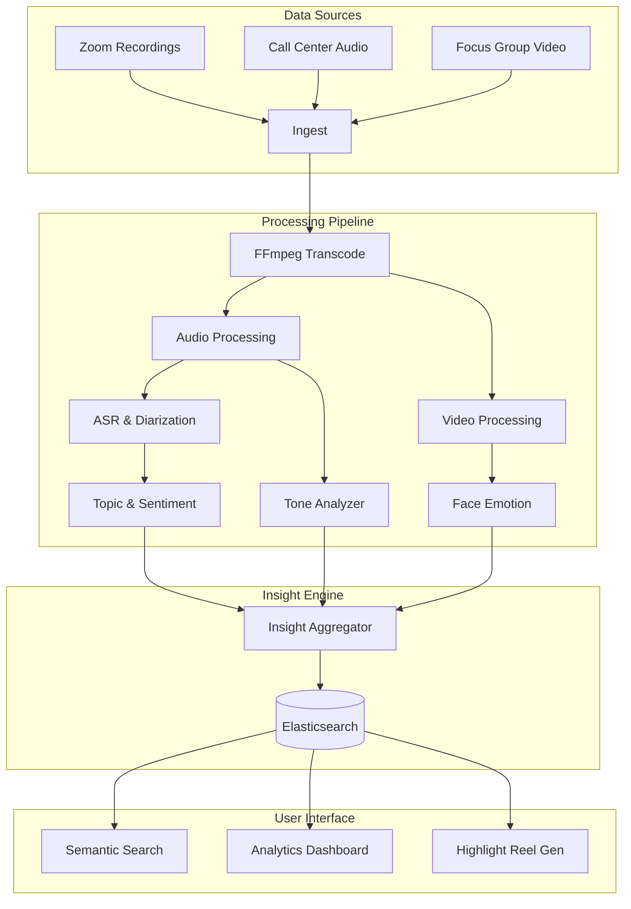

# ML Use Case Analysis: Marketing & Advertising Speech Analysis

**Analysis Date**: November 2025  
**Category**: Speech Analysis  
**Industry**: Marketing & Advertising  
**Articles Analyzed**: 4 (Zoom Info, VoiceBase, InMoment, Enthu.ai)

---

## PART 1: USE CASE OVERVIEW

### 1.1 Basic Information

**Category**: Speech Analysis  
**Industry**: Marketing & Advertising  
**Companies**: ZoomInfo (Chorus), VoiceBase, InMoment, Enthu.ai  
**Years**: 2023-2025  
**Tags**: Focus Groups, Voice of Customer (VoC), Sentiment Analysis, Emotion AI, Ad Testing

**Use Cases Analyzed**:
1.  [ZoomInfo - Conversation Intelligence for Sales](https://www.zoominfo.com/solutions/conversation-intelligence)
2.  [InMoment - Voice of the Customer Analytics](https://inmoment.com/products/xi-platform/)
3.  [VoiceBase - Speech Analytics for Marketing](https://www.voicebase.com/)

### 1.2 Problem Statement

**What business problem are they solving?**

This category addresses **"Customer Truth"** and **"Campaign Resonance"**.

-   **Focus Groups**: "The Qualitative Bottleneck".
    -   *The Challenge*: Brands spend millions on focus groups. Analyzing 50 hours of video to find "that moment when they hated the logo" takes weeks of manual watching.
    -   *The Friction*: Human note-takers miss subtle cues. "I guess it's okay" said with a sigh means "I hate it". Text transcripts lose this.
    -   *The Goal*: Automated analysis of video/audio to quantify *emotional engagement*. "At minute 12:03, 80% of the group showed 'Confusion'".

-   **Voice of Customer (VoC)**: "The Silent Majority".
    -   *The Challenge*: Surveys have low response rates (<2%). The *real* feedback is in the millions of support calls and sales demos happening every day.
    -   *The Friction*: Marketing teams are disconnected from the Call Center. They don't hear the customer saying "Your pricing is confusing".
    -   *The Goal*: Mine the "Dark Data" of spoken interactions to find product insights and competitive intelligence ("They mentioned our competitor 500 times today").

**What makes this problem ML-worthy?**

1.  **Multimodal Emotion**: Marketing cares about *how* you feel. This requires fusing **Facial Expression Analysis** (Computer Vision) with **Voice Prosody** (Speech) and **Text Sentiment** (NLP).
2.  **Unsupervised Topic Modeling**: You don't know what you're looking for. You need the model to *discover* that "Battery Life" is a trending complaint this week.
3.  **Speaker Diarization in Groups**: In a focus group of 10 people, knowing *who* said "I love it" (the target demographic or the outlier?) is critical.

---

## PART 2: SYSTEM DESIGN DEEP DIVE

### 2.1 High-Level Architecture

**Multimodal Focus Group Analyzer**:

### Tech Stack Identified

| Component | Technology/Tool | Purpose | Company |
|-----------|----------------|---------|---------|
| **ASR** | Rev.ai / Google Speech | High-accuracy transcription | VoiceBase |
| **Emotion AI** | Affectiva / Hume AI | Facial & Vocal emotion detection | InMoment |
| **Topic Modeling** | BERTopic / LDA | Discovering themes | ZoomInfo |
| **Diarization** | Pyannote.audio | Separating speakers in groups | Enthu.ai |
| **Visualization** | D3.js / Highcharts | Interactive "Sentiment Waves" | All |

### 2.2 Data Pipeline

**Ingestion**:
-   **Sales Calls**: Integration with Zoom/Gong to pull recordings automatically.
-   **Focus Groups**: Upload of massive 4K video files.
-   **Social Audio**: Ingesting Podcasts/TikToks where the brand is mentioned.

**Preprocessing**:
-   **Audio Normalization**: Focus groups have bad mics. Some people whisper, some shout. Dynamic Range Compression is essential.
-   **Crosstalk Removal**: In excited groups, everyone talks at once. Source Separation models try to isolate the dominant speaker.

### 2.3 Feature Engineering

**Key Features**:

-   **Valence & Arousal**:
    -   *Valence*: Positive vs Negative (Happy vs Sad).
    -   *Arousal*: High Energy vs Low Energy (Excited vs Bored).
    -   *Marketing Gold*: High Arousal + High Valence = "Viral Potential".
-   **Keyword Context**:
    -   "Price" mentioned with "High Arousal" (Anger) vs "Price" with "Low Arousal" (Resignation).

### 2.4 Model Architecture

**Topic Modeling (BERTopic)**:
-   **Embeddings**: SBERT to convert sentences to vectors.
-   **Dimensionality Reduction**: UMAP to squeeze vectors to 2D.
-   **Clustering**: HDBSCAN to find dense clusters of similar sentences.
-   **Representation**: c-TF-IDF to extract keywords for each cluster.
-   **Result**: "Cluster 5: Battery, Drain, Charge, Power".

**Emotion Fusion**:
-   **Late Fusion**: Train separate models for Audio (Tone) and Video (Face). Average their predictions.
-   **Why?**: Robustness. If the person covers their face, Audio still works. If the audio is noisy, Face still works.

---

## PART 3: MLOPS & INFRASTRUCTURE

### 3.1 Model Deployment & Serving

**Batch Processing**:
-   Marketing analysis is rarely real-time. It's "Overnight Batch".
-   **Pipeline**: Airflow DAGs orchestrate the download -> transcode -> transcribe -> analyze workflow.
-   **Cost Optimization**: Run on Spot Instances (AWS) since latency doesn't matter.

### 3.2 Privacy & Security

**GDPR & Consent**:
-   **Focus Groups**: Participants sign waivers.
-   **Sales Calls**: "This call is being recorded".
-   **Anonymization**: Before sharing the "Voice of Customer" report with the Engineering team, the ML pipeline must strip PII (Names, Phone Numbers) so engineers focus on the *problem*, not the *person*.

### 3.3 Monitoring & Observability

**Drift Detection**:
-   **Topic Drift**: Last month "Price" was the #1 topic. This month it's "Bugs". The dashboard must highlight this shift immediately.
-   **Sentiment Baseline**: If the global sentiment drops by 10% overnight, did we launch a bad ad? Or did the ASR model break?

### 3.4 Operational Challenges

**Sarcasm & Irony**:
-   **Issue**: "Oh, great update, now nothing works."
-   **Text Model**: "Great update" -> Positive.
-   **Audio Model**: Flat tone -> Neutral.
-   **Solution**: **Contextual Transformers**. The model needs to see the *next* sentence ("now nothing works") to correct the sentiment of the first.

**Speaker Identification**:
-   **Issue**: In a Zoom call, "Speaker 1" might be the Sales Rep in one call, but the Customer in the next.
-   **Solution**: **Role Classification**. Train a model to identify "The person asking questions" (Customer) vs "The person giving answers" (Rep).

---

## PART 4: EVALUATION & VALIDATION

### 4.1 Offline Evaluation

**Human Annotation**:
-   Marketers watch a clip and rate it: "Excited", "Bored", "Angry".
-   **Cohen's Kappa**: Measure inter-annotator agreement. Emotion is subjective. If humans disagree, the model can't learn.

### 4.2 Online Evaluation

**A/B Testing Ads**:
-   Use the AI to select the "Most Emotional" 10-second clip from a 1-hour interview.
-   Run it as a Facebook Ad.
-   **Metric**: Click-Through Rate (CTR). If the AI-selected clip gets more clicks than the Human-selected clip, it works.

### 4.3 Failure Cases

-   **Cultural Differences**:
    -   *Failure*: A model trained on Americans thinks a loud/passionate Italian speaker is "Angry".
    -   *Fix*: **Cultural Calibration**. Norm the baseline energy level per speaker or per region.
-   **The "Polite" Customer**:
    -   *Failure*: British customers might use very polite language ("I'm a bit bothered") to express extreme rage.
    -   *Fix*: Region-specific sentiment lexicons.

---

## PART 5: KEY ARCHITECTURAL PATTERNS

### 5.1 Common Patterns

-   [x] **Multimodal Fusion**: Combining Face + Voice + Text for true emotion.
-   [x] **Unsupervised Discovery**: Using Clustering (BERTopic) to find unknown issues.
-   [x] **Role-Based Diarization**: Identifying "Who is the Buyer?" based on speech patterns.

### 5.2 Industry-Specific Insights

-   **Marketing**: **Storytelling**. The output cannot be a CSV. It must be a "Highlight Reel". The AI generates a video montage of "Every time a customer smiled".
-   **Sales**: **Coaching**. The AI tells the Rep: "You talked for 80% of the call. Listen more." (Talk-to-Listen Ratio).

---

## PART 6: LESSONS LEARNED & TAKEAWAYS

### 6.1 Technical Insights

1.  **Video is Heavy**: Processing 4K video for face detection is expensive. **Keyframe Extraction** (analyzing 1 frame per second) captures 90% of the value at 1% of the cost.
2.  **Audio Quality is the Bottleneck**: You can't analyze tone if the audio is clipped or compressed. Invest in better recording software (VoIP) before better models.

### 6.2 Operational Insights

1.  **Democratize Data**: Don't lock VoC data in the Marketing department. Give Product Managers access to the "Searchable Database of Pain".
2.  **The "Why" Matters**: Sentiment Score is a vanity metric. "Why is it low?" is the actionable insight. Always pair Score with Topics.

---

## PART 7: REFERENCE ARCHITECTURE

### 7.1 System Diagram (VoC Platform)

### 7.2 Estimated Costs
-   **Compute**: Moderate. Video processing is the main cost driver.
-   **Storage**: High. Storing video is expensive. Most platforms delete video after 90 days and keep only metadata/transcripts.
-   **Team**: Data Science + Frontend Visualization experts.

### 7.3 Team Composition
-   **Computer Vision Engineers**: 2 (Face/Video).
-   **NLP Engineers**: 2-3 (Topic Modeling).
-   **Full Stack Engineers**: 3-4 (Building the Dashboard/Video Player).

---

*Analysis completed: November 2025*
