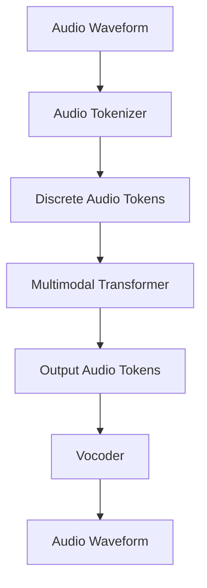

# ML Use Case Analysis: Tech Voice Assistants & Edge AI

**Analysis Date**: November 2025  
**Category**: Speech Analysis  
**Industry**: Tech  
**Articles Analyzed**: 4 (Apple, OpenAI, Google, Picovoice)

---

## PART 1: USE CASE OVERVIEW

### 1.1 Basic Information

**Category**: Speech Analysis  
**Industry**: Tech  
**Companies**: Apple (Siri), OpenAI (Voice Mode), Google (Assistant), Picovoice  
**Years**: 2023-2025  
**Tags**: Wake Word Detection, On-Device ASR, Edge AI, Multimodal LLMs, Latency Optimization

**Use Cases Analyzed**:
1.  [Apple - Siri On-Device Architecture](https://machinelearning.apple.com/research/siri-on-device)
2.  [OpenAI - GPT-4o Voice Mode](https://openai.com/index/gpt-4o/)
3.  [Picovoice - Porcupine Wake Word Engine](https://picovoice.ai/platform/porcupine/)

### 1.2 Problem Statement

**What business problem are they solving?**

This category addresses **"Ubiquitous Interaction"** and **"Privacy"**.

-   **Voice Assistants**: "Hands-Free Computing".
    -   *The Challenge*: Users want to control devices while driving, cooking, or walking.
    -   *The Friction*: Cloud latency makes conversation feel unnatural (the "awkward pause"). Privacy concerns ("Is Alexa listening?").
    -   *The Goal*: An assistant that responds instantly (<500ms), works offline, and respects privacy.

-   **Wake Word Detection**: "The Always-On Gatekeeper".
    -   *The Challenge*: The device must listen 24/7 but consume near-zero battery.
    -   *The Friction*: False Positives (waking up randomly) are annoying. False Negatives (shouting "Hey Siri" 3 times) are frustrating.
    -   *The Goal*: High-accuracy trigger detection running on a DSP (Digital Signal Processor) with microwatts of power.

**What makes this problem ML-worthy?**

1.  **Resource Constraints**: Running ASR on an Apple Watch or a Thermostat. You have KB of RAM, not GB.
2.  **Latency**: Human conversation gap is ~200ms. Cloud round-trips are 1s+. ML must run locally to feel "real".
3.  **Multimodality (GPT-4o)**: Processing Audio *directly* (Audio-in, Audio-out) without converting to text first. This preserves emotion, laughter, and singing.

---

## PART 2: SYSTEM DESIGN DEEP DIVE

### 2.1 High-Level Architecture

**Hybrid Voice Architecture (Siri/Google)**:
```mermaid
graph TD
    Mic[Microphone] --> DSP[DSP Chip]
    
    subgraph "Always-On Low Power"
        DSP --> WakeWord[Wake Word Model (Tiny)]
        WakeWord -- "Triggered" --> AP[Application Processor (CPU)]
    end
    
    subgraph "On-Device Processing"
        AP --> ASR[Local ASR Model]
        ASR --> NLU[Local NLU (Intent)]
        
        NLU -- "Simple Task (Timer)" --> Action[Execute Local]
        NLU -- "Complex Task (Search)" --> Cloud[Cloud Orchestrator]
    end
    
    subgraph "Cloud Processing"
        Cloud --> BigASR[Server ASR]
        Cloud --> BigLLM[LLM / Knowledge Graph]
        BigLLM --> Response
    end
    
    Action & Response --> TTS[Text-to-Speech]
    TTS --> Speaker
```

**End-to-End Multimodal (GPT-4o)**:


### Tech Stack Identified

| Component | Technology/Tool | Purpose | Company |
|-----------|----------------|---------|---------|
| **Wake Word** | CNN / CRNN (Tiny) | Trigger Detection | Apple, Picovoice |
| **Edge ASR** | RNN-T / Conformer (Quantized) | Local Speech-to-Text | Google, Apple |
| **Multimodal** | Audio-Token Transformers | End-to-End Speech | OpenAI |
| **Hardware** | Neural Engine (ANE) / DSP | Hardware Acceleration | Apple |
| **Inference** | TensorFlow Lite / CoreML | Edge Inference | Google, Apple |

### 2.2 Data Pipeline

**Wake Word Training**:
-   **Data**: Millions of "Hey Siri" utterances in every accent, pitch, and noise condition (car, shower, party).
-   **Negative Data**: Thousands of hours of "background speech" (TV, radio, conversations) that *don't* contain the wake word. Crucial for reducing False Positives.

**Audio Tokenization (OpenAI)**:
-   Instead of Mel-spectrograms, they learn a **Discrete Codebook** (VQ-VAE).
-   Audio is sliced into tokens. "Hello" might be tokens `[42, 105, 88]`.
-   This allows the LLM to predict audio tokens just like text tokens.

### 2.3 Feature Engineering

**Key Features**:

-   **MFCCs (Mel-Frequency Cepstral Coefficients)**: Standard for Wake Words. Represents the shape of the vocal tract.
-   **Filter Banks**: Raw frequency energy bins.
-   **Context**: For Edge ASR, "Personalization" is a feature. The model knows your contacts ("Call Mom") and biases the beam search towards those names.

### 2.4 Model Architecture

**Wake Word (Cascaded)**:
-   **Stage 1 (DSP)**: Tiny HW-based detector. Very low power, high False Positive rate. Wakes up the main CPU.
-   **Stage 2 (CPU)**: Larger CNN model. Verifies the trigger. High accuracy.
-   **Stage 3 (Cloud/OS)**: Biometric verification ("Is this *my* user?").

**Edge ASR (RNN-Transducer)**:
-   **Encoder**: Conformer (CNN + Transformer) to process audio frames.
-   **Predictor**: LSTM/GRU to model language context.
-   **Joint Network**: Combines acoustic and language signals.
-   **Streaming**: Processes audio frame-by-frame. No waiting for end-of-utterance.

---

## PART 3: MLOPS & INFRASTRUCTURE

### 3.1 Model Deployment & Serving

**Quantization**:
-   **FP32 -> Int8**: Mandatory for Edge AI. Reduces model size by 4x.
-   **Pruning**: Removing neurons that don't contribute to accuracy.
-   **Apple CoreML**: Compiles the model to run specifically on the Apple Neural Engine (ANE) for max efficiency.

**Privacy-Preserving Learning**:
-   **Federated Learning**: The model improves on your device. Only the *weight updates* (gradients) are sent to the cloud, aggregated, and sent back. Your voice recordings never leave the phone.

### 3.2 Privacy & Security

**On-Device Processing**:
-   Apple processes audio locally by default.
-   **Visual Indicators**: Green/Orange dot on screen when mic is active.
-   **Hardware Mute**: Physical switch on smart speakers to disconnect the mic circuit.

### 3.3 Monitoring & Observability

**Metrics**:
-   **False Acceptance Rate (FAR)**: "How many times per day does it wake up randomly?" (Target: <1 per month).
-   **False Rejection Rate (FRR)**: "How often does it ignore me?"
-   **Latency**: Time from "End of Speech" to "Action".

### 3.4 Operational Challenges

**The "Cocktail Party Problem"**:
-   **Issue**: Separating the user's voice from background noise/voices.
-   **Solution**: **Blind Source Separation**. Using microphone arrays (multiple mics) and beamforming to spatially filter audio.

**Battery Drain**:
-   **Issue**: Listening requires power.
-   **Solution**: **Duty Cycling**. The mic wakes up for 10ms every 100ms to check for energy. If silence, sleep.

---

## PART 4: EVALUATION & VALIDATION

### 4.1 Offline Evaluation

**Room Simulators**:
-   Instead of recording in real rooms, use **RIRs (Room Impulse Responses)** to convolve clean speech with "Reverb" and "Noise".
-   Create synthetic datasets: "Clean 'Hey Siri' + Kitchen Noise + Reverb".

### 4.2 Online Evaluation

**Cookie-Drop Testing**:
-   Deploy a new Wake Word model to 1% of devices in "Shadow Mode".
-   If the Shadow model triggers but the user didn't speak (user didn't interact), it's a False Positive.

### 4.3 Failure Cases

-   **Media Triggers**:
    -   *Failure*: TV commercial says "Alexa". Millions of devices wake up.
    -   *Fix*: **Acoustic Fingerprinting**. The cloud knows the "fingerprint" of the commercial's audio and tells devices to ignore it.
-   **Whispering**:
    -   *Failure*: Wake word models trained on normal speech fail on whispers.
    -   *Fix*: Augment training data with whispered speech.

---

## PART 5: KEY ARCHITECTURAL PATTERNS

### 5.1 Common Patterns

-   [x] **Cascaded Wake Up**: DSP -> CPU -> Cloud. Increasing complexity, decreasing power efficiency.
-   [x] **On-Device Personalization**: Biasing ASR towards user's contacts/apps.
-   [x] **Audio Tokenization**: Treating audio as a language (GPT-4o).

### 5.2 Industry-Specific Insights

-   **Tech**: **Ecosystem Lock-in**. Siri works best with Apple Music. Assistant with YouTube. The voice assistant is the "Operating System" of the future.
-   **Hardware/Software Co-design**: You can't build a good wake word engine without controlling the microphone hardware and DSP.

---

## PART 6: LESSONS LEARNED & TAKEAWAYS

### 6.1 Technical Insights

1.  **End-to-End is the Future**: GPT-4o proves that converting Audio->Text->LLM->Text->Audio loses too much information (emotion, tone). Direct Audio->Audio is superior for expressiveness.
2.  **Edge is Hard**: You fight for every kilobyte of RAM. Model compression is an art form.

### 6.2 Operational Insights

1.  **Privacy is a Feature**: "What happens on your iPhone stays on your iPhone" is a major selling point.
2.  **Latency Kills Flow**: If the assistant takes 2 seconds to respond, the user pulls out their phone. Speed is the primary UX metric.

---

## PART 7: REFERENCE ARCHITECTURE

### 7.1 System Diagram (Smart Speaker)

```mermaid
graph TD
    subgraph "Hardware Layer"
        MicArray[Mic Array (4-7 mics)] --> Beamformer[Beamforming DSP]
        Beamformer --> AEC[Acoustic Echo Cancellation]
    end

    subgraph "Edge Layer (Device)"
        AEC --> VAD[Voice Activity Detect]
        VAD --> WakeWord[Wake Word Engine]
        
        WakeWord -- "Trigger" --> Buffer[Audio Buffer]
        Buffer --> EdgeASR[Edge ASR]
        EdgeASR --> EdgeNLU[Edge NLU]
    end

    subgraph "Cloud Layer"
        Buffer -- "Stream (if needed)" --> CloudASR
        CloudASR --> CloudNLU
        CloudNLU --> Skill[Skill / Action]
        Skill --> NLG
        NLG --> TTS
    end

    TTS -- "Audio Stream" --> Speaker
```

### 7.2 Estimated Costs
-   **Compute**: Low (Offloaded to user device). Cloud costs only for complex queries.
-   **Data**: High. Collecting diverse speech data is expensive.
-   **Hardware**: Custom silicon (DSP/ANE) is a massive upfront R&D cost.

### 7.3 Team Composition
-   **Audio DSP Engineers**: 3-4 (Beamforming, AEC).
-   **Embedded ML Engineers**: 4-5 (Quantization, C++).
-   **Cloud Backend**: 3-4 (Orchestration).

---

*Analysis completed: November 2025*
