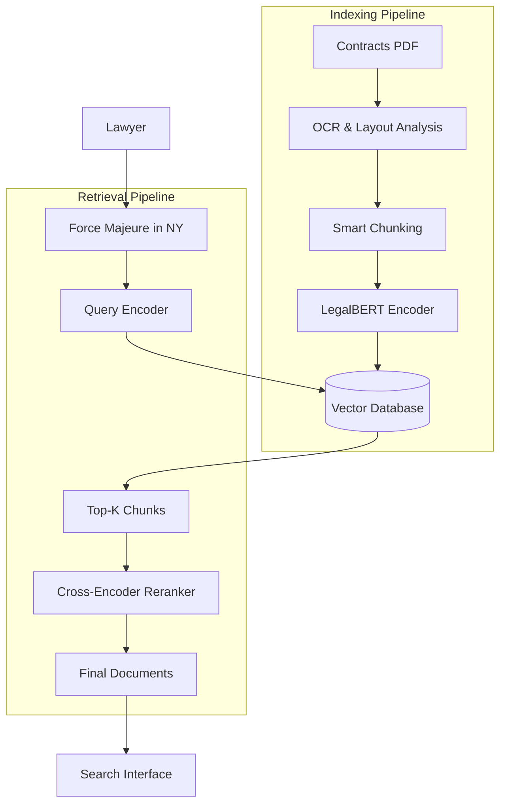
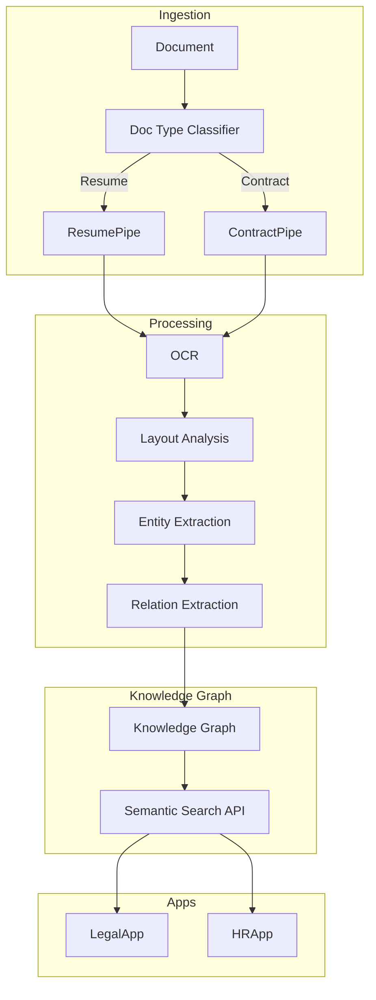

# ML Use Case Analysis: Professional Services AI (Legal, HR, Government)

**Analysis Date**: November 2025  
**Category**: Professional Services AI  
**Industry**: Legal, HR, Government  
**Articles Analyzed**: 4 (iManage, RChilli, DocSumo, Monash University)

---

## PART 1: USE CASE OVERVIEW

### 1.1 Basic Information

**Category**: Professional Services AI  
**Industry**: Legal, HR, Government  
**Companies**: iManage, RChilli, DocSumo, Affinda, GovTech Agencies  
**Years**: 2023-2025  
**Tags**: Semantic Search, Resume Parsing, Named Entity Recognition (NER), Policy Analysis, Document Intelligence

**Use Cases Analyzed**:
1.  [iManage - Legal Search & Knowledge Management](https://imanage.com/)
2.  [RChilli - Resume Parsing & Matching](https://www.rchilli.com/)
3.  [GovTech - Policy Analysis with NLP](https://www.tech.gov.sg/)

### 1.2 Problem Statement

**What business problem are they solving?**

This category addresses **"Information Overload"** and **"Process Automation"**.

-   **Legal**: "The Needle in the Haystack".
    -   *The Challenge*: A law firm has 10 million documents (contracts, briefs, emails). A lawyer needs to find "Precedents for Force Majeure in Construction contracts in NY".
    -   *The Friction*: Keyword search fails. "Force Majeure" might be phrased as "Act of God" or "Unforeseeable Circumstances".
    -   *The Goal*: **Semantic Search**. Understanding the *intent* of the query and retrieving conceptually relevant documents, even if the keywords don't match.

-   **HR**: "The Resume Flood".
    -   *The Challenge*: A job posting gets 1000 applicants. 90% are unqualified. Recruiters spend 10 seconds per resume.
    -   *The Friction*: Resumes come in PDF, Word, Image. Formats vary wildly.
    -   *The Goal*: **Resume Parsing**. Automatically extracting structured data (Skills, Experience, Education) from unstructured documents and matching them to the Job Description (JD).

-   **Government**: "The Policy Maze".
    -   *The Challenge*: Analyzing thousands of public comments on a new regulation. Identifying conflicting policies across agencies.
    -   *The Friction*: Manual reading is impossible at scale.
    -   *The Goal*: **Policy NLP**. Automating the synthesis of public feedback and detecting regulatory conflicts.

**What makes this problem ML-worthy?**

1.  **Unstructured Data**: 80% of enterprise data is text/PDF. It's messy, unformatted, and noisy.
2.  **Domain Specificity**: Legal English ("Legalese") is different from normal English. HR documents have unique entities ("Python" is a skill, not a snake).
3.  **High Precision**: In Legal, missing a relevant document is malpractice. Recall must be near 100%.

---

## PART 2: SYSTEM DESIGN DEEP DIVE

### 2.1 High-Level Architecture

**Legal Semantic Search**:


**HR Resume Matching**:
```mermaid
graph TD
    Resume[Resume PDF] --> Parser[Resume Parser]
    JD[Job Description] --> ParserJD[JD Parser]
    
    subgraph "Parsing Engine"
        Parser --> NER[Skill/Edu Extraction]
        NER --> Standardization[Taxonomy Mapping]
        Standardization --> Profile[Structured JSON]
    end
    
    subgraph "Matching Engine"
        Profile --> Matcher[Vector Matcher]
        ParserJD --> Matcher
        Matcher --> Score[Fit Score (0-100)]
    end
    
    Score --> Dashboard[Recruiter Dashboard]
```

### Tech Stack Identified

| Component | Technology/Tool | Purpose | Company |
|-----------|----------------|---------|---------|
| **OCR** | Tesseract / Azure Form Rec | Text Extraction | DocSumo |
| **Embedding** | LegalBERT / SBERT | Domain-specific vectors | iManage |
| **Vector DB** | Milvus / Pinecone | Similarity Search | Legal Tech |
| **NER** | SpaCy / HuggingFace | Entity Extraction | RChilli |
| **Orchestration** | Airflow / Celery | Document Pipelines | All |

### 2.2 Data Pipeline

**Document Ingestion**:
-   **Layout Analysis**: Understanding that text in the top right is a "Date" and text in the center is a "Title".
-   **Table Extraction**: Legal contracts are full of tables. Parsing them into structured data (CSV) is critical.

**Taxonomy Standardization (HR)**:
-   **Problem**: Candidate writes "ReactJS", "React.js", "React".
-   **Solution**: **Skill Taxonomy**. Mapping all variants to a canonical ID: `Skill_1024 (React)`.
-   **Ontology**: Understanding that "PyTorch" implies "Python".

### 2.3 Feature Engineering

**Key Features**:

-   **Entity Density**: How many times does "Java" appear in the "Experience" section vs the "Skills" section? (Experience > Keywords).
-   **Citation Graph**: In Legal, if Document A cites Document B, they are related. PageRank for Case Law.
-   **Recency**: In HR, "Java" used in 2025 is more valuable than "Java" used in 2010.

### 2.4 Model Architecture

**Bi-Encoder vs Cross-Encoder (Search)**:
-   **Bi-Encoder**: Fast. Pre-computes vectors. Used for retrieving the Top-100 candidates.
-   **Cross-Encoder**: Slow but Accurate. Takes (Query, Document) pairs and outputs a similarity score. Used to re-rank the Top-100 for the final Top-10.

**Named Entity Recognition (NER)**:
-   **Architecture**: BERT-CRF (Conditional Random Field).
-   **Task**: Label tokens as `B-SKILL`, `I-SKILL`, `B-EDU`, `I-EDU`.
-   **Challenge**: Nested Entities. "University of Texas at Austin" contains "Texas" (Location) inside "University..." (Organization).

---

## PART 3: MLOPS & INFRASTRUCTURE

### 3.1 Model Deployment & Serving

**Hybrid Search**:
-   **Concept**: Combine Vector Search (Semantic) with Keyword Search (BM25).
-   **Why?**: Vector search is bad at exact matches (e.g., Case Number "12-345"). Keyword search is good at that.
-   **Implementation**: Elasticsearch / OpenSearch supports hybrid queries.

**Privacy-Preserving Parsers**:
-   **HR**: PII Redaction (Blind Hiring). Removing Name, Gender, Ethnicity from the resume before the hiring manager sees it to reduce bias.

### 3.2 Privacy & Security

**Data Residency**:
-   **Legal/Gov**: Data often cannot leave the country (GDPR, FedRAMP).
-   **Solution**: On-premise deployment or "Sovereign Cloud" regions.

**Access Control (ACLs)**:
-   **Search**: The search engine must respect document permissions. If User A cannot see Document X, it should not appear in search results, even if it matches.
-   **Implementation**: Filtering search results *after* retrieval based on User Groups.

### 3.3 Monitoring & Observability

**Search Quality**:
-   **Click-Through Rate (CTR)**: Position 1 vs Position 10.
-   **Zero Results Rate**: Queries that returned nothing. (Indicates content gaps or vocabulary mismatch).

**Bias Monitoring (HR)**:
-   **Metric**: **Disparate Impact**. Is the model recommending Men at a higher rate than Women for "Engineer" roles?
-   **Audit**: Regular audits of the ranking algorithm.

### 3.4 Operational Challenges

**OCR Quality**:
-   **Issue**: Scanned PDFs from the 1990s. Blurry, coffee stains.
-   **Solution**: **Post-OCR Correction**. NLP models that fix spelling errors ("C0ntract" -> "Contract") based on context.

**Long Documents**:
-   **Issue**: Legal briefs are 100 pages. BERT limit is 512 tokens.
-   **Solution**: **Sliding Window** or **Longformer**. Chunking the document and aggregating the scores.

---

## PART 4: EVALUATION & VALIDATION

### 4.1 Offline Evaluation

**NDCG (Normalized Discounted Cumulative Gain)**:
-   Standard metric for search ranking.
-   Requires a "Golden Set" of (Query, Relevant Documents) pairs created by expert lawyers.

**F1-Score (NER)**:
-   For Resume Parsing. Did we extract "Google" as an Employer and not a Skill?

### 4.2 Online Evaluation

**A/B Testing**:
-   Test Model A (BM25) vs Model B (Hybrid).
-   **Metric**: "Time to Success". How long did it take the lawyer to download a document?

### 4.3 Failure Cases

-   **The "Not" Problem**:
    -   *Failure*: Query "Contracts NOT involving Apple". Vector search ignores "NOT" and returns contracts *with* Apple.
    -   *Fix*: **Boolean Logic Layer**. Handle negations with explicit filters, not vectors.
-   **Keyword Stuffing**:
    -   *Failure*: Candidate puts "Java" 100 times in white text.
    -   *Fix*: **Visual Rendering**. The parser renders the PDF to see if the text is visible.

---

## PART 5: KEY ARCHITECTURAL PATTERNS

### 5.1 Common Patterns

-   [x] **RAG (Retrieval-Augmented Generation)**: Using the retrieved legal docs to answer questions ("Summarize the indemnity clause").
-   [x] **Hybrid Search**: BM25 + Dense Vectors.
-   [x] **Taxonomy Mapping**: Normalizing messy user input to a clean ontology.

### 5.2 Industry-Specific Insights

-   **Legal**: **Provenance**. You cannot just give an answer. You must cite the *exact paragraph* in the contract.
-   **Government**: **Transparency**. "Black Box" models are often banned. You need Explainable AI (XAI).

---

## PART 6: LESSONS LEARNED & TAKEAWAYS

### 6.1 Technical Insights

1.  **Domain Adaptation is Mandatory**: A BERT model trained on Wikipedia is useless for Legal contracts. You must pre-train on your own corpus (LegalBERT).
2.  **Structure Matters**: In resumes, the *layout* (bold text, indentation) carries meaning. Plain text extraction loses this. Use LayoutLM.

### 6.2 Operational Insights

1.  **The "Human in the Loop"**: AI doesn't hire people. It ranks them. The recruiter always makes the final call.
2.  **Feedback Loops**: Every time a lawyer clicks a document, the ranking model should learn.

---

## PART 7: REFERENCE ARCHITECTURE

### 7.1 System Diagram (Intelligent Document Processing)



### 7.2 Estimated Costs
-   **Compute**: Moderate. OCR is expensive. Vector search is cheap.
-   **Storage**: High. Storing millions of PDFs + Indexes.
-   **Team**: NLP heavy.

### 7.3 Team Composition
-   **NLP Engineers**: 3-4 (Transformers, Search).
-   **Data Engineers**: 2-3 (ETL pipelines).
-   **Domain Experts**: 1-2 (Lawyers/Recruiters) for labeling.

---

*Analysis completed: November 2025*
