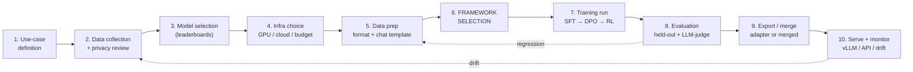

# CS-03 — The Fine-Tuning Framework Landscape (Top 10, 2025)

| Field | Value |
|---|---|
| **Module** | Tooling / Ecosystem Selection |
| **Source video(s)** | `LLM Fine-Tuning 04: Top 10 LLM Fine-Tuning Frameworks for 2025 \| Best Tools for Finetuning AI Agents` |
| **Transcript file(s)** | `LLM_Fine-Tuning_04_Top_10_LLM_Fine-Tuning_Frameworks_for_2025_Best_Tools_for_Fin.txt` |
| **Companion code** | `LLM Fine-Tuning-04\` contains only a PDF deck (no notebook). Config artefacts borrowed from `LLM Fine-Tuning-17-Llama-Factory\train_gemma_qlora.yaml`, `LLM Fine-Tuning-19-Axolotl\axolotal-config\*.yaml`, `LLM Fine-Tuning-18-unsloth\unsloth_practical.ipynb` |
| **Prerequisites** | CS-01 (LLM lifecycle), CS-02 (transfer learning), CS-13 §6.8 + CS-11 §4.11 (LoRA/QLoRA) |
| **Difficulty** | Beginner → Intermediate (the material is introductory; the added production sections are Intermediate/Advanced) |
| **Hands-on required** | No for the video itself; **Yes** if you want the decision tree to be trustworthy — install two frameworks and run the same 5k-example SFT job twice |
| **Estimated study time** | 3h theory + 6h practical (2 frameworks × SFT + DPO) |

---

## 0. Executive Summary

- The video is a **map, not a manual**. Sunny Savita names ten frameworks plus a set of "optional" ones, tells you which tier to learn first, and admits his own comparison table is directional: *"this could be or this could not be 100% correct but again guys if you're going to explore at least … you will get a better idea"* `[47:28]`.
- His **learning priority order** is explicit and worth memorising as a syllabus: tier 1 = **Hugging Face, DeepSpeed, LLaMA-Factory, Unsloth**; tier 2 = **Axolotl, ColossalAI, LightLLM/LitGPT**; tier 3 = **OpenLLM, FastChat, SkyPilot** `[29:35]`–`[30:41]`, restated in the summary `[46:13]`–`[46:33]`.
- His single most important structural insight: **most of these are not competitors at the same layer.** DeepSpeed is a parallelism library *inside* the others `[3:49]`, FSDP is a PyTorch-native sharding strategy *referenced by* the others `[9:23]`, and the four "tier 3" entries (OpenLLM, FastChat, SkyPilot) are **serving and orchestration** tools, not trainers at all `[19:59]`–`[21:04]`.
- The framework-to-goal matrix he walks through is a **12-goal grid** (G1…G12) with a four-symbol legend: ✓ = fully supported, ✓✓ = industry best for that goal, △ = possible but needs effort / not a primary goal, ✗ = not supported `[25:02]`–`[25:19]`.
- His headline framework numbers: **Unsloth claims "fine-tuning Qwen, Llama, Gemma … 2× faster with 80% less VRAM"** `[10:48]`–`[10:54]`, and he quotes sub-claims of *"2.2× faster", "1.5× faster", "70% less memory", "80% less", "60% less"* `[11:13]`–`[11:31]` — **all single-GPU QLoRA measurements**, which he does not qualify.
- **LLaMA-Factory** he calls *"a one-stop solution in your fine-tuning journey"* `[9:47]`, names Amazon and NVIDIA as users `[8:20]`, and it is the only trainer he names that ships a **WebUI** (`llamafactory-cli webui`).
- The video's second half is not about frameworks at all: it's an **enterprise-expectations checklist** (13 points, `[42:07]`–`[45:59]`) and a **resource list** (3 leaderboards, 3 GitHub awesome-lists, ~15 papers). He tells you plainly these are interview ammunition: *"so that you can answer in an interview in a better way"* `[41:17]`–`[41:19]`.
- The one sentence to take to an interview: **framework choice barely matters below ~7B single-GPU; above ~13B, or the moment you need FSDP/ZeRO, TP, or a rollout engine for RL, it decides whether your job runs at all.** See §13.4.
- The transcript is **2025-era and already partly wrong**: it conflates LitGPT with LightLLM, calls SkyPilot/FastChat/OpenLLM fine-tuning frameworks, uses LLaMA-1-era 13B/65B sizing, and its matrix has no column for GRPO, FSDP2, Megatron, or vLLM rollouts. Corrections are inline throughout.

> **Rule of thumb from this module:** pick exactly **two** frameworks — one *learning* framework (HF `transformers`+`trl`+`peft`, where you see every tensor) and one *production* framework (LLaMA-Factory for breadth/UI, Axolotl for YAML-at-scale, or Unsloth for single-GPU speed). Everything else in this landscape is either a component of those two, a serving layer, or a cloud scheduler.

---

## 1. The Problem This Solves

### 1.1 What breaks without this

A team with a fine-tuning task and no framework map burns its budget on the wrong four decisions, in this order:

1. **Wrong layer.** They adopt "SkyPilot" or "FastChat" expecting a trainer and get a Kubernetes job launcher and a chat-serving stack. The video actively invites this mistake by filing them under "framework" `[19:59]`–`[21:04]`.
2. **Wrong scale assumption.** They prototype with a single-GPU-optimised stack (Unsloth) and then discover that the 70B DPO run they promised does not scale out on it, forcing a rewrite at the worst possible time.
3. **Wrong memory plan.** They pick a framework with no first-class QLoRA path, then lose a week to hand-rolling `bitsandbytes` config.
4. **Wrong exit.** They train inside a framework that produces a non-standard checkpoint, then cannot merge the adapter back into a deployable model, or cannot move the LoRA to `vLLM` for serving.

### 1.2 The state of the art before this landscape existed

Before ~2022, "fine-tuning an LLM" meant writing your own training loop on top of `nn.Transformer` or `fairseq`/`Megatron-LM`, hand-writing a `Dataset` that produced `input_ids`/`labels`, and hand-rolling gradient accumulation, mixed precision, checkpoint sharding and distributed launch. A 7B LoRA run required roughly 300–600 lines of bespoke code and did not transfer to the next model.

What changed:

| Era | Trainer | Adapter | Result |
|---|---|---|---|
| ≤2020 | `fairseq`, custom loops | full FT only | every paper re-implements training |
| 2021 | `transformers` `Trainer` | Adapters, Prefix-Tuning | fine-tuning becomes a 30-line script |
| 2022 | `peft` (LoRA) | LoRA | 7B fine-tune fits on one 24 GB card |
| 2023 | `trl` `SFTTrainer`, QLoRA | QLoRA | 65B fine-tune on one 48 GB card |
| 2024–25 | LLaMA-Factory / Axolotl / Unsloth | DPO/ORPO/GRPO | preference tuning becomes a YAML key |
| 2025–26 | veRL / OpenRLHF / ms-swift | GRPO / RLVR | RL post-training becomes a config |

### 1.3 The naive approach, and precisely why it fails

**Naive approach: "just use Hugging Face for everything."**

It works, and for a 7B QLoRA SFT it is genuinely the right answer. It fails in exactly four places:

| Failure | Mechanism | Symptom |
|---|---|---|
| Multi-node scale-out | `Trainer` + raw DDP replicates optimizer state on every rank; a 70B full-FT optimizer state is ~1.1 TB in fp32 | `torch.OutOfMemoryError` on rank 0 before step 1 |
| Throughput | Unfused `attention` + per-layer Python overhead; no fused cross-entropy, no fused RMSNorm | 40–60% MFU loss vs Unsloth/torchtune kernels |
| Preference/RL loops | `trl` gives you the algorithm but not the rollout engine; generation inside the training loop is the bottleneck | PPO/GRPO step time dominated by sampling, ~5–10× the SFT step |
| Model breadth | Chat-template and dataset-format plumbing differs per model family | silent truncation / wrong EOS / garbage outputs (§9.4) |

### 1.4 Concrete motivating example with numbers

A 4×A100-80GB node, target = DPO on a 70B model over 20k preference pairs, 2 epochs, seq len 2048.

| Stack | What happens | Wall clock | Verdict |
|---|---|---|---|
| HF `Trainer` + DDP, bf16, full FT | 70B × (2 + 2 + 4 + 8) bytes/param ≈ 1.12 TB of weights+grads+AdamW state per rank | OOM at load | impossible |
| HF `Trainer` + DeepSpeed ZeRO-3, full FT | 1.12 TB ÷ 4 ranks ≈ 280 GB/rank + activations → OOM on 80 GB | OOM | impossible |
| HF + DeepSpeed ZeRO-3 + CPU offload, QLoRA | fits, but 4-bit weights × ZeRO-3 gather per layer, PCIe-bound | ~70–110 h (est.) | possible, impractical |
| Axolotl + FSDP2 (or ZeRO-3) + QLoRA + FlashAttention-3 | fits, sharded optimiser, fused kernels | ~26–38 h (est.) | **this** |
| veRL / OpenRLHF + ZeRO-3 + vLLM rollout | same, plus 8–12× faster sampling | ~22–30 h (est.) | for online RL |

The point of the framework landscape is that **rows 1–2 are not slow, they are impossible**, and rows 3–5 differ by 3× in wall clock and ~$4–6k in GPU rental for a single experiment.

---

## 2. First-Principles Mental Model

### 2.1 The analogy

A fine-tuning framework is a **restaurant kitchen**.

- **The ingredients** are your base model, your dataset, and your GPU (CS-01, CS-02).
- **The recipe** is the training method: SFT, DPO, ORPO, GRPO, continued pretraining.
- **The framework** is the *kitchen layout* — where the stove is, how many burners, whether there is a walk-in fridge.
- **Parallelism libraries** (DeepSpeed, FSDP, ColossalAI) are the **gas main and the ventilation**: they are not on the menu, but no kitchen on the block works without them.
- **Serving stacks** (vLLM, OpenLLM, FastChat, TGI) are the **front of house / delivery**: what the customer touches. A great kitchen with no delivery window feeds nobody.
- **Orchestrators** (SkyPilot, Kubernetes, Slurm) are the **real-estate agent**: they find you a kitchen in whatever city has cheap gas today.

### 2.2 Where this analogy breaks

- A kitchen is one physical room; a fine-tuning "stack" is **layered**, and the same library appears at several layers. `transformers` is both the model-definition layer *and* (through `Trainer`) the loop layer; DeepSpeed is both a memory optimiser *and*, in `DeepSpeed-Chat`, a full RLHF trainer `[17:36]`. You cannot draw a clean org chart.
- Kitchens are substitutable; **checkpoints are not**. Replacing a stove costs a day. Replacing a trainer mid-project costs the reproducibility of everything you did before it, because the seed/loss/optimizer semantics differ frame to frame (§7, §14).
- The analogy implies the framework does the work. In reality, at small scale **the framework contributes <5% of the quality outcome**; the data contributes most of it (CS-13). At large scale the framework contributes <5% of quality *and* ~100% of feasibility. That asymmetry is the entire module.

### 2.3 The mechanism: three axes that actually separate these tools

Everything in this landscape is positioned along three axes. Learn these three and the 23-framework matrix collapses to a decision tree.

**Axis 1 — Abstraction level (how much code you write).**

```
less code  ◄───────────────────────────────────────────────►  more control
 hosted API        GUI/YAML            config+python        raw python
 OpenAI/Vertex/    LLaMA-Factory       Axolotl/LLaMA-       transformers +
 Bedrock/Together  WebUI, AutoTrain    Factory CLI,         trl + peft +
 /Predibase        ms-swift web-ui     torchtune YAML       accelerate/DeepSpeed
                                                           LitGPT/Lightning
```

**Axis 2 — Memory regime (how the parameters are held).**

| Regime | Weights | Optimizer | Fits |
|---|---|---|---|
| Full FT fp32 + AdamW | 4 B/param | 8 B/param | ≤1.5B/GPU |
| Full FT bf16 + AdamW | 2 B/param | 8 B/param | ≤3B/GPU |
| Full FT bf16 + 8-bit AdamW | 2 B/param | 2 B/param | ~7B/GPU |
| LoRA bf16 (no quant) | 2 B/param | ~0.08 B/param | ~7–13B/GPU |
| **QLoRA (NF4 + LoRA)** | **~0.5–0.55 B/param** | ~0.08 B/param | **~7B on 24 GB** |
| QLoRA + ZeRO-3 + offload | 0.5 B/param, sharded | sharded | 70B on 4×80 GB |

The framework's job is to make the regime in the last two rows *one config key*. That is the whole value proposition of QLoRA-era trainers.

**Axis 3 — Parallelism strategy (how the job spans GPUs).**

| Strategy | Shards what | Comm volume | When |
|---|---|---|---|
| **DDP** | nothing (replicates grads) | all-reduce grads, 1×/step | model fits with optimizer state on 1 GPU |
| **ZeRO-1/2/3** (DeepSpeed) | optimizer / +grads / +params | all-gather params per layer (ZeRO-3) | model fits only sharded |
| **FSDP1 / FSDP2** (PyTorch) | params+grads+optim, per-layer | all-gather per layer | same as ZeRO-3, native, simpler deps |
| **TP** (Megatron, HF `tp_plan`) | weight matrices | all-reduce per layer, high | single node, ≤8 GPUs, latency-bound |
| **PP** (Megatron, DeepSpeed) | layer ranges | point-to-point | multi-node, large depth |
| **CP / SP** (sequence parallel) | activations along seq | all-gather/reduce-scatter | long context (>8k) |

> **Where the three axes interact:** QLoRA and ZeRO-3 are *not* free together. 4-bit weights must be de-quantized to bf16 to be all-gathered, so you pay the de-quant cost per layer per step. FSDP2 + QLoRA has the same issue but with a cheaper communication schedule and CPU-offload support. This is the single most common "why is my multi-GPU QLoRA slower than my single-GPU QLoRA?" question (see §14, row 11).

---

## 3. Core Concepts — Exhaustive Glossary

| Term | Definition | Why it matters | Common confusion |
|---|---|---|---|
| **SFT** | Supervised fine-tuning on (prompt, response) pairs | The default first stage; CS-13 | Confused with "instruction tuning" as if it were a different mechanism — it is the same loss |
| **CPT** | Continued pretraining — next-token loss on raw unlabelled domain text | Domain adaptation (CS-12); changes the base, not the behaviour | Confused with SFT; CPT does not teach instruction-following |
| **PEFT** | Parameter-efficient fine-tuning: adapters, LoRA, prefix, prompt, IA³ | The `peft` library; makes 7B fit on consumer GPUs | "PEFT = LoRA" — LoRA is one of ~10 PEFT methods |
| **LoRA** | Low-rank update `ΔW = BA`, `B∈R^{d×r}`, `A∈R^{r×k}` | CS-13 §6.8; the default adapter | People think `r` is a quality dial; it is a capacity dial with sharp diminishing returns |
| **QLoRA** | LoRA on top of a 4-bit NF4 base model | The reason a 7B fine-tune fits in 24 GB | "QLoRA loses quality" — the base is 4-bit, the *adapter* trains in bf16 |
| **DoRA** | Weight-decomposed low-rank adaptation: magnitude + direction | +1–4 pts over LoRA at ~2× step cost | Assuming it is always better — it is not, for large `r` |
| **DPO** | Direct Preference Optimisation — closed-form preference loss, no reward model | CS-14 §4.6.3; the workhorse of alignment | "DPO = RLHF without PPO" is roughly right but DPO still needs an SFT reference model |
| **ORPO** | Odds-Ratio Preference Optimisation — SFT + preference in one loss | CS-14 §4.6.9; one-stage alignment | Believing you can skip SFT entirely; you generally cannot at small data |
| **GRPO** | Group Relative Policy Optimisation — PPO without a critic, group-normalised advantages | CS-14 §4.6.10; the default for reasoning RLVR in 2026 | Thinking it needs a reward model; verifiable rewards are enough |
| **PPO** | Proximal Policy Optimisation — the classic RLHF algorithm | CS-14 §4.6.1; still used when you need a learned RM | "PPO is dead" — it is *expensive*, not dead |
| **RM** | Reward model / outcome reward model | Needed for PPO and some GRPO variants | Confusing RM training with RM *inference* cost (it doubles rollout cost) |
| **DeepSpeed ZeRO** | Memory-partitioning of optimizer (1), gradients (2), parameters (3) | The reason 70B trains at all | "ZeRO = FSDP" — functionally close, different implementations and config surface |
| **FSDP** | Fully Sharded Data Parallel — PyTorch-native param/grad/optim sharding | FSDP1 = `FullyShardedDataParallel`; **FSDP2 = `fully_shard`, DTensor-based** | Using FSDP1 in 2026 for new code; FSDP2 is per-parameter and much better with QLoRA |
| **DTensor** | PyTorch distributed tensor abstraction underpinning FSDP2 and TP | Explains why FSDP2 has cleaner state-dict semantics | Thinking of it as user-facing; you mostly don't touch it |
| **TP / PP / CP / SP** | Tensor / pipeline / context / sequence parallelism | Required above ~32B or above ~8k context | Using TP on one slow interconnect node and blaming the framework |
| **FlashAttention** | IO-aware exact attention kernel (FA2/FA3) | 2–4× attention speedup, linear memory in seq len | "FlashAttention changes results" — it is exact, up to numerics |
| **Gradient checkpointing** | Recompute activations in backward instead of storing them | ~60–70% activation memory reduction for ~25–35% step slowdown | Assuming it is free; it is the single biggest step-time tax |
| **NF4** | 4-bit NormalFloat quantisation, information-theoretically optimal for normal weights | The QLoRA base format | Confused with GPTQ/AWQ, which are *post-training* quantisation for inference |
| **bitsandbytes** | Library providing 8-bit optimizers and `load_in_4bit`/`load_in_8bit` | Universal quantisation backend for HF/Axolotl/LLaMA-Factory | On Windows it barely works; Linux only in practice |
| **GPTQ / AWQ** | Post-training weight-only quantisation for **inference** | CS-10/CS-11; not a training format | Trying to train into a GPTQ model |
| **GGUF** | llama.cpp's container format for CPU/consumer inference | The export target for local deployment | Treating GGUF as a training checkpoint |
| **safetensors** | Zero-copy, no-`pickle` tensor serialisation format | **The interop currency** — every framework reads/writes it | Assuming it stores the *architecture*; it stores tensors + a header only |
| **`adapter_config.json`** | PEFT's adapter manifest (`r`, `lora_alpha`, `target_modules`, `base_model_name_or_path`) | Why a LoRA moves between frameworks at all | Assuming the base model path is validated — it is not, and a mismatch loads silently |
| **PEFT adapter** | Directory containing `adapter_config.json` + `adapter_model.safetensors` | The portable artefact | Confusing PEFT adapter with a merged checkpoint |
| **Merge** | `W' = W + (α/r)·BA`, folding the adapter into the base | Required for most serving stacks | Merging in fp16 for a bf16-trained adapter → precision loss |
| **Unsloth kernel** | Hand-written Triton kernels for RoPE, RMSNorm, SwiGLU, fused CE | The source of Unsloth's speed claim | Believing it applies to non-Llama/Gemma/Qwen/Mistral architectures |
| **MFU** | Model FLOPs Utilisation = achieved ÷ peak FLOPs | The only honest throughput number | Comparing tokens/s across different GPUs/seq lens |
| **Wall-clock vs step time** | Total job time vs time per optimizer step | Framework comparisons that only report step time hide data-loading stalls | Quoting "2× faster" without saying faster than *what* |
| **WebUI / LLaMA Board** | LLaMA-Factory's Gradio UI for train/chat/export | The only real no-code path in his list | Assuming GUI == limited; LLaMA Board exposes nearly every YAML key |
| **YAML-first** | Axolotl/torchtune: the config *is* the program | Reproducibility, code review of experiments | Thinking YAML means "no Python" — both let you inject Python |
| **Template / chat template** | The exact string format the model was instruction-tuned on | **The #1 silent failure mode** (§9.4) | Using the tokenizer's default template for a model fine-tuned with a different one |
| **Rollout engine** | High-throughput sampler (vLLM, SGLang) used inside RL training | RL step time is ~80% sampling | Using `model.generate()` in a PPO/GRPO loop |
| **RLVR** | RL with verifiable rewards (math/code unit tests) | The 2025–26 replacement for preference-based RL in reasoning | Assuming it works for subjective tasks |
| **Reference model** | Frozen copy of the SFT model used in DPO/PPO KL term | Doubles memory in naive DPO; can be sharded or offloaded | Forgetting it exists, then OOMing at DPO start |
| **Checkpoint sharding** | Splitting optimizer/param state across files | Makes 70B resume possible; makes merging annoying | Trying to `load_state_dict` a sharded checkpoint into a single-GPU model |
| **Adapter vs full-FT trade** | LoRA: ~0.1–1% trainable params, near-full quality at ≤64 `r` | The reason fine-tuning is cheap in 2026 | Believing LoRA is always within 1% — it loses on new *knowledge*, wins on new *style/format* |
| **Framework lock-in** | Cost of moving a finished run to another framework | The practical reason to standardise on PEFT adapters | Assuming YAML configs are portable — they are not, keys differ completely |

---

## 4. Deep Dive — The Instructor's List, In His Order

### 4.0 The list as he gives it

He introduces the entries in a specific order and then, separately, ranks them into three tiers. Both orderings matter: the first is his *tour*, the second is his *advice*.

| # | Framework | First mentioned | His one-line framing (verbatim fragments) |
|---|---|---|---|
| 1 | **Hugging Face** | `[3:29]` | *"if you want to do a generic finetuning … you can use the hugging face"* `[3:34]` |
| 2 | **DeepSpeed** | `[3:49]` | *"not a full-fledged framework for … the complete finetuning … we use for the memory optimization"* `[3:51]` |
| 3 | **LLaMA-Factory** | `[4:30]` | *"a very popular framework among the entire genative AI community for fine-tuning any sort of a model"* `[4:32]` |
| 4 | **Unsloth** | `[4:39]` | *"Unsloth we use for performing a fine tuning"* `[4:39]` |
| 5 | **Axolotl** | `[4:45]` | *"the community is also taking too much interest … to update some new thing inside this particular framework"* `[4:52]` |
| 6 | **ColossalAI** | `[5:04]` | *"this is also one of the framework for performing a fine tuning"* `[5:04]` |
| 7 | **LightLLM / "light lm or vlm"** | `[5:29]` | *"one of the growing framework and many more thing you will find out inside"* `[5:31]` |
| 8 | **OpenLLM** | `[5:40]` | *"this could be a optional one … you can keep this one as optional"* `[5:46]` |
| 9 | **FastChat** | `[5:43]` | listed with OpenLLM as optional `[5:43]`–`[5:48]` |
| 10 | **SkyPilot** | `[5:43]` → highlighted `[20:22]` | *"one of the framework guys which I would like to highlight over here"* `[20:22]` |

> **Correction — the list is not a Top 10 in the sense the title implies.** The title says "Top 10 LLM Fine-Tuning Frameworks", but four entries (#7 LightLLM, #8 OpenLLM, #9 FastChat, #10 SkyPilot) are **serving engines or cluster orchestrators**, and #2 DeepSpeed is a **training library that lives inside #1 and #3**. A genuinely 2026-correct "Top 10 trainers" list would be: HF Transformers+TRL+PEFT, LLaMA-Factory, Unsloth, Axolotl, torchtune, ms-swift, veRL, OpenRLHF, LitGPT, xTuner — with DeepSpeed/FSDP listed as the parallelism layer and vLLM/SGLang/TGI as the serving layer. Treat his #7–#10 as "the deployment half of the pipeline", which is exactly how he uses them in the goal matrix `[27:45]`.

### 4.1 Tier ranking he actually recommends

> *"let me suggest you the best best framework … the first thing you can like learn about the hugging phase it is a best ever framework … the deep speed for the acceleration … Then here you can see the llama factory … Then unsloth is one of them. I use it personally … exeltal is there you can explore this two … this could be your first choice then the second is the axelottal colosali and the light lm … and then opal llm fast chat and this is skypot this could be your third one"* `[29:43]`–`[30:43]`

| Tier | Frameworks | What he says it buys you |
|---|---|---|
| **Tier 1 — learn these** | Hugging Face, DeepSpeed, LLaMA-Factory, Unsloth | *"the nitty-gritty detail of the finetuning"* `[29:49]` |
| **Tier 2 — explore later** | Axolotl, ColossalAI, LightLLM / LitGPT | — |
| **Tier 3 — optional** | OpenLLM, FastChat, SkyPilot | *"you can keep it in your optional list and whenever you are getting a time you can explore that"* `[21:04]` |

> **Beyond the video:** the tier ranking is right for a *learner* in India on a single 24 GB card, and wrong for a *team*. For a team the ranking should be: (1) HF `transformers`+`trl`+`peft` as the reference implementation you can always debug against; (2) ONE of LLaMA-Factory / Axolotl as the declarative production surface; (3) the parallelism layer you actually need, chosen by model size (FSDP2 below 70B, Megatron or ZeRO-3+TP above); (4) a serving stack (vLLM/SGLang). Unsloth belongs in tier 1 only if all your jobs are single-GPU.

---

### 4.2 Hugging Face — `transformers` + `peft` + `trl` + `accelerate` (+ `bitsandbytes`, `safetensors`, `datasets`, `tokenizers`)

| Field | Value |
|---|---|
| **What it is** | The reference open-source stack: model definitions, tokenizers, datasets, and a training/optimisation layer |
| **Maintainer** | Hugging Face Inc. (VC-backed, ~200+ employees on the open-source side) |
| **License** | Apache-2.0 (`transformers`, `peft`, `trl`, `accelerate`, `datasets`, `tokenizers`, `safetensors`); `bitsandbytes` MIT |
| **Abstraction level** | **Python API** (highest control of the trainers); also CLI (`accelerate launch`, `trl sft`, `trl dpo`) |
| **Methods** | SFT, DPO, **GRPO**, PPO, ORPO, KTO, CPO, RLOO, online-DPO, RM, CPT (raw-text SFT), distillation |
| **Quantisation** | 4-bit / 8-bit bitsandbytes (NF4/FP4), QLoRA, GPTQ, AWQ, HQQ, EETQ, quanto, `torchao` |
| **Multi-GPU** | DDP, FSDP1, **FSDP2**, DeepSpeed ZeRO-1/2/3 (incl. offload), TP via `tp_plan`, sequence parallel |
| **Model families** | Literally every architecture: Llama, Mistral, Qwen, Gemma, Phi, DeepSeek, Falcon, GPT-2/Neo, ViT, CLIP, Whisper, T5, BERT |
| **GUI** | None in-repo. `AutoTrain` (separate product, GUI, partly paid) |
| **Observability** | Native HF `Trainer` callbacks → W&B, TensorBoard, MLflow, Neptune, Comet, ClearML |
| **Sweet spot** | **Learning the mechanics, custom research losses, odd architectures, and as the interop hub every other framework targets.** |

**What the video says.** He walks the two documentation columns that matter `[6:18]`–`[7:24]`:

- *Core ML libraries*: **Transformers, Datasets, Tokenizers, Evaluate, Sentence Transformers** `[6:20]`–`[6:29]`
- *Training & optimisation*: **PEFT, Accelerate, Optimum (AWS Trainium / Inferentia), TRL, safetensors, bitsandbytes, LightEval** `[6:59]`–`[7:11]`

He calls these two columns *"very much important"* and says the training/optimisation column is *"dedicatedly for the LLM fine tuning"* `[6:52]`–`[6:54]`.

**His grades on the goal matrix** `[25:25]`–`[26:34]`: good for G1 (general FT), G2 (speed), G3 (RLHF/DPO), G6 (RAG compat), G7 (quantisation); *"G4 multi GPU is not very good, you will have to use some external like resources"*; *"G5 it is not supporting openAI style model serving"*; G8/G9 (low RAM, training large models) *"fine, we can manage"*; rest (auto-parallelism, fast tokenization, streaming, Kubernetes) not supported.

> **Correction:** "G4 multi-GPU is not very good" is **wrong for 2026**. `accelerate` supports FSDP2 and DeepSpeed ZeRO-3 with ~10 lines of config; `transformers` has native tensor parallelism via `tp_plan="auto"`; and `Trainer` + FSDP2 is a supported first-class path. What is true is that HF's *defaults* are not tuned for multi-GPU — you must set `fsdp`/`deepspeed` explicitly. His underlying point, "you'll need external resources", is really "you need to learn Accelerate/DeepSpeed config", which is a 30-minute learning cost, not a capability gap.

> **Beyond the video — the 2026 API surface he does not show.** `trl` has moved to a config-object API: `SFTTrainer(model, args=SFTConfig(...), train_dataset=ds)` and the CLI equivalents `trl sft --model_name_or_path ... --dataset_name ...`. `SFTConfig` subclasses `TrainingArguments`, so every HF TrainingArguments flag still applies. Newer versions renamed `max_seq_length` → `max_length` (with a deprecation shim) and folded `DataCollatorForCompletionOnlyLM` into `SFTConfig`-level `assistant_only_loss` + chat templates. Verify against your pinned `trl` version — this is the single most common source of copy-pasted-from-a-2024-blog breakage.

```python
# HF stack, minimal but complete 7B QLoRA SFT — runnable, Linux + CUDA
# pip install "transformers>=4.48" "trl>=0.14" "peft>=0.14" "bitsandbytes>=0.44" datasets accelerate
import torch
from datasets import load_dataset
from transformers import AutoModelForCausalLM, AutoTokenizer, BitsAndBytesConfig
from peft import LoraConfig, get_peft_model, prepare_model_for_kbit_training
from trl import SFTTrainer, SFTConfig

MODEL = "Qwen/Qwen2.5-7B-Instruct"          # any HF causal-LM id

bnb = BitsAndBytesConfig(
    load_in_4bit=True,
    bnb_4bit_quant_type="nf4",               # NF4 = QLoRA's optimal 4-bit grid
    bnb_4bit_compute_dtype=torch.bfloat16,   # matmuls run in bf16, only storage is 4-bit
    bnb_4bit_use_double_quant=True,          # quantise the quant constants: ~0.4 GB saved
)

tok = AutoTokenizer.from_pretrained(MODEL)
model = AutoModelForCausalLM.from_pretrained(
    MODEL, quantization_config=bnb, device_map={"": 0}, attn_implementation="flash_attention_2",
)
model = prepare_model_for_kbit_training(model, use_gradient_checkpointing=True)
model = get_peft_model(model, LoraConfig(
    r=16, lora_alpha=32, lora_dropout=0.05, bias="none", task_type="CAUSAL_LM",
    target_modules=["q_proj","k_proj","v_proj","o_proj","gate_proj","up_proj","down_proj"],
))
model.print_trainable_parameters()           # expect ~0.6–0.8% for r=16 on a 7B

ds = load_dataset("timdettmers/openassistant-guanaco", split="train")   # matches the course configs

trainer = SFTTrainer(
    model=model, tokenizer=tok, train_dataset=ds,
    args=SFTConfig(
        output_dir="./out/qwen7b-sft-lora",
        per_device_train_batch_size=1, gradient_accumulation_steps=8,   # eff. batch 8
        learning_rate=2e-4, lr_scheduler_type="cosine", warmup_ratio=0.03,
        num_train_epochs=1, max_length=2048, packing=False,
        bf16=True, gradient_checkpointing=True, optim="paged_adamw_8bit",
        logging_steps=10, save_strategy="epoch", report_to=["wandb"], run_name="qwen7b-sft-lora",
    ),
)
trainer.train()
trainer.save_model("./out/qwen7b-sft-lora/final")   # writes adapter_config.json + adapter_model.safetensors
```

**What to change for your own data.** `packing=False` keeps one example per row (safer for instruction data with distinct turns). Set `packing=True` for CPT on raw text to get ~2–3× token throughput. Replace `attn_implementation="flash_attention_2"` with `"sdpa"` if you are on Windows, or with `"eager"` if you are debugging attention numerics.

**Failure modes specific to this stack**

| Failure | Cause | Fix |
|---|---|---|
| Adapter trained but outputs unchanged | `target_modules` matched nothing (wrong names for the arch) | `print(model)` and copy exact `*_proj` names; or `target_modules="all-linear"` |
| `device_map={"":0}` + FSDP | `device_map` conflicts with sharding | remove `device_map`, let Accelerate place |
| Loss NaN in the first 10 steps | fp16 on a model with `bfloat16` config, or LR 2e-4 on full FT | use `bf16=True`; full FT LR is 1e-5–2e-5, LoRA LR is 1e-4–2e-4 |
| `eos_token` never emitted | tokenizer has no pad token → pad set to eos → loss masked wrongly | `tok.pad_token = tok.eos_token` **and** verify `ignore_pad_token_for_loss` |

---

### 4.3 DeepSpeed

| Field | Value |
|---|---|
| **What it is** | A distributed-training *library* (not a trainer): ZeRO memory partitioning, offload, activation checkpointing, MoE, plus `DeepSpeed-Chat` for RLHF |
| **Maintainer** | Microsoft Research (DeepSpeed team), Apache-2.0, ~37k GitHub stars |
| **License** | Apache-2.0 |
| **Abstraction level** | **JSON config** consumed by `accelerate`/`Trainer`/Axolotl/LLaMA-Factory, or a Python API |
| **Methods** | None standalone — it accelerates whatever the host trainer does. `DeepSpeed-Chat` ships SFT + RM + PPO |
| **Quantisation** | Not a quantisation tool per se; ZeRO-Offload/Infinity (CPU/NVMe offload), ZeRO++, Mixture-of-Quantised-Experts (MoQ), FP6 support |
| **Multi-GPU** | **ZeRO-1/2/3, ZeRO-Offload, ZeRO-Infinity, ZeRO++, TP, PP, expert parallelism, AutoTP** — the broadest parallelism surface in the ecosystem |
| **Model families** | Architecture-agnostic (operates on `nn.Module`) |
| **GUI** | None |
| **Sweet spot** | **Sharding a model that does not fit any other way, especially on a single node with limited interconnect, and CPU-offload as the last resort.** |

**What the video says.** He is emphatic that this is *not* a trainer:

> *"deep seed is not a full-fledged framework for the finetuning for the complete finetuning. But guys this deep seed actually we use for the memory optimization"* `[3:51]`–`[3:59]`

> *"using this deep seed actually we can perform the multiGPU fine-tuning"* `[4:02]`–`[4:04]`

> *"using the hugging face itself we can configure this deep seed. Even in the hugging face also they have given you the option to configure this deep seed and you can perform the … multiGPU level training"* `[7:45]`–`[7:53]`

> *"deep seed is mainly for the multiGPU and the distributed training"* `[27:38]`–`[27:43]`

> **Correction:** he compares DeepSpeed to TRL — *"it is similar to the TRL hugging face TRL"* `[4:07]`–`[4:10]`. **This is a category error and worth calling out in an interview.** TRL implements *post-training algorithms* (SFT/DPO/GRPO/PPO losses). DeepSpeed implements *parallelism and memory management* (ZeRO stages, offload, TP/PP). They are orthogonal and in fact compose: `trl`'s `DPOTrainer` runs on DeepSpeed. The correct comparison is DeepSpeed ↔ FSDP ↔ ColossalAI ↔ Megatron, not DeepSpeed ↔ TRL.

**The ZeRO stages, precisely**

| Stage | Partitions | Memory/GPU (Ψ params, K=GPUs) | Extra comm |
|---|---|---|---|
| ZeRO-1 | optimizer state | 2Ψ + 2Ψ + 8Ψ/K bytes (bf16) | none |
| ZeRO-2 | + gradients | 2Ψ + 2Ψ/K + 8Ψ/K | reduce-scatter instead of all-reduce |
| ZeRO-3 | + parameters | 2Ψ/K + 2Ψ/K + 8Ψ/K | + all-gather of params per layer per fwd/bwd |

*Worked:* 70B params, bf16 weights+grads, fp32 AdamW (2 moments) = 2+2+8 = 12 bytes/param = 840 GB unsharded.
- ZeRO-2 on 8×80 GB: 2 + 2/8 + 8/8 = 3.25 B/param → 227 GB/GPU. Fits 80 GB? **No.** ZeRO-2 is not enough for 70B full FT.
- ZeRO-3 on 8×80 GB: 12/8 = 1.5 B/param → 105 GB/GPU. **Still no** (needs ~15–25 GB headroom for activations).
- ZeRO-3 on 16×80 GB: 12/16 = 0.75 B/param → 52.5 GB/GPU + activations ≈ 70 GB. **Yes.**
- ZeRO-3 + QLoRA (4-bit base, bf16 LoRA) on 8×80 GB: base 0.5×70 = 35 GB ÷ 8 = 4.4 GB + sharded LoRA optimiser ≈ **under 12 GB/GPU** — the reason QLoRA+ZeRO-3 is the standard 70B recipe.

```json
// ds_config_zero3.json — the config you point Trainer at with deepspeed="ds_config_zero3.json"
{
  "bf16": { "enabled": true },
  "zero_optimization": {
    "stage": 3,
    "offload_optimizer":  { "device": "cpu", "pin_memory": true },
    "offload_param":      { "device": "none" },
    "overlap_comm": true,
    "contiguous_gradients": true,
    "reduce_bucket_size": 5e8,
    "stage3_prefetch_bucket_size": 5e8,
    "stage3_param_persistence_threshold": 1e5,
    "stage3_gather_16bit_weights_on_model_save": true
  },
  "gradient_accumulation_steps": 8,
  "gradient_clipping": 1.0,
  "train_micro_batch_size_per_gpu": 1,
  "steps_per_print": 10,
  "wall_clock_breakdown": false
}
```

**Failure modes**

| Symptom | Cause | Fix |
|---|---|---|
| Checkpoint loads as 0-byte / `AssertionError` on save | `stage3_gather_16bit_weights_on_model_save` missing | set it `true`, or use `zero_to_fp32.py` on the sharded dir |
| Throughput collapses vs ZeRO-2 | All-gather per layer over PCIe with no NVLink | `offload_param: cpu`, or move to FSDP2, or reduce stage |
| OOM despite ZeRO-3 | `stage3_param_persistence_threshold` too high, or no activation checkpointing | lower threshold to 1e5, enable `gradient_checkpointing` |
| Different loss than single-GPU run | `gradient_accumulation_steps` must also be in the DeepSpeed config, not only in TrainingArguments | set both, or use `Trainer`'s auto-sync (it now injects it) |

> **Beyond the video — should you still pick DeepSpeed in 2026?** For **new single-codebase projects on PyTorch ≥2.4, FSDP2 is usually the better default**: it is native (no extra `deepspeed` install or version pinning), it has cleaner `state_dict` semantics via DTensor, and it composes with `torch.compile` and CPU offload more predictably. DeepSpeed still wins for (a) ZeRO-Infinity NVMe offload, (b) mixed TP+PP+ZeRO at very large scale, (c) existing `DeepSpeed-Chat` RLHF pipelines, (d) `DeepSpeed-FastGen`/`AutoTP` for inference. Axolotl and LLaMA-Factory both support either — which is the real answer: **let the YAML pick the backend**.

---

### 4.3.1 FSDP / FSDP2 — `> **Beyond the video:**`

| Field | Value |
|---|---|
| **What it is** | PyTorch's **native sharding strategy**: `FullyShardedDataParallel` (FSDP1) shards flat parameter groups; **FSDP2** (`torch.distributed.fsdp.fully_shard`) shards per-parameter via DTensor, with `HSDP` for hybrid shard/replicate |
| **Maintainer** | **Meta / PyTorch core team**, BSD-3-Clause — ships with PyTorch, no separate install |
| **License** | BSD-3-Clause (part of PyTorch) |
| **Abstraction level** | **Not a trainer** — a Python API consumed by `accelerate`/`Trainer`, Axolotl, LLaMA-Factory, torchtune, ms-swift, or a hand-written loop |
| **Methods** | None standalone; it shards whatever the host trainer computes |
| **Quantisation** | Composes with QLoRA (de-quantise-on-gather) and `torchao` int8/int4/float8; supports CPU offload of parameters and gradients |
| **Multi-GPU** | ZeRO-3-equivalent param+grad+optim sharding, HSDP, 2D/3D composition with TP via DTensor, multi-node |
| **Model families** | Architecture-agnostic; needs an `auto_wrap_policy`/`fully_shard` call per transformer block |
| **GUI** | None |
| **Sweet spot** | **The 2026 default sharding backend for new code: PyTorch-native, no extra dependency, per-parameter state dicts, and the cleanest composition with QLoRA and `torch.compile`.** |

**What the video says.** He names FSDP twice — as a LLaMA-Factory feature list item `[9:23]`–`[9:26]` and, correctly expanded, at `[30:02]`:

> *"Here you will find out a support of the multiGPU DP speed FSDP which is called fully shred data parallel"* `[30:00]`–`[30:04]`

> **Correction — he expands FSDP correctly but never explains what it does, and "multiGPU DP speed FSDP" conflates three different things.** DDP replicates the model and all-reduces gradients (the model must fit on one GPU). FSDP *shards* parameters, gradients and optimizer state across ranks (the model need not fit on one GPU). DeepSpeed ZeRO is the same idea implemented outside PyTorch. **FSDP1 vs FSDP2 is the choice that matters in 2026:** FSDP1 shards a flattened parameter per layer-group, which makes `state_dict` keys awkward and interacts badly with QLoRA and `torch.compile`; FSDP2 shards each parameter individually via DTensor, which gives clean `state_dict` semantics, straightforward QLoRA composition, and better compile behaviour. Migration is not automatic: `fsdp` → `fsdp2` in Axolotl/`accelerate` configs is a real change in wrapping behaviour, so verify your checkpoint round-trip before a long run.

```yaml
# accelerate/FSDP2 intent, expressed as Axolotl keys (the pattern transfers to torchtune/ms-swift)
distributed_type: fsdp
fsdp_version: 2
fsdp_config:
  fsdp_sharding_strategy: FULL_SHARD      # or SHARD_GRAD_OP / HYBRID_SHARD for HSDP
  fsdp_auto_wrap_policy: TRANSFORMER_BASED_WRAP
  fsdp_transformer_layer_cls_to_wrap: Qwen2DecoderLayer
  fsdp_state_dict_type: SHARDED_STATE_DICT # SHARDED saves fast and resumes; FULL is portable
  fsdp_cpu_ram_efficient_loading: true
  fsdp_activation_checkpointing: true
```

> **Beyond the video:** the one operational rule that saves multi-day runs — **save with `SHARDED_STATE_DICT` during training and convert to `FULL_STATE_DICT` only at the end** (or merge adapters directly from the sharded checkpoint). A `FULL_STATE_DICT` save on a 70B job gathers every shard onto rank 0 and routinely OOMs or takes 40+ minutes per checkpoint. If you only remember one FSDP fact, remember that one.

---

### 4.4 LLaMA-Factory

| Field | Value |
|---|---|
| **What it is** | An end-to-end, config-driven fine-tuning platform: 100+ models, SFT/DPO/PPO/ORPO/KTO/GRPO, LoRA/QLoRA/full/DoRA, WebUI + CLI + Python API, plus export and vLLM-backed inference |
| **Maintainer** | hiyouga (Yaowei Zheng) and the LLaMA-Factory team; Apache-2.0; ~50k+ GitHub stars |
| **License** | Apache-2.0 |
| **Abstraction level** | **CLI + YAML + GUI (LLaMA Board) + Python API** — the broadest surface of any trainer in this list |
| **Methods** | CPT (pretrain), SFT, RM, PPO, DPO, KTO, ORPO, SimPO, **GRPO**, and multimodal SFT/DPO for VLMs |
| **Quantisation** | QLoRA 4/8-bit, GPTQ, AWQ, AQLM, HQQ, EETQ, BAdam, GaLore, LoRA+, DoRA, PiSSA, LongLoRA |
| **Multi-GPU** | DDP, DeepSpeed ZeRO-2/3, FSDP1/FSDP2, Ray for multi-node |
| **Model families** | 100+ — Llama 1/2/3/4, Qwen 1/2/2.5/3, Gemma 1/2/3, Mistral/Mixtral, Phi 1–4, DeepSeek, Yi, Baichuan, GLM, InternLM, Falcon, and VLMs (Qwen-VL, LLaVA, InternVL) |
| **GUI** | **Yes — LLaMA Board (`llamafactory-cli webui`)** — the only true no-code trainer he names |
| **Observability** | `report_to: wandb|tensorboard|mlflow`, `plot_loss: true`, `logging_steps`, `run_name` |
| **Sweet spot** | **Breadth. "I have one day and an unfamiliar model." Also the best first framework for anyone who does not want to write Python.** |

**What the video says.**

> *"this framework is used by the Amazon this framework is being used by the Nvidia and the other companies"* `[8:20]`–`[8:24]`

> *"you can accelerate your finetuning with the flash attention. Even you can connect the [Unsloth] … it will faster your training"* `[8:48]`–`[9:02]`

> *"Then distributed training is also there using this deep seed … Now FSDP is also there … Then quantization is there … post training quantization or quantize aware training"* `[9:17]`–`[9:37]`

> *"this could be a one-stop solution in your finetuning journey"* `[9:47]`–`[9:49]`

He also flags it as one of the two frameworks that will *"help you a lot to building or to fine-tune any sort of a llama model"* `[12:37]`–`[12:41]`, and picks it as best-in-class for **speed** alongside Axolotl `[27:10]`, for **general FT**, and for **RLHF/DPO** `[27:13]`.

**Companion config — the course's own LLaMA-Factory YAML** (`LLM Fine-Tuning-17-Llama-Factory/train_gemma_qlora.yaml`), annotated:

```yaml
### Model
model_name_or_path: google/gemma-1.1-2b-it

### Method
stage: sft                 # sft | dpo | kto | orpo | ppo | rm | ppo | pretrain
do_train: true
finetuning_type: lora      # lora | freeze | full
lora_target: all           # 'all' = every linear layer; safest default

### Dataset
dataset: alpaca_en_demo
template: gemma            # CRITICAL: must match the base model's instruction format
cutoff_len: 1024           # LLaMA-Factory's name for max_seq_length
max_samples: 1000
overwrite_cache: true
preprocessing_num_workers: 4

### Output
output_dir: ./gemma_lora_sft_output
overwrite_output_dir: true
logging_steps: 10
save_strategy: epoch
save_total_limit: 2
plot_loss: true

### Training Hyperparameters
per_device_train_batch_size: 1
gradient_accumulation_steps: 4
learning_rate: 1e-4
num_train_epochs: 1
lr_scheduler_type: cosine
warmup_ratio: 0.03
fp16: true
gradient_checkpointing: true
quantization_bit: 4        # QLoRA

### Tokenizer and Safety
ignore_pad_token_for_loss: true

### Evaluation
val_size: 0.1
per_device_eval_batch_size: 1
eval_strategy: steps
eval_steps: 200
```

The companion repo also documents the **custom-dataset registration** convention (`dataset_info.json`), which is the thing that actually blocks beginners:

```json
{
  "my_dataset": {
    "format": "alpaca",
    "path": "data/my_dataset/my_data.json",
    "columns": { "prompt": "instruction", "query": "input", "response": "output" }
  }
}
```

```json
{
  "my_dataset": {
    "format": "sharegpt",
    "path": "data/my_dataset/my_data.json",
    "columns": { "messages": "conversations" }
  }
}
```

**CLI surface (from the course notebook):**

```bash
git clone --depth 1 https://github.com/hiyouga/LLaMA-Factory.git
cd LLaMA-Factory
pip install -r requirements.txt
pip install bitsandbytes>=0.39.0
pip install -e .

llamafactory-cli train train_gemma_qlora.yaml    # the run
llamafactory-cli webui                            # LLaMA Board (Gradio)
llamafactory-cli chat  train_gemma_qlora.yaml     # interactive chat with the adapter
llamafactory-cli export export.yaml               # merge LoRA -> HF safetensors
llamafactory-cli api   train_gemma_qlora.yaml     # OpenAI-compatible server (vLLM backend)
```

```yaml
# export.yaml — merge the adapter into a deployable checkpoint
model_name_or_path: google/gemma-1.1-2b-it
adapter_name_or_path: ./gemma_lora_sft_output
template: gemma
finetuning_type: lora
export_dir: ./gemma-2b-merged
export_size: 2                 # shard size in GB
export_legacy_format: false    # false => safetensors (keep it false)
```

**Is he right?** Yes at `[9:47]` — for a generalist, LLaMA-Factory is the highest-value single install in this landscape. Two caveats he under-sells:

> **Correction / under-sell:** (1) The WebUI is a **local** Gradio app; using it on a remote box requires SSH port-forwarding (`ssh -L 7860:localhost:7860`), which trips people up. (2) `template:` is a silent-failure landmine: choosing `llama3` for a Qwen model produces a perfectly healthy-looking loss curve and a model that answers in the wrong format. Always `template: <exact model family>`; for an unknown model, use `template: default` and hand-write the format. (3) He does not mention that LLaMA-Factory's PPO/GRPO paths require a separate vLLM-backed rollout setup — the "one-stop solution" claim weakens for online RL.

> **Beyond the video:** LLaMA-Factory is the de facto standard in the Chinese open-source ecosystem and its release cadence is aggressive (new model support often lands within days of a model release). For a 2026 team the practical pattern is: **LLaMA-Factory for the first 80% (SFT/DPO/ORPO on any model), then drop to `transformers`+`trl` for anything it cannot express.**

---

### 4.5 Unsloth

| Field | Value |
|---|---|
| **What it is** | A fine-tuning library whose value is hand-written Triton kernels (RoPE, RMSNorm, SwiGLU, cross-entropy, attention) plus an efficient 4-bit loading path, exposed through HF-compatible APIs |
| **Maintainer** | Unsloth AI — Daniel Han, Michael Han + contributors; Apache-2.0 |
| **License** | Apache-2.0 (core library; GGUF export path depends on llama.cpp, MIT) |
| **Abstraction level** | **Python API + notebooks** (`FastLanguageModel` / `FastModel`), no CLI, no YAML |
| **Methods** | SFT, CPT (raw text), DPO, ORPO, KTO, SimPO, **GRPO**, and vision SFT |
| **Quantisation** | 4-bit (bnb NF4), 8-bit, 16-bit LoRA, full fine-tune; **dynamic 4-bit quantisation** and GGUF export |
| **Multi-GPU** | Historically single-GPU only; multi-GPU arrived in 2025 (Accelerate/FSDP paths for supported architectures). **Verify per model** |
| **Model families** | Deliberately narrow-but-deep: Llama 1/2/3/4, Mistral/Mixtral, Gemma 1/2/3, Qwen 2/2.5/3, Phi 3/4, DeepSeek, TinyLlama, and VLMs (Qwen2-VL/2.5-VL, Llama-3.2-Vision) |
| **GUI** | None (Colab/Kaggle notebooks are the intended surface) |
| **Observability** | Pure HF `Trainer` underneath → `report_to=["wandb","tensorboard"]` |
| **Sweet spot** | **Single-GPU QLoRA where wall clock or VRAM is the binding constraint. The best 24 GB / T4 / Colab experience by a wide margin.** |

**What the video says.**

> *"this framework is claiming a performance along with the less memory … fine-tuning qwen llama gemma [Phi] [Mistral] 2x faster with a 80% less vram"* `[10:38]`–`[10:54]`

> *"Performance-wise it is 2x faster. Then some we are 2.2x faster than 1.5x faster. Maybe … they are going to calculate this performance based on some benchmark and then there is a memory uses. So 70% less memory. It is taking 80% less 60% less."* `[11:10]`–`[11:31]`

> *"the intention of this unsloth is very simple … they want to provide a fine tuning of the llm with a higher performance and less memory uses and because of that this framework is getting too much popularity"* `[11:34]`–`[11:48]`

> *"I use it personally and I find out it is very much useful … for the faster training for the better performance and for the low RAM uses"* `[30:15]`–`[30:22]`

He also notes the docs cover **model support, a dataset guide, multimodal models, chat templates, and community channels (Reddit, Discord, blogs)** `[12:00]`–`[12:34]`, and picks Unsloth for **RLHF/DPO** alongside Axolotl and HF `[27:18]`–`[27:30]`.

**Companion notebook facts** (`LLM Fine-Tuning-18-unsloth/unsloth_practical.ipynb`): base model `TinyLlama/TinyLlama-1.1B-Chat-v1.0` (or the pre-quantised `unsloth/tinyllama-bnb-4bit`), `max_seq_length = 4096`, `dtype = None` (auto fp16 on T4, bf16 on A100/L4), `load_in_4bit = True`, `lora_alpha = 32`, **`lora_dropout = 0.0`** ("Unsloth recommends 0 for speed & stability"). Install pins:

```bash
pip install torch torchvision torchaudio xformers --index-url https://download.pytorch.org/whl/cu128
pip install unsloth
pip install transformers==4.56.2
pip install --no-deps trl==0.22.2
pip install psutil
```

```python
# Unsloth minimal 7B QLoRA SFT — runnable on a single 24 GB card
from unsloth import FastLanguageModel
import torch

model, tokenizer = FastLanguageModel.from_pretrained(
    model_name="unsloth/Qwen2.5-7B-Instruct-bnb-4bit",  # pre-quantised: skips bnb conversion
    max_seq_length=4096,
    dtype=None,          # auto-detect
    load_in_4bit=True,
)
model = FastLanguageModel.get_peft_model(
    model, r=16, lora_alpha=32, lora_dropout=0.0, bias="none",
    target_modules=["q_proj","k_proj","v_proj","o_proj","gate_proj","up_proj","down_proj"],
    use_gradient_checkpointing="unsloth",   # Unsloth's cheaper checkpointing
    random_state=3407,
)
# ... then a stock TRL SFTTrainer + SFTConfig, exactly as in §4.2 ...
model.save_pretrained("lora_out")                     # PEFT adapter
model.save_pretrained_merged("merged_16bit", tokenizer, save_method="merged_16bit")
model.save_pretrained_gguf("gguf_out", tokenizer, quantization_method="q4_k_m")
```

> **Correction — the 2×/80% claim is not universal, and he does not qualify it.** The honest version: Unsloth's speedup is measured against a **vanilla HF+FlashAttention-2 QLoRA baseline at batch size 1–2, single GPU, on the architectures it has kernels for**. It is real (typically 1.8–2.2× step-time and 60–80% VRAM reduction on a T4/4090 for Llama-3-8B and Qwen2.5-7B), but it **shrinks to near zero** when: (a) your baseline already uses FA2 + `torch.compile` + fused optimizers, (b) you are compute-bound because your sequence length is short (kernels help most at long seq), (c) your architecture is not in the supported list, or (d) you move to multi-GPU, where the speedup is much smaller. Quote it as "≈2× on single-GPU QLoRA vs a naive HF baseline", never as "2× faster, period".

> **Beyond the video:** Unsloth's 2026 surface includes a unified `FastModel` API (replacing the split text/vision entry points), first-class **GRPO** for reasoning models (the `unsloth/GRPO` notebooks are the most-copied RLVR starter in the ecosystem), dynamic 2.0 quantisation for GGUF export, and multi-GPU training for supported models. **Unsloth is the single most over-sold framework in the video's list if you only read the headline numbers, and the single most under-sold if you run one 24 GB card** — his treatment gets the direction right and the magnitude unqualified.

---

### 4.6 Axolotl

| Field | Value |
|---|---|
| **What it is** | A YAML-driven post-training tool that orchestrates HF `transformers`/`peft`/`trl` with FlashAttention, DeepSpeed/FSDP, and a wide quantisation matrix |
| **Maintainer** | OpenAccess-AI-Collective (Wing Lian, NanoBit, and contributors); Apache-2.0 |
| **License** | Apache-2.0 |
| **Abstraction level** | **CLI + YAML** (a config *is* an experiment); optional Python via `axolotl.utils` |
| **Methods** | SFT, CPT, DPO, KTO, ORPO, GRPO, RM/reward modelling, and RLHF via TRL integration |
| **Quantisation** | QLoRA (bnb 4-bit NF4), 8-bit, GPTQ training, FSDP+QLoRA, `load_in_4bit`, `load_in_8bit` |
| **Multi-GPU** | DDP, DeepSpeed ZeRO-1/2/3 (+offload), **FSDP1** (with `FULL_SHARD`, `SHARD_GRAD_OP`, `HYBRID_SHARD`), multi-node via `accelerate` |
| **Model families** | Llama 1/2/3/4, Mistral/Mixtral, Qwen, Gemma, Phi, Falcon, MPT, Pythia, Yi, Cohere, DeepSeek, plus VLMs |
| **GUI** | None official |
| **Observability** | **`wandb_project` / `wandb_name` / `wandb_mode` / `wandb_run_id`, `mlflow_*`, `use_tensorboard`** — the richest first-class logging config in the list |
| **Sweet spot** | **Reproducible, code-reviewed, multi-GPU post-training. Every experiment is a diffable YAML file.** |

**What the video says.**

> *"Excel is a tool designed to streamline post training for various AI model"* `[13:02]`–`[13:04]` (reading the GitHub description)

> *"Post-training means … all the instruction finetuning all the parameter efficient finetuning full finetuning RLHF DPO all comes inside this post training"* `[13:08]`–`[13:18]`

> *"they are saying Excel is designed to work with the YAML configuration file … you don't need to write any sort of a code you just need to configure one file … with the key value pair and rest of the thing we are going to do for you"* `[13:45]`–`[13:57]`

> *"with a minimalistic code you can fine-tune your model"* `[14:04]`–`[14:06]`

He ranks it **best for speed**, alongside LLaMA-Factory `[27:10]`, and good for **general FT**, **RLHF/DPO**, **multi-GPU** (with DeepSpeed/FSDP/ColossalAI), and **quantisation** `[27:01]`–`[28:05]`. In his summary he says Axolotl is the one you *"can explore this two"* with ColossalAI as your second tier `[30:25]`.

**Companion configs — the course's own `axolotal-config/` set**, which is a well-designed incremental ladder (each file is "changes only", meant to be layered on `base_sft_lora.yaml`):

```yaml
# base_sft_lora.yaml — the course's starting point
base_model: meta-llama/Llama-2-7b-hf

training_type: sft

adapter: lora
lora_r: 16
lora_alpha: 32
lora_dropout: 0.05
lora_target_modules: [q_proj, k_proj, v_proj, o_proj, gate_proj, up_proj, down_proj]

fp16: true
bf16: false
gradient_checkpointing: true

datasets:
  - path: timdettmers/openassistant-guanaco
    type: chat_template

sequence_len: 2048
micro_batch_size: 1
gradient_accumulation_steps: 8

optimizer: adamw_torch
learning_rate: 2e-4

output_dir: ./outputs/sft-lora
```

```yaml
# qlora.yaml (changes only)
load_in_4bit: true
bnb_4bit_compute_dtype: float16
bnb_4bit_quant_type: nf4
adapter: qlora
optimizer: paged_adamw_8bit
```

```yaml
# dpo(SFT → DPO).yaml (changes only)
training_type: dpo
datasets:
  - path: argilla/ultrafeedback-binarized
    type: preference
dpo_beta: 0.1
```

```yaml
# fsdp(Single GPU → Multi-GPU).yaml (changes only)
distributed_type: fsdp
fsdp:
  sharding_strategy: FULL_SHARD
  auto_wrap_policy: transformer
  state_dict_type: full
  sync_module_states: true
gradient_checkpointing: true
```

```yaml
# custom-config.yaml — a realistic Qwen2.5 single-GPU run
base_model: Qwen/Qwen2.5-7B-Instruct
tokenizer_type: AutoTokenizer
datasets:
  - path: timdettmers/openassistant-guanaco
    type: completion
    field: text
load_in_4bit: true
adapter: qlora
sequence_len: 2048
micro_batch_size: 1
gradient_accumulation_steps: 8
num_epochs: 1
learning_rate: 2e-4
optimizer: paged_adamw_8bit
lr_scheduler: cosine
fp16: true
gradient_checkpointing: true
output_dir: /workspace/my_runs/output_sft
logging_steps: 10
save_steps: 500
```

**Install and run (from the course notebook):**

```bash
pip install --no-build-isolation git+https://github.com/OpenAccess-AI-Collective/axolotl.git
pip install --no-build-isolation axolotl[flash-attn]>=0.9.1

# then, on a machine with the config in ./configs/
accelerate launch -m axolotl.cli.train custom-config.yaml
# or the wrapper
axolotl train custom-config.yaml
# inference with the trained adapter
axolotl inference custom-config.yaml --lora-model-dir ./outputs/sft-lora
# merge the adapter into the base
axolotl merge-lora custom-config.yaml
```

> **Note on the notebook's pins:** it installs Axolotl from git *and* `axolotl[flash-attn]>=0.9.1`. FlashAttention must be built against your exact torch/CUDA; on a T4 (Turing, sm_75) FA2 does **not** work — use `attn_implementation: sdpa` or `xformers` there. The notebook targets Ampere+.

> **Correction / under-sell:** he files Axolotl in **tier 2** `[30:25]`, behind Unsloth. For anyone whose job will eventually use more than one GPU, this is backwards. Axolotl's FSDP/DeepSpeed paths, `wandb_run_id` resume-and-continue, and diffable YAML give it a straight-line path from a 1-GPU prototype to an 8-GPU production run **with the same config file plus three lines**. Unsloth requires a rewrite at that point. Put Axolotl in tier 1 for teams, tier 2 for solo learners — the opposite of his ordering for the team case.

> **Beyond the video:** Axolotl's 2026 additions matter for this module's "what changed" thread — GRPO support, FSDP2-adjacent improvements, broader VLM support, and `axolotl[dpo]`-style extras. Its config keys are also the closest thing to a lingua franca: LLaMA-Factory and torchtune keys map onto them almost 1:1, which makes cross-framework migration (§13.6) mostly mechanical.

---

### 4.7 ColossalAI

| Field | Value |
|---|---|
| **What it is** | A large-scale training system: a parallelism engine (Colossal-AI) plus an application zoo (ColossalChat, ColossalEval, OpenSora). Its trainer for LLMs is `ColossalChat` — SFT + RM + PPO with a unified data format |
| **Maintainer** | HPC-AI Tech (Yang You's group, NUS), Apache-2.0, ~38k stars |
| **License** | Apache-2.0 |
| **Abstraction level** | **Python API + CLI** (`colossalai run --nproc_per_node=N train.py -c config.json` for the legacy Gemini path; `coati` / `colossalchat` launchers for the chat pipeline). No YAML-as-program, no GUI |
| **Methods** | SFT, RM, PPO (ColossalChat); pretraining at scale; LoRA/QLoRA; DPO via community forks |
| **Quantisation** | `int8`/`int4` inference via `colossalai.quantize` (GPTQ-style, CPU-post-training); LoRA on frozen fp16 base. **No NF4/QLoRA path as mature as `bitsandbytes`** |
| **Multi-GPU** | **The deepest parallelism surface of any entry in his list**: data / tensor / pipeline / sequence / expert parallelism, ZeRO-1/2/3, `Gemini` (chunk-based memory manager with CPU/NVMe offload), auto-parallelism search |
| **Model families** | Llama 1/2/3, Qwen, Baichuan, ChatGLM, InternLM, Mistral; plus non-LLM (ViT, diffusion) |
| **GUI** | `ColossalChat` ships a Gradio web demo (`app.py`), not a training UI |
| **Sweet spot** | **Pretraining/SFT at a scale where you must mix TP+PP+DP on a cluster and want the memory manager to do it for you. Also: a genuinely useful research codebase for studying parallelism.** |

**What the video says.**

> *"colossal AI making large language AI model cheaper, faster and more accessible"* `[15:45]`–`[15:49]` (reading the GitHub description)

> *"the main thing which you will find out over here inside this particular framework that is a parallel training. Parallel training is nothing you can train your model on a multiple GPUs"* `[16:06]`–`[16:15]`

> *"they are providing you the simple GPU single GPU training parallel GPU training … and apart from this one so many things"* `[16:27]`–`[16:35]`

He puts it in **tier 2** `[30:35]` and lists it under **multi-GPU** in the goal matrix `[27:33]`.

> **Correction:** *"parallel training is nothing you can train your model on multiple GPUs"* undersells the point badly and is the sentence an interviewer will probe. Multi-GPU training is what **DDP** does in four lines of PyTorch; ColossalAI's actual differentiator is that its `Gemini` memory manager treats GPU + CPU + NVMe as a **three-tier cache of parameter chunks**, so a model can be trained on hardware where no single-GPU sharding strategy fits at all. The correct framing: ColossalAI = *"parallelism strategies you can't get from `torchrun`"*, not *"multi-GPU"*.
>
> **Beyond the video:** ColossalAI's 2026 relevance is narrower than it was in 2023. FSDP2 + `torch.compile` + DeepSpeed-ZeRO-3 cover ~95% of production fine-tuning demand, and ColossalAI's LLM fine-tuning path (`ColossalChat`) has had a lower commit cadence than Axolotl/LLaMA-Factory. Two places it still wins: (1) heterogeneous clusters where you want TP=2 × PP=4 × DP=2 with offload in one config, (2) as a **reading list** — `colossalai/zero/gemini/` is the clearest reference implementation of chunk-based ZeRO-3 with offload in the open ecosystem. If you are choosing a trainer for a 7B–70B SFT/DPO job in 2026, this is not it; if you are studying distributed training for an interview, `Gemini` is where to look.

---

### 4.8 "LightLLM / VLM" — and the LitGPT conflation

| Field | Value |
|---|---|
| **What it is** | **LightLLM** is a *Python inference and serving* framework (the README he reads aloud literally says "inferencing and serving framework"), built on token attention, TGI-lineage batching, and FlashAttention. It is **not a trainer** |
| **Maintainer** | ModelTC (a Chinese open-source collective), Apache-2.0 |
| **License** | Apache-2.0 |
| **Abstraction level** | Python API + a FastAPI-compatible HTTP server; no training surface |
| **Methods** | **None.** No SFT, no DPO, no RM. You can serve an adapter a *different* framework trained |
| **Quantisation** | AWQ, GPTQ, FP8 (inference-time only) |
| **Multi-GPU** | TP, DP for serving throughput; not training parallelism |
| **Model families** | Llama, Qwen, InternLM, Qwen-VL, LLaVA (the "VLM" half) |
| **GUI** | None |
| **Sweet spot** | **High-throughput, low-VRAM serving of small/medium dense models on a single node, when vLLM is unavailable for your architecture.** |

**What the video says.**

> *"light LLM is a Python based framework inferencing and serving framework … notable for the lightweight design, easy scalability and high speed performance"* `[19:17]`–`[19:28]` (reading the README)

> *"so what they are saying they are saying they are more focusing on where of the inferencing and regarding the deployment … if your intention is to deploy your model with the small configuration … small model only then for sure you can try out with this light LLM"* `[19:39]`–`[19:52]`

> *"the GitHub of this light LLM star is around 3.2K and the fork is around 256"* `[19:06]`–`[19:13]`

He does at least **self-correct in the same breath** — at `[19:39]`–`[19:42]` he reads the README and concludes it is a serving tool, which is the right read.

> **Correction — the title "LightLLM or VLM" is a conflation of two different projects, and it matters.** The name in his slide that *actually* belongs in a fine-tuning Top-10 is **LitGPT** (Lightning AI) — a from-scratch, readable **training and inference** implementation of ~20 LLM architectures with pretrain → SFT → LoRA → DPO support, a Python recipe API, and no HF `transformers` dependency. "Light LLM" (ModelTC) is the **serving** engine. The two are unrelated, they have different maintainers, different licenses (both Apache-2.0, coincidentally), and completely different jobs. In his summary he says *"light lm"* for tier 2 `[30:36]`; in the goal matrix the entry that appears is about serving. A reader who searches "LightLLM fine-tuning" lands on the serving repo and concludes the framework is too limited — when the training framework they wanted is `Lightning-AI/litgpt`.

---

### 4.9 OpenLLM (BentoML)

| Field | Value |
|---|---|
| **What it is** | A **model-serving and packaging** framework: `openllm start <model>` gives you an OpenAI-compatible HTTP/gRPC endpoint plus a Python client, with automatic containerisation into a Bento |
| **Maintainer** | BentoML, Apache-2.0 |
| **License** | Apache-2.0 |
| **Abstraction level** | **CLI + Python SDK + hosted "BentoCloud" surface**; no training API |
| **Methods** | None. It ships *inference* adapters only (and can load multiple LoRA adapters at once for multi-tenant serving) |
| **Quantisation** | AWQ, GPTQ, int8 at serve time |
| **Multi-GPU** | Serves across replicas; no training parallelism |
| **Model families** | The vLLM-supported set (Llama, Qwen, Mistral, Gemma, Phi, ChatGLM) |
| **GUI** | A minimal built-in chat UI; not a trainer |
| **Sweet spot** | **Turning a merged fine-tune into a versioned, containerised, OpenAI-compatible service in one command.** |

**What the video says.** Only this, twice, and he is honest about it:

> *"the open LLM from the bento ML. It is also having some sort of a pros and cons right you can check it out"* `[19:59]`–`[20:04]`

> *"this other framework like fast chat sky plot and this open LLM from the bentoml it could be the optional one. You can visit it out or you can skip this. It is up to you"* `[20:13]`–`[20:20]`

> **Beyond the video:** OpenLLM is a reasonable answer to the *"how do I serve this?"* half of the pipeline, but in 2026 it competes with **vLLM's own OpenAI server** (`vllm serve`), **SGLang**, and **TGI**, all of which have larger communities. Its genuine differentiator is **multi-LoRA serving** — one base model, N adapters loaded simultaneously, routed by request — which is exactly what you want when you have ten customers each with their own LoRA. See `code/15_serve_vllm.py` (a serving module — "CS-30/CS-31" — is planned but unwritten).

---

### 4.10 FastChat (LMSYS)

| Field | Value |
|---|---|
| **What it is** | The **training + serving + evaluation** platform behind LMSYS: `fastchat-t5`-style serving, a controller/worker architecture, Gradio UIs, **and** `fastchat/train/train_lora.py` (a real, if dated, LoRA SFT trainer) |
| **Maintainer** | LMSYS / UCSD (the Chatbot Arena team), Apache-2.0 |
| **License** | Apache-2.0 |
| **Abstraction level** | **CLI + Python scripts**; training is a script you invoke with `torchrun`, not a YAML |
| **Methods** | SFT (full and LoRA), plus serving/eval. No DPO/GRPO/PPO in the training path |
| **Quantisation** | int8/fp16 serving; bitsandbytes 4/8-bit for training |
| **Multi-GPU** | DDP via `torchrun` for training; TP/DP for serving |
| **Model families** | Vicuna/Llama, FastChat-T5, Qwen, Claude/GPT proxies for evaluation |
| **GUI** | Yes — the multi-model chat arena UI (`python -m fastchat.serve.gradio_web_server`), which is a *demo* UI, not a training UI |
| **Sweet spot** | **Model-vs-model evaluation (MT-Bench, LLM-as-judge) and multi-model serving. Its trainer is legacy; its evaluator is still useful.** |

**What the video says.** He lists it with OpenLLM/SkyPilot as *"optional"* `[5:40]`–`[5:48]` and *"optional one. You can visit it out or you can skip this"* `[20:13]`–`[20:20]`.

> **Correction:** FastChat is not a fine-tuning framework in 2026 and should not be presented as one. Its `train_lora.py` has not tracked modern `peft`/`trl` APIs, its dependency set is pinned to older `transformers`, and the project's active surface is **serving and arena evaluation**. Where it *is* still load-bearing: **MT-Bench and the LLM-as-judge harness** are the reference implementations most teams copy when building an eval suite (CS-13 §12; `code/common/eval_utils.py`. An evaluation module — "CS-34" — is planned but unwritten). If your interviewer asks "where does FastChat fit?", the answer is "the evaluation and multi-model-serving layer, not the trainer".

---

### 4.11 SkyPilot (the one he highlights)

| Field | Value |
|---|---|
| **What it is** | A **cloud-broker / cluster orchestrator**: one YAML job spec, and it finds the cheapest available capacity across 16+ clouds and Kubernetes, provisions it, rsyncs your code, runs, and tears it down |
| **Maintainer** | Sky Computing Lab (UC Berkeley) → SkyPilot Inc., Apache-2.0 |
| **License** | Apache-2.0 |
| **Abstraction level** | **YAML job spec + CLI** (`sky launch -c ft job.yaml`, `sky status`, `sky down`) |
| **Methods** | None. It runs *whatever* trainer you put in the spec — including LLaMA-Factory, Axolotl, or a bare `torchrun` |
| **Quantisation** | N/A |
| **Multi-GPU** | Multi-node, multi-cloud, spot-instance with automatic preemption recovery, managed jobs with checkpoint-resume |
| **Model families** | N/A (infrastructure layer) |
| **GUI** | `sky dashboard` — a local web UI for cluster/job status |
| **Sweet spot** | **Getting 8×H100 for a 30-hour run at the lowest price without writing Terraform, and surviving spot preemption.** |

**What the video says.**

> *"one of the framework guys which I would like to highlight over here that is a sky plot. So this sky plot guys it is supporting a multiGPU sorry multiple cloud like AWS, GCP, Azure you can like configure it on any of the cloud"* `[20:22]`–`[20:35]`

> *"you can configure it over the cubernetics also … see here they have mentioned is scaplot running AI jobs and any infrastructure kubernetics or 16 plus cloud get unified execution"* `[20:42]`–`[20:58]`

> *"this is also a very good framework guys but again uh there are so many so you can keep it in your optional list and whenever you are getting a time you can explore that"* `[21:00]`–`[21:06]`

This is the only entry he actively **highlights**, and he is right to — but for a reason he does not state: SkyPilot is the only thing in the entire list that addresses **cost**, and cost is the largest line item in a real fine-tuning budget (§11).

```yaml
# skypilot_ft.yaml — LLaMA-Factory SFT on the cheapest 8×A100 with spot + auto-resume
# sky launch -c qwen-ft skypilot_ft.yaml --retry-until-up -i 60
name: qwen-ft
resources:
  accelerators: {A100-80GB:8}
  cloud: aws,gcp,azure,lambda   # let SkyPilot bid across providers
  use_spot: true                # ~60-70% cheaper, preemptible
  disk_size: 500
  any_of:                       # fallbacks if A100 capacity is gone
    - accelerators: {H100:8}
    - accelerators: {L40S:8}
file_mounts:
  /data: ./data
  /configs: ./configs
setup: |
  git clone --depth 1 https://github.com/hiyouga/LLaMA-Factory.git
  cd LLaMA-Factory && pip install -r requirements.txt && pip install -e .
run: |
  cd LLaMA-Factory
  # managed jobs auto-restart from the last checkpoint after preemption
  llamafactory-cli train /configs/train_gemma_qlora.yaml
```

> **Beyond the video:** the pair `--retry-until-up` + `use_spot: true` + `sky jobs launch` (managed jobs, which checkpoint-resume automatically) is the single highest-leverage cost tool in this landscape. A 30-hour 8×H100 job at on-demand ~$3.50/GPU-hr is $840; the same job on spot at ~$1.20/GPU-hr is $288, and preemption is handled for you. The trade-off is that **your trainer must checkpoint frequently enough to survive a preemption** — `save_steps: 100` instead of `save_strategy: epoch` is mandatory. See §11.4.

---

### 4.12 torchtune — `> **Beyond the video:**`

| Field | Value |
|---|---|
| **What it is** | PyTorch's own **native** fine-tuning library: recipes (single-file, hackable training scripts) + modular components, built on `torchao`, `torch.compile`, and FSDP2. No `transformers` dependency |
| **Maintainer** | **Meta / PyTorch core team**, BSD-3-Clause |
| **License** | BSD-3-Clause |
| **Abstraction level** | **CLI (`tune run <recipe> --config <yaml>`) + hackable Python recipes.** The config *is* YAML, but you fork a recipe when you need to change logic |
| **Methods** | Full FT, **LoRA, QLoRA, DoRA**, DPO, **PPO, GRPO** (with a preference/reward-recipe family), knowledge distillation, and multimodal (Llama-Vision) |
| **Quantisation** | QLoRA (NF4 + bnb), `torchao` int8/int4 weight-only and **float8 training**, `torchao` quantisation-aware training |
| **Multi-GPU** | **FSDP2 (per-parameter sharding, DTensor-based), tensor parallel, `torch.compile`-friendly activation checkpointing**, multi-node via `torchrun` |
| **Model families** | Deliberately curated: Llama 2/3/3.1/3.2/4, Gemma 1/2/3, Mistral, Mixtral, Phi 3/4, Qwen 2/2.5/3, DeepSeek-V2/V3, plus VLMs |
| **GUI** | None |
| **Observability** | `torchao`/metric loggers → W&B, TensorBoard, MLflow, Comet |
| **Sweet spot** | **Teams already standardised on PyTorch who want FSDP2 + `torch.compile` + float8 with no third-party trainer in the dependency graph — and the best-documented memory/throughput numbers of any trainer.** |

> **Beyond the video:** torchtune is the most conspicuous absence from his list. It is the trainer Meta documents for Llama fine-tuning, its recipes are ~200 readable lines each (so the "how does fine-tuning actually work" question is answerable by reading one file), and it is the only framework in the landscape where **every memory-saving technique has a published, reproducible number attached** (QLoRA on one 24 GB card, LoRA on two, full FT on eight). If you are learning by reading code rather than by reading YAML, torchtune plus `transformers`+`trl` is the best two-framework pairing available. Its trade-offs: narrower model list than LLaMA-Factory, no GUI, and a config-key vocabulary that does *not* match Axolotl's (§13.6).

---

### 4.13 LitGPT — `> **Beyond the video:**`

| Field | Value |
|---|---|
| **What it is** | Lightning AI's from-scratch, dependency-light reimplementation of ~20 LLM architectures in **one file per model** (`litgpt/model.py`), plus composable training recipes. Every architecture is readable end-to-end, with no HF abstraction |
| **Maintainer** | Lightning AI (maintainer of PyTorch Lightning), Apache-2.0 |
| **License** | Apache-2.0 |
| **Abstraction level** | **CLI** (`litgpt finetune lora`, `litgpt pretrain`, `litgpt chat`, `litgpt convert`) **+ Python recipes**; YAML via Lightning's `--config` |
| **Methods** | Pretrain, CPT, full SFT, **LoRA, QLoRA, Adapter (v1/v2), Adapter-LoRA**, DPO, and distillation; no GRPO/PPO as of 2026 |
| **Quantisation** | QLoRA (bnb NF4), bitsandbytes 8-bit, **`litgpt generate` with GGUF/GPTQ export** through its convert path |
| **Multi-GPU** | DDP, FSDP1, DeepSpeed ZeRO-1/2/3, and Lightning Fabric strategies (single-process-per-GPU) |
| **Model families** | Llama 1–3, Gemma 1/2/3, Qwen 2.5/3, Mistral/Mixtral, Phi, Falcon, StableLM, TinyLlama, plus a from-scratch `litgpt pretrain` path for a brand-new architecture |
| **GUI** | None (a Lightning Studio template provides a hosted notebook surface) |
| **Sweet spot** | **Learning the internals — you can read the whole model, the whole LoRA injection, and the whole training loop in a few files — and pretraining a small model from scratch.** |

> **Beyond the video:** this is very likely the framework the "LightLLM or VLM" slide intended (§4.8). It fits the fine-tuning Top-10 far better than a serving engine does: it trains, it quantises, it exports to GGUF, it does DPO, and its entire selling point (*"you can read the code"*) is the same selling point that makes `transformers`+`trl` tier 1 in his ranking. The trade-off is real: LitGPT supports fewer methods than TRL and fewer models than LLaMA-Factory, and its HF-checkpoint conversion step (`litgpt convert from_hf`) is an extra moving part you do not have with a native-HF trainer.

---

### 4.14 ms-swift / SWIFT — `> **Beyond the video:**`

| Field | Value |
|---|---|
| **What it is** | ModelScope's (Alibaba) end-to-end framework for **LLM *and* MLLM** training, inference, evaluation and deployment — 200+ text models and 100+ multimodal models, with a `swift sft`/`swift rlhf` CLI, a WebUI, and a Tuner/plugin architecture |
| **Maintainer** | ModelScope / Alibaba, Apache-2.0 |
| **License** | Apache-2.0 |
| **Abstraction level** | **CLI + YAML/JSON + Python (`swift.llm`) + WebUI** — the same four-surface breadth as LLaMA-Factory |
| **Methods** | CPT, SFT, RM, PPO, DPO, **GRPO**, ORPO, SimPO, KTO, CPO, and **multimodal** SFT/DPO/GRPO for Qwen-VL, InternVL, LLaVA, CogVLM |
| **Quantisation** | QLoRA (bnb), GPTQ, AWQ, AQLM, HQQ, EETQ, FP8; **quantisation-aware training (QAT)**; GaLore, LoRA+, DoRA, ReFT, LISA, `memory_efficient` variants |
| **Multi-GPU** | DDP, DeepSpeed ZeRO-2/3, FSDP1/2, **Megatron parallelism (TP+PP+CP+EP) for very large MoE models**, Ray for multi-node |
| **Model families** | Qwen 1/2/2.5/3 (including MoE and VL), Llama 1–4, Mistral/Mixtral, Gemma, InternLM, GLM, DeepSeek-VL/R1, Yi, Phi |
| **GUI** | **Yes — `swift web-ui`, a full Gradio training/export/chat UI** |
| **Observability** | `report_to` (W&B, TensorBoard, MLflow, SwanLab), `--logging_steps`, `--plot_loss` |
| **Sweet spot** | **Multimodal (VLM) fine-tuning, and Qwen-ecosystem work. It is the single strongest framework for "I need to fine-tune a vision-language model and I am not writing custom collators."** |

> **Beyond the video:** ms-swift is the biggest omission from his list in terms of *capability actually used in production*. It overlaps LLaMA-Factory heavily for text, but for **VLM/omni training** and for **Megatron-parallel runs of 70B+ MoE models on Chinese cloud GPUs (Ascend/NPU)** it is the reference. If your organisation touches Qwen-VL, InternVL or DeepSeek-VL, ms-swift belongs in your top three; the video never mentions it. Same caveat as LLaMA-Factory: the `template`/`model_type` plumbing is a silent-failure surface, and much of its documentation is Chinese-first.

---

### 4.15 xTuner — `> **Beyond the video:**`

| Field | Value |
|---|---|
| **What it is** | InternLM's (Shanghai AI Lab) lightweight fine-tuning toolkit: config-driven SFT/DPO with strong LoRA/QLoRA ergonomics, a dataset-format converter, and first-class VLM support (InternVL, LLaVA) |
| **Maintainer** | Shanghai AI Laboratory (InternLM team), Apache-2.0 |
| **License** | Apache-2.0 |
| **Abstraction level** | **Python config file + CLI** (`xtuner train config.py`, `xtuner chat`) — a *Python* config, not YAML, which is unusual and actually convenient (you can compute fields programmatically) |
| **Methods** | SFT, **DPO**, ORPO, reward modelling, and VLM SFT; tool/agent-data SFT |
| **Quantisation** | QLoRA (bnb NF4), LoRA, LoRA+, DoRA, `deepspeed` offload; 4-bit VLM training |
| **Multi-GPU** | DDP, DeepSpeed ZeRO-1/2/3 (+offload) |
| **Model families** | InternLM 1/2/2.5/3, Llama 1–3, Qwen 1/2.5/3, Mistral, Baichuan, Gemma, DeepSeek-V2, ChatGLM |
| **GUI** | `xtuner` has an optional `xtuner webui`; the primary surface is CLI |
| **Sweet spot** | **Small-to-mid models (1B–8B) on a single GPU with a config you can compute in Python, and InternLM/InternVL-family work.** |

> **Beyond the video:** xTuner's practical advantages over LLaMA-Factory are (a) a **Python** config, so `max_length` can be a function of your data rather than a literal; (b) unusually good documentation of the *memory* consequences of each choice; (c) first-party alignment with the InternLM/InternVL weight releases, which matters if you deploy on Chinese clouds or NPUs. Its practical disadvantages are a smaller model list than LLaMA-Factory or ms-swift and a much smaller English-language community. Rank it as a *specialist* tool: excellent inside its ecosystem, rarely the right general default.

### 4.16 veRL (Volcano Engine Reinforcement Learning) — `> **Beyond the video:**`

| Field | Value |
|---|---|
| **What it is** | ByteDance's **RL-for-LLMs** framework: a hybrid-controller design where the **training engine** (FSDP/Megatron) and the **rollout engine** (vLLM/SGLang) are separate processes with a data-transfer protocol between them. This is the architecture that made RLVR practical |
| **Maintainer** | ByteDance Seed team, Apache-2.0 |
| **License** | Apache-2.0 |
| **Abstraction level** | **Hydra YAML config + Python entry points** (`python -m verl.trainer.main_ppo --config-name=...`); heavy config surface |
| **Methods** | **PPO, GRPO, DAPO, RLOO, ReMax, REINFORCE++, **and the SFT/RM stages that precede them; critic and reward-model training; multi-turn/tool-calling RL; multimodal RL |
| **Quantisation** | Rollout-side fp8/quantised vLLM; trainer-side QLoRA is *not* a first-class path (RL on a 4-bit base is rare and fragile) |
| **Multi-GPU** | **FSDP1/2 and Megatron-LM (TP+PP+CP+EP) for the actor, plus a separately-scaled vLLM/SGLang rollout fleet** — the reason it can do 70B RL at all |
| **Model families** | Qwen 2.5/3, Llama 3, DeepSeek-V3/R1, Gemma, Mistral; MoE supported |
| **GUI** | No; there is a separate dashboard project (`verl-dashboard`) |
| **Observability** | W&B / TensorBoard / MLflow via a unified logger; per-rollout reward and KL metrics |
| **Sweet spot** | **Reasoning RL (GRPO/DAPO) on verifiable rewards at scale — the framework behind most open reasoning-model post-training recipes in 2025–26.** |

> **Beyond the video:** this is the framework that proves his matrix is out of date. His grid has **no column for GRPO, no column for a rollout engine, and no column for DAPO/RLVR** `[25:02]`–`[25:29]` — yet RLVR is the dominant post-training workload of 2025–26, and it is *architecturally different* from SFT/DPO: it needs a sampling engine running asynchronously at high throughput, a reward function executed per completion, and group-normalised advantages. If an interviewer asks "which framework would you use for GRPO on a reasoning model?", the answer set is `trl` (for ≤8B, single node), veRL, OpenRLHF, or ms-swift — and veRL is the one with the Megatron + vLLM split that scales. Cost reality check: RL step time is **60–85% rollout**, so the rollout engine's throughput, not the trainer's, sets your wall clock (§11.3).

---

### 4.17 OpenRLHF — `> **Beyond the video:**`

| Field | Value |
|---|---|
| **What it is** | An RLHF framework built on **Ray + vLLM + DeepSpeed/FSDP**, with a clean actor/critic/reward/reference actor decomposition; the reference implementation for the PPO/GRPO recipes many teams copy |
| **Maintainer** | OpenRLHF community (Jian Hu et al.), Apache-2.0 |
| **License** | Apache-2.0 |
| **Abstraction level** | **CLI + Python scripts** (`ray job submit -- python3 examples/scripts/ppo/ppo.py ...`) with a large argument surface; no YAML program, no GUI |
| **Methods** | **SFT, RM (outcome + process reward), PPO, GRPO, REINFORCE++, DPO/KTO/ORPO via examples, iterative DPO, and agent/tool RL** |
| **Quantisation** | Adam offload, ZeRO-3, 8-bit Adam; rollout-side vLLM quantisation. Not a QLoRA-first trainer |
| **Multi-GPU** | **Ray-scheduled placement groups, DeepSpeed ZeRO-3, FSDP, vLLM tensor parallel for rollouts, colocated or disaggregated rollout+train** |
| **Model families** | Llama 1–3, Qwen 2/2.5/3, Mistral, Gemma 2, DeepSeek, Yi, InternLM |
| **GUI** | None |
| **Observability** | W&B + TensorBoard in the example scripts; reward/KL/entropy curves logged separately per component |
| **Sweet spot** | **RLHF/RLVR where you want a readable, single-repo implementation and want to control the reward function yourself — especially colocated PPO/GRPO on 4–32 GPUs.** |

> **Beyond the video:** OpenRLHF and veRL solve the same problem with opposite philosophies — OpenRLHF favours **readability and a single process group with Ray scheduling**, veRL favours **maximum throughput with a Megatron trainer and a disaggregated rollout service**. Practically: reach for OpenRLHF when you are learning or customising the algorithm; reach for veRL when your bottleneck is tokens/second on a 70B actor. Both need a **reward function that is a Python callable returning a scalar** — and the single most common silent failure in this class is a reward function that is exploitable (the policy learns to satisfy the *string* not the *intent*), which is a data problem, not a framework problem.

---

### 4.18 The hosted fine-tuning APIs — `> **Beyond the video:**`

He names these only indirectly, in the goal-matrix discussion of "OpenAI-style model serving":

> *"generally this kind of thing we are doing uh in our openi model in our gymni model okay we are not going to be load the model from a scratch we are just going to be pass the data okay our question answer data uh through the API itself and we are able to fine-tune the model"* `[23:50]`–`[24:07]`

> *"So this API based finetuning I will show you in the upcoming video and I kept one specific chapter for that only"* `[24:07]`–`[24:11]`

That is a complete and correct description of **hosted fine-tuning**: you never load weights, you upload JSONL of `messages`-format examples, and you get back a model ID. What he does not give you is the decision criteria, which are entirely economic and compliance-driven:

| Provider | Base models you can fine-tune | Methods | Adapter/weights export | Price shape | When it is the right answer |
|---|---|---|---|---|---|
| **OpenAI** | `gpt-4o-mini`, `gpt-4.1-mini/nano`, `gpt-4o`, `o4-mini` | SFT, **DPO** (preference pairs), and **RFT/GRPO-style reinforcement fine-tuning** on `o4-mini` | **No.** You get a model ID, never weights | Training $/1M tokens + higher inference price for the tuned model | Latency-critical, low-volume, no GPU team, and the task is style/format rather than domain knowledge |
| **Google Vertex AI** | Gemini 1.5/2.x Flash, Gemma (open weights → tunable and exportable), plus open models via Model Garden | SFT (LoRA + full), **preference tuning (RLHF/DPO-style)** for Gemini | **Gemma/OSS models: yes** (you own the artifact). Gemini: no | Per-token training + per-hour tuning-node charge | You already live in GCP, or you need to train **and** own the weights (Gemma path) |
| **AWS Bedrock** | Amazon Nova (Micro/Lite/Pro), Titan, Llama 3.x, Cohere Command, Mistral, and **custom model import** | SFT, **DPO-style preference tuning**, continued pretraining (Nova) | **No for hosted models**; custom-import models are yours | Per-token training + Provisioned Throughput commitment for serving | Bedrock-native governance (KMS, IAM, PrivateLink, CloudTrail) is a hard requirement, or you need Nova's price point |
| **Together AI** | 100+ open models (Llama, Qwen, Mistral, DeepSeek, Gemma) | SFT (LoRA + full), DPO | **Yes** — you can download the LoRA or the merged weights (this is the differentiator) | Per-token training, low minimums | You want hosted convenience **without lock-in**: train on their GPUs, take the adapter home to vLLM |
| **Predibase** | Open models on dedicated LoRAX infrastructure | SFT, DPO, ORPO, GRPO-style RL | **Yes** — adapters are PEFT-format and exportable | Per-adapter-hour + tokens | **Many adapters, one base model**: LoRAX serves hundreds of concurrent adapters, which is the multi-tenant fine-tuning pattern |
| **Fireworks / Anyscale / Baseten** | Open models | SFT (LoRA), DPO | Usually yes (PEFT adapters) | Per-token + per-GPU-hour | Same niche as Together/Predibase with different regional or SLA coverage |

**The three questions that decide hosted vs self-hosted:**

1. **Must you own the weights?** If yes (regulated data, on-prem serving, no vendor dependency, distillation into a smaller model), hosted is disqualified *except* the Gemma-on-Vertex and Together/Predibase export paths. This is the question that kills 80% of hosted fine-tuning proposals retroactively.
2. **What is your monthly inference volume?** Hosted tuned models carry a per-token premium over the base model (often 1.5–4×). Break-even against a single rented A100 running vLLM is commonly in the **5–20M tuned-model tokens/month** range. Below it, hosted wins on total cost; above it, self-hosting wins and keeps winning as volume grows. This is why "we fine-tuned GPT-4o-mini" projects frequently end up re-doing the work on an open model 6 months later.
3. **Which methods do you need?** Hosted SFT is universally available; hosted **DPO/GRPO is provider-specific and often feature-flagged**; hosted **reward-model training is rare**. If your roadmap includes RLVR, self-hosted (or a provider that supports it) is the only path.

```bash
# The canonical hosted-SFT payload: one JSONL, messages format, no weights touched
# {"messages":[{"role":"system","content":"..."},
#              {"role":"user","content":"..."},
#              {"role":"assistant","content":"..."}]}
openai api fine_tuning.jobs.create -m gpt-4o-mini-2024-07-18 -f train.jsonl --suffix "support-tone-v3"
# → ft:gpt-4o-mini-2024-07-18:acme:support-tone-v3:9xK2...
```

> **Correction to the video's framing:** he files "OpenAI-style model serving / API-based fine-tuning" as a *framework capability* column (G5) that HF lacks `[25:58]`–`[26:07]`. That is backwards in one direction and right in another. Backwards: HF *does* ship an OpenAI-compatible server (`transformers serve`, and `llamafactory-cli api` with a vLLM backend), so "OpenAI-style serving" is available in every open framework within one command. Right: what he is actually describing is **fine-tuning *as a service*** — a different *business* model, not a different *capability*, and it deserves its own row in the decision tree (§8.2, branch B) rather than a checkmark in a feature matrix.

---

### 4.19 The master comparison matrix

Rows = every framework worth considering in 2026; columns = the eight questions that actually decide a choice. `△` = possible with effort or non-primary; `—` = not applicable (wrong layer).

| Framework | Methods (SFT / DPO-family / RL) | Parallelism | Quantisation | GUI | Multi-GPU | License | Learning curve | Best for |
|---|---|---|---|---|---|---|---|---|
| **HF `transformers`+`trl`+`peft`** | SFT ✓ / DPO, ORPO, KTO, SimPO, CPO ✓ / PPO, GRPO, RLOO ✓ / RM ✓ / CPT ✓ | DDP, FSDP1/2, DeepSpeed Z1-3, TP (`tp_plan`), SP | bnb 4/8-bit, GPTQ, AWQ, HQQ, EETQ, quanto, `torchao` | — | ✓✓ | Apache-2.0 | **Low-medium** (most docs, most StackOverflow) | The reference layer; interop hub; custom losses; every architecture |
| **LLaMA-Factory** | CPT, SFT, RM, PPO, DPO, KTO, ORPO, SimPO, GRPO, VLM SFT/DPO | DDP, DeepSpeed Z2/3, FSDP1/2, Ray multi-node | bnb 4/8-bit, GPTQ, AWQ, AQLM, HQQ, EETQ, BAdam, GaLore, LoRA+, DoRA, PiSSA, LongLoRA | **✓✓ LLaMA Board** | ✓✓ | Apache-2.0 | **Very low** (YAML + UI) | Breadth: 100+ models, one-stop, no-code, fastest first run |
| **Unsloth** | SFT, CPT, DPO, ORPO, KTO, SimPO, GRPO, vision SFT | DDP/FSDP for *some* architectures (2025+); historically single-GPU | bnb 4/8-bit, dynamic 4-bit, GGUF export | — | △ | Apache-2.0 | **Low** (notebooks) | Single-GPU QLoRA where wall clock/VRAM binds; Colab/T4/4090 |
| **Axolotl** | CPT, SFT, DPO, KTO, ORPO, GRPO, RM, RLHF-via-TRL | DDP, DeepSpeed Z1-3 (+offload), FSDP1 (FULL/SHARD_GRAD_OP/HYBRID) | bnb 4/8-bit, GPTQ training, FSDP+QLoRA | — | ✓✓ | Apache-2.0 | Medium (YAML, many keys) | Diffable, reproducible, multi-GPU post-training; config-as-artifact |
| **torchtune** | Full FT, LoRA, QLoRA, DoRA, DPO, PPO, GRPO, KD, VLM | **FSDP2** (DTensor), TP, `torch.compile` | bnb NF4, `torchao` int8/int4/fp8, QAT | — | ✓ | BSD-3-Clause | Medium (recipes are code) | PyTorch-native teams; float8; best-documented memory numbers |
| **LitGPT** | Pretrain, CPT, SFT, LoRA, QLoRA, Adapter, DPO, distillation | DDP, FSDP1, DeepSpeed Z1-3, Fabric | bnb 4/8-bit, GGUF/GPTQ export | — | ✓ | Apache-2.0 | **Low-medium** (readable code) | Learning internals; pretraining a small model from scratch |
| **ms-swift / SWIFT** | CPT, SFT, RM, PPO, DPO, GRPO, ORPO, SimPO, KTO, MLLM SFT/DPO/GRPO | DDP, DeepSpeed Z2/3, FSDP1/2, **Megatron TP+PP+CP+EP**, Ray | bnb, GPTQ, AWQ, AQLM, HQQ, EETQ, FP8, QAT, GaLore, DoRA, ReFT, LISA | **✓ WebUI** | ✓✓ | Apache-2.0 | Medium | **VLM/multimodal; Qwen ecosystem; MoE at scale** |
| **xTuner** | SFT, DPO, ORPO, RM, VLM SFT | DDP, DeepSpeed Z1-3 (+offload) | bnb 4-bit QLoRA, LoRA+, DoRA | △ | ✓ | Apache-2.0 | Low-medium | 1–8B single GPU; InternLM/InternVL family |
| **ColossalAI** | SFT, RM, PPO (ColossalChat); pretraining at scale | **DP+TP+PP+SP+EP, ZeRO 1-3, Gemini offload, auto-parallel** | int8/int4 inference quantisation | △ (demo UI) | ✓✓ | Apache-2.0 | **High** | Cluster-scale pretraining; studying parallelism internals |
| **veRL** | SFT, RM, PPO, **GRPO, DAPO, RLOO, REINFORCE++**, multi-turn/tool RL, VLM RL | FSDP1/2 or **Megatron TP+PP+CP+EP** + **disaggregated vLLM/SGLang rollout** | fp8 rollout; QLoRA not first-class | — | ✓✓ | Apache-2.0 | **High** | **Reasoning RL/RLVR at scale** |
| **OpenRLHF** | SFT, RM (outcome+process), PPO, **GRPO, REINFORCE++**, DPO/KTO/ORPO, iterative DPO, agent RL | **Ray + DeepSpeed Z3 + FSDP + vLLM TP**, colocated or disaggregated | ZeRO offload, 8-bit Adam, vLLM-side quant | — | ✓✓ | Apache-2.0 | High | Readable/customisable RLHF on 4–32 GPUs |
| **DeepSpeed** | — (library); `DeepSpeed-Chat` adds SFT+RM+PPO | **ZeRO 1/2/3, Offload, Infinity (NVMe), ZeRO++, TP, PP, EP, AutoTP** | FP6, MoQ; not a quantisation front-end | — | ✓✓ | Apache-2.0 | Medium-high (large JSON config) | Sharding what nothing else fits; NVMe offload |
| **FSDP2** (`torch.distributed`) | — (library) | Per-parameter sharding (DTensor), HSDP, TP via DTensor, CPU offload | composes with QLoRA and `torchao` | — | ✓✓ | BSD-3-Clause | Medium | The 2026 default sharding backend for new code |
| **OpenLLM** | — (serving) | replica/TP serving | AWQ/GPTQ/int8 | △ chat UI | ✓ (serve) | Apache-2.0 | Low | **Multi-LoRA serving**, packaged deploys |
| **FastChat** | SFT (LoRA, dated) + serving + **eval** | DDP (train), TP/DP (serve) | int8 serving | ✓ arena UI | ✓ (serve) | Apache-2.0 | Low-medium | **MT-Bench / LLM-as-judge**; multi-model serving |
| **SkyPilot** | — (orchestration) | multi-node, multi-cloud, spot with resume | — | ✓ dashboard | ✓✓ | Apache-2.0 | Low-medium | **Cheapest capacity + spot preemption recovery** |
| **LightLLM** | — (serving) | TP/DP serving | AWQ, GPTQ, FP8 | — | ✓ (serve) | Apache-2.0 | Low | Low-VRAM high-throughput serving of small/medium dense models |
| **Hosted APIs** | SFT ✓ / DPO provider-specific / RL rare / CPT (Nova) | opaque | opaque | ✓ provider console | opaque | proprietary | **Lowest** | No-GPU-team, low-volume, latency-critical, style/format tasks |

**How to read this table in 30 seconds.** The `Methods`, `Quantisation`, `GUI` and `Learning curve` columns vary enormously *below 7B* and converge to "basically all the same" as you go up. The `Parallelism` column is the only one that is a **hard gate**: a framework that cannot shard will not run your 70B job no matter how good its UI is. So the decision procedure is: filter on parallelism first (kills Unsloth for multi-node, kills xTuner above 13B full FT, kills ColossalAI for most people as a *trainer*), then filter on methods (kills FastChat/OpenLLM/LightLLM/SkyPilot as trainers), then pick on ergonomics among survivors.

---

## 5. The End-to-End Pipeline

Framework selection is stage 6 of a 10-stage pipeline. Getting stages 1–5 right matters more than which trainer you pick, and stages 7–10 are where frameworks stop being interchangeable.



| # | Stage | Input | Operation | Output | Framework-relevant failure mode |
|---|---|---|---|---|---|
| 1 | Use-case definition | Business problem | Decide SFT vs RAG vs prompting (CS-04) | One-paragraph spec + a success metric | Committing to fine-tuning when RAG was the answer; the framework cannot save you |
| 2 | Data collection + privacy | Raw logs, docs, human labels | Curate, redact PII, get governance sign-off (his enterprise point #2 `[42:18]`–`[42:27]`) | 1k–50k clean examples | Framework has no PII hook; redaction must happen *before* tokenisation |
| 3 | Model selection | Base-model shortlist | Cross-reference Open LLM Leaderboard / Chatbot Arena `[31:37]`–`[33:44]` | One base model ID | Picking a model your framework does not support, or one with no chat template |
| 4 | Infra choice | Model size + budget | Size the GPU: params × bytes/param + activations (§11) | A rented node or a spot bid | Framework's multi-GPU path is undocumented for that model (`Unsloth` + 2 GPUs, `LitGPT` + ZeRO-3) |
| 5 | Data prep | Raw examples | Convert to the framework's dataset schema + **the model's exact chat template** | `dataset_info.json` / `datasets:` block / HF `Dataset` | **The #1 silent failure**: wrong `template:` → healthy loss, broken model (§9.4) |
| 6 | **Framework selection** | Stages 1–5 | The decision tree in §8.2 | A framework + a config file | Choosing on popularity rather than on the parallelism gate |
| 7 | Training run | Config + data + GPU | SFT → (DPO/ORPO) → (GRPO/RLVR) | Checkpoints + a log | OOM at step 0; loss NaN; a run that "works" at 1 GPU and silently changes semantics at 8 |
| 8 | Evaluation | Checkpoints + held-out set | Loss/perplexity **plus** task metrics, LLM-judge, human spot-check (CS-13 §12) | A go/no-go with numbers | Judging on training loss; no baseline; no regression set |
| 9 | Export / merge | Adapter directory | `merge_and_unload`, or keep the PEFT adapter | `safetensors` checkpoint or an adapter dir | Merging in fp16 a bf16-trained adapter; ignoring `base_model_name_or_path` mismatch |
| 10 | Serve + monitor | Merged model or base+adapter | vLLM/SGLang/TGI or a hosted endpoint; log drift | Latency, cost, quality dashboards | Serving the adapter on a *different* base revision than it was trained on |

**The framework only appears twice in this diagram** (stages 6 and 7) — which is the honest weight of the decision for a single-GPU job, and the reason §13.4 exists.

---

## 6. Hands-On Code — the same job in four frameworks

The fastest way to internalise this landscape is to run **one identical job** — Qwen2.5-7B-Instruct, 5,000 Alpaca-format examples, 1 epoch, QLoRA `r=16`, seq len 2048, one 24 GB GPU — through four frameworks and diff the configs. The training code is nearly irrelevant; the **config keys and the export path** are the entire difference.

### 6.1 The four configs, side by side

| Concept | HF `trl` | LLaMA-Factory | Axolotl | torchtune |
|---|---|---|---|---|
| Base model key | `model_name_or_path=` | `model_name_or_path:` | `base_model:` | `model._component_:` + `checkpoint_dir` |
| Method key | `SFTConfig` / `SFTTrainer` | `stage: sft` | `training_type: sft` | recipe name (`lora_finetune_single_device`) |
| Adapter | `LoraConfig(r=16,...)` | `finetuning_type: lora` + `lora_rank: 16` | `adapter: qlora` + `lora_r: 16` | `peft._component_: LoRAConfig` |
| 4-bit | `BitsAndBytesConfig(load_in_4bit=True)` | `quantization_bit: 4` | `load_in_4bit: true` | `quantizer._component_: BitsAndBytesQuantizer` |
| Seq length | `max_length=2048` | `cutoff_len: 2048` | `sequence_len: 2048` | `tokenizer.max_seq_len: 2048` |
| Dataset | `load_dataset(...)` | `dataset: alpaca_en_demo` + `dataset_info.json` | `datasets: [{path:..., type: alpaca}]` | `dataset._component_: AlpacaDataset` |
| Template | tokenizer's `chat_template` | **`template: qwen`** | **`chat_template: qwen`** | `tokenizer` component's template |
| LR | `learning_rate=2e-4` | `learning_rate: 2e-4` | `learning_rate: 2e-4` | `optimizer.lr: 2e-4` |
| Batch | `per_device_train_batch_size` | `per_device_train_batch_size` | `micro_batch_size` | `batch_size` |
| Grad accum | `gradient_accumulation_steps` | `gradient_accumulation_steps` | `gradient_accumulation_steps` | `gradient_accumulation_steps` |
| Multi-GPU | `accelerate launch` + `--fsdp`/`--deepspeed` | `deepspeed: ds_z3.json` | `deepspeed: ds_z3.json` or `fsdp:` | `tune run --nnodes 1 --nproc_per_node 8 fsdp2_lora_finetune_distributed` |
| Launch | `python train.py` | `llamafactory-cli train x.yaml` | `axolotl train x.yaml` | `tune run lora_finetune_single_device --config x.yaml` |
| Output | `adapter_config.json` + `adapter_model.safetensors` | same (PEFT) | same (PEFT) | same (PEFT) |
| Merge | `merge_and_unload()` | `llamafactory-cli export export.yaml` | `axolotl merge-lora x.yaml` | `tune run eleuther_eval`/`convert` recipes |

**Read that table once and the landscape is demystified.** Every row is the same computation with a different spelling. Frameworks are *vocabulary plus execution strategy*, not different mathematics.

### 6.2 LLaMA-Factory — the whole job in one file

```yaml
# qwen7b_qlora_sft.yaml — 5k examples, 1×24GB, ~2.5h on an L4 / ~1.5h on a 4090
model_name_or_path: Qwen/Qwen2.5-7B-Instruct
stage: sft
do_train: true
finetuning_type: lora
lora_rank: 16
lora_alpha: 32
lora_dropout: 0.05
lora_target: all            # every linear layer; safest for an unfamiliar arch

dataset: my_alpaca_5k       # register in data/dataset_info.json first
template: qwen              # MUST match the base model family — silent failure otherwise
cutoff_len: 2048
max_samples: 5000
overwrite_cache: true
preprocessing_num_workers: 8

output_dir: ./out/qwen7b-sft-lora
logging_steps: 10
save_steps: 250
plot_loss: true
report_to: wandb
run_name: qwen7b-sft-lora

per_device_train_batch_size: 2
gradient_accumulation_steps: 4      # effective batch 8
learning_rate: 2.0e-4
num_train_epochs: 1
lr_scheduler_type: cosine
warmup_ratio: 0.03
bf16: true
gradient_checkpointing: true
quantization_bit: 4                 # QLoRA
quantization_method: bnb
flash_attn: fa2
ignore_pad_token_for_loss: true
val_size: 0.05
eval_strategy: steps
eval_steps: 250
```

```bash
llamafactory-cli train qwen7b_qlora_sft.yaml
llamafactory-cli export export_qwen7b.yaml     # merge into a deployable checkpoint
```

### 6.3 The merge/export step — where frameworks stop being interchangeable

```python
# Framework-agnostic merge, using only peft + transformers — works on ANY adapter
# produced by trl, LLaMA-Factory, Axolotl, Unsloth, ms-swift or xTuner.
import torch
from transformers import AutoModelForCausalLM, AutoTokenizer
from peft import PeftModel

BASE = "Qwen/Qwen2.5-7B-Instruct"
ADAPTER = "./out/qwen7b-sft-lora"

tok = AutoTokenizer.from_pretrained(BASE)
base = AutoModelForCausalLM.from_pretrained(BASE, torch_dtype=torch.bfloat16, device_map="cpu")
model = PeftModel.from_pretrained(base, ADAPTER)

# Verify the adapter was trained on the base you think it was (see §13.6)
print(model.peft_config["default"].base_model_name_or_path)   # must equal BASE

merged = model.merge_and_unload()                              # W' = W + (alpha/r)·BA
merged.save_pretrained("./merged/qwen7b-sft", safe_serialization=True)
tok.save_pretrained("./merged/qwen7b-sft")
```

> **Critical detail:** merge in **bf16 on CPU** (or in bf16 on GPU with `device_map="cpu"` + `low_cpu_mem_usage`), never in fp16 on GPU. Merging a bf16-trained adapter into an fp16-loaded base silently rounds the delta and can shift outputs measurably at long context. `merge_and_unload()` is the *only* line in this code that is framework-independent, and it is why PEFT-format adapters are the interop currency of the whole ecosystem.

### 6.4 Unsloth — the same job, single GPU, faster

The Unsloth version of this exact job (§4.5 has the code) changes **nothing algorithmic**: the `SFTConfig` is byte-identical to §4.2's, and only two things differ — the model loader (`FastLanguageModel.from_pretrained` on a pre-quantised `-bnb-4bit` repo, which skips the on-load quantisation pass) and the export helpers (`save_pretrained_merged`, `save_pretrained_gguf`). Output is a standard PEFT adapter. This is the core truth of the module: **frameworks are loaders, launch scripts and export paths around one identical training loop.**

---

## 7. Hyperparameters & Configuration — Every Knob

Framework-specific flag names in the last column; the *values* transfer across frameworks unchanged.

| Param | What it does | Typical | Safe range | Too high → | Too low → | Framework flag (LF / Axolotl / trl) |
|---|---|---|---|---|---|---|
| **Learning rate** | Step size on the adapter (or all) params | LoRA 2e-4; full FT 2e-5; DPO 5e-6; GRPO 1e-6 | LoRA 1e-4–3e-4; full 1e-5–5e-5 | Loss spikes, catastrophic forgetting, gibberish | Loss plateaus high; nothing learned | `learning_rate` / `learning_rate` / `learning_rate` |
| **Rank `r`** | LoRA capacity | 16 | 8–64 (128 for heavy style transfer) | Overfits small data; more VRAM | Underfits new formats; loss floors | `lora_rank` / `lora_r` / `LoraConfig(r=)` |
| **`lora_alpha`** | Effective scale = α/r | 32 (i.e. α=2r) | 16–64 | Training instability at α/r > 4 | Adapter update too weak to matter | `lora_alpha` / `lora_alpha` / `LoraConfig(lora_alpha=)` |
| **`lora_dropout`** | Regularisation on adapter path | 0.05; **0.0 for Unsloth** | 0.0–0.1 | Slow convergence, underfit | Overfit on <2k examples | `lora_dropout` / `lora_dropout` / `LoraConfig(lora_dropout=)` |
| **`target_modules`** | Which linear layers get adapters | `all` / all `*_proj` | all-linear (safest) | Unnecessary VRAM, slight overfit | **Silent no-op if names don't match** | `lora_target` / `lora_target_modules` / `LoraConfig(target_modules=)` |
| **Seq length** | `cutoff_len` / `max_length` | 2048 | 1024–8192 | Quadratic attention memory; OOM | Truncated instructions → broken outputs | `cutoff_len` / `sequence_len` / `max_length` |
| **Batch × accum** | Effective batch size | 2 × 4 = 8; 8–128 total | 8–64 for SFT | Gradient noise down, but step count collapses | Noisy grads, unstable DPO | `per_device_train_batch_size`, `gradient_accumulation_steps` / same / same |
| **Epochs** | Passes over data | 1–3 SFT; 1 DPO | 1–3 (SFT), 1–2 (DPO) | Memorisation, format lock-in | Underfit | `num_train_epochs` / `num_epochs` / `num_train_epochs` |
| **LR schedule** | Warmup + decay shape | cosine, warmup 3% | cosine or linear; warmup 0–5% | Warmup >10% wastes budget | No warmup → early spike on full FT | `lr_scheduler_type`, `warmup_ratio` / `lr_scheduler`, `warmup_steps` / same |
| **Precision** | Compute dtype | bf16 on Ampere+; fp16 on T4/V100 | bf16 preferred | fp16 overflow → NaN | fp32: 2× memory for no gain | `bf16`/`fp16` / `bf16`/`fp16` / `bf16`/`fp16` |
| **Grad checkpointing** | Recompute activations in backward | true | always on when memory-bound | +25–35% step time | OOM | `gradient_checkpointing` / same / same |
| **Optimizer** | Optimizer impl | `paged_adamw_8bit` for QLoRA | adamw_torch for full FT | 8-bit Adam: slight quality risk at very long runs | fp32 AdamW: 8 B/param | `optim` / `optimizer` / `optim` |
| **Packing** | Concatenate samples to fill seq len | false for chat data; true for CPT | — | Cross-contamination between examples if EOS handling is wrong | Wasted compute on padding (~2–3×) | `packing` / `sample_packing` / `packing` |
| **`dpo_beta`** | KL strength toward reference | 0.1 | 0.01–0.5 | Ignored preference signal | Drift/degenerate outputs | `pref_beta` / `dpo_beta` / `DPOConfig(beta=)` |
| **`ds_z3` stage** | Sharding aggressiveness | 2 for ≤13B, 3 for ≥34B | — | ZeRO-3 comm overhead on slow interconnect | OOM | `deepspeed:` / `deepspeed:` / `--deepspeed` |
| **Seed** | Reproducibility | 42 / 3407 | fix it everywhere | Unexplainable run-to-run deltas | Irreproducible experiments | `seed` / `seed` / `seed` |

**Interaction effects that bite:**

1. **`r` × `lora_alpha` × dataset size.** For 5k examples, `r=16, α=32` is the safe default; `r=64` will overfit and `r=4` will underfit a *new output format*. For 200k examples, raise `r` before raising epochs.
2. **`learning_rate` × precision × full-vs-LoRA.** The single most common NaN is a full-FT job run at LoRA's 2e-4. Full FT is 1e-5–5e-5, period.
3. **`gradient_accumulation_steps` × DeepSpeed.** If you set it in the YAML *and* in the DeepSpeed JSON, some versions multiply the two. Set it once (§4.3, row 4).
4. **`cutoff_len` × packing × template.** Packing with a wrong chat template concatenates two examples into one training row that looks superficially fine and teaches the model to continue someone else's answer.
5. **`quantization_bit: 4` × `bf16`.** With QLoRA you want `bnb_4bit_compute_dtype=bf16`; a fp16 compute dtype on a bf16-native model is the second-most-common NaN.

---

## 8. Decision Framework — When To Use / When NOT To Use

### 8.1 The blunt version

| Situation | Use this | Not this | Why |
|---|---|---|---|
| Learning fine-tuning mechanics | `transformers`+`trl`+`peft` | Any YAML framework | You must see the loss, the labels tensor, and the mask at least once |
| 1 GPU, 1–13B, need it done today | **Unsloth** | HF default loop | ~2× step time, 60–80% less VRAM, same TRL API |
| Any unfamiliar model, no time to read docs | **LLaMA-Factory** | Axolotl | 100+ models, `template:` handles the format, WebUI for the first run |
| 8 GPUs, 3 people, experiments must be reviewable | **Axolotl** | Unsloth | Diffable YAML is the artifact; FSDP/ZeRO configs are first-class |
| PyTorch-native shop, wants no third-party trainer | **torchtune** | LLaMA-Factory | FSDP2 + `torch.compile` + `torchao` float8, all first-party |
| VLM / multimodal fine-tune | **ms-swift** or LLaMA-Factory | Unsloth (narrow) | Only these have mature VLM collators, packing and DPO |
| Reasoning RL (GRPO/DAPO) on verifiable rewards | **veRL**, **OpenRLHF**, or `trl` for ≤8B | Axolotl/LLaMA-Factory alone | You need a rollout engine; SFT trainers do not have one |
| 70B full FT on 16 GPUs | **Megatron + veRL** or Axolotl+ZeRO-3 | FSDP2 alone | Requires TP+PP, not just sharding |
| No GPU team, low volume, style/format task | **Hosted API** | Any open framework | Zero ops; revisit at >5–20M tuned tokens/month |
| Must own weights + want hosted convenience | **Together** / **Predibase** / Vertex+Gemma | OpenAI/Bedrock | Only these return an exportable PEFT adapter |
| Cheapest capacity, tolerated preemption | **SkyPilot** on top of any trainer | Manual Terraform | Spot saves 60–70% and auto-resumes |
| Custom parallelism research | **ColossalAI** (`Gemini`) | FSDP2 | Three-tier offload is a solved problem there |

### 8.2 STOP conditions — signals you have the wrong framework

1. **You are about to write a custom distributed training loop.** Stop: FSDP2 or DeepSpeed already solved it; you are about to reproduce ZeRO-3 with bugs.
2. **Your trainer's README says "inference" or "serving" first.** Stop: OpenLLM, LightLLM, FastChat-as-trainer. Use them *after* training.
3. **You need multi-node and the framework's multi-GPU section is one paragraph.** Stop: Unsloth above 2 GPUs, xTuner above 4, LitGPT on ZeRO-3 without a reference config.
4. **You cannot state your memory arithmetic (params × bytes/param + activations).** Stop: no framework choice can rescue an under-provisioned GPU.
5. **Your job's quality requirement is "beats GPT-4o on a benchmark".** Stop: fine-tuning a 7B rarely does that; check CS-04 (RAG vs FT) first.
6. **You are switching frameworks mid-project.** Stop unless you must: you lose comparability of every prior run (§13.7).
7. **You picked a GUI because you don't want to learn the config.** Stop before you hit the one config key the GUI does not expose — you will learn it under deadline pressure.
8. **Your reward function is a string match.** Stop: the policy will learn the string. Fix the reward before choosing a framework.

### 8.3 The decision tree

```
START: how many GPUs do you actually have, and how big is the model?

A. NO GPU (or <2 GPUs and no ops capacity) ───────────────────► HOSTED API
   must own weights? ──► Vertex+Gemma / Together / Predibase (exportable)
   otherwise          ──► OpenAI (SFT/DPO/RFT) / Bedrock (governance) / Vertex

B. 1 GPU (16–24 GB), model ≤ 13B, SFT or DPO ────────────────► UNSLOTH
   5k examples, seq 2048, QLoRA r=16 → ~1.5–3 h on a 24 GB card (§11.2)
   unknown architecture or VLM? ──► LLaMA-Factory (WebUI) instead

C. 1–2 GPUs (24–48 GB), model ≤ 32B, must be reproducible ────► AXOLOTL or LLaMA-Factory
   config as the artifact, code-reviewable ──► Axolotl
   fastest possible first run, want a UI   ──► LLaMA-Factory

D. 4–16 GPUs, 7B–34B, SFT → DPO ──────────────────────────────► AXOLOTL + FSDP2/ZeRO-2
   or LLaMA-Factory + DeepSpeed ZeRO-3
   PyTorch-native, want float8/torch.compile ──► torchtune + FSDP2

E. 8×H100, 70B, DPO ──────────────────────────────────────────► v e R L / O p e n R L H F
   ... no: for DPO (not online RL) ──► Axolotl + ZeRO-3 + QLoRA (~26–38 h, §1.4)
   or torchtune FSDP2 + QLoRA if the model is in its list
   (for GRPO/PPO on 70B ──► veRL with Megatron trainer + vLLM rollout)

F. 8×H100, 70B, GRPO on verifiable rewards ───────────────────► veRL (Megatron + vLLM)
   simpler/readable alternative ──► OpenRLHF (Ray + DeepSpeed)
   ≤ 8B? ──► trl GRPOTrainer or Unsloth GRPO notebooks

G. 32B–70B FULL fine-tune, multi-node ────────────────────────► Megatron-LM (via veRL/ms-swift)
   not FSDP2 alone — you need TP + PP, and 1.1 TB of optimizer state

H. Multi-modal / VLM ────────────────────────────────────────► ms-swift or LLaMA-Factory
I. Qwen/InternLM on Chinese cloud or NPU ────────────────────► ms-swift, xTuner, LLaMA-Factory
J. Cost is the binding constraint ───────────────────────────► any trainer + SkyPilot spot
```

**The five canonical answers**, stated as the module's rule of thumb:

| Constraint | Answer | Why |
|---|---|---|
| **1×24 GB + 5k examples →** | **Unsloth** (or LLaMA-Factory if the model is unfamiliar) | ~2× step time, 60–80% less VRAM, TRL-compatible output |
| **1×80 GB + 50k examples, 13B →** | **Axolotl** with bf16 LoRA (no 4-bit needed at 80 GB) | Reproducible YAML; no quantisation loss when you don't need it |
| **4×A100 + 5k pairs, 13B, DPO →** | **Axolotl or LLaMA-Factory + FSDP2/ZeRO-2** | DPO needs actor + reference; sharding is mandatory |
| **8×H100 + GRPO on 32B →** | **veRL** (Megatron actor + vLLM rollout) | Rollout is 60–85% of step time; a training-only framework leaves 5–10× on the floor |
| **8×H100 + DPO on 70B →** | **Axolotl + ZeRO-3 + QLoRA** (or torchtune FSDP2+QLoRA) | 70B × 12 B/param = 840 GB unsharded; sharding + 4-bit base is the only arithmetic that fits |

---

## 9. Pros · Cons · Limitations · Failure Modes

### 9.1 Pros of the open framework landscape (as a whole)

Fine-tuning is a config file rather than a codebase (a 7B QLoRA SFT is ~30 lines of YAML anywhere in this list); adapters are genuinely portable because every trainer here writes PEFT format; every memory regime is reachable (4/8/16-bit, LoRA/QLoRA/full, offload, sharding) with none locked behind a vendor; cost is controllable via spot instances plus right-sized sharding (3–10× cheaper than hosted at volume); and the ~200-line recipes in torchtune/LitGPT make the algorithm verifiable rather than a black box.

### 9.2 Cons and hard limitations per framework

| Framework | Hard limitation | Silently fails when |
|---|---|---|
| HF `trl`+`peft` | No orchestration, no UI, no model-support triage — you own every integration | Chat template mismatched to the base model; `target_modules` matched nothing |
| LLaMA-Factory | Online RL (PPO/GRPO) needs an external vLLM rollout setup; WebUI is local-only | `template:` is wrong (healthy loss, broken format) |
| Unsloth | Architecture list is curated; multi-GPU support is narrower than the others | You assume the 2×/80% headline applies to your arch, your batch size, or 8 GPUs |
| Axolotl | Large config surface; FA2 will not build on Turing (T4) | `fsdp` + `device_map` both set; `gradient_accumulation_steps` set twice |
| torchtune | Narrower model list; recipes are code, so config-only workflows are limited | A custom `Dataset` yields wrong token boundaries and loss quietly trains on padding |
| ms-swift | Chinese-first docs; config plumbing is deep | `model_type`/template mismatch on a VLM → training on the wrong image tokens |
| veRL / OpenRLHF | Steep config surface; reward-function design is entirely on you | Reward is exploitable (string match) — reward rises, quality falls |
| DeepSpeed | Config sprawl; ZeRO-3 + QLoRA is communication-bound on PCIe | `stage3_gather_16bit_weights_on_model_save` missing → unusable checkpoints |
| ColossalAI | LLM fine-tuning path is low-cadence; not a 2026 default trainer | Gemini config silently disables an offload tier |
| SkyPilot | Not a trainer; requires your trainer to checkpoint often enough to survive preemption | `save_strategy: epoch` on a spot instance → a preemption loses the whole run |
| Hosted APIs | No weights (mostly), no RL methods, per-token premium at volume | Data silently leaves your boundary; no way to audit what the model learned |

### 9.3 Silent failure modes (looks fine, is broken)

| Failure | Looks like | Actually |
|---|---|---|
| Wrong chat template | Smooth loss descent to ~0.8 | Model learns the wrong turn structure; answers as the *user* |
| `target_modules` no-match | Trainable params printed as 0.000%… or the run proceeds with 0 | Nothing was trained; loss barely moves |
| Loss computed on prompt tokens | Low loss, fast convergence | Model learns to reproduce prompts, not answer them |
| Padding not masked | Loss ~0.3 and dropping | Model learns to emit `<pad>` at length |
| Adapter trained on a different base revision | Everything runs | Merged model degrades subtly; `base_model_name_or_path` was never validated |
| Reward model scoring length | Reward curve rises monotonically | Policy length grows, quality flat — verbosity hacking |
| Eval on train data | Val loss ≈ train loss, both great | Zero generalisation signal |
| fp16 merge of a bf16 adapter | No error | Small, unmeasurable-in-aggregate quality regression that resurfaces as eval noise |

---

## 10. Exceptions, Edge Cases & Gotchas

1. **MoE models (Mixtral, Qwen3-MoE, DeepSeek-V3).** LoRA on expert layers behaves differently from dense: `target_modules` must include the expert `gate`/`w1`/`w2` names, and ZeRO-3 on MoE is notoriously communication-heavy. Exceptions: expert-parallel frameworks (Megatron via veRL/ms-swift) handle this; plain FSDP2 on a large MoE is painful.
2. **T4 / V100 (no bf16, sm_75 or older).** FlashAttention-2 does not build on Turing. Use `attn_implementation="sdpa"` or `xformers`, and fp16 with loss scaling — the single most common "my Axolotl install failed" cause.
3. **Windows.** `bitsandbytes`, `flash-attn`, and `deepspeed` are effectively Linux-only. WSL2 or a rented Linux box; do not fight it.
4. **A model with no chat template.** Every framework falls back to something; the fallback is almost never what the base was trained on. If you must, use `template: default` (LF) or supply `chat_template:` explicitly.
5. **Continued pretraining on raw text.** Use packing, no chat template, and a *much* lower LR (5e-6–1e-5). LoRA is usually the wrong tool here — CPT changes the base distribution, and a low-rank adapter struggles to absorb it (CS-12).
6. **Resuming a run in a different framework.** Semantics differ: optimizer state keys, gradient-accumulation placement, and LR-schedule step counting all disagree. Resume in the framework that produced the checkpoint, or restart (§13.7).
7. **Serving an adapter without merging.** vLLM can serve a LoRA directly (`--enable-lora`), and it must be told the *base revision* explicitly. Merging removes this class of bug entirely at the cost of disk.
8. **Datasets with a single template-format example.** `preprocessing_num_workers > 0` plus a tiny dataset plus an eval split of 0.05 → an empty eval set and a division-by-zero on some versions.
9. **Unsloth's `use_gradient_checkpointing="unsloth"` on an unsupported arch** falls back to standard checkpointing *without* warning loudly — you get the VRAM of the standard path.
10. **`report_to=["wandb"]` without `WANDB_PROJECT`.** The run appears in a default project; teams lose weeks of runs this way. Also: offline mode (`WANDB_MODE=offline`) plus a container that never syncs = no logs at all.

---

## 11. Cost, Compute & Memory

### 11.1 The memory formula

```
VRAM ≈  bytes_per_param(weights) × Ψ
      + bytes_per_param(optimizer_state) × trainable_Ψ
      + bytes_per_param(gradients) × trainable_Ψ
      + activations(seq_len, batch, hidden, layers) × checkpointing_factor
      + framework overhead (CUDA context, cuBLAS workspaces, logits buffer)
```

| Regime | Weights B/param | Optimizer B/param | Gradients B/param | 7B total | 70B total |
|---|---|---|---|---|---|
| Full FT fp32 + AdamW | 4 | 8 | 4 | 112 GB | 1.12 TB |
| Full FT bf16 + AdamW | 2 | 8 | 2 | 84 GB | 840 GB |
| Full FT bf16 + 8-bit AdamW | 2 | 2 | 2 | 42 GB | 420 GB |
| LoRA bf16 (r=16) | 2 | ~0.08 | ~0.08 | ~15 GB + activations | ~155 GB + activations |
| **QLoRA (NF4 base + bf16 LoRA)** | **0.55** | ~0.08 | ~0.08 | **~4.5 GB + activations** | **~42 GB + activations** |

*The 4.5 GB figure is why a 7B QLoRA fits on a 24 GB card with room for a 2048-token batch of 2 and gradient checkpointing; activations at seq 2048, batch 2, ~28 layers, hidden 3584 are roughly 3–6 GB with checkpointing.*

### 11.2 Worked example — the canonical job

**Job:** Qwen2.5-7B-Instruct, 5,000 examples (~3.2M tokens at seq 2048 with packing), QLoRA r=16, 1 epoch, 1×24 GB L4 ($0.70/hr on-demand).

| Quantity | Value | Derivation |
|---|---|---|
| Tokens | ~3.2M | 5,000 × ~640 real tokens, padded/packed to ~2048 effective |
| Effective batch | 8 | micro 2 × accum 4 |
| Steps | ~400 | 3.2M ÷ (8 × 2048) ≈ 195… × 2 for padding waste ≈ 400 |
| Step time | ~4.5–6 s | Unsloth on an L4, seq 2048, batch 2 |
| **Wall clock** | **~35–60 min** | 400 × 5.5 s ≈ 37 min + model load + eval |
| GPU cost | **~$0.50–0.80** | 0.7 hr × $0.70 |
| Same job, naive HF loop | ~1.8 h, ~$1.30 | Unsloth's ~2× claim, in dollars |
| Same job, 7B **full FT** | does not fit | 42 GB bf16 + 8-bit AdamW > 24 GB |
| Same job on 1×A100-80GB, bf16 LoRA | ~15–20 min, ~$3 | Faster card, no quantisation needed |

### 11.3 Cost drivers ranked (for a 70B DPO job, scaled)

| Driver | Share of cost | Lever |
|---|---|---|
| **Rollout/sampling (RL only)** | 60–85% of step time | Disaggregated vLLM/SGLang (veRL) — the single largest lever in RL |
| **GPU count × hours** | dominant for SFT/DPO | Right-size sharding; QLoRA + ZeRO-3 instead of full FT |
| **On-demand vs spot** | 60–70% of the bill | SkyPilot `use_spot` + frequent checkpointing |
| **Quantisation choice** | 2–8× VRAM, ~1.2–1.5× step time | QLoRA when memory-bound, bf16 LoRA when not |
| **Sequence length** | quadratic in attention, linear in FFN | Truncate to the 95th percentile, not the max |
| **Data volume** | linear in steps | Deduplicate and filter; 5k good > 50k noisy |

### 11.4 Hosted vs self-hosted break-even

A tuned `gpt-4o-mini` costs roughly 1.5–2× the base model per token; a tuned larger model can be 3–4×. Renting one A100-80GB (~$1.50–2.50/hr) with vLLM serving a 7B at ~2,000 tok/s costs roughly $0.0000003/token at full utilisation, i.e. ~$0.30 per million tokens. **Break-even therefore sits around 5–20M tuned-model tokens per month.** Below it, hosted is cheaper *and* simpler. Above it, self-hosting wins by a growing margin — and the adapter you cannot export from OpenAI is the reason teams redo the work.

---

## 12. Evaluation — How To Know It Worked

Loss is not evaluation. A fine-tune that drops training loss by 40% and is worse in production is the *normal* outcome of a badly evaluated run.

| Signal | What it tells you | How it lies |
|---|---|---|
| Train/eval loss | Is the optimisation healthy | Eval set leaking into train; prompt tokens included; wrong masking |
| Perplexity on held-out domain text | Did the model absorb the domain | Rises when you *improve* instruction-following (format change) |
| Task metric (exact match, F1, pass@1) | Did the behaviour change as intended | Tuned on the same distribution you test on |
| LLM-as-judge win rate | Is it better *as judged by a model* | Position bias, verbosity bias, self-preference; always randomise A/B order |
| Human spot-check (30–50 examples) | Is it actually good | Sample size too small to detect <5% regressions |
| Regression suite (your old prompts) | Did you break anything | Omitted entirely in most projects |

```python
# Minimal eval harness — works on the output of ANY framework in this module
# because every one of them emits HF-compatible weights or a PEFT adapter.
import json, torch
from transformers import AutoModelForCausalLM, AutoTokenizer

def score(model_id, cases, adapter=None):
    tok = AutoTokenizer.from_pretrained(model_id)
    m = AutoModelForCausalLM.from_pretrained(model_id, torch_dtype=torch.bfloat16, device_map="cuda")
    if adapter:                                     # PEFT dir from trl/LF/Axolotl/Unsloth/ms-swift
        from peft import PeftModel
        m = PeftModel.from_pretrained(m, adapter).merge_and_unload()
    hits = 0
    for c in cases:                                 # {"prompt":..., "must_contain":[...], "must_not":[...]}
        msgs = [{"role": "user", "content": c["prompt"]}]
        ids = tok.apply_chat_template(msgs, add_generation_prompt=True, return_tensors="pt").to("cuda")
        out = m.generate(ids, max_new_tokens=256, do_sample=False, temperature=None, top_p=None)
        text = tok.decode(out[0][ids.shape[1]:], skip_special_tokens=True)
        ok = all(s in text for s in c["must_contain"]) and not any(s in text for s in c["must_not"])
        hits += ok
        print(f"{'PASS' if ok else 'FAIL'} | {c['prompt'][:60]!r} -> {text[:90]!r}")
    print(f"\n{model_id} {('+'+adapter) if adapter else ''}: {hits}/{len(cases)} = {hits/len(cases):.1%}")
    return hits / len(cases)

cases = json.load(open("eval_cases.json"))
base   = score("Qwen/Qwen2.5-7B-Instruct", cases)                        # BASELINE — always run this
tuned  = score("Qwen/Qwen2.5-7B-Instruct", cases, adapter="./out/qwen7b-sft-lora")
print(f"delta = {tuned - base:+.1%}")       # if this is <= 0, do not ship
```

**Protocol that survives review:** (1) a frozen held-out set never used in training; (2) the **base model as baseline**, same harness; (3) a regression set of 50–100 prompts the previous model handled correctly; (4) randomise judge order and report the judge's agreement with 30 human labels; (5) record the exact adapter hash + base revision in the report. Without (2), you are measuring nothing.

---

## 13. Comparison Tables

### 13.1 Head-to-head — the four trainers people actually choose between

| Dimension | HF `trl`+`peft` | LLaMA-Factory | Unsloth | Axolotl |
|---|---|---|---|---|
| Time to first working run (unfamiliar model) | 2–4 h | **20–40 min** | 1–2 h | 1–3 h |
| Single-GPU step time (7B QLoRA, seq 2048) | 1.0× (baseline) | ~1.0× | **~0.5×** | ~0.9× |
| Peak VRAM, 7B QLoRA b2 seq2048 | ~14–16 GB | ~13–15 GB | **~8–10 GB** | ~13–15 GB |
| Multi-GPU path | FSDP2 / ZeRO-3 / TP | ZeRO-2/3, FSDP1/2, Ray | narrow (2025+) | FSDP1, ZeRO-1/2/3, multi-node |
| Methods breadth | **widest** (algorithms land here first) | wide (incl. VLM) | medium | medium-wide |
| Config as reviewable artifact | ✗ (Python) | ✓ YAML | ✗ (Python) | **✓✓ YAML** |
| GUI | ✗ | **✓ WebUI** | ✗ | ✗ |
| Custom loss / custom research | **✓✓** | △ | △ | △ |
| Export path | PEFT → merge | `export` CLI → merge | PEFT / merged / GGUF | `merge-lora` CLI |
| Data needed for a visible win | 1k–5k examples | 1k–5k | 1k–5k | 1k–5k |

**The uncomfortable truth in that last row:** all four produce a comparable model from the same 5k examples. The differences are time, VRAM, and whether your config is reviewable.

### 13.2 Cost / speed / complexity / data, in one line each

| Framework | Quality ceiling | Cost/run (7B SFT) | Speed | Complexity | Data needed |
|---|---|---|---|---|---|
| HF trl | highest (algorithm reference) | $0.5–2 | 1.0× | Medium | 500–5k |
| LLaMA-Factory | high | $0.5–2 | ~1.0× | **Lowest** | 500–5k |
| Unsloth | high | **$0.3–1** | **~2×** | Low | 500–5k |
| Axolotl / torchtune | high | $0.5–2 | ~1.0–1.5× | Medium | 1k–10k |
| ms-swift (VLM) | high | $2–20 | ~1.0× | High | 2k–20k |
| veRL/OpenRLHF | **highest for reasoning** | $200–5,000 | rollout-bound | **Highest** | 10k+ prompts + verifier |

### 13.3 Framework → observability support

| Framework | W&B | TensorBoard | MLflow | Neptune/Comet | Notes |
|---|---|---|---|---|---|
| HF `trl` | ✓ `report_to=["wandb"]` | ✓ | ✓ | ✓ | `Trainer` callbacks; richest ecosystem |
| LLaMA-Factory | ✓ `report_to: wandb` | ✓ | ✓ | △ | `plot_loss: true` writes a local loss PNG too |
| Unsloth | ✓ (inherits TRL) | ✓ | ✓ | ✓ | Pure `Trainer` passthrough |
| Axolotl | ✓ `wandb_project`, `wandb_run_id` | ✓ `use_tensorboard` | ✓ `mlflow_*` | △ | **Only one with a first-class run-ID resume key** |
| torchtune | ✓ metric loggers | ✓ | ✓ | ✓ | Configured per-recipe |
| ms-swift | ✓ `report_to` | ✓ | ✓ | ✓ | Also SwanLab (Chinese-first) |
| veRL / OpenRLHF | ✓ | ✓ | ✓ | — | Log reward/KL/entropy per component, not just loss |
| SkyPilot | — | — | — | — | Infrastructure layer; logs land in the cloud bucket, metrics come from the trainer |
| Hosted APIs | — | — | — | — | Provider dashboards only; you log the *inference* side yourself |

### 13.4 The honest argument: framework choice barely matters at small scale, and matters enormously at large scale

**At small scale (≤13B, 1 GPU), the framework contributes almost nothing to your outcome.** Four independent reasons:

1. **The algorithms are identical.** SFT is cross-entropy on shifted labels; DPO is a closed-form preference loss. Every framework calls the same `F.cross_entropy` / the same TRL loss. There is no framework-specific quality. Two frameworks given identical data, LR, batch, seed and template converge to the same model within run-to-run noise (±0.5–1 point on a task metric).
2. **Data dominates by an order of magnitude.** Going from 1,000 to 5,000 well-filtered examples moves task accuracy 10–25 points (CS-13). Switching from Axolotl to LLaMA-Factory moves it ~0. Interviewers who have shipped fine-tunes know this; a candidate who claims "Unsloth gives better quality" is signalling inexperience.
3. **No framework on one GPU can save a broken memory plan.** If your arithmetic says the job needs 40 GB, no config key fixes a 24 GB card. The framework decision is downstream of the sizing decision.
4. **Everything converges on the same artifact.** PEFT adapter + base model = identical deployment path regardless of trainer.

**Above ~13B, or multi-node, or RL, the framework decides whether the job exists.** The mechanisms, specifically:

| Mechanism | Why scale changes the framework's role | Where you feel it |
|---|---|---|
| **Optimizer-state sharding** | A 70B full-FT optimizer state is 560–840 GB. Only ZeRO-3/FSDP2/Megatron make it fit. A framework without them is not "slower", it is **unusable** | Step 0 OOM |
| **Kernel fusion** | Fused RoPE/RMSNorm/SwiGLU/fused-CE + memory-efficient attention: 1.5–2.5× step time and 60–80% activation VRAM. At 1 GPU this is a convenience; at 64 GPUs it is $10k of the bill | Tokens/s per GPU, MFU |
| **Memory-efficient attention** | FlashAttention-2/3 is exact, but a framework that falls back to eager attention will OOM at 8k context where another does not | OOM at long context only |
| **Sharding strategy fit** | FSDP2's per-parameter (DTensor) sharding composes with QLoRA and `torch.compile`; FSDP1's flat-parameter sharding fights both. The difference is measurable at 8+ GPUs | Throughput collapse vs ZeRO-2 |
| **Rollout engine integration** | RL step time is 60–85% sampling. A trainer with an integrated vLLM/SGLang rollout is 5–10× faster end-to-end than one calling `model.generate()` | RL wall clock |
| **Communication schedule** | ZeRO-3 all-gathers per layer; with QLoRA the 4-bit weights must be de-quantised before all-gather. On PCIe (no NVLink) this is the difference between 30 h and 110 h | §1.4's table |
| **Checkpoint/resume correctness** | A 30-hour spot job must resume exactly. Frameworks differ in whether optimizer state, LR schedule position and RNG state all round-trip | Wasted 30 h runs |
| **Data-pipeline throughput** | At 64 GPUs the dataset loader must keep up or the GPUs idle; packing + streaming tokenisation becomes a first-class feature | MFU < 30% |

**The one-sentence version, which is also the interview answer:** *below 13B on one GPU, pick the framework you can debug fastest — the model will be the same; above 13B, or the moment you need FSDP/ZeRO, TP, or a rollout engine, the framework choice determines whether the job runs at all, and the deciding columns are parallelism strategy, kernel fusion, and rollout integration — not UI, popularity, or a headline speed claim.*

### 13.5 Adapter interop and migration

| Framework | Produces | Adapter format | HF-compatible? | Lock-in risk |
|---|---|---|---|---|
| HF `trl`+`peft` | PEFT adapter | `adapter_config.json` + `adapter_model.safetensors` | **Reference implementation** | None |
| LLaMA-Factory | PEFT adapter (+ merged, + GGUF via export) | Peft | ✓ byte-identical | Low |
| Axolotl | PEFT adapter | Peft | ✓ | Low |
| Unsloth | PEFT adapter (+ merged, + GGUF) | Peft | ✓ | Low |
| torchtune | PEFT adapter (+ `torchao` quantised) | Peft (on HF models); native format on non-HF | ✓ for HF models | Medium (its own checkpoints can be non-HF) |
| LitGPT | LoRA **and** its own adapter v1/v2 | `lit_model.pth` + `lit_config.json`; LoRA is PEFT-shaped | ✓ via `litgpt convert to_hf` | Medium |
| ms-swift | PEFT adapter | Peft | ✓ | Low |
| xTuner | PEFT adapter | Peft | ✓ | Low |
| veRL / OpenRLHF | Full checkpoints, not adapters | Sharded/`hf`-format by config | ✓ with the right save flag | **High** if you forget the HF save flag |
| ColossalAI (`Gemini`) | Chunked/`fp32` sharded checkpoints | Not PEFT | ✗ without `zero_to_fp32`-style conversion | **High** |
| Hosted (OpenAI/Bedrock/Vertex-Gemini) | A model ID | none | **✗** | **Total** |
| Hosted (Together/Predibase/Vertex-Gemma) | PEFT adapter or merged weights | Peft | ✓ | Low |

**Moving a LoRA between frameworks — the actual story.** The reason it works is that `peft` won the format war, and the interop surface is exactly two files:

```json
// ./out/qwen7b-sft-lora/adapter_config.json — the entire contract between frameworks
{
  "peft_type": "LORA",
  "task_type": "CAUSAL_LM",
  "r": 16,
  "lora_alpha": 32,
  "lora_dropout": 0.05,
  "bias": "none",
  "target_modules": ["q_proj","k_proj","v_proj","o_proj","gate_proj","up_proj","down_proj"],
  "base_model_name_or_path": "Qwen/Qwen2.5-7B-Instruct",
  "revision": null,
  "use_rslora": false,
  "modules_to_save": null
}
```

| Move | Works when | What breaks |
|---|---|---|
| Unsloth → HF `trl` inference | Always | Nothing; same `PeftModel.from_pretrained` |
| Axolotl → vLLM serving | Always (merge, or `--enable-lora` + correct base revision) | Serving against a *different base revision* than `base_model_name_or_path` |
| LLaMA-Factory → ms-swift | Both Peft | `template`/`model_type` changes; the adapter is fine, the *prompt format* must match what you trained on |
| torchtune → Axolotl | HF-model recipes yes | Native-format checkpoints are not PEFT; convert first |
| veRL full checkpoint → anything | Only with `save_hf_weights` / equivalent | Adapter-shaped tooling expects adapters; a full checkpoint is 14 GB not 100 MB |
| Hosted (OpenAI) → anything | **Never** | There is no artifact. This is the lock-in cost, and it is total |
| Any → GGUF | `save_pretrained_gguf` (Unsloth) or `llama.cpp` convert | LoRA→GGUF needs the merge step first, plus a tokenizer/chat-template mapping |

**Portability rules that prevent 90% of migration pain:** (1) always record the exact `base_model_name_or_path` **including revision hash**; (2) always keep the raw PEFT adapter (100 MB) alongside any merged checkpoint (14 GB) — the adapter is what moves; (3) always keep the tokenizer + the exact chat template you trained with as a file in the run directory; (4) never delete the merged model, but treat the adapter as the source of truth.

### 13.6 The cost of switching frameworks

| Cost category | Magnitude | Notes |
|---|---|---|
| Re-learning the config vocabulary | 0.5–2 days | Every key is renamed (§6.1); no tooling converts YAML across frameworks |
| Re-validating the data pipeline | 1–3 days | Dataset schema, templating, packing semantics all differ |
| Losing run-to-run comparability | **Permanent** | Different RNG, LR-schedule step counting, and grad-accum placement mean run A ≠ run B even with the same seed |
| Re-establishing the export/serve path | 0.5–1 day | Usually fine because of PEFT; occasionally not (ColossalAI, veRL) |
| Team retraining | 1–3 days × people | The real cost |
| **Total, realistic** | **1–2 engineer-weeks** | Plus the loss of a clean experimental history |

**Practical rule:** standardise on **one** declarative trainer for the team, and treat `transformers`+`trl` as the shared escape hatch for anything the YAML cannot express. Switching trainers mid-project costs more than the trainer differences are worth — which is exactly why the decision in §8.2 should be made on the **parallelism gate** (a hard, permanent constraint) rather than on speed (a soft, temporary one).

---

## 14. Debugging Playbook

| # | Symptom | Likely cause | Diagnostic | Fix |
|---|---|---|---|---|
| 1 | Loss flat, never moves | LR too low, or **0 trainable params** (`target_modules` no-match) | `model.print_trainable_parameters()` | Fix module names; use `all-linear`; LR 2e-4 for LoRA |
| 2 | Loss spiking repeatedly | LR too high; fp16 overflow; bad batches | Print grad-norm each step; check for long examples | LR ÷3; `bf16`; enable grad clipping 1.0; filter >8k-token rows |
| 3 | Loss → 0.0 very fast | Prompt tokens not masked; labels = input_ids including instruction | Inspect one collated batch's `labels` for `-100` in the prompt region | Mask the prompt; use `assistant_only_loss`/`train_on_inputs: false` |
| 4 | Loss NaN | fp16 + bf16-native model; full FT at LoRA LR; QLoRA with fp16 compute | Check `bnb_4bit_compute_dtype` and `bf16` flags | `bnb_4bit_compute_dtype=bf16`, `bf16=True`, full-FT LR 2e-5 |
| 5 | Eval loss diverges from train loss | Overfitting | Compare curves at the divergence step | Fewer epochs, more data, `lora_dropout` 0.05–0.1, lower `r` |
| 6 | Both losses great, outputs bad | Wrong chat template | Print the *rendered* training string for one example and diff against the base model's expected format | Set `template:`/`chat_template:` to the exact family |
| 7 | Model answers as the user / role-swapped | Turn markers wrong (see #6) | Same as #6 | Same as #6 |
| 8 | Outputs truncated mid-sentence | No EOS supervision, or `max_new_tokens` too low at eval | Check `eos_token` in the label tail | Ensure EOS is in labels; raise eval `max_new_tokens` |
| 9 | Model emits `<pad>` at length | Padding not masked | `ignore_pad_token_for_loss: true` / `DataCollatorForCompletionOnlyLM` | Mask padding; set `pad_token = eos_token` deliberately |
| 10 | OOM at step 0 | Optimizer state, not weights | Compute `params × bytes/param` | Shard (ZeRO-3/FSDP2), QLoRA, 8-bit Adam, shorter seq |
| 11 | Multi-GPU *slower* than single GPU | ZeRO-3 all-gather per layer over PCIe, especially with QLoRA | Compare tokens/s vs `n=1`; check NVLink presence | ZeRO-2, `offload_param: cpu`, FSDP2, or stay at 1 GPU |
| 12 | Throughput drops after step ~100 | Data-loading stall or checkpoint write blocking | `wall_clock_breakdown`; look for gaps in step timing | `preprocessing_num_workers`, `dataloader_num_workers`, async save |
| 13 | Checkpoint unusable / 0 bytes | `stage3_gather_16bit_weights_on_model_save` missing | `ls -la` the checkpoint dir | Set it `true`, or run `zero_to_fp32.py` |
| 14 | `RuntimeError` on resume | LR-scheduler/optimizer step mismatch across frameworks | Compare global step and scheduler state | Resume in the same framework; or restart with `num_train_epochs` recalculated |
| 15 | Merged model worse than the adapter in training | fp16 merge of a bf16 adapter; or wrong base revision | Compare outputs pre/post merge; check `base_model_name_or_path` | Merge in bf16 on CPU; verify base revision hash |
| 16 | Served model differs from evaluated model | Served the base, not the adapter; wrong revision | Log the model hash at the endpoint | Merge, or pass `--enable-lora` + explicit base revision |
| 17 | FlashAttention import/build error | T4/V100 (sm_75) or torch/CUDA mismatch | `python -c "import flash_attn"` | `attn_implementation: sdpa` or `xformers` |
| 18 | `bitsandbytes` import error | Windows, or CPU-only torch | `python -c "import bitsandbytes"` | Linux/WSL; install CUDA torch first |
| 19 | Reward rises, quality falls | Exploitable reward (string match, length proxy) | Log completion length and a held-out judge score alongside reward | Redesign the reward; add a length/KL penalty; use a held-out judge as a gate |
| 20 | Every sample in a batch identical | Packing with wrong packing logic / deduplicated data | Print 3 decoded training rows | `packing: false` for chat data; check the dataset |
| 21 | Run is not reproducible | Seed unset; non-deterministic kernels; different GPU count | Re-run with the same seed and compare step-1 loss | Fix `seed`, `data_seed`, `full_determinism`; record the GPU count |
| 22 | Loss fine, but the model can't follow new *facts* | LoRA cannot inject knowledge, only style/format | Compare on a knowledge-QA set | Use CPT or full FT for knowledge; see CS-12, CS-13 §6.8 |

---

## 15. Applied Case Studies

**Case 1 — Support-ticket triage, 1×4090 (24 GB), 8k examples.** *Situation:* a SaaS startup wants classification + tone-matched replies for 30 categories. *Framework:* Unsloth (Qwen2.5-7B-Instruct QLoRA r=16, seq 1024, batch 1×8, LR 2e-4, 2 epochs). *Config:* `use_gradient_checkpointing="unsloth"`, `optim="paged_adamw_8bit"`, 250 steps, ~50 min, ~$0.40 of rented 4090 time. *Result:* 71% → 93% category accuracy on a 500-example held-out set; the tone improvement was judged 82% preferred by an LLM judge. *What went wrong first:* they trained with the tokenizer's default template (Qwen uses a ChatML template; they used a generic one) — loss descended perfectly, and the model answered *as the customer*. Fixing `template: qwen` and re-running was the entire gain.

**Case 2 — Domain adaptation for a legal-retrieval assistant, 2×A100-80GB, 60k examples.** *Situation:* 40k contract clauses plus 20k instruction pairs; the model must use correct statutory vocabulary. *Framework:* Axolotl + FSDP2 + **bf16 LoRA** (no quantisation — 80 GB cards make QLoRA pointless and slower). *Config:* `sequence_len: 4096`, `micro_batch_size: 4`, `gradient_accumulation_steps: 4`, `learning_rate: 1e-4`, `lora_r: 32`, 2 epochs, `save_steps: 250`. *Result:* ~9 h, ~$36 on spot; domain-vocabulary precision 0.62 → 0.88 (LoRA r=32 beat r=16 by 4 points here because the task is vocabulary-heavy). *What went wrong first:* they started with QLoRA on the same hardware and were 1.4× *slower* per step — 4-bit de-quantisation buys nothing when memory is not the constraint.

**Case 3 — Preference alignment for a writing assistant, 4×A100, 12k preference pairs, DPO.** *Situation:* 13B model, pairs from human editors, must not drift into verbosity. *Framework:* LLaMA-Factory, `stage: dpo`, `pref_beta: 0.1`, actor + reference, ZeRO-2, bf16 LoRA r=16. *Result:* judge win rate 54% → 68%, length +6% (acceptable). *What went wrong first:* they ran full-FT DPO at LoRA's learning rate and got degenerate repetition by step 200; DPO LR is 5e-6 for full FT, 5e-7–1e-6 for many LoRA DPO setups, and needs `pref_beta` tuned alongside.

**Case 4 — Reasoning RL on a math benchmark, 8×H100, 30k verifiable prompts.** *Situation:* a 32B model, reward = exact-match against the reference answer. *Framework:* veRL — Megatron actor, TP=4, PP=2, disaggregated vLLM rollout at TP=4. *Config:* GRPO, group size 8, `learning_rate: 1e-6`, KL coef 0.001, 2 epochs. *Result:* pass@1 41% → 58% over ~60 h, ~$1,100 on spot. *What went wrong first:* they tried a training-only framework and the step time was dominated 8:1 by sampling; then they tried a string-match reward that the model defeated by emitting the answer format without the reasoning (reward up, judge score down) — a reward-design failure that no framework can fix.

---

## 16. Production Considerations

| Area | Practice |
|---|---|
| **Serving** | Merge → vLLM/SGLang/TGI; or serve the adapter (`--enable-lora`) with the **base revision pinned**. Record the base revision hash at every endpoint |
| **Versioning** | Version the triple `(base revision, adapter hash, template file)`. A model is not a file; it is those three things. Tag them together in the registry |
| **Rollback** | Keep the previous adapter + config on disk and a one-command revert. Adapters are ~100 MB, so keeping 50 versions costs 5 GB — there is no excuse for not being able to roll back |
| **Monitoring** | Log input length, template used, output length, refusal rate, latency, and a sampled quality score. Drift shows up first as **input distribution shift**, before quality moves |
| **Regression tests** | A frozen set of 50–200 prompts with expected properties, run in CI on every candidate adapter. This is the single highest-value 4 hours a fine-tuning team can spend |
| **A/B** | Split by request ID, not by user preference; measure the business metric, not the judge score, in the final gate |
| **Guardrails** | Fine-tuning *removes* some safety behaviour: an SFT on unguarded data will happily unlearn refusals. Keep a moderation layer in front, and include refusal cases in the regression set |
| **Latency/cost** | LoRA-merged 7B on one L4 ≈ 40–80 tok/s/request at batch 1; through vLLM with continuous batching, ~1,500–3,000 tok/s aggregate. Quantising to AWQ/GPTQ roughly halves VRAM and adds ~20–40% throughput |
| **Governance** | The video's enterprise point `[42:18]`–`[42:27]`: privacy, compliance, governance sign-off happen **before** the framework is chosen. Data lineage must survive the framework decision — store the dataset hash in the run metadata |
| **Compliance** | If data cannot leave your VPC, the hosted-API branch of the decision tree is closed regardless of cost. Decide this first, not after a pilot |

---

## 17. Common Misconceptions

1. *"DeepSpeed and TRL are competitors."* No — TRL implements losses, DeepSpeed implements memory partitioning. They compose; his own comparison at `[4:07]` is a category error.
2. *"Unsloth is 2× faster, period."* It is ~2× faster than a naive HF QLoRA baseline on **its supported architectures, single GPU, at small batch**. Against a tuned FA2+`torch.compile` baseline it is closer to 1.0–1.3×.
3. *"LLaMA-Factory is a beginner tool."* Its YAML exposes more of the training surface (BAdam, GaLore, LongLoRA, PiSSA, QAT) than most "expert" frameworks.
4. *"More frameworks explored = more expertise."* The opposite: a candidate who knows one framework's failure modes deeply reads as senior; one who has installed ten reads as a tourist.
5. *"The framework determines quality."* Below 13B, run-to-run noise plus data quality dominate the framework contribution by ~10:1.
6. *"QLoRA always loses quality."* The base is 4-bit; the adapter trains in bf16. The measured gap is typically <1 point on task metrics, and it is a *memory* trade, not a quality trade, when you are memory-bound.
7. *"LoRA cannot learn new knowledge."* It can learn new *associations and formats* efficiently; it is poor at absorbing large *factual corpora* (that is CPT/CS-12 territory). The boundary is fuzzy and worth experimenting with.
8. *"SkyPilot is a fine-tuning framework."* It is a cloud broker. It is also the highest-leverage cost tool in the whole landscape.
9. *"OpenLLM/FastChat/LightLLM are trainers."* They are serving/eval tools. His own READMEs say so `[19:17]`; the slide title does not.
10. *"FSDP and DeepSpeed ZeRO-3 are the same thing."* Functionally close, operationally different: FSDP2 is PyTorch-native, DTensor-based, per-parameter, and composes with `torch.compile` and QLoRA more cleanly. DeepSpeed still owns NVMe offload and mixed TP+PP.
11. *"You need a big framework to do DPO."* `trl`'s `DPOTrainer` is ~20 lines and runs on one GPU for ≤7B. The framework choices here are ergonomics, not capability.
12. *"Hosted fine-tuning is a shortcut with no downside."* It is a shortcut with a total lock-in on the artifact and a per-token premium that flips sign somewhere between 5M and 20M tokens/month.
13. *"A GUI means a limited trainer."* LLaMA Board exposes nearly every YAML key; the limitation is *reproducibility of a UI session*, not capability.
14. *"Learning rate is a detail I can copy."* The most common catastrophic failure in this entire module is running a full fine-tune at a LoRA learning rate.

---

## 18. Key Takeaways

1. **His list conflates four layers.** Trainers, parallelism libraries, serving engines and cloud brokers are in one slide; sorting them is the first thing to do.
2. **Pick exactly two frameworks:** one you can debug in (`transformers`+`trl`+`peft`) and one that does your actual production job (LLaMA-Factory for breadth, Axolotl for teams, Unsloth for single-GPU speed).
3. **Filter on parallelism first.** `Methods`, `GUI` and `speed` are soft; sharding is a hard gate that decides feasibility, not performance.
4. **Below 13B on one GPU, framework choice barely matters** — same algorithm, same artifact, same quality within noise. Above 13B it decides whether the job runs at all.
5. **The deciding columns at scale are sharding strategy, kernel fusion, rollout integration and checkpoint/resume correctness** — not UI, stars, or a headline speed claim.
6. **PEFT adapters are the interop currency.** `adapter_config.json` + `adapter_model.safetensors` is the contract that lets you move between frameworks; the two things that break a move are the base-model revision and the chat template.
7. **`template:` is the number-one silent failure.** It produces a textbook-perfect loss curve and a model that answers as the wrong speaker.
8. **Unsloth is simultaneously the most over-sold and most under-sold entry** in his list: over-sold if you quote "2×/80%" unqualified; under-sold if you own a single 24 GB card, where it is the best experience available.
9. **He under-sells Axolotl and over-sells the tier system for teams.** Axolotl is tier 2 in his ranking and tier 1 for any team that will ever use more than one GPU.
10. **His matrix has no GRPO/rollout column**, which is the decade's biggest post-training shift. If it is not in your framework, RLVR is not available to you.
11. **torchtune, ms-swift, veRL, OpenRLHF and LitGPT are the material omissions.** VLM work without ms-swift and reasoning RL without veRL/OpenRLHF are both uphill.
12. **SkyPilot is the only entry that addresses cost**, and cost is the largest line item in any large run. Spot + frequent checkpointing is a 60–70% discount with automatic recovery.
13. **Hosted vs self-hosted is decided by three questions:** must you own the weights, what is your monthly token volume, which methods do you need. Everything else is noise.
14. **Observability is a solved problem everywhere** — W&B/TensorBoard/MLflow are one flag in every trainer here; Axolotl is the only one with a first-class run-ID resume key.
15. **Switching frameworks costs 1–2 engineer-weeks and permanently destroys run comparability.** Choose once, on the hard constraint, and use `trl` as the escape hatch.

---

## 19. Self-Check Questions

1. Sort these into *trainer*, *parallelism library*, *serving*, *orchestrator*: DeepSpeed, vLLM, FastChat, SkyPilot, ColossalAI, OpenLLM, Axolotl, FSDP2.
2. You have 1×24 GB and 5k examples. Which framework, and what three config keys set the memory regime?
3. Why is `template:` (LLaMA-Factory) / `chat_template:` (Axolotl) the highest-risk key in any config?
4. A 70B DPO job on 8×H100-80GB: show the bytes-per-param arithmetic that decides between full FT, bf16 LoRA, and QLoRA.
5. Multi-GPU QLoRA is *slower* than single-GPU on the same node. Give two mechanisms.
6. Which frameworks produce a PEFT-format adapter, and what two files constitute that contract?
7. Name two reasons framework choice barely affects quality below 13B, and two mechanisms by which it decides feasibility above it.
8. What does GRPO need that SFT does not, and which three frameworks provide it?
9. Where does DeepSpeed's ZeRO-3 beat FSDP2 in 2026, and vice versa?
10. A team fine-tuned `gpt-4o-mini` for a support bot and wants to move it on-prem in six months. What is the problem and what should they have done?

<details>
<summary>Answers</summary>

1. Trainers: Axolotl, ColossalAI (also parallelism). Parallelism: DeepSpeed, FSDP2, ColossalAI. Serving: vLLM, OpenLLM, FastChat. Orchestrator: SkyPilot. FastChat is additionally an evaluation harness.
2. Unsloth (or LLaMA-Factory for an unfamiliar architecture). Keys: `load_in_4bit=True` (4-bit NF4 base), `bnb_4bit_compute_dtype=torch.bfloat16` (matmuls in bf16), `use_gradient_checkpointing="unsloth"`; plus LoRA `r=16, lora_alpha=32, lora_dropout=0.0`.
3. It determines the exact turn structure during training. A wrong template produces a smooth, plausible loss curve and a model that answers as the wrong speaker or in the wrong format — the failure is invisible in the loss and only appears at inference.
4. 70B × 12 B/param (bf16 weights 2 + bf16 grads 2 + fp32 AdamW 8) = 840 GB unsharded → impossible on one 80 GB card. ZeRO-3 across 8 ranks = 105 GB/GPU → still OOM with activations. QLoRA (0.55 B/param base + ~0.08 B/param sharded adapter state) ≈ 40–45 GB total ÷ 8 ≈ 6–8 GB/GPU → fits with room for activations. So: ZeRO-3 + QLoRA.
5. (a) ZeRO-3 must all-gather every layer's parameters per forward/backward, and 4-bit weights must be de-quantised before the gather, so you pay both the communication and the de-quantisation per layer per step; (b) on PCIe without NVLink, that all-gather is slower than the compute it enables, and FSDP1/ZeRO-3 also loses the single-GPU kernel-fusion benefit if the framework falls back to non-fused paths.
6. HF `trl`+`peft`, LLaMA-Factory, Axolotl, Unsloth, ms-swift, xTuner, torchtune (HF models), Together/Predibase/Vertex-Gemma. The contract is `adapter_config.json` (r, alpha, dropout, target_modules, base_model_name_or_path, task_type) + `adapter_model.safetensors`.
7. Barely matters below 13B: every framework calls the same cross-entropy/DPO loss (identical mathematics), and data quality dominates by ~10:1. Matters above: optimizer-state sharding decides whether a 70B optimizer state of 560–840 GB fits at all, and kernel fusion + communication schedule decide a 3× wall-clock difference (and therefore thousands of dollars).
8. GRPO needs a high-throughput **rollout engine** (vLLM/SGLang) to sample groups of completions per prompt, plus a reward function returning a scalar per completion, plus group-normalised advantages. Provided by veRL, OpenRLHF, and `trl` (with `GRPOTrainer`; Unsloth ships notebooks on top of it).
9. DeepSpeed wins on ZeRO-Infinity NVMe offload, mixed TP+PP+ZeRO at very large scale, MoE/expert parallelism, and existing `DeepSpeed-Chat` pipelines. FSDP2 wins on being PyTorch-native (no extra dependency or version pinning), per-parameter DTensor sharding, cleaner `state_dict` semantics, and composing cleanly with `torch.compile`, `torchao` float8, and QLoRA.
10. The problem: OpenAI returns a model ID, not weights, so there is nothing to move on-prem — the work must be redone. They should have either (a) fine-tuned an open model from the start (Together/Predibase export a PEFT adapter; Vertex+Gemma gives you the weights), or (b) treated the hosted run as a *pilot* with a planned 6–20M-token/month break-even review, and budgeted the re-run.
</details>

---

## 20. Cross-References

| Relationship | Module |
|---|---|
| Builds on | CS-01 (LLM lifecycle), CS-02 (transfer learning), CS-13 §6.8 + CS-11 §4.11 (LoRA/QLoRA mechanics) |
| Needed by | CS-01 §4.9 (data preparation — **CS-05 is *RNN/LSTM → Attention***, not data prep), CS-15/16/17 (LLaMA-Factory, Unsloth, Axolotl hands-on), CS-13 §12 (evaluation). Serving ("CS-30/31") is planned, unwritten — `code/15_serve_vllm.py` is nearest |
| Contrasts with | CS-04 (fine-tuning vs RAG vs prompting — decide *whether* to fine-tune before *how*), CS-10/11 (quantisation for inference: GPTQ/AWQ/GGUF vs the training-time 4-bit of QLoRA) |
| Pairs with | CS-14 §4.6.1/§4.6.3/§4.6.9/§4.6.10 (RLHF, DPO, ORPO, GRPO) for which framework exposes which method — CS-24–CS-27 are planned, unwritten; CS-12 (continued pretraining) for the CPT rows |
| Cheat sheet | CH-03 (framework selection card + copy-paste YAML for four frameworks) |
| Interview bank | IQ-03 (framework-landscape questions with traps) |

---

## Appendix A — Instructor's Verbatim Key Claims

| Timestamp | Quote (verbatim fragments) | Status |
|---|---|---|
| `[3:34]` | *"if you want to do a generic finetuning uh you can use the hugging face"* | Correct |
| `[3:51]` | *"deep seed is not a full-fledged framework for the finetuning … but guys this deep seed actually we use for the memory optimization"* | Correct and important |
| `[4:07]` | *"it is similar to the TRL hugging face TRL"* | **Category error** (§4.3) |
| `[8:20]` | *"this framework is used by the Amazon this framework is being used by the Nvidia"* | Accurate for LLaMA-Factory |
| `[9:47]` | *"this could be a one-stop solution in your finetuning journey"* | Fair, with the online-RL caveat |
| `[10:50]` | *"fine-tuning quen llama jimma f4 mist 2x faster with a 80% less vramm"* | Vendor claim, unqualified (§4.5) |
| `[11:22]` | *"Maybe they are like … going to be calculate this performance based on some benchmark"* | **He does flag his own uncertainty** — credit where due |
| `[13:04]` | *"Excel is a tool designed to streamline post training for various AI model"* | Correct (reading the README) |
| `[13:08]` | *"Post-training means … all the instruction finetuning all the parameter efficient finetuning full finetuning RLHF DPO"* | Correct and well explained |
| `[15:45]` | *"colossal AI making large language AI model cheaper, faster and more accessible"* | Correct (README) |
| `[16:06]` | *"the main thing … that is a parallel training. Parallel training is nothing you can train your model on a multiple GPUs"* | **Oversimplified** (§4.7) |
| `[19:17]` | *"light LLM is a Python based framework inferencing and serving framework"* | Correct — and it contradicts the slide title |
| `[20:24]` | *"one of the framework guys which I would like to highlight over here that is a sky plot"* | Correct, and under-explained (§4.11) |
| `[25:02]` | *"tick means fully supported double tick means in industry level … cross means it is not going to be support"* | The matrix legend |
| `[25:51]` | *"G4 means what multiGPU training multiGPU is not very good you will have to use some external like resources"* | **Wrong for 2026** (§4.2) |
| `[30:00]` | *"Here you will find out a support of the multiGPU DP speed FSDP which is called fully shred data parallel"* | Correct expansion of FSDP |
| `[30:15]` | *"I use it personally and I find out it is very much useful … for the faster training for the better performance and for the low RAM uses"* | His Unsloth endorsement |
| `[42:07]` | *"clear use case definition … then you have to collect the data … privacy compliances … governance"* | Enterprise checklist, point 1–2 |
| `[42:33]` | *"infrastructure and computation required … what will be the cost of the GPU how much RAM you need"* | Point 4 — the sizing question |
| `[43:57]` | *"evaluation and benchmarking … risk management and the guardrails"* | Point 7–8 |
| `[44:09]` | *"cost and ROI … first thing basically infra will come then … the framework will come … then the LM will come … then the cost will come"* | Point 9 — a genuinely good ordering |
| `[41:17]` | *"so that you can answer in an interview in a better way"* | His stated purpose for the checklist |
| `[46:13]` | *"at the first place I told you learn about this hugging phase deep speed llama unsloth"* | Tier 1 restated in the summary |
| `[46:54]` | *"at least keep five to six point with you handy so that you can explain"* | Interview advice on the enterprise list |
| `[47:28]` | *"this could be or this could not be 100% correct but again guys if you're going to explore"* | His own caveat on the matrix — quote this in an interview |

---

## Appendix B — Reference Links & Papers

**Frameworks named in the video**

| Framework | Repo / docs |
|---|---|
| Hugging Face (Transformers, PEFT, TRL, Accelerate, bitsandbytes, safetensors, LightEval) | `huggingface.co/docs` — Core ML libraries + Training & Optimization columns `[6:18]`–`[7:24]` |
| DeepSpeed | `github.com/microsoft/DeepSpeed` |
| LLaMA-Factory | `github.com/hiyouga/LLaMA-Factory` |
| Unsloth | `github.com/unslothai/unsloth`, `docs.unsloth.ai` |
| Axolotl | `github.com/OpenAccess-AI-Collective/axolotl` |
| ColossalAI | `github.com/hpcaitech/ColossalAI` |
| LightLLM | `github.com/ModelTC/lightllm` |
| OpenLLM (BentoML) | `github.com/bentoml/OpenLLM` |
| FastChat | `github.com/lm-sys/FastChat` |
| SkyPilot | `github.com/skypilot-org/skypilot` |

**`> Beyond the video:` frameworks that belong on the list**

| Framework | Repo |
|---|---|
| torchtune | `github.com/pytorch/torchtune` |
| LitGPT / Lightning AI | `github.com/Lightning-AI/litgpt` |
| ms-swift / SWIFT | `github.com/modelscope/ms-swift` |
| xTuner | `github.com/InternLM/xtuner` |
| veRL | `github.com/volcengine/verl` |
| OpenRLHF | `github.com/OpenRLHF/OpenRLHF` |
| Megatron-LM | `github.com/NVIDIA/Megatron-LM` |
| vLLM / SGLang / TGI | `github.com/vllm-project/vllm`, `github.com/sgl-project/sglang`, `github.com/huggingface/text-generation-inference` |

**Leaderboards and resource lists he shows** `[31:05]`–`[37:19]`

| Resource | What it is |
|---|---|
| Open LLM Leaderboard | HF-hosted; benchmarks include MMLU-Pro, GPQA, IFEval, BBH, MATH `[32:15]` |
| LMSYS Chatbot Arena | Elo-style pairwise ranking, arena score + 95% CI, license, knowledge cutoff `[33:19]`–`[33:38]` |
| AlpacaEval | LLM-judge win rates against a reference model `[34:24]`–`[34:47]` |
| `awesome-llm` / curated awesome lists | Papers, courses, tooling, frameworks, software `[35:37]`–`[36:14]` |
| `memorable-awesome-finetuning` (his third repo) | Additional fine-tuning resources `[37:05]`–`[37:14]` |

**Papers he recommends** `[37:32]`–`[40:14]`: BERT, ULMFiT, T5, Llama, Mistral, DeepSeek, GPT-3, Switch Transformer, GShard, GLaM, Mixtral (MoE); then the fine-tuning set — **LoRA** and **Adapters (PEFT)** (his two personal favourites `[39:47]`–`[39:53]`), Prefix Tuning `[39:23]`, QLoRA, InstructGPT, **DPO**, Self-Instruct, and **"Efficient Training of Language Models to Fill in the Middle"** `[39:33]`. He adds **BitNet / 1-bit LLM** in the summary as one he forgot `[47:07]`–`[47:11]`.

| Paper | Why it matters here |
|---|---|
| LoRA (Hu et al., 2021) | The adapter every framework in this module implements |
| QLoRA (Dettmers et al., 2023) | The reason a 7B fine-tune fits on 24 GB — the memory regime of §11.1 |
| PEFT / Adapters (Houlsby et al., 2019) | The lineage of the adapter abstraction that became `peft` |
| InstructGPT (Ouyang et al., 2022) | The SFT → RM → PPO pipeline most frameworks still mirror |
| DPO (Rafailov et al., 2023) | The loss behind every `stage: dpo` / `training_type: dpo` config |
| Self-Instruct (Wang et al., 2022) | The reason synthetic instruction data exists at all (CS-13) |
| DeepSeek-R1 | The GRPO/RLVR recipe that made rollout engines mandatory — the gap in his matrix |
| BitNet / 1-bit LLM | The extreme end of quantisation; see CS-10 |
