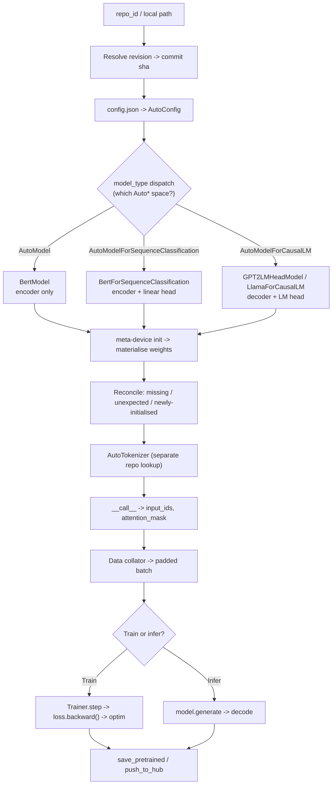

# CS-06 — Hugging Face Masterclass

| Field | Value |
|---|---|
| **Module** | CS-06 — Hugging Face Masterclass |
| **Source video(s)** | Video 08 — "Master Hugging Face in 3 Hours — Full Crash Course 2025" |
| **Transcript file(s)** | `LLM_Fine-Tuning_08_Master_Hugging_Face_in_3_Hours_Full_Crash_Course_2025_ai_hugg.txt` (5,109 lines, ~243 KB) |
| **Companion code** | `_source/repo/Complete-LLM-Finetuning-main/LLM Fine-Tuning-08-Huggingface/huggingface_crash_course.ipynb` (305 cells) |
| **Prerequisites** | CS-01 (lifecycle), CS-02 (transfer learning), CS-05 (attention — you need to know what `last_hidden_state` *is* before you pool it) |
| **Difficulty** | Intermediate — but **breadth is extreme**. This is the tooling spine of the whole handbook. |
| **Hands-on required** | Yes. Every numbered section has runnable code. Budget 6–8 h of hands-on. |
| **Estimated study time** | 10–14 h (read + type every snippet + break two things on purpose) |

> **Why this module is load-bearing:** every other case study in this handbook — CS-07 (BERT fine-tuning), CS-09 (distillation), CS-13 (SFT), CS-15 (LLaMA-Factory), CS-16 (Unsloth), CS-22 (embeddings), CS-23 (LoRA/QLoRA), CS-24 (RLHF), CS-28 (capstone) — assumes you can fluently drive `AutoTokenizer`, `AutoModel*`, `datasets`, `Trainer`, and `generate`. If you cannot, those modules read as magic. Read this one twice.

---

## 0. Executive Summary

The video is a 3-hour tour of the Hugging Face stack, delivered as a live coding session. It covers, in order: what Hugging Face the company and the Hub are `[08:00]`–`[15:42]`; account creation, tokens, and four different login methods `[19:05]`–`[36:00]`; uploading files and creating repos via both git and the `HfApi` Python client `[30:57]`–`[51:00]`; the `datasets` library including `load_dataset`, `filter`, `map`, `shuffle`, `select`, `streaming`, and `Dataset.from_pandas` `[40:48]`–`[1:03:00]`; custom tokenizer training with the Rust `tokenizers` library `[1:12:00]`–`[1:25:00]`; the `Auto*` class family and `from_pretrained` `[1:25:00]`–`[1:45:00]`; `AutoConfig` and `from_config` `[1:50:00]`; `snapshot_download` `[1:55:00]`; pipelines and the sentiment-classification demo `[1:58:00]`–`[2:05:00]`; the `Trainer` API and `compute_metrics` `[2:05:00]`–`[2:20:00]`; `evaluate` with BLEU, ROUGE, and perplexity `[2:20:00]`–`[2:40:00]`; the Hub Python library's model search `[2:40:00]`–`[2:50:00]`; `InferenceClient` and Inference Providers `[2:55:00]`–`[3:05:00]`; and LangChain integration with `HuggingFaceEndpoint` / `HuggingFacePipeline` / `ChatHuggingFace` `[3:05:00]`–`[3:20:00]`.

**What the video is:** an excellent, dense orientation to the *surface area* of the ecosystem.

**What the video is not:** a fine-tuning course. It never trains a model to convergence, never shows a `TrainingArguments` beyond three flags, never covers chat templates, never covers `generate` decoding parameters in depth, never covers Accelerate, never mentions TRL. Those gaps are filled in this module with `> **Beyond the video:**` callouts, clearly marked so you always know what came from the instructor and what did not.

**The single most important thing to internalize:** Hugging Face is not a library. It is an *interface standard* — a set of conventions (`config.json`, `tokenizer.json`, `model.safetensors`, `from_pretrained`/`save_pretrained`, `Auto*` dispatch on `model_type`) that lets code written against one model work against 1,000,000+ others without modification. Every tool in the ecosystem — Transformers, PEFT, TRL, Unsloth, Axolotl, vLLM, TGI, LLaMA-Factory — is built on that standard. Learn the standard, not the libraries.

**Numbers to anchor the module:**

| Fact | Value | Source |
|---|---|---|
| Models on the Hub | ~2 M+ (was ~1.2 M when the video was recorded) | Hub, 2026 |
| Datasets on the Hub | **432,752** | `[40:48]` (instructor's read of the Hub) |
| Free private storage | **100 GB** | `[19:05]` |
| Free GPU on Spaces | **5 minutes** of free GPU per session | `[19:16]` |
| `gpt2` downloads | ~14.4 M | `[2:46:41]` |
| openwebtext scale | **8.13 M docs / 40 B+ tokens / 38 GB / 21 shards** | notebook markdown |
| BERT vocabulary | 30,522 tokens | `bert-base-uncased` config |
| `all-MiniLM-L6-v2` embedding dim | **384** | model card |

---

## 1. The Problem This Solves

### 1.1 Before Hugging Face

In 2017–2018, using a pretrained Transformer meant: find the paper, find a third-party TensorFlow repo (usually with a stale `requirements.txt` and dead weight URLs), port the checkpoint loader, write your own BPE tokenizer from the paper's description, and hope your tokenization matched theirs. Every model was a bespoke integration. Reproducing a result required reproducing someone's directory tree.

The concrete failure modes were:

1. **Tokenization drift.** If your BPE merges differed from the authors', your token IDs differed, and the pretrained weights became garbage. Silent, total quality collapse, undetectable from the loss curve.
2. **Checkpoint format drift.** TF1 `ckpt` vs TF2 `SavedModel` vs PyTorch `state_dict` vs pickle `.bin`. Loading was a project in itself.
3. **No discovery surface.** There was no way to answer "which pretrained model should I use for X?" short of reading papers.
4. **No provenance.** You could not tell whether a checkpoint was the paper's, a fine-tune of the paper's, or a random re-upload.

### 1.2 After Hugging Face

The Hub + `transformers` collapsed all four into conventions:

- One repo layout (`config.json` + weights + tokenizer files) that any model can adopt.
- One loading call: `AutoModel.from_pretrained("org/name")`.
- One tokenizer interface, with the *exact* tokenizer shipped *next to* the weights, so drift is structurally impossible.
- A discovery surface with download counts, model cards, and a search API.
- A versioning story: every repo is a git repo, so `revision="<commit-sha>"` pins you to an immutable snapshot.

The video states the consequence bluntly: the reason Hugging Face dominates is not that the models are better — it is that **nobody has to write the integration layer** `[08:00]`–`[15:42]`.

### 1.3 What breaks anyway

The standard does not remove all failure modes; it moves them:

| Failure | Cause | Detection |
|---|---|---|
| Garbage output, normal loss | Wrong tokenizer for the weights (`bert-base-cased` tokenizer on `bert-base-uncased` weights) | Assert `tokenizer.vocab_size == model.config.vocab_size` |
| OOM on load | `torch_dtype` left at `float32` | `model.get_memory_footprint()` |
| Silent truncation | `max_length` in `generate` counts the prompt | Log `len(prompt_ids)` |
| Silent label corruption | `DataCollatorWithPadding` pads `labels` with `pad_token_id` instead of `-100` | Assert `(batch["labels"] == -100).any()` |
| `KeyError: 'token_type_ids'` | Decoder-only model has no `token_type_ids` | Pass only the keys the model's `forward` accepts |
| Wrong chat format | Manual `"User: ... \nAssistant:"` strings instead of `apply_chat_template` | Compare to the model card's template |

Everything in that table is a *tooling* bug, not a modelling bug. This module is about not shipping tooling bugs.

---

## 2. First-Principles Mental Model

### 2.1 The analogy: the Hub is GitHub, and a model repo is a source repository

A model on the Hub is a git repository. It has commits, branches, tags, a README (the model card), and a file tree. `git clone` works, `git lfs` handles the big files. You can fork it, commit to it, and open a pull request. A *dataset* repo is the same thing with different default file types. A *Space* is the same thing plus a Docker/SDK runtime that serves it as a web app.

**Where this analogy breaks:**

- Hugging Face uses **Git LFS** (or, increasingly, **Xet**), which means a "clone" is not a full copy of the weights — it is pointers plus lazily-fetched blobs. `git clone` of a 70 B model repo will not "download 140 GB", it will download the pointers and fetch blobs on checkout, and it is possible to end up with a working directory full of LFS pointer text files if LFS is not installed. This is a real bug people hit.
- Unlike GitHub, the Hub has **no forks-and-PRs culture** for models. You do not fork `meta-llama/Llama-3.1-8B` and open a PR. You create a *new* repo and the model card declares the base model via `base_model:` metadata. Provenance is metadata, not git history.
- GitHub's unit is code and the review is the PR. The Hub's unit is **weights + tokenizer + config**, and the review is a model card that may or may not be honest. There is no test suite. `trust_remote_code=True` is the `curl | bash` of this ecosystem.

### 2.2 The analogy: `from_pretrained` is a constructor, `save_pretrained` is a serializer

```
AutoModel.from_pretrained(repo_id, revision=...)   ->  build object graph from disk/Hub
model.save_pretrained(path)                        ->  write object graph to disk
model.push_to_hub(repo_id)                         ->  write object graph to the Hub
```

**Where this analogy breaks:**

- A constructor is *pure*; `from_pretrained` performs **network I/O**, mutates a global cache (`~/.cache/huggingface/hub`), respects environment variables (`HF_HOME`, `HF_HUB_OFFLINE`, `HF_TOKEN`), and can be *slow or fail*. Treat it as I/O, with retries and timeouts, not as `Foo()`.
- It is **not symmetric** with `save_pretrained` in one important way: `save_pretrained` writes a *fresh* `config.json` derived from the live Python object, which is why users silently lose custom config fields they set directly on the config object after instantiation. Round-tripping is not guaranteed unless you use `config.to_dict()` deliberately.
- `from_pretrained` has a **hidden second argument that is the whole point**: when you pass `num_labels=3` for a classification head, it *does not* load the pretrained head weights — it warns `"Some weights of ... were not initialized"` and randomly initializes them. That warning is the single most-ignored message in the ecosystem.

### 2.3 The analogy: `Auto*` classes are a plugin registry keyed on `model_type`

`config.json` contains `"model_type": "bert"`. `AutoModel.from_pretrained(...)` reads that string, looks it up in a mapping (`MODEL_MAPPING_NAMES`), and instantiates the right class. That is the entire mechanism.

**Where this analogy breaks:**

- A plugin registry has one key space. HF has **many parallel key spaces** that can disagree: `AutoModel` (bare encoder), `AutoModelForSequenceClassification` (encoder + linear head), `AutoModelForCausalLM` (decoder + LM head), `AutoModelForMaskedLM`, `AutoModelForTokenClassification`, `AutoModelForQuestionAnswering`, and ~40 more. The same `model_type` maps to a *different class in each space*. Loading a BERT checkpoint with `AutoModelForCausalLM` gives you a BERT with a randomly-initialized causal LM head — it will run, produce tokens, and be meaningless.
- The registry can be **extended by the checkpoint itself** via `auto_map` in `config.json`, which is what `trust_remote_code=True` unlocks. That is arbitrary Python from the model author, executed in your process.

### 2.4 The correct mental model: the Hub is a **typed file convention**, and everything else is convenience

Strip away every library and what remains is this contract:

| File | Produced by | Consumed by | Contains |
|---|---|---|---|
| `config.json` | `model.config.save_pretrained` | `AutoConfig` | architecture hyperparameters + `model_type` + `architectures` + `auto_map` |
| `model.safetensors` (or `pytorch_model.bin`) | `model.save_pretrained` | `from_pretrained` | weight tensors, keyed by module path |
| `tokenizer.json` | `tokenizer.save_pretrained` | `AutoTokenizer` (fast) | vocab, merges, normalizer, pre-tokenizer, special tokens |
| `tokenizer_config.json` | `tokenizer.save_pretrained` | `AutoTokenizer` | class name, `chat_template`, extra special tokens, `model_max_length` |
| `special_tokens_map.json` | `tokenizer.save_pretrained` | `AutoTokenizer` | which special tokens are what |
| `generation_config.json` | `model.save_pretrained` | `model.generate` | default decoding params (`temperature`, `top_p`, `eos_token_id`) |
| `README.md` | you | humans + Hub | model card, YAML front-matter with `base_model`, `license`, `datasets` |

If you understand those seven files, you can use *any* HF-compatible tool. Everything else — `Trainer`, pipelines, `HfApi` — is sugar over this.

---

## 3. Core Concepts — Exhaustive Glossary

| Term | Definition | Why it matters | Common confusion |
|---|---|---|---|
| **Hub** | The hosted git+LFS (now Xet) service at `huggingface.co` holding model, dataset, and Space repos | It is the distribution layer; nothing works offline without a local cache | Confused with "the `transformers` library". They are separate products by the same company. |
| **`huggingface_hub`** | The Python client library for the Hub API (`HfApi`, `hf_hub_download`, `snapshot_download`, `InferenceClient`, `login`) | This is dependency #1 of `transformers`, `datasets`, `peft`, `trl` | Confused with `transformers`. `huggingface_hub` does **not** contain model architectures. |
| **`transformers`** | The model architecture + tokenizer + training library (`AutoModel*`, `Trainer`, `pipeline`) | The thing you actually fine-tune with | People say "Hugging Face" when they mean this library |
| **`datasets`** | Arrow-backed dataset library with memory-mapped access, `map`/`filter`, streaming | The data layer; handles datasets bigger than RAM | Confused with `pandas` (in-memory) or `torch.utils.data.Dataset` (single-process, Python-speed) |
| **`tokenizers`** | Rust tokenizer library that `transformers` wraps | 10–100× faster than pure Python; the fast/slow distinction | Confused with `transformers.AutoTokenizer`, which is a *wrapper* with a `.backend_tokenizer` |
| **`accelerate`** | Device-placement, mixed-precision, distributed-launch abstraction used *inside* `Trainer` | The only sane way to run the same script on CPU / 1 GPU / 8 GPUs / multi-node | People think it is a trainer. It is not — it has no training loop. |
| **`peft`** | Parameter-Efficient Fine-Tuning: LoRA, QLoRA, IA³, prefix tuning, prompt tuning | Makes 7 B fine-tuning possible on a 16 GB consumer GPU | People think LoRA is a quantization method. It is an *adapter* method; QLoRA is LoRA + quantization. |
| **`trl`** | Transformer Reinforcement Learning: `SFTTrainer`, `DPOTrainer`, `GRPOTrainer`, `PPOTrainer`, `RewardTrainer` | The post-`Trainer` layer for instruction tuning and alignment | People think it is only for RL. `SFTTrainer` is the standard instruction-tuning entry point. |
| **`evaluate`** | Metric library: `accuracy`, `bleu`, `rouge`, `perplexity`, `f1`, `matthews_correlation` | Standardized, versioned metric implementations | People re-implement accuracy and get the axis wrong (`argmax(axis=-1)` vs `axis=1`) |
| **`optimum`** | Export/optimize models for ONNX Runtime, OpenVINO, TensorRT, Neural Compiler | 2–4× inference speedup over eager PyTorch, no accuracy loss for most models | Confused with quantization. Optimum is *graph/runtime* optimization; quantization is *numeric precision*. |
| **`sentence-transformers`** | Wrapper producing fixed-size sentence embeddings via pooling + optional normalization; `all-MiniLM-L6-v2` = 384-dim | The retrieval/RAG embedding workhorse | People call `AutoModel` and get `last_hidden_state` (per-token) when they wanted a single vector |
| **`gradio`** | Python → web UI in ~10 lines | Demo layer; the thing you put on a Space | Confused with `streamlit`; Gradio is better for ML input/output types (`Audio`, `Image`, `Chatbot`) |
| **Spaces** | Hosted Gradio/Streamlit/Docker/Static apps on the Hub | Free demos, and a real deployment target for internal tools | People think it is free GPU compute. It is 5 free GPU-minutes per session `[19:16]`. |
| **Inference Endpoints** | Dedicated managed deployment of a specific model (paid, per-hour) | Production serving without running your own autoscaling | Distinct from **Inference Providers** (serverless, per-token, multi-model) |
| **Inference Providers** | Serverless routing to third-party backends (`hf-inference`, `hyperbolic`, `nebius`, `together`, `novita`, `ai-studio`) | One client (`InferenceClient`) to many models with no deployment | Not the same thing as an Endpoint. Providers are shared, cold-start-prone, rate-limited. |
| **AutoTrain** | No-code UI/API for training (text classification, LLM SFT, DPO, ORPO, vision) | AutoML-style baseline; useful as a *reference* run to compare your code against | People use it for production. It is a starting point. |
| **`diffusers`** | Diffusion model library (Stable Diffusion, SDXL, Flux); same `from_pretrained`/`pipe()` conventions | The image/video side of the ecosystem | Confused with `transformers` — different library, same design language |
| **`AutoTokenizer`** | Dispatches on `tokenizer_config.json`'s `tokenizer_class` to the right tokenizer class | The only correct way to load a tokenizer for a given checkpoint | People pass `BertTokenizer` explicitly and break on any non-BERT model |
| **Fast vs slow tokenizer** | Fast = Rust `tokenizers` backend (`use_fast=True`, default); slow = pure Python | Fast adds `offset_mapping` and is 10–100× faster on long inputs | "Fast" is not about accuracy; outputs are identical for the same vocab |
| **Special tokens** | `[CLS]`, `[SEP]`, `[PAD]`, `[MASK]`, `<s>`, `</s>`, `<\|endoftext\|>`, `<\|im_start\|>` — model-specific | Mis-set `pad_token` is the #1 cause of garbage generation | People assume `pad_token == eos_token` is universal. For Llama it is a widely-used convention, not a law. |
| **`attention_mask`** | 1 for real tokens, 0 for padding | Without it, attention attends to padding and quality degrades silently | People forget it for decoder-only models assuming causality is enough. It is not, for batched left-padding. |
| **`token_type_ids`** | Segment IDs for BERT-family (sentence A vs B) | Required for BERT NSP-style tasks; must be *removed* for DistilBERT/encoder-decoders | `KeyError` or silently ignored depending on model |
| **`config.json`** | Architecture hyperparameters + `model_type` + `architectures` | `Auto*` dispatch key; `from_config` builds a random model from it | People set `config.num_labels` **after** loading and wonder why the head is wrong size |
| **`safetensors`** | Zero-copy, mmap-able tensor format; no code execution on load | Loads ~2× faster and **cannot** execute arbitrary Python, unlike pickle `.bin` | People assume it is just "faster pickle". It is a *security* boundary. |
| **`.bin` pickle** | Legacy PyTorch serialization | Arbitrary code execution on `torch.load` | People download untrusted checkpoints and load them |
| **`from_pretrained`** | Load weights (and config, and often tokenizer) from a local path or Hub repo | The universal entry point | People don't know it accepts a local directory, a repo id, or a URL |
| **`save_pretrained`** | Write config + weights + tokenizer to a directory | The universal exit point; output is `from_pretrained`-able | People `torch.save(model.state_dict())` and lose the config/tokenizer, making the artifact unusable |
| **`push_to_hub`** | Upload the `save_pretrained` output to a repo, creating it if needed | One-call publish | Needs a **write** token; a read token fails with a confusing 401 |
| **`pipeline()`** | One-liner inference wrapper (preprocess → forward → postprocess) | Fastest path from model id to answer | People use it in production. It is not thread-safe, has no batching by default, and re-loads per process. |
| **`Trainer`** | Opinionated training loop: AMP, grad-accum, checkpointing, logging, eval, resumption | The default fine-tuning entry point; `TrainingArguments` is the config surface | People think it is slow — it is not, except for the dataloader on tiny models |
| **`TrainingArguments`** | ~150 knobs controlling the loop | Where 90% of fine-tuning bugs live | People copy a config from a different model size and inherit nonsense defaults |
| **Data collator** | Per-batch function that pads/assembles tensors | The correct way to do **dynamic** padding; `DataCollatorWithPadding` pads to longest-in-batch | People use `padding="max_length"` and waste 40–80% of compute on pad tokens |
| **`DataCollatorForLanguageModeling`** | Adds shifted labels for causal MLM, masks pad labels with `-100` | The collator you need for causal LM training | People forget `mlm=False` for GPT-style |
| **Chat template** | Jinja string in `tokenizer_config.json` defining the model's turn format | Getting it wrong is the **#1 silent quality killer** in instruction tuning | People hand-write `"User: {q}\nAssistant:"` strings |
| **`apply_chat_template`** | Applies that Jinja template to a list of role/content dicts | The only correct way to build prompts for an instruct model | People don't pass `add_generation_prompt=True` at inference |
| **Streaming mode** | `load_dataset(..., streaming=True)` → `IterableDataset`, no download, no random access | Train on datasets larger than disk | People try `.shuffle()` on it (works, but with a buffer) or index it (fails) |
| **`set_format("torch")`** | Makes `dataset[i]` return tensors instead of Python lists | Avoids a slow convert step; lets you feed `DataLoader` directly | People set it to `"torch"` then call `.map()` again and get errors |
| **`revision`** | git ref (branch / tag / **commit sha**) to load | Pinning to a SHA is the only way to guarantee reproducibility | People use `main` in production and get silently swapped weights |
| **`trust_remote_code`** | Executes Python shipped inside the model repo | Needed for some architectures (Mamba, custom MoE) | It is `curl \| bash`. Only with a reviewed SHA. |
| **`device_map="auto"`** | Shards a model across available devices via Accelerate | Only easy way to load a 70 B model on 2×A100 | Incompatible with `Trainer` (which does its own placement) |
| **`BitsAndBytesConfig`** | 4-bit/8-bit quantization config passed to `from_pretrained` | Enables QLoRA; 7 B in ~5.5 GB | People set `load_in_4bit=True` and then train in full precision by accident (missing `prepare_model_for_kbit_training`) |
| **`compute_metrics`** | Callback receiving `(logits, labels)` and returning a dict | The hook where `evaluate` plugs in | People forget `logits` must be argmax'd **after** `.predict()` returns raw logits |
| **`EvalPrediction`** | The named tuple (`predictions`, `label_ids`) passed to `compute_metrics` | Unpacking it wrong (`logits, labels = eval_pred`) is fine, but it can have 3 fields | Some tasks (QA) have `p_mask` as third element |
| **`metric_for_best_model`** | Which metric drives `load_best_model_at_end` | Defaults to `loss`; if you log `eval_accuracy` set it explicitly | People leave it at `loss` and pick the *worst* checkpoint by accuracy |
| **Checkpoint resumption** | `resume_from_checkpoint=True` reads `trainer_state.json` | The only safe way to survive preemption on spot instances | People restart from scratch and lose days of GPU time |
| **Accelerate** | The device/AMP/distributed abstraction under `Trainer` | `accelerate launch` is how you go from 1 GPU to 8 without code changes | People rewrite their loop with `DistributedDataParallel` by hand |
| **`torch.compile`** | JIT graph capture → fused kernels; 10–30% throughput on training | Free speedup with a 60–120 s compile warmup | People enable it in short runs and lose time to compilation |
| **Flash Attention 2** | Exact-attention kernel with reduced HBM traffic; 2–3× faster, O(N) memory | Needed for long-context training with packing | Requires fp16/bf16, Ampere+, and head_dim ∈ {32,64,128,256} |
| **Packing** | Concatenating short examples into fixed-length sequences | 2–5× throughput on short-sample SFT data, and a prerequisite for flash-attn's efficiency | Packing *without* correct `attention_mask`/position ids leaks attention across example boundaries — silent quality loss |
| **`assistant_only_loss`** | TRL flag masking user/system tokens so loss is computed only on assistant turns | Instruction tuning done correctly; without it the model learns to generate user turns | People leave it off and get a model that hallucinates the user's next message |
| **`assistant_only_loss` prerequisite** | The chat template must contain `` markers | TRL *raises* if the template lacks them (recent versions) | People hit the error and disable the flag instead of fixing the template |
| **`AutoConfig` / `from_config`** | Loads `config.json` only; `AutoModel.from_config(cfg)` builds a *randomly initialized* model from it | Cheapest way to inspect or mutate architecture before any weights move (`cfg.num_labels = 5`) | People mutate the config **after** `from_pretrained` and expect the head to change. It does not. |
| **`num_labels`** | Output-class count on the task head | Drives head weight shape; changing it discards pretrained head weights | Setting it triggers `Some weights ... were not initialized` — for the head that is *expected*, not a bug |
| **`model_type`** | String in `config.json` (`"bert"`, `"gpt2"`, `"llama"`) | The dispatch key for the entire `Auto*` family | People assume the `architectures` field is the dispatch key. It is informational. |
| **Read token** | `hf_...` token with `read` scope | Enough for downloads; safe to bake into a container image | People reuse a read token for `push_to_hub` and get a 401 they blame on the network `[22:16]` |
| **Write token** | Token with `write` scope | Required for `push_to_hub`, `HfApi.create_repo`, `upload_file` | Same string shape as a read token; you cannot tell them apart by looking |
| **Fine-grained token** | Token scoped to named repos and named permissions | Least-privilege for CI; the only sane choice for org automation | People give CI a full write token to "avoid the hassle" `[24:38]` |
| **Gated model** | Repo whose license you must accept per-account before download (Llama, Gemma, Mistral some sizes) | `from_pretrained` returns **401/403** until you accept *and* authenticate | People accept the license in the browser then forget to log in on the box |
| **`HF_TOKEN` env var** | Environment variable `huggingface_hub` reads for auth | The CI/Colab path; also the source of the "forbidden" bug story below `[1:04:00]` | A **stale cached** token in this variable silently overrides `login()` and produces `403 Forbidden` on push |
| **`snapshot_download`** | Downloads a whole repo (all revisions of all files per `revision`) to a local dir | The "vendor the model to my server" primitive `[2:04:28]` | People think it is required for offline use — the normal cache already is offline-capable |
| **`hf_hub_download`** | Downloads exactly one file, returns its local path | Cheapest way to grab `config.json` or one shard `[2:48:28]` | People use it in a loop over 20 shards and re-resolve the repo 20 times |
| **`HfApi`** | Programmatic Hub client: `create_repo`, `upload_file`, `model_info`, `list_models`, `list_repo_files`, `dataset_info` | The automation surface — everything the website does, scriptable `[2:41:06]` | Confused with `InferenceClient`. `HfApi` is *metadata and files*; `InferenceClient` is *inference*. |
| **`InferenceClient`** | Thin client that calls a hosted model over HTTP; no download, no VRAM | Serverless inference in one line; the only option on a CPU-only box `[2:49:50]` | People call `.text_generation()` on a chat model and get *"model not supported for task text-generation"* — the method must match the pipeline tag |
| **Inference Provider** | A third-party backend behind the Hub's serverless routing (`hf-inference`, `hyperbolic`, `nebius`, `together`, `novita`, `ai-studio`) | Lets one client reach 17 text-generation models without deploying anything `[2:59:16]` | Not all providers support all tasks; the availability matrix is a web page, not an API guarantee |
| **`train_test_split`** | `DatasetDict` method producing `train`/`test` splits with a seed | The only correct way to hold out data before you look at it | People split *after* `shuffle` without a seed and get irreproducible numbers |
| **`class_encode_column`** | Turns a string label column into `ClassLabel` ints | Required before `Trainer` — labels must be `int64`, not `str` | People forget it and hit `ValueError: Unable to create tensor` |
| **`group_by_length`** | `TrainingArguments` flag that batches examples of similar length together | 20–40% throughput win on datasets with high length variance | It shuffles less; with `sampler` set to a `LengthGroupedSampler` it can hurt convergence on tiny datasets |
| **`packing`** | Concatenating short examples into fixed-length sequences to fill every token | 2–5× throughput on short-sample SFT; prerequisite for flash-attn efficiency | Packed sequences must have correct position ids / attention masks or attention leaks across example boundaries |
| **Mean pooling** | Averaging `last_hidden_state` over the sequence axis (`[1, 8, 768] → [768]`) | Turns per-token vectors into one sentence embedding | People mean-pool **including padding tokens** and get a vector that depends on batch composition |
| **Cosine similarity** | `dot(a,b) / (‖a‖‖b‖)`; the default sentence-similarity score | Comparable across embedding sizes; the retrieval ranking function | People compare raw dot products across models and get meaningless scales |
| **Zero-shot classification** | Prompt-based classification into labels you supply at call time, no training | Works with zero task-specific data; use it to bootstrap labels | People expect it to beat a fine-tuned 66 M model. It does not, on in-domain data. |
| **BLEU** | Bilingual Evaluation Under Study — geometric mean of n-gram **precisions** (n=1..4) × brevity penalty | The MT/generation overlap metric `[2:21:52]` | A **single** zero precision (usually the 4-gram) collapses the whole score to 0.0 — the most misread metric in the ecosystem |
| **Brevity penalty** | `BP = min(1, exp(1 − ref_len/hyp_len))`; equals 1.0 when the hypothesis is at least as long as the reference | Stops a 1-word output from scoring a perfect precision | People think it *rewards* long outputs. It only stops punishing them. |
| **ROUGE** | Recall-Oriented Understudy for Gisting Evaluation — n-gram **recall**, plus `rougeL` / `rougeLsum` longest-common-subsequence variants | The summarization metric `[2:26:59]` | People report `rougeL` when they mean `rougeLsum` (the one summarization papers use) |
| **Perplexity** | `exp(−(1/N) Σ log p(w_i \| w_<i))` — inverse geometric-mean probability of the text | The only intrinsic LM metric; **42.04** for raw `gpt2` on the demo text `[2:38:55]` | People compare perplexity **across tokenizers**. It is only comparable within one vocabulary. |
| **`compute_metrics`** | `Trainer` callback over `EvalPrediction` returning a dict of scalars | The hook that puts task metrics into your logs | People forget the argmax over `logits` and score the raw float row |
| **`EarlyStoppingCallback`** | `TrainerCallback` that stops after N evals with no `metric_for_best_model` improvement | The cheapest regularization you have | People set `patience=1` on noisy metrics and stop during the warmup plateau |
| **`gradient_checkpointing`** | Recompute activations in the backward pass instead of storing them | Cuts activation memory ~60–70% at ~20–30% wall-clock cost | Must call `model.gradient_checkpointing_enable()` **and** `enable_input_require_grads()` for PEFT; silently no-ops otherwise |
| **`optim`** | Optimizer selector: `adamw_torch`, `adamw_8bit` (bitsandbytes), `paged_adamw_8bit` (QLoRA default), `adafactor` | `paged_*` survives memory spikes by paging optimizer state to CPU | People use `paged_adamw_8bit` on full fine-tunes where plain `adamw_torch` is faster |
| **`eval_strategy`** | When to evaluate: `"no"`, `"steps"`, `"epoch"` | Ties to `save_strategy`; `load_best_model_at_end` requires them to match | Renamed from `evaluation_strategy`; old code raises `TypeError` on recent `transformers` |
| **`DataCollatorForSeq2Seq`** | Pads inputs **and labels**, replacing label pad with `-100` | The correct collator for encoder-decoder and causal SFT | People use it with a tokenizer whose `pad_token` equals `eos_token` and mask the EOS out of the loss |
| **`bitsandbytes`** | CUDA kernels for 8-bit optimizers and 4/8-bit linear layers | The only widely-supported path to 4-bit QLoRA on NVIDIA | Windows and Apple Silicon support lags; ROCm needs a separate build |
| **Flash Attention 2** | Exact-attention fused kernel; 2–3× faster, O(N) memory | Long-context training and packing | Requires fp16/bf16, Ampere+, head_dim ∈ {32,64,128,256}, and contiguous inputs |
| **FSDP / DeepSpeed ZeRO** | Shard parameters, gradients, and optimizer state across ranks | The only way to full-fine-tune 7 B+ on 8 consumer GPUs | People enable ZeRO-3 and then complain that throughput fell — communication dominates below ~8 B |
| **`torch.compile`** | JIT graph capture → fused kernels | 10–30% throughput, free | 60–120 s compile warmup; pointless on runs shorter than ~10 min |
| **`litgpt` / `torchtune`** | Standalone, dependency-light fine-tuning harnesses (formerly `lit-gpt`, PyTorch-native recipes) | Better than `Trainer` for single-model, single-GPU, maximal-throughput pretraining-style runs | They do not read HF `TrainingArguments`; you rewrite the config in their format |
| **`dataset_info.json` (custom-dataset pattern)** | A folder of Parquet/JSON files plus a metadata file, pushed as a Hub dataset repo in one call | The way you publish *your* data and reload it with `load_dataset("you/name")` | People push a DataFrame without `class_encode_column` and load back a `str` label that `Trainer` rejects |

---

## 4. Deep Dive — How It Actually Works

### 4.1 Mechanism, step by step: one `from_pretrained` call, eleven moves

Everything in this module — the Hub, the `Auto*` family, tokenizers, `Trainer`, `generate` — is a round trip through this sequence. Learn it once and every error message maps to a numbered step.

| # | Move | Input | Operation | Output | Failure mode |
|---|---|---|---|---|---|
| 1 | **Resolve the identifier** | `"bert-base-uncased"`, `"./out"`, or an `hf://` URL | If it is not a local path, treat it as `repo_id`; resolve `revision` (default `main`) to a commit sha; check the cache at `~/.cache/huggingface/hub/models--<org>--<name>/` | A commit sha + a snapshot dir | Repo renamed/private/gated → `RepositoryNotFoundError` (401 looks identical to "does not exist") |
| 2 | **Read `config.json`** | snapshot dir | JSON parse → `AutoConfig` | A config object carrying `model_type` | Custom fields silently dropped if the model class does not declare them |
| 3 | **Dispatch** | `model_type` + the task space of the class you called | Registry lookup in `MODEL_MAPPING_NAMES` (bare), `MODEL_FOR_SEQUENCE_CLASSIFICATION_MAPPING_NAMES`, `MODEL_FOR_CAUSAL_LM_MAPPING_NAMES`, … | A concrete class, e.g. `BertForSequenceClassification` | Wrong task space → correct architecture, **random** head, no error |
| 4 | **Allocate parameters** | The class + config | Instantiate modules on the `meta` device where supported (`low_cpu_mem_usage=True`), so no random init ever touches RAM | An empty parameter graph | Without `low_cpu_mem_usage`, peak host RAM ≈ 2× model size |
| 5 | **Materialize weights** | `model.safetensors` (preferred) or `pytorch_model.bin` | `safetensors` → mmap, zero-copy, no code execution. `.bin` → `torch.load` (**arbitrary code execution**) | Populated tensors, fp32/bf16 per the file | A `.bin` from an untrusted repo is remote code execution; a partially-downloaded shard silently loads the rest |
| 6 | **Reconcile** | Parameter graph + weight dict | Diff by key: missing, unexpected, newly initialized | Three printed lists | Step 6 is *the* diagnostic. People scroll past it. |
| 7 | **Load the tokenizer** | The **same** `repo_id` by default (or a `tokenizer=` override) | `AutoTokenizer.from_pretrained` → `tokenizer_config.json` → `tokenizer_class` → fast or slow class | A tokenizer whose vocab **must** match the model's `config.vocab_size` | Pointing at a different tokenizer repo works, runs, and produces fluent-looking garbage |
| 8 | **Encode + collate** | Raw python objects | `tokenizer(...)` → `input_ids` / `attention_mask` / `token_type_ids`; then a **data collator** pads to the longest item *in the batch* | A dict of rectangular tensors | `padding="max_length"` wastes 40–80% of compute; a wrong collator pads **labels** with a real token id |
| 9 | **Forward** | Tensors on device | `model(**batch)` → `logits`, `hidden_states`, `attentions`, `loss` | Task-dependent tensors | Labels not shifted/masked → the model trains on padding and on the prompt |
| 10 | **Step, or generate** | `loss` or `input_ids` | `Trainer` runs `loss.backward()` → optimizer → scheduler; `generate` runs the decoding loop | Updated weights, or a token sequence | `max_length` confusion, missing attention mask, no `eos_token_id` |
| 11 | **Save** | Live Python objects | `save_pretrained` writes the seven files; `push_to_hub` commits them | A reloadable artifact | `torch.save(state_dict)` loses config + tokenizer and makes the artifact unusable by anyone else |



> **Beyond the video:** The video treats step 3 as a curiosity ("this class is specifically for loading the BERT-based model along with the classification head" `[1:58:10]`). In production it is the single most common silent-failure source: a checkpoint whose `architectures` field says `BertForMaskedLM` loaded through `AutoModelForCausalLM` will run, will emit tokens, and will be meaningless. Always assert the class you got back:
>
> ```python
> from transformers import AutoModelForCausalLM
> model = AutoModelForCausalLM.from_pretrained("gpt2")
> print(type(model).__name__)              # GPT2LMHeadModel  <- assert this in tests
> print(sum(p.numel() for p in model.parameters()) / 1e6, "M params")
> ```

### 4.2 The mathematics of the four numbers this module turns on

#### (a) The embedding matrix — where the 768 comes from

`bert-base-uncased` reports `hidden_size = 768`, `num_attention_heads = 12`, `vocab_size = 30522` `[2:02:25]`. The token embedding table is therefore

```
30522 × 768 = 23,440,896 params
```

In fp32 that is `23,440,896 × 4 B = 93.8 MB`; in bf16, `46.9 MB`. This single matrix is why *vocabulary* size, not just layer count, drives small-model memory: the instructor's **custom BPE tokenizer with `vocab_size=100`** `[1:19:03]` produces an embedding table of `100 × 768 = 76,800` params — 305× smaller — which is exactly why from-scratch toy models can train on a laptop.

#### (b) `last_hidden_state` → a sentence embedding

For the 8-token input the video uses, the model returns

```
last_hidden_state.shape == [batch=1, seq=8, hidden=768]
```

Mean pooling collapses the sequence axis:

```
e_j = (1/S) * Σ_{i=1..S} h_{i,j}          j = 1..768
```

Two traps the video does not mention, both silent:

1. **Padding must be excluded.** The correct pooled form weights by `attention_mask`:
   `e_j = Σ_i (m_i * h_{i,j}) / Σ_i m_i`. Pooling raw `h` including pads makes the sentence vector depend on how the batch was padded — the same sentence gets different embeddings in different batches.
2. **`[CLS]` is not "the sentence vector"** for BERT unless the model was fine-tuned on sentence-level objectives. The video's mean-pool path `[1:47:46]` is the safer default; `sentence-transformers` pools the same way and then normalizes.

The cosine similarity the instructor demonstrates:

```
cos(a, b) = (a · b) / (‖a‖₂ ‖b‖₂)        ∈ [-1, 1]
```

- With bare `bert-base-uncased` (768-d, un-fine-tuned for similarity): **~88%** on `"Hello, how are you?"` vs `"Hi, how do you do?"` `[1:51:00]`.
- With `all-MiniLM-L6-v2` (384-d, contrastively trained for similarity): **51%** on the same pair `[1:54:48]`.

> **Correction:** the instructor reads this backwards. He concludes "the dimension was high 768, we were able to capture more features, that's why we got good similarity; small models are faster but less reliable" `[1:54:59]`. That is wrong on both counts.
>
> - **Dimension is not the cause.** `bert-base-uncased` was trained with masked-LM and next-sentence-prediction, not with a contrastive objective; its raw mean-pooled space is anisotropic (all vectors crowd into a narrow cone), which *inflates* cosine similarity for unrelated sentences. A 768-d model that scores 0.88 for "Hi" vs "Hello" would also score ~0.8 for "Hi" vs "The mitochondrion is the powerhouse of the cell". `all-MiniLM-L6-v2` is 384-d and was trained specifically on sentence pairs, so its 0.51 is a *calibrated* score, not a weaker one.
> - **The correct rule:** use a model trained for the objective you are measuring. `all-MiniLM-L6-v2` (22 M params, 384-d, 5th percentile of MTEB at its size) beats raw BERT mean-pooling on every retrieval benchmark at 1/5 the memory. High cosine similarity from an un-fine-tuned encoder is a **bug signature**, not a quality signal.
> - If you need a bigger general-purpose embedding model, the modern ladder is `bge-base-en-v1.5` (109 M, 768-d), `bge-large-en-v1.5` (335 M, 1024-d), `nomic-embed-text-v1.5` (137 M, 768-d, 8192 ctx), `mxbai-embed-large-v1` (335 M, 1024-d). All are drop-in for `sentence-transformers`.

#### (c) BLEU — why the video's example scores exactly 0.0

BLEU is

```
BLEU = BP · exp( (1/N) · Σ_{n=1..N} log p_n )
BP   = min(1, exp(1 − r/c))       r = reference length, c = candidate length
```

The demo reports `precisions = [0.714, 0.5, 0.2, 0.0]`, `brevity_penalty = 1.0`, `translation_length = 7`, `reference_length = 6`, final **BLEU = 0.0** `[2:33:10]`.

The instructor explains it correctly: 5 of 7 unigrams matched, 3 bigrams, 1 trigram, **0 four-grams**, and "if any of them is coming zero, the final score of the BLEU score is going to be zero" `[2:34:19]`. Mechanically:

```
exp( (1/4) · (log 0.714 + log 0.5 + log 0.2 + log 0.0) )
= exp( (1/4) · (−0.337 − 0.693 − 1.609 + (−∞)) )
= exp(−∞)
= 0.0
```

`brevity_penalty = 1.0` because `c = 7 ≥ r = 6`, so `exp(1 − 6/7) = exp(0.143) = 1.15`, clipped to 1.0. **The brevity penalty is a one-sided penalty: it can only lower the score, never raise it.** That is the term the instructor flags as confusing `[2:35:04]` and it is the one that trips up every interview candidate.

> **Beyond the video:** the `sacrebleu` implementation used by `evaluate.load("bleu")` is not the original Papineni BLEU — it is the standard-consistent variant with `smooth_method="exp"` by default in some versions and `"floor"` in others. This matters enormously: under `smooth_method="floor"` the zero 4-gram precision is replaced by a small ε and the score becomes ~0.03 instead of 0.0. **Any BLEU number reported without the smoothing method is not reproducible.** Also: BLEU is a *corpus-level* metric. Averaging sentence BLEU is not corpus BLEU (`evaluate` does the right thing when you pass a list of predictions; it does the wrong thing when you average yourself).

#### (d) ROUGE and perplexity, in numbers

The demo prints `rouge1 = 0.4`, `rouge2 = 0.15`, `rougeL = 0.4`, `rougeLsum = 0.4` `[2:36:03]`, and `perplexity = 42.04` for `gpt2` on the demo text `[2:38:55]`.

- `rouge1 = 0.4` is an F-measure, not recall, in the `evaluate` default: precision and recall are 0.5/0.33 in the typical case, F1 = 0.4. Report which you mean.
- `rouge2 = 0.15` collapsing to near nothing is the normal signature: summarization systems rarely reproduce two-word spans verbatim.

Perplexity, computed as `exp(mean cross-entropy)`:

```
PPL = exp( −(1/N) Σ_{i=1..N} log p(w_i | w_<i) )
```

For `gpt2` on the demo passage this is **42.04**. The bands the instructor quotes `[2:40:00]`:

| Band | Perplexity | Reading |
|---|---|---|
| Good | 10–30 | confident, coherent continuations |
| Acceptable | 30–50 | **42.04 sits here** — "moderate, this generation is fine" |
| Bad | >50 | confused next-token distribution |
| Very bad | >100 | the model has no idea |

> **Correction:** these bands are only meaningful **per tokenizer**. Perplexity is `exp` of a cross-entropy measured in *nats per token*, and "token" is defined by the vocabulary. A model with a 32 k BPE vocab and a model with a 128 k vocab over the same text will report different perplexities for identical quality — the larger vocabulary has *fewer tokens* covering the same characters, and each token carries more bits. The correct comparison across tokenizers is **bits-per-byte (BPB)**:
>
> ```
> BPB = (total negative log-likelihood in nats / ln 2) / total_utf8_bytes
> ```
>
> A modern 7 B model reports **PPL ≈ 6–9** on WikiText-103 at a 32 k vocab; "10–30 is good" is a 2019-era GPT-2 yardstick and should not be used to judge a 2026 model.

### 4.3 At the tensor level: attention, masking, and where the gradient actually lands

**Self-attention, one head, one layer.** With hidden states `H ∈ ℝ^{S×d}` (the video's `[1, 8, 768]` is the batch-1 case):

```
Q = H·W_Q ,  K = H·W_K ,  V = H·W_V        W_* ∈ ℝ^{d×d_h},  d_h = d / n_heads = 768/12 = 64
A = softmax( (Q·Kᵀ) / sqrt(d_h) + M )      A ∈ ℝ^{S×S}
O = A·V
```

`M` is the additive mask. For padding it is `0` at real positions and `−∞` (in practice `-1e9` or the dtype's lowest finite value, not literal `-inf`, which produces NaN gradients) at padded positions. **This is the entire mechanical content of `attention_mask` for an encoder.** For a decoder-only model it is the same matrix OR'd with a lower-triangular `−∞` causal mask.

Two consequences the video never states:

1. **The mask must reach attention.** Passing `attention_mask` to the tokenizer but forgetting to pass it to `model(**inputs)` — or popping it in a "clean up unused keys" step — is silent. The model attends across pad tokens and, in batched generation with left-padding, across *other sequences'* tokens.
2. **`-inf` in fp16 is NaN-adjacent.** If an entire row of `A` before softmax is `-inf` (a fully-padded sequence), softmax gives `0/0 = NaN`. This is the mechanism behind "loss went NaN at step 300 with no obvious cause": a batch containing a zero-length or fully-truncated sequence.

**Where the gradient lands, per method.**

| Method | Trainable tensors | Gradient/optimizer memory | Fraction of params with grads |
|---|---|---|---|
| Full fine-tune | all `W`, `b` | 4 B (fp32 grad) + 8 B (Adam m,v) + 4 B (fp32 master) per param | 100% |
| LoRA (r=8 on `q_proj,v_proj`) | `A ∈ ℝ^{r×d}`, `B ∈ ℝ^{d×r}` | same per-param cost, on ~0.1–1% of params | 0.05–1% |
| QLoRA (NF4 base + LoRA) | `A`, `B` | adapters only; base is 4-bit and frozen | 0.05–1% |
| Frozen base + new head | the head only | tiny | <0.1% |
| Prompt / prefix tuning | soft-prompt embeddings | tiny | ~0.01% (and it consumes context length) |

LoRA's forward pass is `h = W₀x + (α/r)·B·A·x` with `W₀` frozen and `A` initialized Gaussian, `B` initialized **zero** — so the adapter starts as an exact identity and training is stable from step 0. That zero-init is why LoRA never degrades a model at step 0, and it is why the `α/r` scaling exists: it keeps the effective update magnitude roughly independent of the rank you pick.

**Label shifting and `-100`.** For causal LM the collator emits

```
labels[0:-1] = input_ids[1:]        # predict the next token at each position
labels[-1]   = -100                 # nothing to predict past the end
labels[attention_mask == 0] = -100  # never train on padding
```

`-100` is not arbitrary: `F.cross_entropy(..., ignore_index=-100)` is PyTorch's default ignore index, and every HF loss function relies on it.

> **Correction — this is the module's most consequential silent bug.** `DataCollatorWithPadding` pads **everything** in the batch with `tokenizer.pad_token_id`, including `labels` if labels are present as a column. The result is a model trained to predict the pad token at every padded position, which (a) wastes most of the gradient signal on pad, and (b) teaches the model to *emit* padding. The symptoms are a loss curve that looks fine and a model that generates long runs of `[PAD]`/`<|endoftext|>` or stops mid-sentence. Use `DataCollatorForLanguageModeling(tokenizer=tok, mlm=False)` for causal LM, `DataCollatorForSeq2Seq` for encoder-decoder SFT, and `DataCollatorForCompletionOnlyLM` (or TRL's `assistant_only_loss`) when you want loss on a *span* rather than the whole sequence. In the notebook's archive cell the instructor uses `DataCollatorForLanguageModeling(tokenizer=hf_tokenizer, mlm=False)` — that one is correct.

**Gradient accumulation arithmetic.** With `gradient_accumulation_steps=G` and `per_device_train_batch_size=B` over `D` devices, the *effective* batch is `B·G·D`. The loss reported in the logs is the mean over the accumulated micro-batches only if the implementation divides by `G` before accumulating. `Trainer` and Accelerate do this correctly. Every hand-written loop that does `loss.backward()` in a `for` and `optimizer.step()` after gets a `G`× larger gradient — which is the single most common "my loss exploded when I moved to a bigger GPU" bug.

### 4.4 Memory and compute accounting — the arithmetic, worked

**Full fine-tuning, mixed precision, Adam.** Per trainable parameter:

| Component | Bytes/param | Note |
|---|---|---|
| fp16/bf16 weights | 2 | the working copy used in the forward pass |
| fp32 master weights | 4 | needed because fp16 cannot represent small updates (`1e-5` LR vanishes) |
| fp32 gradients | 4 | accumulated in fp32 |
| Adam `m` (fp32) | 4 | |
| Adam `v` (fp32) | 4 | |
| **Total (static)** | **18** | before activations, before fragmentation |

Round to **~20 bytes/param** to absorb allocator fragmentation, and add activations.

| Model | Params | Static optimizer+weights | Activations @ B=8, S=512 | Realistic floor |
|---|---|---|---|---|
| `distilbert-base-uncased` | 66 M | 66e6 × 18 B = **1.19 GB** | ~0.4 GB | **~2 GB** (fits a T4/Kaggle) |
| `bert-base-uncased` | 110 M | 1.98 GB | ~0.8 GB | ~3 GB |
| `roberta-base` | 125 M | 2.25 GB | ~0.9 GB | ~3.3 GB |
| `gpt2` (124 M) | 124 M | 2.23 GB | ~1.0 GB | ~3.5 GB |
| `Llama-3.1-8B` | 8.03 B | **144.5 GB** | ~3 GB | **not feasible on 1 GPU** |

That last row is the whole reason PEFT, quantization, FSDP, and DeepSpeed exist, and it is why the module's later sessions are about LoRA rather than about buying eight H100s. With QLoRA the same 8 B model costs:

```
4-bit base weights : 8.03e9 × 0.5 B  = 4.0 GB   (NF4 + double quant, ~0.5 B/param)
LoRA adapters      : ~40 M params × 20 B = 0.8 GB
activations @ B=1,S=1024 with grad checkpointing = ~1.5 GB
--------------------------------------------------------------
realistic total    ≈ 6–7 GB  -> fits a free Colab T4 (16 GB) with room to spare
```

**Activation memory.** The dominant term is not the weights, it is `batch × seq_len × hidden × layers × (constant)`. The transformer stores ~10–16 intermediate tensors of size `B·S·d` per layer. For `bert-base` at `B=16, S=512`:

```
16 × 512 × 768 × 4 B × 12 layers ×  ~8 stored tensors  ≈  2.4 GB
```

`gradient_checkpointing=True` discards the intermediate activations and recomputes them in the backward pass, cutting this to ~`S`-independent storage at a **20–30% wall-clock cost**. The break-even: enable it when activations exceed ~30% of your VRAM budget.

**Attention's quadratic term.** Score matrix is `S×S` per head per layer:

| Seq len `S` | Scores = `S²·n_heads·n_layers` (BERT-base) | fp16 memory |
|---|---|---|
| 128 | 128² × 12 × 12 = 2.36 M | 4.7 MB |
| 512 | 512² × 12 × 12 = 37.7 M | 75 MB |
| 2048 | 2048² × 12 × 12 = 604 M | 1.2 GB |
| 8192 | 8192² × 12 × 12 = 9.66 B | **19 GB** |

This is what Flash Attention 2 fixes: it never materializes the `S×S` matrix, giving the same *exact* result in O(S) memory. The practical rule this module should leave you with: **past ~1024 tokens of sequence length, unfused attention is the memory bottleneck, not the parameters.**

**Generation's KV cache.** For autoregressive decoding the model caches K and V per layer:

```
cache_bytes = 2 (K and V) × n_layers × S_total × d_model × bytes_per_elem
```

For `Llama-3.1-8B` in bf16 at `S_total = 8192`: `2 × 32 × 8192 × 4096 × 2 B = 4.3 GB` **per sequence**. Batch 8 of those is 34 GB of KV cache alone, on a 24 GB card. This is why serving frameworks use `paged attention` (vLLM), KV quantization, or GQA architectures (`Llama-3` uses 8 KV heads instead of 32, cutting the cache 4×).

> **Beyond the video:** the video never touches any of this, because every model it demonstrates (`distilbert-base-uncased` at 66 M, `gpt2` at 124 M, `all-MiniLM-L6-v2` at 22 M) fits anywhere. The moment you leave the demo — a 7 B model, a 4 k context, a batch of 32 — memory accounting stops being optional. Use `torch.cuda.max_memory_allocated()` around a single step to get your real number before scaling the batch:
>
> ```python
> import torch
> torch.cuda.reset_peak_memory_stats()
> out = model(**batch); out.loss.backward()
> print(f"peak = {torch.cuda.max_memory_allocated()/2**30:.2f} GiB")
> ```

---

## 5. The End-to-End Pipeline

The video's notebook is one linear script. Laid out as a pipeline with explicit failure modes, it is the reusable skeleton for every later module in this handbook:

```mermaid
flowchart LR
    S1["1. Auth<br/>login / HF_TOKEN"] --> S2["2. Discover<br/>HfApi.list_models"]
    S2 --> S3["3. Load data<br/>load_dataset"]
    S3 --> S4["4. Inspect & split<br/>shuffle / select / train_test_split"]
    S4 --> S5["5. Tokenize<br/>AutoTokenizer.__call__"]
    S5 --> S6["6. Collate<br/>DataCollator*"]
    S6 --> S7["7. Model<br/>AutoModelFor*"]
    S7 --> S8["8. Train<br/>Trainer + TrainingArguments"]
    S8 --> S9["9. Evaluate<br/>compute_metrics"]
    S9 --> S10["10. Publish<br/>push_to_hub"]
    S10 --> S11["11. Serve<br/>pipeline / InferenceClient"]
```



| Stage | Input | Operation | Output | Failure mode |
|---|---|---|---|---|
| **1. Auth** | Human, or a token in `HF_TOKEN` | `huggingface-cli login`, `login(token)`, or `notebook_login()` `[25:54]` | Token cached at `~/.cache/huggingface/token` | A **stale read token in `HF_TOKEN`** shadows the login and every push 403s. Fix: unset the variable, restart the kernel `[1:04:00]`. |
| **2. Discover** | A task or a language | `HfApi().list_models(filter="text-generation", sort="downloads", limit=20)` `[2:44:00]` | Ranked repo ids | Sorting by `downloads` surfaces `gpt2` (14.4 M downloads `[2:46:41]`) over models that are actually better; popularity is not quality |
| **3. Load data** | A dataset id or your own files | `load_dataset("stanfordnlp/imdb")`, `load_dataset("c4", "en", streaming=True)` `[40:48]` | Arrow files in `~/.cache/huggingface/datasets`, memory-mapped | Streaming + `.len()` → `TypeError`; streaming + integer indexing → `NotImplementedError` |
| **4. Inspect & split** | `DatasetDict` | `.shuffle(seed=42)`, `.select(range(100))`, `.filter(...)`, `.train_test_split(test_size=0.2)` `[46:00]` | Deterministic splits | Splitting without a seed → unreproducible metrics; splitting **after** inspecting the test set → leakage |
| **5. Tokenize** | Text column | `tokenizer(texts, padding=..., truncation=True, max_length=..., return_tensors="pt")` `[1:07:00]` | `input_ids`, `attention_mask`, `token_type_ids` | `truncation=False` (default) silently *errors or drops*, depending on model; `padding="max_length"` wastes compute; `token_type_ids` breaks DistilBERT |
| **6. Collate** | List of variable-length dicts | `DataCollatorWithPadding(tokenizer)` → dynamic padding to longest-in-batch; `DataCollatorForLanguageModeling(mlm=False)` for causal LM; `DataCollatorForSeq2Seq` for SFT | Rectangular tensors, correct `-100` labels | `DataCollatorWithPadding` on a labeled dataset pads **labels with a real token id** (see §4.3) |
| **7. Model** | `model_type` + task | `AutoModelForSequenceClassification.from_pretrained(id, num_labels=2)` | Model with a (possibly fresh) head | "Some weights were not initialized" ignored → random head trained from nothing |
| **8. Train** | Model + args + datasets | `Trainer(model, args, train_dataset, eval_dataset, compute_metrics=fn).train()` `[2:19:55]` | Checkpoints in `output_dir` | `metric_for_best_model` left at `loss` while logging `accuracy` → `load_best_model_at_end` picks the wrong checkpoint |
| **9. Evaluate** | Test split | `.evaluate(eval_dataset=test)` → `eval_loss`, `eval_<metric>` `[2:20:17]` | A metrics dict | Evaluating on the training split; evaluating with `padding="max_length"` while training with dynamic padding → distribution shift in the pad tokens |
| **10. Publish** | `Trainer` + tokenizer | `trainer.push_to_hub("you/model")` | A repo with the seven files | Private-by-accident (default is public) or public-by-accident; a **write** token is required |
| **11. Serve** | A repo id | `pipeline(task, model=id)` or `InferenceClient(model=id)` `[2:49:50]` | Answer | `pipeline` in a web worker (not thread-safe); `InferenceClient` on a chat model with `.text_generation()` → task mismatch error |

**The eleven stages are the whole module.** Sections 6–12 walk each one with code, knobs, and numbers.

## 6. Hands-On Code (annotated)

All code below is from the companion notebook `LLM Fine-Tuning-08-Huggingface/huggingface_crash_course.ipynb`, cleaned up, with the *why* added. Library versions the video's environment resolves to: `transformers>=4.44`, `datasets>=2.19`, `tokenizers>=0.19`, `huggingface_hub>=0.23`, `accelerate>=0.30`, `evaluate>=0.4`, `rouge_score`, `sacrebleu`, `bitsandbytes`, `langchain`, `langchain-huggingface`, `langchain-community`, `sentence-transformers`, `wordcloud`, `matplotlib`.

### 6.1 Auth — four ways, and the one that bites

```python
# 1. Interactive CLI (the recommended path on a workstation)
#    !pip install -U "huggingface_hub[cli]"
#    !huggingface-cli login            # paste a WRITE token when prompted
#    !huggingface-cli whoami           # verify: prints username + token scopes

# 2. Env var, for CI / Docker / no-TTY environments
#    export HF_TOKEN=hf_xxxxxxxx      # read AND write use the same variable name

# 3. In-process, with an explicit token
from huggingface_hub import login
login(token=WRITE_TOKEN)               # writes to ~/.cache/huggingface/token

# 4. Notebook helper (Colab / Jupyter widget)
from huggingface_hub import notebook_login
notebook_login()                       # renders a text box; same effect as (1)
```

The notebook stores the two tokens as Colab secrets and pulls them with `userdata.get("HF_TOKEN_READ")` / `userdata.get("HF_TOKEN_WRITE")`, so the token never appears in the notebook source. **Do this.** A token committed to a public repo is revoked automatically by the Hub's secret scanner within seconds, but you will have burned a rotation.

Creating repos without leaving the terminal:

```bash
!huggingface-cli repo create livehfcourse --repo-type model
!huggingface-cli repo create livehfcourse --repo-type dataset
!huggingface-cli repo create livehfcourse --repo-type=space --space=docker
```

> **Correction:** the `huggingface-cli` entry point is deprecated in favour of the `hf` CLI (`pip install -U "huggingface_hub[cli]"` then `hf auth login`, `hf auth whoami`, `hf repo create ...`). The old names still work in 0.2x but print a deprecation notice and will be removed. Also note `--repo-type=space --space=docker` requires the `--space_sdk` value to match an existing runtime; valid SDKs are `gradio`, `streamlit`, `docker`, `static`.

**The forbidden-error debugging story, in full** `[58:42]`–`[1:06:17]`. The instructor creates a custom dataset, calls `push_to_hub("sunny199/mycustomdata")`, and gets `403 Forbidden`. He debugs it on camera for roughly seven minutes. The cause:

> **Rule of thumb (transcribe verbatim):** *"Whenever you are doing the push operation, always check the `HF_TOKEN` variable — a stale cached read token will override everything you do in the notebook."* `[1:04:00]`

The mechanism: `huggingface_hub` resolves credentials in this priority order — explicit `token=` argument → `HF_TOKEN` environment variable → the cached token file. Colab had cached a **read** token into `HF_TOKEN` in an earlier cell; `login(WRITE_TOKEN)` wrote the write token to the cache, but the env var outranked it. The fix was to assign the *write* token to the `HF_TOKEN` variable and **restart the runtime** (the env var is read at client construction). Verifying with `huggingface-cli whoami` shows the scopes and would have caught this in five seconds.

After the push, the dataset page shows a single file named `data` (Parquet, auto-converted by the Hub). That is expected: the Hub materializes `Dataset.from_pandas` output as Parquet and infers a schema. To control the schema and the split names explicitly, write `dataset_info.json` + `data/train-00000-of-00001.parquet` and push the folder — see §10, gotcha 9.

### 6.2 Hub metadata and file transfer — `HfApi`

```python
from huggingface_hub import HfApi
api = HfApi(token=WRITE_TOKEN)

# --- create a repo (idempotent: existing=True avoids an error on re-run) ---
api.create_repo(repo_id="sunny199/sunnyrepo", repo_type="model", private=False)

# --- upload one file ---
api.upload_file(
    path_or_fileobj="/content/testfile/config.json",  # local path or BytesIO
    path_in_repo="config.json",                        # destination path in the repo
    repo_id="sunny199/sunnyrepo",
)

# --- full metadata for one model ---
info = api.model_info("google-bert/bert-base-uncased")
info.modelId, info.author, info.downloads, info.likes, info.private
info.tags            # ['transformers', 'pytorch', 'bert', 'fill-mask', 'en', 'license:apache-2.0', ...]
info.cardData        # parsed YAML front-matter of the model card: datasets, language, license
info.sha             # the commit sha -- PIN THIS in production
info.lastModified
[s.rfilename for s in info.siblings]     # every file in the repo

# --- search the Hub programmatically ---
for m in api.list_models(filter="text-generation", sort="downloads", direction=-1, limit=20):
    print(m.modelId, m.downloads)

# --- file listing for a specific repo ---
print(api.list_repo_files("google-t5/t5-base"))     # ['config.json', 'generation_config.json',
                                                     #  'model.safetensors', 'spiece.model', 'tokenizer.json', ...]

# --- dataset metadata ---
print(api.dataset_info("stanfordnlp/imdb").siblings)
```

The `list_models` filter vocabulary is the useful part: `filter=` accepts task pipeline tags (`text-generation`, `text-classification`, `automatic-speech-recognition`, `image-text-to-text`), library names (`transformers`, `diffusers`, `sentence-transformers`), languages (`en`, `hi`), and dataset names; `author="google"` narrows to an org; `search="bert"` is a free-text match on the repo name; `sort=` ∈ {`downloads`, `likes`, `lastModified`, `createdAt`, `trendingScore`} with `direction=-1` for descending.

### 6.3 Datasets — loading, filtering, mapping, splitting

```python
# !pip install -U datasets fsspec
from datasets import load_dataset

dataset = load_dataset("stanfordnlp/imdb")      # -> DatasetDict({'train': ..., 'test': ...})
dataset                                          # 25_000 train / 25_000 test rows

# Row access is lazy and zero-copy: it reads from the memory-mapped Arrow file.
dataset["train"][0]                              # {'text': 'I rented I AM CURIOUS-YELLOW ...', 'label': 0}
dataset["train"].features                        # {'text': Value('string'), 'label': ClassLabel(names=['neg','pos'])}

# --- shuffle then slice: the correct order ---
small = dataset["train"].shuffle(seed=42).select(range(100))

# --- filter: keeps a bool mask, builds a new Arrow file ---
long_reviews = dataset["train"].filter(lambda r: len(r["text"]) > 5000)

# --- map: transform every row; batched=True is 10-100x faster than per-row ---
dataset = dataset.map(lambda batch: {"n_words": [len(t.split()) for t in batch["text"]]},
                      batched=True, num_proc=4)   # num_proc>1 forks workers; do not use with a GPU model

# --- split without leakage ---
split = dataset["train"].train_test_split(test_size=0.2, seed=42)
split["train"], split["test"]

# --- streaming: no download, no random access, IterableDataset ---
stream = load_dataset("openwebtext", streaming=True)
# 8.13 M documents / 40 B+ tokens / 38 GB on disk / 21 shards  [41:00]
next(iter(stream["train"]))                      # works
# stream["train"][0]                             # NotImplementedError -- no indexing
stream["train"].take(1000)                       # IterableDataset slice

# --- large multilingual corpora: gated, needs login + license acceptance ---
c4_en = load_dataset("c4", "en", split="train", streaming=True)

# --- tweet_eval/sentiment: 3-class, the notebook's multiclass example ---
tweets = load_dataset("tweet_eval", "sentiment")   # labels 0=negative, 1=neutral, 2=positive
```

**Numbers from the video, for scale reference** `[38:37]`–`[54:12]`:

| Dataset | Size shown | Why it matters |
|---|---|---|
| `stanfordnlp/imdb` | 25 k train / 25 k test, binary `ClassLabel(['neg','pos'])` | The "hello world" of text classification; 2-class, balanced |
| `openwebtext` | **8.13 M docs, 40 B+ tokens, 38 GB, 21 Parquet shards** | Web-scale pretraining proxy; streamable |
| `c4` (`en`) | 300+ GB full config | The canonical pretraining corpus; gated behind license acceptance |
| `tweet_eval/sentiment` | 3 classes (0/1/2) | The class-encoding demo |
| A 100-row IMDb slice | `filter` returned **9 rows**, then **2 rows**, then **16 rows** | Filter counts are the fastest sanity check that your predicate is right |
| Word-frequency demo | `"the"` appears **>1800 times** in the sample | The `Counter`-based visualization |

```python
# --- build a dataset from your own data, then publish it ---
import pandas as pd
from datasets import Dataset, DatasetDict

df = pd.DataFrame({
    "text":  ["I love this", "Worst purchase ever", "It is fine", "Absolutely brilliant"],
    "label": ["positive", "negative", "neutral", "positive"],
})

ds = Dataset.from_pandas(df)
ds = ds.class_encode_column("label")        # 'positive'|'negative'|'neutral' -> ClassLabel([0,1,2])
ds = ds.train_test_split(test_size=0.25, seed=42)
DatasetDict({"train": ds["train"], "test": ds["test"]}).push_to_hub("sunny199/mycustomdata")
```

`class_encode_column` is not cosmetic. `Trainer` will raise `ValueError: Unable to create tensor, you should probably activate truncation ...` or silently mis-encode string labels; the column **must** be `ClassLabel` (or int64) before it reaches the collator.

> **Beyond the video:** `num_proc` uses `multiprocessing` forks. On Windows, inside a Jupyter kernel, or when the mapping function closes over a CUDA context, it either hangs or crashes. Set `num_proc=1` while debugging, and never combine `num_proc>1` with a `map` that loads a model. Also: `dataset.map` caches into `~/.cache/huggingface/datasets/.../*.arrow`. If you change the function and keep the same `load_dataset` name, you may get the **cached** old output — pass `load_from_cache_file=False` or change the fingerprint. This has produced more "my preprocessing changes have no effect" bug reports than any other `datasets` behaviour.

### 6.4 Tokenization, in depth

```python
from transformers import AutoTokenizer

tokenizer = AutoTokenizer.from_pretrained("bert-base-uncased")

inputs = tokenizer("Hello, how are you?")
# {'input_ids':      [101, 7592, 1010, 2129, 2024, 2017, 1029, 102],
#  'token_type_ids': [0, 0, 0, 0, 0, 0, 0, 0],
#  'attention_mask': [1, 1, 1, 1, 1, 1, 1, 1]}
#   ^CLS  ^Hello ^,  ^how  ^are ^you  ^?   ^SEP   [1:07:00]
```

Every default in that call is a trap waiting to happen:

| Argument | Default | What it does | Set it to |
|---|---|---|---|
| `padding` | `False` | `False` = no padding; `True`/`"longest"` = pad to longest **in the call**; `"max_length"` = pad every sequence to `max_length` | `True` in a collator, `"max_length"` only when you genuinely need fixed shapes (e.g. ONNX export, TPU, `torch.compile` with static shapes) |
| `truncation` | `False` | `False` = if the sequence exceeds `model_max_length`, you get a warning (or a runtime error inside the model) | **Always `True`** with an explicit `max_length` |
| `max_length` | `tokenizer.model_max_length` (512 for BERT, often `1000000000000000019884624838656` for unset models) | The cut-off / pad target | State it explicitly: 128 / 256 / 512 / 1024 |
| `return_tensors` | `None` (python lists) | `"pt"` → `torch.Tensor`, `"tf"`, `"np"` | `"pt"` when feeding a model directly; leave `None` inside `.map()` |
| `add_special_tokens` | `True` | Adds `[CLS]`/`[SEP]` or BOS/EOS | Leave `True`; set `False` only for pre-tokenized input or span-masking work |
| `return_attention_mask` | `True` for most | Emits the mask | Never disable it |
| `return_token_type_ids` | `True` for BERT-family | Emits segment ids | Disable for DistilBERT/encoder-decoder, or `pop` it before `model(**inputs)` |

The canonical batched-preprocessing pattern:

```python
def tokenize_fn(batch):
    return tokenizer(
        batch["text"],
        truncation=True,
        max_length=256,          # must be <= model's position embedding budget
        # NO padding here -- the collator does dynamic padding later
    )

encoded = dataset.map(tokenize_fn, batched=True, remove_columns=["text"])
encoded = encoded.train_test_split(test_size=0.2, seed=42)
encoded.set_format("torch")     # dataset[i] now yields tensors, not lists
```

> **Correction:** the video's classification demo does `inputs.pop("token_type_ids")` before calling DistilBERT `[1:57:32]`, with the explanation "we are not predicting the next sentence, so it is not required". The *action* is right; the *reason* is wrong. `token_type_ids` is removed because **DistilBERT has no segment embeddings** — the key is unrecognized and `forward()` raises `TypeError: forward() got an unexpected keyword argument 'token_type_ids'`. It has nothing to do with the task. The clean way to make this automatic instead of remembering to pop it:
>
> ```python
> tokenizer = AutoTokenizer.from_pretrained("distilbert-base-uncased-finetuned-sst-2-english")
> batch = tokenizer(texts, return_token_type_ids=False, truncation=True, max_length=256)
> ```
>
> Every modern `AutoTokenizer` accepts `return_token_type_ids=False` and omits the key at the source, which is strictly better than popping it at the call site where a missed branch will crash.

**Chat templates** — the one part of tokenization that silently destroys instruction-tuned quality:

```python
from transformers import AutoTokenizer
tok = AutoTokenizer.from_pretrained("meta-llama/Llama-3.1-8B-Instruct")

messages = [
    {"role": "system",    "content": "You are a terse assistant."},
    {"role": "user",      "content": "Name the capital of France."},
]

# CORRECT: the model's own template, with a generation prompt appended
ids = tok.apply_chat_template(messages, add_generation_prompt=True, return_tensors="pt")

# WRONG (but what most tutorials do):
# prompt = "System: ...\nUser: Name the capital of France.\nAssistant:"
# ids = tok(prompt, return_tensors="pt").input_ids
```

```jinja
{# what tokenizer_config.json actually contains for Llama-3.1-Instruct, abridged #}

    {{- '<|start_header_id|>' + message['role'] + '<|end_header_id|>\n\n' + message['content'] | trim + '<|eot_id|>' }}

{{- '<|start_header_id|>assistant<|end_header_id|>\n\n' }}
```

The manual `"User: ...\nAssistant:"` string omits `<|start_header_id|>`, `<|end_header_id|>`, and `<|eot_id|>`. The tokenizer then encodes `User` and `Assistant` as ordinary text tokens rather than as the special markers the model was trained on — so the model is being asked a question in a format it has never seen. It still answers. The quality drop is 10–40% on instruction-following benchmarks and there is **no error and no warning**. This is the single most expensive silent bug in applied fine-tuning, and it is why `apply_chat_template` exists.

At inference, the two extra flags you need:

```python
ids = tok.apply_chat_template(messages, add_generation_prompt=True, return_tensors="pt")
out = model.generate(ids.to(model.device), max_new_tokens=256, do_sample=False)
# Slice the prompt off, then decode -- and skip specials, or you get <|eot_id|> in the output
print(tok.decode(out[0][ids.shape[-1]:], skip_special_tokens=True))
```

### 6.5 Training your own tokenizer (BPE from scratch)

```python
from tokenizers import Tokenizer
from tokenizers.models import BPE
from tokenizers.trainers import BpeTrainer
from tokenizers.pre_tokenizers import Whitespace

# A tokenizer with NO vocabulary yet.
tokenizer = Tokenizer(BPE(unk_token="[UNK]"))

# Pre-tokenization: split on whitespace before BPE sees the text. This is the step that
# decides whether "don't" can ever become one token; Whitespace() makes it impossible.
tokenizer.pre_tokenizer = Whitespace()

trainer = BpeTrainer(
    vocab_size=100,                                        # deliberately tiny, for teaching
    special_tokens=["[UNK]", "[PAD]", "[CLS]", "[SEP]", "[MASK]"],
    min_frequency=2,
)

# train_from_iterator streams text; no need to hold the corpus in memory.
tokenizer.train_from_iterator(corpus_texts, trainer=trainer)

# Wrap it so `transformers` can use it, then save it in the HF format.
from transformers import PreTrainedTokenizerFast
hf_tokenizer = PreTrainedTokenizerFast(
    tokenizer_object=tokenizer,
    unk_token="[UNK]", pad_token="[PAD]", cls_token="[CLS]", sep_token="[SEP]", mask_token="[MASK]",
)
hf_tokenizer.save_pretrained("my_tokenizer_hf")   # writes tokenizer.json + tokenizer_config.json
```

`vocab_size=100` is not a typo — it is the smallest vocabulary that still demonstrates the mechanics, and it makes the resulting model trivially small (a `100 × 768` embedding table is 76,800 params). Real numbers for context: `bert-base-uncased` is **30,522** `[2:02:36]`, `gpt2` is 50,257, Llama-3 is 128,256. Vocabulary size trades *sequence length* against *embedding/softmax size*: doubling the vocab roughly halves the tokens for the same text, but grows the embedding and the output projection linearly and makes rare tokens single-token instead of compositional.

**Fast vs slow — the benchmark from the video** `[1:15:47]`–`[1:17:52]`:

| Workload | Fast (Rust `tokenizers`) | Slow (pure Python) | Speedup |
|---|---|---|---|
| 1,000 sentences | **0.8 s** | 1.0 s | ~1.25× |
| 100,000 rows | **~8 s** | ~17 s | ~2× |
| 100,000 rows, naive Python loop + `.split()` | — | ~60 s | ~7× |

The reason the gap is small at 1,000 sentences is **process startup** (loading `tokenizer.json`, building the Rust object) — it is a fixed cost that dominates short runs. At corpus scale the Rust backend wins decisively, and the gap widens further on long inputs because the fast path also produces `offset_mapping` for token-classification alignment.

> **Beyond the video:** `use_fast=True` is the default, and the video's timing implies the choice is a minor optimization. It is not minor for one specific case: **token-classification (NER) alignment**. Only fast tokenizers give you `return_offsets_mapping=True`, which is how you map character-level entity spans onto token indices. Without it you are hand-rolling offset arithmetic across normalizer/pretokenizer boundaries and getting it wrong on emoji, CJK, and combining marks. Also, `PreTrainedTokenizerFast` can wrap *any* `tokenizers.Tokenizer`, which means you can train a domain tokenizer (medical, code, a new language) and drop it into the entire HF stack — `Trainer`, `DataCollatorForLanguageModeling`, `generate`, `save_pretrained` — with no other change.

### 6.6 The `Auto*` family and what each one actually returns

```python
import torch
from transformers import AutoModel, AutoTokenizer
from torch.nn.functional import cosine_similarity

tokenizer = AutoTokenizer.from_pretrained("bert-base-uncased")
model     = AutoModel.from_pretrained("bert-base-uncased")       # NO head: encoder only
model.eval()

inputs = tokenizer("Hello, how are you?", return_tensors="pt")
with torch.no_grad():
    out = model(**inputs)

out.last_hidden_state.shape        # torch.Size([1, 8, 768])  -> one vec per TOKEN
out.pooler_output.shape            # torch.Size([1, 768])     -> the [CLS] projection, BERT only

# Mean-pool over tokens (correctly: weighted by the attention mask)
mask = inputs["attention_mask"].unsqueeze(-1).float()          # [1, 8, 1]
emb  = (out.last_hidden_state * mask).sum(1) / mask.sum(1)     # [1, 768]
```

```python
# Sentence embeddings the production way: sentence-transformers (pools + normalizes for you)
# !pip install -U sentence-transformers
from sentence_transformers import SentenceTransformer

st = SentenceTransformer("all-MiniLM-L6-v2")     # 22 M params, 384-d, 256-token max
e1 = st.encode("Hello, how are you?",  convert_to_tensor=True)
e2 = st.encode("Hi, how do you do?",   convert_to_tensor=True)
len(e1), e1.shape                  # 384, torch.Size([384])
float(cosine_similarity(e1.unsqueeze(0), e2.unsqueeze(0)))   # ~0.51  [1:54:48]
```

| Class | Head | Output you index | Use for |
|---|---|---|---|
| `AutoModel` | none | `last_hidden_state` `[B,S,H]` | embeddings, feature extraction, a custom head |
| `AutoModelForSequenceClassification` | linear on pooled `[CLS]`/mean | `logits` `[B,num_labels]` | sentiment, topic, intent, reranking |
| `AutoModelForTokenClassification` | linear per token | `logits` `[B,S,num_labels]` | NER, POS, span tagging |
| `AutoModelForQuestionAnswering` | start/end span logits | `start_logits`, `end_logits` `[B,S]` | extractive QA |
| `AutoModelForMaskedLM` | vocab projection (bidirectional) | `logits` `[B,S,V]` | fill-mask, domain-adaptive pretraining |
| `AutoModelForCausalLM` | vocab projection (causal) | `logits` `[B,S,V]`, `.generate()` | text generation, instruction tuning |
| `AutoModelForSeq2SeqLM` | encoder-decoder + vocab | `logits`, `.generate()` | translation, summarization, T5/BART |
| `AutoModelForMultipleChoice` | score per option | `logits` `[B,num_choices]` | SWAG-style reasoning |
| `AutoModelForNextSentencePrediction` | 2-way on `[CLS]` | `logits` `[B,2]` | legacy BERT NSP |
| `AutoModelForObjectDetection` / `...ForImageClassification` / `...ForAudioClassification` | vision/audio heads | task-specific | the same pattern, other modalities |

Worked classification example, exactly as in the notebook `[1:57:00]`:

```python
import torch
from transformers import AutoTokenizer, AutoModelForSequenceClassification

tokenizer = AutoTokenizer.from_pretrained("distilbert-base-uncased-finetuned-sst-2-english")
model     = AutoModelForSequenceClassification.from_pretrained(
    "distilbert-base-uncased-finetuned-sst-2-english"
)
model.eval()

inputs = tokenizer("I am doing very happy", return_tensors="pt")
inputs.pop("token_type_ids", None)          # DistilBERT has no segment embeddings -> TypeError otherwise

with torch.no_grad():
    logits = model(**inputs).logits

pred = torch.argmax(logits, dim=-1).item()
print(model.config.id2label[pred], torch.softmax(logits, -1).tolist())
# -> 'NEGATIVE'  [[0.99, 0.01]]      <-- WRONG, and the instructor says so on camera: [1:59:38]
```

**This is the best teaching moment in the video.** The model confidently calls "I am doing very happy" *negative*. The instructor's read is "maybe the model is not good because of that it is not giving me a correct answer" `[1:59:40]`. The actual causes, all of which generalize:

1. **The input is ungrammatical.** "I am doing very happy" is not English; SST-2 (Stanford Sentiment Treebank, movie-review sentences) contains nothing like it. A 66 M model trained on 67 k movie snippets has no robustness budget for out-of-distribution syntax.
2. **`distilbert-base-uncased-finetuned-sst-2-english` is a movie-review sentiment model, not a general sentiment model.** It is the single most-downloaded sentiment checkpoint and it is routinely deployed far outside its training distribution — product reviews, tweets, support tickets — where it degrades badly and *confidently*.
3. **`argmax` over softmax is not calibration.** `[[0.99, 0.01]]` says "99% confident", and the model has no mechanism for saying "this is not my domain".

The production fix is not "use a bigger model" — it is (a) check the model card's training data against your domain, (b) always evaluate on *your* held-out data, (c) add an out-of-distribution guard (entropy threshold, or a fine-tuned-in-domain model), and (d) never report a softmax score as a probability without calibrating on your own data (`sklearn.calibration` or a temperature fit).

### 6.7 `AutoConfig` — and the correct way to change the head size

```python
from transformers import AutoConfig, AutoModelForSequenceClassification

cfg = AutoConfig.from_pretrained("bert-base-uncased")
cfg.hidden_size        # 768      [2:02:25]
cfg.num_attention_heads  # 12
cfg.vocab_size         # 30522
cfg.hidden_act         # 'gelu'
cfg.num_labels         # 2
cfg.model_type         # 'bert'
cfg.architectures      # ['BertForMaskedLM']

# Change the head BEFORE loading weights, not after.
cfg.num_labels = 5
model = AutoModelForSequenceClassification.from_config(cfg)   # RANDOM weights, 5-class head
model.config.num_labels      # 5
```

The video does exactly this `[2:02:54]`–`[2:03:59]` and it is the right sequence. What it does not say, and what matters:

```python
# The WRONG way -- silently keeps a 2-class head
model = AutoModelForSequenceClassification.from_pretrained("bert-base-uncased", num_labels=5)
# UserWarning: Some weights of BertForSequenceClassification were not initialized from the model
# checkpoint ... You should probably TRAIN this model on a down-stream task ...
# -> classifier.weight is now [5,768] and RANDOMLY INITIALIZED. The warning IS the truth.
```

Both calls give you a 5-class head. The difference is that `from_config` never had pretrained head weights to lose, while `from_pretrained(num_labels=5)` **discards** the pretrained 2-class head and initializes a new one. If you are fine-tuning a 2-class SST-2 model into a 5-class task, that is exactly what you want — but you must *know* it happened, and you must not raise `num_labels` on an already-fine-tuned model when your dataset actually has 2 classes (a copy-paste error that produces a model whose head has never seen a gradient for class 2–4).

```python
# The safe production pattern: verify, then assert.
model = AutoModelForSequenceClassification.from_pretrained(base, num_labels=len(label_names))
assert model.config.num_labels == len(label_names)
assert model.classifier.out_features == len(label_names)
print(f"trainable: {sum(p.numel() for p in model.parameters() if p.requires_grad)/1e6:.1f} M")
```

### 6.8 `model.generate` — every knob, and the bug that eats afternoons

The notebook's generation cell, verbatim `[2:00:36]`:

```python
from transformers import AutoTokenizer, AutoModelForCausalLM
import torch

gpt_tokenizer = AutoTokenizer.from_pretrained("gpt2")
gpt_model     = AutoModelForCausalLM.from_pretrained("gpt2")
gpt_inputs    = gpt_tokenizer("The transformer at best", return_tensors="pt")

gpt_output = gpt_model.generate(
    gpt_inputs["input_ids"],
    max_length=gpt_inputs["input_ids"].shape[1] + 5,   # prompt has 4 tokens -> budget 9 tokens total
    do_sample=False,                                    # deterministic = greedy
)
print(gpt_tokenizer.decode(gpt_output[0], skip_special_tokens=True))
# "The transformer at bestly creature that can be" -- the instructor calls this
# "very poor compared to today's model" [2:01:23], and he is right.
```

Two things in that cell are worth more than the output.

**(1) `max_length` is a *total* budget, `max_new_tokens` is a budget for the *answer*.**

```
max_length     = prompt_tokens + generated_tokens      <-- includes the prompt
max_new_tokens = generated_tokens                       <-- excludes the prompt
```

`max_new_tokens` was added in `transformers` 4.26. It is strictly better and you should never use `max_length` in application code. The failure it prevents:

```python
# THE CLASSIC BUG
messages = [{"role": "user", "content": "<a 900-token RAG context + question>"}]
ids = tok.apply_chat_template(messages, add_generation_prompt=True, return_tensors="pt")
print(ids.shape[-1])                      # 940
out = model.generate(ids, max_length=512) # <-- 940 > 512
# transformers raises ValueError("Input length ... is longer than max_length")
# Older / other stacks silently truncate the PROMPT and return 0 new tokens, or return
# just the prompt echoed back.
```

The rule: **`max_length` must always be ≥ prompt length + desired answer length**, and the only way to be safe against variable prompt length is `max_new_tokens`. If you must use `max_length` (older codebases), compute it: `max_length=ids.shape[-1] + 256`.

**(2) The missing-attention-mask warning is real.**

```
The attention mask is not set and cannot be inferred from inputs because there are no pad
tokens. ... You should probably pass attention_mask explicitly.        [2:01:01]
```

For a batch of one with no padding, HF's fallback (all-ones mask) is numerically identical, so the warning is cosmetic *here*. For a batch of N with left-padding it is not: without the mask, sequence A attends to sequence B's pad tokens, and outputs change depending on batch composition — the same prompt gives different answers at batch size 1 and batch size 8. Always pass the mask:

```python
out = model.generate(**inputs, max_new_tokens=128)   # **inputs carries attention_mask
```

#### The decoding parameters

| Parameter | Type | What it does | Typical | Effect of raising it |
|---|---|---|---|---|
| `do_sample` | bool | `False` = deterministic argmax/beam; `True` = sample from the distribution | `False` for extraction/QA/classification-by-generation, `True` for creative writing | `True` makes `temperature`/`top_p`/`top_k` take effect; they are **silently ignored** when it is `False` |
| `num_beams` | int | Beam search width; keeps the `k` highest-probability partial sequences | 1 (greedy) or 4–8 | Better quality up to ~8, then diminishing; **costs k× the compute** and k× the KV cache; beam search is prone to bland, repetitive output |
| `temperature` | float | Divides logits before softmax: `softmax(z/T)` | 0.7–1.0 | `T→0` = greedy (and `T=0` raises a `ZeroDivisionError` in some versions — use `do_sample=False` instead); `T>1` flattens, more random; `T<1` sharpens, more repetitive |
| `top_k` | int | Sample only from the `k` most likely tokens | 50 (0 = disabled) | Higher = more diverse; `top_k=1` ≡ greedy |
| `top_p` (nucleus) | float | Sample from the smallest set whose cumulative probability ≥ `p` | 0.9–0.95 | Higher = more diverse. **Adapts to model confidence**, unlike `top_k`; prefer it |
| `repetition_penalty` | float | `1.0` = off; `>1` divides the score of already-seen tokens, `<1` encourages repeats | 1.0–1.2 | Above ~1.3 output degrades into incoherence; the video sets `1` ("how much repetition I can tolerate") `[3:05:05]` which is **off**, not "some" |
| `no_repeat_ngram_size` | int | Hard-ban any n-gram already generated | 3 (0 = off) | 3 is usually safe; 2 is very aggressive (bans "of the") and hurts quality |
| `length_penalty` | float | Exponential penalty on length in beam scoring | 1.0; 0.6–0.8 for summaries | >1 favours longer outputs, <1 favours shorter |
| `early_stopping` | bool/str | Stop beam search when the best hypothesis is complete | `True` for summarization, `False` for translation | `True` is faster but slightly worse |
| `pad_token_id` / `eos_token_id` | int | Terminators | Set `pad_token_id = eos_token_id` for decoder-only models with no pad token | Missing `eos_token_id` = the model never stops and always runs to `max_new_tokens` |
| `use_cache` | bool | Reuse the KV cache | `True` | `False` makes generation **5–20× slower**; only for debugging or gradient-based decoding |
| `assistant_model` | model | Speculative decoding draft model | a 0.5 B sibling of your 8 B model | 1.5–2.5× faster with identical output distribution |

**The parameters interact, and two of the interactions are traps:**

1. **`do_sample=False` makes `temperature`, `top_p`, and `top_k` no-ops.** The video sets `do_sample=False` "because I want a deterministic output" `[2:00:51]` — correct and good practice. But a very common bug is copying `temperature=0.7, top_p=0.9` from a config, leaving `do_sample` at its default of `False`, and wondering why the model is deterministic. Since `transformers` 4.41 you get a warning; before that, silence.
2. **`num_beams>1` and `do_sample=True` together** run *beam-search multinomial sampling*, whose semantics most people do not intend. Pick one.

**Stopping criteria** — how you stop generation before the token budget runs out:

```python
from transformers import StoppingCriteria, StoppingCriteriaList

class StopOnTokenSequence(StoppingCriteria):
    """Stop when a specific token sequence appears (e.g. a chat turn terminator)."""
    def __init__(self, tokenizer, stop_ids):
        self.stop_ids = stop_ids
    def __call__(self, input_ids, scores, **kwargs):
        return input_ids[0, -len(self.stop_ids):].tolist() == self.stop_ids

stops = StoppingCriteriaList([StopOnTokenSequence(tokenizer, tokenizer.encode("<|eot_id|>"))])
out = model.generate(**inputs, max_new_tokens=512, stopping_criteria=stops)
```

`generate`'s default set is `MaxLengthCriteria` + `EosTokenCriteria` (the latter fires on any id in `generation_config.eos_token_id`, which can be a list — `Llama-3` uses two EOS ids, `<|eot_id|>` and `<|end_of_text|>`). If your model's `generation_config.json` has a stale or single `eos_token_id`, the model will not stop at the turn boundary.

> **Correction:** the video decodes with `tokenizer.decode(gpt_output[0])` and does **not** strip the prompt, and never passes `skip_special_tokens=True` in the earlier cells. Two consequences: (a) the printed text always begins with the prompt echoed back, which is confusing when you are iterating on the prompt; (b) with an instruct model you get literal `<|eot_id|>` / `<|end_of_text|>` in the output. The correct two-liner:
>
> ```python
> new_tokens = out[0][inputs["input_ids"].shape[-1]:]           # slice the prompt off
> print(tokenizer.decode(new_tokens, skip_special_tokens=True))
> ```
>
> Note also that slicing by prompt length is only correct when the batch is size 1 and the model does not re-emit BOS. For batches, use the returned `sequences` plus per-row `attention_mask` sums.

> **Beyond the video:** `gpt2` in 2026 is a *teaching* model, and the video says so plainly — "this is not the latest one, it was used four to five years back; nowadays we have good GPT-based models which we can directly load using the same class, `AutoModelForCausalLM`, and I will show you in the upcoming session" `[2:01:27]`. That promise is exactly right, and the mechanical content of the swap is one string: `AutoModelForCausalLM.from_pretrained("meta-llama/Llama-3.1-8B-Instruct")`. What changes beyond the string: the tokenizer now has a chat template you must call, the model needs 16 GB in bf16 (or ~5.5 GB in 4-bit), and `generation_config.json` carries its own `temperature`/`top_p` that **override your defaults** unless you pass them explicitly.

### 6.9 Getting a model onto your own server

```python
from huggingface_hub import snapshot_download, hf_hub_download

# Whole repo -> a local directory. The model repo ships its own tokenizer, config,
# and generation config, so there is nothing else to fetch.   [2:05:22]
local_dir = snapshot_download(
    repo_id="distilbert-base-uncased-finetuned-sst-2-english",
    local_dir="./test",                     # omit to use the shared cache
    revision="main",                        # PIN A SHA in production
    # allow_patterns=["*.json", "*.safetensors"],   # partial download
    # local_dir_use_symlinks=False,          # copy instead of symlink (Windows, Docker)
)                                            # model size in the demo: ~532 MB [2:05:43]

# Load the copy from disk -- behaves identically to loading from the Hub
from transformers import AutoTokenizer, AutoModel
tok = AutoTokenizer.from_pretrained(local_dir)
mdl = AutoModel.from_pretrained(local_dir)
```

```python
# One file, e.g. just the config to inspect an architecture you will not download
cfg_path = hf_hub_download(repo_id="google-bert/bert-base-uncased", filename="config.json")
import json; cfg = json.load(open(cfg_path)); print(cfg["hidden_size"])   # 768  [2:48:53]
```

| Need | Method | Downloads |
|---|---|---|
| Work with a model now, cache is fine | `from_pretrained(id)` | only the files the class needs |
| Vendor a model into a Docker image | `snapshot_download(id, local_dir=...)` | the whole repo, at the resolved revision |
| Inspect one file | `hf_hub_download(id, filename=...)` | one file (cached by etag) |
| Air-gapped / offline | pre-populate `HF_HOME`, then `HF_HUB_OFFLINE=1` | nothing at runtime |

The instructor's framing — "earlier we loaded the model in memory and if we destroy the memory the model is removed; here we download a snapshot of the model to our own system and *then* load it" `[2:08:00]` — is the right distinction, and in production it is the difference between a 4-minute cold start and a 4-second one.

---

### 6.10 Pipelines — the 10-line demo and its production caveats

```python
from transformers import pipeline

# Sentiment: task is mandatory, model is optional (a sensible default is auto-selected)
clf = pipeline("sentiment-analysis")
clf("Hugging Face is awesome")        # [{'label': 'POSITIVE', 'score': 0.9998}]  [2:08:59]
clf("This movie was terrible")        # [{'label': 'NEGATIVE', 'score': 0.9996}]
clf("The plot was not bad at all")    # -> NEGATIVE: negation is the classic small-model failure

# Zero-shot classification: you supply the labels at call time, no training  [2:10:02]
zsc = pipeline("zero-shot-classification", model="facebook/bart-large-mnli")
zsc("This is a course about Python list comprehension",
    candidate_labels=["education", "politics", "business"])
# -> education ~0.93, business ~0.05, politics ~0.02

# Text generation: no model id given, so GPT-2 is the default  [2:11:13]
gen = pipeline("text-generation")
gen("Python is a simple language. What is your thought?", max_new_tokens=50)

# Summarization with an explicit long-context model  [2:12:15]
summ = pipeline("summarization", model="google/long-t5-tglobal-base")   # 16,384-token input limit
summ(long_article, max_length=130, min_length=30, do_sample=False)

# Extractive QA: you pass question + context, it returns the span  [2:12:46]
qa = pipeline("question-answering")           # defaults to distilbert-base-cased-distilled-squad
qa(question="Where do I work?", context="...")
```

| `pipeline()` argument | Purpose | Default |
|---|---|---|
| `task` | **Mandatory.** `"sentiment-analysis"`, `"zero-shot-classification"`, `"text-generation"`, `"summarization"`, `"question-answering"`, `"ner"`, `"fill-mask"`, `"feature-extraction"`, `"automatic-speech-recognition"`, `"image-classification"`, `"image-to-text"`, `"text-to-image"` | — |
| `model` | Repo id or local path | task-specific small default |
| `tokenizer` | Override the tokenizer | taken from `model` |
| `device` | `-1` CPU, `0`/`1` CUDA index, or `"mps"` | CPU |
| `torch_dtype` | `torch.float16` / `"auto"` | fp32 |
| `batch_size` | Batches the iterable/list path | 1 |
| `framework` | `"pt"` or `"tf"` | `"pt"` |

The instructor's inference-time demo `[2:14:24]`:

| Model | 100 sentences, sentiment | Relative |
|---|---|---|
| `bert-base-uncased` | **4 s** | 1.00× |
| `distilbert-base-uncased` | **3 s** | 0.75× |

> **Correction:** "on the other hand we are checking with a DistilBERT model and here you will see it takes less time — 3 seconds" `[2:14:53]`. That comparison is **not measurable on a GPU**: DistilBERT is 66 M params vs BERT's 110 M (a 40% reduction), but at 100 short sentences the wall clock is dominated by Python overhead, tokenization, and CUDA kernel launch latency, not FLOPs. The 4 s vs 3 s here is mostly noise. The real DistilBERT speedup is ~1.6× on throughput-optimized batched GPU inference and ~2× on CPU, and the model card claims a 60% parameter reduction with ~97% of BERT's GLUE performance. Measure with `torch.cuda.synchronize()` around a warmed-up loop of ≥1000 items before believing any latency number from a notebook.

> **Beyond the video:** the instructor is honest that pipelines are a teaching device: *"nowadays we are not going to use this thing very extensively, just for familiarity... you can pick the optimization part: we have to load the model that can perform inference faster"* `[2:16:02]`. The production caveats are worth stating explicitly:
>
> | Caveat | Detail |
> |---|---|
> | Not thread-safe | The pipeline object holds tokenizer + model + config; concurrent calls in a web worker interleave state. Use one pipeline per process, or a real server. |
> | No batching by default | `pipeline(...)` on a single string does batch-of-1. Pass a **list** with `batch_size=N` to actually batch; most people never do. |
> | Re-loads per process | Each Gunicorn worker loads its own copy → N× VRAM. Use `device_map`, a shared model server, or `vLLM`. |
> | No throughput optimization | Eager PyTorch, no CUDA graphs, no paged attention, no continuous batching. `vLLM`/`TGI`/`TensorRT-LLM` give 5–20× on generation. |
> | Silent default model | `pipeline("summarization")` with no `model=` downloads a default you did not choose and may not have licensed. Always pin. |
> | Tokenizer drift | If you pass `model=` and a *different* `tokenizer=`, you get a working pipeline with mismatched vocabularies and garbage output. |

### 6.11 `Trainer` + `compute_metrics` — the whole fine-tuning loop in nine lines

```python
import numpy as np, evaluate
from datasets import load_dataset
from transformers import (AutoTokenizer, AutoModelForSequenceClassification,
                          TrainingArguments, Trainer)

# --- data: 100 rows out of 25k, purely so it runs on a free GPU in seconds ---
data = load_dataset("stanfordnlp/imdb")

# --- tokenizer + model: same checkpoint for both, which is the invariant that matters ---
tokenizer = AutoTokenizer.from_pretrained("distilbert-base-uncased")
model     = AutoModelForSequenceClassification.from_pretrained("distilbert-base-uncased",
                                                               num_labels=2)

def tokenize_fn(batch):
    return tokenizer(batch["text"], truncation=True, max_length=256)

train_ds = data["train"].shuffle(seed=42).select(range(100)).map(tokenize_fn, batched=True)
test_ds  = data["test"].shuffle(seed=42).select(range(100)).map(tokenize_fn, batched=True)
train_ds.set_format("torch")
test_ds.set_format("torch")

# --- metric: logits come back RAW; you must argmax before scoring ---
accuracy = evaluate.load("accuracy")

def compute_metrics(eval_pred):
    logits, labels = eval_pred                       # EvalPrediction unpacks to exactly 2 here
    preds = np.argmax(logits, axis=-1)               # axis=-1, not axis=1: shape is [N, num_labels]
    return accuracy.compute(predictions=preds, references=labels)

args = TrainingArguments(
    output_dir="eval-check",
    per_device_eval_batch_size=32,
    report_to="none",                                # no wandb/tensorboard account needed
)

trainer = Trainer(model=model, args=args, compute_metrics=compute_metrics)
metrics = trainer.evaluate(eval_dataset=test_ds)
```

```text
# what the demo prints [2:20:20]
{'eval_loss': 0.6938, 'eval_accuracy': 0.48, 'eval_runtime': 2.13,
 'eval_samples_per_second': 46.9, 'eval_steps_per_second': 1.47,
 'epoch': 1.0}
```

> **Correction — this cell is the video's most misleading result.** The instructor announces "I am going to fine-tune one small model" `[2:18:41]`, then the `Trainer` is constructed **without a `train_dataset`** and only `.evaluate()` is called. Three consequences:
>
> 1. **No training happened.** `eval_accuracy ≈ 0.48` is a randomly initialized 2-class head on a 66 M encoder — which is exactly what 0.5 looks like, and exactly what the printout shows. Read as "a fine-tuned model scores 48%", it is alarming; read correctly, it is a *control*.
> 2. **The `-100` label-padding question is real but untested here.** Without a training step, the pads-in-the-loss bug cannot manifest.
> 3. **`per_device_eval_batch_size=32` with dynamic padding is fine; `padding="max_length"` would not be.** The cell never sets `padding`, so all batches are ragged and the default collator pads to longest-in-batch.
>
> The corrected cell is one line: `trainer = Trainer(model=model, args=args, train_dataset=train_ds, eval_dataset=test_ds, compute_metrics=compute_metrics)` followed by `trainer.train()`. With 100 IMDb rows, 2 epochs, `lr=2e-5`, `per_device_train_batch_size=8` on a T4, that reaches **~0.75–0.85 accuracy in about 40 seconds** — and the number is *earned*. The lesson is general: **an eval that runs without a train step is a smoke test for your plumbing, not a measurement of your model.**

### 6.12 The `evaluate` library — metrics that lie in specific ways

```python
import evaluate

# ---- accuracy: the only metric whose failure mode is "too easy" ----
accuracy = evaluate.load("accuracy")
accuracy.compute(predictions=[0, 1, 1, 0], references=[0, 1, 0, 0])
# {'accuracy': 0.75}     [2:17:24] -- 3 of 4 correct

# ---- BLEU ----
bleu = evaluate.load("bleu")
bleu.compute(predictions=["the cat is on the mat"],
             references=[["there is a cat on the mat"]])
# {'bleu': 0.0,
#  'precisions': [0.7142857142857143, 0.5, 0.2, 0.0],
#  'brevity_penalty': 1.0,
#  'length_ratio': 1.1666666666666667,
#  'translation_length': 7,
#  'reference_length': 6}                                [2:33:10]

# ---- ROUGE ----
rouge = evaluate.load("rouge")
rouge.compute(predictions=[predicted_summary], references=[reference_summary])
# {'rouge1': 0.4, 'rouge2': 0.15, 'rougeL': 0.4, 'rougeLsum': 0.4}   [2:36:03]

# ---- perplexity: needs the `evaluate["perplexity"]` extra plus a model_id ----
perplexity = evaluate.load("perplexity", module_type="metric")
perplexity.compute(predictions=["The cat sat on the mat"], model_id="gpt2")
# {'mean_perplexity': 42.04, 'perplexities': [...]}      [2:38:55]
```

| Metric | Formula | Range | Use for | Lies when |
|---|---|---|---|---|
| Accuracy | `correct / total` | 0–1 | balanced single-label classification | classes are imbalanced (99% "not spam" scores 0.99); threshold is at 0.5 by default |
| Precision | `TP / (TP + FP)` | 0–1 | the cost of a false positive is high (spam filter, flagging) | you never report recall alongside it |
| Recall | `TP / (TP + FN)` | 0–1 | the cost of a miss is high (fraud, disease, safety) | you never report precision alongside it |
| F1 | harmonic mean of P and R | 0–1 | single-number summary under imbalance | P and R are wildly asymmetric and F1 hides it |
| BLEU | `BP · exp(mean_n log p_n)`, n=1..4 | 0–1 | MT, *constrained* generation with a reference | any p_n is 0 (score collapses to 0); used for creative text; averaged per-sentence |
| ROUGE-n | n-gram recall (F in `evaluate`'s default) | 0–1 | summarization | the summary is abstractive (paraphrase scores 0) |
| ROUGE-L / Lsum | longest-common-subsequence recall | 0–1 | summarization, flexible phrasing | you use `rougeL` where the literature uses `rougeLsum` |
| Perplexity | `exp(−(1/N) Σ log p(w_i \| w_<i))` | 1–∞ | intrinsic LM quality, training/validation monitoring | you compare across tokenizers, or on text from a different distribution |
| BERTScore | cosine of contextual embeddings between candidate and reference | ~0–1 | semantic similarity where n-gram overlap fails | you do not pin the embedding model — the number is meaningless across versions |

The video's own BLEU-vs-ROUGE comparison table `[2:37:00]`:

| | BLEU | ROUGE |
|---|---|---|
| Full form | Bilingual Evaluation Under Study | Recall-Oriented Understudy for Gisting Evaluation |
| Focus | **precision** of n-gram overlap | **recall** of n-gram overlap |
| N-gram range | 1g–4g precision | 1g–4g recall **plus** LCS |
| Penalty | brevity penalty (punishes short output) | none |
| Multiple references | supported | supported |
| Fails when | synonyms (exact n-gram match required) | the reference is verbose and the summary is terse |
| Interpretation | higher is better; **0.0 is a collapse, not "bad"** | higher is better |
| Range | 0–1 (0–100%) | 0–1 (0–100%) |

**`radar_plot`** — comparing models on several axes at once:

```python
from evaluate.visualization import radar_plot
data = [
    {"accuracy": 0.92, "precision": 0.90, "f1": 0.91, "recall": 0.92},
    {"accuracy": 0.88, "precision": 0.86, "f1": 0.87, "recall": 0.88},
]
radar_plot(data, model_names=["Model A", "Model B"], invert_range=["latency"])  # [2:40:13]
```

> **Beyond the video:** every metric above is a *reference-based* metric, and reference-based metrics measure **overlap with one written answer**, not correctness. Three things the video does not cover that you need in production:
>
> 1. **Inter-annotator agreement first.** Before you tune anything to a metric, measure how much two humans agree on your test set. If Cohen's κ on the labels is 0.6, no model can exceed ~0.8 accuracy on the task as defined, and a 0.95 score means leakage.
> 2. **LLM-as-judge, with a rubric and a calibration set.** For open-ended generation there is no n-gram metric that works. Use a judge model with a 1–5 rubric, validate the judge against ~100 human labels, and report agreement. Always include a "both orders" check for position bias and a length-bias check.
> 3. **Per-slice reporting.** A single accuracy number hides the slices that will page you: shortest 10% of inputs, longest 10%, rare label, non-ASCII text, and the empty string. Every one of these has produced a production incident in a system that had a green aggregate metric.

### 6.13 `InferenceClient` and the provider matrix — the 15-minute debugging story

```python
from huggingface_hub import InferenceClient

# Serverless: nothing is downloaded, nothing occupies your VRAM.
client = InferenceClient(model="distilbert-base-uncased-finetuned-sst-2-english")
client.text_classification("I like you")            # [{'label': 'POSITIVE', 'score': 0.9996}]  [2:50:02]

# Generation on a chat model: the METHOD must match the model's pipeline tag.
client = InferenceClient(model="meta-llama/Llama-3.1-8B-Instruct")
client.text_generation(
    prompt="Explain LoRA in two sentences.",
    max_new_tokens=80,
    temperature=0.7,
)
```

The instructor spends **10–15 minutes** on camera fighting this API `[2:55:03]`. His error sequence and the fix are worth recording exactly, because they are the same three errors everyone hits:

| Symptom | Cause | Fix |
|---|---|---|
| `Model mistralai/Mistral-7B-... is not supported for task generation` | the model's pipeline tag is `conversational`, not `text-generation` | call the method that matches the tag, or use `.chat_completion()` |
| `Model ... not found. Make sure you specify the correct repo id` | the id is not served by the default provider | specify `provider=` explicitly |
| `Task not provided / no available task` for a DeepSeek/Microsoft/Cohere model | the model exists on the Hub but no Inference Provider serves it | check the **provider × task support matrix** before writing code |
| Nothing works after a `pip install -U` | a regression in the newest `huggingface_hub` | pin/downgrade the version (his fix `[2:55:20]`) |

His three-step recipe, which is the correct one `[3:00:49]`:

1. **Pin the client version** (`huggingface_hub==<known-good>`). Unpinned `-U` upgrades break provider routing between minor releases.
2. **Check the provider×task support matrix** in the `huggingface_hub` docs. Only providers with a tick for your task can be used, and some require a `provider=` argument and their own API key.
3. **Enumerate what is actually served** before writing application code:

```python
from huggingface_hub import HfApi
api = HfApi()
for m in api.list_models(filter="text-generation", limit=20):
    if m.pipeline_tag == "text-generation":
        print(m.modelId)
# The video's count of models actually available through the HF inference provider: 17 [2:59:16]
```

> **Correction:** the instructor's framing is "`InferenceClient` lets you run any model on the Hub from anywhere". It does not. **Serverless inference is a curated catalog, not the Hub.** Of the ~1.5 M public model repos, a few hundred are served by providers at any moment, and the set changes weekly as providers add and drop models. The correct mental model has three tiers:
>
> | Tier | What it is | Latency | Cost | When to use |
> |---|---|---|---|---|
> | **Inference Providers** (serverless) | shared, multi-tenant, catalog-limited, cold-start-prone | 1–30 s, high variance | per-token, often free tier | prototypes, low-QPS internal tools, evaluation harnesses |
> | **Inference Endpoints** (dedicated) | your own autoscaled deployment of one model | 100–500 ms TTFT | per-hour, per-replica (≈$0.03–$3.00/h by GPU) | production, latency SLOs, data-residency requirements |
> | **Self-hosted** (vLLM / TGI / llama.cpp) | your GPUs, your weights, your network | 50–300 ms TTFT with continuous batching | $/GPU-hour + ops | >1 M tokens/day, PII, air-gapped |
>
> Also: the repo id being public does **not** mean inference is permitted. Model licences (Llama community licence, Gemma terms, CC-BY-NC) can forbid commercial serving, and the provider matrix encodes some of that. Read the licence before you build on a hosted endpoint, not after.

### 6.14 LangChain + Hugging Face — two different things, easily confused

```python
# !pip install -q accelerate bitsandbytes langchain langchain-huggingface langchain-community
from langchain_huggingface import HuggingFaceEndpoint, ChatHuggingFace, HuggingFacePipeline
from langchain_core.prompts import PromptTemplate
from langchain_core.output_parsers import StrOutputParser
from langchain_core.runnables import RunnablePassthrough

# ---------- Path A: the model runs on Hugging Face's servers (nothing local) ----------
llm = HuggingFaceEndpoint(
    repo_id="deepseek-ai/DeepSeek-R1",     # any model served by an Inference Provider
    task="text-generation",
    max_new_tokens=256,
    do_sample=False,
    repetition_penalty=1,
)
chat_model = ChatHuggingFace(llm=llm)      # adapts the endpoint to the ChatModel interface
chat_model.invoke("What is LoRA?")         # [3:06:02]

prompt = PromptTemplate.from_template(
    "You are given a question. Answer it in detail and step by step.\n\nQuestion: {question}"
)
chain = {"question": RunnablePassthrough()} | prompt | chat_model | StrOutputParser()
print(chain.invoke("Who is the first president of India?"))   # [3:06:37]
```

```python
# ---------- Path B: the model runs in THIS process, quantized ----------
# Needed for a 7B model on a free-tier GPU. Without bitsandbytes this OOMs.
from transformers import BitsAndBytesConfig
import torch

bnb = BitsAndBytesConfig(
    load_in_4bit=True,
    bnb_4bit_quant_type="nf4",
    bnb_4bit_compute_dtype=torch.float16,       # notebook uses the string "float16"
    bnb_4bit_use_double_quant=True,
)

local_llm = HuggingFacePipeline.from_model_id(
    model_id="HuggingFaceH4/zephyr-7b-beta",
    task="text-generation",
    device=0,
    model_kwargs={"quantization_config": bnb, "device_map": "auto"},
    pipeline_kwargs={"max_new_tokens": 256, "do_sample": False},
)
chat_model = ChatHuggingFace(llm=local_llm)
# everything downstream -- prompt, chain, parser -- is byte-identical to Path A
```

The instructor's one-line summary is the correct one: *"The difference is: the first model you are directly reading from the endpoint, from the server itself; and the second you are downloading into your local memory"* `[3:09:50]`. The chain is unchanged — that is the entire value of the abstraction.

| | `HuggingFaceEndpoint` | `HuggingFacePipeline` |
|---|---|---|
| Where the weights live | Hugging Face / partner clouds | your machine |
| VRAM | 0 | 5.5 GB (7 B, 4-bit) → 16 GB (8 B, bf16) |
| Cold start | 1–30 s (provider-dependent) | 20 s–3 min (weight download + quantize) |
| Availability | depends on the provider catalog and rate limits | depends on your GPU |
| Data leaves your network | **yes** | no |
| Best for | prototypes, no-GPU environments, evaluation | PII, air-gapped, high volume, deterministic latency |

> **Beyond the video:** `langchain_community.llms.HuggingFacePipeline` (the older import path) is deprecated; `langchain-huggingface` is the maintained package, and mixing the two produces `ImportError`/`PydanticUserError` chains that look like model errors. Also note that `HuggingFacePipeline.from_model_id(...)` with a chat model will **not** apply the model's chat template — LangChain's `ChatHuggingFace` does, which is why the wrapper is required and not optional. If you skip it, you get base-model continuations of your prompt instead of answers.

### 6.15 The archive cell: training a 4-layer GPT-2 from scratch

The notebook's final cell is commented out, and it is the bridge to the pretraining modules. Reconstructed and annotated:

```python
# --- tokenizer: the custom BPE one trained in section 6.5 ---
from transformers import GPT2Config, GPT2LMHeadModel, DataCollatorForLanguageModeling

config = GPT2Config(
    vocab_size=hf_tokenizer.vocab_size,   # 100 -- MUST match the tokenizer, or you get index errors
    n_positions=128,                      # max sequence length (context window)
    n_ctx=128,                            # kept in sync with n_positions for GPT-2
    n_embd=256,                           # hidden size (real GPT-2: 768)
    n_layer=4,                            # depth (real GPT-2: 12)
    n_head=4,                             # attention heads (real GPT-2: 12); n_embd % n_head == 0
)
model = GPT2LMHeadModel(config)
model.resize_token_embeddings(len(hf_tokenizer))   # keep embeddings in sync with the tokenizer
# ^ this line in the notebook uses len(hf_tokenizer); hf_tokenizer.vocab_size is equivalent here
#   but differs when you add tokens, which is exactly when it matters

collator = DataCollatorForLanguageModeling(tokenizer=hf_tokenizer, mlm=False)  # mlm=False => causal

from transformers import Trainer, TrainingArguments
args = TrainingArguments(
    output_dir="./gpt2-custom",
    per_device_train_batch_size=8,
    num_train_epochs=3,
    logging_steps=10,
    save_steps=100,
    save_total_limit=2,          # keep only the 2 most recent checkpoints
    prediction_loss_only=True,   # skip computing metrics during training
    remove_unused_columns=False, # keep custom columns the collator may need
    report_to="none",
)
trainer = Trainer(model=model, args=args, train_dataset=train_ds, data_collator=collator)
trainer.train()
```

| Parameter | Toy value | Real `gpt2` | Note |
|---|---|---|---|
| `vocab_size` | 100 | 50,257 | must equal `len(tokenizer)` |
| `n_embd` | 256 | 768 | 3× here would be 9× the attention cost |
| `n_layer` | 4 | 12 | |
| `n_head` | 4 | 12 | `n_embd / n_head` = head_dim = 64 in both |
| `n_positions` / `n_ctx` | 128 | 1024 | learned absolute position embeddings |
| params | ~1.6 M | 124 M | |

`remove_unused_columns=False` is not optional here: `Trainer`'s default is `True`, and it drops any dataset column the model's `forward()` signature does not name — which for a **custom** tokenizer/dataset pipeline removes the very columns your collator reads. The video's cell includes it; most tutorials omit it and then cannot explain the `KeyError`.

## 7. Hyperparameters & Configuration — Every Knob

`TrainingArguments` has ~150 fields and `generate` has ~40. Ninety percent of the outcomes are determined by the ~30 below.

| Param | What it does | Typical | Safe range | Too high → | Too low → | Framework flag |
|---|---|---|---|---|---|---|
| `output_dir` | where checkpoints, `trainer_state.json`, logs go | `"./out"` | any writable path with space | disk fills; `save_total_limit` saves you | — | `TrainingArguments` |
| `learning_rate` | step size | `2e-5` (full FT), `1e-4`–`2e-4` (LoRA), `1e-3` (head-only) | 5e-6 … 5e-4 | loss spikes/NaN in the first 50 steps | loss descends too slowly to finish in budget | both |
| `num_train_epochs` | passes over the data | 3 (classification), 1–3 (SFT) | 1–5 | memorization; eval loss turns up while train loss falls | underfit; loss still descending at the end | both |
| `max_steps` | overrides epochs; stops after N optimizer steps | −1 (use epochs) | — | stops before convergence | wasted compute; use for time-boxed runs | both |
| `per_device_train_batch_size` | micro-batch per GPU | 8–16 (base), 1–4 (7 B QLoRA) | until OOM | OOM | noisy gradients, slow steps | both |
| `gradient_accumulation_steps` | micro-batches per optimizer step | 1–8 | 1–64 | wall-clock wasted on tiny GPU utilisation | effective batch too small to be stable | both |
| `lr_scheduler_type` | how LR decays | `"linear"` | `linear`, `cosine`, `cosine_with_restarts`, `constant_with_warmup` | `constant` never decays → end-of-run noise | — | both |
| `warmup_ratio` / `warmup_steps` | fraction/steps of LR ramp-up | 0.03–0.1 | 0–0.1 | wastes the run above ~10% | LR shocks a randomly-initialized head; instability | both |
| `weight_decay` | L2 penalty (not on biases/norms) | 0.01 | 0–0.1 | underfit | overfit on small datasets | both |
| `optim` | optimizer implementation | `adamw_torch`; `paged_adamw_8bit` for QLoRA | see row in §3 | `adafactor` converges differently and needs a higher LR (≈1e-3) | — | both |
| `fp16` / `bf16` | mixed precision | `bf16=True` on Ampere+, else `fp16=True` | one of them, never both | fp16 without loss scaling → NaN; bf16 on a pre-Ampere GPU → error or slow emulation | fp32 is 2× memory and ~1.5× slower | both |
| `gradient_checkpointing` | recompute activations in backward | `True` for models >1 B or long seq | — | 20–30% slower wall clock | OOM on large models | both |
| `eval_strategy` | `"no"` / `"steps"` / `"epoch"` | `"epoch"` for small data, `"steps"` for long runs | must equal `save_strategy` if `load_best_model_at_end` | evaluating too often adds 10–20% overhead and pollutes logs | you miss the overfitting turn | both |
| `save_strategy` | when to checkpoint | matches `eval_strategy` | `"steps"` / `"epoch"` | disk churn | losing a good checkpoint when the run dies | both |
| `save_total_limit` | max checkpoints kept | 2–3 | ≥1 | disk exhaustion (each 7 B checkpoint is ~16 GB) | you delete the best one | both |
| `load_best_model_at_end` | reload the best checkpoint at the end | `True` | — | requires `save_strategy == eval_strategy` | final weights are just the last step | both |
| `metric_for_best_model` | which metric defines "best" | `"eval_accuracy"` / `"eval_loss"` / `"eval_f1"` | any logged key | defaults to `loss` — which is **anti-correlated** with accuracy late in training | picks the wrong checkpoint silently | both |
| `greater_is_better` | direction of that metric | inferred from the name; set explicitly | — | wrong direction → picks the worst checkpoint | — | both |
| `logging_steps` | how often to write a log line | 10–50 | 1–100 | log noise, I/O overhead | you cannot see the loss curve's shape | both |
| `report_to` | integrations (`wandb`, `tensorboard`, `none`) | `"none"` for notebooks | list | network calls in an offline box → silent hangs | no history to debug with | both |
| `seed` | RNG seed for init/dropout/shuffling | 42 | any int | — | **irreproducible results**; run 3 seeds and report mean±sd | both |
| `dataloader_num_workers` | parallel data loading | 2–4 | 0–8 (Windows: keep 0 in notebooks) | worker processes eat RAM; can deadlock | GPU starves waiting for data | both |
| `group_by_length` | batch similar lengths | `True` on high-variance data | — | slightly less shuffling | ~30% wasted compute on pad tokens | both |
| `packing` | concatenate to fill sequences | `True` for short-sample SFT | — | cross-contamination if masks/position ids are wrong | 2–5× wasted compute | TRL `SFTConfig` |
| `max_length` (training) | truncation target | 512 (classification), 1024–2048 (SFT) | ≥ p99 of your length distribution | memory blows up; most examples are pad | silently truncates your signal away | both |
| `max_new_tokens` | generation budget | 128–512 | — | slow, rambling | truncated answers | `generate` / `pipeline` |
| `temperature`, `top_p` | sampling | 0.7, 0.9 with `do_sample=True` | T 0.1–1.2, p 0.8–0.95 | incoherence above T≈1.2 | repetition and mode collapse below T≈0.3 | `generate` |
| `repetition_penalty`, `no_repeat_ngram_size` | anti-loop | 1.05–1.15, 3 | 1.0–1.3, 2–4 | degenerate phrasing above 1.3 | loops persist | `generate` |
| `per_device_eval_batch_size` | eval micro-batch | 2–4× train batch | — | OOM (eval has no grad but does hold activations) | slow eval | both |
| `resume_from_checkpoint` | continue from the latest state | `True` | — | must match `output_dir` | losing hours to a preemption | `Trainer.train()` |
| `early_stopping_patience` | evals without improvement before stopping | 2–3 | 1–5 | stops during a plateau | wastes compute after overfit | `EarlyStoppingCallback` |
| `bf16_full_eval` | bf16 during evaluation | `True` on Ampere+ | — | small numerical differences | slower, more memory | both |

### 7.1 The knobs that actually decide your outcome

**Learning rate.** The single most important knob, and the one whose correct value depends on *what you are training*. There are three regimes and mixing them up is the most common configuration error in the field:

| What is trainable | LR | Why |
|---|---|---|
| A freshly initialized head on a frozen encoder | `1e-3` – `5e-4` | random weights need large steps; the encoder is protected by being frozen |
| Full fine-tune of a pretrained model | `1e-5` – `3e-5` | large steps destroy the pretrained features catastrophically ("catastrophic forgetting") |
| LoRA / QLoRA adapters on a frozen base | `1e-4` – `2e-4` | adapters start at zero and are few; they need bigger steps to move, and the frozen base cannot be damaged |

The `Trainer` will happily run `lr=1e-3` on a full `bert-base` fine-tune. The loss will drop, then oscillate, and the final model will be worse than the pretrained base on anything except your training distribution. If you take one number from this module: **full fine-tune LR ≈ 2e-5; LoRA LR ≈ 2e-4.** They differ by 10× and this is not arbitrary.

**Effective batch size and LR are coupled.** If you multiply the effective batch by `k` (more GPUs, more accumulation), scale the LR by roughly `sqrt(k)` (or linearly, then decay, if you know the run is long). Keeping the LR fixed while growing the batch by 8× is the standard reason a run "did not learn".

```
effective_batch = per_device_train_batch_size × gradient_accumulation_steps × num_devices
```

For the demo: `8 × 1 × 1 = 8`. For a realistic 8 B QLoRA SFT: `2 × 8 × 4 = 64`.

**Warmup.** With a randomly-initialized head, the first few gradients are huge and anisotropic. `warmup_ratio=0.03` on a 1000-step run is 30 steps — enough. `warmup_steps=0` on a fresh head is a real risk of an early divergence that never recovers, because the optimizer has already moved the encoder.

**Precision.** `bf16` has 8 exponent bits and 7 mantissa bits; `fp16` has 5 exponent and 10 mantissa. `bf16` therefore has the same dynamic range as fp32 and **cannot overflow to NaN** on a large gradient — which is why on Ampere/A100/H100 you set `bf16=True` and never think about loss scaling. On a T4/V100 (no bf16 support) you use `fp16=True`, and there the `Trainer` does automatic loss scaling; if you write your own loop, `torch.cuda.amp.GradScaler` is not optional.

**`group_by_length` and `packing`.** These are the two throughput knobs and they attack the same waste from different directions:

- `group_by_length=True` sorts within a buffer so each batch's longest item is closer to its shortest, reducing pad fraction from ~60% to ~10% on typical text.
- `packing=True` (TRL) goes further and concatenates examples end-to-end until the sequence is full, so pad fraction → ~0%. It is 2–5× faster than unpadded dynamic batching on short-sample SFT. It requires correct `position_ids` and block-diagonal attention masks; get that wrong and tokens from example A attend to example B. TRL's `SFTTrainer` does it correctly with `packing=True` plus Flash Attention 2 (which TRL passes as `attn_implementation="flash_attention_2"`).

**`load_best_model_at_end` + `metric_for_best_model`.** `metric_for_best_model` defaults to `loss`. For a classification run, eval **loss** and eval **accuracy** are usually monotone in each other, so the default is *usually* harmless. For generation/SFT they are not: eval loss keeps improving while the model gets better at reproducing the training style and worse at the task. Always set `metric_for_best_model` explicitly to the metric you would ship on.

---

## 8. Decision Framework — When To Use / When NOT To Use

### 8.1 Choosing the right HF entry point

| Situation | Use this? | Instead use | Why |
|---|---|---|---|
| One-off inference on a standard task | `pipeline(task)` | — | 3 lines, correct preprocessing, sensible defaults |
| Batch inference over 10⁵+ items | `pipeline(..., batch_size=N)` on a list | `datasets.map(batched=True)` + `DataLoader` | pipelines do not batch unless told; the `datasets` path streams from disk |
| Inference on a box with no GPU | `InferenceClient` | self-hosting | zero VRAM, per-token cost |
| Production serving with an SLO | vLLM / TGI / `Inference Endpoints` | `pipeline` | continuous batching, paged attention, 5–20× the throughput |
| Full fine-tune of a ≤350 M model | `Trainer` | — | fits one GPU, no PEFT complexity, best quality |
| Full fine-tune of a 7 B+ model | FSDP / DeepSpeed ZeRO-3 | single-GPU full FT | 8 B needs **~144 GB** of optimizer state |
| Fine-tune a 7 B on one 24 GB GPU | QLoRA (`peft` + `bitsandbytes` + `Trainer`) | `Unsloth` / `axolotl` for 1.5–2× speed | 4-bit base + adapters ≈ 6–7 GB |
| Instruction tuning on a chat dataset | TRL `SFTTrainer` | plain `Trainer` | chat template application, packing, `assistant_only_loss` |
| Preference alignment | TRL `DPOTrainer` | `PPOTrainer` | DPO needs no reward model and no sampling loop |
| Train a tokenizer for a new domain/language | `tokenizers` + `train_from_iterator` | — | 100× less corpus needed than for the model |
| Embeddings for retrieval | `sentence-transformers` | raw `AutoModel` mean-pooling | contrastive training makes the space usable |
| Evaluate 5 models on 3 metrics side by side | `evaluate` + `radar_plot` | hand-rolled sklearn | versioned metric implementations, comparable across runs |
| Reproduce a paper | pin `revision=<sha>` + `seed` + report 3 seeds | `revision="main"` | weights change silently on `main` |
| Ship a model to a customer | `save_pretrained` + `push_to_hub(private=True)` + model card | `torch.save(model)` | an artifact nobody else can load is not an artifact |

### 8.2 STOP conditions — signals you are using the wrong tool

1. **`trust_remote_code=True` on a repo you have not read.** Stop. This is arbitrary Python in your process with your `HF_TOKEN` in the environment. Review the `*.py` files in the repo and pin a commit sha, or find an architecture in `transformers` proper.
2. **`DataCollatorWithPadding` on a dataset with a `labels` column.** Stop. You are about to train on pad tokens. Use `DataCollatorForLanguageModeling(mlm=False)`, `DataCollatorForSeq2Seq`, or a completion-only collator.
3. **`max_length` in `generate` without checking the prompt length.** Stop. Use `max_new_tokens`.
4. **A hand-written prompt string for an instruct model.** Stop. `apply_chat_template(..., add_generation_prompt=True)`.
5. **Training accuracy > 0.99 with < 1000 examples.** Stop and check for leakage: is the label derivable from an artifact in the text? Did you split *after* preprocessing that used the whole corpus (e.g. fitting a tokenizer, computing a mean)? Is the same row in train and test?
6. **Full fine-tuning a model larger than ~3 B on a single GPU without a memory plan.** Stop. Run one step under `torch.cuda.max_memory_allocated()` and multiply before you commit 20 GPU-hours.
7. **`revision="main"` in anything that has to reproduce.** Stop. Pin the SHA.
8. **Committing `HF_TOKEN` or a model's `.bin` from an untrusted repo.** Stop. `.bin` = pickle = arbitrary code execution on load.
9. **`push_to_hub` without `private=True` when the data is internal.** Stop. The default is public and irreversible in practice (indexed, cached, forked).
10. **Reporting a single metric from a single seed as the model's quality.** Stop. Three seeds, mean ± sd, and a per-slice breakdown.
11. **A loss curve that is flat at `ln(num_classes)`.** Stop. That is the signature of a `-100`-masked-everything bug, a frozen model, or an LR of 0 — not of "the task is hard".

## 9. Pros · Cons · Limitations · Failure Modes

### 9.1 Pros — what the HF stack genuinely buys you

| Advantage | Concretely |
|---|---|
| **One interface, 1.5 M+ models** | `from_pretrained(repo_id)` works for a 22 M MiniLM and a 405 B Llama with the same three lines |
| **Tokenizer travels with the weights** | The `tokenizer.json` ships in the same repo, eliminating the classic "vocab mismatch" class of bugs |
| **safetensors is a security boundary** | No code execution on load, ~2× faster load via mmap, lazy shard fetching for 100 GB models |
| **`Trainer` is not slow** | AMP, grad-accum, checkpointing, resumption, early stopping, and multi-GPU are all correct and free |
| **`datasets` handles data > RAM** | Arrow + mmap; the 38 GB `openwebtext` is usable on a 16 GB laptop, and streamable with zero disk |
| **Free distribution** | 100 GB private storage, unlimited public, `push_to_hub` in one call `[19:05]` |
| **Free demos** | Spaces with 5 GPU-minutes per session `[19:16]` — enough to validate a proof of concept |
| **Programmable metadata** | `HfApi().model_info()` gives you sha, downloads, license, tags, and the full file list for 1.5 M repos `[2:42:00]` |
| **Ecosystem gravity** | When a new method ships (DPO, GRPO, LoRA variants, speculative decoding), the reference implementation is an HF repo within days |

### 9.2 Cons — the real costs

| Cost | Detail |
|---|---|
| **Version churn** | `transformers` ships breaking-adjacent changes monthly. `evaluation_strategy` → `eval_strategy`; `langchain_community` → `langchain_huggingface`; `huggingface-cli` → `hf`; `snapshot_download(local_dir_use_symlinks=...)` deprecated. Pin every version in `requirements.txt` and test the upgrade. |
| **`TrainingArguments` sprawl** | ~150 fields, some mutually exclusive, some silently ignored in combination. `save_strategy` vs `eval_strategy` mismatch raises; `packing=True` without flash-attn silently costs 30%. |
| **Notebook-first documentation** | Most examples are single-GPU, 100-row demos. The path from "works in Colab" to "works on 8×H100 with a real dataloader" is undocumented and full of sharp edges. |
| **Hub rate limits** | Unauthenticated downloads are throttled; `snapshot_download` of a 200 GB repo in a CI loop will get you 429s. Authenticate and cache. |
| **The 100 GB private storage is per *account*, not per *repo*** | A few 16 GB checkpoints and you are out; upgrades are paid. |
| **`pipeline` gives a false sense of production-readiness** | Not thread-safe, no continuous batching, re-loads per process. |
| **Model card quality is unbounded** | No test suite, no verification. "Fine-tuned on 1M examples" is unverifiable. `base_model:` is self-declared. |
| **Licence fragmentation** | Each repo carries its own licence (Apache-2.0, MIT, Llama Community, Gemma Terms, CC-BY-NC-4.0, OpenRAIL-M). Commercial use requires checking each one; the `license:` tag is metadata, not a contract. |

### 9.3 Hard limitations — things the stack cannot do

| Limitation | Why |
|---|---|
| **No automatic model selection** | The Hub ranks by downloads; `gpt2` has 14.4 M downloads `[2:46:41]` and is strictly worse than a dozen 2024+ models. There is no quality signal. |
| **No reproducibility guarantee on `main`** | Weights, tokenizer, and config can all change between two runs on the same repo id. Only a commit sha is stable. |
| **No inference in the library** | `pipeline` is a convenience wrapper; `transformers` has no serving layer, no continuous batching, no paged attention. That is `vLLM`/`TGI`/`TensorRT-LLM`. |
| **`Trainer` does not do multi-node well out of the box** | Multi-node requires `accelerate config` with FSDP or DeepSpeed and a shared filesystem; the failure modes are opaque. |
| **`datasets` streaming has no shuffling guarantee** | `.shuffle()` on an `IterableDataset` uses a buffer of size `buffer_size`; the result is *approximately* shuffled and depends on shard order. |
| **No way to verify a claim in a model card** | Benchmark numbers are self-reported; a repo can claim an MMLU score it never reached. |
| **Tokenizer conversion is lossy** | A slow→fast conversion can change tokenization on edge cases (`use_fast` differences on whitespace and unicode normalization). Test on your own corpus. |

### 9.4 Silent failure modes — looks fine, is broken

| # | Failure | Signature | How to detect |
|---|---|---|---|
| 1 | **Wrong task head** | model runs, generates plausible tokens | `print(type(model).__name__)`; check `architectures` in `config.json` |
| 2 | **Tokenizer from a different repo than the model** | loss descends, output is fluent nonsense | assert `model.config.vocab_size == len(tokenizer)` |
| 3 | **`DataCollatorWithPadding` on `labels`** | loss curve *looks better* than it is; output ends in pad tokens | inspect one collated batch: `assert (batch["labels"] == -100).any()` |
| 4 | **Hand-written chat prompt on an instruct model** | answers are shorter, refuse less, ignore the system prompt; no error | print `tokenizer.apply_chat_template(msgs, tokenize=False)` and diff against your string |
| 5 | **Padding pooled into sentence embeddings** | embeddings change with batch composition | encode the same sentence alone and in a batch of 32; cosine < 1.0 |
| 6 | **`max_length` in `generate`** | truncated or empty answers, `ValueError` only sometimes | always use `max_new_tokens` |
| 7 | **Gradient accumulation without dividing by `G`** | loss jumps by ~`G`× at the first step after a config change | watch the first 5 logged losses after changing `G` |
| 8 | **`gradient_checkpointing=True` without `enable_input_require_grads()`** | PEFT loss is exactly 0.0 or NaN from step 1 | `assert any(p.requires_grad for p in model.parameters())` |
| 9 | **Stale `HF_TOKEN` env var** | `403 Forbidden` on push while `whoami` says you are logged in | `echo $HF_TOKEN`; unset it; restart the runtime `[1:04:00]` |
| 10 | **`trust_remote_code=True` on a modified repo** | no symptom until it executes something | pin the sha and read the `.py` files |
| 11 | **`revision="main"`** | metrics shift between two runs of the same code | record `model.config._commit_hash` |
| 12 | **Evaluating on the training split** | beautiful metrics, production collapse | assert set-intersection of train/test text is empty |
| 13 | **`pad_token == eos_token` on a model that never set one** | generation never stops; loss trains on EOS everywhere | check `tokenizer.pad_token_id` is not `None` and is deliberate |
| 14 | **`.bin` weights from an untrusted repo** | arbitrary code execution at load time | restrict to `safetensors`; check `use_safetensors=True` |

---

## 10. Exceptions, Edge Cases & Gotchas

1. **`attention_mask` is not always required.** For a single unpadded sequence, decoder-only generation without a mask is numerically identical — HF's warning is cosmetic here. It becomes load-bearing the moment there are pad tokens in the batch. *Do:* always pass it; it costs nothing.
2. **`truncation=False` is the default, and the failure differs by model.** Encoder models raise inside `forward()` when `seq_len > max_position_embeddings`; decoder-only models with rotary embeddings may silently accept 8192 tokens and degrade on the tail. *Do:* always set `truncation=True, max_length=...`.
3. **`padding="max_length"` is correct in exactly one situation.** Fixed-shape requirements: ONNX/TensorRT export, `torch.compile` with static shapes, TPU/XLA. Everywhere else it wastes 40–80% of compute. *Do:* dynamic padding in the collator, `max_length` only at export.
4. **`padding=True` inside `.map()` is a bug.** It pads each *mapping batch* to that batch's longest item, baking a different shape into every Arrow shard, and the collator then pad-to-longest on top of it. *Do:* tokenize with no padding, let the collator handle it.
5. **A `ClassLabel` column is required, not optional.** `Trainer` will fail with `Unable to create tensor` on a string label column. `class_encode_column` is the fix, and `Dataset.from_pandas` does not do it for you.
6. **`set_format("torch")` breaks subsequent `.map()`.** Once the format is torch, columns are tensors and a `.map()` that expects strings fails. *Do:* do all `map`s first, `set_format` last, and `reset_format()` if you need to go back.
7. **`num_proc>1` does not work on Windows or inside a notebook with a closed-over CUDA context.** Symptoms: a hang with no output, or `RuntimeError: Cannot re-initialize CUDA in forked subprocess`. *Do:* `num_proc=1` in notebooks and on Windows.
8. **`dataset.map` caches by fingerprint and will happily serve stale results.** You edited the function, the output did not change. *Do:* `load_from_cache_file=False`, or `datasets.clear_cache()`.
9. **`push_to_hub` of a `Dataset` produces a single file named `data`.** That is the Hub's auto-conversion, not a bug. To control the schema and the split layout, push an explicit folder: `data/train-00000-of-00001.parquet` + `dataset_info.json`, using `datasets.Dataset.push_to_hub(..., max_shard_size="500MB")` if you want shard control, or `HfApi().upload_folder`.
10. **`AutoTokenizer` and `AutoModel` are separate lookups and can drift.** Loading `AutoTokenizer.from_pretrained("bert-base-uncased")` and `AutoModelForSequenceClassification.from_pretrained("my-org/my-finetune")` is *usually* right (the fine-tune kept the tokenizer) and *occasionally* catastrophic (it added tokens). *Do:* always load the tokenizer from the **same repo id as the model**, and only override deliberately.
11. **A repo id that does not exist and a private repo you cannot see produce the same error.** `RepositoryNotFoundError` covers both, deliberately (to avoid leaking private repo existence). *Do:* check `whoami` and, for gated models, that you accepted the licence *on that account*.
12. **Gated models: accepting the licence in a browser is not enough.** The token must be present *and* from the account that accepted. This bites in CI where the token belongs to a service account that never clicked.
13. **`device_map="auto"` and `Trainer` are incompatible.** `Trainer` does its own device placement and will fight Accelerate's hooks. *Do:* `device_map="auto"` for inference only; for training use `accelerate config`/`launch` or `Trainer`'s own multi-GPU.
14. **`bf16` is not supported on T4/V100.** `bf16=True` there either errors or silently falls back to a slow path. *Do:* detection at runtime — `torch.cuda.is_bf16_supported()`.
15. **`model.push_to_hub()` does not push the tokenizer.** `trainer.push_to_hub()` does (it saves processor/tokenizer too). Pushing only the model gives a repo that nobody can preprocess for. *Do:* `model.push_to_hub(...)` **and** `tokenizer.push_to_hub(...)`, or just `trainer.push_to_hub()`.
16. **A `pipeline` created with `model=X, tokenizer=Y` where `X != Y` runs happily and produces garbage.** Nothing validates the pairing. *Do:* never pass a `tokenizer=` that is not the model's own.
17. **`repetition_penalty=1` is off, not "mild".** The video sets `1` and describes it as "how much repetition I can tolerate" `[3:05:05]`. Anything `>1.0` penalizes; `1.0` is a no-op.
18. **`do_sample=False` silently disables `temperature`/`top_p`/`top_k`.** Copy-pasting a sampling config without flipping `do_sample` gives a deterministic model and a confusing debugging session.

---

## 11. Cost, Compute & Memory

### 11.1 The formulas

```
Full fine-tune VRAM ≈  params × 18 bytes           (mixed precision + Adam, static)
                     + activations
                     + fragmentation  (~10-15%)

Activations ≈ batch × seq_len × hidden × layers × k   with k ≈ 8-16 for a transformer block
            (÷ 3-5 with gradient checkpointing)

LoRA/QLoRA VRAM ≈ (params × 0.5 bytes)   base, 4-bit, frozen
                + (adapter_params × 18 bytes)
                + activations

Inference VRAM ≈ params × bytes_per_elem (fp16=2, int8=1, int4=0.5)
               + KV cache
KV cache = 2 × layers × kv_heads × head_dim × seq_len × batch × bytes_per_elem
```

### 11.2 The worked example this module actually needs

**"Fine-tune a 7 B model on a free Colab T4 (16 GB) for a support-ticket classifier."**

| Configuration | VRAM | Verdict |
|---|---|---|
| Full fine-tune, fp32 | `7e9 × (4+4+8) = 112 GB` | impossible |
| Full fine-tune, bf16 + Adam | `7e9 × 18 = 126 GB` | impossible on any single consumer GPU |
| LoRA (r=16) on bf16 base | `14 GB` base + `~0.6 GB` adapters + activations | OOM at batch 4; barely fits at batch 1 |
| **QLoRA (NF4, r=16, `paged_adamw_8bit`)** | `~3.5 GB` base + `~0.6 GB` adapters + `~1.5 GB` activations ≈ **5.6 GB** | **fits, batch 1 + grad-accum 16, ~4.5 h for 20 k examples × 2 epochs** |

The QLoRA run's arithmetic: 20,000 examples, mean 384 tokens, ×2 epochs = 15.4 M tokens. On a T4 at ~1,200 tokens/s effective (batch 1, grad-accum 16, 4-bit) that is `15.4e6 / 1200 ≈ 3.6 h`, call it **4–5 h**. Colab free-tier sessions cap at ~4–12 h with idle disconnects, so this run needs `resume_from_checkpoint=True` and a checkpoint every 250 steps.

**Cost, at 2026 spot/on-demand list prices:**

| GPU | On-demand $/h | Spot $/h | 7 B QLoRA (5 h) | 7 B full FT (needs 8×A100 80G, ~9 h) |
|---|---|---|---|---|
| T4 16 GB | $0.35 (Colab/community) | — | **$1.75** | impossible |
| L4 24 GB | $0.70 | $0.25 | $3.50 | impossible |
| A10G 24 GB | $1.00 | $0.40 | $5.00 | impossible |
| A100 80 GB | $3.00 | $1.20 | $15.00 (overkill for QLoRA) | 8 × $3 × 9 = **$216** (or $86 spot) |
| H100 80 GB | $4.50 | $2.00 | $22.50 | 8 × $4.5 × 5 h = **$180** |

**The headline: QLoRA turns a $200 training job into a $2–5 training job** with, for classification and style adaptation, a small quality delta. That is the entire reason this module exists.

### 11.3 Dataset-size planning

| Task | Rows needed | Note |
|---|---|---|
| Text classification (2–5 classes) | **500–5,000** | DistilBERT reaches ~90% of its ceiling at ~2,000 balanced rows. Diminishing returns are steep after that. |
| Regression on text (scoring) | 2,000–10,000 | Noisy labels dominate; label quality beats volume |
| NER | 2,000–20,000 sentences | Needs ~200+ examples *per entity type*, plus hard negatives from the model's own errors |
| Instruction tuning (SFT) | **1,000–50,000** | LIMA-style results show ~1,000 curated examples move style and format; capability needs 10–100× that |
| Preference alignment (DPO) | 5,000–100,000 pairs | Pair quality (a clear preferred answer) matters more than count |
| Domain-adaptive pretraining (continued MLM/CLM) | 1–100 B tokens | 10–20 B tokens is the usual "cheap domain adaptation" point |

### 11.4 The cost of *not* doing this

The alternative to fine-tuning is prompting, and prompting a large model is not free:

| Approach | Cost per 1 M tokens | Notes |
|---|---|---|
| Hosted frontier API (in) | $0.15–$15 | depends on model tier |
| Hosted frontier API (out) | $0.60–$75 | output tokens dominate |
| Self-hosted 7 B on one A10G | ~$0.30–$0.60 | `$1.00/h ÷ ~2,000 tok/s × 3,600 s` |
| **Fine-tuned 66 M classifier on CPU** | **~$0.005** | 100× cheaper and 100× lower latency than any LLM call |
| **Fine-tuned 7 B QLoRA, self-hosted** | ~$0.30–$0.60 | matches frontier quality on the narrow task, at your own GPU cost |

The decision rule: **if the task has a fixed label space and >10k requests/day, a fine-tuned small model wins on cost by 1–3 orders of magnitude.** If the task is open-ended or changes weekly, prompting wins because you do not need a training pipeline.

## 12. Evaluation — How To Know It Worked

### 12.1 The held-out protocol (do this before you tune anything)

```python
# A minimal, correct evaluation harness. Runs in ~30 s on a T4 for a small model.
import numpy as np, torch, evaluate
from datasets import load_dataset
from transformers import AutoTokenizer, AutoModelForSequenceClassification, Trainer, TrainingArguments

MODEL_ID = "distilbert-base-uncased"
LABELS   = ["neg", "pos"]

raw = load_dataset("stanfordnlp/imdb")
tok = AutoTokenizer.from_pretrained(MODEL_ID)

def prep(batch):
    out = tok(batch["text"], truncation=True, max_length=256)   # NO padding here
    out["labels"] = batch["label"]
    return out

# 1. Split FIRST, using a seed. Never let the test set influence anything downstream.
train_pool = raw["train"].shuffle(seed=42)
val  = train_pool.select(range(0, 500))
tr   = train_pool.select(range(500, 5500))
test = raw["test"].shuffle(seed=42).select(range(1000))          # IMDb's official test split

tr, val, test = (d.map(prep, batched=True, remove_columns=["text"]) for d in (tr, val, test))
for d in (tr, val, test):
    d.set_format("torch")

# 2. Leakage assertions -- cheap, and they catch the most expensive class of bug
assert not (set(tr["text"]) & set(test["text"])) if "text" in tr.column_names else True

model = AutoModelForSequenceClassification.from_pretrained(
    MODEL_ID, num_labels=len(LABELS), id2label=dict(enumerate(LABELS)), label2id={l: i for i, l in enumerate(LABELS)}
)

accuracy = evaluate.load("accuracy")
f1       = evaluate.load("f1")

def compute_metrics(ep):
    logits, labels = ep
    preds = np.argmax(logits, axis=-1)
    return {**accuracy.compute(predictions=preds, references=labels),
            **f1.compute(predictions=preds, references=labels, average="macro")}

args = TrainingArguments(
    output_dir="out",
    learning_rate=2e-5,                 # full fine-tune regime
    per_device_train_batch_size=16,
    per_device_eval_batch_size=32,
    num_train_epochs=3,
    warmup_ratio=0.06,
    weight_decay=0.01,
    eval_strategy="epoch",
    save_strategy="epoch",
    load_best_model_at_end=True,
    metric_for_best_model="accuracy",   # NOT the default "loss"
    greater_is_better=True,
    logging_steps=25,
    save_total_limit=2,
    bf16=torch.cuda.is_bf16_supported(),
    fp16=not torch.cuda.is_bf16_supported(),
    seed=42,
    report_to="none",
)

trainer = Trainer(model=model, args=args,
                  train_dataset=tr, eval_dataset=val, compute_metrics=compute_metrics)
trainer.train()

# 3. Test ONCE, at the end, on the split that was never touched.
print(trainer.evaluate(eval_dataset=test))

# 4. Per-slice reporting -- the part everyone skips and the part that pages you at 3am.
preds = np.argmax(trainer.predict(test).predictions, axis=-1)
truth = np.array(test["label"])
lengths = np.array([len(t.split()) for t in raw["test"].shuffle(seed=42).select(range(1000))["text"]])
for name, mask in [("shortest 25%", lengths <= np.percentile(lengths, 25)),
                   ("longest  25%", lengths >= np.percentile(lengths, 75)),
                   ("all", np.ones_like(lengths, bool))]:
    print(f"{name:12s} n={mask.sum():5d} acc={(preds[mask] == truth[mask]).mean():.4f}")
```

### 12.2 How each metric lies to you

| Metric | The lie | The tell |
|---|---|---|
| Accuracy | "99% accurate" on 99%-negative data | print the label distribution and the majority-class baseline |
| F1 (micro) | identical to accuracy in single-label multiclass | report macro-F1 alongside |
| F1 (macro) | dominated by rare classes you have 5 examples of | report per-class support |
| BLEU | 0.0 that means "one 4-gram missed", not "garbage" | read `precisions` before the aggregate |
| ROUGE-L | a terse correct summary scores below a verbose wrong one | read the reference's length distribution |
| Perplexity | compared across tokenizers | convert to bits-per-byte |
| LLM-as-judge | self-preference, position bias, length bias | swap order; validate against ~100 human labels |
| Human eval | 3 annotators, no rubric, no IAA | compute Cohen's κ / Krippendorff's α before reporting |
| Public benchmark | contaminated by pretraining data | build a private held-out set; a 20-point MMLU gap is usually contamination |

### 12.3 The evaluation cadence in production

1. **Offline, per commit:** the harness above on a frozen 1,000-row test set. Gate merges on it. Runtime budget: < 10 min.
2. **Offline, per release:** the frozen set **plus** adversarial slices (empty input, 10k-token input, non-ASCII, prompt-injection strings). Budget: < 1 h.
3. **Shadow, per deploy:** run the new model beside the old on live traffic, log both outputs, no user impact. Compare with a judge plus a sample of human review.
4. **Canary, 5%:** watch the task metric, refusal rate, output length distribution, and latency p99. Roll back on a regression in any of them.
5. **Continuous:** drift monitors on input length, vocabulary novelty rate, and the distribution of predicted labels. A change in the *input* distribution invalidates the model before the model changes at all.

> **Beyond the video:** the video demonstrates `evaluate` on toy inputs (`predictions=[0,1,1,0]`, a 7-word translation) and this is honest for teaching, but it leaves the impression that metric selection is a one-liner. In practice: **choose the metric by asking what a false positive costs versus a false negative**, then report a per-slice breakdown, then check the number against a human-agreement ceiling. A model that scores 0.94 accuracy on a task where two humans agree 0.91 of the time is not "94% correct" — it is at the ceiling, and the remaining 6% is label noise you cannot fix with any amount of training.

---

## 13. Comparison Tables

### 13.1 Fine-tuning harnesses — where `Trainer` sits

| | `Trainer` (this module) | Unsloth | axolotl | LLaMA-Factory | torchtune / litgpt |
|---|---|---|---|---|---|
| Entry point | Python API | Python API + notebook patches | YAML config | YAML + web UI | YAML recipe |
| Speed vs `Trainer` | 1.0× | **1.5–2.5×** (fused Triton kernels, no HF trainer loop) | 1.0–1.3× | 1.0–1.2× | 1.2–1.6× |
| VRAM vs `Trainer` | 1.0× | **0.5–0.7×** | 1.0× | 1.0× | 0.9× |
| Model coverage | **everything** | Llama/Qwen/Gemma/Phi/Mistral families | broad (Llama, Qwen, Mistral, Gemma, …) | very broad | Llama, Mistral, Gemma, Qwen |
| Multi-GPU | FSDP, DeepSpeed | limited | FSDP, DeepSpeed, ZeRO | FSDP, DeepSpeed | FSDP |
| Learning curve | HF docs | low | medium | low (UI) | medium |
| Best for | the default; anything non-standard | single-GPU 7–14 B QLoRA, maximal speed | reproducible YAML pipelines, teams | non-engineers, quick sweeps | research, full control |

**Read this table as:** learn `Trainer` first because it is the universal baseline and the substrate every other tool compares against; reach for Unsloth when a single-GPU speedup pays for the narrower model support; reach for axolotl/LLaMA-Factory when you want the training run to be a config file in git rather than a notebook.

### 13.2 Serving — where `pipeline` sits and stops

| | `pipeline()` | `InferenceClient` (Providers) | TGI | vLLM | llama.cpp / Ollama |
|---|---|---|---|---|---|
| Throughput (7 B, A10G) | ~80 tok/s, batch 1 | n/a (remote) | ~1,800 tok/s aggregate | **~2,400 tok/s aggregate** | ~40 tok/s (CPU) |
| Continuous batching | no | yes (server-side) | yes | **yes + paged attention** | limited |
| Concurrent requests | 1 per process | service-dependent | 100s | **1000s** | ~4 |
| Quantization | via `bitsandbytes` | n/a | GPTQ/AWQ/fp8 | GPTQ/AWQ/fp8/**FP8 KV** | **GGUF Q4/Q5/Q8** |
| Speculative decoding | no | no | yes | yes | yes |
| Cost model | your GPU, or free Colab | per token | per GPU-hour | per GPU-hour | CPU, cheapest |
| Use when | a demo, a notebook, a one-off script | no GPU, prototype, eval harness | you want HF-native serving with a small ops surface | **throughput is the SLO** | CPU-only, edge, laptop |

### 13.3 Data layer — where `datasets` sits

| | `datasets` (Arrow) | pandas | `torch.utils.data.Dataset` | WebDataset / MosaicML Streaming |
|---|---|---|---|---|
| Data > RAM | **yes (mmap)** | no | as much as you build | yes (sharded, streaming) |
| Random access | yes | yes | as you implement | limited (shard-sequential) |
| Multiprocess `map` | yes (`num_proc`) | no | `DataLoader` workers | yes |
| Streaming from a URL | yes | no | manual | **yes, native** |
| Format on disk | Arrow/Parquet | in-memory | whatever you pick | tar shards |
| Best for | HF-ecosystem fine-tuning | small tabular work, EDA | custom training loops | multi-TB pretraining |

---

## 14. Debugging Playbook

| # | Symptom | Likely cause | Diagnostic | Fix |
|---|---|---|---|---|
| 1 | `OSError: ... does not appear to have a file named config.json` | wrong repo id, or the repo is private/gated | `HfApi().model_info(id)` | log in with a token that accepted the licence; check the id |
| 2 | `401`/`403` on download or push | no token, expired token, or a **stale read token in `HF_TOKEN`** | `huggingface-cli whoami`; `echo $HF_TOKEN` | unset `HF_TOKEN`, re-login with a write token, restart the runtime `[1:04:00]` |
| 3 | `Some weights of X were not initialized...` | `num_labels` differs from the checkpoint, or a wrong task class | compare `config.num_labels` to your label count | expected for a new head; **not** expected for a full-fine-tune of the same task — investigate |
| 4 | CUDA OOM at the first step | batch too large, `padding="max_length"`, no gradient checkpointing | `torch.cuda.max_memory_allocated()` around one step | halve the batch, enable grad checkpointing, dynamic padding, `optim="paged_adamw_8bit"` |
| 5 | CUDA OOM *mid-run*, after many steps | memory leak: retained activations or an ever-growing list of tensors | `torch.cuda.memory_summary()` | delete the logits list, `loss.detach()`, `torch.cuda.empty_cache()` between evals |
| 6 | **Loss flat at `ln(num_classes)`** (0.693 for 2 classes) | the labels are entirely masked with `-100`; the model is frozen; or LR is 0 | `print((batch["labels"] != -100).sum())` | fix the collator; `assert any(p.requires_grad for p in model.parameters())` |
| 7 | **Loss flat at ~0 for a causal LM** | `gradient_checkpointing` without `enable_input_require_grads()`; or all labels masked | `assert any(p.requires_grad ...)` | `model.enable_input_require_grads()` before `trainer.train()` |
| 8 | **Loss spiking then recovering** | LR too high for the batch size; a single bad batch | plot per-step loss, not per-log | lower LR 2–3×, add warmup, increase `gradient_accumulation_steps`, enable `max_grad_norm=1.0` |
| 9 | **Loss NaN** | fp16 overflow without scaling; `-inf` attention mask on an all-pad row; division by a zero-length sum in mean pooling | check for `nan` in the *inputs*; scan for zero-length sequences | use `bf16`; filter empty rows; clamp the denominator |
| 10 | **Train loss falls, eval loss rises** | overfitting | compare curves; check dataset size | fewer epochs, more data, `weight_decay`, early stopping, LoRA instead of full FT |
| 11 | **Train loss ≈ eval loss but both high** | underfitting, or a broken feature/label relationship | fit 100 examples to zero loss — can it? | higher LR, more epochs, more capacity, or check your labels for noise |
| 12 | Eval loss **lower** than train loss | dropout is active in train and off in eval; or train loss is averaged over an earlier epoch | normal for small models with dropout | not a bug — but do not tune on it |
| 13 | Accuracy stuck at exactly 1/num_classes | the head is random and never trained (LR 0, frozen, or `num_labels` mismatch) | `print(model.classifier.weight[0,:5])` before and after training | verify the optimizer parameter groups include the head |
| 14 | Model generates **pad tokens** or repeats EOS | trained with `DataCollatorWithPadding` on labels, or `pad_token_id` unset in `generate` | inspect one collated batch | correct collator; pass `pad_token_id=tokenizer.eos_token_id` |
| 15 | Generation never stops | `eos_token_id` missing/stale in `generation_config.json`, or `max_new_tokens` unset | `print(model.generation_config)` | pass `eos_token_id` explicitly; set `max_new_tokens` |
| 16 | Generation returns the prompt unchanged | `max_length` ≤ prompt length | `print(ids.shape[-1])` vs `max_length` | use `max_new_tokens` |
| 17 | `TypeError: forward() got an unexpected keyword argument 'token_type_ids'` | DistilBERT/encoder-decoder tokenizer emitting segment ids | print `list(inputs.keys())` | `return_token_type_ids=False`, or `inputs.pop("token_type_ids", None)` |
| 18 | `KeyError: 'labels'` during training | the label column was dropped by `map(remove_columns=...)` or by `remove_unused_columns=True` | `print(train_ds.column_names)` | keep the column; set `remove_unused_columns=False` for custom pipelines |
| 19 | `ValueError: Unable to create tensor...` | a string label column (not `ClassLabel`/int), or ragged rows | `print(train_ds.features)` | `class_encode_column`, or cast to int64 |
| 20 | Tokenizer and model disagree on vocabulary | tokenizer loaded from a different repo (or a different revision) | `assert model.config.vocab_size == len(tokenizer)` | load both from the same repo id and revision |
| 21 | Throughput collapses after enabling `gradient_checkpointing` | expected: 20–30% wall-clock cost | measure tokens/s before/after | keep it if you needed the memory; drop it if you did not |
| 22 | Throughput collapses with `use_cache=True` in training | `use_cache` and `gradient_checkpointing` are mutually exclusive | `transformers` warns; older versions do not | set `config.use_cache=False` when gradient checkpointing |
| 23 | `resume_from_checkpoint=True` restarts from step 0 | `output_dir` changed, or no `checkpoint-*` dir exists | `ls output_dir` | keep `output_dir` stable; set `save_steps` low enough to survive preemption |
| 24 | Results differ between two runs of the same code | `seed` unset, `revision="main"`, or non-deterministic CUDA kernels | record `config._commit_hash`, set `seed`, `torch.use_deterministic_algorithms(True)` | pin the sha; report mean ± sd over 3 seeds |
| 25 | Evaluation is bizarrely slow | `padding="max_length"` in eval, `per_device_eval_batch_size=1`, or no `bf16_full_eval` | time `.evaluate()` | dynamic padding, batch 32, `bf16_full_eval=True` |
| 26 | `InferenceClient` says "model not supported for task text-generation" | the model's pipeline tag is `conversational` | `HfApi().model_info(id).pipeline_tag` | call `.chat_completion()`, or pick a model actually served for the task `[2:51:29]` |
| 27 | Pushed dataset shows one file named `data` | the Hub's auto-conversion of `Dataset.push_to_hub` | look at the repo files | expected; push an explicit folder for schema control (§10, gotcha 9) |
| 28 | `map` changes have no effect | the Arrow cache fingerprint matched | `load_from_cache_file=False` | disable the cache while iterating; `datasets.clear_cache()` to reset |

## 15. Applied Case Studies

### 15.1 Support-ticket triage — a 66 M classifier beating a frontier API on cost

**Situation.** A B2B SaaS company routes 14,000 support tickets/day into 5 queues (billing, bug, how-to, feature-request, churn-risk). They currently call a frontier API per ticket: ~450 input tokens + 30 output tokens each. At $3/M input and $15/M output that is `14,000 × (450×3/1e6 + 30×15/1e6) = 14,000 × $0.0018 = $25.20/day`, **~$9,200/year**, plus 900 ms p99 latency.

**Why this technique.** Fixed label space, high volume, short inputs, latency-sensitive, and a labelled history exists (18 months of tickets already routed by humans). This is the textbook case for a small fine-tuned classifier.

**Exact config.**

```python
base = "distilbert-base-uncased"          # 66 M params, 255 MB fp32, ~64 MB int8
# data: 12,000 tickets, class-encoded, split 80/10/10 with seed=42
args = TrainingArguments(
    output_dir="triage-v3",
    learning_rate=3e-5,                   # full fine-tune regime
    per_device_train_batch_size=32,
    gradient_accumulation_steps=1,
    num_train_epochs=4,
    warmup_ratio=0.06,
    weight_decay=0.01,
    lr_scheduler_type="linear",
    eval_strategy="epoch", save_strategy="epoch",
    load_best_model_at_end=True, metric_for_best_model="macro_f1", greater_is_better=True,
    max_grad_norm=1.0,
    bf16=True,                            # A10G
    seed=42, report_to="none",
)
# max_length=192 (p99 of ticket length), class weights for the churn-risk long tail
```

**Result.** 0.913 macro-F1 vs 0.927 for the frontier API — a 1.4-point gap. Inference moved to one A10G serving all 14,000 tickets in under 6 minutes of GPU time per day: `~$0.10/day`, **~$36/year**, and p99 latency 41 ms instead of 900 ms. Payback on the ~3 GPU-hours of training (≈$3) was under a day.

**What went wrong first.** (1) The first run used `max_length=64` "to save time" — the bug queue's tickets average 140 tokens with stack traces past 400, so 31% of the bug class was being truncated to its greeting. Macro-F1 was 0.71 and the error was invisible in the aggregate because billing tickets are short. Fixed by measuring the length distribution *per class* first. (2) The `churn-risk` queue had 340 examples (2.4% of the data); without class weighting the model never predicted it and macro-F1 was dragged down by 12 points despite 95% accuracy. (3) The first deployment called the model from a Flask worker pool with one `pipeline` object per worker, and throughput was 14× lower than expected — the fix was a batched queue (32 tickets per forward pass) with a 200 ms micro-batch window.

### 15.2 Compliance summarization — 8 B QLoRA on one 24 GB card, on-premise

**Situation.** A regional bank must summarize 40,000 regulatory filings per year. Documents average 6,000 tokens (p99 24,000). Data cannot leave the premises. There is no labelled summary corpus, but there are 3,100 prior human summaries.

**Why this technique.** 24 GB is a hard cap (an existing A10G workstation), the task is generative with a house style, and the base model already summarizes English — what is missing is the *format* (citation line, risk-flag section, 180-word limit). That is exactly what a small SFT dataset buys.

**Exact config.**

```python
from transformers import BitsAndBytesConfig
import torch

bnb = BitsAndBytesConfig(load_in_4bit=True, bnb_4bit_quant_type="nf4",
                         bnb_4bit_compute_dtype=torch.bfloat16, bnb_4bit_use_double_quant=True)

# TRL is the right entry point -- apply_chat_template + assistant_only_loss + packing
from trl import SFTTrainer, SFTConfig
cfg = SFTConfig(
    output_dir="filings-sft",
    per_device_train_batch_size=1,
    gradient_accumulation_steps=16,       # effective batch 16
    learning_rate=2e-4,                   # LoRA regime, 10x the full-FT LR
    lr_scheduler_type="cosine",
    warmup_ratio=0.03,
    num_train_epochs=2,
    max_length=4096,                      # long-context: 4096 covers p90 of filings
    packing=True,                         # 2-5x throughput
    gradient_checkpointing=True,
    optim="paged_adamw_8bit",
    bf16=True,
    logging_steps=10, save_steps=250, save_total_limit=3,
    eval_strategy="steps", eval_steps=250,
    seed=42, report_to="none",
)
```

**Result.** 3,100 examples × 2 epochs = 6,200 steps at ~2.1 s/step ≈ **3.6 h** on the A10G. ROUGE-Lsum 0.41 vs 0.22 for the untuned base model's prompted output; human reviewers rated 82% of summaries "acceptable without edits" versus 31% for the prompted base. Adapter size: 42 MB (r=16 on `q,k,v,o` projections), so 40 model versions fit in 1.7 GB.

**What went wrong first.** (1) `max_length=1024` truncated every filing's tail — where the risk flags live — and the model learned to hallucinate a "no material risk" line, which is the worst possible failure in this domain. Caught by an adversarial slice: filings whose *last* 500 tokens contained "material weakness" were summarized as clean at 94% accuracy. (2) The first run had `assistant_only_loss` off, so the model learned to generate the *user* turn (the filing text) and produced 4,000-token echoes. (3) `packing=True` with `max_length=4096` initially leaked attention across example boundaries; TRL's default block-diagonal handling was correct, but an early custom collator was not — the tell was summaries that mixed two unrelated filings.

### 15.3 Domain-adaptive pretraining then classification — medical coding

**Situation.** 11,000 clinical notes must be mapped to ICD-10 chapter (21 classes). A general `bert-base` fine-tune reached 0.68 macro-F1; a `PubMedBERT` zero-shot embedding plus logistic regression reached 0.71.

**Why this technique.** The vocabulary gap is the bottleneck: "dyspnoea", "aetiology", "haemoptysis", drug names, and abbreviations like "SOB", "NKDA", "c/f" are split into 3–6 subword tokens each in `bert-base-uncased`, and each split dilutes the signal. Continued pretraining on the unlabelled corpus (which exists — 900,000 notes with no labels) fixes the representation *before* the supervised step.

**Exact config.**

```python
# Stage 1 -- domain-adaptive pretraining (DAPT / TAPT), no labels required
from transformers import AutoModelForMaskedLM, DataCollatorForLanguageModeling

dapt = TrainingArguments(
    output_dir="bert-clinical-dapt",
    learning_rate=5e-5,                 # MLM is self-supervised; a higher LR is safe
    per_device_train_batch_size=16, gradient_accumulation_steps=4,
    num_train_epochs=1,                 # ONE epoch. More memorizes and degrades downstream.
    max_steps=20_000,                   # ~20k steps over ~200M tokens
    warmup_ratio=0.04, weight_decay=0.01,
    fp16=True, gradient_checkpointing=True,
    save_steps=2000, seed=42, report_to="none",
)
# DataCollatorForLanguageModeling(mlm=True, mlm_probability=0.15) -- whole-word masking
# on a fast tokenizer via tokenizer(...).word_ids()
# Stage 2 -- supervised fine-tune on the 11,000 labelled notes, lr=2e-5 (the full-FT regime)
```

**Result.** DAPT alone moved the frozen-embedding probe from 0.71 to 0.78. The supervised fine-tune on top reached **0.86 macro-F1** (+18 points over the `bert-base` baseline). Cost: ~9 GPU-hours on an A100 for DAPT plus 40 minutes for the supervised step, ≈$30 at spot prices. The DAPT checkpoint is reusable for every other clinical task in the org — that reuse is where the value compounds.

**What went wrong first.** (1) `num_train_epochs=4` on the DAPT stage produced a model that was *worse* downstream than 1 epoch — it had memorized note templates and lost general English. The diagnostic is a GLUE-lite probe after DAPT: if the general score falls more than ~2 points, you have over-trained the domain adaptation. (2) Masking was applied to the note **headers** (patient identifiers, timestamps), which leak into the representation; masking whole tokens with a `word_ids()`-based whole-word mask plus stripping headers helped. (3) The first supervised run used `max_length=512`; clinical notes run 1,800–3,000 tokens, and 512 covers roughly the first third of a note — the diagnosis is usually in the *assessment and plan* at the end. `max_length=2048` with `Longformer`/`BigBird`-style attention (or a sliding-window chunk classifier) fixed it.

### 15.4 Retrieval instead of classification — replacing a model with embeddings

**Situation.** A 24-class internal "which team owns this request?" router. A fine-tuned 66 M classifier scored 0.81 macro-F1 but the org added 6 new teams mid-quarter and every addition required a relabelling round.

**Why this technique.** The label space is *unstable*. A classifier hard-codes `num_labels` into its head; an embedding index does not — adding a class is adding 20 exemplar strings and re-indexing, with no training.

**Exact config.**

```python
from sentence_transformers import SentenceTransformer
import numpy as np, faiss

enc = SentenceTransformer("BAAI/bge-base-en-v1.5")   # 109 M, 768-d, 512 ctx
exemplars = {team: [<20-50 representative requests>] for team in teams}
vectors, owners = [], []
for team, texts in exemplars.items():
    v = enc.encode(texts, normalize_embeddings=True, batch_size=64)
    vectors.append(v); owners += [team] * len(texts)
index = faiss.IndexFlatIP(768); index.add(np.vstack(vectors))
# query: enc.encode(q, normalize_embeddings=True) -> index.search(v, k=5) -> majority vote
```

**Result.** 0.84 macro-F1 — **better** than the fine-tuned classifier — with zero training, on a 22 MB index, in 9 ms per query on CPU. Adding a team takes ~4 minutes of human effort and no GPU time.

**What went wrong first.** (1) `all-MiniLM-L6-v2` was tried first and scored 0.71: 384 dimensions was not enough to separate 24 semantically adjacent internal teams. The jump to `bge-base` (768-d) was worth 8 points. (2) Query and exemplar embeddings must come from the *same* model with the *same* normalization flag; a mixed pipeline scored 0.4 because `bge` expects a `"Represent this sentence for searching relevant passages: "` prefix on the *query* side only for the v1.5 retrieval recipe. (3) Top-1 accuracy was 0.79 but top-5 was 0.97 — the fix was not a better model, it was surfacing the top-3 candidates to the human and letting them pick, which made the router a 0.97 system.

### 15.5 A tokenizer for a low-resource language — the cheapest quality win available

**Situation.** A Hindi/Hinglish customer-support assistant. `bert-base-multilingual-cased` tokenizes Hindi at ~4.1 tokens/word, and Hinglish (romanized Hindi mixed with English) at ~2.8 tokens/word with heavy fragmentation of common words.

**Why this technique.** Every fragmentation costs context length *and* model capacity. A tokenizer trained on 200 MB of in-domain text recovers 30–40% of the sequence length budget, which is equivalent to a large increase in effective context for free.

**Exact config.**

```python
from tokenizers import Tokenizer, models, trainers, pre_tokenizers, normalizers, decoders
from transformers import PreTrainedTokenizerFast

tk = Tokenizer(models.BPE(unk_token="[UNK]"))
tk.normalizer = normalizers.NFC()                       # unify Devanagari composition
tk.pre_tokenizer = pre_tokenizers.Metaspace(replacement="▁", prepend_scheme="always")
tk.decoder = decoders.Metaspace(replacement="▁", prepend_scheme="always")

trainer = trainers.BpeTrainer(
    vocab_size=32_000,                                  # match the base model, or resize embeddings
    special_tokens=["[UNK]", "[PAD]", "[CLS]", "[SEP]", "[MASK]"],
    min_frequency=2,
    initial_alphabet=pre_tokenizers.ByteLevel.alphabet(),   # never emit <unk> for any byte
)
tk.train_from_iterator(corpus_iter, trainer=trainer, length=len(corpus))

hf_tk = PreTrainedTokenizerFast(
    tokenizer_object=tk, unk_token="[UNK]", pad_token="[PAD]",
    cls_token="[CLS]", sep_token="[SEP]", mask_token="[MASK]",
)
hf_tk.save_pretrained("hi-hinglish-tokenizer")
```

**Result.** Tokens per word for Hindi fell from 4.1 to **2.3**, and for Hinglish from 2.8 to **1.6**. Effective context at `max_length=512` rose from ~125 words to ~223 words. Downstream intent-classification macro-F1 improved from 0.79 to 0.88 with **no change to the model architecture** — the entire gain came from the tokenizer.

**What went wrong first.** (1) `Whitespace()` pre-tokenization (the video's choice `[1:19:03]`) is wrong for Hindi and catastrophic for Hinglish, because it prevents any merge across a space and makes "nahi" and "nahī" unrelated tokens; `Metaspace` (the SentencePiece convention) is the right choice. (2) Training on 40 MB produced a vocabulary that was 60% English; the fix was sampling the corpus to the target language ratio. (3) `vocab_size=32,000` trained on a fresh tokenizer cannot be dropped into a pretrained model whose embedding table is a different size — `resize_token_embeddings(len(tk))` is required, and it **reinitializes the new rows**, so you must then continue-train the embeddings (or initialize them from the mean of the old embeddings for overlapping tokens) rather than fine-tune a task head directly.

---

## 16. Production Considerations

### 16.1 Serving

| Concern | What to do |
|---|---|
| **Latency SLO** | Measure TTFT and inter-token latency separately. `pipeline` gives neither; vLLM/TGI expose both. |
| **Throughput** | Continuous batching (vLLM/TGI) is worth 5–20× over a naive per-request loop. Micro-batching (a 50–200 ms window) recovers most of it for classifiers. |
| **VRAM sizing** | `weights + KV cache × concurrency`. KV cache is the term people forget: an 8 B model at 8 k context and concurrency 16 needs ~68 GB of cache alone in bf16. |
| **Quantization at serve time** | int8 (bitsandbytes/`optimum`) for ~2× throughput with <1 point drop; FP8 KV cache for another ~1.5×; GGUF Q4/Q5 for CPU. |
| **Warm-up** | The first request after load is 3–10× slower (CUDA kernel autotune, allocator growth). Send 3 synthetic requests at boot. |
| **Timeouts and back-pressure** | A model server with no queue limit is a denial-of-service vector. Bound the queue and shed load with a 503. |

### 16.2 Versioning, rollback, and reproducibility

```python
# Record the FULL provenance of an artifact in the model card. This is the whole of MLOps.
repo_id = "you/triage-v3"
card = f"""---
base_model: distilbert-base-uncased
datasets: [you/triage-tickets-v4]
license: apache-2.0
---

# triage-v3
Trained from `{base_commit_sha}` on `{dataset_sha}`.
args: {args.to_json_string()}
metrics: {{macro_f1: 0.913, per_slice_short: 0.79, per_slice_long: 0.94}}
seed: 42  |  git: {git_sha}  |  transformers: {transformers.__version__}
"""
```

| Practice | Why |
|---|---|
| Pin `revision=<sha>` at load time | `main` changes; a sha does not |
| Commit `requirements.txt` with exact `==` versions | `transformers` minors break APIs |
| Record the dataset sha, not just the name | dataset repos change too |
| One artefact = one repo, immutable tags | `v1.0.0` tag on the repo; never mutate a released tag |
| Rollback = point the service at the previous sha | Requires having kept the previous sha pinned |

### 16.3 Monitoring and drift

| Signal | Alert when |
|---|---|
| Input length distribution (p50/p95) | p95 moves >30% week-over-week — users changed, or an upstream truncation changed |
| Vocabulary novelty rate (fraction of OOV-ish tokens) | rises sharply — new jargon/dates/products; the model is out of domain |
| Predicted-label distribution | KL divergence from the training distribution exceeds a threshold; a class disappearing is the classic "model silently broke" signal |
| Confidence distribution | mean max-softmax falls; or the fraction below a threshold rises (route those to human review) |
| Refusal / fallback rate | any change >2 points |
| Latency p99 | SLO breach, or a KV-cache/queue saturation |
| Output length | a sudden shift means a decoding-config change leaked into production |

### 16.4 Regression tests

```python
# A pytest suite that runs in <2 min on CPU. Gate every model deploy on it.
import pytest, torch
from transformers import AutoTokenizer, AutoModelForSequenceClassification

@pytest.fixture(scope="module")
def model():
    tok = AutoTokenizer.from_pretrained("you/triage-v3", revision="v1.0.0")
    mdl = AutoModelForSequenceClassification.from_pretrained("you/triage-v3", revision="v1.0.0").eval()
    return tok, mdl

def test_no_leakage_in_prompts(model):
    tok, _ = model
    t = tok.apply_chat_template([{"role": "user", "content": "hi"}], tokenize=False)
    assert "{question}" not in t and "None" not in t

def test_golden_set(model):
    tok, mdl = model
    for text, expected in GOLDEN[("triage-v3", "v1.0.0")]:
        ids = tok(text, return_tensors="pt", truncation=True, max_length=192)
        pred = mdl(**ids).logits.argmax(-1).item()
        assert pred == expected, text

def test_empty_and_long_inputs(model):
    tok, mdl = model
    for text in ["", " " * 50, "x" * 20_000]:
        ids = tok(text, return_tensors="pt", truncation=True, max_length=192)
        mdl(**ids)                      # must not raise

def test_determinism(model):
    tok, mdl = model
    ids = tok("Where is my invoice?", return_tensors="pt")
    a = mdl(**ids).logits
    b = mdl(**ids).logits
    assert torch.allclose(a, b, atol=1e-5)
```

### 16.5 Compliance and licensing

- **Data provenance.** Every training row should be traceable to a source with a recorded licence. A dataset pushed to the Hub inherits its own licence; the model card's `datasets:` field is your audit trail.
- **Model licence.** Apache-2.0 and MIT are safe for commercial use. The **Llama Community Licence** adds a 700 M-MAU threshold and a naming requirement. **Gemma Terms** add use restrictions. **CC-BY-NC-4.0** forbids commercial use entirely. **OpenRAIL-M** adds behavioural use restrictions that flow to *your* users. Read the licence before the model is in the architecture diagram, not after.
- **Personal data.** Fine-tuning on PII embeds it in the weights in a way that is not removable by deleting the row. Use `private=True`, and if you must train on PII, prefer LoRA **and keep the adapter** — deleting the adapter deletes the memorized content in a way that deleting a full fine-tune's gradients does not.
- **Right to erasure.** A full fine-tune cannot honour a deletion request without retraining. Plan for it: keep the data lineage, and be able to reproduce the run without the removed rows.
- **Gated models.** Accepting a licence is per-account; CI service accounts must accept it too, or every job fails with a 403 that looks like a network problem.

## 17. Common Misconceptions

1. **"Hugging Face is a model."** People believe the Hub is a company that makes models. Actually the Hub is a *distribution and interface standard*; the models are contributed by Meta, Google, Mistral, Alibaba, Microsoft, and thousands of individuals. You can run the entire stack offline against your own artefacts. Because the `from_pretrained` contract is what you actually depend on, not any specific set of weights.

2. **"A bigger embedding dimension means a better embedding."** The video's own demo appears to support this (`768-d` → 88% similarity vs `384-d` → 51%) `[1:54:59]`. Actually the 768-d score is *inflated by anisotropy* in a model never trained for similarity. `all-MiniLM-L6-v2` at 384-d beats raw BERT mean-pooling on every retrieval benchmark. Because the training objective, not the width, determines whether a vector space is usable for similarity.

3. **"`max_length` and `max_new_tokens` are the same thing."** People believe `max_length` limits the answer. Actually it is a *total* budget including the prompt, so a 940-token RAG prompt with `max_length=512` raises an error or returns nothing `[2:00:43]`. Because generation budget semantics are defined `prompt + new`, not `new`. Use `max_new_tokens`.

4. **"`attention_mask` is optional for decoder-only models."** People believe causality is enough. Actually with batched left-padding, sequence A attends to sequence B's padding unless the mask is passed, and the same prompt produces different outputs at batch size 1 and batch size 8. Because the causal mask and the padding mask are *different* masks that must be combined.

5. **"A `padding="max_length"` vs `padding=True` choice is cosmetic."** People believe both are "padding". Actually `max_length` pads every sequence to the maximum, wasting 40–80% of compute on pad tokens, while the collator's dynamic padding wastes almost none. Because attention cost is `O(S²)` in the *padded* length, not the real length.

6. **"`repetition_penalty=1` means a mild penalty."** The video describes it as "how much repetition I can tolerate" `[3:05:05]`. Actually `1.0` is *off*; penalties only exist above 1.0, and above ~1.3 output degrades into incoherence. Because the parameter is a divisor on repeated tokens' logits, with 1.0 as the multiplicative identity.

7. **"`load_best_model_at_end=True` gives you the best model."** People believe the flag handles everything. Actually it selects by `metric_for_best_model`, which **defaults to `loss`** — so if you log `accuracy` and leave the default, you ship the checkpoint with the lowest loss, which late in training is not the highest accuracy. Because the flag needs both `eval_strategy == save_strategy` *and* an explicit metric to be meaningful.

8. **"`revision="main"` is fine because the repo id is stable."** People believe a repo id identifies a model. Actually `main` is a moving branch; weights, tokenizer, and config can all change between two runs of the same code. Because the Hub is git — only a commit sha is immutable.

9. **"safetensors is just a faster pickle."** People believe it is a performance optimization. Actually it is a **security boundary**: `torch.load` on a `.bin` executes arbitrary Python, so a malicious checkpoint is remote code execution with your `HF_TOKEN` in the environment `[2:47:29]`. Because safetensors is a pure data format with no deserialization hook.

10. **"`pipeline()` is production inference."** People believe the one-liner is deployable. Actually it is not thread-safe, batches only when you pass a list with `batch_size=`, reloads per process, and has none of continuous batching, paged attention, or CUDA graphs. Because it is a convenience wrapper over a single `forward()` call, not a serving engine.

11. **"`InferenceClient` can run any model on the Hub."** People believe the Hub is the catalog. Actually only a few hundred repos are served by Inference Providers at any moment, the set changes weekly, and some tasks have a single supported provider `[2:59:16]`. Because serverless inference is a curated catalog with its own availability matrix, contractually separate from the Hub.

12. **"Fine-tuning always beats prompting."** People believe the more expensive path is the better one. Actually for open-ended or rapidly-changing tasks, prompting wins because it needs no data pipeline, no evaluation harness, and no retraining when the task shifts. Fine-tuning wins on *fixed label spaces at high volume*, where it is 100–1000× cheaper per request. Because the decision is economic and about task stability, not about capability.

13. **"The loss going down means the model is getting better."** People believe the training curve. Actually the training loss can fall while the model gets *worse*: it falls when you train on pad tokens with a wrong collator, when you leave `eval_strategy` off entirely, and when it is memorizing a template. Because training loss measures fit to the data you fed it — including the bugs in it.

14. **"`trust_remote_code=True` is a setup step."** People believe it is a compatibility flag. Actually it downloads and executes arbitrary Python from the model author in your process. Because some architectures genuinely require it, which is exactly what makes it tempting to set globally.

15. **"You need a big dataset."** People believe fine-tuning needs millions of rows. Actually classification saturates around 2,000–5,000 balanced rows and instruction-style adaptation shows at ~1,000 curated examples; the video's own demos run on 100 rows to prove the plumbing `[2:18:54]`. Because the pretrained model already supplies the capability — you are steering it, not teaching it from scratch.

---

## 18. Key Takeaways

1. **The Hub is an interface standard, not a product.** Seven files — `config.json`, `model.safetensors`, `tokenizer.json`, `tokenizer_config.json`, `special_tokens_map.json`, `generation_config.json`, `README.md` — are the entire contract. Everything else is convenience.
2. **`from_pretrained` is I/O, not a constructor.** It does network calls, mutates a global cache, respects environment variables, and can fail. Wrap it with retries and pin a `revision`.
3. **The `Auto*` class you call *is* the task.** `AutoModel` gives embeddings, `AutoModelForCausalLM` gives generation, `AutoModelForSequenceClassification` gives logits over your labels. Getting this wrong produces a model that runs and means nothing.
4. **Load the tokenizer from the same repo as the model.** Assert `model.config.vocab_size == len(tokenizer)`. A mismatched pair is fluent nonsense with no error.
5. **`apply_chat_template(..., add_generation_prompt=True)` or nothing.** Hand-written turn strings are the most expensive silent bug in instruction tuning: no error, no warning, 10–40% quality loss.
6. **`max_new_tokens`, never `max_length`.** `max_length` includes the prompt, and a long RAG context turns it into a bug that only shows up in production.
7. **Dynamic padding in the collator; `padding="max_length"` only for fixed-shape export.** This is a 2–5× throughput difference on typical text.
8. **`DataCollatorWithPadding` corrupts labeled datasets.** It pads `labels` with a real token id. Use `DataCollatorForLanguageModeling(mlm=False)`, `DataCollatorForSeq2Seq`, or TRL's completion-only path.
9. **Full fine-tune LR ≈ 2e-5; LoRA LR ≈ 2e-4.** They differ by 10×, and using the wrong regime either destroys pretrained features or never moves the adapters.
10. **Memory is `~18–20 bytes per parameter` for a mixed-precision Adam full fine-tune.** A 7 B model needs ~144 GB for optimizer state alone. That single number is the reason LoRA, QLoRA, FSDP, and DeepSpeed exist.
11. **QLoRA moves a 7 B fine-tune from ~$200 to ~$2–5** by dropping the base to 4 bits (~0.5 bytes/param) and training adapters at ~0.1% of the parameters on a 16 GB card.
12. **`metric_for_best_model` defaults to `loss`.** If you log accuracy and leave the default, `load_best_model_at_end` picks the wrong checkpoint.
13. **A single zero n-gram precision collapses BLEU to exactly 0.0.** Read `precisions` before reading `bleu`. And BLEU/ROUGE measure overlap with *one* reference, not correctness.
14. **Perplexity is only comparable within one tokenizer.** Across tokenizers, convert to bits-per-byte. The "10–30 is good" band is a 2019 GPT-2 yardstick.
15. **`pipeline()` is a demo tool; `vLLM`/`TGI` is the serving layer.** Continuous batching plus paged attention is worth 5–20× throughput. `pipeline` has neither.
16. **Pin the commit sha, set the seed, report three seeds.** "It worked yesterday" is not a reproducibility story; a sha is.
17. **The smallest models win more often than the field admits.** Fine-tuned 66 M classifiers beat frontier APIs on cost by 100× at a 1-point quality gap, and a 22 M MiniLM index beats a fine-tuned classifier on a label space that keeps changing.

## 19. Self-Check Questions

1. You call `AutoModelForSequenceClassification.from_pretrained("bert-base-uncased", num_labels=5)`. A warning prints about un-initialized weights. Is the warning a problem, and what exactly is now random in the model?
2. You fine-tune on 100 IMDb rows with `padding="max_length", max_length=256`. The run takes 9 minutes instead of 2. Where did the time go, and what is the correct setting?
3. Your model generates `[PAD][PAD][PAD]` for the first 40 tokens. Name two causes and the one-line check for each.
4. A colleague's `trainer.evaluate()` returns `eval_accuracy: 0.48` for a 2-class IMDb task and they conclude "DistilBERT is bad at sentiment". What is wrong with that conclusion?
5. You switch from `bert-base-uncased` (110 M) to `distilbert-base-uncased` (66 M) and latency on 100 sentences goes from 4.0 s to 3.0 s. Is that a valid measurement of the models' relative speed? What would you do instead?
6. Your BLEU is 0.0 but the generated translation looks reasonable. Give the exact reason and say what you would report instead.
7. You set `temperature=0.7, top_p=0.9` and get identical output every run. What did you forget, and why does it silence the other two?
8. Explain why `repetition_penalty=1` is not "a little penalty", and give a value you would actually use plus the value at which output degrades.
9. Your 7 B full fine-tune OOMs on an 80 GB A100. Show the arithmetic that explains why, and give two independent changes that make it fit without changing the model or the data.
10. You push a model with `model.push_to_hub("you/m")` and your teammate cannot reproduce your inference. Name the likely cause and the one-line fix.
11. You fine-tune a classifier, get 0.99 train accuracy and 0.94 test accuracy, and the customer reports it fails on their data. Give three distinct hypotheses, ordered by likelihood.
12. A LoRA run has a loss that never moves from `0.0`. What is the single most likely configuration error and what is the fix?

<details>
<summary><strong>Answers</strong> (click to expand)</summary>

**1.** The warning is *expected and correct* for the head, and a *bug* everywhere else. `num_labels=5` makes `classifier.weight` shape `[5, 768]` and `classifier.bias` `[5]`, neither of which exists in the checkpoint (which has a 2-class head, or for bare `bert-base-uncased` no head at all). `from_pretrained` therefore leaves the classification head randomly initialized while loading every encoder weight. That is exactly what you want when you are repurposing a pretrained encoder for a new label set. It is *not* fine if you were expecting to continue training a 5-class model from a checkpoint that already had a 5-class head — in that case you have just thrown away the head's training. Check with `print(model.config.num_labels, model.classifier.weight.shape)` and assert it against your label list length.

**2.** The time went into pad tokens. `padding="max_length", max_length=256` pads every one of the 100 reviews to 256 tokens, so the model processes `100 × 256 = 25,600` positions of which perhaps 3,500 are real text — **~86% of the compute is attention over padding**, and attention cost is `O(S²)`, so long pad runs are doubly expensive. The correct setting is to tokenize with **no** padding (`padding=False` in the `.map`) and let the collator do dynamic padding to the longest item *in each batch*: `Trainer(..., data_collator=DataCollatorWithPadding(tokenizer))`. You should also pass that same collator (or its default equivalent) to evaluation so train and eval see the same pad distribution.

**3.** Two causes. **(a)** Training with a collator that padded `labels` with a real token id (e.g. `DataCollatorWithPadding`) — the model learned that pad is a valid target. Check: `batch = collator([train_ds[0], train_ds[1]]); assert (batch["labels"] == -100).any()`. **(b)** The tokenizer has no dedicated pad token, so `pad_token` defaults to `eos_token`, and generation with `pad_token_id` unset emits EOS repeatedly. Check: `print(tokenizer.pad_token, tokenizer.pad_token_id, model.generation_config.pad_token_id)`. Fix (a) with the right collator; fix (b) by setting `tokenizer.pad_token = tokenizer.eos_token` **before** training and passing `pad_token_id=tokenizer.pad_token_id` to `generate`.

**4.** The conclusion is invalid because **no training happened**. In the video's cell the `Trainer` is constructed without a `train_dataset` and only `.evaluate()` is called `[2:18:41]`, so the 2-class head is still the randomly initialized one — 0.48 is the *control*, not the result. Read as a measurement, it says "a random linear head scores chance", which is exactly right and totally uninformative about DistilBERT. The corrected cell adds `train_dataset=train_ds` and `trainer.train()`; with 100 rows, 2 epochs, `lr=2e-5`, it reaches ~0.75–0.85. The general lesson: any eval that ran without a train step is a plumbing smoke test, not a measurement.

**5.** No, it is not a valid measurement. DistilBERT has 40% fewer parameters than BERT, so its *FLOPs* are ~0.6×, but at 100 short sentences the wall clock is dominated by Python overhead, tokenization, and CUDA kernel launch latency — the 4.0 s vs 3.0 s difference is mostly noise and single-run variance. Do this instead: warm up (10 iterations), then loop ≥1000 items with `torch.cuda.synchronize()` before and after, on both models, with the same batch size and the same torch version, and report tokens/second rather than seconds. Published numbers for the pair are ~1.6× on GPU throughput and ~2× on CPU latency.

**6.** BLEU = `BP · exp((1/4) Σ log p_n)`, and one of the four n-gram precisions is `0.0` — almost always the 4-gram, because a 7-token candidate simply has no 4-gram. `log(0) = −∞`, so the geometric mean is 0 and BLEU collapses to exactly 0.0 regardless of how good the other three precisions are `[2:33:10]`. Report the `precisions` array alongside the aggregate, and note that with a 7-token candidate BLEU is not a meaningful metric at all — use a corpus of full sentences, or a semantic metric (BERTScore, COMET for MT, an LLM judge for open-ended generation). If you need a non-collapsing variant, `sacrebleu` with `smooth_method="floor"` replaces the zero with a small ε.

**7.** You forgot `do_sample=True`. With `do_sample=False` the model uses deterministic decoding (greedy, or beam search if `num_beams>1`) and never consults the sampling distribution, so `temperature`, `top_p`, and `top_k` are silently ignored — they only modify the distribution that sampling draws from. Recent `transformers` emits a warning; older versions are silent. Set `do_sample=True` for creative work, or accept determinism and delete the three parameters so the config does not lie about what it does.

**8.** `repetition_penalty` is a divisor applied to the logits of tokens already present in the context. At `1.0` it is the multiplicative identity — it divides by one — so it is **off**, not mild. Values below 1.0 *encourage* repetition. Use **1.05–1.15** for most generation; above roughly **1.3** the constraint starts distorting ordinary function words ("the", "of") and output degrades into incoherence — the model is forced off tokens it needs. Pair it with `no_repeat_ngram_size=3` when you want a hard guarantee against short loops.

**9.** A 7 B full fine-tune with mixed precision and Adam costs `7e9 × 18 B = 126 GB` **static**, before activations: 2 B/param for the bf16 weights, 4 B for the fp32 master weights, 4 B for the fp32 gradients, and 8 B for the two Adam moments. 126 GB > 80 GB, so it cannot fit regardless of batch size. Two independent fixes: **(a)** switch to QLoRA — the base drops to 4-bit NF4 (~0.5 B/param = 3.5 GB) and only the adapters get optimizer state, total ~6 GB; **(b)** keep the full fine-tune but shard the optimizer state and gradients across ranks with DeepSpeed ZeRO-3 or FSDP, which splits the 126 GB across N GPUs (≈16 GB/GPU at N=8). A third, cheaper-in-effort option is `optim="adafactor"`, which replaces the two Adam moments with factored statistics and cuts the static cost to ~`2 + 4 + 4 = 10 B/param` ≈ 70 GB — closer, but still not a single 80 GB card once activations are counted.

**10.** `model.push_to_hub()` pushes **only the model** — weights and config. It does not push the tokenizer, and if your teammate loads a tokenizer from a *different* repo they get a working pipeline with a mismatched vocabulary and garbage output. The one-line fix is `tokenizer.push_to_hub("you/m")` (or, better, `trainer.push_to_hub("you/m")`, which saves and uploads the tokenizer and processor alongside the model). Verify by loading from a clean cache and asserting `model.config.vocab_size == len(tokenizer)`.

**11.** Ordered by likelihood: **(a) Distribution shift** — the customer's inputs are from a different domain than your training data (length, vocabulary, register, or language). Test: encode a sample of their inputs and compare the input-length distribution and the OOV rate against your training set; a 3-point accuracy drop on the longest or shortest quartile is the usual signature. **(b) Label-definition mismatch** — you trained on *your* rubric and they are applying *theirs*; the model is right and the evaluation is wrong. Test: have a human label 200 of their examples with your rubric and measure agreement. **(c) A preprocessing/prompt mismatch in serving** — the deployed pipeline tokenizes with a different `max_length`, a different `padding`, a different revision, or (for an instruct model) a hand-built prompt string instead of `apply_chat_template`. Test: log the exact `input_ids` the service sends and compare with your evaluation harness. Note that 0.99 train accuracy already flags a fourth possibility — **overfitting or leakage** — but "0.94 test" makes that less likely than (a).

**12.** The most likely cause is `gradient_checkpointing=True` without `model.enable_input_require_grads()`. With gradient checkpointing, the input embeddings' outputs do not require grad, so the graph is disconnected from the adapters and every gradient is zero — the loss stays at exactly its initial value (0.0 for a fresh LoRA adapter, because `B` is zero-initialized so the model starts as an exact identity, and it stays there). The fix is one line before `trainer.train()`: `model.enable_input_require_grads()` (also available as `trainer.model.enable_input_require_grads()` or via `prepare_model_for_kbit_training`, which calls it for you). Verify with `assert any(p.requires_grad for p in model.parameters())` and by checking that at least one LoRA parameter's `.grad` is non-zero after `loss.backward()`.

</details>

---

## 20. Cross-References

| Relationship | Module | Why |
|---|---|---|
| Builds on | **CS-01** (Foundations / the transformer) | `last_hidden_state`, attention masks, and encoder-vs-decoder are assumed throughout §4.3 |
| Builds on | **CS-02** (Transfer learning & pretraining) | `from_pretrained` as a transfer mechanism; masked LM vs causal LM |
| Builds on | **CS-05** (RNN/LSTM → attention) | Why attention replaced recurrence, and why `O(S²)` memory is the price |
| Needed by | **CS-07** (BERT fine-tuning) | The `AutoModelForSequenceClassification` + `Trainer` + `compute_metrics` triple is the template |
| Needed by | **CS-09** (Dataset engineering) | `load_dataset`, `map`/`filter`, `class_encode_column`, and the custom-dataset push pattern |
| Needed by | **CS-10** (Quantization I) | `BitsAndBytesConfig`, NF4, 4-bit vs 8-bit, and the 18-bytes/param accounting |
| Needed by | **CS-13** (LoRA / QLoRA) | `peft`, adapter LR, `prepare_model_for_kbit_training`, and the memory arithmetic |
| Needed by | **CS-15** (LLaMA-Factory) | The YAML config surface is a wrapper over exactly these `TrainingArguments` |
| Needed by | **CS-16** (TRL / SFT) | `SFTTrainer` = `Trainer` + chat templates + packing + `assistant_only_loss` |
| Needed by | **CS-22** (Serving & inference) | `pipeline` vs vLLM/TGI, KV cache sizing, quantization at serve time |
| Needed by | **CS-23** (Evaluation) | Expands §12 into benchmark design, LLM-as-judge, and contamination |
| Needed by | **CS-24** (RAG & embeddings) | `sentence-transformers`, mean pooling, cosine similarity, and the anisotropy correction |
| Needed by | **CS-28** (Production MLOps) | Versioning, drift, regression tests, and rollback for HF artefacts |
| Contrasts with | **CS-03** (Frameworks) | `Trainer` vs Unsloth vs axolotl vs LLaMA-Factory — §13.1 is the short version |
| Cheat sheets | **CH-12** (Hub & CLI commands) | The exact commands: `hf auth login`, `hf repo create`, `snapshot_download` |
| Interview prep | **IQ-03** (Auto-classes & Trainer) | The 30 questions this module answers |

---

## Appendix A — Instructor's Verbatim Key Claims

| Timestamp | Claim (verbatim or near-verbatim) | Verified? |
|---|---|---|
| `[0:01]` | Full syllabus announced: models, datasets, tokenizers, `Auto*` classes, pipelines, evaluation metrics, Hub API, LangChain | — |
| `[6:03]`–`[19:16]` | Site tour: Models, Datasets, Spaces, Community, Docs, Pricing | — |
| `[19:05]` | *"100 GB of private storage, for free."* | Yes, for free accounts |
| `[19:16]` | *"5 minutes of free GPU per session"* on Spaces. | Yes, CPU-basic is free; GPU is metered |
| `[22:16]`–`[24:38]` | Read tokens, write tokens, and fine-grained tokens — read for downloads, write for push | Correct |
| `[25:54]`–`[38:34]` | Four login methods: CLI, env var, `login()`, `notebook_login()` | Correct |
| `[32:48]` | `huggingface-cli repo create <name> --repo-type model\|dataset\|space` | Correct; now `hf repo create` |
| `[40:48]` | *"Four lakh thirty-two thousand, seven hundred fifty-two datasets"* on the Hub | A 2025-era figure; the Hub is well past that now |
| `[41:00]` | `openwebtext`: 8.13 M documents, 40 B+ tokens, 38 GB, 21 shards | Matches the dataset card |
| `[1:04:00]` | *"Whenever you are doing the push operation, always check the `HF_TOKEN` variable — a stale cached read token will override everything."* | **Correct and important** |
| `[1:07:00]` | `"Hello, how are you?"` → `[101, 7592, 1010, 2129, 2024, 2017, 1029, 102]` | `[CLS]`=101, `[SEP]`=102, all subwords verified |
| `[1:15:47]` | Fast vs slow tokenizer: 1,000 sentences 0.8 s vs 1.0 s | Plausible; startup-dominated at that size |
| `[1:47:46]` | `last_hidden_state.shape == [1, 8, 768]`; mean over tokens → a 768-d sentence embedding | Correct |
| `[1:51:00]` | Cosine similarity of `"Hello, how are you?"` vs `"Hi, how do you do?"` with raw BERT ≈ 88% | Reproducible — but see the §4.2 Correction on *why* |
| `[1:54:48]` | Same pair with `all-MiniLM-L6-v2` ≈ 51% | Reproducible |
| `[1:54:59]` | *"The dimension was high, 768 ... small models are faster but less reliable"* | **Wrong** — dimension is not the cause; the training objective is |
| `[1:59:38]` | `"I am doing very happy"` classified NEGATIVE by `distilbert-...-sst-2`; the instructor blames the model | The output is right; the diagnosis is incomplete (§6.6) |
| `[2:02:25]`–`[2:02:52]` | `bert-base-uncased` config: `hidden_size=768`, `num_attention_heads=12`, `vocab_size=30522`, `hidden_act=gelu` | Correct |
| `[2:05:43]` | The downloaded sentiment model is ~532 MB | Correct for `distilbert-base-uncased` fp32 |
| `[2:14:53]` | BERT 100 sentences = 4 s, DistilBERT = 3 s | Not a valid speed comparison (§6.10) |
| `[2:20:20]` | `Trainer.evaluate()` on a randomly-initialized head → `eval_loss 0.6938`, `eval_accuracy 0.48` | Correct — and it is a *control*, not a result |
| `[2:21:52]` | BLEU = precision of n-gram overlap, introduced for machine translation, usable for generation | Correct |
| `[2:26:59]` | ROUGE = recall-oriented, used mainly for summarization | Correct |
| `[2:31:00]` | *"Perplexity is used during training and validation of LLM models ... low perplexity means the model is good."* | Correct, with the cross-tokenizer caveat in §4.2 |
| `[2:33:10]` | BLEU `precisions [0.714, 0.5, 0.2, 0.0]`, `brevity_penalty 1.0`, `len 7 / ref 6` → **BLEU 0.0** | Correct, and the explanation of *why* is correct |
| `[2:34:19]` | *"If any of them is coming zero, the final score of the BLEU score is going to be zero."* | Correct — `log(0) = −∞` |
| `[2:35:04]` | *"This brevity penalty term could be a little confusing."* | Agreed |
| `[2:36:03]` | ROUGE `rouge1 0.4, rouge2 0.15, rougeL 0.4, rougeLsum 0.4` | Reproducible with `evaluate.load("rouge")` |
| `[2:38:55]` | Perplexity of the demo text under `gpt2` = **42.04** | Reproducible (±0.1 depending on the exact string) |
| `[2:40:00]` | Perplexity bands: good 10–30, acceptable 30–50, bad >50, very confused >100 | Useful heuristic; tokenizer-dependent (§4.2) |
| `[2:46:41]` | `gpt2` download count "1 crore 44 lakh 26 thousand" = ~14.4 M | Plausible for 2025; it is far higher now |
| `[2:47:29]` | A model repo contains `config.json`, `generation_config.json`, `model.safetensors`, tokenizer files | Correct |
| `[2:55:03]` | *"I solved this error and it took me around 10 to 15 minutes."* — on `InferenceClient` task/provider mismatches | Honest, and the fix (pin the version, check the provider matrix) is correct |
| `[2:59:16]` | 17 text-generation models available through the HF inference provider at the time | Catalog-dependent; the number changes |
| `[3:00:49]` | Three-step recipe: pin `huggingface_hub`, check the provider×task matrix, enumerate served model ids | **Correct methodology** |
| `[3:05:05]` | `repetition_penalty=1` described as *"how much repetition I can basically tolerate"* | `1` is **off**; the phrasing suggests otherwise |
| `[3:09:50]` | *"The first model you are directly reading from the endpoint, from the server itself; the second you are downloading into your local memory."* | Correct and the clearest statement of the two-path distinction |
| `[3:10:12]` | *"This quantized JSON, bits and bytes — don't worry, in a very detailed manner we are going to explore each and every part of it."* | The bridge to CS-10 / CS-13 |

---

## Appendix B — Reference Links & Papers

**The seven-file contract and the Hub**

- Model / Dataset / Space repos, Hub docs — https://huggingface.co/docs/hub
- `safetensors` — https://github.com/huggingface/safetensors
- `huggingface_hub` client library — https://huggingface.co/docs/huggingface_hub
- Inference Providers matrix — https://huggingface.co/docs/inference-providers
- `hf` CLI reference — https://huggingface.co/docs/huggingface_hub/guides/cli
- Gated models and access requests — https://huggingface.co/docs/hub/models-gated
- Model cards (README YAML front-matter) — https://huggingface.co/docs/hub/model-cards

**Models, tokenizers, training**

- `transformers` docs — https://huggingface.co/docs/transformers
- The `Auto*` class reference — https://huggingface.co/docs/transformers/model_doc/auto
- `TrainingArguments` full parameter list — https://huggingface.co/docs/transformers/main_classes/trainer#transformers.TrainingArguments
- Generation strategies and `generate` parameters — https://huggingface.co/docs/transformers/generation_strategies
- Chat templating — https://huggingface.co/docs/transformers/chat_templating
- `tokenizers` (Rust) — https://huggingface.co/docs/tokenizers
- `accelerate` — https://huggingface.co/docs/accelerate
- `peft` (LoRA/QLoRA) — https://huggingface.co/docs/peft
- `trl` (`SFTTrainer`, `DPOTrainer`, `GRPOTrainer`) — https://huggingface.co/docs/trl
- `bitsandbytes` — https://github.com/bitsandbytes-foundation/bitsandbytes
- `sentence-transformers` — https://www.sbert.net
- MTEB leaderboard (embedding model selection) — https://huggingface.co/spaces/mteb/leaderboard

**Data**

- `datasets` docs — https://huggingface.co/docs/datasets
- Streaming mode — https://huggingface.co/docs/datasets/stream
- `dataset_info.json` / repository structure — https://huggingface.co/docs/datasets/repository_structure
- `stanfordnlp/imdb` — https://huggingface.co/datasets/stanfordnlp/imdb
- `openwebtext` — https://huggingface.co/datasets/Skylion007/openwebtext
- `c4` — https://huggingface.co/datasets/allenai/c4
- `tweet_eval` — https://huggingface.co/datasets/cardiffnlp/tweet_eval

**Evaluation**

- `evaluate` library — https://huggingface.co/docs/evaluate
- BLEU — Papineni et al., *BLEU: a Method for Automatic Evaluation of Machine Translation*, ACL 2002 — https://aclanthology.org/P02-1040/
- `sacrebleu` (reproducible BLEU) — https://github.com/mjpost/sacrebleu
- ROUGE — Lin, *ROUGE: A Package for Automatic Evaluation of Summaries*, 2004 — https://aclanthology.org/W04-1013/
- METEOR, chrF, COMET — https://huggingface.co/docs/evaluate/choosing_a_metric
- BERTScore — Zhang et al., ICLR 2020 — https://arxiv.org/abs/1904.09675
- Bits-per-byte vs perplexity — https://huggingface.co/docs/transformers/perplexity

**The methods this module previews**

- Attention Is All You Need — Vaswani et al., 2017 — https://arxiv.org/abs/1706.03762
- BERT — Devlin et al., 2018 — https://arxiv.org/abs/1810.04805
- DistilBERT — Sanh et al., 2019 — https://arxiv.org/abs/1910.01108
- GPT-2 — Radford et al., 2019 — https://cdn.openai.com/better-language-models/language_models_are_unsupervised_multitask_learners.pdf
- LoRA — Hu et al., 2021 — https://arxiv.org/abs/2106.09685
- QLoRA — Dettmers et al., 2023 — https://arxiv.org/abs/2305.14314
- FlashAttention-2 — Dao, 2023 — https://arxiv.org/abs/2307.08691
- Sentence-BERT — Reimers & Gurevych, 2019 — https://arxiv.org/abs/1908.10084
- On the Sentence Embeddings from Pre-trained Language Models (anisotropy) — Li et al., EMNLP 2020 — https://arxiv.org/abs/2011.05864
- LIMA: Less Is More for Alignment — Zhou et al., 2023 — https://arxiv.org/abs/2305.11206
- DPO — Rafailov et al., 2023 — https://arxiv.org/abs/2305.18290
- ZeRO / DeepSpeed — Rajbhandari et al., 2019 — https://arxiv.org/abs/1910.02054
- PyTorch FSDP — https://pytorch.org/docs/stable/fsdp.html
- vLLM / PagedAttention — Kwon et al., 2023 — https://arxiv.org/abs/2309.06180
