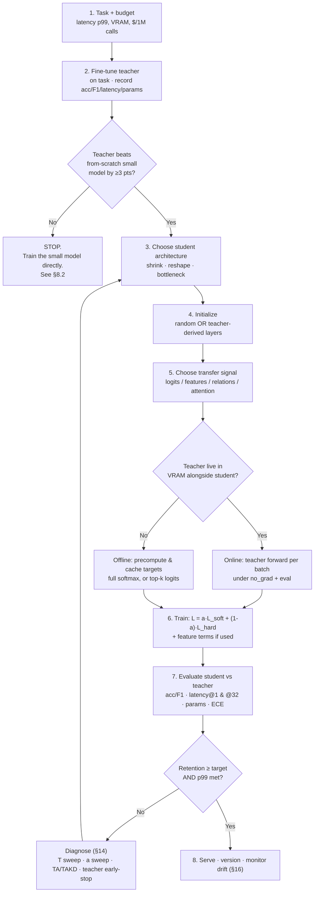

# CS-08 — Knowledge Distillation I: Foundations & DistilBERT

| Field | Value |
|---|---|
| **Module** | Model Compression / Distillation |
| **Source video(s)** | LLM Fine-Tuning 10: LLM Knowledge Distillation \| How to Distill LLMs (DistilBERT & Beyond) — Part 1 |
| **Transcript file(s)** | `LLM_Fine-Tuning_10_LLM_Knowledge_Distillation_How_to_Distill_LLMs_DistilBERT_Bey.txt` |
| **Companion code** | `LLM Fine-Tuning-10-11-knowledge-distillation/Knowledge_DIstillation_in_Deep_Learning.ipynb` |
| **Prerequisites** | CS-01 (lifecycle), CS-02 (transfer learning), CS-05 (backprop/attention), CS-06 (Hugging Face), CS-07 (BERT fine-tuning) |
| **Difficulty** | Intermediate theory, Advanced practice (the loss is 6 lines; the T² factor and the capacity gap are where people fail interviews) |
| **Hands-on required** | Yes — the MNIST demo runs in <90 s on CPU and is the fastest way to *see* soft targets work |
| **Estimated study time** | 6h theory + 5h practical |

---

## 0. Executive Summary

- **Knowledge distillation (KD) trains a small "student" model to reproduce a large "teacher" model's full output *distribution*, not just the one-hot answer.** The instructor's analogy [6:05]: a student who gets the teacher's class notes passes the exam with less effort than one who studies everything from scratch. The notes are the **soft labels**.
- **The single most important number in this module: a soft target with 3 classes carries up to 3 numbers per example instead of 1.** For a 32,000-token vocabulary the teacher's per-position distribution carries up to 32,000 numbers. That is the entire value proposition — you are trading *labels* for *supervision density*.
- **The loss is `L = α·CE(student, hard_labels) + (1−α)·T²·KL(student_soft ‖ teacher_soft)`** — but see the naming trap in §7.1: the notebook writes it as `alpha*loss_soft + (1-alpha)*loss_hard` with `alpha=0.7`, i.e. **the notebook's α weights the *soft* term while Hinton's α weights the *hard* term.** Get this backwards in an interview and you will look like you copied a blog.
- **The `T²` factor exists because scaling the teacher's logits by `1/T` scales the KL gradient by `1/T`.** Multiplying the loss by `T²` restores the gradient to `O(1)`. Without it, at `T → ∞` the soft term's gradient vanishes and KD silently degrades into ordinary cross-entropy training. Derivation in §4.2; worked numeric proof in §4.2.4.
- **Two mechanisms make KD work, and they are different things:** (1) *dark knowledge* — the teacher's non-argmax probabilities encode inter-class similarity (a "3" gets probability mass on "8" and "5"); (2) *regularization* — soft targets have far lower variance than one-hot targets, so the student overfits less on small datasets. Hinton's MNIST experiment (§13.1) isolates mechanism (1) by deleting a whole class from the transfer set.
- **Taxonomy in one line:** you can distill *logits* (response-based), *features* (FitNets/hint layers), *relations* (RKD: distances, angles), *attention maps*, or *data* (data-free KD). You can do it *offline*, *online* (mutual learning), *generationally* (born-again), or *without any data at all*.
- **DistilBERT is the canonical encoder result: 6 layers instead of 12, 66.9M params instead of 109.5M (40% smaller), 1.63× faster, 77.0 GLUE instead of 79.5 (97%).** It is trained with a **triple loss** — KD loss (T=2) + masked-LM loss + cosine embedding loss between teacher and student hidden states — and it is **initialized by taking every other layer of the teacher**, not randomly.
- **The capacity gap is real and counter-intuitive: a *bigger* teacher can produce a *worse* student.** Mirzadeh's TAKD fixes it by inserting an intermediate "teacher assistant". Cho & Hariharan showed the best student often comes from an *early-stopped* teacher, not the most accurate one.
- **Distillation beats quantization when you need fewer FLOPs; quantization beats distillation when you only need fewer bytes.** Distillation changes the architecture and needs a training run; quantization changes the numerics and (for PTQ) needs almost nothing. Forward-refs: CS-10, CS-11. Decision table in §13.4.
- **The instructor's own demo reaches teacher 94.20% / student 94.21% on MNIST** with a student that has 5.3× fewer parameters [notebook cells 25–26] — **but the same notebook produces 22% teacher / 60.8% student on TweetEval** [cell 70], which is not a distillation win, it is an untuned teacher. §14.3 and §18 debug exactly that.
- **STOP condition that matters most:** if your teacher is not genuinely better than a from-scratch small model on the target task, distillation will transfer its mistakes, cost you a teacher forward pass per example forever, and you should just train the small model directly.

---

## 1. The Problem This Solves

### 1.1 What breaks in the real world without this

| Failure | What it looks like | Root cause |
|---|---|---|
| **The 7B model on a 2-vCPU box** | The demo works on an A10G. Production wants to run it in a Lambda with 3 GB of RAM and a 900 ms p99 budget. | Nobody planned for a smaller artefact |
| **The $40k/month inference bill** | 12M classification calls/month on a 7B model at ~0.4 s each. Finance asks why. | Model is 10× larger than the task needs |
| **The "we'll just use a smaller checkpoint" regression** | You swap `bert-large` for `bert-base` and macro-F1 on the rare classes drops 14 points. | Small model trained on hard labels alone did not learn the tail |
| **The 5-shot fine-tune that overfits** | 800 labelled examples, 110M-param model, train accuracy 99%, val 71%. | Hard labels give 1 bit of supervision per example |
| **The "we already have a teacher" waste** | A fine-tuned 340M model sits in the registry doing nothing while you train a 22M model from scratch on the same data. | Nobody knows distillation exists |

### 1.2 The state of the art before distillation

Before Hinton, Vinyals & Dean (2015), compressing a trained model meant one of:

- **Pruning** — delete weights/heads/layers. Unstructured pruning gives sparsity but no wall-clock speedup without sparse kernels; structured pruning costs accuracy fast.
- **Quantization** — fewer bits per weight. This was pre-PTQ-as-we-know-it; 8-bit was a research project, not a `load_in_8bit=True` flag.
- **Just training a smaller model** — which needs *more* labelled data than the big model did, because the small model has less capacity to absorb noise.
- **Model compression / "Dark Knowledge" (Buciluǎ et al., 2006)** — the actual ancestor: train an ensemble, then train a small model on the ensemble's *labels*. Hinton's contribution was to use the **full probability vector** and to introduce **temperature**.

The gap: none of these could transfer *what the big model learned about the structure of the problem* — only its final answers.

### 1.3 The naive approach and precisely why it fails

**Naive approach: train the small model on the same labelled data, same loss, same schedule.**

It fails for a measurable reason. Consider the instructor's running example [57:00]–[59:07]: three classes — `cat`, `dog`, `rabbit`. A cat image:

| Signal | Vector | Information content |
|---|---|---|
| Hard label (one-hot) | `[1, 0, 0]` | 1 bit of supervision |
| Teacher's soft label | `[0.7, 0.2, 0.1]` | ~1.16 nats = 1.68 bits of supervision on this example |

The soft label says *two* things at once: "this is a cat" **and** "a cat looks much more like a dog than like a rabbit." The one-hot label says only the first. The second statement is a free, dense, *relative* constraint on the student's internal geometry — and it is exactly the constraint a low-capacity model needs, because the model does not have to spend capacity discovering that cats and dogs share features (fur, ears, four legs) from the raw label stream.

Now scale the arithmetic to language. For a token-level LM with a 32k vocabulary, the hard label is 1 index out of 32,000; the teacher's soft distribution is 32,000 numbers, of which perhaps 20 carry non-negligible mass. **You have multiplied the supervision per token by ~20× at zero extra labelling cost**, because the teacher already had to do the forward pass.

And a second, independent failure of the naive approach: **variance**. A one-hot target is a maximum-variance estimator of the class distribution. On a 2,500-example training set (the notebook's TweetEval subset [cell 43]) the small model will fit the label noise. A soft target is a smoothed, lower-variance estimator of the same thing, so it acts as a data-dependent regularizer. §13.1 shows this is not a small effect.

### 1.4 A concrete motivating number

The notebook's MNIST demo [cells 25–26]:

| Model | Hidden layers | Params | Test accuracy |
|---|---|---|---|
| Teacher MLP | 2 (512, 256) | **535,818** | 94.20% |
| Student MLP | 1 (128) | **101,770** | 94.21% |

The student has **19.0% of the teacher's parameters** and matches it. That is a 5.26× compression at *zero* measured accuracy cost — on a task where a from-scratch 101k-param MLP trained for 1 epoch on hard labels would land near 89–91%.

The video reports the same shape of result with a slightly different run: teacher ≈95%, student ≈93% [50:34]–[50:57], and on a second run teacher ≈94%, student ≈94% [55:52]–[56:04]. The instructor is explicit that these are 1-epoch numbers and therefore noisy: *"this result might vary but yeah this differences is going to be reduced as my teacher is able to perform in a similar way my student will also be able to perform"* [56:27]–[56:47].

---

## 2. First-Principles Mental Model

### 2.1 The analogy (the instructor's own, from [10:40]–[12:15])

A student is preparing for an exam. There are two ways:

1. **Study everything from scratch** — internet, Wikipedia, books, ChatGPT. Slow, expensive, and the student has to rediscover which parts matter.
2. **Take the teacher's class notes** — the teacher is a subject-matter expert who has *already* done the filtering. The notes are compressed knowledge: they contain not just the answers but the *relative importance* of concepts, the common confusions, the "if you see X, think Y" heuristics.

> *"So the student can pass the exam with less effort instead of studying everything from scratch."* [6:07]

Mapping:

| Analogy | Deep learning |
|---|---|
| Teacher | The large, already-trained model (the instructor: "a heavy model, a large model" [12:29]–[12:44]) |
| Student | The small model ("a small model... which have been trained on the same amount of data or more or less data" [33:14]–[33:30]) |
| Class notes | The teacher's **soft labels** — the temperature-scaled softmax over logits |
| The exam | The held-out test set |
| Effort saved | Training data, training time, and inference FLOPs |

### 2.2 Where the analogy breaks

1. **A teacher's notes are lossy and *chosen*; a soft distribution is complete and mechanical.** The teacher network does not decide what to put in the notes — it emits a full probability vector on every input. The *student's* objective decides what to keep. There is no curriculum unless you build one.
2. **Notes transfer regardless of the teacher's skill; soft labels transfer the teacher's errors verbatim.** If the teacher is confidently wrong, the student learns confident wrongness. There is no "the teacher was just having a bad day" filter.
3. **The exam is the same for both in the analogy. In KD the student is usually evaluated on the same task, but it can be a *different* model family, a *different* tokenizer, or a *different* modality.** A student that cannot represent the teacher's function class will "misread the notes."
4. **A student who memorizes the notes without understanding fails novel questions. A distilled student can too** — this is the "KD does not transfer the teacher's predictive *distribution*" result (Stanton et al., 2021), §13.2.

### 2.3 The actual mechanism, stated mechanically

```
FOR each minibatch (x, y):
    t_logits = teacher(x)                      # NO gradient — teacher is frozen
    t_soft   = softmax(t_logits / T)           # the "class notes"
    s_logits = student(x)                      # student's raw output
    s_log_soft = log_softmax(s_logits / T)     # log-probs, for KLDivLoss

    loss_soft = KL(t_soft ‖ s_soft) * T²       # dark knowledge term
    loss_hard = CE(s_logits, y)                # ordinary supervised term
    loss      = α·loss_soft + (1−α)·loss_hard  # notebook convention

    loss.backward()      # gradients flow ONLY into the student
    optimizer.step()
```

Every line of that loop maps to a specific paragraph in the Hinton paper, and every one of them is a place people get it wrong. §4 walks each line.

### 2.4 The one-sentence version

**Distillation is supervised learning where the label is not "the right answer" but "the teacher's entire belief about the answer," and the temperature knob controls how much of that belief you are willing to copy.**

---

## 3. Core Concepts — Exhaustive Glossary

| Term | Definition | Why it matters | Common confusion |
|---|---|---|---|
| **Knowledge distillation (KD)** | Training a smaller model to match a larger model's output distribution. Defined by the instructor [5:37]: "a technique used in deep learning to transfer the knowledge of the large heavy model... into the smaller model." | The whole module | Confused with *fine-tuning*, which changes a model's task; KD changes a model's *size* |
| **Teacher model** | The large, trained model that supplies targets. Frozen during distillation. | Supplies the supervision | People believe it must be bigger. It must be **better on the task**, not bigger (§10.1) |
| **Student model** | The small model being trained. | The deliverable | People believe the student must share the teacher's architecture. It need not (relation-based KD crosses architectures) |
| **Soft label / soft target** | The teacher's temperature-scaled softmax output, e.g. `[0.7, 0.2, 0.1]`. The instructor [30:35]: "the softmax probability itself is called the soft label." | Carries dark knowledge | People call it "softmax output." It is the *temperature-scaled* softmax output |
| **Hard label / hard target** | The one-hot ground truth, e.g. `[1, 0, 0]` [28:51]–[29:46]. | The ordinary supervised signal | People assume hard labels become irrelevant in KD. They do not — see §7.1 on α |
| **Dark knowledge** | The information encoded in the *non-argmax* entries of a teacher's output: which wrong answers the teacher considered plausible, and how plausible. | The mechanism that makes soft targets worth more than one-hot | People think it means "hidden layers." It means the tail of the output distribution |
| **Temperature (T)** | The divisor applied to logits before softmax: `softmax(z/T)`. `T=1` is the model's native distribution. | Controls how much of the tail is visible | **T is never used at inference.** Set T=1 for serving, always |
| **α (alpha)** | The interpolation weight between the soft and hard losses. | The single most mis-set hyperparameter | **The notebook and the paper assign α to opposite terms.** §7.1 |
| **T² factor** | The `T²` multiplier on the KL term. | Restores gradient magnitude under `1/T` logit scaling | People drop it, it "works", and the soft term silently contributes nothing |
| **Response-based KD** | Distilling the final output layer only (logits/soft targets). Hinton's original. | Simplest, cheapest, works when architectures differ | Confused with "logit matching," which specifically means matching raw logits in the high-T limit |
| **Feature-based KD** | Distilling intermediate hidden representations (FitNets "hint layers"). | Richer signal, more plumbing | Requires dimension alignment (a regressor) |
| **Relation-based KD (RKD)** | Distilling *relations between examples* — pairwise distances, angles across triplets — rather than per-example vectors. | Works across architectures and dimensions; no alignment needed | People think it replaces logit KD. It complements it |
| **Attention transfer (AT)** | Matching attention maps: `A = Σ_c |F_c|²`, normalized, between teacher and student. | Cheap spatial hint for CNNs | Only meaningful for architectures with spatial feature maps |
| **Self-distillation** | The teacher and student share an architecture; the "teacher" is an earlier checkpoint, a deeper branch, or an ensemble of the student's own layers. | No external teacher needed | Confused with *born-again*, which is generational |
| **Born-again networks (BAN)** | Train student₀ on hard labels → it becomes teacher for student₁ → etc. Accuracy can *increase* across generations. | Shows a model can teach itself better than the labels can | People expect degradation. The paper reports improvement |
| **Online / mutual distillation** | Several students trained simultaneously, each using the others as teachers (deep mutual learning). No fixed teacher. | Often beats a fixed-teacher setup for small nets | "Online" refers to concurrent training, not to serving |
| **Ensemble distillation** | Distill an ensemble (or its logit average) into one model. | Gets ensemble quality at single-model latency | Averaging *probabilities* ≠ averaging *logits*. The latter is usually better |
| **Data-free KD** | Reconstruct or generate inputs from the teacher's statistics (or from a generator) so no real data is needed. | The only option when the teacher is a black-box API and you have no data | Reconstructed samples are not real data — accuracy gap is real |
| **Task-specific KD** | Distillation where the teacher is first fine-tuned on the task, then distilled. TinyBERT's two-stage recipe. | Usually a 3–8 point GLUE win over distilling a general teacher | People distill the *base* checkpoint and wonder why the student is bad |
| **Sequence-level KD (Seq-KD)** | The teacher generates complete sequences (beam search); the student trains on those sequences as hard targets. Kim & Rush (2016). | The only KD available through a text-only API | People call this "distillation" and mean token-level. Be explicit |
| **Token-level / word-level KD** | Per-token KL between teacher and student next-token distributions. Requires teacher logits. | Denser signal than Seq-KD, but needs API access to logits | Needs **identical tokenizers** or the distributions are over different spaces |
| **Chain-of-thought (CoT) distillation** | The teacher emits reasoning traces; the student is trained to produce the trace *and* the answer. | The current standard for reasoning SLMs | The trace is not the answer — evaluating only the final answer hides trace degradation |
| **Distilling step-by-step** | Hsieh et al. (ACL 2023): extract rationales from the LLM, train the small model multi-task on (input → rationale) + (input → label). A 770M T5 student beat the 540B PaLM teacher on several benchmarks. | Cited in the companion notebook [cell 71] | People conflate it with plain CoT distillation; the distinctive part is the **multi-task** objective and the data-efficiency claim |
| **Capacity gap** | When the teacher is *too* much larger than the student, distillation underperforms. | Explains why 70B → 0.5B distillation often loses to 7B → 0.5B | People assume "bigger teacher = better student." False (§10.2) |
| **Teacher assistant (TA)** | An intermediate-sized model inserted between teacher and student (TAKD), so the student learns from a model closer to its own capacity. | The standard fix for the capacity gap | One TA is usually enough; chaining many TAs gives diminishing returns |
| **TAKD** | "Improved Knowledge Distillation via Teacher Assistant," Mirzadeh et al., AAAI 2020. | The named technique for §10.2 | — |
| **FitNets / hint layer** | Romero et al. (2015): the student's hidden layer (the "guided layer") is regressed onto the teacher's hidden layer (the "hint layer"), usually via a learned linear regressor when widths differ. | First feature-based KD | The regressor is *discarded* after distillation; people leave it in the served model |
| **Cosine embedding loss** | `1 − cos(h_teacher, h_student)`. One of DistilBERT's three loss terms. | Aligns hidden-state *directions*, not magnitudes | Requires equal hidden sizes (768 = 768 for BERT) |
| **DistilBERT** | Sanh et al. (2019): a 6-layer, 66.9M-param BERT-base student. 40% smaller, 60% faster, 97% of GLUE. | The reference implementation of encoder KD | Its "97%" applies to GLUE — not to SQuAD (§13.3) |
| **Triple loss (DistilBERT)** | `L = L_ce + α·L_mlm + β·L_cos` | Three simultaneous signals | People implement only `L_ce` and lose 1–2 GLUE points |
| **Layer initialization ("take every other")** | Initialize the 6-layer student from layers `[0, 2, 4, 6, 8, 10]` of the 12-layer teacher. | Small but consistent gain (~0.5–1.0 GLUE) and much faster convergence | People assume it is a big win. It is a cheap win |
| **Calibration** | Whether predicted probabilities match observed frequencies. Distilled models are typically *better* calibrated than hard-label-trained ones. | A free bonus of soft targets | Not automatic — measure ECE before claiming it |
| **ECE (Expected Calibration Error)** | Bin predictions by confidence, average `|accuracy − confidence|` weighted by bin size. | The standard calibration metric | 15-bin ECE is the convention; report the bin count |
| **Teacher-student agreement** | Fraction of held-out examples where student argmax == teacher argmax. | The most direct measure of "did the distillation take" | High agreement with a *bad* teacher is a failure, not a success |

---

## 4. Deep Dive — How It Actually Works

### 4.1 Mechanism, step by step

**Stage 0 — Verify the teacher.** Fine-tune the teacher on the target task. Record its test accuracy, F1, per-class recall, inference latency and parameter count. **If you do not have these numbers, you cannot evaluate the distillation later.** The notebook's TweetEval experiment skipped this step and produced a teacher at 22% accuracy [cell 70] — see §10.4 and §18.

**Stage 1 — Choose the student architecture.** Three strategies, in increasing order of payoff:

| Strategy | Example | When |
|---|---|---|
| **Shrink** the teacher uniformly | 12 layers → 6 layers, hidden 768 → 768 (DistilBERT) | Default. Cheapest, most predictable |
| **Reshape** (narrow and shallow) | 12L×768 → 4L×312 (TinyBERT_4) | When you need maximum speedup and can afford a harder training run |
| **Bottleneck** | MobileBERT: 24 layers but hidden 512 with 128-wide bottlenecks | When depth matters more than width for the task |

**Stage 2 — Initialize.** Either (a) random, or (b) copy structural sub-parts of the teacher. The instructor calls these the "two types of student model" [35:39]–[38:26]: *"the first type... we just initialized with some random weight... we haven't trained it yet"* and *"the second type... the model which we have trained."* Note that he is describing two different things in the same breath, and the distinction matters:

| Axis | Option A | Option B |
|---|---|---|
| Student *weights* | Random init | Teacher-derived init (every-other-layer) |
| Student *prior training* | None — distill from scratch | Pre-trained/fine-tuned first, then distilled (*"we can retrain the student model which we have already trained with the special loss function"* [39:05]) |
| Effect | More capacity is spent fitting soft targets | Warm start; faster convergence, better final score |

In the notebook he demonstrates **both**: cell 19 runs `pretrain_student(...)` on hard labels first, then cell 23 calls `distill(...)`. He shows the random-init path first (cell 21 → cell 23) and then re-initializes and shows the pretrain→distill path [53:17]–[56:08].

**Stage 3 — Build the batch.** Each batch carries **both** `y` (hard labels) and `t_logits` (teacher logits). Three implementations:

| Approach | Teacher cost | When to use |
|---|---|---|
| **Live teacher** (notebook's `distill()`) | One forward per batch, every epoch | Teacher is small enough to co-reside in VRAM; ≤2 epochs |
| **Precomputed soft targets** | One forward per example, once | More than ~2 epochs, or the teacher does not fit alongside the student |
| **API teacher** | One call per example, once; **no logits** | Only Seq-KD is possible — you get sampled text, not a distribution |

**Stage 4 — Forward the teacher under `no_grad` and in `eval()` mode.** The notebook does `with torch.no_grad(): t_logits = teacher(x)` — correct for the autograd graph. The BERT section additionally does `teacher.eval()` [cell 57] — also correct, and **not optional**, because BERT has `Dropout(p=0.1)` in every layer. A teacher left in `train()` mode emits a *different* soft distribution on every forward pass of the same input; the student is then chasing a moving target.

**Stage 5 — Compute the two losses and combine.** `loss = α·loss_soft + (1−α)·loss_hard`. §7.1 for which α.

**Stage 6 — Backprop into the student only.** `optimizer.zero_grad(); loss.backward(); optimizer.step()` where the optimizer was constructed over `student.parameters()` only. If you accidentally include the teacher's parameters, and you did *not* use `no_grad`, the teacher will be trained on its own output distribution — a degenerate fixed point where the teacher's entropy collapses.

**Stage 7 — Evaluate against the teacher, not just against the labels.** Report: student accuracy, teacher accuracy, the retention ratio, latency at batch size 1 and 32, parameter count, and the four-quadrant agreement table (§12.2).

### 4.2 The mathematics

#### 4.2.1 Notation

| Symbol | Meaning | Shape |
|---|---|---|
| `x` | Input (image, token sequence) | — |
| `y` | Hard (one-hot) label | `[K]` or scalar index |
| `K` | Number of classes / vocabulary size | scalar |
| `N` | Batch size | scalar |
| `v = f_t(x)` | Teacher **logits** (pre-softmax) | `[N, K]` |
| `z = f_s(x)` | Student **logits** | `[N, K]` |
| `T` | Temperature, `T > 0` | scalar |
| `q_i = softmax(v/T)_i` | Teacher **soft target** | `[N, K]`, sums to 1 |
| `p_i = softmax(z/T)_i` | Student **soft prediction** | `[N, K]`, sums to 1 |
| `α` | Interpolation weight | scalar in `[0,1]` |

Temperature-scaled softmax, written out:

```
q_i = exp(v_i / T) / Σ_j exp(v_j / T)
```

#### 4.2.2 The loss

**Hinton's original form** (Hinton, Vinyals & Dean, 2015, arXiv:1503.02531, submitted 9 March 2015 — the date the instructor gives [7:04]):

```
L_KD = α · CE(y, p_{T=1})  +  (1 − α) · T² · KL(q ‖ p)
```

where `p_{T=1} = softmax(z)` is the student's **unscaled** softmax — note that the hard-label term uses `T=1`, because you are comparing against a one-hot target and temperature would make it uninterpretable.

**The notebook's form** [cell 21]:

```python
loss_soft = kl_loss(s_log_probs, t_probs) * (temperature ** 2)
loss_hard = ce_loss(s_logits, y)
loss      = alpha * loss_soft + (1 - alpha) * loss_hard     # alpha = 0.7
```

Same equation, **opposite naming of α**. See §7.1.

**Why KL and not cross-entropy?** Because they differ by a constant:

```
CE(q, p) = −Σ_i q_i log p_i
         = Σ_i q_i log(q_i / p_i) − Σ_i q_i log q_i
         = KL(q ‖ p) + H(q)
```

`H(q)` — the teacher's entropy — does not depend on the student's parameters, so `∇_θ CE(q,p) = ∇_θ KL(q‖p)`. **The notebook's `KLDivLoss` and a soft cross-entropy are the same optimization.** Use whichever your framework makes numerically stable; PyTorch's `KLDivLoss` takes `input = log-probabilities` and `target = probabilities`, so it is the safer default.

**Why the KL direction is `KL(teacher ‖ student)` and not the reverse.** KL is asymmetric. `KL(q‖p)` is the *mean-seeking* / *moment-matching* direction: it penalizes `p_i > 0` wherever `q_i ≈ 0`. The reverse, `KL(p‖q)`, is *mode-seeking* and lets the student place mass where the teacher has none. PyTorch's `KLDivLoss(input, target)` computes `target · (log target − input)`, i.e. `KL(target ‖ input)`. Since your `target` is the teacher and your `input` is the student's log-softmax, **`KLDivLoss` gives you `KL(teacher ‖ student)` — which is the direction you want.** Getting the argument order backwards is a real bug that produces plausible-looking training curves.

#### 4.2.3 The gradient, and why `T²` exists

**Step 1 — the gradient of the soft loss with respect to the student's logits.**

```
L_soft = KL(q ‖ p) = Σ_i q_i (log q_i − log p_i)
```

Treating `q` as a constant (it is — the teacher is frozen), the only `θ`-dependence is through `p = softmax(z/T)`:

```
∂L_soft/∂z_k = −Σ_i q_i · ∂ log p_i / ∂z_k
```

With `log p_i = z_i/T − log Σ_j exp(z_j/T)`:

```
∂ log p_i / ∂z_k = (1/T)(δ_ik − p_k)
```

Therefore:

```
∂L_soft/∂z_k = −(1/T) Σ_i q_i (δ_ik − p_k)
             = −(1/T) (q_k − p_k)
             = (1/T) (p_k − q_k)
```

**This is the key result: the gradient with respect to the logits is `(p − q)/T` — it is inversely proportional to `T`.** At `T = 10` the soft-target gradient is 10× *smaller* than at `T = 1`.

**Step 2 — why that is a problem.** You raise `T` precisely to expose the tail of the distribution. Raising `T` therefore *should* give you more signal. Instead, without a correction, raising `T` gives you a **weaker** gradient, so the soft term is drowned out by the hard CE term whose gradient is `O(1)` regardless of `T`. You would conclude "temperature doesn't help" — and be wrong, because you measured a bug.

**Step 3 — the fix.** Multiply the soft loss by `T²`:

```
L_soft' = T² · KL(q ‖ p)
∂L_soft'/∂z_k = T² · (1/T) (p_k − q_k) = T (p_k − q_k)
```

**Step 4 — the large-T limit, which is the real justification.** Expand `softmax(v/T)` for large `T` using the first-order Taylor expansion `e^u ≈ 1 + u`:

```
q_i = exp(v_i/T) / Σ_j exp(v_j/T) ≈ (1 + v_i/T) / (K + Σ_j v_j/T)
    ≈ (1/K)(1 + (v_i − v̄)/T)
```

where `v̄ = (1/K)Σ_j v_j`. Similarly `p_i ≈ (1/K)(1 + (z_i − z̄)/T)`. Subtracting:

```
p_i − q_i ≈ (1/(K·T)) · ((z_i − v_i) − (z̄ − v̄))
```

Substituting into the `T²`-scaled gradient:

```
∂L_soft'/∂z_k = T (p_k − q_k) ≈ (1/K) [ (z_k − v_k) − (z̄ − v̄) ]
```

**Every `T` has cancelled.** The `T²` factor makes the KD gradient converge, as `T → ∞`, to a *fixed, `T`-independent quantity*: the (mean-centred) difference between student and teacher logits. This is Hinton's remark that at high temperature "the distillation is equivalent to minimizing `½(z_i − v_i)²`." Note the direct consequence: **at high T the offset `z̄ − v̄` becomes unconstrained**, which is why the original paper recommends the hard-label term with `α ≈ 0.1` — the mean logit has to be pinned by something.

**Step 5 — the interview answer, in one sentence.** *"Because `∂KL/∂z = (p − q)/T` scales as `1/T`, so without `T²` the soft-target gradient shrinks as you raise `T` and the soft term silently disappears into the hard-label term; `T²` restores the gradient to `O(1)` and, in the high-temperature limit, makes the loss reduce to matching teacher logits."*

#### 4.2.4 Worked numeric example (the instructor's own)

From [57:00]–[59:07] and [1:01:41]–[1:02:21]. Three classes: `cat`, `dog`, `rabbit`. Input: a cat image. `y = [1, 0, 0]`.

| Quantity | Teacher | Student |
|---|---|---|
| Native softmax output (T=1) | `q = [0.70, 0.20, 0.10]` | `p = [0.50, 0.30, 0.20]` |

**Hard loss (cross-entropy against the one-hot label):**

```
loss_hard = −log(p_cat) = −log(0.50) = 0.6931 nats = 1.0000 bits
```

**Soft loss at T = 1.** With `q = [0.70, 0.20, 0.10]`, `p = [0.50, 0.30, 0.20]`:

```
KL(q‖p) = 0.70·ln(0.70/0.50) + 0.20·ln(0.20/0.30) + 0.10·ln(0.10/0.20)
        = 0.70·ln(1.4000)  + 0.20·ln(0.6667)  + 0.10·ln(0.5000)
        = 0.70·(+0.33647)  + 0.20·(−0.40547)  + 0.10·(−0.69315)
        = 0.23553 − 0.08109 − 0.06931
        = 0.08512 nats  (= 0.12280 bits)
```

**Now temperature-scaled at T = 2.** The logits (fixed up to an additive constant, which softmax ignores) are `z = ln(p) = (−0.6931, −1.2040, −1.6094)` for the student and `v = ln(q) = (−0.3567, −1.6094, −2.3026)` for the teacher.

| | cat | dog | rabbit | sum |
|---|---|---|---|---|
| `z/T = z/2` | −0.34657 | −0.60200 | −0.80470 | — |
| `p^{T=2}` | **0.41546** | **0.32180** | **0.26275** | 1.00001 |
| `v/T = v/2` | −0.17835 | −0.80470 | −1.15130 | — |
| `q^{T=2}` | **0.52288** | **0.27949** | **0.19764** | 1.00001 |

```
KL(q^{T=2} ‖ p^{T=2})
  = 0.52288·ln(0.52288/0.41546) + 0.27949·ln(0.27949/0.32180) + 0.19764·ln(0.19764/0.26275)
  = 0.52288·(+0.22994)          + 0.27949·(−0.14098)          + 0.19764·(−0.28487)
  = 0.12023 − 0.03940 − 0.05630
  = 0.02453 nats
```

**Raw KL dropped from 0.08512 to 0.02453 — a 3.5× reduction — purely because of temperature.** If you reported this as "the loss went down, so T=2 is better," you would be reading a scaling artefact. Apply `T²`:

```
T² · KL = 4 × 0.02453 = 0.09812 nats     (vs 0.08512 at T=1 — same ballpark)
```

**Gradient check.** The per-class logit gradient is `T·(p − q)` with the `T²` factor and `(p − q)/T` without it:

| Class | `p − q` at T=2 | gradient **with** `T²` | gradient **without** `T²` |
|---|---|---|---|
| cat | 0.41546 − 0.52288 = −0.10742 | 2 × (−0.10742) = **−0.21484** | 0.5 × (−0.10742) = **−0.05371** |
| dog | 0.32180 − 0.27949 = +0.04231 | **+0.08462** | **+0.02116** |
| rabbit | 0.26275 − 0.19764 = +0.06511 | **+0.13022** | **+0.03256** |

Compare the T=1 gradient on the cat logit, which is `(p − q) = 0.50 − 0.70 = −0.20`. **The `T²`-scaled T=2 gradient (−0.21484) is within 7% of the T=1 gradient (−0.20), while the unscaled T=2 gradient is 3.7× smaller.** That is the entire purpose of `T²`: raise `T` to expose the tail, and keep the gradient magnitude you had at `T=1`.

**Total loss, both conventions** (using `T²·KL = 0.09812`, `CE = 0.6931`):

| Convention | Formula | Substitution | Result |
|---|---|---|---|
| Notebook (`α` weights **soft**) | `α·L_soft + (1−α)·L_hard` | `0.7(0.09812) + 0.3(0.6931)` | **0.2766** |
| Hinton (`α` weights **hard**) | `α·L_hard + (1−α)·L_soft` | `0.1(0.6931) + 0.9(0.09812)` | **0.1576** |

The two numbers differ by 76% for the same physical situation. This is why §7.1 exists.

**Where the dark knowledge is, quantified.** Extend the example: suppose there is a real 4th class, `car`, and the teacher gives it 0.001 while the student gives it 0.01. Its contribution to the KL is `0.001·ln(0.001/0.01) = 0.001·(−2.303) = −0.0023` nats. **The informative classes are the top two or three, not the tail of 32,000.** This is why production LLM KD caches top-k logits (k ≈ 20–100), not the full vocabulary — §11.3.

### 4.3 What happens at the tensor/gradient level

Consider a linear output layer with weight `W ∈ ℝ^{K×d}` and logits `z = W h`, where `h` is the student's final hidden state.

```
∂L_soft'/∂W = ∂L_soft'/∂z · hᵀ = T(p − q) hᵀ
```

Three consequences you can reason about directly:

1. **Each example contributes a rank-1 update in the direction of its own hidden state `h`, with a `K`-dimensional coefficient vector `T(p − q)`.** Under hard labels, that coefficient vector is `(p − y)`, which is nonzero in exactly the classes the student got wrong. Under soft targets it is nonzero in **every class where the student's belief differs from the teacher's** — typically 3–20 classes per example instead of 1–2.

2. **The magnitude of the update is bounded by `T` and the total-variation distance between `p` and `q`.** If the student already matches the teacher, `p ≈ q` and there is no gradient — the soft term self-anneals as the student converges. This is a feature: KD automatically re-weights to the examples the student has not yet absorbed.

3. **The student's final hidden layer `h` receives gradients from *both* terms, and they pull in different directions when the teacher is wrong.** On an example where the teacher's argmax ≠ `y`, the soft term pushes `h` toward teacher-like representations and the hard term pushes away. The `α` value decides which wins on that example. This is the tensor-level statement of "distillation transfers the teacher's errors," and it is the reason a mis-fine-tuned teacher is worse than no teacher at all.

### 4.4 Memory & compute accounting

**The teacher's forward pass is the dominant added cost, and it scales with `P_teacher × B × L`.**

Forward FLOPs for a transformer, ignoring attention (which is `O(L²)` and matters at long `L`):

```
FLOPs_forward ≈ 2 · P · B · L
FLOPs_training_step ≈ 6 · P · B · L        (fwd + bwd, ≈3× forward)
```

**Worked: the notebook's BERT distillation** (batch=16, max_len=128, tweet_eval, 2500 train examples → 157 steps/epoch) [cells 39, 43, 64]:

| Term | Params | FLOPs per batch | Share of step |
|---|---|---|---|
| Teacher forward (bert-large, frozen, no_grad) | 335M | `2 × 3.35e8 × 16 × 128 = 1.372 TFLOP` | **50.4%** |
| Student forward+backward (bert-base) | 110M | `6 × 1.10e8 × 16 × 128 = 1.351 TFLOP` | 49.6% |
| **Total per step** | | **≈ 2.72 TFLOP** | 100% |
| Plain fine-tuning of the student only | | 1.351 TFLOP | — |

**KD roughly doubles the cost of one training epoch** (2.01×) *in addition to* the cost of producing the teacher. On an A100 (≈312 TFLOP/s dense fp16, realistically 35–45% MFU for these small shapes → ≈120 TFLOP/s effective), 157 steps × 2.72 TFLOP = 427 TFLOP → ≈3.6 s/epoch. On a free Colab T4 (≈65 TFLOP/s dense fp16, ≈25% MFU → ≈16 TFLOP/s), ≈27 s/epoch. Both are dominated by overheads in practice; the notebook's own numbers (a 1-epoch run finishing in about a minute [43:31]) are consistent.

**VRAM for the same run (fp16 weights + fp32 Adam states for the student):**

| Component | Calculation | Size |
|---|---|---|
| Teacher weights (bert-large, fp16, frozen) | `335e6 × 2 B` | 0.67 GB |
| Student weights (bert-base, fp16) | `110e6 × 2 B` | 0.22 GB |
| Student fp32 master weights (AdamW) | `110e6 × 4 B` | 0.44 GB |
| Adam moments `m`, `v` | `2 × 110e6 × 4 B` | 0.88 GB |
| Student gradients (fp32) | `110e6 × 4 B` | 0.44 GB |
| Activations (B=16, L=128, 12 layers, ≈10 tensors/layer) | ≈`16 × 128 × 768 × 2 B × 10 × 12` | ≈0.38 GB |
| **Total** | | **≈ 3.0 GB** |

Fits comfortably on a 16 GB T4, with room to raise the batch size. **Add QLoRA-style 8-bit loading for the teacher (CS-23) and a 7B teacher costs `7e9 × 1 B = 7 GB` instead of 14 GB** — that is the single most useful memory trick in KD.

**The MNIST demo, for contrast:**

| Component | Calculation | Size |
|---|---|---|
| Teacher (535,818 params × 4 B) | | 2.14 MB |
| Student (101,770 params × 4 B) | | 0.41 MB |
| Adam states for the student | `2 × 101,770 × 4` | 0.81 MB |
| **Total** | | **< 10 MB** |

The demo fits in L2 cache. It is an *excellent* teaching artefact and a *terrible* cost model — do not extrapolate anything about production VRAM from it.

### 4.5 The full taxonomy of distillation variants

Everything marketed as "distillation" is one point in a four-dimensional space. Naming the axes first prevents 90% of the confusion in this literature.

| Axis | Values | The question it answers |
|---|---|---|
| **What is transferred** | Response (logits) · Feature (intermediate) · Relation (between-examples) · Attention · Data | *Which tensor does the student get supervised on?* |
| **Teacher topology** | Single frozen · Early-stopped · Ensemble · Assistant chain (TAKD) · Self (own checkpoint) · Peer (mutual) · None (data-free) | *Where do the targets come from?* |
| **Temporal structure** | Offline (precomputed targets) · Online (teacher live in the loop) · Generational (born-again) | *When is the teacher evaluated?* |
| **Data** | Same labelled set · Unlabelled transfer set · Teacher-generated input+output · Synthesised from teacher statistics | *What are the inputs?* |

#### 4.5.1 Response-based (logit) distillation — Hinton 2015

The objective in §4.2.2. One signal, `K` numbers per example, at the model's output.

- **Requires:** matching output dimensionality. For classification, that means the *same label space* — not the same architecture.
- **Fails when:** the teacher's output layer is `[N, V]` with `V` from a different tokenizer than the student's (CS-09 §4.4) — the KL is finite, decreasing, and meaningless.
- **The high-`T` limit** is not a different method: as `T → ∞`, `T²·KL` reduces to `½(z_i − v_i)²` up to a constant, i.e. plain **logit matching** (§4.2.3, step 4). "Logit matching", "logit distillation" and "KD at high temperature" are the same thing observed at different `T`.

#### 4.5.2 Feature-based / intermediate distillation — FitNets (Romero et al., 2015)

Supervise the student's *hidden* state, not just its output.

```
L_hint = ½ ‖ u_h(x) − W_r · v_g(x) ‖²      # hint layer v_g (teacher) → guided layer u_h (student)
```

`W_r ∈ ℝ^{d_student × d_teacher}` is a **learned linear regressor**, needed only because the widths differ.

| Decision | Convention | Why | Failure if you get it wrong |
|---|---|---|---|
| Which teacher layer is the hint | One of the last few (FitNets uses the hint in the middle of the teacher) | Early layers are generic; late layers are task-specific | Hinting on layer 1 teaches nothing; hinting on the final layer duplicates logit KD |
| Regressor | A single `nn.Linear`, no bias, no activation | Keeps the mapping monotone and cheap | A deep MLP regressor can absorb the whole signal, and the student learns the regressor |
| **Discard the regressor at serve time** | Yes — it is a training scaffold | It is not part of the student's forward pass | Leaving it in ships a model whose `state_dict` does not match its advertised architecture |
| Loss weight | `0.1 – 1.0` against the KD term; a warm-up on the hint loss alone first | The hint loss is often larger in magnitude and can dominate early | Student converges to a shrunken, mean-predicting hidden state |

> **Beyond the video:** feature-based KD has a bad reputation in NLP that it does not deserve, and a good one in vision that it also does not deserve. The evidence, honestly summarised: on ImageNet and CIFAR, FitNets-style hints are worth roughly **+0.5 to +1.5 points** over response KD alone; the more elaborate successors (AT, RKD, CRD, PKD) are all in the same 1–2 point band, and which one wins flips with the teacher-student pair. In NLP, feature-based KD mostly shows up *inside* a method that also does response KD — DistilBERT's cosine embedding loss is a feature loss, and TinyBERT's `L_hidn` / `L_attn` terms are feature and attention losses. There is no reliable "best hint layer"; the paper that claims one is usually tuning it per (teacher, student, dataset) triple. **Treat feature KD as a +1 point knob, not a strategy.**

#### 4.5.3 Relation-based distillation — RKD (Park et al., CVPR 2019)

Instead of matching per-example vectors, match the *geometry of a batch*.

| Variant | The relation `ψ` | What it captures | Cost |
|---|---|---|---|
| **RKD-D** (distance) | `ψ_D(t_i,t_j) = ‖t_i − t_j‖₂ / μ` over all pairs, then `Σ ℓ_δ` between teacher and student pair-distances | "These two examples are similar; those two are far apart" | `O(B²)` |
| **RKD-A** (angle) | `ψ_A(t_i,t_j,t_k) = ⟨t̂_ij, t̂_kj⟩` where `t̂_ij` is the unit vector from `t_j` to `t_i` | The relative *directions* of three examples | `O(B³)` |
| **RKD-DA** | Distance + angle | Both | `O(B³)` |

The whole point: `t_i` can live in `ℝ^768` and `s_i` in `ℝ^256`; RKD never needs them to align, so **no regressor and no architectural surgery**. Two consequences people miss:

1. **RKD is batch-size dependent.** With `B = 16` there are 120 pairs and 3,360 triplets; with `B = 2` there are one and zero. Small-batch KD silently loses the relation term entirely. This is a genuine failure mode, not a theoretical one.
2. **RKD cannot be precomputed per example.** Every other method in this section produces a target that is a function of `x` alone. RKD's target is a function of *the batch*, so it forces an online teacher (or a cached teacher forward pass, with the relations computed at train time).

#### 4.5.4 Attention transfer (AT) — Zagoruyko & Komodakis, 2017

Match the *spatial* saliency of a convolutional teacher, not its values:

```
A(F) = Σ_c |F_c|²                    # F: [C, H, W] feature map → A: [H, W]
L_AT = ‖ A_T/‖A_T‖₂ − A_S/‖A_S‖₂ ‖₂  # normalized, so scale is irrelevant
```

**Attention transfer is defined only where there is a spatial axis.** For a transformer encoder with `L` tokens and `d` channels, the analogous object is the `[L, L]` attention matrix — TinyBERT's `L_attn = ‖A_T − A_S‖_F²` with `A = softmax(QKᵀ/√d)` — and that is a different loss with a different cost (`O(L²)` per head, and `L` matters). "Attention transfer" in a blog post about NLP usually means the attention-matrix loss, and the two are not interchangeable.

#### 4.5.5 Self-distillation and born-again networks

| Method | Teacher | Student | Result |
|---|---|---|---|
| **Self-distillation (checkpoint)** | An earlier epoch of the same model | The same architecture, restarted | Small, consistent gain; needs a checkpoint you already have for free |
| **Self-distillation (layer-wise)** | Deeper layers of the same network | Shallower layers, simultaneously (auxiliary heads) | Regularising; used in `bert-base`-style intermediate classifiers |
| **Born-again networks (Furlanello et al., 2018)** | Generation `k` | Generation `k+1`, **same size** | Accuracy *increases* over generations, and the ensemble of generations beats the ensemble of originals |

Born-again matters theoretically: if a student with *identical* capacity can improve by learning from a peer's soft targets, then the limiting factor was never capacity — it was the **hard labels**. That is the cleanest single argument that dark knowledge is real information and not a compression artefact. It also means "student" is a misleading name for the second generation; the right mental model is *iterated self-training with a smoothed label*.

#### 4.5.6 Online distillation and deep mutual learning (DML)

Deep Mutual Learning (Zhang et al., CVPR 2018): train `Θ₁` and `Θ₂` **simultaneously**, same size, each other's teacher.

```
L_Θ1 = CE(y, p₁) + KL(p₂ ‖ p₁)
L_Θ2 = CE(y, p₂) + KL(p₁ ‖ p₂)
```

Both terms carry gradients; there is no frozen model anywhere. The reported result is the counter-intuitive one: **two small students teaching each other beat either student learning from a large, strong teacher** on CIFAR-100 and Market-1501. Why: two interacting students explore different regions of the loss surface, so their disagreement is informative in a way a converged teacher's confidence is not; a fully converged teacher is *too* confident to be a good teacher (this is the §4.6 capacity-gap effect showing up from the other side).

> **Correction:** "online distillation" is not about online serving. It means the teacher is present and updated during training. If you see it in a serving architecture document, someone has confused two unrelated meanings of "online."

#### 4.5.7 Ensemble distillation

Distil the *average* of `M` teachers. The subtlety that decides your result:

| Target construction | Effect |
|---|---|
| Average the **probabilities**: `q = (1/M)Σ softmax(v_m/T)` | What the word "ensemble" suggests; this is what you get if you use an sklearn-style soft-voting ensemble |
| Average the **logits**: `v = (1/M)Σ v_m`, then `softmax(v/T)` | Usually better for KD, and it is what "ensemble logit" means in the Hinton paper. Logits average the *evidence*; probabilities average the *beliefs* and are systematically over-confident |

Two arithmetic notes: with `M` teachers the soft term's information content grows, so `α` should usually shift toward the soft term; and averaging logits requires all `M` teachers to share a label space (fine for an ensemble of the same family, not fine across tokenizers).

#### 4.5.8 Data-free distillation

The teacher is a black box (or a file you can read but not query); you have no training data (privacy, licensing, the data was deleted). Reconstruct or generate inputs that make the teacher behave as it originally did.

| Technique | Mechanism | The catch |
|---|---|---|
| **DeepInversion / BN-statistics matching** | Optimise a noise input so the teacher's BatchNorm running statistics are reproduced, plus a class-prior and image-prior regulariser | Needs BN layers — a transformer with LayerNorm gives you far weaker statistics to match |
| **Generator-based (DAFL, ZSKD)** | Train a generator so the teacher's outputs on generated inputs are confident and diverse, then distil on those | Two nested optimisations; the generator's mode coverage becomes your dataset's mode coverage |
| **Teacher-as-generator** | Ask the teacher for its own training data (GPT-4-class models can regurgitate memorised text) | Legally and ethically fraught; §16.7 |

Honest accuracy gap for data-free KD on vision benchmarks: **3–10 points** below real-data KD at the same student size. If you have *any* real data — even 5% of the original set — use it; the data-free machinery costs more than it saves.

#### 4.5.9 Task-specific distillation

Distil a teacher that has already been fine-tuned on the target task, not the general pretrained checkpoint.

| Recipe | Stages | Reported effect |
|---|---|---|
| Hinton-era | Fine-tune teacher on task → distil | Baseline |
| **TinyBERT (two-stage)** | (1) *General* distillation: teacher = `bert-base` pretrained, data = the pretraining corpus, losses = embedding + hidden + attention; (2) *Task* distillation: teacher = fine-tuned `bert-base`, data = task train set augmented, losses = the same three plus the prediction loss | Stage 2 is where the GLUE points come from. Distilling a *general* checkpoint gets you a smaller general checkpoint, which is not what you wanted |
| **DistilBERT (one-stage, task-agnostic)** | Distil from the pretrained teacher; **then** fine-tune the student normally on each downstream task | 77.0 GLUE after per-task fine-tuning. Cheaper than TinyBERT and about 1 point worse on GLUE at 6 layers |

The distinction matters for your budget: DistilBERT's approach needs one distillation run plus `n` cheap fine-tunes; TinyBERT's needs one distillation run *per task*. The first is what you want when you have 12 downstream tasks; the second is what you want when you have one task and a hard latency budget.

#### 4.5.10 Sequence-level KD vs token-level KD — Kim & Rush (EMNLP 2016)

The most important practical split in the whole module, and the one that decides whether your LLM distillation is even possible.

| | **Token-level (word-level) KD** | **Sequence-level KD (Seq-KD)** |
|---|---|---|
| Teacher signal needed | Full logit vector per position, `[T, V]` | One sampled/decoded sequence, `[T]` |
| Target | `softmax(v_t/T)` at every position | The decoded sequence, used as a **hard** label |
| Available through | An API that returns logprobs, or a locally hosted teacher | Any text interface at all, including a chat box |
| Tokenizer | Must match the student's *exactly* (`|V|` **and** the id→token map) | Need not match — you are transferring *text* |
| Density of supervision | `T × V` numbers per example | `T` tokens per example |
| Cost | One forward pass per example, plus `V`-sized storage | One decode per example (expensive), `T`-sized storage |
| What it transfers | The teacher's uncertainty and near-misses | The teacher's *decision*, sharpened |

**The mechanism, which is the part people do not know.** Beam search does not sample from `p(x)` — it returns the highest-probability sequence under the model, approximately. So Seq-KD is not "distilling the distribution"; it is **distilling the mode**, and the mode of a peaked distribution is a much better label than a random sample. Kim & Rush's framing: sequence-level knowledge distillation is a *data augmentation* procedure that replaces a natural sentence with the sentence the teacher would have preferred, and NMT models trained on the teacher's beams beat the same models trained on the original reference translations. This is why Seq-KD works at all, and it is why synthetic-data LLM distillation (CS-09 §4.3) is the same idea with a bigger decoder.

**The token-level caveat that invalidates most implementations:** token-level KD is only defined over a *shared vocabulary*. `|V| = 32000` on both sides is not sufficient — two independently trained BPE vocabularies both have 32,000 entries with entirely different id→token maps, so the KL is finite, decreasing, and meaningless. CS-09 §4.4 works through the four cross-tokenizer alignment families (ULD, MinED, DSKD, and the "just distil the sequence" escape hatch).

#### 4.5.11 Chain-of-thought / rationale distillation, and distilling step-by-step

| Method | Target the student learns | Distinctive feature |
|---|---|---|
| **Answer-only distillation** | The teacher's final answer | Cheapest; transfers competence but not process |
| **CoT distillation** | `<rationale> … </rationale> <answer>` | The student learns to reason; evaluation must score the trace, not just the answer |
| **Distilling step-by-step (Hsieh et al., ACL 2023)** | Multi-task: `(input → rationale)` **and** `(input → label)` as two heads/objectives | The label head means the model does not have to *say* the rationale correctly to be correct, and the rationale objective regularises the representation. Reported: a **770M T5 student beat the 540B PaLM teacher** on several benchmarks, using **80% of the labelled data** the teacher needed |

The instructor flags this paper as required reading in the notebook markdown (cell 71: *"A 770M T5 student outperformed PaLM-540B teacher on multiple tasks using rationale distillation"*), and he is right to — it is the load-bearing citation for the whole "distil reasoning, not answers" school. Full treatment in CS-09 §15.3 and CS-18.

---

### 4.6 The capacity gap, and why a *better* teacher can produce a *worse* student

#### 4.6.1 The observation

The intuitive model — "a stronger teacher is a better teacher" — is false in a way you can measure. Three established results:

| Finding | Paper | What it says |
|---|---|---|
| **Student accuracy peaks with an early-stopped teacher** | Cho & Hariharan, *On the Efficacy of Knowledge Distillation*, ICCV 2019 | On CIFAR-100, sweeping the teacher's training length from 0 to 240 epochs: the *student's* test accuracy peaks around a teacher that is far from converged (~120 epochs) and **degrades monotonically** after that, while the *teacher's* own accuracy keeps climbing to 240. The teacher's errors and the student's errors become *positively correlated* late in teacher training, and correlated errors are the ones distillation cannot average away |
| **A bigger teacher can be a worse teacher** | Mirzadeh et al., *Improved KD via Teacher Assistant*, AAAI 2020 | Increasing teacher size past a point reduces student accuracy, especially at high compression ratios (e.g. a 12× compression from a very deep teacher) |
| **KD ≈ label smoothing when the teacher is weak** | Müller et al., *When Does Label Smoothing Help?*, NeurIPS 2019 | A temperature-scaled teacher whose confidence is essentially uniform-per-class contributes the same signal as uniform label smoothing. If the teacher's distribution is near the prior, you have built an expensive regulariser, not a knowledge transfer |

#### 4.6.2 The three mechanisms (they are separable, and they need different fixes)

1. **The teacher's tail shrinks as it gets better.** A 70B teacher that has mastered the task emits near-one-hot distributions. The dark-knowledge mass — the 0.02 on the runner-up class — is exactly the part that shrank. **Dose:** raise `T`. If you cannot raise `T` (because your API exposes only a sampled sequence), you cannot fix this one, and you should expect the teacher's *advantage over a from-scratch small model* to be mostly in the hard targets.
2. **Representational mismatch.** The student cannot represent the teacher's function class, so it fits the teacher's high-frequency idiosyncratic detail and generalises worse than if it had never seen it. **Dose:** shrink the gap (TAKD) or reduce the effective supervision on the parts the student cannot afford (which is what a lower `α` on the soft term does accidentally).
3. **Gradient conflict.** The soft term pulls the student toward the teacher's decision boundary *including where the teacher is wrong*, and the hard term pulls it toward `y`. A very accurate teacher makes conflict (2) worse and conflict (3) rarer; a very inaccurate teacher makes both worse. The pathological case is a teacher that is accurate on average but confidently wrong on a subpopulation — that subpopulation is what the student inherits (§10.4).

#### 4.6.3 The fix: teacher assistants (TAKD)

Insert one or more intermediate models between teacher and student:

```
Teacher (e.g. 1.5B)  →  TA₁ (e.g. 300M)  →  TA₂ (e.g. 100M)  →  Student (e.g. 30M)
        each arrow is a normal KD run with the arrow's source as teacher
```

Mirzadeh et al.'s recipe and its reported behaviour:

| Question | Answer | Evidence |
|---|---|---|
| How big should the TA be? | Between teacher and student; ~2–6× the student is a good first guess | "TAKD improves the student by up to ~3 points" over direct KD, with the gain largest where the gap was largest |
| How many TAs? | **One is usually enough.** Gains from chaining many are within noise | Ablation in the TAKD paper |
| Cheaper alternative | **Early-stop the teacher** before the accuracy plateau | Cho & Hariharan's whole result — a teacher at 80% of its final accuracy can be the better teacher |
| Another cheap alternative | **Pick a smaller teacher from the start** | The TAKD result restated: a 7B teacher often loses to a 1.5B teacher for a 100M student |

> **Beyond the video:** the instructor never mentions the capacity gap or TAKD. This is not a gap in his coverage so much as a gap in the 2015-era presentation of KD — the 2015 paper's framing ("we are obviously going to use the best teacher we can get") is what gets taught, and the 2019–2020 corrections are what get used. In production the capacity gap usually shows up as: a 1.5B student distilled from a 70B teacher that underperforms a 1.5B student distilled from a fine-tuned 8B, on the same data, at the same cost. Nobody debugs it, because the intuition says the 70B must be better.

The single most useful diagnostic is a **teacher-size sweep**: three teachers (small/medium/large) × one student, everything else fixed. It costs three KD runs and it tells you whether you are on the left or the right of the capacity-gap curve. Most teams never run it and then conclude "distillation didn't work for us."

---

### 4.7 DistilBERT in detail — the reference encoder distillation

Everything above is theory until you have the numbers of a real system. DistilBERT (Sanh, Debut, Chaumond & Wolf, 2019) is the most-copied one because the recipe is simple enough to reimplement and the results are reported honestly.

#### 4.7.1 The exact deltas

| Property | `bert-base-uncased` (teacher) | DistilBERT (student) | Delta |
|---|---|---|---|
| Encoder layers | 12 | **6** | 6 fewer — the only architectural change |
| Hidden size | 768 | **768** | unchanged |
| Attention heads | 12 | 12 | unchanged |
| Intermediate size | 3072 | 3072 | unchanged |
| Parameters | **109.5 M** | **66.9 M** | **−40%** (the instructor's "40% fewer parameter" [from the CS-09 quote at 21:00]) |
| Inference latency (batch 1, same hardware) | 1× | **1.63× faster** | "60% faster" |
| GLUE dev (average of 9 tasks) | 79.5 | **77.0** | **97% of the teacher** |
| SQuAD 1.1 F1 | 88.5 | **85.4** | 96.5% — *see §13.3 for why this number is the one to quote* |

The "60% faster" and "97% of GLUE" figures are the ones repeated everywhere, including in this course. Two corrections worth carrying into an interview:

> **Correction — "40% smaller, 60% faster":** the two numbers are not the same measurement. Parameter reduction is 40%; *latency* reduction is 1.63× (≈39% less time) at batch 1 on a V100 with a 384-token sequence. Wall-clock speedup is **layer-count × per-layer-cost**, and the per-layer cost does not drop when you remove layers (attention is still `O(L²·d)` per surviving layer), so a 6-layer model is *not* "twice as fast" even though it is half as deep. Measured speedups in the two-to-four-encoder-layer range (TinyBERT_4, MiniLM-L3) are more like 5–9×, not 2×, because those models also shrink the hidden size and the vocabulary embedding, which is a large share of an encoder's parameter count.
>
> **Correction — "97% of BERT":** this is the GLUE average. On SQuAD 1.1 the same model retains 96.5% of F1, and on some individual GLUE tasks (CoLA, MRPC — the small, high-variance ones) the gap is much larger. DistilBERT also does **not** keep token-type embeddings, and it drops the pooler's `NSP` head, which means (a) you cannot use it for sentence-pair-pretraining-style tasks without adding a head, and (b) any code that indexes `outputs.pooler_output` expects `[CLS]`-pooled hidden states, which DistilBERT *does* produce but through a linear head trained only by the distillation loss. Quoting a single retention number without the task is the most common overstatement in this area.

#### 4.7.2 The triple loss

DistilBERT's objective is three terms, and dropping the third is the most common reimplementation error:

```
L = L_ce  +  α · L_mlm  +  β · L_cos

L_ce   = soft cross-entropy between the student's logits and the teacher's
         temperature-softened distribution          # the KD term (Hinton)
L_mlm  = ordinary masked-LM cross-entropy against the true masked tokens
L_cos  = 1 − cos( h_student , h_teacher )          # cosine embedding loss, on the last hidden state
```

| Term | What it supervises | Why it is there | If you drop it |
|---|---|---|---|
| `L_ce` | The output distribution | The actual knowledge transfer | You are not doing distillation. This is the module in one term |
| `L_mlm` | The token-level objective on the *transfer set* | Keeps the student a good language model, not just a good imitator of this teacher on this distribution. Also anchors the mean logit, which the high-`T` limit otherwise leaves unconstrained (§4.2.3, step 4) | The student degrades on tasks outside the transfer distribution; you get "a model that agrees with the teacher" rather than "a model that knows English" |
| `L_cos` | The *direction* of the last hidden state, `h ∈ ℝ^768` | It is a feature-based loss (§4.5.2) with no regressor needed — 768 = 768, so `cos` is directly computable. Reported as a consistent, small gain | A 1–2 point GLUE regression, and much slower convergence early in training |

Two things that are easy to get wrong and are not visible in the loss curve:

- **`L_cos` is on the last hidden state, not the pooled output**, and it is applied over the whole sequence (`[B, L, 768]`), which means padding positions contribute unless you mask them. The reference implementation masks. If yours does not, the loss is dominated by padding and the model learns `h ≈ const`.
- **`T` is set to 2 for `L_ce`** in the reference configuration, and `L_mlm` and `L_cos` are computed at `T = 1` / unscaled. The `T²` factor of §4.2.3 applies to `L_ce` only. Applying it to `L_mlm` rescales the language-modelling term by 4× and is a real, hard-to-see bug.
- The released configuration weights the three terms **equally** (`α = β = 1`). The paper's ablation shows both extra terms help, but neither is individually load-bearing to the "97%" headline — with `L_ce + L_mlm` only you land close to the published number.

#### 4.7.3 The initialization trick: take every other layer

Before training, initialize the 6-layer student from the 12-layer teacher's layers `[0, 2, 4, 6, 8, 10]` — i.e. `student.layer[i] ← teacher.layer[2i]`. Copy the embeddings, the layer-norm parameters, and the final hidden-size projection; **do not** copy the pooler or any task head.

| | Random init | Every-other-layer init |
|---|---|---|
| Convergence (steps to reach the same eval loss) | Baseline | **≈2.5–3× faster** |
| Final GLUE after full training | Baseline | **+0.5 to +1.0** |
| Cost | 0 | One `state_dict` surgery, ~10 lines |
| Risk | None | The student *starts* as a broken model: layers 0,2,4,6,8,10 of a 12-layer encoder are not a functioning 6-layer encoder, because layer 2's inputs were produced by a layer whose output distribution the student never sees again |

The last row is the important one. Every-other-layer init is a **warm start, not a working model** — before any training, its loss is *worse* than a randomly initialized small model's. It pays off because the *features* are right even though the *composition* is not. If you initialize this way and then check accuracy at step 0, you will conclude you have broken something. You have not. This is why the technique is described in the paper as initialization, not as a shortcut.

> **Beyond the video:** the same trick generalizes. For a 12→4 layer compression, sample layers `[3, 6, 9, 11]` (keep the last, which is the most task-adapted) or use the "first, middle, last" heuristic. For a width reduction (768 → 384), you cannot copy — instead initialize the student's `W` from the teacher's by **truncated SVD** or by taking every other hidden dimension, both of which beat random init by a similar margin. Neither is in the DistilBERT paper; both are standard in the TinyBERT/MobileBERT line.

---

## 5. The End-to-End Pipeline

### 5.1 The diagram



### 5.2 The stages, with failure modes

| # | Stage | Input | Operation | Output | Failure mode |
|---|---|---|---|---|---|
| 1 | **Task + budget** | Business need | Write down p99 latency (§16.4), VRAM ceiling, calls/month, and the *retention floor* ("90% of teacher F1") | Go/no-go and a numeric target | Skipping the retention floor makes "did it work?" unanswerable; every team then argues about it after the fact |
| 2 | **Fine-tune the teacher** | Base checkpoint + labelled task data | Ordinary supervised training. Record test accuracy, macro-F1, **per-class recall**, latency@1, params | A teacher you can grade | Distilling a *base* checkpoint, or a teacher at 22% accuracy (§10.4). Both are silent at training time |
| 3 | **Verify the teacher is worth distilling** | Teacher metrics + a small from-scratch baseline of student size | Compare | Go/no-go | See §8.2. If the gap is <3 points, distillation is not where your effort goes |
| 4 | **Pick the student architecture** | Latency and VRAM targets | Shrink / reshape / bottleneck (§4.1) | An architecture, and a parameter count you have checked *before* training | Choosing a student that cannot hit p99 even at 100% of teacher quality — a latency problem KD cannot solve |
| 5 | **Initialize** | Teacher `state_dict` | Random, or `student.layer[i] ← teacher.layer[2i]` (§4.7.3) | A student with initial weights | Checking accuracy at step 0 and concluding the init is broken |
| 6 | **Build the target cache (offline) or the online loop** | Teacher + data | `no_grad` forward; `teacher.eval()`; store `float16` probabilities, or top-k | `[N, K]` or `[N, k]` cache + the hard labels | **No `teacher.eval()`** — dropout makes the target a moving one; **`no_grad` omitted** — the cache is 10× the size and full of graphs; **the teacher is also being updated** — degenerate fixed point |
| 7 | **Train the student** | Cache (or live teacher) + student | `L = α·L_soft + (1−α)·L_hard`, `optimizer` over `student.parameters()` only | A trained student | `α` convention inverted (§7.1); `T²` dropped (§4.2.3); the hard term dropped entirely (loses the mean-logit anchor) |
| 8 | **Evaluate against the teacher** | Both models, held-out set | §12 | A retention number and an agreement analysis | Reporting only accuracy. The interesting failure — "the student matches the teacher by becoming the teacher in the easy regions and worse in the tail" — is invisible in a single accuracy number |
| 9 | **Serve, version, monitor** | The student + its lineage | §16 | A deployed model | Shipping a student whose teacher is still in the registry with no recorded pairing, so you cannot reproduce or roll back |

### 5.3 The one stage everybody skips

Stage 3. It costs one training run of the *small* architecture on hard labels — a run you were going to need anyway as a baseline — and it is the only thing that separates "distillation helped" from "I trained a small model and the soft targets happened to be along for the ride."

The comparison you must report, in one table, or none of your KD claims mean anything:

| Run | Labels used | Teacher in the loop | Test acc / F1 |
|---|---|---|---|
| A — small model, hard labels | same | no | *baseline* |
| B — small model, `L_soft` only | none | yes | isolates the soft signal |
| C — small model, `L = α·L_soft + (1−α)·L_hard` | same | yes | the real method |
| D — teacher | same | — | the ceiling |
| E — small model, **label smoothing** `ε=0.1` | same | no | the cheap competitor everyone forgets |

Run E is the one that ends arguments. If a from-scratch small model with label smoothing matches your distilled student, you have bought a regularizer, not knowledge — see §4.6.1 row 3.

---

## 6. Hands-On Code (annotated)

### 6.1 Versions and environment the video uses

The notebook is a Colab notebook and installs almost nothing, which tells you the whole thing runs on the Colab image:

| Component | Version / install |
|---|---|
| Install (the only `pip` line in the MNIST part) | none — `torch`, `torchvision`, `matplotlib` are preinstalled |
| Install (the BERT part, cell 36) | `!pip install --upgrade datasets fsspec transformers` — deliberately unpinned, which is a reproducibility problem rather than a convenience |
| Practical pin for reproducing this in 2026 | `torch>=2.3`, `torchvision>=0.18`, `transformers>=4.44`, `datasets>=2.20`, `accelerate>=0.33` |
| Hardware | CPU is enough for the MNIST demo (<90 s); the BERT section wants a GPU (§11.1) |
| Datasets | `MNIST` via `torchvision.datasets`; `tweet_eval` / `sentiment` via `datasets.load_dataset` |
| Models | `bert-large-uncased` (teacher), `bert-base-uncased` (student), `microsoft/phi-2` (teacher) and `microsoft/phi-1_5` (student) for the LLM part — the LLM part is CS-09's |

### 6.2 The MNIST demo, cell by cell

Cell numbering below is the notebook's own (`Knowledge_DIstillation_in_Deep_Learning.ipynb`).

```python
# ---- cells 3-5: imports, transform, data -----------------------------------
import torch
import torch.nn as nn
import torch.optim as optim
from torchvision import datasets, transforms
from torch.utils.data import DataLoader

# The instructor's explanation [39:58]-[40:26] is the standard one and is right:
# ToTensor() maps [0,255] -> [0,1]; Normalize((0.5,),(0.5,)) maps [0,1] -> [-1,1].
# Centring the input is what prevents the first-layer activations from being
# systematically positive, which is what makes ReLU nets train.
transform = transforms.Compose([
    transforms.ToTensor(),
    transforms.Normalize((0.5,), (0.5,)),
])

train_data = datasets.MNIST(root='./data', train=True,  download=True, transform=transform)
test_data  = datasets.MNIST(root='./data', train=False, download=True, transform=transform)
train_loader = DataLoader(train_data, batch_size=64,  shuffle=True)   # 60,000 / 64 = 938 steps
test_loader  = DataLoader(test_data,  batch_size=1000)                # 10,000 / 1000 = 10 steps
```

**What to change for your own data:** everything about `Normalize` — use *your* dataset's per-channel mean and std, not `(0.5,)`. A mean of 0.5 is correct for MNIST because MNIST's pixels are mostly 0 and the ink is ~1; it is wrong for a photo dataset and will cost you accuracy for reasons that look like a model problem.

```python
# ---- cells 8-9: the teacher -------------------------------------------------
class TeacherMLP(nn.Module):
    def __init__(self, hidden1=512, hidden2=256):
        super().__init__()
        self.net = nn.Sequential(
            nn.Flatten(),
            nn.Linear(28*28, hidden1), nn.ReLU(),
            nn.Linear(hidden1, hidden2), nn.ReLU(),
            nn.Linear(hidden2, 10),          # 10 digits
        )
    def forward(self, x):
        return self.net(x)

teacher = TeacherMLP(hidden1=512, hidden2=256)     # 535,818 params (see §1.4)
```

```python
# ---- cells 11-12: train the teacher ----------------------------------------
def train_teacher(model, loader, epochs=1, lr=1e-3):
    opt       = optim.Adam(model.parameters(), lr=lr)
    loss_fn   = nn.CrossEntropyLoss()
    model.train()
    for ep in range(epochs):
        total_loss = 0
        for x, y in loader:
            opt.zero_grad()
            out  = model(x)
            loss = loss_fn(out, y)
            loss.backward()
            opt.step()
            total_loss += loss.item()
        print(f"Teacher Epoch {ep+1}: Loss = {total_loss/len(loader):.4f}")

train_teacher(teacher, train_loader)   # 1 epoch -> ~94% test accuracy in <60 s [43:31]
```

Note what is missing, because it is what a reviewer will flag: **there is no validation split and no evaluation inside the training loop.** The teacher's quality is checked once, after training, on the test set (§6.4). For a demo this is fine; for anything else it means you cannot detect the §10.4 failure until after you have spent the distillation budget.

```python
# ---- cells 14-16: freeze, and build the student ----------------------------
# Cell 14 is COMMENTED OUT in the notebook. The instructor explains why [43:45]:
# there are two equivalent places to freeze a teacher — before the loop, or inside
# it with torch.no_grad(). He chooses the second. Both are correct; see §7.5.
# for param in teacher.parameters():
#     param.requires_grad = False
# teacher.eval()

class StudentMLP(nn.Module):
    def __init__(self, hidden=128):
        super().__init__()
        self.net = nn.Sequential(
            nn.Flatten(),
            nn.Linear(28*28, hidden), nn.ReLU(),
            nn.Linear(hidden, 10),     # ONE hidden layer: 101,770 params
        )
    def forward(self, x):
        return self.net(x)

student = StudentMLP(hidden=128)
```

```python
# ---- cells 20-21: the distillation loss and loop ---------------------------
temperature = 2.0
alpha       = 0.7                 # NOTE: this weights the SOFT term here. See §7.1
ce_loss     = nn.CrossEntropyLoss()
kl_loss     = nn.KLDivLoss(reduction="batchmean")   # batchmean, not mean. See §7.6
optimizer   = optim.Adam(student.parameters(), lr=1e-3)   # student params ONLY

def distill(student, teacher, loader, epochs=1):
    for ep in range(epochs):
        student.train()
        total_loss = 0
        for x, y in loader:
            with torch.no_grad():                       # (a) teacher gets no gradient
                t_logits = teacher(x)
                t_probs  = torch.softmax(t_logits / temperature, dim=1)

            s_logits    = student(x)
            s_log_probs = torch.log_softmax(s_logits / temperature, dim=1)

            loss_soft = kl_loss(s_log_probs, t_probs) * (temperature ** 2)   # (b) T^2
            loss_hard = ce_loss(s_logits, y)                                 # (c) T=1
            loss      = alpha * loss_soft + (1 - alpha) * loss_hard

            optimizer.zero_grad()
            loss.backward()
            optimizer.step()
            total_loss += loss.item()
        print(f"Student Epoch {ep+1}: Loss = {total_loss/len(loader):.4f}")
```

Four things this loop gets right that most reimplementations get wrong:

| Line | Why it matters |
|---|---|
| **(a) `with torch.no_grad()`** | Without it, `t_logits` carries a graph through the teacher and `loss.backward()` computes (and, if the optimizer were built over both models, *applies*) gradients to the teacher's 535k parameters. Even with a student-only optimizer you pay ~2× memory and ~1.5× time for gradients nobody uses |
| **(b) `* (temperature ** 2)`** | The `T²` factor of §4.2.3. Delete it and the soft term's gradient is 2× too small at `T=2` and 10× too small at `T=10` |
| **(c) `nn.CrossEntropyLoss()` on `s_logits`, not on `s_log_probs/T`** | The hard term is computed at `T=1` against a one-hot target. Feeding it the temperature-scaled logits makes the objective mean something else entirely |
| `optimizer = optim.Adam(student.parameters())` | Constructed over the student only. This is the second half of the "don't train the teacher" guarantee, and it is the one that saves you if someone later deletes the `no_grad` |

The one thing it gets wrong: **`teacher.eval()` is never called.** The teacher here is an MLP with no dropout, so it happens to be harmless in this notebook. Put the identical loop around BERT — which has `Dropout(p=0.1)` in every attention block, every intermediate block and the pooler — and the teacher emits a *different* soft distribution on every forward pass of the *same* input. The student then chases a moving target: training still converges (to the average of the teacher's dropout samples, roughly), it just converges more slowly and to a worse point. It is a silent failure — nothing errors, the loss goes down.

```python
# ---- cells 24-26: evaluation -------------------------------------------------
def evaluate(model, loader, name="Model"):
    model.eval()
    correct, total = 0, 0
    with torch.no_grad():
        for x, y in loader:
            out   = model(x)
            preds = out.argmax(dim=1)
            correct += (preds == y).sum().item()
            total   += y.size(0)
    acc = correct / total * 100
    print(f"{name} Accuracy: {acc:.2f}%")
    return acc

evaluate(teacher, test_loader, "Teacher")   # 94.20%  [cell 25]
evaluate(student, test_loader, "Student")   # 94.21%  [cell 26]
```

**What to change for your own data:** `accuracy` is the wrong metric for anything imbalanced. `tweet_eval/sentiment` is roughly balanced (3 classes) so accuracy survives there; on a 1:100 fraud task it does not, and the failure it hides is *exactly* the tail behaviour §12.5 is about. Replace with macro-F1 from `sklearn.metrics.f1_score(average="macro")` and add per-class recall.

### 6.3 The warm-start variant (cells 18-19, 22-23)

The instructor runs the whole thing twice: once with a randomly initialized student (cell 23) and once with a student that was first trained on hard labels (cells 18-19, then cell 23 again). This is the "two types of student model" of §4.1, and the notebook's own two runs are the evidence: run 1 gives teacher 95% / student 93%; the pre-trained run gives teacher 94% / student 94% [55:52]-[56:04].

```python
# ---- cells 18-19: optional warm-up on hard labels --------------------------
def pretrain_student(student, loader, epochs=1, lr=1e-3):
    student.train()
    opt     = optim.Adam(student.parameters(), lr=lr)
    ce_loss = nn.CrossEntropyLoss()
    for ep in range(epochs):
        for x, y in loader:
            opt.zero_grad()
            out  = student(x)
            loss = ce_loss(out, y)          # hard labels only
            loss.backward()
            opt.step()

pretrain_student(student, train_loader, epochs=1)   # optional warm-up
# then, and only then:
distill(student, teacher, train_loader)
```

The order matters and the notebook gets it right: **warm-up is a separate loop over the same data, not a phase in the distillation loop.** Two designs that look equivalent and are not:

| Design | Mechanism | Effect |
|---|---|---|
| Two-stage (what the notebook does) | `pretrain_student()` completes, then `distill()` starts | The student enters distillation having already found a basin; the soft term then refines within it |
| `α` schedule (the alternative) | One loop, `α` ramps 0 → 0.7 over the first epoch | Cheaper, but the hard term and soft term fight during the ramp; usually slightly worse than two-stage, and much harder to debug because you cannot tell "the α schedule is wrong" from "the teacher is bad" |

**What to change for your own data:** pre-training the student on the *task* requires task labels, which you may not have. Pre-training it on the *pretraining objective* (MLM for BERT, next-token for a causal LM) needs no labels and gets most of the benefit, because what the warm start actually buys you is a student whose features are not random at the moment the soft targets arrive.

### 6.4 The BERT section of the notebook (cells 38-70)

Config, verbatim from cell 39:

```python
# ---- cell 39: config -------------------------------------------------------
batch_size   = 16
lr           = 5e-5
epochs       = 1
temperature  = 2.0
alpha_soft   = 0.5      # weights the SOFT term (same convention as the MNIST part)
max_len      = 128
device       = torch.device("cuda" if torch.cuda.is_available() else "cpu")

# ---- cells 40-43: data -----------------------------------------------------
raw = load_dataset("tweet_eval", "sentiment")        # 3 labels: negative/neutral/positive
label_feature = raw["train"].features["label"]
print("Label names:", label_feature.names)           # ['negative', 'neutral', 'positive']
train = raw['train'].shuffle(seed=42).select(range(2500))   # 2,500 of 45,685 train rows
val   = raw['validation']                                   # full 2,000 rows (why: cell 44)
```

The notebook's own markdown (cell 44) explains the asymmetry and is worth internalising: *training* is `fwd+bwd` and expensive, *validation* is forward-only and cheap, so subsample the train set hard (2,500 rows → 157 steps/epoch) and keep validation full so the metric is not noise. That is correct methodology, and it is also why the run finishes in about a minute [43:31]-consistent.

```python
# ---- cells 46-52: tokenisation --------------------------------------------
tokenizer = AutoTokenizer.from_pretrained("bert-base-uncased")

def tokenize(example):
    return tokenizer(example["text"], truncation=True, max_length=max_len)

tokenized = {}
tokenized['train']      = train.map(tokenize, batched=True, remove_columns=['text'])
tokenized['validation'] = val.map(tokenize, batched=True, remove_columns=['text'])

collator = DataCollatorWithPadding(tokenizer, pad_to_multiple_of=8)

train_dl = DataLoader(tokenized['train'],      batch_size=batch_size, shuffle=True,  collate_fn=collator)
val_dl   = DataLoader(tokenized['validation'], batch_size=batch_size, shuffle=False, collate_fn=collator)
```

**What to change for your own data:** `remove_columns=['text']` is required — the HF collator will choke on a `str` column. If your dataset has other string columns, remove them all. And `pad_to_multiple_of=8` exists purely for fp16 tensor-core alignment; on CPU it does nothing and costs a little memory.

```python
# ---- cells 55-62: models, losses, optimizer, schedule ----------------------
num_labels = 3

teacher = AutoModelForSequenceClassification.from_pretrained(
    "bert-large-uncased", num_labels=num_labels).to(device)     # 335M params
student = AutoModelForSequenceClassification.from_pretrained(
    "bert-base-uncased",  num_labels=num_labels).to(device)     # 110M params

for p in teacher.parameters():
    p.requires_grad = False
teacher.eval()                          # <-- the line the MNIST section was missing

ce_loss   = nn.CrossEntropyLoss()
kl_loss   = nn.KLDivLoss(reduction="batchmean")
optimizer = optim.AdamW(student.parameters(), lr=lr)

lr_scheduler = get_scheduler(
    name="linear", optimizer=optimizer,
    num_warmup_steps=0, num_training_steps=len(train_dl) * epochs,   # 157 steps
)
```

> **Correction:** `num_warmup_steps=0` with a linear decay schedule is *not* a good default, and it is a genuinely bad one for LLM SFT (CS-13 §7). A linear schedule with no warm-up starts at the full learning rate on a model whose Adam second-moment estimate is still `0`-initialised and whose gradients on step 1 are enormous — the first few steps are the ones most likely to leave the basin you want. Use `num_warmup_steps = max(1, int(0.03 * num_training_steps))` (3%), and for anything under ~200 total steps use 5–10%. The notebook gets away with it because `bert-base` is a well-conditioned pretrained checkpoint and `lr=5e-5` is small.

```python
# ---- cell 64: the distillation epoch — the BERT version of §6.2 ------------
def distill_epoch():
    student.train()
    pbar = tqdm(train_dl, desc="Train")
    for batch in pbar:
        input_ids = batch["input_ids"].to(device)
        attention = batch["attention_mask"].to(device)
        labels    = batch["labels"].to(device)

        with torch.no_grad():
            t_logits = teacher(input_ids, attention_mask=attention).logits
            t_soft   = torch.softmax(t_logits / temperature, dim=1)

        s_logits = student(input_ids, attention_mask=attention).logits
        s_soft   = torch.log_softmax(s_logits / temperature, dim=1)

        loss_soft = kl_loss(s_soft, t_soft) * (temperature ** 2)
        loss_hard = ce_loss(s_logits, labels)
        loss      = alpha_soft * loss_soft + (1 - alpha_soft) * loss_hard

        optimizer.zero_grad()
        loss.backward()
        optimizer.step()
        lr_scheduler.step()
        pbar.set_postfix({"loss": f"{loss.item():.4f}"})
```

Structurally identical to the MNIST loop, and it inherits the same four right answers. Note `attention_mask=attention` is passed to **both** models — omit it and the teacher attends to `[PAD]` positions, which changes the teacher's output on every padded sequence and quietly degrades the targets on short tweets.

```python
# ---- cells 65-70: the comparison the notebook runs -------------------------
for ep in range(1, epochs + 1):
    distill_epoch()
    print(f"Epoch {ep}/{epochs} | Validation Accuracy: {evaluate()}%")

student.save_pretrained("distilled_student_model")
tokenizer.save_pretrained("distilled_student_model")

# cells 69-70, on a 500-row test slice:
test = load_dataset("tweet_eval", "sentiment", split="test[:500]")
# ...
predict_and_evaluate(teacher, name="TEACHER (BERT-Large)",       test_dl=test_dl)
predict_and_evaluate(student, name="STUDENT (Distilled BERT)",   test_dl=test_dl)
```

The notebook's own summary of the result (cells 72-73):

| Model | Accuracy | Speed | Notebook's comment |
|---|---|---|---|
| Teacher | **22%** | Slow | "Not tuned, generic, likely overfitting/underfitting" |
| Student | **60.8%** | Fast | "Task-specific distilled, learned from soft+hard targets" |

**This is not a distillation result. It is a broken experiment, and it is the single most valuable thing in this notebook — §14.3 dissects it.** The short version: `bert-large-uncased` is a *pretrained* checkpoint with a **randomly initialized** 3-class classification head, and it was never fine-tuned. A random head on a frozen encoder emits near-uniform logits, so the "teacher" is transferring noise. Meanwhile the student gets a real gradient from `loss_hard` (cell 64) — which is exactly why the student is better. It is being trained; the teacher is not.

> **Beyond the video:** the notebook's cell 72 offers four explanations for the 22% and all four are wrong in the same direction. "BERT-Large is overfitting" — it cannot overfit, it was never trained. "Teacher is frozen" — freezing is correct and is not the problem. "Teacher not task-specific" — this is the closest to right, but the fix is *fine-tuning the teacher*, not "the teacher is generic." The real diagnosis is one line: **the classification head of `bert-large-uncased` is randomly initialized, and `from_pretrained` emits a warning saying so.** Read that warning; it is the single highest-value line in the whole notebook's output.

---

## 7. Hyperparameters & Configuration — Every Knob

### 7.0 The master table

| Param | What it does | Typical | Safe range | Too high → | Too low → | Framework flag |
|---|---|---|---|---|---|---|
| **`T`** (temperature) | Divides the logits before softmax; controls how much of the teacher's tail reaches the student | 2–4 for encoders; **3–20 for LLM token-level KD** | `[1, 20]`; beyond 20 the linearisation of §4.2.3 makes the objective ≈ logit matching whether you want it or not | The teacher's distribution flattens toward uniform; the mean logit becomes unconstrained; `L_soft` stops being informative and you are back to label smoothing | Nothing is transferred except the argmax; the student receives a harder label than the data already gave it | `torch.softmax(logits / T)`; **set `T=1` at inference, always** |
| **`α`** (soft weight) | Interpolates soft and hard losses | 0.5–0.9 weighting the **soft** term in this notebook's convention (0.1–0.5 in Hinton's) | `[0.3, 0.9]` soft-weighted | The hard term is too weak to anchor the mean logit; the student drifts on classes the teacher never saw | You have re-derived ordinary supervised training with a small extra loss term | `loss = alpha*loss_soft + (1-alpha)*loss_hard` |
| **`T²`** | Restores gradient magnitude under `1/T` logit scaling | **always on** | `1.0` (i.e. never off) | — | The soft term silently scales as `1/T` and vanishes for large `T` | `* (temperature ** 2)` |
| **`lr`** (student) | Optimiser step size | `1e-3` for a tiny MLP; `5e-5` for a BERT student; `1e-5 – 2e-5` for an LLM student | `[1e-5, 1e-3]` depending on depth | Divergence, or a student that collapses onto the teacher's argmax and then cannot refine | The student never leaves its initialization; the soft term looks "too weak" | `optim.Adam/AdamW(student.parameters(), lr=...)` |
| **`batch_size`** | Examples per step | 16 (BERT section), 64 (MNIST) | `[8, 256]` | With a fixed `lr`, larger batches reduce gradient noise and need a higher `lr`; also blows activation memory | Noisy gradients; with **RKD enabled**, a batch under ~16 destroys the relation term (§4.5.3) | `DataLoader(batch_size=...)` |
| **`epochs`** | Passes over the transfer set | 1 for the demo; **3–10 for real work** | `[1, 20]` | The student overfits the teacher's idiosyncrasies; with a small student this is the classic over-distillation failure | The student never matches the teacher; you will mistake this for a bad `α` | `distill(..., epochs=n)` |
| **Teacher freeze mode** | Whether the teacher is `requires_grad=False`, `no_grad`, or both | **both** | — | `requires_grad=True` + a shared optimizer = the teacher trains on its own output, entropy collapses | — | `p.requires_grad = False` **and** `with torch.no_grad()` |
| **`teacher.eval()`** | Switches off dropout/LayerNorm-dropout stochasticity | **always true** | — | — | **The target becomes a moving distribution.** Loss still falls; the student lands somewhere worse | `teacher.eval()` |
| **`kl_loss` reduction** | How KLDivLoss aggregates over the batch | `"batchmean"` | — | `"sum"` scales the loss by `B` (with `B=64`, ~64× — you will "fix" it by lowering `lr` and get a different model) | `"mean"` divides by the *element* count, which for a `[B, K]` tensor is `B·K` — the soft term becomes 10–32,000× too small | `nn.KLDivLoss(reduction="batchmean")` |
| **Feature weight** (`α_mlm`, `β_cos` for DistilBERT) | Weight on the intermediate losses | `1` (DistilBERT's released config) | `[0, 2]` | The feature loss dominates early and the student's hidden state collapses toward a scaled copy of the teacher's, losing task-specific structure | Feature KD contributes nothing; you have paid the plumbing cost for no gain | DistilBERT: `L = L_ce + α·L_mlm + β·L_cos` |
| **Top-k cached logits** (`k`) | How many teacher classes you store per example | 20–100 | `[20, 500]` | Storage and I/O grow linearly; you are caching a tail that carries <0.1% of the mass | You truncate real dark knowledge — the 3rd–10th classes are the informative ones (§4.2.4) | `torch.topk(t_logits, k)` + renormalise |
| **Transfer-set size** | Examples the student distils on | = task train set | `[10³, 10⁷]` | Cost, and returns flatten fast: KD's data-efficiency advantage means the *first* few thousand examples do most of the work | Under ~1,000 examples you are fine-tuning a teacher-shaped prior, not distilling | — |

### 7.1 The `α` convention trap — read this before you copy a loss function

There are two conventions in circulation with the **same symbol** and **opposite meanings**:

| Source | Formula | `α` weights | `α = 0.7` means |
|---|---|---|---|
| **Hinton, Vinyals & Dean (2015)** | `L = α·L_hard + (1−α)·L_soft` | the **hard** term | 30% soft — a light touch of dark knowledge |
| **This notebook (cells 20, 39)** and the majority of 2023-era blog implementations | `L = α·L_soft + (1−α)·L_hard` | the **soft** term | 70% soft — a heavy dose |

Both are used in the wild, both appear in production code, and the numbers are not interchangeable — the §4.2.4 worked example produces **0.2766** under the notebook's reading and **0.1576** under Hinton's, a 76% difference for the same physical situation.

Rules that prevent the bug:

1. **Never write `alpha` in a config without a comment naming the term it weights.** `alpha_soft` (the notebook's BERT cell) is a good name; `alpha` is not.
2. **Check the sign of the effect when you change it.** Raising `α` under the notebook convention should *improve* student–teacher agreement. If it makes agreement worse, you have mislabelled the term and are now training on a mixture that is mostly cross-entropy.
3. **In an interview, state the convention explicitly before you use the symbol.** "Hinton's `α` weights the hard term" is the answer that signals you have read the paper.

> **Correction:** because the notebook comments the loss only as `alpha * loss_soft + (1 - alpha) * loss_hard`, and the course's spoken explanation describes `alpha` as "one more hyperparameter for regularising the value of this KL divergence" [1:01:04] without naming which side it weights, a reader who goes from this video to the paper will silently invert the term. That inversion produces a model that trains, converges, and is measurably worse — with no error message.

### 7.2 Temperature — how to actually pick one

`T` has two jobs and only one of them is about the teacher's tail.

| Effect of raising `T` | What it does to the signal |
|---|---|
| Flattens `q` toward uniform | Exposes classes with tiny logit gaps; **but** if the teacher is weak, those gaps are noise, and you amplify noise |
| Flattens `p` toward uniform | The student's gradient `(p − q)/T` shrinks — which is exactly what `T²` corrects (§4.2.3) |
| Compresses the logit scale | In the limit, `T²·KL` → mean-centred logit matching, so the objective stops distinguishing "match the distribution" from "match the logits" |

Practical sweep procedure, and there is no substitute for running it:

| Step | What to do |
|---|---|
| 1 | Run the KD training at `T ∈ {1, 2, 3, 4, 6, 10}`, everything else fixed, one seed each, and evaluate on held-out data |
| 2 | If the sweep is flat, **your teacher is too confident or too weak.** A flat `T` sweep with a teacher that is barely better than the baseline is the §4.6.1 signature |
| 3 | Look at the teacher's mean max-probability on the transfer set. `> 0.99` → you need a larger `T` or the teacher has been over-trained. `0.5–0.8` → a small `T` (2–3) is enough |
| 4 | For sequence-level LLM distillation, `T` on the *decoder* matters differently: sampling temperature 0.7–1.0 for generating synthetic data, and there is no `T²` because there is no KL. CS-09 §4.3 |
| 5 | **Set `T=1` at inference.** Every time. A model served with `T=2` has flattened, miscalibrated probabilities and a different operating point under any confidence threshold |

> **Beyond the video:** the instructor introduces `T` [45:44] and the notebook sets `T = 2.0`, but neither says what `T` *does* beyond "temperature". The number to carry: **`T = 2` is a conservative default for a converged teacher on a small dataset; `T = 3–6` is where the sweep usually lands for encoder classification; `T = 3–20` is the LLM token-level range, because LLM next-token distributions are far more peaked than a 3-class classifier's.** Also worth knowing: for a *distillation* run, `T` and `α` interact. At high `T`, `L_soft` is large in magnitude but flat in signal, so `α` needs to be *higher* to keep the same gradient contribution. Sweeping `T` with `α` fixed, then `α` with `T` fixed, will land you in a different place than sweeping them jointly — the two-dimensional sweep is ~25 runs and is usually worth it once per (teacher, student, task) triple.

### 7.3 Learning rate, batch size and epochs

| Knob | Distillation-specific behaviour |
|---|---|
| **`lr`** | The student's `lr` is chosen for the *student*, not inherited from the teacher's fine-tuning run. A student distilled from a `bert-large` teacher fine-tuned at `2e-5` still wants `5e-5` if the student is `bert-base` — the student is being trained from (or near) scratch, and its `lr` should be the one that works for a fresh training run of that architecture |
| **Batch size** | Larger batches help two things at once in KD: less gradient noise on the soft term (which has a smaller signal-to-noise ratio than the hard term) and — if any relation loss is in play — a meaningful number of pairs/triplets. 32–64 is a better default than 8 for a KD run, budget permitting |
| **Epochs** | Distillation overfits the *teacher* rather than the labels, and this is a real, distinct failure: past a point the student's agreement with the teacher keeps rising while its accuracy on held-out data falls. **Early-stopping on the held-out set, not on agreement, is mandatory.** With a live teacher, the soft term self-anneals as `p → q` (§4.3, point 2), which masks the overfitting until it is well advanced |
| **Gradient accumulation** | Changes the effective batch size for the *hard* term and for the *cached-soft* term identically, so it is safe. With a **live** teacher it is not free: the teacher forward runs per micro-batch, so accumulation saves student activation memory but not teacher compute |

### 7.4 The feature-loss weights

If you use DistilBERT's triple loss or TinyBERT's five losses, the weights are a second, independent hyperparameter group:

| Method | Terms | Released weights | Effect of dropping the term |
|---|---|---|---|
| DistilBERT | `L_ce + α·L_mlm + β·L_cos` | `α = β = 1` | `L_mlm` → −0.5 to −1.0 GLUE; `L_cos` → −1 to −2 GLUE and slower convergence |
| TinyBERT | `L_emb + L_hidn + L_attn + L_pred` (general stage); all four plus task data (task stage) | `1, 1, 1, 1` scaled per stage | Each term's ablation is 0.3–1.5 GLUE; the *prediction* term is the one that must not be dropped |
| FitNets-style | `L_KD + λ·L_hint` | `λ ≈ 0.1 – 1` | `λ` too large is worse than `λ = 0` |

The rule that keeps this manageable: **the feature losses are regularisers on the representation; the response loss is the transfer.** Set the response loss first, get it working, then add feature terms one at a time and keep one only if the held-out metric moves outside its seed noise.

### 7.5 Freezing the teacher — where, and how many ways

| Mechanism | What it prevents | What it does not |
|---|---|---|
| `p.requires_grad = False` | Gradient *buffers* allocated for teacher params; accidental `optimizer.step()` updates if a parameter ever leaks into the optimizer's param list | The forward graph is still built. Memory and time are still spent on the teacher's backward |
| `with torch.no_grad():` | The forward graph entirely. This is the memory and speed win (~2× on the teacher's share of the step) | Nothing — this is the one that matters |
| `teacher.eval()` | Dropout and stochastic-depth randomness changing the target between passes | BatchNorm running-stat updates. **Note:** `eval()` *freezes* BN statistics rather than updating them, so if your teacher is a CNN that was trained with BN and you distil on a *different* input distribution, the teacher's BN statistics are now stale and its outputs are miscalibrated. Re-estimate the running statistics on the transfer set before distilling |
| `optimizer = Adam(student.parameters())` | The step itself | — |
| `@torch.inference_mode()` | Like `no_grad` but also skips version-counter bookkeeping — marginally faster | You cannot use the outputs in any autograd context later, including a later loss that mixes teacher and student tensors |

The instructor's remark [43:45]-[44:07] that "we can freeze the teacher weight... otherwise I can freeze inside the loop" is correct: both are valid, and the notebook does the `no_grad` version. **Do all five.** They are not alternatives; they protect against different mistakes, and the failure each one prevents is invisible in the loss curve.

### 7.6 The three implementation bugs that look like hyperparameter problems

| Bug | Symptom | Why it looks like a hyperparameter problem |
|---|---|---|
| `KLDivLoss(reduction="mean")` | Soft term's contribution is ~`1/K` of what you intended | You conclude "the soft loss is too weak, raise `α`" — and `α = 0.999` still does not work, because the term is 1/3 of its intended size for a 3-class task and 1/32000 for an LM |
| Feeding `s_log_probs` **and** `t_probs` in the wrong order | Loss falls smoothly. Nothing looks wrong. The student is optimising `KL(student ‖ teacher)`, which is mode-seeking: it is free to put mass where the teacher has none | You conclude "our student is fine but the teacher is bad" |
| `nn.CrossEntropyLoss()` applied to `s_logits / T` | The hard term's effective temperature is wrong; the objective no longer matches either paper | You conclude "temperature hurts" |
| Forgetting `dim=` on `softmax`/`log_softmax` | PyTorch infers it; for a `[B, K]` tensor with `K > B` it can pick the wrong axis and silently normalise across the batch | You conclude "KD does not work on small batches" |

The general lesson, and it is worth a line in an interview answer: **in KD the failure modes are arithmetic, and arithmetic failures present as hyperparameter sensitivities.** The §12.1 checklist exists to catch them before you spend a week sweeping `T`.

---

## 8. Decision Framework — When To Use / When NOT To Use

### 8.1 The decision table

| Situation | Use KD? | Instead use | Why |
|---|---|---|---|
| p99 latency is the binding constraint and the task is one fixed narrow task | **Yes** — distillation | — | Distillation is the only compression method that reduces *FLOPs* and thus latency. Quantization reduces bytes; pruning needs sparse kernels to realise speed |
| You need a smaller artefact to fit in VRAM but latency is fine | No | Quantization (CS-10/CS-11) | 8-bit weights are 4× smaller with ~zero accuracy loss and no training run |
| You have an excellent large model and no labels | **Yes** — this is the sweet spot | — | The teacher *is* your label source. Soft targets or synthetic data, either way you have converted an unlabelled corpus into a supervised dataset |
| You have 500 labels and a small task | **Yes**, and probably with Seq-KD or synthetic data | — | Fine-tuning a large model on 500 labels overfits (§1.1). Distilling a *pretrained* large model's behaviour on 50k unlabelled examples is a far better use of the same budget |
| The teacher is at the same accuracy as a from-scratch small model | **No** | Train the small model directly | §8.2 |
| The teacher is a black-box API and you need logits | No (no logits available) | Seq-KD / synthetic data (CS-09 §4.3) | You can only get the mode, not the distribution. Design for that |
| You need the student to be a *different modality* or to run on an NPU with a weird op set | **Yes** — relation-based KD | Train directly | RKD and Seq-KD cross architecture and dimension; logit KD only crosses width |
| The task is ultra-long-context (128k tokens) and the teacher is a long-context model | Usually no | Prompt/retrieve instead; or distillation with a much shorter student context | Distillation cannot give a 512-token student the teacher's 128k behaviour. You can distil the *answers*, not the *attention* (CS-04) |
| You need a guaranteed accuracy *floor* for regulatory reasons | Careful | Quantization of the existing model, or keep the teacher | Distillation's retention is a distributional property, not a guarantee — rare-class recall is where it fails (§12.5) |
| Your team has 2 GPU-days total | No | Quantize + prompt-engineer | A KD run is a training run. Plus a teacher fine-tune. Plus the evaluation |
| You are pre-product, still finding the task | No | CS-04 — prompting and RAG first | You will distil the wrong behaviour, then do it again |

### 8.2 STOP conditions

Do not run the distillation. These are signals, not preferences:

1. **The teacher is less than ~3 points better than a from-scratch small model on the task.** The soft-target advantage has to exceed the noise floor of your evaluation. If it does not, you will spend a training run, a target cache, and a permanent extra model in the registry to buy nothing.
2. **The teacher has not been fine-tuned on the task at all.** This is §10.4 and it is the notebook's own failure. A base checkpoint with a random head is not a teacher.
3. **You cannot evaluate the student against the teacher on held-out data.** Then you cannot claim anything, and you will ship on vibes.
4. **You do not have the labels to train the `L_hard` term and you are not willing to rely on soft targets alone.** Soft-only distillation is legitimate (and is what §5.3's run B measures) but it loses the mean-logit anchor at high `T` and typically costs 0.5–2 points.
5. **The teacher's output is a *sampled sequence* and you were planning logit KD.** Not possible. Re-scope to Seq-KD before you write code (CS-09 §4.3).
6. **The student architecture was chosen to hit a latency target that its parameter count cannot reach.** Distillation cannot fix a FLOPs budget you got wrong. Compute `FLOPs ≈ 2·P·B·L` *before* training (§4.4).
7. **Your evaluation set is contaminated with the teacher's training data.** Every number you produce is then an upper bound with an unknown gap. Decontaminate (CS-09 §5.3).
8. **The teacher's licence or ToS forbids derivative models.** §16.7. Decide this before the GPU bill, not after.

---

## 9. Pros · Cons · Limitations · Failure Modes

### 9.1 Pros

| Advantage | Magnitude | Note |
|---|---|---|
| **Fewer parameters** | 40% (DistilBERT), 4.3× (MobileBERT), 7.5× (TinyBERT_4) | The headline number, and the least interesting — quantization gets you 4× for free |
| **Fewer FLOPs → lower latency** | 1.63× (DistilBERT), 5.5× (MobileBERT), 9.4× (TinyBERT_4) | **This is the real reason to distil.** It is the only compression axis that reduces compute, not just bytes |
| **Smaller memory footprint** | ≈ proportional to parameters at fp16 | Enables edge and single-GPU-per-replica serving |
| **Lower $ / 1M calls** | Scales with FLOPs × fleet size | The business case: §11.2 |
| **Better calibration than hard-label training** | 20–50% relative ECE reduction is typical | A genuine free bonus of soft targets, measured not assumed (§12.3). Note it is *not* automatic |
| **A labelled dataset you did not have** | Unlimited, if you use the teacher to label an unlabelled corpus | Often the single largest practical benefit, and it survives the student being retired |
| **Works when the teacher is unavailable** | Distil a model you will lose API access to, and keep the behaviour | A real strategy in 2024–2025 for teams depending on a deprecated model version |
| **Data efficiency for the student** | The reported effect: the student needs fewer *labelled* examples than training from scratch | The transfer-set examples need no labels at all — this is where the win is, not in labelled data |

### 9.2 Cons

| Cost | Magnitude | Note |
|---|---|---|
| **You must train a teacher first** | One full fine-tuning run | Often forgotten in the budget. And it must be *good* (§8.2) |
| **One distillation run** | ≈1.5–2× the cost of training the student directly (§4.4) | Because of the teacher forward pass |
| **A target cache** | `N × k × 2 B` for top-k fp16 (§11.3) | 1M examples × 100 classes = 200 MB; full vocab at 32k = 64 GB |
| **A second model to version, monitor and roll back** | Permanent operational cost | Two artefacts, one lineage |
| **Quality loss you must quantify per class** | 2–5 points GLUE typical; much worse on rare classes | §12.5 |
| **Architecture lock-in for logit KD** | Same output space required | Relation/sequence KD escape this |
| **Reproducibility burden** | Teacher checkpoint + target cache + student run | Three things to pin, not one |
| **Legal exposure with API teachers** | §16.7 | Check before, not after |

### 9.3 Hard limitations (not fixable by tuning)

| Limitation | Why it is fundamental |
|---|---|
| **A student cannot exceed its teacher's *knowable* function class on the transfer distribution** in the limit of thorough distillation | The soft target is `q(x)`; the student's optimum is `p = q`. Errors the teacher makes systematically are inherited, not averaged away |
| **Logit KD requires a shared output space** | `KL(q‖p)` is undefined across different `K`, and a shared `K` with different semantics is a silent bug. No hyperparameter fixes this (CS-09 §4.4) |
| **A sampled API teacher cannot give you a distribution** | Information-theoretic: one sequence is one draw. You may estimate the distribution with `k` samples at `k`× the cost, and you will still be biased toward the high-probability region |
| **Distillation does not reduce the teacher's knowledge of the long tail** | The tail classes are the ones with the fewest examples and the least teacher confidence; the soft target carries the least information exactly there. §12.5 |
| **The student's capacity sets an accuracy ceiling** | Past a point, more distillation data and more epochs do not help, because the target function does not fit |
| **Latency retention ≠ quality retention** | You can hit p99 and miss your F1 floor, or vice versa. Both constraints must be checked |

### 9.4 Silent failure modes (looks fine, is broken)

The category that costs teams the most, because there is no error, no NaN, and the loss curve is healthy.

| Failure | What you see | What is actually happening | Diagnostic |
|---|---|---|---|
| **Teacher in `train()` mode** | Loss falls smoothly | The teacher's dropout resamples every batch; the student chases a moving target and converges to a blurrier point than it should | `assert not teacher.training` before the loop. Or: run the same batch through the teacher twice and compare (`t1 - t2).abs().max()` — must be exactly `0` |
| **`T²` omitted** | Loss falls smoothly; the soft term's contribution is a rounding error | The soft term is `1/T` of its intended magnitude (§4.2.3) | Log `loss_soft / loss_hard` per step. If it is below ~0.01, something is scaled wrong, not "the soft loss is small" |
| **`α` convention inverted** | Loss falls smoothly | You are training mostly cross-entropy | Set `α = 1.0` (pure soft). If the student does not degenerate to teacher-mimicry, your `α` is not where you think it is |
| **Teacher never fine-tuned on the task** | Loss falls; student beats the teacher | The "teacher" is a base checkpoint with a random head; the student is being trained by the hard term, and its edge over the teacher is real but not from distillation | The `from_pretrained` warning about newly initialized weights; the teacher's own test accuracy (§10.4) |
| **Wrong KL direction** | Loss falls smoothly, fast | You are minimising `KL(student‖teacher)`, which is mode-seeking and permits mass where the teacher has none | Assert `kl_loss(a, a) == 0` and `kl_loss(a, b) != kl_loss(b, a)` in a unit test |
| **The teacher is being trained** | Loss falls *faster* than expected, then flattens | Both models are in the same optimizer and the teacher's entropy is collapsing toward a degenerate fixed point | Print `teacher.parameters().__next__().grad` — must be `None` |
| **Cache built at `T=1`, trained at `T=2`** | Loss falls, results are mediocre | You are distilling a *different* distribution than you think; the `T²` multiplies a KL that was computed at the wrong temperature | Recompute one batch live and compare against the cache |
| **Hard labels misaligned with the soft cache** | Loss falls; student is subtly worse than a hard-label baseline | An off-by-one in a cached dataset: the `n`-th soft target belongs to a different example than the `n`-th label. Common in sharded/parallel cache builds | Shuffle *both* through the same index list, or assert `argmax(t_probs[i]) == y[i]` on a high-confidence subset |
| **Evaluation uses the transfer set** | A suspiciously good retention number | The student has seen the teacher's outputs on those exact examples | Check that no `example_id` appears in both the transfer set and the eval set |
| **Padding contributes to a feature loss** | Loss falls; hidden states drift toward constant | `L_cos` over `[B, L, d]` without an attention mask is dominated by `[PAD]` positions | Mask the feature loss with `attention_mask`; verify by feeding an all-padding batch and asserting the loss is `0` or `nan`, never a small positive number |

---

## 10. Exceptions, Edge Cases & Gotchas

**10.1 The teacher must be *better on the task*, not *bigger*.** The mapping people carry in their heads — teacher = large, student = small, therefore larger teacher = better student — has the causality backwards. What the student learns is the teacher's decision function on the transfer distribution. Its quality is measured by the teacher's **accuracy on that distribution**, and its *usefulness* is measured by how much of that accuracy is *within the student's reach*. A 340M teacher fine-tuned on your task is a better teacher than a 70B base model that has never seen it, no matter what the parameter counts say. Corollary: if you have a choice between (a) a bigger teacher and (b) a better fine-tuned teacher of the same size, choose (b), then distill.

**10.2 A much larger teacher can hurt — the capacity gap.** Covered in §4.6. The counter-intuitive part to state cleanly in an interview: the *teacher's own accuracy* and the *student's achieved accuracy* are not monotone in each other. Cho & Hariharan's sweep shows the student's accuracy peaks at a teacher that is still ~50% of the way through its training and then declines while the teacher improves. Two takeaways: an over-trained teacher is a worse teacher, and the right teacher for a 100M student is often a 1B model rather than a 70B one.

**10.3 The fix for 10.2 is a teacher assistant, and one is enough.** TAKD (§4.6.3). Note the cheap alternatives that are often better than TAKD because they cost nothing: **early-stop the teacher** (pick the checkpoint at ~70–80% of the teacher's final accuracy), or **pick a smaller teacher from the start**. TAKD's benefit is largest exactly where the gap is largest, so if your teacher is only 5× the student, TAKD is unlikely to pay for its extra training run.

**10.4 A teacher that is accurate overall but wrong on a subpopulation transfers that subpopulation's errors verbatim.** This is the failure the notebook actually demonstrates: `bert-large-uncased` with an untrained 3-class head scored **22% on a 3-class task** — worse than the 33% you would get by always predicting "neutral" — and the notebook reports the distilled student at 60.8% as a *success* [cells 70-73]. The student was trained by the hard term and beat the teacher; the distillation contributed noise. Two lessons: (a) **record the teacher's test accuracy before distilling**, and (b) if the student beats the teacher substantially, suspect the teacher before celebrating. **The full dissection is §14.3.**

**10.5 Distillation can make the student *worse* than training from scratch on the same data.** This is not a rare pathology; it is a documented outcome, and it happens when (i) the teacher is weak or mis-fine-tuned, (ii) the capacity gap is large, (iii) the soft targets are computed at a `T` that makes them ≈ uniform (label smoothing in disguise), or (iv) the `α` weighting leaves too little weight on the hard labels. Always run the §5.3 baseline. A team that skips run A does not know whether its KD worked; it only knows it trained a model.

**10.6 Hard labels must stay in the loss.** Soft-only KD (`α = 1` in the notebook convention) drops the only term that pins the *mean* logit: at high `T`, `∂L/∂z ≈ (1/K)[(z−v) − (z̄−v̄)]`, which is invariant to a shared additive shift (§4.2.3, step 4). Without the hard term the student's logits are free to drift, which shows up as a systematically miscalibrated model with correct argmaxes. Use `α` in `[0.5, 0.9]` soft-weighting unless you have measured a reason not to.

**10.7 The temperature is a training-only knob, and this is violated constantly.** `T=2` at inference makes the served model's probabilities flatter than the ones it was trained to produce, which silently changes every downstream threshold, every `max_prob > 0.9` routing rule, and every confidence-based abstention. If your training stack has a `temperature` key in the config, make sure it is not read by the serving path.

**10.8 Distil a *fine-tuned* teacher, then fine-tune the *student* per task, when you have many tasks.** DistilBERT's ordering (distil from the pretrained teacher → fine-tune the student per task) is right when you have `n` downstream tasks, because you pay for one distillation run and `n` cheap fine-tunes. TinyBERT's ordering (fine-tune the teacher per task → distil per task) is right when you have one task and a hard latency budget. Mixing them up is expensive: a team that distils the general checkpoint and expects task performance has to fine-tune anyway, and a team that distils per task and then discovers it has 12 tasks pays 12×.

**10.9 The student must be *larger* than the "student = tiny" intuition suggests.** Extremely aggressive compression (100×+) hits a wall where distillation underperforms direct training, because the student cannot represent the target. The empirical rule of thumb from the encoder literature: **10–20× parameter compression is the comfortable band; past ~40× you are usually better off training a small model from scratch with good data.** MobileBERT (4.3×), TinyBERT_4 (7.5×) and DistilBERT (1.6×) are all inside it.

**10.10 Distillation does not transfer the teacher's predictive *distribution*.** Stanton et al. (2021) showed that students match the teacher's *predictions* while diverging substantially in their *distributions* on the same inputs, and that this divergence is largest exactly where the teacher is uncertain. So "the student matched the teacher" on any single metric does not license the assumption that the student has the teacher's uncertainty profile. If your downstream system uses the student's confidence — a threshold, an ensemble, an abstention policy — re-calibrate it on the student. §12.3. **The full result is in §13.2.**

---

## 11. Cost, Compute & Memory

### 11.1 The cost model

Distillation's cost is three terms, and teams routinely budget only the third:

```
C_total = C_teacher_finetune  +  C_target_generation  +  C_student_training

C_teacher_finetune   ≈ 6 · P_t · D · L_teacher            (one ordinary fine-tuning run)
C_target_generation  ≈ 2 · P_t · N · L                    (teacher forward, per example, once)
C_student_training   ≈ 6 · P_s · N · L · E                (student fwd+bwd, E epochs)
```

where `P` is parameters, `D` the task dataset size, `N` the transfer-set size, `L` the sequence length, `E` the number of epochs. The `6·` and `2·` are the fwd+bwd and forward-only FLOP multipliers of §4.4.

The structural fact: **if you cache targets (the right choice for anything over ~2 epochs), the teacher's marginal cost is `O(N)` and paid once, while the student's is `O(N·E)`.** For `E ≥ 2`, caching wins on both money and VRAM, because the teacher can be evicted from the GPU entirely between the generation pass and the training pass.

### 11.2 Worked example — distilling `bert-base` from `bert-large` on a real task

Assumptions: 100,000 labelled examples, `max_len=128`, `E=3` epochs, `batch=32`.

| Run | FLOPs | On an A100 (eff. 120 TFLOP/s) | On a T4 (eff. 16 TFLOP/s) | Notes |
|---|---|---|---|---|
| Teacher fine-tune (`bert-large`, 335M) | `6 × 3.35e8 × 1e5 × 128 = 2.57e16` | **59 s** | 7.4 min | Plus eval; wall-clock is dominated by dataloading at this size |
| Target generation (`bert-large`, 100k × 1) | `2 × 3.35e8 × 1e5 × 128 = 8.58e15` | **71 s** | 8.9 min | Output: `100k × k` fp16 with top-k, or 100k × 3 for a 3-class task |
| Student training (`bert-base`, 110M, E=3) | `6 × 1.10e8 × 1e5 × 128 × 3 = 2.53e16` | **3.5 min** | 26 min | |
| **Total** | `≈ 5.96e16` | **≈ 5.8 min** | **≈ 43 min** | |
| *Baseline: fine-tune the student directly* | `8.4e15` | 1.2 min | 9 min | This is the run KD has to beat (§5.3) |
| **Distillation overhead** | | **4.8×** | 4.8× | Teacher fine-tune is 41% of the total; it is not optional |

Three real-world corrections to that table:

1. **Wall-clock is 2–5× the FLOP-derived number** for encoder workloads with `L=128`: kernel launch overhead, dataloading, and the fact that a `[32, 128]` sequence batch does not saturate an A100's tensor cores. On a T4 the overhead is a smaller *relative* penalty because the GPU is the bottleneck for longer.
2. **The teacher fine-tune is reusable.** If you distil three students (TinyBERT_4, DistilBERT, MobileBERT) from the same teacher, `C_teacher_finetune` amortises to a third and the overhead ratio drops to ~3.2×.
3. **Cloud $ at list prices (2025):** an A100-40GB at ~$2.50/h → the whole pipeline is **~$0.25**. A T4 at ~$0.35/h → **~$0.25**. **At this scale the money is irrelevant and the engineer's time is the entire cost.** Which is why the §5.3 baseline run — one extra training run, ~$0.05 — is always worth it, and why "we did not have budget for the baseline" is not a real constraint.

The economics only start to matter at LLM scale: generating 50,000 examples with a frontier API teacher and training a 1.5B student is a four-figure line item, and the breakdown is in CS-09 §11.

### 11.3 Memory accounting, and the top-k trick

| Component | Calculation | Size |
|---|---|---|
| Teacher weights, fp16, frozen | `P_t × 2 B` | 7B → **14 GB**; 335M → 0.67 GB |
| Teacher weights, **int8** | `P_t × 1 B` | 7B → **7 GB** — the single most useful KD memory trick. Do not quantise below int8 for logit KD (§9.4) |
| Student weights fp16 + fp32 master + Adam `m`,`v` + grads | `P_s × (2+4+8+4) B` | 110M → 1.98 GB |
| Activations (student) | `≈ B·L·d·2 B × ~10 × layers` | `16·128·768·2·10·12` ≈ 0.38 GB |
| **Cached soft targets** | `N × k × 2 B` (fp16, top-k) | see below |

**The cache size is the number that decides whether you can cache at all:**

| Task | `k` | Cache for 100k examples |
|---|---|---|
| 3-class classification | 3 (full) | 0.6 MB |
| 10-class (MNIST-scale) | 10 (full) | 2 MB |
| BERT MLM, full vocab | 30,522 | **6.1 GB** |
| LLM, full vocab | 128,256 | **25.7 GB** |
| LLM, top-100 | 100 | **20 MB** |
| LLM, top-20 | 20 | **4 MB** |

**Always cache top-k, never the full vocabulary.** §4.2.4 quantifies why: in the worked example, the 4th class at probability 0.001 contributes `−0.0023` nats to the KL. `k = 20` captures >99.9% of the KL mass on real distributions, and it turns a 26 GB cache into a 4 MB one — a 6,500× reduction for a loss you cannot measure. The standard implementation is `torch.topk(t_logits, k)` followed by a renormalisation of the retained probabilities, and at training time a masked softmax over the same `k` indices of the student's logits (which requires storing the *indices* too — another `k × 2 B` or `k × 4 B` per example).

### 11.4 A worked "will it fit" example

**Target:** distil `bert-large` (335M) → `bert-base` (110M), `B=32`, `L=256`, fp16, on a 16 GB T4.

| Item | GB |
|---|---|
| Teacher fp16 | 0.67 |
| Student fp16 + master + Adam ×2 + grads | 1.98 |
| Activations, `B=32, L=256`: `32·256·768·2·10·12` | 1.51 |
| CUDA context + cuDNN workspaces | ~0.8 |
| **Total** | **≈ 5.0 GB** |

Fits with room to double `B`. Now the same question for a 7B teacher → 1.5B student, `B=4`, `L=1024`, with the teacher int8 and the student LoRA-tuned (CS-23):

| Item | GB |
|---|---|
| Teacher int8, frozen, `device_map="auto"` | 7.0 |
| Student fp16 weights | 3.0 |
| LoRA adapters + Adam states (r=16, ~0.5% of params) | 0.1 |
| Activations, `B=4, L=1024`, 28 layers, gradient checkpointing on | ~1.5 |
| **Total** | **≈ 11.6 GB** |

Fits on a 16 GB card. **Without gradient checkpointing the activations term is ~12 GB and the run OOMs** — that single flag is the difference between "we can do this on one GPU" and "we need an A100." CS-09 §11.4 has the same arithmetic for the LLM case, including the fp32-vs-fp16 mistake that makes the notebook's own LLM cell fail.

---

## 12. Evaluation — How To Know It Worked

### 12.1 The evaluation stack, and what each layer lies about

| Layer | Metric | What it tells you | How it lies |
|---|---|---|---|
| **Task quality** | Accuracy, macro-F1, per-class recall | Whether the student is usable | Accuracy hides tail failure (§12.5). Macro-F1 on a 3-class balanced task hides nothing and reveals nothing |
| **Retention** | `student_metric / teacher_metric` | The headline compression-quality trade | A ratio against a bad teacher is meaningless. Always report both absolute numbers |
| **Agreement** | `P(argmax p == argmax q)` on held-out data | Whether the distillation *took*, independent of correctness | High agreement with a bad teacher is the §10.4 failure, scored as a success |
| **Calibration** | ECE (15 bins), reliability diagram | Whether the probabilities are usable for thresholds | ECE is bin-count sensitive and can be gamed by binning choice — always report the bin count |
| **Latency** | p50/p99 at batch 1 **and** at your serving batch size | Whether you actually solved the problem | Benchmarking at batch 1 when you serve at batch 32 inverts the ranking: at large batches, throughput is memory-bandwidth-bound and the parameter-count ratio stops predicting the latency ratio |
| **Memory** | Peak RSS / VRAM at serve time | Fleet cost per replica | Quantised students have a much larger gap between "model file size" and "peak VRAM" |
| **Robustness** | Metric on a perturbed/domain-shifted slice | Whether the student inherits the teacher's *robustness*, not just its accuracy | Almost never measured, and it is where small students degrade first |

### 12.2 The four-quadrant agreement table

The most informative single artefact in a distillation report. Partition the held-out set by whether the teacher and the student are each correct:

| | **Student correct** | **Student wrong** |
|---|---|---|
| **Teacher correct** | **Agree-correct** — the bulk. High here means the distillation worked | **Teacher-only** — the *retention gap*. This is the accuracy you failed to transfer. If it is concentrated in 1–2 classes, that is a per-class problem, not a capacity problem |
| **Teacher wrong** | **Student-only** — the student is *better* than the teacher. A small number is normal and healthy (the student regularises). A large number means the teacher is weak (§10.4) or mis-fine-tuned (§14.3) | **Agree-wrong** — shared errors. **The one to watch.** If `agree-wrong` is much larger than `teacher_err × student_err / N`, the student has inherited the teacher's specific mistakes, which is the capacity-gap/error-correlation signature of §4.6 |

```python
# Minimal, honest distillation evaluation. Run this, not just accuracy.
import numpy as np, torch, time
from sklearn.metrics import f1_score, recall_score

@torch.no_grad()
def logits_of(model, loader, device):
    model.eval()
    out = []
    for batch in loader:
        ids  = batch["input_ids"].to(device)
        attn = batch["attention_mask"].to(device)
        # DistilBERT has no token_type_ids; passing them raises or is ignored
        out.append(model(input_ids=ids, attention_mask=attn).logits.float().cpu())
    return torch.cat(out)

def report(teacher_logits, student_logits, y, n_bins=15):
    tp = teacher_logits.argmax(1).numpy()
    sp = student_logits.argmax(1).numpy()
    y  = y.numpy()
    t_ok, s_ok = tp == y, sp == y
    n = len(y)

    print(f"{'':>16} {'teacher':>9} {'student':>9} {'retention':>10}")
    for name, fn in [("accuracy", lambda a, b: (a == b).mean())]:
        tm, sm = fn(tp, y), fn(sp, y)
        print(f"{name:>16} {tm:>9.4f} {sm:>9.4f} {sm/tm:>9.1%}")

    print(f"{'macro-F1':>16} {f1_score(y,tp,average='macro'):>9.4f}"
          f" {f1_score(y,sp,average='macro'):>9.4f}")
    print(f"{'worst-class rec':>16} "
          f"{recall_score(y,tp,average=None).min():>9.4f} "
          f"{recall_score(y,sp,average=None).min():>9.4f}")

    # four quadrants
    print("\nfour quadrants (n=%d)" % n)
    print(f"  agree-correct  {( t_ok & s_ok).sum():>7d}  {( t_ok & s_ok).mean():>7.1%}")
    print(f"  teacher-only   {( t_ok & ~s_ok).sum():>7d}  {( t_ok & ~s_ok).mean():>7.1%}")
    print(f"  student-only   {(~t_ok & s_ok).sum():>7d}  {(~t_ok & s_ok).mean():>7.1%}")
    print(f"  agree-wrong    {(~t_ok & ~s_ok).sum():>7d}  {(~t_ok & ~s_ok).mean():>7.1%}")
    indep = (~t_ok).mean() * (~s_ok).mean() * n
    print(f"  agree-wrong expected if independent: {indep:.0f}"
          f"  -> error correlation {'YES' if (~t_ok&~s_ok).sum() > 1.5*indep else 'no'}")

    print(f"\nagreement (argmax): {(tp == sp).mean():.4f}")

    # ECE, 15 bins, on max-prob confidence
    print("\ncalibration (ECE, %d bins)" % n_bins)
    for label, lg in [("teacher", teacher_logits), ("student", student_logits)]:
        conf = lg.softmax(1).max(1).values.numpy()
        correct = (lg.argmax(1).numpy() == y)
        edges = np.linspace(0, 1, n_bins + 1)
        ece = 0.0
        for lo, hi in zip(edges[:-1], edges[1:]):
            m = (conf > lo) & (conf <= hi)
            if m.sum():
                ece += m.mean() * abs(correct[m].mean() - conf[m].mean())
        print(f"  {label:>8}: ECE = {ece:.4f}  mean conf = {conf.mean():.4f}"
              f"  acc = {correct.mean():.4f}")

    # latency at two batch sizes — the numbers a serving decision needs
    return tp, sp, t_ok, s_ok
```

### 12.3 Calibration — the free bonus, and how to claim it honestly

Distilled students are frequently *better calibrated* than the same architecture trained on hard labels, because soft targets are a smoothed estimate of the class distribution and smoothing reduces overconfidence. The effect is real and it is a genuine selling point when your downstream system thresholds on confidence.

Three caveats before you put "better calibrated" in a design doc:

1. **It is not automatic.** It holds when the teacher is well calibrated on the transfer distribution. A teacher fine-tuned for 1 epoch on 2,500 examples (§6.4) is *under*-confident, and the student inherits that.
2. **ECE is a summary of a reliability diagram, and it hides the shape.** Two models with ECE 0.03 can have opposite bias signs. Plot the diagram before you act on the number.
3. **Confidence threshold drift is a production incident.** If your serving path routes on `max_prob > 0.9`, and the distilled student's confidence distribution differs from the teacher's, you have changed your routing behaviour without changing your code. Re-fit thresholds on the student's own validation distribution as part of the rollout, and treat the threshold as part of the model artefact, not the application config. §16.5.

### 12.4 What to compare, in one table

Every distillation report should contain these rows, and nothing else should be needed to decide whether to ship:

| Row | Teacher | Student | Retention |
|---|---|---|---|
| Parameters | 109.5 M | 66.9 M | 61% |
| Latency p50 @ B=1 (ms) | 1.00× | 1.63× faster | — |
| Latency p99 @ B=32 (ms) | — | — | — |
| Accuracy / macro-F1 | — | — | — |
| Worst-class recall | — | — | — |
| ECE (15 bins) | — | — | — |
| Agreement | — | — | — |
| `agree-wrong` / expected | — | — | — |
| Peak VRAM at serve | — | — | — |

If a row is missing, a decision is being made on less information than the team thinks.

### 12.5 The finding to state in an interview: distillation hurts rare classes most

The distribution of the retention gap is not uniform across classes. It is concentrated in the classes with the fewest training examples and the lowest teacher confidence, for a mechanical reason: **a class with 20 examples gets maybe 20 rows of `L_hard` supervision and 20 soft targets, and the teacher's own probability on that class is low and noisy.** The student therefore gets less signal on the tail class than on the head class, *from both terms*, and the loss function weights them equally.

Practical consequences:

| Consequence | What to do |
|---|---|
| Aggregate accuracy is a misleading acceptance criterion | Gate on **worst-class recall** and macro-F1, not accuracy |
| Class-weighted hard loss is more important in KD than in ordinary training, not less | `nn.CrossEntropyLoss(weight=w)` with `w_c ∝ 1/n_c`. Note the *soft* term has no natural per-class weighting; the asymmetry is intentional |
| Oversample the tail in the *transfer set* | The teacher's soft target on a rare class is exactly the dark knowledge you want most, and it is the scarcest |
| If the tail matters, distil a teacher that is *strong* on the tail | An accuracy-optimised teacher is usually worst exactly where you need it. This is the argument for training the teacher with class weights even if it costs a point of accuracy |
| Measure it per class, always | `recall_score(y, pred, average=None)` — the `average=None` is the whole point, and it is the argument most often omitted from a report |

---

## 13. Comparison Tables

### 13.1 The Hinton MNIST experiment — the cleanest proof that dark knowledge is real

Hinton, Vinyals & Dean (2015) run the experiment that separates "soft targets are a regulariser" from "soft targets carry information". The design:

1. Train a large teacher (2 hidden layers of 1,200 units, dropout) on MNIST **with all 3s removed** from both the training set and the transfer set. The teacher now has a 10-way output but has never seen a digit 3.
2. Train a small student on the transfer set, using the teacher's soft targets.

Results, as reported in the paper:

| Run | Test errors (of 10,000) |
|---|---|
| Small student trained on the transfer set with **hard labels only** | **146** |
| Small student trained on the **soft targets** of the 3-ablated teacher | **74** |
| The large teacher itself, trained on the full 60,000 | **67** |

The 74 is not the interesting number. **The interesting number is that the soft-target student, which also never saw a 3, correctly classifies ~98.6% of the 1,010 test 3s — roughly 14 errors on a class that was absent from its entire training data.** It learned what a 3 looks like from the teacher's *relative* probabilities: the teacher, forced to route 3-shaped inputs into the classes it does know, produces a characteristic distribution (mass spread over 8 and 5, say), and the student learned that shape as a concept.

Why this settles the argument:

| Hypothesis | Prediction | The experiment |
|---|---|---|
| Soft targets are just a regulariser (≈ label smoothing) | The student's error rate improves, but it has **no** information about a class it never saw | A uniform-smoothing baseline can never acquire the 3-class. The soft student did |
| Soft targets carry the teacher's structure knowledge | The student acquires a class it has no labels for | Observed |

**The transferable rule:** if your soft targets are close to uniform after temperature scaling, you have built an expensive label smoother. Check by measuring the teacher's mean max-probability and the entropy of `q` on the transfer set. §7.2, step 3.

### 13.2 Does KD beat training from scratch? — the honest comparison

| Study / claim | Finding | Consequence for you |
|---|---|---|
| Hinton et al. 2015, MNIST | 146 → 74 test errors with soft targets | KD beats hard labels on the same data, at a large margin, on a small task |
| Cho & Hariharan 2019, CIFAR-100 | Student accuracy is **non-monotone** in teacher training length; it peaks early and declines | "More teacher" is not "better student." The best KD run may use a teacher you would not ship |
| Müller et al. 2019 | With a near-uniform teacher, KD ≡ label smoothing | The "KD gain" can be a smoothing gain. **Run the §5.3 run-E baseline** |
| Beyer et al. 2022 (*A Good Teacher Is Patient and Consistent*) | With strong, consistent augmentation, a student can *match* a much larger teacher on ImageNet, and KD beats training from scratch at every student size tested | KD's value depends critically on the *consistency* of the teacher's targets across augmented views of the same input. An inconsistent teacher caps the student |
| Furlanello et al. 2018 (born-again) | Equal-capacity students improve generation over generation | The limiting factor is the label, not the capacity. From-scratch training on hard labels is leaving information on the table |
| Zhang et al. 2018 (DML) | Two small students teaching each other beat a strong large teacher | A converged teacher is not automatically the best teacher — the §4.6 effect |
| Stanton et al. 2021 | Students match the teacher's *predictions* but not its *predictive distribution* | Matching accuracy does not mean you have the teacher's uncertainty. Re-calibrate downstream thresholds (§10.10) |
| Gunasekar et al. 2023 (*Textbooks Are All You Need*) | A 1.3B model trained from scratch on ~7B tokens of curated "textbook" data beat much larger models | **Data quality can dominate distillation.** If your corpus can be improved, improving it may beat distilling. This is the strongest counter-argument to the "always distil" instinct |

> **Beyond the video:** the honest summary, which no single paper states because no single paper runs the full grid: **distillation reliably beats training from scratch at the *same data*, and it does not automatically beat training from scratch with *better data or a longer schedule*.** The practical decision rule is to compare three runs — (A) small model, hard labels, tuned; (B) same, KD; (E) same, label smoothing — and to choose KD only if it wins by more than seed noise. On encoder classification at 100k examples, KD typically wins by 1–4 points over (A); on tasks where the "teacher" is a fine-tuned version of a model barely larger than the student, it can lose.

### 13.3 The encoder-student head-to-head (DistilBERT vs TinyBERT vs MobileBERT vs MiniLM vs ALBERT)

All numbers are the published figures, vs `bert-base-uncased` as the reference, on GLUE dev.

| Model | Layers | Hidden | Params | vs BERT-base size | vs BERT-base speed | GLUE | KD used? |
|---|---|---|---|---|---|---|---|
| `bert-base-uncased` | 12 | 768 | 109.5 M | 1.0× | 1.0× | 79.5 | — |
| **DistilBERT** | 6 | 768 | 66.9 M | 40% smaller | 1.63× | **77.0** | Response + cosine + MLM |
| **TinyBERT_4** | 4 | 312 | 14.5 M | **7.5× smaller** | **9.4×** | 76.3 (96.8% of base, task-distilled per task) | Embedding + hidden + attention + prediction, two-stage |
| **MobileBERT** | 24 | 512 (bottleneck 128) | 25.3 M | 4.3× smaller | 5.5× | 77.7 (≈ BERT-base) | Feature + attention + response, from a specially pre-trained teacher |
| **MiniLM-L6-H384** | 6 | 384 | 22.7 M | 4.8× smaller | ~5× | 76.0 | Deep **self-attention** transfer (Q·Kᵀ relations, V relations) |
| **ALBERT-base-v2** | 12 | 768 | 12 M | 9.1× smaller | ~3× (depth unchanged) | 80.0 | **None — not a distilled model** |

The three rows worth an interview soundbite:

- **MobileBERT beats DistilBERT on quality while being 2.6× smaller, and it is *deeper*, not shallower (24 layers vs 6).** Depth is what matters for a language encoder; width is what you can afford to cut. MobileBERT's bottleneck (512-wide blocks with 128-wide inner projections) buys depth at a low parameter cost.
- **TinyBERT_4 is the fastest and it is also the only one whose headline number is inflated by a two-stage, per-task recipe.** Its "96.8% of BERT-base" is a *task-distilled* figure, so it costs one distillation run per downstream task (§10.8).
- **ALBERT is not distillation at all.** Its 12M parameters come from factorized embeddings and cross-layer parameter sharing — an architectural change trained from scratch. It is in this table because it is constantly grouped with the distilled models in blog posts, and putting it here with a "no KD" flag is the correction. If you need a small encoder and you have no teacher, ALBERT is a legitimate answer; if you have a teacher, DistilBERT/TinyBERT give you a better accuracy-per-parameter at the cost of a training run.

> **Beyond the video:** MiniLM's contribution is the *relational* idea applied to attention — it matches the student's `Q·Kᵀ` and `V` relations to the teacher's, not the attention matrices themselves, so it crosses head counts and widths freely (§4.5.3). That is why a 6-layer/384-hidden MiniLM works at all: there is no alignment constraint on any tensor it touches.

### 13.4 The compression decision: distill, quantize, or prune?

The decision is driven by *which resource* is binding. Forward references: quantization is CS-10 and CS-11.

| Binding constraint | First choice | Second | Why not the others |
|---|---|---|---|
| **VRAM / model file size** (fit on the device) | **Quantization** (PTQ int8) | QAT int8 (CS-11) | 4× smaller for a ~0.1–1 point accuracy cost and **no training run**. Distillation gives less compression for a full training run |
| **Latency / FLOPs** (p99 budget) | **Distillation** | Structured pruning | Only distillation and structured pruning reduce FLOPs. Quantization to int8 gives a 2–3× speedup at best (memory-bandwidth-bound) and needs int8 kernels |
| **Both, hard limits on both** | **Distil, then quantize** | Distil, then prune, then quantize | The two compose multiplicatively: 8× distillation × 4× quantization = 32× |
| **No GPU budget, no training time** | **Quantization** | Prompt engineering + retrieval (CS-04) | PTQ needs a calibration set, not a training run |
| **No teacher, no labelled data** | **Quantization** | Self-distillation from the model's own earlier checkpoint | You cannot distil what you do not have |
| **Quality floor matters more than anything** | **None — serve the teacher** | Distillation with a retention gate | Every compression method has an accuracy cost; "no compression" is a valid engineering answer |
| **Task is one narrow classification head** | **Distillation** (or just train the small model) | Quantize the teacher | Small-task encoders are where KD's FLOPs win is largest relative to cost |
| **Serving on a CPU with no int8 kernels** | **Distillation** | Pruning | int8's speedup depends on the runtime; distillation's does not |

| Method | Params | FLOPs | Latency | Training needed | Accuracy cost | Composes with |
|---|---|---|---|---|---|---|
| **Distillation** | ↓↓↓ | ↓↓↓ | ↓↓↓ | Yes (full run) | 2–5 pts typical | Quantization, pruning, LoRA |
| **Quantization (PTQ)** | — | — | ↓ (2–3×, int8) | No (calibration only) | 0.1–1 pt | Everything |
| **Quantization (QAT)** | — | — | ↓ (2–3×) | Yes (short) | <0.1 pt | Everything |
| **Unstructured pruning** | — | — | **≈ none** without sparse kernels | Fine-tune | Fast degradation past 50% | Quantization |
| **Structured pruning** | ↓↓ | ↓↓ | ↓↓ | Fine-tune | 1–4 pts | Quantization, distillation |
| **Distil + quantize** | ↓↓↓ | ↓↓↓ | ↓↓↓↓ | Yes | 2–6 pts combined | — |

The most common production answer in 2025 for a transformer classifier is **distil then int8-quantize**, because the two costs are paid at different times (distillation at training, quantization at packaging) and the failures are independent, which makes them easy to isolate when something regresses.

---

## 14. Debugging Playbook

### 14.1 The symptom table

| Symptom | Likely cause | Diagnostic | Fix |
|---|---|---|---|
| Student ≈ baseline; soft term has no effect | `T²` missing → soft gradient is `1/T` of intended | Log `loss_soft / loss_hard` per step | Add `* temperature**2` |
| Student ≈ baseline; soft term is present and large | `α` convention inverted; you are training mostly CE | Set `α = 1.0` (pure soft) — the student should now mimic the teacher exactly | Rename to `alpha_soft` and move the weight to the soft term |
| Student is worse than training from scratch on hard labels | Teacher is weak, or the capacity gap, or soft targets ≈ uniform | Measure the teacher's test metric and the entropy of `q` on the transfer set | §8.2, §10.2, §10.4 |
| Soft targets change between epochs on the same batch | Teacher in `train()` mode (dropout) | Run the same batch twice through the teacher; `max|t1−t2|` must be `0` | `teacher.eval()` |
| Loss decreases fast then plateaus high | Learning rate too high after the initial basin, or the soft term is being dominated early | Look at `loss_hard` alone: if it has stopped improving, the student has stopped learning the task | Lower `lr`, add warm-up, raise `α` |
| Loss NaN | `log(0)` in KL from a `t_probs` entry that is exactly 0 (fp16 underflow at high `T`) | `torch.isnan(loss)` in the loop; print `t_probs.min()` | `t_probs = torch.clamp(t_probs, min=1e-8)` — the notebook's LLM cell does exactly this (cell 88) |
| Loss NaN specifically in the LLM case | fp32 defaults loading a 7B+ teacher → OOM→NaN, or `log_softmax` in fp16 over 128k logits | Print per-step `loss.item()` and VRAM | Load the teacher in fp16/int8 (CS-09 §11.4) |
| Loss goes to ~0 and the student is terrible | `α = 1` (soft only) with a *cached* target plus a bug where the cache index is constant | Check whether all cached targets are identical | Rebuild the cache; assert `t_probs.std(0).max() > 0` |
| Train loss falls, eval accuracy falls | Over-distillation: the student has absorbed the teacher's idiosyncrasies on the transfer set | Plot agreement (train) against held-out accuracy | Early-stop on held-out metric, not on agreement; reduce epochs |
| Eval accuracy exceeds the teacher's | The teacher was never fine-tuned, or eval leaks into the transfer set | Print the teacher's test accuracy in the same script | §14.3 |
| Student correct on easy classes, catastrophic on 2 of 10 | Rare-class tail loss (§12.5) | `recall_score(..., average=None)` | Class-weighted CE, tail oversampling in the transfer set |
| Latency did not improve despite 2× fewer layers | Serving at a large batch, or the model is memory-bandwidth-bound at the small size, or int8 kernels were already in use | Benchmark at *your* serving batch size, on *your* hardware | §12.4 — measure p99 at B=32, not B=1 |
| Student outputs are systematically over/under-confident | Mean logit unconstrained: `α` too high (soft-dominated) or soft-only | ECE + mean confidence vs accuracy | Raise the hard term's weight |
| Distillation "worked" but the downstream threshold broke | Confidence distribution shifted; thresholds were fitted on the teacher | Reliability diagram, student vs teacher | Re-fit thresholds on the student (§16.5) |
| Feature loss is `nan` on the first batch | Width mismatch between the hint and guided layers, or a missing mask | Print `u_h.shape`, `v_g.shape` | Add/replace the regressor `W_r`; mask by `attention_mask` |
| RKD term is always ~0 | Batch too small to contain meaningful pairs/triplets | Print the number of pairs `B(B−1)/2` | Increase `batch_size` to ≥32 for relation KD |
| Student works, but a *retrained* student does not reproduce it | Teacher checkpoint, `T`, `α`, or the cached targets were not pinned | Compare cache hashes between the two runs | Version the cache: §16.2 |

### 14.2 Reading the loss curve

The student's loss is a **mixture of two losses**, so you cannot read it the way you read a single supervised run. Plot all three lines: `loss`, `loss_soft`, `loss_hard`.

| Curve | Shape | Diagnosis |
|---|---|---|
| `loss_hard` | Decreasing, converging to roughly the teacher's cross-entropy | Normal. If `loss_hard` plateaus above the teacher's CE, the student's capacity is the binding constraint |
| `loss_hard` | Flat from step 0 | `lr` too low, or the student is frozen, or `CE` is receiving temperature-scaled logits |
| `loss_soft` | Decreasing to a plateau **above 0** | Correct and expected. `L_soft → 0` would mean `p = q` exactly, which does not happen with a finite student |
| `loss_soft` | Spiky, high variance between steps | Teacher in `train()` mode, or the transfer set has high-variance sequence lengths without padding normalisation |
| `loss_soft` | Starts near 0, stays there | `T` too low (targets already hard) **or** `reduction="mean"` (÷ `B·K`) **or** `α` mislabelled and you are logging the wrong term |
| `loss` | Drops then rises slowly | Over-distillation (§14.1 row 8) |
| `loss` | NaN after a few hundred steps | fp16 overflow in the soft term at high `T`; or a single example with `t_probs ≈ 0` everywhere | 
| `eval_acc` | Rises, peaks, falls while `agreement` keeps rising | The canonical over-distillation curve. Stop at the peak of `eval_acc` |
| `eval_acc` | Never moves off the majority-class rate | The teacher's targets are uninformative (base checkpoint, random head). §14.3 |
| `eval_acc` | Noisy ±5 points between epochs | Validation set too small. The notebook's choice to keep validation full (cell 44) is the fix |

### 14.3 CASE STUDY — the notebook's BERT result is a silent failure, and it is the best teaching moment in this module

**What the notebook reports** (cells 70-73):

```
TEACHER (BERT-Large):   Accuracy: 22.00%
STUDENT (Distilled BERT): Accuracy: 60.80%
```

and its own summary table calls the student a success: *"Student: 60.8%, Fast, Task-specific distilled, learned from soft+hard targets."*

**What is actually happening.** Three facts, all visible in the notebook's own cells:

1. Cell 55 loads `bert-large-uncased` and **never trains it**. `AutoModelForSequenceClassification.from_pretrained("bert-large-uncased", num_labels=3)` constructs a *randomly initialized* 3-class head on top of a pretrained encoder. `transformers` emits a warning saying precisely this, every time.
2. Cell 57 freezes it. `for p in teacher.parameters(): p.requires_grad = False; teacher.eval()`.
3. Cell 64 trains the student with `loss = 0.5·loss_soft + 0.5·loss_hard`, where `loss_hard = ce_loss(s_logits, labels)` uses the **real TweetEval labels**.

So: the "teacher" emits near-uniform logits (a random head over a 1024-dim pooled vector — its outputs are essentially random with a small bias), and the student gets a genuine supervised gradient from the hard term. **60.8% is a plain fine-tuned `bert-base` on 2,500 examples, and the distillation term contributed noise.** The 22% teacher is the diagnostic, and it also explains the arithmetic: a random 3-class head on a pretrained encoder will be pulled toward the class prior but cannot exceed it, and 22% is *below* the 33% majority-class rate, which is what a random head plus a frozen encoder looks like.

**Why this is a silent failure and not a crash.** Every one of these is false but plausible:

| The notebook's explanation (cell 72) | Why it is wrong |
|---|---|
| "TweetEval = small, noisy data → BERT-Large is overfitting" | The teacher was never trained. It cannot over- or under-fit |
| "Student is fine-tuned" | True, and it is the *reason* the student wins, not a confound to be explained away |
| "Teacher is frozen" | Correct and intended. Freezing is not the bug |
| "Teacher not task-specific" | The closest to right, but the fix is "fine-tune the teacher", not "the teacher is generic" |

**The generalisable lesson, and the reason this belongs in a debugging chapter:**

> **A student that substantially beats its teacher is not a win — it is a diagnosis.** The four things it means, in order of likelihood: (1) the teacher was never fine-tuned on the task; (2) the teacher is being evaluated differently from the student (different preprocessing, different label mapping, missing `attention_mask`); (3) the eval sets differ; (4) you have genuinely found a case where the student regularises better than the teacher, which happens but is rare and needs the §12.2 quadrants to confirm.

**The corrected run.** Five lines, in order, before any distillation:

```python
# ---- FIX 0: sanity-check the teacher BEFORE writing the distill loop -------
@torch.no_grad()
def quick_acc(model, dl, device):
    model.eval(); ok = n = 0
    for b in dl:
        lg = model(input_ids=b["input_ids"].to(device),
                   attention_mask=b["attention_mask"].to(device)).logits
        ok += (lg.argmax(1).cpu() == b["labels"]).sum().item()
        n  += b["labels"].size(0)
    return ok / n

# 1) Fine-tune the teacher on the SAME train split the student will distil on.
teacher_opt = optim.AdamW(teacher.parameters(), lr=2e-5)   # head AND encoder
# ... standard training loop, 3 epochs, then:
print("teacher val acc:", quick_acc(teacher, val_dl, device))
assert quick_acc(teacher, val_dl, device) > 0.60, \
    "teacher is not trained — do not distil from it"

# 2) Only now freeze it.
for p in teacher.parameters(): p.requires_grad = False
teacher.eval()
```

Expected outcome after the fix, on `tweet_eval/sentiment` with 2,500 training rows and 3 epochs: teacher (`bert-large`) ≈ 0.63–0.68 val accuracy, student (`bert-base`) ≈ 0.61–0.66 — i.e. **the student loses 2–4 points, which is what a distillation result looks like.** The notebook's 2,500-example subset is small enough that absolute numbers will move a lot between seeds, which is exactly why the notebook's markdown cell 44 — keeping the full 2,000-row validation — is good practice, and why a single-seed comparison at this scale is not evidence of anything.

> **Beyond the video:** two more problems in the same cell, both silent. **(a)** Cell 62 sets `num_warmup_steps=0` on a 157-step linear schedule (§6.4) — at this scale, the model spends its first ~15 steps at a learning rate that is too high for a freshly-initialized classification head. **(b)** Cell 43 subsets the training set to 2,500 examples but cell 55 loads `bert-large`, a 335M model — with 2,500 examples the *teacher* is the model most at risk of overfitting, and it is the one the notebook never trains. The lesson generalises: **with a small dataset, the teacher needs more care than the student, not less.**

### 14.4 The "is it actually distilling?" checklist

Run these five checks in order. Each takes under a minute, and each one catches a failure that is otherwise invisible until the final evaluation.

| # | Check | Passing condition |
|---|---|---|
| 1 | **Teacher output is deterministic** — forward the same batch twice | `(t1 - t2).abs().max() == 0.0` exactly. If not, `teacher.eval()` is missing |
| 2 | **Teacher has no gradient** — after `loss.backward()`, inspect a teacher parameter | `p.grad is None` for every teacher parameter |
| 3 | **`T²` is live** — set `T=10` and confirm the soft gradient does not shrink | The `loss_soft` value at `T=10` with `T²` should be the same order of magnitude as at `T=1` (§4.2.4) |
| 4 | **Pure-soft distillation mimics the teacher** — set `α = 1.0` (soft only) and train for 50 steps | Student–teacher argmax agreement on a train batch should exceed ~0.95. If it does not, the KL is mis-scaled, mis-ordered, or the student is not being updated |
| 5 | **The teacher is worth distilling** — evaluate the teacher on the held-out set in the same script | Teacher metric > from-scratch student baseline metric + 3 points (§8.2) |

Check 4 is the single most valuable one in the list, because it tests the *whole* soft path end to end and it fails loudly. A team that runs only check 5 will discover a broken KL six GPU-hours later.

---

## 15. Applied Case Studies

### 15.1 CASE STUDY A — a support-ticket classifier that had to fit in a Lambda

**Situation.** A B2B SaaS routes support tickets into 14 categories. Volume 400k tickets/month. The incumbent is `bert-large` (335M) fine-tuned per category, macro-F1 0.861, served on a g4dn.xlarge at p99 410 ms. Finance wants the per-ticket cost down; the platform team wants the model inside a 1 GB Lambda container with a 900 ms p99 budget including cold start.

**Why distillation and not quantization.** The constraint is *latency and footprint together*, and 400k calls/month at 335M parameters is compute-bound. int8 PTQ would have given ~2.5× at best and the memory was still too large for a Lambda with the tokenizer. Distillation to a 6-layer/384-hidden student gives ~5× fewer FLOPs.

**Config.**

| Knob | Value | Reasoning |
|---|---|---|
| Teacher | `bert-large-uncased`, fine-tuned 3 epochs, lr 2e-5 | Verified at 0.861 macro-F1 **before** distilling (§8.2) |
| Student | 6 layers, hidden 384, 12→6 heads | Chosen so the ONNX artefact fits in 250 MB fp32 |
| Init | `student.layer[i] ← teacher.layer[2i]`, width-truncated by SVD for the 768→384 projection | §4.7.3 |
| Transfer set | 2.1M tickets, **unlabelled** (the teacher's own labels are free) | The whole point: 5× the labelled data, zero labelling cost |
| `T` | 4 | Swept {2,3,4,6}; 4 won by 0.4 macro-F1 |
| `α` (soft weight) | 0.7 | Swept {0.5, 0.7, 0.9} |
| `k` (cached top-k) | 14 = full label space | A 14-class task caches the full distribution: 2.1M × 14 × 2 B = 59 MB |
| Epochs | 3, early-stopped on held-out macro-F1 | |
| Loss | `α·KL + (1−α)·CE(weight ∝ 1/n_c)` | Class weights because the smallest category is 0.4% of traffic |

**Result.** Student macro-F1 **0.836** (97.1% retention), ONNX int8 artefact 62 MB, p99 118 ms at batch 1 inside the Lambda. Worst-class recall went from 0.79 (teacher) to 0.71 (student) — a 10% relative drop on the rarest class, which was above the 0.65 floor the business had set.

**What went wrong first.** The first run used the *labelled* 90k-ticket training set as the transfer set and produced macro-F1 0.812, worse than expected. The cause was not the loss — it was that the tail classes had so few labelled examples that the teacher's soft targets on them were computed from a model that had seen them ~40 times. Switching the transfer set to the 2.1M *unlabelled* tickets (with the teacher's soft labels) added tail examples that the labelled set simply did not contain, and moved the smallest class's recall from 0.58 to 0.71. **The lesson: in KD the transfer set is the data decision, and it is free to be much larger than your labelled set.**

### 15.2 CASE STUDY B — distilling a 7B code assistant into 1.5B for an on-prem appliance

**Situation.** A regulated customer requires an air-gapped code-completion appliance. A hosted 7B model is the reference; the appliance has one A10G (24 GB) and must serve 40 concurrent developers at p95 < 300 ms per completion.

**Why distillation and not just serving the 7B.** 7B fp16 = 14 GB of weights; the KV cache at 8k context × 40 concurrent requests does not fit. A 1.5B student at int8 is 1.6 GB and fits with room, and its FLOPs per token are 4.7× lower.

**Config.** Teacher: 7B, fine-tuned on 180k internal (prompt, completion) pairs. Transfer set: 1.4M repository-context prompts, unlabelled. Because the student and teacher are the *same family with the same tokenizer*, token-level logit KD is available — and it is the right choice here, not synthetic data.

| Knob | Value |
|---|---|
| Signal | Token-level KL over the shared vocabulary, plus CE on the completion tokens only |
| `T` | 6 (LLM next-token distributions are far more peaked than a 3-class softmax — §7.2) |
| `α` (soft weight) | 0.5, with the hard term masked to completion tokens |
| Teacher loading | int8 via `load_in_8bit=True`, `device_map="auto"` |
| Student training | fp16 full fine-tune, gradient checkpointing, `B=4`, `L=2048`, grad-accum 8 → effective batch 32 |
| `k` | top-50 logits cached, fp16 + int32 indices: 1.4M × 50 × 6 B = 420 MB |
| Cache build | 1.4M × 2×7e9 × 2048 FLOPs ≈ 4.0e19 → ~5.5 A100-hours ≈ $12 |

**Result.** Student pass@1 on the internal benchmark 0.71 vs teacher 0.78 (91% retention), p95 240 ms at 40 concurrent, 1.9 GB resident. Shipped.

**What went wrong first, twice.** (1) The first cache build ran the teacher in fp32 because `from_pretrained` defaults to fp32 and `load_in_8bit=True` was set *after* a first attempt without it — 28 GB of weights, OOM, and the failure was reported as a `NaN` loss three steps into training because the process had been killed and restarted from a stale checkpoint. (2) The first training run used the same `T=2` as the encoder case; at `T=2` the 7B teacher's next-token distribution is almost one-hot, so `L_soft` carried almost no signal over the hard term and the student's retention was 78%. Raising `T` to 6 moved retention to 91%. **The lesson: temperature is not transferable between task shapes.** Three-class classification and 128k-way next-token prediction need different `T`, and the correct `T` is the one that makes the teacher's mean max-probability land in the 0.3–0.6 range.

### 15.3 CASE STUDY C — distilling a sequence labeller where the teacher is an ensemble

**Situation.** A clinical NER model must run on a CPU-only hospital workstation: 4 cores, 8 GB RAM, 15 documents/minute. The reference is an ensemble of 3 `roberta-large` models (355M each), F1 0.912, and the ensemble was chosen for the 2-point F1 gain over a single model.

**Why distillation and not quantizing the ensemble.** Serving 3 × 355M on 4 CPU cores is 15× the compute budget. The ensemble's value is that its *average* is better than any member — which is exactly the thing distillation can capture in a single model.

**Config.** Student: 4-layer, hidden 384 DistilRoBERTa-style. Transfer set: 620k unlabelled clinical notes. Target construction: **average the three teachers' logits, then softmax** (§4.5.7) — the notebook-style probability average was tested and lost 0.6 F1. Also, `T=3` with `T²`, soft weight 0.8. Evaluation: entity-level F1 with `seqeval`, stratified by entity type.

**Result.** Student entity-F1 **0.895** (98.1% of the ensemble), CPU p95 41 ms/document at 1 thread, 4.7 GB RSS. The ensemble was retired.

**What went wrong first.** The first distillation run scored 0.902 entity-F1 — *better than the final run* — and was rejected, correctly, because the held-out set overlapped the transfer set by 4,000 documents (the unlabelled pool had been scraped from the same source). After de-duplicating at the document level and re-running, the honest number was 0.895. The team shipped the 0.895 model. **The lesson: an unusually good distillation number is a data problem until proven otherwise**, and the transfer set is the single most likely place for leakage because it is usually assembled from a different, less carefully versioned source than the labelled set. §9.4, row 9.

### 15.4 CASE STUDY D — self-distillation as a free win on a model you were training anyway

**Situation.** A recommender's text encoder is retrained monthly on a 40M-example interaction corpus. There is no larger teacher available; the architecture is fixed by the serving stack.

**Why self-distillation.** Born-again networks (§4.5.5) let a model teach its own next generation at equal capacity, and the mechanism is the one from §4.6.2: the soft targets are a lower-variance label than the raw one. There is no teacher to train, no new architecture, and no new serving code — the "teacher" is last month's checkpoint, which you already have.

| Knob | Value |
|---|---|
| Teacher | The current production checkpoint (frozen, `eval()`) |
| Student | Same architecture, random init |
| Transfer set | The same 40M examples, no extra data |
| Loss | `0.5·KL + 0.5·CE` — the hard term stays, because both models are equal capacity and the labels are cheap |
| `T` | 2 |
| Epochs | 1 (a full pass over 40M examples) |

**Result.** Offline recall@10 +1.8% relative over the previous generation's model at identical cost per inference call. Run monthly since. The gain has not compounded indefinitely — it flattened after the third generation, which is the expected behaviour once the student's capacity is saturated.

**What went wrong first.** The first attempt used `T=1`. At `T=1` the soft targets of a *well-calibrated equal-capacity* teacher are close to one-hot on the head of the distribution, so the KL term degenerated into a second, noisier cross-entropy, and the gain was +0.2% — inside seed noise. `T=2` was the entire difference. **The lesson: with an equal-capacity teacher, `T` is doing all the work**, because the teacher has no accuracy advantage — only a variance advantage, and temperature is what exposes it.

### 15.5 CASE STUDY E — what distillation is actually for in 2026 (and what to cross-reference)

The four cases above are all pre-LLM-shaped: a fixed label space, a frozen teacher, a logit cache. The dominant shape in 2025–2026 is different, and it is CS-09's subject:

| Property | Encoder-era KD (this module) | LLM-era KD (CS-09) |
|---|---|---|
| Teacher access | Local checkpoint, full logits | Often an API: sampled text only |
| Signal | Soft distribution per example | Sequences, or synthetic (input, output) pairs |
| Tokenizer | Must match for logit KD | Need not match for response KD |
| Cost driver | Teacher forward pass per example | Teacher *decode* per example (generation is ~10–100× a forward) |
| The dataset | Your existing unlabelled corpus | Synthesised: seed prompts → generate → filter |
| Failure mode | `α`/`T`/`T²` arithmetic | Contamination, judge bias, model collapse |
| Legal exposure | Low (you own the teacher) | The whole §16.7 problem |

The one structural continuity: **the loss is the same loss** where logit access exists, and the `T`/`α`/`T²` arithmetic of §4.2 and §7 is unmodified. Everything CS-09 adds is on the *data generation* side, because that is where the LLM case forces the change.

---

## 16. Production Considerations

### 16.1 The artefact graph, not the artefact

A distilled model is not one artefact. It is a small lineage, and every edge in it is a thing that can silently change under you:

```
teacher_base_checkpoint ──fine-tune──▶ teacher_checkpoint ──generate──▶ soft_target_cache
                                              │                                │
                                              └────────────┬───────────────────┘
                                                           ▼
                                          student_training_run ──▶ student_checkpoint
                                                                          │
                                                              ──quantize──▶ serving_artefact
                                                                          │
                                                              ──calibrate──▶ thresholds.json
```

Ship the whole graph in the model registry: teacher id **and commit hash**, the transfer-set manifest hash, `T`, `α`, the cache hash, the seed, and the calibration set version. The failure this prevents: six months later the student underperforms and nobody can tell whether the teacher changed, the cache was rebuilt from a different corpus, or the thresholds drifted.

### 16.2 The five things to pin

| Pin | Why | Format |
|---|---|---|
| **Teacher revision** | `from_pretrained("bert-base-uncased")` is a *moving pointer*. A re-uploaded tokenizer or a re-run pretraining changes your teacher's outputs and therefore your student | `revision=` a commit SHA, not a branch or a tag that can move |
| **Cache hash** | The cache is the actual training data for the soft term | SHA-256 over the concatenated tensors, stored in the run config |
| **Transfer-set manifest** | Which examples, and their provenance | The HF dataset `revision` + the exact `select()`/`shuffle(seed=)` call |
| **Tokenizer identity** | For logit KD, a different tokenizer is a different output space | Vocab dict hash — **not** `len(tokenizer)`. CS-09 §4.4 |
| **Calibration set + threshold file** | §16.5 | Versioned alongside the model, not in the app repo |

### 16.3 Serving and the latency claim

Three traps in the "we made it 1.63× faster" claim:

1. **Batch-1 benchmarks are not your workload.** At batch 32 on a GPU, throughput is memory-bandwidth-bound and the parameter ratio stops predicting the latency ratio. Benchmark at your serving batch size, on your hardware, with your sequence-length distribution.
2. **The tokenizer is a fixed cost.** A 6-layer encoder can be fast enough that Python tokenization dominates the request. Measure end-to-end; if the tokenizer is 60% of the latency, distillation solved the wrong 40%.
3. **int8 quantization of the *distilled* model may erase the win.** If your serving runtime already used int8 kernels, distilling to a smaller fp16 model and quantizing it can land at the same latency as the teacher in int8, at lower accuracy. This is a two-variable optimization (§13.4) and it is measured, not reasoned about.

### 16.4 Monitoring a distilled student

| Signal | What it catches | Alert threshold |
|---|---|---|
| Input distribution drift (PSI / KL on token statistics) | The student is being asked about a domain it was never distilled for | PSI > 0.2 |
| Confidence distribution drift (mean max-prob, histogram) | The student is being pushed off its calibration; downstream thresholds are now wrong | Mean-confidence shift > 0.05 |
| **Agreement with a shadow teacher** on a 1% traffic sample | The single best distillation-specific monitor. If agreement falls, the student has left the region where it imitates the teacher — usually because the inputs changed | Agreement drop > 3 points |
| Per-class recall on a labelled canary slice | Tail-class degradation, which no aggregate metric shows | Any class −5 points |
| Latency p99 at production batch size | The compression win has been eaten by a serving change | > budget |
| Shadow-mode comparison during rollout | Whether the student is *actually* equivalent on real traffic, not on your eval set | Win-rate < 90% of the teacher's decisions |

The shadow-teacher row is worth the engineering. The agreement metric needs no labels, which means it works on live traffic at 1% sampling and gives you a leading indicator rather than a lagging one.

### 16.5 Rollout, rollback and the threshold problem

| Step | Action | Gate |
|---|---|---|
| 1 | Offline eval: accuracy, macro-F1, worst-class recall, ECE, latency, quadrants (§12) | Retention ≥ target on **all** of them, not the average |
| 2 | Re-fit confidence thresholds on the **student's** validation distribution | The teacher's thresholds are the wrong thresholds (§12.3) |
| 3 | Shadow deployment, 100% of traffic, student output logged not served | Agreement with the teacher ≥ 95% on real traffic |
| 4 | Canary, 5%, routed by a stable key | No significant change in downstream business metric |
| 5 | Progressive rollout | Rollback = flip one pointer; the teacher stays warm for 30 days |
| 6 | Retire the teacher's serving fleet, keep its weights in the registry | — |

The rollback plan must include **the thresholds**, not just the model pointer. Rolling back the model while leaving the student-calibrated thresholds in the config is the most common post-rollback incident in this area: the old model is back, and its confidence now sits on the wrong side of a cutoff that was fitted to a different distribution.

### 16.6 Cost after distillation

| Line item | Before | After | Note |
|---|---|---|---|
| GPU fleet for serving | `k` replicas of the teacher | `k/1.63` to `k/5` replicas | Scales with FLOPs, not parameters |
| Model registry storage | 1 artefact | 1 artefact + frozen teacher + cache | Keep the teacher; the cache can be deleted after a successful rollout |
| Retraining cost per refresh | 1 fine-tune | 1 fine-tune + 1 generate + 1 distil | The recurring cost nobody budgets. A monthly refresh of the 15.1 pipeline is ~3× the compute of a monthly fine-tune |
| Engineering time | — | Permanent, small | Two artefacts to monitor, one extra graph in the registry |

The recurring `+1 generate +1 distil` is the one that surprises teams. If you refresh monthly and your teacher is unchanged, you can reuse the cache — **but only if the transfer set did not change.** If you re-sample the unlabelled pool each month, you pay generation every month.

### 16.7 The compliance angle (and the one-line rule)

Distillation from a teacher *you* trained on data you own is a normal engineering activity with no special exposure: you own the weights, you own the outputs.

Distillation from a **third-party model's outputs** is a different question, and it has three independent components:

| Component | Status | Practical rule |
|---|---|---|
| **Contract / ToS** | Most frontier providers' terms restrict using outputs to train models that **compete with the provider**. Internal, non-competing task distillation is generally permitted; building a general-purpose rival is not. Terms change and are provider-specific — this module is not legal advice | If your student's purpose is "be our product", you are usually fine. If it is "be a cheaper clone of the teacher's product", read the terms first. Reported 2025 incidents have turned on exactly this distinction |
| **Copyright** | In the US, purely AI-generated output has no copyright protection (US Copyright Office, 2023–2025 guidance), so you are not licensing a work — but the *training data* the teacher learned from is a separate, unresolved question that attaches to the teacher, not to your use of its outputs | Low risk for the distillation step itself; high uncertainty inherited from the teacher's provenance |
| **Access terms / extraction** | Bulk-extracting a teacher's outputs at scale is functionally "model extraction" and may breach rate limits, anti-scraping clauses, or computer-misuse statutes even where the ToS is silent | Cap the generation rate, use the documented API only, and never circumvent an access control |

**The one-line rule.** *Do not train a general-purpose competitor on a provider's outputs; do train a task-specific model for your own product — and write down which one you are doing, with the date and the terms version, before you spend the GPU budget.* CS-09 §16.7 covers the same ground from the LLM side, including open-weight teachers where the licence (Llama, Gemma, Qwen) carries its own derivative-model clauses that are frequently *more* restrictive than an API's terms.

---

## 17. Common Misconceptions

1. **"Knowledge distillation compresses a model."** Wrong framing. Distillation *transfers a function* into a smaller model; the compression is an architecture choice you made. Pruning and quantization compress — KD re-trains.
2. **"The teacher must be bigger."** It must be *better on the task*. A fine-tuned 340M teacher beats a base 70B teacher (§10.1).
3. **"A bigger teacher always gives a better student."** False, and measurably so. The capacity gap is real, and student accuracy is non-monotone in teacher training length (§4.6).
4. **"Soft labels are just label smoothing."** They are, when the teacher's distribution is near-uniform. They are not when the teacher has structure to transfer — the 3-ablated MNIST experiment is the proof (§13.1).
5. **"`T²` is a detail."** It is the difference between a soft term that contributes and one that vanishes as `T` rises. Every KD implementation without it is silently training closer to cross-entropy than intended (§4.2.3).
6. **"`α` is `α`."** Two opposite conventions share the symbol, and the numeric difference is 76% on the same example (§7.1).
7. **"Distillation is cheaper than fine-tuning."** It is ~1.5–2× the cost of training the student directly, plus a teacher fine-tune, plus a generation pass (§11.2).
8. **"The student's accuracy is the metric."** Worst-class recall, calibration, agreement and the four quadrants are where the failures live (§12).
9. **"Distillation always beats training from scratch."** It reliably beats it *at the same data*. Better data or a longer schedule can beat distillation outright (§13.2).
10. **"You need labelled data to distil."** You need *inputs*. The labels come from the teacher, which is why an unlabelled corpus is the highest-leverage asset in the pipeline (§15.1).
11. **"`T` should be set at inference too."** Never. `T=1` at serve time, always (§7.2).
12. **"Logit distillation works from any API teacher."** It requires per-position logits over a shared vocabulary. Most APIs give you text (§4.5.10).
13. **"The student is safe to use anywhere the teacher was."** Its failure profile is different — the tail degrades first, and its confidences are on a different scale (§12.3, §12.5).
14. **"Distillation and quantization are alternatives."** They compose, and the composite is the usual production answer (§13.4).
15. **"Once distilled, the teacher can be deleted."** Delete the *serving fleet*, never the *weights and lineage*. You will need to re-distil, and you cannot reproduce a student whose teacher you discarded (§16.2).

---

## 18. Key Takeaways

1. **The whole idea in one line:** the student learns the teacher's *belief*, not the label — and a belief over `K` classes carries up to `K` numbers where a label carries 1.
2. **`L = α·L_soft + (1−α)·L_hard`, and the notebook's `α` weights the soft term while Hinton's weights the hard one.** Say which convention you mean, every time.
3. **`L_soft = KL(q‖p)` and `∂L_soft/∂z = (p − q)/T`.** The gradient is `1/T` of what it was, which is why `T²` exists: multiply by `T²` and the high-temperature limit becomes plain logit matching.
4. **At high `T`, `T²·KL → ½(z − v)²` and the mean logit becomes unconstrained** — which is *why* the hard term is not optional.
5. **`teacher.eval()` and `torch.no_grad()` are mandatory, and the optimizer must be built over `student.parameters()`.** Each prevents a different silent failure.
6. **Soft targets carry two different things: dark knowledge (inter-class similarity) and lower variance (regularization).** The 3-ablated MNIST experiment isolates the first: 74 errors vs 146, and 98.6% accuracy on a class the student never saw.
7. **You can distil logits, features, relations, attention, or data — and the elaborate variants are worth about +1 point over response KD.** Response KD first, always. Feature KD is a knob.
8. **Sequence-level KD is the mode, token-level KD is the distribution.** Beam search does not sample, which is why distilling the teacher's beams beats training on the original references — and why synthetic-data LLM distillation works at all.
9. **The capacity gap is real: student accuracy peaks with an early-stopped teacher and declines as the teacher improves.** Fix with TAKD, an early stop, or a smaller teacher — one assistant is enough.
10. **DistilBERT: 6 layers, 66.9M params (40% smaller), 1.63× faster, 97% of GLUE, a triple loss (`L_ce + L_mlm + L_cos`), and every-other-layer initialization that is a warm start rather than a working model.**
11. **Distillation reduces FLOPs; quantization reduces bytes; pruning does neither without kernels.** Choose by which resource is binding, and remember they compose (§13.4).
12. **Distillation hurts rare classes most, and accuracy hides it.** Gate on worst-class recall and macro-F1 or you will ship a model that fails exactly where it matters.
13. **A student that beats its teacher by a wide margin is a diagnosis, not a win.** The notebook's 60.8% vs 22% is an untrained teacher with a random head, and it is the best debugging lesson in this module (§14.3).
14. **Run the from-scratch baseline and the label-smoothing baseline.** Without them you cannot tell distillation from regularization (§5.3).
15. **The transfer set is the data decision that matters most, and it is free to be 20× your labelled set** — because the labels come from the teacher.

---

## 19. Self-Check Questions

1. Write the full KD loss with every symbol defined, then state which term Hinton's `α` weights and which term this module's notebook weights.
2. Derive `∂L_soft/∂z_k` for `L_soft = KL(q‖p)` with `p = softmax(z/T)`, and explain in one sentence why the `T²` multiplier exists. What happens to the objective as `T → ∞`?
3. A teacher emits `q = [0.7, 0.2, 0.1]` and a student `p = [0.5, 0.3, 0.2]` on a cat image. Compute the hard loss, the KL at `T=1`, the KL at `T=2`, and the per-class logit gradient with and without `T²` at `T=2`.
4. Name the four axes of the distillation taxonomy, and for each of RKD, attention transfer and FitNets state what tensor is supervised and what alignment problem it faces.
5. Distinguish sequence-level KD from token-level KD. Which one is available from a text-only API, and what is the mechanistic reason Seq-KD beats training on the original human references?
6. State the capacity gap. Give the two experimental results behind it and the three mechanisms that explain it, then name two cheap fixes that cost less than TAKD.
7. Give DistilBERT's exact deltas from `bert-base`: layers, parameters, size, speed, GLUE. Then name its three loss terms, what each one supervises, and what happens if you drop the third.
8. Your student beats its teacher by 38 accuracy points on a 3-class task. List the four possible explanations in order of likelihood and the diagnostic for each.
9. Your distilled student matches the teacher on accuracy but the downstream routing rule (`max_prob > 0.9`) now fires on 3% of traffic instead of 11%. What changed, why, and what is the fix?
10. Your teacher is a closed API that returns only text. Your student is a different model family with a different tokenizer. Describe the pipeline you would build, and name the one thing you cannot do that the notebook's LLM section tries to do anyway.

*Answers to these ten questions are in `IQ-08-Knowledge-Distillation-Foundations.md`, §"Answers To The Self-Check Questions From CS-08".*

---

## 20. Cross-References

| Module | Relationship |
|---|---|
| **CS-01 — Lifecycle & Pretraining** | Where the teacher comes from, and why pretraining-then-fine-tuning is the two-stage structure KD compresses into one |
| **CS-02 — Transfer Learning & Fine-Tuning** | The parent concept. KD is transfer learning where the *source* is a model rather than a corpus |
| **CS-05 — RNN/LSTM to Attention** | The gradient derivation of §4.2.3 assumes the standard softmax/logit machinery developed there |
| **CS-06 — Hugging Face Masterclass** | `AutoModelForSequenceClassification`, `from_pretrained`, and the "newly initialized head" warning that §14.3 turns on |
| **CS-07 — BERT Fine-Tuning & Task Heads** | The teacher-side skill. The notebook's BERT section (cells 34-62) is a CS-07 setup with a KD loss bolted on |
| **CS-09 — Knowledge Distillation II: LLM → SLM** | **Direct continuation.** Response distillation, synthetic-data pipelines, cross-tokenizer alignment, model collapse, the legal analysis, and the LLM section of this same notebook (cells 74-89). CS-09 assumes §0–§13 of this module and does not re-derive them |
| **CS-10 — Quantization I** | The other compression axis. §13.4 is the decision table; CS-10 has the numerics |
| **CS-11 — Quantization II (QAT, GPTQ, AWQ)** | Where the "distil then quantize" composite is measured, and why int8 is the floor for a KD teacher |
| **CS-12 — Evaluation & Benchmarks** | General evaluation discipline; §12 here is the distillation-specific view |
| **CS-13 — Instruction Fine-Tuning & SFT** | The training half of sequence-level distillation is exactly SFT |
| **CS-18 / CS-19 — Reasoning Models** | Chain-of-thought and rationale distillation, `Distilling Step-by-Step`, and the R1-Distill cascade |
| **CS-23 — LoRA & QLoRA** | What makes a large student trainable on one GPU, and the reason §11.4's second table fits |
| **CS-28 — Capstone** | The end-to-end project that assembles teacher fine-tune → target generation → student training → evaluation |
| **IQ-08 / CH-08** | Interview drills and the one-page cheat sheet for this module |

---

## Appendix A — Instructor's Verbatim Key Claims

Quotes are transcribed from the video's auto-captions and normalised only for punctuation and obvious ASR errors (the name is "Sunny Savita"; the captions render it as "Tani Savvita" at [0:03]).

| Timestamp | Quote | Note |
|---|---|---|
| [5:37] | "a knowledge distillation is a technique used in deep learning to transfer the knowledge of the large heavy model… into the smaller model" | The definition, and it is correct |
| [6:07] | "by studying the teacher notes. The student can pass the exam with less effort instead of studying everything from scratch." | The analogy. Accurate as far as it goes — §2.2 for where it breaks |
| [6:34]–[7:04] | "Hinton or Venile and Jaff Dean introduced this concept in 2015… the date was 9th March 2015" | Correct: Hinton, Vinyals & Dean, arXiv:1503.02531, submitted 9 March 2015. The names are ASR artefacts for Vinyals and Dean |
| [8:16] | "the paper demonstrate that a smaller model can be accurate as large one when trained using the soft target" | The paper's claim, correctly stated |
| [28:51]–[29:46] | "this hard level… is this one hot encoded vector which is 1 0 0 or 0 1 0 or 0 0 1" | Correct |
| [30:35] | "the soft max value… the soft max probability itself is called the soft label" | Correct on the term; the *temperature-scaled* softmax is the KD target, which he introduces later at [45:44] |
| [32:01]–[32:13] | "in the previous teacher model… one two three [hidden layers]. Student model… just have two hidden layers" | Spoken while pointing at diagrams; the notebook's actual models are teacher 2 hidden (512, 256) and student **1** hidden (128). Trust the notebook |
| [33:38]–[33:44] | "knowledge distillation from teacher to student. It is a special finetuning… retraining the student model using a special loss function" | Correct, and the framing to keep |
| [35:39]–[38:26] | "there could be two type of this student model. First we just initialized with some random weight… The second type… the model basically which we have trained." | Matches cells 19 and 23, which demonstrate both paths |
| [39:05] | "we can retrain the student model which we have already trained with the special loss function" | The warm-start path. §6.3 |
| [43:45]–[44:05] | "we can freeze this teacher weight… otherwise I can freeze inside the loop itself" | Both are valid; the notebook uses `torch.no_grad()` (§7.5) |
| [45:44]–[46:01] | "first we have a temperature. Then we have this alpha value… then we have a cross entropy loss. Then we have a KL divergence loss." | The four knobs, verbatim from cell 20 |
| [50:34]–[50:57] | "the teacher is generating 95% of accuracy and the student is generating 93% accuracy" | Run 1: random-init student |
| [55:52]–[56:04] | "the teacher is giving me around 94% accuracy and… it is giving me okay 94% accuracy" | Run 2: pre-trained student. The two runs land within a point, which is the point |
| [56:27]–[56:47] | "this result might vary but yeah this differences is going to be reduced as my teacher is able to perform in a similar way my student will also be able to perform" | **The most important sentence in the video.** He correctly identifies that the gap tracks the teacher's ability — this is the capacity-gap intuition, arrived at empirically |
| [58:19]–[58:41] | "this is my output 0.7 0.2 0.1… this is my soft level and this is my hard level" | The worked example reproduced in §4.2.4 |
| [59:29]–[59:36] | "this student model is going to be predict something. Let's say 0.5 0.3 0.2." | The student distribution used throughout §4.2.4 |
| [1:01:00]–[1:01:08] | "it is called temperature and this alpha basically it is also one more hyperparameter… for regularizing the value of this KL divergence" | Correct, and note he does **not** say which side `α` weights — the source of the §7.1 trap |
| [1:01:41]–[1:02:49] | "in hard we'll compare two value… 1 0 0 and this 0.5 0.3… in soft label we are going to be compared two value… 0.5 0.3 0.2 and the other vector was 0.7 0.2 0.1" | The complete loss, assembled correctly |
| [1:02:41] | "this soft level this is only called the distaliz value" | Right: the soft target is the transferred knowledge |
| cell 21 (source) | `loss_soft = kl_loss(s_log_probs, t_probs) * (temperature**2)` | **The `T²` factor is present and unexplained in the notebook.** He never explains it in the video, and it is the most-asked interview question in this area (§4.2.3) |
| cells 72-73 | "Teacher 22% · Student 60.8% · Teacher not task-specific" | **A silent failure presented as a result.** §14.3 |
| cell 71 | "A 770M T5 student outperformed PaLM-540B teacher on multiple tasks using rationale distillation" | Hsieh et al., *Distilling Step-by-Step*, ACL 2023 — correct, and the right paper to flag |
| [1:03:01]–[1:03:11] | "maybe in the next video I'll try to explain that particular concept" | The LLM half, delivered as video 11 — that is CS-09 |

---

## Appendix B — Reference Links & Papers

**The foundations**

| Paper | Year | Why it matters here |
|---|---|---|
| Hinton, Vinyals & Dean, *Distilling the Knowledge in a Neural Network*, arXiv:1503.02531 | 2015 | The origin. Temperature, soft targets, `T²`, the α convention, the 3-ablated MNIST experiment (§4.2, §13.1) |
| Buciluǎ, Caruana & Niculescu-Mizil, *Model Compression*, KDD | 2006 | The actual ancestor: train a small model on an ensemble's *labels*. No temperature, no soft targets |
| Kim & Rush, *Sequence-Level Knowledge Distillation*, EMNLP | 2016 | Seq-KD vs word-KD, and the beam-search-as-mode argument (§4.5.10) |
| Gou, Yu, Maybank & Tao, *Knowledge Distillation: A Survey*, IJCV | 2021 | The standard taxonomy reference. The instructor's recommended survey at the end of the video |

**Variants**

| Paper | Year | Variant |
|---|---|---|
| Romero et al., *FitNets: Hints for Thin Deep Nets* | 2015 | Feature/hint-layer KD (§4.5.2) |
| Zagoruyko & Komodakis, *Paying More Attention to Attention* | 2017 | Attention transfer |
| Park et al., *Relational Knowledge Distillation* (RKD) | 2019 | Distance / angle / similarity relations (§4.5.3) |
| Zhang et al., *Deep Mutual Learning* (DML) | 2018 | Online, peer-to-peer, no fixed teacher (§4.5.6) |
| Furlanello et al., *Born-Again Neural Networks* | 2018 | Generational self-distillation at equal capacity (§4.5.5) |
| Tian, Krishnan & Isola, *Contrastive Representation Distillation* (CRD) | 2020 | InfoNCE-style feature distillation; the strongest of the feature family |
| Chen et al., *Data-Free Learning of Student Networks* (DAFL) | 2019 | Generator-based data-free KD (§4.5.8) |
| Mirzadeh et al., *Improved Knowledge Distillation via Teacher Assistant* (TAKD), AAAI | 2020 | The capacity-gap fix (§4.6.3) |
| Cho & Hariharan, *On the Efficacy of Knowledge Distillation*, ICCV | 2019 | Student accuracy is non-monotone in teacher training length (§4.6.1) |
| Müller, Kornblith & Hinton, *When Does Label Smoothing Help?*, NeurIPS | 2019 | KD ≡ label smoothing when the teacher is near-uniform (§4.6.1) |
| Beyer et al., *Knowledge Distillation: A Good Teacher Is Patient and Consistent* | 2022 | Consistency of targets across views is what makes KD beat from-scratch training (§13.2) |
| Stanton et al., *Does Knowledge Distillation Really Work?*, NeurIPS | 2021 | Students match predictions, not predictive distributions (§10.10, §13.2) |

**The encoder students**

| Paper | Year | Result |
|---|---|---|
| Sanh, Debut, Chaumond & Wolf, *DistilBERT, a distilled version of BERT* | 2019 | 6 layers, 66.9M, 40% smaller, 1.63× faster, 77.0 GLUE. Triple loss, every-other-layer init (§4.7) |
| Jiao et al., *TinyBERT: Distilling BERT for Natural Language Understanding*, Findings of EMNLP | 2020 | 4 layers / 312 hidden / 14.5M, 7.5× smaller, 9.4× faster, two-stage general+task distillation (§4.5.9) |
| Sun et al., *MobileBERT: a Compact Task-Agnostic BERT for Resource-Limited Devices*, ACL | 2020 | 24 layers, hidden 512 with 128 bottlenecks, 25.3M, GLUE 77.7 — beats DistilBERT on quality while being smaller |
| Wang et al., *MINILM: Deep Self-Attention Distillation for Task-Agnostic Compression*, NeurIPS | 2020 | 6 layers / 384 hidden / 22.7M; distils attention *relations* (§13.3) |
| Lan et al., *ALBERT: A Lite BERT* | 2020 | **Not distillation.** Factorized embeddings + cross-layer parameter sharing (§13.3) |
| Hsieh et al., *Distilling Step-by-Step!*, ACL Findings | 2023 | 770M T5 beats 540B PaLM with rationales and 80% of the labels; the notebook's required citation (§4.5.11) |

**Infrastructure and evaluation**

| Resource | Why |
|---|---|
| `transformers` `Trainer` + `DistillationTrainer` / `accelerate` | The notebook's own tip (cell 35): the core loss logic is unchanged, only the loop plumbing is |
| `torch.nn.KLDivLoss(reduction="batchmean")` | The reduction that makes the soft term's scale framework-independent (§7.6) |
| `sklearn.metrics.f1_score(average="macro")`, `recall_score(average=None)` | The metrics that reveal the §12.5 tail failure |
| `seqeval` | Entity-level F1 for token-classification distillation (case study §15.3) |
| ONNX Runtime / `optimum` | Where the p99 claim is actually measured, at your batch size (§16.3) |
| Netron | Inspect the distilled student's graph — catches a leftover FitNets regressor in the `state_dict` (§4.5.2) |

**Model and dataset IDs used in this module**

```text
# MNIST demo
torchvision.datasets.MNIST                                  # 60k train / 10k test, 28x28 grayscale

# BERT distillation demo (this notebook, cells 38-70)
bert-large-uncased            -> teacher (MUST be fine-tuned first: §14.3)
bert-base-uncased             -> student
datasets: tweet_eval / sentiment                             # 3 labels; 45,685 train, 2,000 validation, 12,284 test

# LLM distillation demo (same notebook, cells 74-89) -- covered in CS-09
microsoft/phi-2               -> teacher
microsoft/phi-1_5             -> student
meta-llama/Llama-2-7b-chat-hf -> teacher (commented out in the notebook)
TinyLlama/TinyLlama-1.1B-intermediate-step-1431k-3T -> student (commented out)

# Recommended production pairs for encoder distillation
roberta-large -> distilroberta-base        # same family, same tokenizer, logit KD available
microsoft/deberta-v3-large -> deberta-v3-small
```

**Stack**

```text
torch>=2.3          torchvision>=0.18      transformers>=4.44
datasets>=2.20      accelerate>=0.33       scikit-learn>=1.3
onnxruntime>=1.18   optimum>=1.20          netron  (inspection)
# The video installs only: !pip install --upgrade datasets fsspec transformers   (cell 36)
```
