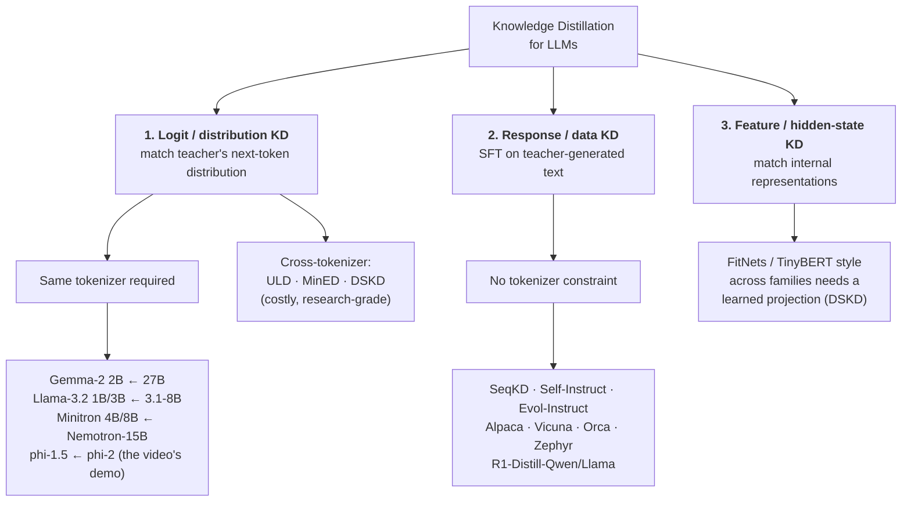
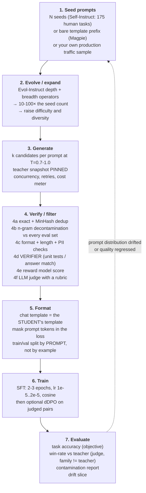

# CS-09 — Knowledge Distillation II: LLM → SLM (LLaMA, Phi)

| Field | Value |
|---|---|
| **Module** | Model Compression / Distillation (part 2 of 2) |
| **Source video(s)** | LLM Fine-Tuning 11: LLM Knowledge Distillation \| How to Distill LLMs (LLaMA, Phi & Beyond) — Part 2 |
| **Transcript file(s)** | `LLM_Fine-Tuning_11_LLM_Knowledge_Distillation_How_to_Distill_LLMs_LLAMA_Phi_Beyo.txt` |
| **Companion code** | `LLM Fine-Tuning-10-11-knowledge-distillation/Knowledge_DIstillation_in_Deep_Learning.ipynb` (shared with CS-08 — this module owns the BERT section, cells 33–73, and the **LLM section, cells 74–89**) |
| **Prerequisites** | CS-08 (soft labels, temperature, T², capacity gap — this file assumes all of it), CS-06 (HF), CS-07 (BERT fine-tuning), CS-13 (SFT), CS-11 (QLoRA) |
| **Difficulty** | Advanced. The loss is six lines. The **tokenizer-compatibility condition** and the **cost arithmetic** are what interviews probe |
| **Hands-on required** | Yes. The instructor's own LLM demo (phi-2 → phi-1.5) needs ≥16 GB VRAM in fp32 and fits in ≤10 GB in fp16 |
| **Estimated study time** | 7h theory + 6h practical |

---

## 0. Executive Summary

- **Knowledge distillation in the LLM era is not the DistilBERT recipe scaled up. That is the single most important idea in this module.** DistilBERT-style distillation needs the teacher and the student to emit logits **over the same vocabulary**. BERT-base, BERT-large and DistilBERT all share one WordPiece tokenizer, so their logits are directly comparable. `microsoft/phi-2` and `Qwen2.5-1.5B` do not. `Llama-3.3-70B` (vocab 128,256) and `Phi-3-mini` (vocab 32,064) do not. When the vocabularies differ, **there is no well-defined KL divergence to minimise** and logit matching is not merely hard — it is undefined.
- **The dominant modern paradigm is therefore *response distillation*, also called *synthetic data distillation* or *sequence-level knowledge distillation*: the teacher generates `(instruction, response)` pairs and the student is SFT'd on them.** Kim & Rush (2016) is the ancestor; Self-Instruct, Evol-Instruct, Alpaca, Vicuna, Orca, Zephyr, WizardLM and the entire open-data ecosystem are descendants. **Roughly 90 % of what the industry calls "distilling an LLM" never computes a distillation loss at all — it computes cross-entropy on teacher-written tokens.**
- **Response distillation on teacher samples *is* forward-KL distillation in sequence space, estimated by Monte-Carlo sampling.** `KL(p_T ‖ p_θ) = −H(p_T) − E_{y~p_T}[log p_θ(y)]`, and `H(p_T)` is constant in `θ`, so minimising forward KL is exactly maximising the likelihood of teacher-sampled sequences. This derivation (§4.3) is the reason "just generate data and SFT" is a principled distillation algorithm and not a hack.
- **That derivation also predicts the failure mode: forward KL is *mode-covering*.** It forces `p_θ > 0` wherever `p_T > 0`, so a small student that cannot represent the teacher's full distribution spreads probability mass over the teacher's tail and hallucinates. Reverse KL is *mode-seeking* and produces a conservative, less diverse student. MiniLLM, GKD and every on-policy method in §4.7 exist to manage this trade-off.
- **The headline empirical result of the module (2025): DeepSeek-R1 distillation.** R1 (671B MoE, 37B active) was distilled into Qwen2.5 and Llama-3 families by **pure response distillation — 800k traces, SFT only, zero logit matching**, across a tokenizer boundary. `R1-Distill-Qwen-32B` scores **72.6 % on AIME 2024**; the same Qwen2.5-32B base trained with RL directly scores **47.0 %**. `R1-Distill-Qwen-1.5B` scores **83.9 % on MATH-500**, above GPT-4o-0513's **74.6 %**. Distilling from a big teacher beats running RL on the small one — that is the thesis of this module, measured.
- **Cost arithmetic, worked (details in §11): 50,000 examples × 800 tokens = 40M tokens. At GPT-4o-class list prices, one pass with no rejection sampling costs ≈ $325; a realistic pipeline (k = 3 rejection sampling + a two-stage judge) costs ≈ $1,150. Human-written equivalents at $3.33/example cost ≈ $166,500. The data generation is 99 % of the bill; training a 1.5B student on the result is ≈ $10 (2.6 A100-hours).**
- **The tokenizer rule, stated once: logit KD is a same-family sport.** Gemma-2-2B/9B from Gemma-2-27B, Llama-3.2-1B/3B from Llama-3.1, Minitron-4B/8B from Nemotron-15B, DistilBERT from BERT — all share a tokenizer *by construction*. The moment you cross families you pay for it: ULD, MinED and DSKD are the three published ways to align logits across vocabularies, and all three cost more engineering than just doing response distillation.
- **The instructor's own LLM demo fails, and the failure is reproducible and instructive.** `microsoft/phi-2` → `microsoft/phi-1_5` works as logit KD *only because both use the CodeGen tokenizer (vocab 51,200)*, and it still OOMs on free Colab — because `from_pretrained` without `torch_dtype` loads in fp32 (2.7B × 4 B = 10.8 GB + 1.3B × 4 B = 5.2 GB = 16.0 GB > the T4's 15 GB). One keyword argument, `torch_dtype=torch.float16`, halves it to 8 GB and the demo runs. §14 has the full diagnosis, including a second, subtler bug: `load_in_8bit=True` on the *student* followed by `optimizer.step()` on the raw parameters trains essentially nothing.
- **A teacher below chance is not a teacher.** In the notebook's BERT section the teacher scores **22 %** on TweetEval while the distilled student scores **60.8 %**. Three classes, so chance is 33 %. The "distillation win" is an artifact: the teacher is an untuned `bert-large-uncased` with a randomly initialised 3-way head, so its soft targets are near-uniform noise that acts as label smoothing, while the student learns the real signal from the hard labels. §14.3 dissects this, because it is the most common silent failure in production distillation.
- **Evaluation is where distilled students get oversold.** LLM judges systematically favour output from their own model family (self-preference bias, Panickssery et al. 2024; Wataoka et al. 2024). If you distil from GPT-4o and judge with GPT-4o, you are measuring *"did the student become more GPT-4o-like"*, not *"is it better"*. Rules: judge family ≠ teacher family, two judges minimum, position-swapped pairwise, a length-controlled metric, and at least one objective task metric that a CFO would recognise.
- **Legality, in one line: the ToS binds *you*, the weights licence binds *the artefact*.** OpenAI's and Anthropic's terms both forbid using their outputs to train competing models; that is a contract claim against an account, not a claim against weights, and it is enforced by termination and procurement review rather than by lawsuits. Distilling from an open-weights teacher — MIT (DeepSeek-R1), Apache-2.0 (Qwen2.5, Mistral-7B), MIT (Phi-2, Phi-3), Gemma Terms (Gemma-2), Llama Community Licence (Llama-3.x) — is what the entire open ecosystem is built on and is the only configuration with no legal tail. §16.7 has the checklist.
- **STOP condition that matters most: if your prompt distribution at inference is not the prompt distribution you distilled on, the student is not a smaller teacher — it is a confidently wrong model on inputs it has never seen.** Response distillation transfers *behaviour on your prompts*, not the teacher's general competence. Measure the drift or do not ship.

---

## 1. The Problem This Solves

### 1.1 What breaks in the real world without this

| Failure | What it looks like | Root cause |
|---|---|---|
| **The 70B that cannot be deployed** | A RAG answerer built on Llama-3.3-70B: 4×A100-80GB, $11k/month reserved, p95 latency 3.4 s. Product wants it in a 150 ms budget on a T4. | Capability lives in weights you cannot afford to serve |
| **The API bill that scales with success** | 400k support tickets/month × 1,800 tokens through GPT-4o = ~$8.4k/month, and it grows with the user base. | The teacher's cost curve is the product's cost curve |
| **The on-prem requirement** | A bank/insurer/health system that cannot send prompts to a third-party API at all, but has 2×A100-40GB on-prem. | No legal path to the API, and the open 70B does not fit the budget |
| **The latency wall on edge** | On-device assistant, 4 GB RAM ceiling, 2 s to first token, must work offline. | A 7B at 4-bit is ~4 GB of weights plus the KV cache; there is no room |
| **The "we fine-tuned a small model and it is worse" regression** | You take Qwen2.5-1.5B, SFT it on 8k hand-labelled examples, and it loses 12 MMLU points and starts ignoring format instructions. | 8k examples is not enough to teach a 1.5B anything; the teacher signal is missing |
| **The "we cannot afford labels" stall** | You need 50k high-quality reasoning traces; your labelling vendor quotes $3.33/example and 14 weeks. | Human supervision does not scale to the token budget modern alignment needs |
| **The distillation that shipped and quietly rotted** | The student was great for four months, then support quality dropped because the traffic mix shifted to a new product line the teacher had never generated data for. | No drift monitor; distillation overfits the prompt distribution, not the task |

### 1.2 The state of the art before this technique

Before the LLM→SLM wave (roughly pre-2023), compressing a large model meant:

- **Pruning** — remove layers/heads/width. Works, and it is what Llama-3.2-1B/3B started from (pruned from Llama-3.1-8B), but a pruned model needs a *recovery* training run or it degrades sharply.
- **Quantization** — 8-bit/4-bit weights. Reduces bytes and (with the right kernels) latency, but not parameter count and not FLOPs at the same rate. See CS-10, CS-11.
- **Training a smaller model from scratch** — needs *more* data than the big one, not less, and the data is normally the expensive part.
- **DistilBERT-style logit distillation** (CS-08) — the only principled way to transfer *generalisation*, and it works brilliantly **inside one tokenizer family**. It does not cross families.
- **Human-annotated instruction data** — the FLAN/T0/InstructGPT approach: crowdsource or hire annotators. FLAN collected 1.8k tasks / 15M examples; InstructGPT's human preference labels cost a dedicated 40-person labelling team. Excellent quality, impossible cost curve.

The gap this module closes: **how do you get teacher-grade supervision, at token scale, when the teacher is a different architecture with a different vocabulary and is only reachable through an HTTP endpoint?**

### 1.3 The naive approach, and precisely why it fails

**Naive approach: copy the DistilBERT notebook, swap in two LLMs, run `KLDivLoss(student_logits, teacher_logits)`.**

```python
# The naive LLM distillation — this is what the companion notebook does
t_logits = teacher(**t_inputs).logits[:, :-1, :]     # shape [1, T_t, V_teacher]
s_logits = student(**s_inputs).logits[:, :-1, :]     # shape [1, T_s, V_student]
loss_soft = kl_loss(torch.log_softmax(s_logits/T, -1), torch.softmax(t_logits/T, -1))
```

It fails in four distinct ways, and only the first one is loud:

| # | Failure | Loud or silent | Why |
|---|---|---|---|
| 1 | `RuntimeError: The size of tensor a (128256) must match the size of tensor b (32064)` | **Loud** | Llama-3.3-70B teacher, Phi-3-mini student. Different vocab size, `V_teacher ≠ V_student`. You cannot even build the tensors. |
| 2 | Shapes match, but position `i` in the teacher's token sequence is not position `i` in the student's | **Silent** | Different tokenizers segment the same text differently. `"unbelievable"` is 1 teacher token and 3 student tokens. Aligning by *index* compares the teacher's prediction for a different prefix than the student's. |
| 3 | Same vocab *size*, different vocab *mapping* | **Silent and catastrophic** | Two independently trained 32k BPE vocabularies both have `V = 32000`. The tensors line up perfectly. Token ID 4,271 means `"ing"` to the teacher and `"however"` to the student. The KL is finite, decreasing, and meaningless. |
| 4 | It works, but you cannot afford it | Loud, late | Materialising a `[batch, seq, 128256]` fp32 tensor costs `8 × 2048 × 128256 × 4 B = 8.4 GB` per tensor. You need three of them for a backward pass. |

The instructor hits failure 4 on free Colab [57:00]–[1:00:16] and reports it as a memory problem. It is also a *conceptual* problem: he is running a DistilBERT-shaped algorithm on an LLM pair, and the notebook only survives because he chose `microsoft/phi-2` → `microsoft/phi-1_5`, which share the CodeGen tokenizer and therefore **do not trip failures 1–3**. That selection is not an accident, and recognising it is the point of this module.

> **Correction:** the instructor's framing throughout the video is "this LLM distillation also we are doing using the same formula itself" [7:32] and "in the distillation we are taking a data set label as well as teacher soft output" [1:01:41]. That is true for *his* model pair and false in general. The correct statement is: **the combined CE + KL(T²) loss is available only when `student_tokenizer.get_vocab() == teacher_tokenizer.get_vocab()`, and in the LLM era that condition usually fails.** The general-purpose algorithm — the one that works for GPT-4 → Qwen, R1 → Llama, and Claude → Gemma — is response distillation, which is just SFT on teacher-generated text and needs no vocabulary compatibility at all.

---

## 2. First-Principles Mental Model

### 2.1 The analogy

**The apprentice and the master craftsman.** In BERT-era distillation (CS-08) the apprentice sits beside the master and watches *the master's hands*: every movement, including the hesitant ones and the near-misses. That is the soft label — a distribution over the master's internal preferences, not just the finished product. It is a dense, high-bandwidth signal, and it transfers fast.

In LLM-era distillation the apprentice is in a different workshop, with different tools, and the master is in another country. The apprentice cannot watch the hands. What the apprentice *can* get is a crate of finished products, each with the master's notes: "here is a request; here is what I made; here is my reasoning." The apprentice learns by **studying the master's finished work, at volume**. That is response distillation.

### 2.2 Where this analogy breaks

1. **The apprentice only sees the master's work on the requests in the crate.** A craftsman who makes 10,000 chairs has not taught you anything about tables. Response distillation transfers the teacher's behaviour *on the prompt distribution you generated*, and nothing else. Logit distillation, by contrast, transfers a compressed summary of everything the teacher learned — that is the real loss when you give it up, and the reason a distilled 1.5B is a superb *specialist* and a poor *generalist*.
2. **The crate is written by the master, so the master's mistakes are in it, in prose, with confidence.** Logit distillation down-weights the teacher's errors automatically — an example the teacher is unsure about produces a flat distribution, which contributes little gradient. Response distillation gives every sample weight 1.0 in the cross-entropy, whether the teacher was certain or guessing. Filtering (§5.3) is what recovers the lost signal.
3. **The apprentice is *smaller*.** A human apprentice grows into the master's skill. A 1.5B student has a hard representational ceiling: at some point it can recite the master's notes without understanding them. This is the **capacity gap** from CS-08, and in the LLM setting it shows up as the student learning *style* (the master's phrasing, hedging, and structure) while failing to learn *substance* (the reasoning). §12.5 has the diagnostic.
4. **The master's notes do not contain the master's weights.** You cannot later "un-distil" or "up-distil". The student is a new model that happens to behave like the teacher on your prompts. It inherits none of the teacher's safety training, none of its RLHF, and none of its knowledge outside the prompt distribution — a fact that surprises people who expect a distilled student to be a safe model. §16.6.

### 2.3 The actual mechanism, stated mechanically

Let the teacher be `T` with parameters `φ` (frozen) and the student be `S` with parameters `θ` (trainable). Let `x` be a prompt and `y = (y_1 … y_L)` a response.

**Response distillation** (what the industry does):

```text
1. Sample prompts x ~ D_prompt
2. Sample or beam-search y ~ p_T(· | x)          # the teacher writes the answer
3. Filter (x, y) → (x, y*)                       # dedup, decontaminate, verify, judge
4. Train θ by maximum likelihood:  θ* = argmax_θ Σ_{(x,y*)} Σ_t log p_θ(y*_t | y*_<t, x)
```

Step 4 is ordinary SFT. Steps 1–3 are the distillation. **There is no teacher forward pass during training.** The teacher is a *data generator*, not a loss function, and that is precisely why the method survives an architecture mismatch, a tokenizer mismatch, a vendor boundary and a 2,000-mile network hop.

**Logit distillation** (what the video does, and what only works same-family):

```text
For each (x, y_hard):
  z_T = T(x)                                     # teacher logits, [T, V]
  z_S = S(x)                                     # student logits, [T, V]  ← requires same V
  loss = α · T² · KL( softmax(z_S/T) ‖ softmax(z_T/T) ) + (1−α) · CE(z_S, y_hard)
```

The `T²` factor, the α-vs-(1−α) naming trap, and the gradient derivation are in CS-08 §4.2. Everything about the loss is unchanged; what changes is that in the LLM era the `requires same V` comment above is a *hard* precondition, not a footnote.

**A third option, rarely the right one:** hidden-state / feature distillation across families, via a learned alignment (ULD, MinED, DSKD — §4.6). It recovers some of the bandwidth of logit distillation without requiring a shared vocabulary, at the cost of a bespoke multi-stage training run. Use it if you are a lab; use response distillation if you are shipping.

### 2.4 The one-sentence version

> **Distil the data, not the logits — and only distil the logits when the student inherited the teacher's tokenizer.**

---

## 3. Core Concepts — Exhaustive Glossary

| Term | Definition | Why it matters | Common confusion |
|---|---|---|---|
| **Teacher model** | The frozen, larger model whose behaviour you are copying. In this module it is usually API-hosted: GPT-4o, Claude, Gemini, DeepSeek-R1, or a local Llama-3.3-70B. | It is a *data generator*, not a training component, when you do response distillation. | That the teacher must be runnable alongside the student. It must not be, and usually is not. |
| **Student model** | The trainable, smaller model. The deliverable. | Every design decision (tokenizer, vocab, size) is the student's decision, and it constrains which teachers you can logit-distil from. | That the student must be the same architecture as the teacher. Only *logit* distillation requires that. |
| **Response distillation** | Generating `(instruction, response)` pairs with the teacher and SFT-training the student on them. a.k.a. synthetic-data distillation, rationale distillation, behaviour cloning. | The dominant modern paradigm. 90 % of "LLM distillation" in industry is this. | That it is not real distillation. It is — it is forward-KL distillation in sequence space, estimated by sampling. §4.3. |
| **Sequence-level KD (SeqKD)** | Kim & Rush 2016. Train the student on the teacher's *generated* (beam-search) sequences instead of the gold sequences. | The direct ancestor of everything in this module. Established that the teacher's MAP sequence is a *simpler* learning target than gold data. | That SeqKD requires logits. It does not — it needs only the teacher's text output. |
| **Word-level KD** | Kim & Rush's other variant: match the teacher's per-token distribution. Requires a shared vocabulary and an alignment model. | Historical baseline that sequence-level KD beat. This is the result that *predicted* the modern paradigm. | That word-level KD is strictly better because it is "more information". On NMT, and later on LLMs, it is not. |
| **Synthetic data** | Any training example whose content was produced by a model rather than a human. | The substrate of modern alignment. Also the thing regulators and reviewers ask about. | That all synthetic data is distillation. Data generated by an unrelated model for a different purpose (e.g. Cosmopedia) is synthetic but not distilled. |
| **Self-Instruct** | Wang et al. 2022. A bootstrapping loop: 175 human seed tasks → an LLM generates new instructions → generates instances → filters → repeats. Produced 52k instructions / 82k instances. | The first demonstration that a model can write its own instruction-tuning set. Every "generate instructions with GPT-4" pipeline is a descendant. | That it needs a strong teacher. The original ran on `davinci-001`. |
| **Evol-Instruct** | WizardLM's method (Xu et al. 2023): iteratively *evolve* existing instructions with **depth** operators (add constraints, deepen, concretise, add reasoning steps, complicate the input) and a **breadth** operator (mutate to a new topic). | The standard way to raise instruction *difficulty* and *diversity* — the two things raw Self-Instruct output lacks. Base for WizardLM, WizardMath, WizardCoder. | That it is a training method. It is a *data-generation* method; the training is plain SFT. |
| **Explanation trace / rationale** | The teacher's step-by-step reasoning, included in the response. Orca's, and R1's, core idea. | The single highest-value component of a synthetic response. Distilling Step-by-Step showed rationales let a 770M student beat a 540B teacher on some tasks. | That the trace must be *correct* to help. A plausible trace from a strong teacher helps even when imperfect; a *verified* trace helps far more. |
| **Orca / Orca-2** | Microsoft's distillation models (2023). Orca: 5M GPT-4/ChatGPT explanation traces across four prompt families. Orca-2: adds task-specific **system prompts** and teaches the student to choose between reasoning strategies. | Demonstrated that explanation traces + system prompts could make a 13B model competitive with GPT-3.5 on some benchmarks. | That Orca's benchmark gains are purely capability. Much of it was measured by a GPT-4 judge, and GPT-4 favours GPT-4-derived text. §12.4. |
| **dSFT / dDPO** | Zephyr's two-stage recipe: distilled SFT on UltraChat (200k), then **distilled DPO** on UltraFeedback (64k prompts, GPT-4-scored preferences). | First clean demonstration that you can distil *preferences*, not just responses, without human labellers. Zephyr-7B-β hit MT-Bench 7.34, above Llama-2-70B-chat. | That DPO needs human preference pairs. dDPO uses an AI judge, so it is RLAIF with a closed-form objective. |
| **RLAIF** | Reinforcement Learning from AI Feedback: the preference labels come from a model, not a person. | Makes preference data as cheap as generation. Introduces self-preference bias into your *labels* as well as your *evaluation*. | That AI feedback is unbiased. It carries the judge's family preferences into your student's behaviour. |
| **Teacher capacity gap** | When the teacher is *too much* better than the student, the student cannot absorb the signal and distillation underperforms. Mirzadeh's TAKD inserts a teacher assistant. | Explains why "use the biggest teacher" is not always optimal — though see §12 for why the LLM-era evidence points the other way. | That a bigger teacher is always better. For *logit* KD the gap hurts; for *response* KD the trace quality usually dominates. |
| **Tokenizer mismatch** | Teacher and student segment text differently and/or map tokens to different IDs. | The reason logit KD does not generalise. Two flavours: different `V` (loud failure) and same `V`, different mapping (silent failure). | That same `V` implies same tokenizer. It does not. |
| **Vocab transfer / logit alignment** | Making two vocabularies comparable: ULD's optimal-transport projection, MinED's minimum-edit-distance alignment, DSKD's cross-model attention projection. | The only principled way to logit-distil across families, and rarely worth the cost. | That a linear map between embedding matrices is enough. Embedding spaces are only identically oriented within a family. |
| **ULD** | Universal Logit Distillation (Boizard et al., 2024): distils over *probability distributions* rather than token logits, aligning the two vocabularies with a Wasserstein/optimal-transport loss plus a bag-of-words sequence-level term. | Works across tokenizers and even across modalities. The most general published logit-alignment method. | That it removes the need for paired data. It does not — you still need the same text through both tokenizers. |
| **MinED** | Cross-tokenizer KD (Zhang et al., 2024) that aligns teacher and student token sequences by **minimum edit distance**, then applies token-level KD on the aligned positions plus sequence-level KD. | The most direct fix for the alignment problem, and reported to beat SeqKD baselines. | That alignment is exact. It is approximate, and the approximation quality bounds the gain. |
| **DSKD** | Dual-Space Knowledge Distillation (Zhang et al., 2024): projects teacher and student hidden states into a shared space with cross-model attention over a few learnable tokens. | Token-level supervision with no vocabulary alignment at all. | That it replaces response distillation. It is an add-on for labs, not a shipping strategy. |
| **Model collapse** | Shumailov et al. 2024. Recursively training on model-generated data without fresh human data causes the distribution's tails to vanish and the model to converge on a degenerate mode. | The central risk argument against synthetic data — and it is narrower than the headlines suggest. §4.8. | That *any* synthetic data causes collapse. Replacement without a verifier and without a human anchor causes collapse. Addition, with verification, does not. |
| **Rejection sampling** | Generate *k* candidate responses per prompt, score them, keep the best (or the ones above a threshold). Turns a $0.60 model into a $1.80 model with better data. | The cheapest single quality lever in the pipeline. Used by Alpaca-era pipelines, R1's data curation, and every code/math pipeline. | That k = 3 costs 3× quality. It costs 3× tokens and buys ~1 quality tier. |
| **Decontamination** | Removing training examples that overlap the evaluation set. Standard method: n-gram (e.g. 13-gram) overlap between the synthetic set and every benchmark you will report. | Any headline win-rate number is worthless without a contamination statement. Vendors' teachers saw the benchmarks; their outputs carry them to your student. | That a held-out *split* is decontamination. It is not. The contamination is by *content*, across sources. |
| **LLM-as-judge** | Using a strong model to score or rank outputs. | The default evaluation method for generative students, because no reference exists. | That the judge is objective. See self-preference bias. |
| **Self-preference bias** | An LLM judge scores text from its own family higher, independently of quality. Panickssery et al. 2024 found the bias correlates with the judge's ability to *recognise* its own generations. | Invalidates any "our student beats X" claim where judge family == teacher family. | That using a different *model* from the same family fixes it. It does not — Claude judging Claude-generated data is still self-preference. |
| **Length bias** | Judges prefer longer answers. This is why AlpacaEval 2.0 reports a length-controlled (LC) win rate. | Style bias inflates distillation results, because teachers write long. | That LC win rate is a different metric. It is the same metric with length regressed out. |
| **dDPO** | Distilled DPO: build preference pairs by having the teacher score *k* responses, then run DPO on the resulting `(chosen, rejected)` pairs. | Adds alignment on top of distilled SFT, cheaply. Zephyr's second stage. | That DPO on synthetic preferences is risk-free. The student inherits the judge's biases as a *preference*, which is harder to detect than a bias in a response. |
| **On-policy distillation (GKD)** | Agarwal et al. 2024. The **student** generates from its own prefixes, and the teacher scores those prefixes with a divergence loss. | Removes the exposure-bias gap between training (teacher prefixes) and inference (student prefixes). §4.7. | That it is a replacement for response distillation. It is a *refinement* that needs the teacher available during training — a luxury in the API-teacher world. |
| **Exposure bias** | The student trains on teacher prefixes but generates from its own at inference; errors compound along the trajectory. | The mechanism that makes a distilling student look great in teacher-forced evaluation and worse in real generation. | That sampling during training (which SFT does not do) is the fix. That is GKD's fix, and it needs the teacher online. |
| **MiniLLM** | Gu et al. 2024: use **reverse KL** for generative LM distillation, with policy-gradient optimisation and teacher-mixed sampling. | Explains the quality/diversity trade-off analytically: reverse KL is mode-seeking, so the student does not hallucinate on the teacher's tail. | That reverse KL is always better. It is better for *quality*; it can make the student *less diverse* and more generic. |
| **Sizing law** | Empirical relationship between student parameter count and quality at fixed data quality: ≈ 4–6 MMLU points per doubling in the 1–10B range. | Tells you whether your problem is the student or the data. §4.9. | That you should always go bigger. A 3× bigger student costs 3× the inference forever; better data is a one-time bill. |
| **Prompt distribution** | The set of prompts you distilled on. | The student is only valid on it. This is the #1 production failure mode. | That it is the task. It is the *sample* of the task you happened to generate. |
| **Pinned teacher snapshot** | A dated model identifier (`gpt-4o-2024-08-06`, `claude-3-5-sonnet-20241022`) recorded with the dataset. | Without it your dataset is not reproducible — the vendor silently updates the endpoint. §16.2. | That the undated alias is stable. `gpt-4o` is a moving target. |
| **Distillation budget** | Total $ for generation + filtering + student training. Typically 95 %+ generation, < 2 % training. | Inverts the intuition from BERT-era work, where the training run was the whole cost. §11. | That you need GPU capacity for distillation. You need *tokens*, i.e. a credit card. |
| **Verifier** | An automatic correctness check: unit tests for code, numeric answer matching for math, a schema check for JSON, a retrieval-grounding check for RAG. | The single best defence against model collapse and against distilling confident nonsense. Verified synthetic data behaves like good data, not like self-training. | That an LLM judge is a verifier. A judge is a *proxy*; a verifier is *ground truth*. |
| **Task-specific distillation** | Distilling for one task rather than general chat, with all data drawn from that task. | Where small students genuinely beat large teachers (TinyBERT beat BERT on SST-2/MNLI). The most defensible business case. | That general-purpose distillation is equally reliable. It is not — the specialist student is the one that wins. |

---

## 4. Deep Dive — How It Actually Works

### 4.1 The structural difference between BERT-era and LLM-era distillation

This table is the module. Everything else is detail.

| Axis | BERT-era (DistilBERT, TinyBERT, the video's demo) | LLM-era (R1 → Qwen, GPT-4o → Qwen, Llama-3.3 → Phi-3) |
|---|---|---|
| **Tokenizer** | Student *inherits* the teacher's tokenizer. Non-negotiable. | Student usually has its own; often a different family entirely |
| **Logit comparison** | Directly available, same `V` | Undefined across vocabularies; requires ULD/MinED/DSKD alignment |
| **Output space per position** | 2–30 classes | 32k–256k tokens |
| **Supervision target** | Distribution over *labels* for one input | Distribution over *the entire response sequence* |
| **Loss** | `α·CE + (1−α)·T²·KL` (+ hidden-state MSE for TinyBERT) | Cross-entropy on teacher-generated tokens. Logit term *only* same-family |
| **Teacher run needed at train time?** | Yes, one forward pass per example per step | **No** — the teacher is an offline data generator |
| **Teacher scale** | 110M–340M, local | 7B–671B, frequently an HTTP endpoint |
| **Data** | A human-labelled dataset | A *prompt set*; the labels are generated |
| **What transfers** | A compressed summary of the teacher's learned function | The teacher's behaviour *on your prompt distribution* |
| **Cost driver** | GPU-hours for the student run | $ per 1M teacher tokens |
| **Primary failure mode** | Capacity gap | Distribution collapse, benchmark contamination, licence breach |
| **Evaluation** | GLUE / accuracy / F1 — objective, cheap, uncontroversial | Win rate / MT-Bench / AlpacaEval — judge-dependent, contested |
| **Time to a usable model** | Days (train + eval) | Hours of generation, hours of filtering, hours of training |
| **Who does it** | Everyone, since 2019 | Everyone, since 2023 |

> **Beyond the video:** the instructor presents the two eras as *the same thing at different scale* — "this LLM distillation also we are doing this knowledge distillation inside the large language model, we're going to perform using the same formula itself" [7:32]. The honest engineering statement is that **they share a name and an intuition and almost nothing else**. The transferable part is the *idea of supervising with a richer signal than hard labels*. The non-transferable part is the loss, the evaluation, the cost model and the failure modes. Interviewers who have shipped both will separate you on exactly this distinction.

### 4.2 Two families, and where the third one fits



Family 2 is where 90 % of production work happens. Family 1 is a same-family optimisation. Family 3 is a research lever.

### 4.3 The mathematics of response distillation (why "just generate data" is principled)

Let `p_T(y | x)` be the teacher's distribution over full response sequences and `p_θ(y | x)` the student's. Define the **forward KL** over sequences for a fixed prompt `x`:

```text
KL( p_T(·|x) ‖ p_θ(·|x) ) = Σ_y  p_T(y|x) · log( p_T(y|x) / p_θ(y|x) )
```

Split the log:

```text
           = Σ_y p_T(y|x) log p_T(y|x)  −  Σ_y p_T(y|x) log p_θ(y|x)
           = − H(p_T(·|x))              −  E_{y ~ p_T(·|x)} [ log p_θ(y|x) ]
```

The first term is the teacher's entropy — **a constant with respect to `θ`**. Therefore:

```text
argmin_θ KL( p_T ‖ p_θ )  =  argmax_θ  E_{y ~ p_T(·|x)} [ log p_θ(y | x) ]
```

And the expectation is estimated by sampling `k` responses per prompt from the teacher:

```text
E_{y ~ p_T}[ log p_θ(y|x) ]   ≈   (1/k) Σ_{j=1..k} log p_θ(y_j | x)
```

Maximising that is **exactly the SFT objective on teacher-generated responses.** So:

> **Response distillation = forward-KL distillation in sequence space, estimated by Monte-Carlo sampling from the teacher. The "no distillation loss" pipeline is not a heuristic approximation of distillation; it *is* distillation, with the teacher's entropy term dropped because it does not depend on `θ`.**

**Worked numeric example.** Three-token response, one prompt. Teacher and student next-token distributions at each step:

| Step | Teacher `p_T` | Student `p_θ` | `log p_T/p_θ` contributions |
|---|---|---|---|
| 1 | `[0.6, 0.3, 0.1]` | `[0.8, 0.1, 0.1]` | `0.6·ln(0.75) + 0.3·ln(3.0) + 0.1·ln(1.0) = −0.173 + 0.330 + 0 = 0.157` |
| 2 | `[0.5, 0.3, 0.2]` | `[0.4, 0.5, 0.1]` | `0.5·ln(1.25) + 0.3·ln(0.6) + 0.2·ln(2.0) = 0.112 − 0.153 + 0.139 = 0.098` |
| 3 | `[0.9, 0.09, 0.01]` | `[0.7, 0.25, 0.05]` | `0.9·ln(1.286) + 0.09·ln(0.36) + 0.01·ln(0.2) = 0.226 − 0.092 − 0.016 = 0.118` |
| | | **Sum (per-token forward KL)** | **0.373 nats** |

Now the mode-covering pathology, which is the whole argument for filtering and for reverse KL:

| Teacher `p_T` | Student `p_θ` | Forward KL `KL(p_T‖p_θ)` | Reverse KL `KL(p_θ‖p_T)` |
|---|---|---|---|
| `[0.5, 0.3, 0.2]` | `[1.0, 0.0, 0.0]` | **+∞** | `0.0` |
| `[0.5, 0.3, 0.2]` | `[0.5, 0.3, 0.2]` | `0.0` | `0.0` |
| `[0.5, 0.3, 0.2]` | `[0.34, 0.33, 0.33]` | `0.036` | `0.041` |

Row 1 is the key: a student that commits to its best guess and puts **zero** probability on the teacher's other modes incurs *infinite* forward KL. The gradient therefore forces the student to keep mass everywhere the teacher has mass — including on tokens the student has no real basis for. With a 128k vocabulary and a 1.5B student, "mass everywhere the teacher has mass" means **hallucinating plausible continuations in regions where the student has no competence.** MiniLLM's contribution was to point out that reverse KL does not have this property, which is why mode-seeking objectives produce more accurate but less diverse students.

**The practical consequence for response distillation.** You are sampling from `p_T`, so a sampled `y` is a *high-probability* trajectory. Cross-entropy on it does not force the student to cover the tail the way a full-distribution forward KL would. This is the quiet reason response distillation is *safer* than logit distillation on a small student: sampling implicitly truncates the tail to what the teacher actually says.

### 4.4 The mathematics of logit KD across tokenizers, and why it does not work

Let the teacher's tokenizer map text to `τ_T` tokens and the student's to `τ_S` tokens, with `τ_T ≠ τ_S` and vocabularies `V_T ≠ V_S` (sizes and/or mappings).

The teacher gives `p_T(· | τ_T(x)_{<i})` over `V_T`; the student gives `p_θ(· | τ_S(x)_{<j})` over `V_S`. Both are distributions over *strings*, induced by different factorisations:

```text
p_T(y|x) = Π_i  p_T( token_T,i | token_T,<i )
p_θ(y|x) = Π_j  p_θ( token_S,j | token_S,<j )
```

The cross-entropy between them is a **cross-entropy between two different factorisations of the same string distribution.** There is no index `i` that corresponds to index `j`, no `V_T × V_S` alignment that is canonical, and therefore no `KL` you can write down without first *choosing* an alignment. Any alignment you choose is an assumption, and the loss you compute is the loss under that assumption — which is why ULD, MinED and DSKD are best understood as "choose an alignment, then pay for it":

| Method | Alignment assumption | What it costs |
|---|---|---|
| **ULD** | Map both vocabularies into a shared optimal-transport space; distil distributions rather than tokens; add a bag-of-words sequence-level term | An OT solve per batch (or a cached transport plan); a second training stage |
| **MinED** | Align token sequences by minimum edit distance; distil on the aligned pairs | An edit-distance DP per example; alignment is many-to-many and lossy |
| **DSKD** | Project hidden states into a shared space with cross-model attention over learnable anchor tokens | A learned projection module; you are now training three things |
| **SeqKD / response KD** | **None required** | You lose the teacher's distributional information; you keep its behaviour |

**The arithmetic of the same-vocab case, and why even that hurts.** `phi-2` → `phi-1.5`, both CodeGen tokenizer, `V = 51,200`. Materialise the soft-target tensor for one example of 512 tokens:

```text
t_soft      : 512 × 51,200 × 4 B (fp32)            = 104.9 MB
s_log_soft  : 512 × 51,200 × 4 B                   = 104.9 MB
grad wrt s_log_soft (needed for backward)          = 104.9 MB
                                              total ≈ 315 MB  per example
```

At batch 8 that is 2.5 GB of pure softmax buffer, on top of both models' weights. Scale to Llama-3 with `V = 128,256` at sequence length 2,048 and batch 8:

```text
8 × 2048 × 128,256 × 4 B = 8.41 GB per tensor → ≈ 25 GB for three tensors
```

That is the real reason logit KD does not scale in the LLM era, independent of tokenizers. The production fix is **top-k sparsification**: keep the teacher's top-50 logits per position plus the teacher's log-sum-exp, renormalise over the kept entries, and store that instead.

```text
top-50 storage : 2048 × 50 × (4 B logit + 2 B id) ≈ 0.6 MB per example  (vs 1.05 GB dense)
reduction      : ~1700×  at V = 128,256
```

GKD, Minitron and DistilBERT-style production pipelines all do this.

### 4.5 What happens at the gradient level

**Response distillation.** The gradient is the ordinary SFT gradient: `∂/∂θ [−log p_θ(y*_t | y*_<t, x)]`. Every token of the teacher's response is a target. Two gradient-level consequences that matter in practice:

1. **Every token carries equal weight.** A teacher response that is 90 % boilerplate and 10 % substance contributes gradient mostly for the boilerplate, because that is where the token count is. This is why format-heavy teachers (verbose, header-heavy) produce students that are verbose and header-heavy, and why you should **train on the response only, with the prompt token losses masked** — the standard `completion_only` / `train_on_responses_only` flag in TRL and Unsloth. Getting this wrong roughly doubles the effective sequence length and teaches the student to *generate prompts*.
2. **The gradient is sparse in the vocabulary.** Cross-entropy on a one-hot target updates `logit[c]` up and all others down with weight `−p_θ(j)`. Logit KD updates all `V` logits with weight proportional to the teacher's distribution. Per token, logit KD provides `~V`-times more "which alternatives were plausible" signal. **You are trading that density for compatibility.** Filtering + explanation traces are how you buy some of it back: a rationale makes the intermediate tokens informative rather than boilerplate, which is precisely the Distilling-Step-by-Step and Orca argument.

**Logit distillation.** As derived in CS-08 §4.2.3, the `T²` factor restores the gradient magnitude to `O(1)` under `1/T` logit scaling, and the student's gradient at each position is:

```text
∂L/∂z_S = (1/T) · [ softmax(z_S/T) − softmax(z_T/T) ]   (before the T² multiplier)
        = T · [ softmax(z_S/T) − softmax(z_T/T) ]        (after)
```

So the update pushes the student's logits toward the teacher's logits with a magnitude proportional to their difference in the *temperature-smoothed* space. Two failure signatures follow directly:

- **`T → 1`:** the smoothed distributions become near-one-hot and the soft term's gradient vanishes for all classes except the argmax, so logit KD degenerates into cross-entropy plus a small correction. This is why `T = 2` is the floor and `T = 3–6` is common for LLMs.
- **`T → ∞`:** both distributions become uniform, the difference goes to zero, and the soft term contributes nothing even with `T²` scaling, because the *information* in the teacher's distribution has been destroyed by the smoothing. There is an interior optimum, and it is task-dependent. The instructor's `T = 2` [28:52] is at the low end.

### 4.6 Tokenizer mismatch — the full menu of workarounds

| Workaround | Mechanism | When it is right | Cost |
|---|---|---|---|
| **Pick a same-family student** | Student inherits teacher's tokenizer by construction: Gemma-2-2B ← Gemma-2-27B, Llama-3.2-3B ← Llama-3.1-8B/70B, Qwen2.5-0.5B ← Qwen2.5-32B, Minitron ← Nemotron | Default. If a smaller sibling of your teacher exists, use it | None — this is the free option |
| **Replace the student's tokenizer** | Retrain the embeddings and the whole model around the teacher's vocab | You are pretraining from scratch anyway (rare) | A full pretraining run |
| **ULD** | Optimal-transport alignment between the two distributions over vocabularies, plus a bag-of-words sequence-level loss | Cross-family logit distillation where you have compute and a research team | OT solve + extra stage; needs paired text through both tokenizers |
| **MinED** | Minimum-edit-distance alignment of token sequences; token-level KD on aligned positions | Same, with a simpler algorithm | DP alignment per example; alignment is lossy |
| **DSKD** | Cross-model attention projection of hidden states into a shared space | Token-level supervision across families with no vocab alignment | Extra trainable module; a third model's worth of debugging |
| **Response distillation** | Throw the logits away; train on the teacher's text | **95 % of real cases** | You lose the teacher's distributional signal — recover some of it with filtering and explanation traces |

> **Beyond the video:** the instructor never mentions the tokenizer constraint. His LLM demo works because `microsoft/phi-2` and `microsoft/phi-1_5` both use the CodeGen tokenizer (vocab 51,200) — a fact he does not state and probably did not check. The notebook's commented-out alternative pair (`meta-llama/Llama-2-7b-chat-hf` → `TinyLlama/TinyLlama-1.1B-intermediate-step-1431k-3T`, cell 76) is *also* same-vocab: TinyLlama is Llama-2 architecture with the Llama-2 tokenizer (`V = 32,000`). Every LLM example in the notebook is accidentally, invisibly, a same-vocab example. In an interview, "the notebook only works because both models share a tokenizer" is the answer that separates a reader from an operator.

### 4.7 On-policy distillation and the exposure-bias problem

Response distillation trains on **teacher prefixes**. At inference the student conditions on **its own prefixes**. Once the student makes one token choice the teacher would not have made, it is in a region of sequence space it never saw in training, and its behaviour there is unconstrained. This is **exposure bias**, and it is why a distilled student can look excellent under teacher-forced perplexity and poor in free generation.

**GKD (On-Policy Distillation, Agarwal et al. 2024)** closes the loop:

```text
Supervised KD (what we have been describing):
    x → teacher generates y ~ p_T      → train student on (x, y)          [teacher prefixes]

On-policy GKD:
    x → STUDENT generates ŷ ~ p_θ       → teacher scores every prefix of ŷ
    → minimise  D( p_T(·|x, ŷ_<t) ‖ p_θ(·|x, ŷ_<t) )  for each t
                                          [student prefixes, teacher supervision]
```

Two variants, and the distinction matters:

| Variant | Data source | Divergence | Behaviour |
|---|---|---|---|
| **GKD (teacher data)** | Teacher-generated sequences | forward KL | Mode-covering; the student tries to match the teacher everywhere |
| **GKD (student data)** | Student-generated sequences | reverse KL | Mode-seeking; the student concentrates on what it can actually do well |

The paper's finding — reported for T5-XL teacher → T5-small/base students on summarisation and grammar correction — is that on-policy variants beat supervised KD, that the advantage grows with the capacity gap, and that **the student-data / reverse-KL variant is the one that wins when you generate the training data from the student.** Practical constraint: **the teacher must be available during student training**, which rules out API teachers at any volume. This is why GKD is a "self-hosted teacher" technique.

> **Beyond the video:** the instructor describes distillation as strictly sequential — generate, then train [1:00:00]–[1:06:00]. GKD makes training and generation *interleaved*. For a 2025 interview, knowing that on-policy distillation exists and that it needs a local teacher is a strong signal; being able to say *why* (exposure bias + capacity gap) is stronger.

### 4.8 Model collapse — what it actually says

The claim that "training on model-generated data collapses" comes from Shumailov et al., *Nature*, 2024. The mechanism, precisely:

1. Generation 0: train a model on real data, sample from it to create dataset 1.
2. Generation 1: train on dataset 1, sample to create dataset 2. **Replace** the real data each round.
3. With each round the *tails* of the distribution lose mass. Rare events are never sampled, so they are never learned, so they are never sampled again. The model converges on the distribution's mode and its variance shrinks to zero — the "Habsburg" degeneration, where later generations are all near-copies of each other.

The conditions under which collapse occurs are narrower than the headlines:

| Condition | Collapses? | Why |
|---|---|---|
| Recursive self-training, **replacing** real data each round, no verifier | **Yes** | Tails are never sampled; the mode is reinforced |
| Recursive self-training, **accumulating** (keep all generations' data), enough real data | **No** — Alemohammad et al. 2024 show the process is stable, or converges to the real distribution | The real data anchors the tails in every round |
| Distilling from a **stronger** teacher (student < teacher) with a verifier | **No** | The teacher is not trained on the student's output; there is no feedback loop. This is a one-way transfer, not self-consumption |
| Distilling from a stronger teacher **without** a verifier | **Degrades, does not collapse** | The student inherits the teacher's errors at full weight, including confident wrong answers and hallucinated citations |
| Distilling **within your own family** (7B → 3B → 1.5B → 0.5B), no human data, no verifier | **Yes, and fast** | This is recursive self-training wearing a distillation costume |

Meta's Llama 3 report states that they used synthetic data extensively in post-training and observed **no mode collapse**, attributing this to keeping human data in the mix. The rule that falls out:

> **Never let any training mix reach zero human tokens. The distillation loop is safe as long as it is fed by something that is not itself.** Concretely: keep ≥ 5–10 % human-authored examples in every SFT mix, and require a *verifier* (not a judge) for any dataset you will recurse on.

**The measurable signature:** on the distillation set, track `distinct-3` (unique 3-grams / total), self-BLEU between samples at temperature 1.0, and embedding-space coverage (e.g. mean pairwise cosine distance between response embeddings). A collapsing dataset loses distinct-3 monotonically across generations while its judge score *rises* — the judge likes the confident mode. This divergence between diversity and judge score is the alarm.

### 4.9 The student sizing law

How small can a student go before quality collapses? The evidence, release-time vendor numbers, 2025-era:

| Student | Params | Vocab | Pretrain tokens | MMLU | GSM8K | Note |
|---|---|---|---|---|---|---|
| Qwen2.5-0.5B-Instruct | 0.49B | 151,936 | 18T | 47.5 | 49.6 | Below this, instruction following gets brittle |
| Llama-3.2-1B-Instruct | 1.24B | 128,256 | 9T | ~49 | ~30 | Pruned from Llama-3.1-8B, then distilled |
| TinyLlama-1.1B-Chat | 1.1B | 32,000 | 3T | ~34 | — | The notebook's alternative student; 2023-era |
| Qwen2.5-1.5B-Instruct | 1.54B | 151,936 | 18T | 60.9 | 68.5 | The modern sweet spot for a distilled student |
| Gemma-2-2B-IT | 2.6B | 256,000 | 2T | 52.2 | ~30 | Logit-distilled from Gemma-2-27B |
| Phi-2 | 2.7B | 51,200 | 1.4T | 56.7 | — | The notebook's *teacher* |
| Llama-3.2-3B-Instruct | 3.2B | 128,256 | 9T | ~60 | ~77 | Distilled from Llama-3.1 |
| Phi-3-mini-4k-Instruct | 3.8B | 32,064 | 3.3T | 68.8 | 82.5 | The "as capable as 10× larger" claim |
| Llama-3.1-8B-Instruct | 8B | 128,256 | 15T | 69.4 | 84.5 | The 8B reference point |
| Llama-3.3-70B-Instruct | 70.6B | 128,256 | 15T | 86.0 | 95.1 | Teacher-grade open model |
| DeepSeek-R1-Distill-Qwen-1.5B | 1.5B | 151,936 | 18T + 800k traces | — | MATH-500 **83.9** | Beats GPT-4o's 74.6 on MATH-500 |

Numbers are from the respective model cards and reports at release and are prompt-format sensitive; re-verify before quoting. Third-party harnesses (lm-eval-harness, Open LLM Leaderboard) have repeatedly produced Phi-series numbers several points below the model cards, and the gap tracks few-shot count and answer-extraction rules rather than model quality.

**The law, as a practitioner's rule:**

```text
Quality ≈ a · log(params) + b · (data quality) + c
in the 1–10B range: each doubling of parameters ≈ +4–6 MMLU points
                    each "quality tier" of data (raw web → filtered → synthetic textbook)
                    ≈ +5–15 MMLU points, and it is a ONE-TIME cost
```

**Practical floors, with the failure that sets each one:**

| Floor | Parameter count | The failure below it |
|---|---|---|
| Can hold a chat format at all | ~0.3B | Loses the format under load; single-turn only; forgets the system prompt |
| Usable general assistant | ~1.5B | Multi-turn context degrades; tool calls malformed |
| Reliable JSON / function calling | ~1.5B with constrained decoding, ~3B without | Emits syntactically invalid JSON under distribution shift |
| Competitive with 2023-era 70B on a *narrow* task | ~3–8B | Only on the narrow task; general chat falls apart |
| Long-chain reasoning (verifiable math/code) | ~1.5B **if distilled from a reasoning teacher** | R1-Distill-Qwen-1.5B is the counterexample to every older floor: 83.9 % on MATH-500 |
| Safe to deploy without an output filter | Not available at any size | A distilled student inherits the teacher's *responses*, not its safety training. §16.6 |

> **Beyond the video:** the instructor's sizing discussion is a single observation — that free Colab's 15 GB cannot load a 3B or 7B Mistral in fp16, and that TinyLlama would load but "training will be very tough" [51:36]. The correct framing is that **the sizing question is a data question, not a parameter question, until you get below ~1.5B.** R1-Distill-Qwen-1.5B (MATH-500 83.9) beats Llama-3.1-8B-Instruct (MATH-500 ~68) on math by a factor of five in parameters, purely because of what it was distilled on. That result is the strongest available refutation of "you need a 7B minimum".


---

## 5. The End-to-End Pipeline

### 5.1 The instructor's pipeline, reproduced

This is the complete flow of the practical in the video and the notebook, in order, with the exact cells and the exact strings.

```mermaid
flowchart LR
    A["1. Runtime<br/>Colab, GPU<br/>[26:24]"] --> B["2. Install<br/>datasets · fsspec<br/>transformers · accelerate<br/>bitsandbytes"]
    B --> C["3. Load prompts<br/>tweet_eval/sentiment<br/>2500 train / full val"]
    C --> D["4. Tokenize<br/>bert-base-uncased<br/>max_len 128"]
    D --> E["5. Collate<br/>DataCollatorWithPadding<br/>pad_to_multiple_of=8"]
    E --> F["6. Load models<br/>teacher bert-large-uncased<br/>student bert-base-uncased"]
    F --> G["7. Freeze teacher<br/>requires_grad=False<br/>teacher.eval()"]
    G --> H["8. Losses<br/>CE + KLDivLoss(batchmean)<br/>T=2, alpha=0.5"]
    H --> I["9. Optimiser<br/>AdamW lr=5e-5<br/>linear, 0 warmup"]
    I --> J["10. distill_epoch()<br/>teacher logits -> soft targets<br/>student logits<br/>alpha*soft + (1-alpha)*hard"]
    J --> K["11. evaluate()<br/>validation accuracy"]
    K --> L["12. Save<br/>student.save_pretrained"]
    L --> M["13. Compare<br/>teacher vs student<br/>accuracy + wall clock"]
    M --> N["14. LLM variant<br/>phi-2 -> phi-1.5<br/>[52:00]-[1:00:16]"]
```



| Stage | Input | Operation | Output | Failure mode |
|---|---|---|---|---|
| 1 Runtime | — | Select GPU runtime | T4, 15 GB VRAM, 12 GB RAM, 112 GB disk [50:57] | Free tier gives no GPU after quota exhaustion |
| 2 Install | — | `!pip install --upgrade datasets fsspec transformers` (cell 36) and `!pip install transformers accelerate bitsandbytes` (cell 77) | Working imports | `fsspec` version drift breaks `load_dataset` cache reads — the instructor flags this as "pretty much mandatory" [27:23] |
| 3 Load prompts | HF dataset id | `load_dataset("tweet_eval", "sentiment")`, `train.shuffle(seed=42).select(range(2500))`, full `validation` | 2.5k train / 872 val, 3 labels | Using the full 45k train set on free Colab; the instructor explicitly subsets for cost [30:23] |
| 4 Tokenize | Text | `tokenizer(text, truncation=True, max_length=128)` | `input_ids`, `attention_mask` | Tokens dropped at 128 chars are silently lost; `max_len` is per-sentence, not per-response [29:29] |
| 5 Collate | Variable-length batches | `DataCollatorWithPadding(tokenizer, pad_to_multiple_of=8)` | Uniform tensors | Padding to a multiple of 8 wastes up to 7 positions per sequence but aligns to tensor-core tiles [34:53] |
| 6 Load models | Model ids | `AutoModelForSequenceClassification.from_pretrained(...).to(device)` | Teacher + student | Missing `num_labels=3` silently reinitialises a 2-class head |
| 7 Freeze teacher | Teacher | `for p in teacher.parameters(): p.requires_grad = False` + `teacher.eval()` | Frozen teacher | Setting `requires_grad=False` **without** `eval()` leaves dropout active → stochastic soft targets |
| 8 Losses | — | `nn.CrossEntropyLoss()`, `nn.KLDivLoss(reduction="batchmean")` | Two loss functors | `reduction="mean"` on `KLDivLoss` divides by all elements, not by the batch → loss is `1/(T·V)` of the correct value and the LR is effectively `T·V` times too small |
| 9 Optimiser | Student params | `optim.AdamW(student.parameters(), lr=5e-5)` + `get_scheduler("linear", num_warmup_steps=0, num_training_steps=len(train_dl)*epochs)` | Optimiser + schedule | Passing `teacher.parameters()` too — the teacher is frozen, so this is free, but it silently adds the teacher's hyperparameters to any weight-decay group |
| 10 Distill | Batch | teacher forward under `no_grad` → soft targets; student forward → log-softmax; `alpha*soft + (1-alpha)*hard` | Gradients on the student only | Forgetting `optimizer.zero_grad()`; calling `.backward()` without `retain_graph` twice |
| 11 Evaluate | Validation loader | `model.eval()`, argmax, accuracy | A number | Forgetting `model.eval()` → dropout inflates the loss and deflates accuracy |
| 12 Save | Student | `save_pretrained("distilled_student_model")` + tokenizer | A directory | Saving the tokenizer from a *different* model than the student |
| 13 Compare | Test loader | Same loader through both models, wall-clock both | Accuracy + seconds | Comparing accuracies without the timing, or timing without warm-up |
| 14 LLM variant | phi-2 / phi-1.5 | Same loss, `V = 51,200`, causal LM | OOM on free Colab | Six distinct bugs — §6.4 |

### 5.2 The modern synthetic-data pipeline (what to build instead)

When the teacher is an API model and the student is a different family — which is the actual production case — the pipeline changes shape completely. Note that **no teacher forward pass appears in the training loop.**



| Stage | Input | Operation | Output | Failure mode |
|---|---|---|---|---|
| 1 Seed prompts | 175 hand-written tasks, a traffic sample, or nothing | Curate a seed set that covers the *task surface*: every intent, every format, every difficulty band | 10²–10⁴ seeds | Seeds that are all one shape → the whole dataset is one shape |
| 2 Evolve / expand | Seeds | Evol-Instruct depth operators (add constraints, deepen, concretise, more reasoning steps, complicate the input) + breadth operator (new topic) | 10⁴–10⁶ instructions | Evolving too far produces instructions no real user would write; the student learns to handle nonsense |
| 3 Generate | Instructions | k samples per instruction at temperature 0.7–1.0; record the pinned model id, timestamp, and cost | Raw candidate set | Unpinned teacher → irreproducible dataset. Temperature 0 → zero diversity, and the dataset becomes `N` copies of the same answer family |
| 4 Filter | Candidates | Dedup → decontaminate → verify → RM-score → judge | The dataset. **This is where the engineering is** | Skipping 4b inflates every eval number. Skipping 4d teaches confident nonsense |
| 5 Format | Dataset | Apply the *student's* chat template; mask the prompt in the loss | Tokenised dataset | Using the teacher's format; training on the prompt tokens |
| 6 Train | Dataset | SFT via TRL/Unsloth/Axolotl/LLaMA-Factory (CS-13, CS-15, CS-16, CS-17) | The student | 1 epoch (undertrained) or 5 epochs (memorised and degenerate) |
| 7 Evaluate | Student | Task accuracy + judged win rate + contamination + drift | A model card | Judging with the teacher's family |

### 5.3 The filter stack, in the order you should apply it

Order matters: each stage is cheaper than the next, so you want to discard as much as possible as early as possible.

| # | Filter | Method | Typical kill rate | Cost |
|---|---|---|---|---|
| 1 | **Format / schema** | Regex + JSON parse + length bounds + refusal-pattern blocklist | 5–15 % | ~0 |
| 2 | **Exact dedup** | Hash of the normalised instruction | 2–10 % | ~0 |
| 3 | **Near dedup** | MinHash / SimHash, Jaccard ≥ 0.8 (or ROUGE-L ≥ 0.7 as Self-Instruct did) | 10–30 % | ~0 (CPU) |
| 4 | **Decontamination** | 13-gram overlap against every benchmark you will report (MMLU, GSM8K, HumanEval, MT-Bench, your held-out set) | 0.1–3 % | ~0 |
| 5 | **PII / licence** | Email/phone/ID regex; for code, licence detection | 0.5–2 % | low |
| 6 | **Verifier** | Unit tests (code), numeric answer match (math), retrieval grounding (RAG), schema assertion | 30–80 % for math/code | medium (execution) |
| 7 | **Reward model** | A small reward model (e.g. an 8B RM) scores each pair; keep the top X % | 20–50 % | medium |
| 8 | **LLM judge** | Rubric-based, with a *different family* from the teacher; pairwise or 1–5 with a score floor | 20–40 % | **high — often the second-largest line item** |

> **Beyond the video:** the instructor's pipeline has no filtering of any kind — the notebook goes straight from `load_dataset` to `tokenize` to training, and the "data curation" step is `select(range(2500))`. That is defensible for a demo and indefensible in production. The single highest-leverage change you can make to a distilled dataset is not more examples; it is **stage 4d, the verifier**, because it is the only stage that provides *ground truth* rather than a proxy.

---

## 6. Hands-On Code (annotated)

### 6.1 Versions and environment the video uses

```bash
# Exactly the installs from the notebook (cells 36 and 77)
pip install --upgrade datasets fsspec transformers
pip install transformers accelerate bitsandbytes
```

| Package | Role | Notes |
|---|---|---|
| `datasets` | `load_dataset("tweet_eval", "sentiment")` | The Hub cache is `~/.cache/huggingface/datasets` |
| `fsspec` | Filesystem abstraction behind `load_dataset` | The instructor calls the upgrade "pretty much mandatory… otherwise you might get error with respect to this package" [27:23]; `fsspec` version skew is a recurring cause of cache-read errors |
| `transformers` | `AutoTokenizer`, `AutoModelForSequenceClassification`, `AutoModelForCausalLM`, `DataCollatorWithPadding`, `get_scheduler` | — |
| `accelerate` | Required for `device_map="auto"` | Without it, `device_map="auto"` raises |
| `bitsandbytes` | `load_in_8bit`, 8-bit optimisers | Needed for the 8-bit branch the instructor abandons [54:59] |
| `torch`, `torchvision` | MNIST half of the notebook (CS-08) | — |
| `scikit-learn` | `accuracy_score` in the comparison cell | Used in `predict_and_evaluate` |
| `tqdm.auto` | Progress bar inside `distill_epoch` | `pbar.set_postfix({"loss": ...})` |

Environment the video runs on: **free Colab — 12 GB RAM, ~15 GB VRAM (T4), 112 GB disk** [50:57]. That single constraint explains most of the notebook's design choices *and* the OOM at the end.

### 6.2 Config and data — exactly as given (cells 39–52)

```python
# ---- Cells 39-52, verbatim config ----
batch_size   = 16
lr           = 5e-5
epochs       = 1
temperature  = 2.0
alpha_soft   = 0.5
max_len      = 128
device       = torch.device("cuda" if torch.cuda.is_available() else "cpu")

raw = load_dataset("tweet_eval", "sentiment")          # cell 40
label_feature = raw["train"].features["label"]
print("Label names:", label_feature.names)             # -> ['negative', 'neutral', 'positive']

# Subset (2.5k samples for train)                       # cell 43
train = raw['train'].shuffle(seed=42).select(range(2500))
val   = raw['validation']                              # full validation set

tokenizer = AutoTokenizer.from_pretrained("bert-base-uncased")   # cell 46

def tokenize(example):                                          # cell 47
    return tokenizer(example["text"], truncation=True, max_length=max_len)

tokenized = {}                                                  # cells 48-49
tokenized['train'] = train.map(tokenize, batched=True, remove_columns=['text'])
tokenized['validation'] = val.map(tokenize, batched=True, remove_columns=['text'])

collator = DataCollatorWithPadding(tokenizer, pad_to_multiple_of=8)   # cell 50
train_dl = DataLoader(tokenized['train'], batch_size=batch_size, shuffle=True,  collate_fn=collator)
val_dl   = DataLoader(tokenized['validation'], batch_size=batch_size, shuffle=False, collate_fn=collator)
```

**Why each line exists, and what to change for your own data:**

- `alpha_soft = 0.5` — this notebook's α weights the **soft** term and `(1−α)` the hard term, which is also Hinton's direction (his paper keeps the *lower* weight on the hard targets and defines no `α` at all). CS-08 §7.1 covers the trap: reimplementations assign the same letter to opposite terms, so the *name* tells you nothing. At `α = 0.5` you cannot tell which term is which even by inspection, which is exactly why the notebook's value masks the bug.
- `epochs = 1` — the instructor says "one epoch only, it is just a testing… if you are running it in a real time then you can run it for as many as you want" [28:55]. For a real distillation, **2–3 epochs** on a filtered set; more than 3 on synthetic data starts memorising the teacher's phrasings.
- `lr = 5e-5` is the BERT fine-tuning default. For an LLM student the working range is **1e-5 to 2e-5**, and the notebook's LLM cell does use `2e-5` (cell 87). Using `5e-5` on a 1.5B LLM will destabilise it.
- `train = ...select(range(2500))` — the instructor's reasoning [30:23] is that training cost is high and validation cost is low, so you shrink train and keep validation full so the metric is not noisy (cell 44). That reasoning is correct and it is exactly what you should do in a smoke test. It is *not* what you should do for a real run: 2.5k examples cannot teach a student much.
- `alpha_soft = 0.5` plus 3 classes means the hard term is doing half the work on 2.5k examples. On a dataset this small, label smoothing would achieve most of the same effect for free.
- `pad_to_multiple_of=8` — the instructor explains it well [34:53]: "tensor cores in GPU are optimized for data size that are multiple of eight… padding to multiple of eight helps faster training, better memory alignment, and reduces shape-mismatch errors in mixed precision." Correct. In 2025, bf16 tensor cores on A100/H100 prefer multiples of 8; on some kernels 16 or 64 is better still.

### 6.3 The distillation loop (cells 55–66)

```python
# ---- Cells 55-62 ----
num_labels = 3
teacher = AutoModelForSequenceClassification.from_pretrained(
    "bert-large-uncased", num_labels=num_labels).to(device)      # cell 55
student = AutoModelForSequenceClassification.from_pretrained(
    "bert-base-uncased", num_labels=num_labels).to(device)       # cell 56

for p in teacher.parameters():          # cell 57 — MANDATORY
    p.requires_grad = False
teacher.eval()                          # also mandatory: freezes dropout

ce_loss = nn.CrossEntropyLoss()                          # cell 58
kl_loss = nn.KLDivLoss(reduction="batchmean")            # cell 59  ← "batchmean" is the ONLY correct reduction
optimizer = optim.AdamW(student.parameters(), lr=lr)     # cell 60  ← student only
lr_scheduler = get_scheduler(                           # cell 62
    name="linear", optimizer=optimizer,
    num_warmup_steps=0, num_training_steps=len(train_dl) * epochs,
)

# ---- Cell 64: the distillation epoch ----
def distill_epoch():
    student.train()
    pbar = tqdm(train_dl, desc="Train")
    for batch in pbar:
        input_ids = batch["input_ids"].to(device)
        attention = batch["attention_mask"].to(device)
        labels    = batch["labels"].to(device)

        with torch.no_grad():                                    # teacher: no graph
            t_logits = teacher(input_ids, attention_mask=attention).logits
            t_soft   = torch.softmax(t_logits / temperature, dim=1)

        s_logits = student(input_ids, attention_mask=attention).logits
        s_soft   = torch.log_softmax(s_logits / temperature, dim=1)

        loss_soft = kl_loss(s_soft, t_soft) * (temperature ** 2)  # T^2 restores gradient scale
        loss_hard = ce_loss(s_logits, labels)                     # hard targets use UNSCALED logits
        loss      = alpha_soft * loss_soft + (1 - alpha_soft) * loss_hard

        optimizer.zero_grad()
        loss.backward()
        optimizer.step()
        lr_scheduler.step()                                       # per-step, not per-epoch
        pbar.set_postfix({"loss": f"{loss.item():.4f}"})
```

Four things worth saying about this loop, because they are the four things people get wrong when they write it themselves:

1. **The teacher's logits are divided by `T`, but the hard loss uses the *unscaled* `s_logits`.** This is correct and it is the single most commonly botched line in distillation code. If you also scale the CE term, its gradient shrinks by `1/T` and the hard signal is effectively switched off.
2. **`kl_loss(s_log_soft, t_soft)`** — PyTorch's `KLDivLoss` takes `(input, target)` where `input` is **already log-probabilities**. Passing `softmax` output instead of `log_softmax` is the second most common bug: the loss still decreases, so it looks like it works, and the student learns a warped objective.
3. **`reduction="batchmean"`** — mathematically correct: it divides by `batch_size` so the loss is a per-example mean over the vocabulary. `reduction="mean"` divides by `batch_size × num_classes`, making your effective learning rate `3×` too small here and `51,200×` too small in the LLM case.
4. **`lr_scheduler.step()` inside the batch loop** — the instructor is explicit [41:17] that the graph starts "high at the first place then drops linearly", and `num_warmup_steps=0` means there is no warm-up: full LR at step 0. That is a defensible choice for a 1-epoch run and a bad one for a 3-epoch LLM run, where `warmup_ratio=0.03` is standard.

**The results (cells 68–73, and the instructor's narration [46:25]):**

| Model | Accuracy | Inference time (500 test samples) |
|---|---|---|
| Teacher (`bert-large-uncased`, untuned) | **22 %** | ≈ 3.96 s |
| Student (distilled `bert-base-uncased`) | **60.8 %** | ≈ 1.23 s |

The instructor reports this as a win: "distil BERT accuracy is coming more than BERT model, and BERT is taking around 3.96 second, and the distilled is taking 1.226 second — it is very small time" [46:25]. **It is not a win, and §14.3 explains why at length.** The short version: 3 classes means chance is 33 %, the teacher scores 22 %, so the teacher is worse than chance, its soft targets are noise, and the student's 60.8 % comes almost entirely from the hard labels plus the regularising effect of a near-uniform soft target.

The notebook itself supplies four post-hoc justifications for "student beats teacher" (cell 72) — the teacher overfits on small noisy data, the student is task-fine-tuned, the teacher is frozen, the teacher is not task-specific. Only the last two are true, and together they mean: **you distilled from a teacher that never learned the task.** The instructor also repeats the Distilling-Step-by-Step and TinyBERT results as supporting evidence [47:01]. Those are real results — but in both papers the teacher *was* trained on the task.

### 6.4 The LLM section — the notebook as written (cells 74–89)

```python
# ---- Cells 77-85 ----
!pip install transformers accelerate bitsandbytes

from transformers import AutoModelForCausalLM, AutoTokenizer
import torch, torch.nn as nn, torch.optim as optim

teacher_id = "microsoft/phi-2"          # cell 79  ← the video's "Microsoft 52" [53:15]
student_id = "microsoft/phi-1_5"        # cell 79  ← the video's "51 5"          [53:18]

teacher_tokenizer = AutoTokenizer.from_pretrained(teacher_id)
student_tokenizer = AutoTokenizer.from_pretrained(student_id)

if teacher_tokenizer.pad_token is None:                     # cell 81
    teacher_tokenizer.pad_token = teacher_tokenizer.eos_token
if student_tokenizer.pad_token is None:
    student_tokenizer.pad_token = student_tokenizer.eos_token

teacher = AutoModelForCausalLM.from_pretrained(             # cell 82
    teacher_id, device_map="auto", load_in_8bit=True,
)
teacher.eval()                                              # cell 84
for p in teacher.parameters():
    p.requires_grad = False

student = AutoModelForCausalLM.from_pretrained(             # cell 85
    student_id, device_map="auto", load_in_8bit=True,
)

# ---- Cells 86-87 ----
prompts = [
    "Explain why the sky is blue. ### The sky appears blue because molecules in Earth's "
    "atmosphere scatter sunlight, and blue light is scattered more than other colors due to "
    "its shorter wavelength.",
    "What is the capital of France? ### The capital of France is Paris.",
    "Write a short story about a robot and a cat. ### Once upon a time, a lonely robot found "
    "a stray cat. They became best friends, exploring the city together, and the robot learned "
    "the meaning of companionship.",
]

temperature = 2.0
alpha_soft  = 0.7
ce_loss     = nn.CrossEntropyLoss(ignore_index=tokenizer.pad_token_id)   # ← NameError
kl_loss     = nn.KLDivLoss(reduction="batchmean")
optimizer   = optim.AdamW(student.parameters(), lr=2e-5)

# ---- Cell 88: the distillation loop ----
for prompt in prompts:
    t_inputs = teacher_tokenizer(prompt, return_tensors="pt", padding=True).to(teacher.device)
    s_inputs = student_tokenizer(prompt, return_tensors="pt", padding=True).to(student.device)

    with torch.no_grad():
        t_logits = teacher(**t_inputs).logits[:, :-1, :]        # drop last position
        t_soft   = torch.softmax(t_logits / temperature, dim=-1)
        t_soft   = torch.clamp(t_soft, min=1e-8)                # avoid log(0) in KLDiv

    s_logits   = student(**s_inputs).logits[:, :-1, :]           # drop last position
    s_log_soft = torch.log_softmax(s_logits / temperature, dim=-1)

    labels = s_inputs["input_ids"][:, 1:].contiguous()           # shift: predict next token

    loss_hard = ce_loss(s_logits.reshape(-1, s_logits.size(-1)), labels.reshape(-1))
    loss_soft = kl_loss(s_log_soft, t_soft) * (temperature ** 2)

    loss = alpha_soft * loss_soft + (1 - alpha_soft) * loss_hard

    if torch.isnan(loss):
        print("NaN detected on prompt:", prompt[:50])
        continue                                                 # skip the step entirely

    optimizer.zero_grad()
    loss.backward()
    optimizer.step()
    print(f"Prompt: {prompt[:40]}..., Loss: {loss.item():.4f}")

student.save_pretrained("distilled_phi1_5")                      # cell 89
student_tokenizer.save_pretrained("distilled_phi1_5")
```

The instructor's own narration of the run [57:42]–[1:00:16]: *"I'm getting like a feeling that I will get out of memory error… before the session itself when I was executing I was getting out of memory error. So this is the entire code you can try out from your end guys… I'm getting out of memory error because I don't have access of the Colab Pro."* He also states the intended fix [54:59]: *"I'm not going to take this quantised model because we have very less data… we are not getting that loss value accurately. So what I will do, I'll load the FP16 model with the float 16 procedure."*

**Seven defects, in severity order.** Every one of them is a real bug you will meet again.

| # | Defect | Severity | Symptom | Fix |
|---|---|---|---|---|
| 1 | **`tokenizer` is not defined** in cell 87 (`ce_loss = nn.CrossEntropyLoss(ignore_index=tokenizer.pad_token_id)`) — never defined in the LLM section; only `teacher_tokenizer` and `student_tokenizer` exist | Fatal | `NameError: name 'tokenizer' is not defined` | `ignore_index=student_tokenizer.pad_token_id` |
| 2 | **`torch_dtype` is never passed**, so `from_pretrained` loads **fp32**. phi-2 = 2.7B × 4 B = **10.8 GB**; phi-1.5 = 1.3B × 4 B = **5.2 GB** → **16.0 GB before any activation**, against a 15 GB T4 | Fatal (this is the OOM) | `torch.cuda.OutOfMemoryError` during the second `from_pretrained` | `torch_dtype=torch.float16` → 5.4 + 2.6 = **8.0 GB**, fits |
| 3 | **`load_in_8bit=True` on the *student*, then `optimizer.step()` on `student.parameters()` with no adapter.** The int8 weights cannot absorb fp32 updates; effectively only LayerNorms move | Fatal-silent | Loss decreases slightly, model does not learn; "we were not getting that loss value accurately" | Never quantise the **teacher** (it corrupts soft targets) and never full-FT a quantised student. Either fp16 full-FT, or 4-bit + LoRA (QLoRA) |
| 4 | **`t_soft` is clamped to `1e-8` but never renormalised**, so the teacher's "distribution" no longer sums to 1. The KL is no longer a KL, and its minimum is not at equality | Moderate | The soft loss floors at a non-zero value; the student is pushed toward a distribution the teacher never had | `t_soft = t_soft / t_soft.sum(-1, keepdim=True)` after clamping, or compute in fp32 and never clamp |
| 5 | **`if torch.isnan(loss): continue` silently drops the example** — and the step is skipped *after* the backward-pass check but before `zero_grad`, so the previous step's gradients are still in `.grad` and will be applied on the *next* iteration with the *next* loss | Moderate | Non-deterministic training; occasional double-size steps | `optimizer.zero_grad(set_to_none=True)` at the top of the loop; skip with `if not torch.isfinite(loss): continue`; then find the real cause (fp16 overflow) |
| 6 | **The teacher's soft target is computed on the *teacher's* tokenisation and compared position-by-position to the student's** on the *student's* tokenisation. It only works because both are CodeGen (`V = 51,200`, identical merges) | Fatal for any other pair | For a mismatched pair with equal `V`: silent garbage. With unequal `V`: shape error | Assert the tokenizers are identical (§6.5), or abandon logit KD |
| 7 | **Three prompts, one epoch, batch size 1** — the instructor is honest that this is a mini example (cell 75: *"The given snippet is just a mini example (3 prompts)"*) | Not a bug, a scale warning | You cannot conclude anything from the loss numbers | The notebook's own note is right: "Use millions of prompts (including synthetic ones)… Precompute and store teacher outputs offline, then train the Student on those for a faster pipeline." That sentence is the bridge to response distillation |

> **Correction:** item 3 matters and is widely misunderstood. The instructor says he abandoned 8-bit because "with a quantised model having some issue with the small data, we have to take a very huge data in that case" [52:12] and "we are able to train the model but we are not getting that loss value accurately" [55:03]. The real mechanism is: **8-bit weight-only quantisation of the *student* makes full-parameter training a no-op** (the weights are int8; the fp32 gradient step is immediately re-quantised away), and **8-bit quantisation of the *teacher* perturbs the logits**, so the soft targets carry quantisation noise and the KL floor rises. The correct rules are: (a) quantise the student only via QLoRA/4-bit + adapters, never full-FT; (b) **never quantise the teacher at all** — if the teacher does not fit in fp16, use a smaller teacher, a bigger GPU, or response distillation where the teacher is an offline text generator and quantisation only affects *its* generation quality, not your loss surface.

### 6.5 The same code, corrected and hardened

```python
"""
Corrected phi-2 -> phi-1.5 logit distillation.
Runs in ~8 GB of VRAM (fp16) on a single 16 GB GPU.
Add `device_map="auto"` if the two models do not co-fit.
"""
import torch, torch.nn as nn, torch.optim as optim
from transformers import AutoModelForCausalLM, AutoTokenizer

TEACHER_ID = "microsoft/phi-2"
STUDENT_ID = "microsoft/phi-1_5"
T          = 2.0        # temperature; 2 is the floor for LLM logit KD
ALPHA_SOFT = 0.7        # weight on the SOFT (KL) term, matching the notebook's convention
LR         = 2e-5
EPOCHS     = 1

dev = "cuda" if torch.cuda.is_available() else "cpu"

teacher_tok = AutoTokenizer.from_pretrained(TEACHER_ID)
student_tok = AutoTokenizer.from_pretrained(STUDENT_ID)

# ---- GUARD 1: logit distillation is only defined over a shared vocabulary -------
# Same *size* is not enough. Two independently trained 32k BPE vocabs both have
# V == 32000 with completely different id->token maps, and the KL will be finite,
# decreasing, and meaningless. Compare the vocab dicts, not the sizes.
assert teacher_tok.get_vocab() == student_tok.get_vocab(), (
    f"Tokenizer mismatch: {len(teacher_tok)} vs {len(student_tok)} tokens. "
    "Logit KD is undefined. Use response distillation instead (see CH-09)."
)

for tok in (teacher_tok, student_tok):      # pad token is required for batching
    if tok.pad_token is None:
        tok.pad_token = tok.eos_token

# ---- GUARD 2: fp16, not the fp32 default. This is the OOM fix. ------------------
# phi-2 fp32 = 10.8 GB, phi-1.5 fp32 = 5.2 GB -> 16.0 GB > a 15 GB T4.
# phi-2 fp16 =  5.4 GB, phi-1.5 fp16 = 2.6 GB ->  8.0 GB, fits with room for activations.
teacher = AutoModelForCausalLM.from_pretrained(
    TEACHER_ID, torch_dtype=torch.float16, device_map="auto",
).eval()
for p in teacher.parameters():
    p.requires_grad = False                 # no graph, no optimiser states for the teacher

# ---- GUARD 3: the student must be trainable. fp16 full-FT, or 4-bit + LoRA. -----
# `load_in_8bit=True` here would make the optimiser step a no-op: int8 weights
# cannot absorb fp32 updates without an adapter.
student = AutoModelForCausalLM.from_pretrained(
    STUDENT_ID, torch_dtype=torch.float16, device_map="auto",
)

ce_loss  = nn.CrossEntropyLoss(ignore_index=student_tok.pad_token_id)
kl_loss  = nn.KLDivLoss(reduction="batchmean")     # "batchmean", never "mean"
optimizer = optim.AdamW(student.parameters(), lr=LR, weight_decay=0.01)
scheduler = optim.lr_scheduler.LambdaLR(
    optimizer, lambda step: min((step + 1) / 10.0, 1.0)   # 10-step warm-up, then constant
)

prompts = [
    "Explain why the sky is blue. ### The sky appears blue because molecules in Earth's "
    "atmosphere scatter sunlight, and blue light is scattered more than other colors due to "
    "its shorter wavelength.",
    "What is the capital of France? ### The capital of France is Paris.",
    "Write a short story about a robot and a cat. ### Once upon a time, a lonely robot found "
    "a stray cat. They became best friends, exploring the city together, and the robot learned "
    "the meaning of companionship.",
]

student.train()
for epoch in range(EPOCHS):
    for prompt in prompts:
        # The tokenizers are identical (asserted above), so one input serves both models.
        # With identical tokenizers we can also batch -- with different ones we could not.
        enc = student_tok(prompt, return_tensors="pt", padding=True).to(student.device)
        input_ids, attention = enc["input_ids"], enc["attention_mask"]

        with torch.no_grad():
            t_logits = teacher(input_ids=input_ids, attention_mask=attention).logits[:, :-1, :]
            # fp32 for the softmax: fp16 softmax over 51,200 classes underflows
            t_soft = torch.softmax(t_logits.float() / T, dim=-1)

        s_logits = student(input_ids=input_ids, attention_mask=attention).logits[:, :-1, :]
        # log_softmax in fp32 as well -- log(0) in fp16 is -inf and poisons the batch
        s_log_soft = torch.log_softmax(s_logits.float() / T, dim=-1)

        labels = input_ids[:, 1:].contiguous()

        loss_hard = ce_loss(
            s_logits.reshape(-1, s_logits.size(-1)).float(), labels.reshape(-1)
        )
        loss_soft = kl_loss(s_log_soft, t_soft) * (T ** 2)     # T^2 restores the gradient
        loss = ALPHA_SOFT * loss_soft + (1 - ALPHA_SOFT) * loss_hard

        if not torch.isfinite(loss):          # skip the STEP, and zero grads explicitly
            optimizer.zero_grad(set_to_none=True)
            print(f"[skip] non-finite loss on: {prompt[:40]}")
            continue

        optimizer.zero_grad(set_to_none=True) # BEFORE backward, every iteration
        loss.backward()
        torch.nn.utils.clip_grad_norm_(student.parameters(), 1.0)
        optimizer.step()
        scheduler.step()

        print(f"{prompt[:36]:38s} loss={loss.item():7.4f}  "
              f"soft={loss_soft.item():7.4f}  hard={loss_hard.item():7.4f}")
```

**What to change for your own data:** replace the three literal prompts with a `Dataset` of `(instruction, response)` strings from your domain; keep the `###` separator *identical* between the data and your inference template (a mismatch here is the #1 cause of "the model won't follow the format"); and raise `EPOCHS` to 2–3 once you have more than a few hundred examples. And note the honest conclusion: **at three prompts this is a unit test of the code, not a distillation.** For anything real, use §6.6.

### 6.6 The production shape — response distillation, with a self-hosted or API teacher

This is the code that actually ships. The teacher is an offline data generator; the student trains with the same SFT tooling as any other fine-tune (CS-13).

```python
"""
Response distillation (synthetic-data KD) -- works across ANY model pair.
Teacher: any OpenAI-compatible endpoint (OpenAI, Anthropic-via-proxy, Together,
         Fireworks, vLLM serving a local 70B on your own GPUs).
Student: any causal LM that fits your training budget.

Key properties vs the logit-KD loop above:
  * no tokenizer compatibility requirement
  * the teacher is NOT loaded during training
  * cost is dominated by generation, not by the training run
  * the artefact you version-control is the DATASET, not the teacher
"""
import os, json, hashlib, time, itertools, random
from concurrent.futures import ThreadPoolExecutor
from openai import OpenAI

# ---- 0. PIN THE TEACHER. Undated aliases are moving targets. --------------------
TEACHER_MODEL   = os.environ.get("TEACHER_MODEL", "gpt-4o-2024-08-06")
GENERATION_DATE = time.strftime("%Y-%m-%d")
PROMPT_VERSION  = "v1.2"

client = OpenAI(
    base_url=os.environ.get("TEACHER_BASE_URL", "https://api.openai.com/v1"),
    api_key=os.environ["TEACHER_API_KEY"],
    # A local teacher needs no API key and costs nothing per token:
    #   TEACHER_BASE_URL=http://localhost:8000/v1
)

SYSTEM = ("You are a meticulous technical assistant. Think step by step inside "
          "<reasoning> tags, then give the final answer. Be concise and concrete.")

# ---- 1. SEED PROMPTS: cover the TASK SURFACE, not one shape of question ---------
# In production this list comes from: (a) your real traffic sample, (b) Self-Instruct
# seeds, (c) Evol-Instruct evolutions of (a)/(b). 175 human seeds is the canonical
# starting point (Wang et al. 2022).
SEEDS = [
    "Explain how database indexes speed up reads, and when they slow writes down.",
    "A customer says their invoice total is wrong. Write the reply.",
    "Convert this business rule into SQL: orders over $500 need manager approval.",
]

def evolve(instruction: str) -> str:
    """One Evol-Instruct depth operator: add a concrete constraint."""
    return instruction + " Assume the reader has 5 years of experience and give one worked example."

# ---- 2. GENERATE: k samples per prompt, temperature 0.7-1.0, retries, cost meter --
def generate(prompt: str, k: int = 3, temperature: float = 0.9) -> list[dict]:
    out = []
    for _ in range(k):
        for attempt in range(4):
            try:
                r = client.chat.completions.create(
                    model=TEACHER_MODEL,
                    messages=[{"role": "system", "content": SYSTEM},
                              {"role": "user",   "content": prompt}],
                    temperature=temperature, max_tokens=900,
                )
                text = r.choices[0].message.content
                out.append({
                    "instruction": prompt,
                    "response": text,
                    "teacher": TEACHER_MODEL,          # provenance: which model
                    "gen_date": GENERATION_DATE,       # provenance: when
                    "prompt_version": PROMPT_VERSION,  # provenance: which template
                    "hash": hashlib.sha256((prompt + text).encode()).hexdigest()[:16],
                    "usage": r.usage.model_dump(),
                })
                break
            except Exception as e:
                if attempt == 3:
                    print(f"[gen-fail] {prompt[:40]} :: {type(e).__name__}: {e}")
                else:
                    time.sleep(2 ** attempt)       # 1s, 2s, 4s
    return out

with ThreadPoolExecutor(max_workers=8) as pool:      # 8 concurrent; respect rate limits
    raw = list(itertools.chain.from_iterable(
        pool.map(lambda p: generate(evolve(p)), SEEDS)
    ))
print(f"generated {len(raw)} candidates from {len(SEEDS)} seeds")

# ---- 3a. FILTER: exact dedup ----------------------------------------------------
seen, deduped = set(), []
for ex in raw:
    if ex["hash"] in seen:
        continue
    seen.add(ex["hash"]); deduped.append(ex)

# ---- 3b. FILTER: decontamination against every benchmark you will report --------
# 13-gram overlap is the standard. If you skip this, every number you publish is
# suspect, because your teacher saw the benchmarks during ITS training.
def ngrams(text: str, n: int = 13) -> set:
    t = text.lower().split()
    return {" ".join(t[i:i + n]) for i in range(max(0, len(t) - n + 1))}

EVAL_CORPUS: list[str] = []          # load your held-out eval prompts here
EVAL_NGRAMS = set().union(*[ngrams(t) for t in EVAL_CORPUS]) if EVAL_CORPUS else set()
clean = [ex for ex in deduped if not (ngrams(ex["response"]) & EVAL_NGRAMS)]
print(f"after dedup {len(deduped)} -> after decontamination {len(clean)}")

# ---- 3c. FILTER: cheap judge FIRST, strong judge only on survivors -------------
# The judge is often the second-largest line item. Never run the expensive judge
# on the full candidate pool.
CHEAP_JUDGE  = "gpt-4o-mini"
STRONG_JUDGE = "claude-3-5-sonnet-20241022"   # DIFFERENT family from the teacher
RUBRIC = ("Score 1-5 on: correctness, concreteness, absence of hedging boilerplate, "
          "and whether the <reasoning> block actually supports the answer. "
          "Reply with ONLY the integer.")

def judge(ex: dict, model: str) -> float:
    r = client.chat.completions.create(
        model=model, temperature=0.0, max_tokens=4,
        messages=[{"role": "user", "content":
                   f"{RUBRIC}\n\nINSTRUCTION:\n{ex['instruction']}\n\nRESPONSE:\n{ex['response']}"}],
    )
    try:
        return float(r.choices[0].message.content.strip()[0])
    except Exception:
        return 0.0

with ThreadPoolExecutor(max_workers=8) as pool:
    for ex, s in zip(clean, pool.map(lambda e: judge(e, CHEAP_JUDGE), clean)):
        ex["cheap_score"] = s
stage1 = [e for e in clean if e["cheap_score"] >= 4]
print(f"cheap judge kept {len(stage1)}/{len(clean)}")

survivors = sorted(stage1, key=lambda e: e["cheap_score"], reverse=True)[:2000]
with ThreadPoolExecutor(max_workers=4) as pool:
    for ex, s in zip(survivors, pool.map(lambda e: judge(e, STRONG_JUDGE), survivors)):
        ex["strong_score"] = s
final = [e for e in survivors if e["strong_score"] >= 4]

# ---- 4. PERSIST the dataset with its provenance ---------------------------------
with open("distill_dataset.jsonl", "w", encoding="utf-8") as f:
    for ex in final:
        f.write(json.dumps(ex, ensure_ascii=False) + "\n")
print(f"wrote {len(final)} training examples to distill_dataset.jsonl")

# ---- 5. TRAIN the student: this is plain SFT (see CS-13 for the full treatment) --
```

```python
# ---- 5. TRAIN: the student is a different family from the teacher. No problem. ---
# Note there is NO teacher model in memory here. The teacher already did its job.
import torch
from datasets import load_dataset
from transformers import AutoModelForCausalLM, AutoTokenizer
from trl import SFTTrainer, SFTConfig

STUDENT_ID = "Qwen/Qwen2.5-1.5B-Instruct"

tok = AutoTokenizer.from_pretrained(STUDENT_ID)
if tok.pad_token is None:
    tok.pad_token = tok.eos_token

ds = load_dataset("json", data_files="distill_dataset.jsonl", split="train")
ds = ds.map(lambda ex: {"text": tok.apply_chat_template(
    [{"role": "system", "content": SYSTEM},
     {"role": "user", "content": ex["instruction"]},
     {"role": "assistant", "content": ex["response"]}],
    tokenize=False)})

model = AutoModelForCausalLM.from_pretrained(
    STUDENT_ID, torch_dtype=torch.bfloat16, attn_implementation="flash_attention_2",
)

trainer = SFTTrainer(
    model=model, tokenizer=tok,
    train_dataset=ds,
    args=SFTConfig(
        output_dir="student-out",
        num_train_epochs=2,                 # 2-3 for synthetic data; more memorises phrasings
        per_device_train_batch_size=4,
        gradient_accumulation_steps=8,      # global batch 32 -> matches R1's 32-128
        learning_rate=2e-5,                 # R1's distillation used 1e-5..2e-5
        lr_scheduler_type="cosine",
        warmup_ratio=0.03,
        bf16=True,
        max_seq_length=2048,
        packing=False,                       # packing leaks across examples unless you mask
        completion_only_loss=True,           # ← mask the PROMPT tokens. Critical.
        logging_steps=10, save_strategy="epoch",
    ),
)
trainer.train()
trainer.save_model("student-final")
```

Two lines in that block are the whole difference between a student that works and one that does not: **`completion_only_loss=True`** (train on the response only — otherwise you teach the student to generate prompts) and **`num_train_epochs=2–3`** (synthetic data memorises fast; 5 epochs on 50k examples produces a model that reproduces the teacher's phrasings verbatim and generalises worse than a 1-epoch model).


---

## 7. Hyperparameters & Configuration — Every Knob

### 7.1 The master table

| Param | What it does | Typical | Safe range | Too high → | Too low → | Framework flag |
|---|---|---|---|---|---|---|
| **`temperature` (KD `T`)** | Smooths the teacher's distribution so the student sees dark knowledge instead of a one-hot | 2.0 (video) / 2–4 (LLM logit KD) | 1.5–6 | Both distributions → uniform, soft-term gradient → 0, KD degenerates to CE | `T→1`: student sees an almost one-hot target; no dark knowledge | Custom, in the loss |
| **`alpha` / `alpha_soft`** | Weights the soft (KL) vs hard (CE) term | 0.5 (BERT cell) / 0.7 (LLM cell) | 0.3–0.9 | Hard labels ignored; the student matches a frozen teacher even when the labels disagree | Teacher signal ignored; you are just fine-tuning | Custom |
| **`learning_rate`** | Student step size | 5e-5 (BERT) / 2e-5 (LLM) | 1e-5–2e-5 (LLM SFT), 3e-4–2e-4 (LoRA on LLM) | Loss spikes, format collapse, catastrophic forgetting | Nothing happens in 2 epochs; you conclude "distillation doesn't work" | `TrainingArguments.learning_rate` |
| **`num_train_epochs`** | Passes over the synthetic set | 1 (video) / 2–3 (production) | 1–3 | Memorises the teacher's phrasings; eval loss diverges while train loss → 0 | Undertrained; the student has not absorbed the format | `num_train_epochs` |
| **`batch_size`** | Examples per step | 16 (BERT cell) | 16–128 global (LLM) | LR must be tuned jointly; OOM | Noisy gradients, 3× the steps, slower wall clock | `per_device_train_batch_size × grad_accum × n_gpu` |
| **`max_len` / `max_seq_length`** | Truncation length | 128 (BERT) / 2048 (LLM) | task-dependent | Memory and cost scale linearly; long sequences are mostly boilerplate | Reasoning traces are truncated mid-thought and the student learns to stop early | `max_length` in `tokenize`, `max_seq_length` in `SFTConfig` |
| **`pad_to_multiple_of`** | Pads batch tensors to a tensor-core-friendly width | 8 (video) | 8 or 16 | Wasted padding on very short sequences | Misaligned kernels, slower and occasionally less stable in mixed precision | `DataCollatorWithPadding(..., pad_to_multiple_of=8)` |
| **`num_warmup_steps`** | LR ramp at the start | 0 (video) | 0–3 % of total steps | Long warm-up wastes a short run | Full LR at step 0 destabilises large-batch LLM runs; loss spikes at step 1–5 | `num_warmup_steps` / `warmup_ratio=0.03` |
| **`lr_scheduler_type`** | LR shape | `linear` (video) | `linear` or `cosine` | One-cycle/`cosine` with restarts needs ≥ 3 epochs to pay off | Constant LR leaves quality on the table at the end | `lr_scheduler_type` |
| **`load_in_8bit` / `load_in_4bit`** | Weight-only quantisation | `True` in the notebook | 4-bit + LoRA for the student; **never for the teacher** | On the teacher: noisy soft targets. On the student: full-FT becomes a no-op | — | `BitsAndBytesConfig` |
| **`k` (rejection samples)** | Candidates generated per prompt in response distillation | 1–16 | 3–8 for chat, 16–64 for math/code with a verifier | Cost scales linearly; gains flatten after k ≈ 4 for chat and k ≈ 8 with a strict verifier | Single-sample data keeps the teacher's tail errors (a wrong answer is kept with certainty rather than filtered) | Custom |
| **`generation temperature`** | Teacher sampling temperature at data-generation time | 0.9 | 0.7–1.0 | Degenerate, rambling outputs; dedup kill rate spikes | Zero diversity; the dataset becomes N paraphrase-copies of one answer | `temperature` in the completion call |
| **`top_p` / `min_p`** | Teacher sampling truncation | 0.95 / 0.05 | 0.9–0.95 | Truncates away the diversity you wanted | — | Sampling call |
| **`max_tokens` (teacher)** | Response length cap | task-dependent | 600–4096 | Cost; and a long response to a short question teaches padding | Truncated responses teach the student to cut off mid-sentence | `max_tokens` |
| **keep-rate (filters)** | Fraction of candidates surviving all filters | 20–50 % | 10–70 % | Over-filtering → 2k examples and the student has not seen the distribution | Under-filtering → the student learns the teacher's hallucinations | Custom |
| **`beta` (dDPO)** | KL anchor to the reference (dSFT) policy in DPO | 0.1 (Zephyr) | 0.01–0.5 | The policy barely moves | The policy drifts; verbosity and reward-hacking appear | `DPOConfig.beta` |
| **`completion_only_loss`** | Masks prompt tokens out of the loss | `True` | always `True` for distillation | — | Training on prompt tokens roughly halves the information density and teaches prompt generation | `SFTConfig(completion_only_loss=True)` |

### 7.2 The three knobs whose interactions bite

**`T` × `alpha`.** With a correct `T²` scaling the two are nearly independent, which is the point of the `T²` factor. Without it they are strongly coupled: raising `T` shrinks the soft gradient, so you compensate by raising `alpha`, and then `T` is no longer a temperature — it is a disguised learning-rate multiplier. **If you find yourself tuning α to compensate for T, you have forgotten the `T²`.** Diagnostic: log `loss_soft` and `loss_hard` separately (the corrected script in §6.5 does). If `loss_soft` is ≪ `loss_hard`, the soft term is off.

**`learning_rate` × `batch_size`.** For LLM SFT, keep the product roughly constant: doubling the global batch and doubling the LR is approximately equivalent for large batches. The video's BERT cell uses batch 16 at 5e-5 (fine for a 110M model) and the LLM cell uses a global batch of 1 at 2e-5 (not fine — a batch of 1 with AdamW produces extremely noisy updates). R1's distillation used a global batch of 32–128 at LR 1e-5–2e-5; use that as your anchor for a 1.5B–8B student.

**`num_train_epochs` × dataset size × filter keep-rate.** These three are one decision. The useful invariant is **total tokens seen**, not epochs: for instruction tuning, 20M–200M response tokens is the band where a 1.5B–8B student consolidates a behaviour; below it the student is undertrained, above it (without fresh data) it starts reproducing the teacher's surface form. With 50k examples at ~600 response tokens, one epoch is 30M tokens — so 2–3 epochs at 30–90M tokens is well placed. With 2.5k examples at 128 tokens (the video's BERT cell), one epoch is 0.3M tokens: two orders of magnitude short, which is why the *hard labels* dominate that result.

---

## 8. Decision Framework — When To Use / When NOT To Use

### 8.1 Choosing the distillation flavour

| Situation | Use this | Instead of | Why |
|---|---|---|---|
| Teacher and student are in the same family (same tokenizer) and you have a GPU for both | **Logit KD** (CE + T²KL) | Response KD | Free extra signal; the teacher is already loaded |
| Teacher is a different family / API-only | **Response distillation** | Logit KD | No vocabulary to align; the teacher runs offline |
| You need general capability at 1–8B and have no compute for pretraining | **Response distillation from a strong open teacher** | Any form of logit KD | You cannot logit-match across families, and you are not going to pretrain |
| You have a *reasoning* teacher (R1, o1-class, QwQ) | **Response distillation on verified traces** | RL on the small model | R1-Distill-Qwen-32B (72.6 AIME) vs direct RL on Qwen2.5-32B (47.0 AIME) |
| You have a verifier (unit tests, answer matching) | **Rejection sampling (k ≥ 8) + response distillation** | Judge-only filtering | The verifier is ground truth; judges are proxies |
| You need preference alignment, not just behaviour | **dDPO on judged pairs** (Zephyr) | Human preference labels | Cheap, and it works — but see the bias warning in §12.4 |
| The teacher is available during student training (self-hosted) | **On-policy GKD** | Offline response KD | Closes the exposure-bias gap; needs a local teacher |
| You need a student *smaller than 1.5B* | Response distil from a reasoning teacher, with a verifier | Anything else | Below 1.5B, only heavily-filtered task data works |
| You have a teacher *and* labelled data | **Hybrid**: `alpha·soft + (1−alpha)·hard` | Either alone | The instructor calls this the industry default [1:06:29]; the hard term anchors the student to the actual task |

### 8.2 STOP conditions — do not distil when

| STOP signal | What it means | Do this instead |
|---|---|---|
| **The teacher's accuracy on your task is ≤ chance** | You have no knowledge to transfer. The notebook's 22 %-teacher is this exact case. | Fine-tune the teacher on the task first, or pick a different teacher |
| **You have fewer than ~500 prompts and no way to generate more** | Response distillation is a data-volume method. Below a few hundred prompts, the student memorises them. | Hand-write a smaller, better set; few-shot prompting; retrieval (CS-04) |
| **Your task is a classification with ≤ 50 labels and you have ≥ 5k labelled examples** | Distillation is the wrong compression tool. A small encoder fine-tuned on the labels is cheaper and better. (See CS-07.) | Train a small encoder; or quantise (CS-10) |
| **The output must be verifiably correct and you have no verifier** | You will distil confident errors, and you will not detect them until production. | Build the verifier first (tests, schema, retrieval grounding) |
| **The teacher's ToS forbids competing-model training and you cannot use an open-weights teacher** | Contract breach risk on top of technical risk | Use an open-weights teacher (§16.7) |
| **The student's prompt distribution at inference is unknown or open-ended** | The student is valid only on the distilled distribution | Build a drift monitor first (§16.5), or do not ship |
| **You need the student to be safer than the teacher** | Distillation *thins* safety alignment; it does not add it | Re-run a safety SFT stage on human/curated safety data after distillation |
| **Your latency budget is met by quantisation alone** | Distillation changes the architecture and needs a training run; quantisation may need neither | Quantise (CS-10). Distillation is for FLOP reduction, quantisation for byte reduction (CS-08 §13.4) |
| **You are distilling from a model whose outputs you cannot store (data-residency or contractual)** | You cannot build the dataset | An on-prem teacher, or a different project |

---

## 9. Pros · Cons · Limitations · Failure Modes

### 9.1 Pros

| # | Advantage | Magnitude, concretely |
|---|---|---|
| 1 | **Cross-family by construction** | GPT-4o → Qwen, R1 → Llama, Claude → Gemma. No vocabulary constraint exists |
| 2 | **No teacher at training time** | The student run needs one GPU, not two. A 1.5B student trains on a 24 GB card |
| 3 | **Cost inverts** | Generation is a credit-card line item, not a cluster reservation: ≈ $1,150 for 50k examples (§11) |
| 4 | **The dataset is the artefact** | Inspectable, versionable, deduplicable, decontaminable, re-usable for a second student. Logit KD gives you a loss curve and nothing else |
| 5 | **Reasoning transfers** | R1-Distill-Qwen-1.5B at 83.9 % on MATH-500 vs GPT-4o's 74.6 % |
| 6 | **Beats direct RL on the small model** | 72.6 vs 47.0 AIME at 32B — the single strongest empirical result in the module |
| 7 | **Tooling is free and mature** | The output is a JSONL of `(instruction, response)`. TRL, Unsloth, Axolotl, LLaMA-Factory all consume it unchanged (CS-13/15/16/17) |
| 8 | **Parallelisable and resumable** | 8 concurrent workers; a failed request is one retry, not a lost training run |

### 9.2 Cons

| # | Disadvantage | Magnitude |
|---|---|---|
| 1 | **You lose the teacher's distributional knowledge** | No dark knowledge, no inter-token similarity. Strictly less information per example than logit KD |
| 2 | **Only the prompt distribution transfers** | A specialist, not a generalist. Expect a general-chat MMLU gap of 10–30 points vs a pretrained model of the same size |
| 3 | **The teacher's errors transfer at full weight** | Every unfiltered hallucination is a training target with weight 1.0 |
| 4 | **Judge/RM filtering is expensive** | The second-largest line item after generation, and it is a *proxy* for quality |
| 5 | **Not reproducible without pinning** | `gpt-4o` in March and `gpt-4o` in June are different teachers |
| 6 | **Licence and ToS exposure** | Both the vendor ToS and the teacher's weight licence apply (§16.7) |
| 7 | **Model collapse if recurred** | 7B → 3B → 1.5B → 0.5B with no human anchor produces fluent nonsense (§4.8) |
| 8 | **Safety alignment thins** | The student learns the teacher's *style of refusing*, which is not the same as the teacher's safety training |
| 9 | **Evaluation is contested** | Win rates depend on judge choice; self-preference bias is structural |
| 10 | **Data volume requirements** | Below a few hundred prompts, nothing works; the method wants scale |

### 9.3 Hard limitations

| Limitation | Why it is hard (not a tuning issue) |
|---|---|
| **Logit KD cannot cross a tokenizer boundary without an alignment method** | There is no canonical map from one vocabulary to another. Any map is an assumption, and ULD/MinED/DSKD are the costs of choosing one |
| **A student cannot exceed its teacher *in distribution* without an external signal** | Response distillation is a projection of the teacher's conditional distribution onto a smaller hypothesis class. Extra data raises the ceiling; better data quality changes which part of the distribution you approximate |
| **A 0.5B student cannot be a general assistant** | Not a data problem. Below ~1B, instruction following and multi-turn coherence degrade sharply regardless of teacher |
| **You cannot distil what the teacher does not express** | Latent capabilities that do not surface in text (e.g. the teacher's internal uncertainty calibration) do not transfer through response distillation at all |
| **The dataset is a snapshot; the prompt distribution is not** | Time passes; the traffic changes; the dataset does not. There is no mechanism inside the method that detects this |
| **You cannot audit the teacher's reasoning** | Even with explanation traces, the trace is a *post-hoc* rationalisation, not a record of computation. Distilling traces distils the rationalisation |

### 9.4 Silent failure modes (looks fine, is broken)

| # | Failure | What the dashboard shows | What is actually happening | Detection |
|---|---|---|---|---|
| 1 | **The teacher is below chance / untuned** | Loss decreases smoothly, student accuracy rises above the teacher's | You are doing label smoothing on hard labels. Nothing was distilled | **Measure the teacher's task accuracy before generating.** < chance → stop |
| 2 | **Same-size, different-mapping tokenizers** | KL is finite and decreasing; the student trains without error | Every position compares two unrelated distributions. The "signal" is a vocabulary mismatch | `assert tok_S.get_vocab() == tok_T.get_vocab()` |
| 3 | **Contamination** | Win rate jumps 15 points after distillation; the eval looks great | The teacher was trained on the benchmark; its outputs carry the benchmark into your dataset | 13-gram overlap between the dataset and every reported eval |
| 4 | **Prompt-token training** | Loss falls fast; the model is fluent | The student learned to generate the *prompt* as well as the response | `completion_only_loss=True`; inspect a loss mask |
| 5 | **Refusal distillation** | The student is "safe" — it refuses a lot | The teacher's refusals were ~5 % of candidates and you kept them all, so refusals are over-represented relative to your traffic | Count refusal prefixes in the dataset; rebalance or filter |
| 6 | **Format drift** | The student answers correctly in the chat UI | The dataset used `### Instruction:`/`### Response:` and inference uses ChatML. The student is doing its best with a distribution it never saw | Assert the training template == the serving template |
| 7 | **Repetition collapse** | Low loss, high judge scores | The student reproduces the teacher's boilerplate openings verbatim; the judge likes them because they *are* the teacher's | Measure distinct-3 and self-BLEU on student samples; compare to the teacher |
| 8 | **Style transfer mistaken for capability transfer** | AlpacaEval win rate doubles | The student learned confidence and verbosity, not correctness. Task accuracy is flat | Always report an objective task metric alongside any win rate |
| 9 | **Distribution collapse after a second generation** | Judge scores *rise* across generations | The dataset's tails are gone; the judge rewards the confident mode | distinct-3 across generations; if it falls while judge scores rise, stop |
| 10 | **Teacher snapshot drift** | Nothing changes in your pipeline | The vendor updated the undated alias; the dataset you generated yesterday is not the dataset you would generate today, and neither is reproducible | Record `gen_date` + a *dated* model id per example; re-generate a 100-example canary quarterly and diff |
| 11 | **Silent cost blow-up** | Training is fine | Retries on 429/500 are billed, streaming is billed, the failed k-samples are billed, and the judge pass is 3× its estimate because it ran over *candidates* not *kept examples* | Log `usage` per call and reconcile against the vendor invoice weekly |
| 12 | **The student is a memoriser** | Eval loss 0.05, generation reproduces the dataset | 3 epochs on 2.5k examples. The student did not generalise; it stored | Hold out 5 % of *prompts* and generate fresh responses for them with the teacher |

---

## 10. Exceptions, Edge Cases & Gotchas

1. **Exception: the student legitimately beats the teacher on a narrow task.** TinyBERT beat BERT-base on SST-2 and MNLI; the 770M T5 in Distilling-Step-by-Step beat the 540B PaLM few-shot on some reasoning sets. Mechanism: the teacher is a *generalist with no task adaptation*, the student is a *specialist trained on the task*. **This requires the student to be trained on the task**, which is exactly what the notebook's BERT demo does *not* do correctly (its teacher was never task-trained, so the comparison is meaningless — §14.3).
2. **Exception: you can logit-distil across tokenizers if you accept approximation.** ULD and MinED exist and report real gains. The gotcha is that the gain over *response* distillation is usually 1–3 points on a generation benchmark, for a multi-stage training pipeline and a bespoke loss. Do it if you are a lab; do not do it if you are shipping.
3. **Exception: a quantised teacher is fine for *response* distillation.** The teacher's quantisation affects the *quality of the generated text*, which you then filter. It does not corrupt a loss surface, because there is no loss surface involving the teacher. This is the one place where "quantise the teacher" is acceptable — and it makes a local 70B on 2×A100-40GB (4-bit, ~40 GB) a viable teacher.
4. **Gotcha: `AutoModelForCausalLM.from_pretrained` loads fp32 by default.** You must pass `torch_dtype`. This is the single most common cause of an OOM during distillation, and it is a one-word fix (§6.5, GUARD 2).
5. **Gotcha: `nn.KLDivLoss` expects log-probabilities as `input` and probabilities as `target`.** Passing `softmax` on the input side, or `log_softmax` on the target side, produces a loss that decreases and trains the wrong objective. There is no error message.
6. **Gotcha: `reduction="batchmean"` is the only correct reduction** for a per-example KL, and it is *not* interchangeable with `"mean"`.
7. **Gotcha: `T²` must multiply only the soft term,** and the hard term must use the *unscaled* logits. Scaling the CE term by `T²` as well inflates it by 4× at `T = 2` and changes the effective α.
8. **Gotcha: `pad_token` is `None` for most Llama/Qwen tokenizers.** You must set it (`pad_token = eos_token`) or batching throws. The notebook does this correctly (cell 81) — and note that setting `pad = eos` means padding tokens are *also* end-of-sequence tokens, so mask them out of the loss.
9. **Gotcha: when you set `pad_token = eos_token`, `ignore_index` must be `pad_token_id`,** which is now `eos_token_id`. If you instead leave `ignore_index = -100` (the default), you compute loss on the pads.
10. **Gotcha: `attention_mask` for a left-padded batch.** Generation-time padding is left-padding; training is usually right-padding. Mixing them in an evaluation harness produces silently wrong token log-probs. Check `tokenizer.padding_side` in both paths.
11. **Exception: three prompts are enough — to test the code.** The notebook is explicit that this is a mini example (cell 75). Do not report loss numbers from it as evidence of anything.
12. **Gotcha: `device_map="auto"` loads models onto *different* devices if they do not fit together,** and cross-device logit comparison then forces a transfer per step. If the two models land on different GPUs, the `.to(teacher.device)` calls hide a PCIe round-trip per batch. Put them on one device or accept the latency.
13. **Gotcha: a "student" that is actually *larger* than the teacher.** `bert-large` (340M) → `bert-base` (110M) is fine, but check your ids: `teacher_id` and `student_id` swapped give a distillation that trains the *bigger* model to imitate the smaller one, converge instantly, and look like a triumph.
14. **Exception: `alpha = 0.5` in the notebook's BERT cell is not a tuned value,** it is a default that happens to hide the α-convention ambiguity (CS-08 §7.1). Do not read it as evidence for the "right" α.
15. **Gotcha: `train_on_responses_only` / `completion_only_loss` needs the template's response marker.** With an unusual chat template the mask silently applies to the wrong span; verify by decoding a masked example.
16. **Exception: the tokenizer assertion in §6.5 should be `get_vocab()` equality, not `len()` equality.** Two 32k BPE vocabularies are not the same vocabulary.
17. **Gotcha: saving the tokenizer after training.** `student.save_pretrained(...)` and `student_tokenizer.save_pretrained(...)` must go to the same directory. The video does this correctly; the BERT cell saves only the model (`save_pretrained`) and relies on the base tokenizer.
18. **Exception: a distilled student can be *worse at refusing* than its teacher even when it is better at the task.** Expected: safety behaviour lives in RLHF post-training, which the response distillation bypasses. Re-apply a safety stage.
19. **Gotcha: evaluation with `shuffle=False` on a truncated test set.** The notebook uses `test[:500]` — the *first* 500 examples of the test split. If the split is ordered by label or by source, that is a biased sample. Shuffle before truncating.
20. **Exception: "the distilled model is smaller so it must be faster" is false without the right kernels.** A 4-bit 8B can be slower than a bf16 1.5B if the quantisation kernels are not fused. Measure end-to-end latency, not parameter count. (CS-10, CS-11.)

---

## 11. Cost, Compute & Memory

### 11.1 The cost model

```text
Total distillation cost  =  C_generate  +  C_filter  +  C_train  +  C_eval  +  C_engineer
C_generate = N_kept × k × ( in_tokens × P_in  +  out_tokens × P_out )   / 1e6
C_filter   ≈ N_kept × k × ( judge_in × P_in_judge + judge_out × P_out_judge ) / 1e6
             ... on the candidates, not on the survivors. This is why a cheap first
             judge and an expensive second judge is the standard shape.
C_train    ≈ 6 × params × tokens_seen  FLOPs  ÷  (GPU_FLOPs × MFU)  ×  $/GPU-hour
```

Where `P_in`, `P_out` are $ per 1M tokens.

### 11.2 Teacher price list (2024–2025 API list prices; verify before budgeting)

| Teacher | $/1M in | $/1M out | Best for | Caveat |
|---|---|---|---|---|
| `gpt-4o-2024-08-06` | 2.50 | 10.00 | General instruction data, best all-round teacher | ~4× the cost of the mini tier for a modest quality gain on easy tasks |
| `gpt-4o-mini` | 0.15 | 0.60 | Bulk generation when the task is easy; the cheap first-stage judge | Not a teacher for reasoning traces |
| `o1` / `o3-mini`-class reasoning | 15.00 / 1.10 | 60.00 / 4.40 | Verifiable reasoning traces | Reasoning tokens are billed as output; a long CoT can be 5–20× the visible answer |
| `claude-3-5-sonnet-20241022` | 3.00 | 15.00 | Long-form, instruction-following, code | — |
| `claude-3-5-haiku-20241022` | 0.80 | 4.00 | Cheap bulk generation at good quality | — |
| Gemini 1.5 Pro | 1.25 | 5.00 | Very long context (a whole repo in one prompt) | >128k context doubles the input price |
| Gemini 2.0 Flash | 0.10 | 0.40 | The cheapest credible bulk teacher | — |
| DeepSeek-V3 | 0.27 | 1.10 | Bulk generation at scale | Cache-miss pricing; check the current table |
| **DeepSeek-R1** | 0.55 | 2.19 | **Reasoning traces, and the cheapest strong reasoning teacher by a wide margin** | Long CoT output tokens dominate the bill |
| Llama-3.3-70B (hosted) | ~0.88 | ~0.88 | Open-weights teacher with a permissive licence | Vendor-dependent; self-hosting may be cheaper at high volume |
| **Self-hosted 70B** (2×A100-80, bf16, vLLM) | ~0.20 | ~0.97 | Unlimited data, no ToS clause, pinned forever | $7/hr whether you use it or not |
| **Self-hosted 7B–32B** (1×A100-40/80) | ~0.05 | ~0.19 | The cheapest credible teacher for narrow tasks | Only as good as the 7B–32B you can host |
| A frontier *reasoning* teacher, closed | 15–60 | 60–250 | Only if nothing else can produce the traces | Unusable at 50k examples: 30M output tokens × $60 = $1,800 *per pass* |

**Self-hosting arithmetic, and the breakeven.**

```text
cost per 1M output tokens (self-host) = (GPU $/hr × 1e6) / (tokens_per_sec × 3600)

70B, 2×A100-80 @ $3.50/hr each = $7.00/hr, vLLM throughput ≈ 2,000 out tok/s:
   7.00 × 1e6 / (2,000 × 3,600) = $0.97 per 1M output tokens  → ≈ hosted Llama-3.3-70B
   breakeven utilisation vs $0.88/1M API  = 0.88 / 0.97 = 91%  → DO NOT self-host a 70B to save money

7B, 1×A100-40 @ $3.50/hr, vLLM throughput ≈ 5,000 out tok/s:
   3.50 × 1e6 / (5,000 × 3,600) = $0.19 per 1M output tokens  → 4.6× cheaper than the API
   breakeven utilisation vs $0.88/1M API  = 0.88 / 0.19 = 22%  → self-host if you keep it busy
```

**The rule: self-hosting wins when the teacher is ≤ 32B or your utilisation exceeds ~50 %.** Rent is billed hourly; at 10 % utilisation a $7/hr box costs $9.70 per 1M output tokens, i.e. 10× the API price. The three legitimate reasons to self-host anyway are (a) data residency, (b) reproducibility (the vendor cannot deprecate your endpoint), and (c) unlimited generation for a fixed budget while you iterate on prompts.

### 11.3 Worked example — 50,000 examples

Scenario: 50,000 kept examples. Each generation call is **200 input tokens** (system + instruction) and **600 output tokens** (response, including a reasoning block). Candidates per prompt `k = 3`, so 150,000 generations. Two-stage judge: a cheap judge over all 150,000 candidates, then a strong judge over the 45,000 that survive (assuming a 30 % survival rate at stage 1).

| Line item | Tokens | GPT-4o | GPT-4o-mini | Claude-3.5-Sonnet | DeepSeek-R1 | Self-hosted 70B |
|---|---|---|---|---|---|---|
| Generation, k = 1 (50k) | 10M in / 30M out | $25 + $300 = **$325** | $1.5 + $18 = **$19.50** | $30 + $450 = **$480** | $5.5 + $65.7 = **$71.20** | 30M × $0.97 = **$29.10** |
| Generation, k = 3 (150k) | 30M in / 90M out | $75 + $900 = **$975** | $4.5 + $54 = **$58.50** | $90 + $1,350 = **$1,440** | $16.5 + $197 = **$213.60** | 90M × $0.97 = **$87.30** |
| Judge stage 1 (cheap, 150k cands, 850 in / 10 out) | 127.5M in / 1.5M out | — | $19.13 + $0.90 = **$20.03** | — | — | free (local 8B RM) |
| Judge stage 2 (strong, 45k survivors, 850 in / 10 out) | 38.25M in / 0.45M out | $95.63 + $4.50 = **$100.13** | $5.74 + $0.27 = **$6.01** | $114.75 + $6.75 = **$121.50** | — | — |
| **Realistic total (k = 3, two-stage judge)** | | **≈ $1,075** | **≈ $85** | **≈ $1,562** | **≈ $214** | **≈ $87** |

**Student training cost — the part everyone over-estimates:**

```text
50,000 examples × 850 tokens (prompt + response) = 42.5M tokens per epoch
3 epochs                                        = 127.5M tokens seen

FLOPs = 6 × params × tokens
   1.5B student : 6 × 1.5e9  × 1.275e8 = 1.148e18 FLOPs
   8B   student : 6 × 8.0e9  × 1.275e8 = 6.120e18 FLOPs
A100-80 bf16 peak 312 TFLOPS; assume 40% MFU → 1.248e14 effective FLOP/s

   1.5B : 1.148e18 / 1.248e14 =  9,200 s =  2.6 A100-hours  ≈  $9   @ $3.50/hr
   8B   : 6.120e18 / 1.248e14 = 49,000 s = 13.6 A100-hours  ≈ $48   @ $3.50/hr
   (LoRA/QLoRA: ~1.3–1.8× the step time, but fits on a 24 GB 4090 → ≈ $0 on hardware you own)
```

**Total, for the GPT-4o configuration: ≈ $1,075 generation + $9 training = $1,084, of which the student training is 0.8 %.**

**The human-labelling comparison:**

| Source | Unit cost | 50k examples | Quality | Time |
|---|---|---|---|---|
| Expert human (8 min/example @ $25/hr fully loaded) | $3.33 | **$166,500** | Highest; no contamination; clean licensing | ~2,000 person-hours ≈ 12 weeks with 4 FTEs |
| Crowdworker, short answers (3 min @ $12/hr) | $0.60 | **$30,000** | Variable; needs adjudication; licensing clean | ~2,500 person-hours |
| **GPT-4o-class synthetic, filtered** | **$0.022** | **$1,075** | Teacher-grade typical case; teacher's errors included; needs filtering | **~6 hours wall clock at 8-way concurrency** |
| DeepSeek-R1 synthetic (reasoning traces) | $0.0043 | $214 | Best cost-per-reasoning-token available | ~6 hours |
| Self-hosted 70B | $0.0017 | $87 | Depends entirely on the open model you host | ~25 hours at 2,000 tok/s |

**The headline: synthetic distillation is 30×–150× cheaper than human labelling for instruction data, and about 2,000× faster in wall-clock.** That gap is the entire reason the open-model ecosystem exists.

### 11.4 Memory accounting — the exact reason the notebook OOMs

| Tensor | Formula | fp32 | fp16/bf16 |
|---|---|---|---|
| phi-2 teacher weights | 2.7e9 × B | **10.8 GB** | **5.4 GB** |
| phi-1.5 student weights | 1.3e9 × B | **5.2 GB** | **2.6 GB** |
| **Both resident (no quantisation, no adapters)** | | **16.0 GB** | **8.0 GB** |
| Colab free T4 usable VRAM | | 15 GB | 15 GB |
| Teacher soft-target buffer (T = 64 tokens, V = 51,200) | T × V × 4 B | 13.1 MB | 13.1 MB |
| Optimiser states, full FT of the student (AdamW fp32) | 1.3e9 × 8 B | 10.4 GB | 10.4 GB |
| Optimiser states, 8-bit Adam | 1.3e9 × 2 B | 2.6 GB | 2.6 GB |

**Verdict: fp32 + AdamW needs 16.0 + 10.4 = 26.4 GB. The T4 has 15 GB. The OOM is not a mystery.** The instructor's proposed fix — fp16 — is correct and sufficient *for inference plus a LoRA run*:

| Configuration | Weights | Optimiser | Activations (est.) | Total | Fits 15 GB T4? |
|---|---|---|---|---|---|
| fp32, full FT, AdamW | 16.0 GB | 10.4 GB | 1–3 GB | **27–29 GB** | **No** — this is what the notebook does |
| fp16, full FT, AdamW | 8.0 GB | 10.4 GB | 1–3 GB | 19–21 GB | No |
| fp16, full FT, 8-bit Adam | 8.0 GB | 2.6 GB | 1–3 GB | 12–14 GB | Marginal — likely OOM with fragmentation |
| fp16, **LoRA on the student only** | 8.0 GB | 0.05 GB | 1–3 GB | 9–11 GB | **Yes** |
| fp16 teacher + **4-bit QLoRA student** | 5.4 + 0.7 GB | 0.05 GB | 1–3 GB | 7–9 GB | **Yes, comfortably** |
| **Response distillation** (no teacher in memory) | 2.6 GB | 0.05 GB | 1–3 GB | 4–6 GB | Yes, on an 8 GB laptop GPU |

The last row is the punchline of the module: **the pipeline that requires the least memory is also the one that works across model families.** Response distillation is not a fallback for when logit KD does not fit; it is the better method that also happens to fit.

### 11.5 VRAM sizing table for students

| Student | Full FT bf16 + AdamW | Full FT + 8-bit Adam | LoRA bf16 | QLoRA 4-bit | Minimum practical GPU |
|---|---|---|---|---|---|
| 0.5B | 8 GB + act | 5 GB + act | 2 GB + act | 1 GB + act | 8 GB (QLoRA), 16 GB (full) |
| 1.5B | 24 GB + act | 13 GB + act | 4 GB + act | 2 GB + act | 8 GB (QLoRA), 24 GB (full) |
| 3B | 48 GB + act | 25 GB + act | 7 GB + act | 3 GB + act | 12 GB (QLoRA), 2×24 GB (full) |
| 7–8B | 120 GB + act | 62 GB + act | 18 GB + act | 7 GB + act | 24 GB (QLoRA), 4×A100-80 (full) |
| 13–14B | 210 GB + act | 110 GB + act | 32 GB + act | 12 GB + act | 24–48 GB (QLoRA) |
| 32B | 490 GB + act | 250 GB + act | 70 GB + act | 26 GB + act | 48 GB (QLoRA), 8×A100-80 (full) |
| 70B | 1.1 TB + act | 550 GB + act | 150 GB + act | 55 GB + act | 2×48 GB (QLoRA), 16×A100-80 (full) |

Formula: `bytes/param = 2 (bf16 weights) + 4 (fp32 grads) + 8 (Adam m,v fp32) = 16` for full FT with AdamW; `= 2 + 4 + 2 = 8` with 8-bit Adam; `≈ 0.5–1` for QLoRA weights plus adapters and quantisation constants. **Always add activations**: roughly `batch × seq × hidden × layers × ~10 bytes` for a modern transformer with flash-attention and gradient checkpointing, i.e. **1–4 GB** in the configurations above.

---

## 12. Evaluation — How To Know It Worked

### 12.1 The evaluation stack, and what each layer lies about

| Layer | Metric | Cost | What it tells you | How it lies |
|---|---|---|---|---|
| **Loss** | Train/eval CE on the distilled set | ~0 | The student fit the dataset | Tells you nothing about generalisation; a memoriser has the best loss |
| **Teacher-forced perplexity on held-out prompts** | CE on prompts the teacher also answered | low | Whether the student models the teacher's distribution on *seen* prompt types | Measures teacher-forced behaviour, not free generation (exposure bias) |
| **Objective task accuracy** | Exact match / F1 / unit tests / schema validity on a held-out set | low | Whether the student can *do the task* | Only available where an answer exists |
| **Win rate vs the teacher** | Pairwise, same prompts, swapped positions | medium | Relative preference | The ceiling is 0 % — the teacher should win; a 25 % win rate is *good*, not bad. Useless without a baseline (the un-distilled student's win rate) |
| **Win rate vs a fixed reference (AlpacaEval 2.0)** | 805 prompts vs GPT-4-Turbo-1106, GPT-4-Turbo judge, LC variant | medium | Comparable across papers | Measures *style* on 805 prompts; models are tuned to it; length bias unless LC |
| **MT-Bench** | 80 multi-turn questions, 8 categories, GPT-4 judge, 1–10 | medium | Multi-turn behaviour, which single-turn benchmarks miss | 80 questions has wide error bars; the categories are unevenly weighted |
| **Arena-Hard-Auto** | 500 hard prompts from Chatbot Arena, judged vs GPT-4-0314 | medium | Harder prompts, less saturated | Still a judge; still style-sensitive |
| **Contamination report** | 13-gram overlap dataset ↔ every reported eval | ~0 | Whether your numbers mean anything | Omission is the lie |
| **Drift slice** | Task accuracy on prompts from *after* the generation date | low | Whether the student survives the traffic moving | — |
| **Safety regression** | A fixed jailbreak + refusal suite | low | Whether the student is as safe as you need | Distillation thins alignment, so this is a *required* stage, not optional |

**Report, at minimum: one objective number, one judged number, and the contamination overlap.** A distilled-student claim with only a judge number is not a claim.

### 12.2 A minimal, honest evaluation script

```python
"""Win-rate vs the teacher, with position swapping and family-disjoint judging.

Three deliberate choices:
  * the judge is a DIFFERENT family from the teacher (self-preference bias)
  * every pair is judged twice with the positions swapped (position bias)
  * the result is reported against the UN-DISTILLED student as a baseline
    (an absolute win rate tells you nothing)
"""
import os, random, json
from openai import OpenAI

JUDGE_MODEL  = "claude-3-5-sonnet-20241022"   # != the teacher's family
TEACHER_NAME = "gpt-4o-2024-08-06"            # what you distilled FROM
random.seed(0)

client = OpenAI(api_key=os.environ["JUDGE_API_KEY"])

RUBRIC = ("You are comparing two assistant responses to the same user request. "
          "Judge which response is more useful, correct, and complete. "
          "Ignore length. Reply with exactly one token: A, B, or TIE.")

def judge_pair(prompt, a, b, model=JUDGE_MODEL) -> str:
    r = client.chat.completions.create(
        model=model, temperature=0.0, max_tokens=4,
        messages=[{"role": "user", "content":
            f"{RUBRIC}\n\nUSER REQUEST:\n{prompt}\n\n"
            f"RESPONSE A:\n{a}\n\nRESPONSE B:\n{b}"}],
    )
    return r.choices[0].message.content.strip().upper()[:4]

def win_rate(prompts, teacher_fn, student_fn, n=200) -> dict:
    """Returns the student's win rate vs the teacher, position-swapped."""
    wins = losses = ties = 0
    for prompt in random.sample(prompts, min(n, len(prompts))):
        t, s = teacher_fn(prompt), student_fn(prompt)
        v1 = judge_pair(prompt, t, s)          # teacher is A
        v2 = judge_pair(prompt, s, t)          # student is A (swapped)
        # normalise both verdicts to "student won / lost / tied"
        s1 = {"A": "loss", "B": "win", "TIE": "tie"}.get(v1, "tie")
        s2 = {"A": "win",  "B": "loss", "TIE": "tie"}.get(v2, "tie")
        if s1 == s2:
            wins += s1 == "win"; losses += s1 == "loss"; ties += s1 == "tie"
        else:
            ties += 1                           # disagreement == a tie, honestly counted
    total = wins + losses + ties
    return {"student_wins": wins, "teacher_wins": losses, "ties": ties,
            "win_rate": round(wins / total, 4), "tie_rate": round(ties / total, 4),
            "n": total, "judge": JUDGE_MODEL, "teacher": TEACHER_NAME}

# ---- CONTAMINATION CHECK: run this BEFORE you believe any win rate ---------------
def ngrams(text, n=13):
    t = text.lower().split()
    return {" ".join(t[i:i + n]) for i in range(max(0, len(t) - n + 1))}

def contamination_report(dataset_path: str, eval_texts: list[str]) -> dict:
    ev = set().union(*[ngrams(t) for t in eval_texts]) if eval_texts else set()
    hits = 0
    with open(dataset_path, encoding="utf-8") as f:
        for line in f:
            if ngrams(json.loads(line)["response"]) & ev:
                hits += 1
    return {"overlapping_examples": hits, "eval_ngram_set_size": len(ev)}
```

### 12.3 Reference points to calibrate against

| Model | MT-Bench | AlpacaEval 2.0 LC | Note |
|---|---|---|---|
| Llama-2-70B-chat (2023) | 6.86 | ~35 % | The pre-distillation bar |
| **Zephyr-7B-β (dSFT + dDPO)** | **7.34** | ~90 % raw / ~high-50s LC | Beat a 10×-larger model with distilled data |
| Tulu-2-dpo-70B | ~7.9 | ~65 % | Fully open recipe |
| GPT-3.5-Turbo | 7.94 | ~22 % | The judge's era |
| GPT-4-Turbo | 9.0+ | reference | AlpacaEval's reference model |

Interpretation rule: **a distilled 1.5–3B student in the high-50s LC win rate is doing well; anything above that should trigger a contamination audit before you celebrate** — and check whether the teacher's family matches the judge's.

### 12.4 Self-preference bias — the evaluation trap that invalidates most distillation claims

The finding: an LLM judge, asked to compare two responses, scores text from its own model family higher — and the size of the bias correlates with the judge's ability to *recognise* its own generations (Panickssery et al., NeurIPS 2024; Wataoka et al. 2024). The mechanism is partly a perplexity artifact: the judge finds its own family's text more "natural", so it rates it more fluent, and fluency correlates with the judge's holistic quality score.

**Consequences for a distillation project:**

1. **If the teacher is GPT-4o and the judge is GPT-4o, your win rate is a measure of stylistic mimicry, not quality.** Every Orca-style result measured by a GPT-4 judge is exposed to this, which is why Orca's AGIEval/BigBench scores were contested.
2. **If your dDPO judge is GPT-4 and your teacher is GPT-4, you are distilling the judge's bias as a *preference*.** A bias expressed as a preference is harder to detect than a bias expressed as a response, because the student internalises it into its reward structure.
3. **Judge family ≠ teacher family is necessary but not sufficient.** Claude judging a Claude-teacher-derived student is still self-preference. For a GPT-4o-teacher project, use Claude or Gemini as the judge; for an R1-teacher project, use GPT-4o or Claude.
4. **Always report the judge's identity next to the number,** plus the inter-judge agreement across two judges. If the two judges disagree by more than ~15 points on the same pairs, your win rate is noise and you should report both.

**The mitigation stack, in order of value:**

| # | Mitigation | Effect |
|---|---|---|
| 1 | Objective task metric alongside every win rate | Eliminates the whole class of problem where it exists |
| 2 | Judge from a family ≠ the teacher's family | Removes most self-preference |
| 3 | Position-swapped pairwise judging | Removes position bias; converts disagreement to ties |
| 4 | Two judges, report both + agreement | Detects judge-specific artifacts |
| 5 | Length-controlled win rate | Removes the length/verbosity confound |
| 6 | Human spot-check on 100 pairs | The only ground truth available; catches systematic judge failure |
| 7 | Never let the judge be a model you distilled | Avoids compounding your own bias into an eval loop |

### 12.5 The "learned the style, not the substance" diagnostic

The most common disappointing outcome: the student sounds exactly like the teacher and is wrong in the same way, or sounds like the teacher and is wrong in *new* ways. Three tests separate these:

| Test | Procedure | Interpretation |
|---|---|---|
| **Style vs substance split** | Run the judge-based win rate *and* an objective task accuracy on the same prompts | Win rate ↑, accuracy flat → style transfer only. The distillation dataset taught format |
| **Trace quality** | Take 100 student responses with a reasoning block; measure whether the answer follows from the trace | Trace is plausible but the answer does not follow → the student learned the *shape* of reasoning. Cause: filtering on answer only, not on trace validity |
| **Teacher-forced vs free generation** | Compute CE on held-out prompts teacher-forced, and separately measure task accuracy in free generation | Large gap → exposure bias. Fix: on-policy GKD (§4.7) or more data |
| **Prompt-distribution generalisation** | Evaluate on a held-out *prompt cluster* (an intent you generated no data for) | Accuracy collapses → you distilled a prompt distribution, not a task |
| **Capability ceiling probe** | Evaluate the student on a task the teacher is good at that you generated *no* data for | Collapses to base-model level (or below) → expected: response distillation transfers no general capability |

---

## 13. Comparison Tables

### 13.1 The four distillation flavours, head to head

| Dimension | Logit KD (same-family) | Response / synthetic-data KD | On-policy GKD | Feature / hidden-state KD |
|---|---|---|---|---|
| **Tokenizer requirement** | Identical vocab *and* mapping | None | None | None (needs a learned projection) |
| **Teacher at train time** | Required (forward pass per step) | **Not required** | Required (scoring student prefixes) | Required |
| **Signal density per example** | High (`~V` numbers per position) | Low (one token per position) | Medium-high (teacher distribution on student prefixes) | High (hidden vectors) |
| **Implementation complexity** | Low | Low (it is SFT) | High | High |
| **Cost driver** | Student GPU + teacher GPU | Teacher API $ (dominant), student GPU (negligible) | Both GPUs, online | Both models + a projection module |
| **Works with API teachers** | No (need logits) | **Yes** | No | No |
| **Quality vs response KD** | +1–3 points when it applies | baseline | +1–4 points, more with a large capacity gap | +1–2 points (TinyBERT-style) |
| **Memory hot spot** | `batch × seq × V` softmax buffers (§4.4) | Activations only | Both models + buffers | Hidden-state tensors |
| **Scalability to 100k+ examples** | Needs top-k sparsification and offline logits | Trivially parallel | Hard (online, coupled) | Hard |
| **Failure mode** | Silent vocab mismatch; OOM | Teacher errors, contamination, collapse | Teacher availability; divergence instability | Projection misalignment |
| **When to choose** | You already have both models, same family, and a GPU | **Default for everything cross-family** | You self-host the teacher and need the last few points | You are a lab with a capacity-gap problem |
| **2025 production share** | ~10 % | ~85 % | ~5 % | < 1 % |

### 13.2 Distillation vs fine-tuning — the instructor's table, completed

The video's comparison [1:01:20]–[1:06:30], plus the columns it omits.

| Dimension | Normal fine-tuning | Distillation (response KD) |
|---|---|---|
| **Data source** | A labelled dataset: `(input, label)` | A prompt set + a *teacher*: `(instruction, teacher_response)` |
| **Data cost** | $0.60–$3.33 per example (human) | $0.002–$0.022 per example (filtered synthetic) |
| **Supervision signal** | Hard labels (or a loss against references) | Teacher text, optionally with explanation traces |
| **Goal** | A task-specific model | A model that *behaves like the teacher* on your prompts |
| **Model size** | Same as the starting checkpoint (or larger) | Teacher large → student small |
| **Teacher needed at train time** | No | No (response KD) — this is the key operational difference from BERT-era KD |
| **Result** | Task-specialised | Teacher-mimicking, generally broader than the task if the prompt set is broad |
| **When to use** | The model you plan to deploy already fits latency/memory/budget, and you have labels [1:03:35] | You want a smaller/faster model that behaves like a much larger one [1:04:30] |
| **When it wins** | Task-specific requirement, no GPU constraint, clean labelled data | Small dataset + a strong teacher; lightweight deployment (mobile/edge/low-latency API); ensemble → one model; copying teacher reasoning |
| **Relative performance** | "The student may generalise less, especially when the data is limited" [1:05:58] | "Distillation usually performs better when the teacher is strong, because the student gets a richer training signal" [1:05:56] |
| **Failure signature** | Overfits; needs more labels | Inherits teacher errors; needs filtering; prompt-distribution-bound |
| **Industry practice** | — | *"In industry we follow both, a combination… hybrid approach is also good"* [1:06:29] |

> **Correction:** the instructor frames fine-tuning and distillation as a *choice* [1:03:32] — "which one is great, whether we should go with fine-tuning or should I proceed with distillation". Operationally they are **stages of one pipeline**, not alternatives. Distillation *is* fine-tuning: the last step of response distillation is literally SFT on the generated set, and the standard recipe is distil-first-then-specialise — distil a broad behaviour from the teacher, then fine-tune on your own labelled data (or dDPO on judged pairs) for the task. The framing to use in an interview is: distillation buys you *data*; fine-tuning spends it.

### 13.3 Distillation vs the other compression methods

| Method | Reduces params? | Reduces FLOPs? | Reduces bytes? | Needs training? | Needs the teacher's logits? | Best when |
|---|---|---|---|---|---|---|
| **Distillation (response KD)** | Yes (you pick the student) | Yes | Yes | **Yes** (SFT) | No | Fewer FLOPs, cross-family, no labels |
| **Logit KD** | Yes | Yes | Yes | Yes | **Yes** (same vocab) | Same-family compression with max quality retention |
| **Quantization (PTQ)** | No | Partially (memory-bound ops) | Yes (4× at int8) | No | No | Deployment-size reduction, minimal effort (CS-10) |
| **Quantization (QAT)** | No | Partially | Yes | Yes (short) | No | Aggressive bit-widths where PTQ degrades |
| **Pruning (structured)** | Yes | Yes | Yes | Yes (recovery) | No | Depth/width reduction; how Llama-3.2-1B/3B started |
| **LoRA / QLoRA** | No | No | No (at merge time) | Yes (small) | No | Adapting a large model cheaply — a complement to distillation, not a competitor (CS-11 §4.11) |
| **Speculative decoding** | No | Yes (effective) | No | No | No | Latency with the big model kept — often better than distillation if latency is the *only* problem |

**Decision: distillation for fewer FLOPs, quantization for fewer bytes, LoRA for cheaper adaptation, speculative decoding for latency without quality loss.** (CS-08 §13.4 makes the same point; this table adds the LLM-era rows.)

### 13.4 Distillation vs prompting vs RAG (when you actually need a small model)

| Need | Distil? | Alternative | Why |
|---|---|---|---|
| Reduce per-call cost of a fixed task with stable input distribution | **Yes** | — | The classic distillation win |
| Add knowledge the base model lacks | No | RAG (CS-04) | Distillation cannot teach facts the teacher never wrote down in your dataset, and facts drift |
| Enforce a strict output format | Maybe | Constrained decoding / grammar | A grammar costs nothing and never hallucinates a brace |
| Reduce latency, quality must be identical | No | Speculative decoding, caching | Distillation always loses *some* quality |
| Run offline on a device | **Yes** | Quantise an already-small model | Distillation + 4-bit is the only way to a 1 GB artefact |
| Improve reasoning on verifiable problems | **Yes**, from a reasoning teacher | RL (GRPO, CS-14 §4.6.10) | Distilling beats direct RL on the small model: 72.6 vs 47.0 AIME |
| Handle an open-ended, shifting prompt distribution | No | Keep the teacher, prompt-cache it | The student is valid only on the distilled distribution |
| Meet a data-residency requirement | **Yes** | Self-host the teacher (if it fits) | Distillation removes the vendor from the serving path |


---

## 14. Debugging Playbook

### 14.1 The symptom table

| # | Symptom (exact message or observation) | Likely cause | Fix |
|---|---|---|---|
| 1 | `RuntimeError: CUDA out of memory. Tried to allocate 20.00 MiB. GPU 0 has a total capacity of 14.56 GiB of which 13.71 GiB is free` during the *first* distillation step | Both models loaded in fp32 (no `torch_dtype`), plus AdamW states | `torch_dtype=torch.float16`, then LoRA or 8-bit Adam (§11.4). This is the notebook's exact OOM |
| 2 | `NameError: name 'tokenizer' is not defined` | The CE loss was created before the tokenizer exists (notebook cell 87, the `ce_loss = nn.CrossEntropyLoss(ignore_index=tokenizer.pad_token_id)` line) | Move the loss construction after the tokenizer is loaded, or use `ignore_index=-100` and mask explicitly |
| 3 | `ValueError: Expected input batch_size (...) to match target batch_size (...)` in `KLDivLoss` | `log_softmax` output shape `[B,T,V]` vs a target with a different `T` because the teacher and student inputs were tokenised separately | Tokenise once and feed both models the same `input_ids`; slice `[:, :-1, :]` on both |
| 4 | `AssertionError: teacher vocab != student vocab` | You added the §6.5 guard — congratulations, it just saved you a wasted run | Align the tokenizers, or switch to response distillation (§4.6) |
| 5 | Loss is `nan` from step 1 | fp16 overflow in the softmax; or `log(0)` from a zero-probability target; or an unscaled LR | Use `torch.float32` for the softmax computation even when the model is fp16; keep the notebook's `clamp(min=1e-8)`; gradient clipping at 1.0 |
| 6 | `loss` decreases but every generated response is `!!!!!!!` or repeated whitespace | The student is being trained on the *prompt* tokens as well, and the pad tokens are not masked | `completion_only_loss=True`; `ignore_index = pad_token_id` |
| 7 | `loss_soft` is constant at exactly `log(V)` and `loss_hard` decreases normally | The teacher's softmax collapsed to uniform: `T` too high, or the teacher is outputting near-zero logits (quantised/fp16 overflow), or the teacher was fed garbage | Lower `T`; print `t_logits.max()`; verify the teacher generates sane text on a sample prompt |
| 8 | Student accuracy on the eval set *exceeds* the teacher's by 20+ points | Either contamination, or the teacher was never fine-tuned for the task and the student was — the notebook's 22 % vs 60.8 % case | Check the teacher's accuracy *before* claiming a win (§14.3) |
| 9 | Eval loss 0.02, train loss 0.01, generations are verbatim dataset entries | Memorisation: too few unique prompts, too many epochs | More unique prompts; 1–2 epochs; hold out prompts, not just examples |
| 10 | `UserWarning: The following generation flags are not valid` / responses are empty | `max_new_tokens` too small for a reasoning trace that starts with `####` or `Let me think` | Raise `max_new_tokens`; strip the thinking block only *after* you have filtered on it |
| 11 | `openai.RateLimitError: 429` mid-run, 4 hours in | No backoff, no concurrency cap | Exponential backoff (the §6.6 script sleeps `2**attempt + jitter`) and a `ThreadPoolExecutor(max_workers=8)` cap; checkpoint every 500 examples |
| 12 | Costs are 3× the estimate | You billed retries, or the judge ran on candidates rather than survivors, or reasoning tokens are billed as output | Log `usage` per call; two-stage judge; cap `max_tokens` |
| 13 | Win rate 90 % but the objective task accuracy is unchanged | Style transfer mistaken for capability transfer, or the judge shares the teacher's family | §12.4 and §12.5 |
| 14 | `TypeError: '<' not supported between instances of 'NoneType' and 'int'` in the scheduler | `num_training_steps` was not passed (the video's `get_scheduler` call passes `len(train_dl) * epochs` — omit it and this fires) | Compute total steps first, including gradient accumulation |
| 15 | The student produces the teacher's *system prompt* as output | The dataset included the system prompt in the *response* field | Store the system prompt separately; assert the response field contains no system prompt prefix |
| 16 | After LoRA merge, the merged model is worse than the adapter | You merged in bf16 and lost precision, or `merge_and_unload` ran on a quantised base | Merge in fp16/bf16 on an unquantised base, or serve the adapter unmerged |
| 17 | Loss curve rises after ~40 % of training and never recovers | LR too high for a small dataset, or a poisoned batch (a huge outlier example) | Add warmup, cosine decay, grad clipping; sort the dataset by length and check the tail |
| 18 | The chat model answers, but the *API* returns raw `### Response:` text | The training template and the serving template differ | Assert equality on a rendered example in CI (§9.4 #6) |
| 19 | `IndexError` when slicing `t_logits[:, :-1, :]` vs `s_logits[:, 1:, :]` | One model was fed a prefix and the other a full sequence | Same `input_ids`, both sliced `[:, :-1, :]` |
| 20 | The teacher's outputs differ between two runs on the same prompt | `temperature > 0` with no seed, and the vendor updated the model | `seed`/`temperature=0` for the canary, and record `gen_date`; accept that API distillation is not bit-reproducible |

### 14.2 Reading the loss curve

| Curve shape (`loss_soft`, `loss_hard`) | Diagnosis |
|---|---|
| Both fall smoothly, `loss_soft < loss_hard` by 2–5× | Healthy: the teacher's targets are easier than the hard labels, which is the point |
| `loss_hard` falls, `loss_soft` flat near `log(V)` | The soft term carries no signal — teacher collapsed, `T` too high, or the vocabularies are silently mismatched |
| `loss_soft` falls, `loss_hard` rises | The student is drifting toward the teacher and away from task labels. Raise `(1−α)`, or the teacher is wrong for this task |
| Both flat from step 1 | LR too low, or `alpha` on the wrong side of the convention (§4.3, the α trap), or all the gradients are masked out (`ignore_index` swallowing every token) |
| A sudden upward spike then divergence | One bad example or an LR spike. Add `max_grad_norm=1.0`, warmup, and filter by length |
| Train loss falls, eval loss rises after epoch 1 | Overfitting the teacher's phrasings. Reduce epochs; add prompt-level holdout |
| Loss falls in steps that align with the dataloader boundary | Length-sorted batching — cosmetic. If it bothers you, shuffle |

### 14.3 CASE STUDY — the notebook's BERT result is a silent failure, and it is the best teaching moment in the module

**What the notebook reports:** Teacher (`bert-large-uncased`, 22 % accuracy, 3.96 s for 500 samples) vs Student (`bert-base-uncased`, **60.8 %** accuracy, 1.23 s). The video reads this as a win for distillation [46:25]: *"distil BERT accuracy is coming more than BERT model and BERT is taking around 3.96 second… dist is taking 1.226 second."*

**Why the teacher is at 22 %.** TweetEval sentiment has three classes. Random guessing is 33.3 %. **A teacher at 22 % is worse than random** — it is systematically anti-correlated with the label. The `BertForSequenceClassification` head was freshly initialised on top of a frozen-ish pretrained encoder and trained for **one epoch on 2,500 examples at lr 5e-5**. Whatever it learned was not sentiment.

**Why the student reaches 60.8 %.** The student's loss is `0.5 · KL(student ‖ teacher) + 0.5 · CE(student, hard_labels)`. The teacher's softmax over near-random logits is close to a **near-uniform distribution with a slight tilt** — and a soft target that is near-uniform is mathematically almost identical to **label smoothing**. So the student is trained on: half label smoothing, half the true hard labels, for one epoch. It gets 60.8 % because **the hard labels are doing essentially all of the work, and the "distillation" contribution is a regulariser that happens to help.**

**The lesson.** This is what a distillation run looks like when the teacher carries no knowledge: it does not crash, it does not warn, the loss falls, and the student looks fine. The 3.2× speedup (3.96 s → 1.23 s for 500 samples, matching DistilBERT's published 1.63× *layer* reduction × ~2× head-width reduction) is real and is the *only* genuine distillation outcome in the notebook's BERT demo. The accuracy "improvement" is a fine-tuning artefact with a misleading label on it.

**What a correct version of this demo would do:**

| Step | Change | Why |
|---|---|---|
| 1 | Fine-tune `bert-large-uncased` on the full split (not 2,500 examples, not 1 epoch, not a fresh head) until it reaches ~70 % on TweetEval | Create a teacher that *has* knowledge |
| 2 | Report the teacher's accuracy in the same table as the student's | Make the ceiling explicit |
| 3 | Then distil with `T=2, α=0.5` for 3–5 epochs | Now the KL term carries signal |
| 4 | Compare against a **baseline student trained on hard labels only**, same schedule | The only way to attribute the gain to distillation |
| 5 | Report `loss_soft` and `loss_hard` separately | If `loss_soft` never fell below `log(3) = 1.0986`, there was no distillation |

Predicted outcome with that protocol: a teacher at ~70 %, a hard-label student at ~63 %, and a distilled student at ~65–66 %. **A 2–3 point gain, not a 39-point one — which is the honest size of a distillation win.**

> **Correction:** [46:25] "distil BERT accuracy is coming more than BERT model" — as stated, this is an artefact, not a distillation result. The video's own explanation at [47:01]–[48:26] (the dataset is small and noisy; the teacher overfits; the student is fine-tuned while the teacher is not; the teacher is not task-specific) gets the *diagnosis* exactly right — the teacher was never adapted to the task — but then draws the wrong conclusion, treating the student's accuracy as evidence that distillation works. The right conclusion is: **this run demonstrates a speedup, and a hard-label-training result; it does not demonstrate knowledge transfer, because the teacher had none to transfer.** Every practitioner should run this specific audit on their own first distillation run, because the failure is completely silent.

### 14.4 The "is it actually distilling?" checklist

Run these five checks in order. If any fails, nothing downstream is meaningful.

```text
[ ] 1. THE TEACHER IS COMPETENT.   teacher_accuracy(task_eval) > baseline + 10 points.
[ ] 2. THE TOKENIZERS MATCH.       assert tok_T.get_vocab() == tok_S.get_vocab()  (logit KD only)
[ ] 3. THE SOFT TERM CARRIES SIGNAL. log loss_soft and loss_hard separately;
                                     loss_soft must fall BELOW log(V) early.
[ ] 4. THE HARD-LABEL BASELINE EXISTS. train the student on hard labels only,
                                     same data/epochs/LR. If the difference is < 1 point,
                                     you paid for distillation and bought nothing.
[ ] 5. THE GAIN SURVIVES A DIFFERENT JUDGE. re-score with a judge from a different family.
```

---

## 15. Applied Case Studies

### 15.1 CASE STUDY A — Zephyr-7B-β: a 7B model that beat a 70B, for about $1,000 of data

**The problem.** In early 2023 there was no open 7B chat model worth using. Llama-2-7B-chat scored 6.86 on MT-Bench; Llama-2-70B-chat was the bar and required 2×A100-80 to serve. Every team wanted the 7B quality at the 70B level.

**The recipe (three stages, each one short):**

| Stage | What | Data | Cost profile |
|---|---|---|---|
| **dSFT** | Distil the *instruction-following behaviour* of a set of teachers by SFT on their responses to the UltraChat prompt set | ~200k GPT-3.5/GPT-4-class multi-turn dialogues, publicly released | API generation, ~200k examples |
| **dDPO** | Distil the *preferences* of an AI judge by DPO on GPT-4-judged pairs | 64k pairs from 7 open datasets, ranked by GPT-4 | ~64k judge calls; **no human labels** |
| **dDPO (round 2)** | Same, on a fresh prompt set, with the round-1 model as the reference | 16k pairs from the UltraFeedback *test* prompts | Repeats the process on held-out prompts |

**Result:** MT-Bench **7.34** — above Llama-2-70B-chat (6.86) at 10× fewer parameters, and Zephyr-7B-β was briefly the top open model on the MT-Bench leaderboard. AlpacaEval 2.0 raw win rate was in the 90 % range (with a large length-bias component; the LC number is far lower — see §12.1).

**What actually did the work:** the *judge*, not the teacher. dSFT gave Zephyr 7B the format and 6.5-ish quality; dDPO's margin came from GPT-4's preferences over the *same* model's outputs. The lesson: **response distillation gives you behaviour; preference distillation gives you the last 0.8 points, and it is cheap.**

**What a practitioner should copy:** the staged structure, the round-2 detail (refresh the *prompts* between rounds, not just the responses), and the fact that a *fully open* dataset (UltraChat/UltraFeedback) was sufficient. **What to be careful of:** the AlpacaEval number is inflated by length and by the judge sharing a family with the preference data's origin — report an objective metric.

### 15.2 CASE STUDY B — Orca / Orca-2: distilling *reasoning processes*, not answers

**The problem.** Answer-only distillation teaches the student *what* the teacher said, never *how* it got there. On reasoning benchmarks, a 13B student distilled on answers plateaued far below GPT-4.

**The intervention.** Three changes, all in the data:

| Change | Detail |
|---|---|
| **Explanation traces** | The teacher is prompted to produce an explicit step-by-step solution, and the *trace* is the training target — not just the final answer |
| **Task-specific system prompts** | Each example carries the teacher's system prompt, which encodes the procedure ("think step by step, then verify, then answer") |
| **ChatGPT-style probing** | Prompts are designed to elicit the teacher's process rather than to be a natural user utterance |

**Data scale:** Orca-1 used ~5M teacher-generated tokens total (a mix of FLAN-v2 prompts, GPT-4 traces, and a small amount of human-written reasoning); Orca-2 used ~2M GPT-4 conversational traces plus a re-formatting of the source data into a "reason → answer" template.

**Results:** Orca-13B reached ~100 % of ChatGPT's AGIEval score and exceeded ChatGPT on some BigBench-Hard subsets; Orca-2-13B matched or beat much larger models on reasoning suites. **The reported margins were contested** on contamination and on the judge's family (GPT-4 was both the teacher and the eval judge for several AGIEval comparisons) — the self-preference-bias problem of §12.4, one year before it was formally published.

**What transfers to your project:** the *trace* is the transferable artefact. If your task has any reasoning in it, prompt the teacher for the reasoning and train on it. And: **the prompt is what you are really generating.** Orca's prompts were chosen to elicit processes, not to look like user traffic. That is a deliberate, defensible design decision — but it means the student is tuned for process-eliciting prompts, not for your production traffic. Check the distribution.

### 15.3 CASE STUDY C — Phi-1 / Phi-2 / Phi-3: "Textbooks Are All You Need"

**The claim.** A 1.3B-parameter model trained on ~7B tokens of *filtered, textbook-quality* synthetic data beat models trained on 30× more ordinary data on Python coding benchmarks (Phi-1: 50.6 % HumanEval — versus StarCoder-15B's 33.6 % and comparable to much larger models). Phi-2 (2.7B) and Phi-3-mini (3.8B) extended the claim to general reasoning and instruction following.

**The method, precisely.** It is not "distillation from a bigger model" in the response-KD sense. It is:
1. Take a seed corpus (web + human-written textbook snippets).
2. Use a *large* model to generate **textbook-style synthetic text** — explanations, exercises, worked solutions — rather than chat responses.
3. **Filter aggressively by the *student's own* performance**: a synthetic exercise that the small model cannot learn from is discarded; the curriculum is *graded to the student*.
4. Train from scratch (Phi-1/2) or on a heavily curated mixture (Phi-3).

**The honest criticism, with the receipts:**

| Criticism | Substance |
|---|---|
| **Benchmark contamination** | The Phi-1 paper's HumanEval numbers were challenged (the `test_train.py` overlap dispute); Microsoft released a revision addressing the human-eval overlap but other contamination concerns persisted for Phi-2/3 |
| **Narrow benchmarks** | Phi-1 was evaluated almost entirely on HumanEval and MBPP. A 1.3B model at 50 % HumanEval is not a general-purpose assistant, and phi-1 in production refused or garbled ordinary chat |
| **"Textbook data" is not freely reproducible** | The filtering pipeline is (partially) described, but the teacher model and the exact data are not public for the strongest versions |
| **Tokenizer and format brittleness** | Both phi-1.5 and phi-2 use the **CodeGen tokenizer (V = 51,200)**, which is weak outside code — a real cost for non-code tasks |
| **The scaling conclusion is overstated** | "Data quality beats scale" is supported for *narrow* benchmarks at small parameter counts. It is not a general law that overrides scale for general capability |
| **The license changed mid-flight** | phi-2's release used a research-only licence; phi-1.5's was MIT-ish; subsequent models moved to the MIT licence. Check before shipping |

**The notebook's demo is exactly this pair:** teacher `microsoft/phi-2` (2.7B), student `microsoft/phi-1_5` (1.3B). The fact that they share the CodeGen tokenizer is what makes the logit KD *possible* — and the notebook never mentions it. A practitioner who later tries "let's distil phi-2 into TinyLlama" (V = 32,000) hits the shape error immediately and has no idea why (§4.6).

> **Correction:** [49:36]–[50:11] the video lists the model landscape as GPT, Gemini, Claude, Llama, Mistral, Qwen, "Jupiter 4.5", and Phi from Microsoft. Two notes: (1) Mistral's flagship open line has largely been superseded by Llama-3.x, Qwen2.5/3, Gemma-2/3 and DeepSeek in the intervening releases — a 2026 distillation project would shortlist differently; (2) the practical constraint the video identifies correctly at [50:57] is that free Colab is **12 GB system RAM / ~15 GB GPU RAM / 112 GB disk**, and at [51:36]–[52:03] that "if we are going to load any mist model which is having 7 billion parameter or even 3 billion parameter then also memory is going to be crashed" — accurate for a *full-FT logit KD* on fp32, but not for the response-distillation pipeline this module recommends, which fits a 1.5B student in 4–6 GB (§11.4). **The environment is the constraint; the method should be chosen around the environment, not the other way round.**

### 15.4 CASE STUDY D — DeepSeek-R1-Distill: reasoning distillation beats direct RL on the student

**The problem.** RL on a small model for reasoning yields little: the small model cannot discover long chains of thought on its own, so the reward signal has nothing to reinforce.

**The recipe.** Train a large reasoning model with RL (R1-Zero → R1), then **distil its traces** into much smaller dense students (Qwen-1.5B/7B/14B/32B, Llama-8B/70B) with **plain SFT**, no RL at all on the students.

**The numbers (the strongest single result in this module):**

| Model | AIME 2024 pass@1 | MATH-500 | GPQA Diamond | LiveCodeBench |
|---|---|---|---|---|
| GPT-4o-0513 | 9.3 | 74.6 | 49.9 | 32.9 |
| Claude-3.5-Sonnet-1022 | 16.0 | 78.3 | 65.0 | 38.9 |
| o1-mini | 63.6 | 90.0 | 60.0 | 53.8 |
| **R1-Distill-Qwen-1.5B** | **28.9** | **83.9** | 33.8 | 16.9 |
| R1-Distill-Qwen-7B | 55.5 | 92.8 | 49.1 | 37.6 |
| R1-Distill-Qwen-14B | 69.7 | 93.9 | 59.1 | 53.1 |
| R1-Distill-Qwen-32B | **72.6** | 94.3 | 62.1 | 57.2 |
| *(for contrast: direct RL on Qwen2.5-32B)* | **47.0** | — | — | — |

**Read the last two rows together.** Distilling R1's traces into Qwen-32B (72.6 AIME) vastly outperforms doing RL directly on Qwen-32B (47.0 AIME). **The trace is worth more than the reward signal when the student is small.**

**And the second-order result:** the 1.5B student reaches **83.9 on MATH-500 — above GPT-4o's 74.6.** A 1.5B model beating a frontier model on a benchmark, using nothing but SFT on another model's traces. This is the single most important fact for the "why distil at all" conversation.

**Caveats a practitioner must carry:** (1) the students are heavily *length-biased* — they generate very long, over-thinking traces, and the benchmark rewards a correct answer regardless of length; (2) they are **weak at general chat and function calling** — R1-distilled students are reasoning specialists, not assistants; (3) the traces carry R1's **language-mixing** artefacts; (4) the release of hundreds of community R1-distilled models on the Hub [1:11:44] is exactly the ecosystem effect the video describes, and it is also exactly the contamination risk of §12.1 — a community model distilled on R1 traces evaluated on AIME has an obvious provenance question.

> **Beyond the video:** this is the pattern to copy in 2026 for any verifiable-reasoning task. Find (or train) a strong reasoning teacher, generate **traces** with rejection sampling against a verifier, filter for trace validity (does the answer actually follow?), and SFT a small student. Do not distil the *answers* — distil the *reasoning*, and verify the reasoning separately from the answer. The failure mode of answer-only distillation on math is that the student learns to output a confident number.

### 15.5 CASE STUDY E — the same-family compression releases (2024–2025): distillation as a product line

The clearest evidence that logit/two-stage distillation is production-grade is that frontier labs ship distilled models as products.

| Release | Teacher | Student | Technique | Reported outcome |
|---|---|---|---|---|
| **Gemma-2-2B** | Gemma-2-27B | 2B | Logit distillation (same SentencePiece vocabulary by construction) | 2B at ~53 % MMLU, far above pretraining a 2B on the same tokens |
| **Llama-3.2-1B / 3B** | Llama-3.1-8B (and 70B) | 1B / 3B | Pruning from the 8B (not training from scratch) **plus** logit distillation from the 8B/70B | 1B and 3B usable on-device; 3B at 8B-adjacent instruction quality |
| **Nemotron-4 / Minitron-4B, -8B** | Nemotron-15B | 4B / 8B | Structured pruning + **knowledge distillation with the unpruned teacher's logits** (forward KL + teacher logits on the student's data) | 8B retains ~the 15B's benchmark profile at ~half the size; 40× fewer training tokens than training from scratch |
| **Qwen2.5-0.5B / 1.5B / 3B** | Qwen2.5-7B/14B+ | 0.5B–3B | Two-stage (logit distillation + response distillation), same tokenizer family | The strongest small-model family available; 0.5B is usable for narrow tasks, 3B for general chat |
| **TinyLlama-1.1B** | *(none — pretrained from scratch)* | 1.1B | 3T tokens, Llama-2 architecture and tokenizer | 1.1B "trained on just 1/40th of the tokens [can] match performance of the full llama model" [22:10] — a *pretraining-efficiency* result, **not** a distillation result, and the video presents it in a list of distillation evidence |
| **DistilBERT** | BERT-base | 66.9M | Logit KD + cosine hidden-state loss + embedding loss | 40 % fewer parameters, 60 % faster, retains ~97 % of GLUE [21:00]. See CS-08 §14.3 |

> **Correction:** [21:45] "770 million T5 model outperform 540 billion palm with just 80 % training data" and [22:10] "tiny llama model trained on just 140th [1/40th] of the token can match performance of the full llama model" are both presented as evidence *for* knowledge distillation. Neither is a distillation result. The T5 770M claim comes from the *FLAN* instruction-tuning line (a small model fine-tuned on a large collection of instruction tasks beating a much larger few-shot model on held-out *tasks*) — the mechanism is **instruction tuning and task diversity**, not distillation from PaLM. TinyLlama is **pretrained from scratch on 3T tokens**, with no teacher and no logit matching — the mechanism is **a well-tuned small model on more tokens than the original recipe used**. Both are real, important results, and both belong in the "why small models work" argument. Neither demonstrates that distillation works. The video's *actual* distillation evidence is the BERT pair [21:00] and the DistilBERT numbers — and as §14.3 shows, the BERT pair does not demonstrate it either.

---

## 16. Production Considerations

### 16.1 The pipeline you actually operate

```text
                    ┌──────────────┐
  prompt set ──────►│  GENERATOR   │  teacher API / self-hosted vLLM
  (versioned)       │  k candidates│  concurrency 8, backoff, JSONL append
                    └──────┬───────┘  ──► raw.jsonl (never delete)
                           ▼
                    ┌──────────────┐
                    │   FILTERS    │  exact dedup → near dedup → length/format
                    │              │  → 13-gram decontam → cheap judge → strong judge
                    └──────┬───────┘  ──► kept.jsonl + rejected.jsonl (keep BOTH)
                           ▼
                    ┌──────────────┐
                    │  FORMATTER   │  apply the SERVING chat template
                    └──────┬───────┘  ──► train.jsonl / val.jsonl (prompt-level split)
                           ▼
                    ┌──────────────┐
                    │   TRAINER    │  TRL SFTTrainer, completion_only_loss, LoRA or full
                    └──────┬───────┘  ──► student-v1/ (+ tokenizer, same dir)
                           ▼
                    ┌──────────────┐
                    │   GATE       │  objective task metric + judge win rate vs teacher
                    │              │  + contamination report + safety regression
                    └──────┬───────┘  ──► ship only if the objective metric moved
                           ▼
                    ┌──────────────┐
                    │   MONITOR    │  drift slice, refusal rate, length distribution,
                    └──────────────┘  canary regen vs the pinned teacher snapshot
```

### 16.2 Reproducibility — the five things to pin

| # | Pin | Why | How |
|---|---|---|---|
| 1 | **The teacher's dated model id** | Undated aliases move | `gpt-4o-2024-08-06`, not `gpt-4o`. Record it per example |
| 2 | **The prompt template + a hash** | A one-word prompt change is a different dataset | `prompt_version: "v3"`, `prompt_sha256: "..."` in each row |
| 3 | **The generator's sampling params** | `temperature`, `top_p`, `max_tokens`, `seed` | Store them in the dataset's sidecar metadata |
| 4 | **The filter thresholds** | "judge ≥ 7" is a dataset definition | Store the judge model id, rubric hash, and threshold |
| 5 | **The training config + package versions** | `transformers`/`trl` change the loss masking defaults | Dump the full `SFTConfig` to `run_config.json` next to the checkpoint |

### 16.3 Data governance

| Concern | Practice |
|---|---|
| **Prompt provenance** | Your prompts may be user traffic. Scrub PII *before* sending them to any teacher API; keep an allow-list of prompt sources |
| **Storage of raw outputs** | Keep raw outputs (you will want to re-filter with better filters) but treat them as **production data** — access-controlled, retained per policy, and *not* committed to the model repo |
| **Retention and the vendor's data policy** | Most APIs have a zero-retention option (and sometimes a price). Use it if you are sending anything sensitive; confirm the vendor does not train on your data |
| **Attribution** | Some open-weight licences require attribution or a name change; some (Llama community licence, Gemma terms) restrict use. Record the licence per teacher |
| **Deletion** | If a user asks for deletion, your distilled *weights* cannot be edited. Keep prompt-level lineage so you can identify which shard to retrain |
| **Dataset release** | If you publish the dataset, decontaminate against every benchmark you or anyone else might report on, and say which ones |

### 16.4 Serving and cost after distillation

| Factor | Distilled student | Teacher |
|---|---|---|
| Model size | 1B–8B | 70B–frontier |
| Hardware | 1×L4 or 1×A10G, or ONNX int4 on CPU | 2–8×A100-80, or an API |
| Latency (TTFT, ~500-token prompt) | 40–150 ms | 300 ms–2 s |
| Throughput per $ | 10–50× | 1× |
| Marginal cost | ~$0 (owned hardware) or ~$0.05–0.20 per 1M tokens hosted | $0.50–$60 per 1M tokens |
| Failure mode | Wrong on out-of-distribution prompts, quietly | Rate limits, vendor deprecation, per-call cost |
| **Breakeven** | If you serve > ~50M output tokens/month, distillation pays for itself in the first month. Below that, the API is usually cheaper than the engineering time | |

**Do the breakeven arithmetic before you start.** `generation_cost + engineering_hours × rate + training_cost` versus `monthly_api_saving × months_to_amortise`. For a 50k-example dataset at $1,075 + 40 engineer-hours at $100 = $5,075, versus a $2,000/month API bill → breakeven in ~2.5 months. **For a $200/month API bill, do not distil** — the engineering time never amortises.

### 16.5 Monitoring a distilled model in production

| Signal | Why it matters for a distilled model specifically | Alert threshold |
|---|---|---|
| **Input drift** (embedding distance from the training prompt distribution) | The student is valid *only* on the distilled distribution. This is the failure mode the method creates | > 2σ from the training mean → investigate |
| **Output length distribution** | Distilled students inherit the teacher's verbosity; a shift means inputs moved | Median shifts > 25 % |
| **Refusal rate** | Safety alignment thins in distillation | > ±30 % from baseline |
| **Format/parse failure rate** | The student is more template-brittle than a model post-trained on human data | Any rise is a P1 |
| **Task accuracy on a labelled canary** | The only direct quality measure | Any drop > 3 points |
| **Distinct-n / self-BLEU** | Detects repetition collapse | distinct-3 falls > 20 % |
| **Quarterly teacher canary** | Re-generate 100 examples from the *pinned* teacher id and diff against your dataset | Content diff > 5 % → the vendor moved the model |

### 16.6 Team and process reality

| Reality | Consequence |
|---|---|
| The dataset becomes a **long-lived artefact** others depend on | Version it like code (DVC/LFS + a hash), document its provenance in a model card |
| The **prompt set** is the real product | Its curation is a PM/data-science task, not an engineering afterthought |
| **Filtering is where the quality lives** | Budget more engineering time for filters than for the training script |
| **Evaluation is contested** | Agree the objective metric with stakeholders *before* generating, or you will be arguing about a judge's opinion |
| The **first** dataset is always wrong | Plan for two generations. The second is where the value is; keep the first's raw outputs |
| Legal will ask about the terms | Have §16.7 ready before you are asked |

### 16.7 Legal and ethical: the terms, and what is actually enforceable

| Source | Relevant position | Practical reading |
|---|---|---|
| **OpenAI Terms of Use / Services Agreement** | Restrictions on using outputs to develop models that **compete** with OpenAI's services. Business terms are stricter than consumer terms | Do not build a general-purpose competitor to GPT-4 on GPT-4 outputs. Narrow internal task models are a different risk profile — but that is a legal judgement, not an engineering one |
| **Anthropic Commercial Terms** | Similar competition restriction on using outputs to train competing models; Anthropic has also publicly stated a position supporting *legitimate* distillation of Claude's outputs for non-competing uses | Same reading: the clause targets competitors |
| **Google Gemini API terms** | Restrictions on using outputs to develop models that compete with Google's | Same |
| **DeepSeek / open-weights APIs** | Open weights (MIT for many releases) → the *licence* governs the weights; the API terms may still restrict bulk output use | Read the licence, not the marketing |
| **Llama Community Licence / Gemma Terms** | Permit distillation and derivative models, with conditions (acceptable-use policy, naming/attribution, a "Built with Llama" style requirement, redistribution of the licence) | **Distilling an open-weights teacher is explicitly the sanctioned path** |
| **EU AI Act (GPAI obligations, from Aug 2025)** | Transparency and documentation duties for GPAI models; a "systemic risk" tier above 10²⁵ FLOPs of training compute | A distilled student at 1e21–1e23 FLOPs is far below the threshold. Document your data provenance anyway |
| **US: DMCA / tort** | No court has held that model outputs are protectable in a way that forbids distillation, and no court has held that distillation is unlawful. Terms breach is a **contract** matter; copyright is a **statutory** matter. Both are unsettled | Do not rely on "no one has been sued yet" |

**The working rule, defensible in a review:** *distil from open-weights teachers whenever you can; when you must use a closed teacher's outputs, distil a narrow task capability rather than a general assistant, use the vendor's zero-retention endpoint, do not redistribute the teacher's raw outputs, document the provenance, and get the terms reviewed by someone whose job it is.*

**What is honestly unsettleable from a terminal:** whether any particular dataset violates any particular vendor's terms. What *is* settleable: (1) the difference between **competition** and **internal task specialisation** is the crux of every vendor's clause; (2) **the weights licence binds the artefact you ship; the ToS binds the dataset you generated** — two different legal instruments, two different risks, and a company can be compliant on one and not the other; (3) **the open-weights path removes both problems**, which is precisely why every serious open-model recipe (Zephyr, Orca, OpenHermes, WizardLM, R1-Distill) uses an open teacher or a released dataset.

---

## 17. Common Misconceptions

| # | The misconception | The correction |
|---|---|---|
| 1 | "Distillation is always logit matching, like DistilBERT." | DistilBERT-style logit KD requires an identical tokenizer. Across LLM families that is impossible, and 85 %+ of modern LLM distillation is *data* distillation — generate, filter, SFT |
| 2 | "The student learns the teacher's knowledge." | It learns the teacher's *behaviour on your prompt distribution*. Capabilities the teacher never expressed on your prompts do not transfer at all (§9.3) |
| 3 | "A distilled student cannot beat its teacher." | On a *narrow task* it can, if the teacher was not task-adapted and the student was: TinyBERT beat BERT-base on SST-2. On the *teacher's own distribution* it cannot, without an external signal |
| 4 | "Smaller means faster." | Only with the right kernels and batch sizes. A 4-bit 8B can be slower end-to-end than a bf16 1.5B. Measure latency, not parameter count |
| 5 | "I need GPUs for both models." | Only for logit KD. Response distillation needs one GPU for the student; the teacher runs as an API or offline |
| 6 | "More synthetic data is always better." | Volume without diversity and filtering degrades the student. Model collapse is driven by *recursion* and *filtering bias*, and quality-saturates with volume |
| 7 | "Synthetic data causes model collapse, so avoid it." | Collapse requires *recursive* generation with *replacement* and *aggressive filtering*. One generation from a strong teacher with a human anchor and preserved tails does not collapse (§4.8) |
| 8 | "The judge scores are the result." | The judge shares the teacher's family, has position bias, and has a length bias. Style transfer reads as a 40-point win. Always pair a judge number with an objective number |
| 9 | "Distillation and fine-tuning are alternatives." | Distillation *is* fine-tuning, on teacher-generated data. The real choice is *what data*, not *which technique* (§13.2) |
| 10 | "If the loss goes down, distillation is working." | With a near-uniform teacher, KL ≡ label smoothing and the loss goes down while nothing is transferred. Read `loss_soft` against `log(V)` (§14.2) |
| 11 | "Quantising the teacher is a free memory win." | For *logit* KD it corrupts the soft targets. For *response* KD it only affects text quality, which you filter anyway. Opposite answers for the two methods (§9.4) |
| 12 | "Distillation makes the model safer because the teacher is aligned." | The student inherits the teacher's *style of refusing*, not its RLHF safety training. Refusal rate is a required regression test (§16.5) |
| 13 | "The teacher is frozen so it cannot overfit." | The teacher was trained on data that may include your eval set. Contamination comes from the teacher's *training data*, and freezing changes nothing |
| 14 | "Any model can be a teacher if it is big enough." | A teacher must be *competent at your task* and *expressive in text*. A 540B model with no task adaptation is a worse teacher than a 7B model fine-tuned for the task |
| 15 | "DPO on synthetic pairs is the same as RLHF." | dDPO distils a *judge's* preferences, biases included. It is cheap and effective — and it is not human alignment |
| 16 | "Distilling from an API is against the terms, full stop." | The clauses target *competing* models. Narrow task distillation is a different risk profile. Read the clause, do not guess (§16.7) |
| 17 | "The dataset is the deliverable, so publish everything." | Publishing teacher outputs may breach the ToS as much as training on them, and it exports your prompt distribution |
| 18 | "I can distil the reasoning by training on the answers." | Answer-only distillation teaches confident numbers. The trace is the transferable artefact, and it must be *verified*, not just generated (§15.2, §15.4) |
| 19 | "Three prompts are enough to check that the code works." | Yes — for the *code*. The notebook is explicit (cell 75). Never quote a loss or accuracy number from it |
| 20 | "Once distilled, the model is fixed." | The teacher moved under you if you used an undated alias, and your traffic moved. The model is valid on a *distribution* at a *point in time* (§16.5) |

---

## 18. Key Takeaways

1. **The structural difference is the module.** BERT-era distillation compares two distributions over a shared vocabulary; LLM-era distillation across families cannot, so the field moved to distilling *data*. Logit KD → response distillation is a change of *substrate*, not of degree. (CS-08 has the logit foundations; this module is the data paradigm.)
2. **Response distillation is forward-KL distillation with a Monte Carlo estimator.** `KL(p_T‖p_θ) = −H(p_T) − E_{y~p_T}[log p_θ(y)]`, and `H(p_T)` does not depend on θ — so minimising forward KL is exactly maximising the likelihood of teacher-sampled sequences, which is exactly SFT. **SFT on teacher outputs is not an approximation of distillation; it is distillation.**
3. **Forward KL is mode-covering.** It punishes a student that assigns zero probability where the teacher assigns some, so it spreads probability mass over the teacher's tail — plausible-sounding wrong answers — rather than committing to the teacher's best answer. This explains the characteristic "fluent and sometimes confidently wrong" profile of a distilled student, and it is the reason on-policy GKD and DPO-on-distilled-data exist.
4. **Check the teacher before you check the loss.** The notebook's teacher is at 22 % on a 3-class task (chance = 33 %). Nothing was distilled, the loss fell, and the student trained fine. This failure is silent, and it is the single most valuable thing to learn from this video.
5. **`assert teacher_tokenizer.get_vocab() == student_tokenizer.get_vocab()`.** Size equality is not compatibility. This one line prevents the most expensive silent failure in logit KD, and the notebook's examples work only because every teacher/student pair in it happens to share a vocabulary by accident.
6. **Cost is a credit-card line item, not a cluster reservation.** 50k examples at GPT-4o rates with k = 3 and a two-stage judge is ≈ $1,075, plus ≈ $9 of student training. Human labelling the same set is ≈ $166,500. That 30×–150× gap is why the open-model ecosystem exists.
7. **A ≤ 3B student distilled from a reasoning teacher can beat a frontier model on a reasoning benchmark** — R1-Distill-Qwen-1.5B at 83.9 on MATH-500 vs GPT-4o's 74.6 — and distilling into a 32B student (72.6 AIME) beats doing RL on it directly (47.0). **Trace distillation beats reward RL when the student is small.**
8. **Response distillation needs the least memory of any distillation method.** No teacher in memory, no `batch × seq × V` softmax buffers. The method that works across families is also the one that fits on a free T4.
9. **`torch_dtype=torch.float16` is the fix for the notebook's OOM** — it does not load fp16 by default, so phi-2 (10.8 GB) + phi-1.5 (5.2 GB) = 16.0 GB fp32 does not fit in a 15 GB T4, while fp16 (8.0 GB) plus LoRA (0.05 GB) does. Compute the arithmetic before blaming Colab.
10. **The filter stack is where quality lives.** Dedup, format/length, 13-gram decontamination, cheap judge, strong judge, refusal rebalance. Budget your engineering time there, not in the training script — the training script is 30 lines of TRL.
11. **Self-preference bias invalidates most distillation leaderboard claims.** An LLM judge scores its own family's text higher. If your teacher and your judge are both GPT-4, you have measured stylistic mimicry.
12. **Always report an objective metric next to any win rate.** Win rate up + task accuracy flat = style transfer. This single check would have prevented several widely-cited results from being over-claimed.
13. **Model collapse is a recursion problem, not a synthetic-data problem.** One generation, a human anchor, preserved tails, and diversity measured — not just quality — is the mitigation.
14. **The student is valid only on the distilled prompt distribution, at the moment of distillation.** Drift monitoring is not optional for a distilled model; it is the mechanism by which the method fails.
15. **Distil from open weights when you can.** It removes the ToS question, the reproducibility question, and the vendor-deprecation question in one move — and it is the path every serious open recipe took.

---

## 19. Self-Check Questions

1. Why can you not do logit distillation from Llama-3.1-8B into Qwen2.5-1.5B, and what are the four ways this failure presents itself?
2. A colleague's distilled student scores 60.8 % where its teacher scores 22 % on a 3-class task. Is distillation working? What is actually happening?
3. Derive the claim "supervised fine-tuning on teacher outputs *is* knowledge distillation" from the KL divergence, and state which direction of KL it corresponds to and what that implies for the student's failure profile.
4. What `T²` factor appears in a corrected KD loss, what happens if you omit it, and what happens if you apply it to the cross-entropy term as well?
5. You have to distil a 1.5B student from a teacher on a single 24 GB GPU. Which three techniques let you do it, and which of them is mandatory?
6. Estimate the cost of generating 50k filtered examples with `gpt-4o` at k = 3 with a two-stage judge, and of the student training run. Which term dominates?
7. What is the R1-Distill result, why is it surprising, and what does it imply about RL versus distillation for small models?
8. Under what four conditions does recursive synthetic data cause model collapse, and which one is the only one that actually matters?
9. Your distilled student's win rate against the teacher jumps from 20 % to 65 % after you switch the judge from GPT-4o to Claude. What are the two explanations, and which test distinguishes them?
10. When is distilling from a closed API teacher a legal problem, when is it not, and what is the one-line rule that a lawyer can check?

*Answers to these ten questions are in `IQ-09-LLM-Distillation.md`, §"Answers To The Self-Check Questions From CS-09".*

---

## 20. Cross-References

| Module | Relationship |
|---|---|
| **CS-08 — Knowledge Distillation I: Foundations** | **Prerequisite.** Soft labels, temperature, the `T²` factor, `α` convention, the capacity gap, TAKD, DistilBERT, the MNIST logit-KD demo. CS-09 assumes every one of those and does not re-derive them |
| **CS-07 — BERT Fine-Tuning & Task Heads** | The `bert-large` → `bert-base` demo is a BERT fine-tuning setup with a KD loss bolted on. The classification head, `num_labels`, and `DataCollatorWithPadding` are all explained there |
| **CS-10 / CS-11 — Quantization I & II** | The complementary compression axis: distillation reduces FLOPs, quantisation reduces bytes. The two compose (distil then quantise), and 4-bit QLoRA is what makes the student training fit |
| **CS-13 §12 / CS-14 §12 — Evaluation** | MT-Bench, AlpacaEval, Arena-Hard, judge bias, contamination. §12 here is the distillation-specific view of that material. (**Not** CS-12 — that module is *Domain-Adaptive Continued Pretraining*, and has nothing to do with benchmarks) |
| **CS-13 — Instruction Fine-Tuning & SFT** | The training half of response distillation is exactly SFT. Chat templates, `completion_only_loss`, packing, and masking are covered there in full |
| **CS-14 — RLHF, PPO, DPO, ORPO** | dDPO (Zephyr's second stage) is DPO with a judge instead of human pairs. The `β` KL anchor and the reference model are explained there |
| **CS-15 / CS-16 / CS-17 — LLaMA-Factory / Unsloth / Axolotl** | All three consume a `(instruction, response)` JSONL without modification. Use them instead of writing a training loop |
| **CS-11 §4.11 & CS-13 §6.8 — QLoRA and the LoRA configuration** | The adapters that make a 1.5B–8B student trainable on one consumer GPU — the practical enabler for everything in §6. §4.11 has the NF4 / double-quantization / paged-optimizer math; §6.8 has the `r`/`α`/target-module choices. (There is no separate LoRA module — a planned CS-23 was never written) |
| **CS-09 §15.4 (this module)** | Where the R1-Distill family and trace distillation are treated in depth. Do **not** look for a "Reasoning Models" case study: CS-18 is *OpenAI GPT Fine-Tuning* and CS-19 is *Gemini on Vertex AI*, neither of which covers reasoning distillation |
| **CS-04 — Fine-Tuning vs RAG vs Agents** | The decision layer above this module: whether you need a small model at all, or retrieval/prompting solves it more cheaply |
| **Capstone — not yet written** | The end-to-end project that would assemble prompt set → generation → filtering → SFT → evaluation into one deliverable. Until then, §6's notebook and CS-13's SFT pipeline are the closest thing |

---

## Appendix A — Verbatim Instructor Quotes

Quotes are transcribed from the video's auto-captions and normalised only for punctuation and obvious ASR errors (noted inline where the correction is load-bearing).

| Timestamp | Quote | Note |
|---|---|---|
| [7:32] | "this LLM distillation also we are doing this knowledge distillation inside the large language model, we're going to perform using the same formula itself" | **Load-bearing and misleading** — see §1.3 and §4.1. The BERT-era formula (logit KD) does *not* transfer to cross-family LLM pairs, and the notebook's LLM section silently relies on a shared tokenizer to keep the shape valid |
| [21:00] | "40% fewer parameter and run 60% faster… still retain 97% of the BERT performance… it is 90% accurate" | DistilBERT's published numbers: 66.9M vs 109.5M parameters (40 % fewer), 1.63× faster, 97 % of GLUE. "90 % accurate" is a loose restatement |
| [21:45] | "770 million T5 model outperform 540 billion palm with just 80 % training data" | **Not a distillation result** — this is the FLAN instruction-tuning line (§15.5) |
| [22:10] | "tiny llama model trained on just 140th [1/40th] of the token can match performance of the full llama model" | **Not a distillation result** — TinyLlama is pretrained from scratch on 3T tokens (§15.5) |
| [28:41]–[28:52] | "learning rate… 5 e minus 5… 0.00005… epoch… 1… temperature… 2… alpha soft" | The BERT cell's config: `lr=5e-5, epochs=1, T=2.0, α=0.5` — verbatim from notebook cell 39 |
| [33:01] | "pad to multiple of 8… this is basically to align the input data" | `DataCollatorWithPadding(tokenizer, pad_to_multiple_of=8)` |
| [34:53] | "tensor cores optimized for multiples of 8" | Correct for fp16/bf16 tensor-core GEMMs on A100/T4-class hardware |
| [38:34] | "AdamW is basically Adam with weight decay" | Correct |
| [40:16]–[41:25] | "linear scheduler… num warmup steps 0… start with the full speed initially" | `get_scheduler(name="linear", num_warmup_steps=0, num_training_steps=len(train_dl)*epochs)`. Fine for this demo; not a good default for LLM SFT (§7.2) |
| [46:25] | "distil BERT accuracy is coming more than BERT model and BERT is taking around 3.96 second… dist is taking 1.226 second" | The 3.2× speedup is real. The accuracy claim is an artefact — see §14.3 |
| [47:01]–[48:26] | "the dataset is very small… the teacher might have been overfit… the student is fine-tuned and the teacher is frozen… the teacher is not task-specific" | **The diagnosis is correct and complete.** The conclusion drawn from it is not (§14.3) |
| [49:36]–[50:11] | "GPT, Gemini, Claude… Sonnet, DeepSeek… Llama, Mistral, Qwen… Jupiter 4.5… Phi from Microsoft" | The 2023-era model landscape ("Jupiter 4.5" is an ASR artefact) |
| [50:57] | "12 GB RAM, 15 GB GPU RAM, 112 GB disk" | Free Colab's limits, and the correct framing of the constraint |
| [51:36]–[52:03] | "if we are going to be load any mist model which is having 7 billion parameter or even 3 billion parameter then also memory is going to be crashed. this tiny llama will be able to load but again uh training will be very tough" | Accurate for fp32 full-FT logit KD. Not accurate for response distillation (§11.4) |
| [53:15] / [53:18] | "Microsoft 52" / "51 5" | ASR for `microsoft/phi-2` (teacher) and `microsoft/phi-1_5` (student) — confirmed against notebook cell 79 |
| [54:59] | "I'm not going to take this quantise model because we have very less data… we are not getting that loss value accurately. So what I will do I'll load the FP16 model" | The right instinct: **never quantise the teacher for logit KD.** And the fp16 load is exactly the fix for the OOM (§11.4) |
| [57:42]–[1:00:16] | The OOM / no-Colab-Pro segment | The run does not complete on free Colab. §6.5 provides the corrected script that does |
| [1:01:20]–[1:06:30] | The fine-tuning vs distillation comparison table | Reproduced and extended as §13.2 |
| [1:06:29] | "in industry we follow both, a combination… hybrid approach is also good" | The correct conclusion, and the one §13.2 argues for |
| [1:07:02]–[1:08:24] | "small devices… smaller and faster inference… retain accuracy… lower serving cost… ensemble learning from 5 models" | The five use cases, reproduced in §13.4 |
| [1:11:00]–[1:11:44] | "DeepSeek V3… sparse MoE… SFT… RLHF with GRPO… RLHF2… R1… R1 has been distilled into many models… in Hugging Face repo we have hundreds of distilled model" | The R1 distillation cascade — see §15.4 |
| cell 75 (markdown) | "Use millions of prompts (including synthetic ones)… Precompute and store teacher outputs offline, then train the Student on those for a faster pipeline." | **The most important sentence in the notebook**, and it is a comment. It is the entire response-distillation paradigm, stated as an aside |
| cell 87 | `ce_loss = nn.CrossEntropyLoss(ignore_index=tokenizer.pad_token_id)` | `tokenizer` is not defined at this point in the notebook. A latent `NameError` — see §14.1 row 2 |

---

## Appendix B — References and Links

**Papers — the LLM distillation paradigm**

| Paper | Why it matters here |
|---|---|
| Kim & Rush, *Sequence-Level Knowledge Distillation*, EMNLP 2016 | The origin of sequence-level (response) KD; it beat word-level KD on NMT. §4.3 |
| Hinton, Vinyals & Dean, *Distilling the Knowledge in a Neural Network*, 2015 | The source of the whole field; covered in CS-08 |
| Gou et al., *Knowledge Distillation: A Survey*, 2021 | The instructor's recommended survey [listed at the end of the video] |
| Sanh et al., *DistilBERT*, 2019 | 40 % fewer params, 60 % faster, 97 % of GLUE. CS-08 §14.3 |
| Taori et al., *Stanford Alpaca*, 2023 | Self-Instruct data + LLaMA SFT; the licensing case study (§1.1) |
| Wang et al., *Self-Instruct*, ACL 2023 | Bootstrapping instruction data from a seed set |
| Xu et al., *WizardLM / Evol-Instruct*, ICLR 2024 | Evolving instructions through depth and breadth operators; the origin of the evolved-instruction datasets |
| Mukherjee et al., *Orca*, NeurIPS 2023 | Explanation traces + system prompts + ChatGPT probing (§15.2) |
| Mitra et al., *Orca-2*, 2023 | Extends the trace paradigm to reasoning |
| Gunasekar et al., *Textbooks Are All You Need* (phi-1), 2023 | Quality-filtered synthetic textbook data; §15.3 |
| Li et al., *Textbooks Are All You Need II* (phi-1.5), 2023 | The student model in the notebook's demo |
| Abdin et al., *Phi-3 Technical Report*, 2024 | The 3.8B model in the sizing table |
| Tunstall et al., *Zephyr: Direct Distillation of LM Alignment*, 2023 | dSFT + dDPO; §15.1 |
| Hsieh et al., *Distilling Step-by-Step*, ACL 2023 | Rationale-augmented distillation; a 770M model beating a 540B model on some sets. The video marks this MANDATORY |
| Ho et al., *Large Language Models for Code: A Survey of WizardCoder* | The code-specialised Evol-Instruct variant |
| Teknium, *OpenHermes 2.5 / OpenHermes-2*, 2023–24 | The open-data ecosystem in practice: an open 7B trained entirely on public synthetic data |
| DeepSeek-AI, *DeepSeek-R1: Incentivizing Reasoning Capability in LLMs via Reinforcement Learning*, 2025 | The distillation cascade and the AIME/MATH-500 table; §15.4 |
| Agarwal et al., *On-Policy Distillation of Language Models (GKD)*, 2024 | Fixes exposure bias; §4.7 |
| Gu et al., *MiniLLM: Knowledge Distillation of Large Language Models*, 2023 | Reverse KL for generative KD; mode-seeking vs mode-covering |
| Wu et al., *ULD: Universal Logit Distillation*, 2024 | Optimal-transport cross-tokenizer alignment |
| Wan et al., *MinED: Rethinking KD for LLMs*, 2024 | Edit-distance alignment of vocabularies |
| Zhang et al., *DSKD: Dual-Space KD*, 2024 | Cross-vocabulary alignment via cross-model attention |

**Papers — data quality, collapse, evaluation**

| Paper | Why it matters here |
|---|---|
| Shumailov et al., *AI models collapse when trained on recursively generated data*, Nature 2024 | Model collapse; §4.8 |
| Alemohammad et al., *Self-Consuming Generative Models Go MAD*, ICLR 2024 | The counter-result: accumulation stabilises; §4.8 |
| Panickssery et al., *LLM Evaluators Recognize and Favor Their Own Generations*, NeurIPS 2024 | Self-preference bias; §12.4 |
| Wataoka et al., *Self-Preference Bias in LLM-as-a-Judge*, 2024 | The mechanism and a measurement |
| Dubois et al., *Length-Controlled AlpacaEval*, 2024 | The LC win rate that controls the verbosity confound |
| Li et al., *From Crowdsourced Data to High-Quality Benchmarks: Arena-Hard and BenchBuilder*, 2024 | Arena-Hard-Auto |
| Zheng et al., *Judging LLM-as-a-Judge with MT-Bench and Chatbot Arena*, NeurIPS 2023 | MT-Bench and the original judge-bias taxonomy |
| Lee et al., *Deduplicating Training Data Makes Language Models Better*, ACL 2022 | Deduplication and decontamination; §5.3 |
| Chen et al., *Quantifying Contamination* / the 13-gram convention | The decontamination standard |
| Xu et al., *Magpie: Alignment Data Synthesis from Scratch*, ICLR 2025 | Extracting prompts from an aligned model, no seed set required |

**Models and datasets**

| Asset | HF id / link |
|---|---|
| Teacher (the notebook) | `microsoft/phi-2` |
| Student (the notebook) | `microsoft/phi-1_5` |
| Llama alternative pair | `meta-llama/Llama-2-7b-chat-hf` → `TinyLlama/TinyLlama-1.1B-intermediate-step-1431k-3T` |
| BERT pair | `bert-large-uncased` → `bert-base-uncased` (tweet_eval/sentiment, 3 labels) |
| Modern teachers | `Qwen/Qwen2.5-72B-Instruct`, `meta-llama/Llama-3.3-70B-Instruct`, `deepseek-ai/DeepSeek-R1-Distill-Llama-70B` |
| Modern students | `Qwen/Qwen2.5-0.5B-Instruct`, `Qwen/Qwen2.5-1.5B-Instruct`, `meta-llama/Llama-3.2-1B-Instruct`, `google/gemma-2-2b-it` |
| R1-Distill family | `deepseek-ai/DeepSeek-R1-Distill-Qwen-1.5B / -7B / -14B / -32B`, `...-Llama-8B / -70B` |
| Prompt sets | `HuggingFaceH4/ultrachat_200k`, `teknium/OpenHermes-2.5`, `WizardLMTeam/WizardLM_evol_instruct_70k`, `microsoft/orca-math-word-problems-200k` |
| Preference data | `HuggingFaceH4/ultrafeedback_binarized` |

**Stack**

```text
transformers>=4.44   trl>=0.11   datasets>=2.20   accelerate>=0.33
peft>=0.12           bitsandbytes>=0.43          fsspec (the video calls it "pretty much mandatory" [27:23])
openai>=1.30 (or any OpenAI-compatible client)   vllm>=0.6   dvc / huggingface_hub for dataset versioning
```

