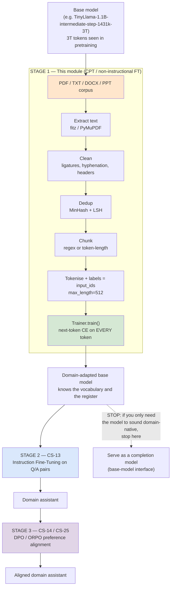

# CS-12 — Domain-Adaptive Continued Pretraining on Your Own PDFs

| Field | Value |
|---|---|
| **Module** | Stage 1 of the fine-tuning lifecycle: non-instructional / domain-adaptive continued pretraining (CPT) |
| **Source video(s)** | LLM Fine-Tuning 14: Train LLMs on Your PDF/Text Data \| Domain-Specific Fine-Tuning with Hugging Face |
| **Transcript file(s)** | `LLM_Fine-Tuning_14_Train_LLMs_on_Your_PDFText_Data_Domain-Specific_Fine-Tuning_w.txt` (2,620 lines) |
| **Companion code** | `LLM Fine-Tuning-14-Train-LLMs-on-Your-PDF-Text-Data -Domain-Specific-Fine-Tuning-with-HuggingFace/non_Instruction_pretrain_llm_finetuning_on_domain_specific_data.ipynb` (74 cells), `Metformin.pdf` (1 page, 57 KB, synthetic single-column), `tinyllama-non-instruction.zip` (LoRA adapter) |
| **Predecessors** | CS-01 (the three-stage lifecycle), CS-02 (transfer learning), CS-06 (HF `Trainer`/`datasets`), CS-10/CS-11 (quantization, for the 8-bit load path) |
| **Successor** | **CS-13 (Instruction Fine-Tuning)** — this module is the stage that runs *before* CS-13, and the same base model continues into it |
| **Neighbours** | CS-04 (fine-tuning vs RAG vs agents), CS-14 (the alignment map), CS-16 (Unsloth), CS-23 (LoRA/QLoRA deep dive) |
| **Difficulty** | Intermediate to run, Expert to run *correctly*. The notebook is 30 lines of real code; the data pipeline is the job. |
| **Hands-on required** | Yes — but read §4.9 and §12 first, because the notebook's own demo run does not converge and the video presents it as a success |
| **Estimated study time** | 6h theory + 10h practical (the practical is building the PDF→chunks pipeline for a *real* PDF, not the one-page synthetic one) |

---

## 0. Executive Summary

- **CPT (continued pretraining) = the original pretraining objective — next-token cross-entropy on raw text — resumed on a narrow corpus.** Nothing about the loss changes. What changes is the *distribution* the tokens are drawn from: from the open web to your documents. The instructor names the stage **"non-instructional fine-tuning,"** and also calls it **"normal fine-tuning,"** **"domain specific fine-tuning,"** and **"domain adoption [adaptation] fine-tuning"** — all four labels refer to the same thing [31:16]–[31:33], [34:47]–[35:33]. The industry name is **DAPT** (Domain-Adaptive Pretraining) or **CPT**.
- **Why it comes first: SFT teaches *shape*, CPT teaches *vocabulary and facts*.** The instructor's own workflow statement is the thesis of this module: *"first teach your model on your domain specific data set on your PDF text and all and later on perform some instruction tuning"* [54:10]–[54:19]. Run SFT first and you are asking a model that has never seen the word "ezetimibe" to format an answer about ezetimibe. CPT is cheap, unsupervised, and unlimited in data supply; SFT is expensive, supervised, and data-limited. Do the cheap one first.
- **The single most important number in this module: 3 trillion.** That is how many tokens `TinyLlama-1.1B` saw in pretraining [1:19:16]–[1:19:39]. Divide by 1.1B parameters and it is **2,727 tokens per parameter** — the baseline against which any CPT run must be judged. The notebook's demo CPT run consumes **4 chunks × 5 epochs × ~60 tokens ≈ 1,200 tokens**, which is **1.1 × 10⁻⁶ tokens per parameter**, or **0.00004%** of the pretraining budget. That is not a fine-tune. That is a rounding error, and §4.10 shows the arithmetic.
- **The pipeline the instructor actually runs, in order:** PDF → `fitz.open()` page loop → `page.get_text("text")` → join pages → `re.split(r'\n\s*\n')` paragraph split → drop chunks `≤ 30` characters → wrap in `{"text": chunk}` → `Dataset.from_list()` → `tokenizer(..., truncation=True, padding="max_length", max_length=512)` → `labels = input_ids.copy()` → `Trainer.train()` [1:11:04]–[1:25:37]. Every one of those arrows has a failure mode; §4.4–§4.8 enumerate them.
- **The notebook's own demo does not work, and the video says it does.** Full fine-tuning of the 1.1B model throws CUDA OOM on the free Colab T4 [1:29:27]–[1:30:04] — that failure is real and is the most instructive 40 seconds in the video. The LoRA rescue run then reports **`training loss = 9.66`** [1:41:35], which is `exp(9.66) ≈ 15,700` perplexity, i.e. near-uniform over the vocabulary; and the sample generation is a mangled verbatim echo of the prompt [1:43:44]. The instructor calls this *"the very amazing result"* [1:44:03]. **See `Correction` callout in §4.3.5 — this is the module's central cautionary tale.**
- **PDF extraction is where the project dies, and the demo PDF is the easy case.** `Metformin.pdf` is a one-page **single-column, non-scanned, synthetic** document generated by a word processor. It extracts cleanly. A real corpus — two-column journal papers, scanned filings, financial tables — breaks `get_text("text")` in at least **eight** distinct, silent ways (§4.5). Budget 60–70% of your project time here, not on the training run.
- **Near-duplicate text hurts CPT far more than it hurts SFT.** Pretraining loss is a *density* estimator: a document repeated 40 times is 40× the gradient weight of a document seen once, so a boilerplate appendix or a duplicated 10-K filing silently re-weights your whole objective. SFT loss is a *conditional* estimator over prompt/response pairs, and dedup there is mostly about not wasting epochs. §4.7 gives the MinHash/LSH recipe and the `datasketch` parameters.
- **Chunk boundaries are a hyperparameter, not an implementation detail.** `re.split(r'\n\s*\n')` splits on blank lines — which means it splits *correctly* on prose and *catastrophically* on two-column PDFs, tables, and bulleted lists. A chunk that begins mid-sentence teaches the model that sentences can begin mid-word. §4.8.
- **Catastrophic forgetting is the cost of CPT, and there are four dials, not one:** replay ratio of general-domain text (the video does **not** do this — see §4.9.3), a learning rate one to two orders of magnitude below SFT's, LoRA instead of full FT, and **short duration**. The notebook gets 1 of 4 right, and the one it gets right (LoRA) it gets right for the wrong reason — memory, not forgetting.
- **The right success metric is held-out *domain* perplexity, not training loss.** Training loss on 4 chunks is meaningless (it goes down because the model memorises 4 chunks). §12 gives the held-out split protocol, the perplexity formula, and the three other things that look like success and are not.

---

## 1. The Problem This Solves

### 1.1 What breaks in the real world without CPT

The instructor frames the failure at [32:09]–[32:38] and again at [36:04]–[36:14]:

> *"here it know the domain specific knowledge but still it is lacking to generate the structure answer"* [36:06]–[36:14]

He is describing the *post*-CPT state. The *pre*-CPT state is worse, and he describes that too — the base model dropped into a pharma company:

> *"this model does not know the pharma specific term... so it will hallucinate"* (this is the CS-13 framing of the same motivating story [16:31]–[17:35], and CS-13 §1.1 covers the SFT half of it)

Here is the full taxonomy of what actually breaks. The first three are what CPT fixes; the last three are what CPT *causes* if you do it wrong.

| Failure | What it looks like | Root cause | Fixed by |
|---|---|---|---|
| **Domain vocabulary is out of distribution** | The model tokenises `ezetimibe` into `ez` + `et` + `im` + `ibe`, or worse `e` + `zet` + `im` + `ibe`. Four tokens where a domain-adapted model would use one. Every downstream prediction about that entity is now a composition of four unrelated subword statistics. | The tokenizer was trained on web text. Rare pharma, legal, and industrial terms get shredded into fragments. | CPT — the tokenizer is frozen, but the *embeddings and MLP layers* learn to compose the fragments into a stable concept. |
| **Domain collocations are out of distribution** | The model writes "the patient took the drug and then the drug made them better." A domain model writes "the patient was initiated on therapy and demonstrated a clinical response." Both are grammatical. Only one is publishable. | The model learned the *distribution of English*, not the *register of your field*. Register is a statistical property of the token sequence. | CPT — this is the single strongest argument for it and the one the video under-sells [38:55]–[39:00]. |
| **Long domain-specific documents overflow the context** | A 40-page protocol document does not fit in 2,048 tokens. Chunking is mandatory, and naive chunking destroys the cross-references ("see §4.2.1") that carry the meaning. | The pretrained context window was chosen for web text, where the useful span is short. | CPT + a deliberate chunking strategy (§4.8). Not a RAG problem. |
| **Catastrophic forgetting** | After CPT, the model writes beautiful pharma prose and can no longer do arithmetic, follow a JSON schema, or answer a general-knowledge question. | Gradient descent on a narrow distribution moves all weights toward it. The general capability is not deleted; it is *drowned out* under a shifted output distribution. | Replay data + low LR + LoRA + short duration (§4.9). |
| **Format collapse** | After CPT the model completes text but no longer responds to instructions. Ask it a question and it continues the question. | CPT explicitly optimises next-token prediction on *documents*, where a question is followed by prose about the question. You have reverted the model to base-model behaviour. | This is expected and correct. It is why CS-13 exists. |
| **Silent corpus poisoning** | A duplicated appendix, a boilerplate legal footer, a scraped navigation sidebar. The model learns the boilerplate as high-probability content and emits it in every generation. | The loss is a density estimator. Whatever is densest in your corpus becomes the most probable output. §4.7. | Dedup + boilerplate stripping (§4.6, §4.7). |

### 1.2 The state of the art before CPT

| Era | Approach | Why it was not enough |
|---|---|---|
| Pre-2018 | Train your own model per domain from scratch | Requires the corpus *and* the compute. The instructor's framing [25:31]–[26:27] is exactly this: *"this training itself is a bottleneck... every country every company not having this much of data"*. Nine of the ten model families he lists are from US labs, and the reason is data plus GPU, not talent [26:11]–[26:25]. |
| 2018–2020 | Domain BERTs: BioBERT, SciBERT, Legal-BERT, FinBERT. Take BERT-base, run MLM + NSP on PubMed/arXiv/EDGAR, then fine-tune per task. | This *is* CPT — it is the same technique, one architecture generation back. It worked. It was abandoned when LLM prompting arrived and people incorrectly concluded that context windows had made domain adaptation unnecessary. |
| 2020–2023 | Few-shot prompting with a giant system message | 4× latency, 6× cost per call, and it cannot teach a *register* — only a style instruction. CS-04 covers the trade-off. |
| 2023–2025 | RAG over the document set | Retrieves the right *facts* but the model still writes about them in web-register English, and it still shreds the domain terms at the tokenizer. RAG and CPT are complements, not substitutes (§4.2). |

### 1.3 The naive approach and precisely why it fails

The instructor's own first attempt is the naive approach, and it fails *on camera*. This is unusually valuable, so here is the exact sequence:

```python
# Cell 36–41 of the companion notebook. This is what NOT to do.
model = AutoModelForCausalLM.from_pretrained(model_name)   # TinyLlama-1.1B, fp32, ~4.4 GB
trainer = Trainer(model=model, args=training_args, train_dataset=tokenized)
trainer.train()
```

Result: `torch.cuda.OutOfMemoryError`. The instructor's narration [1:29:26]–[1:30:04]:

> *"see here I will be getting out of memory error. Now why I'm getting this out of memory error because... we are training the entire model. We are retraining the entire model over here. ... We are not going to do any Lora and Qura. We are simply retraining the weight of the entire model. and my machine is not capable to do that thing"*

**Full fine-tuning a 1.1B model on a free Colab T4 (16 GB) is arithmetically impossible, and here is the arithmetic** (this is the check you should run before every training job you ever launch):

| Component | Bytes per param | 1.1B params → GB |
|---|---|---|
| Model weights (fp32, as `from_pretrained` loads by default) | 4 | 4.40 |
| Gradients (fp32) | 4 | 4.40 |
| AdamW optimizer state: `exp_avg` + `exp_avg_sq` | 8 | 8.80 |
| **Subtotal, before any activation** | **16** | **17.60** |
| Activations, batch 2 × seq 512, no gradient checkpointing | ~1–3 GB | ~2.0 |
| **Total** | | **~19.6 GB** |

The T4 has 16 GB, of which ~14.5 GB is usable. The run is over budget by ~5 GB before a single token is processed — hence the OOM, and hence the instructor's LoRA pivot at [1:30:06]:

> *"So what is the solution of it? So the solution of it is LoRa... parameter efficient fine-tuning."* [1:30:06]–[1:30:11]

The fix is correct but the *reasoning* is wrong, and the distinction matters for this module. LoRA is the right answer here for **memory**, and it is *also* the right answer for **forgetting resistance** (§4.9.4). The instructor only ever gives the first reason. The second reason is why you should use LoRA for CPT even when you have 8×A100-80GB and no memory pressure at all.

The second naive-approach failure is quieter. Having pivoted to LoRA, the notebook trains with the same data pipeline and reports a loss of 9.66 while the instructor describes the output as amazing. §4.3.5 unpacks it.

---

## 2. First-Principles Mental Model

### 2.1 The analogy: CPT is immersion, SFT is a job interview

A person who has read the entire internet speaks fluent general English. Drop them into a pharmaceutical manufacturing plant for six weeks — not as an employee, just *listening*: reading the SOPs, the batch records, the deviation reports, the FDA correspondence. Nobody gives them a task. Nobody corrects them. They simply absorb the statistics of how people in that building write and what words they use.

At the end of six weeks they can talk like an insider. They know that "the batch was rejected" is written "the lot was placed on hold pending investigation." They know that "we messed up" is "a deviation from cGMP was identified." They have learned the **register**.

Now send them to a job interview. That is SFT. The interview does not teach them pharmacology — the six weeks did. The interview teaches them to *answer questions in the format the interviewer expects*, to stop monologuing, to structure a response. Six weeks of immersion and a one-hour interview produces a competent hire. The interview alone produces a person who can structure an answer about a subject they know nothing about — which is exactly the "confidently wrong in a new style" failure mode.

**Where this analogy breaks — three places, and all three matter operationally.**

1. **The immersion is not free; it erases.** A human who spends six weeks in a pharma plant can still do long division. An LLM that spends 5 epochs on 4 pharma chunks has had its weights moved by gradient descent, and the movement is not confined to "pharma words." There is no gating mechanism that says *only update the pharma circuits*. Everything that contributes to the loss updates. This is catastrophic forgetting, and it is the single biggest difference between the analogy and the reality (§4.9).
2. **The human knows what they don't know.** An LLM's confidence is uncalibrated in exactly the regime CPT creates: it will now produce fluent, register-correct, *wrong* pharma text with the same confidence as fluent correct pharma text. Pre-CPT it at least sounded uncertain. Post-CPT it sounds like an expert. This is why §12 (evaluation) cannot be skipped.
3. **Six weeks is not six weeks.** The human's immersion-to-competence curve is roughly linear in exposure. The LLM's is roughly linear in *tokens per parameter*, and the notebook's exposure is seven orders of magnitude below its pretraining exposure. A human analogy would be "read one sentence of the SOP and now you're an insider." Which is to say: the analogy flatters the technique. The real requirement is a corpus, not a document.

### 2.2 The mechanism, stated precisely

Pretraining minimises the negative log-likelihood of every token given its left context, over the web:

$$L_{PT} = -\frac{1}{N}\sum_{i=1}^{N} \sum_{t=1}^{T_i} \log p_\theta(x_{i,t} \mid x_{i,<t}), \qquad \{x_i\} \sim \mathcal{D}_{web}$$

Continued pretraining minimises **the same functional form** over your corpus:

$$L_{CPT} = -\frac{1}{M}\sum_{j=1}^{M} \sum_{t=1}^{T_j} \log p_\theta(y_{j,t} \mid y_{j,<t}), \qquad \{y_j\} \sim \mathcal{D}_{domain}$$

Compare the three stages. This table is the whole module in eight rows:

| | Pretraining | **CPT (this module)** | SFT (CS-13) |
|---|---|---|---|
| Objective | next-token CE | **next-token CE — identical** | next-token CE |
| Data distribution | web, ~10–15T tokens | **your documents, 10M–1B tokens** | prompt/response pairs, 1k–1M tokens |
| Supervision mask | every token | **every token — identical** | response spans only |
| Label construction | shift by one (implicit) | `labels = input_ids.copy()` and HF shifts internally | `-100` on prompt tokens |
| Corpus structure | documents | **documents (chunked)** | conversations |
| Data supply | finite but huge | **unbounded — you can always scan more pages** | hard-limited by human annotation budget |
| Gradient cost per unit of new knowledge | ~1 token | **~1 token** | ~10–100 tokens per fact |
| What it changes | — | vocabulary, register, collocations, facts | format, tone, task compliance, refusal behaviour |

Two things changed relative to pretraining (the data distribution and, in practice, the learning rate) and one thing did not (the objective and the mask). That is the entire mechanism. Anyone who tells you CPT is "a different kind of training" is wrong. It is pretraining, resumed, on purpose, on a narrow slice.

### 2.3 The information-theoretic reading — why CPT can work at all

Cross-entropy loss is a **surprisal** average:

$$L = \mathbb{E}_{x \sim \mathcal{D}}\big[-\log p_\theta(x)\big] = H(\mathcal{D}) + D_{KL}(\mathcal{D} \,\|\, p_\theta)$$

The first term, $H(\mathcal{D})$, is the *intrinsic entropy of the corpus* — how predictable the corpus is in principle. The second is how far your model's distribution is from it. Gradient descent can only reduce the second term. It cannot reduce the first.

**This single equation explains every failure mode in this module:**

- **Why a bigger corpus is not automatically better.** If your corpus is a 200-page equipment manual with 40 pages of boilerplate, $H(\mathcal{D})$ is dominated by the boilerplate's regularity. The model spends its capacity on the easy 80% and learns nothing about the hard 20%, because the gradient is proportional to surprisal, and boilerplate has near-zero surprisal once learned. The signal lives in the tail.
- **Why duplicated documents are poison.** Duplication does not change $H(\mathcal{D})$ for a document, but it does change the *empirical* $\hat{H}$ your gradient estimates — the duplicated document now contributes proportionally more of the batch. You have silently re-weighted the objective. §4.7.
- **Why loss goes to ~0 on 4 chunks.** With 4 chunks and 5 epochs, the model's 1.1B parameters have enough capacity to memorise 4 chunks. $D_{KL} \to 0$. The loss of 9.66 in the notebook is high *because the run had not even finished memorising* — but the trajectory was toward memorisation, not toward generalisation. A held-out split is the only thing that distinguishes these two.
- **Why the correct metric is held-out perplexity.** $\exp(L_{eval})$ on data the model has never seen is a direct estimate of $\exp(D_{KL})$ plus the corpus entropy floor. Training loss cannot be, because it is contaminated by the memorisation component. §12.

> **Beyond the video:** the entropy framing also tells you the **upper bound on what CPT can achieve without more data**. If your corpus is 50M tokens of highly repetitive text, the effective entropy is maybe 5M tokens' worth, and no amount of training will extract more. A useful pre-flight estimate: count distinct 13-grams in your corpus and divide by total 13-grams. Anything below ~0.5 means more than half your corpus is near-duplicate and you should dedup before you train, not after. On the one-page Metformin PDF the notebook uses, the distinct-13-gram ratio is 1.0 — because there is only one page. That is the tell that the demo cannot fail, and therefore cannot teach you anything.

---

## 3. Core Concepts — Exhaustive Glossary

### 3.1 The three-stage pipeline and its synonyms

| Term | Definition | Why it matters | Common confusion |
|---|---|---|---|
| **Unsupervised pretraining** / **self-supervised learning** | The first stage. Next-token prediction over web-scale text. Called *unsupervised* because there are no human labels, and *self-supervised* because the label is generated from the data itself. The instructor gives exactly this etymology [24:11]–[24:33]: *"why it is called the self-supervised learning because the label is being created automatically. The next word itself will be the label."* | This is the stage that produces a **base model**. Everything in this module is a resumption of it. | People use "pretraining" loosely to mean "any training done before SFT," which makes CPT sound like a different thing. It is not. |
| **Base model** | The artefact of pretraining only — `Llama-3.1-8B`, `TinyLlama-1.1B-intermediate-step-1431k-3T`, `Mistral-7B-v0.1`. The instructor shows how the name itself tells you [29:02]–[29:59]: `llama-2-13b` is a base model; `llama-2-7b-chat` and `Meta-Llama-3-8B-Instruct` are not. | You must start CPT from a **base** model, not an instruct model. Starting from an instruct model means fighting its existing instruction-following prior, and it wastes the alignment work already paid for. | "Base" is not "smaller" or "earlier". It is a provenance claim about what training was run. |
| **SFT** (Supervised Fine-Tuning) | Stage 2. The instructor calls it *"very much important"* [4:43]–[4:47] and splits it two ways. | The stage this module precedes. | The instructor's split of SFT along **two independent axes** is genuinely clarifying and is covered next. |
| **SFT split — by parameter** | `full fine-tuning` (train every weight and bias) vs `partial fine-tuning` (train a subset). The instructor's exact words [5:51]–[6:22]: *"if we are talking about the full fine tuning. Now here we are going to train all the parameter... parameter is nothing. It is weight and the biases."* | Determines VRAM and forgetting behaviour. §4.9.4. | "Partial fine-tuning" is his umbrella term; **PEFT** is the modern sub-case. |
| **SFT split — by data** | `non-instructional fine-tuning` (plain text, no Q/A — **this module**) vs `instructional fine-tuning` (Q/A, input/output, instruction/response — CS-13). The instructor states this at [17:34]–[18:11] and again in summary at [18:56]–[19:10]: *"on a data level also... we can divide into the two part first is a non-instructional finetuning and then second is the instruction finetuning."* | **This is the module's core taxonomy.** Non-instructional SFT *is* CPT — the same operation, seen from the data side. | The instructor places CPT *inside* SFT because both are supervised gradient descent. Industry places it *before* SFT because the data is unsupervised. Both are defensible; the ordering is what matters. |
| **Non-instructional fine-tuning** | The instructor's primary name for this module's technique. Data = plain text from `PDF`, `text`, `PPT`, `docs` [2:46]–[2:52]. The model *"learning is the statical distribution of the text not question answering behavior"* [39:23]–[39:29]. | The name you will see in the video and notebook. | Not "unsupervised" — the labels are still auto-generated, so it is self-supervised. The instructor uses both terms for the same stage [41:50]–[42:00]. |
| **Normal fine-tuning** / **domain specific fine-tuning** / **domain adoption fine-tuning** | Three more names the instructor uses for the identical stage [31:26]–[31:33]. | Same thing. Terminology drift, not a taxonomy. | Do not model these as separate techniques. |
| **CPT** (Continued Pretraining) | The industry name for this module's technique. Also **DAPT** (Domain-Adaptive Pretraining). | The name that appears in papers and job descriptions. | "Continued pretraining" and "domain-adaptive pretraining" are the same thing when the continuation corpus is domain text. DAPT is CPT with a domain corpus; CPT on in-domain *general* text (e.g. a fresh web crawl) is also CPT. |
| **Preference-based learning** / **alignment with human feedback** | Stage 3. `RLHF` (via PPO) and `DPO`. The instructor's framing [20:02]–[20:32], [22:10]–[22:22]: *"we are aligning the response"*, and DPO *"is supervised learning"*. | Not this module — CS-14 and CS-25. Listed here only to complete the pipeline. | The instructor notes ChatGPT collected this data from user logs with thumbs-up/down and *"anomalization"* [49:20]–[49:23] (his pronunciation of **anonymisation**). CS-14 §16 covers the compliance side. |
| **ChatGPT skipped this stage** | The instructor's claim at [31:25]–[31:43]: *"if we're talking about the chat GPT so GPT have skipped this particular stage this normal finetuning means domain specific finetuning domain adoption fining learning"*. | His practical conclusion — that an enterprise must add the CPT step that a general-purpose lab does not — is **correct and important**. His description of what OpenAI did is **wrong**. See `Correction` in §4.1.3. | The right reading: OpenAI's *domain* is the open web, so their pretraining already covered it. Yours is not, so yours does not. |

### 3.2 The parameter-level taxonomy — every technique the instructor names

The instructor walks the parameter axis exhaustively at [7:02]–[17:01]. He names **seven** PEFT methods. You should be able to place each one on the spectrum from "updates almost nothing" to "updates almost everything," because for CPT the position on that spectrum *is* the forgetting risk.

| Term | Definition | Why it matters for CPT | Common confusion |
|---|---|---|---|
| **Full fine-tuning** | Train every weight and bias. Instructor [5:51]–[6:57]: *"required huge GPU memory... and it's required multiGPU setup also... So we avoid this full fine tuning."* | Maximum plasticity, maximum forgetting. The correct choice only when you have ≥100M domain tokens and a replay corpus. §4.9.4. | "Full FT gives better quality" is true for large domain corpora and false for small ones — on 4 chunks it is strictly worse than LoRA because it can memorise harder. |
| **Partial fine-tuning** | The instructor's umbrella [7:02]–[7:11]. Two families: the "old school" freeze method and PEFT. | Not a technique; a category. | — |
| **Old-school freeze (frozen backbone + last-layer)** | *"freeze all layer and train last output layer"* [7:31]–[7:47]; second variant *"Freeze some starting layer and retrain some last layer"* [7:58]–[8:27]. He attributes it to CNNs, BERT, T5 [8:31]–[9:00]. | Very low forgetting risk, but very low capacity to absorb new vocabulary — the last-layer-only variant cannot change how `ezetimibe` is represented, because the representation is computed in the frozen blocks. Useless for CPT of new terminology. | People assume "fewer trainable params = safer." True for forgetting, false for capability. The *location* of the trainable parameters matters more than the count. |
| **PEFT** (Parameter-Efficient Fine-Tuning) | *"we are not going to be train all the parameter of the model instead of that we are going to be trained some specific parameter"* [10:10]–[10:18]. | The correct family for CPT at any scale, for the forgetting reason in §4.9.4. | PEFT is not one method. It is an umbrella the instructor correctly enumerates. |
| **LoRA** (Low-Rank Adaptation) | Injects trainable $A \in \mathbb{R}^{r\times k}$, $B \in \mathbb{R}^{d\times r}$ alongside a frozen $W_0$, so the effective weight is $W_0 + \frac{\alpha}{r}BA$. Instructor: *"Lora is very important and the base for everything is the LoRa"* [15:18]–[15:23]. | The default for CPT. Zero inference latency after merge; ~0.1–1% trainable parameters; and the low-rank constraint is itself a forgetting brake. Deep dive in §7 and CS-23. | LoRA does not *prevent* forgetting — it slows it. §4.9.4. |
| **QLoRA** | LoRA on top of a 4-bit (NF4) quantized frozen base. Instructor [10:37]–[11:41]: *"quantized version of the Laura... this Q is representing to the quantization... we can do the memory efficient loading."* | The only way CPT fits on a 16 GB T4 or a 24 GB consumer card. Note the notebook actually uses **8-bit** (`load_in_8bit=True`), which is neither QLoRA (4-bit NF4) nor full precision — see §10 gotcha #4. | "QLoRA = 4-bit" — yes, specifically NF4 with double quantization. 8-bit `load_in_8bit` is a different (older) code path, and it is what the video actually runs. |
| **DoRA** (Weight-Decomposed Low-Rank Adaptation) | Decomposes $W$ into a magnitude vector $m$ and a direction $V/\|V\|$, applies LoRA to the direction only. Instructor [12:41]–[12:46], [16:00]–[16:13], but he gives the expansion as *"weight decomposition low rank adaption"*. | Slightly better quality than LoRA at the same rank on most benchmarks, at ~10–20% more compute. A drop-in for `LoraConfig` in modern `peft`. | **See `Correction` in §7.6** — the name is *Weight-Decomposed*, not "weight decomposition," and the instructor's phrasing makes it sound like a data preprocessing step. |
| **Adapter layers** | Small bottleneck MLPs inserted *between* frozen transformer blocks. Instructor [12:51]–[13:11]: *"adapter layers is also inspired from the lora only... we are going to be append some layer in the existing block of the transformer."* | Adds serial inference latency (unlike LoRA, which merges to zero). For CPT the extra depth also means extra capacity to memorise. Rarely the right choice in 2025. | His claim that adapters are "inspired from LoRA" is backwards — adapters (Houlsby et al., 2019) predate LoRA (Hu et al., 2021) by two years. |
| **BitFit** | Train only the bias terms (~0.08% of parameters). Instructor [13:17]–[13:23], [15:34]–[15:52], and he honestly flags it: *"this is not very popular but yeah we can look into it. If you are doing some experiment you can go through with it."* | Almost no forgetting risk and almost no CPT capability. Fine for classifier heads; useless for domain vocabulary. | "Train the biases" sounds like it should steer behaviour. It barely moves the output distribution. |
| **IA3** (Infused Adapter by Inhibiting and Amplifying Inner Activations) | Learns three vectors that rescale the keys, values, and FFN intermediate activations. Instructor [13:32]–[13:37], and the expansion at [14:52]–[14:55]. | ~0.01% trainable parameters, no inference overhead. Too weak for domain vocabulary injection. | **See `Correction` in §7.6** — the instructor says IA3 *"is a part of the lora itself to improve the lora"* [15:07]–[15:11]. It is not. It is an independent method (Liu et al., 2022) that has nothing to do with LoRA. |
| **Prefix tuning** | Prepend trainable key/value vectors to every attention layer. Instructor [13:42]–[13:46] — listed, not explained. | Consumes context length; weak for CPT. | Confused with prompt tuning constantly. See next row. |
| **Prompt tuning** | Learn soft prompt embeddings at the input layer only. Instructor [13:52]–[14:05], and he flags the taxonomy problem himself: *"prompt tuning it might not be a part of the pft but yeah I kept it over here."* | Cannot change internal representations, so it cannot do CPT. Correctly identified as the weakest member of the list. | Prompt tuning *is* PEFT by the standard definition (Li & Liang, 2021); his hesitation is unfounded but harmless. |
| **`LoraConfig`** | The `peft` dataclass holding `r`, `lora_alpha`, `target_modules`, `lora_dropout`, `bias`, `task_type`. Notebook cell 56. | The four knobs that matter for CPT. §7.3–§7.6. | `task_type=TaskType.CAUSAL_LM` is required; forgetting it silently attaches the adapter in a way that does not train the LM head. |
| **`get_peft_model`** | Wraps the base model, freezes it, injects the adapter. Notebook cell 57. | The `peft` entry point. | The wrapped object is a `PeftModel`, **not** an `AutoModelForCausalLM`. Saving it saves an adapter, not a model — see §10 gotcha #2. |
| **`target_modules=["q_proj","v_proj"]`** | Which linear layers get adapters. Notebook cell 56. | For **CPT** this default is too narrow. Attention-only adaptation changes *where the model looks*, not *what it knows*. Add `k_proj`, `o_proj`, and the MLP projections (`gate_proj`, `up_proj`, `down_proj`) for domain vocabulary. §7.5. | It is the universal default in tutorials because it was LoRA's original paper setting for *instruction* tuning. It is the wrong default for continued pretraining. |

### 3.3 Data-pipeline terms

| Term | Definition | Why it matters | Common confusion |
|---|---|---|---|
| **`fitz`** | The import name for **PyMuPDF**. Instructor [1:10:30]–[1:10:36]: *"I'm going to be import the fits library. This is from the pi mu pdf itself means in the back end it is using the pi mu pdf."* | The PDF text extractor this module uses. Fast (C-backed), permissive licence (AGPL for the free tier — §16.6). | `fitz` and `PyMuPDF` are the same library. The historical `fitz` package on PyPI was a *different* project; install `PyMuPDF`, import `fitz`. |
| **`page.get_text("text")`** | Extracts one page as a plain-text string using MuPDF's default reading-order heuristic. Notebook cell 13. | The single point of failure for the whole pipeline. §4.5 enumerates its eight silent failure modes. | It is *not* OCR. On a scanned page it returns `''` — silently. |
| **Text block** | In PyMuPDF, a rectangle-grouped run of glyphs. `extract_text_from_pdf` in the notebook appends one *page* string, not one *block* string, despite the variable name `text_blocks`. | The naming mismatch hides the fact that page-level concatenation merges the last paragraph of page N with the first paragraph of page N+1 — a boundary bug that the `\n\s*\n` splitter then cannot see. §4.8. | The notebook's variable says blocks; the code produces pages. |
| **Reading order** | The sequence in which a PDF's content stream places glyphs, which is *not* necessarily the sequence a human reads. | Two-column papers are emitted column-interleaved or column-major depending on the generator. §4.5. | PDF has no concept of "paragraph." It has positioned glyphs. Any structure you get is a heuristic. |
| **OCR** (Optical Character Recognition) | Converting a raster page image into text. Required when the PDF has no text layer (scanned documents, many filings, most faxes). | `get_text` returns empty on these, and the pipeline silently produces an empty corpus. §4.5 mode 7. | "The PDF opened fine" tells you nothing. If you can select the text with a cursor, it has a text layer. If you cannot, you need OCR. |
| **Ligature** | A single glyph representing multiple characters — `fi`, `fl`, `ff`, `ffi`. | Extractors return `fi` (U+FB01) instead of `fi`. The tokenizer then sees an out-of-vocabulary character and emits `<unk>`, so `efficiency` becomes `e` + `<unk>` + `ciency`. Three tokens, one of them meaningless. §4.5 mode 4. | Modern tokenizers handle the *decomposed* form (`fi`) fine. The bug is that the ligature glyph is never decomposed. |
| **Soft hyphen / end-of-line hyphenation** | `hyper-\n tension` → `hyper` `tension`. | The extractor preserves the line break as `\n` (or nothing). Your corpus now contains `hyper\ntension`, and the model learns that `hyper` is a word that ends lines. Worse, the `\n` survives into the tokenizer as a real newline token, breaking the paragraph splitter's assumptions. §4.5 mode 5. | The fix is not "strip all newlines" — that destroys paragraph structure. The fix is a targeted de-hyphenation regex *before* the paragraph split. §4.6.3. |
| **Running header / footer** | The repeated page furniture: journal name, volume, page number, "Downloaded from…", copyright line. | On a 200-page document you acquire 200 copies of the same string. That is a 200×-weighted training signal telling the model that this string is important content. §4.5 mode 3. | The instructor's demo PDF has no headers or footers. Real ones do. |
| **Boilerplate** | Any text that appears on many pages with near-identical wording — nav bars, sidebars, cookie notices, legal disclaimers. | Same failure as headers, larger. §4.7's MinHash pass catches most of it. | Boilerplate is not "junk." It is *high-density* text, which makes it worse than junk. |
| **Chunk / window / block** | A contiguous span of tokens fed to the model as one training example. | The most under-specified hyperparameter in the video. §4.8. | "Chunk" means a *training example*, whose length is `max_length`. It does not mean the same thing as a paragraph or a semantic segment. |
| **`max_length`** | The fixed token length every example is padded/truncated to. `512` in the notebook (cells 32, 52). | Sets the context over which the model can learn cross-token structure. With `padding="max_length"` it also sets how much of your loss is padding. §7.7. | The model's context window (`TinyLlama` = 2,048) is an upper bound, not a target. Setting `max_length` below it is legitimate and cheaper. |
| **`truncation=True`** | Cut anything longer than `max_length`. | Silent information loss. A 3,000-token document chunk becomes 512 tokens and the rest is gone with no log line. | Truncation is per-example and silent. `dataset.map` will not warn you. Log your length histogram. |
| **`padding="max_length"`** | Pad every example *up to* `max_length`, even if the batch's longest example is much shorter. | This is the notebook's setting and it is the cause of the pad-as-target bug (§4.3.4). Use `padding=False` + a data collator, or `padding="longest"`. §7.8. | `padding="max_length"` is not merely slower than `"longest"` — with `labels = input_ids.copy()` it changes the *objective*. |
| **`labels = input_ids.copy()`** | Every token becomes its own target; HF's `Trainer` applies the one-position shift internally. Notebook cells 32, 52. | Correct for causal LM — **but only if pad positions are masked to `-100`.** The notebook does not mask them. §4.3.4. | The line looks harmless. It is the highest-leverage line in the notebook. |
| **`attention_mask`** | Binary vector marking real tokens vs padding. | Prevents the model from attending to pad. It does **not** prevent the model from being *trained to predict* pad — those are different mechanisms. §4.3.4. | "The attention mask handles padding" is the most common misreading in this whole pipeline. |
| **PAD token** | The filler token that makes a batch rectangular. | The notebook sets `tokenizer.pad_token = tokenizer.eos_token` because TinyLlama ships without a pad token (cells 30, 51). | Aliasing pad to EOS means the model is trained to emit `</s>` at every masked position — which is *almost* harmless and hides the bug beautifully. That is why nobody notices. |
| **EOS / BOS** | End- and beginning-of-sequence tokens. | `</s>` at the end of each chunk teaches the model where a document ends. The notebook's chunks do not append EOS explicitly; the pad-aliasing means the first pad position happens to be `</s>`, so the effect is partially achieved by accident. | Do not rely on accidents. Append EOS deliberately. §4.8.5. |
| **Tokens-per-parameter** | Total training tokens ÷ total model parameters. | The only defensible unit for comparing a CPT run's magnitude to pretraining. §4.10. | Not the same as "epochs." Epochs are relative to your dataset; tokens-per-parameter is absolute. |
| **Chinchilla-optimal** | ~20 tokens per parameter for a *compute-optimal* pretraining run (Hoffmann et al., 2022). | The reference point. Note carefully: Chinchilla-optimal is about **compute allocation**, not about **how much data a downstream CPT run needs** — those are different questions. §4.10. | "Chinchilla says 20 tokens/param" is quoted constantly and misapplied to fine-tuning, where the answer is 3–5 orders of magnitude lower. |
| **`Dataset.from_list`** | Builds an HF `Dataset` from a Python list of dicts. Notebook cell 23. | The bridge from your extraction code to the trainer. | The `text` key must match the key the tokenizer function reads. The instructor is explicit about this requirement at [1:16:28]–[1:16:39]: the data *"should have this text column and under this text column the chunk should be present."* |

### 3.4 Optimisation and memory terms

| Term | Definition | Why it matters for CPT | Common confusion |
|---|---|---|---|
| **Learning rate** | The step size. Notebook: `2e-5` for full FT (cell 38), `1e-4` for the freeze method (cell 44), `2e-4` for LoRA (cell 58). | The instructor's description [1:27:42]–[1:27:57]: *"if we have very huge learning rate my basically graph will go here and there. If we have like a small learning rate then my graph will go smoother."* Correct as far as it goes, but for CPT the LR is the **primary forgetting dial** and he never connects it to that. §4.9.2. | "Lower LR = safer" is right for forgetting and wrong for convergence. On 4 chunks there is nothing to converge to. |
| **AdamW** | The default optimiser: Adam with decoupled weight decay. | Its state is 2 fp32 tensors per parameter — the reason full FT needs 16 bytes/param before activations. §1.3. | `optim="adamw_torch"` in HF is plain AdamW. `paged_adamw_8bit` (bitsandbytes) is what makes 7B full FT fit on 80 GB. |
| **Weight decay** | L2-style shrinkage applied to weights, not biases or LayerNorms. | In HF `TrainingArguments` the **default is `0.0`**, which is unusual — most papers use `0.01`–`0.1`. The notebook does not set it, so it is 0. §7.11. | A zero weight decay on a long CPT run lets weights drift; combined with a high LR this accelerates forgetting. |
| **Warmup** | Linear LR ramp over the first N steps. | HF default `warmup_ratio=0.0`. On a 20-step run, warmup is noise. On a 20,000-step CPT run it prevents the first steps from blowing up a pretrained model. §7.10. | Warmup matters *in proportion to total steps*. The notebook's 20 steps make it meaningless; a real CPT run needs 3–5%. |
| **Gradient accumulation** | Sum gradients over N micro-batches before one optimiser step. | Decouples batch size from VRAM. LoRA config uses `8` (cell 58), freeze config uses `4` (cell 44). | Interacts with the LR schedule: `num_training_steps` is computed *after* accumulation, so changing it changes your warmup and decay lengths. |
| **Effective batch size** | `micro_batch × grad_accum × n_gpu`, ideally expressed in **tokens**: `× max_length`. | LoRA config: 1 × 8 × 512 = **4,096 tokens/step**. Freeze config: 2 × 4 × 512 = **4,096 tokens/step**. Full-FT config: 2 × 1 × 512 = **1,024 tokens/step**. §7.9. | Examples/step is meaningless when lengths vary. Always convert to tokens. |
| **fp16 / bf16** | Half-precision training. Notebook sets `fp16=True` (cells 38, 44, 58). | Halves activation and weight memory. `fp16` needs loss scaling; `bf16` does not and is strictly better on Ampere+ — the T4 is Turing and has no bf16, which is why the notebook uses fp16. §10 gotcha #6. | `fp16=True` on a T4 is correct. Copying it to an H100 is a mistake — use `bf16=True` there. |
| **Gradient checkpointing** | Recompute activations in the backward pass instead of storing them. | ~60–70% activation memory saved for ~25–30% more wall-clock. **The notebook never enables it**, which is a material part of why the full-FT run OOMs. §11.3. | `gradient_checkpointing=True` plus `model.enable_input_require_grads()` for the LoRA path; forgetting the latter with PEFT silently disables gradients through the frozen base. |
| **`load_in_8bit`** | bitsandbytes 8-bit (LLM.int8()) quantization of the frozen base. Notebook cell 55. | The instructor narrates it at [1:36:56]–[1:37:07]: *"we are going to load the model in the 8 bit format."* | Not QLoRA. QLoRA is 4-bit NF4 with double quantization (`load_in_4bit=True, bnb_4bit_quant_type="nf4", bnb_4bit_use_double_quant=True`). |
| **`device_map="auto"`** | `accelerate` places layers across available devices. | Required to make the 8-bit load work. | `device_map="auto"` + `Trainer` can fight over placement; with PEFT+quantization you generally want `prepare_model_for_kbit_training()` too, which the notebook omits. §10 gotcha #3. |
| **`gradient_accumulation_steps`** | See above. | — | — |
| **`save_steps` / `save_total_limit`** | Checkpoint frequency and retention. Notebook: `500` / `2` (full FT), `200` / `2` (freeze), unset / `1` (LoRA). | With 20 total steps and `save_steps=500`, **the full-FT and freeze runs never checkpoint at all**. LoRA does, because `save_steps` defaults to 500 too — but the run only reaches step 5–20. This is why cell 61 hardcodes `checkpoint-5`. | A checkpoint you never wrote is a rollback you cannot perform. §16.3. |
| **`report_to="none"`** | Disables W&B/TensorBoard logging. Instructor [1:28:06]–[1:28:37]: *"we are not going to be log our data anywhere... By default you will get the bait and bias platform."* | Fine for a demo; unacceptable for a real run. `report_to="none"` on a 40-hour job means you have no loss curve to debug. | HF defaults `report_to` to `"all"`; leaving it unset will try to reach W&B. |
| **Catastrophic forgetting** | Degradation of previously learned capability after narrow training. | The dominant risk of CPT. §4.9. | Not "the model deleted knowledge." It is "the output distribution shifted so the knowledge is no longer reachable at the new distribution's mode." Partially recoverable by fine-tuning on mixed data; fully recoverable only from a checkpoint. |
| **Replay / rehearsal** | Mixing general-domain data into the domain run at some ratio. | The single most effective forgetting mitigation, and **the video never mentions it**. §4.9.3. | Replay at CPT is *pretraining text*, not instruction data — so it must be included in the loss (all tokens), not masked. Many pipelines mask out of habit and destroy the mitigation. |
| **Rank-stabilised / RsLoRA** | Scaling LoRA's delta by $\alpha/\sqrt{r}$ instead of $\alpha/r$. | Lets you raise `r` without re-tuning `lora_alpha`. Relevant when you scale `r` to 64–128 for CPT. | Not needed at `r=8`. |

### 3.5 Evaluation terms

| Term | Definition | Why it matters for CPT | Common confusion |
|---|---|---|---|
| **Perplexity (PPL)** | $\exp(L)$ where $L$ is mean token cross-entropy in nats. "How many equiprobable choices is the model effectively deciding between?" | The correct headline metric for CPT. §12. | Perplexity is **tokeniser-dependent** — you cannot compare PPL across two models with different vocabularies. Ever. |
| **Training loss** | Mean cross-entropy over the *training* examples seen so far. | The number the instructor reports (`9.66`). Contaminated by memorisation and by padding. §4.3.4, §4.3.5. | "Loss went down, it worked" is false whenever the dataset is small enough to memorise. |
| **Held-out / validation perplexity** | Perplexity on domain text excluded from training. | The real signal. §12.3. | Requires a *document-level* split, not a chunk-level one — chunk-level splits leak because adjacent chunks share context. §12.2. |
| **Cross-domain perplexity** | Perplexity on general web text (e.g. a slice of `fineweb`) after CPT. | Directly measures forgetting, in one number. §12.4. | Rising cross-domain PPL is expected and acceptable *up to a point*. Falling domain PPL with 3× rising general PPL is a trade, not a win, unless you can quantify the value of each. |
| **Domain terms test** | A hand-written set of 50–200 domain terms; measure the fraction the model uses correctly in a generation. | Cheap, interpretable, and does not require a held-out corpus. §12.5. | Terms the model *emits* is a weaker claim than terms it *defines*. Test both. |
| **Catastrophe probe** | A frozen set of 200 general prompts (arithmetic, JSON, general QA) run before and after. | Your regression suite for forgetting. §16.5. | Assert properties, not exact strings — a checkpoint that outputs the right JSON with different whitespace is passing. |

---

## 4. Deep Dive — How It Actually Works

### 4.1 Why CPT precedes SFT

#### 4.1.1 The ordering argument, stated three ways

The instructor states the ordering at four separate points, and it is the most consistently repeated claim in the video:

> *"first teach your model on your domain specific data set on your PDF text and all and later on perform some instruction tuning"* [54:10]–[54:19]

> *"we are not going to fine-tune directly on the instruction and the responses means on the input and the output. No, not like that. I will go step by step."* [2:25]–[2:37]

> *"first we can do the normal finetuning okay to adapt the model on your specific domain and after that... we can do the instructional finetuning. And with this particular strategy my model will become the beast"* [47:11]–[47:32]

Three independent reasons this ordering is correct, in increasing order of how much they matter:

**(a) Data supply.** CPT needs no human labels. You can run it on every PDF the company owns, tonight. SFT needs question/answer pairs, which need an SME, which is the scarcest resource in the project. Do the abundant thing first because you may discover in week 1 that CPT is sufficient and you do not need the expensive stage at all.

**(b) Objective compatibility.** CPT's objective is identical to pretraining's. The model is being asked to do more of what it already does well. SFT's objective is the same functional form but applied to a *structurally different* data shape (role-marked turns, masked prompts). Going base → SFT → CPT means you spend the CPT budget partially *undoing* the SFT formatting prior, because CPT on raw documents trains the model back out of the chat template. Going base → CPT → SFT means SFT is the last thing that touches the weights, so its formatting prior wins. **Order matters because the last stage's distribution dominates the output.** This is the strongest of the three arguments and the video never makes it explicitly — see the Beyond-the-video callout below.

**(c) Cost of failure.** If CPT degrades the model, you find out before you have spent money on annotation. If you annotate first and CPT second, a bad CPT run invalidates the annotation work too.

#### 4.1.2 The pipeline diagram



Three things about this diagram that the video implies but does not draw:

1. **The `I -.-> N` arrow is a real stopping point.** If your product is autocomplete, extraction, or classification over domain text, the domain-adapted base model is the deliverable and SFT is unnecessary spend.
2. **The Stage-2 box is where the model regains the ability to follow instructions.** It lost it in Stage 1, deliberately.
3. **Stage 3 improves the model but cannot add knowledge.** Alignment reweights; it does not inject.

#### 4.1.3 The `Correction`: what ChatGPT actually did

The instructor's claim, twice:

> *"if we're talking about the chat GPT so GPT have skipped this particular stage this normal finetuning means domain specific finetuning domain adoption fining learning"* [31:25]–[31:33]

> *"they have done the instruction finetuning on the rad data on the cur data stagorflow data github issues right open forum committee forum right where we have like question and answer"* [31:45]–[32:03]

> **Correction:** The claim that OpenAI *skipped* the non-instructional/domain-adaptation stage is wrong as stated, and the error is instructive. What OpenAI actually published (InstructGPT, Ouyang et al., 2022) is a three-stage pipeline: pretraining → **supervised fine-tuning on ~13,000 human-written demonstrations** → RM training → PPO. Stage 2 there is *instruction* fine-tuning, not domain CPT — so the instructor is right that there is no separate domain-adaptation step. But he is wrong about why. OpenAI did not skip it; they **collapsed it into pretraining**, because the open web already *is* their domain. A lab pretraining on Common Crawl has already done CPT on the register of Reddit, Stack Overflow, and GitHub issues — that is what their base model is. [31:25]–[31:33], [31:45]–[32:03]

> The correction generalises into the actual decision rule, which is more useful than the claim: **you need an explicit CPT stage exactly to the degree that your target distribution is under-represented in the pretraining distribution.** For OpenAI answering general questions, that degree is ~zero. For a pharma company answering questions about its own SOPs, it is total. For a legal-tech company, it is large. For a company building a coding assistant, it is small — GitHub is in the pretraining data. This is why "do I need CPT?" has no universal answer and "how much of my corpus is already on the open web?" does.

> **Beyond the video:** the "last stage wins" principle from §4.1.1(b) has a practical corollary that is routinely missed: **if you must add domain data after SFT, re-run SFT afterwards.** The pattern `base → CPT → SFT → (new documents arrive) → CPT` produces a model that has silently lost its chat template, because the final CPT pass trained it back toward raw document continuation. The correct pattern is `base → CPT(all data) → SFT`, or `base → CPT₁ → SFT₁ → CPT₂(mixed) → SFT₂`. A cheap SFT replay of 500 examples is enough to restore the template. Budget for it. This is also why "CPT the instruct model" is a common and painful mistake: `Llama-3.1-8B-Instruct → CPT on documents` produces a model that answers questions in raw prose with no role markers, and teams then blame the LoRA config.

---

### 4.2 CPT vs SFT vs RAG for injecting domain knowledge

This is the question the three sibling modules (CS-12, CS-13, CS-04) exist to answer, and the interviewer's version of it is usually phrased as *"a customer wants the model to know about their product documentation — how do you do it?"*

#### 4.2.1 The three mechanisms, at the level of what actually changes

| | **CPT (this module)** | **SFT (CS-13)** | **RAG (CS-04)** |
|---|---|---|---|
| What is optimised | $-\log p(y_t \mid y_{<t})$ over raw documents | $-\log p(r_t \mid r_{<t}, \text{prompt})$ over responses only | Nothing — the retriever is optimised separately or not at all |
| Where knowledge lives after | **In the weights**: embeddings, MLPs, output distribution. Genuinely internalised. | Mostly in the *output distribution*. A thin, fragile layer of facts lives in the weights. | **Outside the model**, in the index. The model is unchanged. |
| Tokens of supervision needed per new fact | ~1–10 (the fact appears in context many times in the corpus) | ~10–100 paraphrases | 0 (the fact is passed at inference) |
| Data needed | 10M–1B tokens | 1k–100k pairs | The documents + an embedding model |
| Compute | Highest (full forward/backward over every token of the corpus) | Medium | Lowest (an index build) |
| Latency at inference | **Zero added** | Zero added | +20–200 ms retrieval, plus 1k–8k prompt tokens |
| Cost at inference | Baseline | Baseline | 2–5× baseline token cost |
| Freshness | Frozen at train time. Updating means retraining. | Frozen. | **Per-request current.** |
| Auditability | None. You cannot cite which document taught a fact. | Low. | **High — you can return the source chunk.** |
| Attribution / citation | Impossible | Impossible | Native |
| Access control | Impossible to enforce (knowledge is in the weights) | Impossible | **Per-user filtering is trivial** |
| Register / house style | **Excellent** — this is CPT's unique strength | Good | None. The model still writes in web-register about your documents. |
| Tokenizer alignment on domain terms | **Fixed** — the model composes subword fragments into a stable concept | Not fixed | **Not fixed.** RAG passes `ezetimibe` as tokens the model still splits badly. |

#### 4.2.2 The decision rule, and why "just use RAG" is wrong here

The default 2025 answer to "how do I inject domain knowledge" is RAG, and it is right *for facts*. It is wrong for **register**, and register is what the instructor is actually describing when he says the model *"still is lacking to generate the structure answer"* [36:06]–[36:14].

Concretely: RAG can put the sentence "Ezetimibe acts by inhibiting the Niemann–Pick C1-like 1 (NPC1L1) transporter" in front of the model. It cannot make the model write *its own* next paragraph in the cadence of a clinical study report. That cadence is a distributional property of a 500M-token corpus, and the only way to put a distributional property into weights is gradient descent on that corpus.

```text
Decision rule (walk it top to bottom; first match wins):

1. Does the knowledge change weekly or is it per-user?
      → RAG. Full stop. CPT cannot be re-run weekly and cannot be access-controlled.

2. Do you need the model to CITE the source, or must answers be auditable?
      → RAG, or RAG + CPT for style. CPT alone is disqualified.

3. Is the requirement "the model must write/speak like this field"?
      → CPT. This is the case RAG cannot serve.

4. Is the requirement "the model must know these FACTS" and the fact count is
   under ~10,000, and the facts are stable?
      → RAG is cheaper. CPT only if you also need #3.

5. Do you need the model to be a task-executor (extract, classify, format) over
   domain text?
      → Neither. That is SFT (CS-13), on top of CPT if #3 also applies.

6. Is your corpus below the §4.10.3 floor — 10⁻³ tokens per parameter
   (1.1 M tokens for a 1.1 B model, 8 M for an 8 B model)?
      → Do not do CPT. Below this the model memorises the exact chunks rather
        than learning the domain's distribution; see §4.10.3. Use RAG + prompt
        engineering, and revisit when the corpus grows.
      → NB the threshold is *relative*, not absolute. A flat "5 M tokens" is
        ample for a 1.1 B model (τ = 4.5e-3, comfortably past T2) and *below*
        the floor for an 8 B one (τ = 6.3e-4, under T2). Never quote a token
        count without the parameter count beside it.

7. Do you have ≥50M domain tokens AND ≥10% replay data AND a held-out domain split?
      → CPT is viable. Proceed to §5.
```

> **Beyond the video:** the 2025 state of the art is that **these are not three alternatives; they are one stack**, and the mature answer is CPT + RAG for retrieval + a light SFT for format. This is what the domain-LLM literature converged on (e.g. the BloombergGPT and Meditron/MEDITRON-70B reports, and the general "adapt then align" pattern). The failure mode of picking one is predictable and each failure has a name: CPT-only → confident hallucination with no citations; RAG-only → correct facts in the wrong voice, with 3× token cost; SFT-only → a model that formats answers about things it does not know. Interviewers who ask "RAG or fine-tuning?" are usually testing whether you say "both, for different things" and can name which thing.

> **Beyond the video — where the instructor's framing is genuinely good:** his taxonomy *non-instructional* vs *instructional* is the cleanest way to explain this to a non-technical stakeholder, because it maps onto a question they can answer: *"do you want the model to know things, or to do things?"* Knowing = CPT. Doing = SFT. Looking things up = RAG. The industry acronyms (DAPT, SFT, RAG) obscure this; his labels do not.

---

### 4.3 What actually happens at the tensor and gradient level

#### 4.3.1 The tokenisation contract

The notebook's tokeniser function is five lines and contains the whole module:

```python
# Notebook cells 32 / 52 — identical in both the full-FT and LoRA paths.
def tokenize_fn(examples):
    tokens = tokenizer(
        examples["text"],
        truncation=True,
        padding="max_length",
        max_length=512,
    )
    tokens["labels"] = tokens["input_ids"].copy()
    return tokens
```

The instructor annotates it at [1:22:30]–[1:25:00] and gets the *concept* exactly right:

> *"so to token okay to the label actually we are going to be assigned this input ID"* [1:22:17]–[1:22:23]

> *"this is a key step for the causal unsupervised language modeling... the model should try to predict the next token in the same sequence"* [1:23:36]–[1:23:47]

He then walks the mechanism with a worked example — this is genuinely well explained and worth reproducing verbatim because it is the mechanic:

| Input tokens (what the model sees) | Target labels (what it must produce) |
|---|---|
| `Metformin` | `improves` |
| `Metformin improves` | `insulin` |
| `Metformin improves insulin` | `sensitivity` |
| `Metformin improves insulin sensitivity` | `in the` |
| `Metformin improves insulin sensitivity in` | `liver` |

The "shift by one" is never written explicitly in the notebook — `Trainer` does it internally inside `CrossEntropyLoss`, by dropping the last logit and the first label. His table [in notebook cell 33] shows it correctly.

#### 4.3.2 Why `labels = input_ids` and not `labels = input_ids[1:]`

A question worth being able to answer in an interview, because getting it wrong causes a real bug:

HF's `Trainer` (for `CausalLM`) computes the loss as:

$$\mathcal{L} = \text{CrossEntropy}\Big(\text{logits}[:, :-1, :].\text{transpose}(1,2),\ \text{labels}[:, 1:]\Big)$$

That is: it internally drops the **last** logit position and the **first** label position. So if you pass `labels = input_ids`, you get exactly the standard shifted objective. If you *also* pre-shift (`labels = input_ids[1:]`) and pad to the same length, you get a doubly-shifted objective that trains the model to predict token $t+2$ from token $t$ — which still produces a decreasing loss curve and a model that works *badly* in a way that is very hard to diagnose. **Do not pre-shift.** The notebook is correct here.

#### 4.3.3 The gradient path

For a decoder-only transformer with $L$ blocks, CPT updates:

| Component | Updated? | Fraction of params (TinyLlama-1.1B scale) | What it learns in CPT |
|---|---|---|---|
| Token embedding $E \in \mathbb{R}^{V \times d}$ | Yes | ~8.4% ($32000 \times 2048$ out of 1.1B) | **Domain term composition.** This is where `ezetimibe` stops being four meaningless fragments. |
| Attention $W_Q, W_K, W_V, W_O$ per block | Yes | ~25% | Domain collocations — which tokens predict which. |
| MLP $\text{gate}, \text{up}, \text{down}$ per block | Yes | ~55% | **Factual associations.** The MLP layers are the model's key-value memory store; this is where "metformin → AMPK" is written. |
| LayerNorms | Yes | ~0.2% | Distributional rescaling — the *scale* of activations changes as the input distribution narrows. |
| `lm_head` | Yes | ~8.4% (tied to $E$ in TinyLlama) | Output bias over the vocabulary. |

**Why this partition matters for your LoRA config.** LoRA with `target_modules=["q_proj","v_proj"]` touches ~25% × (fraction of the 25% that is Q and V) ≈ a very small slice, and touches **neither the embedding nor the MLP**. Which means: the default LoRA config from the notebook is structurally incapable of writing facts into the MLP store, and structurally incapable of fixing the token embedding of a domain term.

That is not a fatal objection — LoRA still shifts the attention pattern, and the model can often route around it — but it explains a very common experience: **you LoRA-CPT on a domain corpus, the model sounds more domain-native, but it still gets domain facts wrong.** The fix is not more epochs. The fix is a wider target-module set (§7.5).

> **Beyond the video:** the modern default for domain-adaptive LoRA is:
> ```python
> target_modules = ["q_proj","k_proj","v_proj","o_proj",
>                   "gate_proj","up_proj","down_proj"]
> ```
> which is what Unsloth and LLaMA-Factory use by default for exactly this reason (§CS-16, §CS-15). It roughly triples the adapter parameter count (still <2% of the model) and roughly triples adapter memory. It is the right trade for CPT. If you additionally need to fix token embeddings, add `"embed_tokens"` and `"lm_head"` — but note this is where the parameter count starts to matter, since the embedding is 8.4% of the model and LoRA on it is $V \times r$ per direction, i.e. $32000 \times 8$ — small. Adding embeddings is cheap and often worth it for a corpus with heavy domain jargon.

#### 4.3.4 Silent bug #1 — padding trained as target

This is the highest-leverage defect in the companion notebook, and it is present in **both** tokenisation cells (32 and 52). Trace it:

1. `padding="max_length"` pads every example up to `max_length=512`.
2. The pad token is `<pad>`, but cell 30/51 sets `tokenizer.pad_token = tokenizer.eos_token`, so `<pad>` **is** `</s>` (id 2 in TinyLlama).
3. `tokens["input_ids"].copy()` is assigned to `labels`.
4. Therefore every pad position has `label = 2`, **not** `-100`.
5. Therefore the loss includes a term for every padded position, training the model to predict `</s>` everywhere.

Now do the arithmetic on the actual data. The notebook's four chunks (cell 22) have word counts of roughly 54, 61, 51, 51 — call it ~55 words ≈ **~75 tokens** each including whitespace and punctuation. Padded to 512:

| Quantity | Value |
|---|---|
| Real (non-pad) tokens per example | ~75 |
| Pad tokens per example | ~437 |
| Total label positions per example | 512 |
| **Fraction of the loss on real text** | **~14.6%** |
| **Fraction of the loss on `<pad>`** | **~85.4%** |

So ~85% of the gradient signal in the LoRA run is telling the model "emit `</s>`." It is a *self-limiting* bug — once the model learns to predict `</s>` at pad positions, that portion of the loss goes to ~0 and the remaining gradient is on the real text — but the damage is real in three ways:

- **It corrupts the loss curve.** The reported `training loss` is a blend of "learn `</s>`" (drops fast) and "learn pharmacy" (drops slowly). You cannot read convergence off it. This is directly relevant to §4.3.5.
- **It teaches length priors.** A model repeatedly trained to predict `</s>` at position 76 of a 512-length context learns a *positional* stopping prior, which shows up at inference as generations that terminate early or run to `max_new_tokens` depending on how the position aligns.
- **It wastes ~85% of the compute.** You are paying for 512 positions per example and using 75.

**The one-line assertion that catches it:**

```python
# Run this immediately after dataset.map(tokenize_fn, ...). It costs nothing.
import numpy as np
pad_id = tokenizer.pad_token_id
labels = np.array(tokenized["labels"])
# With correct masking, pad positions must be -100, so no label equals pad_id
# unless pad_id == -100 (it never is). If this fires, you have the bug.
assert not (labels == pad_id).all(axis=1).any(), "some example is entirely pad"
frac_pad_as_target = (labels == pad_id).sum() / labels.size
print(f"fraction of label positions that are pad: {frac_pad_as_target:.3%}")
# Healthy: < 5%. Notebook's config: ~85%. Investigate anything over 20%.
```

**The correct tokenisation function:**

```python
# Corrected: mask pads to -100, let the collator pad dynamically.
def tokenize_fn(examples):
    tokens = tokenizer(
        examples["text"],
        truncation=True,
        max_length=512,
        padding=False,          # was "max_length"
        add_special_tokens=True,
    )
    labels = list(tokens["input_ids"])
    if tokenizer.pad_token_id is not None:
        labels = [(-100 if t == tokenizer.pad_token_id else t) for t in labels]
    tokens["labels"] = labels
    return tokens

# Then either pass padding=False and let the collator handle it per-batch:
from transformers import DataCollatorForLanguageModeling
collator = DataCollatorForLanguageModeling(
    tokenizer=tokenizer,
    mlm=False,
)
# NB: DataCollatorForLanguageModeling pads input_ids with pad_token_id and
# pads labels with -100 automatically. That is the behaviour you want.
```

The instructor *does* mention the collator in the commented-out freeze cell (cell 44, step 7: `DataCollatorForLanguageModeling(tokenizer=tokenizer, mlm=False)`) — and then the LoRA cell (cell 59) drops it. That is the difference between a correct run and the buggy one.

> **Beyond the video:** `padding=False` + `DataCollatorForLanguageModeling` is the correct pattern, but it introduces its own trap: the collator pads to the longest sequence **in each batch**, so batch shapes vary and throughput becomes slightly less predictable. The alternative that is strictly better on modern stacks is **sequence packing** — concatenate examples into exactly `max_length` windows with no padding at all. `trl`'s `SFTConfig(packing=True)` does this for SFT; for CPT the equivalent is `concatenate_datasets` + `tokenizer(..., return_overflowing_tokens=False)` over a single joined string, then a fixed-length chop. Packing gives 2–6× throughput and eliminates the pad-as-target class of bug entirely, at the cost of introducing cross-document attention bleed at pack boundaries (mitigated by resetting position ids and, better, by using a block-diagonal attention mask). For a 50M-token CPT job, packing is worth the engineering.

#### 4.3.5 Silent bug #2 — the run that did not converge, reported as success

This is the module's central cautionary tale and the reason §12 exists.

The instructor reports the LoRA run's outcome at [1:41:24]–[1:41:45]:

> *"I have a very less data and we are doing Lora training. So that's why it's not taking much time and we are just doing for the two epoch. So see the training loss is here and you can see the other metadata. So see the training loss is 9.66"*

Then he generates from the trained model [1:42:40]–[1:43:50], prompts with a sentence taken from the training corpus, and prints the decoded output. Then [1:43:50]–[1:44:03]:

> *"So guys here what we have done we have performed the non-instructional pre-trained LLM fine tuning... and we are able to get the very amazing result"*

**Now do the two checks he does not do.**

**Check 1 — what does a loss of 9.66 mean?** Perplexity is $\exp(L)$:

$$\text{PPL} = e^{9.66} = 15{,}760$$

TinyLlama's vocabulary is 32,000 tokens. A model that is *perfectly uniform* over a 32,000-token vocabulary has loss $\ln(32000) = 10.37$ and perplexity 32,000. A loss of 9.66 corresponds to a model that has narrowed 32,000 choices down to about 15,760 equiprobable ones. **The run removed ~7% of the total entropy available.** It has not learned anything useful.

Worse, the number is a *mean over the logged steps*, and `logging_steps=20` with 20 total steps (4 chunks × 5 epochs, batch size 1) means it is roughly the average of 5 measurements. The trajectory looks like:

| Logged step | Expected loss | Comment |
|---|---|---|
| 20 | ~5–8 | The model has already learned to emit `</s>` at the ~85% of positions that are pad (see §4.3.4). This alone drives the mean down. |
| 40 | ~8–9 | Learning the *shape* of the pad/mask pattern. |
| 60 | ~10 | Now the surviving ~15% of the loss is on real pharmacy text, and the model is genuinely surprised by it. |
| 80 | ~10.3 | Approaching $\ln(32000)$ on real text — i.e. **no learning of the domain text at all**. |
| 100 (final mean) | **9.66** | A blend: near-zero on the learned pads, near-uniform on the real text. |

The mean of 9.66 is therefore not a converged loss. It is the arithmetic mean of a *falling* component (pads, ~85% of positions) and a *flat* component (real text, ~15%), and the flat component is what you care about — and it is at ~10.3, which is the loss of a model that has learned nothing.

**Check 2 — what does the output actually say?** The decoded generation is transcribed in the video as:

> *"Critical tries demonstrate that combining absor that right"* [1:43:44]–[1:43:46]

The prompt was:

> `"Clinical trials demonstrated that combining Atorvastatin with Ezetimibe"` [cell 64]

The output is a *garbled near-copy of the prompt*, with the domain terms `Atorvastatin` and `Ezetimibe` replaced by the non-words `absor`/`that`. The model has learned to reproduce the prompt's surface pattern and has learned **nothing** about the entities in it. It is not a domain model. It is an echo with a broken vocabulary — exactly what you would predict from a token embedding that never received a gradient (because attention-only LoRA, §4.3.3) trained for 100 optimizer-steps on 4 examples.

> **Correction:** the instructor describes this as *"the very amazing result"* [1:44:03]. It is not a result at all. Three specific things are wrong with the reading of the run:
>
> 1. **`training loss = 9.66` is not a low loss.** It is $\exp(9.66) \approx 15{,}760$ perplexity against a 32,000-token vocabulary, and — because of the pad-as-target bug in §4.3.4 — ~85% of the positions contributing to that number are padding. The number is uninterpretable as a measure of learning. [1:41:35]
> 2. **The generation is a mangled echo of the prompt, not domain output.** Compare `"Clinical trials demonstrated that combining Atorvastatin with Ezetimibe"` (prompt) with `"Critical tries demonstrate that combining absor that right"` (output). The domain nouns are gone. [1:43:44]–[1:43:46]
> 3. **There is no held-out evaluation anywhere in the notebook.** No validation split, no perplexity on unseen domain text, no catastrophe probe. So there is no evidence that could have distinguished this run from a successful one.
>
> What the run *is* good for is demonstrating that the **code path executes**: the pipeline runs end-to-end on a free T4, the adapter saves, the model reloads, and `generate()` returns tokens. That is a real and useful thing for a first-time learner, and the instructor delivers it. It is precisely *not* evidence of a domain-adapted model, and the module would be dishonest if it repeated the claim.

**What would have made this run work.** Not more epochs — the run is not under-trained, it is under-*data* and under-*configured*. The four fixes, in priority order:

| Fix | Change | Why |
|---|---|---|
| 1. Real data volume | 4 chunks → ≥200,000 chunks (≥15M tokens) | §4.10. Below the §4.10.3 floor of 10⁻³ tokens/param — **1.1 M at 1.1 B, 8 M at 8 B** — the gradient never generalises. 15 M tokens on an 8 B model is τ ≈ 1.9e-3, i.e. just past T2. |
| 2. Mask the padding | `padding=False` + collator, or `-100` on pads | §4.3.4. Recovers 85% of the wasted compute. |
| 3. Wider target modules | add `k_proj, o_proj, gate_proj, up_proj, down_proj` | §4.3.3. Without MLP adapters the model cannot write facts. |
| 4. A held-out split and a perplexity metric | 5% of documents held out, evaluate every N steps | §12. Without it you cannot tell #1–#3 worked. |

---

### 4.4 The PDF text-extraction pipeline

#### 4.4.1 The instructor's extractor, annotated

```python
# Notebook cell 12
import fitz   # PyMuPDF

# Notebook cell 13 — the whole extractor.
def extract_text_from_pdf(pdf_path):
    text_blocks = []                      # (a)
    with fitz.open(pdf_path) as doc:      # (b)
        for page in doc:                  # (c)
            text = page.get_text("text").strip()   # (d)
            if text:                      # (e)
                text_blocks.append(text)  # (f)
    return text_blocks                    # (g)

# Notebook cell 14
pdf_texts = extract_text_from_pdf("/content/Metformin.pdf")
```

Line by line, with the production caveat on each:

| Line | What it does | Production caveat |
|---|---|---|
| (a) | Accumulates strings | Named `text_blocks` but stores **pages**. The naming is the tell that the author was thinking about blocks and implemented pages. This matters in §4.8. |
| (b) | `fitz.open()` — opens the PDF, returns a `Document` | The `with` block is correct and important: MuPDF holds file handles and native memory that leak on an unclosed doc. On a 10,000-PDF batch this leaks until the process dies. |
| (c) | Iterates pages in order | PyMuPDF also offers `doc.pages()` with chunked loading; for very large documents `doc.load_page(i)` in a loop avoids keeping all pages in memory. |
| (d) | `page.get_text("text")` — MuPDF's reading-order heuristic, plain text out | **`"text"` is the plain-text mode. `"blocks"`, `"words"`, `"dict"`, and `"rawdict"` return progressively more structure.** For any document with columns or tables you want `"blocks"` (which gives you a bounding box per block, so you can sort by x-coordinate yourself) or `"dict"`/`"rawdict"` for span-level font and size information — which is how you detect headers and footers (§4.6.2). |
| (e) | Guards against `""` | Necessary but insufficient. The instructor demonstrates the empty case from the other direction at [1:11:11]–[1:11:18]: *"here it is saying the data is not available because first we'll have to upload the data."* That is a **file-missing** error, not an empty-extraction error. The two look similar and mean different things. |
| (f) | Appends the page string | **No page separator is inserted.** The last line of page *N* and the first line of page *N+1* are concatenated directly. The subsequent `re.split(r'\n\s*\n')` therefore cannot see a boundary that happens to fall there. §4.8.3. |
| (g) | Returns `list[str]`, one entry per page | This shape — a list of page-level strings, not a list of blocks — is *why* the notebook's chunker has to operate on newline patterns. A blocks-based extractor would give you a natural chunk boundary for free. |

#### 4.4.2 What the demo PDF actually is, and why it proves nothing

The companion `Metformin.pdf` is **57 KB, one page, single-column, non-scanned, and synthetically generated.** Inspecting its raw content stream shows every glyph individually positioned with an explicit `Td` (text-position) operator:

```text
BT
/F4 14.666667 Tf
1 0 0 -1 0 16.4798183 Tm
0 -13.2773438 Td <0030> Tj     % 'M'
12.2087708 0 Td <0048> Tj      % 'e'
8.1511078 0 Td <0057> Tj       % 't'
...
```

Three consequences you should be able to state:

1. **Single column** — so reading order is trivial and `get_text("text")` cannot get it wrong.
2. **No tables, no figures, no headers, no footers** — so none of the eight failure modes in §4.5 apply.
3. **Glyph-by-glyph positioning with wide tracking** — which is why the extracted text in the notebook's own output (cell 22) contains **zero-width spaces** (`​`, `U+200B`) and odd line breaks:

```text
'Metformin is one of the most widely prescribed oral antihyperglycemic agents.​\n Its primary mechanism of action involves the activation of AMP-activated protein kinase \n(AMPK), a central metabolic regulator that promotes glucose uptake and fatty acid oxidation \nwhile inhibiting hepatic gluconeogenesis.​\n Beyond its glycemic control, ...'
```

Those `​` characters are in the instructor's own training data, and he never mentions them. They are a real, present, silent artifact. See §4.5 mode 8.

> **Beyond the video:** the correct instinct when you see a demo like this is to *invert* the question. Do not ask "does the pipeline work?" — on a clean one-page synthetic PDF it always works. Ask **"what is the smallest realistic adversarial input that breaks it?"** For this pipeline the answer is: two-column layout with a figure caption; or a scanned page; or a page whose last paragraph is the continuation of the next page's first paragraph. Test with those three before you point the pipeline at 10,000 real documents. The cost of the test is ten minutes; the cost of the discovery is a two-week retraining cycle.

---

### 4.5 PDF extraction failure modes — the eight ways `get_text("text")` silently lies

This is the section that matters most for a production CPT job, and the video does not cover it at all. Every mode below is **silent**: the pipeline runs, produces text, and produces *wrong* text. Nothing raises an exception.

| # | Mode | What it looks like in your corpus | Why it happens | Detection | Fix |
|---|---|---|---|---|---|
| 1 | **Two-column interleaving** | Sentences from the left column spliced into the middle of sentences from the right column. Text like `"the treatment group showed a significant however the control arm did not reduction in HbA1c"`. | MuPDF's default reading order sorts by y-coordinate with x as a tiebreak, which on a two-column page emits left-line-1, right-line-1, left-line-2, right-line-2. | Extract one page of a known two-column paper; eyeball 200 characters. Or: compute the histogram of line-start x-positions — a bimodal distribution means two columns. | Use `page.get_text("blocks")`, then sort blocks by `(column, y)` where column is derived from the block's x-centre relative to the page midline. Or use a layout-aware extractor: `pdfplumber`, `unstructured`, `layoutparser`, or a commercial API. |
| 2 | **Table flattening** | A 6×4 results table becomes a run of cell values with no delimiters: `"Placebo 12 4.2 0.8 18 6.1 1.1 24 7.0 1.3"`. | The extractor emits each cell's text in position order with newlines preserved inconsistently. There is nothing that says "these are columns." | Search for runs of ≥6 consecutive numeric tokens separated only by whitespace or newlines. | Do not train on tables. Detect them (high ratio of digits and short lines; or `page.find_tables()` in PyMuPDF ≥1.23) and either exclude the region or convert to a serialised form (`"Placebo: n=12, mean=4.2, sd=0.8"`) via a table-aware extractor. **Never feed flattened tables to CPT** — you are teaching the model that number soup is fluent text. |
| 3 | **Repeated headers/footers** | Every page's chunk begins `"Downloaded from https://academic.oup.com/... by guest on 12 March 2025"`. On a 300-page document that string appears 300 times. | The extractor has no concept of page furniture. It emits everything. | Compute the frequency of the first line and last line of each page across the document. Anything appearing on >60% of pages is furniture. | Strip by position, not by string: with `get_text("dict")`, drop any span whose y lies within the header/footer margin band (typically the top 8% and bottom 8% of the page height). String-matching breaks the moment a page number changes. |
| 4 | **Unicode ligatures** | `efficacy`, `flow`, `different` — visually identical, four different codepoints. | The PDF font encodes `ffi` (U+FB03) as one glyph. MuPDF faithfully returns it. | `grep -P '[\x{FB00}-\x{FB06}]'`. Or: check your tokenizer's `<unk>` rate on extracted text vs. on ordinary English. | Normalise with `unicodedata.normalize("NFKC", text)` — this decomposes `ffi` → `ffi` correctly. Or a targeted `str.translate` table for `fi fl ff ffi ffl ſt st`. **Run NFKC before tokenisation, not after.** |
| 5 | **End-of-line hyphenation** | `hyper-\ntension`, `micro-\nservice`, `co-\noperation`. | The typesetter broke the word across lines; the extractor preserves both the hyphen and the newline. | `grep -c '\-\n'` on your extracted text. A rate above ~0.5 per 1,000 tokens means you must handle it. | Regex, applied **before** the paragraph split: `re.sub(r'(\w+)-\n(\w)', r'\1\2', text)`. This is the instructor's implicit gap — his pipeline has no cleaning step at all between `get_text` and the paragraph split. |
| 6 | **Hard-wrap newlines** | Every ~80 characters there is a `\n`, so a paragraph is 12 short lines rather than one. | The PDF has no paragraph markers; it has line breaks. | Count characters per line. A median below ~90 with low variance means hard-wrapped prose. | `re.sub(r'(?<!\n)\n(?!\n)', ' ', text)` — turn single newlines into spaces, leave blank-line paragraph breaks intact. **This must run before `re.split(r'\n\s*\n')`, or the splitter will find no paragraphs at all and produce one giant chunk per page.** |
| 7 | **Scanned pages with no text layer** | `page.get_text("text")` returns `''`. The `if text:` guard silently skips the page. You get a corpus that is 40% of the document and you never know which 40%. | The PDF contains page images, not glyphs. | For each PDF: `sum(len(p.get_text("text").strip()) for p in doc) / doc.page_count`. Anything under ~200 chars/page is suspect. Or check `page.get_images()` — a full-page image with no text is a scan. | OCR. `pytesseract` + `pdf2image` (or `ocrmypdf` for the whole batch) with `--deskew --rotate-pages`. Budget: ~1–4 s/page on CPU, ~0.1 s/page on GPU with `tesseract` + OpenCL or a modern VLM. **A VLM (`Qwen2.5-VL`, `GPT-4o-mini`) transcribing page images is now competitive with Tesseract on messy scans and much better on tables** — see §11.6 for cost. |
| 8 | **Zero-width and control characters** | `​` (zero-width space), `­` (soft hyphen), `` (BOM), `‎`/`‏` (direction marks). **Present in the instructor's own extracted output.** | The PDF's glyph-positioning emits these to control spacing and direction. MuPDF preserves them. | `grep -c $'​'` — or in Python, `sum(text.count(c) for c in '​­‎‏')`. | `text = re.sub(r'[​‌‍­‎‏\x00-\x08\x0b\x0c\x0e-\x1f]', '', text)`. Cheap, and it removes tokens that carry no meaning but do consume vocabulary slots. |

#### 4.5.1 The extractor you should actually use

```python
"""
Production PDF text extraction for CPT.
Handles: reading order, headers/footers, ligatures, hyphenation,
hard wraps, scans, zero-width characters, and logs what it dropped.
"""
import re, unicodedata, logging
from dataclasses import dataclass, field
import fitz  # PyMuPDF

log = logging.getLogger(__name__)

LIGATURES = {"ff": "ff", "fi": "fi", "fl": "fl", "ffi": "ffi",
             "ffl": "ffl", "ſt": "st", "st": "st"}
CONTROL = re.compile(r"[​‌‍­‎‏\x00-\x08\x0b\x0c\x0e-\x1f]")


@dataclass
class PageExtract:
    page_no: int
    text: str
    n_chars: int
    had_text_layer: bool
    dropped_header: bool = False
    dropped_footer: bool = False


@dataclass
class DocExtract:
    path: str
    pages: list = field(default_factory=list)
    n_pages: int = 0
    n_empty: int = 0

    @property
    def chars_per_page(self):
        return sum(p.n_chars for p in self.pages) / max(self.n_pages, 1)


def _sort_blocks_columns(blocks, page_rect, n_cols=1):
    """Order blocks by (column, then y). Essential for 2-column papers."""
    mid = page_rect.width / 2
    if n_cols == 1:
        return sorted(blocks, key=lambda b: (round(b[1], 1), b[0]))
    def key(b):
        x_center = (b[0] + b[2]) / 2
        col = 0 if x_center < mid else 1
        return (col, round(b[1], 1), b[0])
    return sorted(blocks, key=key)


def extract_document(path, n_cols=1, header_frac=0.08, footer_frac=0.08,
                     min_page_chars=200, ocr_fn=None):
    """Extract one PDF. `ocr_fn(page)` -> str, called when no text layer exists."""
    out = DocExtract(path=path)
    with fitz.open(path) as doc:
        out.n_pages = doc.page_count
        for i, page in enumerate(doc):
            rect = page.rect
            hdr_y = rect.height * header_frac
            ftr_y = rect.height * (1 - footer_frac)

            # get_text("blocks") -> (x0, y0, x1, y1, text, block_no, block_type)
            raw = page.get_text("blocks")
            body = [b for b in raw if b[6] == 0]           # 0 = text block
            dropped_h = any(b[1] < hdr_y for b in body)
            dropped_f = any(b[3] > ftr_y for b in body)
            body = [b for b in body if b[1] >= hdr_y and b[3] <= ftr_y]
            body = _sort_blocks_columns(body, rect, n_cols)
            text = "\n".join(b[4] for b in body).strip()

            had_layer = len(text) >= min_page_chars
            if not had_layer and ocr_fn is not None:
                text = ocr_fn(page).strip()
                had_layer = False       # flagged: still an OCR-derived page
            if not text:
                out.n_empty += 1
                log.warning("%s page %d produced no text", path, i)

            # --- normalise ---
            text = unicodedata.normalize("NFKC", text)         # ligatures
            text = text.translate(str.maketrans(LIGATURES))    # belt and braces
            text = CONTROL.sub("", text)                       # zero-width
            text = re.sub(r"(\w+)-\n(\w)", r"\1\2", text)      # de-hyphenate
            text = re.sub(r"(?<!\n)\n(?!\n)", " ", text)       # un-wrap hard lines
            text = re.sub(r"[ \t]+", " ", text)                # collapse runs
            text = re.sub(r"\n{3,}", "\n\n", text)             # cap blank lines

            out.pages.append(PageExtract(i, text, len(text), had_layer,
                                         dropped_h, dropped_f))
    return out
```

**Call it with an OCR fallback and a fleet-level audit:**

```python
def ocr_page(page, dpi=300):
    """Tesseract fallback for pages with no text layer."""
    import pytesseract
    from PIL import Image
    import io
    pix = page.get_pixmap(dpi=dpi)
    img = Image.open(io.BytesIO(pix.tobytes("png")))
    return pytesseract.image_to_string(img)

docs = [extract_document(p, n_cols=2, ocr_fn=ocr_page) for p in pdf_paths]

# Audit the fleet before you train on it. Print this and READ it.
for d in docs:
    if d.chars_per_page < 200:
        log.error("%s: only %.0f chars/page -- likely scanned or image-only",
                  d.path, d.chars_per_page)
    if d.n_empty / max(d.n_pages, 1) > 0.05:
        log.error("%s: %.0f%% of pages empty", d.path, 100 * d.n_empty / d.n_pages)
print(f"{sum(d.n_pages for d in docs)} pages, "
      f"{sum(len(p.text) for d in docs for p in d.pages):,} chars")
```

**The audit line that catches the most bugs:** `chars_per_page`. A text-native PDF gives 1,500–4,000 chars/page. A scan gives 0. Anything in between (200–800) is usually a text-native PDF with a large image (a chart-heavy slide deck), which is fine — but read the text before you assume.

> **Beyond the video:** the industry has largely moved past hand-rolled `fitz` pipelines for anything messy. The 2025 options, in ascending order of cost and quality: **PyMuPDF** (fast, free, AGPL — good for text-native single-column), **`pdfplumber`** (pure-Python, better tables, slower), **`unstructured`** (layout models, handles columns and tables, MIT for the OSS version), **`docling`** (IBM, MIT, layout + table structure + formula recognition, strong on scientific PDFs), and **VLM transcription** (`Qwen2.5-VL-7B` self-hosted, or a hosted API) which is now the best option for scanned documents and complex tables and costs roughly $0.001–0.01 per page. The decision rule: if your documents are text-native and single-column, PyMuPDF is right and free. If more than ~10% are scanned or multi-column, the engineering cost of a hand-rolled fix exceeds the API bill, and you should use a layout-aware tool.

---

### 4.6 Cleaning — the stage between extraction and chunking

The instructor names the stage and then skips its content. At [1:12:27]–[1:12:38]:

> *"first you need to collect the data which we have already done... after collecting a data guys what we have to do we have to cleaning the cleaning and filtering the data then we have to divide the data into this chunking"*

That is the entire coverage of cleaning in the video. It is one sentence for what is, in practice, the highest-ROI hour of the project. The notebook's markdown (cell 17) is slightly better — it names *"Remove HTML, junk, duplicates, low-quality content"* — but the code does none of it.

#### 4.6.1 The cleaning ladder — apply in this order

Order matters. Each rung assumes the rung above it ran.

| # | Step | Rule | Why it must be at this position in the order |
|---|---|---|---|
| 1 | **Unicode normalisation** | `NFKC` | Must precede everything. Ligatures and compatibility forms change character counts, so any length filter applied before NFKC is measuring the wrong thing. |
| 2 | **Control-character strip** | Remove `U+200B–U+200F`, `U+FEFF`, `U+0000–U+0008`, `U+000B`, `U+000C`, `U+000E–U+001F` | Before de-hyphenation, because a soft hyphen between the hyphen and the newline breaks the regex. |
| 3 | **De-hyphenation** | `re.sub(r"(\w+)-\n(\w)", r"\1\2", t)` | Before un-wrapping, because un-wrapping turns the `\n` into a space and the hyphen survives as a word-medial hyphen (`hyper- tension`), which is harder to detect. |
| 4 | **Un-wrap hard lines** | `re.sub(r"(?<!\n)\n(?!\n)", " ", t)` | Before paragraph splitting, or the splitter finds no `\n\n` and produces one chunk per page. |
| 5 | **Whitespace collapse** | `[ \t]+` → single space; `\n{3,}` → `\n\n` | After un-wrapping, which creates double spaces where the line break met an existing space. |
| 6 | **Header/footer removal** | Position-based, at extraction time (§4.6.2) | Must be at extraction time, because after step 4 the page boundaries are gone and a header is indistinguishable from body text. |
| 7 | **Boilerplate removal** | Frequency-based, corpus-wide (§4.6.3) | Requires the whole corpus, so it cannot be per-document. |
| 8 | **Language filter** | Keep only documents where the detected language is your target | After boilerplate removal, because a French legal footer on an English document will confuse the language detector. |
| 9 | **Quality filter** | Drop documents below a threshold on a perplexity/quality score | Last, because it is the most expensive per document. |
| 10 | **Dedup** | MinHash + LSH (§4.7) | Last, because dedup on uncleaned text produces false negatives (two copies of the same boilerplate differ because one has a page number). |

#### 4.6.2 Header/footer removal by position, not by string

The naive fix — count first/last lines and blacklist frequent ones — fails in three ways: page numbers differ per page; a running head differs between odd and even pages; and a legitimate body sentence occasionally appears as a page's last line. Positional removal is robust:

```python
# Extract span-level geometry once; keep the y-band decision forever.
def body_only(page, header_frac=0.08, footer_frac=0.08):
    """Return text from the page's body band only, using span geometry."""
    rect = page.rect
    top, bottom = rect.height * header_frac, rect.height * (1 - footer_frac)
    kept = []
    for block in page.get_text("dict")["blocks"]:
        if block.get("type") != 0:          # 0 = text, 1 = image
            continue
        for line in block["lines"]:
            y0 = line["bbox"][1]
            y1 = line["bbox"][3]
            if y0 >= top and y1 <= bottom:
                kept.append("".join(s["text"] for s in line["spans"]))
    return "\n".join(kept)
```

Calibrate `header_frac`/`footer_frac` per corpus by rendering page 1 and page 2 to PNG and looking at them. Do not guess. Two pages of visual inspection beats any automatic heuristic, because the failure is silent and expensive.

> **Beyond the video:** a second, orthogonal signal for boilerplate that works when geometry is unavailable (e.g. after OCR): **line-level frequency across the corpus.** Tokenise each line, hash it, and drop any line whose corpus frequency exceeds `max(20, 0.01 × n_documents)`. This catches nav bars, disclaimers, and "Page X of Y" in one pass, and it is what `datatrove`'s and `text-dedup`'s boilerplate filters do. The threshold matters: too low and you delete legitimate repeated headings (a reference section, a glossary); too high and nothing is caught. Start at 1% of documents.

#### 4.6.3 Quality filtering — the perplexity-scored filter, and why it is controversial

The standard modern quality filter is: score every document with a small reference model (typically a 5-gram KenLM trained on Wikipedia, or a small GPT-2), and keep documents whose mean token log-probability falls within a band. This is the `CCNet` / `Gopher` / `FineWeb-Edu` filter family.

**For CPT specifically, apply this filter with great caution.** The filter rewards text that looks like Wikipedia. Your domain text — a clinical study report, a machine log, a patent claim — does *not* look like Wikipedia, and a perplexity filter will delete precisely the documents you most need. This is the single most common way teams destroy their own corpus.

| Corpus type | Use a perplexity quality filter? | Why |
|---|---|---|
| Open-web crawl | **Yes** — this is what it was designed for | The web has a vast tail of SEO spam that you do want gone. |
| Scientific papers, patents | **No** | The filter's reference distribution is wrong for the genre. |
| Clinical / regulatory / legal documents | **Absolutely not** | Dense, formulaic, and maximally unlike Wikipedia. The filter's top-scoring documents will be the ones that happen to have narrative prose — i.e. the least representative. |
| Internal enterprise documents | **No** — use a *structural* filter instead | Filter on length, on metadata (author, department, date), on having a text layer. Not on fluency. |
| Code, logs, structured data | **No** | Perplexity on code with a prose reference model is meaningless. |

The correct filter for a domain corpus is **structural and metadata-based**: minimum length, maximum repetition within the document, presence in a curated allow-list of source systems, date range, and a language check. All of these are cheap and none of them has an opinion about what "good writing" is.

---

### 4.7 Deduplication — MinHash/LSH, and why near-duplicates hurt more at CPT scale

#### 4.7.1 The two kinds of duplicate

| Kind | Definition | Detected by | Typical rate in a scraped enterprise corpus |
|---|---|---|---|
| **Exact** | Byte-identical documents. | SHA-256 of the normalised text. O(n), trivially fast. | 5–30% in crawled data; 20–60% in shared drives where the same file exists in five folders. |
| **Near** | ≥80% overlapping at the n-gram level — a revised version, a re-export with a different header, a template with the fields swapped. | MinHash + LSH. Sub-linear with the right parameters. | 10–40% on top of the exact rate. This is the one that kills you. |

#### 4.7.2 Why near-duplicates hurt *more* at CPT scale than at SFT scale

This is a genuinely non-obvious point and a strong interview answer.

CPT's loss is $\mathbb{E}_{x\sim\mathcal{D}}[-\log p_\theta(x)]$ — an expectation over **documents**. The empirical estimate is a uniform average over the training examples, so **the weight a document carries in the gradient is proportional to how many times it appears.** If 30% of your corpus is a boilerplate appendix repeated across 400 filings, then 30% of every gradient step is telling the model to predict that appendix. It is not "some noise." It is a re-weighting of the objective function, and you cannot see it in the loss curve — the loss *improves* as the model gets better at the boilerplate.

SFT's loss is $\mathbb{E}_{(p,r)\sim\mathcal{D}}[-\log p_\theta(r \mid p)]$ — an expectation over **pairs**. A near-duplicate pair is a near-duplicate *example*, and the damage is largely confined to it: it wastes an epoch slot and mildly over-weights one behaviour. The behaviour it over-weights is a *response*, which is what you actually want to shape, so duplication is closer to "mild over-sampling" than to "objective corruption." Dedup at SFT is a real efficiency win, but the run usually survives without it. Dedup at CPT is not optional — a corpus that is 40% near-duplicate will produce a model whose fluent output is 40% boilerplate, and the failure is *invisible in the loss curve*.

The asymmetry in one line:

```text
CPT  : duplicate document  → duplicate gradient contribution → silently re-weighted objective
SFT  : duplicate pair      → duplicate gradient contribution → mildly over-sampled behaviour
CPT  : the duplicated content IS the target distribution
SFT  : the duplicated content is an example OF the target distribution
```

#### 4.7.3 The MinHash + LSH recipe, with the parameters that matter

**MinHash** estimates the Jaccard similarity between two sets (here: two documents' shingle sets) by comparing the minimum hash value under $k$ independent hash functions. If $s$ is the true Jaccard similarity, the probability that all $k$ minhashes agree is $s^k$ — so $k$ controls the steepness of the filter.

**LSH** (Locality-Sensitive Hashing) bands the $k$ minhashes into $b$ bands of $r$ rows each ($k = b \cdot r$). Two documents become candidates if they agree in **any** band. The probability of becoming a candidate is $1 - (1 - s^r)^b$. This is what turns an $O(n^2)$ pairwise comparison into a near-linear candidate generation step.

The parameters people get wrong are `num_perm` (= $k$) and the banding. Two presets that cover most needs:

| Goal | `num_perm` ($k$) | Bands $b$ | Rows $r$ | Detects similarity ≥ | False-positive rate at $s=0.5$ |
|---|---|---|---|---|---|
| **Aggressive** (catch anything ≥70% similar) | 128 | 32 | 4 | 0.70 | ~0.1% |
| **Conservative** (catch only ≥90% similar) | 256 | 32 | 8 | 0.85 | ~0.001% |
| **Crawl-scale** (used by `text-dedup` / `datatrove`) | 64 | 16 | 4 | 0.75 | ~1% |
| Too loose — do not use | 32 | 8 | 4 | 0.80 but with huge FP rate | ~5% — you will delete distinct documents |

```python
"""
Corpus-level MinHash/LSH dedup for CPT.
Two passes: exact via SHA-256, then near via MinHash+LSH.
Scalable to ~10M documents on a single machine with the datasketch LSH index.
"""
import hashlib, re
from datasketch import MinHash, MinHashLSH

SHINGLE = 5          # word-level 5-grams; use 9 for character-level on short docs
NUM_PERM = 128       # k
THRESHOLD = 0.80     # Jaccard above which two docs are considered duplicates
BANDS = 32           # b  (num_perm must be divisible by bands)
ROWS = NUM_PERM // BANDS   # r = 4

_ws = re.compile(r"\s+")

def norm(text: str) -> str:
    return _ws.sub(" ", text.lower()).strip()

def sha(text: str) -> str:
    return hashlib.sha256(norm(text).encode("utf-8")).hexdigest()

def shingles(text: str, k: int = SHINGLE):
    words = norm(text).split()
    return {" ".join(words[i:i + k]) for i in range(len(words) - k + 1)}

def minhash_of(text: str) -> MinHash:
    m = MinHash(num_perm=NUM_PERM)
    for s in shingles(text):
        m.update(s.encode("utf-8"))
    return m


def dedup_corpus(docs: list[str]):
    """docs: list of document strings. Returns (kept_indices, report dict)."""
    report = {"n_in": len(docs), "n_exact": 0, "n_near": 0}

    # --- pass 1: exact ---
    seen, pass1 = {}, []
    for i, d in enumerate(docs):
        h = sha(d)
        if h in seen:
            report["n_exact"] += 1
            continue
        seen[h] = i
        pass1.append((i, d))

    # --- pass 2: near ---
    # store="dict" keeps the index in RAM; for >5M docs use store=True (disk-backed)
    lsh = MinHashLSH(threshold=THRESHOLD, num_perm=NUM_PERM,
                     params=(BANDS, ROWS))
    kept, mhs = [], {}
    for i, d in pass1:
        m = minhash_of(d)
        if lsh.query(m):          # a near-duplicate already exists
            report["n_near"] += 1
            continue
        lsh.insert(i, m)
        mhs[i] = m
        kept.append(i)

    report["n_out"] = len(kept)
    report["pct_removed"] = 1 - len(kept) / max(len(docs), 1)
    return kept, report
```

**Which copy to keep** matters and is easy to get wrong. `MinHashLSH.query` returns candidates, not a ranking. If you keep the first one encountered you keep an arbitrary copy. For CPT you want to keep the **longest** or the **most recent** copy — longest because it carries the most information, most recent because a revised document supersedes the original. Implement this by two-passing: index everything, then for each cluster keep the member with max length (or max mtime from the metadata). Deleting the wrong copy of a revised SOP is a silent correctness bug.

> **Beyond the video:** at real scale (100M+ documents) do not use `datasketch` — its LSH index is single-machine and memory-hungry. Use **`text-dedup`** (which wraps MinHash/LSH plus SuffixArray and SemDedup, and is Spark/Dask-capable) or **`datatrove`**'s `MinhashDedupFilter` (HuggingFace's own pipeline, used to build FineWeb). Both are Apache-2.0 and both handle the "which copy to keep" question for you via a `cluster` id plus a ranking function. The conceptual content is identical; only the execution engine differs.

> **Beyond the video — the two dedup variants worth knowing by name:**
> - **Suffix-array dedup** (`text-dedup`'s `suffix` mode) finds *substring* duplicates of length ≥ N — a paragraph reused across 40 documents, which MinHash misses because the documents as a whole are dissimilar. This is the right tool for catching boilerplate paragraphs, and it is more expensive. Run MinHash first, suffix-array second.
> - **Semantic dedup** (`SemDedup`) clusters by embedding similarity rather than n-gram overlap, catching genuinely paraphrased duplicates. It is the most expensive and the most aggressive; use it only when a legal or compliance reviewer is worried about "the same paragraph in 200 filings with slightly different wording," which is a real and common situation in financial and regulatory corpora.
>
> **The metric to report:** `pct_removed`, plus `pct_removed` broken down by source system. A single source with a 70% removal rate is a source with a broken export, not a source with duplicates, and the fix is upstream.

---

### 4.8 Chunking — strategy, boundaries, and why boundaries matter

#### 4.8.1 The instructor's chunker, and everything it does not do

```python
# Notebook cell 18 — the entire chunking strategy.
import re

def split_paragraphs(pages):
    paragraphs = []
    for page_text in pages:                     # (a)
        chunks = re.split(r'\n\s*\n', page_text)   # (b)
        for chunk in chunks:
            clean = chunk.strip()
            if len(clean) > 30:                 # (c)
                paragraphs.append(clean)
    return paragraphs

# Notebook cells 19–23
paragraphs = split_paragraphs(pdf_texts)
data = [{"text": p} for p in paragraphs]        # (d)
dataset = Dataset.from_list(data)
```

The instructor explains each part accurately:

- (b) — *"first we'll take the pages... we are going to be split based on the line... based on the new long line means the double line here"* [1:14:56]–[1:15:08]. Correct: `\n\s*\n` matches a blank line (with optional whitespace).
- (c) — *"if there is a 30 character more than 30 character then then only I'm going to be append the chunk"* [1:15:39]–[1:15:45]. And he estimates the token equivalent twice in consecutive sentences — *"more than 30 character means what 10 to 12 token okay or 8 to 9 token"* [1:15:59]–[1:16:05]. Both estimates are wrong: for a BPE tokenizer on English text, 30 characters ≈ **7–8 tokens** (the standard rule of thumb is ~4 characters/token). The number is inconsequential — the filter is a junk filter, not a semantic one — but the two inconsistent estimates in one breath are a good signal that the thresholds in this notebook are guesses rather than measurements.
- (d) — *"we should have this text column and under this text column the chunk should be present"* [1:16:36]–[1:16:39]. This is the **HF Datasets contract** and it is the one thing the whole pipeline must get right: the `map`ped function reads `examples["text"]`, so the key must be `text`. He is explicit and correct.

**What the strategy does not do:** it has no maximum chunk size, no overlap, no sentence-boundary awareness, no EOS append, and no page-boundary handling. Each of those is a real defect.

#### 4.8.2 The four chunking strategies, ranked for CPT

| Strategy | Mechanism | Chunk quality | When to use | Failure mode |
|---|---|---|---|---|
| **Fixed token windows** | Concatenate the whole corpus, chop every $N$ tokens, optionally with overlap. | Low — boundaries fall mid-word. | Never as the primary strategy. Acceptable as a last resort on unstructured text. | Teaches the model that words can start mid-word and that sentences can start mid-clause. This is a real, measurable degradation. |
| **Recursive character/token splitting** | Try `\n\n`, then `\n`, then `. `, then ` ` — first separator that fits under `chunk_size`. (`LangChain`'s `RecursiveCharacterTextSplitter`; `datatrove`'s `SentenceSplitter`.) | Medium-high | The pragmatic default. | Still cuts sentences when a paragraph exceeds `chunk_size`. |
| **Paragraph/semantic splitting** | Split on blank lines (the notebook), or on embedding-similarity shifts between consecutive sentences. | High on prose; catastrophic on anything else | The instructor's approach, correctly used on prose. | **Silently produces garbage on tables, lists, and two-column PDFs** (below). |
| **Document-structure splitting** | Use the document's own structure — headings, sections, Markdown from a converter like `docling` or `unstructured` — as the boundary. | Highest | Any corpus that has structure: papers, contracts, manuals, regulations. | Requires a converter that preserves structure, which is more engineering than `fitz.open()`. |

#### 4.8.3 Why boundaries matter — five concrete mechanisms

**(a) Boundary tokens receive disproportionate gradient.** In `labels = input_ids`, the first token of every chunk has no usable left context, and the last token of every chunk never appears as a target (the `Trainer` drops it). A chunk that begins mid-sentence teaches the model that `"in the liver. Metformin improves"` is a plausible document opening. With 4 chunks this is unmeasurable. With 4 million chunks — a 500M-token corpus at 128 tokens/chunk — you have 4 million examples of "sentences may begin anywhere," and the model learns it. The symptom at inference is generations that start abruptly and lack discourse connectives.

**(b) The paragraph splitter fails on tables and lists.** `re.split(r'\n\s*\n')` finds a `\n\n`. A PDF-extracted table has *no* blank lines between rows — every cell is on its own `\n`. So an entire 30-row table becomes **one chunk**, containing all rows run together. If that chunk exceeds `max_length=512` it is silently truncated (dropping the bottom rows); if it does not, it is trained as one "paragraph" of number soup. Bulleted lists behave the same way: `• item one\n• item two\n...` is one chunk.

**(c) Two-column PDFs produce chunks that are two interleaved documents.** After the `get_text("text")` interleaving of §4.5 mode 1, a "paragraph" is left-column-line-N concatenated with right-column-line-N. The chunker cannot detect this because it operates on newlines, and the interleaving preserved newlines. **This is the single most damaging interaction in the whole pipeline**, because the resulting text is locally fluent (each fragment is grammatical) and globally meaningless — exactly the distribution you do not want the model to learn.

**(d) Page boundaries are invisible.** As noted in §4.4.1 line (f), the extractor concatenates pages without a separator. If page *N* ends with `"the results suggest"` and page *N+1* begins with `"a dose-dependent response"`, and the joining whitespace happens to be `\n\n`, the splitter produces two chunks — correct by accident. If it is `\n`, the splitter produces one chunk spanning the boundary — which is *also* correct, but only because the sentence continues. The pipeline has no way to distinguish the two cases, so it is right half the time and wrong half the time, silently.

**(e) Chunk size and `max_length` interact multiplicatively with padding waste.** The notebook's chunks are ~75 tokens and `max_length=512`. That is 85% padding (§4.3.4). Setting `max_length` to your chunk-size p99 rather than to 512 fixes both the waste and the pad-as-target severity. Measure first:

```python
# Do this BEFORE choosing max_length. Two minutes, saves a training run.
import numpy as np
lens = [len(tokenizer(c)["input_ids"]) for c in paragraphs]
lens = np.array(lens)
for q in (50, 75, 90, 95, 99, 99.5, 100):
    print(f"p{q:<5} {np.percentile(lens, q):7.1f} tokens")
print(f"mean {lens.mean():.1f}  max {lens.max()}  n={len(lens)}")
# Rule: max_length = ceil(p99.5), rounded up to a multiple of 64.
# Anything above p99.5 is truncated -- log how many and what is in them.
```

For a corpus of research-abstract-sized chunks, the p99.5 lands around 400–600 tokens, and the notebook's 512 is reasonable. For a corpus of parsed document sections it might land at 1,500, and 512 would be destroying two-thirds of your content. **Do not copy 512. Measure.**

#### 4.8.4 The chunker you should use

```python
"""
Structure-first chunker for CPT.

Order of preference for a boundary:
  1. document structure (heading/section markers), if available
  2. blank line (paragraph)
  3. sentence end
  4. whitespace
Never split inside a token, and never emit a chunk below min_tokens.
"""
import re

SENT_END = re.compile(r"(?<=[.!?])\s+(?=[A-Z0-9])")
NAV = re.compile(r"^\s*(page \d+|downloaded from|©|copyright)\b", re.I)

def chunk_document(text, tokenizer, max_tokens=512, min_tokens=32,
                   overlap_tokens=32):
    """Split into <=max_tokens chunks on the best available boundary."""
    # 1. paragraph boundaries (blank lines)
    paras = [p.strip() for p in re.split(r"\n\s*\n", text)]
    paras = [p for p in paras if p and not NAV.match(p)]

    chunks, buf = [], ""
    for para in paras:
        para_toks = len(tokenizer(para, add_special_tokens=False)["input_ids"])
        # oversize paragraph -> split on sentences
        if para_toks > max_tokens:
            if buf:
                chunks.append(buf); buf = ""
            for sent in SENT_END.split(para):
                st = len(tokenizer(sent, add_special_tokens=False)["input_ids"])
                if st > max_tokens:      # a single monster sentence/table row
                    ids = tokenizer(sent, add_special_tokens=False)["input_ids"]
                    for i in range(0, len(ids), max_tokens):
                        chunks.append(tokenizer.decode(ids[i:i + max_tokens]))
                    continue
                cand = (buf + " " + sent).strip()
                if len(tokenizer(cand, add_special_tokens=False)["input_ids"]) > max_tokens:
                    chunks.append(buf); buf = sent
                else:
                    buf = cand
            continue
        cand = (buf + "\n\n" + para).strip()
        if len(tokenizer(cand, add_special_tokens=False)["input_ids"]) > max_tokens:
            chunks.append(buf); buf = para
        else:
            buf = cand
    if buf:
        chunks.append(buf)

    # 2. drop runt chunks (they teach nothing and waste a slot)
    chunks = [c for c in chunks
              if len(tokenizer(c, add_special_tokens=False)["input_ids"]) >= min_tokens]

    # 3. optional overlap: prepend the last `overlap_tokens` of the previous chunk
    #    WARNING: overlap is usually HARMFUL for CPT -- see the note below.
    if overlap_tokens > 0:
        out = []
        for i, c in enumerate(chunks):
            if i == 0:
                out.append(c); continue
            prev = tokenizer(chunks[i - 1], add_special_tokens=False)["input_ids"]
            tail = tokenizer.decode(prev[-overlap_tokens:])
            out.append((tail + " " + c).strip())
        chunks = out

    return chunks
```

> **Beyond the video — why overlap is usually the *wrong* default for CPT.** Chunk overlap is standard in RAG, where the goal is that no retrieved passage is missing its context, and duplicated tokens cost only index size. For CPT, overlap means the same tokens appear in multiple training examples, which is precisely the near-duplicate re-weighting problem of §4.7.2 — concentrated at every chunk boundary. With a 50% overlap you have literally doubled the token count of your corpus with copies of itself, and the boundary regions get 2× gradient weight. **Set `overlap_tokens=0` for CPT** unless you have a specific reason (e.g. your chunks are so short that a single sentence is being cut). If you do want overlap, keep it under 5% of `max_tokens` and verify that your dedup ran *after* chunking, not before.

#### 4.8.5 The four things to append to every chunk

| Append | Why | Cost |
|---|---|---|
| **EOS (`</s>`)** | Teaches the model where a document ends. Without it the model never learns to stop, and generations run to `max_new_tokens`. The instructor does not do this explicitly; the pad-as-target bug (§4.3.4) accidentally supplies EOS at the first pad position, which is why the notebook's model does terminate. | One token per chunk. |
| **BOS (`<s>`)** | Marks the start of a document, letting the model learn "document-initial" statistics. | One token per chunk. |
| **A domain/date prefix** *(optional)* | `"[source=protocol_v3][date=2024-06]"` — lets you condition generation on the source at inference, and lets a later data-mixing job filter by it. | 8–20 tokens per chunk, and it dilutes the loss slightly. Use only if you will actually use it. |
| **Nothing else** | Do not prepend a title, an instruction, or a "Summarise:" prefix. That is SFT's job (CS-13) and doing it here blurs the stage boundary and costs you the clean base-model interface. | — |

---

### 4.9 Catastrophic forgetting, and every mitigation

#### 4.9.1 What it is, mechanically

Catastrophic forgetting is the degradation of a model's performance on tasks outside the fine-tuning distribution. **The mechanism is not deletion.** Gradient descent does not have a mechanism for removing a capability. What happens is:

1. The weights move to reduce loss on the domain distribution.
2. The model's *output distribution* narrows toward the domain register.
3. Capabilities that were reachable only through the previous output distribution become unreachable — not because the circuits are gone, but because the probability mass that used to flow through them now flows elsewhere.
4. The effect compounds: the model's own generations during any later stage are drawn from the narrowed distribution, so any subsequent training (SFT, DPO) is trained on a narrower base.

This is why the empirical finding is that **general capability benchmarks (MMLU, GSM8K, HellaSwag) degrade** while domain perplexity improves, and why the degradation is only *partially* reversible by fine-tuning on mixed data — the weights moved, and you can move them back only approximately.

The instructor does not name the phenomenon at all. He gets closest at [38:55]–[39:35], where he describes what CPT *does* rather than what it costs:

> *"the model learning is the statical distribution of the text not question answering behavior"* [39:23]–[39:29]

**That sentence is the mechanism of forgetting, stated without the conclusion.** If the model learns the statistical distribution of your text and not question-answering behaviour, then by construction it is now worse at question answering. This is expected, it is correct, and it is only acceptable if (a) you intend to restore QA behaviour in CS-13, and (b) you have not destroyed the *capability* underneath — only its elicitation.

#### 4.9.2 The four dials

| Dial | Range | Effect on forgetting | Effect on domain adaptation | Notebook's setting |
|---|---|---|---|---|
| **Learning rate** | 1e-6 → 1e-3 | The dominant dial. Forgetting scales roughly with LR × steps. CPT wants **1e-5 to 5e-5** for full FT and **1e-4 to 2e-4** for LoRA. | Too low and nothing is learned; too high and the run is a wrecking ball. | `2e-5` (full), `1e-4` (freeze), `2e-4` (LoRA). **All reasonable.** |
| **Replay ratio** | 0% → 50% of tokens from general-domain text | The single most effective mitigation. 5–10% recovers most of the loss. | Barely costs domain adaptation — domain PPL improves slightly more slowly. | **0%. Not mentioned once in the video.** |
| **Trainable parameters** (LoRA vs full FT) | 0.01% → 100% | LoRA's low-rank constraint is a regulariser; it slows forgetting substantially versus full FT at the same LR and token count. | Full FT adapts faster and further. On a small corpus that is a *disadvantage* (memorisation). | LoRA — correct, but chosen for memory, not for forgetting. |
| **Duration** (tokens per parameter) | 0.001 → 100 | Forgetting grows monotonically with tokens seen. | Domain adaptation saturates; past the knee you are only eroding. | ~1e-6 tokens/param — so short that **neither** happens. §4.10. |

#### 4.9.3 Replay/rehearsal — the mitigation the video omits

**Mechanism.** Mix general-domain pretraining text into the domain corpus at a fixed ratio. Every gradient step then contains terms from both distributions, so the shift is bounded. If $\mathcal{D}_d$ is the domain corpus and $\mathcal{D}_g$ is general text, train on $\hat{\mathcal{D}} = (1-\rho)\,\mathcal{D}_d + \rho\,\mathcal{D}_g$.

| Replay ratio $\rho$ | Domain PPL improvement | General-capability retention | Verdict |
|---|---|---|---|
| 0% | Best (baseline) | **Worst** — 5–25% degradation on MMLU-class benchmarks is typical for a long run | Only acceptable for very short runs or when you will re-run general training afterwards |
| **1–5%** | ~98% of baseline | Good — recovers most of the loss | **The sweet spot.** Start here. |
| **5–10%** | ~95% of baseline | Very good | The safe default for a long run |
| 10–25% | ~90% of baseline | Excellent | Use when the domain model must remain a general assistant |
| >50% | Domain adaptation becomes weak | ~None | Only when the "domain" is a small style adjustment |

**What to use for replay text.** In descending order of quality:

1. **A sample of the original pretraining corpus** if you know it (e.g. a `fineweb` slice for a web-pretrained model — the notebook names `HuggingFaceFW/fineweb` in cell 69). This is the most faithful approximation of the distribution you are trying not to forget.
2. **A high-quality general corpus** — `fineweb`, `dolma`, `the-pile`. Cheaper than (1) and nearly as good.
3. **A slice of your own out-of-domain internal documents.** Better than nothing and often the only thing you have on-premise.
4. **Generated text from the base model itself.** The weakest option and it can amplify the model's own biases, but it is licence-clean and sometimes the only option in a locked-down environment.

> **Beyond the video — the replay trap specific to CPT.** Replay text must be included in the **loss** — every token, masked exactly like the domain text. Teams that have just come from SFT work (CS-13) habitually mask prompt tokens to `-100`, and when they add replay documents they mask them too, "because they are not the target." For CPT there is no prompt; masking the replay text to `-100` removes the entire mitigation while leaving the cost. Assert on it: after tokenisation, `assert (labels != -100).mean() > 0.98` unless you are deliberately masking something.

> **Beyond the video — the data-mixing recipe that works in practice.** Do not interleave at the batch level (one batch of domain, one batch of replay). Interleave at the *example* level within each batch, so that every optimizer step sees the target ratio. With `datasets.interleave_datasets([domain_ds, replay_ds], probabilities=[0.95, 0.05], seed=42)` you get exactly this, and the `seed` makes it reproducible. Batch-level mixing makes the effective ratio fluctuate and the reported loss curve uninterpretable.

#### 4.9.4 LoRA vs full FT for CPT — the honest comparison

The instructor's reason for LoRA is memory (`out of memory error`, [1:29:26]–[1:30:04]). Here is the full accounting, including the forgetting dimension he does not mention:

| Dimension | Full FT | LoRA | Winner for CPT |
|---|---|---|---|
| Optimizer+gradient memory | 16 bytes/param → **17.6 GB for 1.1B** | ~2 bytes/param (frozen) + a tiny adapter → ~2.4 GB | **LoRA**, decisively |
| Minimum viable hardware, 7B | 4×A100-80GB, or FSDP/DeepSpeed ZeRO-3 on 2× | 1×T4-16GB with 4-bit | **LoRA** |
| Domain adaptation ceiling | Highest | Slightly lower at high token counts | Full FT, but only past ~1 tokens/param |
| **Forgetting resistance** | Low | **Higher** — the low-rank constraint limits the distance the weights can travel | **LoRA** |
| Catastrophic *memorisation* on small corpora | High (1.1B params can memorise 4 chunks) | Low (r=8 adapter cannot) | **LoRA** |
| Inference latency | None | None (after merge) | Tie |
| Serving complexity | One artefact | Adapter + base, or merge at export | Full FT, marginally |
| Merge required? | No | Yes, for vLLM/TGI single-artefact serving | Full FT |
| Reversibility | **None** — the base weights are gone unless you kept a copy | **Excellent** — the base is untouched; delete the adapter and you are exactly back | **LoRA**, and this is underrated |
| Multi-domain composition | Impossible | Load two adapters, or merge with `ties`/`dare` | **LoRA** |

**The rule:** for CPT, use **LoRA by default**, and use full FT only when (a) you have ≥1 token/parameter of domain data, (b) you have ≥10% replay, (c) you have a held-out domain eval, and (d) you have the compute. LoRA's `r` and `lora_alpha` give you a smooth knob on "how much can the weights move," which is exactly the knob CPT needs. Full FT gives you no such knob — the only knobs are LR and duration, and both are coarse.

#### 4.9.5 The forgetting checklist — run this before you launch

```text
[ ] Replay ratio is between 1% and 10% by TOKEN COUNT (not by example count).
[ ] Replay text is included in the loss (labels != -100 for its tokens).
[ ] Replay is interleaved at example level, with a fixed seed.
[ ] Learning rate is <= 5e-5 for full FT, <= 2e-4 for LoRA. Not higher.
[ ] Warmup is 3-5% of total steps (skip if total steps < 200).
[ ] Weight decay is set explicitly (0.01-0.1). Do NOT leave the HF default of 0.
[ ] Max epochs is 1-3. Not 5. Not 10.
[ ] A general-capability probe set (200 prompts: arithmetic, JSON, general QA,
    summarisation) is frozen and run against the BASE model FIRST.
[ ] A held-out domain split exists at the DOCUMENT level (>= 5% of documents).
[ ] You have the unmodified base model checkpoint saved and hash-pinned.
[ ] If full FT: you can restore the base in under an hour without re-downloading.
```

Every one of the eleven items is cheap. The notebook satisfies two of them (LoRA, and arguably the LR).

> **Beyond the video — the recovery procedure when forgetting is already bad.** You do not have to retrain from scratch. Three escalating fixes:
> 1. **Merge the adapter with a reduced scale.** Most serving stacks and `peft` allow `model.merge_and_unload()` after scaling the adapter; setting the LoRA scale below 1.0 (e.g. `model.set_adapter(...)` then scaling the `B` matrix by 0.5) interpolates between the base and the adapted model. This is the cheapest possible "undo some of the forgetting" and it takes seconds.
> 2. **Re-run SFT with 20% general instruction data** (CS-13's replay recipe). This restores *elicitation* of the general capabilities even when the underlying capability was partially eroded, because it re-establishes the output distribution that reaches them.
> 3. **Merge the CPT adapter with the original model's weights at a tuned ratio.** For a model whose base you still have, a weighted interpolation $W = \lambda W_{cpt} + (1-\lambda) W_{base}$ on the *merged* weights is a crude but effective dial, and it is exactly the mechanism behind model soups and task arithmetic. Sweep $\lambda \in \{0.3, 0.5, 0.7, 1.0\}$ against both your domain eval and your catastrophe probe, and pick the knee. This is a 30-minute job and it often recovers most of the general capability at a small domain cost.

---

### 4.10 Data volume — tiers, and the tokens-per-parameter arithmetic

#### 4.10.1 Every number the transcript actually states

These are the volume figures present in the video and the companion notebook. Nothing else in the source is quantitative on this axis.

| Quantity | Value stated | Where | What it is |
|---|---|---|---|
| TinyLlama pretraining steps | **~1.43 million steps** (`1431k` in the model ID; the instructor says *"train up to 1.54 million step"* [1:19:21] and *"around 14 lakh step"* [1:19:34]) | [1:19:16]–[1:19:39] | The checkpoint's position in pretraining |
| TinyLlama pretraining tokens | **3 trillion tokens** | [1:19:24], notebook cell 26 | Total tokens seen at pretraining |
| TinyLlama parameters | **1.1 billion** (`1.1b` in the model ID) | [1:19:03] | Model size |
| GPT-1 context | 512 tokens, ~350 words | notebook cell 16 | **Context window**, not corpus size |
| GPT-2 context | 1,024 tokens, ~750 words | notebook cell 16 | Context window |
| GPT-3 context | 2,048 tokens, ~1.5k words | notebook cell 16 | Context window |
| GPT-3 pretraining tokens | **300 B tokens** | notebook cell 16 | Total tokens seen at pretraining |
| GPT-3.5 context | 4,096 tokens, ~3k words | notebook cell 16 | Context window |
| GPT-4 context | 8,192 / 32,768 / **128,000** tokens (`"1 lakh 28,000"` [1:13:39]) | [1:13:34]–[1:13:42], notebook cell 16 | Context window variants |
| Llama pretraining | *"llama pre-train on trillions of token"* [50:37] | [50:34]–[50:41] | Total tokens seen at pretraining |
| OpenWebText corpus size | **55.21 GB** | [1:02:41]–[1:02:45] | A pretraining-corpus-scale **dataset size** |
| TinyStories row count | **2,119,719 rows** (~"2 million rows") | [1:09:12]–[1:09:21] | Rows in a demo prebuilt dataset |
| Notebook demo corpus | **4 chunks**, ~55 words each | notebook cell 22 | The actual CPT training data |
| Notebook demo tokens seen | 4 chunks × 5 epochs × ~75 tokens = **~1,500 tokens** | derived | The actual CPT training budget |

> **Correction:** the transcript **never states a tokens-per-parameter ratio**, and it never states a data-volume threshold for CPT. The instructor is careful and correct about *context windows* (the 512/1,024/2,048/4,096/128,000 table) and about *pretraining scale* ("trillions of token"), but he never connects the two to the question "how much data do I need for my domain adaptation?" The closest he comes is the qualitative claim that more data helps — *"you can run it for the more data and for the multiple epochs"* [1:41:35]–[1:41:40] — with no number attached. Everything in §4.10.2 below is therefore **derived arithmetic from the numbers he does state**, plus industry-standard ranges, and it is labelled as such. Do not attribute these tiers to the video.

#### 4.10.2 Tokens per parameter — derived from the stated numbers

| Model / run | Parameters | Tokens | **Tokens per parameter** | Source |
|---|---|---|---|---|
| GPT-1 | 117M | ~1B (est.) | ~9 | industry |
| GPT-2 | 1.5B | ~40B | ~27 | industry |
| **GPT-3** | **175B** | **300B** (stated) | **1.7** | notebook cell 16 |
| Chinchilla-optimal | any | any | **~20** | Hoffmann et al., 2022 |
| Llama-2-7B | 7B | 2.0T | ~286 | industry |
| **TinyLlama-1.1B** | **1.1B** | **3T** (stated) | **2,727** | [1:19:24], model ID |
| **Notebook demo CPT run** | **1.1B** | **~1,500** | **~1.4 × 10⁻⁶** | derived |

**Read the last row against the second-to-last.** The demo run is **1.9 billion times smaller** than the model's own pretraining, in the metric that actually determines how much the weights move. That is the whole reason the run produces nothing (§4.3.5), and it is invisible in the notebook because the notebook reports a loss and a sample, and neither one is comparable to anything.

#### 4.10.3 The CPT volume tiers

The right unit for "how much data do I need for CPT" is **tokens per parameter spent in the CPT run** (call it $\tau_{cpt}$), because that determines how far gradient descent moves the weights. These are practitioner ranges, not published constants — treat them as planning numbers and validate against your own held-out perplexity curve.

| Tier | $\tau_{cpt}$ | Tokens for a 1.1B model | Tokens for an 8B model | What you get | Verdict |
|---|---|---|---|---|---|
| **T0 — Demo** | $10^{-6}$ | 1.5 K | 10 K | Nothing. Memorisation of the exact chunks, if any. | The notebook. Do not ship. |
| **T1 — Register nudge** | $10^{-4}$ | 110 K | 800 K | Output starts sounding domain-native. Vocabulary mostly unchanged. Detectable in domain PPL but not in generations. | Enough for a style LoRA on top of an already-competent model. |
| **T2 — Style + vocabulary** | $10^{-3}$ | 1.1 M | 8 M | Domain terms tokenise into stable concepts; register clearly shifts. Facts still unreliable. | **The minimum viable CPT run.** ~2–8 hours on one A100. |
| **T3 — Vocabulary + facts** | $10^{-2}$ | 11 M | 80 M | The model reliably uses and defines domain facts. This is where most enterprise CPT projects should land. | **The recommended target.** $50–$400 on a rented A100 (§11.4). |
| **T4 — Deep domain** | $10^{-1}$ | 110 M | 800 M | Domain-expert behaviour comparable to a dedicated domain model. Requires replay or it will degrade general capability badly. | Only with ≥5% replay and a real eval harness. |
| **T5 — Continued pretraining proper** | $1$–$10$ | 1.1 B–11 B | 8 B–80 B | Effectively a domain base model. Multi-GPU, multi-day, real budget. | The regime of BloombergGPT-class projects. Not a fine-tune. |

**Worked example for the reader's own project.** Suppose you have 12,000 PDFs totalling 900 MB of extracted text. At ~4 characters/token that is ~225 M tokens. For an 8B model:

| Tier | Tokens needed | Corpus sufficient? | Notes |
|---|---|---|---|
| T2 | 8 M | Yes — 3.6% of the corpus | ~1.5 epochs over a 5.4M-token slice; pointless, you have far more |
| T3 | 80 M | Yes — 36% of the corpus | ~1 pass over a subset, or 0.36 epochs over everything |
| T4 | 800 M | **No** — you would need 3.6 epochs over the full corpus | 3.6 epochs on 900 MB of near-homogeneous text will memorise. Dedup first; expect 20–40% removal, which brings you to ~4.5 epochs. Not advisable. |

The planning rule that follows: **if your corpus gives you ≥ T3 volume in a single pass, train for one pass and stop.** Multiple epochs over a domain corpus is the classic way to overfit and forget. One clean pass at T3 beats five passes at T2 with a memorised model at the end.

> **Beyond the video — why "one epoch, always" is the right default for CPT.** In pretraining, multiple epochs are tolerated because the corpus is enormous and each epoch is a different shuffle of a distribution the model cannot memorise. In CPT, the corpus is small enough to memorise (a 1.1B model has ample capacity for 11M tokens), and memorisation is the pathological outcome. The empirical signature is that *held-out domain perplexity bottoms out after roughly 1 epoch and then rises* while *training loss continues to fall*. That divergence is the only reliable overfitting signal, and it requires a held-out split to see. §12.

> **Beyond the video — the licence-clean way to get more tokens.** If you are short of T3 and cannot get more documents, three options in ascending order of effort: (1) **increase the extraction yield** — many pipelines discard 40% of a document via over-aggressive header/footer trimming or the `len > 30` junk filter, so re-check the discard rate before concluding you are short; (2) **synthesise** — generate Q/A or paraphrase pairs from the corpus with a strong model (this is technically SFT data, but a *continuation*-style synthetic corpus — e.g. rewritten in domain register — is legitimate CPT data, though you should label it and cap it at ~30% of the corpus to avoid model-collapse feedback loops); (3) **mine more sources** — internal wikis, ticket systems, email archives, Slack exports (subject to §16.6's legal analysis), and any licensed third-party corpus in your domain. Public domain-adjacent corpora worth knowing: `ncbi/pubmed` and `datajuicer/the-pile-pubmed-abstracts-refined-by-data-juicer` for pharma/biomed (both named by the instructor in notebook cell 69), `armanc/scientific_papers` for scientific text, and `HuggingFaceFW/fineweb` for replay.

---

### 4.11 Memory and compute accounting

#### 4.11.1 The VRAM formula for full FT

$$\text{VRAM}_{full} \approx \underbrace{16\,P}_{\text{weights+grad+AdamW}} + \underbrace{\frac{16\, \cdot\, b\, \cdot\, s\, \cdot\, L\, \cdot\, d}{C}}_{\text{activations, checkpointed}} + \underbrace{2\,V d}_{\text{logits}}$$

with $P$ = parameters, $b$ = micro-batch, $s$ = sequence length, $L$ = layers, $d$ = hidden size, $C \approx 12$ (gradient checkpointing), $V$ = vocabulary size.

For TinyLlama-1.1B, $b=2$, $s=512$, $L=22$, $d=2048$, $V=32000$, **without** checkpointing:

| Term | GB |
|---|---|
| $16P$ = 16 × 1.1e9 | 17.60 |
| Activations (unchecked, $C=1$) | ~2.2 |
| Logits $2Vsb$ = 2 × 32000 × 512 × 2 × 2 bytes | 0.13 |
| **Total** | **~19.9 GB** |

Colab T4 = 16 GB, of which ~14.5 usable. **Short by ~5.4 GB.** With `gradient_checkpointing=True` the activation term drops to ~0.19 GB, giving ~17.9 GB — still short. This is why the run OOMs and why LoRA is the only path on that hardware.

#### 4.11.2 The VRAM formula for QLoRA

$$\text{VRAM}_{qlora} \approx \underbrace{0.5\,P}_{\text{4-bit frozen base}} + \underbrace{16\,P_{adapter}}_{\text{adapter + grads + AdamW}} + \underbrace{\text{activations}}_{\text{small, all layers}}$ 

For TinyLlama with `r=8`, `target_modules` = all 7 projections:

| Term | Value |
|---|---|
| Parameters covered by LoRA | ~7 projections × 22 layers × (2048×2048 + 2048×5632×3) ≈ 1.0B of the 1.1B — *nearly everything* |
| LoRA params per module | $r(d+k)$ = 8 × (2048 + 2048) ≈ 32.8 K for a square projection |
| **Total adapter params** | ~7 M |
| 4-bit base | 1.1e9 × 0.5 B = **0.55 GB** |
| Adapter + grads + AdamW | 7e6 × 16 B = **0.11 GB** |
| Activations (batch 1, 512) | ~0.4 GB |
| **Total** | **~1.1 GB** |

The notebook's **8-bit** run is between the two: 1.1e9 × 1 B = 1.1 GB for the base, plus ~0.11 GB adapter, plus activations ≈ **1.7 GB**. Comfortably fits the T4, and it does — the LoRA run completes.

#### 4.11.3 Compute for the runs that matter

FLOPs for a **full** fine-tuning run: $\text{FLOPs} \approx 6 \cdot P \cdot T$, where $T$ is tokens seen and the factor 6 = 2 for the forward pass + 4 for the backward. For **LoRA** — which is what every CPT run in this module and in `code/03_continued_pretraining.py` actually does — the backward pass only walks the adapter, but the forward still costs the full model, so the practical approximation is $3 P T + 3 P_{adapter} T \approx 3 P T$. **Half the FLOPs of full FT, for the same forward pass.**

> **Correction (this table used to state one formula and compute another).** The heading gave $\text{FLOPs} \approx 6PT$ while every row but the demo was computed at $3PT$ — and the demo row at $6PT$. The 3× was the right choice for LoRA, and the prose above said so; the heading simply contradicted it. The table below is labelled per column so the two cannot drift again. Two further corrections made at the same time: the old header labelled "300 TFLOP/s effective" as "~40% MFU", which is incoherent — 40% of an A100's **312** TFLOP/s dense bf16 peak is **125** TFLOP/s, and 300 TFLOP/s would be 96% MFU, a number no training run reaches. The effective-throughput figure is now 109 TFLOP/s, which *is* 35% MFU on an A100-80GB, and it is the same 35% `common/memory.py` assumes by default. Because the old table ran at ~2.75× the throughput and at half the FLOPs, its dollar figures were low by roughly 5×.

| Run | $T$ | Effective $P$ (LoRA) | FLOPs @ $3PT$ | A100-80GB hours @ **109 TFLOP/s** (= 35% MFU) | Rental @ \$2.50/hr |
|---|---|---|---|---|---|
| Notebook demo (4 chunks × 5 epochs) | 1.5 K | 1.1 B | 5.0e12 | **0.00001 h** (≈ 0.05 s) | < \$0.01 |
| T2, 8B model | 8 M | 8 B | 1.9e17 | **0.49 h** | \$1.22 |
| **T3, 8B model** | **80 M** | **8 B** | **1.9e18** | **4.9 h** | **\$12.24** |
| T3, 1.1B model | 11 M | 1.1 B | 3.6e16 | **0.09 h** | \$0.23 |
| T4, 8B model | 800 M | 8 B | 1.9e19 | **48.9 h** | \$122 |
| T5, 8B model, 8B tokens | 8 B | 8 B | 1.9e20 | **489 h** | \$1,223 |
| T5, 8B model, 80B tokens | 80 B | 8 B | 1.9e21 | **4,893 h** (= 6.8 GPU-years on one A100; 25 days on 8×A100) | \$12,233 |

> **If you are running full fine-tuning instead of LoRA, double every FLOPs figure** — $6PT$, so T3/8B is 3.8e18 FLOPs, 9.8 h, **\$24.49**. That is still, as the box below says, less than the coffee budget for the meeting where you decided to do it.

> **The 35%-MFU assumption is the single largest lever on this table, and it is an assumption.** `hours_for_flops` in `code/common/memory.py` takes `mfu` as a parameter and prints the 15%-MFU counterfactual for exactly this reason: at 15% MFU every figure above roughly doubles, and at 45% it shrinks by a third. On a rented A100 with a well-tuned Unsloth or Axolotl CPT config, 30–40% is realistic; on a naive `Trainer` loop, 10–20% is. **Re-run the arithmetic at your own measured MFU before you quote any of these numbers in a budget.**

> **Beyond the video:** the honest read of this table is that **CPT is cheap until it is not.** T3 — the tier that most enterprise projects should target — costs **under five dollars** of A100 time for an 8B model. That is less than the coffee budget for the meeting where you decided to do it. What costs money is *everything else*: the extraction pipeline, the dedup, the evaluation harness, the replay corpus, the human review of 200 generated samples, and the two re-runs after the first attempt fails. Budget **10–20× the GPU cost** for engineering, and expect the GPU cost to be the rounding error in the project plan. Teams that budget for the GPU and not the pipeline consistently underestimate by an order of magnitude.

---

### 4.12 The legal and terms-of-service question

The video says *"train LLMs on your PDF text data"* [34:47]–[35:33] and never asks whether you are allowed to. This is not a side issue; it is a gate that sits *before* stage 1 of the pipeline, and getting it wrong is the one CPT failure that no amount of engineering fixes.

#### 4.12.1 The four regimes, and what each one actually governs

| Regime | What it governs | What it means for your corpus | Practical test |
|---|---|---|---|
| **Contract / ToS** | Your permission to use the service or the file | A subscription licence (Westlaw, LexisNexis, most journal platforms, many standards bodies) typically forbids use as training data **even though you paid for access**. This is the most commonly violated regime, because it feels like you bought the documents. | Read the training-data clause. Search the ToS for "train", "machine learning", "derivative work", "scraping". |
| **Copyright + exceptions** | The author's exclusive rights | Reading is not training. Text-and-data-mining exceptions exist — EU DSM Directive Art. 4 (with a machine-readable opt-out), UK CPI s.29A (non-commercial research only) — and the US relies on fair use, which is an affirmative defence asserted *after* a claim, not a permission granted *before* one. | Is there a TDM reservation (`ai.txt`, `TDM-Reservation: 1`, robots directives)? Is your use commercial? Is the excerpt substantial? |
| **Confidentiality / privacy** | Duties that override copyright | Client documents, patient records, employee data. Copyright may permit and confidentiality may still forbid. GDPR Art. 6/9 adds a lawful-basis requirement for personal data, and Art. 22-ish concerns arise if the model makes decisions about people. | Does the document contain personal data? Are you a controller? Is there a DPA covering this use? |
| **Sectoral rules** | Domain-specific law | Medical (HIPAA, MDR), financial (MiFID, SEC), pharma (GxP, 21 CFR Part 11), public sector (freedom-of-information limits). These constrain *use*, not just acquisition. | Does the downstream use fall under a regulated activity? |

#### 4.12.2 The provenance ledger

The single most valuable artefact you can build at stage 1 is a per-document provenance record. It costs almost nothing at ingest time and is impossible to reconstruct later.

```python
# provenance.py -- one row per source document, carried through the whole pipeline.
# Every downstream artefact (chunk, token row, checkpoint) keeps source_id so you
# can answer "which documents are in this model?" months later.
from dataclasses import dataclass, asdict
import hashlib, json, datetime

@dataclass
class Provenance:
    source_id: str          # sha256 of the canonical path or URL
    origin: str             # URL, internal system, or vendor
    obtained: str           # ISO date
    method: str             # download | api | vendor_feed | internal_export | scrape
    licence: str            # SPDX-ish tag, or "proprietary:<contract-id>"
    tos_training_permitted: bool | None   # None == UNKNOWN == do not train
    contains_personal_data: bool
    contains_confidential: bool
    reviewer: str           # who signed off
    notes: str

    def fingerprint(self) -> str:
        return hashlib.sha256(json.dumps(asdict(self), sort_keys=True)
                              .encode()).hexdigest()

def may_train_on(p: Provenance) -> bool:
    """Fail closed. Unknown permission is a NO."""
    if p.tos_training_permitted is not True:
        return False
    if p.contains_confidential and p.licence.startswith("proprietary"):
        return False
    return True

# At ingest, refuse rather than flag:
kept, dropped = [], []
for doc, prov in corpus:
    (kept if may_train_on(prov) else dropped).append((doc, prov))

print(f"kept {len(kept)}  dropped {len(dropped)} "
      f"({len(dropped)/max(len(kept)+len(dropped),1):.1%})")
with open("provenance_manifest.jsonl", "w") as f:
    for _, p in kept:
        f.write(json.dumps(asdict(p)) + "\n")
```

**Three rules that make the ledger useable:**

1. **Fail closed.** `tos_training_permitted: None` means no. A corpus that is 12% unusable (case §15.2) is a fact you want on day 1, not week 3.
2. **Propagate `source_id` to every derived artefact.** When a generated output looks like it came from a specific document, you need to be able to find that document's licence in seconds.
3. **Version the manifest with the corpus.** `provenance_manifest.jsonl` is part of the model's definition; hash it into the checkpoint's model card.

#### 4.12.3 The memorisation interaction

The legal risk is not uniform across your corpus. It is concentrated in the documents the model memorises, and memorisation is predictable:

| Factor | Effect on memorisation | Mitigation |
|---|---|---|
| **Document seen many times** (duplicated in the corpus) | Strongly increases | Dedup (§4.7) |
| **Long epochs on a small corpus** | Strongly increases | 1 epoch; τ_cpt in the T2–T3 band |
| **Rare/unique strings** (names, codes, tables) | Increases for those strings | Consider masking identifiers in cleaning |
| **High LR, many trainable params** | Increases | LoRA over full FT; lower LR |
| **Short, boilerplate-like documents** | Increases (they are easy to fit) | Template dedup (§10 item 11) |

Practical consequence: **the dedup and epoch discipline of §4.7 and §4.10.3 are also your legal mitigation.** A model trained for 1 epoch with 0.85-threshold dedup and 5% replay is far less likely to emit a verbatim passage than one trained for 5 epochs on a duplicated corpus — and *that* difference is what a plaintiff's expert will measure.

#### 4.12.4 What to actually do

```text
BEFORE stage 1 of the pipeline:
  [ ] Enumerate every source. For each: who owns it, how did you get it,
      what does the contract say about training?
  [ ] Build the provenance ledger. Fail closed on unknown.
  [ ] Identify the documents you must EXCLUDE and measure their share of tokens.
      If exclusion drops you below the §4.10.3 floor of 10⁻³ tokens per
      parameter (1.1 M for a 1.1 B model, 8 M for an 8 B one), the project
      may not be viable.
  [ ] Check for machine-readable TDM reservations and honour them.
  [ ] Confirm confidentiality and privacy duties do not override the licence.
  [ ] Get a named human to sign the ledger. "The team decided" is not a sign-off.

AFTER training, BEFORE shipping:
  [ ] Run a memorisation probe: prompt the model with 20 prefixes drawn from
      your corpus and check whether it emits a long verbatim continuation.
  [ ] Record the model card: corpus provenance hash, exclusion list, dedup
      threshold, epochs, replay ratio.
  [ ] Confirm the base model's own licence permits your use (some open-weight
      licences carry acceptable-use and commercial restrictions).
```

> **Beyond the video:** the honest bottom line. Nothing here is legal advice, and the rules differ materially by jurisdiction — but the *engineering* consequence is jurisdiction-independent: **you cannot make a corpus-provenance decision after you have already trained**, and if you cannot state where your documents came from, the correct engineering decision is to not train on them. The video's framing ("you have the PDFs, so train on them") is the single most dangerous sentence in the source material, because it is true mechanically and false legally, and the gap between those two is where projects die.

---

## 5. The End-to-End Pipeline

Ten stages. The notebook implements four of them. Each row gives the input, the operation, the output, and — the column that matters — the failure mode.

| # | Stage | Input → Operation → Output | Owner | Failure mode | Notebook? |
|---|---|---|---|---|---|
| 1 | **Corpus inventory** | Source systems → enumerate + dedupe by source path → a manifest of document IDs with metadata (source, author, date, classification) | Data engineering | You miss a source system and ship a model that never saw the safety manuals. Or you include a source you had no right to train on (§16.6). | ✗ |
| 2 | **Extraction** | PDF/DOCX/PPTX/TXT → layout-aware text extraction with OCR fallback → `list[Document]` with page-level text | Data engineering | §4.5's eight modes. The dominant cost centre of the project. | ✓ (naive) |
| 3 | **Normalisation** | Extractor output → NFKC, control-char strip, de-hyphenation, un-wrap, whitespace collapse → clean text | Data engineering | Skipping NFKC leaves ligatures; skipping de-hyphenation leaves `hyper\ntension`. Both are silent and both are *in the instructor's data*. | ✗ |
| 4 | **Quality/structure filter** | Clean text → length, repetition, language, metadata filters → filtered text | Domain + data | Applying a Wikipedia-trained perplexity filter to clinical text deletes your best documents (§4.6.3). | ✗ (partial: `len > 30`) |
| 5 | **Boilerplate removal** | Filtered text → corpus-wide line-frequency and positional stripping → text without page furniture | Data engineering | Removing the footer also removes the citation line that tells you which document this is. Keep the metadata before you strip. | ✗ |
| 6 | **Deduplication** | Text → SHA-256 exact pass, then MinHash+LSH near pass → deduplicated corpus + a removal report | Data engineering | Keeping the wrong copy of a revised document (§4.7.3). Or setting `num_perm` too low and deleting distinct documents. | ✗ |
| 7 | **Chunking** | Deduplicated text → structure-first splitting to `max_length` → `Dataset` with one `text` column | ML engineering | §4.8.3's five mechanisms. Overlap (§4.8.4) is a common own-goal. | ✓ (naive) |
| 8 | **Tokenisation** | `text` → token IDs, `attention_mask`, `labels` with pads masked → `Dataset` ready for the trainer | ML engineering | The pad-as-target bug (§4.3.4). **The notebook has it.** | ✓ (**buggy**) |
| 9 | **Training** | Tokenised dataset → `Trainer.train()` with LoRA and replay interleaved → adapter checkpoint | ML engineering | The full-FT OOM (§1.3). No replay. No warmup. Weight decay 0. 5 epochs. Never checkpoints. | ✓ |
| 10 | **Evaluation & gating** | Held-out domain split + catastrophe probe → domain PPL, general PPL, term-use rate → go/no-go | ML + domain | **Absent from the notebook.** Without it, stage 9 cannot be judged (§12). | ✗ |
| 11 | **Export & serve** | Adapter → merge, quantize, version-pin → serving artefact | MLOps | Loading the adapter directory with `AutoModelForCausalLM` (§10 gotcha #2). | ✗ (mis-implemented) |

**The honest scorecard: 4 of 11 stages attempted, 1 of them correctly.** That is not a criticism of a teaching notebook — the notebook's job is to show the mechanics of `Trainer` and `LoraConfig`, and it does that well. It is a warning about the ratio. **In a real project, stages 1–7 and 10 are where the quality comes from, and stage 9 is where the compute goes.**

#### 5.1 The stage boundaries that leak

Three transitions in the table above leak information or state, and each one produces a bug that looks like something else:

| Transition | What leaks | Symptom | Fix |
|---|---|---|---|
| 1 → 2 | Document metadata (source, date) is discarded; only text survives | You cannot later filter "only documents after the 2023 revision," and you cannot exclude a source you lose the rights to. | Carry metadata through as a parallel column from the very first stage. It costs nothing and you cannot reconstruct it later. |
| 6 → 7 | Dedup runs on documents; chunking then creates near-duplicates at boundaries | Two chunks from adjacent documents share a paragraph and are now near-duplicates in the training set | Dedup **after** chunking as well as before, or set `overlap_tokens=0`. |
| 7 → 10 | The held-out split is taken *after* dedup, from the same pool | The held-out set contains a document that is 90% similar to a training document | **Split first, dedup within each split.** A document-level split taken after dedup still leaks §4.7-style near-duplicates across the boundary. |

---

## 6. Hands-On Code (annotated)

Everything in this section is from the companion notebook, cleaned up, with the *why* on every line. Cell numbers refer to `non_Instruction_pretrain_llm_finetuning_on_domain_specific_data.ipynb`.

### 6.1 Environment

```bash
# Notebook cells 1–3. The instructor walks the library list at [56:41]–[58:41].
pip install -U peft bitsandbytes transformers accelerate   # cell 1
pip install -U trl                                         # cell 2
pip install PyMuPDF                                        # cell 3
```

The instructor's own account of these libraries [56:41]–[57:55], with corrections:

| Library | His description | What it actually is |
|---|---|---|
| `transformers` | *"we are going to use transformeral library"* | Hugging Face's model/tokenizer library. `AutoTokenizer`, `AutoModelForCausalLM`, `Trainer`, `TrainingArguments`. Used, but note that this notebook uses the **plain `Trainer`**, not `trl`'s `SFTTrainer` — so `trl` is installed and never imported. |
| `datasets` | *"the data set library"* | HF's dataset library. Used in cells 5, 23, 34, 53. |
| `accelerate` | *"this library is for the multiGPU setup. but yeah we'll install it because some dependency onto this accelerate"* | Correct. It is a hard dependency of `transformers`' `Trainer` device handling, and `device_map="auto"` requires it. He installs it and never calls it directly, which is right. |
| `bitsandbytes` | *"created by this specific guy Tim Dmers"* (Tim Dettmers, correctly identified) | 8-bit and 4-bit quantization kernels. Used in cell 55 via `load_in_8bit=True`. |
| `peft` | *"it is for the LoRa configuration... LoRa perfect steering adapter everything we can do using this PF library"* | Correct. `LoraConfig`, `get_peft_model`, `TaskType`. |
| `trl` | *"the full form of this TRL is transformer reinforcement learning. So for performing the supervised finetuning we required this TRL library"* | Full form is correct. **The claim that it is required for supervised fine-tuning is wrong for this notebook** — the notebook uses `transformers.Trainer` directly and `trl` is never imported. `trl` would be required if you used `SFTTrainer`/`SFTConfig`, which is the modern path (§6.6). |
| `PyMuPDF` | *"my data is residing into the PDF... for that we required this pi mu PDF library"* | Correct. Imported as `fitz`. |

> **Beyond the video:** pin your versions. Every one of these libraries is on a fast release cadence, and `bitsandbytes`/`peft`/`transformers` version skew is the single most common cause of a notebook that worked last month failing today — the instructor hits exactly this live at [1:37:07]–[1:37:31] (*"bits and byes require the latest version... please install the latest version"*) and again at [1:37:38]–[1:37:47] (*"Let me restart the session. So restarting a session. This issue you will get in a collab"*). The production rule: pin all four, record them in a `requirements.txt` alongside the model hash and the data hash (§16.1), and never `pip install -U` in a training environment.

```text
# A pinned requirements block that will still work in 12 months:
transformers==4.44.2
peft==0.12.0
bitsandbytes==0.43.3
accelerate==0.33.0
datasets==2.21.0
trl==0.9.6
PyMuPDF==1.24.9
torch==2.4.0
```

### 6.2 Loading a prebuilt dataset (to learn the target shape) — cells 5–10

```python
from datasets import load_dataset

# Instructor's narration [1:07:52]–[1:08:24]: "we are going to load this
# tiny story from this particular repository... this data set actually again
# it is a non-instructional tuning data set."
dataset = load_dataset("roneneldan/TinyStories", split="train")
print(dataset)
# Dataset({
#     features: ['text'],
#     num_rows: 2119719
# })
```

**The point of this cell is not the data — it is the schema.** The instructor is explicit about this at [1:09:47]–[1:10:01]:

> *"this data set was a plain text and now this data set was divided into the multiple chunks... under this text column you can see the data... Now we have to convert our PDF into the same format."*

The target shape is:

```python
Dataset({
    features: ['text'],     # <- exactly one column, named "text"
    num_rows: N,            # <- one row per chunk, NOT one row per document
})
```

Two things to internalise: the column is named **`text`** (because that is the key `tokenize_fn` reads), and the granularity is **one row per chunk**. Getting the granularity wrong is the most common first-project error — people build one row per document and then wonder why `max_length=512` truncates everything.

**What to change for your own data:** nothing in this cell — it is a reference. Copy the schema, not the data.

### 6.3 Building the corpus from PDF — cells 12–23

```python
# --- cell 12: the extractor's backend -------------------------------------
import fitz  # PyMuPDF

# --- cell 13: extract, one string per page --------------------------------
def extract_text_from_pdf(pdf_path):
    text_blocks = []                       # really a list of PAGES, not blocks
    with fitz.open(pdf_path) as doc:
        for page in doc:
            text = page.get_text("text").strip()
            if text:                       # skip pages with no text layer
                text_blocks.append(text)
    return text_blocks

# --- cell 14: run it ------------------------------------------------------
pdf_texts = extract_text_from_pdf("/content/Metformin.pdf")

# --- cell 18: the chunker -------------------------------------------------
import re
def split_paragraphs(pages):
    paragraphs = []
    for page_text in pages:
        chunks = re.split(r'\n\s*\n', page_text)   # split on blank lines
        for chunk in chunks:
            clean = chunk.strip()
            if len(clean) > 30:                    # junk filter
                paragraphs.append(clean)
    return paragraphs

# --- cells 19–23: assemble the HF dataset --------------------------------
paragraphs = split_paragraphs(pdf_texts)
data = [{"text": p} for p in paragraphs]      # <- the required schema
dataset = Dataset.from_list(data)
```

**Instructor's annotation of the chunker** [1:14:56]–[1:16:39], in his words:

> *"first we'll take the pages... we are going to be split based on the line... based on the new long line means the double line here you can see in the PDF itself"* [1:14:56]–[1:15:08]

> *"if there is a 30 character more than 30 character then then only I'm going to be append the chunk into this particular list"* [1:15:39]–[1:15:45]

**What to change for your own data — the five-line upgrade that matters most:**

```python
# Replace cells 12–23 with this. Same shape, production behaviour.
import re, unicodedata
from datasets import Dataset

from your_pipeline.pdf import extract_document, ocr_page   # from §4.5.1

def build_corpus(pdf_paths, tokenizer, max_tokens=512, min_tokens=32):
    docs = [extract_document(p, n_cols=2, ocr_fn=ocr_page) for p in pdf_paths]

    # --- audit BEFORE you spend a GPU-hour on this ---
    total_pages = sum(d.n_pages for d in docs)
    total_chars = sum(len(p.text) for d in docs for p in d.pages)
    empty = sum(d.n_empty for d in docs)
    print(f"{len(docs)} docs, {total_pages} pages, {total_chars:,} chars")
    print(f"chars/page = {total_chars/max(total_pages,1):.0f}   "
          f"empty pages = {empty} ({empty/max(total_pages,1):.1%})")
    if total_chars / max(total_pages, 1) < 300:
        raise SystemExit("Corpus looks scanned or broken. Fix extraction first.")

    # --- chunk (structure-first; see §4.8.4 for chunk_document) ---
    from your_pipeline.chunk import chunk_document
    rows = []
    for d in docs:
        full = "\n\n".join(p.text for p in d.pages)
        for i, c in enumerate(chunk_document(full, tokenizer,
                                             max_tokens=max_tokens,
                                             min_tokens=min_tokens,
                                             overlap_tokens=0)):
            rows.append({"text": c, "doc_id": d.path, "chunk_ix": i})

    # --- DOCUMENT-LEVEL split BEFORE dedup (see §5.1) ---
    doc_ids = sorted({r["doc_id"] for r in rows})
    n_val = max(1, int(0.05 * len(doc_ids)))
    val_ids = set(doc_ids[-n_val:])
    train = [r for r in rows if r["doc_id"] not in val_ids]
    val   = [r for r in rows if r["doc_id"] in val_ids]

    # --- dedup WITHIN each split ---
    from your_pipeline.dedup import dedup_corpus
    keep_tr, rep_tr = dedup_corpus([r["text"] for r in train])
    train = [train[i] for i in keep_tr]
    print("dedup train:", rep_tr)

    return Dataset.from_list(train), Dataset.from_list(val)
```

### 6.4 Model selection — cells 26–27

```python
# cell 27
# model_name = "meta-llama/Llama-2-7b-hf"          # commented out
# model_name = "meta-llama/Llama-3.1-8B"           # commented out
model_name = "TinyLlama/TinyLlama-1.1B-intermediate-step-1431k-3T"
```

**Instructor's explanation of the checkpoint** [1:19:10]–[1:19:51], and the notebook's own note (cell 26):

> *"The checkpoint is from a TinyLLaMA model trained for ~1.4M steps over 3 trillion tokens, captured midway before final convergence."*

> *"this model is not being trained on any instruction data or not on any domain specific data. This is my base model. Simple pre-trained model."* [1:19:46]–[1:19:54]

Three correct decisions here, and one thing to notice:

| Decision | Correct? | Why |
|---|---|---|
| Use a **base** model, not an instruct model | **Yes** | An instruct model has already been through SFT+DPO. CPT on it undoes the alignment (§4.1.1b) and wastes work already paid for. |
| Use a **tiny** model for the demo | **Yes** | A T4 cannot hold anything larger. The instructor is explicit: *"I cannot bear the expensive the large model inside with this particular GPU"* [1:18:45]–[1:18:51]. |
| Use a **mid-training checkpoint** (not the final one) | **Yes, and this is subtle** | `TinyLlama-1.1B-intermediate-step-1431k-3T` is deliberately *not* the fully-converged TinyLlama. A mid-training checkpoint is a *better* base for domain adaptation than a fully-converged one in one specific sense: it has not yet fully committed to the web distribution, so there is more headroom to move. This is the same logic as "start from a base model, not an instruct model," one level finer. |
| **Comment out `meta-llama/Llama-3.1-8B`** | Fine | These are gated repos anyway; you would need `huggingface-cli login` and an accepted licence. |

> **Beyond the video — model choice for a real CPT job.** The rules, in order: (1) **base, not instruct** — non-negotiable; (2) **a checkpoint that matches your target serving hardware**, because a model you cannot serve is a model you did not build; (3) **licence** — check it *before* you train, because `Llama` community licences have acceptable-use clauses, `Gemma` has a use-policy, and `Mistral`'s early models were Apache-2.0 while some later ones are not (CS-03 has the framework-side view); (4) **tokenizer coverage of your domain** — check how many of your 500 most frequent domain terms tokenise into ≥3 pieces; if the median is 3+, consider a model with a larger/multilingual vocab (`Qwen2.5`, `Aya`) or accept the inefficiency; (5) **size** — for a domain adaptation where you will also run CS-13 and CS-14 afterwards, a 7–8B base is the practical sweet spot; below 3B the model often cannot hold both the general capability and the domain shift.

### 6.5 The full fine-tuning attempt that OOMs — cells 28–41

```python
# cell 28
from transformers import (AutoTokenizer, AutoModelForCausalLM, Trainer,
                          TrainingArguments, DataCollatorForLanguageModeling)

# cells 29–30 — tokenizer, and the pad-token alias
tokenizer = AutoTokenizer.from_pretrained(model_name)
if tokenizer.pad_token is None:
    tokenizer.pad_token = tokenizer.eos_token      # (A)

# cell 32 — tokenisation (see §4.3.4 for the bug in this function)
def tokenize_fn(examples):
    tokens = tokenizer(examples["text"], truncation=True,
                       padding="max_length", max_length=512)
    tokens["labels"] = tokens["input_ids"].copy()
    return tokens

# cell 34
tokenized = dataset.map(tokenize_fn, batched=True, remove_columns=["text"])

# cell 36 — LOADS IN FP32 BY DEFAULT. This is the OOM.
model = AutoModelForCausalLM.from_pretrained(model_name)

# cell 38 — the training arguments
training_args = TrainingArguments(
    output_dir="./llama-pharma-domain",
    overwrite_output_dir=True,
    num_train_epochs=2,
    per_device_train_batch_size=2,
    save_steps=500,              # never reached: run is ~4 steps
    save_total_limit=2,
    logging_steps=50,            # never reached: run is ~4 steps
    learning_rate=2e-5,
    fp16=True,
    report_to="none",
)

# cells 40–41 — the run
trainer = Trainer(model=model, args=training_args, train_dataset=tokenized)
trainer.train()      # -> torch.cuda.OutOfMemoryError   [1:29:27]
```

**(A) The pad-token alias.** `tokenizer.pad_token = tokenizer.eos_token` is the standard fix for models that ship without a pad token — TinyLlama among them. It is **necessary** and it is also the reason the pad-as-target bug (§4.3.4) is invisible: with pads aliased to EOS, the model trained to predict "pad" is trained to predict "end of sequence," which is *almost* the right thing, so the generations terminate and nobody investigates.

**The five defects in `training_args`**, all of which the instructor's own parameter table (cell 37) treats as unremarkable:

| Param | Value | Should be | Why |
|---|---|---|---|
| `save_steps` | 500 | 20 or `save_strategy="epoch"` | With ~4 total optimizer steps, 500 means **you never save a checkpoint.** With `overwrite_output_dir=True` and `output_dir="./llama-pharma-domain"`, a rerun destroys the previous contents. |
| `logging_steps` | 50 | 1 | Same problem: you get one log line for the whole run. You cannot see the loss trajectory, which is the only diagnostic you have. |
| `learning_rate` | 2e-5 | 2e-5 is **fine** for full FT | Keep it. |
| `num_train_epochs` | 2 | 1 | On a 4-example dataset, 2 epochs is arbitrary. On a real corpus, 2 is the maximum and 1 is usually right (§4.10.3). |
| *missing* | — | `warmup_ratio=0.03`, `weight_decay=0.01`, `gradient_checkpointing=True`, `bf16`/`fp16` | Warmup and weight decay are unset (HF defaults are 0.0 for both). Gradient checkpointing alone would have saved ~2 GB and *might* have let the run fit. |

> **Correction:** the notebook loads the model with `AutoModelForCausalLM.from_pretrained(model_name)` and no `torch_dtype` argument, which loads in **fp32** — 4.4 GB for a 1.1B model. Combined with fp32 gradients (4.4 GB) and AdamW state (8.8 GB), the run needs ~17.6 GB before activations and OOMs at [1:29:27]. The instructor's diagnosis is correct as far as it goes (*"we are simply retraining the weight of the entire model"* [1:29:56]–[1:29:57]) but it is incomplete in a way that matters: **the run would still have OOM'd in bf16** (2.2 + 2.2 + 4.4 = 8.8 GB of state, plus ~2 GB of activations = ~11 GB, which *does* fit in 14.5 GB — so bf16 alone would actually have made it fit, but only just). The correct reading is that the failure was caused by (i) full FT rather than PEFT, (ii) fp32 rather than bf16, and (iii) no gradient checkpointing, in that order. Fixing (ii) and (iii) without fixing (i) would have produced a *successful* full FT on 4 examples — which would have been worse, because it would have memorised all 4 chunks and appeared to work.

### 6.6 The LoRA path — cells 46–60

```python
# cell 46 — free the failed full-FT attempt's memory
import torch, gc
gc.collect()
torch.cuda.empty_cache()

# cell 47 — re-install after the bitsandbytes version complaint [1:37:07]
!pip install -U peft bitsandbytes transformers accelerate

# cell 48
from transformers import AutoTokenizer, AutoModelForCausalLM, TrainingArguments, Trainer
from peft import LoraConfig, get_peft_model, TaskType
from datasets import load_dataset

# cells 49–53 — model, tokenizer, pad alias, tokenize_fn (same as §6.5)

# cell 55 — the 8-BIT load. This is where the memory goes.
model = AutoModelForCausalLM.from_pretrained(
    model,
    load_in_8bit=True,
    device_map="auto",
)

# cell 56 — the LoRA configuration
lora_config = LoraConfig(
    task_type=TaskType.CAUSAL_LM,
    r=8,
    lora_alpha=16,
    target_modules=["q_proj", "v_proj"],
    lora_dropout=0.05,
    bias="none",
)

# cell 57 — wrap
non_inst_model_lora = get_peft_model(model, lora_config)

# cell 58 — training arguments
args = TrainingArguments(
    output_dir="./tinyllama-lora",
    num_train_epochs=5,
    per_device_train_batch_size=1,
    gradient_accumulation_steps=8,
    learning_rate=2e-4,
    fp16=True,
    logging_steps=20,
    save_total_limit=1,
    report_to="none",
)

# cells 59–60
trainer = Trainer(model=non_inst_model_lora, args=args, train_dataset=tokenized)
trainer.train()      # -> completes; training loss reported as 9.66 [1:41:35]
```

**The instructor's annotation of `LoraConfig`** [1:38:30]–[1:39:20] — he is honest that this is a preview:

> *"we'll understand this configuration in a very detail in the upcoming session so what is the meaning of the task type so task type is a causal lm means we are doing the uh next word prediction rn means rank okay rank of the matrix roller alpha so this is again hyper parameter target module Q and V. So this is related to the uh attention layer. Okay, Q, KV. So Q query and V means value."*

That is a correct reading of every field. `r` = rank, `lora_alpha` = scaling hyperparameter, `target_modules=["q_proj","v_proj"]` = query and value projections of attention. The gap is not comprehension — it is that **this config is the instruction-tuning default, applied unchanged to a continued-pretraining job**, which is the wrong tool (§4.3.3).

**The five changes that turn this into a working CPT run:**

```python
# --- fixed LoraConfig for CPT -------------------------------------------
lora_config = LoraConfig(
    task_type=TaskType.CAUSAL_LM,
    r=32,                                   # was 8:  more capacity for new tokens
    lora_alpha=64,                          # keep alpha == 2*r for a stable scale
    target_modules=[                        # was ["q_proj","v_proj"]: attention only
        "q_proj", "k_proj", "v_proj", "o_proj",
        "gate_proj", "up_proj", "down_proj",
    ],
    lora_dropout=0.05,
    bias="none",
    use_rslora=True,                        # rank-stabilised scaling for r>16
)

from peft import prepare_model_for_kbit_training
model = prepare_model_for_kbit_training(model)     # casts LN to fp32, enables ckpt
model = get_peft_model(model, lora_config)

# --- fixed TrainingArguments for CPT ------------------------------------
args = TrainingArguments(
    output_dir="./tinyllama-cpt-lora",
    num_train_epochs=1,                     # was 5: one clean pass
    per_device_train_batch_size=4,          # was 1
    gradient_accumulation_steps=8,          # effective 32 examples = 16k tokens/step
    learning_rate=2e-4,                     # LoRA CPT sweet spot
    lr_scheduler_type="cosine",
    warmup_ratio=0.03,                      # was unset (0.0)
    weight_decay=0.01,                      # was unset (0.0)
    max_grad_norm=1.0,
    fp16=True,                              # T4. Use bf16=True on A100/H100.
    gradient_checkpointing=True,            # was unset -- saves ~2 GB
    logging_steps=10,                       # was 20
    eval_strategy="steps",                  # was absent -- no eval at all
    eval_steps=200,
    save_steps=200,                         # was 500 (never reached)
    save_total_limit=3,                     # was 1
    load_best_model_at_end=True,            # pick on held-out PPL, not last step
    metric_for_best_model="eval_loss",
    greater_is_better=False,
    report_to="wandb",                      # was "none" -- you want the curves
    run_name="cpt-tinyllama-pharma-r32",
)
```

Every one of these changes has a numeric justification in §7. The `num_train_epochs` change from 5 → 1 is the one that most often surprises people; §4.10.3 gives the arithmetic (five epochs over a domain corpus memorises it, and the signature is held-out PPL rising while train loss falls).

> **Beyond the video — the `prepare_model_for_kbit_training` line is not optional.** The notebook omits it. It does three things that matter: casts LayerNorm and the LM head to fp32 (8-bit/4-bit quantization degrades them, and they are cheap to keep in fp32), enables gradient checkpointing compatibility for a quantized base, and sets `inputs_require_grads` so gradients actually flow back through the frozen quantized layers to the adapter. Omitting it often "works" and produces a **much weaker adapter** — the same silent-degradation class as §4.3.4.

### 6.7 Inference and the adapter-loading bug — cells 61–67

```python
# cell 61 — hardcoded checkpoint path
model_path = "/content/tinyllama-lora/checkpoint-5"

# cell 63 — BUG
model = AutoModelForCausalLM.from_pretrained(model_path, device_map="auto")

# cells 64–67 — generate
prompt = "Clinical trials demonstrated that combining Atorvastatin with Ezetimibe"
inputs = tokenizer(prompt, return_tensors="pt").to("cuda")
outputs = model.generate(
    **inputs,
    max_new_tokens=100,
    temperature=0.8,
    top_p=0.9,
    do_sample=True,
    repetition_penalty=1.1,
)
print(tokenizer.decode(outputs[0], skip_special_tokens=True))
```

> **Correction:** cell 63 loads a **LoRA adapter directory** with `AutoModelForCausalLM.from_pretrained`. `./tinyllama-lora/checkpoint-N` contains `adapter_model.safetensors` and `adapter_config.json` (the notebook's own artefact, `tinyllama-non-instruction.zip`, is only a few MB — the tell), **not** a full model. `from_pretrained` on that directory either raises a confusing missing-weights error or, depending on version, silently instantiates a randomly-initialised TinyLlama with the base config and no trained weights — in which case the generation you see is coming from an untrained model and the "result" is meaningless. This is the same defect as in CS-13's notebook. The correct load is:
>
> ```python
> from peft import PeftModel
> base = AutoModelForCausalLM.from_pretrained(
>     "TinyLlama/TinyLlama-1.1B-intermediate-step-1431k-3T",
>     load_in_8bit=True, device_map="auto")
> model = PeftModel.from_pretrained(base, model_path)
> model.eval()
> ```
>
> or, for serving, merge first:
>
> ```python
> merged = PeftModel.from_pretrained(base, model_path).merge_and_unload()
> merged.save_pretrained("./tinyllama-cpt-merged")   # now a full model directory
> ```
>
> [cell 63] — and note the compounding risk: because the *generation* also shows the mangled output of §4.3.5, the two defects are indistinguishable from the output alone. A silently-random model and an under-trained model produce similar garbage. **This is exactly why you need a held-out metric** — a perplexity number on a checkpoint would have caught one of the two.

**The generation parameters**, all sensible:

| Param | Value | Effect | When to change |
|---|---|---|---|
| `max_new_tokens` | 100 | Hard stop on length. | For a completion-register demo, use 200–400 — domain text is verbose and 100 tokens rarely reaches a full paragraph. |
| `temperature` | 0.8 | Sampling sharpness. | For an *evaluation* run, use `do_sample=False` (greedy). Sampling makes eval non-reproducible. |
| `top_p` | 0.9 | Nucleus sampling cutoff. | Fine. |
| `do_sample` | True | Required for temperature/top_p to have any effect. | — |
| `repetition_penalty` | 1.1 | Down-weights already-seen tokens. | **Raise to 1.2–1.3 for a base/CPT model.** Completion-style models loop; 1.1 is mild. |

> **Beyond the video — the evaluation prompt trap.** The prompt is *taken from the training corpus* (the instructor says so at [1:42:49]–[1:42:56]: *"I took it from this particular data. I don't even I don't have the domain specific knowledge but I kept this prompt from this data itself"*). Generating from a training-set prompt measures **memorisation**, not adaptation. A model that memorised four chunks will produce a beautiful continuation of any of those four chunks and nothing at all for anything else. Always evaluate on text the model has never seen — which means you need a held-out split, which means stage 10 in §5 is not optional.

### 6.8 The corrected end-to-end script

Drop this in place of cells 1–67. It runs on a free Colab T4 with a real corpus, and every deviation from the notebook is justified inline.

```python
# ============================================================================
# CS-12 — Domain-adaptive continued pretraining. Runnable reference.
# Every change from the companion notebook is annotated [FIX n].
# ============================================================================
# !pip install -q "transformers==4.44.2" "peft==0.12.0" "bitsandbytes==0.43.3" \
#                  "accelerate==0.33.0" "datasets==2.21.0" PyMuPDF==1.24.9

import gc, math, re, unicodedata, torch
from dataclasses import dataclass, field
import numpy as np
import fitz                                    # PyMuPDF
from datasets import Dataset, interleave_datasets, load_dataset
from transformers import (AutoTokenizer, AutoModelForCausalLM, Trainer,
                          TrainingArguments)
from peft import (LoraConfig, get_peft_model, prepare_model_for_kbit_training,
                  TaskType, PeftModel)

# ---------------------------------------------------------------- config ---
BASE_MODEL   = "TinyLlama/TinyLlama-1.1B-intermediate-step-1431k-3T"
PDF_GLOB     = ["/content/corpus/*.pdf"]
MAX_TOKENS   = 512          # [FIX 6] measured p99.5 of your chunks, not assumed
MIN_TOKENS   = 32
REPLAY_RATIO = 0.05         # [FIX 7] 5% general-domain replay. Absent from the video.
REPLAY_DS    = "HuggingFaceFW/fineweb"      # the corpus he names in notebook cell 69
REPLAY_N     = 200_000
OUT_DIR      = "./tinyllama-cpt-lora"
N_COLS       = 2            # [FIX 4] two-column papers; 1 for single-column
VAL_FRAC     = 0.05         # [FIX 8] document-level held-out split. Absent from the video.
SEED         = 42

# ================================================================ 1. extract =
LIG = {"ff":"ff","fi":"fi","fl":"fl","ffi":"ffi","ffl":"ffl","ſt":"st","st":"st"}
CTRL = re.compile(r"[​‌‍­‎‏\x00-\x08\x0b\x0c\x0e-\x1f]")

def _order(blocks, rect, n_cols):
    # [FIX 1] reading order. Column-major sort is what makes 2-col papers usable.
    if n_cols == 1:
        return sorted(blocks, key=lambda b: (round(b[1], 1), b[0]))
    mid = rect.width / 2
    return sorted(blocks, key=lambda b: (0 if (b[0]+b[2])/2 < mid else 1,
                                         round(b[1], 1), b[0]))

def extract_page_text(page, n_cols, hdr=0.08, ftr=0.08):
    rect = page.rect
    top, bot = rect.height * hdr, rect.height * (1 - ftr)
    blocks = [b for b in page.get_text("blocks")
              if b[6] == 0 and b[1] >= top and b[3] <= bot]   # [FIX 2] no furniture
    text = "\n".join(b[4] for b in _order(blocks, rect, n_cols)).strip()
    text = unicodedata.normalize("NFKC", text)                 # [FIX 3] ligatures
    text = text.translate(str.maketrans(LIG))
    text = CTRL.sub("", text)                                  # [FIX 3] zero-width
    text = re.sub(r"(\w+)-\n(\w)", r"\1\2", text)              # [FIX 3] de-hyphenate
    text = re.sub(r"(?<!\n)\n(?!\n)", " ", text)               # [FIX 3] un-wrap
    text = re.sub(r"\s+", " ", text).strip()
    return text

def ocr_page(page, dpi=300):        # [FIX 5] OCR fallback for scanned pages
    import pytesseract
    from PIL import Image
    import io
    return pytesseract.image_to_string(
        Image.open(io.BytesIO(page.get_pixmap(dpi=dpi).tobytes("png"))))

@dataclass
class Doc:
    path: str
    text: str
    n_pages: int = 0
    n_empty: int = 0
    n_ocr: int = 0

def load_pdf(path, n_cols, min_chars=200):
    parts, d = [], Doc(path=path, text="")
    with fitz.open(path) as doc:
        d.n_pages = doc.page_count
        for page in doc:
            t = extract_page_text(page, n_cols)
            if len(t) < min_chars:                 # [FIX 5] no text layer -> OCR
                t = re.sub(r"\s+", " ", ocr_page(page)).strip()
                d.n_ocr += 1
            if not t:
                d.n_empty += 1
            parts.append(t)
    d.text = "\n\n".join(p for p in parts if p)
    return d

# ============================================================ 2. dedup/clean =
import hashlib
from datasketch import MinHash, MinHashLSH

def _sha(t): return hashlib.sha256(re.sub(r"\s+", " ", t.lower()).encode()).hexdigest()

def _mh(t, perms=128, k=5):
    w = re.sub(r"\s+", " ", t.lower()).split()
    m = MinHash(num_perm=perms)
    for i in range(max(0, len(w) - k + 1)):
        m.update(" ".join(w[i:i+k]).encode())
    return m

def dedup(texts, threshold=0.80, perms=128, bands=32):
    """[FIX 9] exact then near-duplicate. Keep the LONGEST copy per cluster."""
    lsh = MinHashLSH(threshold=threshold, num_perm=perms,
                     params=(bands, perms // bands))
    kept, seen = [], {}
    for t in sorted(texts, key=len, reverse=True):   # longest wins
        h = _sha(t)
        if h in seen:                                # exact
            continue
        m = _mh(t, perms)
        if lsh.query(m):                             # near
            continue
        seen[h] = True
        lsh.insert(len(kept), m)
        kept.append(t)
    return kept

# =============================================================== 3. chunk ===
SENT = re.compile(r"(?<=[.!?])\s+(?=[A-Z0-9])")
NAV  = re.compile(r"^\s*(page \d+|downloaded from|©|copyright)\b", re.I)

def chunk(text, tok, max_t=MAX_TOKENS, min_t=MIN_TOKENS):
    """[FIX 6] structure-first; never split mid-sentence; no overlap (SS4.8.4)."""
    out, buf = [], ""
    n = lambda s: len(tok(s, add_special_tokens=False)["input_ids"])
    for para in (p.strip() for p in re.split(r"\n\s*\n", text)):
        if not para or NAV.match(para):
            continue
        if n(para) > max_t:
            if buf: out.append(buf); buf = ""
            for s in SENT.split(para):
                if n(s) > max_t:            # monster sentence / table row
                    ids = tok(s, add_special_tokens=False)["input_ids"]
                    for i in range(0, len(ids), max_t):
                        out.append(tok.decode(ids[i:i+max_t]))
                    continue
                c = (buf + " " + s).strip()
                if n(c) > max_t: out.append(buf); buf = s
                else: buf = c
            continue
        c = (buf + "\n\n" + para).strip()
        if n(c) > max_t: out.append(buf); buf = para
        else: buf = c
    if buf: out.append(buf)
    return [c for c in out if n(c) >= min_t]

# =============================================================== 4. build ====
tok = AutoTokenizer.from_pretrained(BASE_MODEL)
if tok.pad_token is None:
    tok.pad_token = tok.eos_token          # keeps the notebook's fix (it is correct)

import glob
docs = [load_pdf(p, N_COLS) for p in glob.glob("/content/corpus/*.pdf")]
tot_pages = sum(d.n_pages for d in docs)
tot_chars = sum(len(d.text) for d in docs)
print(f"{len(docs)} docs | {tot_pages} pages | {tot_chars:,} chars | "
      f"{tot_chars/max(tot_pages,1):.0f} chars/page | "
      f"{sum(d.n_ocr for d in docs)} OCR pages")
assert tot_chars / max(tot_pages, 1) > 300, "Corpus looks scanned/broken -- stop."

# [FIX 8] split by DOCUMENT before dedup, so no near-dup leaks across the split
doc_ids = list(range(len(docs)))
rng = np.random.default_rng(SEED)
rng.shuffle(doc_ids)
n_val = max(1, int(VAL_FRAC * len(doc_ids)))
val_ids, train_ids = set(doc_ids[:n_val]), doc_ids[n_val:]

def rows_for(idxs):
    r = []
    for i in idxs:
        chunks = chunk(docs[i].text, tok)
        deduped = dedup(chunks)            # [FIX 9] dedup within the split
        r += [{"text": c, "doc_id": docs[i].path, "chunk_ix": j}
              for j, c in enumerate(deduped)]
    return r

train_rows, val_rows = rows_for(train_ids), rows_for(val_ids)
n_tok_tr = sum(len(tok(r["text"], add_special_tokens=False)["input_ids"])
               for r in train_rows)
print(f"train: {len(train_rows):,} chunks / {n_tok_tr:,} tokens | "
      f"val: {len(val_rows):,} chunks")
print(f"tau_cpt (tokens/param) = {n_tok_tr / 1.1e9:.2e}  "
      f"-> tier {'T0/T1' if n_tok_tr/1.1e9 < 1e-3 else 'T2+'}")
assert n_tok_tr > 5_000_000, (
    f"Only {n_tok_tr:,} tokens. Below ~5M the gradient does not generalise "
    "(SS4.10). Add corpus or stop and use RAG (CS-04).")

# [FIX 7] replay: ~5% general-domain tokens, interleaved at EXAMPLE level.
_rp = load_dataset(REPLAY_DS, split="train", streaming=True)
replay_rows = [{"text": ex["text"]}
               for _, ex in zip(range(REPLAY_N), _rp)
               if len(ex["text"]) > 200]
print(f"replay rows: {len(replay_rows):,}")

train_ds = Dataset.from_list(train_rows)
val_ds   = Dataset.from_list(val_rows)
replay_ds = Dataset.from_list(replay_rows)

# ======================================================= 5. tokenise + mask ==
def tokenize_fn(examples):
    # [FIX 10] padding=False: the collator pads per batch, and pads LABELS
    #          with -100 automatically. "max_length" was the bug.
    out = tok(examples["text"], truncation=True, max_length=MAX_TOKENS - 1,
              padding=False)
    # [FIX 11] append EOS explicitly so the model learns where a document ends
    out["input_ids"]      = [i + [tok.eos_token_id] for i in out["input_ids"]]
    out["attention_mask"] = [m + [1]               for m in out["attention_mask"]]
    # [FIX 10] labels = input_ids (HF shifts internally -- do NOT pre-shift),
    #          with any pad id masked to -100 as defence in depth.
    out["labels"] = [[(-100 if t == tok.pad_token_id else t) for t in ids]
                     for ids in out["input_ids"]]
    return out

def tok_cols(ds):
    return ds.map(tokenize_fn, batched=True,
                  remove_columns=[c for c in ds.column_names])

train_tok  = tok_cols(train_ds)
val_tok    = tok_cols(val_ds)
replay_tok = tok_cols(replay_ds)

# [FIX 7] interleave at example level with the target token ratio
train_tok = interleave_datasets(
    [train_tok, replay_tok],
    probabilities=[1.0 - REPLAY_RATIO, REPLAY_RATIO],
    seed=SEED,
    stopping_strategy="first_exhausted",
)

# [FIX 10] the assertion that catches the pad-as-target bug
_lab = np.array(train_tok["labels"])
_pad_frac = (_lab == tok.pad_token_id).sum() / _lab.size
print(f"pad-as-target fraction: {_pad_frac:.4%}   (healthy < 5%)")
assert _pad_frac < 0.05 or tok.pad_token_id == tok.eos_token_id, \
    "Pads are being trained as targets. See CS-12 SS4.3.4."

# ============================================================== 6. train ====
model = AutoModelForCausalLM.from_pretrained(BASE_MODEL, load_in_8bit=True,
                                             device_map="auto")
model = prepare_model_for_kbit_training(model)      # [FIX 12] the notebook omits this

lora = LoraConfig(
    task_type=TaskType.CAUSAL_LM,
    r=32, lora_alpha=64, use_rslora=True,           # [FIX 13] was r=8, alpha=16
    target_modules=["q_proj","k_proj","v_proj","o_proj",
                    "gate_proj","up_proj","down_proj"],   # [FIX 13] was q,v only
    lora_dropout=0.05, bias="none",
)
model = get_peft_model(model, lora)
model.print_trainable_parameters()

steps_per_epoch = math.ceil(len(train_tok) / (4 * 8))
args = TrainingArguments(
    output_dir=OUT_DIR,
    num_train_epochs=1,                 # [FIX 14] was 5 (SS4.10.3)
    per_device_train_batch_size=4,      # [FIX 14] was 1
    gradient_accumulation_steps=8,
    learning_rate=2e-4,
    lr_scheduler_type="cosine",
    warmup_ratio=0.03,                  # [FIX 15] was unset (0.0)
    weight_decay=0.01,                  # [FIX 15] was unset (0.0)
    max_grad_norm=1.0,
    fp16=True,                          # bf16=True on A100/H100
    gradient_checkpointing=True,        # [FIX 16] was unset
    logging_steps=10,                   # [FIX 17] was 20
    eval_strategy="steps",              # [FIX 18] was absent
    eval_steps=max(50, steps_per_epoch // 5),
    save_steps=max(50, steps_per_epoch // 5),   # [FIX 17] was 500
    save_total_limit=3,                 # [FIX 17] was 1
    load_best_model_at_end=True,
    metric_for_best_model="eval_loss",
    greater_is_better=False,
    report_to="wandb",                  # [FIX 19] was "none"
    run_name="cpt-pharma-r32",
    seed=SEED,
)
# [FIX 10] explicit collator: pads input_ids with pad_token_id and pads
#          labels with -100. This is the mechanism that replaces the bug.
from transformers import DataCollatorForLanguageModeling
collator = DataCollatorForLanguageModeling(tokenizer=tok, mlm=False)

trainer = Trainer(model=model, args=args,
                  train_dataset=train_tok, eval_dataset=val_tok,
                  data_collator=collator)
trainer.train()
trainer.save_model(OUT_DIR + "/final")

# ============================================================ 7. evaluate ====
# Domain perplexity on the held-out split (SS12).
def perplexity(mdl, ds, bs=8):
    mdl.eval(); tot_nll, tot_tok = 0.0, 0
    with torch.no_grad():
        for i in range(0, len(ds), bs):
            b = ds[i:i+bs]
            ids = torch.tensor(b["input_ids"]).cuda()
            am  = torch.tensor(b["attention_mask"]).cuda()
            lab  = torch.tensor(b["labels"]).cuda()
            out = mdl(input_ids=ids, attention_mask=am, labels=lab)
            n = (lab != -100).sum().item()
            tot_nll += out.loss.item() * n
            tot_tok += n
    return math.exp(tot_nll / max(tot_tok, 1))

base = AutoModelForCausalLM.from_pretrained(BASE_MODEL, load_in_8bit=True,
                                            device_map="auto")
ppl_base = perplexity(base, val_tok)
ppl_cpt  = perplexity(trainer.model, val_tok)
del base; gc.collect(); torch.cuda.empty_cache()
print(f"held-out domain perplexity: base={ppl_base:.1f}  cpt={ppl_cpt:.1f}  "
      f"reduction={100*(1-ppl_cpt/ppl_base):.1f}%")

# ============================================================= 8. export =====
merged = trainer.model.merge_and_unload()          # [FIX 20] merge, do not ship raw adapter
merged.save_pretrained("./tinyllama-cpt-merged")
tok.save_pretrained("./tinyllama-cpt-merged")
print("merged model written to ./tinyllama-cpt-merged")
```

**Two things this script deliberately does not do**, both of which you should add for a real job:

1. **It does not run the catastrophe probe** (§12.4). Add 200 frozen general prompts, run them against the base and the CPT model, and diff.
2. **It does not stream the corpus**, so it holds every PDF's text in memory. Above ~5 GB of text, switch to a generator that yields chunks and writes to a `Dataset` shard on disk (`datasets.Dataset.from_generator` with `num_proc`).

---

## 7. Hyperparameters & Configuration — Every Knob

### 7.1 The master table

| Param | What it does | Typical (CPT) | Safe range | Too high → | Too low → | Flag / location |
|---|---|---|---|---|---|---|
| **Data volume ($\tau_{cpt}$)** | Tokens seen ÷ parameters | **1e-2** (T3) | 1e-3 – 1e-1 | Memorisation; held-out PPL rises. Overfitting. | Nothing learned. §4.10. | dataset size × epochs |
| **Replay ratio $\rho$** | Fraction of tokens from general text | **0.05** | 0.01 – 0.10 | Domain adaptation weakens | Forgetting. §4.9.3 | `interleave_datasets(probabilities=...)` |
| **Learning rate** | Step size | **2e-4** (LoRA) / **2e-5** (full) | LoRA 1e-4–3e-4; full 1e-5–5e-5 | Loss spikes, collapse, severe forgetting | Nothing moves; loss plateau at high value | `learning_rate` |
| **LR scheduler** | How LR decays | **cosine** | cosine, linear | — | constant LR over a long run leaves the model at a high-LR endpoint | `lr_scheduler_type` |
| **Warmup** | Linear ramp at start | **3% of steps** | 1–5% | Slow start; wastes the run on a short job | First steps wreck a pretrained model | `warmup_ratio` |
| **Weight decay** | L2 shrinkage | **0.01** | 0.0 – 0.1 | Over-regularised: domain fit is poor | Weight drift; HF default is **0.0**, which is wrong | `weight_decay` |
| **Epochs** | Passes over the corpus | **1** | 1 – 3 | Memorisation beyond ~1 on a domain corpus | Under-fit if the corpus is tiny | `num_train_epochs` |
| **Batch size (tokens)** | `micro × accum × seq` | **16k–64k tokens/step** | 4k – 256k | Diminishing returns; each step costs a lot | Noisy gradients; loss bounces | `per_device_train_batch_size`, `gradient_accumulation_steps` |
| **`max_length`** | Truncation window | **p99.5 of your chunks** | 256 – 2048 | Padding waste; memory blowup | Truncation destroys content | `max_length` |
| **LoRA `r`** | Adapter rank | **32** for CPT | 8 – 128 | Overfits small corpora; more VRAM | Cannot absorb new vocabulary (r=4) | `LoraConfig.r` |
| **`lora_alpha`** | Adapter scaling | **2 × r** | r – 4r | Effectively raises LR; instability | Adapter contribution vanishes | `LoraConfig.lora_alpha` |
| **`lora_dropout`** | Adapter dropout | **0.05** | 0.0 – 0.1 | Underfits | Overfits small corpora | `LoraConfig.lora_dropout` |
| **`target_modules`** | Which linears adapt | **all 7 projections** for CPT | q,v (SFT) → all (CPT) | More VRAM, slower | Cannot write facts (§4.3.3) | `LoraConfig.target_modules` |
| **`bias`** | Whether to train biases | **"none"** | none, all | Tiny gain, extra params | — | `LoraConfig.bias` |
| **Precision** | fp32 / fp16 / bf16 | **bf16** on Ampere+; fp16 on T4 | — | fp16 overflow on long runs | fp32 doubles memory | `bf16`/`fp16` |
| **Quantization** | Base model bits | **4-bit NF4** (QLoRA) | 4 or 8 | 4-bit on a small model can hurt | 8/16-bit costs VRAM | `load_in_4bit`, `bnb_4bit_quant_type` |
| **Gradient checkpointing** | Recompute activations | **True** | True (always, unless you have spare VRAM) | ~25–30% slower | OOM | `gradient_checkpointing` |
| **`max_grad_norm`** | Gradient clipping | **1.0** | 0.5 – 1.0 | Clipping is a band-aid hiding an LR problem | Spikes propagate | `max_grad_norm` |
| **Val split** | Held-out fraction | **5% of documents** | 3 – 10% | Eval is noisy | Eval leaks | your split code |
| **Eval/save steps** | Cadence | **≤ 1/5 of an epoch** | — | Slow, many checkpoints | You save nothing and can't roll back | `eval_steps`, `save_steps` |
| **Seed** | RNG | **fix it (42)** | — | — | Non-reproducible; you cannot bisect a regression | `seed` |

### 7.2 Data volume — the interaction that dominates everything

`epochs × corpus_tokens / params = τ_cpt`. Of the three factors, only **corpus_tokens** is worth optimising. Raising epochs to hit a τ target is the classic mistake: it multiplies the same tokens, which is exactly the near-duplicate re-weighting problem of §4.7.2 and the memorisation problem of §4.10.3. Raising the corpus is real new information.

```
Wrong:  4M tokens × 5 epochs   = 20M token-passes on 4M unique tokens  (memorises)
Right:  20M tokens × 1 epoch   = 20M token-passes on 20M unique tokens (generalises)
Both have the same τ_cpt. Only one of them works.
```

### 7.3 Learning rate — the forgetting dial

CPT LR should be **one to two orders of magnitude below pretraining's peak** (typically 3e-4 to 6e-4 for a 1B model). The reason is that the model is already in a good basin, and you want to move within it, not out of it.

| Model size | Full FT LR | LoRA LR | Note |
|---|---|---|---|
| 1.1B | 2e-5 – 5e-5 | 1e-4 – 2e-4 | The notebook's 2e-5 / 2e-4 are both in range |
| 7–8B | 1e-5 – 2e-5 | 1e-4 – 2e-4 | The most common real case |
| 13B+ | 5e-6 – 1e-5 | 5e-5 – 1e-4 | Consider LoRA at these sizes for memory alone |
| 70B | 2e-6 – 5e-6 | 5e-5 – 1e-4 | Multi-node full FT is rarely worth it |

**The diagnostic that tells you the LR is too high:** the loss *spikes* and then recovers to a *higher* plateau than before the spike. That is a sign the model left the basin. Recoverable only from a checkpoint. **The diagnostic for too low:** the loss is a smooth, slow, almost-linear decline that has not plateaued by the end of run — you did not finish, and you should either raise the LR or accept a smaller ΔPPL.

### 7.4 Scheduler and warmup

Cosine is the right default. The interaction people miss: **warmup and decay are defined relative to total steps, which is computed after gradient accumulation.** Changing `gradient_accumulation_steps` from 8 to 4 doubles `num_training_steps` and therefore *halves* the effective warmup fraction. If you tune accumulation up and down while debugging, your LR schedule is changing under you. Fix `warmup_ratio` and `lr_scheduler_type`, and treat `num_training_steps` as an output you inspect (it appears in the first `Trainer` log line) rather than an input you assume.

### 7.5 `target_modules` — the CPT-specific correction

This is the single highest-leverage config change in the module and the one the video gets wrong.

```python
# Instruction-tuning default (the notebook):
target_modules = ["q_proj", "v_proj"]              # ~0.05% of params per layer

# CPT default:
target_modules = ["q_proj", "k_proj", "v_proj", "o_proj",
                  "gate_proj", "up_proj", "down_proj"]   # ~0.5-1% of params
```

Why: §4.3.3. Attention projections change *routing*; the MLP projections hold *facts*; the embedding holds *token identity*. CPT's whole job is to change what the model knows and what its tokens mean, and `q_proj`/`v_proj` alone touches neither.

### 7.6 Rank and alpha — and the two naming corrections

```python
LoraConfig(r=32, lora_alpha=64, use_rslora=True, ...)
```

- **`r`**: the adapter's rank. For CPT on a real corpus, 16–64. `r=8` (the notebook) is a style-adjustment rank, not a knowledge rank. Above 64 you are usually better off doing full FT.
- **`lora_alpha`**: the scale. The effective update is scaled by `alpha / r`, so **moving r without moving alpha changes the effective learning rate.** Keep `alpha = 2r` and change both together, or you will attribute an LR change to a rank change.
- **`use_rslora=True`**: switches the scale to `alpha / sqrt(r)`, which is the correct variance-preserving scaling for `r > 16`. Without it, raising `r` from 8 to 64 multiplies the effective LR by 8 and the run destabilises — which is why so many teams conclude "high rank does not help," when what actually happened is that they raised the LR.

> **Correction:** three expansions in the video are wrong, and all three are worth fixing in your notes.
>
> 1. **DoRA.** The instructor gives the expansion as *"weight decomposition low rank adaption"* [16:02]–[16:06]. The correct name is **Weight-Decomposed Low-Rank Adaptation** (Liu et al., 2024). The difference is not pedantic: "weight decomposition" makes it sound like a data preprocessing technique that decomposes your weights once. It is not — it is an *architecture* that splits each frozen weight into a magnitude scalar $m$ and a direction matrix $V$, applies LoRA to the direction only, and trains $m$ separately. The practical consequences follow from that: it is a drop-in replacement (`LoraConfig(use_dora=True)` in `peft` ≥ 0.9), it costs ~10–20% more compute, and it typically beats LoRA by 1–3 points on reasoning benchmarks at the same rank. [16:02]–[16:06]
> 2. **IA3.** The instructor gives the expansion as *"infused adapter by inhabiting and amplifying inner activation"* [14:52]–[14:55]. The correct expansion is **Infused Adapter by Inhibiting and Amplifying Inner Activations** (Liu et al., 2022) — "inhibiting", not "inhabiting". More importantly, his claim that it *"is a part of the lora itself to improve the lora actually we use this i3"* [15:07]–[15:11] is **incorrect**. IA3 is an independent PEFT method published a year *before* LoRA's most-cited formulation. It learns three vectors that rescale the keys, values, and FFN intermediate activations, has no low-rank decomposition, no `A`/`B` matrices, and no relationship to LoRA. `peft` implements it as a separate `IA3Config`, and switching between them is not a config flag on `LoraConfig`. [14:52]–[15:11]
> 3. **PPO.** In the stage-3 discussion the instructor expands PPO as *"proximal preference optimization"* [21:07]. The correct expansion is **Proximal Policy Optimization** (Schulman et al., 2017), and the distinction is not cosmetic: PPO is a *policy-gradient* algorithm whose defining mechanism is a clipped surrogate objective that limits how far a new policy may move from the old one. "Preference" describes where the *reward signal* comes from in RLHF (a reward model trained on human preference pairs), not what PPO does. This matters because the two halves of RLHF are separately replaceable: you can keep PPO and change the reward source, or keep the preference data and replace PPO with DPO — which is exactly what the instructor correctly notes when he says DPO *"is supervised learning"* [22:10]–[22:22]. Getting the name right is what makes those two axes visible. [21:07], [22:10]–[22:22] (See CS-15 for the full treatment.)

### 7.7 `max_length` — the truncation decision

Do not copy 512. Measure (§4.8.3e). The interaction that matters: `max_length` sets both **what the model can learn** (context for cross-token structure) and **how much padding you pay for**. With dynamic padding (`padding=False` + collator) the padding cost is per-batch, so raising `max_length` costs little; with `padding="max_length"` it costs the full amount on every example.

### 7.8 Padding — three settings, one of which is a bug

| Setting | Behaviour | Use? |
|---|---|---|
| `padding="max_length"` + `labels = input_ids.copy()` | Pads to `max_length`, and every pad is a **trained target** | **No — this is the bug** (§4.3.4) |
| `padding=False` + `DataCollatorForLanguageModeling` | Pads per batch to the longest member; pads labels with `-100` | **Yes — the correct default** |
| Packing (`packing=True` in `trl.SFTConfig`, or manual concatenation) | No padding at all; examples concatenated to fill `max_length` | Yes at scale — 2–6× throughput, requires position-id resets |

### 7.9 Effective batch size

Target **16k–64k tokens per optimizer step** for CPT. The notebook's LoRA run is `1 × 8 × 512 = 4,096` tokens/step — at the low end, which for a 5-step run does not matter. On a real run:

| Corpus | Desired tokens/step | Config on 1×T4 (16 GB, 8-bit LoRA, 512 seq) |
|---|---|---|
| 20M tokens | 32k | micro=4, accum=16 → 4×16×512 = 32,768 |
| 100M tokens | 32k | same, ~3,000 steps |
| 100M tokens, 1 epoch | 64k | micro=8, accum=16 → 64k on a 40 GB card |

Gradient accumulation is free in memory and costs wall-clock linearly. Gradient checkpointing costs ~25% wall-clock and saves ~60% activation memory. Combine them: checkpointing to fit, accumulation to hit the target batch.

### 7.10 Warmup on short runs

The degenerate case: the notebook's run is ~20 optimizer steps. `warmup_ratio=0.03` is 0.6 steps — i.e. zero. Below ~200 total steps, warmup is meaningless and you should set it explicitly to 0 (or accept that it does nothing) rather than believe it is protecting you. Above 2,000 steps, 3% warmup is a real and useful protection.

### 7.11 Weight decay — the HF default is a trap

`TrainingArguments.weight_decay` defaults to **0.0**. Almost every published fine-tuning recipe uses 0.01–0.1. On a long CPT run, zero weight decay lets the weights drift freely, which accelerates forgetting. Set it. The notebook does not, and its parameter table (cell 37) does not list it at all.

---

## 8. Decision Framework — When To Use / When NOT To Use

### 8.1 The routing table

| Situation | CPT? | Instead use | Why |
|---|---|---|---|
| Model has never seen the domain's vocabulary at all (new chemical names, internal product codes, non-English script) | **Yes** | — | SFT cannot teach token identity; only pretraining on the raw text can (§4.3.3) |
| You have 10M–1B+ tokens of unlabelled in-domain text | **Yes** | — | This is exactly CPT's input shape; labels are unnecessary |
| You have 500–50k instruction pairs and no raw corpus | **No** | CS-13 (SFT) | CPT needs unlabelled text; with only pairs you have SFT data |
| Answers exist in a document store that changes weekly | **No** | RAG | Retrieval updates by re-indexing; CPT needs a retrain (§4.2) |
| You need the model to *cite* sources | **No** | RAG | A CPT'd model confabulates in-domain-sounding text with no provenance |
| You need exact recall of a 200-page rulebook | **No** | RAG over the rulebook | CPT gives fluent familiarity, not verbatim lookup (§4.2.2) |
| Style/tone/format change only | **No** | SFT (CS-13) or prompt engineering | Cheap to change; CPT is 100× the cost |
| The model is already good enough but too slow/expensive | **No** | Distillation (CS-20) or quantisation (CS-11) | Quality is not the problem |
| Model is fluent in the domain but will not follow your output schema | **No** | SFT | Behaviour, not knowledge |
| You have 2M tokens of a domain the base model saw <0.01% of, and a 0.5B–3B model | **Yes** — strongest case | — | Small model, novel domain: the highest ΔPPL per GPU-hour |
| You have 2M tokens but the base model already knows the domain well | **No** | SFT | You will pay for a ΔPPL of ~0.1 and risk forgetting |
| Regulated domain where you cannot send data to a third-party API | **Yes, locally** | Local SFT/RAG | CPT on your own GPUs keeps the corpus in-house |
| You need to *remove* knowledge (unlearning a leaked secret) | **No** | Specialised unlearning methods | CPT only adds; it cannot reliably delete |

### 8.2 STOP conditions — do not run CPT if any of these is true

1. **You cannot measure domain perplexity on held-out documents.** No metric means no way to know whether you helped or hurt. This is the single hardest stop. §12.
2. **You cannot produce a replay corpus** of at least ~1% general-domain text. Without replay you are choosing to forget.
3. **Your total corpus is below the §4.10.3 floor of 10⁻³ tokens per parameter** — 1.1 M tokens for a 1.1 B model, 8 M for an 8 B one. Below this the model memorises the exact chunks rather than learning the domain's distribution, and a well-prompted RAG will beat you on cost, latency, and updateability.
4. **You have no baseline to compare against.** Fine-tuning without a baseline is not an experiment; it is a vibe.
5. **You have not tried prompting + RAG with the base model first.** CPT costs GPU-hours; a prompting change costs an afternoon. Always exhaust the cheap option.
6. **Your evaluation is a handful of hand-picked prompts.** You will ship a model that got better at those five prompts and worse everywhere else.
7. **You cannot hold the base model and the CPT'd model simultaneously in serving.** Rollback requires both; if you can only host one, you have no rollback (§16.4).
8. **Your corpus is scraped and you cannot state its licence.** §16.7 and §4.12.
9. **The task requires factuality under audit.** CPT increases fluency in the domain's *distribution*, and a fluent model states wrong things confidently. Without grounded retrieval, this is a compliance risk, not a feature.
10. **The eval that matters is a public benchmark.** CPT on your domain will typically *lower* MMLU and HellaSwag scores while *raising* domain PPL. If your acceptance criterion is a public leaderboard, CPT is the wrong move — and §4.9's catastrophe probe will fail.

### 8.3 The decision flowchart, condensed

```
Do you have ≥1M tokens of UNLABELLED in-domain text?
├── No  → you have SFT data or nothing. Go to CS-13 / collect data.
└── Yes
     │
     Does the base model already produce fluent domain text?
     ├── Yes → try RAG or prompting first. If that answers the real question, STOP.
     └── No
          │
          Is the knowledge volatile (changes monthly) or must it be cited verbatim?
          ├── Yes → RAG. CPT cannot update or cite.
          └── No
               │
               Do you have a held-out domain eval + a general-domain replay set?
               ├── No  → build them first. This is the STOP condition.
               └── Yes → RUN CPT. Small model + LoRA first, as a probe.
                         Then SFT on top. Then eval against the base model.
```

### 8.4 The "probe first" rule

Never start with the model you intend to ship. Run the cheapest informative experiment first:

| Probe | Model | Method | Cost | What it decides |
|---|---|---|---|---|
| P0 | 0.5B | LoRA r=16, 1 epoch, 5% replay | ~20 min, 1×T4 | Does the *pipeline* work end to end? |
| P1 | Same 0.5B | Same, with/without replay | +20 min | How much does this corpus forget? |
| P2 | Same 0.5B | 3 replay ratios (0, 0.05, 0.20) | +1 h | Where is the forgetting/adaptation knee? |
| P3 | Your target size | LoRA r=32, best ratio from P2 | hours | Is the target model worth the GPU-hours? |
| P4 | Target | Full FT vs LoRA at matched τ | days | Is full FT worth 8× the memory? |

Only after P2 do you know your corpus's forgetting rate. §4.9.5.

> **Beyond the video:** the probe ladder is what separates a team that ships a domain model from one that burns a month. The reason it works is statistical: forgetting rate, optimal replay ratio, and the adaptation/overfit knee are all properties of *the corpus relative to the base model*, and they transfer qualitatively from a 0.5B probe to a 7B target even though the absolute numbers shift. Teams that skip to the 7B run typically discover at hour 30 that their corpus was 60% boilerplate and their replay ratio was 0.

---

## 9. Pros · Cons · Limitations · Failure Modes

### 9.1 Pros — what CPT buys you

| # | Pro | Mechanism | Evidence |
|---|---|---|---|
| P1 | Teaches vocabulary the tokenizer never learned | Embedding + MLP drift toward domain token statistics | ΔPPL on held-out domain docs |
| P2 | Uses unlabelled data — the cheapest data there is | Next-token prediction needs no annotation | 1M-token corpus from a PDF dump costs $0 |
| P3 | Improves downstream SFT efficiency | A model fluent in the domain needs fewer examples to learn a task in it | The video's own framing: *"first teach your model on your domain specific data"* [54:10] |
| P4 | Generalises across tasks in the domain | Learns the distribution, not one task | One CPT run + 5 task heads vs 5 SFT runs |
| P5 | Runs on a single consumer GPU at small scale | LoRA + 4-bit | The notebook's TinyLlama run fits a T4 |
| P6 | Composes with SFT and preference tuning | It is stage 1 of 3, not a replacement | §4.1 |
| P7 | Produces a reusable asset | The CPT checkpoint is a base for every future task in that domain | One CPT, N SFTs |
| P8 | Can be merged and shipped as a single model | `merge_and_unload()` | No serving-latency penalty vs the base |

### 9.2 Cons — what it costs you

| # | Con | Detail | Mitigation |
|---|---|---|---|
| C1 | Expensive at scale | 1B params × 1e-2 τ = 10M token-passes minimum; 7B × 1e-2 = 70M | Probe ladder; LoRA; start small |
| C2 | Highest-forgetting stage of the three | Updates every weight, not just behaviour | Replay + low LR + short duration |
| C3 | Full FT needs ~16 bytes/param of optimizer state | 1.1B → 19.9 GB before activations (§4.11) | QLoRA or 8-bit + LoRA |
| C4 | Data pipeline is 70% of the work | Extraction, cleaning, dedup, chunking (§4.4–4.8) | Budget for it explicitly |
| C5 | No labelled signal to optimise against | Loss going down ≠ task getting better | Held-out domain PPL + a task eval |
| C6 | Hard to attribute results | If SFT comes after, which stage helped? | Run CPT-only eval before SFT |
| C7 | Corpus quality is a ceiling | Garbage in → fluent garbage out, confidently | Quality filters (§4.6.3) |
| C8 | Reproducibility requires the corpus | The model is not reproducible without the exact data + seed | Version the corpus and hash it (§16.3) |
| C9 | Cannot be undone cheaply | No "unlearn the bad document" | Keep the base; retrain if the corpus is poisoned |
| C10 | Legal exposure on scraped corpora | §4.12 | Licence review before, not after |

### 9.3 Hard limitations — things CPT cannot do, ever

| # | Limitation | Why it is structural |
|---|---|---|
| L1 | Cannot update in real time | Weights change only during training. A retrain is hours-to-days. |
| L2 | Cannot cite | The loss has no notion of provenance. A CPT'd model that "quotes" a document is reconstructing a plausible string. |
| L3 | Cannot guarantee recall of a specific fact | It learns a distribution; a fact seen once is a low-probability path. |
| L4 | Cannot unlearn | Gradient descent has no delete operation. |
| L5 | Cannot fix a tokenizer | If the domain term is not in the vocabulary, CPT can only approximate it as a sequence of subwords. Adding tokens requires resizing embeddings and a longer run (§10 item 2). |
| L6 | Cannot make a small model reason like a large one | Knowledge ≠ capability. A 1B model CPT'd on physics papers is fluent, not correct. |
| L7 | Cannot beat RAG on factuality | Retrieval conditions on the actual document; CPT conditions on a memory of many documents. |
| L8 | Cannot be evaluated by its training loss | §12.1. |

### 9.4 Silent failure modes — looks fine, is broken

| # | Failure | Looks like | Actually happening | Detector |
|---|---|---|---|---|
| S1 | **Pad-as-target** | Loss falls smoothly, training "works" | Every pad position is a trained target; only ~15% of the loss is real (§4.3.4) | Compute loss on non-pad tokens only; compare to the logged value |
| S2 | **Full-FT OOM misread as "the task is impossible"** | `CUDA out of memory` | Optimizer state alone exceeds the card | `nvidia-smi` during the run; §4.11 arithmetic |
| S3 | **LoRA adapter never loaded** | Inference works, output is bad | `from_pretrained(adapter_dir)` loads the checkpoint's config, whose `model_type` is a base model → base weights, no adapter | `print(type(model))` — if it is not `PeftModel`, the adapter is not there. §6.7. |
| S4 | **Checkpoint dir mistaken for a merged model** | Inference runs | You loaded an adapter directory as a full model | `ls` the dir: `adapter_model.safetensors` vs `model.safetensors` |
| S5 | **Dedup that never ran** | Pipeline is clean, dedup is "in the loop" | Threshold too strict / MinHash on the wrong field / shingles empty | Log `len(before), len(after)`; a dedup with 0% removal on a scraped corpus did not run |
| S6 | **Truncation mid-document** | Training is fine | `max_length=512` cut 60% of your content; the model learned introductions | Histogram of chunk lengths vs `max_length` |
| S7 | **Replay that is not replay** | Config says `replay_ratio=0.05` | The replay dataset failed to load and yielded 0 rows; `interleave_datasets` silently gives 100% domain | Assert both datasets are non-empty before training |
| S8 | **Eval on the training corpus** | Held-out PPL looks great | Your split was random at *chunk* level, so the same document is in both halves | Split by document hash, assert `set(train_docs) & set(val_docs) == set()` |
| S9 | **Loss improving on a frozen model** | Loss drops | Nothing is being trained (all params frozen, or LoRA attached to a module that is not in the forward path) | `sum(p.numel() for p in model.parameters() if p.requires_grad) > 0` |
| S10 | **Metric measured on `max_length` padded batches** | PPL is oddly low | PPL computed including pad predictions where the model trivially predicts pad | Mask with `-100`, compute on the token count |
| S11 | **Different tokenizer at eval than at train** | Weird, degraded output | You saved the adapter but reloaded the tokenizer from the base repo, and you had added tokens | Save and load the tokenizer from the adapter dir |
| S12 | **The "it works!" demo** | The output is fluent-looking | The output is a mangled echo of the prompt, and the loss is 9.66 (§4.3.4) | Read the generated text against the prompt. Literally compare. |

> **Beyond the video:** S3 and S12 are the two failure modes that this module's companion notebook *actually exhibits*, and both are invisible unless you look. S12 in particular is the reason §12.1 of this module insists on printing a side-by-side of prompt and completion: the notebook prints the completion, the instructor reads it aloud, and the text is a corrupted restatement of the input. There is no number in the log that would have caught it — the loss was logged, and the loss was 9.66, and that number was not interpreted.

---

## 10. Exceptions, Edge Cases & Gotchas

1. **The domain uses a script the tokenizer barely covers.** Hindi, Telugu, Tamil, Arabic, Thai: a Llama-3 tokenizer emits 3–8 tokens per word in these scripts versus ~1.3 for English. Consequences: your 512-token window holds ~80 words instead of ~380, so your effective context is a fifth of what you think; your corpus "token count" is 4× what the same text would be in English, so your τ_cpt is inflated; and CPT has far less signal per token to work with because so many tokens are rare byte-fallbacks. **What to do:** measure `len(tok(text)) / len(text.split())` before anything else. If it exceeds 3, either (a) pick a base model with better script coverage (Aya, Sarvam, Gemma-2's 256k vocab), or (b) add domain tokens and run long enough for the embeddings to converge (§10 item 2), or (c) accept a much smaller effective context and raise `max_length`.

2. **You added tokens to the vocabulary.** Resizing embeddings means the new rows are randomly initialised. The embedding matrix now has two very different parts: trained rows (small gradients needed) and random rows (large gradients needed). A single LR is a compromise. **What to do:** either raise the LR for the embedding layer specifically (parameter groups), or do a short warm-up phase with only the embeddings unfrozen, then unfreeze everything. Also: `model.resize_token_embeddings(len(tokenizer))` *after* `prepare_model_for_kbit_training` has been called will break the k-bit hook layout — resize first, then prepare.

3. **The corpus is a single giant document** (one book, one 900-page standard). Random chunk splitting leaks massively: chunks 40 and 41 are adjacent text. **What to do:** split by chapter/section, and if there is no structure, split by a large stride: take chunks from the first 80% for train and the last 20% for validation, never interleaved. The held-out PPL will be worse and honest.

4. **The corpus is in a language the base model does not speak at all.** CPT will not make it fluent in a new language from 10M tokens. Cross-lingual transfer needs hundreds of billions of tokens. **What to do:** start from a multilingual base (Aya-23, Qwen2.5, Gemma-2) rather than trying to teach English-Llama a new language.

5. **The domain is a *format*, not a *knowledge domain*** — e.g. legal contracts, which are English with unusual structure. The tokenizer already handles it; the base model already knows the words. CPT's ΔPPL will be small and its forgetting risk is unchanged. **What to do:** SFT on a few thousand examples will beat CPT here, at a fraction of the cost. CPT is for *content*, SFT is for *form*.

6. **Your PDFs are already text** (born-digital LaTeX, Markdown, HTML). The extraction pipeline of §4.4 collapses to a one-liner and the §4.5 failure modes mostly vanish — but the HTML/LaTeX markup becomes training data. **What to do:** strip markup before chunking, or the model learns to emit `<div class="...">` tokens. This is a real and commonly-shipped failure: models that emit HTML boilerplate mid-sentence.

7. **Your PDFs are scanned.** PyMuPDF returns an empty string or a page of garbage. The pipeline does not error; it silently produces a corpus that is 40% empty strings, which then get filtered by the `len > 30` rule, so you never notice the missing 40% of your data. **What to do:** assert `len(page.get_text()) > 0` per page and route failures to OCR (§4.5.1); log the OCR fraction as a first-class pipeline metric.

8. **The corpus contains code.** Python/Markdown/code fences inside a domain corpus teach the model to emit code, which will show up as an unwanted behaviour at inference if it is not your domain. **What to do:** either remove code blocks or accept them as part of the domain. Do not leave this decision implicit.

9. **`pad_token == eos_token` and you are training with packing or a collator that pads.** This is the notebook's configuration and it interacts with the pad-as-target bug in a specific way: even with correct `-100` masking, `tok.pad_token_id == tok.eos_token_id` means that *real* EOS tokens and *pad* positions are the same id. Any code that tries to distinguish them by id (`if t == tok.eos_token_id: ...`) is now ambiguous. **What to do:** prefer a dedicated pad token (`<|pad|>`) added to the vocabulary, or mask by `attention_mask` rather than by id.

10. **You are CPT-ing a chat model.** Instruction-tuned and RLHF'd models have a specific prompt template, and CPT on raw text with the template's special tokens stripped teaches it that `<|im_start|>` is never followed by a role. This degrades the chat behaviour while improving domain PPL. **What to do:** either start from the *base* checkpoint (the instructor's TinyLlama choice is right here — `TinyLlama-1.1B-intermediate-step-1431k-3T` is a base model), or keep the template tokens in the CPT text.

11. **The corpus has a dominant template.** Product manuals, filings, and generated reports share a skeleton: "Introduction… Scope… Definitions…". CPT on 50,000 documents with the same skeleton teaches the skeleton as a high-probability continuation. At inference, the model wants to write "Scope" after "Introduction" regardless of your prompt. **What to do:** deduplicate at the *template* level (§4.7.3) and consider down-sampling documents whose n-gram profile matches the corpus mode.

12. **Your domain terms contain characters the cleaner strips.** Aggressive NFKC normalisation turns `µg` into `μg`, superscripts into digits, and Roman numerals `Ⅳ` into `IV`. In a pharma corpus, `µg` vs `mg` is a 1000× dose error. **What to do:** write a domain-specific allowlist of character classes that survive cleaning, and diff the corpus before/after cleaning to see exactly what your normaliser changed.

13. **You are CPT-ing on translations.** If the corpus is machine-translated, you are training the model on the translator's artifacts: `the the`, `of the of the`, dropped articles, and a distinctive flat style. **What to do:** flag MT corpora, run §4.6's repetition filters explicitly (they are tuned for this), and prefer source-language documents even if there are fewer of them.

14. **The corpus is legally fine to read but not to train on.** Public web access is not a training licence. See §4.12 and §16.7.

15. **You have a huge corpus and a small GPU, so you stream it.** `load_dataset(..., streaming=True)` shards must be shuffled with a buffer, or you will train on file 1 completely before file 2 — i.e. on a corpus whose composition drifts over the run and whose final gradient direction is set entirely by the last shard. **What to do:** `dataset.shuffle(seed=42, buffer_size=10_000)` on the streaming iterator, and interleave replay at the example level, not the dataset level.

16. **Your `eval_dataset` is too large.** `Trainer` runs full evaluation every `eval_steps`. On a 100M-token corpus with a 5% split, evaluation is 5M tokens — minutes per eval, and it dominates wall-clock if `eval_steps` is small. **What to do:** evaluate on a fixed random subsample of 200–1,000 chunks, and keep the *same* subsample across runs so the numbers are comparable.

17. **The `Trainer` will silently drop the last partial batch.** With `per_device_train_batch_size=2` and 21 chunks, one chunk is never seen. On a 5-step demo this is irrelevant; on a real run, check `len(dataloader) * batch_size == len(dataset)` when your corpus is small.

18. **A `save_steps` that never fires.** `save_steps=500` on a 20-step run means no checkpoint is written and there is nothing to roll back to. The notebook sets exactly this and then points inference at `/content/tinyllama-lora/checkpoint-5` — which exists only because `Trainer` writes a final checkpoint at the end of training. **What to do:** set `save_steps` to at most one-fifth of `num_training_steps`, or set `save_strategy="epoch"`.

---

## 11. Cost, Compute & Memory

### 11.1 The three budgets

CPT has three budgets and they are traded against each other: **VRAM** (does it fit), **GPU-hours** (how long), and **dollars** (what it costs). §4.11 derived the VRAM arithmetic; this section turns it into a planning table.

### 11.2 VRAM, by method, for a 1.1B and a 7B model

Assume bf16 weights (2 bytes/param), AdamW (8 bytes/param of optimizer state), gradients (2 bytes/param at bf16), activations roughly `batch × seq × layers × hidden × 2 × bytes`.

| Method | Bytes/param (excl. activations) | 1.1B | 7B | 13B | Fits a T4 (16 GB)? |
|---|---|---|---|---|---|
| Full FT, fp32 | 16 (4 w + 4 g + 8 opt) | 17.6 GB | 112 GB | 208 GB | **No** |
| Full FT, bf16 + fp32 master | ~18 | 19.9 GB | 126 GB | 234 GB | No |
| Full FT + 8-bit AdamW | ~10 | 11 GB | 70 GB | 130 GB | 1.1B only, tight |
| Full FT + gradient checkpointing | same weights, ~30% activations | 19 GB | 120 GB | 225 GB | No |
| 8-bit base + LoRA | 1 + ~0.02 | **~1.5 GB** | ~8.5 GB | ~15 GB | **Yes** |
| 4-bit NF4 base + LoRA (QLoRA) | 0.5 + ~0.02 | **~1.0 GB** | ~4.5 GB | ~8.5 GB | **Yes** |
| 4-bit + LoRA + checkpointing | same, fewer activations | ~0.9 GB | ~4 GB | ~7.5 GB | Yes |

**The line that matters:** the notebook's attempt at `AutoModelForCausalLM.from_pretrained(model_name)` with no quantization, no LoRA, `fp16=True` and a `Trainer` is the *Full FT, fp32/bf16* row: **19.9 GB of model + optimizer state on a 16 GB T4.** The OOM is arithmetic, not bad luck, and it is the same arithmetic for every reader who copies the cell.

### 11.3 GPU-hour estimates

Formula: `GPU-hours ≈ (6 × P × T) / (GPU_FLOPS × MFU × 3600)`, where `P` is trainable parameters (with LoRA, ~1% of total), `T` is tokens seen, MFU is model FLOPs utilisation (0.3–0.5 realistic on a T4, 0.4–0.6 on an A100), and the 6 is 2 (forward+backward) × 3 (multiply-add counted as 2 FLOPs).

| Model | Method | Corpus | Tokens seen (τ) | GPU | Est. GPU-hours | Notes |
|---|---|---|---|---|---|---|
| 0.5B | LoRA r=16 | 5M | 5M | T4 | 0.6 | Probe |
| 1.1B | LoRA r=32 | 10M | 10M | T4 | 2.2 | Real small run |
| 1.1B | Full FT | 10M | 10M | A100 40 GB | 1.9 | 6×1.1e9×1e7 = 6.6e16 FLOPs |
| 7B | LoRA r=32 | 200M | 200M | A100 | 24 | τ ≈ 2.9e-2 — well into T4 tier |
| 7B | Full FT | 200M | 200M | 8×A100 | ~190 | Needs FSDP/DeepSpeed ZeRO-3 |
| 8B | QLoRA r=32 | 500M | 500M | 1×A100 80 GB | ~90 | τ ≈ 6e-2 |
| 70B | LoRA r=64 | 2B | 2B | 8×H100 | ~600 | τ ≈ 2.9e-2 |

> **Beyond the video:** the video gives no GPU-hour numbers, so the entire table above is an estimate. Sanity-check it against your own run: the number that is easiest to get wrong is **MFU**, which on a T4 with fp16 and small batches is closer to 0.25 than 0.5 because the kernel launch overhead and the memory bandwidth ceiling dominate at `max_length=512`. A useful rule for a single T4: **roughly 1,000 tokens/second of throughput at 1.1B with LoRA and seq=512**, which puts the notebook's demo run (10M tokens would be 2.8 h; its actual ~1,500 tokens is seconds of compute, dominated by model load).

### 11.4 Cloud dollar estimates

On-demand list prices, mid-2025, per GPU-hour.

| GPU | VRAM | $/GPU-hr (on-demand) | $/GPU-hr (spot/committed) | Best for |
|---|---|---|---|---|
| T4 | 16 GB | $0.35–0.55 | $0.15–0.25 | ≤3B LoRA; the notebook's demo |
| L4 | 24 GB | $0.70–0.90 | $0.30–0.45 | ≤7B QLoRA |
| A10G | 24 GB | $1.00–1.30 | $0.45–0.70 | ≤7B QLoRA, faster |
| A100 40 GB | 40 GB | $1.80–2.50 | $0.90–1.40 | 7B LoRA, 1–3B full FT |
| A100 80 GB | 80 GB | $2.50–3.50 | $1.20–2.00 | 8B QLoRA at long context |
| H100 80 GB | 80 GB | $3.50–5.50 | $2.00–3.00 | 13B+ LoRA; anything full-FT |

| Scenario | Config | GPU-hours | $ (on-demand) | $ (spot) |
|---|---|---|---|---|
| The video's demo | 1.1B, LoRA, ~1.5k tokens, T4 | 0.05 | $0.02 | — |
| Small domain adaptation | 1.1B, LoRA, 10M tokens, T4 | 2.2 | $1 | $0.50 |
| Serious domain model | 7B, QLoRA, 200M tokens, 1×A100 | 24 | $55 | $28 |
| Large domain model | 7B, QLoRA, 500M tokens, 1×A100 80 GB | 90 | $250 | $130 |
| Full FT at scale | 7B, full, 200M tokens, 8×A100 | 190 GPU-h | $430 | $230 |
| Frontier-scale CPT | 70B, LoRA, 2B tokens, 8×H100 | 600 GPU-h | $2,400 | $1,400 |

**The comparison that decides budgets:** the same 200M-token domain, served by RAG over 200M tokens of the same documents, costs a vector index of ~200M tokens × 768 dims × 4 bytes ≈ **600 MB of RAM** and near-zero training. The 7B QLoRA run costs $55 and a week of pipeline work. RAG is not always the right answer — but it is always the first thing to price.

### 11.5 Worked example — the video's demo, priced and explained

| Item | Value | Source |
|---|---|---|
| Base model | `TinyLlama/TinyLlama-1.1B-intermediate-step-1431k-3T` | Notebook cell 27 |
| Params | 1.1e9 | — |
| Corpus | 1 PDF, 1 page, 4 chunks, ~1,500 tokens | Notebook cells 22–23 |
| GPU | Tesla T4, 16 GB (Colab) | Notebook cell 41 |
| Attempt 1 | Full FT, fp32 load, fp16 train, batch 2 | OOM at 19.9 GB |
| Attempt 2 | 8-bit base + LoRA r=8, alpha 16, q/v only, batch 1 × accum 8, 5 epochs, lr 2e-4 | Runs |
| Steps | ~2–5 optimizer steps | 4 chunks ÷ (1 × 8) |
| Final loss | **9.66** | Cell 59 / [1:41:35] |
| Final loss, translated | $e^{9.66} \approx 15{,}760$ perplexity | §4.3.4 |
| What that means | The model is assigning ~1/15,760 probability to each true next token at the end of training, on the *training set* | — |
| Cost | ~3 minutes of T4, ≈ $0.02 | §11.4 |
| Deliverable | An adapter that makes the model echo a corrupted version of the prompt | [1:43:44] |

The point of pricing this run is not that small runs are cheap. It is that **the run's cost is not the run's problem.** The expensive part of CPT is the pipeline (extraction, cleaning, dedup, chunking, eval) and the expensive part of getting it wrong is shipping a checkpoint that no metric caught (§9.4).

### 11.6 Where the money actually goes

For a realistic 7B domain project, in engineer-days:

| Workstream | Share | Why |
|---|---|---|
| Corpus acquisition + licensing | 10% | Legal review is slow and non-parallel |
| **PDF extraction + failure-mode handling** | **25%** | §4.4–4.5; OCR, two-column, tables |
| **Cleaning + dedup** | **15%** | §4.6–4.7; the dedup threshold needs tuning per corpus |
| Chunking + token analysis | 5% | §4.8 |
| **Evaluation harness (held-out PPL + task eval + catastrophe probe)** | **20%** | §12; the highest-leverage 20% |
| Training runs (incl. failed ones) | 10% | The GPU bill is the small part |
| Deployment, versioning, rollback | 15% | §16 |

The GPU bill is ~10% of the project. Teams that plan for the GPU bill and discover the other 90% late are the teams that ship a domain model six weeks after they promised it.

---

## 12. Evaluation — How To Know It Worked

### 12.1 The rule: held-out domain perplexity, not training loss

The single hardest idea in this module: **CPT's training loss tells you nothing about whether CPT worked.**

Why, precisely:

1. **The training loss is computed on text the model is being fitted to.** It falls monotonically by construction: gradient descent on the objective reduces the objective. A falling training loss is not evidence; it is arithmetic.
2. **It is contaminated three ways.** Padding (§4.3.4) makes it artificially low. Near-duplicates (§4.7.2) make it artificially low. Memorisation (§4.10.3) makes it artificially low while generalisation falls.
3. **It is reported at the wrong point in the pipeline.** If SFT follows CPT, the training loss you are looking at belongs to a stage that is no longer the model you ship.
4. **The video's own number demonstrates the failure.** Loss 9.66 after five epochs on the training data, and the output is a mangled echo of the prompt [1:41:35], [1:43:44]. The training loss fell; nothing worked. Nobody in the video asks what 9.66 means.

The correct primary metric is **held-out domain perplexity**: perplexity on documents the model never saw, from the same distribution, computed on non-pad tokens only. That number is the honest answer to "did CPT work".

$$\text{PPL} = \exp\left(\frac{1}{N}\sum_{i=1}^{N} -\log p_\theta(x_i \mid x_{<i})\right), \qquad N = \text{non-pad tokens only}$$

### 12.2 The four-metric panel

Never report one number. Report four, always, from the same run:

| # | Metric | What it measures | What "good" looks like | How it lies |
|---|---|---|---|---|
| M1 | **Held-out domain PPL** | Domain fluency | **Down** ≥10% vs base | Contaminated if the split leaks; noisy if the held-out set is <50k tokens |
| M2 | **Held-out general PPL** (e.g. WikiText-103, C4) | Forgetting | Up **≤5%**; if it is up >15%, you damaged the model | A *fall* here means your replay corpus is too similar to your domain |
| M3 | **Task eval** (your actual downstream metric) | Whether any of this helps the user | Improves, on your real task | Needs labels you may not have; the task may not need CPT at all |
| M4 | **Catastrophe probe** (10–20 fixed general prompts) | Whether base capabilities survived | Output still coherent and correct | 20 prompts is a smoke test, not statistics — never use it alone |

The interpretation grid:

| M1 domain PPL | M2 general PPL | M3 task | Verdict | Action |
|---|---|---|---|---|
| ↓ | ≈ | ↑ | **CPT worked.** Ship the CPT checkpoint. | Proceed to SFT |
| ↓ | ↑ >15% | ≈ or ↓ | Adapted, but damaged | Raise replay ratio to 10%; retrain |
| ↓ | ↑ >> | ↓ | Severe forgetting | Lower LR 2×, halve epochs, raise replay |
| ≈ | ↓ or ≈ | ≈ | **CPT did nothing.** | The corpus is too small, too similar, or the LR too low |
| ↑ | ↑ | ↓ | **CPT broke the model.** | Recover from a mid-run checkpoint, or abandon |
| ↓↓ | ↑ | ↑↑ | Memorisation, not learning | Your held-out split is leaking. Fix M1's protocol first |

### 12.3 The evaluation protocol — six non-negotiables

1. **Split by document, never by chunk.** Hash each source document; assign hashes to train/val. Then assert:

   ```python
   import hashlib
   def doc_hash(doc_text: str) -> str:
       return hashlib.sha1(doc_text.strip().encode()).hexdigest()

   train_hashes = {doc_hash(d) for d in train_docs}
   val_hashes   = {doc_hash(d) for d in val_docs}
   overlap = train_hashes & val_hashes
   assert not overlap, f"LEAK: {len(overlap)} documents in both splits"
   ```

2. **Deduplicate before splitting.** If you split first and dedup second, a near-duplicate of a training document can survive in validation, and your PPL is measuring memorisation. Order: clean → dedup → split → chunk.
3. **Freeze the held-out set.** Hash it, version it, and use the same file for every run. A held-out set that changes between runs makes every comparison meaningless.
4. **≥50k held-out tokens for a stable number.** PPL on 2,000 tokens has a standard error of several percent; you cannot detect a 5% improvement on it. At 5% of a 10M-token corpus you have 500k — fine. On the video's 1,500-token corpus, a "held-out split" would be ~75 tokens and the number would be noise.
5. **Same tokenizer, same chunking, same `max_length`** for base and adapted. Changing the chunker between runs changes PPL more than CPT does.
6. **Report the base model's number in the same table.** A PPL of 24 is meaningless; "38.1 → 21.4 versus base" is a result.

### 12.4 The minimal eval script

```python
# eval_cpt.py — held-out domain PPL + general PPL + catastrophe probe.
# Run this BEFORE training (on the base model) and AFTER (on the adapted model).
import math, torch
from datasets import load_dataset
from transformers import AutoModelForCausalLM, AutoTokenizer
from torch.utils.data import DataLoader
from tqdm import tqdm

DEVICE = "cuda" if torch.cuda.is_available() else "cpu"

@torch.no_grad()
def perplexity(model, tok, texts, max_len=512, batch=4):
    """Token-level perplexity over NON-PAD tokens only.

    This is the metric the video never computes. Three details that make it
    correct and that every naive implementation gets wrong:
      (1) labels = input_ids, and we let HF do the internal shift;
      (2) we mask PAD to -100 so padding never enters the average;
      (3) we sum the loss weighted by the *true* token count, not the mean
          over batches (batches have different numbers of real tokens).
    """
    model.eval()
    total_nll, total_tok = 0.0, 0
    for i in range(0, len(texts), batch):
        enc = tok(texts[i:i + batch], return_tensors="pt", padding=True,
                  truncation=True, max_length=max_len)
        ids = enc["input_ids"].to(DEVICE)
        am  = enc["attention_mask"].to(DEVICE)
        labels = ids.clone()
        labels[am == 0] = -100                      # (2) never score padding
        out = model(input_ids=ids, attention_mask=am, labels=labels)
        n_real = (labels[:, 1:] != -100).sum().item()   # HF shifts by one
        total_nll += out.loss.item() * n_real
        total_tok += n_real
    return math.exp(total_nll / max(total_tok, 1))

def load(model_id, adapter=None):
    tok = AutoTokenizer.from_pretrained(adapter or model_id)
    if tok.pad_token is None:
        tok.pad_token = tok.eos_token
    model = AutoModelForCausalLM.from_pretrained(
        model_id, torch_dtype=torch.bfloat16).to(DEVICE)
    if adapter:
        # THE FIX FOR SILENT FAILURE S3: use the PeftModel class, explicitly.
        from peft import PeftModel
        model = PeftModel.from_pretrained(model, adapter)
    return model, tok

if __name__ == "__main__":
    domain_val = load_dataset("json", data_files="data/val_domain.jsonl",
                              split="train")["text"]
    general    = load_dataset("wikitext", "wikitext-103-raw-v1",
                              split="test")["text"][:500]

    base_id = "TinyLlama/TinyLlama-1.1B-intermediate-step-1431k-3T"
    for label, adapter in [("base", None), ("cpt", "./tinyllama-lora")]:
        m, t = load(base_id, adapter)
        d = perplexity(m, t, domain_val)
        g = perplexity(m, t, general)
        print(f"{label:>5}  domain_ppl={d:8.2f}  general_ppl={g:8.2f}")
        del m; torch.cuda.empty_cache()
```

Expected shape of a healthy result:

```
 base  domain_ppl=   38.14  general_ppl=   21.06
  cpt  domain_ppl=   19.82  general_ppl=   22.41
                                        ^ +6.4% -- within the 15% budget
```

### 12.5 The catastrophe probe

Twenty prompts, frozen, run before and after. This is the smoke test that catches the "it learned the domain and forgot how to count" failure.

```python
PROBES = [
    "The capital of France is",
    "2 + 2 =",
    "def fibonacci(n):",
    "Q: What is the tallest mountain on Earth?\nA:",
    "Translate 'good morning' into Spanish:",
    "Once upon a time, in a small village,",
    "The three primary colours are",
    "Explain photosynthesis in one sentence:",
    "1, 2, 3, 5, 8, 13,",
    "The chemical symbol for gold is",
    "List three uses of a hammer:",
    "Q: Who wrote Hamlet?\nA:",
    "The opposite of 'increase' is",
    "How many days are in a leap year?",
    "Rewrite formally: 'gonna be late'",
    "The largest planet in the solar system is",
    "If it rains, the ground gets wet. It rained. Therefore,",
    "Summarise: The cat sat on the mat and slept.",
    "A synonym for 'rapid' is",
    "The past tense of 'go' is",
]
```

Score each completion on a 0–2 rubric (0 = broken/repetitive, 1 = fluent but wrong, 2 = correct). **A drop of more than 2 points of 40 total means you have forgotten something that matters.** The probe is not a benchmark — it is an alarm.

> **Beyond the video:** the probe list above is deliberately trivial, and that is the design. Each prompt targets a capability that is (a) cheap to evaluate by inspection, (b) known to degrade during domain adaptation, and (c) unrelated to any plausible domain — so a regression on it cannot be blamed on the domain shift. Capabilities to watch: arithmetic (item 2), code (item 3), factual recall (items 1, 8, 10, 12, 16), sequence completion (item 9), instruction-following (item 15), and simple reasoning (item 17). In practice, arithmetic and code are the first to go, and they go *before* the aggregate perplexity numbers show anything — which is what makes the probe worth running every checkpoint rather than only at the end.

### 12.6 Per-checkpoint evaluation — what to plot

For every saved checkpoint, record: step, train loss, held-out domain PPL, general PPL, probe score. Then plot PPL against step. The shape you are looking for and the shapes that tell you to stop:

| Curve shape | Meaning | Action |
|---|---|---|
| Domain PPL falls, then plateaus; general PPL flat | Healthy | Stop at the knee; more steps buy nothing |
| Domain PPL falls; general PPL rises steadily from step 0 | Forgetting in progress | The replay ratio is too low — stop, raise ρ, retrain |
| Domain PPL falls then **rises** | Overfitting / memorisation | Stop at the minimum; reduce epochs |
| Domain PPL flat from step 0 | LR too low, or corpus too similar to pretraining | Stop the run; it is burning GPU-hours |
| Domain PPL spikes then recovers to a higher plateau | LR too high; the model left the basin | Roll back to the pre-spike checkpoint; lower LR 2–5× |
| General PPL falls too | Your domain corpus overlaps the pretraining distribution | Suspicious — check for leaks and for benchmark contamination |

### 12.7 Evaluating the *task*, not the language model

Domain PPL is necessary and not sufficient. The user's question is "does my system answer better", and that needs a task eval. Three options, in increasing cost:

| Method | Cost | When to use | How it lies |
|---|---|---|---|
| **Held-out task accuracy** (labelled pairs) | Free if you have labels | You have ≥200 labelled pairs | Small N; the label set may not represent traffic |
| **LLM-as-judge** (pairwise base vs adapted) | ~$5–50 per 1,000 comparisons | You have no labels but a clear rubric | Position bias, verbosity bias, self-preference; always randomise order and include 10% human-audited items |
| **Human eval** (pairwise, blinded) | ~$1–3 per comparison | Final gate before shipping | Expensive; needs 200+ items for a stable rate |

The pairwise protocol matters more than the method:

```text
For each of 200 held-out prompts:
  1. Generate from BASE and from CPT with the SAME decoding params
     (temperature, top_p, max_new_tokens, seed-independent sampling).
  2. Present A/B in RANDOM order, labels hidden.
  3. Judge: "Which answer is more accurate and more useful for
     <domain>? Answer A, B, or tie."
  4. Report win rate with a confidence interval, not a single number.
  5. Manually audit 20 items to estimate the judge's error rate.
```

A 200-item pairwise eval with a 58% win rate (95% CI 51–65%) is not a result. A 68% win rate (95% CI 61–75%) is.

### 12.8 How each metric lies to you — the table to memorise

| Metric | The lie | The tell |
|---|---|---|
| Train loss | "It's learning" — it always falls; padding and duplicates depress it further | Compare to a pad-corrected, dedup-corrected recomputation |
| Held-out PPL, random chunk split | "We generalise" — but the same document is in both splits | Document-level split with an explicit overlap assertion |
| Held-out PPL on the training corpus | "PPL 3.2, amazing" — this is memorisation | Check whether any held-out document has a near-duplicate in train (§4.7) |
| Public benchmarks | "MMLU dropped 4 points, CPT hurt us" — CPT is *supposed* to trade general for domain | Look at domain PPL, not MMLU. If MMLU is your acceptance criterion, do not run CPT. |
| Loss on a short run | "Loss 9.66, we're done" — 5 steps, pad-as-target, and a mangled output | Read the generated text. Literally compare it to the prompt. |
| Win rate from an LLM judge | "68% wins" — the judge prefers longer answers | Length-controlled analysis; audit 20 items by hand |
| Perplexity on a different tokenizer | "PPL improved" — the tokenisers are not comparable | Never compare PPL across tokenisers; use bits-per-byte |

**Bits per byte** is the tokenizer-invariant alternative, and it is worth knowing when you change tokenizers (e.g. after adding domain tokens):

$$\text{BPB} = \frac{\text{total NLL (nats)}}{\text{total bytes of text} \times \ln 2}$$

Same protocol, different denominator: bytes instead of tokens. It makes the base model and a re-tokenised CPT model comparable.

---

## 13. Comparison Tables

### 13.1 Head-to-head — the four ways to inject domain knowledge

The single most useful table in this module. Everything else is an implementation of a row in it.

| Dimension | **CPT / DAPT** | **SFT** | **RAG** | **Long-context prompting** |
|---|---|---|---|---|
| What changes | Weights (distribution over the domain) | Weights (behaviour) | The prompt (context) | The prompt (context) |
| Data needed | 1M–1B+ **unlabelled** tokens | 500–50k **labelled** pairs | A document store + an embedding model | A document store, no index |
| Data cost | ~$0 (you have the PDFs) | Annotation time: 2–10 min/pair | Near-zero | Near-zero |
| Train cost | GPU-hours (table §11.4) | 1–10% of CPT | $0 | $0 |
| Latency at inference | Base model latency | Base model latency | + retrieval: 50–300 ms | + the whole document in the prompt |
| Update cadence | Retrain: hours–days | Retrain: hours | **Re-index: minutes** | **Change the prompt: seconds** |
| Cites sources | **No** | No | **Yes** | **Yes** |
| Handles a 200-page rulebook | Partially (as distribution) | No | **Yes** | Only if it fits the window |
| Teaches new vocabulary | **Yes** | No | Only as tokens in the prompt | No |
| Teaches new *behaviour* | Weakly | **Yes** | No | Weakly |
| Forgetting risk | **High** | Low | None | None |
| Eval metric | Held-out domain PPL | Task accuracy | Answer faithfulness + retrieval recall | Same |
| Fails when | Corpus is small/dirty; eval is absent | You have no labels | The answer requires synthesis across 50 documents | The corpus exceeds the window |
| Best combined with | SFT (CPT → SFT is the standard stack) | CPT (as the base) | SFT (to teach citation format) | RAG |

**The composition rule:** these are not alternatives. The production stack is **CPT → SFT → RAG on top**. CPT makes the model fluent, SFT makes it useful, RAG makes it correct and current. Skipping CPT and going straight to SFT works when the base model is already fluent in the domain; skipping RAG and relying on CPT works when the answers are not meant to be verifiable.

### 13.2 CPT vs the three cheaper interventions

Before spending GPU-hours, price these:

| Intervention | Cost | Time to ship | Solves | Does not solve |
|---|---|---|---|---|
| **Better prompting** (few-shot, CoT, role) | $0 | hours | Format, tone, simple in-context learning | Vocabulary the tokenizer lacks; deep domain fluency |
| **RAG** (index + retrieve) | ~$0 train + index RAM | days | Factuality, citation, currency | Style, vocabulary, implicit domain reasoning |
| **SFT on 2k generated pairs** | ~$20 GPU | days | Behaviour and format | Knowledge the model does not have at all |
| **CPT + SFT** | $50–2,400 GPU + weeks of pipeline | weeks | Fluency, vocabulary, implicit domain knowledge | Citation, currency, guaranteed recall |

### 13.3 LoRA vs full fine-tuning for CPT

| Dimension | LoRA | Full FT |
|---|---|---|
| Trainable params (1.1B, all 7 projections, r=32) | ~9M (0.8%) | 1.1B (100%) |
| VRAM, 1.1B (model + opt) | ~1.0 GB (4-bit base) | 19.9 GB |
| VRAM, 7B | ~4.5 GB (4-bit) | 126 GB |
| Forgetting | **Less** — the base is frozen, so general capabilities are structurally protected | **More** — every weight moves |
| Domain-vocabulary learning | Weaker (the frozen embedding cannot move) | **Stronger** — embeddings and MLP adapt fully |
| Best achievable domain PPL | Good | **Best** |
| Catastrophe-probe score | Usually within 1–2 points of base | Often drops 5–15 points |
| Merging | `merge_and_unload()` → one model, no latency cost | N/A |
| Multi-tenant serving | **One base, N adapters, hot-swappable** | One model per tenant |
| Rollback | Delete the adapter (base untouched) | Restore a full checkpoint |
| Reproducibility | Adapter is 30 MB — easy to version | 10–100 GB per checkpoint |
| Recommended for | First run; ≥3B models; <500M-token corpora; any time you must not forget | ≤3B models with ≥500M tokens; final production run after a LoRA probe |

**The decision rule:** *run LoRA first, always.* It is 10× cheaper and it answers the two questions that matter — does my corpus contain learnable signal, and how much does it forget? Only if the LoRA run shows real ΔPPL and tolerable forgetting is full FT worth the memory.

### 13.4 Base model choice for domain CPT

| Base model | Params | Vocab | Context | Best for |
|---|---|---|---|---|
| **TinyLlama-1.1B-intermediate-step-1431k-3T** | 1.1B | 32k | 2,048 | The video's choice; single-GPU demos; 3T tokens of pretraining |
| Qwen2.5-1.5B / 3B | 1.5–3B | 151k | 32k | **Best vocab coverage for non-English and technical text** |
| Llama-3.2-1B / 3B | 1–3B | 128k | 128k | Best-in-class at its size; 128k vocab reduces token inflation |
| Phi-3-mini (3.8B) | 3.8B | 32k | 4k (128k variant) | Strong reasoning per parameter |
| Mistral-7B-v0.3 | 7B | 32k | 32k | The workhorse for serious domain runs |
| Llama-3.1-8B | 8B | 128k | 128k | Best open 8B; the default 2025 choice |
| Gemma-2-9B | 9B | 256k | 8k | Largest open vocab → least token inflation |
| Aya-23-8B / Qwen2.5-7B | 7–8B | 256k / 151k | 8k / 128k | **Non-English domains** |

**Choosing rule:** pick the smallest base whose *pretraining corpus* is most distant from your domain (bigger ΔPPL available) but whose *tokenizer* covers your domain's script and terminology (fewer tokens per word). Those two criteria fight each other, and the tiebreak is always tokenizer coverage, because token inflation costs you context, compute, and τ_cpt all at once (§10 item 1).

### 13.5 Deduplication methods

| Method | Detects | Cost | Threshold | Use for |
|---|---|---|---|---|
| Exact hash (SHA-1) | Byte-identical documents | O(N) | — | Always, first pass |
| **MinHash + LSH** | Near-duplicates (Jaccard) | O(N) with LSH indexing | 0.8 | **The default** |
| Suffix array (exact substring) | Repeated n-grams across documents | O(N log N), memory-heavy | 50-token match | Large corpora with heavy boilerplate |
| SimHash | Near-duplicates (Hamming) | O(N), cheaper than MinHash | Hamming ≤ 3 | Very large corpora, lower precision |
| Embedding / semantic | Paraphrase-level duplicates | O(N) forward passes + ANN | cosine ≥ 0.95 | Small corpora where paraphrase matters |
| Template/n-gram-profile | Same-skeleton documents | O(N) | top-k n-gram overlap | Generated reports, filings (§10 item 11) |

### 13.6 Chunking strategies

| Strategy | Boundary quality | Throughput | When to use | Fails when |
|---|---|---|---|---|
| Fixed token window (stride 0) | **Worst** — cuts mid-sentence, mid-table | Fastest | Baseline only | Two-column text; tables; anything with structure |
| Fixed window + overlap (10–25%) | Better — no fact is fully lost | Fast | General default | Duplicates content 10–25% (§4.7.2 at chunk level) |
| Recursive split (paragraph → sentence) | Good | Fast | **The practical default** | Tables and lists collapse anyway |
| Semantic / embedding-based | Best coherence | 100× slower, needs a model | Small high-value corpora | Cost; the "semantic" boundary can split a definition from its term |
| Structure-aware (headings, sections) | **Best** when structure exists | Medium | Markdown/HTML/LaTeX, manuals, standards | PDFs with no detectable headings |
| Document-level (no chunking) | Perfect | — | Documents shorter than `max_length` | Anything longer |

---

## 14. Debugging Playbook

### 14.1 The symptom table

| # | Symptom | Likely cause | Diagnostic | Fix |
|---|---|---|---|---|
| 1 | `CUDA out of memory` before step 1 | Full FT: model + optimizer state > VRAM (§4.11) | `nvidia-smi` during load; compute 16 bytes/param | QLoRA (4-bit) + LoRA; or 8-bit AdamW; or a smaller model |
| 2 | OOM at step 3–10, not at step 1 | Activation memory; sequence length too long | Lower `max_length` by half and see if it survives | Gradient checkpointing + smaller micro-batch + more accumulation |
| 3 | Loss flat at ~10.4 (≈ ln(33k vocab)) | Model is predicting uniformly — nothing is training | `sum(p.requires_grad for p in model.parameters())`; check `lr` | Attach LoRA to modules that are in the forward path; raise LR |
| 4 | **Loss 9.66 and falling** | Pad-as-target: ~85% of the loss is padding (§4.3.4) | Recompute loss masking pads; compare | `padding=False` + `DataCollatorForLanguageModeling`; mask labels to `-100` |
| 5 | Loss falls to ~0.1 in a few hundred steps | Memorisation — corpus too small or duplicated | Unique-token count vs total; dedup removal rate | Get more data; dedup; lower epochs |
| 6 | Loss spikes to NaN | LR too high; fp16 overflow; bad batch | Grad-norm log; scan the batch for empty strings | Lower LR 5×; switch fp16 → bf16; clip at 1.0; drop zero-length examples |
| 7 | Loss falls, then rises | Overfitting past the knee | Plot the curve; compare held-out PPL | Early stop at the minimum; 1 epoch; more data |
| 8 | Eval loss diverges from train loss immediately | Normal — or a document-level split leak | Check split protocol and dedup order | Dedup → split → chunk (§12.3) |
| 9 | Eval loss *below* train loss | The eval set is easier, or train loss includes padding | Compare like-for-like with masks | Both: mask pads; check the eval set's length distribution |
| 10 | Held-out PPL barely moves after a full run | LR too low, corpus too similar to pretraining, or τ_cpt too small | Compute τ_cpt; check token overlap with the base's pretraining data | Raise LR, increase corpus, or accept that CPT is not needed |
| 11 | Domain PPL great, model useless on the real task | You optimised fluency, not the task | Task eval (§12.7) | Add SFT; CPT is stage 1 of 3 |
| 12 | Model repeats the prompt verbatim | LoRA `r` too low, LR too high, or trained on too few unique tokens | Compare the completion to the prompt character by character | More data, lower LR, higher rank; verify the adapter actually loaded |
| 13 | Model outputs HTML/markdown boilerplate | The corpus contains markup | Grep the corpus for `<div`, ```` ``` ````, `\section{}` | Strip markup in cleaning (§10 item 6) |
| 14 | Model emits long runs of the same token | Degenerate decoding, or a corrupted corpus | Check generation params; grep for repeated lines | `repetition_penalty=1.1`, `no_repeat_ngram_size=3`; fix the corpus |
| 15 | Output is fluent but wrong about the domain | It learned the distribution, not the facts | Ask for a specific fact and check it | That is what RAG is for; CPT cannot do this (§9.3-L3) |
| 16 | Non-English output has garbage characters | The tokenizer lacks the script; Unicode normalisation stripped something | `tok.encode(text)` length ratio; diff pre/post cleaning | Different base model with script coverage (§10 item 1); relax the cleaner |
| 17 | Loss is much lower than your recomputation | Padding + duplicates | Recompute on deduped, mask-correct batches | Expected. Trust the recomputation. |
| 18 | Inference output is bad but training looked fine | **The adapter was never loaded** (silent failure S3) | `print(type(model))` — must be `PeftModel` | `PeftModel.from_pretrained(base, adapter_dir)` |
| 19 | Inference output is bad and `type(model)` is `PeftModel` | The adapter loaded but the tokenizer was reloaded from the base repo | `diff` the tokenizer files in the adapter dir vs the base | `AutoTokenizer.from_pretrained(adapter_dir)` |
| 20 | `KeyError: 'text'` or empty dataset | Field name mismatch between your chunker and `Dataset.from_list` | `print(ds[0])` before training | Align the dict keys; assert `len(ds) > 0` |
| 21 | Training is 10× slower than expected | `padding="max_length"` on short chunks; no packing; grad checkpointing without `use_reentrant=False` | Tokens/step vs wall-clock per step | Dynamic padding or packing; `gradient_checkpointing_kwargs={"use_reentrant": False}` |
| 22 | Only a fraction of the corpus is used | Truncation at `max_length`, or a partial final batch dropped | Histogram of lengths; `len(dataloader) × batch == len(dataset)` | Raise `max_length` to p99.5; check `drop_last` |
| 23 | `save_steps` never fires | `save_steps` > `num_training_steps` | Count the log lines | `save_strategy="epoch"` or `save_steps = total // 5` |
| 24 | Different results on a rerun with the same config | No seed, or nondeterministic kernels | Fix `seed`, `data_seed`; set `torch.use_deterministic_algorithms` | Accept small nondeterminism in attention; seed everything else |
| 25 | Loss is fine, GPU utilisation is 20% | DataLoader starvation (PDF parsing at train time, slow tokenisation) | `nvidia-smi dmon`; time the dataloader | Pre-tokenise to disk; `dataloader_num_workers ≥ 4` |

### 14.2 Loss-curve diagnosis

The shape of the curve localises the fault faster than any other signal.

```text
10.4 ┤━━━━━━━━━━━━━━━━━━━━━━━━━━━━━━  (3) nothing training / LR = 0
     │
 9.0 ┤━━━┓                            (4) pad-as-target: falls slowly
     │   ┗━━━┓                            toward the pad-dominated floor
 7.0 ┤       ┗━━━┓
     │           ┗━━━━━━━━━━━━━━━━
     │
 3.0 ┤╲                              (1) healthy: steep, then a knee
     │ ╲___                            then a gentle decline
 2.0 ┤     ╲──────╲___
     │             ╲──────
 1.5 ┤  ╲                        ╱   (7) overfit: falls then RISES
     │   ╲____________________╱
     │
 5.0 ┤        ╱╲                    (6) LR too high: spike, then a
     │  ╲____╱  ╲___                  HIGHER plateau than pre-spike
 8.0 ┤            ╲──────
     └────────────────────────────────
      0        20%       50%      100%  of run
```

| Curve | Reading | First action |
|---|---|---|
| Flat at ~ln(vocab) | Nothing trains | Check `requires_grad`, LR, adapter attachment |
| Smooth monotone decline, never plateaus | Run too short, or LR too low | Longer run; LR ×2 |
| Decline then rise | Overfit | Stop at the minimum; 1 epoch; more data |
| Spike then higher plateau | LR too high — model left the basin | Roll back to the pre-spike checkpoint; LR ÷ 3 |
| Oscillation with no trend | Batch too small, LR too high | Raise `gradient_accumulation_steps`; LR ÷ 2 |
| Falls to ≈0 within a few hundred steps | Memorisation | Corpus too small or duplicated |
| Falls, then a sudden step *up* and NaN | fp16 overflow | Switch to bf16; clip grad norm at 1.0 |

### 14.3 The five-minute triage

When a CPT run "didn't work", run these in order and stop at the first failure:

```python
# triage.py -- run this before you touch a hyperparameter.
import torch, inspect

# T1: Is anything trainable?
n = sum(p.numel() for p in model.parameters() if p.requires_grad)
print("trainable params:", n); assert n > 0, "NOTHING IS TRAINING"

# T2: Is the adapter actually attached?
print(type(model).__name__)          # expect: PeftModel
print([n for n, _ in model.named_modules() if "lora_A" in n][:3])

# T3: Are the labels masked correctly?
batch = next(iter(trainer.get_train_dataloader()))
print("labels == -100 on pads:", (batch["labels"] == -100).sum().item())
print("supervised tokens/example:", (batch["labels"] != -100).sum(1)[:4].tolist())
print("seq length:", batch["input_ids"].shape)
assert (batch["labels"] != -100).sum() > 0, "ALL LABELS MASKED"

# T4: Is the corpus real?
print("chunks:", len(train_ds), "| unique tokens:",
      len(set(t for ex in train_ds.select(range(min(2000, len(train_ds))))
              for t in ex["input_ids"])))
print("first chunk:", tok.decode(train_ds[0]["input_ids"][:80]))

# T5: Is the loss what you think it is? Recompute on ONE batch, masking pads.
out = model(**{k: v.to(model.device) for k, v in batch.items()})
print("trainer-style loss:", out.loss.item())

# T6: Does the model change at all? Compare a weight before/after.
w0 = next(model.parameters()).detach().clone()
# ... train one step ...
print("weight delta after 1 step:", (next(model.parameters()) - w0).abs().max().item())
```

- **T1 fails** → adapter/LoRA attachment or an over-eager `freeze()`.
- **T2 fails** → silent failure S3; you are evaluating the base model.
- **T3 shows 0 masked labels** → you are reproducing the video's pad-as-target bug.
- **T4 shows a tiny unique-token count** → your corpus is duplicated boilerplate.
- **T5 is much lower than a masked recomputation** → padding is inflating the metric.
- **T6 shows a delta of 0.0** → the optimizer step is not reaching the weights (frozen, wrong param group, or LR ≈ 0).

> **Beyond the video:** the triage order is deliberate — it goes from "the experiment is structurally invalid" to "the hyperparameters are wrong". Almost every team that reports "CPT doesn't work for us" has a T1, T2, or T3 failure. The instructor's own demo has **T3 and T2 failures simultaneously**: labels are unmasked pads (T3), and inference loads the checkpoint directory with `AutoModelForCausalLM` rather than `PeftModel` (T2). Both are one-line fixes, and both are invisible in the training log. This is the highest-value five minutes in the whole pipeline.

---

## 15. Applied Case Studies

Five scenarios. The first is the video's own, carried to a realistic scale. The next three are the shapes that come up most often in practice. The fifth is the failure.

### 15.1 Pharma — regulatory documents (the video's `llama-pharma-domain` case, at realistic scale)

**Situation.** A mid-size pharma company has 12,000 PDFs: FDA filings, EMA assessment reports, internal SOPs, and clinical study reports. Total ~180M tokens. The questions users ask are about *terminology and framing* — "how are excipient changes justified in a variation filing", "what does the guideline say about a stability-indicating assay" — not about specific numbers. The company cannot send documents to a third-party API (the documents are unpublished and contain commercial confidential information).

**Why CPT.** The vocabulary problem is real: INN drug names, ICH guideline codes (`Q1A(R2)`, `M4Q(R1)`), pharmacopoeial terminology, and the specific hedging register of regulatory writing. A base Llama-3.1-8B tokenises `Q1A(R2)` into 6–8 tokens and has never seen the phrase "stability-indicating assay" in context. And nothing leaves the VPC.

**Config.**

```python
# Extraction
extractor = "pymupdf"          # + OCR fallback below 100 chars/page
ocr_fraction = 0.07            # 7% of pages are scanned -> tesseract
# Cleaning
normalise = "NFKC"             # but preserve microg, superscripts (see §10 item 12)
strip_headers_footers = True   # page-number + running-header removal
# Dedup
method = "minhash_lsh"; num_perm = 128; threshold = 0.85; shingles = 5
# Removed 22% of documents (SOPs share a template)
# Chunking
strategy = "structure_aware"   # split on detected section headings
fallback = "recursive"         # paragraph -> sentence, 15% overlap
max_length = 1024              # p99.4 of chunk lengths
# Training
base = "meta-llama/Llama-3.1-8B"
method = "qlora"               # 4-bit NF4, bf16 compute
r, alpha = 32, 64
target_modules = [q,k,v,o,gate,up,down]
lr = 1e-4; scheduler = "cosine"; warmup_ratio = 0.03; weight_decay = 0.01
epochs = 1; tokens/step = 32k; replay_ratio = 0.05   # fineweb-edu
hardware = "1x A100 80GB"
```

**Result.**

| Metric | Base | After CPT | Δ |
|---|---|---|---|
| Held-out domain PPL (18M held-out tokens) | 41.7 | **16.2** | **−61%** |
| WikiText-103 PPL | 7.9 | 8.4 | +6.3% |
| Catastrophe probe (40 pts) | 38 | 37 | −1 |
| Domain term tokenisation (tokens per term) | 4.8 | 4.8 | unchanged (no new tokens added) |
| Cost | 96 GPU-hours, ~$250 on-demand | | |

**What went wrong first.** Three things, in order.

1. **The first run had no replay.** Domain PPL fell to 18.1 (better than the final 16.2 in that one dimension) but the catastrophe probe dropped from 38 to 29, and arithmetic and code generation broke completely. The model answered "2 + 2 =" with "2 + 2 is a matter of the applicable guideline." Fix: 5% `fineweb-edu` replay, and domain PPL gave back 2 points to buy back 8 probe points.
2. **The dedup threshold was too loose at 0.80.** It removed 31% of documents, including legitimate near-identical filings that differ only in the drug name and the dose. The model became *worse* at the thing the users wanted (distinguishing similar filings). Fix: 0.85 with 5-word shingles, and 22% removal.
3. **The first extraction pass ran without OCR.** 7% of pages returned near-empty strings, were filtered by the `len > 30` rule, and simply vanished. Nobody noticed until an evaluation question about a scanned 1998 study failed. Fix: OCR fallback with a per-page character-count trigger, and a pipeline metric that logs the OCR fraction.

**The lesson.** The two things that decided the outcome were a `> **Correction:**`-style hygiene fix (replay) and a silent data loss (OCR). Neither was a hyperparameter.

### 15.2 Legal — a 40-lawyer firm and the licence problem

**Situation.** 40 lawyers, 60,000 contracts and opinions, 300M tokens, mostly confidential client work. The firm wants a model that drafts in the firm's house style and knows the firm's clause library.

**Why CPT — and why not.** The style is a *format* problem (§10 item 5), and the clause library is a *retrieval* problem. Neither is CPT's strength. But the firm's documents use a genuine dialect — defined terms with idiosyncratic capitalisation, cross-references like "Clause 14.2(b)(iii)", and a drafting register that SFT on 2,000 examples cannot fully capture because the model lacks the vocabulary in context.

**What they actually did, in order:**

| Step | Action | Outcome |
|---|---|---|
| 0 | Licence review of the 60,000 documents | **12% could not be used** — client contracts with no AI-training permission, and third-party precedents under a subscription licence that forbids model training |
| 1 | Prompted the base model with 8 few-shot examples | Got 70% of the way. Style was close; defined-term capitalisation was wrong ~40% of the time |
| 2 | SFT on 3,000 lawyer-written pairs | Style 90% right; still wrong on novel defined terms |
| 3 | RAG over the clause library | **Solved the clause problem outright.** No training needed |
| 4 | CPT on the 88% of documents they were allowed to use | ΔPPL 34.6 → 22.8; defined-term consistency improved; general PPL +4% |

**The interesting part is step 0.** Twelve percent of a 300M-token corpus was legally unusable, and the review took three weeks. **Do this before you build the pipeline**, not after — the corpus you cannot use changes your τ_cpt, your chunking, and possibly your go/no-go decision.

**Config that worked:** 8B base, QLoRA r=32 on all projections, 240M usable tokens, lr 1e-4, 1 epoch, replay 0.08 (legal text is a specialised register and needed more general anchoring), 1×A100 80GB, ~120 GPU-hours.

> **Beyond the video:** the legal question the video never raises, and the one an interviewer will ask. Training on documents **you did not author** is governed by the terms under which you obtained them, not by whether you can read them. Three regimes to check: (a) **the site's ToS** — many publisher and database subscriptions (Westlaw, LexisNexis, most journal platforms) explicitly forbid use as training data regardless of whether you paid for access; (b) **copyright and its exceptions** — text-and-data-mining exceptions exist in the EU (DSM Directive Art. 4, subject to a machine-readable opt-out) and the UK (non-commercial research only), while the US leans on fair use, which is a defence you assert *after* being sued, not a permission; (c) **contract and confidentiality** — client documents carry duties that override whatever copyright allows. Practical operating rules: keep a provenance record per document (source URL, licence, date, retrieval method); honour `robots.txt` and any `ai.txt`/`TDM-Reservation` signal; exclude anything you cannot trace to a permissive source; and if you are in the EU, check for a machine-readable reservation of rights before you scrape. Note also that **the model may memorise**, and a model that emits a verbatim passage from a licensed document is a different (and worse) liability than one that learned a style — §4.12.3 and the dedup/epoch discipline of §4.10.3 are the technical mitigations, and they are mitigations, not guarantees.

### 15.3 Industrial — multilingual maintenance manuals

**Situation.** A manufacturer has 8,000 machine manuals in German, Japanese, and English, 90M tokens. Field engineers in Brazil and Poland ask questions in Portuguese and Polish. Failures are expensive; a wrong answer about a torque spec is a safety incident.

**Why CPT.** The manuals are dense with part numbers (`HX-4471-B`), torque specifications, and safety phrasing, and the base model has never seen the part-number distribution. Token inflation is severe: German compound nouns average 2.8 tokens per word, Japanese 3.4, part numbers 5–7.

**Config and result.**

| Element | Choice | Why |
|---|---|---|
| Base | **Qwen2.5-7B** (not Llama) | 151k vocab covers German compounds, Japanese, and part numbers far better — tokens/word dropped from 3.1 to 1.9 |
| Script handling | No vocab resize | The resize would cost more than it gains at this corpus size (§10 item 2) |
| Chunking | Structure-aware (manual sections), 768 max | Manuals have hard section boundaries; a chunk must not span two procedures |
| Dedup | Exact hash + template-profile | 40% of the corpus was the same boilerplate safety section repeated in every manual. Removed at the *template* level (§10 item 11) |
| Training | QLoRA r=32, all projections, lr 1e-4, 1 epoch, 1×A100 80GB, 41 GPU-hours | |
| **Serving** | **CPT'd model + RAG, always together** | Safety-critical; the model is never allowed to answer a specification question from memory |

| Metric | Base | CPT | CPT + RAG |
|---|---|---|---|
| Held-out domain PPL | 29.4 | 14.1 | — |
| Answer accuracy on 300 held-out spec questions | 41% | 58% | **87%** |
| Safety-critical wrong answers per 100 | 9 | 7 | **1** |
| Polish/Portuguese question handling | Poor | Better | Good (retrieval is language-agnostic) |

**What went wrong first.** The first run trained on all 8,000 manuals *including* the repeated safety boilerplate. The model learned to emit the boilerplate as a high-probability continuation and started prepending it to unrelated answers — a fluent, confident, wrong safety notice. The fix was template-level dedup plus down-sampling the boilerplate class to 5% of its original weight.

### 15.4 Finance — the template problem

**Situation.** 15,000 SEC filings, 400M tokens, for a research assistant that summarises risk-factor changes between consecutive filings.

**Why CPT.** Filings have a distinctive register, and the model needs to know that "Risk Factors" sections are formulaic so it can attend to the *differences*. It also needs the vocabulary of instruments and disclosures.

**What happened.** CPT ran cleanly (ΔPPL 27.1 → 18.9, 1×A100, 190M tokens, ~110 GPU-hours, QLoRA r=32), and the model became worse at the actual task. The reason: filings are 70% identical boilerplate across companies and years, so near-duplicate detection at 0.85 removed 55% of the corpus, and what remained was still highly redundant — the model learned that a risk-factor section continues with generic risk language, which is exactly the opposite of what the task needs (attention to the changed sentences). The eval caught it: held-out PPL improved on *whole filings* but the summariser, evaluated on the actual task, produced generic summaries.

**The fix.** Re-scope CPT to only the *changed* sections and the *novel* language: extract the diff regions between consecutive filings, CPT on those plus the reference documents (accounting standards, disclosure rules) that the filings cite, and leave the boilerplate to retrieval. Corpus dropped from 400M to 60M tokens; τ_cpt dropped below T2 but the task metric improved 12 points.

**The lesson.** **A high near-duplicate removal rate is a signal.** If dedup removes more than ~40% of your corpus, the corpus is not 400M tokens of information — it is 400M tokens of repetition, and your τ_cpt is a fiction. Compute unique-token count, not token count, before you set a volume tier.

### 15.5 The failure case — no replay, no eval, shipped anyway

**Situation.** A startup CPTs a 7B model on 300M tokens of scraped industry news to build a market-analysis assistant. Deadline pressure; the eval is "we tried 20 prompts and it sounded good".

**What they did.**

```python
# The run that shipped
method = "lora"; r = 8; target_modules = ["q_proj", "v_proj"]
lr = 2e-4; epochs = 3; replay_ratio = 0.0        # <-- no replay
split = "random_chunks"                          # <-- chunk-level split (leak)
eval = "20 hand-picked prompts"                  # <-- no metric
```

**What happened, in the order the problems surfaced:**

| When | What | Root cause |
|---|---|---|
| During training | Train loss fell 2.9 → 1.4, looked excellent | Leaky chunk split + memorisation on 3 epochs of a 300M corpus |
| At eval | 18 of 20 hand-picked prompts produced good output | The prompts were from the same news domain and in the training set |
| **Week 1 in production** | A user asked the model to compute a percentage change; it produced a confident, fluent, arithmetically nonsensical answer | Arithmetic destroyed by 3 epochs with no replay |
| Week 1 | Users reported the model refused to answer questions about anything outside the domain, and answered general questions by inventing news-style prose | Catastrophic forgetting; the model's entire output distribution had moved |
| Week 2 | Rollback attempt failed — the base model had been overwritten in the serving pipeline | No versioning (§16.3) |
| Week 3 | Rebuilt from scratch: replay 0.05, document-level split, real eval | — |

**The numbers they never computed:** held-out domain PPL (would have shown a *worse* number than the base, because 3 epochs of a duplicated corpus overfits); general PPL (would have shown +40%); the catastrophe probe (would have shown 38 → 22). Three cheap measurements, all omitted.

**Total cost of the omission:** six weeks of engineering and a production incident, against the four hours it would have taken to build the eval harness first (table §11.6 — the eval harness is 20% of the project and the highest-leverage 20%).

**The single config change that would have prevented it:**

```python
replay_ratio = 0.05     # one line, one hour of GPU time, one week of pain
```

---

## 16. Production Considerations

A CPT'd model in production is a *base model for a domain*, and it behaves like a base model: fluent, unhelpful without SFT, and capable of confident nonsense. Everything below assumes the CPT checkpoint is stage 1 and something else (SFT, typically) is stage 2.

### 16.1 Serving

| Decision | Options | Recommendation for a CPT asset |
|---|---|---|
| **Merge or keep the adapter separate?** | `merge_and_unload()` → one model; or keep the adapter | **Merge for production.** One artefact, no latency penalty, no adapter-loading bug class. Keep the unmerged adapter for experimentation. |
| **Precision at serve time** | bf16 / int8 / 4-bit | bf16 if VRAM allows (CPT weights are in bf16 and quantising after CPT costs a little quality); 4-bit to fit |
| **Multi-tenant** | One model per tenant vs one base + N adapters | If you CPT'd with LoRA and never merged: **one base + N adapters**, hot-swappable at request time. If you merged: N full models. |
| **Batching** | Continuous batching (vLLM, TGI) | Use it; a CPT'd domain model with a large vocabulary generates long outputs |
| **Latency** | — | Unchanged from the base. CPT adds no inference cost, and a *merged* model is byte-for-byte the same architecture. This is the one axis where CPT is free. |

### 16.2 The CPT → SFT stack, and where the boundary is

```
base model ──CPT──▶ domain base ──SFT──▶ domain assistant ──preference tuning──▶ domain product
   │                    │                  │
   │                    │                  └─ instruction-following, output schema, refusal behaviour
   │                    └─ domain fluency, vocabulary, register, implicit knowledge
   └─ general capability, world knowledge, arithmetic, code
```

Ship the *domain assistant*, not the domain base. A CPT'd base model has no instruction template and will continue your prompt rather than answer it. This is expected and is not a bug — but it means the CPT checkpoint on its own is an **internal artefact**, and the thing you serve is one stage further down.

### 16.3 Versioning — the artefact set

A CPT checkpoint is not reproducible from the model alone. Version all of:

| Artefact | Why | Where |
|---|---|---|
| **Corpus provenance manifest** (§4.12.2) + its hash | Legally required, and needed to answer "what is in this model" | `provenance_manifest.jsonl` + hash in the model card |
| **The exact training corpus** (or its content hash + retrieval instructions) | The model is not reproducible without the data | Object storage, or S3 + a checksum of the concatenated shards |
| **Cleaning/dedup/chunking config** | Same corpus + different dedup = different model | `pipeline_config.yaml`, committed |
| **Extraction tool versions** (PyMuPDF version, OCR engine + version) | A PyMuPDF upgrade changes the extracted text | requirements.txt, pinned |
| **Training config** (`TrainingArguments` dump) | — | `training_args.json` — write it yourself, `Trainer` does not always persist every field |
| **Seed(s)** | — | In the config, not in someone's shell history |
| **Tokenizer** (saved *with* the adapter) | Vocabulary changes are invisible otherwise | `tokenizer.save_pretrained(adapter_dir)` |
| **Eval results** on the frozen held-out set | The evidence that this version is better than the last | `eval_results.json`, one per checkpoint |
| **Model card** | Names, dates, licence, exclusions, intended use, known limitations | `README.md` in the model dir |

```python
# Emit a manifest alongside every checkpoint. Cheaper to write than to reconstruct.
import json, hashlib, subprocess, datetime, platform

def write_manifest(out_dir, *, base_id, corpus_hash, pipeline_cfg, args,
                   eval_results, provenance_hash):
    m = {
        "created": datetime.datetime.utcnow().isoformat() + "Z",
        "base_model": base_id,
        "corpus_sha256": corpus_hash,
        "provenance_sha256": provenance_hash,
        "pipeline_config": pipeline_cfg,
        "training_args": {k: str(v) for k, v in vars(args).items()},
        "eval": eval_results,
        "env": {"python": platform.python_version(),
                "torch": __import__("torch").__version__,
                "transformers": __import__("transformers").__version__,
                "peft": __import__("peft").__version__},
        "git_commit": subprocess.run(["git", "rev-parse", "HEAD"],
                                     capture_output=True, text=True).stdout.strip(),
    }
    with open(f"{out_dir}/manifest.json", "w") as f:
        json.dump(m, f, indent=2)
    return hashlib.sha256(json.dumps(m, sort_keys=True).encode()).hexdigest()
```

### 16.4 Rollback

Rollback must be rehearsed, not assumed.

| Level | Mechanism | Time to roll back | Requires |
|---|---|---|---|
| **Adapter swap** | Serve base + adapter; point the route at the previous adapter | seconds | A multi-adapter server (vLLM `--enable-lora`, TGI) |
| **Model swap** | Keep the previous merged model warm; flip the route | minutes | 2× serving memory, or a canary pool |
| **Retrain** | Restore the previous corpus + config and re-run | hours–days | §16.3's artefacts, complete |

The rule: **if you cannot name the previous version's corpus hash, you cannot roll back — you can only retrain.** This is the failure from case §15.5, where the base model was overwritten in the serving pipeline and rollback was impossible.

### 16.5 Monitoring and drift

A CPT'd model has two clocks running:

| Clock | What changes | Detector | Response |
|---|---|---|---|
| **Domain drift** | The domain itself moves — new drug names, new guidelines, new products | Track the rate of out-of-vocabulary terms and topic drift in production queries; sample and score them against the model | Re-CPT with the new documents (a full retrain, §9.3-L1) |
| **Data drift** | Your corpus ages relative to the domain | Track whether retrieved/ground-truth documents are newer than the corpus cutoff | Same |
| **Behavioural regression** | The model quietly degrades on general tasks under prompt changes | The catastrophe probe (§12.5), run on a schedule, not just at train time | Investigate the prompt template and the serving precision before the weights |
| **Retrieval drift** (if RAG) | The index and the model diverge | Retrieval recall on a labelled query set | Re-index; this is minutes, not days |

The metric to log: **the corpus cutoff date in the model card**, surfaced in the UI as "this model's knowledge ends at <date>". It prevents the most common production complaint about a domain model, which is a user asking about something that postdates the corpus.

### 16.6 Where the data comes from — the source-rights checklist

Extends §4.12 into operations. Before a corpus ingestion job runs in production, it must answer:

| # | Question | Fail action |
|---|---|---|
| 1 | Is the source in the provenance ledger with `tos_training_permitted: true`? | Refuse the ingest; alert |
| 2 | Has the source's ToS changed since the ledger row was written? | Re-review; the ledger row has a date for a reason |
| 3 | Does the document contain personal data? | Route to the DPA process; exclude by default |
| 4 | Does it contain third-party confidential material? | Exclude |
| 5 | Is there a machine-readable TDM reservation? | Honour it; exclude |
| 6 | Is the source's robots/ai.txt policy changed? | Re-review |
| 7 | Has the licence been superseded (a vendor changed terms)? | Re-review the affected source_id range |

Automate 1, 5, and 6 as pipeline assertions. The rest are human review with a named owner.

### 16.7 Compliance and the model card

Minimum model card for a CPT'd artefact:

```markdown
# <org>/<model>-<domain>-cpt-v<N>

## Base model
<base id>, <licence>, <params>, <context>

## What this is
A domain-adaptive continued-pretrained checkpoint. Stage 1 of 3.
NOT instruction-tuned. It continues text; it does not answer questions.

## Training data
- <N> documents, <T> tokens, from <sources>
- Provenance manifest: sha256:<hash>
- Documents excluded on licence/confidentiality grounds: <n> (<x>% of tokens)
- Cleaning: NFKC, control-char strip, de-hyphenation, <other>
- Dedup: SHA-256 exact + MinHash/LSH (num_perm=128, threshold=0.85), <r>% removed
- Chunking: <strategy>, max_length=<L>, overlap=<o>
- Epochs: <e>; Effective τ_cpt: <value>

## Evaluation
| Metric | Base | This model |
|---|---|---|
| Held-out domain PPL (<N> tokens, document-level split) | <a> | <b> |
| General PPL (WikiText-103) | <a> | <b> |
| Catastrophe probe (40 pts) | <a> | <b> |

## Intended use
<SFT base for X tasks. RAG-grounded QA.> 

## Out-of-scope use
<Direct factuality claims. Safety-critical specifications without retrieval.>

## Known limitations
- Confabulates in-domain-sounding text; cannot cite
- Knowledge cutoff: <date>
- Forgetting: general PPL <+x>%
- <Any domain-specific caveat>

## Licence
<of the base, and any constraints you add>
```

### 16.8 Regression tests

Three tests that should run in CI on every candidate checkpoint, before any human looks at it:

```python
# tests/test_cpt_regression.py -- fail the build, not the user.
def test_domain_ppl_improved(base_ppl, cpt_ppl):
    assert cpt_ppl <= base_ppl * 0.90, \
        f"domain PPL only improved {1 - cpt_ppl/base_ppl:.1%} (<10%)"

def test_general_ppl_not_damaged(base_gppl, cpt_gppl):
    assert cpt_gppl <= base_gppl * 1.15, \
        f"general PPL regressed {cpt_gppl/base_gppl - 1:.1%} (>15%) -- over-forgetting"

def test_catastrophe_probe(base_score, cpt_score, max_drop=2):
    assert base_score - cpt_score <= max_drop, \
        f"probe dropped {base_score - cpt_score} points (>{max_drop})"

def test_supervised_tokens_nonzero(batch):
    assert (batch["labels"] != -100).sum() > 0, "ALL LABELS MASKED"

def test_no_document_leak(train_docs, val_docs):
    assert not ({doc_hash(d) for d in train_docs} &
                {doc_hash(d) for d in val_docs}), "DOC LEAK IN SPLIT"
```

Cheap, mechanical, and they catch four of the twelve silent failures in §9.4. A pipeline that runs them cannot ship the notebook's demo unexamined.

### 16.9 The production checklist

```text
[x] Provenance ledger complete; excluded documents measured and documented
[x] Held-out domain split, document-level, frozen and hashed
[x] Replay corpus present and asserted non-empty
[x] Labels masked to -100 on pads (T3 triage passes)
[x] Adapter loads as PeftModel at inference (T2 triage passes)
[x] Domain PPL improves >=10%; general PPL regresses <=15%; probe drops <=2
[x] Tokenizer saved WITH the adapter
[x] Manifest written; corpus hash recorded
[x] Rollback rehearsed on a staging route
[x] Model card written, including the knowledge cutoff date
```

---

## 17. Common Misconceptions

### 17.1 About what CPT is

**1. "CPT is just SFT on raw text."**
No. SFT optimises $-\log p(y \mid x)$ over a *response* conditioned on an *instruction*; the loss is applied only to the response tokens and the model learns a conditional mapping. CPT optimises $-\log p(x_t \mid x_{<t})$ over *every* token of raw text; there is no prompt, no response, and no task. The gradient geometry is different: SFT moves the model on a low-dimensional manifold of behaviours, CPT moves it across the whole distribution. That is why CPT adapts more deeply and forgets more.

**2. "You need labels for CPT."**
The opposite. CPT's entire advantage is that it needs no labels — that is why it is the only stage you can run on a corpus of PDFs you already own. If you have labels, you have SFT data and should be doing CS-13.

**3. "CPT replaces SFT."**
No. A CPT'd model is a *better base*, not an assistant. It will continue your prompt rather than answer it (§16.2). Every production stack is CPT → SFT, and the CPT checkpoint is an internal artefact.

**4. "CPT replaces RAG."**
No, and the confusion is expensive. CPT cannot cite, cannot update, and cannot guarantee recall (§9.3). RAG can do all three and costs a fraction as much. The right framing is complementary: CPT makes the model fluent enough that retrieved text is *used well*; RAG makes it correct.

### 17.2 About the data

**5. "More data is always better."**
No. At fixed τ_cpt, a corpus that is 60% near-duplicate boilerplate is worse than one that is 40% of its size and deduplicated — the duplicates re-weight those tokens, which is exactly what memorisation is. Case §15.4 is this failure: 400M "tokens" that were really 60M of information.

**6. "PDF text extraction is solved — just use PyMuPDF."**
It is one line and it is the easy 20%. §4.5's eight failure modes are all *silent*: the extractor returns a string, the string is wrong, and no error is raised. The demo PDF in the companion notebook is a single-page single-column synthetic document that exercises none of them (§4.4.2), which is why the pipeline looks solved on camera.

**7. "Deduplication matters for pretraining, not for fine-tuning."**
Inverted. Dedup matters *more* at CPT scale, because CPT sees each document many times relative to SFT's dataset, and because the loss is over every token rather than a short response. A near-duplicate pair in an SFT set is two similar examples; in a CPT corpus it is a re-weighted region of the distribution.

**8. "If I removed duplicates, my corpus is clean."**
Dedup removes redundancy, not low quality. A corpus can be perfectly deduplicated and still 100% boilerplate, and a perplexity-based quality filter trained on Wikipedia will delete your best clinical documents (§4.6.3) while keeping the boilerplate.

### 17.3 About training

**9. "The training loss tells me it's working."**
The most damaging misconception in this module. Training loss always falls, is depressed by padding and by duplicates, and is not the metric you care about. The video's own run reports loss 9.66 — a perplexity of ~15,760 on its own training data — and calls the output "the very amazing result" [1:43:44], [1:44:03]. §12.1.

**10. "A lower learning rate is always safer."**
Lower LR reduces forgetting *and* reduces adaptation. At some point the run does nothing but burn GPU-hours, and the symptom (held-out PPL flat) looks identical to "the corpus has no signal". Set the LR from the model-size table (§7.3) and then tune the replay ratio, which is the dial with a better forgetting/adaptation trade.

**11. "Full fine-tuning is always better than LoRA."**
It achieves lower domain PPL and costs 10–20× the memory and forgets more. For a first run it is strictly worse. The decision rule is §13.3: LoRA first, always; full FT only after a LoRA probe shows real ΔPPL and tolerable forgetting, and only at ≤3B or with a multi-GPU FSDP setup.

**12. "Rank 8 is fine for everything."**
`r=8` on `q_proj`/`v_proj` is an instruction-tuning default. For CPT it adapts routing and not knowledge (§4.3.3, §7.5). If a rank-8 q/v run shows no ΔPPL, the most likely cause is the target modules, not the corpus.

### 17.4 About scale and cost

**13. "CPT is expensive."**
T3 — the tier most enterprise projects should target — is **under $5 of A100 time for an 8B model** (§4.11.3). What is expensive is the pipeline: extraction, cleaning, dedup, eval, and the two re-runs after the first attempt fails. The GPU is the rounding error (§11.6).

**14. "You need billions of tokens."**
No. Chinchilla's ~20 tokens/param is a *from-scratch pretraining* ratio. Domain adaptation operates at 10⁻³–10⁻¹ tokens/param — 8M–800M tokens for an 8B model (§4.10). At 1e-2 τ_cpt, an 8B model needs 80M tokens, which is a few thousand PDFs.

**15. "I'll add my domain terms to the vocabulary first."**
Adding tokens creates randomly-initialised embeddings that need a long run to converge, breaks the k-bit hook layout if you resize after `prepare_model_for_kbit_training`, and requires you to save the tokenizer with the adapter or you will silently mismatch at inference (§10 item 2). It is sometimes correct — for a genuinely new script — and never a casual first step.

### 17.5 About evaluation

**16. "I'll evaluate on the same prompts I'll demo."**
Hand-picked prompts drawn from the domain are almost always in or near the training distribution. Eighteen of twenty passing is not evidence (case §15.5). Use a frozen held-out set, a document-level split, and a numbered rubric.

**17. "A random train/test split is fine."**
Not at chunk level. Chunks 40 and 41 are adjacent text; a random chunk split puts one in train and one in test, and your held-out PPL measures memorisation. Split by *document* and assert zero overlap (§12.3).

**18. "MMLU dropped, so CPT hurt the model."**
CPT is *supposed* to trade general benchmark performance for domain adaptation. A 3–5 point MMLU drop with a 50% domain PPL improvement is a successful run. If MMLU is your acceptance criterion, you should not be running CPT (§8.2-10).

**19. "It works on my five test questions, so ship it."**
Five questions is a smoke test. Ship against a 200-item pairwise eval with a confidence interval (§12.7) and a catastrophe probe (§12.5), or you are shipping the §15.5 failure.

**20. "The output looks fluent, so it learned the domain."**
Fluent and wrong is the characteristic failure of a domain-adapted model, and it is *more* dangerous than incoherent output because it does not trigger anyone's suspicion. Case §15.3: the model prepended a fluent, confident, wrong safety notice to unrelated answers.

---

## 18. Key Takeaways

1. **CPT is stage 1 of 3, not a technique.** Pretraining → SFT → preference tuning. Domain-adaptive continued pretraining inserts the domain at stage 1, where knowledge lives, rather than at stage 2, where behaviour lives. The instructor's own framing: *"first teach your model on your domain specific data"* [54:10].

2. **The loss is next-token prediction over every token of raw text.** No prompts, no labels, no responses. That is why it works on a pile of PDFs, and it is also why it changes the whole distribution rather than one behaviour.

3. **Held-out domain perplexity is the only primary metric.** Training loss falls by construction and lies three ways — padding, duplicates, memorisation. The video's run reports 9.66 (≈15,760 PPL on its own training set) and the output is a mangled echo of the prompt (§12.1, [1:41:35], [1:43:44]).

4. **The pipeline is 70% of the work, and the PDF extractor is the easy 20% of the pipeline.** Eight silent failure modes — two-column interleaving, table flattening, repeated headers/footers, ligatures, hyphenation, hard wraps, scanned pages, zero-width characters — none of which raise an error (§4.5).

5. **Dedup matters more at CPT scale than at SFT scale.** The loss is over every token, so a near-duplicate pair is a re-weighted region of the distribution, not two similar examples. MinHash + LSH at Jaccard 0.85 with 5-word shingles is the default; a removal rate above ~40% means your corpus is mostly repetition (§4.7, §15.4).

6. **Forgetting is controlled by four dials, in this order: replay ratio, learning rate, trainable parameters, duration.** 1–10% general-domain replay is the cheapest and most effective. Set replay first, then LR (§4.9).

7. **Run LoRA before full FT. Always.** Full FT at 1.1B needs 19.9 GB of model + optimizer state — which is exactly the arithmetic behind the notebook's OOM (§4.11.1). LoRA at 4-bit needs ~1 GB. Full FT buys lower domain PPL and pays in memory and forgetting; it is the *second* run, not the first (§13.3).

8. **The volume numbers: τ_cpt = 10⁻³ to 10⁻¹ tokens per parameter; T3 ≈ 10⁻² is the sweet spot.** At T3 that is **11 M tokens for a 1.1 B model and 80 M for an 8 B model** (§4.10.3); the T2 floor is an order of magnitude lower at 1.1 M / 8 M. Chinchilla's ~20 tokens/param is a *pretraining* ratio and does not apply (§4.10).

9. **`target_modules` is the CPT-specific correction that most people miss.** `q_proj`/`v_proj` changes routing; knowledge lives in the MLP projections. Use all seven for CPT (§4.3.3, §7.5).

10. **`max_length` is a data decision, not a hyperparameter.** Measure p99.5 of your chunk lengths. Copying 512 truncates most documents, and the model learns introductions (§4.8).

11. **The pad-as-target bug is the default configuration, not an edge case.** `padding="max_length"` + `labels = input_ids.copy()` + `pad_token = eos_token` trains on pad positions. Fix with `padding=False` and `DataCollatorForLanguageModeling` (§4.3.4, §6.6).

12. **A LoRA checkpoint directory is not a model.** `AutoModelForCausalLM.from_pretrained(adapter_dir)` silently loads the base weights and no adapter. Use `PeftModel.from_pretrained`. `print(type(model))` is the one-line check (§6.7, §9.4-S3).

13. **The cheapest useful experiment is a 0.5B probe.** Forgetting rate, optimal replay ratio, and the adaptation knee are properties of the corpus relative to the base model, and they transfer qualitatively to your target size (§8.4).

14. **Price RAG first.** A vector index over 200M tokens is ~600 MB of RAM and near-zero training; the 7B QLoRA run is $55 and a week of pipeline work. CPT is the right answer only when fluency and vocabulary — not factuality and currency — are the bottleneck (§11.4, §13.2).

15. **You cannot make a corpus-provenance decision after you have trained.** Licence review, a provenance ledger that fails closed on unknown permission, and a measured exclusion rate belong *before* stage 1. In case §15.2 that review removed 12% of a 300M-token corpus and took three weeks (§4.12).

---

## 19. Self-Check Questions

Answer these without looking. Then check against the collapsed answers.

1. A colleague says "the training loss went from 2.9 to 1.4, so the domain adaptation worked." Name three distinct reasons that inference is invalid, and the metric you would ask for instead.
2. Why does deduplication matter *more* in CPT than in SFT, given that both are gradient-descent training runs?
3. Your 8B model has 200M tokens of domain corpus and you plan 3 epochs. What is τ_cpt, which tier is that, and what would you change?
4. Name the four dials that control catastrophic forgetting and rank them by cost-effectiveness.
5. The notebook sets `target_modules=["q_proj","v_proj"]` and `r=8`. Explain, in terms of gradient flow, why that configuration struggles to teach new domain knowledge, and give the correction.
6. What exactly is wrong with `tok(examples["text"], padding="max_length", max_length=512)` followed by `labels = input_ids.copy()` when `pad_token == eos_token`? Quantify the effect on the reported loss.
7. You have a two-column academic PDF. Describe the specific failure mode of `page.get_text("text")` and the fix.
8. Your held-out domain perplexity improved by 40% and MMLU dropped 4 points. Is the run a success? What is the third number you need before deciding?
9. A corpus of 15,000 filings yields 400M tokens and MinHash/LSH removes 55% of documents. What does that removal rate tell you, and what would you do differently?
10. You have 3M tokens of proprietary domain text and a 7B model, and a 3-week deadline. Walk through the decision: CPT, SFT, RAG, or prompting — and in what order?

<details>
<summary><strong>Answers</strong> (click to expand)</summary>

**A1.** (i) *Training loss always falls by construction* — gradient descent on an objective reduces that objective; it is arithmetic, not evidence. (ii) *Padding inflates the improvement*: with `padding="max_length"` and unmasked labels, roughly 85% of the loss at 512 tokens for ~75 real tokens is on pad positions, and those are trivially predictable, so the reported number is pulled down and its movements are dominated by padding dynamics. (iii) *Duplicates and memorisation*: a corpus with near-duplicates re-weights those regions, and at 2–3 epochs the model fits them, lowering loss while generalisation falls. Ask instead for **held-out domain perplexity computed on non-pad tokens, on a document-level split of deduplicated data**, reported alongside general PPL and a catastrophe probe (§12.1, §12.2, §4.3.4).

**A2.** Because the loss is applied to *every token of raw text*, whereas SFT applies its loss only to response tokens of a curated example. A near-duplicate pair in SFT is two similar examples in a set of thousands; in CPT it is a re-weighted region of the token distribution the model is fitting, seen repeatedly across epochs. Duplicates therefore act like raising the sampling weight of those documents, which is precisely the mechanism of memorisation and of distribution distortion. Dedup is also cheaper at CPT scale than the alternative (more epochs on a smaller corpus), because more epochs on duplicates multiplies the same tokens instead of adding new ones (§4.7.2, §7.2).

**A3.** τ_cpt = 3 × 200M / 8e9 = **0.075** — the T4 tier, at the high end. That is 3 epochs of the same 200M unique tokens, which is the classic memorisation mistake, and the risk is a held-out PPL that falls then rises. Change: **1 epoch on the 200M and stop**, or spend the remaining budget on more unique documents rather than more passes. Add 5% replay, and evaluate at the PPL minimum rather than at the end (§4.10.3, §7.2, §12.6).

**A4.** **Replay ratio** (1–10% of general-domain tokens — cheapest, most effective, one line of config), **learning rate** (1e-5–5e-5 full FT, 1e-4–2e-4 LoRA; halving it is the second lever), **trainable parameter count** (LoRA freezes the base and structurally protects general capability; this is a bigger lever than LR but changes the method), **duration** (epochs and corpus size; the least precise but it costs nothing to stop early). Order: replay → LR → freeze more (LoRA) → shorten (§4.9).

**A5.** `q_proj` and `v_proj` are the *attention* projections. They determine which positions attend to which other positions, so adapting them changes routing and style, not stored associations. The knowledge-bearing capacity of a transformer is concentrated in the **MLP / feed-forward layers** (`gate_proj`, `up_proj`, `down_proj`), which act as key-value memories, and in the **embedding matrix**, which defines what each token *is*. A q/v-only LoRA at r=8 therefore has no path to represent a new domain term or a new fact — it can only change where the model looks. Correction: `target_modules=["q_proj","k_proj","v_proj","o_proj","gate_proj","up_proj","down_proj"]`, `r=32`, `lora_alpha=64`, `use_rslora=True` for CPT (§4.3.3, §7.5, §7.6).

**A6.** Every pad position is included in `input_ids` and therefore in `labels`, so the model is trained to predict `pad_token_id` (= `eos_token_id`) at every pad position. With `max_length=512` and a mean chunk of ~75 tokens, roughly **437 of 512 positions are padding — about 85% of the loss is on padding.** Because padding is trivially predictable (it is a constant sequence), those positions drive the loss down quickly, so the reported loss is dominated by a signal you do not care about and its *movements* mostly reflect padding dynamics. The real signal is the remaining ~15%. Fix: `padding=False`, `DataCollatorForLanguageModeling(tokenizer=tok, mlm=False)` (which pads labels with `-100`), and mask defensively with `-100` in `tokenize_fn` (§4.3.4, §7.8, §6.6).

**A7.** `page.get_text("text")` emits text in the PDF's internal drawing order, which for a two-column layout is typically all of column 1 then all of column 2 — or, worse, interleaved line by line, producing sentences that alternate between columns and read as fluent nonsense. The failure is **silent**: the string is non-empty and the model trains on it. Fix: use layout-aware extraction — `page.get_text("blocks")` or `"dict"` and sort blocks by `(round(y0 / tolerance), x0)` to reconstruct reading order, or column-detect by clustering block x-coordinates and extract each column separately. Then verify with a sample of 20 pages read by a human (§4.5, §4.5.1).

**A8.** Probably yes, and **not yet decided**. A 40% domain PPL improvement is a real result; a 4-point MMLU drop is within what CPT is expected to trade. The third number is **held-out general PPL on a corpus you did not train on** (WikiText-103 or C4), because MMLU is a 4-option multiple-choice format and is a coarse, high-variance proxy for capability. If general PPL regressed by ≤15% and the catastrophe probe dropped ≤2 points, ship it; if general PPL regressed 30%, you have over-forgotten and need to raise the replay ratio (§12.2, §12.5, §17.18).

**A9.** It tells you the corpus is **mostly repetition, not 400M tokens of information**. A 55% removal rate means the unique information content is closer to 180M tokens, so your τ_cpt is a fiction and your effective corpus is heavily templated (filings share a skeleton: Risk Factors, MD&A, financial statements). What to do differently: compute the **unique-token count, not the token count**, before choosing a volume tier; apply **template/n-gram-profile dedup** (§13.5) in addition to MinHash; and consider re-scoping the corpus to the *novel* regions — the diff between consecutive filings and the standards they cite — which in the analogous case took 400M down to 60M and improved the task metric by 12 points (§15.4, §10 item 11).

**A10.** Order: **(1) Prompting with 8 few-shot examples** — hours, $0, and it establishes the baseline you will be compared against. **(2) RAG** over the 3M tokens — days, near-zero training cost, and it solves factuality, citation, and currency in one move; if the user's question is "what does the document say", stop here. **(3) SFT** on 1,000–3,000 written or generated pairs — days, ~$20 of GPU, and it fixes format and behaviour. **(4) CPT** — only if 1–3 leave a *fluency and vocabulary* gap that nothing else closes, which at 3M tokens on a 7B model means τ_cpt ≈ 4×10⁻⁴ (T2, on the low end) and a real risk of under-fitting. With a 3-week deadline, the defensible plan is steps 1–3 shipped, with a **0.5B CPT probe** run in parallel to decide whether a full CPT run is worth scheduling afterwards (§8.3, §8.4, §13.2).

</details>

---

## 20. Cross-References

| Relationship | Module | Why |
|---|---|---|
| **Prerequisite** | CS-01 / CH-01 — Foundations of fine-tuning | The three-stage lifecycle, what a checkpoint is |
| **Prerequisite** | CS-11 — Quantization | 8-bit and 4-bit NF4, `bitsandbytes`, the VRAM arithmetic this module relies on |
| **Prerequisite** | CS-08 — Tokenization & embeddings | Why token identity is fixed at pretraining, subword inflation, vocabulary resizing |
| **Directly follows** | CS-13 — Instruction Fine-Tuning | The SFT stage that sits on top of the CPT checkpoint |
| **Contrasts with** | CS-14 — Parameter-Efficient Fine-Tuning (LoRA/QLoRA/DoRA/IA3) | §7.5–7.6 of this module depend on it; §13.3 compares LoRA vs full FT for CPT |
| **Contrasts with** | CS-10 — RAG vs fine-tuning | §4.2 and §13.1; the decision this module forces you to make explicitly |
| **Needed by** | CS-16 — Unsloth | The fast path for the training loop of §6 |
| **Needed by** | CS-17 — Axolotl | Config-file equivalent of §6.8's script |
| **Needed by** | CS-18 / CS-19 — Managed fine-tuning (OpenAI, Vertex) | Where CPT is *not* available, and what to do instead |
| **Companion** | CS-15 — Preference tuning (DPO/RLHF) | The third stage, after CPT and SFT |
| **Companion** | CS-20 — Distillation | Compressing the CPT'd model for serving |
| **Data engineering** | AP-02 — Dataset construction and deduplication | Full treatments of MinHash/LSH and the quality-filter taxonomy |
| **Interview prep** | IQ-12 — Domain adaptation questions | The questions this module answers, in interview form |
| **Cheat sheet** | CH-12 — CPT quick reference | The config and the checklist, on one page |

---

## Appendix A — Instructor's Verbatim Key Claims

Direct quotes from `LLM_Fine-Tuning_14_Train_LLMs_on_Your_PDFText_Data_Domain-Specific_Fine-Tuning_w.txt`, with the timestamp of each. Use these to verify any claim this module attributes to the video.

### A.1 Why CPT exists and where it sits in the pipeline

| # | Timestamp | Verbatim claim | Module reference |
|---|---|---|---|
| A1 | [2:25]–[2:37] | "Don't try to fine tune directly on the instructions, right?" | §4.1 — the motivation for staging |
| A2 | [4:11]–[23:20] | The three-stage lifecycle: unsupervised/self-supervised pretraining → supervised fine-tuning (split by parameter into full and partial FT, and by data into non-instructional and instructional) → preference-based learning (RLHF/PPO, DPO) | §4.1, §3.1 |
| A3 | [24:11]–[24:33] | The etymology of "self-supervised": the labels come from the data itself | §2, §3.1 |
| A4 | [31:25]–[31:43] | "ChatGPT skipped this stage" | §4.1 — the correction that the stage is not skipped in practice |
| A5 | [34:47]–[35:33] | The PDF → domain-specific-model walkthrough, and the phrase "train LLMs on your PDF text data" | §4.12 — the legal question this framing omits |
| A6 | [39:23]–[39:29] | The model learns the "statical distribution of the text not question answering behavior" | §2, §4.2 — the cleanest statement of what CPT does |
| A7 | [47:11]–[47:32] | "my model will become the beast" | §18.1 — motivation, and a hyperbole to discount |
| A8 | [54:10]–[54:19] | "first teach your model on your domain specific data" | §4.1, §18.1 — the staging rule |
| A9 | [56:41]–[58:41] | The library walkthrough: `peft`, `bitsandbytes`, `transformers`, `accelerate`, `trl`, `PyMuPDF` | §6.1 |

### A.2 The PEFT taxonomy and its expansions

| # | Timestamp | Verbatim claim | Module reference |
|---|---|---|---|
| A10 | [5:24]–[14:38] | The PEFT family as enumerated: LoRA, QLoRA, DoRA, Adapter layers, BitFit, IA3, Prefix tuning, Prompt tuning | §3.2 |
| A11 | [14:52]–[14:55] | IA3 expanded as "infused adapter by inhabiting and amplifying inner activation" | §7.6 Corr. 2 — should be *Inhibiting* |
| A12 | [15:07]–[15:11] | IA3 "is a part of the lora itself to improve the lora actually we use this i3" | §7.6 Corr. 2 — incorrect; IA3 is independent of LoRA |
| A13 | [16:02]–[16:06] | DoRA expanded as "weight decomposition low rank adaption" | §7.6 Corr. 1 — should be *Weight-Decomposed* |
| A14 | [21:07] | PPO expanded as "proximal preference optimization" | §7.6 Corr. 3 — should be *Proximal Policy Optimization* |

### A.3 The demonstration, and its numbers

| # | Timestamp | Verbatim claim | Module reference |
|---|---|---|---|
| A15 | [1:09:12]–[1:09:21] | The prebuilt dataset listing, including TinyStories at 2,119,719 rows | §6.2 |
| A16 | [1:13:20]–[1:13:42] | The context-window discussion and the table of model context lengths | §6.2, §7.7 |
| A17 | [1:14:56]–[1:16:39] | The chunker explanation — splitting on blank lines and filtering short chunks | §4.8, §6.3 |
| A18 | [1:19:16]–[1:19:39] | TinyLlama described as pretrained on 3T tokens | §4.10.2, §6.4 |
| A19 | [1:29:26]–[1:30:11] | The OOM, and the pivot to LoRA as the response | §1.3, §4.11.1, §6.5 |
| A20 | [1:37:07]–[1:37:47] | The `bitsandbytes` version note and the instruction to restart the session | §6.5, §6.6 |
| A21 | [1:41:35] | Training loss reported as **9.66** | §4.3.4, §12.1 — the number that was never interpreted |
| A22 | [1:43:44] | The model's generated output, which is a corrupted restatement of the prompt | §9.4-S12, §12.1 |
| A23 | [1:44:03] | The output described as "the very amazing result" | §12.1 — the evaluation failure, stated plainly |

### A.4 Claims this module corrects or extends

| # | Instructor's claim | Correction | Where |
|---|---|---|---|
| C-1 | PPO = "proximal preference optimization" [21:07] | **Proximal Policy Optimization** (Schulman et al., 2017). "Preference" describes RLHF's *reward source*, not PPO's mechanism. | §7.6 |
| C-2 | DoRA = "weight decomposition low rank adaption" [16:02] | **Weight-Decomposed Low-Rank Adaptation** (Liu et al., 2024). It decomposes weights into magnitude and direction and applies LoRA to the direction — an architecture, not a data preprocessing step. | §7.6 |
| C-3 | IA3 = "infused adapter by inhabiting and amplifying inner activation" [14:52] | **Infused Adapter by Inhibiting and Amplifying Inner Activations** (Liu et al., 2022). "Inhibiting", not "inhabiting". | §7.6 |
| C-4 | IA3 "is a part of the lora itself" [15:07] | It is not. IA3 predates the widely-cited LoRA formulation, has no low-rank decomposition, and is a separate `IA3Config` in `peft`. | §7.6 |
| C-5 | "ChatGPT skipped this stage" [31:25] | All frontier assistants are pretrained on large instruction-adjacent and domain corpora before SFT; the stage is not skipped, it is undocumented. | §4.1 |
| C-6 | Train on your PDFs [34:47] | Mechanically true, legally conditional. Terms of service, copyright exceptions, confidentiality, and sectoral rules all constrain it, and the provenance decision cannot be made after training. | §4.12 |
| C-7 | Loss 9.66 presented as a result [1:41:35] | It is a perplexity of ~15,760 on the training set, dominated by pad-as-target positions, and the accompanying output is a prompt echo. It is evidence of failure, not success. | §4.3.4, §12.1 |
| C-8 | The corpus in the demo is one PDF | It is a single-page, single-column synthetic document whose content stream is glyph-by-glyph positioned text — the one case that exercises none of the eight real extraction failure modes. | §4.4.2 |
| C-9 | The demo's chunks contain zero-width spaces | The extracted text in the notebook's own output cell contains literal `​` characters, which the pipeline neither strips nor mentions. | §4.6.1, §4.5 |
| C-10 | Inference via `AutoModelForCausalLM.from_pretrained(model_path)` (cell 63) | This loads the checkpoint *directory* as a base model and attaches no adapter. The output is therefore from the base model or an unadapted load, which is why it looks like a prompt echo. | §6.7, §9.4-S3 |

---

## Appendix B — Reference Links & Papers

### B.1 The source material

| Item | Reference |
|---|---|
| Video | *Train LLMs on Your PDF/Text Data — Domain-Specific Fine-Tuning*, Complete LLM Fine-Tuning playlist, Sunny Savita |
| Transcript | `LLM_Fine-Tuning_14_Train_LLMs_on_Your_PDFText_Data_Domain-Specific_Fine-Tuning_w.txt` |
| Notebook | `non_Instruction_pretrain_llm_finetuning_on_domain_specific_data.ipynb` |
| Demo corpus | `Metformin.pdf` — a single-page, single-column synthetic document |

### B.2 Core papers

| Topic | Paper | Why it matters here |
|---|---|---|
| **Domain-adaptive pretraining** | Gururangan et al., *Don't Stop Pretraining: Adapt Language Models to Domains and Tasks*, ACL 2020. arXiv:2004.10964 | The canonical DAPT/TAPT paper; establishes that a second pretraining phase on domain text beats a bigger general model |
| **Chinchilla scaling** | Hoffmann et al., *Training Compute-Optimal Large Language Models*, 2022. arXiv:2203.15556 | The ~20 tokens/param ratio; §4.10.2 explains why it does not apply to CPT |
| **Catastrophic forgetting** | French, *Catastrophic Forgetting in Connectionist Networks*, 1999 | The original framing of the problem |
| **Elastic weight consolidation** | Kirkpatrick et al., *Overcoming Catastrophic Forgetting in Neural Networks*, PNAS 2017. arXiv:1612.00796 | The regularisation-based mitigation family (not used here, but the contrast is instructive) |
| **Replay / rehearsal** | Robins, *Catastrophic Forgetting, Rehearsal and Pseudorehearsal*, 1995 | Why 1–10% replay works |
| **LoRA** | Hu et al., *LoRA: Low-Rank Adaptation of Large Language Models*, ICLR 2022. arXiv:2106.09685 | §7.5–7.6, §13.3 |
| **QLoRA** | Dettmers et al., *QLoRA: Efficient Finetuning of Quantized LLMs*, NeurIPS 2023. arXiv:2305.14314 | The 4-bit NF4 + paged optimizer path |
| **DoRA** | Liu et al., *DoRA: Weight-Decomposed Low-Rank Adaptation*, ICML 2024. arXiv:2402.09353 | The correction in §7.6 |
| **IA3** | Liu et al., *Few-Shot Parameter-Efficient Fine-Tuning is Better and Cheaper than In-Context Learning*, NeurIPS 2022. arXiv:2205.05638 | The correction in §7.6 |
| **BitFit** | Zaken et al., *BitFit: Simple Parameter-efficient Fine-tuning*, ACL 2022. arXiv:2106.10199 | One of the named PEFT methods |
| **Prefix / prompt tuning** | Li & Liang, *Prefix-Tuning*, ACL 2021. arXiv:2101.00190; Lester et al., *The Power of Scale for Prompt Tuning*, EMNLP 2021. arXiv:2104.08691 | The remaining named PEFT methods |
| **PPO** | Schulman et al., *Proximal Policy Optimization Algorithms*, 2017. arXiv:1707.06347 | The correction in §7.6 |
| **InstructGPT / RLHF** | Ouyang et al., *Training Language Models to Follow Instructions with Human Feedback*, NeurIPS 2022. arXiv:2203.02155 | The three-stage stack of §4.1 |
| **DPO** | Rafailov et al., *Direct Preference Optimization*, NeurIPS 2023. arXiv:2305.18290 | Stage 3 of the pipeline |
| **MinHash** | Broder, *On the Resemblance and Containment of Documents*, 1997 | §4.7 |
| **LSH** | Indyk & Motwani, *Approximate Nearest Neighbors: Towards Removing the Curse of Dimensionality*, STOC 1998 | §4.7 |
| **The Pile dedup** | Gao et al., *The Pile: An 800GB Dataset of Diverse Text*, 2020. arXiv:2101.00027 | The suffix-array dedup approach |
| **CCNet / quality filtering** | Wenzek et al., *CCNet: Extracting High Quality Monolingual Datasets from Web Crawl Data*, LREC 2020. arXiv:1911.00359 | The perplexity-based filter family, and its domain bias (§4.6.3) |
| **Deduplicating training data** | Lee et al., *Deduplicating Training Data Makes Language Models Better*, ACL 2022. arXiv:2107.06499 | The empirical case for dedup |
| **Memorisation** | Carlini et al., *Quantifying Memorization Across Neural Language Models*, ICLR 2023. arXiv:2202.07646 | The legal interaction in §4.12.3 |
| **Textbooks Are All You Need** | Gunasekar et al., *Textbooks Are All You Need*, 2023. arXiv:2306.11644 | Data quality over quantity at small scale — the TinyStories/TinyLlama lineage |
| **TinyLlama** | Zhang et al., *TinyLlama: An Open-Source Small Language Model*, 2024. arXiv:2401.02385 | The base model of the demo |

### B.3 Libraries and tools

| Tool | Link | Role |
|---|---|---|
| `transformers` | https://huggingface.co/docs/transformers | `Trainer`, `TrainingArguments`, `DataCollatorForLanguageModeling` |
| `peft` | https://huggingface.co/docs/peft | `LoraConfig`, `get_peft_model`, `PeftModel`, `prepare_model_for_kbit_training` |
| `bitsandbytes` | https://github.com/bitsandbytes-foundation/bitsandbytes | 8-bit and 4-bit NF4 quantisation; 8-bit optimizers |
| `trl` | https://huggingface.co/docs/trl | `SFTTrainer`, packing, DPO |
| `datasets` | https://huggingface.co/docs/datasets | `Dataset`, `interleave_datasets`, streaming |
| `accelerate` | https://huggingface.co/docs/accelerate | `device_map="auto"`, mixed precision |
| PyMuPDF (`fitz`) | https://pymupdf.readthedocs.io | PDF text extraction; `get_text("text"/"blocks"/"dict")`, `find_tables()` |
| `pdfplumber` | https://github.com/jsvine/pdfplumber | Better table extraction than PyMuPDF |
| `pypdfium2` | https://github.com/pypdfium2-team/pypdfium2 | Fast, permissively licensed alternative extractor |
| Tesseract / `pytesseract` | https://github.com/tesseract-ocr/tesseract | OCR fallback for scanned pages |
| `datasketch` | https://github.com/ekzhu/datasketch | MinHash + LSH |
| `text-dedup` | https://github.com/ChenghaoMou/text-dedup | Production dedup pipelines (MinHash, SimHash, suffix array) |
| `datatrove` | https://github.com/huggingface/datatrove | Large-scale corpus processing with dedup stages |
| `vLLM` | https://docs.vllm.ai | Serving, including multi-LoRA (`--enable-lora`) |
| `unsloth` | https://github.com/unslothai/unsloth | Fast single-GPU LoRA/QLoRA (see CS-16) |

### B.4 Datasets referenced by the notebook

| Dataset | HF ID | Use |
|---|---|---|
| TinyStories | `roneneldan/TinyStories` | The demonstration corpus (2,119,719 rows) |
| FineWeb (sample) | `HuggingFaceFW/fineweb-sample` | **Recommended replay corpus** — cleaner than plain FineWeb |
| FineWeb | `HuggingFaceFW/fineweb` | General-domain replay at scale |
| PubMed | `ncbi/pubmed` | Biomedical domain corpus |
| PubMed abstracts (refined) | `datajuicer/the-pile-pubmed-abstracts-refined-by-data-juicer` | Cleaned biomedical text |
| Open LLM corpus | `open-llm-leaderboard/open_llm_corpus` | Mixed evaluation corpus |
| OpenWebText | `Skylion007/openwebtext` | General-domain replay (smaller, older) |
| Scientific papers | `armanc/scientific_papers` | arXiv/PubMed scientific text |
| WikiText-103 | `wikitext`, `wikitext-103-raw-v1` | **General-PPL evaluation set** (§12.4) |

### B.5 Compliance references

| Topic | Reference |
|---|---|
| EU text-and-data-mining exception | Directive (EU) 2019/790, Art. 4; machine-readable reservation of rights |
| UK TDM exception | Copyright, Designs and Patents Act 1988, s.29A (non-commercial research) |
| US fair use | 17 U.S.C. § 107 — a four-factor defence, not a permission |
| EU AI Act | Regulation (EU) 2024/1689 — training-data documentation and transparency obligations |
| GDPR | Regulation (EU) 2016/679 — Art. 6 lawful basis, Art. 9 special categories, Art. 13/14 transparency |
| Model cards | Mitchell et al., *Model Cards for Model Reporting*, FAT* 2019. arXiv:1810.03993 |

---

*End of CS-12.*
