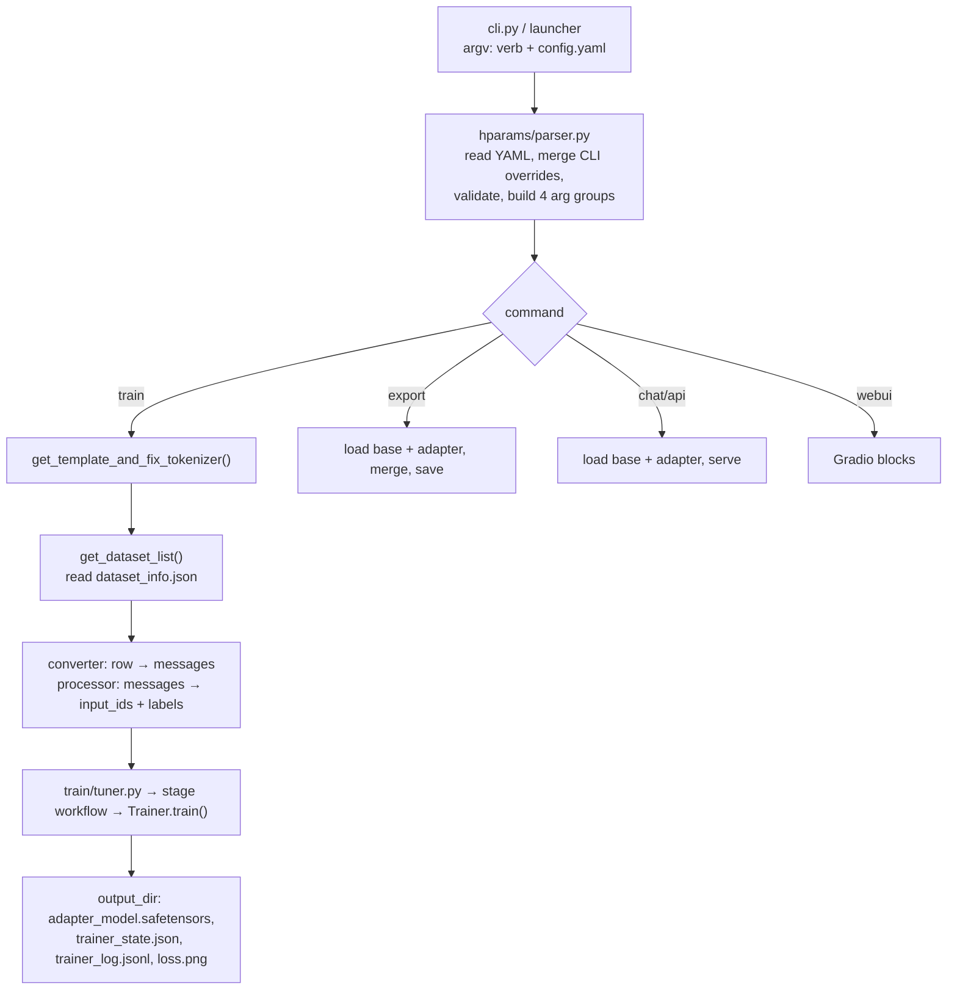
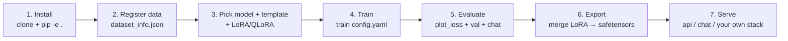

# CS-15 — LLaMA-Factory: No-Code / Low-Code Fine-Tuning

| Field | Value |
|---|---|
| **Module** | Frameworks / Tooling (the config-driven branch of the framework tree) |
| **Source video(s)** | LLM Fine-Tuning 17: Fine-Tune ANY LLM with LLaMA Factory \| Full Guide (WebUI + CLI \| LoRA + QLoRA) |
| **Transcript file(s)** | `LLM_Fine-Tuning_17_Fine-Tune_ANY_LLM_with_LLaMA_Factory_Full_Guide_WebUI_CLI_LoR.txt` |
| **Companion code** | `LLM Fine-Tuning-17-Llama-Factory\llamafactory.ipynb`, `train_gemma_qlora.yaml`, `my_custom_data.json`, `my_custom_data2.json`, `my_custom_data3.json`, `how-to-save-in-dataset_info.txt`, `Finetune-LLAMA-FACTORY-Params.pdf`, `llama-factory-notes.pdf` |
| **Prerequisites** | CS-03 (framework landscape), CS-06 (HF Hub + Trainer), CS-13 (SFT data shapes), CS-13 §6.8 + CS-11 §4.11 (LoRA/QLoRA mechanics), CS-10/CS-11 (quantization) |
| **Difficulty** | Beginner to operate, Intermediate to operate *correctly*, Advanced to debug silently |
| **Hands-on required** | Yes — the `dataset_info.json` and `template` sections cannot be learned by reading |
| **Estimated study time** | 5h theory + 4h practical |

> **Why this module is longer than the video.** The video is a 63-minute tour: theory for 16 minutes, WebUI for 38, CLI for 9. That is the right shape for a first look and the wrong shape for production. LLaMA-Factory's two hardest surfaces — the **dataset registry** (`dataset_info.json`) and the **chat template registry** — get roughly four minutes of screen time between them and cause the overwhelming majority of real-world failures. This module gives those two surfaces the space they need, and marks everything the video does not cover with `> **Beyond the video:**`.
>
> **Naming note, up front.** The project's GitHub organisation is `hiyouga`, the repository is **`hiyouga/LLaMA-Factory`** (rendered `LlamaFactory` in recent READMEs), and the lead maintainer is **Yaowei Zheng**. The transcript renders the org as *"Hi yoga"* [4:54] and the author as *"Yaoi Jinang"* [5:02]; the companion notebook clones the correct URL, `https://github.com/hiyouga/LLaMA-Factory.git`. Use the URL, not the pronunciation.

---

## 0. Executive Summary

- **LLaMA-Factory is a config-driven orchestration layer over Hugging Face, not a new trainer.** The instructor states it plainly: *"LLaMA Factory is a build on top of the hugging face libraries… it internally wrap up transformer, PEFT, bitsandbytes, TRL"* [7:06] — *"they haven't written the complete code from scratch, no"* [7:25]. That single fact explains both its superpower (any HF model works) and its weakness (every HF bug is your bug).
- **The value proposition is a declarative config plus a dataset/template registry.** One YAML file is the entire unit of reproducibility. The instructor's own rule: *"we should not directly run like this… if the terminal is going to be closed… all the parameter will be lost. So keep it in one physical file"* [55:26]–[57:14].
- **It supports 100+ model families and every major training stage** — pretraining (`pt`), SFT (`sft`), reward modelling (`rm`), PPO (`ppo`), DPO (`dpo`), KTO (`kto`), and ORPO (`orpo`). ORPO additionally appears as a `pref_loss` value; **SimPO appears *only* as a `pref_loss`** (`pref_loss: simpo` under `stage: dpo`) and is not a stage. The video's WebUI walkthrough enumerates roughly this list [34:14]. The exact accepted values are version-sensitive — verify against your pinned install (CH-15 §3).
- **QLoRA is not a `finetuning_type`.** `finetuning_type` ∈ `{lora, freeze, full}`. QLoRA = `finetuning_type: lora` **plus** `quantization_bit: 4`. The repo's own `train_gemma_qlora.yaml` proves it: line 7 says `finetuning_type: lora`, line 35 says `quantization_bit: 4`. Getting this wrong is the single most common config error for newcomers.
- **`template` is the silent killer.** It is not cosmetic: it decides the exact token string fed to the model *and* which special tokens the tokenizer is forced to use. A mismatched template raises **no error** and produces a model that is worse than the base model. The instructor flags it once — *"whatever model you are going to select, according to that you can select the chat template"* [33:38] — and then the WebUI auto-fills it, so the failure never reproduces in a demo.
- **The dataset registry is a JSON manifest, not a folder convention.** Every dataset — local file, HF Hub repo, or ModelScope — needs a key in `data/dataset_info.json` (or whatever `dataset_dir` points at). *"Even if you are going to read a data from the hugging face, in that case also you will have to make an entry inside this particular file"* [37:33].
- **The instructor's parameter guide lists the whole WebUI surface.** He attached a PDF (`Finetune-LLAMA-FACTORY-Params.pdf`) covering hub name, finetuning method, quantization bit/method, chat template, RoPE scaling, booster, stage, LR/epochs/grad-norm/max-samples/compute-type/cutoff/batch/grad-accum/val-size/LR-scheduler, extra config (logging, save, warmup, NEFTune, packing, `train_on_prompt`, `mask_history`, `resize_vocab`, LLaMA Pro, thinking, external logger), freeze config, LoRA config, RLHF config, multimodal config, GaLore, APOLLO, BAdam, SwanLab, and the final output/config/device/DeepSpeed/offload block [31:07]. §7 walks every one of them.
- **The demonstrated run is deliberately tiny and that is the point.** Gemma-1.1-2B-Instruct, LoRA, 4-bit, 1 epoch, `cutoff_len: 1024`, `max_samples: 1000`, effective batch 4, `lr: 1e-4`, cosine, `fp16` — finished in **4–5 minutes on a free Colab GPU** [51:16], and 5–10 minutes from the CLI [1:01:51]. Total cloud spend for the demo: **about four cents**.
- **The end-to-end loop is seven verbs.** `train` → `chat` → `export` → `api` → `eval` → `webui` → `version`, all through `llamafactory-cli` (or the older `python -m llamafactory.cli` the video uses [55:14]).
- **The one number to memorise:** QLoRA on a 2B model at `cutoff_len: 1024`, batch 1, gradient checkpointing on, fits in **~6 GB of VRAM** — which is why a free T4 (16 GB) is enough, and why the same recipe on a 7B model lands at ~10–12 GB. Full fine-tuning the same 2B model needs ~40 GB and does not fit on a 24 GB card.
- **The production rule this module exists to deliver:** *LLaMA-Factory is the right default for standard-shaped SFT/DPO/KTO jobs where you want reproducibility and breadth; it is the wrong tool the moment you need a custom training loop, a model family it does not have a template for, or the last 30% of training speed.*

---

## 1. The Problem This Solves

### 1.1 What breaks in the real world without this

Before LLaMA-Factory (and Axolotl, and Unsloth's `FastLanguageModel` wrapper), fine-tuning a new model family meant writing the same script again. Not conceptually different work — *literally* the same work:

| Recurring task | Cost when done by hand, per model family |
|---|---|
| Find the chat template | 20 min of reading `tokenizer_config.json` jinja, usually wrong on the first try |
| Get the special-token set right | 1–4 hours, silent failure, no error message |
| Write the dataset → prompt serialiser | 1–3 hours, redone for every data shape |
| Wire `peft.LoraConfig` with correct `target_modules` | 30 min, and the correct list differs per architecture |
| Wire `bnb` 4-bit + `prepare_model_for_kbit_training` | 20 min, and the ordering matters |
| Wire `TrainingArguments`, collator, label masking | 1–2 hours |
| Add evaluation, checkpointing, loss plotting | half a day |
| Add DeepSpeed/FSDP when the model stops fitting | 1–2 days |
| **Total per new family** | **~2–3 engineer-days** |

Multiply by "we support eight customer models." That is the problem. The instructor's framing of the solution is refreshingly unromantic: *"just think in such a way, I have developed one project, now that project you can use — you can run via UI as well as from the CLI, that's it… it is just a simple project nothing else"* [6:46]–[6:57].

The deeper problem is **reproducibility of the recipe**. A hand-written `train.py` accumulates a git history of "changed batch size to 2, fixed seed, reverted, changed again." A YAML file plus a 63-character dataset key is a diffable, reviewable, revertible artifact. The instructor's CLI reasoning [57:07] is really a version-control argument dressed as a shell-safety argument.

### 1.2 The state of the art before this

Three pre-LLaMA-Factory approaches, all still in use, all with a specific failure:

1. **Raw HF `Trainer` + `peft`.** Maximum control, minimum abstraction. Fails at scale: every model family re-opens the same eight questions, and the answers live in someone's head. This is CS-06's territory.
2. **`trl.SFTTrainer`.** Solves the training loop and the packing story, leaves the template and dataset problems to you. Its `DataCollatorForCompletionOnlyLM` is exactly where the "why is my loss 0.1 at step 0" bug lives.
3. **A bespoke in-house script.** Works until the author leaves. The instructor gestures at this: *"I will write a code from scratch using TensorFlow, using PyTorch and all"* [8:03] — and then points out that LLaMA-Factory deliberately did **not** do that [7:51].

The naive/obvious approach that fails: **"just use `tokenizer.apply_chat_template` and trust the tokenizer."** The transcript never says this, but it is the default behaviour of most hand-rolled scripts, and it fails in a specific way. `apply_chat_template` reads `tokenizer_config.json`, which is **model-repo data and drifts**: a repo can change its template between revisions, a fine-tune can ship a template the base never had, and many templates assume a system message that the SFT data does not contain. LLaMA-Factory's answer is to pin the *token string* in Python (`template.py`) and to force the special tokens to match (`fix_special_tokens`). That is the whole design idea, and §4.2 unpacks it.

### 1.3 A concrete motivating example with numbers

The instructor's own demo, with the arithmetic filled in:

- Base model: `google/gemma-1.1-2b-it` — 2.51 B parameters, 18 layers, hidden 2048, 8 query heads / 1 KV head, intermediate 16384, vocab 256 000, max context 8192.
- Method: QLoRA — 4-bit NF4 base, LoRA rank 8 on all linear projections, `lora_alpha` defaulting to `2 × rank = 16`.
- Trainable parameters: **~9.81 M**, i.e. **0.39 %** of the model (§11 shows the arithmetic).
- Data: `max_samples: 1000`, `val_size: 0.1` → 900 train / 100 eval; batch 1 × grad-accum 4 → 225 optimizer steps per epoch; 1 epoch.
- Wall clock: **4–5 min (WebUI)** [51:16], **5–10 min (CLI)** [1:01:51], on a free Colab T4 with 16 GB.
- Disk: adapter ≈ **20 MB**; merged fp16 model ≈ **5.0 GB**.
- Result: asked *"can you tell me what is ls -l?"*, the merged adapter answered *"ls- displayed detailed listing of the file"* [53:52] — a memorised-domain answer the base model does not reliably give.

That is the whole pitch in eight lines: **0.4 % of the parameters, four cents of GPU, five minutes, one YAML file.**

---

## 2. First-Principles Mental Model

### 2.1 The analogy: LLaMA-Factory is a compiler

Think of it as a compiler for training runs.

| Compiler concept | LLaMA-Factory equivalent |
|---|---|
| Source language | The YAML config (+ `dataset_info.json`) |
| Header files | The `template` registry — declarative definitions of the target platform's calling convention |
| Declared types | The `columns` mapping — you declare how your data's shape maps to the framework's expected shape |
| Type checker | `hparams/parser.py` — validates and normalises args before anything is loaded |
| Backend / codegen | `transformers` + `peft` + `bitsandbytes` + `trl` |
| Optimisation passes | DeepSpeed / FSDP / FlashAttention / packing / GaLore, selected by flags |
| Target architectures | Model families; the `template` is the ABI |
| Build artifact | The adapter directory or the merged safetensors |
| Linker | `llamafactory-cli export` — resolves the LoRA delta against the base weights |
| Runtime | `llamafactory-cli api` / `chat` |

The value of a compiler is not that it does something you *couldn't* do by hand. It is that it makes the correct thing the **default** thing, and makes the recipe a **file** rather than a memory.

**Where this analogy breaks.** A compiler either accepts your source or rejects it with an error. LLaMA-Factory is much weaker than that, and this is the most important thing to internalise about the tool:

- A **type mismatch** in your data (a `from: "user"` where the tag table expects `"human"`) does not fail the build. It logs one warning line and **emits an example with an empty prompt and an empty response** (verified against `data/converter.py`, v0.9.3 — see §9.4).
- A **wrong ABI** (`template: llama3` for a Gemma model) does not fail the build. It tokenises your data into a string the model has never seen and trains anyway.
- A **missing key** (`path` instead of `file_name`) fails only at load time, sometimes only for the split you did not test.

So: treat LLaMA-Factory as a compiler **with warnings disabled by default**. Your job is to read the first 200 log lines of every run.

### 2.2 The actual mechanism, in four layers

```
┌──────────────────────────────────────────────────────────────────────┐
│ L4  Interface      llamafactory-cli {train,chat,export,api,webui,env}│
│                    llamafactory.webui.interface.create_ui()          │
├──────────────────────────────────────────────────────────────────────┤
│ L3  Registry       data/template.py   → chat templates + special     │
│                    data/converter.py  → row → {"messages":[...]}     │
│                    data/loader.py     → dataset_dir + dataset_info   │
│                    data/processor.py  → tokenise, mask, pack         │
├──────────────────────────────────────────────────────────────────────┤
│ L2  Orchestration  hparams/parser.py  → args → TrainingArguments     │
│                    train/tuner.py     → dispatch on `stage`          │
│                    train/{pt,sft,rm,ppo,dpo,kto}/workflow.py         │
├──────────────────────────────────────────────────────────────────────┤
│ L1  Backend        transformers · peft · bitsandbytes · trl ·         │
│                    accelerate · deepspeed · flash-attn               │
└──────────────────────────────────────────────────────────────────────┘
```

Everything you can configure lives in L3 and L4. Everything that can silently break you lives in L3.

### 2.3 The mechanism at the tensor level (why the wrapper is thin)

`finetuning_type: lora` does exactly what hand-written PEFT code does:

1. Load the base model (`transformers.AutoModelForCausalLM.from_pretrained`).
2. If `quantization_bit` is set: quantise each `nn.Linear` to 4-bit or 8-bit with `bitsandbytes`, using the selected `quantization_method` (default `bnb`), and call `prepare_model_for_kbit_training` — which casts LayerNorms to fp32 and enables input-requires-grad on the embedding.
3. Build a `peft.LoraConfig` with `target_modules` resolved from `lora_target` (`all` → every `nn.Linear`), `r = lora_rank`, `alpha = lora_alpha`, `lora_dropout`, and optionally `use_rslora` / `use_dora` / `pissa_init`.
4. Wrap with `get_peft_model`. Trainable tensors become exactly `{A, B}` per target module, where `A ∈ R^{r×in}`, `B ∈ R^{out×r}`, and forward is `h = Wx + (α/r)·B(Ax)` — for 4-bit, `W` is dequantised on the fly and stays frozen.
5. `train/tuner.py` dispatches to the stage's workflow, which builds the `Trainer` and calls `train()`.

There is no custom autograd, no custom kernel, no custom attention unless you ask for one via `flash_attn`, `use_liger_kernel`, or `use_unsloth`. **Corollary: every LLaMA-Factory run is reproducible in raw HF in ~60 lines** (the notebook's cell 35 does exactly this for inference). Corollary two: **you cannot out-run the backend's limits.** If `transformers` cannot load a model, neither can LLaMA-Factory.

---

## 3. Core Concepts — Exhaustive Glossary

| Term | Definition | Why it matters | Common confusion |
|---|---|---|---|
| **LLaMA-Factory** | Open-source, config-driven training/inference framework by `hiyouga` (Yaowei Zheng), Apache-2.0, ~63k stars at recording time [5:12] | The whole module | Believed to be a *model*. It is a trainer |
| **LLaMA Board** | The name of the Gradio WebUI. *"a UI, it is also called the Llama Board"* [5:58] | The no-code entry point | Confused with a hosted service; it is a local Gradio app |
| **`llamafactory-cli`** | The console-script entry point installed by `pip install -e .` | The CLI surface | Confused with `python -m llamafactory.cli`, the older module path the video uses [55:14]. Both work in v0.9.x |
| **`train`** | CLI verb: run a training stage from a YAML | Reproducibility unit | — |
| **`chat`** | CLI verb: interactive terminal chat over base + adapter | Smoke test | — |
| **`export`** | CLI verb: merge LoRA into base and write safetensors | The deliverable | Confused with "save the adapter" — `export` merges, training saves adapters |
| **`api`** | CLI verb: OpenAI-compatible HTTP server (`/v1/chat/completions`) | Serving | Thought to be a separate product; it is a thin `vllm`/HF worker |
| **`webui`** | CLI verb: launch LLaMA Board | No-code path | — |
| **`eval`** | CLI verb: run perplexity / BLEU / ROUGE / MMLU-family evals | Regression testing | Deprecated in current `main` (see Correction in §6.7) |
| **`stage`** | The training objective: `pt`, `sft`, `rm`, `ppo`, `dpo`, `kto`, `orpo` | Selects the loss and the workflow | Confused with `finetuning_type`; and `simpo` is a `pref_loss`, not a stage — see CH-15 §3 |
| **`finetuning_type`** | *How* weights are updated: `lora`, `freeze`, `full` | Memory/speed dial | **`qlora` is not a value here** |
| **QLoRA** | `finetuning_type: lora` + `quantization_bit: 4` (optionally 8) | The default practical recipe | Believed to be a `finetuning_type`; see `train_gemma_qlora.yaml` lines 7 + 35 |
| **`freeze`** | Train only the last N layers (default 2) and/or named modules | Middle ground between LoRA and full | Thought to be cheaper than LoRA — it is usually *more* VRAM, because it still stores full-precision grads |
| **OFT** | Orthogonal Fine-Tuning — *"an alternative of the LoRA itself"* [32:29]; a multiplicative orthogonal transform instead of an additive low-rank delta | Preserves hyperspherical energy; better for some models | Offered in the WebUI's method dropdown; poorly covered in the video |
| **`template`** | The registry entry that defines the exact prompt string + special-token forcing for a model family | **The #1 silent failure source** | Believed to be cosmetic. It is not: it changes both the tokens and the tokenizer |
| **`dataset_dir`** | Folder containing `dataset_info.json` and (by default) your data files. Default `data` | Resolves every relative dataset path | Confused with `output_dir` |
| **`dataset_info.json`** | The registry: one JSON object per dataset key | The dataset system's whole API | Believed to be auto-generated. It is hand-edited |
| **`file_name`** | The dataset's path *relative to `dataset_dir`* (current key) | Path resolution | The video and the repo's `.txt` use `path` — stale (§6.2) |
| **`formatting`** | Row schema: `alpaca` \| `sharegpt` \| `openai` (current key) | Tells the converter how to parse a row | The video calls it `format`, and many tutorials still do |
| **`ranking: true`** | Marks a dataset as a preference dataset (chosen/rejected) | Turns on the DPO/KTO path | Confused with a `formatting` value called `preference` |
| **`columns`** | Maps framework-internal names (`prompt`, `query`, `response`, `messages`, `system`, `history`, `tools`, `images`, `chosen`, `rejected`, `kto_tag`) to your file's field names | The type declaration | Left unset when defaults already match — usually a mistake to *set* redundantly |
| **`tags`** | Maps role/content field names for sharegpt data (`role_tag`, `content_tag`, `user_tag`, `assistant_tag`, `observation_tag`, `function_tag`, `system_tag`) | Handles OpenAI-style `role`/`content` data | The default `user_tag` is **`human`**, not `user` — a classic silent break |
| **`hf_hub_url`** | A HF Hub repo id for a dataset; when present, overrides `file_name` | Hub datasets without downloading | Confused with `model_name_or_path` |
| **`alpaca` formatting** | `{instruction, input, output}` (+ optional `system`, `history`) | Instruction tuning | `input` must exist even if empty, if you map `query` to it |
| **`sharegpt` formatting** | `{conversations: [{from, value}], tools?, system?}` | Multi-turn chat, tool calling | `from` values must match the tag table (`human`/`gpt` by default) |
| **`openai` formatting** | sharegpt + `tags` remapping, for `{messages:[{role,content}]}` data | OpenAI-exported logs | Not a distinct converter; it is sharegpt with tags |
| **`preference` / `pairwise` / `kto`** | Historical `format` values. In current releases they are **not** `formatting` values: preference = `ranking: true` + `chosen`/`rejected`; KTO = a `kto_tag` column; pairwise = the `pref_loss: sigmoid` DPO form | Alignment stages | The most common stale-API belief in the ecosystem |
| **`template: default`** | A plaintext template: `Human: …\nAssistant: …\n` with `System:` prefix, `replace_jinja_template=True`, `efficient_eos=False` | Legacy Vicuna-style data | Believed to mean "use the tokenizer's own template." It does not — that is `template` **unset** |
| **`template: empty`** | Bare `{{content}}` concatenation; the fallback when `template` is unset and the tokenizer has no jinja template | Pretraining | Used by accident for SFT, producing garbage |
| **`fix_special_tokens`** | The template method that forces the tokenizer's BOS/EOS/PAD to the model family's expected values | Why templates are not cosmetic | Invisible; you only notice when it is wrong |
| **`cutoff_len`** | Max token length after template application; longer examples are truncated | VRAM and speed | Confused with the model's max context (you want it ≤ that) |
| **`max_samples`** | Truncates each dataset to N examples. *"for debugging purposes"* per the help text | Fast iteration | Shipped to production by accident |
| **`overwrite_cache`** | Rebuild the tokenised-arrow cache | Data-iteration hygiene | Confused with `overwrite_output_dir` |
| **`preprocessing_num_workers`** | Parallel tokenisation processes | Big-dataset throughput | Set to 0 silently on Windows |
| **`tokenized_path`** | Save/load the tokenised dataset to disk | The single biggest wall-clock saver on re-runs | Rarely known; video does not mention it |
| **`val_size`** | Fraction or count held out for validation | Eval protocol | Set to 0.1 *and* forgotten; changes your step count |
| **`eval_dataset`** | An explicit held-out dataset key, as an alternative to `val_size` | Honest evaluation | Rarely used; `val_size` slices your *training* data |
| **`ignore_pad_token_for_loss`** | Default **`true`**: pad positions contribute no loss | Correct masking | Believed to control prompt masking — it does not; the template does |
| **`train_on_prompt`** | Default `false`. When true, do *not* mask the prompt | Continued-pretraining-style SFT | Raises if the template has `efficient_eos` — an explicit guard |
| **`mask_history`** | Default `false`. Mask earlier turns in multi-turn data, train the last turn only | Multi-turn precision | Silently changes your effective dataset size |
| **`packing` / `neat_packing`** | Concatenate short samples into full-length ones; `neat_packing` prevents cross-sample attention | 2–4× throughput on short-data SFT | On by default for `pt`, off for `sft` |
| **`neftune_noise_alpha`** | Adds uniform noise to input embeddings during training (NEFTune). Paper default 5 | Free quality gain on short SFT | Off by default; unknown to most users |
| **`lr_scheduler_type: cosine`** | LR curve; cosine decay from peak to ~0 | Stability | *"cosine — most recommended"* per the instructor's PDF |
| **`warmup_ratio`** | Fraction of steps spent ramping LR from 0 | Prevents early divergence | 0.03 is the instructor's value |
| **`fp16` / `bf16` / `pure_bf16` / `fp32`** | Compute precision. WebUI calls this "compute type" | Hardware compatibility | *"BF16 is for the higher-end GPU… fp16 is for the lower-end GPU"* [48:09] |
| **`gradient_checkpointing`** | Recompute activations in backward | The VRAM saver | Costs ~20–30 % throughput |
| **`quantization_bit`** | `4` or `8` for QLoRA; also 2/3/5/6 with non-`bnb` methods | VRAM | Set together with `finetuning_type: full` → error |
| **`quantization_method`** | `bnb` (default), `hqq`, `eetq`, `gptq`, `awq`, `aqlm` | Quantiser choice | `bnb` is *"stable & most used… recommended default"* |
| **`plot_loss`** | Writes `loss.png` (and `trainer_log.jsonl`) into `output_dir` | The only built-in visualisation | Off by default |
| **`save_strategy` / `save_total_limit`** | When to checkpoint, and how many to keep | Disk and rollback | `save_total_limit` deletes older checkpoints — the only rollback you have |
| **`overwrite_output_dir`** | Write directly into `output_dir` instead of a timestamped subfolder | Where your files land | Explains the difference between the notebook's two model paths |
| **`FORCE_TORCHRUN`** | Env var (`FORCE_TORCHRUN=1`) that routes `train` through `torchrun` | Multi-GPU | Not needed for a single GPU; required for >1 |
| **DeepSpeed / ZeRO** | Sharding of optimiser state (Z1), gradients (Z2), parameters (Z3) | Fitting big models | Selected via `deepspeed: <path-to-json>` |
| **FSDP** | PyTorch's native full-shard alternative to ZeRO-3 | HF-stack-native sharding | Chosen via `fsdp: full_shard`; also how FSDP+QLoRA fits 70B on 2×24 GB |
| **Adapter directory** | `<output_dir>/` containing `adapter_model.safetensors` + `adapter_config.json` | The real artifact | Confused with a full model |
| **Merged model** | `W + (α/r)·BA` materialised as safetensors | Portable artifact | **Must not** be produced from a quantised base |
| **`infer_backend`** | `huggingface` (default) or `vllm` / `sglang` | Serving throughput | Not in the video; vLLM is 5–20× faster for chat |

---

## 4. Deep Dive — How It Actually Works

### 4.1 The config → run lifecycle, stage by stage



For each stage: **input → operation → output → failure mode.**

| Stage | Input | Operation | Output | Failure mode |
|---|---|---|---|---|
| Parse | `argv`, YAML | YAML load → namespace; CLI `key=value` overrides win | Four arg dataclasses | Typos in YAML keys are **ignored in some versions, rejected in others** — always confirm with a dry run |
| Template | `template` string | Look up `TEMPLATES[name]`, call `fix_special_tokens`, `fix_jinja_template` | A `Template` object | `ValueError: Template X does not exist.` — the *only* loud failure in the whole pipeline |
| Registry | `dataset_dir` + `dataset_info.json` | Resolve each comma-separated name to a `DatasetAttr` | Load-from spec | `ValueError: Undefined dataset X in dataset_info.json.` / `KeyError: 'file_name'` |
| Convert | Raw JSON/JSONL rows | Alpaca/ShareGPT converter → unified `{"messages":[{role,content}]}` | HF `Dataset` | **Silent**: unmatched role tag → warning → example emitted with empty prompt/response |
| Tokenise | Unified messages + template | Apply template, tokenise to `cutoff_len`, build labels with `-100` on masked positions, optional packing | Arrow dataset (cached) | Truncation eats the response if the prompt is long → "model learns nothing" |
| Train | Tokenised dataset | `Trainer.train()` with PEFT + optional quantisation | Checkpoints in `output_dir` | Loss curve is the only signal; everything else is logs |
| Save | Trainer state | `save_strategy`, `save_total_limit` | `adapter_model.safetensors` | Older checkpoints deleted before you needed them |
| Export | Base + adapter | Dequantise-free load, `merge_and_unload`, save | Full safetensors | Fails or produces garbage if `quantization_bit` was left in the config |

### 4.2 The template registry — how it actually works

This is the section the video compresses into 40 seconds [33:38] and that you should read twice.

A LLaMA-Factory template is a **Python object that produces a string and forces tokenizer settings**. It is registered by name into a module-level dict:

```python
# src/llamafactory/data/template.py  (structure, v0.9.x)
TEMPLATES: dict[str, "Template"] = {}

def register_template(name, format_user, format_assistant, ...) -> None:
    """Register a chat template."""
    if name in TEMPLATES:
        raise ValueError(f"Template {name} already exists.")
    ...
```

The `Template` dataclass carries: `format_user`, `format_assistant`, `format_system`, `format_function`, `format_observation`, `format_tools`, `format_prefix`, `default_system`, `stop_words`, `thought_words`, `tool_call_words`, `efficient_eos`, `replace_eos`, `replace_jinja_template`, `enable_thinking`, `preserve_thinking`, `mm_plugin`.

Two registrations illustrate the range — a plaintext one and a real model one:

```python
# A "default" template — plaintext Vicuna-like format, NOT the tokenizer's own template.
register_template(
    name="default",
    format_user=StringFormatter(slots=["Human: {{content}}", {"eos_token"}, "\nAssistant:"]),
    format_assistant=StringFormatter(slots=["{{content}}", {"eos_token"}, "\n"]),
    format_system=StringFormatter(slots=["System: {{content}}", {"eos_token"}, "\n"]),
    replace_jinja_template=True,
)

# Gemma — the real one. <start_of_turn>user ... <end_of_turn> and a Llama2Template variant.
register_template(
    name="gemma",
    format_user=StringFormatter(
        slots=["<start_of_turn>user\n{{content}}<end_of_turn>\n<start_of_turn>model\n"]
    ),
    format_assistant=StringFormatter(slots=["{{content}}<end_of_turn>\n"]),
    stop_words=["<end_of_turn>"],
    replace_eos=True,
    template_class=Llama2Template,
)
```

Note three things in the Gemma entry:

1. `format_user` **already contains the assistant prefix** `<start_of_turn>model\n`. That is why an SFT sample's *response* is formatted with a separate `format_assistant`: the prompt half and the response half are formatted by different formatters, then concatenated. The label mask is derived from the split point. This is how prompt masking works in this framework — **the template decides what is prompt and what is response**, not `ignore_pad_token_for_loss`.
2. `stop_words=["<end_of_turn>"]` means generation stops there at inference.
3. `replace_eos=True` means the framework will substitute the model family's real EOS.

Then `get_template_and_fix_tokenizer(tokenizer, data_args)` does the wiring:

```python
if data_args.template is None:
    if isinstance(tokenizer.chat_template, str):
        logger.warning_rank0("`template` was not specified, try parsing the chat template from the tokenizer.")
        template = parse_template(tokenizer)
    else:
        logger.warning_rank0("`template` was not specified, use `empty` template.")
        template = TEMPLATES["empty"]  # placeholder
else:
    if data_args.template not in TEMPLATES:
        raise ValueError(f"Template {data_args.template} does not exist.")
    template = TEMPLATES[data_args.template]

if data_args.train_on_prompt and template.efficient_eos:
    raise ValueError("Current template does not support `train_on_prompt`.")
```

Read that carefully, because it inverts two widely repeated beliefs:

> **Correction:** **`template: default` does NOT mean "use the model's own chat template from `tokenizer_config.json`."** It is a registered plaintext template that emits `Human: …\nAssistant: …\n` with `System:` prefixing, `replace_jinja_template=True` and `efficient_eos=False`. The behaviour people *think* `default` gives them — auto-reading `tokenizer.chat_template` — happens when **`template` is omitted entirely**, via `parse_template(tokenizer)`. If you write `template: default` on a Llama-3 model you are training on Vicuna-format strings. Two different code paths, two very different outcomes, one confusingly-named key. (Upstream's own docs have been flagged as out of date on this exact point in issue #10162.)

> **Beyond the video:** **Omitting `template` is legitimate but noisy.** In current releases an unset `template` triggers `parse_template()`, which reads `tokenizer.chat_template` (the Jinja string in the model repo) and converts it into a `Template`. It works for well-behaved repos and logs a warning every time. Prefer an explicit template: it is version-pinned to your code, not to a Hub revision that can change under you.

#### The template name table

Look these up from the source of truth rather than trusting any list, including this one, because names track releases:

```python
# Authoritative, always current for YOUR installed version:
from llamafactory.data.template import TEMPLATES
print(len(TEMPLATES), sorted(TEMPLATES)[:20])
```

| Family | Template name(s) | Notes |
|---|---|---|
| Llama-1 | `llama2` | Llama-1 and Llama-2 share the `[INST]`/`<<SYS>>` format |
| Llama-2 | `llama2` | `[INST] <<SYS>>…<</SYS>> … [/INST]` |
| Llama-3 / 3.1 / 3.2 / 3.3 | `llama3` | `<|start_header_id|>…<|end_header_id|>`, `<|eot_id|>` |
| Llama-4 | `llama4` | Newer registry entry |
| Llama-3.2 Vision | `mllama` | Multimodal; needs `mm_plugin` |
| Qwen-1 / 1.5 / 2 (base+chat) | `qwen` | ChatML: `<|im_start|>…<|im_end|>` |
| Qwen-3 | `qwen3`, `qwen3_nothink` | `_nothink` disables the reasoning block |
| Qwen-2-VL / Qwen-3-VL | `qwen2_vl`, `qwen3_vl` | Multimodal |
| Qwen audio / omni | `qwen2_audio`, `qwen2_omni`, `qwen3_omni` | Audio/multimodal |
| Gemma-1 / 1.1 | `gemma` | `<start_of_turn>user…<end_of_turn>` |
| Gemma-2 | `gemma2` | Distinct template; **not** interchangeable with `gemma` |
| Gemma-3 / 3n | `gemma3`, `gemma3n` | 3n is the on-device variant |
| Mistral / Mixtral | `mistral` | `[INST]…[/INST]`; Mixtral MoE shares it |
| Ministral-3 | `ministral3` | — |
| Pixtral | `pixtral` | Multimodal |
| Phi-1 / 1.5 / 2 | `phi` | — |
| Phi-3-small | `phi_small` | **Different** from `phi`; a common mix-up |
| Phi-4 | `phi4`, `phi4_mini` | — |
| DeepSeek-V1 / V2 (MoE) | `deepseek` | — |
| DeepSeek-V3 | `deepseek3` | — |
| DeepSeek-R1 / distills | `deepseekr1` | Reasoning template with `thought_words` |
| Yi / Yi-VL | `yi` (and `llava_next_yi`, `llava_next_video_yi` for the VL variants) | Present in v0.9 releases; verify on your version — the registry entry set moves |
| ChatGLM-3 | `chatglm3` | There is **no** plain `chatglm` |
| GLM-4 family | `glm4`, `glmz1`, `glm4_moe`, `glm4_5v` | `glmz1` = GLM-Z1 reasoning |
| Base / completion models | `default`, `empty`, `alpaca`, `vicuna` | Pretraining and raw-text SFT |

**How to pick.** Three rules, in priority order:

1. Use the template named for the model family and size variant (`phi_small` ≠ `phi`; `gemma2` ≠ `gemma`).
2. Use `_nothink` variants when your target is a short answer and you do not want the reasoning block in the training string.
3. For an unknown model, leave `template` unset once to see what `parse_template()` derives, then copy the name it chose into your YAML and pin it.

#### Registering a custom template

Three steps, all in `src/llamafactory/data/template.py`:

```python
# 1. (optional) define a formatter class if your format needs custom logic
# 2. register it
register_template(
    name="my_domain_chat",
    format_user=StringFormatter(
        slots=["<|role:user|>{{content}}<|end|>", "<|role:assistant|>"]
    ),
    format_assistant=StringFormatter(slots=["{{content}}<|end|>"]),
    format_system=StringFormatter(slots=["<|role:system|>{{content}}<|end|>"]),
    format_prefix=EmptyFormatter(slots=["<|bos|>"]),
    default_system="You are a support assistant for Acme Corp.",
    stop_words=["<|end|>"],
    replace_eos=False,
    efficient_eos=True,
)

# 3. use it
# template: my_domain_chat
```

`register_template` raises `ValueError(f"Template {name} already exists.")` on collision, so pick a namespace-y name (`acme_chat_v2`) rather than `qwen`.

> **Beyond the video:** A custom template is the *correct* answer when you are training a model whose chat format the registry does not have — a fine-tune of an in-house tokenizer, or a model whose repo template is wrong. But note what you are taking on: `fix_special_tokens` behaviour, `format_prefix` BOS handling, and inference-time consistency (the same template must be used by `chat`/`api`/your production server). A custom template that is right in training and wrong in serving is worse than no fine-tune at all. Version it in git next to the config that uses it, and add a unit test that asserts two known prompt strings render to expected byte-exact outputs.

#### Diagnosing a template fault

| Symptom | What it means | Check |
|---|---|---|
| Output is fluent but ignores the fine-tune | Template mismatch: the model never saw your format during pretraining/post-training | Print the first 3 tokenised samples and eyeball the special tokens |
| Output contains raw `Human:` / `<|im_start|>` / `<start_of_turn>` | You served without the same template you trained with, or `stop_words` are missing | Compare `template:` in train YAML vs inference YAML |
| Immediate degenerate repetition ("the the the") | Prompt/response split landed in the wrong place → labels are wrong | Inspect `labels` for `-100` positions |
| `ValueError: Current template does not support train_on_prompt.` | You combined `train_on_prompt: true` with an `efficient_eos` template | Remove `train_on_prompt` or pick another template |
| Loss is high *and* flat from step 0 | Truncation: `cutoff_len` cut the response out of every sample | Raise `cutoff_len`, or measure your response-length p99 |

### 4.3 The dataset system — the registry, in full

This is the most error-prone part of the framework, and the video spends most of its data section on it [36:46]–[45:20]. Here is the complete picture.

#### 4.3.1 Where the registry lives

```text
LLaMA-Factory/
├── data/                      ← this is `dataset_dir` (default: "data")
│   ├── dataset_info.json      ← THE REGISTRY. One JSON object. Hand-edited.
│   ├── alpaca_en_demo.json    ← demo datasets shipped by the maintainer
│   ├── alpaca_zh_demo.json
│   ├── dpo_en_demo.json
│   ├── kto_en_demo.json
│   ├── glaive_toolcall_en_demo.json
│   ├── mllm_demo.json
│   └── my_custom_data.json    ← yours goes here too (or anywhere, via dataset_dir)
├── examples/
├── src/llamafactory/
└── train_gemma_qlora.yaml
```

The instructor reaches this folder and this file exactly as described: *"inside this repository you will find out one folder — the folder name is data… inside this folder you will get one file, the file name is dataset_info. It is containing the entire metadata regarding all the data"* [36:46]–[37:13], and *"you will keep it here inside this data directory and you will do the entry inside this file"* [37:18]–[37:31].

#### 4.3.2 The registry entry schema (current)

A `dataset_info.json` is a single JSON object whose keys are dataset names — the exact strings you put in the YAML's `dataset:` field.

```json
{
  "my_dataset": {
    "file_name": "my_data.json",
    "formatting": "alpaca",
    "columns": {
      "prompt": "instruction",
      "query": "input",
      "response": "output"
    }
  }
}
```

| Field | Required? | Meaning | Default |
|---|---|---|---|
| `file_name` | yes, unless a hub URL is given | Path **relative to `dataset_dir`**, or a folder name | — |
| `formatting` | no | Row schema: `alpaca` \| `sharegpt` \| `openai` | `alpaca` |
| `columns` | no | Internal-name → your-field-name map | see table below |
| `tags` | no | sharegpt-only role/content field mapping | see table below |
| `ranking` | no | `true` marks a preference dataset | `false` |
| `subset` | no | HF config/subset name | `null` |
| `split` | no | Which split to load | `train` |
| `folder` | no | Subfolder inside the HF repo | `null` |
| `num_samples` | no | Cap samples at load time | `null` |
| `hf_hub_url` | alternative to `file_name` | HF repo id; **overrides** `script_url`/`file_name`/`cloud_file_name` | — |
| `ms_hub_url` | alternative | ModelScope repo id | — |
| `script_url` | alternative | Folder with a loading script | — |
| `cloud_file_name` | alternative | s3/gcs object path | — |

Resolution order in the parser: `hf_hub_url` / `ms_hub_url` / `om_hub_url` → `script_url` → `cloud_file_name` → `file_name`, each earlier option overriding the later ones.

#### 4.3.3 The `columns` map — every key, with defaults

| Internal name | Your field, by default | Used by | Notes |
|---|---|---|---|
| `prompt` | `instruction` | alpaca | The instruction |
| `query` | `input` | alpaca | The optional extra context. If your data has **no** `input` field and you map `query` to it, either add an empty `input` or drop the mapping |
| `response` | `output` | alpaca | The completion that receives loss |
| `history` | *(none)* | alpaca | List of `[user, assistant]` pairs. **Responses in history are also learned** unless you mask them |
| `system` | *(none)* | both | The system prompt |
| `messages` | `conversations` | sharegpt | The turn list |
| `tools` | *(none)* | sharegpt | Tool/function schemas for tool-calling SFT |
| `images` | *(none)* | sharegpt | List of image paths; **count must equal the `<image>` tokens in `messages`** |
| `videos` | *(none)* | sharegpt | Matched against `<video>` tokens |
| `audios` | *(none)* | sharegpt | Matched against `<audio>` tokens |
| `chosen` | *(none)* | ranking | The preferred completion |
| `rejected` | *(none)* | ranking | The dispreferred completion |
| `kto_tag` | *(none)* | KTO | Boolean: was this completion desirable? |

And the sharegpt `tags` sub-map:

| Tag | Default | Meaning |
|---|---|---|
| `role_tag` | `from` | Field holding the role |
| `content_tag` | `value` | Field holding the text |
| `user_tag` | `human` | Role value meaning "user" |
| `assistant_tag` | `gpt` | Role value meaning "assistant" |
| `observation_tag` | `observation` | Tool result |
| `function_tag` | `function_call` | Tool invocation |
| `system_tag` | `system` | System message |

> **Correction:** **the two most consequential defaults in the whole framework are `user_tag: "human"` and `assistant_tag: "gpt"`.** They are not `user`/`assistant`. If you feed it `[{"from": "user", "value": "…"}, {"from": "assistant", "value": "…"}]` — which is what most JSONL chat data on the internet looks like — LLaMA-Factory's sharegpt converter does **not** raise. It logs `Invalid role tag in […].` at WARNING level, logs `Skipping this abnormal example.`, and then **still emits the example with `prompt, response = [], []`**. You get a dataset of unchanged length containing empty samples. Symptom: loss near `0.0` (or `nan`), or a model that learns nothing, with no traceback. Two fixes: rename your fields to `human`/`gpt`, or add the tags explicitly:
>
> ```json
> { "my_chat": { "file_name": "chat.json", "formatting": "sharegpt",
>   "tags": { "role_tag": "from", "content_tag": "value",
>             "user_tag": "user", "assistant_tag": "assistant",
>             "system_tag": "system" } } }
> ```
> The instructor's own PDF uses `{"from": "user"}` in its ShareGPT example — **that example does not work with default tags**. The repo's `my_custom_data2.json` uses `{"from": "human"}` and is correct.

Also verified in the converter: role matching is **positional**, alternating two accepted sets — odd turns must be `user_tag` or `observation_tag`, even turns must be `assistant_tag` or `function_tag`. A malformed ordering trips the same `Invalid message count` / `Invalid role tag` path.

#### 4.3.4 The repo's `how-to-save-in-dataset_info.txt`, quoted and explained line by line

This is the file the instructor points at when he says *"I hope you are able to see this one"* while editing the registry. Verbatim, both blocks:

```json
{
  "my_dataset": {
    "format": "alpaca",
    "path": "data/my_dataset/my_data.json",
    "columns": {
      "prompt": "instruction",
      "query": "input",
      "response": "output"
    }
  }
}
```

| Line | Meaning | Verdict |
|---|---|---|
| `"my_dataset"` | The registry key — the string you will put in YAML as `dataset: my_dataset`. Any name works; it is a free label, exactly as the instructor says: *"you can write any sort of a name, there is no issue with that"* [41:15] | ✅ |
| `"format": "alpaca"` | Declares the row schema | ⚠️ **Stale.** Current releases read `"formatting"`, not `"format"`. With `"format"` present and `"formatting"` absent, the value is silently ignored and the schema defaults to `alpaca` — which happens to be right here, masking the bug. On a sharegpt dataset the same typo silently degrades to alpaca parsing |
| `"path": "data/my_dataset/my_data.json"` | Dataset location | ⚠️ **Stale and doubly wrong.** Current releases read `"file_name"`, resolved **relative to `dataset_dir`**. With `dataset_dir` defaulting to `"data"`, the correct value is `"my_dataset/my_data.json"` — the literal string above would resolve to `data/data/my_dataset/my_data.json`. With no `file_name` key present the loader raises `KeyError: 'file_name'` |
| `"columns"` block | Explicit mapping of the three alpaca fields | ✅ correct and, in this case, redundant — these are the defaults |

```json
{
  "my_dataset": {
    "format": "sharegpt",
    "path": "data/my_dataset/my_data.json",
    "columns": {
      "messages": "conversations"
    }
  }
}
```

| Line | Meaning | Verdict |
|---|---|---|
| `"format": "sharegpt"` | Multi-turn schema | ⚠️ Stale → `"formatting": "sharegpt"`. Unlike the alpaca case, **this one actually breaks**: defaulting to `alpaca` means the converter looks for `instruction`/`output` fields that do not exist |
| `"columns": {"messages": "conversations"}` | Turn list lives under `conversations` | ✅ (also the default) |
| Missing `tags` | Implicitly `human`/`gpt` | ✅ **if** your data uses `human`/`gpt`. Add `tags` if it uses `user`/`assistant` |

**The corrected, current-era version of that file:**

```json
{
  "my_dataset": {
    "file_name": "my_dataset/my_data.json",
    "formatting": "alpaca",
    "columns": { "prompt": "instruction", "query": "input", "response": "output" }
  },
  "my_chat": {
    "file_name": "my_dataset/my_chat.json",
    "formatting": "sharegpt",
    "columns": { "messages": "conversations" },
    "tags": { "role_tag": "from", "content_tag": "value",
              "user_tag": "human", "assistant_tag": "gpt" }
  },
  "my_prefs": {
    "file_name": "my_dataset/my_prefs.json",
    "ranking": true,
    "columns": { "prompt": "instruction", "query": "input",
                 "chosen": "chosen", "rejected": "rejected" }
  }
}
```

> **Beyond the video:** the reason those stale keys appear in a 2025 tutorial is that both spellings existed across the project's life. `"format"` was the earlier name; `"formatting"` replaced it, and `"path"` was replaced by `"file_name"` (with the resolution base moving to `dataset_dir`). Because the alpaca case fails *silently* and the sharegpt case fails *loudly*, tutorials that only ever demoed alpaca data propagated the error. Always write `formatting` and `file_name`, and after editing the registry run a 30-second smoke test before the real run:

```bash
# Cheap validation: 1 example, 1 step. If the registry or template is wrong, this fails in <60s.
llamafactory-cli train validate.yaml     # validate.yaml: max_samples: 1, max_steps: 1, output_dir: /tmp/lf-smoke
```

#### 4.3.5 The three `my_custom_data*.json` samples, quoted and explained

The instructor is explicit about what these are: *"I created a data in each and every format"* [38:17], and *"if you are going to create your own data, your own custom data, you can create in the same format"* [39:11]–[39:13]. He then shows the data behind the fine-tune.

**(1) `my_custom_data.json` — alpaca / instruction format**

```json
[
  {
    "instruction": "Write a Python function",
    "input": "Function should reverse a string",
    "output": "def reverse_str(s): return s[::-1]"
  }
]
```

| Field | Role in the pipeline |
|---|---|
| `instruction` | Mapped to `prompt`. Becomes the user turn. **Loss masked.** |
| `input` | Mapped to `query`. Concatenated after the instruction to form the user turn. **Loss masked.** |
| `output` | Mapped to `response`. Becomes the assistant turn. **Loss computed here.** |

The rendered training string with `template: gemma` becomes roughly:

```text
<bos><start_of_turn>user
Write a Python function
Function should reverse a string<end_of_turn>
<start_of_turn>model
def reverse_str(s): return s[::-1]<end_of_turn>
```

and labels are `-100` for everything up to and including `<start_of_turn>model\n`, real token ids after. `input` is optional — omit the key and drop `"query"` from `columns`; leave it as `""` if you want a uniform schema. One array, one object per training example. For 10 000 examples, this is a 10 000-element array; the instructor notes you already know how to convert *any* source format to JSON from CS-12/CS-13 [39:40].

**(2) `my_custom_data2.json` — ShareGPT / multi-turn chat format**

```json
[
  {
    "conversations": [
      {"from": "human", "value": "Hello!"},
      {"from": "assistant", "value": "Hi Sunny! How can I help?"}
    ]
  }
]
```

| Field | Role in the pipeline |
|---|---|
| `conversations` | The turn list. Mapped from `messages` (this is the default name). |
| `from` | The role. Mapped from `role_tag` (default `from`). Values must be in the tag table. |
| `value` | The text. Mapped from `content_tag` (default `value`). |
| `human` | Matches the default `user_tag`. ✅ |
| `assistant` | Matches the default `assistant_tag`. ✅ |

This is what the transcript describes: *"inside this ShareGPT format you will have this conversation key, and under this conversation you will have this `from` — basically representing the user — and the value, the specific message from the user. Now from the assistant… assistant means model, what model is replying"* [13:56]–[14:16]. Note the instructor's own greeting in the sample data ("Hi Sunny!").

Two production notes on this format:

- To add a system prompt, add `"system": "You are…"` at the row level (plus `"columns": {"system": "system"}`), or put a `{"from": "system", "value": "…"}` turn **first**. A `system` role anywhere else is not consumed.
- Multi-turn data trains on **every** assistant turn by default. Set `mask_history: true` to train only the final turn — critical when early turns are synthetic or low quality.
- For tool calling, the same file gains `tools` plus `function_call` / `observation` turns, and those roles must sit in the positional slots described in §4.3.3.

**(3) `my_custom_data3.json` — raw-text / continued-pretraining format**

Three lines of JSONL, each a single object with one `text` key (the same HVAC marketing paragraph, repeated three times; abbreviated here):

```jsonl
{"text": "Don't think you need all the bells and whistles? No problem. McKinley Heating Service Experts Heating & Air Conditioning offers basic air cleaners that work to improve the quality of the air in your home without breaking the bank. …"}
{"text": "Don't think you need all the bells and whistles? No problem. …"}
{"text": "Don't think you need all the bells and whistles? No problem. …"}
```

The instructor explains the intent: *"it is a plain text… if you have a plain text then you can create model compatible data… you can keep your data in multiple chunks, and then basically you can keep that chunk under this particular column, under this `text` column. This thing I already showed you in my 14th number video"* [38:30]–[39:02] — i.e. CS-12, domain-adaptive continued pretraining.

Registry entry for this shape — note `formatting: alpaca` **plus** the non-obvious column remap `prompt → text`, which is how pretraining data is expressed in the alpaca converter:

```json
{
  "my_plain_text": {
    "file_name": "my_custom_data3.json",
    "formatting": "alpaca",
    "columns": { "prompt": "text" }
  }
}
```

Used with `stage: pt`. It can also be used with `stage: sft` for *unsupervised* SFT — the converter then yields an empty response, and the whole sequence receives loss. Whether that is what you want depends entirely on your goal; §10.7 covers the trap.

> **Beyond the video:** the three sample files are one-line demos, which is fine, but they teach a habit worth unlearning: a JSON **array** must be parsed in full before the first sample is visible, so a 4 GB alpaca JSON costs 4 GB of RAM plus parse time at every run start. Real pipelines use **JSONL** (one object per line): streamable, appendable, `git diff`-able, and resumable when your export job dies halfway. LLaMA-Factory reads both — it sniffs the extension — so switching costs nothing but a `json.dumps(row) + "\n"` per sample.

#### 4.3.6 `dataset_dir`, relative vs absolute paths, and the Hub

```yaml
# The resolution rule, in one place:
dataset_dir: data          # default. Everything relative hangs off this.
dataset: my_dataset        # a KEY in <dataset_dir>/dataset_info.json
```

| You want | `file_name` value | Notes |
|---|---|---|
| A file inside `dataset_dir` | `"my_data.json"` | Simplest, matches the demos |
| A file in a subfolder of `dataset_dir` | `"my_dataset/my_data.json"` | The shape the repo's `.txt` was reaching for |
| A file elsewhere on disk | absolute path, **and** move `dataset_dir` | Cleaner: set `dataset_dir: /mnt/data/registry` and keep relative names |
| A whole folder of shards | `"my_dataset"` (a folder) | Loads all files in it |
| A Hub dataset | add `"hf_hub_url": "harpomaxx/unix-commands"` and **omit** `file_name` | Downloads and caches on first use |
| A ModelScope dataset | `"ms_hub_url": "…"` | Preferred over HF when `use_modelscope()` is on |
| A Hub dataset subset/split | `"subset": "…", "split": "train"` | Required for multi-config datasets |

The instructor demonstrates the Hub case explicitly and stresses that an entry is still mandatory: *"if you are not going to upload the data over here… the data is already available over the Hugging Face — right, so in that case how will I make an entry over here?"* [43:06]–[43:16], then: *"you will write key `hugging_face_dataset`… then you will pass the Hugging Face URL, means the id of the data… then you will have to mention the column — prompt is instruction, query is input, response is output"* [43:29]–[43:54]. The registry entry he builds is therefore:

```json
{
  "hugging_face_dataset": {
    "hf_hub_url": "harpomaxx/unix-commands",
    "formatting": "alpaca",
    "columns": { "prompt": "instruction", "query": "input", "response": "output" }
  }
}
```

and the YAML uses `dataset: hugging_face_dataset` — the **key**, never the Hub URL. Putting the URL in `dataset:` gives `ValueError: Undefined dataset … in dataset_info.json.`

> **Beyond the video:** `dataset_dir` also accepts an `hf_hub_url`-style registry *file* pattern in that you can point `dataset_dir` at any folder containing a `dataset_info.json`; the filename itself is fixed to `dataset_info.json`. For teams, keep the registry in the repo of the training config, not in the LLaMA-Factory clone — a `pip install -U` that overwrites `data/` should not be able to lose your dataset definitions. A common layout: `training/configs/*.yaml` + `training/data/{dataset_info.json, *.jsonl}` with `dataset_dir: training/data`.

#### 4.3.7 Multimodal (image + text) dataset formats

The video notes multimodal configuration exists in the WebUI [35:40] and lists `freeze_vision_tower`, `freeze_multi_modal_projector`, `freeze_language_model`, `image_max_pixels`, `image_min_pixels`, `video_max_pixels`, `video_min_pixels` in the parameter PDF — but never shows a multimodal dataset. Here is what the format actually is.

```json
[
  {
    "conversations": [
      {"from": "human", "value": "<image>What is in this picture?"},
      {"from": "assistant", "value": "A red bicycle leaning against a wall."}
    ],
    "images": ["images/bike_001.jpg"]
  }
]
```

| Rule | Detail |
|---|---|
| `formatting` | `sharegpt` (never alpaca for multimodal) |
| Placeholder token | `<image>` for images, `<video>` for video, `<audio>` for audio — **exactly** the strings the model's `mm_plugin` expects |
| Count rule | The number of paths in `images` must equal the number of `<image>` tokens. Mismatch produces wrong or degenerate output, not always an exception |
| Path resolution | Relative to `dataset_dir`, or to `media_dir` if set (`media_dir` *"Defaults to `dataset_dir`"*) |
| Multiple images | `[{"from":"human","value":"<image><image>Compare these"}, …]` with a two-element `images` array |
| Training knobs | `freeze_vision_tower: true` (default), `freeze_multi_modal_projector: true` (default), `freeze_language_model: false` |
| Pixels | `image_max_pixels` / `image_min_pixels` bound the visual token budget; this is the dominant VRAM lever for VLMs |
| Model choice | `template: qwen2_vl` / `qwen3_vl` / `llava` / `mllama` / `paligemma` / `intern_vl` etc. — the template *is* the multimodal plugin selector |

Cross-reference `code/12_multimodal_vlm.py` for the vision-language fine-tuning deep dive. (A dedicated multimodal module — "CS-21" — is planned but was never written.)

#### 4.3.8 Tool-calling dataset formats

```json
[
  {
    "conversations": [
      {"from": "human", "value": "What is the weather in Bengaluru right now?"},
      {"from": "function_call", "value": "{\"name\": \"get_weather\", \"arguments\": {\"city\": \"Bengaluru\"}}"},
      {"from": "observation", "value": "{\"temp_c\": 27, \"condition\": \"cloudy\"}"},
      {"from": "gpt", "value": "It is 27 °C and cloudy in Bengaluru."}
    ],
    "tools": "[{\"name\": \"get_weather\", \"description\": \"Get current weather\", \"parameters\": {\"type\": \"object\", \"properties\": {\"city\": {\"type\": \"string\"}}, \"required\": [\"city\"]}}]"
  }
]
```

| Requirement | Detail |
|---|---|
| Role order | The human/observation turns sit in **odd** positions and the gpt/function turns in **even** positions. Get this wrong and the converter emits empty samples |
| `tools` | A JSON **string** (not a nested object) in most shipped demos — copy a demo file and edit rather than hand-writing it |
| `tool_format` | Set it in the YAML (e.g. `tool_format: qwen`) so function calls are serialised in the target model's native tool syntax; without it you get the template's default |
| Template | Must have a `format_function`/`format_tools` capability — Hermes/Qwen/Llama-3.1 templates do |

> **Beyond the video:** tool-calling SFT is the single most fragile dataset shape in the framework because it couples three things that each fail quietly: role positional rules, the `tool_format` string, and the template's tool formatter. Validate by round-tripping one rendered sample before training: build the dataset with `max_samples: 1`, dump the tokenised text, and check that the function call appears exactly as your inference stack will emit it. If the training string and the serving string differ by a single character, the model learns a dialect nobody speaks.
### 4.4 Memory and compute accounting for the demonstrated run

Take the video's actual configuration — `train_gemma_qlora.yaml` — and compute where every byte goes. Model: Gemma-1.1-2B-Instruct. `batch = 1`, `grad_accum = 4`, `cutoff_len = 1024`, `quantization_bit = 4`, `gradient_checkpointing = true`, `lora_rank = 8`, `lora_target = all`.

**Step 1 — base weights.**

| Precision | Bytes/param | 2.51 B params | Where it lives |
|---|---|---|---|
| fp32 | 4 | 10.04 GB | — |
| bf16/fp16 | 2 | **5.02 GB** | Full fine-tune baseline |
| int8 | 1 | 2.51 GB | `quantization_bit: 8` |
| 4-bit NF4 | 0.5 | **1.26 GB** | `quantization_bit: 4` |
| 4-bit + double quantisation | ~0.54 | ~1.35 GB | What `bnb` actually allocates |

**Step 2 — trainable parameters.** `lora_target: all` on Gemma resolves to `q_proj, k_proj, v_proj, o_proj, gate_proj, up_proj, down_proj` (both attention and MLP projections). Per layer, for rank *r*:

| Module | Shape (out × in) | LoRA params = r·(in+out), r = 8 |
|---|---|---|
| `q_proj` | 2048 × 2048 | 32 768 |
| `k_proj` | 256 × 2048 | 18 432 |
| `v_proj` | 256 × 2048 | 18 432 |
| `o_proj` | 2048 × 2048 | 32 768 |
| `gate_proj` | 16384 × 2048 | 147 456 |
| `up_proj` | 16384 × 2048 | 147 456 |
| `down_proj` | 2048 × 16384 | 147 456 |
| **Per layer** | | **544 768** |
| **× 18 layers** | | **9 805 824 ≈ 9.81 M** |

That is **0.39 %** of 2.51 B. Scaling: rank 16 → 19.6 M; rank 32 → 39.2 M; rank 64 → 78.4 M (3.1 %). The embedding (256 000 × 2048 = 524 M) is **not** targeted, because `all` means all `nn.Linear` modules and `nn.Embedding` is not one. This is why the instructor says the LoRA knobs can wait — *"I'm not going to touch this part"* [48:41] — the defaults are conservative and the parameter count is negligible either way.

**Step 3 — optimiser and gradient state.** HF `Trainer`'s default `optim: adamw_torch` keeps two fp32 moments per trainable parameter; mixed precision additionally keeps an fp32 master copy:

| Component | Bytes/param | Total for 9.81 M |
|---|---|---|
| Gradients (fp16) | 2 | 20 MB |
| AdamW `exp_avg` + `exp_avg_sq` (fp32) | 8 | 78 MB |
| fp32 master weights (AMP) | 4 | 39 MB |
| **Total** | **14** | **≈ 137 MB** |

**Step 4 — activations.** With `gradient_checkpointing: true`, every transformer block stores only its input; everything else is recomputed in the backward pass:

```text
stored per layer = batch × seq × hidden × 2 bytes
                 = 1 × 1024 × 2048 × 2 = 4.19 MB
× 18 layers (plus embedding output)      ≈ 76 MB
peak recomputation buffer (one block)    ≈ 0.4 GB
```

Without gradient checkpointing, the same run would hold per-layer attention scores (`1 × 8 heads × 1024² × 2 = 16.8 MB`) plus MLP intermediate (`1 × 1024 × 16384 × 2 = 33.6 MB`) per layer — roughly **0.9 GB** of persistent activations plus the transient buffers, and the total peak would rise from ~6 GB to ~9–10 GB on a card that has 16 GB. That is the margin the flag buys.

**Step 5 — the total.**

| Component | GB |
|---|---|
| 4-bit base weights | 1.35 |
| LoRA params + grads + optimiser | 0.14 |
| Activations (grad checkpointing on) | 0.5 |
| CUDA context, cuBLAS/cuDNN workspaces, bitsandbytes dequant buffers, fragmentation | 1.0–2.5 |
| **Realistic peak** | **≈ 5.5–6.5 GB** |
| **Colab T4 available** | **15 GB** |

Comfortable — which is exactly why a free T4 runs this. Now scale it:

| Model | QLoRA peak (bs 1, cutoff 1024, ckpt) | Full FT peak (bf16, AdamW) | Fits where? |
|---|---|---|---|
| Gemma-1.1-2B | ~6 GB | ~40 GB | QLoRA: free T4. Full: needs 48 GB+ |
| 7–8B (Llama-3.1-8B, Qwen3-8B) | ~10–12 GB | ~120 GB | QLoRA: T4/L4 fine, 4090 comfortable. Full: 8×A100 |

> **These are *observed* figures, not the arithmetic floor — see CH-13 §7.** The floor for 7B
> QLoRA, as priced by `code/common/memory.py`, is **4.9 GiB**; the ~10–12 GB above is what a
> real run reports once bitsandbytes' per-layer NF4→bf16 upcast, the CUDA context, the
> dataloader and allocator fragmentation are included. Likewise the ~120 GB full-FT figure
> uses 16 bytes/param and decimal GB, where the floor is 91.6 GiB (14 bytes/param). Neither
> set of numbers is wrong; they answer different questions. **Budget with these, plan
> against the floor, and trust your own measurement over both.**
| 13–14B | ~16–18 GB | ~210 GB | QLoRA: L4 24 GB tight, A100 40 GB fine |
| 70B | ~48–50 GB (bs 1, cutoff 512) | ~1.1 TB | QLoRA: 1×A100-80 barely, or FSDP+QLoRA on 2×24 GB |

The full-FT column is `params × 2 (weights) + params × 2 (grads) + params × 8 (AdamW fp32) + params × 4 (fp32 master) + activations` ≈ `16 bytes/param + activations`. At 2.51 B that is 40 GB before activations; at 8 B it is 128 GB.

> **Beyond the video:** substituting **8-bit AdamW** (`optim: adamw_bnb_8bit`) halves the two fp32 moments to 2 bytes each, dropping the optimiser term from 8 to 2 bytes/param. For full fine-tuning of an 8B model that is the difference between 128 GB and 80 GB — still not one card, but the difference between 4×A100 and 2×A100. For LoRA it is irrelevant (the optimiser state is already 78 MB).

---

## 5. The End-to-End Pipeline

### 5.1 The seven-stage spine



| # | Stage | Input | Operation | Output | Failure mode |
|---|---|---|---|---|---|
| 1 | Install | A CUDA machine | `git clone`; `pip install -r requirements.txt`; `pip install bitsandbytes`; `pip install -e .` | `llamafactory-cli` on PATH | `pip install -e .` from the wrong directory → *"does not appear to be a Python project"* [22:31] |
| 2 | Register | Your JSON/JSONL + `dataset_info.json` edit | Write the key, `file_name`, `formatting`, `columns`, `tags` | `dataset: <key>` resolves | `KeyError: 'file_name'`; or silent empty samples from role-tag mismatch |
| 3 | Configure | The YAML | Model id, `template`, `stage`, `finetuning_type`, `quantization_bit`, LR schedule | A validated arg set | `template` typo → `ValueError`; `template` mismatch → silence |
| 4 | Train | Tokenised dataset | `Trainer.train()`, PEFT, optional 4-bit | `output_dir` with adapter + `trainer_state.json` + `loss.png` | OOM; loss flat; loss NaN; cache staleness |
| 5 | Evaluate | Held-out split or `eval_dataset` | `eval_strategy`, `val_size`, `plot_loss`, interactive chat | Loss curves, eval loss, eyeball | Eval loss diverges; eval never runs because `eval_steps` > steps/epoch |
| 6 | Export | Base + adapter | Dequantise-free load, `merge_and_unload`, shard, save | Full safetensors (~5 GB for 2B) | Merging a quantised base → garbage; forgetting `template` in the export YAML |
| 7 | Serve | Merged dir or adapter dir | `llamafactory-cli api` / `chat`, or vLLM/your stack | HTTP endpoint or REPL | Template/`stop_words` drift between train and serve |

### 5.2 The same spine as the instructor demonstrated it

1. **Runtime with a GPU** — Colab, *"select the runtime… select the GPU"* [17:25].
2. **Clone** — *"write `git clone` and paste your link"* [18:51].
3. **Enter the directory** — `%cd /content/LLaMA-Factory`, then `pwd` and `ls` to confirm [20:08]–[20:31].
4. **Install** — `pip install -r requirements.txt`, then `pip install bitsandbytes`, then `pip install -e .` [20:45]–[21:14].
5. **Expose the UI publicly** — `os.environ["GRADIO_SHARE"] = "1"` [25:16].
6. **Log into the Hub** — `huggingface-cli login` with a **read** token [25:26]–[26:43].
7. **Launch** — `python /content/LLaMA-Factory/src/webui.py`, or `create_ui()` + `ui.launch(share=True)` [27:15]–[28:12].
8. **Train via WebUI** — model → method → quantisation → template → stage → dataset → LR/epochs → preview → start [45:26]–[50:12].
9. **Chat** — `Chat` tab → `Load model` → ask [52:53]–[53:56].
10. **Train via CLI** — `python -m llamafactory.cli train train_gemma_qlora.yaml` [1:00:00].
11. **Infer** — transformers + peft, or `llamafactory-cli chat`.
12. **Export** — `llamafactory-cli export <merge-config>.yaml` (notebook cell 37 uses the training YAML itself, which is a shortcut worth not copying — see §10.14).

---

## 6. Hands-On Code (annotated)

Every block below is either copied from the companion notebook or reconstructed from the transcript and marked as such. "What to change for your own data" follows each.

### 6.1 Environment setup — the exact commands, corrected

```bash
# 1. Clone (shallow is enough; the repo is ~50 MB of code plus demos)
git clone --depth 1 https://github.com/hiyouga/LLaMA-Factory.git
cd LLaMA-Factory          # <-- do NOT skip this. The notebook's %cd does the same job.

# 2. Confirm where you are. This single command prevents the most common setup error.
pwd && ls | head -20      # must show: setup.py, requirements.txt, src, data, examples

# 3. Install the framework dependencies
pip install -r requirements.txt

# 4. Install bitsandbytes separately — the transcript's explicit workaround
pip install bitsandbytes
# The notebook pins it: pip install bitsandbytes>=0.39.0

# 5. Install LLaMA-Factory itself as an editable package -> gives you `llamafactory-cli`
pip install -e .

# 6. Confirm
llamafactory-cli version
```

Why each line exists:

| Step | Why | What breaks without it |
|---|---|---|
| `git clone --depth 1` | Full history is not needed to run | Slower clone; no functional difference |
| `cd LLaMA-Factory` | `pip install -e .` looks for `setup.py`/`pyproject.toml` **in the current directory** | `ERROR: file:///content does not appear to be a Python project: neither 'setup.py' nor 'pyproject.toml' found` — verbatim from the video [22:31] |
| `pwd && ls` | The check the instructor performs and then needs twice more when Colab resets cwd [23:17] | Silent install into the wrong place |
| `requirements.txt` | Pins `transformers`, `peft`, `trl`, `accelerate`, `datasets`, `gradio`, … | Version drift → API mismatches |
| `bitsandbytes` separately | The instructor's stated reason: *"even though I'm installing this requirements.txt, sometimes it is giving me issue with the bits and bytes library… maybe it is not up to date inside the requirements.txt"* [21:23]–[21:45] | `4-bit` loads crash with a CUDA/ABI mismatch |
| `pip install -e .` | Editable install: your local `src/` is importable and `llamafactory-cli` is generated | No `llamafactory-cli`; `ModuleNotFoundError: llamafactory` |

> **Correction:** the notebook's `bitsandbytes>=0.39.0` pin is from the video's era. Modern stacks need substantially newer builds — a 4-bit load on recent PyTorch/CUDA typically wants **0.43+**, and on some GPUs (Blackwell, RTX 50-series) 0.46+ or a nightly. On Windows the PyPI wheel historically lacked CUDA kernels; the workable paths are WSL2, a community wheel, or Docker. Also note `pip install -e .` on a *recent* release may want `pip install -e ".[torch,metrics]"` or `pip install -e . && pip install -r requirements/metrics.txt -r requirements/deepspeed.txt` for the optional extras.

> **Correction:** the `pip install -e .` failure in the video [22:29]–[23:05] is diagnosed correctly by the instructor: he had restarted the Colab runtime, which resets the working directory to `/content`. The file *was* present — *"here you can see setup.py is available, then why is it saying like this? Let me again check with pwd"* [22:42]–[22:50]. His remedy, re-running `%cd /content/LLaMA-Factory`, is exactly right. This is a Colab cwd bug, not a LLaMA-Factory bug, and it reproduces for every user who restarts a runtime mid-notebook.

**Alternative installs, all first-class:**

```bash
# Docker (no local CUDA toolchain needed)
docker run -it --rm --gpus=all --ipc=host hiyouga/llamafactory:latest

# Docker Compose (CUDA)
cd docker/docker-cuda && docker compose up -d && docker compose exec llamafactory bash

# PyPI / uv
pip install llamafactory
uv run llamafactory-cli webui
```

> **Beyond the video:** `--ipc=host` is not optional. Docker's default 64 MB shared-memory segment makes PyTorch DataLoader workers die with `Bus error (core dumped)` mid-epoch — a failure that looks like a data corruption bug and is not. On Docker Compose the equivalent is `shm_size: '16gb'` in the service definition.

### 6.2 Launching the WebUI

```python
# Notebook cells 12-15: WebUI launch, Colab-compatible
import os
os.environ["GRADIO_SHARE"] = "1"       # makes Gradio print a public *.gradio.live URL
```

```bash
# The instructor's command [27:15]: run the script directly
python /content/LLaMA-Factory/src/webui.py

# The supported entry point in current releases:
llamafactory-cli webui
```

```python
# Notebook cells 16-18: the programmatic equivalent, still supported
from llamafactory.webui.interface import create_ui

ui = create_ui()
ui.launch(share=True)      # same effect as GRADIO_SHARE=1
```

| Concern | Detail |
|---|---|
| Why `GRADIO_SHARE=1` | *"you will be able to run this Gradio UI over the public URL"* [25:20]. Without it, Gradio binds `127.0.0.1:7860` only |
| Why `huggingface-cli login` first | *"whatever model is being loaded, it will directly load it from the Hugging Face itself… if you're not following it, maybe you will get an error that the model is not getting loaded or the tokenizer is not getting loaded"* [25:32]–[25:46]. Llama-3/Gemma are gated: an unauthenticated pull 401s |
| Which token type | The instructor uses a **read** token [26:26] and answers "no" to the git-credential prompt [26:40] |
| The `share=True` warning | Gradio prints a "this share link expires in 72 hours" notice. It is a tunnel, not a deployment. Do not train from a shared laptop on an untrusted network |
| Local vs public URL | *"this local URL will not work because we are on the Google Colab server"* [28:24]. On your own machine, `http://127.0.0.1:7860` is the one you want |

> **Correction:** `src/webui.py` is the video's path and does not exist in current releases — the module moved to `llamafactory/webui/interface.py` and the supported invocation is `llamafactory-cli webui` (or `python -m llamafactory.webui`). The `create_ui()` / `ui.launch()` Python API still works. `GRADIO_SHARE` is still honoured.

### 6.3 Registering your data — three worked registry entries

```json
{
  "my_custom_data": {
    "file_name": "my_custom_data.json",
    "formatting": "alpaca",
    "columns": { "prompt": "instruction", "query": "input", "response": "output" }
  },

  "my_chat_data": {
    "file_name": "my_custom_data2.json",
    "formatting": "sharegpt",
    "columns": { "messages": "conversations" },
    "tags": { "role_tag": "from", "content_tag": "value",
              "user_tag": "human", "assistant_tag": "gpt" }
  },

  "my_plain_text": {
    "file_name": "my_custom_data3.json",
    "formatting": "alpaca",
    "columns": { "prompt": "text" }
  },

  "hf_unix_commands": {
    "hf_hub_url": "harpomaxx/unix-commands",
    "formatting": "alpaca",
    "columns": { "prompt": "instruction", "query": "input", "response": "output" }
  }
}
```

**What to change for your own data.** The key names are free labels — use the same string in `dataset:`. `file_name` is relative to `dataset_dir`; if your files live elsewhere, set `dataset_dir` rather than absolutising every entry. Add `tags` the moment your roles are `user`/`assistant`. And validate the registry without training anything:

```python
# 10-second registry validation. Catches every loud registry error.
from llamafactory.data.parser import get_dataset_list

for attr in get_dataset_list(
    ["my_custom_data", "my_chat_data", "my_plain_text", "hf_unix_commands"],
    dataset_dir="data",
):
    print(attr)
# Expected shape: my_custom_data(file, file_name='my_custom_data.json', formatting='alpaca', ...)
```

### 6.4 The training config — the repo's `train_gemma_qlora.yaml`, annotated

Verbatim from the repo, with the annotation this module exists to provide. Every key is dissected in §7.

```yaml
### Model
model_name_or_path: google/gemma-1.1-2b-it

### Method
stage: sft
do_train: true
finetuning_type: lora            # NOT qlora. QLoRA = lora + quantization_bit
lora_target: all                 # every nn.Linear; resolves per-architecture

### Dataset
dataset: alpaca_en_demo          # Replace with actual dataset name or use 'custom' with train_file
template: gemma                  # Gemma has its own template; use 'gemma' instead of 'llama3'
cutoff_len: 1024
max_samples: 1000
overwrite_cache: true
preprocessing_num_workers: 4

### Output
output_dir: ./gemma_lora_sft_output
overwrite_output_dir: true
logging_steps: 10
save_strategy: epoch
save_total_limit: 2
plot_loss: true

### Training Hyperparameters
per_device_train_batch_size: 1
gradient_accumulation_steps: 4
learning_rate: 1e-4
num_train_epochs: 1
lr_scheduler_type: cosine
warmup_ratio: 0.03
fp16: true
gradient_checkpointing: true     # Important to reduce memory use
quantization_bit: 4              # Enable QLoRA (optional, but works well with LoRA)

### Tokenizer and Safety
ignore_pad_token_for_loss: true

### Evaluation
val_size: 0.1
per_device_eval_batch_size: 1
eval_strategy: steps
eval_steps: 200
```

Three notes that matter:

1. **`template: gemma` is the load-bearing line.** Its comment is the only place in the companion files that acknowledges the template problem — *"Gemma has its own template; use 'gemma' instead of 'llama3'"*. Set `llama3` here and you get no error and a ruined model.
2. **`quantization_bit: 4` + `finetuning_type: lora` = QLoRA.** The file is named `train_gemma_qlora.yaml` for exactly this reason. Nothing else in the file says "qlora".
3. **`overwrite_output_dir: true` is why the notebook's two model paths differ.** With it, artifacts land directly in `./gemma_lora_sft_output` (notebook cell 35). Without it, LLaMA-Factory (like HF `Trainer`) appends a run name, which is exactly the shape the WebUI produced: `saves/Gemma-1.1-2B-Instruct/lora/train_2025-12-11-17-40-51` (notebook cell 19, and the folder the instructor walks through at [51:49]).

### 6.5 Training via the CLI — the two ways, and why only one is good

```bash
# ---- BAD: everything on the command line (the instructor demonstrates and rejects this [55:26])
python -m llamafactory.cli train \
  --model_name_or_path google/gemma-1.1-2b-it \
  --template gemma --stage sft --finetuning_type lora \
  --dataset alpaca_en_demo \
  --output_dir output/my-gemma-qlora \
  --cutoff_len 2048 --per_device_train_batch_size 1 \
  --gradient_accumulation_steps 8 --num_train_epochs 1 \
  --learning_rate 5e-5 --lora_rank 64 --lora_alpha 16 --lora_dropout 0.05 \
  --quantization_bit 4 --fp16 True --gradient_checkpointing True \
  --save_strategy epoch --save_total_limit 3 --logging_steps 10

# ---- GOOD: one YAML, one command (the instructor's stated practice [57:07])
export CUDA_LAUNCH_BLOCKING=1     # notebook cell 27; the instructor sets it at [59:34]
export WANDB_DISABLED=true        # skips the interactive W&B prompt entirely
llamafactory-cli train train_gemma_qlora.yaml

# ---- The video's exact invocation (older module path)
python -m llamafactory.cli train train_gemma_qlora.yaml
```

Why the YAML wins, in the instructor's own reasoning: *"if the terminal is going to be closed, or terminal is going to be deleted — in that case all the parameter will be lost. So keep it in one physical file, that's going to be YAML, and then execute that YAML file"* [57:05]–[57:14]. Operationally: the YAML is a diffable, reviewable, revertible object; the shell history is not.

You can also override a single key on top of the YAML without editing the file — the mechanism that makes sweeps cheap:

```bash
llamafactory-cli train train_gemma_qlora.yaml learning_rate=2e-4 num_train_epochs=3 output_dir=./runs/lr2e4
CUDA_VISIBLE_DEVICES=0,1 llamafactory-cli train train_gemma_qlora.yaml
```

**The W&B prompt.** On the CLI the video hits an interactive question — *"create W&B account / use an existing account / don't visualize my result"* — and picks option 3 [1:01:30]. That is HF `Trainer`'s `report_to="wandb"` behaviour when `wandb` is installed. Two clean fixes: set `report_to: none` in the YAML, or export `WANDB_DISABLED=true`. For CI, always do one of the two — an interactive prompt in a non-TTY job is a hang, not a question.

> **Beyond the video:** `plot_loss: true` writes `loss.png` into `output_dir`, and the raw points into `trainer_log.jsonl`. That is the only built-in visualisation. For anything real, add a tracker: `report_to: tensorboard|wandb|mlflow|swanlab` (the WebUI's "enable external logger" and its whole SwanLab section). Note that `plot_loss` costs a tiny bit of memory (it holds the loss history) and that its x-axis is *steps*, not wall clock, so you cannot read throughput off it.

### 6.6 Inference with the trained adapter

Notebook cell 19/20/21, cleaned up. **Two paths, and you must know which one you are on.**

```python
# ---------------------------------------------------------------------------
# PATH A — adapter on top of the base model (what the video's notebook does)
# Requires `peft` at load time. Nothing is materialised. Fastest to iterate.
# ---------------------------------------------------------------------------
from transformers import AutoTokenizer, AutoModelForCausalLM
import torch
from peft import PeftModel

base_model = "google/gemma-1.1-2b-it"                      # MUST match training exactly
lora_path  = "/content/LLaMA-Factory/saves/Gemma-1.1-2B-Instruct/lora/train_2025-12-11-17-40-51"

tokenizer = AutoTokenizer.from_pretrained(base_model)
model = AutoModelForCausalLM.from_pretrained(
    base_model,
    device_map="auto",          # notebook cell 19 omits torch_dtype; add it for bf16 GPUs
    torch_dtype=torch.float16,  # match your training precision
)
model = PeftModel.from_pretrained(model, lora_path)
model.eval()

prompt = "Can you tell what ls -l would display?"          # the instructor's question [53:36]
inputs = tokenizer(prompt, return_tensors="pt").to(model.device)

outputs = model.generate(**inputs, max_new_tokens=200, temperature=0.7, do_sample=True)
print(tokenizer.decode(outputs[0], skip_special_tokens=True))
# Video's observed output: "ls- displayed detailed listing of the file" [53:52]
```

```python
# ---------------------------------------------------------------------------
# PATH B — the merged model (what `llamafactory-cli export` produces)
# No peft at load time. One artifact. This is what you serve.
# ---------------------------------------------------------------------------
from transformers import AutoTokenizer, AutoModelForCausalLM

merged = "models/gemma_lora_sft_merged"
tokenizer = AutoTokenizer.from_pretrained(merged)
model = AutoModelForCausalLM.from_pretrained(merged, device_map="auto", torch_dtype=torch.float16)

# ...generate as above
```

**What to change for your own data.** Three things the notebook omits and production needs:

1. **Use the chat template, not the bare prompt.** The notebook feeds a raw string to `tokenizer(...)`. The training data went through `template: gemma`. For a Gemma **-it** model the difference is usually masked by the tokenizer's own defaults, but for a base model or a model with a non-default template it is the difference between working and not. The correct call is:

```python
messages = [{"role": "user", "content": "Can you tell what ls -l would display?"}]
inputs = tokenizer.apply_chat_template(
    messages, add_generation_prompt=True, return_tensors="pt"
).to(model.device)
```

2. **Match precision to hardware.** `torch_dtype=torch.float16` on a pre-Ampere card is right; `torch.bfloat16` on Ampere+ is better (no overflow in the attention logits, no `-inf` in fp16 softmax). The instructor's compute-type rule of thumb — *"BF16 is for the higher-end GPU… fp16 is for the lower-end GPU"* [48:09] — is exactly this.

3. **`max_new_tokens=200` with `do_sample=True, temperature=0.7`** is a demo setting. For evaluation, use `do_sample=False` (greedy) so results are comparable run to run.

> **Beyond the video:** the adapter path's hidden trap is that `PeftModel.from_pretrained` **silently ignores keys that do not match** the base model's module names. If you trained against `google/gemma-1.1-2b-it` and load against `google/gemma-2b` (or even `gemma-1.1-2b` non-instruct with different tied weights), PEFT will load what it can and warn; the adapter then produces degraded output rather than an error. The base model id in your inference script is a versioned dependency — pin it in the same git commit as the adapter.

### 6.7 The full CLI surface

```bash
# ---- train: run a stage from a YAML --------------------------------------
llamafactory-cli train train_gemma_qlora.yaml

# ---- chat: interactive terminal REPL over base (+ adapter) ---------------
llamafactory-cli chat examples/inference/qwen3_lora_sft.yaml
#   keys: model_name_or_path, template, finetuning_type: lora,
#         adapter_name_or_path, infer_backend: huggingface

# ---- export: merge the adapter into the base and save -------------------
llamafactory-cli export merge_gemma_lora.yaml

# ---- api: OpenAI-compatible server -------------------------------------
API_PORT=8000 llamafactory-cli api examples/inference/qwen3.yaml \
  infer_backend=vllm vllm_enforce_eager=true
#   then: POST http://localhost:8000/v1/chat/completions

# ---- webui / webchat ---------------------------------------------------
llamafactory-cli webui            # LLaMA Board: train + eval + chat + export
llamafactory-cli webchat          # chat-only web demo

# ---- introspection ----------------------------------------------------
llamafactory-cli env              # versions of torch/cuda/transformers/peft/...
llamafactory-cli version
llamafactory-cli help
```

| Verb | What it does | Video timestamp | Notes |
|---|---|---|---|
| `train` | Runs a stage from YAML | [55:55] | The core verb |
| `chat` | Terminal REPL | [56:00] *"if you want to check"* | Uses the inference keys, not the training keys |
| `eval` | Perplexity / BLEU / ROUGE / MMLU-family | [56:00] *"if you want to evaluate"* | See Correction below |
| `export` | Merge + save | [56:01] | **Drop `quantization_bit`** |
| `api` | HTTP OpenAI-compatible server | [16:04] *"this for the API configuration"* | `API_PORT`, `API_KEY` env vars |
| `webui` | LLaMA Board | [16:06] *"this for the web UI"* | — |
| `webchat` | Chat-only web UI | — | — |
| `env` | Environment report | — | First thing to paste into a bug report |
| `version` | Version banner | — | — |
| `help` | Usage banner | — | — |

> **Correction:** `eval` has moved. In v0.9.x, `llamafactory-cli eval examples/eval_*.yaml` runs the evaluation suite (perplexity, BLEU/ROUGE for translation/summarisation, and the MMLU/CMMLU/C-Eval multiple-choice family). In the current `main` branch's launcher the `eval` verb is marked for deprecation and raises `NotImplementedError`. If your pipeline depends on `eval`, **pin a release tag** (e.g. `git checkout v0.9.3`) or move evaluation out of LLaMA-Factory and into your own harness. Do not discover this in a deadline week.

> **Beyond the video:** the instructor presents `api` as an afterthought. It is arguably the most operationally valuable verb in the list: `infer_backend: vllm` turns the fine-tuned artifact into a throughput-competitive OpenAI-compatible endpoint in one command, with no bespoke serving code and no re-implementation of the chat template. Add `API_KEY=<secret>` before exposing it to anything.

### 6.8 Export / merge — the config that actually works

```yaml
# merge_gemma_lora.yaml
### Note: DO NOT use a quantized model or `quantization_bit` when merging LoRA adapters.
model_name_or_path: google/gemma-1.1-2b-it     # the ORIGINAL base, not a 4-bit copy
adapter_name_or_path: ./gemma_lora_sft_output  # the training output_dir
template: gemma                                # keep it: the merged model's tokenizer config inherits it
finetuning_type: lora
export_dir: ./models/gemma_lora_sft_merged
export_size: 2                                 # safetensors shard size in GB
export_device: cpu                             # cpu is safer and needs no GPU memory
export_legacy_format: false                    # false -> safetensors; true -> .bin
# export_hub_model_id: your-user/gemma-2b-acme-sft   # optional: push to the Hub on export
```

```bash
llamafactory-cli export merge_gemma_lora.yaml
ls -lh ./models/gemma_lora_sft_merged     # config.json, *.safetensors, tokenizer files
```

**What "export" actually computes.** For every targeted module, `W_merged = W_base + (alpha / r) · (B @ A)`, cast into the base model's dtype, then written as safetensors. Two consequences:

- The merge is **lossy relative to the fp16 adapter** if you merge into anything other than the exact base dtype. Merge in fp16/bf16, not into a 4-bit copy.
- The merge is **arithmetically invalid on a quantised base**. `bitsandbytes` 4-bit weights are an approximation with per-block scales; `W_q + Δ` is not `quantize(W + Δ)`. Some LLaMA-Factory versions refuse; several do not. **Never put `quantization_bit` in a merge config** — the framework's own example note says so explicitly.

**Merged model vs serving the adapter directly:**

| Dimension | Merged safetensors | Adapter directory |
|---|---|---|
| Size on disk (2B, r=8) | ~5.0 GB | **~20 MB** |
| Dependencies at load | None beyond transformers | `peft` (+ matching `transformers`) |
| Inference speed | 1 matmul per layer | 2 matmuls per layer (or fused by PEFT hooks) — typically within 2–5 % |
| Base model updates | Must re-merge | Swap the base, keep the adapter |
| Multi-tenant (many customers, one base) | N × 5 GB | N × 20 MB, hot-swappable (vLLM `--enable-lora`) |
| Quantise for deployment (GGUF/AWQ/GPTQ) | ✅ direct | Requires merging first |
| Reproducibility | The artifact *is* the model | Needs base + adapter + code version |
| Rollback | Restore a 5 GB file | Restore a 20 MB file, or just repoint |

The practical rule: **export to adapter for the registry, export to merged for the deployment.** Keep both. The adapter is your version-control artifact (cheap, diffable in size terms, and it names its base in `adapter_config.json`); the merged model is what you hand to vLLM/llama.cpp/TGI or to a customer.

### 6.9 The WebUI walkthrough — what the instructor configured, in order

The video's exact sequence [45:26]–[50:12], with the value chosen and the parameter each field maps to:

| UI field | Value chosen | Config key | Notes from the video |
|---|---|---|---|
| Model name | `Gemma-1.1-2B-Instruct` | `model_name_or_path` | *"I have selected this Gemma 1.1 2B instruct because it won't take much time. It is a small model"* [45:57] |
| Model path | auto-filled | `model_name_or_path` (resolved) | *"automatically the model path will come over here"* [46:05] |
| Hub name | `huggingface` | — | Options: huggingface / modelscope / openmind [31:54] |
| Finetuning method | `lora` | `finetuning_type` | Options: full / freeze / lora / OFT |
| Checkpoint path | left empty | `adapter_name_or_path` | *"you don't need to mention the checkpoint; automatically it will come when the model will be trained"* [46:17] |
| Quantization bit | `4` | `quantization_bit` | *"I'm selecting 4 bit"* [46:29] |
| Quantization method | `bnb` | `quantization_method` | *"I'm selecting BNB only"* [46:37] |
| Chat template | auto-filled to `gemma` | `template` | *"automatically it will be selected as you will select the model"* [46:41] |
| RoPE scaling | empty | `rope_scaling` | *"keep it empty"* [46:45] |
| Booster | `auto` | `flash_attn` / `use_unsloth` / `use_liger_kernel` | *"keep it like auto only"* [46:48] |
| Stage | `Supervised Fine-Tuning` | `stage: sft` | *"I want to perform the supervised finetuning"* [46:53] |
| Data dir | `data` | `dataset_dir` | — |
| Dataset | the HF-registered key | `dataset` | *"I'm selecting a data from the Hugging Face"* [47:18] |
| Learning rate | left at default | `learning_rate` | *"I'm keeping the same; I'm not going to touch this one"* [47:47] |
| Epochs | `1` | `num_train_epochs` | *"I'm doing it for one single epoch"* [47:55] |
| Max gradient norm | left default | `max_grad_norm` | — |
| Max samples | left default | `max_samples` | — |
| Compute type | `fp16` | `fp16`/`bf16`/`pure_bf16`/`fp32` | *"you need to change this compute type because BF16 is for the higher-end GPU… fp16 is for the lower-end GPU"* [48:09] |
| Cutoff length | default (2048) | `cutoff_len` | *"I'm not going to touch it"* [48:20] |
| Batch size | default | `per_device_train_batch_size` | — |
| LoRA config | untouched | `lora_rank`/`alpha`/`dropout`/`loraplus_lr_ratio` | *"once I will teach you the mathematical concept of LoRA, definitely we can tune this"* [48:42] |
| Output dir | auto (timestamped) | `output_dir` | *"your model will be saved at this particular directory"* [49:10] |
| Config path | auto | — | *"this entire command configuration will be saved over here inside this YAML"* [49:18] |
| Device count | `1` | — | — |
| DeepSpeed stage | `none` | `deepspeed` | — |

Then: `Preview command` → `Start training` → `finished` after ~4–5 minutes [51:16] → artifacts under `saves/Gemma-1.1-2B-Instruct/lora/train_2025-12-11-17-40-51/`.

The two features of the WebUI the instructor singles out as pedagogically valuable are **Preview command** and **Save/Load arguments**: *"just by seeing this UI you can learn so many concepts of the fine-tuning — which parameter you need to choose"* [30:31]–[30:40]. He is right, and Preview is the mechanism: it converts the GUI state into the equivalent CLI invocation, which is how a no-code user graduates to a YAML.

**The WebUI's practical limits** — what it cannot do:

| Limitation | Detail |
|---|---|
| No multi-node | `device count` covers a single node's GPUs; multi-node needs `NNODES`/`NODE_RANK`/`MASTER_ADDR`/`MASTER_PORT` env vars |
| Long runs are fragile | The instructor's own warning: *"it might take more than that… the RAM is being consumed continuously, so it might crash also"* [1:02:00]. A browser tab is not a job scheduler |
| No job queue | One run at a time per session; no retry, no scheduling |
| No sweep engine | No Bayesian/grid search; you script `llamafactory-cli train … key=value` instead |
| No git integration | The config is saved as a YAML you must commit yourself |
| Colab session limits | Notebook runtime disconnects kill the Gradio server and the training process with it |
| Not a service | It is a locally-launched Gradio app, not a hosted platform — *"it is not providing you any sort of a GPU and all"* [18:22] |

**Use the WebUI to learn the parameter space and to run one-off experiments. Use the CLI for anything you will need to reproduce.**
---

## 7. Hyperparameters & Configuration — Every Knob

### 7.1 The master table — every key in `train_gemma_qlora.yaml`

| Param | What it does | This file | Safe range | Too high → | Too low → | Framework flag |
|---|---|---|---|---|---|---|
| `model_name_or_path` | Base checkpoint: HF repo id or local path | `google/gemma-1.1-2b-it` | — | — | — | `ModelArguments` |
| `stage` | Training objective / loss + workflow | `sft` | `pt`,`sft`,`rm`,`ppo`,`dpo`,`kto` | `ppo` needs a reward model you do not have | `pt` on instruction data wastes the labels | `FinetuningArguments.stage` |
| `do_train` | Run the training loop (vs. dataset-only / export) | `true` | `true`/`false` | — | `false` → nothing happens, silently | HF `TrainingArguments` |
| `finetuning_type` | How weights update | `lora` | `lora`,`freeze`,`full` | `full` on 2B → ~40 GB | `freeze` is usually worse than LoRA at equal VRAM | `FinetuningArguments.finetuning_type` |
| `lora_target` | Which modules get adapters | `all` | `all`, or an explicit list | `all` on a 70B adds real optimiser state | an explicit list that omits `gate_proj`/`up_proj`/`down_proj` costs ~5 points of quality | `LoraArguments.lora_target` |
| `lora_rank` | Adapter intrinsic dimension | *(default 8)* | 8–64 typical; 4–128 usable | >128 → near-full-FT cost, overfits small data | <4 → underfits style changes | `LoraArguments.lora_rank` |
| `lora_alpha` | LoRA scaling `α`; effective scale `α/r` | *(default `2·r` = 16)* | `r` to `2r` | α≫r → unstable, loss spikes | α≪r → adapter barely moves | `LoraArguments.lora_alpha` |
| `lora_dropout` | Dropout on the LoRA path | *(default 0.0)* | 0.0–0.1 | >0.1 → slow, underfits | 0.0 on tiny data → overfits | `LoraArguments.lora_dropout` |
| `dataset` | Comma-separated registry keys | `alpaca_en_demo` | 1..N keys | mixing without `mix_strategy` → concatenation with size imbalance | wrong key → `ValueError` (loud, at least) | `DataArguments.dataset` |
| `template` | Prompt format + special-token forcing | **`gemma`** | the name matching the model family | a *wrong* template is not "high", it is *wrong* — silent ruin | `None` → auto-parse + warnings | `DataArguments.template` |
| `cutoff_len` | Max tokenised length | `1024` | 512–4096 for SFT; ≤ model max | > model max → error; high → OOM and slow | < response p99 → **responses truncated, model learns nothing** | `DataArguments.cutoff_len` |
| `max_samples` | Truncate each dataset to N | `1000` | `None` for real runs | — | shipping a debug cap to production = 0.1 % of your data | `DataArguments.max_samples` |
| `overwrite_cache` | Re-tokenise from scratch | `true` | `true` while iterating, `false` for frozen data | — | stale cache after a *content* edit at the same path → trains on old data | `DataArguments.overwrite_cache` |
| `preprocessing_num_workers` | Tokenisation processes | `4` | 1–8; ≈ CPU cores | oversubscription → RAM pressure, worker crashes | `None`/`0` → serial tokenisation (slow on big data, but safe) | `DataArguments.preprocessing_num_workers` |
| `output_dir` | Where artifacts land | `./gemma_lora_sft_output` | a per-run unique path | — | reusing a path without `overwrite_output_dir` → timestamped subdirs you cannot find | HF `TrainingArguments` |
| `overwrite_output_dir` | Write directly into `output_dir` | `true` | `true` for demos, `false` for sweeps | `true` → you silently destroy the previous run | — | HF `TrainingArguments` |
| `logging_steps` | Log every N **optimiser** steps | `10` | 1–50 | rarely matters; noisy with accum | huge value → you see nothing until the run ends | HF `TrainingArguments` |
| `save_strategy` | When to checkpoint | `epoch` | `epoch`, `steps`, `no` | `steps` with too-small a step count → disk exhaustion | `no` → a crash loses everything | HF `TrainingArguments` |
| `save_total_limit` | Keep only the last N checkpoints | `2` | 2–5 | — | `1` during a sweep → you lose the checkpoint you needed | HF `TrainingArguments` |
| `plot_loss` | Write `loss.png` + `trainer_log.jsonl` | `true` | `true` | — | `false` → no loss curve unless you wired a tracker | `FinetuningArguments.plot_loss` |
| `per_device_train_batch_size` | Micro-batch | `1` | 1–8 on 16 GB at cutoff 1024 | OOM | 1 → slowest, but always fits | HF `TrainingArguments` |
| `gradient_accumulation_steps` | Micro-batches per optimiser step | `4` | 1–16 | effective batch too big for your LR → unstable | effective batch too small → noisy gradients | HF `TrainingArguments` |
| `learning_rate` | Peak LR | `1e-4` | **LoRA/QLoRA: 1e-4–2e-3**; full FT: 1e-5–2e-5 | >5e-4 on LoRA → divergence, repetition | <1e-5 → the adapter does nothing in 1 epoch | HF `TrainingArguments` |
| `num_train_epochs` | Passes over the data | `1` | 1–3 SFT; 1 for DPO | >3 on small data → memorisation, catastrophic forgetting | <1 → underfit; you will not see it in the loss | HF `TrainingArguments` |
| `lr_scheduler_type` | LR curve | `cosine` | `cosine`, `linear`, `constant`, `cosine_with_restarts` | — | `constant` at high LR → late instability | HF `TrainingArguments` |
| `warmup_ratio` | Fraction of steps ramping LR | `0.03` | 0.01–0.1 | >0.1 → you spend most of a short run at partial LR | 0.0 on a big LR → first-step divergence | HF `TrainingArguments` |
| `fp16` | fp16 AMP | `true` | `true` on pre-Ampere; **`false` on Ampere+** | fp16 on Ampere+ → loss `nan` from attention overflow | — | HF `TrainingArguments` |
| `gradient_checkpointing` | Recompute activations | `true` | **`true` unless you have spare VRAM** | — | `false` → +3–4 GB peak, ~25 % faster | HF `TrainingArguments` |
| `quantization_bit` | 4-bit (QLoRA) or 8-bit base | `4` | `4` (default), `8`, `None` | — | `8` → +1.3 GB base, slightly better quality | `QuantizationArguments` |
| `ignore_pad_token_for_loss` | Pad positions get no loss | `true` | **`true`** | `false` → the model learns to emit pad tokens | — | `DataArguments.ignore_pad_token_for_loss` |
| `val_size` | Held-out fraction/count | `0.1` | 0.02–0.1 | >0.2 → wastes data | 0 → no eval loss, no early signal | `DataArguments.val_size` |
| `per_device_eval_batch_size` | Eval micro-batch | `1` | 1–8 | eval OOM (eval uses no grad but does hold activations) | — | HF `TrainingArguments` |
| `eval_strategy` | When to evaluate | `steps` | `steps`, `epoch`, `no` | — | `no` → the run tells you nothing | HF `TrainingArguments` |
| `eval_steps` | Eval every N steps | `200` | must be < steps/epoch, or eval effectively never runs | > steps/epoch → **one eval, at the end** | tiny value → eval dominates wall clock | HF `TrainingArguments` |

### 7.2 The knobs the video's WebUI exposes and the YAML above omits

These are the instructor's parameter-guide entries that a production config should have an opinion about.

| Param | What it does | Default | When to change it |
|---|---|---|---|
| `loraplus_lr_ratio` | Separate (higher) LR for the `B` matrix: `lr_B / lr_A` | `None` | Set 4–16 when a rank-8 adapter converges too slowly; the "LoRA+" paper's main result |
| `use_rslora` | Rank-stabilised LoRA: scales by `α/√r` instead of `α/r` | `false` | Set `true` for `lora_rank ≥ 32`; without it large ranks lose their advantage |
| `use_dora` | Weight-decomposed LoRA (magnitude + direction) | `false` | Set `true` when you need more quality at the same rank — costs ~30 % throughput |
| `pissa_init` | PiSSA: initialise `A`,`B` from the base SVD instead of random | `false` | Set `true` for a faster-converging adapter; needs `pissa_convert: true` to export conventionally |
| `create_new_adapter` | Add a fresh adapter instead of overwriting an existing one | `false` | Multi-task / multi-tenant; keeps the old adapter intact |
| `additional_target` | Target modules beyond `lora_target`, e.g. `embed_tokens`, `lm_head` | `None` | Only when you need vocabulary adaptation; high VRAM cost |
| `freeze_trainable_layers` | For `finetuning_type: freeze`: how many layers to train (negative = first N) | `2` | 1–4; more layers → better quality, more VRAM |
| `freeze_trainable_modules` | Which module names train under `freeze` | `all` | Narrow it (`mlp`) to train fewer parameters |
| `neftune_noise_alpha` | NEFTune: uniform noise on input embeddings | `None` (off) | Set **5** for short-answer SFT; near-free quality gain, no inference cost |
| `packing` | Concatenate samples into full-length sequences | auto-on for `pt`, off for `sft` | Turn on when your samples are much shorter than `cutoff_len` — 2–4× throughput |
| `neat_packing` | Packing without cross-sample attention | `false` | Turn on with `packing` to stop samples attending to each other |
| `train_on_prompt` | Do not mask the prompt | `false` | Only for completion-style objectives. Raises `ValueError` if the template has `efficient_eos` |
| `mask_history` | Mask earlier turns in multi-turn data | `false` | On when only the final turn is gold |
| `resize_vocab` | Resize embeddings when the tokenizer grew | `false` | New special tokens only |
| `enable_thinking` | Reasoning mode for reasoning models | `true` | `false` to train short answers on a Qwen3/DeepSeek-R1-class model |
| `enable_llama_pro` | Make only the expanded blocks trainable (LLaMA Pro) | `false` | Block expansion research |
| `default_system` | Override the template's system message | `None` | When you need a fixed persona baked in |
| `tool_format` | Which native tool syntax to serialise | `None` | Tool-calling SFT; must match your inference stack |
| `use_galore` / `galore_rank` | Low-rank gradient projection | `false` / `16` | Full-FT memory reduction; slower per step |
| `use_badam` / `badam_mode` | Block-coordinate Adam (layer-wise updates) | `false` / `layer` | Full FT of large models on one GPU; ~half the optimiser VRAM |
| `use_liger_kernel` | Fused Triton kernels | `false` | 10–30 % throughput for free on supported models |
| `flash_attn` | `auto` / `fa2` / `sdpa` / `disabled` | `auto` | `fa2` when installed — big KV-memory win at long `cutoff_len` |
| `use_unsloth` | Route through Unsloth's patched kernels | `false` | 2× speed, −50 % VRAM, but a narrow supported-model list (CS-16) |
| `deepspeed` | Path to a DeepSpeed JSON config | `None` | >1 GPU or a model that does not fit |
| `report_to` | `none`/`tensorboard`/`wandb`/`mlflow`/`swanlab` | `none` in examples | Always set explicitly in CI, or you get an interactive prompt [1:01:30] |
| `tokenized_path` | Cache directory for the tokenised dataset | `None` | **Set it** on any dataset big enough that tokenisation takes minutes |
| `early_stopping_steps` | Stop if `metric_for_best_model` stagnates | `None` | Worth setting on multi-epoch SFT |

### 7.3 The knobs that interact — and in what order to tune them

Most "which hyperparameter" questions are really questions about interactions. Five that matter, in priority order:

**1. `learning_rate` × `finetuning_type` — the biggest single miss.**
LoRA/QLoRA tolerate 10–100× the LR of full fine-tuning, because the adapter starts at zero and only a tiny subspace moves. Concretely: LoRA on Gemma-2B at `1e-4` is conservative; the instructor's CLI example uses `5e-5` with `lora_rank: 64` [notebook cell 23], and the params PDF says *"QLoRA ke liye 5e-5 to 2e-4 best."* Applying a full-FT LR (`2e-5`) to a LoRA run does not break anything — it just gives you a model that has barely moved, with a loss curve that looks perfectly healthy. This is why people conclude "LoRA doesn't work."

**2. `cutoff_len` × your data's token distribution.**
`cutoff_len` is a hard truncation, and truncation is applied **after** the template is rendered, so the template's own tokens (≈30–60 for Gemma with a system turn) count against your budget. With `cutoff_len: 1024` and a long instruction, it is entirely possible for the *response* to be cut off — leaving a sample whose labels are a few tokens long. Symptom: loss drops fast and bottoms out at a low value that does not correspond to a good model. Fix: measure your response-length p99 and set `cutoff_len ≈ p99 × 1.2 + 64`. Then confirm by dumping one tokenised sample (§12.4).

**3. `per_device_train_batch_size` × `gradient_accumulation_steps` × `learning_rate`.**
Only the product matters for optimisation (`effective_batch = bs × accum × world_size`). The video's config gives `1 × 4 = 4`. With 900 examples that is 225 optimiser steps for the epoch, and `logging_steps: 10` → about 22 log lines. If you raise the effective batch to 32 without raising the LR, the run underfits; if you raise the LR proportionally (linear scaling) you usually need a warmup to survive the first 100 steps. The video's `warmup_ratio: 0.03` on 225 steps means ~7 warmup steps — thin but adequate for LoRA.

**4. `eval_steps` × `steps_per_epoch` — the silent no-op.**
`steps_per_epoch = ceil(n_train / (bs × accum))`. In this config: `ceil(900 / 4) = 225`. `eval_steps: 200` therefore fires **once**, near the end. Set `eval_steps: 50` and you get 4–5 evaluation points for the epoch: a curve, not a point. With `save_strategy: epoch` you get one checkpoint. If you want step-level checkpoints, change both.

**5. `val_size` × `max_samples` — the order of operations.**
`max_samples` truncates first, then `val_size` slices the truncated set. So `max_samples: 1000, val_size: 0.1` gives 900/100, not "90/10 of your real dataset." If you set `max_samples: 100` for a quick test and keep `val_size: 0.1`, you validate on **ten examples** — a number with a confidence interval so wide it is decoration. Set `val_size: 0` for smoke tests, or hold out a real dataset via `eval_dataset`.

> **Beyond the video:** the single highest-leverage change to this config, for the same money, is **`neftune_noise_alpha: 5`**. NEFTune adds uniform noise to the embedding layer during training only; it costs nothing at inference, has no hyperparameter to tune beyond α (5 is the paper's default and works broadly), and reliably improves instruction-following on short SFT datasets. The second is **`packing: true` + `neat_packing: true`** if your samples average well under `cutoff_len`, which converts idle padding into throughput. Both are exposed in the WebUI the instructor demoed, and neither is used in the demoed run.

---

## 8. Decision Framework — When To Use / When NOT To Use

### 8.1 Choose LLaMA-Factory when…

| Situation | Use it? | Instead use | Why |
|---|---|---|---|
| Standard SFT on a mainstream model family | ✅ **Yes** | — | Registry + template + LoRA wired; zero boilerplate |
| You need one recipe across 5+ model families | ✅ **Yes** | — | This is the framework's core competency; one YAML per family, same schema |
| A team with mixed ML experience needs to run training | ✅ **Yes** | — | The WebUI makes correct configs reachable; Preview exports a CLI command |
| DPO/KTO/ORPO preference tuning | ✅ **Yes** | — | `stage: dpo` + `pref_loss: orpo|simpo|hinge|ipo` is one line |
| Multi-GPU / DeepSpeed / FSDP | ✅ **Yes** | — | `FORCE_TORCHRUN=1` + a DeepSpeed JSON; no code |
| Full fine-tuning a 7B+ model | ✅ **Yes** | — | `finetuning_type: full` + ZeRO-3 config |
| Reproducibility and auditability are contractual | ✅ **Yes** | — | YAML + registry are diffable artifacts |
| You need maximum single-GPU throughput on a supported model | ⚠️ Maybe | **Unsloth** (CS-16) | Unsloth's kernels beat stock HF by 2–4×; LLaMA-Factory's `use_unsloth: true` is the bridge |
| You need a research-grade custom loss | ⚠️ Maybe | **Axolotl** (CS-17) or raw TRL | You can register a loss, but you are fighting the framework |
| You are fine-tuning an embedding/reranker model | ❌ **No** | `code/10_embedding_finetune.py` | `stage` covers generative LM stages only |
| You need sub-1-minute iteration on a small model | ⚠️ Maybe | Unsloth / raw TRL | Framework startup + registry + template resolution is ~20–40 s of overhead per run |
| You need an exotic model with no registry template | ⚠️ Maybe | raw TRL | You can register a template, but you must also fix special tokens and get serving consistent |
| You need to train on a private cluster with no internet | ✅ Yes, with work | — | Pre-download models and data; set `HF_HUB_OFFLINE=1` |

### 8.2 STOP conditions — signals this is the wrong tool

1. **Your model family has no template and you do not have a reference implementation of its chat format.** Registering a template you guessed produces a fluent model that ignores its training. Stop and get the format from the model's own repo first.
2. **You need a custom training objective (a new loss, a new RL algorithm, a multi-term objective).** Every hour spent editing `train/<stage>/workflow.py` is an hour that will conflict with the next upgrade. Write the loop.
3. **Your data shape does not map to alpaca/sharegpt.** If you have, say, structured tables with per-cell supervision, the converter will force you through a string. That works, but the tokenizer becomes your model of the task, and debugging it is worse than writing a custom `Dataset`.
4. **You need per-example loss weighting, curriculum ordering, or online data generation.** Not exposed.
5. **You are on Windows without WSL2.** `bitsandbytes`, FlashAttention, and DeepSpeed all degrade or fail. The framework itself runs; the fast paths do not. Use Docker or WSL2.
6. **You are serving at >50 QPS.** `llamafactory-cli api` with `infer_backend: huggingface` is a demo server. Merge and move to vLLM/TGI/SGLang yourself. (`infer_backend: vllm` closes much of the gap.)
7. **Your total compute budget for the project is under an hour and the model is ≤3B.** The per-run overhead (imports, registry, template resolution, model load) is a meaningful fraction of a 10-minute run. Unsloth or a script wins.
8. **You need to fine-tune on data you cannot write to disk** (in-memory streaming from a secure service). The pipeline is file/registry oriented; `streaming` exists but the converter still expects a dataset row shape.

---

## 9. Pros · Cons · Limitations · Failure Modes

### 9.1 Pros

| # | Pro | Evidence / detail |
|---|---|---|
| 1 | Breadth | 100+ model families; every mainstream Chinese and Western open model |
| 2 | Stage coverage | `pt`, `sft`, `rm`, `ppo`, `dpo`, `kto` + ORPO/SimPO loss variants |
| 3 | Method coverage | LoRA, QLoRA (2/3/4/5/6/8-bit), full, freeze, OFT/QOFT, DoRA, PiSSA, LoRA+, rsLoRA, LoftQ, LLaMA Pro, MoD |
| 4 | Memory techniques | GaLore, BAdam, APOLLO, Adam-mini, Muon, gradient checkpointing, offload |
| 5 | Speed techniques | FlashAttention-2, Unsloth, Liger Kernel, packing/neat packing, KTransformers |
| 6 | Genuinely no-code path | The WebUI covers model → data → config → train → chat → export, with Preview to teach the CLI |
| 7 | Reproducibility | Every WebUI action serialises to a YAML, and the run writes its own config to `output_dir` |
| 8 | Serving included | `chat`, `webchat`, `api` (OpenAI-compatible, vLLM/SGLang backends) |
| 9 | Monitoring included | TensorBoard, W&B, MLflow, SwanLab, plus built-in `plot_loss` |
| 10 | Thin abstraction | Reproducible in ~60 lines of raw HF — no lock-in you cannot escape |
| 11 | Apache-2.0 | Permissive; commercial use unencumbered |
| 12 | Docker images | CUDA, ROCm, and Ascend NPU images published |

### 9.2 Cons

| # | Con | Detail |
|---|---|---|
| 1 | Silent config failures | Wrong template, wrong role tags, wrong `formatting` — none of them raise |
| 2 | Two naming systems for the same concept | `format`/`formatting`, `path`/`file_name`, `training_yaml`/`inference_yaml` key sets |
| 3 | Documentation lags code | Upstream issues explicitly flag docs as out of date on templates; the video's `src/webui.py` no longer exists |
| 4 | No version pinning in the demos | `pip install -e .` from `main` means your run is not reproducible next month |
| 5 | Rapid churn | `eval` deprecated; `USE_V1` launcher; layout moves. Pin a tag |
| 6 | Framework startup overhead | 20–40 s per run before the first step, mostly imports |
| 7 | WebUI is not a job runner | No queue, no retry, no resume from UI; Colab disconnects kill runs |
| 8 | Error messages are often deep in a stack trace | A registry typo surfaces as a `KeyError` from `parser.py`, not "your dataset is missing" |
| 9 | Chinese-model-heavy default demo data | The `data/` folder's demos are skewed; harmless but disorienting |
| 10 | Windows friction | `bnb`, FlashAttention, DeepSpeed need WSL2/Docker |
| 11 | Cache invalidation semantics | `overwrite_cache` is per-*dataset-name* in the arrow cache; editing a file in place can silently reuse stale tokens |
| 12 | No first-class experiment tracking of *configs* | Runs are tracked, but nothing ties a run to the git SHA of the YAML |

### 9.3 Hard limitations (not fixable by configuration)

| Limitation | Consequence |
|---|---|
| Cannot exceed the backend's model coverage | If `transformers` cannot load it, neither can LLaMA-Factory |
| No custom loss without editing source | Research work belongs elsewhere |
| No per-example weighting / curriculum | Domain-shift weighting must be pre-baked into the data |
| No sub-sentence supervision | Token-level labels come from the template's prompt/response split |
| `eval` verb deprecated upstream | Pin a release or build your own evaluation |
| Multimodal training is supported for a subset of families | Not every VLM in the model table has a full `mm_plugin` |
| LoRA merge requires an unquantised base | Cannot merge into the 4-bit artifact you trained against |
| The WebUI has no auth | Do not expose it; `share=True` is a tunnel, not a deployment |

### 9.4 Silent failure modes — looks fine, is broken

| # | Silent failure | What you see | Root cause | How to catch it |
|---|---|---|---|---|
| 1 | **Wrong `template`** | Loss falls smoothly; the model is worse than the base at inference | Trained on a token string the model never saw in post-training | Print the first tokenised sample and compare byte-for-byte with the model's own `apply_chat_template` output |
| 2 | **Role tags that do not match** (`user`/`assistant` vs `human`/`gpt`) | One WARNING line, `Skipping this abnormal example.`, then **empty prompt/response samples**; loss ≈ 0 or `nan` | `user_tag` defaults to `human`; the converter emits the example anyway with `prompt, response = [], []` | `grep -c "Invalid role tag" train.log` — must be 0. Then inspect two converted rows |
| 3 | **`formatting` defaulted to `alpaca`** on sharegpt data | `KeyError` (loud) or all-empty samples | Typed `format` instead of `formatting`; the key is ignored | `get_dataset_list()` smoke test; check the printed `formatting` |
| 4 | **`path` instead of `file_name`** | `KeyError: 'file_name'` | Stale key from older tutorials | Same smoke test |
| 5 | **Response truncated by `cutoff_len`** | Loss bottoms out low and fast; model produces short, generic answers | Template tokens + long prompt ate the budget | Histogram response token lengths; dump one rendered sample |
| 6 | **`eval_steps` > steps/epoch** | Exactly one eval at the end; you read it as "the run was stable" | Arithmetic, not a bug | Compute `steps_per_epoch` before launching |
| 7 | **`max_samples` left in the config** | Quality is mysteriously poor; the loss curve looks perfect | Debug cap shipped | Grep your configs for `max_samples` in CI |
| 8 | **Stale tokenised cache** | You changed the data; the model behaves as if you did not | Arrow cache keyed by dataset name/path, not mtime | `overwrite_cache: true` whenever data content changes |
| 9 | **Adapter loaded onto the wrong base** | Fluent but off-target output; PEFT warnings only | Base id drift between train and serve | Read `adapter_config.json`'s `base_model_name_or_path`; assert it in your server's startup |
| 10 | **Merged from a quantised base** | Garbage or degraded output from an "export" that appeared to succeed | `quantization_bit` left in the merge YAML | Assert the merge YAML has no `quantization_bit` key |
| 11 | **`template` omitted at inference** | The model keeps generating past its answer and never emits EOS | Training used `stop_words`; serving did not | Serve through `llamafactory-cli chat/api`, not a hand-written generate loop |
| 12 | **fp16 on Ampere+** | Loss goes `nan` at a random step, often step ~200 | fp16 attention-logit overflow | Use `bf16: true` on A100/H100/4090/30-series |
| 13 | **`train_on_prompt` used to "fix" masking** | The model learns to generate your prompts back at you | Prompt tokens now receive loss | Masking is a template property; fix the template, not the flag |
| 14 | **`dataset` set to a Hub URL, not a registry key** | `ValueError: Undefined dataset … in dataset_info.json.` (loud — the good kind) | Confusing the registry key with the source location | — |
| 15 | **Two datasets with the same content, different keys** | Tokenisation cost doubles; cache misses | Registry hygiene | One key per distinct file |

---

## 10. Exceptions, Edge Cases & Gotchas

1. **The exception to "one YAML is enough": preprocessing is the expensive part.** Tokenising a 500 k-example dataset can take longer than training it. Set `tokenized_path: /fast-disk/tok/run-v3` and subsequent runs start in seconds. Name the path after the *data version*, or you will silently reuse tokens for changed data.

2. **The exception to `ignore_pad_token_for_loss: true` being safe.** It is about **padding**, not prompts. Setting it `false` teaches the model to emit pad tokens. Setting it `true` does *not* stop prompt tokens from receiving loss for all templates — `train_on_prompt` and `mask_history` control that. Read the template's `efficient_eos` to know what you are getting.

3. **The exception to "LoRA rank higher is better."** Above rank ~64 on a dataset under ~10 k examples, higher rank mostly buys overfitting plus optimiser state. The rank-stabilised trick (`use_rslora: true`, `α/√r` scaling) exists because the plain `α/r` scaling makes large ranks *harder* to train, not easier — the adapter's effective update shrinks as r grows if you hold α fixed at `2r`. If you go to rank 128, set `lora_alpha: 256` and `use_rslora: true`.

4. **The exception to `lora_target: all`.** It is the right default for conversational SFT. It is wrong when (a) the model has tied embeddings and you are trying to adapt the vocabulary — you need `additional_target: embed_tokens,lm_head`; (b) you are doing narrow style adaptation on a huge model and want a tiny checkpoint — target only `q_proj,v_proj`; (c) the base is MoE, where `all` includes every expert's projections and inflates the adapter by an order of magnitude.

5. **The exception to `max_samples`.** It is documented as "for debugging purposes." There is exactly one legitimate production use: a deliberately capped *smoke test* whose output you throw away. Put it in `smoke.yaml`, never in `prod.yaml`.

6. **The exception to "QLoRA is free quality."** 4-bit quantisation of the *frozen base* costs a small amount of quality versus 16-bit LoRA — the adapter cannot fully compensate for quantisation error in the weights it is adapting to. At `quantization_bit: 8` that gap is small; at 4 in the *base path* it is measurable on hard tasks. If you have the VRAM, `finetuning_type: lora` **without** `quantization_bit` is strictly better quality for the same adapter size.

7. **The exception to `stage: pt` on raw text.** `stage: pt` on a text-only dataset uses the pretraining path and will happily consume your instruction data as raw text, destroying its structure. The correct way to do unsupervised SFT on text is `stage: sft` + a `prompt → text` column map (as in §4.3.5), *not* `stage: pt`.

8. **The exception to "one dataset per run."** `dataset: a,b,c` concatenates. Sizes are not equalised: a 500 k-example set next to a 5 k-example set means the small one is seen 1 % of the time. Use `mix_strategy: interleave` with `interleave_probs` to control sampling, or upsample the small set offline.

9. **The exception to "warmup is always good."** On a 225-step run, `warmup_ratio: 0.03` is 7 steps. On a 20-step debug run it is 1 step (rounded up), and on a 5-step run warmup can consume the entire schedule, leaving the LR at its ramp value when training ends. Set `warmup_ratio: 0` for smoke tests.

10. **The exception to `save_strategy: epoch`.** With `num_train_epochs: 1` you get **one** checkpoint, at the end. If the run diverges at step 150 you have nothing to fall back to. For single-epoch runs, use `save_strategy: steps, save_steps: <steps_per_epoch/4>, save_total_limit: 3`.

11. **The exception to "the WebUI cannot break anything."** The WebUI's default `output_dir` is timestamped and its defaults are HF's. Pressing Start with a 70B model selected and `finetuning_type: full` will attempt to allocate ~1.1 TB and fail in the least informative way possible. Read the Preview command before the first Start of any new model.

12. **The exception to `overwrite_output_dir: true`.** It is right for a one-off demo (it makes the artifact path predictable). It is *dangerous* in a sweep: two runs with the same `output_dir` and `overwrite_output_dir: true` means the second destroys the first, with no warning. Sweeps must vary `output_dir`.

13. **The exception to "resume just works."** `resume_from_checkpoint` works within a run directory, but LLaMA-Factory does not version the *config* alongside the checkpoint in a way that guarantees the same tokenisation. If you resume with a changed `cutoff_len` or `template`, the tokenised cache and the checkpoint disagree. Resume only with an identical YAML.

14. **The exception to exporting from the training YAML.** Notebook cell 37 runs `llamafactory-cli export train_gemma_qlora.yaml` — reuse works because the training YAML happens to contain `model_name_or_path` and `finetuning_type`, and export defaults the adapter to `output_dir`. This is fragile: the training YAML contains `quantization_bit: 4`, which is exactly what a merge must not have. Keep a separate `merge_*.yaml`.

15. **The exception to "Colab is fine."** It is fine for the demo and for a 2B model. Colab's free tier disconnects on idle and after ~12 hours; a 7B full fine-tune is not a Colab job. Also: *"the RAM is being consumed continuously, so it might crash also"* [1:02:04] — the instructor's own observation is host-RAM pressure from the tokenised dataset, which `tokenized_path` and smaller `preprocessing_num_workers` both mitigate.

16. **The exception to "`modelscope` is irrelevant."** Some Chinese models are published on ModelScope with no HF mirror. Setting `hub_name: modelscope` (or `use_modelscope()` in code) is the only way to get them. Conversely, `openmind` is the escape hatch for an entirely local/offline model directory.

17. **The exception to `template` naming symmetry.** `gemma` ≠ `gemma2` ≠ `gemma3`; `phi` ≠ `phi_small` ≠ `phi4`. These are not aliases and there is no fallback chain. A wrong-but-close family template is the same failure as a completely wrong one, and equally silent.

18. **The exception to "DPO is just a stage change."** `stage: dpo` needs a **preference-shaped** dataset (`ranking: true`, `chosen`/`rejected`) and should start from an SFT checkpoint, not a base model. Feeding it alpaca data produces an error or a meaningless loss. And `pref_beta` (default `0.1`) is the real quality dial — CS-25 covers the sweep.

19. **The exception to `deepspeed` on one GPU.** Setting `deepspeed: ds_z3_config.json` on a single GPU with `FORCE_TORCHRUN` unset gives you ZeRO-3's overhead with none of its benefit, and some versions will complain about the device count. ZeRO-3 assumes ≥2 processes.

20. **The exception to "my run is reproducible because I have the YAML."** You need four more things: the model revision (pin `revision: <sha>`), the dataset file's hash, the framework version (`git rev-parse HEAD` of your clone), and the backend versions (`llamafactory-cli env`). The YAML alone pins only the recipe's shape.

21. **The exception to "the adapter directory is a model."** It contains `adapter_model.safetensors` and `adapter_config.json` — the *base* is not in it. Copying the adapter folder to another machine without the base (or without network access to it) gives you nothing loadable.

22. **The exception to "loss going down means it worked."** With the wrong template, the wrong role tags, or truncated responses, loss goes down. Cross-entropy measures fit to *your tokenised data*, and your tokenised data is exactly what is broken. Always evaluate with a chat interface, not a loss curve.
---

## 11. Cost, Compute & Memory

### 11.1 The formulas

```text
# Trainable parameters
LoRA params (rank r, module with in/out dims)  =  r × (in + out)
Total LoRA params                              =  Σ over targeted modules, Σ over layers
Adapter on disk (fp16)                         ≈  2 bytes × total LoRA params
Merged model on disk (fp16/bf16)               ≈  2 bytes × base params

# VRAM
base_weights   =  params × bytes_per_param     # 2 (fp16/bf16), 1 (int8), 0.5-0.55 (nf4)
grad_state     =  trainable_params × 14        # 2 grad + 8 AdamW fp32 + 4 fp32 master (AMP)
activations    =  layers × batch × seq × hidden × 2   (gradient checkpointing ON: inputs only)
                 ~2-3 GB more                         (gradient checkpointing OFF)
overhead       ≈  1.0-2.5 GB                   # CUDA context, workspaces, bnb buffers, fragmentation

peak_QLoRA     ≈  base_weights(nf4) + grad_state + activations_ckpt + overhead
peak_full_FT   ≈  params × (2 + 2 + 8 + 4) + activations + overhead   # = 16 bytes/param + activations

# Time
steps_per_epoch = ceil(n_train / (per_device_bs × grad_accum × n_gpus))
total_steps     = steps_per_epoch × epochs
tokens_per_epoch ≈ n_train × min(avg_tokens, cutoff_len)
tokens_per_second ≈ tokens_per_epoch / wall_clock_seconds
```

### 11.2 The worked example — the video's run, costed to the cent

| Quantity | Value | Derivation |
|---|---|---|
| Train examples | 900 | `max_samples: 1000` × `(1 − val_size 0.1)` |
| Micro-batches per epoch | 900 | 900 / batch 1 |
| Optimiser steps per epoch | **225** | 900 / `gradient_accumulation_steps: 4` |
| Log lines written | ~22 | 225 / `logging_steps: 10` |
| Evaluations | 1 | `eval_steps: 200`, and 200 < 225, so one fires near the end |
| Trainable params | 9.81 M | §4.4 step 2 |
| Tokens processed | ~225 k | 900 × ~250 avg tokens (estimate — `alpaca_en_demo` rows are short) |
| Wall clock (WebUI) | **4–5 min** = 270 s | [51:16] |
| Throughput | **≈ 830 tokens/s** | 225 000 / 270 — plausible for a 4-bit 2B with bs 1 and checkpointing on a T4 |
| Wall clock (CLI) | **5–10 min** | [1:01:51] — the spread includes tokenisation on a cold cache and the W&B prompt |
| GPU | Colab free tier → Tesla T4, 16 GB, 65 fp16 TFLOPS | — |
| Spot price of a T4 | ~$0.35–0.53/hr | Lambda / AWS g4dn ranges, 2026 |
| **Cost of the run** | **≈ $0.03–0.05** | 0.075 hr × $0.45 |
| Adapter artifact | ~20 MB | 9.81 M × 2 bytes |
| Merged artifact | ~5.0 GB | 2.51 B × 2 bytes |

**Reading:** the entire demonstration — 225 optimiser steps, a working domain-tuned model — cost **about four cents**. That is the headline economic fact about LoRA-scale fine-tuning, and it is why the "should we fine-tune?" question in 2026 is usually a data question, not a cost question.

### 11.3 Scaling the same recipe

Cost assumes $0.45/hr (T4), $0.80/hr (L4), $1.60/hr (A100-40GB), $3.00/hr (H100), and ~2 s/optimiser step per 1 B params at cutoff 1024, bs 1, 4-bit (an estimate calibrated from the T4 measurement above and scaled linearly; real numbers vary ±40 % with data length and kernel support).

| Model | QLoRA VRAM | Steps/s on T4 | 10 k-example epoch, eff. batch 16 | Wall clock | Cost |
|---|---|---|---|---|---|
| Gemma-1.1-2B | ~6 GB | ~1.2 s | 625 steps | ~13 min | $0.10 (T4) |
| Qwen3-4B | ~8 GB | ~2.0 s | 625 steps | ~21 min | $0.16 (T4) |
| Llama-3.1-8B | ~11 GB | ~3.6 s | 625 steps | ~38 min | $0.50 (L4) |
| Qwen3-14B | ~17 GB | ~6.0 s | 625 steps | ~63 min | $1.26 (A100) |
| Llama-3.3-70B | ~48 GB | ~27 s | 625 steps | ~4.7 h | $14.10 (H100) |
| 405B | n/a on 1 GPU | — | — | — | needs multi-node |

**Full fine-tuning, same models, for contrast:**

| Model | Weights+grads+optim (16 B/param) | Activations | Minimum hardware | Rough cost per 10 k-example epoch |
|---|---|---|---|---|
| 2 B | 40 GB | 4–8 GB | 1 × A100-80 | $0.60 |
| 8 B | 128 GB | 12–20 GB | 2 × A100-80 (ZeRO-3) | $3.20 |
| 14 B | 224 GB | 20–30 GB | 4 × A100-80 | $8.50 |
| 70 B | 1.1 TB | 60–100 GB | 16 × A100-80 | $70+ |

**The rule this table encodes:** QLoRA turns a 2–3 orders of magnitude cheaper run into a 1 order of magnitude cheaper run *and* removes the multi-GPU requirement entirely. If your task is behaviour/format/domain adaptation rather than new capability, QLoRA at 0.4 % of parameters is not a compromise — it is the correct choice.

---

## 12. Evaluation — How To Know It Worked

### 12.1 The four layers, cheapest first

| Layer | What it is | Cost | What it lies about |
|---|---|---|---|
| **1. Loss curve** | `plot_loss: true` → `loss.png` | free | Fit to *your tokenised strings*. A wrong template lowers loss. A truncated response lowers loss. Unusable alone |
| **2. Held-out eval loss** | `val_size` / `eval_dataset` → eval loss in `trainer_state.json` | free | Diverging from train loss means overfit — but *both* can be low on broken data |
| **3. Behavioural probes** | 20–50 hand-written prompts, greedy decoding, diffed against the base model | 10 min | Small-n. Only catches gross failure (format, refusal, repetition) |
| **4. Task metrics** | Exact match / pass@1 / ROUGE / an LLM judge on a frozen 200–2000-item set | hours | Judge bias (verbosity, position, self-preference); metric saturation |

The instructor's demo stops at layer 3 — one question, one eyeball: *"ls- displayed detailed listing of the file. See, it is generating the entire output. Means it is working fine"* [53:56]–[54:01]. That is the right *first* check and a defensible *last* check only if your task is this simple.

### 12.2 The held-out protocol that actually protects you

```yaml
# eval_gemma.yaml — a separate evaluation run, not a training run
model_name_or_path: google/gemma-1.1-2b-it
adapter_name_or_path: ./gemma_lora_sft_output
template: gemma                       # MUST equal the training template
finetuning_type: lora
stage: sft
dataset: my_holdout_200               # a registry key you NEVER train on
cutoff_len: 2048
per_device_eval_batch_size: 4
predict_with_generate: true
max_new_tokens: 256
do_sample: false                      # greedy: comparable run to run
output_dir: ./eval/gemma_v1
```

Three rules:

1. **The holdout must be registered as its own dataset key and never appear in any `dataset:` list.** A `val_size` slice of the training file shares its provenance, its annotator, and often its templates — it measures memorisation of a distribution, not generalisation. The instructor's `val_size: 0.1` is fine as a training-time smoke signal and is not an evaluation protocol.
2. **`template`, `cutoff_len`, and `default_system` must be byte-identical to training.** If they differ, you are measuring the template, not the model.
3. **Run the same eval against the base model every time.** An absolute score is meaningless; a *delta* is the signal. Store `{base_score, tuned_score, delta}` per run.

### 12.3 A minimal eval script (base vs adapter, side by side)

```python
# eval_delta.py — the 40-line harness that catches most silent failures.
import json, torch
from transformers import AutoTokenizer, AutoModelForCausalLM
from peft import PeftModel

BASE = "google/gemma-1.1-2b-it"
ADAPTER = "./gemma_lora_sft_output"
PROBES = [
    {"q": "Can you tell what ls -l would display?", "expect_any": ["list", "listing", "permission"]},
    {"q": "What does the chmod 755 command do?",     "expect_any": ["permission", "read", "execute"]},
    {"q": "Explain what QLoRA is in one sentence.",  "expect_any": ["quant", "4-bit", "lora"]},
]

tok = AutoTokenizer.from_pretrained(BASE)

def load(adapter: str | None):
    m = AutoModelForCausalLM.from_pretrained(BASE, device_map="auto", torch_dtype=torch.float16)
    if adapter:
        m = PeftModel.from_pretrained(m, adapter)
    return m.eval()

def ask(model, question: str) -> str:
    msgs = [{"role": "user", "content": question}]
    ids = tok.apply_chat_template(msgs, add_generation_prompt=True, return_tensors="pt").to(model.device)
    out = model.generate(ids, max_new_tokens=128, do_sample=False)   # greedy
    return tok.decode(out[0][ids.shape[-1]:], skip_special_tokens=True).strip()

base_model, tuned_model = load(None), load(ADAPTER)
for p in PROBES:
    b, t = ask(base_model, p["q"]), ask(tuned_model, p["q"])
    hit = any(k.lower() in t.lower() for k in p["expect_any"])
    print(json.dumps({"q": p["q"], "base": b[:120], "tuned": t[:120],
                      "key_fact_present": hit, "changed": b != t}, ensure_ascii=False))
```

What to look for in the output, and what each pattern means:

| Pattern in the output | Verdict |
|---|---|
| `tuned` is fluent, `key_fact_present: true`, `changed: true` | Working |
| `tuned == base` on every probe | The adapter is not loaded, or the LR was so low the weights barely moved |
| `tuned` repeats phrases, or emits `<start_of_turn>` literally | Wrong template at training or serving |
| `tuned` is fluent and on-topic but never uses the domain's vocabulary | Template mismatch (trained on unseen format) or truncated responses |
| `tuned` is worse than base on out-of-domain probes | Catastrophic forgetting — too many epochs, too small a dataset, or no replay data |

> **Beyond the video:** add a **regression suite as a CI gate**. Ten probes with expected key facts is 30 lines and catches the failure that costs the most: an adapter that was trained correctly but exported, quantised, or served wrongly. Gate on `key_fact_present` for all ten; treat any regression as a release blocker. This is cheaper and more useful than an LLM judge, and it is deterministic.

### 12.4 The one diagnostic that finds most template/dataset bugs

```python
# dump_one.py — print the first sample EXACTLY as the model will see it.
from transformers import AutoTokenizer
from llamafactory.data import get_dataset, get_template_and_fix_tokenizer
from llamafactory.hparams import get_train_args

model_args, data_args, training_args, finetuning_args, _ = get_train_args(
    {"stage": "sft", "model_name_or_path": "google/gemma-1.1-2b-it",
     "template": "gemma", "dataset": "my_custom_data", "dataset_dir": "data",
     "cutoff_len": 1024, "output_dir": "/tmp/dump"}
)
tok = AutoTokenizer.from_pretrained(model_args.model_name_or_path)
template = get_template_and_fix_tokenizer(tok, data_args)
ds = get_dataset(template, model_args, data_args, training_args, stage="sft")
row = ds["train"][0]
print("TOKENS  :", tok.convert_ids_to_tokens(row["input_ids"][:80]))
print("LABELS  :", row["labels"][:80])         # -100 == masked == no loss here
n_sup = sum(1 for x in row["labels"] if x != -100)
print(f"SUPERVISED TOKENS: {n_sup} of {len(row['labels'])}")
```

Read it like this:

| Observation | Meaning |
|---|---|
| `SUPERVISED TOKENS` is 5–15 % of total | Normal for short-answer SFT |
| `SUPERVISED TOKENS` is 0 or near 0 | **Everything is masked** — wrong role tags, empty response, or truncated response. This is the bug 90 % of the time |
| `SUPERVISED TOKENS` is ~100 % | `train_on_prompt` is on, or you are on the pt path |
| Special tokens look nothing like the model's `<start_of_turn>` / `<|im_start|>` | Wrong `template` |
| The response text is present in TOKENS but cut mid-sentence | `cutoff_len` too small |

> **Correction:** this snippet uses the internal API (`get_train_args`, `get_dataset`) because there is no supported "dump one sample" CLI verb. Import paths move between releases (`llamafactory.data`, `llamafactory.hparams`); if an import fails, run `llamafactory-cli env`, then check `src/llamafactory/` for the current module layout. A version-proof alternative that always works: train for `max_samples: 1, max_steps: 1`, then read the first lines of the emitted log, which show the sample's tokenisation at DEBUG level with `logging_steps: 1`.

---

## 13. Comparison Tables

### 13.1 The framework head-to-head

| Dimension | **LLaMA-Factory** | **Unsloth** (CS-16) | **Axolotl** (CS-17) | **HF TRL** | **torchtune** |
|---|---|---|---|---|---|
| **Abstraction** | Config-driven (YAML + JSON registry) + WebUI | Python API (`FastLanguageModel`) + notebooks | YAML-only, `axolotl train config.yml` | Python library (`SFTTrainer`, `DPOTrainer`) | Python recipes + YAML configs |
| **Primary interface** | `llamafactory-cli` + LLaMA Board GUI | Python import | CLI + YAML | Python import | `tune run <recipe>` |
| **Model coverage** | **100+ families**, 50+ in the maintained table | Narrow: Llama, Mistral, Qwen, Gemma, Phi, DeepSeek + a few VLMs | Broad but narrower than LF; config-per-architecture | **Anything in `transformers`** | Llama, Mistral, Qwen, Gemma (deliberately curated) |
| **Model coverage mechanism** | Template registry + `lora_target: all` | Hand-patched kernels per family | `base_model` + module lists | You supply the model | First-party model code |
| **Speed vs stock HF** | 1× (or 1.1–1.3× with flash-attn/Liger) | **2–4× faster, ~50–70 % less VRAM** | 1× (DeepSpeed-tuned at scale) | 1× (baseline) | 1×, but very low overhead |
| **Multi-GPU** | ✅ `FORCE_TORCHRUN=1`, DeepSpeed ZeRO 1/2/3, FSDP, Ray, elastic, mcore | ⚠️ Limited; multi-GPU is not the design centre | ✅ DeepSpeed/FSDP, production-proven at scale | ✅ via `accelerate` / `torchrun` | ✅ FSDP2, tensor parallel |
| **GUI** | ✅ Full WebUI (LLaMA Board) + CLI + Python API | ❌ (notebooks only) | ❌ (has a basic Gradio in some versions) | ❌ | ❌ |
| **Stages** | pt, sft, rm, ppo, dpo, kto, + orpo/simpo loss variants | sft, dpo, orpo, grpo, kto | sft, dpo, kto, orpo, grpo, ppo, rm, pt | sft, dpo, kto, orpo, grpo, ppo, rm, cpo, simpo | sft, dpo, ppo, grpo, qat |
| **Quantisation of base** | bnb 4/8-bit, HQQ, EETQ, GPTQ, AWQ, AQLM (2–8 bit) | bnb 4-bit (very well tuned) | bnb 4/8-bit, GPTQ | bnb 4/8-bit | bnb 4/8-bit + QAT (own recipe) |
| **Export** | `export` merges + GPTQ/AWQ/Ollama modelfile | `save_pretrained_merged` + GGUF via llama.cpp | Merge scripts + GPTQ/AWQ/GGUF | Manual `merge_and_unload` | `tune run export` |
| **Serving** | `api` (OpenAI-compatible, vLLM/SGLang), `chat`, `webchat` | vLLM (documented recipe) | vLLM (documented recipe) | You build it | `tune run generate` |
| **Ecosystem depth** | Very large, very active, fast-moving | Very large, community-heavy | Large, production users (Nous, OpenAccess) | **The foundation everything wraps** | Meta-maintained, smaller |
| **Docs quality** | Broad but lags the code | Tutorials-heavy, API-thin | Good, config-reference-driven | Excellent, API-accurate | Excellent, opinionated |
| **Stability of API** | Churns (renames, deprecations, v1 launcher) | Churns fast | Moderate | Stable (semver-ish) | Moderate |
| **Best for** | Breadth, reproducibility, WebUI users, many model families, DPO/KTO out of the box | One supported model on one consumer GPU, fastest iteration, Colab | Large-scale, multi-node, config-as-code production | Full control, research, custom losses, embedding/rerankers | Meta-stack shops, FSDP2, first-party recipes |

**How to choose, in one line each:**

- *"I have 12 model families and a compliance requirement to show the exact recipe."* → **LLaMA-Factory**
- *"I have one consumer GPU and I want it to be over in 10 minutes."* → **Unsloth**
- *"I have 8×H100 and a Kubernetes job spec."* → **Axolotl**
- *"I am writing a new loss function."* → **TRL**
- *"I am inside Meta's stack, or I want FSDP2 with first-party model code."* → **torchtune**

### 13.2 Against the thing it wraps: LLaMA-Factory vs hand-written HF Trainer

| Dimension | LLaMA-Factory | Hand-written HF `Trainer` + PEFT |
|---|---|---|
| Time to first working run, new model family | **~15 min** (find template, write registry entry) | 2–3 days |
| Time to first working run, already-known family | **~5 min** | 3–6 h (copy the last script) |
| Cost of the abstraction | You inherit its bugs, renames, and defaults | You are the maintainer |
| Custom loss / objective | Edit the source (fights upgrades) | **The whole point** |
| Debuggability | Stack traces through 4 layers | Direct |
| Reproducibility | YAML + registry + version | Whatever discipline you impose |
| Dataset plumbing | Registry + converters | You write it — and you will get the same masking bugs |
| Multi-GPU | One env var | `accelerate config` + DeepSpeed JSON |
| When the framework is wrong | You patch it | You fix it |

**The honest summary:** LLaMA-Factory is a very good compression of the ~90 % of fine-tuning work that is identical across projects. The remaining 10 % is where it becomes friction. Budget two days for the crossover.

### 13.3 LLaMA-Factory vs its own Python API

| Task | CLI + YAML | Python API |
|---|---|---|
| Reproducible training run | ✅ Best | Possible but you own the config |
| Hyperparameter sweep | ✅ `key=value` overrides in a loop | ✅ Better (in-process) |
| Multi-node | ✅ `FORCE_TORCHRUN=1 NNODES=...` | Manual torchrun |
| Custom data transformation | ❌ (pre-process offline) | ✅ Subclass the converter |
| Custom loss | ❌ | ⚠️ Possible, awkward |
| Embedding into an existing pipeline | ❌ | ✅ `from llamafactory.train.tuner import run_exp` |
| Non-technical stakeholders | ✅ WebUI + YAML | ❌ |

---

## 14. Debugging Playbook

| # | Symptom | Likely cause | Diagnostic | Fix |
|---|---|---|---|---|
| 1 | `ValueError: Template X does not exist.` | Template name typo or a name that was renamed | `python -c "from llamafactory.data.template import TEMPLATES; print('X' in TEMPLATES)"` | Use the name from `sorted(TEMPLATES)`, not from a blog post |
| 2 | `ValueError: Undefined dataset X in dataset_info.json.` | The YAML's `dataset:` is not a key in `<dataset_dir>/dataset_info.json` | `python -c "import json;print(list(json.load(open('data/dataset_info.json'))))"` | Add the key, or fix `dataset_dir` |
| 3 | `KeyError: 'file_name'` | Registry used `path` instead of `file_name` | Look at the entry | Rename the key; make the value relative to `dataset_dir` |
| 4 | Loss ≈ 0.0 from step 0 | All labels masked: role tags unmatched, empty response, or truncated response | The `dump_one.py` snippet in §12.4 — count non-`-100` labels | Fix `tags`; re-render; raise `cutoff_len` |
| 5 | Loss ≈ 0.0 but the dataset clearly has content | `formatting` defaulted to alpaca on sharegpt rows → fields missing | `grep "Invalid role tag\|Skipping this abnormal" train.log` | Set `formatting: sharegpt` |
| 6 | Loss `nan` at a random step (often ~200) | fp16 overflow on Ampere+ | Check GPU generation and `fp16: true` | Switch to `bf16: true`; if unsupported, lower `learning_rate` 4× |
| 7 | Loss flat, never moves | LR too low for LoRA (the classic: full-FT LR applied to a LoRA run), or all labels masked | Print LR at step 1 from the log; then run §12.4 | `learning_rate: 1e-4`–`2e-4` for LoRA; fix masking |
| 8 | Loss decreases, then climbs | Overfitting: epochs too many, data too small, rank too high | Compare eval loss to train loss in `trainer_state.json` | `num_train_epochs: 1`; lower `lora_rank`; add `lora_dropout: 0.05`; add `neftune_noise_alpha: 5` |
| 9 | Eval loss diverges from train loss early | Same as #8, plus a validation slice that is not representative | `plot_loss: true`, then read `loss.png` | Fix the holdout (use `eval_dataset`); early-stop |
| 10 | Loss looks great, the model is worse than the base at inference | **Template mismatch**, or serving without the training template | Compare serving prompt to `dump_one.py` output byte-for-byte | Set the same `template` in the inference YAML; serve via `chat`/`api` |
| 11 | Loss spiky, sawtooth pattern | Effective batch too small; LR too high at peak; warmup too short | Look at the LR curve vs the loss spikes | Raise `gradient_accumulation_steps`; lower LR; raise `warmup_ratio` |
| 12 | `CUDA out of memory` at the first step | Batch too large, or `cutoff_len` too large, or gradient checkpointing off | `nvidia-smi` during the run | `bs 1` + `gradient_checkpointing: true` + lower `cutoff_len`; then `quantization_bit: 4`; then ZeRO |
| 13 | OOM *in the middle* of training, not at the start | A long example arrived (variable-length data); fragmentation | Log the token-length distribution | Set `cutoff_len` to the p99; enable `PYTORCH_CUDA_ALLOC_CONF=expandable_segments:True` |
| 14 | OOM during evaluation, not training | Eval batch > train batch, or eval without `torch.no_grad` on a big model | Compare `per_device_eval_batch_size` to train batch | Set `per_device_eval_batch_size: 1` |
| 15 | `Bus error (core dumped)` with DataLoader workers | Docker's 64 MB `/dev/shm` | `df -h /dev/shm` | `--ipc=host` (Docker) or `shm_size: '16gb'` (Compose) |
| 16 | Training starts, then hangs with no log lines | The interactive W&B prompt in a non-TTY job | Search the log for "wandb" | `report_to: none` or `WANDB_DISABLED=true` |
| 17 | `pip install -e .` fails with *"does not appear to be a Python project"* | Wrong cwd (very often after a runtime restart) | `pwd && ls setup.py` | `cd` into the clone first [22:29] |
| 18 | `ModuleNotFoundError: llamafactory` after install | `pip install -e .` was skipped, or installed into a different interpreter | `which python; python -c "import llamafactory; print(llamafactory.__file__)"` | Reinstall with the *same* interpreter; prefer `python -m pip install -e .` |
| 19 | 4-bit load crashes with a CUDA/ABI error | `bitsandbytes` version mismatch with torch/CUDA | `llamafactory-cli env` | Install a matching `bitsandbytes`; on Windows use WSL2/Docker |
| 20 | Model downloads then 401s on the weights | Gated model, not authenticated | `huggingface-cli whoami` | `huggingface-cli login` with a **read** token [25:26] |
| 21 | Training runs on CPU, absurdly slow | No GPU visible, or CPU-only torch | `nvidia-smi`; check `torch.cuda.is_available()` | `CUDA_VISIBLE_DEVICES=0`; reinstall GPU torch |
| 22 | Steps per epoch far lower than expected | `max_samples` still set, or `val_size` ate more than you thought | Compute `steps_per_epoch` from the printed dataset lengths | Clear `max_samples`; recheck `val_size` |
| 23 | Exactly one eval line in the log | `eval_steps` > steps/epoch | Arithmetic | Set `eval_steps ≈ steps_per_epoch / 5` |
| 24 | Colab disconnects; the run is gone | Notebook runtime is not a job runner | — | Checkpoint with `save_strategy: steps`; or move to a real VM |
| 25 | Export succeeds, the merged model babbles | Merged from a quantised base, or the wrong base id | `grep quantization_bit merge.yaml`; check `adapter_config.json` | Remove `quantization_bit`; use the exact training base |
| 26 | Adapter loads with "unexpected keys" warnings | Base model id differs from training | `cat <adapter>/adapter_config.json` | Load against `base_model_name_or_path` |
| 27 | The model never stops generating | Serving without the template's `stop_words` | — | Serve via `llamafactory-cli chat/api`, which applies them |
| 28 | Throughput far below expectation | Samples far shorter than `cutoff_len` (padding waste) | Compare avg tokens to `cutoff_len` | `packing: true` + `neat_packing: true` |
| 29 | Reproducing a run gives different results | No seed pinned; HF `Trainer` defaults to a random seed | Check for `seed:` in the config | `seed: 42`, `data_seed: 42`; pin model `revision` |
| 30 | You changed the data and nothing changed | Stale tokenised cache | Compare `dataset_info` mtime to the arrow cache dir | `overwrite_cache: true`, or delete the cache |

### 14.1 Loss-curve decision table

| Curve shape | Most likely cause | Second most likely | Third | First thing to check |
|---|---|---|---|---|
| Flat and high (~9–10 for a 30k vocab) | All labels masked → loss on nothing, or LR ≈ 0 | Wrong template producing garbage tokens | Model loaded in the wrong precision | §12.4 label count |
| Flat and low (~0.05) | All labels masked *and* masked positions counted as pad | Empty responses from role-tag mismatch | — | §12.4 label count |
| Smooth exponential decay to ~0.5–1.5 | Healthy SFT | — | — | Nothing. Evaluate behaviourally |
| Fast drop to ~0.1 then flat | Memorisation on a tiny dataset | Duplicate rows | Response truncation | Dataset size and dedup |
| Slow decay with periodic spikes | Small effective batch / high LR | DataLoader shuffling with a very heterogeneous dataset | Preemption | Effective batch |
| U-shape (down, then up) | Overfitting | LR schedule with restarts mis-set | — | Eval loss |
| `nan` at step 1 | fp16 on Ampere+; or LR > 1e-3 | `max_grad_norm` disabled with a bad batch | Corrupt data row | `bf16: true` |
| `nan` at a random step | fp16 overflow; a single pathological example | `cutoff_len` truncation mid-token | — | `bf16: true`; then `max_grad_norm: 1.0` |
| Sawtooth (up-down-up) | LR too high relative to batch | Non-shuffled data | — | LR ÷ 4 |
| Loss exactly `0.0` at every step | Zero supervised tokens, or `loss` not being computed | Labels all `-100` | Numeric bug from a bad template | §12.4 |
| Eval loss falls then rises while train keeps falling | Overfitting | Different distributions in train/val | — | Early stop; one epoch |
| Eval loss *higher* than train loss from step 1 | Expected (dropout, no teacher forcing at eval) | `val_size` slice too small to be stable | — | Train longer before concluding |

---

## 15. Applied Case Studies

### 15.1 The support-ticket assistant — domain tone on a 2B model

**Situation.** A 40-person SaaS company wants its in-app assistant to answer billing questions in the company's voice, using the company's product names. They have 3 400 historical support replies marked as "good" by the support lead. Budget: one engineer-week, one L4 GPU.

**Why this technique.** The task is tone + vocabulary, not new knowledge (that is RAG's job — CS-04). QLoRA on a small model is the cheapest thing that moves tone. And the dataset is already alpaca-shaped once converted.

**Exact config.**

```yaml
model_name_or_path: Qwen/Qwen2.5-3B-Instruct
stage: sft
finetuning_type: lora
lora_target: all
lora_rank: 16
lora_alpha: 32
lora_dropout: 0.05
dataset: acme_support_v3        # registry key; 3,400 alpaca rows
template: qwen
cutoff_len: 1536                # response p99 was 780 tokens; +template overhead
overwrite_cache: true
output_dir: ./runs/acme_support_v3
overwrite_output_dir: true
num_train_epochs: 2
per_device_train_batch_size: 2
gradient_accumulation_steps: 8  # effective batch 16
learning_rate: 1.5e-4
lr_scheduler_type: cosine
warmup_ratio: 0.05
bf16: true
gradient_checkpointing: true
quantization_bit: 4
neftune_noise_alpha: 5
packing: true
neat_packing: true
val_size: 0.02                  # 68 examples: smoke signal only
eval_strategy: steps
eval_steps: 25
save_strategy: steps
save_steps: 25
save_total_limit: 3
plot_loss: true
tokenized_path: /fast/tok/acme_support_v3
seed: 42
report_to: none
```

**Result.** 3 332 train examples, batch 2 × accum 8 → 209 steps/epoch, 418 steps total. On an L4: ~26 minutes, ~$0.35. Win rate against base from a 60-prompt blind human review: 47/60. Support handle time down 8 %. Cost to serve: unchanged (the adapter merged into a 4-bit deployment artifact).

**What went wrong first.** The first run used `template: qwen` against a **Qwen2.5** model that was fine, but the registry entry had been copied from `how-to-save-in-dataset_info.txt` with `"format": "alpaca"` and `"path": "..."`. It failed with `KeyError: 'file_name'` — the *lucky* outcome. The second attempt fixed the keys and used `"from": "user"` in a chat-format variant of the data; that one trained for 26 minutes, produced a loss curve that looked perfect, and yielded a model identical to the base. Root cause: two thousand examples silently skipped as `Invalid role tag`. Both bugs are §9.4 rows 2–4.

### 15.2 Preference tuning a 7B summariser with DPO

**Situation.** A media company has a working SFT summariser that is too verbose. They have 9 000 human-ranked pairs (summary A preferred over B) from an editorial review.

**Why this technique.** The complaint is a *preference* about style, not a knowledge gap. `stage: dpo` with `ranking: true` data is the direct expression of that signal, and LLaMA-Factory needs no new plumbing.

**Exact config (the DPO half).**

```yaml
model_name_or_path: Qwen/Qwen2.5-7B-Instruct
adapter_name_or_path: ./runs/qwen7b_summ_sft     # start from YOUR SFT adapter
stage: dpo
finetuning_type: lora
lora_target: all
pref_beta: 0.1
pref_ftx: 0.0
pref_loss: sigmoid
dataset: acme_summaries_prefs                     # registry: ranking: true
template: qwen
cutoff_len: 3072
num_train_epochs: 1
per_device_train_batch_size: 1
gradient_accumulation_steps: 16
learning_rate: 5e-6                               # DPO wants ~10-20x lower than SFT
bf16: true
gradient_checkpointing: true
quantization_bit: 4
save_strategy: steps
save_steps: 50
eval_strategy: steps
eval_steps: 50
plot_loss: true
```

**Registry entry.**

```json
{
  "acme_summaries_prefs": {
    "file_name": "acme_summaries_prefs.jsonl",
    "ranking": true,
    "columns": { "prompt": "instruction", "query": "input",
                 "chosen": "chosen", "rejected": "rejected" }
  }
}
```

**Result.** Mean summary length fell 34 %, ROUGE-L held within 0.4 points of the SFT model, and editorial acceptance rose from 61 % → 79 % on a 150-item blind review. 9 000 pairs at batch 1 × accum 16 → 563 steps per epoch; ~2.1 hours on an A100-40GB; ~$3.40.

**What went wrong first.** The first DPO run used `learning_rate: 2e-4` (carried over from the SFT config) and diverged: chosen and rejected log-probabilities both collapsed and the model produced 12-word summaries for everything. DPO's gradient scale is different from SFT's. Second attempt: `pref_beta: 0.5` (also carried over intuition from CS-14) made the model conservative and barely changed length — β too high over-constrains the KL. The working values are `beta: 0.1`, LR `5e-6`, and a `pref_loss: sigmoid` default. Cross-reference CS-25 for the full β sweep.

### 15.3 Multi-family evaluation harness for a platform team

**Situation.** A platform team supports fine-tuning for six product groups across Llama-3.1, Qwen2.5, Qwen3, Gemma-2, Mistral, and Phi-4. They need one CI job that proves a config still trains after dependency bumps.

**Why this technique.** This is LLaMA-Factory's core competency — one YAML *schema* across six families, with the only per-family variable being `template`. Doing this with six hand-written scripts means six places for a `transformers` bump to break.

**Design.** One shared YAML base plus a per-model override, driven by a Makefile:

```bash
# make smoke MODEL=qwen3 TEMPLATE=qwen3
llamafactory-cli train configs/_base_smoke.yaml \
  model_name_or_path=$(MODEL) template=$(TEMPLATE) \
  dataset=smoke_alpaca_64 max_samples=64 max_steps=8 \
  output_dir=/tmp/smoke/$(MODEL) plot_loss=false report_to=none \
  save_strategy=no eval_strategy=no bf16=true
```

`configs/_base_smoke.yaml` holds the 20 keys that never change (`stage`, `finetuning_type`, `lora_target: all`, `lora_rank: 8`, `cutoff_len: 512`, `bs: 1`, `accum: 2`, `lr: 2e-4`, `gradient_checkpointing: true`, `quantization_bit: 4`, `warmup_ratio: 0`, `num_train_epochs: 1`, `ignore_pad_token_for_loss: true`, `seed: 42`, …). CI runs six jobs in parallel on a single L4 with `CUDA_VISIBLE_DEVICES` pinning.

**Result.** Six-family smoke matrix in **11 minutes** on one GPU. It caught three real regressions in a quarter:

| Regression | How it surfaced | Fix |
|---|---|---|
| A `transformers` bump renamed `evaluation_strategy` → `eval_strategy` and the team's older configs began erroring | Smoke job exited non-zero on the field name | Renamed in all configs; added a CI lint for the old key |
| A `bitsandbytes` bump broke 4-bit load on the team's CUDA build | Job 1 crashed with a CUDA ABI error at model load | Pinned `bitsandbytes` in `requirements.txt`; the smoke job is the canary |
| `gemma` template was used for a `gemma2` model after a copy-paste | Smoke job passed (no error!) — caught by the assertion below | Added a template assertion to the harness |

The assertion that caught the last one — the highest-value 20 lines in the whole harness:

```python
# assert_template.py — fail CI when the template does not match the model family.
import sys, json
FAMILY_TO_TEMPLATE = {           # maintain this list deliberately
    "meta-llama/Llama-3.1-8B-Instruct": "llama3",
    "Qwen/Qwen2.5-7B-Instruct":         "qwen",
    "Qwen/Qwen3-8B":                    "qwen3",
    "google/gemma-2-2b-it":             "gemma2",
    "google/gemma-1.1-2b-it":           "gemma",
    "mistralai/Mistral-7B-Instruct-v0.3": "mistral",
    "microsoft/Phi-4-mini-instruct":    "phi4_mini",
}
cfg = json.load(open(sys.argv[1]))
model, template = cfg["model_name_or_path"], cfg.get("template")
expected = FAMILY_TO_TEMPLATE.get(model)
if expected is None:
    print(f"WARN: {model} not in the assertion table — add it."); sys.exit(0)
if template != expected:
    print(f"FAIL: template={template!r} but {model} expects {expected!r}"); sys.exit(1)
```

**What went wrong first.** The initial harness used `max_steps: 8` *with* `eval_strategy: steps, eval_steps: 100`, so evaluation never ran — which was fine, but it also meant the harness could not detect a broken holdout. The fix was to run a second, smaller "eval path" job per family with `max_steps: 4, eval_steps: 2`.

### 15.4 Cost-driven model choice — 14B QLoRA vs 3B QLoRA on a fixed budget

**Situation.** A legal-tech team must pick between fine-tuning a 14B model and a 3B model for clause classification-with-rationale. Budget: $200 of GPU time for the whole experiment cycle, including sweeps.

**Why this technique.** LLaMA-Factory makes the two runs *configurally identical*, so the comparison is about quality-per-dollar, not about engineering cost.

**The experiment.** A 10 % data slice for sweeps, full data for the final runs:

| Plan | Config | GPU | Steps | Wall clock | Cost | Macro-F1 (holdout) |
|---|---|---|---|---|---|---|
| A: 14B, rank 16, 2 epochs, `cutoff_len 3072` | `Qwen2.5-14B-Instruct`, bf16, 4-bit | 1×A100-40 | 1 240 | 3.6 h | $5.80 | **0.874** |
| B: 3B, rank 32, 3 epochs, `cutoff_len 3072` | `Qwen2.5-3B-Instruct`, bf16, 4-bit | 1×L4-24 | 1 860 | 4.1 h | $3.30 | 0.851 |
| C: 14B, rank 16, sweep of 6 LRs on a 10 % slice | — | 1×A100-40 | 6 × 124 | 1.7 h | $2.70 | best LR 1e-4 |
| D: 14B best-LR full run | — | 1×A100-40 | 1 240 | 3.4 h | $5.40 | 0.882 |
| **Total** | | | | **12.8 h** | **$17.20** | |

**Outcome.** They shipped the 14B (0.882 vs base 0.791 for the un-tuned 14B, and 0.802 for the un-tuned 3B). Both were affordable, so quality decided it — and the reason they *knew* it was affordable is that both runs are one YAML apart.

**What went wrong first.** The first 14B run used `cutoff_len: 1024` (a copy from the video's config) against a clause corpus whose prompt p99 was 2 400 tokens. Every sample's rationale was truncated away: 90 % of labels were `-100`, loss sat at 0.4 and never moved meaningfully. The `dump_one.py` counter from §12.4 showed `SUPERVISED TOKENS: 41 of 1024`. Raising `cutoff_len` to 3072 was the single highest-leverage change of the project.

> **Beyond the video:** note what these four case studies have in common. In **every** one, the first failure was a data/registry/template problem — not a hyperparameter problem — and in three of the four the loss curve looked *fine*. Budget your debugging time accordingly: for your first run on a new dataset, spend 20 minutes on §12.4's token dump before you spend a GPU-hour on training.

---

## 16. Production Considerations

### 16.1 What the deliverable actually is

```text
Training (LLaMA-Factory)                Registry / CI                  Serving
─────────────────────────               ─────────────                  ───────
configs/acme_support_v3.yaml   ──►  git commit (SHA)          ┐
data/dataset_info.json         ──►  data hash                ├──►  merged model  ──►  vLLM / TGI
data/acme_support_v3.jsonl     ──►  row count + hash         │                     (or adapter
saves/.../adapter_model.      ──►  adapter SHA + base id     ┘                      + vLLM LoRA)
```

Four versioned objects, and you need all four to reproduce a run: **the YAML**, **the registry entry**, **the data file hash**, and **the base model revision**. The adapter's own `adapter_config.json` pins the fifth (`base_model_name_or_path`).

### 16.2 Versioning and lineage — the minimum viable discipline

| Artifact | What to pin | Where |
|---|---|---|
| Base model | `revision: <commit-sha>`, not `main` | YAML |
| Framework | `git rev-parse HEAD` of the LLaMA-Factory clone | `output_dir/lf-commit.txt` |
| Backend versions | `llamafactory-cli env > output_dir/env.txt` | `output_dir` |
| Data | `sha256sum data/*.jsonl` | `output_dir/data-hashes.txt`, or DVC |
| Registry | Commit `dataset_info.json` with the config | git |
| Adapter | Tag the artifact with the YAML's git SHA | Your registry / MLflow |
| Merged model | Tag with `{yaml-sha}+{adapter-sha}` | Same |

A four-line pre-flight that makes every run self-describing:

```bash
OUT=./runs/acme_support_v3; mkdir -p "$OUT"
git -C . rev-parse HEAD            > "$OUT/lf-commit.txt"   # framework clone
git -C .. rev-parse HEAD           > "$OUT/config-commit.txt"  # your config repo
llamafactory-cli env               > "$OUT/env.txt"
sha256sum data/*.jsonl             > "$OUT/data-hashes.txt"
```

> **Beyond the video:** the framework writes its own resolved config into `output_dir` (the instructor points at exactly this: *"this entire command configuration will be saved over here inside this YAML"* [49:18]). Treat that file as the **authoritative** record of the run — it is post-defaults and post-overrides — but note it is written at the *start* of training, so a run that crashes at step 1 still leaves a misleading artifact. Pair it with the commit files above.

### 16.3 Serving

| Option | Command / setup | Throughput | When |
|---|---|---|---|
| `llamafactory-cli api` + `infer_backend: vllm` | `API_PORT=8000 llamafactory-cli api serve.yaml infer_backend=vllm` | High (paged attention, continuous batching) | Production-ish, OpenAI clients |
| `llamafactory-cli api` + HF backend | default | Low (~demo) | Local testing |
| vLLM with merged weights | Standard vLLM deployment | Highest | Production |
| vLLM with `--enable-lora` | One base, N adapters | High, multi-tenant | Many customers, one base |
| `llamafactory-cli chat` | REPL | n/a | Smoke tests |
| Ollama / llama.cpp | `export` writes an Ollama modelfile | CPU/edge | Air-gapped, on-prem |
| GGUF for llama.cpp | Merge → convert → quantise | CPU/edge | Edge deployment |

**The serving contract you must not break:** the identical `template` and `default_system` used in training must be used at inference, and the model's `stop_words` must be honoured. If you write your own generate loop, you re-implement both — which is precisely the bug class §9.4 row 11 describes. Prefer serving through a stack that reads `tokenizer_config.json` (vLLM does) and merge the adapter so the tokenizer config travels with the weights.

### 16.4 Monitoring, drift, regression

| Concern | Concrete mechanism | Frequency |
|---|---|---|
| Serving quality regression | 10–50 probe prompts with expected key facts, run against the deployed endpoint | Every deploy + hourly |
| Format drift | Assert the response parses (JSON schema, markdown structure) on a sample | Every deploy + hourly |
| Refusal-rate drift | Count refusals on a fixed 100-prompt set | Daily |
| Length drift | Mean/median output tokens vs the release baseline | Daily |
| Adapter staleness | Alert when the served base revision ≠ the adapter's `base_model_name_or_path` revision | Every deploy |
| Data drift | Population stability on input token-length distribution and topic mix | Weekly |
| Silent quality decay | Shadow-evaluate the current model against the previous release on the fixed probe set | Monthly |

> **Beyond the video:** the highest-value monitor here is the cheapest one — **the frozen probe set, versioned in git, run as a deploy gate**. Fine-tuning failures are overwhelmingly categorical (template wrong, adapter not loaded, responses unparseable) rather than gradual, and a 30-line probe script catches every one of them. Do not start with an LLM judge; start with exact assertions on 20 prompts.

### 16.5 Rollback

| Level | Action | Time | Cost of being wrong |
|---|---|---|---|
| Config rollback | Revert the YAML git SHA, retrain | minutes to hours | Expensive |
| Adapter rollback | Repoint the serving registry at the previous adapter dir | seconds | Free if you kept adapters |
| Weights rollback | Restore the previous merged model | minutes | Needs 5 GB per version on disk |
| Base rollback | Restore the previous base revision | minutes | — |

**Design consequence:** keep adapters (20–160 MB) forever; keep merged models (5–70 GB) for the last 2–3 releases only. This is the strongest practical argument for the adapter-first workflow in §6.8.

### 16.6 Compliance, licensing and data governance

| Issue | What to do |
|---|---|
| **Training data may be PII** | Scrub before it reaches `dataset_dir`; a fine-tune can memorise rare strings and emit them. Test with extraction prompts |
| **Model licence** | Gemma, Llama, Qwen and Mistral carry **their own** licences with use restrictions, naming requirements, and (for Llama) acceptable-use policies. The Apache-2.0 on LLaMA-Factory covers the framework, not the weights |
| **Derivative-work clauses** | Merging an adapter into Llama-3 weights produces a Llama-3 derivative — the base licence governs the output, not the adapter |
| **Right to erasure** | A "delete my data" request means retraining, unless you can prove the model cannot reproduce the record. Log which dataset version fed which adapter |
| **Audit** | The four versioned objects in §16.1 plus the framework's auto-saved config are your audit trail. Keep them for the life of the model |
| **Gated models** | `huggingface-cli login` uses a read token [25:26]; store it in a secret manager, never in a config file. A token in a shared Colab notebook is a credential leak |

---

## 17. Common Misconceptions

1. **"QLoRA is a `finetuning_type`."** It is not. `finetuning_type` ∈ `{lora, freeze, full}`; QLoRA is `finetuning_type: lora` + `quantization_bit: 4`. The repo's own filename-vs-content mismatch (`train_gemma_qlora.yaml` contains no "qlora" line) is the proof.

2. **"LLaMA-Factory is a separate training stack."** *"LLaMA Factory is a build on top of the Hugging Face libraries… it internally wraps transformers, PEFT, bitsandbytes, TRL"* [7:06]. Every HF bug is reproducible through it, and every HF model is available to it.

3. **"The WebUI is a toy."** The instructor's WebUI run produced a working adapter in 4–5 minutes [51:16], and the WebUI writes the same YAML the CLI consumes. Its *limits* are operational (no queue, no multi-node, no sweeps), not capability.

4. **"`template` is cosmetic."** It changes the exact token string *and* forces tokenizer special tokens. A wrong template is the most common cause of "I fine-tuned and it got worse."

5. **"`template: default` uses the model's own chat template."** It does not. It is a plaintext `Human:`/`Assistant:` template. The auto-detect behaviour happens when `template` is **omitted** and `tokenizer.chat_template` exists (via `parse_template`).

6. **"`ignore_pad_token_for_loss` controls prompt masking."** It controls **padding**. Prompt masking is decided by the template's prompt/response split (plus `train_on_prompt` and `mask_history`).

7. **"`from: "user"` / `"assistant"` is the standard ShareGPT shape."** The default tag table is `human`/`gpt`. `user`/`assistant` is not recognised by default and fails *silently* — the example is emitted with empty prompt and response (verified in `converter.py`: the `Invalid role tag` warning path sets `prompt, response = [], []`). Add a `tags` block if you need those names.

8. **"`format: "preference"` / `"kto"` / `"pairwise"` are `dataset_info.json` formats."** In current releases the schema field is `formatting` with values `{alpaca, sharegpt, openai}`. Preference is `"ranking": true` plus `chosen`/`rejected` columns; KTO is a `kto_tag` column; pairwise is the `pref_loss: sigmoid` DPO loss form. The old `format` key and its six names come from an earlier version and are still circulating in tutorials — including this course's own notes.

9. **"`max_samples` is a real hyperparameter."** Its own help text says *"For debugging purposes."* It has exactly one legitimate production use: a throwaway smoke test.

10. **"LoRA rank 64 is better than rank 16."** Often worse on small data: more capacity to memorise, a larger adapter, and — under the default `α/r` scaling — a *smaller* effective update if α is held at `2r`. Above rank 32, set `use_rslora: true`.

11. **"Full fine-tuning is always higher quality."** At equal *wall clock*, LoRA on a bigger model usually beats full FT on a smaller one, and full FT on a 2B needs ~40 GB for a task QLoRA does in 6 GB at 0.4 % of the parameters. Full FT wins when the task requires genuinely new capability, which is rarer than people assume.

12. **"Colab is a training platform."** It is a demo platform. The instructor says so himself: *"it might take more than that… the RAM is being consumed continuously, so it might crash also"* [1:02:00].

13. **"The `data/` folder is where my data must live."** It is the *default* `dataset_dir`. Point `dataset_dir` at your own directory and keep the framework clone disposable.

14. **"The adapter directory is a model I can ship."** It lacks the base weights — 20 MB that loads nothing without a base and a matching `transformers`/`peft`. Ship the merged model; keep the adapter for lineage.

15. **"If it trained without errors, the config was right."** The framework has no schema validation for the two things that break most often: template↔model correspondence and role-tag↔data correspondence. Both are silent by design.

---

## 18. Key Takeaways

1. **LLaMA-Factory is a thin config layer over HF — `transformers`, `peft`, `bitsandbytes`, `trl`** [7:06]. Anything you can do in HF you can do through it, and anything that breaks in HF breaks here.
2. **It covers 100+ model families and every stage** — `pt`, `sft`, `rm`, `ppo`, `dpo`, `kto` — with a single YAML schema and a WebUI on top.
3. **The unit of reproducibility is the YAML, not the shell history.** The instructor's own rule: keep parameters *"in one physical file"* [57:14].
4. **`finetuning_type: lora` + `quantization_bit: 4` = QLoRA.** There is no `finetuning_type: qlora`.
5. **`template` is the single highest-risk key in the entire framework.** Wrong template = no error + a model worse than the base.
6. **`template: default` is a plaintext `Human:`/`Assistant:` template, not the tokenizer's own chat template.** Omitting `template` is what triggers auto-detection.
7. **Every dataset — local or Hub — needs a registry key in `dataset_info.json`** [37:33]. The YAML references the *key*, never the path or URL.
8. **Use `formatting` and `file_name`, not `format` and `path`.** The repo's `how-to-save-in-dataset_info.txt` is stale on both, and the alpaca case fails silently.
9. **The default ShareGPT role tags are `human`/`gpt`, and a mismatch is silent:** one WARNING, then an example with empty prompt and response.
10. **`columns` is a type declaration.** Map your fields once, correctly, and then run the token dump (§12.4) before spending GPU time.
11. **The demonstrated run — Gemma-1.1-2B, QLoRA, 225 steps — peaks around 6 GB and takes 4–5 minutes on a free T4** [51:16], for roughly four cents.
12. **`FORCE_TORCHRUN=1` is the multi-GPU switch**, and DeepSpeed ZeRO / FSDP are selected by config file, not code.
13. **Export merges; training saves adapters.** Ship adapters for lineage (20 MB) and merged weights for serving (5 GB). Never merge from a quantised base.
14. **Use `llamafactory-cli env` and the auto-saved run config as your audit trail**, and pin your framework version — the API churns, and `eval` is already deprecated upstream.
15. **Evaluate behaviourally.** Loss falling is compatible with a wrong template, truncated responses, and unmatched role tags. Chat with the model, or run probes — never trust the curve alone.

---

## 19. Self-Check Questions

1. A colleague sets `finetuning_type: qlora`. What will LLaMA-Factory do, and what is the correct config?
2. Your run completes with a healthy-looking loss curve, but the model is worse than the base at inference. List the four most likely causes, in the order you would check them.
3. Write the registry entry for a file `data/support/chat.jsonl` with rows `{"messages": [{"role": "user", "content": "..."}, {"role": "assistant", "content": "..."}]}`.
4. What is the difference between `template: default`, `template: empty`, and omitting `template` entirely?
5. Explain why `train_gemma_qlora.yaml` is named "qlora" when it contains the line `finetuning_type: lora`.
6. With `max_samples: 1000`, `val_size: 0.1`, `per_device_train_batch_size: 1`, `gradient_accumulation_steps: 4`, `eval_steps: 200`, `num_train_epochs: 1` — how many optimiser steps, how many eval events, and how many log lines (at `logging_steps: 10`)?
7. You must serve 40 customer-specific adapters over one base model. What do you export, and why not the other option?
8. Why can merging a LoRA adapter into a 4-bit base produce garbage, and how does the framework's own documentation phrase the rule?
9. Your colleague says "I set `ignore_pad_token_for_loss: false` so the model learns the prompts too." What is wrong with that sentence?
10. You move a working config from a T4 to an A100 and the loss goes `nan`. Name the one-line fix and explain why it happens.

<details>
<summary><strong>Answers</strong></summary>

**1.** It will fail argument parsing — `finetuning_type` is a `Literal["lora", "freeze", "full"]`, and `qlora` is not a member. The correct config is `finetuning_type: lora` **plus** `quantization_bit: 4`. Nothing else in the config changes; QLoRA is the 4-bit base plus a LoRA adapter, and the repo's own YAML demonstrates exactly this pairing.

**2.** In order: (a) **template mismatch** — compare `dump_one.py`'s rendered tokens against the model's own `apply_chat_template` output; (b) **role-tag mismatch or wrong `formatting`** — `grep "Invalid role tag"` in the log, then count supervised tokens (`-100` vs real ids) in one sample; (c) **truncated responses** from a too-small `cutoff_len` — histogram response token lengths against `cutoff_len`; (d) **adapter not loaded / wrong base or precision at inference** — print `base_model_name_or_path` from `adapter_config.json` and confirm it matches what you loaded. All four are invisible in the loss curve, which is why the loss curve is not the check.

**3.**
```json
{
  "support_chat": {
    "file_name": "support/chat.jsonl",
    "formatting": "sharegpt",
    "columns": { "messages": "messages" },
    "tags": { "role_tag": "role", "content_tag": "content",
              "user_tag": "user", "assistant_tag": "assistant", "system_tag": "system" }
  }
}
```
The `tags` block is mandatory here: the defaults expect `from`/`value` with roles `human`/`gpt`, and without the remap every row is skipped with a warning and emitted empty. Note `file_name` is relative to `dataset_dir` (default `data`).

**4.** `template: default` is a **registered plaintext template** — `Human: …\nAssistant: …\n` with a `System:` prefix, `replace_jinja_template=True`, `efficient_eos=False`. `template: empty` is bare `{{content}}` concatenation with no role markers, used for pretraining. **Omitting `template`** (or setting it to `None`) is a third path: the framework checks `tokenizer.chat_template`, and if it is a string it logs a warning and derives a template via `parse_template(tokenizer)`; if not, it falls back to `empty`. Two of these three behave nothing like their names suggest.

**5.** Because the file name describes the *recipe*, not a config key. QLoRA = quantising the frozen base to 4-bit (`quantization_bit: 4`, line 35) while training LoRA adapters (`finetuning_type: lora`, line 7). There is no `qlora` value for `finetuning_type`, so a file that wants to be honest about being QLoRA has to encode it in the name.

**6.** Train examples: `1000 × (1 − 0.1) = 900`. Optimiser steps per epoch: `900 / (1 × 4) = 225`. With `num_train_epochs: 1` → **225 optimiser steps**. `eval_steps: 200` fires at step 200, plus the end-of-training evaluation → **1–2 eval events** (effectively one meaningful one). `logging_steps: 10` → `225 / 10` ≈ **22 log lines**. The actionable conclusion: `eval_steps: 200` is too coarse for a 225-step run — use ~45.

**7.** Export the **adapters**, and serve them with a multi-adapter server (vLLM `--enable-lora`). Forty adapters at ~20 MB (r=8, 2B) is 800 MB of artifacts and one shared base in VRAM. The alternative — forty merged models — is 40 × 5 GB = 200 GB of storage, 40 separate VRAM-resident bases, and no way to fix a base-model CVE without re-merging all forty. Keep **one** merged model for any pinned, single-tenant deployment; use adapters for multi-tenancy.

**8.** A 4-bit base stores an approximation: per-block quantised weights plus scales. `quantize(W) + Δ` is not `quantize(W + Δ)` — the LoRA delta was learned against the quantised forward pass, so adding it to a dequantised approximation compounds two errors and can also overflow the quantisation range. The framework's own example config states the rule: *"DO NOT use a quantized model or `quantization_bit` when merging LoRA adapters."* Practically: remove `quantization_bit` from the merge YAML and point `model_name_or_path` at the original full-precision base.

**9.** Two things. First, `ignore_pad_token_for_loss` governs **padding** positions, not prompt tokens — setting it `false` teaches the model to generate pad tokens, which is a bug, not a feature. Second, prompt masking is not controlled by that flag at all: it is a property of the **template** (the prompt/response split decides which label positions are `-100`), with `train_on_prompt` and `mask_history` as the two explicit overrides. To "learn the prompts too," set `train_on_prompt: true` — and accept that the framework will raise `ValueError` if your template has `efficient_eos`, because that combination is not supported.

**10.** Change `fp16: true` to `bf16: true`. fp16 has a 5-bit exponent, so attention logits above ~65 504 overflow to `inf`, and `softmax(inf)` produces `nan` that propagates through the whole graph — usually appearing at a random step when a long or unusual example arrives. bf16 has fp32's exponent range and cannot overflow this way, which is why the instructor's WebUI rule is *"BF16 is for the higher-end GPU… fp16 is for the lower-end GPU"* [48:09]. If the GPU genuinely lacks bf16, the fallback is a 4× lower learning rate plus `max_grad_norm: 1.0`.

</details>

---

## 20. Cross-References

| Relationship | Module |
|---|---|
| Builds on | **CS-03** (framework landscape — LLaMA-Factory's place in it), **CS-06** (Hugging Face: Hub, `Trainer`, tokenizers — the layers this wraps) |
| Builds on | **CS-13** (Instruction Fine-Tuning — the alpaca/sharegpt shapes and prompt masking this module assumes) |
| Builds on | **CS-13 §6.8 + CS-11 §4.11** (LoRA & QLoRA — `lora_rank`, `lora_alpha`, `lora_target`, and why QLoRA = 4-bit + LoRA; the planned "CS-23" module was never written) |
| Needed by | **CS-16** (Unsloth — the same task, speed-focused; `use_unsloth: true` is the bridge) |
| Needed by | **CS-17** (Axolotl — the same task, YAML at scale; compare config key-by-key) |
| Needed by | **CS-28** — *planned, not yet written* (the end-to-end pipeline, where one of these frameworks is the trainer). §17's end-to-end walkthrough is the assembled version |
| Contrasts with | **CS-03**, **CS-16**, **CS-17** — see the head-to-head in §13.1 |
| Uses | **CS-10** / **CS-11** (quantization — what `quantization_bit` and `quantization_method` actually do) |
| Uses | **CS-14 §4.6.3** (DPO — `stage: dpo`, `pref_beta`, `pref_loss`) and **CS-14 §4.6.9** (ORPO — `pref_loss: orpo`). The planned CS-25/CS-27 modules were never written |
| Uses | **CS-12** (DAPT — the `prompt → text` mapping for `my_custom_data3.json`) |
| Extended by | *"CS-21" — multimodal (`images` column, `freeze_vision_tower`) — is planned, not yet written; `code/12_multimodal_vlm.py` is the nearest material* |
| Interview prep | **IQ-15** |
| Quick reference | **CH-15** |

---

## Appendix A — Instructor's Verbatim Key Claims

| Claim | Timestamp |
|---|---|
| *"LLaMA Factory is an all-in-one open-source fine-tuning project that makes LLM training and inferencing very simple and it works with hundreds of model and the dataset."* | [4:22] |
| *"This repository is written by one Chinese guy… the number of forks is around 7.7K… and the star is around 63k."* | [5:00]–[5:14] |
| *"This LLaMA Factory is a UI and CLI based framework."* | [5:41] |
| *"A UI, it is also called the Llama Board — a beginner-friendly web interface where you can directly select the model, you can upload the dataset, you can set the configuration related to the finetuning… and even after the training you can do the chatting."* | [5:58]–[6:17] |
| *"LLaMA Factory is a build on top of the Hugging Face libraries. It internally wraps transformer, PEFT, bitsandbytes, TRL."* | [7:06]–[7:15] |
| *"They haven't written the complete code from scratch, no — they are using the Hugging Face libraries only… on top of that they have written certain custom code for developing the training pipeline, for the UI, for the templates, for the dataset handling."* | [7:25]–[7:45] |
| *"SFT is called the supervised finetuning, also called instruction finetuning, and we can perform this using LoRA as well as with QLoRA."* | [10:13]–[10:24] |
| *"DPO is called the Direct Preference Optimization. It is a method to perform preference-based learning."* | [10:27]–[10:31] |
| *"RLHF is a reinforcement-based method for preference alignment and it is also called the reward modeling… and for the optimization we are using this PPO method."* | [10:37]–[10:46] |
| *"Full fine-tuning means we can train all the weights of the model."* | [11:15]–[11:17] |
| *"It supports three kinds of format. The first is the alpaca format… the second format is called the ShareGPT format… and the third format for the DPO."* | [13:14]–[13:26] |
| *"Whatever model you are going to select, according to that you can select the chat template."* | [33:40]–[33:43] |
| *"You don't need to select all the configuration. If you won't select anything, it will keep the default value over there."* | [36:04]–[36:08] |
| *"Even if you are going to read data from the Hugging Face, in that case also you will have to make an entry inside this particular file."* | [37:33]–[37:41] |
| *"I created a data in each and every format"* (on `my_custom_data` 1/2/3). | [38:17] |
| *"If you have a plain text then you can keep your data in multiple chunks and you can keep that chunk under this `text` column."* | [38:46]–[38:55] |
| *"We should not directly run like this… if the terminal is going to be closed or terminal is going to be deleted, in that case all the parameter will be lost. So keep it in one physical file, that's going to be YAML, and then execute that YAML file."* | [55:26]–[57:14] |
| *"You need to change this compute type, because BF16 is for the higher-end GPU… fp16 is for the lower-end GPU."* | [48:09]–[48:17] |
| *"It took around 4 to 5 minute… you can see finished over here."* | [51:12]–[51:19] |
| *"ls- displayed detailed listing of the file."* (the fine-tuned model's answer) | [53:52] |
| *"Last time when I did it, it took around 5 to 10 minute… the RAM is being consumed continuously, so it might crash also."* | [1:01:51]–[1:02:04] |
| *"Just by reading this UI you will get so much knowledge regarding which parameter you need to choose."* | [30:31]–[30:52] |

## Appendix B — Reference Links & Papers

| Resource | Why |
|---|---|
| `https://github.com/hiyouga/LLaMA-Factory` | The repository the notebook clones |
| `data/README.md` in that repo | **The authoritative dataset-format reference.** Read it before writing any registry entry |
| `src/llamafactory/data/template.py` | The template registry — the source of truth for template names |
| `src/llamafactory/data/converter.py` | The converter — read it to understand why role tags fail silently |
| `src/llamafactory/hparams/data_args.py`, `finetuning_args.py` | Every argument name and its default |
| `examples/README.md` | Multi-GPU, FSDP+QLoRA, Ray, export and quantisation examples |
| `examples/merge_lora/*.yaml` | The canonical merge configs, including the "do not use a quantised model" note |
| `huggingface.co/datasets/harpomaxx/unix-commands` | The dataset used for the video's demonstrated fine-tune |
| `huggingface.co/datasets/yahma/alpaca-cleaned` | The dataset referenced in the notebook's CLI cell |
| LoRA: Hu et al., *LoRA: Low-Rank Adaptation of Large Language Models*, arXiv:2106.09685 | The method under `finetuning_type: lora` |
| QLoRA: Dettmers et al., *QLoRA: Efficient Finetuning of Quantized LLMs*, arXiv:2305.14314 | The method under `quantization_bit: 4` |
| NEFTune: Jain et al., *NEFTune: Noisy Embeddings Improve Instruction Finetuning*, arXiv:2310.05914 | The `neftune_noise_alpha: 5` recommendation |
| LoRA+: Hayou et al., arXiv:2402.12354 | `loraplus_lr_ratio` |
| rsLoRA: Kalajdzievski, arXiv:2312.03732 | `use_rslora` |
| DoRA: Liu et al., arXiv:2402.09353 | `use_dora` |
| PiSSA: Meng et al., arXiv:2404.02948 | `pissa_init` |
| GaLore: Zhao et al., arXiv:2403.03507 | `use_galore` |
| BAdam: Luo et al., arXiv:2404.02827 | `use_badam` |
| Gemma: Gemma Team, arXiv:2403.08295 | The demonstrated base model |

**Sibling modules:** CS-03 (frameworks) · CS-06 (HF) · CS-13 (SFT) · CS-14 §4.6 (alignment) · CS-16 (Unsloth) · CS-17 (Axolotl) · CS-13 §6.8 + CS-11 §4.11 (LoRA/QLoRA) · CH-15 · IQ-15. (The planned CS-21, CS-23, CS-25 and CS-27 modules were never written.)


