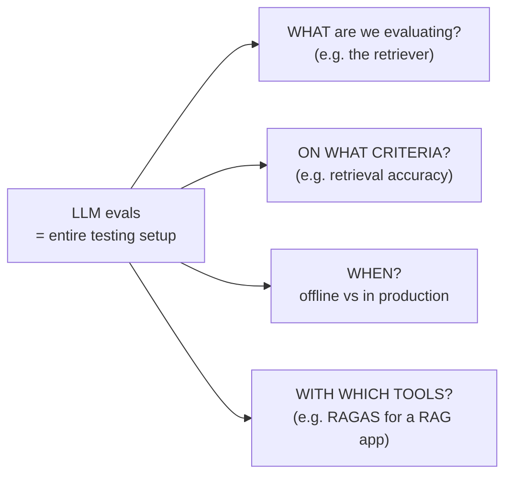
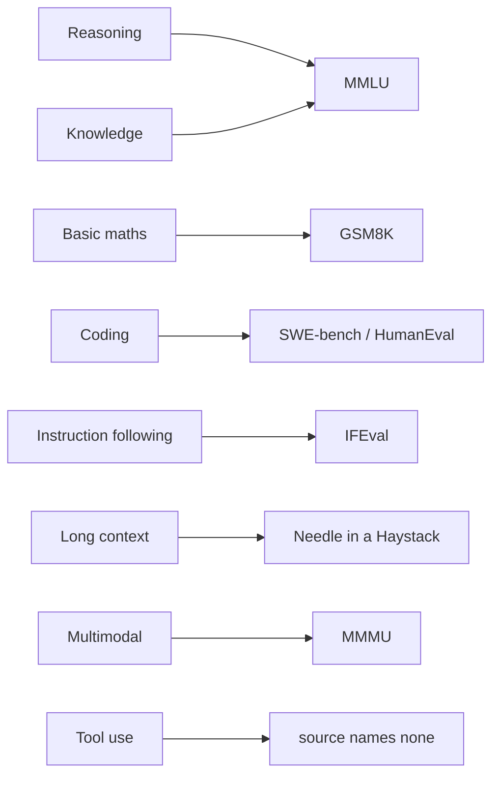

# CS-01 · Model Evals vs Application Evals

> **Source transcript:** `Introduction_to_LLM_Evaluations_Model_Evals_vs_Application_Evals_CampusX.txt` (Hinglish, 555 lines, 30,429 chars, runtime ≈ 24:28)
> **Domain:** foundations
> **One-liner:** The definitional lecture of the whole track — what "LLM evals" actually means (not metrics, but an entire testing setup), and the single most important mental split: evals of a *model's capabilities* versus evals of an *LLM-powered application*.
> **Prerequisites:** none (this is lecture 1 of the playlist; the speaker references an earlier lecture on *why* evals are needed and how they differ from software testing)

---

## 0. Executive summary

- **Definition to memorise:** "LLM evals are systematic, repeatable tests used to judge an LLM and LLM-powered system against a clear criteria" `[0:31]`–`[0:49]`. The three load-bearing words are *systematic*, *repeatable*, and *clear criteria* — the speaker calls them "teenon bahuta important pointers hain" `[1:17]`.
- **Evals ≠ metrics.** The single most common beginner misconception (the speaker admits to holding it himself, coming from machine learning) is that "eval" means accuracy/precision/recall `[4:38]`–`[5:16]`. It does not: "LLM evals is note only metrics, it is basically the entire testing setup" `[5:25]`–`[7:03]`.
- **The entire testing setup has four questions** `[6:44]`–`[7:03]`: what are you testing, on what criteria, *when* (offline vs in production), and with which tools (e.g. RAGAS).
- **The goal of an eval is not to produce a score.** "LLM eval ka goal aapako ek score dena nahin hota hai" — the goal is to answer practical questions `[7:10]`–`[7:21]`.
- **Six practical questions an eval must answer** `[7:25]`–`[7:57]`: Can the model be used for this particular task/application? Is this system good enough to ship? Did v2 improve over v1? Is the RAG answer grounded in the retrieved context? Is the agent completing the task correctly? Is the chatbot safe for real users, and is latency under control?
- **Core split:** model evals test *the model itself*; application evals test *the LLM-powered application* `[8:55]`–`[9:12]`. The speaker explicitly flags these are **not official industry terms** — he coined them to make the distinction land, and the industry calls both "LLM evals" `[10:01]`–`[10:36]`.
- **Eight capabilities are what model evals measure** `[12:09]`–`[13:48]`: reasoning, knowledge, basic maths, coding, instruction following, long-context handling, multimodal understanding, tool use — each assessed via a named benchmark (MMLU, GSM8K, SWE-bench, IFEval, Needle in a Haystack, MMMU) `[14:03]`–`[14:47]`.
- **As an AI engineer you will almost never run model evals.** Benchmarking and documenting a new LLM is "bade-bade frontier labs ka kaam" `[15:33]`–`[16:03]`. What you must be able to do is *read* benchmarks, because model selection for your app falls out of model evals `[16:54]`–`[17:18]`.
- **Application evals are the point of the playlist.** "Ye application eval is the main topic of this playlist… isa poore course men hum yahaan pe zyaada focus karenge" `[17:55]`–`[18:04]`. In an LLM app, the LLM is *just one component* `[18:18]`–`[18:26]`.
- **The smartphone analogy is the source's own framing for the whole split** `[20:09]`–`[21:37]`: a Snapdragon/MediaTek chip benchmark score tells you the processor is strong, but a good phone also needs camera, OS, sound, GPU, and battery — and those are yours to evaluate.
- **Practical heuristic:** 99% of YouTube videos titled "LLM evaluation" are teaching *application* evals, not model evals `[23:35]`–`[23:49]` — and this course deliberately teaches from the application-eval perspective only `[24:17]`–`[24:28]`.

---

## 1. The problem this lecture solves

The playlist has already established (in a prior lecture, referenced at `[0:00]`–`[0:10]`) *why* evals are needed and *how* they differ from classical software testing. What is missing, and what this lecture supplies, is a **definition**: "LLM evals hote kya hai? abhee taka hamane ye baat discuss nahin kee. Matlab oopar-oopar se kee hai" — so far everything was surface-level `[0:14]`–`[0:23]`.

Two concrete failure modes exist if you skip this lecture:

1. **The metrics-only collapse.** An engineer from an ML background (the speaker's own history: "because main machine learning, deep learning se aayaa thaa" `[4:50]`) will assume an eval is a set of metrics — accuracy, precision, recall `[5:00]`–`[5:06]`. The result is that they instrument one metric, watch it move, and still cannot answer "should we ship?".
2. **The wrong-responsibility collapse.** An AI engineer building a RAG chatbot assumes the LLM is the whole system — "agar brain hi wahi hai to phir everything is about LLMs" — and therefore that evaluating the model is the same as evaluating the product `[18:26]`–`[18:37]`. The source calls this out as a *beginner* error specifically: "specially beginners ko aisa lagta hai" `[18:28]`.

In the pre-LLM world the parallel discipline was model evaluation as metrics on a held-out set. That world had no notion of a *judge*, no notion of a *pipeline* of components, and no notion of offline-vs-online split. The lecture exists to move the listener off that framing.

---

## 2. Definitions & mental models

| Term | Definition (source's words) | Why it matters |
|---|---|---|
| **LLM evals** | "Systematic, repeatable tests used to judge an LLM and LLM-powered system against a clear criteria" `[0:31]`–`[0:49]` | The root definition. Note it names *both* LLMs and LLM-powered systems — the two categories the rest of the lecture splits apart |
| **Systematic** | You do not do "vibe testing"; you "create proper datasets, and in those datasets you try to cover every kind of edge case" `[1:24]`–`[1:52]` | Without it, evals are anecdotes |
| **Repeatable** | Change the prompt, model, retriever, or chunking strategy, and still evaluate exactly the same way on the same dataset, and compare results `[2:21]`–`[3:11]` | This is what makes *version 1 vs version 2* a measurable question rather than an argument |
| **Clear criteria** | The explicit list of what "good" means — the source's CampusX example: correct, simple explanation, drawn from our own course content, safe, no abusive or threatening content `[3:11]`–`[4:08]` | "Vida criteria aap proper evaluation karate ho" — more defined criteria = more proper evaluation `[4:02]`–`[4:08]` |
| **LLM eval ≠ metric** | "LLM eval ka matlab sirf metrics nahin. LLM eval matlab the entire testing setup" `[6:37]`–`[6:44]` | The headline correction of the lecture |
| **Model evals** | "Evos [evals] jinakee help se hum LLMs ko evaluate karate hain" — evaluate the model itself, to test and evaluate the **capabilities** of a model `[8:55]`–`[11:02]` | Happens when a new LLM is released; results are benchmarked, documented, published |
| **Application evals** | "Evos jinakee help se hum LLM-based applications ko evaluate karate hain" — "assess the behaviour and performance of an LLM-powered application, whether at the level of the entire system or a specific component within it" `[8:55]`–`[22:11]` | This is the AI engineer's job |
| **Capabilities (8)** | Reasoning, knowledge, basic maths, coding, instruction following, long-context handling, multimodal understanding, tool use `[12:09]`–`[13:48]` | The taxonomy model evals are organised around |

### Mental model: the "entire testing setup" box

The source's central diagram is not a pipeline but a **box of four questions** that together constitute "an eval". Anything called "LLM evals" contains all four `[6:29]`–`[7:03]`:



The dataset you prepared is also part of the box: "humne jo dataset prepare kiya evaluate karane ke lie vo bhee LLM evals ke andar aata hai" `[6:01]`–`[6:08]`.

### Mental model: the smartphone analogy `[20:09]`–`[21:37]`

The source's own analogy for why model evals do not settle an application. A chip vendor (Snapdragon, MediaTek) publishes benchmarks — "N2 score itana hai" — which tell you how strong the *processor* is `[20:15]`–`[20:33]`. But a phone is camera + operating system + sound system + graphics card + battery, and it is only good when *all* of them work `[20:55]`–`[21:23]`. "Sirf processor achchha hone se kuchh nahin hota." You, not the chip vendor, test the battery and the screen `[21:23]`–`[21:37]`.

Transfer: frontier labs benchmark the model; you evaluate everything you bolted around it. "LLMs ka evaluation frontier labs hamen karake de rahe hain. Bata usake oopara humane jo poora system build kiya hai usaka poora evaluation ka jo responsibility hai vo hamara hai, as an AI engineer" `[21:37]`–`[21:54]`.

---

## 3. Core content, decomposed

### Band A — What an eval is (and is not)

#### 3.1 The definition and its three properties `[0:00]`

- **What the source says:** "LLM evals are systematic repeatable tests used to judge an LLM and LLM powered system against a clear criteria" `[0:31]`–`[0:49]`. Three characteristics: systematic, repeatable, clear criteria `[1:04]`–`[1:20]`.
- **Mechanism — systematic** `[1:24]`–`[2:21]`: You do not ask five questions that come into your head and conclude "haan sab sahi hai". You "create proper datasets" and try to cover **every kind of edge case** so the chatbot or LLM-based system is properly tested. The source's worked instance: building the **CampusX chatbot**, take **randomly 100 real users' chats**, turn them into a dataset, and test on that dataset so you see "ekdum real-world behaviour" of your chatbot `[1:55]`–`[2:19]`.
- **Mechanism — repeatable** `[2:21]`–`[3:11]`: If tomorrow you change the prompt, change the model, change the retriever, or change the **chunking strategy**, you can still evaluate exactly as you did before, on the same dataset, and extract results. This is described as "a game-changing idea": because you hold one test dataset fixed, you can compare version 1's performance against version 2's and know whether the system is improving `[2:53]`–`[3:08]`.
- **Mechanism — clear criteria** `[3:11]`–`[4:08]`: For a CampusX chatbot the criteria list would be — (1) the answer produced must be **correct**; (2) the answer should be full of **simple explanation**; (3) whatever explanation arrives must come from **our own course content**; (4) it must be **safe** — nothing unsafe, no profanity, no threatening content `[3:29]`–`[3:54]`. "Zyaada criteria define karoge to zyada proper evaluation karoge" `[4:02]`.
- **Analyst note:** The three properties map cleanly onto classical test-engineering virtues (a fixture set, deterministic re-runs, an acceptance rubric). What is *new* in LLM evals is that the third one — "clear criteria" — is not free: natural-language criteria are exactly the thing you will have to operationalise with a judge or a metric, which is where CS-07 and CS-08 take over.

#### 3.2 The metrics misconception `[4:38]`–`[5:16]`

- **What the source says:** The speaker's own prior belief — that "eval" meant metric, having come from ML/DL where "evaluate a model" meant accuracy, precision, recall — was wrong `[4:45]`–`[5:11]`. "Bata ye sahee nahin hai" — this is not right.
- **Correction** `[5:16]`–`[7:03]`: "LLM eval ka matlab sirf metrics nahin. It is basically the complete testing setup." The whole setup that we create to test LLMs is what we call LLM evals.
- **Worked example (why it matters):** If you have a RAG chatbot and you want to evaluate the *retriever* inside it, then the retriever is a component and therefore part of your LLM evals; the criterion is "retriever ki accuracy kitana hai"; the dataset you prepared is also inside the setup; whether you run it offline or after deploying to production is inside the setup; the tools you use (e.g. RAGAS, because it is a RAG application) are inside the setup `[5:40]`–`[6:27]`.
- **Analyst note:** This is the sentence that distinguishes an *eval* from a *metric* in this knowledge base's vocabulary. A metric is one number; an eval is (component × criterion × dataset × time × tool) — five coordinates, any one of which can be wrong.

#### 3.3 An eval's goal is to answer questions, not to score `[7:10]`–`[8:07]`

The source is explicit: "LLM eval ka goal aapako ek score dena nahin hota hai. Usaka goal hota hai ki vo aapako practical questions ka answer de" `[7:10]`–`[7:21]`.

The practical questions, verbatim in the source's list `[7:25]`–`[7:57]`:

| # | Question (source's English) | Which eval answers it |
|---|---|---|
| 1 | "Can the model be used for a particular task/application?" | model evals |
| 2 | "Is this system good enough to ship?" | application evals |
| 3 | "Did v2 improve over v1?" | both, via a fixed dataset |
| 4 | "Is the RAG answer grounded in retrieved context?" | application evals (RAG) |
| 5 | "Is the agent completing the task correctly?" | application evals (agentic) |
| 6 | "Is the chatbot safe for real users?" / "Is latency under control?" | application evals |

**Analyst note:** Question 3 is the one that pays for the whole discipline. It is also the one that silently breaks if your dataset is not versioned alongside your prompt/model — see the "repeatable" property above.

### Band B — The two kinds of evals

#### 3.4 Model evals `[8:39]`–`[12:00]`

- **What the source says:** "Model evals evaluate the model itself" `[10:45]`–`[10:48]`. Their single job is to test and evaluate the **capabilities of a model** `[10:54]`–`[11:02]`.
- **Mechanism:** When a new LLM is released, we test what capabilities it has, benchmark them, and document them `[11:04]`–`[11:13]`. This is exactly the machinery behind release claims — "ek particular benchmark pe ya ek particular leaderboard pe ye LLM top pe aaya, itani accuracy hai, itane percentage pe hai" `[11:16]`–`[11:27]`. Someone built a set of evals; every time a new LLM hits the market it is run over those evals to find its capability level, and the result is documented and published on the internet so everyone can see how capable a given LLM is `[11:43]`–`[12:00]`.
- **Disclaimer from the source** `[10:01]`–`[10:36]`: "Model evals" and "application evals" are **not official terms** — "ye official terms nahin hai, ye maine create kiye hain" — created to simplify the topic. In industry both are simply called LLM evals, and listeners infer which is meant from context.
- **Numbers:** source gives no numbers (no cost, no sample size, no runtime) for model evals.

#### 3.5 The eight capabilities `[12:03]`–`[13:48]`

"Today's LLMs are majorly tested on eight capabilities" `[12:09]`:

| # | Capability | The question asked (source's words) |
|---|---|---|
| 1 | **Reasoning** | "Kya hamara LLM reason kar sakta hai? Ek problem ko step-by-step socha kara solve kara sakta hai ki nahin?" `[12:15]`–`[12:23]` |
| 2 | **Knowledge** | "Kya hamare LLM ke paas basic world knowledge hai? General knowledge hai?" — explicitly framed around **cut-off date**: all the world's knowledge *before that date* should be in the model `[12:26]`–`[12:38]` |
| 3 | **Basic maths** | "Kya hamara LLM maths problems solve kara sakta hai ki nahin?" `[12:40]`–`[12:47]` |
| 4 | **Coding** | "Kya hamara LLM coding kara sakta hai ki nahin?" `[12:49]`–`[12:52]` |
| 5 | **Instruction following** | If I give it 10 instructions, does it follow all of them one after another, or not? `[12:55]`–`[13:05]` |
| 6 | **Long-context handling** | Can it pull correct answers out from a very large context? `[13:08]`–`[13:17]` |
| 7 | **Multimodal understanding** | Does it have multimodal capability — can it understand images, text, sound, and/or produce them? `[13:17]`–`[13:30]` |
| 8 | **Tool use** | "Kya hamara LLM tools ko utilize kara sakta hai ki nahin, properly?" `[13:30]`–`[13:37]` |

"Ye aatha main capability categories hain jinake basis pe har naye LLM ko evaluate kiya jaata hai, aur phir document karake usake baare men bataaya jaata hai" `[13:37]`–`[13:50]`.

**Analyst note:** The count is "eight" in this lecture. Adjacent lectures in the same playlist (see CS-05) revisit capabilities in more depth; treat "eight" as this source's grouping, not a canonical taxonomy.

#### 3.6 Example benchmarks, one per capability `[13:57]`–`[14:47]`

The speaker lists these as examples only and defers the full treatment to the next lecture: "abhee hum saare benchmarks discuss nahin karenge" `[13:59]`–`[14:01]`.

| Capability | Benchmark named (as romanized) | What the source says about it |
|---|---|---|
| General knowledge + reasoning | **MMLU** ("M-M-L-U", said as "em-em-el-yoo") `[14:03]` | "A very famous benchmark… jo aapase bahuta taraha ke subjects ke oopar question poochhata hai — science, history, law, medicine" `[14:08]`–`[14:18]`. It asks the LLM questions and records/evaluates the answers |
| Basic maths | **GSM8K** ("jee-es-em-8-K") `[14:20]` | "Grade school maths ke questions poochhata hai aur unake basis pe answer evaluate karata hai" `[14:23]`–`[14:29]` |
| Coding | **SWE-bench** ("es-adablyoo-ee bench") `[14:31]` | "Maybe you have heard of it — it is a very famous benchmark, human-eval bhi hai" `[14:31]`–`[14:36]`. (Note: the speaker treats SWE-bench and HumanEval as the pair of well-known coding benchmarks.) |
| Instruction following | **IFEval** ("aaeeephaa eval") `[14:39]` | Named only; no description given |
| Long context | **Needle in a Haystack** ("needala in a hayara stack") `[14:41]` | Named as "a famous benchmark"; no description given |
| Multimodal | **MMMU** ("tripala em ayoo" — i.e. "Triple-M-U") `[14:45]` | Named only; no description given |
| Tool use | — | **The source names no benchmark for tool use.** |

**Analyst note (outside source):** "Tripala em ayoo" is the romanized rendering of the spoken "Triple-M-U", the common pronunciation of **MMMU** (Massive Multi-discipline Multimodal Understanding), which is the standard multimodal benchmark paired with MMLU. The mapping is confident but the transcript does not spell the acronym.

#### 3.7 Why an AI engineer still needs model evals `[15:33]`–`[17:18]`

- **What the source says:** "If you are going to become an AI engineer, you will not work that much on model evals" `[15:33]`–`[15:43]`. Evaluating a new LLM, benchmarking it, documenting its evaluations "aapaka kaam nahin hai — ye kaam hai bade-bade frontier labs ka" `[15:43]`–`[16:03]`.
- **But:** you do need to know what model evaluation is, what benchmarks are, and **how to read benchmarks** `[16:07]`–`[16:16]`.
- **Why it pays off** `[16:16]`–`[17:18]`: When you pick up a new project you will already have the ability to read benchmarks and know which model tops which benchmark. That feeds directly into **design decisions** — which LLM to put in your LLM-based application: OpenAI's, Anthropic's, or an open-source LLM. "Ye design-making model evals se hi nikala ke aatee hai" — this design decision comes out of model evals.
- **A hedge the source adds:** "It does not mean that you will never do practical evaluations" — "dekha jaayega, a good chance ki aap kabhi bhee model evaluations na karo. Bata aapako pata honaa chaahie. Aapako inako read karanaa aanaa chaahie. Aapako top benchmarks ke baare men pataa honaa chaahie" `[16:42]`–`[16:58]`.

**Analyst note:** This is the clearest statement in the track of the *split of labour*: capabilities are certified upstream (frontier labs), and the AI engineer consumes that certification as a selection input — see CS-12, which is entirely about running that selection as a custom model eval.

### Band C — Application evals

#### 3.8 Why application evals exist: the LLM is one component `[18:18]`–`[19:58]`

- **What the source says:** Beginners think an "LLM application" means the LLM is everything — "agar brain hi wahi hai to phir everything is about LLMs". This is wrong `[18:26]`–`[18:39]`. As you gain experience in AI engineering and build bigger applications, you realise that "brain to chalo important hai, bata usake alaava bhee bahuta saaree cheejen aapako daalanee paratee hain" — many other things must go in for the application to work correctly `[18:37]`–`[18:54]`.
- **The component list the source draws** `[18:56]`–`[19:52]`:
  1. User interface
  2. The prompt you write — the system prompt
  3. Tools, if you add them; APIs, if you add them
  4. The orchestration code — "jaise LangGraph men, ki yahaan se control yahaan jaaega, yahaan se branching hogee, phir parallel men control jaaega"
  5. Guardrails applied at the application level
  6. Output parsers, if you are using them
  7. Memory and context ("super important")
  8. For a RAG system: a separate retrieval system, a separately chosen embedding model, vector databases
  9. After deployment: the whole monitoring setup and the whole feedback loop
- **Analyst note:** Items 3 and 4 are what makes agentic evaluation structurally different from RAG evaluation — a graph of control flow has failure modes (wrong branch, no termination) that no single answer-quality metric can see. That is the subject of CS-17 and CS-20.

#### 3.9 The smartphone analogy `[20:09]`–`[21:37]`

Covered in §2 as a mental model. The mechanism to retain: vendor benchmarks measure the *chip*; the phone is an integrated product; therefore "jab aap ek proper LLM based application banate ho to vahaan pe LLM is just one component" `[19:43]`–`[19:47]`. "Sirf model evaluation se kaam nahin chalega" — model evaluation only tells you how capable the model is; the system you built around it also has to work `[19:55]`–`[20:06]`.

#### 3.10 What application evals actually assess `[21:59]`–`[23:16]`

- **Definition:** Application evals "assess the behaviour and performance of an LLM-powered application, whether at the level of the entire system or a specific component within it" `[21:59]`–`[22:11]`.
- **Two levels, explicitly:** component-level and whole-system level `[22:11]`–`[22:16]`.
  - **Whole system (RAG chatbot example)** `[22:16]`–`[22:27]`: evaluate the final response quality, the latency, and "token per cost" — cost per token.
  - **Component level** `[22:27]`–`[22:37]`: is my retriever working correctly? is my embedding model working correctly? is my reranker working correctly?
- **The contrast with model evals, in the source's words** `[22:37]`–`[22:51]`: "In application evals we don't ask 'kaina the model do disa?' — 'can the model do this?' — ye kaam model evaluation ka hai. Instead, in application evals we ask 'kya humara product sahee se kaam karega ya nahin?'" — will our product work correctly, or not?
- **Worked example — the CampusX chatbot's application-eval question set** `[22:51]`–`[23:16]`:
  1. Kya student ka question sahee se answer hua? (was the student's question answered correctly?)
  2. Kya course material properly use hua? (was the course material used properly?)
  3. Kya answer faithful tha? (was the answer faithful?)
  4. Kya answer beginner ke lie easy tha? (was the answer easy for a beginner?)
  5. Kya hallucination hua ya nahin? (was there hallucination?)
  6. Kya jaldi se answer mila ya nahin? (was the answer received quickly?)
  7. Kya hamara chatbot safe hai ki nahin? (is our chatbot safe?)

**Analyst note:** That list is a miniature rubric and it is worth noticing which entries are *LLM-judgeable* (faithfulness, beginner-friendliness, hallucination) and which are *not* (latency, safety — the latter needs either a classifier or a policy test set). It also previews CS-15's cost/latency axis.

#### 3.11 Two closing heuristics `[23:35]`–`[24:28]`

- **The 99% heuristic:** When you see a YouTube video titled "LLM evaluation" in future, you can assume it is teaching **application evaluation**, not model evaluation — "most likely 99% times" `[23:35]`–`[23:49]`.
- **The course's own disclaimer** `[24:17]`–`[24:28]`: everything taught from here on is taught "actually application eval ke perspective se… model eval ke perspective se nahin padhaa rahaa."

---

## 4. Frameworks & decision procedures

### 4.1 Triage: which kind of eval am I being asked for?

| Question you're asked | Kind of eval | Who owns it |
|---|---|---|
| "Is Claude/GPT/Gemini better at X?" | model eval | frontier labs (you only read the result) |
| "Which model should I use for this app?" | model eval → consumed as a **design input** | you consume; you may run a small custom eval (CS-12) |
| "Is the answer grounded in the retrieved chunks?" | application eval (component + system) | you |
| "Did the new prompt/chunk size/model improve things?" | application eval on a frozen dataset | you |
| "Can we ship?" | application eval | you |
| "Is it safe / fast / affordable?" | application eval | you |

### 4.2 The four-question eval specification (the "entire testing setup")

Fill all four or you have a metric, not an eval `[6:37]`–`[7:03]`:

1. **What** component or system is under test? (retriever, embedding model, reranker, whole chatbot)
2. **On what criteria?** (correct, simple, from our content, safe, grounded, fast)
3. **When does it run?** — offline before deploy, or online after deploy
4. **With what tools?** — e.g. RAGAS for a RAG app

### 4.3 The three properties checklist

| Property | Test question | Fails if… |
|---|---|---|
| Systematic `[1:24]` | Did I build a dataset covering edge cases? | you asked 5 questions from memory |
| Repeatable `[2:21]` | Can I re-run this after swapping prompt/model/retriever/chunking and compare? | the dataset or rubric moved with the code |
| Clear criteria `[3:11]` | Is "good" written down, item by item? | nobody can say what a failing answer looks like |

### 4.4 Capability → benchmark map (as given)



---

## 5. Worked end-to-end example

The source's own running example is the **CampusX chatbot** (a RAG chatbot over course content). Carrying it end to end through both eval kinds:

**Step 0 — The decision to make.** Which LLM do we put in the CampusX chatbot? `[17:04]`–`[17:15]`

**Step 1 — Model evals, consumed not produced.** Read the leaderboards and benchmarks: which model tops MMLU for knowledge/reasoning, GSM8K for maths, SWE-bench for coding, IFEval for instruction following, Needle-in-a-Haystack for long context, MMMU for multimodal, and which benchmark for tool use. Shortlist OpenAI vs Anthropic vs open-source `[17:07]`–`[17:18]`. The result of this step is a *shortlist*, not a decision.

**Step 2 — Build the application-eval dataset.** Take **randomly 100 real users' chats** with the CampusX system and turn them into a test dataset so you observe real-world behaviour `[1:55]`–`[2:19]`. This dataset is part of your LLM evals `[6:01]`.

**Step 3 — Write the criteria.** (a) correct, (b) filled with simple explanation, (c) sourced from our own course content, (d) safe — no unsafe/abusive/threatening content `[3:29]`–`[3:54]`.

**Step 4 — Decide the level.** Component level: is the retriever working? is the embedding model working? is the reranker working? `[22:27]`–`[22:34]`. System level: final response quality, latency, token cost `[22:16]`–`[22:27]`.

**Step 5 — Decide when.** Offline before deploying, or in production after deploying `[6:08]`–`[6:16]`.

**Step 6 — Pick the tool.** "Let's say hum RAGAS use kara rahe hain, because it is a RAG application" `[6:20]`–`[6:27]`.

**Step 7 — Evaluate the seven product questions.** Correctness, was course material used, faithfulness, beginner-friendliness, hallucination, speed, safety `[22:51]`–`[23:16]`.

**Step 8 — Ship decision, then repeatability.** Swap the model (v1 → v2), swap the chunking strategy, re-run on the *same* dataset, and read whether the system improved `[2:53]`–`[3:08]`.

**Thresholds:** the source gives **no numeric thresholds** anywhere in this lecture — no accuracy target, no latency budget, no cost ceiling. Any number you use here is yours, not the source's.

---

## 6. Pros, cons, exceptions

| Approach | Pros | Cons | Works when | Fails when | Cost |
|---|---|---|---|---|---|
| **Model evals** (frontier-lab, benchmark-based) `[10:45]` | Standardised, comparable across vendors, published, free to read; directly answers "which model for this app?" | Tells you nothing about *your* system; leaderboard-contaminated and saturated (see CS-11); you cannot reproduce them | Selecting a base model; understanding a release claim | You need a product-level ship decision | Zero to you — "frontier labs ka kaam" `[15:54]` |
| **Application evals** `[21:59]` | Measures what users actually experience; component-level diagnosis (retriever / embedder / reranker); supports version comparison | Requires a curated dataset and explicit criteria; no vendor supplies them; expensive to keep fresh | Any LLM-powered product you build | You skip the dataset step and only have vibes | The source gives no numbers; cost is your own dataset + tooling effort |

| Practice | Pros | Cons | Works when | Fails when |
|---|---|---|---|---|
| Vibe testing ("5 questions from memory") `[1:30]` | Free, instant | Not systematic, not repeatable, not comparable | Never, as an eval | Always — this is the anti-pattern the lecture opens against |
| Fixed dataset + repeatable harness `[2:21]` | Enables v1-vs-v2 comparison; survives model/prompt/retriever/chunking swaps | Dataset drift if not versioned with the code | Any iteration loop | You change the dataset between runs |
| Explicit written criteria `[3:11]` | Makes "good" auditable; more criteria = more proper evaluation `[4:02]` | Criteria must then be operationalised (judge/metric) — not free | Any graded evaluation | Criteria remain implicit |

---

## 7. Failure modes & anti-patterns

1. **Symptom:** You have a dashboard full of accuracy/precision/recall and still cannot answer "should we ship?"
   **Root cause:** Equating eval with metric `[5:08]`–`[5:16]`.
   **Detection:** Ask what component, criteria, timing, and tool the "eval" covers — if you cannot answer, it is a metric.
   **Fix:** Fill the four-question specification (§4.2).

2. **Symptom:** Results move every run and nobody trusts them.
   **Root cause:** The dataset or criteria changed with the code; repeatability was never enforced `[2:21]`–`[2:53]`.
   **Detection:** Try to re-run last month's evaluation on last month's commit.
   **Fix:** Version the dataset and the rubric next to the prompt and model ID.

3. **Symptom:** You benchmarked three LLMs for two weeks and still shipped a bad product.
   **Root cause:** Doing model evals for a decision that model evals cannot answer — "can the model do this?" instead of "will our product work?" `[22:37]`–`[22:51]`.
   **Detection:** Your eval never touches your retriever, your prompt, your guardrails, or your orchestration.
   **Fix:** Move to application evals; keep the model eval only as a selection input.

4. **Symptom:** The system hallucinates and you blame the model.
   **Root cause:** Assuming the LLM is the whole application `[18:26]`–`[18:39]`.
   **Detection:** Your component list has one item.
   **Fix:** Evaluate at both levels — component (retriever, embedding model, reranker) and system (final response, latency, cost) `[22:11]`–`[22:37]`.

5. **Symptom:** Safety incidents ship to real users.
   **Root cause:** "Safe" was never written down as a criterion `[3:44]`–`[3:54]`.
   **Detection:** Nothing in your criteria list mentions unsafe/abusive/threatening content.
   **Fix:** Add the safety criterion explicitly and test it as part of the same dataset.

6. **Symptom:** You read a vendor's leaderboard claim as if it were a product claim.
   **Root cause:** Not distinguishing the chip from the phone `[20:09]`–`[21:37]`.
   **Detection:** Your design doc cites a benchmark score as justification for a product outcome.
   **Fix:** Treat the benchmark as a filter for the shortlist; make the decision on application evals.

---

## 8. Implementation notes

This lecture is conceptual; it contains no code. The concrete artefacts it *implies* are:

**a) The eval specification file** (the "entire testing setup" made explicit) — the shape, in prose:

```
eval: campusx-chatbot-groundedness
  target:        component=retriever | system=chatbot        # WHAT  [6:44]
  criteria:      [correct, simple, sourced-from-course, safe] # ON WHAT [3:11]
  dataset:       data/campusx_real_chats_100.jsonl            # part of the setup [6:01]
  timing:        offline | online                             # WHEN  [6:12]
  tools:         ragas                                        # WITH WHAT [6:20]
```

**b) The dataset build step** — the only concrete construction the source describes: sample **randomly 100 real users' chats** and freeze them as the test set `[1:55]`–`[2:19]`.

**c) The repeatability contract** — the four things you must be able to swap *without* touching the eval: prompt, model, retriever, chunking strategy `[2:27]`–`[2:34]`. In practice that means the eval runner takes (prompt_id, model_id, retriever_config, chunk_config) as parameters and the dataset as an immutable input.

**d) The component inventory** — the list from §3.8 doubles as the audit surface for your application evals: UI, system prompt, tools, APIs, orchestration graph, guardrails, output parsers, memory, retrieval stack (retriever + embedding model + vector DB), monitoring, feedback loop.

**Libraries named in this lecture:** **RAGAS** `[6:22]` and **LangGraph** `[19:11]` (both as examples, no API shown). Orchestration frameworks are named only as "jaise LangGraph men". No CLI, no function signature, no config key is given in the source — do not invent one.

---

## 9. Interview-ready Q&A

**Q1. Define "LLM eval" precisely.**
**Model answer:** "LLM evals are systematic, repeatable tests used to judge an LLM or an LLM-powered system against a clear criteria" — that is the definition this playlist opens with `[0:31]`. Three properties carry the weight: it is systematic because you build a proper dataset covering edge cases, not five questions from memory; it is repeatable because you can swap the prompt, model, retriever, or chunking strategy and still evaluate on the same dataset; and it is criteria-driven, because "good" is written down explicitly. The practical consequence is that an eval is not a number, it is a setup.

**Q2. Is "eval" the same as "metric"?**
**Model answer:** No, and this is the most common beginner error. Coming from ML you think eval means accuracy, precision, recall — a set of metrics on a held-out set. In LLM evals, the metric is one component of the setup. The full setup is four coordinates: what you are testing, against what criteria, when it runs (offline vs in production), and with which tool (e.g. RAGAS for a RAG app). A metric without those four is not an eval.

**Q3. What is the difference between model evals and application evals?**
**Model answer:** Model evals evaluate the model itself to establish its capabilities; application evals evaluate the LLM-powered application, both at the whole-system level and at the level of individual components. Model evals are what a new LLM release claims against — benchmarks and leaderboards. Application evals are what you run on the product you built. Note that these two terms are not official industry terms; the industry calls both "LLM evals" and disambiguates from context.

**Q4. Who should run model evals?**
**Model answer:** Frontier labs, essentially. An AI engineer will rarely benchmark a new LLM and publish its capability numbers — that is the lab's job and the numbers arrive prepackaged as leaderboards. What the engineer must do is read those results well enough to make a design decision: which LLM to place in the application, OpenAI's, Anthropic's, or an open-source one. So model evals are a *selection input* for the engineer, not a task.

**Q5. Name the capabilities modern LLMs are evaluated on.**
**Model answer:** Eight in this source's grouping: reasoning (multi-step problem solving), knowledge (world/general knowledge up to a cut-off date), basic maths, coding, instruction following (following 10 instructions in order), long-context handling (retrieving the right answer from a very large context), multimodal understanding (images, text, sound — in and/or out), and tool use. Each is assessed with a named benchmark: MMLU for knowledge and reasoning, GSM8K for grade-school maths, SWE-bench (or HumanEval) for coding, IFEval for instruction following, Needle in a Haystack for long context, MMMU for multimodal.

**Q6. Why is an LLM app "not just the LLM"?**
**Model answer:** Because a working application is an integration. Around the model you have a user interface, a system prompt, tools and APIs, orchestration code that decides routing, branching and parallelism, guardrails, output parsers, memory and context management, and — if it is RAG — an entire retrieval stack with its own embedding model and vector database, plus post-deploy monitoring and a feedback loop. The beginner error is "agar brain hi wahi hai" — if the model is the brain, everything is about the model. It is not; the model is one component.

**Q7. Give an analogy for why a good model does not guarantee a good application.**
**Model answer:** The smartphone analogy the source uses. Chip vendors publish benchmark scores for Snapdragon or MediaTek processors — that tells you how strong the *processor* is. But a phone is camera, OS, sound, GPU and battery too, and it is only good when all of them work. A strong processor is necessary and nowhere near sufficient. Same for an LLM app: the model eval is the chip benchmark; the product decision is the phone review.

**Q8. At what levels do application evals operate? Give examples of each.**
**Model answer:** Two levels. At the whole-system level, for a RAG chatbot, you evaluate the final response quality, the latency, and cost per token. At the component level you evaluate the parts — is the retriever working correctly, is the embedding model working correctly, is the reranker working correctly. The split matters diagnostically: when system quality drops, component-level evals tell you whether the fault is retrieval or generation.

**Q9 (trap). Our model tops MMLU. Can we ship?**
**Model answer:** No. Topping MMLU answers "can the model do this?" — a model-eval question. Shipping is an application-eval question: "will our product work correctly?" A benchmark score tells you nothing about your retriever, your system prompt, your guardrails, your latency, or your cost per token. It is a shortlist input, not a ship decision. The naive answer — "the benchmark is high, so we're fine" — is exactly the model-vs-application confusion.

**Q10 (trap). We don't have a dataset, but we tested 5 questions on our chatbot and every answer looked right. Are we done?**
**Model answer:** No, and by the source's own definition you have not run an eval at all. Systematic means building a dataset that covers edge cases — the source's example is to randomly sample 100 real user chats and freeze them as the test set. Repeatable means you can swap the prompt, model, retriever or chunking strategy and re-run identically to compare versions. Five questions chosen by you satisfies neither property, and it also has no written criteria, so it cannot detect a regression.

**Q11. When you watch a video titled "LLM evaluation", what is it probably teaching?**
**Model answer:** Application evaluation, roughly 99% of the time by the source's estimate. Model evaluation lives in frontier-lab release notes and leaderboard documentation; the tutorial content is about the thing you will actually own as an AI engineer — evaluating your own LLM-powered application. This is also why the playlist itself teaches from the application-eval perspective and only covers model evals enough for you to read them.

**Q12. What does an eval actually produce, if not a score?**
**Model answer:** Answers to practical questions. The source's list: can the model be used for this task; is this system good enough to ship; did v2 improve over v1; is the RAG answer grounded in the retrieved context; is the agent completing the task correctly; is the chatbot safe for real users; is latency under control. A score is an instrument for answering those; on its own it answers none of them.

---

## 10. Cheat sheet

```
LLM EVALS — THE 60-SECOND VERSION
----------------------------------
Definition: systematic + repeatable tests that judge an LLM or LLM-powered
            system against a CLEAR CRITERIA.            [0:31]
Not a metric. The ENTIRE TESTING SETUP:                   [6:25]
   WHAT  -> which component/system
   WHAT  -> which criteria
   WHEN  -> offline or in production
   TOOLS -> e.g. RAGAS for a RAG app
Goal = answer practical questions, not emit a score.      [7:10]

THE THREE PROPERTIES
  systematic  -> proper dataset, all edge cases (not 5 questions from memory) [1:24]
  repeatable  -> swap prompt / model / retriever / chunking, re-run same way  [2:21]
  criteria    -> write "good" down item by item                               [3:11]

THE ONE SPLIT THAT MATTERS
  MODEL EVALS        -> test capability of the MODEL ITSELF     [8:55]
  APPLICATION EVALS  -> behaviour + performance of the LLM APP,
                        at SYSTEM level AND COMPONENT level     [21:59]
  (Neither is an official term; industry says "LLM evals" for both.) [10:01]

SIX QUESTIONS AN EVAL ANSWERS                                [7:25]
  1 Can the model be used for this task/application?
  2 Is this system good enough to ship?
  3 Did v2 improve over v1?
  4 Is the RAG answer grounded in the retrieved context?
  5 Is the agent completing the task correctly?
  6 Is the chatbot safe for real users? Is latency under control?

EIGHT CAPABILITIES -> BENCHMARK                              [12:09]
  reasoning            -> MMLU
  knowledge            -> MMLU   (bounded by the cut-off date)
  basic maths          -> GSM8K
  coding               -> SWE-bench / HumanEval
  instruction following-> IFEval
  long context         -> Needle in a Haystack
  multimodal           -> MMMU
  tool use             -> source names none

WHO OWNS WHAT                                                [15:33]
  frontier labs -> benchmark + document new LLMs (model evals)
  YOU           -> read the benchmarks, then evaluate everything
                   you built around the model (application evals)

MENTAL MODEL — THE SMARTPHONE                                [20:09]
  chip benchmark = model eval   (Snapdragon / MediaTek score)
  the phone      = your app     (camera, OS, sound, GPU, battery)
  strong chip is necessary, never sufficient.

DECISION RULES
  1 "Which model?" -> model eval, consumed. Shortlist only.
  2 "Can we ship?" -> application eval. Never answer from a benchmark.
  3 Any eval claim must name component + criteria + timing + tool.
  4 Freeze the dataset; version it with the prompt and model id.

WATCH OUT FOR
  - calling a metric an eval
  - benchmarking models when the question is a product question
  - blaming the model when the retriever is broken
  - shipping with no written criteria, especially safety
```

---

## 11. Glossary

| Term | Meaning |
|---|---|
| **LLM evals** | Systematic, repeatable tests judging an LLM or LLM-powered system against a clear criteria; the entire testing setup, not a metric |
| **Model evals** | Evals of the model itself, to establish its capabilities; benchmarked and published by frontier labs. Speaker-coined term |
| **Application evals** | Evals of an LLM-powered application at system level and component level. Speaker-coined term |
| **Systematic** | Built on a purpose-made dataset that covers edge cases rather than ad-hoc questions |
| **Repeatable** | Re-runnable unchanged after swapping prompt, model, retriever, or chunking strategy, so v1/v2 are comparable |
| **Clear criteria** | An explicit, written list of what counts as acceptable output |
| **Capability** | One of eight axes model evals measure: reasoning, knowledge, basic maths, coding, instruction following, long context, multimodal, tool use |
| **Benchmark** | The instrument used to measure a capability on a model (MMLU, GSM8K, SWE-bench, IFEval, Needle in a Haystack, MMMU) |
| **Leaderboard** | Published ranking of models against a benchmark, cited in release announcements |
| **Cut-off date** | The date bounding a model's world knowledge; knowledge capability is defined relative to it |
| **Component-level eval** | Evaluation of one part of the application — retriever, embedding model, reranker |
| **System-level eval** | Evaluation of the end product — final response, latency, cost per token |
| **Token per cost** | The source's phrasing for cost per token at system level `[22:24]` |
| **Vibe testing** | Asking a few questions from memory and concluding "sab sahi hai"; the anti-pattern the definition excludes |
| **RAGAS** | Eval tool named in the source as the example tool for a RAG application |
| **LangGraph** | Orchestration framework named in the source as the example of application control flow |

---

## 12. Cross-references

- **Builds on:** none — this is the entry point of Track A.
- **Leads to:**
  - [CS-02 · LLM evals playlist & curriculum map](CS-02-llm-evals-playlist-and-curriculum-map.md) — the roadmap that this lecture opens
  - [CS-04 · The complete eval workflow](CS-04-complete-eval-workflow.md) — the four-question setup turned into a procedure
  - [CS-05 · Model evals & capabilities](CS-05-model-evals-and-capabilities.md) — the eight capabilities expanded
  - [CS-06 · Offline vs online evals](../02-methods/CS-06-offline-vs-online-evals.md) — the "WHEN" coordinate
  - [CS-10 · Evolution of AI knowledge benchmarks](../03-benchmarks/CS-10-evolution-of-ai-knowledge-benchmarks.md) — MMLU, GSM8K and friends in detail
  - [CS-12 · Selecting the right LLM](../03-benchmarks/CS-12-selecting-the-right-llm-custom-model-evals.md) — the design decision this lecture defers to model evals
- **External:** the source names MMLU, GSM8K, SWE-bench, HumanEval, IFEval, Needle in a Haystack, MMMU, RAGAS, LangGraph, Snapdragon, MediaTek. It names no papers, no URLs and no dataset sizes.
