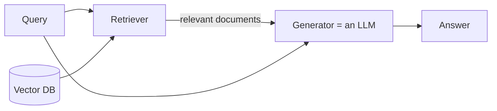
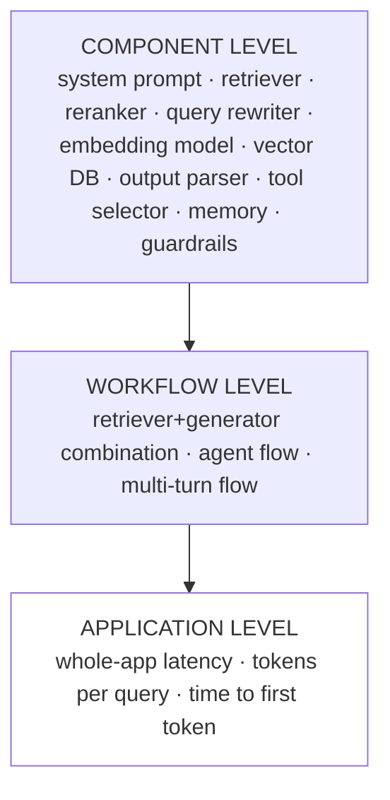
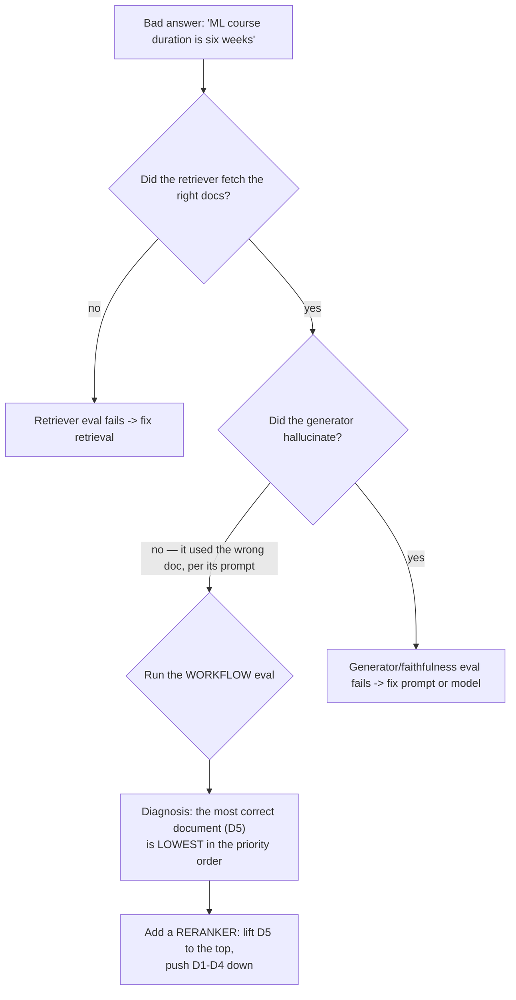

# CS-03 · Why One Eval Pipeline Is Never Enough

> **Source transcript:** `Why_Your_AI_Application_Needs_Multiple_Eval_Pipelines_CampusX.txt` (Hinglish, 633 lines, 35,051 chars, runtime ≈ 28:03)
> **Domain:** foundations
> **One-liner:** The lecture that proves, with one escalating RAG example, that an LLM application has **multiple failure points** and **multiple risk categories** — so it needs eval pipelines at three levels (component, workflow, application), not one.
> **Prerequisites:** CS-01 (model vs application evals), CS-02 (playlist map)

---

## 0. Executive summary

- **The thesis in one line, inherited from the previous session:** "Generally speaking, one LLM-based application **has several LLM evals**" — there is no single eval pipeline for any non-trivial LLM app `[2:44]`–`[2:58]`.
- **Reason 1 — multiple failure points.** "Your LLM-based application can break in many places" `[4:35]`–`[4:53]`. For a RAG chatbot the two obvious ones are the **retriever** and the **generator** `[5:15]`–`[5:21]`; the source says these are visible "even if you look at it directly" `[5:13]`–`[5:17]`.
- **The two independent failure modes** `[5:21]`–`[5:42]`: (a) the retriever fetches wrong documents, so the generator answers wrongly *on* the wrong documents; (b) the retriever works correctly but the generator **ignores it, hallucinates, and answers wrongly**. Both need their own pipeline, studied independently `[6:04]`–`[6:08]`.
- **Component evals passing does not mean the pipeline passes.** The lecture's central demonstration: with **K = 5**, the retriever returns five documents where D1–D4 are irrelevant and **D5** says "the duration of ML course is 8 weeks". The generator, instructed to prioritise the *higher-ranked* documents, picks the fact "Python course duration is six weeks" out of D1–D4 and answers "the duration of ML course is six weeks" — wrong, but the generator was only "diligently following instructions" `[10:08]`–`[13:57]`.
- **Therefore you need a workflow-level eval.** The failure only becomes visible when you evaluate the *combination*: retriever + generator interaction `[14:13]`–`[14:48]`. That workflow eval diagnoses the fix — add a **reranker** to push D5 to the top and D1–D4 down `[15:16]`–`[15:36]`.
- **Passing all three still is not enough.** Even with the retriever eval, generator eval, and workflow eval all green, the app may take **10 seconds** to answer — the user waits 10 seconds — and is therefore not deployable `[16:59]`–`[17:21]`. Hence an **application-level eval** with a latency threshold `[17:23]`–`[17:31]`.
- **The three levels of failure point** `[17:42]`–`[19:02]`: **component** (system prompt, retriever, reranker, query rewriter, embedding model, vector DB; output parser, tool selector, memory, guardrails), **workflow** (RAG, agent, multi-turn chatbot), **application** (whole-app latency, tokens per query, time to first token).
- **Reason 2 — multiple risk categories.** Broader risks split into three parts `[21:52]`–`[22:08]`: **application quality**, **safety**, and **operations**. Because each applies at each level, "99.99% times aapa usamen ek se jyaadaa evaluation pipeline lagaaoge" `[27:46]`–`[27:53]`.
- **The source hands over a full risk taxonomy** for four app types — general LLM app, RAG, agents, multi-turn chatbot — plus a five-part safety list and a five-metric operations list. It is rendered in §4.4 of this document.

---

## 1. The problem this lecture solves

The previous session ended on a line the speaker now uses as a launchpad: "generally speaking, one LLM-based application has several LLM evals" `[2:44]`–`[2:52]`. The obvious follow-up question — the one this lecture exists to answer — is *why*: "If one eval pipeline cannot evaluate your application, then why? Hum ye point discuss karenge aur bahuta intuitively discuss karenge" `[3:17]`–`[3:26]`.

What breaks if you skip this: you build one eval — typically a groundedness or correctness check on the final answer — and you conclude the application is fine. The lecture's whole demonstration is constructed to show that this conclusion is wrong at least three separate times in a row, each time for a different structural reason:

1. Component evals pass, **workflow** still broken `[13:47]`–`[13:57]`
2. Workflow evals pass, **application** still unusable because of latency `[16:59]`–`[17:21]`
3. Everything above passes, but the **risk surface** (safety, cost, component latency) was never evaluated at all `[21:21]`–`[21:40]`

The pre-LLM world had one artefact to test — a deterministic program — and one criterion: correctness. This lecture is where that model definitively fails, because the thing under test is now a *graph of probabilistic components whose combination has emergent failure modes*.

---

## 2. Definitions & mental models

| Term | Definition (source's words) | Why it matters |
|---|---|---|
| **LLM evals** (recap of CS-01's definition) | "LLM evals are basically systematic and repeatable … of evaluating LLMs and LLM based applications against a clear criteria" `[0:55]`–`[1:06]` | The lecture explicitly recaps the prior session so the two definitions of evals sit side by side |
| **Model evals** (recap) | When you evaluate the LLM itself; benchmarks are used for this `[1:18]`–`[1:24]` | Re-established so the listener knows this lecture is on the other branch |
| **Application evals** (recap) | When you evaluate the LLM application you built `[1:27]`–`[1:29]` | "Is AI engineer aapakaa jyaadaatara time jaaegaa application evals men" — most of your time goes here `[1:38]`–`[1:41]` |
| **Failure point** | A place in the application where it can break — "aapakaa LLM based application kaee jagahon se phat sakataa hai" `[4:48]`–`[4:53]` | The unit of analysis for Reason 1 |
| **Risk category** | A class of things that can go wrong — quality, safety, or operations `[19:33]`–`[19:37]`, `[21:52]`–`[22:08]` | The unit of analysis for Reason 2 |
| **Faithfulness / groundedness** | The answer was generated on the basis of the retrieved documents; no facts were created beyond them `[7:14]`–`[7:36]` | The generator's quality criterion, and the source treats the two words as synonyms: "faithfulness, jisako hum kabhee-kabhee groundedness bhee bolate hain" `[7:18]`–`[7:24]` |
| **K** (retrieval top-k) | "K ka matlab huaa ki agar K ka matlab paancha hai to matlab tumako paancha documents men sahee answer leke aanaa hai" — fetch the five most relevant documents from the vector database `[10:13]`–`[10:28]` | Sets the retriever's contract: the right answer must appear *within* the top K |
| **Reranker** | Post-retrieval component that re-ranks results so the correct document becomes highest priority `[15:16]`–`[15:28]` | The fix the workflow-level eval produces in the running example |
| **Component level** | Evals on individual parts — system prompt, retriever, reranker, query rewriter, embedding model, vector DB, output parser, tool selector, memory, guardrails `[17:56]`–`[18:17]` | Level 1 of 3 |
| **Workflow level** | Evals on how components combine — "aapakaa retriever aur generator kaa combination milake kaise kaam kara rahaa hai" `[14:28]`–`[14:34]` | Level 2 of 3 |
| **Application level** | Evals on the whole product — latency, cost, time to first token `[18:40]`–`[19:02]` | Level 3 of 3 |

### Mental model 1: the RAG flow, drawn as the source draws it `[3:34]`–`[4:27]`



The source's key structural observation: the generator receives **both** the query and the retrieved documents `[4:13]`–`[4:21]`. That is exactly why a retriever-only or generator-only eval cannot see the interaction failure.

### Mental model 2: the three nested levels `[17:42]`–`[19:02]`



Each level's evals can all pass while the level above still fails. The source proves this twice: component → workflow at `[13:47]`–`[13:57]`, workflow → application at `[16:59]`–`[17:21]`.

### Mental model 3: the three broad risk categories `[21:52]`–`[23:08]`

| Category | Source's definition | Examples given |
|---|---|---|
| **Application quality** | "Whether the AI does its actual job well; it gives correct, relevant, complete answers to what the user asked" `[22:15]`–`[22:27]` | correctness, relevance, completeness |
| **Safety** | "The answer which came out should not be harmful" `[22:31]`–`[22:34]` | toxicity, dangerous content, bias, private-data leak, jailbreak `[22:38]`–`[22:57]` |
| **Operations** | "Whether once we deploy it, it can run fast, cheap and reliably" `[22:59]`–`[23:08]` | latency, cost, reliability |

---

## 3. Core content, decomposed

### Band A — Reason 1: multiple failure points

#### 3.1 The RAG architecture as the running example `[3:34]`–`[4:27]`

- **What the source says:** "Let's say we are building a RAG chatbot for our company and our school and college, whatever" `[3:34]`–`[3:41]`. Components: a **retriever** connected to a **vector database** `[3:46]`–`[3:52]`; the retriever fetches documents and hands them to a **generator** `[3:52]`–`[4:02]`; the **generator is an LLM** `[4:19]`–`[4:21]`.
- **Mechanism of the flow** `[4:06]`–`[4:27]`: the query reaches the retriever; on the basis of the query the retriever fetches relevant documents from the vector database; then *both* the query and the retrieved documents are picked up and given to the generator; the generator answers on the basis of the relevant context. "Ye RAG ka setup hotaa hai."
- **Analyst note:** This is the source's minimal RAG diagram — deliberately missing reranker, query rewriting, and hybrid search. It omits them so that the reranker can later appear as the *discovered fix* rather than as an assumed component (`[15:16]`).

#### 3.2 The two obvious failure points `[4:30]`–`[6:04]`

- **The framing question** `[4:53]`–`[5:11]`: "What are the failure points, in your opinion? Where can mistakes happen? Where can the code break? Where is there a chance of wrong responses coming?" The source says the answer is visible by direct inspection: two failure points "bahuta aasaanee se dekhe jaa sakte hain" `[5:15]`–`[5:19]`.
- **Failure point 1 — the retriever** `[5:21]`–`[5:30]`: "aisaa ho sakataa hai ki aapakaa retriever galata documents fetch karake laae. Agar vo galata documents fetch karake laayaa to generator kyaa karegaa? Galata documents pe galata answer de degaa."
- **Failure point 2 — the generator** `[5:32]`–`[5:42]`: "second problem ye hai ki retriever sahee se kaam kara rahaa hai bata generator usako ignore karake hallucinate karake galata answer de rahaa hai."
- **The consequence** `[5:44]`–`[6:04]`: both failure points must work correctly for the application to run correctly; therefore one eval pipeline goes on the retriever and one on the generator, and the two are studied **independently** `[6:04]`–`[6:08]`.

#### 3.3 Pipeline 1 — the retriever eval `[6:11]`–`[6:48]`

- **The retriever's job:** when it receives a query, on the basis of that query it fetches relevant documents out of the vector database `[6:14]`–`[6:29]`.
- **The eval:** "aapako ek aisee pipeline set karanee padegee… jo check karegaa ki given a query are you getting the right relevant documents" `[6:32]`–`[6:45]`.
- **Numbers:** **K = 5** — the retriever is configured to bring back the five most relevant documents, and the retriever's contract is that the correct answer must be *among* those five `[10:13]`–`[10:28]`. The source's pedagogical framing: "Its like main tumako paancha attempts doongaa, tumako paancha men ek baara exam crack karanaa hai" — I give you five attempts; you have to crack the exam in one of the five `[11:43]`–`[11:50]`.

#### 3.4 Pipeline 2 — the generator eval (faithfulness / groundedness) `[6:51]`–`[8:22]`

- **The generator's job:** you are given a context, and on the basis of that context you generate an answer `[6:53]`–`[7:02]`.
- **The quality criterion:** "yahaan para hum kyaa quality check kara rahe hain? Hum check kara rahe hain **faithfulness**, jisako hum kabhee-kabhee **groundedness** bhee bolate hain" `[7:14]`–`[7:24]`.
- **Mechanism:** check that (a) the answer was generated on the basis of the relevant documents given inside the context, and (b) **no facts were created by the model on its own** — "usake alaavaa khud se koee facts create naheen kie gae" `[7:24]`–`[7:36]`.
- **Worked example** `[7:36]`–`[8:10]`:
  - Question asked: "What is the duration of machine learning course?"
  - Retrieved/extracted document says: **3 weeks**
  - The generated answer must therefore print: "machine learning course duration is three weeks"
  - **No additional injection should arrive on its own** — not "it is a great course", not "you can also purchase the Python course, the duration of Python course is four weeks". Those are "additional injection" and must not appear.
  - Conclusion: "the answer should be grounded in context" `[8:05]`–`[8:10]`.
- **Analyst note:** The source explicitly equates faithfulness and groundedness in this lecture, and treats the anti-pattern (adding unsolicited adjacent facts) as the failure. Note that the failure mode described is not "the model made something up from nothing" — it is "the model added true-but-unrequested facts". That is an important and often-missed distinction; it is exactly the failure that recurs in §3.6.

#### 3.5 The trap question: do two passing component evals guarantee a working app? `[8:22]`–`[9:33]`

- **The setup** `[8:45]`–`[9:12]`: assume both evals report that the retriever and the generator are working correctly. Then: "do you think that if our retriever is working correctly and our generator is working correctly, our application will also work correctly? Is it true?"
- **The audience split** `[9:33]`–`[9:37]`: "bahuta saare loga bola rahe hain yes. Phir kuchha loga bola rahe hain no."
- **The source's answer: no** `[13:05]`–`[13:14]` and `[15:47]`–`[15:54]`.

#### 3.6 The counter-example — K=5, D5, and the "Python course" fact `[9:49]`–`[13:57]`

This is the lecture's central worked example. Reconstructed step by step:

| Step | What happens | Timestamp |
|---|---|---|
| 1 | User asks: "What is the duration of machine learning course?" | `[9:51]`–`[10:08]` |
| 2 | The retriever ran with **K = 5**, i.e. it fetched the five most relevant documents | `[10:13]`–`[10:28]` |
| 3 | Among those five: **D1, D2, D3, D4 are "some random thing"** — irrelevant | `[10:28]`–`[10:39]` |
| 4 | **D5** says: "the duration of ML course is 8 weeks" | `[10:39]`–`[10:45]` |
| 5 | **Did the retriever do its job?** Yes — the correct answer is inside its top 5, which is exactly its contract with K = 5 | `[10:51]`–`[11:53]` |
| 6 | The pipeline then hands **all five documents plus the question** to the generator | `[11:53]`–`[12:04]` |
| 7 | The generator's **system prompt** says: you will get a question and many contexts; merge them and generate an answer | `[12:04]`–`[12:12]` |
| 8 | The source's claim about real behaviour: the generator tends to focus more on the **earlier** documents — generally the higher-ranked context gets more attention — or the system prompt guides it to prioritise D1, D2, D3, D4 | `[12:14]`–`[12:37]` |
| 9 | So the generator "picked from somewhere here": one of those documents said **"Python course duration is six weeks"**, it grabbed those facts and answered **"the duration of ML course is six weeks"** | `[12:37]`–`[12:56]` |
| 10 | **Is that answer right or wrong?** "Obviously galata hai" — obviously wrong | `[12:58]`–`[13:05]` |

- **The crucial diagnosis** `[13:05]`–`[13:57]`: did the generator do its job properly? **No — but not because it misbehaved.** "Hamane generator ko kyaa bolaa rakhaa thaa? Ki based on higher priority documents tumako answer generate karanaa hai." The generator was told to answer from the higher-priority documents. So "usa bechaare ko kyaa huaa ki usako documents hee galata die gae, to usane galata document pe bhee apanaa kaam sahee se karane kee koshish kee."
  - It did **not** hallucinate — "usane kuchha hallucinate naheen kiyaa"
  - It did **not** invent the fact from thin air — "its not ki usane havaa men generate kara diyaa vo fact"
  - It **mixed up wrong things** — "its just ki usane galata cheejon ko mix kara diyaa"
  - It was **diligently following the instructions** it had been given — "jo instructions maine usako die the vo usako diligently follow kara rahaa thaa"
- **The conclusion** `[13:44]`–`[13:57]`: the generator was working fine independently; the retriever was working fine independently; **but the pipeline broke and the application gave wrong results**. "Aap samajha rahe ho main kyaa samajhaanaa chaaha rahaa hoon aapako."

**Analyst note:** This is the best single illustration in the track of why *component-level* evals are structurally blind. Each component passed its own test because each component did exactly what its own contract said. The bug lives in the *composition* — a priority-ordering assumption that no component owns. It is also an argument for evaluating with the *system prompt* as an explicit variable, since here the prompt is what made the wrong document win.

#### 3.7 The workflow-level eval, and the fix it finds `[14:03]`–`[15:54]`

- **Why level 2 is needed** `[14:08]`–`[14:37]`: "Aapko ek workflow-level eval bhee banaanaa padegaa ki aapakaa retriever aur generator kaa combination milake kaise kaam kara rahaa hai. Vaisaa ek eval kyaa karegaa? Vo isa error ko flag kara degaa."
- **The framing** `[14:40]`–`[14:48]`: "You not only need individual component-level evals, but you will also have to build evals at their interaction, i.e. workflow level."
- **The workflow eval's diagnosis** `[14:54]`–`[15:16]`: it reports "haan bhaaee, galatee kyaa hai — aapane answer galata diyaa, aapako isako sudhaaranaa padegaa." And the error is: **the most correct document is lowest in the priority order** — "aapakaa jo sabase sahee vaalaa document thaa vo priority order men sabase neeche hai."
- **The fix the evaluation implies** `[15:16]`–`[15:36]`: "Most likely aapako yahaan pe ek **reranker** lagaanaa padegaa." The reranker's job: after the results come back, re-rank them so that D5 becomes highest priority for this query; it lifts D5 up, pushes D1–D4 down, and then the whole RAG pipeline starts working correctly.
- **The general principle** `[15:39]`–`[15:54]`: "Sirf component level pe agar aapa evals place karoge to jarooree naheen hai ki aapakaa pipeline sahee se kaam karegaa. Individual components sahee se kaam karenge, lekin pipeline fail kara sakataa hai."
- **Analyst note:** The causal chain here is worth memorising because it is the argument for *why* eval exists as a discipline rather than as a dashboard: eval → diagnosis → architectural change (add a reranker). The eval is not reporting a number; it is naming the missing component. That is the same "eval answers practical questions" claim from CS-01 §3.3, made concrete.

#### 3.8 The second trap: three green evals still do not ship `[15:56]`–`[17:31]`

- **The escalations** `[15:56]`–`[16:43]`: now suppose the pipeline-level eval also exists and also reports that the retriever–generator combination is working correctly. Three evals are green — the retriever's own, the generator's own, and the mix. "To kyaa yaha guarantee karataa hai ki aapakaa RAG application sahee se kaam kara rahaa hai? Does this guarantee?"
- **The audience** `[16:43]`–`[16:48]`: "bahuta saare loga bola rahe hain yes, abhee bhee problem aa sakatee hai." The source asks them to say *where*.
- **The answer — latency** `[16:59]`–`[17:21]`: "Ek question ko answer karane men meraa ye pooraa kaa pooraa pipeline **10 seconds** le rahaa hai. Which basically means ki meraa user question type kara rahaa hai, 10 second wait kara rahaa hai, taba usako answer nikala ke aa rahaa hai. To kyaa ye production men deploy hone laayaka hai hamaaraa application? **The answer is no.**"
- **The required fourth eval** `[17:23]`–`[17:31]`: "Yahaan pe ab aapako kyaa karanaa paregaa? Ek application level pe aakara ke bhee eval set karanaa padegaa jo ye check karegaa ki aapakaa latency ek threshold ke neeche rahe."
- **Numbers:** **10 seconds** is the illustrative end-to-end latency; the source gives **no numeric threshold** for acceptable latency — it says only "ek threshold ke neeche" (below a threshold).

#### 3.9 The three levels, enumerated `[17:42]`–`[19:02]`

The source's summary: "there are three levels where failure points exist."

| Level | The source's own list of parts | Source's example failure |
|---|---|---|
| **Component level** `[17:56]`–`[18:20]` | system prompt; retriever, reranker, query rewriter, embedding model, vector DB (RAG); output parser (structured-output apps); tool selector, memory, guardrails (agents) | "Agar aapa proper system prompt aapane likhaa hai to system prompt galatee kara sakataa hai" — a bad system prompt; and see §3.6 where the prompt genuinely produced the wrong answer |
| **Workflow level** `[18:23]`–`[18:38]` | the RAG workflow; the agent's workflow; the multi-turn chatbot's workflow | the D5-priority failure of §3.6 |
| **Application level** `[18:40]`–`[19:02]` | whole-application latency; tokens spent answering a single query; time for the first token to print | the 10-second answer of §3.8 |

- **The closing line of Reason 1** `[19:06]`–`[19:22]`: "Hamaare paas ek RAG chatbot hai… humne kuchha 15–20 minute spend karake is point ko, with an example, prove karane kee koshish kee. That's it. Isase jyaadaa yahaan pe kuchha humane discuss naheen kiyaa."

### Band B — Reason 2: multiple risk categories

#### 3.10 Same three levels, now sliced by risk `[19:27]`–`[21:50]`

- **The framing** `[19:27]`–`[19:37]`: "Ab ye ek reason hai multiple evals hone ke — ki multiple failure points ho sakte hain. There is one more reason. And that reason is **risk categories**."
- **The overlap** `[19:40]`–`[19:56]`: the three things you can put evals on are the same three — individual components, workflows, entire application.
- **The point:** within each level there are **variances**, i.e. more than one thing that matters `[19:59]`–`[20:05]`.
- **Worked example — application level** `[20:07]`–`[20:45]`: for a RAG chatbot that a user is using, obviously what matters is that the answer is **correct** and **helpful** `[20:14]`–`[20:26]`. But beyond that, it also matters that the answer is **safe** `[20:26]`–`[20:34]`. Example: "aisaa naheen honaa chaahie ki main chat kara rahaa hoon chatbot se aur chatbot mujhe kisee doosare user kaa phone number aur email bataa diyaa" — I am chatting and the chatbot tells me some other user's phone number and email. So safety also counts at the application level, not only correctness/helpfulness `[20:42]`–`[20:47]`.
- **Worked example — workflow level** `[20:47]`–`[21:18]`: for the retriever–generator workflow, what matters is whether the answer is **faithful** and **grounded** `[21:00]`–`[21:05]` — that is one aspect. But a second aspect is that producing that answer must **not cost too much**: "ek threshold se jyaadaa cost naa lage" `[21:08]`–`[21:18]`.
- **Worked example — component level** `[21:21]`–`[21:40]`: the retriever has only one job, fetching relevant documents. But alongside that, its **latency** matters: "ab vo documents sahee to fetch karake laa rahaa hai, bata fetch karake laane men vo 5 second le rahaa hai, 10 second le rahaa hai. To vahaan pe bhee to gadabada ho sakatee hai."
- **The generalisation** `[21:41]`–`[21:52]`: "You have multiple failure points, but associated with each failure point you have multiple aspects too… jinako hum **risk categories** bulaate hain."

#### 3.11 The three broad risk categories `[21:52]`–`[23:08]`

| Category | Source's definition | Source's examples |
|---|---|---|
| **Application quality** `[22:08]`–`[22:27]` | "Whether the AI does its actual job well; it gives correct, relevant, complete answers to what the user asked" | correctness, relevance, completeness |
| **Safety** `[22:27]`–`[22:57]` | "The answer which came out should not be harmful" — and here too you look at multiple things | toxic answer / toxic content; dangerous content; biased content; private data leak; being jailbroken into doing something it should not do |
| **Operations** `[22:59]`–`[23:08]` | "Whether, when we deploy this, it can run fast, cheap and reliably" | latency, cost, reliability |

#### 3.12 The risk taxonomy the source lays out `[23:08]`–`[27:18]`

The speaker says he built "a kind of table" listing all the risk categories — "saare ke saare naheen likhe hain, bata aapa aisaa samajho ki jo jo important vaale hain jo aapa baara-baara dekhoge vo maine yahaan pe likha die hain" (not all of them, but the important and frequently-seen ones) `[23:08]`–`[23:38]`. Application quality is further organised as: common LLM application risks, RAG-specific risks, agent-specific risks, and multi-turn-chatbot risks `[23:42]`–`[23:55]`.

**i. General LLM application** — the source's example is a **text summarizer**: you paste a big question/answer and it returns a summarized answer or notes in bullet points `[23:57]`–`[24:11]`.

| Risk | The source's question |
|---|---|
| **Correctness and accuracy** | "Jo aapane summary generate kee, kyaa vo accurate hai? Correct hai ki naheen?" `[24:15]`–`[24:20]` |
| **Relevance** | "Jo maine poochhaa usee se related mujhe answer milaa?" `[24:20]`–`[24:24]` |
| **Completeness** | "Jitane questions maine poochhe, una sabakaa mujhe answer milaa yaa naheen?" `[24:26]`–`[24:29]` |
| **Instruction following** | "Agar main koee particular format yaa length specify kara rahaa hoon to usa format aur length men mujhe answer milaa ki naheen?" `[24:32]`–`[24:39]` |

**ii. RAG-specific** `[24:43]`–`[25:18]`:

| Risk | The source's definition |
|---|---|
| **Context relevance** | "Ye retriever kaa kaam hai ki jo documents retrieve ho ke aa rahe hain vo relevant hai" `[24:46]`–`[24:53]`. **Retriever recall is the same thing** — "retriever recall bhee same cheeja hai, it's related" `[24:53]`–`[24:55]` |
| **Groundedness and faithfulness** | "Meraa jo answer generate huaa vo mere context ke basis pe generate huaa, kuchha extra injection naheen aayaa" `[24:55]`–`[25:02]` |
| **Citation accuracy** | You can verify that "ye jo particular line maine likhee yaa generate kee hai vo isa particular document se maine extract kiyaa thaa" — that this particular line was extracted from this particular document. The source adds: "ye aapane shaayada ChatGPT men bhee dekhaa hogaa" `[25:02]`–`[25:18]` |

**iii. Agent-specific** `[25:18]`–`[25:49]`:

| Risk | The source's question |
|---|---|
| **Tool selection** | "Kyaa sahee kaam ke lie agent sahee tool select kara paa rahaa hai yaa naheen?" `[25:19]`–`[25:25]` |
| **Parameter correctness** | "Agar main kisee tool ko call kara rahaa hoon to kyaa main usako sahee parameters paas kara rahaa hoon ki naheen?" `[25:25]`–`[25:32]` |
| **Task completion** | "Kyaa meraa agent sahee se task complete kara paa rahaa hai, yaa phira usakaa failure rate high hai?" `[25:32]`–`[25:37]` |
| **Error recovery** | "Agar meraa agent koee task karate-karate beech men kuchha galata karane lagaa to kyaa vo vahaan se recover kara paa rahaa hai ki naheen?" `[25:37]`–`[25:46]` |

**iv. Multi-turn chatbot** `[25:49]`–`[26:15]`:

| Risk | The source's definition |
|---|---|
| **Context retention** | "Basically hamaaraa puraanaa kitanaa baatacheeta yaada rakha paa rahaa hai hamaaraa chatbot" — how much of the earlier conversation the chatbot can recall `[25:56]`–`[26:01]` |
| **Clarification behaviour** | "Agar hamaaraa chatbot kisee patha ko leke confused hai yaa usako ambiguous kuchha mil rahaa hai user kee side se to kyaa vo clarify kara paa rahaa hai ki naheen" `[26:01]`–`[26:12]` |

**v. Safety — "four-five dimensions"** `[26:15]`–`[27:06]`:

| Risk | The source's definition |
|---|---|
| **Toxicity** | "Kyaa jo answer nikala ke aa rahaa hai vo toxic hai ki naheen?" `[26:17]`–`[26:22]` |
| **Harmful content** | "Kyaa kuchha aisee cheeja nikala ke aa rahee hai jo naheen aanee chaahie" — the sub-list given: self-harm-related content, violence-related content, illegal content, age-related content `[26:22]`–`[26:32]` |
| **Bias** | "Kyaa hamaaraa chatbot vo sabhee ko ek type se hee answering kara rahaa hai yaa phira based on user profile vo alaga answering kara rahaa hai" `[26:32]`–`[26:39]` — and specifically, is it giving away someone's personal information, credit card information, or contact details `[26:42]`–`[26:53]` |
| **Privacy / PII leak** | Same passage: "kisee kaa personal information to nikaala ke naheen de de rahaa, sacha eja kisee kaa credit card ineshana yaa contact details" `[26:42]`–`[26:53]` |
| **Prompt injection and jailbreak resistance** | "Aapa prompt deke apane LLM application se kuchha aisee cheeja to naheen karavaa paa rahe jo aapako naheen karaanaa chaahie" `[26:53]`–`[27:06]` |

**vi. Operations** `[27:08]`–`[27:18]` — five metrics:

| Metric | Source's phrase |
|---|---|
| **Latency** | "latency" |
| **Cost per request** | "costa para rikvesta" |
| **Token efficiency** | "tokana ephishiensee" |
| **Error / failure rate** | "erara pheliyara reta" |
| **Latency under load** | "letensee andara loda" |

**Analyst note:** The source's list of operations metrics here (cost per request, token efficiency, error rate, latency under load) is richer than the four it gave in CS-02 (latency, tokens per second, time to first token, load). Treat CS-03's list as the more complete one; the two are consistent, not contradictory.

#### 3.13 The conclusion `[27:18]`–`[28:03]`

- **The summary line:** "Based on these risk categories you create different-different evaluation pipelines. So same application hai, bata usamen ek eval pipeline hai latency ke lie, ek eval pipeline hai safety ke lie, ek eval pipeline hai correctness ke lie" `[27:21]`–`[27:37]`.
- **The frequency claim:** "Because of these reasons, whenever you build an LLM application, most of the times — **99.99% times** — aapa usamen ek se jyaadaa evaluation pipeline lagaaoge" `[27:43]`–`[27:53]`.
- **The two big reasons, restated** `[27:53]`–`[28:03]`: (1) there are multiple failure points; (2) there are multiple risk categories.

---

## 4. Frameworks & decision procedures

### 4.1 The three-level eval plan (build one of each)

| Level | What you are evaluating | Minimum eval set | Source |
|---|---|---|---|
| Component | Each individual part | One pipeline per component. RAG: retriever eval, generator/faithfulness eval. Every component "sabakee apanee eval pipeline hogee" | `[6:04]`, `[18:17]`–`[18:20]` |
| Workflow | How components combine | Retriever + generator combination; agent flow; multi-turn flow | `[14:13]`–`[14:34]`, `[18:23]`–`[18:38]` |
| Application | The product as used | Whole-app latency under threshold; tokens per query; time to first token | `[17:23]`–`[17:31]`, `[18:47]`–`[19:02]` |

### 4.2 The escalation ladder (the source's own argument, as a procedure)

```
Q: Do component evals passing imply a working app?
A: NO  -> build the WORKFLOW eval                            [13:47]-[13:57]
Q: Do all three passing imply a shippable app?
A: NO  -> build the APPLICATION-level eval (latency threshold) [16:59]-[17:31]
Q: Does that cover everything?
A: NO  -> the risk categories are multiple per level           [21:21]-[21:40]
Final: 99.99% of the time you ship MORE THAN ONE pipeline      [27:46]-[27:53]
```

### 4.3 The debug procedure the source demonstrates

When a wrong answer surfaces, this is the source's own triage sequence for the D5 example:



### 4.4 The full risk taxonomy (the source's table, transcribed)

| App type | Risk categories |
|---|---|
| **General LLM application** (e.g. summarizer) `[23:57]` | correctness & accuracy; relevance; completeness; instruction following |
| **RAG** `[24:43]` | context relevance (= retriever recall); groundedness & faithfulness; citation accuracy |
| **Agents** `[25:18]` | tool selection; parameter correctness; task completion; error recovery |
| **Multi-turn chatbot** `[25:49]` | context retention; clarification behaviour |
| **Safety** `[26:15]` | toxicity; harmful content (self-harm / violence / illegal / age-related); bias; privacy & PII leak; prompt injection & jailbreak resistance |
| **Operations** `[27:08]` | latency; cost per request; token efficiency; error/failure rate; latency under load |

---

## 5. Worked end-to-end example

The source's running example, carried end to end. The application: a **RAG chatbot** for a company/school/college `[3:34]`.

**Step 1 — Draw the flow.** Query → retriever (connected to a vector DB) → relevant documents; query + documents → generator (an LLM) → answer `[3:46]`–`[4:27]`.

**Step 2 — Identify failure points.** Retriever and generator, at minimum `[5:15]`–`[5:21]`.

**Step 3 — Build component eval 1, the retriever eval.** Given a query, are you getting the right relevant documents? `[6:32]`–`[6:45]`. Configure K = 5, so the contract is "the right document must be in the top 5" `[10:13]`–`[10:28]`.

**Step 4 — Build component eval 2, the generator eval.** Given a context, is the generated answer **faithful/grounded** — derived from the context, with no facts added from outside `[7:14]`–`[7:36]`. The toy case: the retrieved doc says the ML course is **3 weeks**, so the answer must say three weeks and must not volunteer the Python course's **4 weeks** `[7:36]`–`[8:10]`.

**Step 5 — Run both. Both are green `[8:45]`–`[9:12].**

**Step 6 — Observe a failing answer anyway.** Query: "What is the duration of machine learning course?" Top-5 = D1 "some random thing", D2 "some random thing", D3 "some random thing", D4 "some random thing", **D5 = "the duration of ML course is 8 weeks"** `[10:28]`–`[10:45]`.

**Step 7 — Confirm the retriever was correct.** With K = 5, the right answer inside the top 5 is a pass — "I gave you five attempts; you had to crack it in one" `[11:43]`–`[11:50]`.

**Step 8 — Watch the generator fail compositionally.** The prompt says "answer based on higher-priority documents"; the generator pulls "Python course duration is six weeks" out of a lower-value document and outputs **"the duration of ML course is six weeks"** `[12:37]`–`[12:56]`.

**Step 9 — Check for hallucination. There is none.** The generator did not fabricate — it mixed up the wrong things, diligently following its instructions `[13:27]`–`[13:44]`. So the generator is not "broken" in the sense the generator eval measures.

**Step 10 — Run the workflow eval.** It flags the error and names the cause: **the most correct document is lowest in the priority order** `[15:05]`–`[15:16]`.

**Step 11 — Apply the fix.** Add a **reranker** to lift D5 and push D1–D4 down; the RAG pipeline then works correctly `[15:16]`–`[15:36]`.

**Step 12 — Ask the next-level question.** Even with all three evals green, if the pipeline answers in **10 seconds**, it is not deployable `[16:59]`–`[17:21]`.

**Step 13 — Add an application-level eval** with a latency threshold below which the application must stay `[17:23]`–`[17:31]`.

**Step 14 — Slice by risk.** Add the safety pipeline (does the bot leak another user's phone number and email? `[20:31]`–`[20:45]`), the cost check on the workflow (answer must not cost beyond a threshold `[21:11]`–`[21:18]`), and the component latency check on the retriever (5 or 10 seconds to fetch is a problem `[21:31]`–`[21:40]`).

**Thresholds:** the source supplies exactly one number for the pipeline — **K = 5** — plus illustrative figures of **3 weeks / 4 weeks / 8 weeks / 6 weeks** in the toy corpus and **10 seconds** as the unacceptable latency. It explicitly says "ek threshold" for latency and cost but **gives no threshold value**.

---

## 6. Pros, cons, exceptions

| Eval level | Pros | Cons | Works when | Fails when | Cost |
|---|---|---|---|---|---|
| **Component-level** `[6:11]`, `[6:51]` | Cheap, fast, isolates the culprit; each component has one clear contract (retriever = fetch relevant docs; generator = be faithful) | Structurally blind to interaction failures — all components can pass while the app fails `[13:44]`–`[13:57]` | Debugging a known-bad component | Used as the *only* eval | Source gives no numbers |
| **Workflow-level** `[14:13]` | Catches composition bugs (e.g. priority ordering) and produces architectural fixes, not just numbers `[15:16]` | Requires the components to be individually instrumented first; harder to attribute blame | Any multi-component flow: RAG, agent, multi-turn `[18:29]`–`[18:38]` | You have only one component | Source gives no numbers |
| **Application-level** `[17:23]` | Catches what users actually feel — latency, cost, time to first token | Cannot tell you *which* component is slow; comes late | Always, before shipping `[17:16]`–`[17:21]` | You treat it as sufficient | Source gives no numbers |

| Risk pipeline | Pros | Cons | Works when | Fails when |
|---|---|---|---|---|
| **Quality** `[22:08]` | Directly measures "does the AI do its job" | Does not cover leakage, harm or cost | Any app | It is your only pipeline |
| **Safety** `[22:27]` | Catches the failures with legal/PR blast radius (see CS-02's Air Canada and Chevrolet cases) | Needs adversarial cases, not just normal traffic; taxonomy is long | Any user-facing app | You only test happy paths |
| **Operations** `[22:59]` | Catches deploy-time failures (load, cost, reliability) | Invisible offline | After deployment | Used instead of pre-deploy quality evals |

**Analyst note:** The source's "99.99% times you will apply more than one evaluation pipeline" `[27:46]` is a rhetorical figure, not a measurement. Treat it as "always, for any non-trivial app".

---

## 7. Failure modes & anti-patterns

1. **Symptom:** Every component eval is green and the app still returns wrong answers.
   **Root cause:** Composition failure — each component satisfied its own contract, and nothing owned the interaction `[13:44]`–`[13:57]`.
   **Detection:** Run a query whose correct document is ranked last in the top-K.
   **Fix:** Add a workflow-level eval; in the source's example the fix was to add a **reranker** `[15:16]`.

2. **Symptom:** The generator "hallucinated" but the retrieved context actually contained the bad fact.
   **Root cause:** The generator was doing what its prompt told it — answer from higher-priority documents — and the higher-priority documents were wrong `[13:11]`–`[13:23]`.
   **Detection:** Check whether the wrong fact appears anywhere in the retrieved set, not just in the top document.
   **Fix:** Fix retrieval priority (reranker) rather than blaming the model. This is the source's sharpest diagnostic point.

3. **Symptom:** Quality is perfect but nobody uses the product.
   **Root cause:** End-to-end latency was never evaluated — here, 10 seconds per answer `[17:07]`–`[17:21]`.
   **Detection:** Time the whole pipeline from keystroke to answer.
   **Fix:** Application-level eval with a latency threshold `[17:23]`–`[17:31]`.

4. **Symptom:** The chatbot leaks another user's phone number and email.
   **Root cause:** Only correctness/helpfulness was evaluated at the application level; safety was never a pipeline `[20:26]`–`[20:47]`.
   **Detection:** Include cross-user leakage probes in the eval set.
   **Fix:** Add a safety pipeline; see the taxonomy in §4.4 (`[26:15]`–`[27:06]`).

5. **Symptom:** Costs spiral after launch.
   **Root cause:** Cost was not evaluated at the workflow level — "ek threshold se jyaadaa cost naa lage" was never checked `[21:11]`–`[21:18]`.
   **Detection:** Track cost per request and tokens per query.
   **Fix:** Add the operations pipeline metrics: cost per request, token efficiency, error rate, latency under load `[27:08]`–`[27:18]`.

6. **Symptom:** The retriever is accurate but the app feels sluggish.
   **Root cause:** Component latency was never measured — a component that fetches the right documents in 5–10 seconds is still a problem `[21:31]`–`[21:40]`.
   **Detection:** Instrument per-component latency, not just end-to-end.
   **Fix:** Per-component latency budgets inside each component's eval pipeline.

7. **Symptom:** You copy one eval design across all your applications.
   **Root cause:** Ignoring that risks and dimensions vary by app type — general app, RAG, agent, multi-turn chatbot each have distinct risk lists `[23:42]`–`[23:55]`.
   **Detection:** Your risk table does not mention tool selection, context retention, or citation accuracy anywhere.
   **Fix:** Start from the taxonomy in §4.4 and delete what does not apply.

---

## 8. Implementation notes

This lecture is conceptual; no library API is shown. What it yields concretely:

**a) The eval inventory you should have for a RAG app** (derived directly from the lecture):

| Pipeline | Level | Criterion |
|---|---|---|
| `eval.retriever` | component | given a query, is the right doc in top-K (K = 5 in the example) `[10:13]` |
| `eval.generator` | component | faithfulness / groundedness — no facts added beyond context `[7:14]` |
| `eval.rag_workflow` | workflow | does the retriever+generator combination produce the right answer `[14:13]` |
| `eval.app_latency` | application | whole-app latency below a threshold `[17:23]` |
| `eval.app_cost` | application | tokens per query; cost below a threshold `[18:52]`, `[21:11]` |
| `eval.safety` | application | toxicity, harmful content, bias, PII leak, jailbreak resistance `[26:15]` |

**b) The configuration surface that the example proves must be a first-class eval variable:**

```
retrieval:
  k: 5                    # top-K, the retriever's contract    [10:13]
  reranker: none|model    # the component the workflow eval discovers is missing [15:16]
generation:
  system_prompt: "answer based on the higher-priority documents"   [12:29]-[12:34]
```

The system prompt is what caused the wrong answer in §3.6 — it made the lower-value document authoritative. Any eval harness that treats the system prompt as fixed will reproduce the bug.

**c) The "attempts" mental model for retrieval evaluation** `[11:43]`–`[11:50]`: with K = 5, the retriever is graded as "crack the exam in one of five attempts" — recall@5, in modern terms. The source does not use the term recall@K, but it does note the connection in the RAG risk list: "retriever recall bhee same cheeja hai" `[24:53]`.

**d) The escalation of fixes:** the lecture's chain of *fixes* generated by evals is worth keeping as a template — eval → "the last-priority document is the correct one" → install reranker `[15:16]`. Eval outputs should name an action, not just a score.

---

## 9. Interview-ready Q&A

**Q1. Why does a single eval pipeline fail to cover an LLM application?**
**Model answer:** Two structural reasons. First, multiple failure points: for a RAG chatbot the retriever can fetch wrong documents, the generator can ignore correct documents and hallucinate, and — the case people miss — the two can each be individually correct while their combination is wrong. Second, multiple risk categories: associated with each failure point there are several aspects — quality, safety, and operations — so the same application needs a latency pipeline, a safety pipeline, and a correctness pipeline. The source's figure is that 99.99% of the time you will apply more than one evaluation pipeline.

**Q2. Walk me through the retriever-plus-generator composition failure.**
**Model answer:** Take K = 5. The user asks for the machine learning course duration. The retriever returns five documents; D1 through D4 are irrelevant and D5 correctly says the ML course is 8 weeks. The retriever passed — the right document is within its top 5, which is exactly its contract. The generator's system prompt says to answer from the higher-priority documents, so it picks "Python course duration is six weeks" out of the higher-ranked documents and answers "the duration of ML course is six weeks". It did not hallucinate and it did not invent anything — it diligently followed its instructions on the wrong documents. Every component eval is green and the answer is wrong.

**Q3. What does that failure imply for your eval design?**
**Model answer:** It implies you need a third level of evaluation: the workflow level, which evaluates how components interact rather than how each behaves alone. The workflow eval's job is to flag the error and name the cause — here, that the most correct document is lowest in the priority order. That diagnosis in turn produces an architectural fix: add a reranker to lift D5 to the top and push D1–D4 down, after which the RAG pipeline works. The general principle is that if you only place evals at component level, the components may each work and the pipeline may still fail.

**Q4. And if all three evals pass?**
**Model answer:** It still is not a guarantee. The lecture's next escalation: suppose the retriever eval, the generator eval and the workflow eval all report success, but the whole pipeline takes 10 seconds to answer a question. The user types, waits ten seconds, and only then sees the answer — not deployable. So you need an application-level eval that checks the end-to-end latency stays below a threshold. The lesson is that "all our evals pass" is only meaningful relative to the level you are evaluating at.

**Q5. Enumerate the three levels of failure points and what lives at each.**
**Model answer:** Component level: the system prompt, and in a RAG app the retriever, reranker, query rewriter, embedding model and vector database; in a structured-output app the output parser; in an agent the tool selector, memory and guardrails. Each component gets its own eval pipeline. Workflow level: how the components combine — the RAG workflow, the agent's workflow, the multi-turn chatbot's workflow. Application level: the whole product — end-to-end latency, tokens spent answering one query, time for the first token to appear.

**Q6. What are the three broad risk categories, and what falls under each?**
**Model answer:** Application quality — does the AI do its actual job well, giving correct, relevant, complete answers to what the user asked. Safety — the answer must not be harmful: toxic content, dangerous content, bias, private data leaks, and being jailbroken into doing something it should not. Operations — whether once deployed it runs fast, cheap and reliably, measured by latency, cost per request, token efficiency, error rate, and latency under load.

**Q7. Name the risk categories specific to RAG.**
**Model answer:** Context relevance — the retriever's job that the documents coming back are relevant; the source notes retriever recall is the same thing. Groundedness and faithfulness — the answer was generated from my context with no extra injection. And citation accuracy — the ability to verify that a particular generated line was extracted from a particular document, which you will have seen in ChatGPT-style interfaces.

**Q8. Name the risk categories specific to agents.**
**Model answer:** Four. Tool selection — is the agent picking the right tool for the right job? Parameter correctness — when it calls a tool, is it passing the right parameters? Task completion — is it completing the task properly, or is its failure rate high? Error recovery — if it starts doing something wrong mid-task, can it recover from there?

**Q9. What safety dimensions would you put in the eval set?**
**Model answer:** The source lists roughly five. Toxicity. Harmful content, with sub-categories of self-harm-related, violence-related, illegal, and age-related content. Bias — is the chatbot answering everyone the same way, or differently based on the user's profile? Privacy — is it leaking personal information, credit card information, or contact details? And prompt injection / jailbreak resistance — can a user craft a prompt that makes the application do something it should not? Note that the last one is the Chevrolet incident from CS-02 expressed as an eval criterion.

**Q10. What would you measure at the operations layer?**
**Model answer:** Five things per this source: latency, cost per request, token efficiency, error or failure rate, and latency under load. Latency under load is the one people forget — a system can be fast in a benchmark and slow when concurrent traffic arrives. These belong to a separate pipeline from the quality and safety pipelines, because they need production traffic and different tooling.

**Q11 (trap). Our generator produced a wrong answer, so the generator is broken — swap the model.**
**Model answer:** Check first whether it actually hallucinated. In the source's example the generator did not hallucinate at all: it was told to answer from the higher-priority documents and it did exactly that; the higher-priority documents contained "Python course duration is six weeks". It mixed up the material it was given while diligently following its instructions. The bug is in the composition — the correct document, D5, was ranked last — so the fix is a reranker, not a new model. Swapping models here would change nothing and would miss the actual defect.

**Q12 (trap). All our evaluations pass, so we can ship.**
**Model answer:** Only if you have evaluated at all three levels and against all three risk categories. The lecture's whole structure is a counter-example to that inference: component evals can pass while the workflow fails, workflow evals can pass while the application is unusably slow at 10 seconds per answer, and all of those can pass while the safety and cost surfaces are entirely unevaluated. The correct formulation is "all our evals pass at level X for risk category Y" — and until you can say which X and which Y, the statement means nothing.

---

## 10. Cheat sheet

```
WHY MULTIPLE EVAL PIPELINES — TWO REASONS
  1. multiple FAILURE POINTS   (the app can break in many places) [4:35]
  2. multiple RISK CATEGORIES  (quality | safety | operations)    [19:33] [21:52]
  => 99.99% of the time you ship >1 pipeline                      [27:46]

THE THREE LEVELS                                                [17:42]
  COMPONENT   system prompt · retriever · reranker · query rewriter ·
              embedding model · vector DB · output parser ·
              tool selector · memory · guardrails                 [17:56]
  WORKFLOW    retriever+generator · agent flow · multi-turn flow  [18:23]
  APPLICATION whole-app latency · tokens/query · time to first token [18:40]

EACH LEVEL CAN PASS WHILE THE LEVEL ABOVE FAILS
  components pass  -> workflow still broken                       [13:47]
  workflow passes  -> app still unusable at 10 s/answer           [16:59]

THE RUNNING EXAMPLE (memorise this)
  Q: "What is the duration of the machine learning course?"
  K = 5  -> D1,D2,D3,D4 = irrelevant ("some random thing")
         -> D5 = "the duration of ML course is 8 weeks"
  Retriever: PASS (right doc is inside top-5 — its contract)
  Generator: no hallucination; prompt said "answer from
             higher-priority docs"; it grabbed "Python course
             duration is six weeks" from D1-D4 and answered
             "ML course duration is six weeks". WRONG.         [12:37]
  DIAGNOSIS (needs a WORKFLOW eval): the most correct document
             is LOWEST in priority order.                       [15:05]
  FIX: add a RERANKER -> lift D5, push D1-D4 down               [15:16]

COMPONENT EVAL CONTRACTS
  retriever : given a query, are the right relevant docs returned? [6:38]
              with K=5 the contract is "crack it in one of 5"     [11:43]
  generator : faithfulness == groundedness: answer derived from
              context, NO facts created on its own                [7:14]

RISK TAXONOMY
  general app : correctness&accuracy | relevance | completeness |
                instruction following                             [23:57]
  RAG         : context relevance (=retriever recall) | groundedness
                & faithfulness | citation accuracy                [24:43]
  agents      : tool selection | parameter correctness |
                task completion | error recovery                  [25:18]
  multi-turn  : context retention | clarification behaviour       [25:49]
  safety      : toxicity | harmful content (self-harm/violence/
                illegal/age) | bias | privacy & PII leak |
                prompt injection & jailbreak resistance           [26:15]
  operations  : latency | cost per request | token efficiency |
                error/failure rate | latency under load           [27:08]

DECISION RULES
  1 A green component eval proves nothing about the pipeline.
  2 Before blaming the model, check whether the bad fact was in
    the retrieved set.
  3 Every eval output should name an ACTION (e.g. "add a reranker"),
    not just a number.
  4 Latency and cost get their own pipelines; quality evals cannot
    see them.
  5 One app, many pipelines. If you have one, you have a gap.

NUMBERS
  K = 5                       retrieval top-k                        [10:13]
  8 weeks                     correct answer in the toy corpus       [10:45]
  6 weeks                     the wrong answer the generator gave    [12:56]
  3 weeks / 4 weeks           the earlier faithfulness example       [7:48]
  10 seconds                  unacceptable end-to-end latency        [17:07]
  "ek threshold"              latency/cost threshold — value NOT given [17:30]
```

---

## 11. Glossary

| Term | Meaning |
|---|---|
| **Failure point** | A place in the LLM application where something can break `[4:48]` |
| **Risk category** | A class of associated risk — quality, safety, operations `[21:52]` |
| **Component-level eval** | Eval on one part of the pipeline, with one contract `[17:56]` |
| **Workflow-level eval** | Eval on how components interact, e.g. retriever + generator `[14:13]` |
| **Application-level eval** | Eval on the whole product — latency, cost, time to first token `[18:40]` |
| **K** | Number of documents the retriever fetches; K = 5 in the example `[10:13]` |
| **Reranker** | Component that re-orders retrieved results by relevance to the query `[15:16]` |
| **Query rewriter** | A component that rewrites the user query before retrieval `[18:02]` |
| **Faithfulness** | The answer is based on the given context; the source treats it as a synonym of groundedness `[7:14]` |
| **Groundedness** | Same as faithfulness `[7:20]` |
| **Context relevance** | The retrieved documents are relevant to the query; equivalent to retriever recall `[24:46]` |
| **Citation accuracy** | The ability to verify a specific generated line came from a specific document `[25:02]` |
| **Tool selection** | The agent's ability to pick the right tool for the job `[25:19]` |
| **Parameter correctness** | Passing the right arguments when calling a tool `[25:25]` |
| **Error recovery** | The agent's ability to recover after going wrong mid-task `[25:37]` |
| **Context retention** | How much of the earlier conversation a multi-turn chatbot remembers `[25:56]` |
| **Clarification behaviour** | Whether the chatbot asks for clarification when the user is ambiguous `[26:01]` |
| **Prompt injection / jailbreak resistance** | Whether a crafted prompt can make the app do something it should not `[26:53]` |
| **Token efficiency** | Operational metric; tokens consumed per unit of work `[27:12]` |
| **Latency under load** | Latency measured while the system is under concurrent traffic `[27:15]` |

---

## 12. Cross-references

- **Builds on:** [CS-01 · Model evals vs application evals](CS-01-model-evals-vs-application-evals.md) (the definition and the component list), [CS-02 · Playlist & curriculum map](CS-02-llm-evals-playlist-and-curriculum-map.md) (the "full evals landscape" roadmap item this lecture delivers)
- **Leads to:**
  - [CS-04 · The complete eval workflow](CS-04-complete-eval-workflow.md) — turns this three-level plan into a procedure
  - [CS-05 · Model evals & capabilities](CS-05-model-evals-and-capabilities.md)
  - [CS-06 · Offline vs online evals](../02-methods/CS-06-offline-vs-online-evals.md) — the application level vs the component level in time
  - [CS-07 · LLM-as-a-judge, reference-based vs reference-free](../02-methods/CS-07-llm-as-a-judge-reference-based-vs-reference-free.md) — how the faithfulness and context-relevance criteria are actually measured
  - [CS-11 · Benchmark saturation vs contamination](../03-benchmarks/CS-11-benchmark-saturation-vs-contamination.md)
  - **CS-13 … CS-16** (Track B, `04-rag`) — context relevance, groundedness, citation accuracy and the safety taxonomy applied to RAG
  - **CS-17 … CS-19** (Track B, `05-agentic`) — the agent risk categories (tool selection, parameter correctness, task completion, error recovery)
  - **CS-20 … CS-22** (Track B, `06-production`) — the operations pipeline
- **External:** the source names no external tools in this lecture beyond the components themselves (retriever, reranker, query rewriter, embedding model, vector DB, output parser, guardrails). No papers or URLs.
