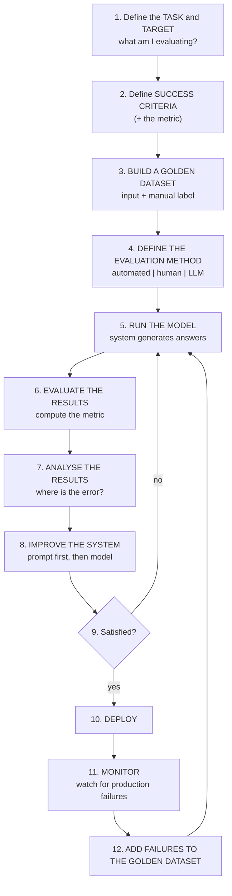
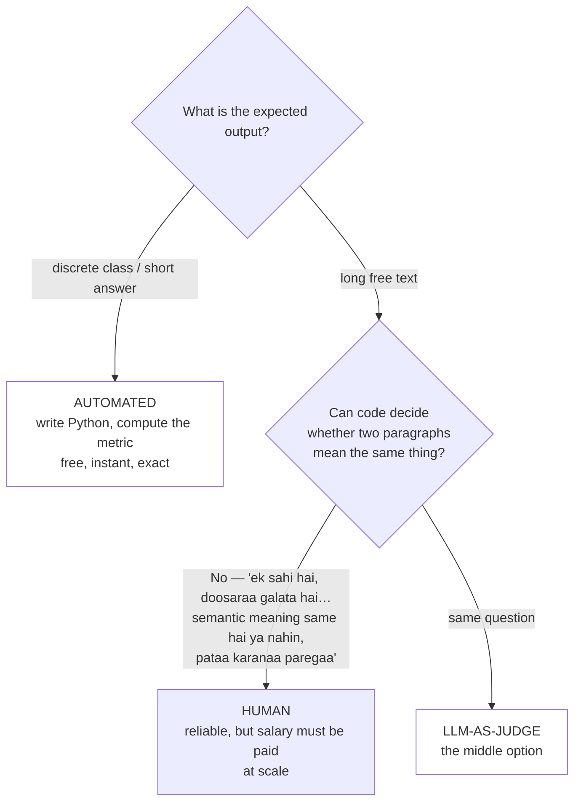

# CS-04 · How to Evaluate an LLM Application: The Complete Workflow

> **Source transcript:** `How_to_Evaluate_LLM_Applications_The_Complete_Workflow_CampusX.txt` (Hinglish, 381 lines, 20,892 chars, runtime ≈ 16:58)
> **Domain:** foundations
> **One-liner:** The canonical 12-step evaluation loop — define task → success criteria → build a golden dataset → choose an evaluation method → run → evaluate results → analyse → improve → iterate → deploy → monitor → feed production failures back into the dataset — demonstrated end to end on a Zomato email-router.
> **Prerequisites:** CS-01 (model vs application evals), CS-02 (playlist map), CS-03 (why multiple pipelines)

---

## 0. Executive summary

- **The disclaimer first:** from this lecture onward, everything is taught "actually application eval ke perspective se… model eval ke perspective se nahin" `[0:28]`–`[0:41]`.
- **The workflow is the deliverable.** "Ye jo flow abhee main aapako bataane vaalaa hoon naa, yahee flow isa poore course men aapa baara-baara dekhoge" — you will see this same flow again and again throughout the course `[3:36]`–`[3:43]`.
- **The flow, in the source's own sequence** `[14:31]`–`[15:04]`: define task and target → define a success criteria → build a dataset → define an evaluation method → run the model → evaluate the results → analyse the results → improve the system → iterate → when satisfied, deploy → monitor → take the failures and make them part of the dataset → repeat forever.
- **The running example is deliberately trivial:** an email-classification/routing system for **Zomato** that reads an incoming email and routes it to **billing**, **technical**, or **customer support** — "aapa literally 5–10 minute men banaa sakte ho" `[1:18]`–`[3:16]`.
- **Success criteria = classification; metric = accuracy.** "If out of 100 queries it routes 90 to the right place, then this system is **90% accurate**" `[4:34]`–`[5:06]`.
- **Golden dataset, defined here.** A two-column artefact: email/message content on one side, the manually assigned label on the other. The source's example has **3 rows** for illustration but says you would normally create **50 to 500 rows**, and that the best data is **your own past chats**, labelled by a human you sit down to do it `[5:09]`–`[6:34]`. "Isako vibe [LLM] evals kee language men **golden dataset** bolate hain" `[6:18]`–`[6:23]`.
- **Three evaluation methods, and how to choose** `[6:41]`–`[9:02]`: **automated** (write Python that computes accuracy — correct here because the output is a discrete class), **human** (correct when outputs are long free text, but "phaalatoo men usako salary denee padegee" — you have to pay a salary), **LLM-as-judge** (the middle option: "aapa LLM ke throo ye testing kara sakte ho").
- **The iteration numbers from the running example** `[10:07]`–`[12:41]`: 80% after the first run (100 rows sent, 80 correct, 20 wrong) → **90%** after a prompt fix → **95%** after switching to a heavier LLM. Manager happy, stop.
- **The loop does not close at deployment.** Monitor for production failures, then **add the failing instance back into the golden dataset** and re-run everything: "production ke jo failures hote hain, unako kahaan para daalate ho? Vaapasa jaake apane data set men" `[13:33]`–`[14:11]`.
- **The closing rule, marked as the lecture's key takeaway:** "One LLM based application **may have several LLM evals**" — a RAG app typically runs a retriever eval, an embedding-model eval, a whole-workflow eval, and a latency eval simultaneously `[15:41]`–`[16:58]`.

---

## 1. The problem this lecture solves

The prior lectures established *why* evals matter, *what* they are, and *why* one pipeline is never enough. None of them gave a **procedure**. This lecture supplies it, and it does so on the smallest possible example on purpose: "ham ekdama simplest possible example ke saatha aage badhenge" `[3:11]`–`[3:16]`.

The stakes are framed by the rhetorical question right after the system is built: "Ab aataa hai asalee savaal — kyaa hum isako directly deploy kara den? **Nahin.** Yahee to hamane abhee taka discuss kiyaa hai. Hamein deploy nahin karanaa hai. Usake pahale hamein kyaa karanaa hai? **Isa system ko evaluate karanaa hai**" `[3:16]`–`[3:32]`.

Two claims make this lecture load-bearing:

1. **The flow is universal.** "Ye to bahuta simple application hai. Eka bahuta complex agent ke lie bhee aapako yahee workflow use karanaa hai" `[3:40]`–`[3:45]`, restated at `[14:22]`–`[14:31]`: "the same flow you will see applied on RAGs as well; the same flow applies to agents as well."
2. **The loop is the point, not the score.** The source walks the accuracy from 80 → 90 → 95 by changing *different things at each iteration*, which is what makes the loop a debugging instrument rather than a grade.

---

## 2. Definitions & mental models

| Term | Definition (source's words) | Why it matters |
|---|---|---|
| **Task and target** | Step 1: "aapa kyaa cheeja ko evaluate karanaa chaahate ho?" — what do you want to evaluate? Here the target is "isa pooraa workflow", the whole routing system `[3:49]`–`[4:08]` | You cannot evaluate "the app"; you evaluate a named target |
| **Success criteria** | Step 2: "what is the success criteria?" for this use case `[4:22]`–`[4:32]`. Here: **classification** `[4:51]`–`[4:53]` | The criteria is *what correct means*, not a number |
| **Metric** | The thing you compute to know whether the criterion is met. Here: **accuracy score** `[4:58]`–`[5:03]` | Criteria and metric are distinct steps in the source's flow |
| **Golden dataset** | The labelled evaluation set you build: "email ka content… aur doosaree side men aapane manually khud se bataa rakhaa hai ki usakaa type kyaa hai" `[5:19]`–`[5:36]`. "Isako vibe [LLM] evals kee language men golden dataset bolate hain" `[6:18]`–`[6:23]` | The frozen artefact that makes the loop repeatable |
| **Evaluation method** | Step 4: who performs the evaluation — "yaa to automated tareeke se ho jaaegaa, yaa phira koee human karegaa, yaa phira aapa kisee doosare LLM ko use kara sakte ho" `[6:38]`–`[6:58]` | The choice that determines cost and feasibility |
| **Run the model** | "Yaha aapane jo system banaayaa usamen aapa apane dataset ko bheja doge aur aapakaa system answers generate karegaa" `[9:42]`–`[9:55]` | Produces predictions to compare |
| **Analyse the results** | "Aapa sochane kee koshish karate ho ki kahaan pe galatee ho rahee hai… skopa of improvement kahaan para hai?" `[10:19]`–`[10:46]` | Turns a number into a diagnosis |
| **Improve the system** | "Yahaan pe **model** naheen honaa chaahie, yahaan pe **system** honaa chaahie. You try to improve the system" `[11:53]`–`[12:02]` | The most important wording in the lecture — fix the system, not just the model |
| **The loop** | build dataset → run → evaluate → analyse → improve → repeat, "sarkal men… loop men kaam karate chale gae" `[12:41]`–`[12:53]` | Why repeatability (CS-01) exists |

### Mental model: the complete workflow `[3:47]`–`[15:06]`



The source's own one-line summary of the loop at the end: "Define task and target → define a success criteria → build a dataset → define an evaluation method → run the model → evaluate the results → analyse the results → improve the model → iterate → when you are satisfied, deploy → monitor → galatee ho rahee hai, galatee jisa cheeja pe ho rahee hai usako dataset kaa part banaa do → dobaaraa se evaluate karo → and you keep doing it forever, jaba taka aapakaa system deployment men hai" `[14:31]`–`[14:59]`.

**Analyst note:** The source says "improve the model" in the rapid recitation at `[14:43]` but "improve the **system**" in the detailed walkthrough at `[11:53]`–`[12:02]`. The detailed version is the intended one, and it matters: the lecture's own iteration history changes the prompt first and the model second, which is only "improving the system".

---

## 3. Core content, decomposed

### Band A — The scenario and why it must be evaluated

#### 3.1 The Zomato email-routing system `[1:18]`–`[3:16]`

- **Setting:** "We are working for a company… let's say the company is **Zomato**" `[1:22]`–`[1:28]`.
- **The business problem** `[1:28]`–`[1:43]`: they receive a lot of emails on a daily basis because it is a big company with many customers, and replying to these emails manually is difficult.
- **The desired system** `[1:43]`–`[2:45]`: a system that **reads** the emails and, based on the content, **classifies** them — is the customer asking a **billing-related** question, or does he have a **technical** problem, or is it a **general query**? The value of the classification is routing: a billing-related query goes straight to the **billing team**, a technical query to the **technical team**, a general query to the **customer support team**. "Mujhe yahaan para koee bandaa naheen chaahie jo manually ina emails ko read karake meree teams ko tag kare. Isa process ko main automate karanaa chaaha rahaa hoon."
- **What was built** `[2:47]`–`[3:16]`: "Hamane ek bahuta simple saa system banaayaa. Hamane ek LLM ko bithaa diyaa" — an LLM with a prompt: "you are this customer agent who will read the email and decide where to route it." Email in, routing decision out.
- **The build cost, stated as a scale signal:** "Bahuta hee simple LLM application hai. Matlab aapa literally 5–10 minute men banaa sakte ho usako" `[3:12]`–`[3:16]`.
- **Analyst note:** The scenario is chosen so that the *correct answer is a discrete label*. That is what makes the evaluation method automated in step 4. The lecture then uses the same flow to explain why a chatbot could not be evaluated the same way `[8:01]`–`[9:02]` — so the "simple" choice is pedagogically deliberate, not lazy.

### Band B — The twelve steps

#### 3.2 Step 1 — Define the task and target `[3:47]`–`[4:22]`

- **What the source says:** "Workflow men sabase pahalaa kaam jo aapako karanaa hotaa hai ki you have to **define the task and target**. Aapa kyaa cheeja ko evaluate karanaa chaahate ho? Aapako sabase pahale ye define karanaa hotaa hai."
- **In this case** `[3:59]`–`[4:19]`: "Isa case men hamen isa system ko yaa phira isa workflow ko evaluate karanaa hai… aur evaluation kaa task kyaa hai? It's a simple classification task. Hamen yaha check karanaa hai ki kyaa yaha system sahee se classification kara paa rahaa hai yaa naheen."
- **Numbers:** none. "Step number one."

#### 3.3 Step 2 — Define a success criteria (and the metric) `[4:22]`–`[5:06]`

- **What the source says:** "Step number two men aapa kyaa karate ho ki aapa apane evaluation ke lie eka **success criteria** define karate ho. Can you tell me, isa particular use case ke lie what is the success criteria? How would we know ki yaha system sahee se kaam kara rahaa hai?"
- **The answer given in the room:** "The answer is **accuracy**. Simple si baat hai. Agar isako 100 queries di, isane unamen se 90 queries ko sahee jagaha para agar route kara diyaa, to… **this system is 90% accurate**" `[4:34]`–`[4:51]`.
- **The two-step decomposition, stated explicitly** `[4:51]`–`[5:06]`: "Isa particular system men aapakaa **success criteria** is **classification**. Aur jo **metric** hai jisake basis pe hum pataa karenge ki classification sahee se ho rahaa hai ki naheen, vo hai **accuracy**."
- **Numbers:** the illustrative pass rate is **90 out of 100** queries routed correctly = **90% accuracy** `[4:42]`–`[4:51]`.
- **Analyst note:** Keeping "success criteria" and "metric" as separate steps is not pedantry. The criteria is *classification correctness*; the metric is *accuracy*. If the use case were a chatbot, the criteria would be something like "the answer is faithful and helpful" and the metric could not be accuracy — which is exactly the fork the lecture takes in step 4.

#### 3.4 Step 3 — Build a golden dataset `[5:09]`–`[6:34]`

- **Structure** `[5:19]`–`[5:36]`: on one side, "aapakaa message hai yaa aapakaa email kaa content hai"; on the other side, "aapane manually khud se bataa rakhaa hai ki usakaa type kyaa hai".
- **The source's three illustrative rows** `[5:36]`–`[5:50]`:

| # | Email content | Manually assigned label |
|---|---|---|
| 1 | "My card was charged twice" | **Billing issue** — "to disa ija a billing issue" |
| 2 | "The app crashes on login" | **Technical issue** — "disa ija a technical issue" |
| 3 | "What are your hours?" | **General issue** — "to yaha general issue hai" |

- **The size guidance** `[5:48]`–`[5:59]`: "Yahaan pe to chalo maine sirf three rows kaa data banaayaa hai. **Generally aapa 50 to 500 rows kaa ek data create karoge.**"
- **Where the data should come from** `[5:59]`–`[6:18]`: "Besta to hai ki aapa apanaa actual data leke aao. So if this is Zomato, to aapa apane **past chats** ko uthaa ke laao, aur usase dataset create karo, aur yaha **labelling** bhee aapa manually karo. Kisee ko bithaa ke ye label karavaa lo."
- **The name** `[6:18]`–`[6:23]`: "Isako vibe [LLM] evals kee language men **golden dataset** bolate hain."
- **Numbers:** **3 rows** in the illustration; **50 to 500 rows** as the normal range. No inter-annotator or quality numbers are given.
- **Analyst note:** Two design choices in this step deserve flagging. First, the source insists the data be *your own* — past chats, not a public dataset — which is what makes the eval measure your application rather than someone else's. Second, the labelling is explicitly manual and assigned to a person; the source offers no labelling-guideline or agreement process, so a practitioner should supply one (`**Analyst note (outside source):** double-labelling a sample and measuring agreement is the standard way to make labels trustworthy).

#### 3.5 Step 4 — Define an evaluation method `[6:34]`–`[9:02]`

- **The question** `[6:38]`–`[6:41]`: "Basically aapa yaha decide karate ho ki **evaluation karegaa kauna?**" Three options: "yaa to **automated** tareeke se ho jaaegaa, yaa phira koee **human** karegaa, yaa phira aapa kisee doosare **LLM** ko use kara sakte ho evaluation perform karane ke lie."
- **The mechanism of evaluation, spelled out** `[6:58]`–`[7:37]`: you take the system you built and send the dataset into it. For each message the system produces an answer — "let's say for the first one it said *billing*, for the second it said *general*, and for the third it said *general*." Then you **compare** predictions against labels and **calculate the accuracy** of the system.
- **Why automated wins for this case** `[7:37]`–`[8:01]`: "Isa case men aapa kisee human ko kyon bithaaoge? Phaalatoo men usako salary denee padegee. LLM ko bhee laane kee jaroorat naheen hai. Aapa simply ek **Python code** likh do jo check kara legaa ki accuracy score kitanaa hai. To isa case men aapakaa jo eval method hai vo **automated** hai."
- **Why automated does not always work — the contrast case** `[8:01]`–`[8:43]`: imagine it were a **chatbot**. Expected output would be a long textual answer; the LLM's output would also be a long textual answer. "To ab una donon text ko compare kisase karate?… Kyaa automated tareeke se do paragraphs ko aapa compare kara sakte ho ki sahee hai ki naheen? **Is it possible?** Nahi hai possible. **Ek sahi hai, doosaraa galata hai** — yaha code ke throo pataa karanaa bahuta mushkila hai, because **semantic meaning same hai ya nahin hai, pataa karanaa paregaa**."
- **Why not just always use a human** `[8:43]`–`[8:50]`: "Human ko bithaa sakte ho bata human would be costly. Agar mujhe bahuta saaraa testing karanaa hai to human ko salary denaa paregaa."
- **The third option** `[8:48]`–`[9:02]`: "Third option is beecha kee cheeza — **LLM**. Aapa LLM ke throo ye testing kara sakte ho."
- **The rule** `[8:53]`–`[9:02]`: "Isa point pe aapake paas ek evaluation method honaa chaahiye. It can be automated, it can be a human, and it can be LLM." *(This is the reference-free LLM-as-a-judge idea, developed properly in CS-07 and CS-08.)*

**Decision table for step 4:**

| Output type | Automated | Human | LLM-as-judge |
|---|---|---|---|
| Discrete class / short extractable answer | **Correct choice** — "simply write Python code" `[7:49]` | Wasteful — "phaalatoo men usako salary denee padegee" `[7:45]` | Unnecessary — "LLM ko bhee laane kee jaroorat naheen" `[7:47]` |
| Long free text | **Impossible** — "ek sahi hai, doosaraa galata hai… code ke throo pataa karanaa bahuta mushkila hai" `[8:30]`–`[8:35]` | Possible but costly at scale `[8:43]` | The middle option `[8:48]`–`[8:52]` |

#### 3.6 Step 5 — Run the model `[9:42]`–`[9:55]`

- **What the source says:** "Run the model ka simple matlab kyaa hai? Ki yaha aapane jo system banaayaa usamen aapa apane dataset ko bheja doge, aur aapakaa system answers generate karegaa. This is the step."
- **Analyst note:** "Run the model" is the source's label; in this case the thing being run is the whole application (LLM + prompt + routing logic), not a bare model. That distinction is the whole subject of CS-01 §3.4.

#### 3.7 Step 6 — Evaluate the results `[9:57]`–`[10:19]`

- **What the source says:** "Aapake paas ek Python code hai jo aapako accuracy score calculate karake de rahaa hai isa step men."
- **The worked number** `[10:07]`–`[10:19]`: "Maana lo aapakaa accuracy aayaa **80%**. Let's say aapane **100 rows** bheje. 100 men se 80 men hee sahee se classification huaa. **20 men galatee ho gaee.**"

#### 3.8 Step 7 — Analyse the results `[10:19]`–`[11:41]`

- **What the source says:** "What you do is you **analyse the results**. Which basically means ki aapa sochane kee koshish karate ho ki kahaan pe galatee ho rahee hai… **skopa of improvement kahaan para hai?** Kyaa cheeja improve kara sakte ho? Kahaan pe galatee ho sakatee hai?"
- **The two candidate root causes the source names** `[11:06]`–`[11:41]`:
  1. **The system prompt.** "Sabse pahale aapa apanaa **system prompt** theek kara sakte ho. Ho sakataa hai aapakaa system prompt isa tareeke se defined hai ki vo **billing aur technical men confuse** ho jaa rahaa hai." — the prompt is defined in a way that makes it confuse billing with technical.
  2. **The model is too weak.** "Jo aapa model use kara rahe ho, jo aapa LLM use kara rahe ho vo naheen kar paa rahaa hai. Aapane lo-parameter vaalaa model le liyaa, open-source model le liyaa, aur vo naheen kar paa rahaa hai."
- **The order matters** `[11:34]`–`[11:41]`: "Yahaan pe bahuta jyaadaa scope of improvement hai naheen… Let's say system prompt hai. Model ko change karanaa is one more thing."
- **Analyst note:** The two causes correspond to the two things the workflow makes swappable. Because the golden dataset is fixed, you can attribute the delta to whichever one you changed — which is precisely the "repeatable" property from CS-01 §3.1 turning into a debugging tool.

#### 3.9 Step 8 — Improve the system `[11:41]`–`[12:07]`

- **The narrative** `[11:41]`–`[11:53]`: "Aapake paas aapake evaluation kaa result aa gayaa hai. 80% accuracy. Aapake manager ne bolaa 'improve karo bhaaee, kyaa kara rahe ho?' To ab aapa jaake prompt ko tweak kara rahe ho yaa phira model ko change kara rahe ho."
- **The rule, stated as a correction** `[11:53]`–`[12:02]`: "Aur aapa kyaa karate ho? Basically apane **system** ko improve karate ho. **Yahaan pe model naheen honaa chaahie, yahaan pe system honaa chaahie.** You try to improve the system."
- **Analyst note:** This is the sharpest sentence in the lecture and it is easy to miss in the romanized text. It says the unit of improvement is the *system* — prompt, retrieval, routing logic, guardrails — and the model swap is one lever among several, not the default. See CS-03 §3.7 for the same lesson expressed as an architectural fix (adding a reranker).

#### 3.10 Step 9 — Iterate, with the source's own numbers `[12:02]`–`[12:53]`

- **Why iterating is possible at all** `[12:07]`–`[12:13]`: "Yahaan para I guess aapako vo baata samajha men aa rahee hai jaba maine thodee dera pahale bolaa ki **LLM evals are repeatable**." With a golden dataset you keep re-running as you change the system.
- **The three measured iterations** `[12:13]`–`[12:41]`:

| Iteration | What changed | Accuracy |
|---|---|---|
| 1 | baseline | **80%** |
| 2 | "prpa chenja karake aae" — changed the **prompt** | **90%** |
| 3 | "LLM chenja kara dete hain, bhaaree vaalaa LLM lagaa dete hain" — switched to a **heavier LLM** | **95%** |

- **The stopping condition** `[12:38]`–`[12:41]`: "Now your manager is happy. To ab aapa banda kara doge."
- **The loop description** `[12:41]`–`[12:53]`: "Basically you iterate in this step. Dataset ban gayaa hai, model ko liyaa, dataset pe chalaayaa, results aae, evaluate kiyaa, analyse kiyaa, improvements kie — **sarkal men ye kaam karate chale gae, loop men kaam karate chale gae.**"

#### 3.11 Step 10 — Deploy when satisfied `[12:43]`–`[13:06]`

- **What the source says:** "Eventually you reach a place jahaan pe aapako lagataa hai ki ab meraa system is **worthy** [of] deploying. Main ab isako deploy kara sakataa hoon. Then what you do is you actually go on and deploy your system online."

#### 3.12 Step 11 — Monitor `[13:06]`–`[13:32]`

- **The rule:** "Deploy hone ke baada bhee aapakaa kaam khatma naheen hotaa." Deployment does not end the work.
- **What you do:** "Vahaan pe aapakaa kaam kyaa hotaa hai? Aapa **monitor** karane lagate ho." The source adds, almost as an aside, that a system can be deployed without monitoring — "monitoring ke binaa system online bhee phela [fail] kara sakataa hai" — so you monitor **consistently**.
- **What you are looking for** `[13:20]`–`[13:32]`: "Kyaa production men failures ho rahe hain ki naheen? Aapakaa system **95% accuracy** thaa aapake test dataset ke oopar, **bata jaba nayaa data usako milaa** kisee customer kaa, to vahaan para vo galatiyaan karane laga gayaa."
- **Numbers:** the source re-uses **95%** as the offline accuracy, and gives no production failure rate.
- **Analyst note:** The 95%-offline / degraded-online gap is exactly the generalisation gap that CS-06's offline-vs-online split addresses. The source treats it as expected, not as an anomaly.

#### 3.13 Step 12 — Feed production failures back into the golden dataset `[13:33]`–`[14:22]`

- **The mechanism** `[13:33]`–`[13:57]`: "Yahaan pe ek important step hotaa hai ki jo aapake production men failures hain… ek particular email aayaa, usako billing bolanaa chaahie tha par usako technical bolaa mere model ne. To main kyaa karunga? **Usa particular instance ko, usa email ke content ko uthaaooongaa aur usako jaakara ke main apane isa dataset men add kara doongaa** — mere golden dataset men. Aur phir main dobaaraa se ye pooraa step restart karoongaa."
- **The generalisation** `[14:00]`–`[14:15]`: "So hotaa kyaa hai ki production ke jo failures hote hain, unako kahaan para daalate ho? Vaapasa jaake apane dataset men. To isa tareeke se aapakaa jo golden dataset hai vo **aur rich hotaa jaataa hai**, aur golden dataset ke oopara aapa aur improve karate jaate ho apane model ko aur deploy karate jaate ho."
- **The name for this** `[14:15]`–`[14:22]`: "Basically this is a proper baraa sa loop jisake andara ye pooraa kaa pooraa evaluation **consistently** chalataa hai."
- **Analyst note:** This is a **flywheel**, and it is the same pattern as "data flywheel" in production ML. The key operational detail the source supplies is that the *trigger* is a production failure observed in monitoring, and the *action* is a dataset append followed by a full re-run — not a hotfix.

#### 3.14 The monitoring design question `[15:06]`–`[15:41]`

The source poses a concrete case that shows how the feedback loop is actually wired in an organisation:

- "Main ek customer hoon. Maine ek email kiyaa aur essentially it was a **billing issue**, bata mujhe **redirect kar diyaa gayaa technical team** ke paasa." The technical team followed up, and the customer said "mujhe to aapase matlab hee naheen, mujhe to billing se matlab hai."
- "To yahaan pe ek **process set up hogaa** ki technical team jaake **flag** kara degee isa case ko — ki hamen galata information bhejaa gayaa. To vo dataset men add hotaa chalaa jaaegaa. To vo ek **monitoring system** vahaan pe place hotaa hai."
- **Analyst note:** The design point is that the feedback signal does not come from the customer directly; it comes from the *downstream team that received the misrouted item*, via an explicit flagging process. If you build this system, the flag action must exist as a feature, or the flywheel never turns.

### Band C — The rule this lecture is really teaching

#### 3.15 "One LLM-based application may have several LLM evals" `[15:41]`–`[16:58]`

- **What the source says, verbatim, flagged as the key line:** "**Ye line parho guys. This is a very important line: 'One LLM based application may have several LLM evals.'**"
- **What it means:** "Aisaa ho sakataa hai ki aapakaa ek RAG application aapane banaayaa, bata usa ek RAG application ke oopara aapa **multiple evaluations** run kara rahe ho. Like ye ek single evaluation thaa naa, bata aisaa ho sakataa hai ki aapakaa ek **single LLM application** ke oopara aapa **multiple evals** run karo."
- **The RAG instantiation given** `[16:11]`–`[16:36]`:
  1. one evaluation to test the **retriever's** performance
  2. a separate evaluation to check the **embedding model's** performance
  3. a separate eval to test the **whole RAG workflow**
  4. a separate eval to check the **whole system's latency**
- **The conclusion** `[16:36]`–`[16:55]`: "Generally kyaa hotaa hai ki ek LLM based application kaa hameshaa ek se jyaadaa evals run karate hain. Abhee jo maine aapako example diyaa usamen maine sirf eka eval ke baare men bataayaa. Bata generally aapako aisaa dekhane ko milegaa ki eka single application ke oopara **multiple evals** run kie jaate hain. Ye ek bahut important point hai. Ye aapako yaad rakhanaa hai."

**Analyst note:** §3.15 is CS-03's thesis restated as a takeaway. Read together: CS-03 supplies the *argument* (multiple failure points + multiple risk categories), and CS-04 supplies the *procedure* and the one-line mnemonic.

---

## 4. Frameworks & decision procedures

### 4.1 The twelve-step workflow, as a checklist

| # | Step | Source | Output artefact |
|---|---|---|---|
| 1 | Define the task and target | `[3:49]` | A named target: here, "the whole routing workflow" |
| 2 | Define a success criteria (+ metric) | `[4:22]` | Criteria: classification correctness. Metric: accuracy |
| 3 | Build a dataset | `[5:16]` | **Golden dataset**: 50–500 labelled rows from your own past data |
| 4 | Define an evaluation method | `[6:34]` | automated \| human \| LLM |
| 5 | Run the model | `[9:42]` | System predictions over the dataset |
| 6 | Evaluate the results | `[9:57]` | A metric value (e.g. 80%) |
| 7 | Analyse the results | `[10:19]` | A ranked list of improvement candidates |
| 8 | Improve the **system** | `[11:53]` | A changed prompt / model / component |
| 9 | Iterate | `[12:02]` | Re-run on the *same* dataset; 80 → 90 → 95 |
| 10 | Deploy when satisfied | `[12:43]` | Online system |
| 11 | Monitor | `[13:06]` | Production failure signal |
| 12 | Add failures to the dataset and re-run | `[13:33]` | Richer golden dataset → back to step 5 |

### 4.2 Choosing the evaluation method



### 4.3 Improvement priority order

1. **System prompt** — cheapest, most likely cause of confusion between similar classes `[11:08]`–`[11:17]`
2. **Model** — only after the prompt; "model ko change karanaa is one more thing" `[11:38]`–`[11:41]`
3. Anything else in the system — the source's rule is "here it should be *system*, not *model*" `[11:55]`–`[11:58]`

### 4.4 The eval inventory for the Zomato router (and its generalisation)

| Eval | Level | Metric | Method | Source |
|---|---|---|---|---|
| Routing accuracy | application/workflow | accuracy | automated | `[4:58]`, `[9:57]` |
| *(generalised)* retriever performance | component | — | — | `[16:17]` |
| *(generalised)* embedding model performance | component | — | — | `[16:23]` |
| *(generalised)* whole workflow | workflow | — | — | `[16:29]` |
| *(generalised)* whole-system latency | application | — | — | `[16:36]` |

---

## 5. Worked end-to-end example

The source's own worked example, carried all the way through, is the **Zomato email router**. This is the complete trace with the source's numbers:

**Scenario** `[1:18]`–`[2:45]`: Zomato receives many customer emails daily. Manual triage is hard. Build a system that reads each email and classifies it as **billing**, **technical**, or **general**, and routes it to the billing team, technical team, or customer support team respectively.

**System built** `[2:47]`–`[3:16]`: one LLM plus a prompt describing it as a customer agent that reads an email and decides where to route it. Build time: 5–10 minutes.

**Step 1 — Task and target** `[3:49]`: evaluate the routing system; the task is a simple **classification** task.

**Step 2 — Success criteria and metric** `[4:22]`–`[5:03]`: success criterion is **classification**; metric is **accuracy**. Definition used: 100 queries, 90 routed to the right place ⇒ 90% accurate.

**Step 3 — Golden dataset** `[5:09]`–`[6:34]`:

| Email content | Label |
|---|---|
| "My card was charged twice" | billing issue |
| "The app crashes on login" | technical issue |
| "What are your hours?" | general issue |

Ideal size **50–500 rows**, built from Zomato's **past chats**, labelled manually.

**Step 4 — Evaluation method** `[6:34]`–`[8:01]`: **automated**. Because the output is a class, a simple Python script computes accuracy. No human salary; no LLM needed. Contrast: if the system were a chatbot producing long text against a long reference answer, automated comparison is impossible — "ek sahi hai, doosaraa galata hai" and detecting that needs semantic comparison — so you would use a human (costly) or an LLM (the middle option).

**Step 5 — Run** `[9:42]`: feed the dataset into the system; it emits a routing decision per row.

**Step 6 — Evaluate** `[9:57]`–`[10:19]`: **100 rows sent, 80 classified correctly, 20 wrong ⇒ 80% accuracy.**

**Step 7 — Analyse** `[10:19]`–`[11:41]`: where is the error? Two candidates — (a) the system prompt is written such that the model **confuses billing with technical**; (b) the model chosen is a **low-parameter / open-source** one that simply cannot do it. Priority: prompt first; model is "one more thing".

**Step 8 — Improve the system** `[11:53]`: change the prompt. "Yahaan pe model naheen honaa chaahie, yahaan pe system honaa chaahie."

**Step 9 — Iterate** `[12:13]`–`[12:41]`: re-run on the **same** golden dataset. Prompt change ⇒ **90%**. Manager still wants more. Swap in a **heavier LLM**, re-run ⇒ **95%**. Manager happy. Stop.

**Step 10 — Deploy** `[12:43]`–`[13:06]`: the system is judged "worthy" and goes online.

**Step 11 — Monitor** `[13:06]`–`[13:32]`: 95% offline, but when real customer data arrives it starts making mistakes. You monitor consistently for production failures.

**Step 12 — Close the loop** `[13:33]`–`[14:15]`: a specific email should have been labelled *billing* and the model said *technical*. Take that email's content, **add it to the golden dataset**, and restart the whole procedure. The golden dataset gets richer; the system improves; you redeploy; repeat forever.

**The human process that makes step 12 work** `[15:06]`–`[15:41]`: when the technical team receives a misrouted billing email, there must be a process by which the technical team **flags the case** as "wrong information was sent to us". That flag is what feeds the dataset. "Vo ek monitoring system vahaan pe place hotaa hai."

**Thresholds:** the source gives **no target accuracy**. It stops when "your manager is happy" `[12:38]` — i.e. the shipping threshold is organisational, not technical. Numbers supplied: 3 rows (illustrative), 50–500 rows (normal dataset size), 100 rows sent (run size), and the accuracy ladder 80 → 90 → 95.

---

## 6. Pros, cons, exceptions

| Evaluation method | Pros | Cons | Works when | Fails when | Cost |
|---|---|---|---|---|---|
| **Automated** `[7:49]` | Free, instant, exact, deterministic; "simply write Python code" | Only possible when correctness is mechanically decidable | Output is a discrete class or a short extractable answer (the Zomato router) | Output is long free text — "ek sahi hai, doosaraa galata hai… code ke throo pataa karanaa bahuta mushkila hai" `[8:30]` | Effectively zero beyond engineering time |
| **Human** `[8:43]` | Handles semantic equivalence; no proxy error | "Phaalatoo men usako salary denee padegee" — at scale you must pay | High-stakes, small-volume, or calibration of the other two methods | You need a lot of testing — the source explicitly rules it out for scale `[8:46]` | Human salary (source gives no figure) |
| **LLM (judge)** `[8:48]` | The middle option — scalable like automation, semantic like a human | Source does not discuss its failure modes in this lecture (see CS-07, CS-08) | Long-text evaluation at scale | Never validated against human labels | Source gives no figures |

| Improvement lever | Pros | Cons | Works when | Fails when |
|---|---|---|---|---|
| **Fix the system prompt** `[11:08]` | Cheapest, fastest, addresses class confusion directly | Only helps if the model is capable enough | The model can do the task but is being misdirected | The model genuinely lacks the capability |
| **Swap the model** `[11:38]` | Large accuracy jumps possible (90% → 95% here) | Slower, more expensive; "model change karna is one more thing" | The prompt is already good and the model is low-parameter/open-source | You swap before fixing the prompt — you will not know what fixed it |

**Analyst note:** Because the source changes the prompt and the model in *separate* iterations on a *frozen* dataset, it can attribute each delta. Changing both at once is the common real-world mistake and makes the loop useless.

---

## 7. Failure modes & anti-patterns

1. **Symptom:** The team deploys straight after building.
   **Root cause:** Skipping steps 1–9; the build feels like the work `[3:16]`–`[3:32]`.
   **Detection:** Ask who signed off on a metric produced by the system.
   **Fix:** Make the eval loop a gate before deployment.

2. **Symptom:** The metric is meaningless — it goes up and down with no relationship to quality.
   **Root cause:** The evaluation method was chosen without checking the output type. Using automated string comparison on long free text `[8:01]`–`[8:40]`.
   **Detection:** Can you write the comparison in code in one function? If not, automated is wrong.
   **Fix:** Use a human for volume-small/high-stakes, or an LLM judge for scale `[8:48]`.

3. **Symptom:** The dataset measures a different product.
   **Root cause:** Data was not taken from your own past traffic, and labelling was not manual `[5:59]`–`[6:18]`.
   **Detection:** Does every row look like something a real user sent you?
   **Fix:** Sample your own past chats and have a person label them.

4. **Symptom:** You cannot tell what improved the number.
   **Root cause:** Multiple things changed between runs; the loop was not run on a frozen dataset `[12:07]`–`[12:13]`.
   **Detection:** Two variables differ between two runs.
   **Fix:** Change one lever per iteration; keep the dataset fixed.

5. **Symptom:** The system scores 95% offline and misclassifies in production.
   **Root cause:** The offline dataset does not represent live traffic; this is expected, not exceptional `[13:24]`–`[13:32]`.
   **Detection:** Compare the input distribution of production traffic against the golden dataset.
   **Fix:** Monitor and feed failures back (steps 11–12).

6. **Symptom:** Production failures happen but the dataset never grows.
   **Root cause:** No flagging process exists downstream — nobody tells you a misroute happened `[15:06]`–`[15:41]`.
   **Detection:** Is there a UI action or an alert that records "this was misrouted"?
   **Fix:** Build the feedback process, not just the monitor.

7. **Symptom:** You "fix" everything by swapping to a bigger model, expensively.
   **Root cause:** Skipping step 7's analysis; the source explicitly says the prompt is the first lever and model change is "one more thing" `[11:34]`–`[11:41]`.
   **Detection:** Your iteration history has only model changes.
   **Fix:** Change prompt first, re-measure, then consider the model.

---

## 8. Implementation notes

The source gives no code, but it describes the artefacts precisely enough to build them. The shapes:

**a) The golden dataset** — a two-column record, content plus human label `[5:19]`–`[5:36]`. Practical size **50–500 rows** `[5:50]`–`[5:54]`.

```jsonl
{"input": "My card was charged twice", "label": "billing"}
{"input": "The app crashes on login",  "label": "technical"}
{"input": "What are your hours?",      "label": "general"}
```

**b) The automated evaluator** — "simply ek Python code likh do jo check kara legaa ki accuracy score kitanaa hai" `[7:49]`–`[7:53]`. In shape:

```python
correct = sum(1 for row in results if row["prediction"] == row["label"])
accuracy = correct / len(results)
```

**c) The run step** — send the dataset into the system; the system produces one answer per row `[9:42]`–`[9:55]`; compare and compute `[9:57]`–`[10:05]`.

**d) The iteration ledger** — the lecture's own numbers are the template: run id, what changed, accuracy. Keeping it is what makes step 7 ("analyse") possible:

| run | prompt | model | accuracy |
|---|---|---|---|
| 1 | v1 | base | 80% |
| 2 | v2 | base | 90% |
| 3 | v2 | heavier | 95% |

**e) The monitoring hook** — a flagging path from downstream teams back into the dataset `[15:30]`–`[15:37]`: "technical team jaake flag kara degee isa case ko ki hamen galata information bhejaa gayaa. To vo dataset men add hotaa chalaa jaaegaa."

**f) The re-run contract** — after a dataset append, "dobaaraa se ye pooraa step restart karoongaa" `[13:52]`–`[13:57]`: the whole workflow re-runs, not just the new row.

**Named entities in this lecture:** Zomato (the example company) `[1:28]`. No library, framework, or API is named — not even for the "LLM as evaluator" option, which the source describes only as "aapa LLM ke throo ye testing kara sakte ho" `[8:50]`–`[8:52]`.

---

## 9. Interview-ready Q&A

**Q1. Walk me through your LLM application evaluation workflow.**
**Model answer:** Twelve steps. Define the task and the target — what exactly am I evaluating. Define a success criteria and the metric that measures it. Build a golden dataset of 50 to 500 labelled rows drawn from your own past traffic, labelled manually. Choose the evaluation method: automated, human, or LLM. Run the system over the dataset. Evaluate the results to get the metric. Analyse where the errors are. Improve the system. Iterate on the frozen dataset until satisfied. Deploy. Monitor for production failures. Then take each production failure, add it to the golden dataset, and restart the loop — forever, for as long as the system is deployed.

**Q2. Where do you get the data for the golden dataset?**
**Model answer:** From your own past traffic — the source's example is Zomato pulling its past customer chats — and the labelling is done manually, by sitting a person down to assign the labels. The size guidance given is 50 to 500 rows. The important property is that the rows look like what real users actually send you, because the whole point is to measure your application rather than a public benchmark.

**Q3. How do you choose between automated evaluation, a human, and an LLM judge?**
**Model answer:** It follows from the output type. If correctness is mechanically decidable — a discrete class, a short extractable answer — use automation; a Python script computing accuracy is free, instant, and exact, and there is no reason to pay a human or call an LLM. If the output is long free text evaluated against a long reference, automation is impossible because you would have to decide whether two paragraphs are semantically equivalent, which the source is explicit that code cannot do. Then it is a human, which is reliable but requires paying a salary at scale, or an LLM, which is the middle option.

**Q4. Explain the Zomato example and its accuracy progression.**
**Model answer:** The system reads a customer email and routes it to billing, technical, or customer support. Success criterion is classification; metric is accuracy. First run: 100 rows sent, 80 correct, 20 wrong — 80% accuracy. The analysis found the system prompt made the model confuse billing and technical, so the prompt was changed and re-run on the same dataset — 90%. Still not enough, so a heavier LLM was swapped in and re-run — 95%, and the iteration stopped. Notice the two different levers used in two separate iterations on a frozen dataset; that is what makes each delta attributable.

**Q5. What is the first thing you change when accuracy is low?**
**Model answer:** The system prompt. The source's order is explicit: first check whether your prompt is defined in a way that makes the model confuse the classes, and only after that consider whether the model itself is too weak — for instance a low-parameter or open-source model that cannot do the task. The framing sentence is "here it should not be *model*, it should be *system*; you try to improve the system." Swapping the model first is the expensive way to find out that your prompt was the problem.

**Q6. When does the evaluation work stop?**
**Model answer:** It never stops while the system is deployed. Deployment is step 10 of 12. After deployment you monitor consistently for production failures, and the source's framing is that monitoring is what lets you see that a system which was 95% accurate on your test dataset starts making mistakes on new customer data. Each failure then becomes step 12: take that specific instance and its content, add it to the golden dataset, and restart the whole workflow. The golden dataset gets richer over time.

**Q7. What organisational process does the feedback loop depend on?**
**Model answer:** A flagging process downstream of the routing decision. The source's example: a customer sends a billing issue, the system misroutes it to the technical team, the technical team follows up and the customer says "I don't care about you, I care about billing." For the dataset to learn from this, the technical team has to go and flag the case as "we were sent wrong information." Without that process the monitoring system produces no signal and the flywheel never turns.

**Q8. What does "one LLM based application may have several LLM evals" mean in practice?**
**Model answer:** It means the eval count is not one per application. In a RAG application you would typically run at least four: one to test the retriever's performance, a separate one to check the embedding model's performance, a separate one to test the whole RAG workflow, and a separate one to check the whole system's latency. The example in this lecture was a single eval only because the application was deliberately simple. Generally you will see multiple evals run on a single application.

**Q9 (trap). We deployed, and the model misclassifies some new emails. Should we retrain or swap the model?**
**Model answer:** Neither, as a first move. The workflow's step 12 is to take that specific failing instance, add its content to the golden dataset, and re-run the whole evaluation — and only then work through the improvement levers, where the prompt comes before the model. Retraining or swapping immediately treats a coverage gap as a capability gap. The failure may simply be a distribution the offline dataset never contained, in which case the fix is dataset coverage, and the re-run will tell you.

**Q10 (trap). Our expected outputs are long paragraphs, so we'll compare them to the reference with a similarity score and call it automated.**
**Model answer:** That is the case the source rules out. With two long paragraphs, one may be right and the other wrong, and detecting the difference in code means deciding whether the semantic meaning is the same — "yaha code ke throo pataa karanaa bahuta mushkila hai." A similarity score measures surface overlap, not correctness, and will happily score a fluent, wrong answer highly. The correct choice for long free text is a human, or the middle option, an LLM judge.

**Q11. What is the deliverable of step 2, and why separate criteria from metrics?**
**Model answer:** Step 2 produces a success criterion and the metric that operationalises it. In the Zomato case the success criterion is that the system classifies correctly, and the metric is accuracy, defined concretely as "if it routes 90 of 100 queries to the right place, it is 90% accurate." They are separate because the criterion is what "correct" means for this use case and the metric is how you count it — and for a different use case, like a chatbot, the criterion might be faithfulness while the metric could not be accuracy at all.

**Q12. Why is the golden dataset the load-bearing artefact rather than the metric?**
**Model answer:** Because it is what makes the loop repeatable. The source ties this explicitly back to the earlier definition of LLM evals as repeatable: you hold the dataset fixed while you change the system, so a move from 80 to 90 to 95 can be attributed to the specific change you made. It is also the artefact that accumulates: production failures flow into it, so it keeps getting richer, and the improvements compound on top of it rather than resetting each release.

---

## 10. Cheat sheet

```
THE COMPLETE LLM-APP EVAL WORKFLOW  (memorise the 12 steps)      [14:31]
  1  Define the task and target          WHAT am I evaluating?
  2  Define a success criteria (+ metric)
  3  Build a golden dataset              input + MANUAL label
  4  Define the evaluation method        automated | human | LLM
  5  Run the model                       system emits answers
  6  Evaluate the results                compute the metric
  7  Analyse the results                 where is the error?
  8  Improve the SYSTEM                  prompt first, model later
  9  Iterate                             re-run on the SAME dataset
 10  Deploy when satisfied
 11  Monitor                             production failures
 12  Add failures to the dataset, re-run
     -> repeat forever while deployed                            [14:54]

STEP 2 — CRITERIA vs METRIC
  success criteria = what "correct" MEANS     (classification)
  metric           = how you COUNT it         (accuracy)          [4:51]
  definition used: 90 of 100 routed right => 90% accurate         [4:42]

STEP 3 — THE GOLDEN DATASET
  size        : 3 rows shown; normally 50-500 rows                [5:50]
  source      : YOUR OWN past chats, not a public dataset         [5:59]
  labelling   : MANUAL - sit a person down to label               [6:12]
  example rows:
    "My card was charged twice"  -> billing
    "The app crashes on login"   -> technical
    "What are your hours?"       -> general                       [5:36]

STEP 4 — PICKING THE METHOD
  discrete class / short answer -> AUTOMATED (Python, accuracy)   [7:49]
  long free text                -> automation IMPOSSIBLE:
      "ek sahi hai, doosaraa galata hai... code ke throo pataa
       karanaa bahuta mushkila hai" (semantic meaning)            [8:30]
    then: HUMAN (reliable, but "salary denee padegee")  [8:43]
       or LLM  (the middle option)                                [8:48]

THE ITERATION LADDER (this example)                               [12:13]
  run 1  baseline                 -> 80%   (100 rows, 80 right, 20 wrong)
  run 2  changed the PROMPT       -> 90%
  run 3  swapped to a HEAVIER LLM -> 95%   -> manager happy, stop

IMPROVEMENT PRIORITY
  1 system prompt  (class confusion: billing vs technical)        [11:08]
  2 the model      ("model change karna is one more thing")       [11:38]
  RULE: "Yahaan pe MODEL nahin honaa chaahiye, yahaan pe SYSTEM
         honaa chaahiye."                                         [11:55]

THE FLYWHEEL (production -> dataset)                              [13:33]
  monitor -> find the failing instance -> add its content to the
  golden dataset -> restart the whole workflow. The dataset gets
  "aur rich" over time.
  REQUIRES an organisational flag: e.g. the technical team flags
  "hamen galata information bhejaa gayaa".                        [15:30]

THE CLOSING RULE
  "ONE LLM BASED APPLICATION MAY HAVE SEVERAL LLM EVALS."         [15:41]
  RAG example: 1 eval retriever | 1 eval embedding model |
               1 eval whole workflow | 1 eval whole-system latency [16:11]

NUMBERS IN THIS LECTURE
  build time      5-10 minutes for the example app                 [3:14]
  dataset size    3 (shown) / 50-500 (normal)                      [5:50]
  run size        100 rows                                         [10:13]
  accuracies      80% -> 90% -> 95%                                [12:13]
  latency / cost  none given
  TARGET ACCURACY: NOT GIVEN - you stop when "your manager is happy" [12:38]

TOP MISTAKES
  - deploying without running steps 1-9
  - using automated string comparison on free text
  - dataset not drawn from your own traffic
  - changing two levers in one iteration
  - swapping the model before fixing the prompt
  - monitoring without a flagging process, so the dataset never grows
```

---

## 11. Glossary

| Term | Meaning |
|---|---|
| **Task and target** | Step 1 of the workflow: the named thing you are evaluating `[3:49]` |
| **Success criteria** | What "correct" means for this use case (here: classification) `[4:22]` |
| **Metric** | The computed quantity that operationalises the criterion (here: accuracy) `[4:58]` |
| **Accuracy** | Source's definition: 90 of 100 queries routed correctly ⇒ 90% accurate `[4:42]` |
| **Golden dataset** | The manually labelled evaluation set you build from your own data `[6:18]` |
| **Labelling** | Manually assigning the correct class to each dataset row `[6:12]` |
| **Evaluation method** | Who or what performs the evaluation: automated, human, or LLM `[6:38]` |
| **Automated evaluation** | Metric computed by code; possible when correctness is mechanically decidable `[7:49]` |
| **LLM-as-judge** | Using a second LLM to perform the evaluation — the source's "middle option" `[8:48]` |
| **Run the model** | Feeding the dataset into the system to get predictions `[9:42]` |
| **Analyse the results** | Diagnosing where the errors are and what the scope of improvement is `[10:19]` |
| **Scope of improvement** | The source's phrase for the set of things you could change to improve accuracy `[10:41]` |
| **System prompt** | The instruction given to the LLM; the first improvement lever `[11:08]` |
| **Iterate** | Re-running the evaluation on the frozen dataset after changing the system `[12:02]` |
| **Monitor** | Post-deployment observation for production failures `[13:09]` |
| **Flywheel** | The source's "proper baraa sa loop": production failures feed the dataset, the dataset feeds improvement `[14:15]` |
| **Flagging** | The downstream-team process that reports a misrouted item so it can enter the dataset `[15:30]` |
| **Workflow (eval)** | The whole application pipeline being evaluated, in contrast to a single component `[3:52]` |

---

## 12. Cross-references

- **Builds on:** [CS-01 · Model evals vs application evals](CS-01-model-evals-vs-application-evals.md) (the definition of evals and the "repeatable" property this lecture invokes at `[12:07]`), [CS-02 · Playlist & curriculum map](CS-02-llm-evals-playlist-and-curriculum-map.md) (the golden-dataset + rubrics roadmap item), [CS-03 · Why multiple eval pipelines](CS-03-why-multiple-eval-pipelines.md) (the thesis this lecture restates as a closing rule)
- **Leads to:**
  - [CS-05 · Model evals & capabilities](CS-05-model-evals-and-capabilities.md) — the model-selection lever in step 8
  - [CS-06 · Offline vs online evals](../02-methods/CS-06-offline-vs-online-evals.md) — steps 9–11 formalised as offline and online evaluation
  - [CS-07 · LLM-as-a-judge, reference-based vs reference-free](../02-methods/CS-07-llm-as-a-judge-reference-based-vs-reference-free.md) — step 4's third option in depth
  - [CS-08 · G-Eval](../02-methods/CS-08-g-eval-deterministic-judge.md) — a specific deterministic judge framework
  - [CS-12 · Selecting the right LLM, custom model evals](../03-benchmarks/CS-12-selecting-the-right-llm-custom-model-evals.md) — the heavier-model swap of iteration 3, done properly
  - **CS-13 … CS-16** (Track B, `04-rag`) — the same workflow applied to RAG
  - **CS-17 … CS-19** (Track B, `05-agentic`) — the same workflow applied to agents
  - **CS-20 … CS-22** (Track B, `06-production`) — steps 11–12 at production scale
- **External:** Zomato is the only named entity. The source names no library, framework, or tool in this lecture.
