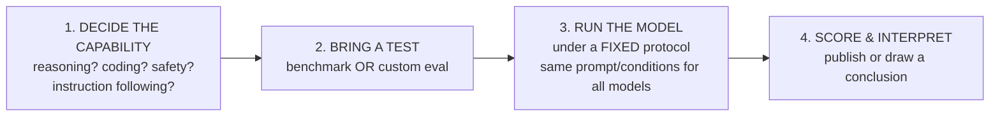
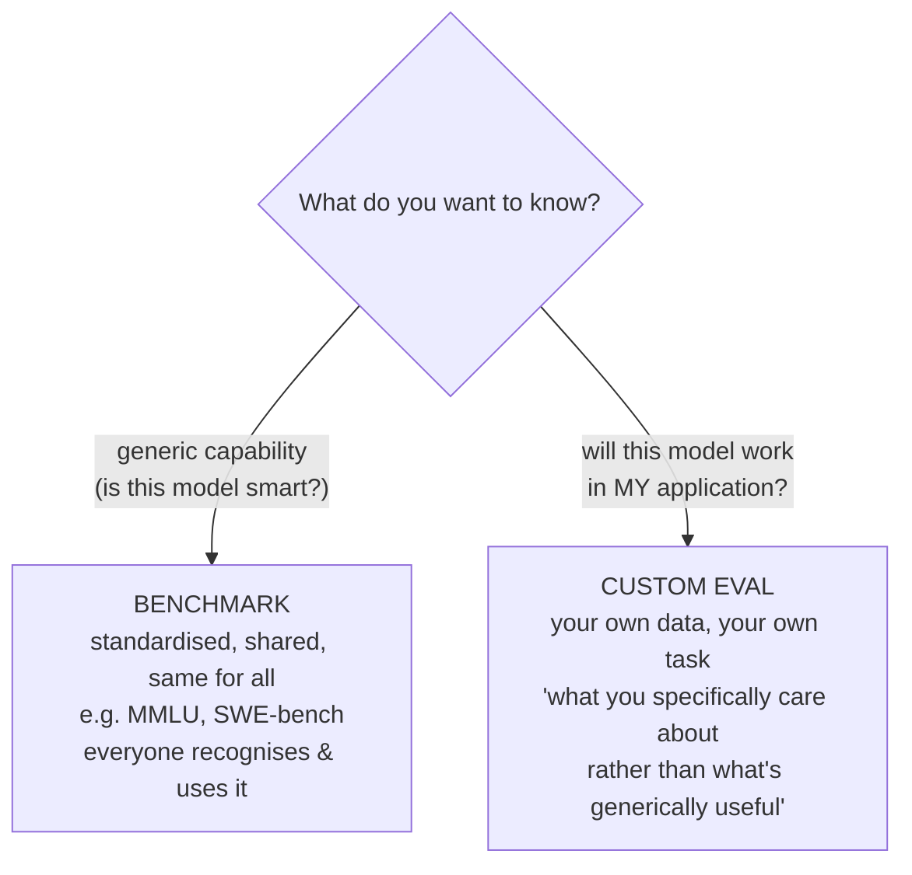
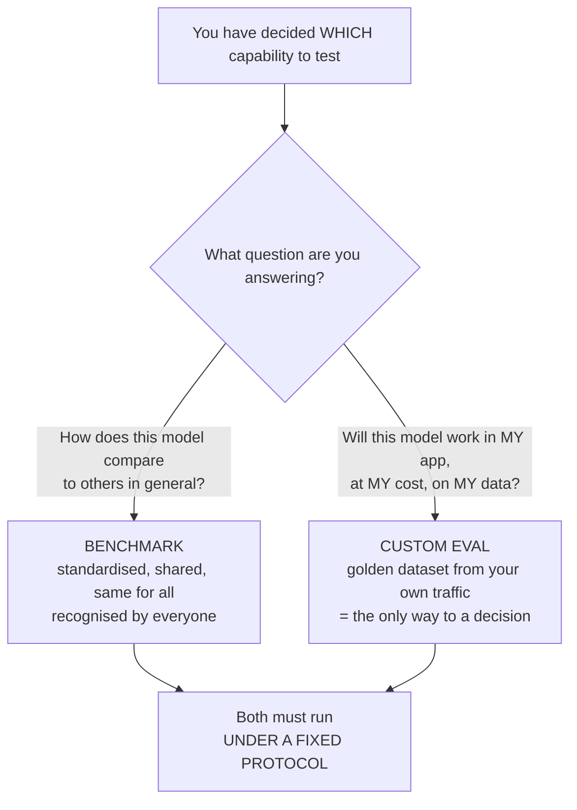

# CS-05 · LLM Model Evals & The Eight Core Capabilities

> **Source transcript:** `LLM_Model_Evals_Capabilities_CampusX.txt` (Hinglish, 901 lines, runtime ≈ 37:51)
> **Domain:** foundations
> **One-liner:** The bridge from application evals to model evals — why an AI engineer needs model evals (selection, upgrade tracking, safety, build-vs-buy), the formal definition and four-step anatomy of a model eval, the benchmark-vs-custom-eval fork proved with a Zomato cost/accuracy example, and the eight core LLM capabilities every benchmark targets.
> **Prerequisites:** CS-01 (model vs application evals), CS-04 (the complete workflow)

---

## 0. Executive summary

- **The pivot of the whole playlist.** Everything so far was application evals; this lecture stops and asks the question the earlier RAG discussion never asked: "hamane kabhee bhee ek single baar bhee ye discuss nahin kiya ki is RAG application ko chalaane ke liye jo LLM ham use karenge… usako ham kaise evaluate kar rahe hain, usako ham kaise select kar rahe hain" `[4:16]`–`[4:34]`.
- **Why capability measurement exists at all:** "model evals isliye exist karte hain so that we can measure the capabilities of our LLMs" `[2:48]`–`[2:58]`, justified by the aphorism the source cites: "**if you can't measure, you can't improve**" `[3:03]`–`[3:11]`.
- **The formal definition:** "Model eval is a systematic process of measuring an underlying model's capabilities, behaviour, reliability and operational characteristics under controlled conditions" `[8:46]`–`[8:57]`.
- **Every model eval is four steps** `[9:17]`–`[11:43]`: (1) decide *which capability* to test, (2) bring a test, (3) run the model on it under a **fixed protocol**, (4) score and interpret.
- **No single eval covers an LLM.** The human-IQ analogy is drawn explicitly: one IQ number says a lot about a person, but "unfortunately LLMs men aisa nahin hai — LLMs ki **har capability ke liye alag model eval** hota hai" `[9:51]`–`[10:02]`.
- **Two kinds of test, and the lecture's central proof:** **benchmarks** (standardised, shared, same for everyone — MMLU, SWE-bench) `[11:58]`–`[12:37]`, and **custom evals** (your own data, "what you specifically care about rather than what's generically useful") `[12:40]`–`[12:57]`.
- **The Zomato proof** `[14:20]`–`[18:12]`: Model A is top-of-leaderboard at **$15 / 1M tokens**; Model B is mid-table at **$0.50 / 1M tokens**. On your own golden dataset of **200–500 labelled emails**: classification accuracy **94% vs 91%**, urgency accuracy **88% vs 87%**, cost per **1,000 emails $6 vs $0.21**, latency **4.1 s vs** the cheaper model. "**If we had depended only on benchmarks, would we ever have reached this conclusion? No. In every benchmark, Model A beat Model B**" `[17:43]`–`[18:12]`.
- **Four reasons an AI engineer needs model evals** `[4:20]`–`[8:20]`: model selection/comparison, tracking whether new models actually improve, safety/hallucination/jailbreak, and the build-vs-buy hosting decision (proprietary API vs self-hosted open-source).
- **The eight core capabilities** `[21:10]`–`[36:15]`: knowledge & reasoning, coding & software engineering, mathematics, long context, vision & multimodal, agentic & tool use, safety & alignment, instruction following. "Most of the benchmarks you see in future target one of these eight categories" `[20:34]`–`[20:43]`.

---

## 1. The problem this lecture solves

Three lectures in, the playlist has covered the eval overview, the multiple-pipeline argument, and the complete application-eval workflow. All of it was about *measuring the application*. This lecture opens by naming the gap:

> "Ab tak hamane jo bhi discussion kiya is poore playlist men… vo ye tha ki ham mostly LLM-based applications ko kaise evaluate karana hai, ye sikha rahe the. Ham baat kar rahe the ki agar ham ek RAG application bana rahe hain to usamen **retriever** ko kaise evaluate karana hai, **generator** ko kaise evaluate karana hai, poori ki poori **pipeline** ko kaise evaluate karana hai, poore ke poore **application** ko kaise evaluate karana hai. **But aap yaad karo — is poore discussion men hamane kabhee bhee ek single baar bhee ye discuss nahin kiya ki** is RAG application ko chalaane ke liye jo LLM ham use karenge, jo **brain** hoga is application ka, **usako ham kaise evaluate kar rahe hain, usako ham kaise select kar rahe hain**." `[3:53]`–`[4:34]`

That is the gap. And the lecture frames it with a scenario that makes the gap concrete `[4:34]`–`[4:59]`: you are building a RAG application for your company, and the very first question anyone will ask is **"aap LLM kaun sa use karoge? OpenAI ka LLM ya Claude ka LLM?"** The source's point is that the answer is not a matter of taste:

> "Ab aapa ye nahin bol sakte in a professional setting ki 'yaar jo marji use karo lo, donon achchhe hain.' Aapa aise baat nahin kar sakte. **In a team meeting you will have to come with concrete pointers** ki whether you should opt OpenAI ka LLM ya phir Claude ka LLM." `[4:55]`–`[5:10]`

And the only thing that produces those concrete pointers is model evals `[5:10]`–`[5:43]`.

**The three-part shape of the lecture.** This session does three jobs: it justifies model evals for an AI engineer (four reasons), formalises what a model eval *is* (definition + four steps + two test types), and then spends its last third enumerating the **eight core capabilities** so that the subsequent benchmark lectures have a map. The source says the session is split in two — today benchmarks, next session "how to run custom model evals" `[19:17]`–`[19:32]`.

**Analyst note:** The lecture is unusually meta about its own pedagogy, closing with a defence of teaching theory first `[36:15]`–`[37:51]`: "aapaka dimaag utana hi seekhegaa jitana main aapako padhaaunga… ab isliye main ye method opt kiya hai." The teacher concedes students may find it boring and says "ab iske liye aap gaali de do to de do" (curse me if you like) — which is worth knowing because the practical content arrives later in the playlist.

---

## 2. Definitions & mental models

| Term | Definition (source's words) | Why it matters |
|---|---|---|
| **Model eval** | "A systematic process of measuring an underlying model's capabilities, behaviour, reliability and operational characteristics **under controlled conditions**" `[8:46]`–`[8:57]` | The formal definition the whole lecture rests on |
| **Capability** | A distinct thing an LLM can do — reasoning, coding, maths, etc. "LLMs are general-purpose models… unake andar bahuta taraha ki capabilities hoti hain" `[9:39]`–`[9:43]` | The unit of evaluation: one eval per capability |
| **Benchmark** | "Benchmarks are basically standardised share/standard tests, jaise ki MMLU hua ya SWE-bench… everyone runs the same test, it's great for comparing models on common ground" `[12:04]`–`[12:18]` | Enables apples-to-apples comparison |
| **Custom evaluation** | "Data assembled from your actual task which measures what you specifically care about rather than what's generically useful" `[12:49]`–`[12:57]` | The only kind of eval that answers *your* question |
| **Golden dataset** (reused) | 200–500 labelled past emails used to compare two models on your task `[15:56]`–`[16:12]` | Carries over from CS-04 |
| **Controlled conditions / fixed protocol** | "Exam dene ke time aapa kuchh cheejen fix kar lete ho — jaise ki kaun sa prompt, kisa taraha ki conditions rahengi… agar aapa multiple models ko test kar rahe ho to saare models ko ek taraha ka condition milna chahiye" `[10:54]`–`[11:12]` | The property that makes a model eval repeatable |
| **Frontier lab** | The organisations that *produce* model evals; their motive is "samajh men aata hai ki unako kya improvement karanee hai, kahaan pe gadabad huee hai, kaise apana training ko shape karana hai" `[3:37]`–`[3:47]` | Explains who makes benchmarks and why |

### Mental model: the four-step anatomy of any model eval `[9:17]`–`[11:43]`



### Mental model: the two test types, and what each is for



### Mental model: the human-IQ analogy — and why it breaks `[9:51]`–`[10:02]`

> "Its note like humans — jaise IQ hota hai, ek single number se aap kaafi kuchh bata paate ho ek human ke baare men. Unfortunately LLMs men aisa nahin hai. **LLMs ki har capability ke liye alag model eval hota hai.**" `[9:51]`–`[10:02]`

---

## 3. Core content, decomposed

### 3.1 Why model evals exist (and why an AI engineer should care) `[2:45]`–`[8:20]`

**The general reason** `[2:45]`–`[3:22]`: "Model evals isliye exist karte hain so that we can **measure the capabilities** of our LLMs… Model evals basically hamen mechanism dete hain jinaki help se ham kisee bhee LLM ki **multiple type ki capabilities** ko evaluate kar sakte hain."

**Why measurement is necessary** `[3:03]`–`[3:11]`: "Aur ye capabilities measure karana kyon jaroori hai? Because agar aapa measure nahin karoge to improve kaise karoge? **The famous line** aapane suna hoga shayad — *if you can't measure, you can't improve*."

**Who produces them and why** `[3:37]`–`[3:47]`: model evals are necessary for **frontier labs** because that is the basis on which they understand what improvements to make, where things went wrong, and how to shape their training.

**But the lecture immediately re-poses the question from the AI engineer's seat** `[2:25]`–`[2:42]`, `[3:28]`–`[3:51]`: "In fact ham ye question nahin poochenge. Ham ye question poochenge ki **why do AI engineers need model evals?**" Because this playlist is taught from the AI engineer's perspective, and the AI engineer's job is to build LLM-based applications — so the reasons must be *her* reasons. The answer is four reasons.

#### Reason 1 — Model selection and comparison `[4:36]`–`[5:43]`

- **The scenario:** you are building a RAG application and must choose between two frontier models `[4:36]`–`[4:55]`.
- **Why "both are good" is not an acceptable answer:** in a professional setting and especially in a team meeting, "you will have to come with concrete pointers" `[4:55]`–`[5:04]`.
- **How model evals produce the pointers** `[5:10]`–`[5:29]`: "Model evals ke basis pe aapa concrete tareeke se bol sakte ho ki dekho — **these are the pointers, these are the capabilities jo hamare application ke liye jaroori hai**, aur dekho us capability men ye particular LLM zyada score kar raha hai. And that is why we should choose this particular LLM over the competitor."
- **The statement of reason one, in the source's words:** "so the first reason model evals padhane ka *is an AI engineer* — that you can easily compare two or more different models and you can choose one for your application" `[5:29]`–`[5:41]`.

#### Reason 2 — Tracking whether new models actually improve `[5:43]`–`[6:35]`

- **The scenario** `[5:55]`–`[6:15]`: you have a RAG application deployed with **Claude Opus 4.8**; everything works; then **Claude Feb** is released; your manager asks you to research and report whether the team should deploy Feb or stay on Opus.
- **Why the question is unanswerable without model evals:** "Ab ye baat aapako kaise samajh men aayegi? How would you know **is this a fact that Feb is better?** Again the answer is **model evals**. Aapake paas vo numbers model evals ke through hi aayenge, jisake basis pe aapa ye justify kar sakte ho ki kahin koi naya model pichhale model se behtar hai ya nahin" `[6:15]`–`[6:35]`.
- **Analyst note:** This is the "is the upgrade real?" problem, and it is why CS-09's leaderboards matter — a leaderboard is a *published* model eval, not a substitute for one.

#### Reason 3 — Safety and trust `[6:35]`–`[6:56]`

- **What you learn:** "Model evals aapako batate hain ki aapaka jo LLM hai vo kitana **hallucinate** kar raha hai, vo kitana **safe** hai use karane ke liye. Kahin usako **jailbreak** to nahin kiya ja sakta."
- **The rule:** "ye saari cheejen aapako **again model eval** hi batata hai."

#### Reason 4 — The build-vs-buy hosting decision `[6:59]`–`[8:20]`

- **The decision, stated as a question** `[6:59]`–`[7:15]`: "Model evals ke basis pe aapa ek bahuta important **decision making** kar sakte ho ki aapako **khud ka LLM host karana chahiye, deploy karana chahiye, ya phir jo existing APIs hain unako use karana chahiye?**"
- **The two options named** `[7:15]`–`[7:26]`: "aap kaise decide karoge ki you should go with a **proprietary LLM** like Claude, and you should go with an **open-source LLM** like DeepSeek?"
- **Both have advantages** `[7:26]`–`[7:37]`: "donon ke apane-apane phayade hain. Ho sakta hai Claude zyada mahanga pad raha ho, DeepSeek ho sakta hai thoda sasta pad raha ho. But aisa ho sakta hai ki Claude zyada powerful ho, zyada behtar ho multiple capabilities men, DeepSeek match na kar paaye."
- **The two concrete deployment paths** `[7:42]`–`[7:55]`: "main seedhe API use kar loon? Ya phir main ek **open-source model ko Hugging Face se pull** karake apane server, apani company ke server pe bithakar, apane khud ka API likh karake poora ka poora application banaoon?"
- **The rule:** "**Again ye jo comparison hai — this is facilitated using model evals. So naturally, if you want to see which model is like what, and if you want to compare two models, the only option that you have is model evals — otherwise you are basically blind.**" `[7:55]`–`[8:08]`
- **The verdict for the AI engineer** `[8:08]`–`[8:20]`: "So in that sense, **as an AI engineer this topic is very very important** and that is why ham is topic ko achchhe se cover karenge."
- **Analyst note:** The "otherwise you are basically blind" line is the strongest formulation of the whole lecture. It reframes model evals from a nice-to-have to the only instrument that exists for a decision you are required to make.

### 3.2 What a model eval actually is `[8:22]`–`[11:43]`

**The definition** `[8:44]`–`[8:57]`:

> "Model eval is a systematic process of measuring an underlying model's **capabilities, behaviour, reliability and operational characteristics under controlled conditions**."

**The plain-language restatement** `[9:02]`–`[9:14]`: "model eval ek process hai jisaki help se aapa kisee bhee LLM ko test kar sakte ho — usaki capabilities ko, usake behaviour ko test kar sakte ho."

**Why one eval cannot cover a model** `[9:24]`–`[10:04]`:

- LLMs are **general-purpose** models `[9:39]`–`[9:43]`: "bahuta taraha ke kaam vo kar sakte hain, unake andar bahuta taraha ki capabilities hoti hain."
- Therefore: "aisa **koi ek single model eval nahin hota jo hara capability ko test kar le**" `[9:46]`–`[9:51]`.
- And then the IQ analogy quoted in §2 above `[9:51]`–`[10:02]`.

#### The four steps `[9:17]`–`[11:43]`

| # | Step | What the source says | Notes |
|---|---|---|---|
| 1 | **Decide the capability** | "sabse pehle aapa ye decide karate ho ki aapako LLM ki kaun si capability ko test karana hai" `[9:33]`–`[9:39]`. Candidates named: reasoning, coding, "kitana safe hai use karane men", instruction following `[10:07]`–`[10:22]` | "the first thing that you have in a model eval is that you decide… the capability that you want to test" `[10:02]`–`[10:26]` |
| 2 | **Bring a test** | "aapa us capability ko test karane ke liye ek **test** le aate ho… ek test ya ek mechanism leke aate ho jisase aapa us capability ko test karoge" `[10:29]`–`[10:41]` | This is the fork: **benchmark or custom eval** |
| 3 | **Run under a fixed protocol** | "aapa us model ko us test ke oopar **run** karate ho… basically vo model vo exam data hai. Aur exam dene ke time aapa kuchh cheejen **fix** kar lete ho — jaise ki kaun sa prompt, kisa taraha ki conditions rahengi… so that aapa isako aage repeat kar paao. **Agar aapa multiple models ko test kar rahe ho to saare models ko ek taraha ka condition milna chahiye.**" `[10:48]`–`[11:14]` | The repeatability guarantee; "run the model under fixed protocol" `[11:14]` |
| 4 | **Score and interpret** | "once the test is done you **score** and **interpret**" `[11:17]`–`[11:20]` | "jo bhi score aata hai usako aapa publish karate ho ya phir usako interpret karate ho" `[11:36]`–`[11:41]` |

**The compressed restatement** `[11:20]`–`[11:43]`: "Chaara steps men baat ki jaae to: you first decide which capability to test → us capability ko test karane ke liye aapa ek test leke aate ho → phir us test ko **ek controlled environment** men chalaate ho → aur jo bhi score aata hai usako aapa publish karate ho, ya phir usako interpret karate ho."

**Analyst note:** Step 3 is where the "systematic" and "repeatable" properties from CS-01 §3.1 become mechanically enforced — fixing prompt and conditions across models is exactly what makes two numbers comparable. A model eval that changes the prompt between models is not a model eval.

### 3.3 The two types of test `[11:45]`–`[13:36]`

**Type 1 — Benchmarks** `[11:58]`–`[12:37]`:

- "Pehla test hota hai jisako ham **benchmark** bulaate hain. Shayad aapane isaka naam bhi suna hoga. Bahuta famous famous benchmarks hote hain."
- Definition: "**benchmarks are basically standardised shared tests** — jaise ki MMLU hua ya SWE-bench hua. Because everyone runs the same test, **it's great for comparing models on common ground**."
- "Benchmark is like a **standardised test**. Vo basically saare models ke liye **same** hota hai. Aur usaka number bhi like aapa easily compare kar sakte ho do models ka. It's like a standardised thing. **Everyone recognises it, and everyone uses it.**" `[12:21]`–`[12:37]`
- **Named benchmarks in this lecture:** MMLU `[12:09]`, `[22:04]`; SWE-bench `[12:09]`. (Full benchmark treatment: CS-10, CS-11.)

**Type 2 — Custom evaluations** `[12:40]`–`[12:57]`:

- "Aur second ye hota hai ki aapa kabhi-kabhi **rather than benchmark ke oopar ek LLM ko test karane ke liye aapa apane khud ke evaluation sets bhi banaate ho**."
- The definition as written on the slide: "**data you assemble from your actual task which measures what you specifically care about rather than what's generically useful**" `[12:49]`–`[12:57]`.
- **Why you need both** `[13:21]`–`[13:36]`: "aapa kabhi-kabhi **custom evaluations** bhi run karate ho apane model ke oopar — because aapako ye pata karana hai ki aapaka jo given LLM hai vo **aapake application ke oopar** usaka capability ya usaka performance kaisa rahega."

**The question the lecture then answers** `[13:36]`–`[13:54]`: "Agar benchmark se mujhe standard questions ke answer mila rahe hain — ki maths men kitana achchha hai, reasoning men kitna achchha hai, coding men kitna achchha hai — to mere ko alaga se apana custom eval chalaane ki kya jaroorat hai?" The answer is the Zomato example.

### 3.4 The Zomato worked example — why custom evals are non-negotiable `[13:54]`–`[18:44]`

**The task** `[13:54]`–`[14:27]`: the same application built in CS-04 — a system that reads an incoming email's content and says whether it should be routed to billing, with **three categories: billing, technical, refund** `[14:18]`–`[14:22]`.

**The two candidates** `[14:27]`–`[15:13]`:

| | Model A | Model B |
|---|---|---|
| Positioning | "a proper bada LLM… **big, top of the leaderboard**, but expensive" `[14:33]`–`[14:38]` | "a second model jo ki chhota model hai aur obviously sasta hai… **mid of the table**" `[14:47]`–`[15:00]` |
| Cost | **$15** per 1 million tokens `[14:38]`–`[14:44]` | **$0.50** (50 cents) per 1 million tokens `[14:47]`–`[14:54]` |
| What it stands for | "aap isako samjho ki ye **Claude Opus** type ka model hai" `[15:02]`–`[15:06]` | "aap isako samjho ki ye **MiniMax** ya phir **Qwen** ka koi kam-billion-parameter wala model hai" `[15:06]`–`[15:13]` |

**What common sense says, and why it is wrong** `[15:13]`–`[15:31]`: "common sense yahaan pe kya bolati hai? Ki yaar itana dimaag kyon lagaa rahe ho? **Seedhe-seedhe Model A ko deploy karo.** Model A to achchhe results dega hi. But ek baat yahaan pe samjho — agar aapa seedhe Model A ko lagaa dete ho Zomato ke scale pe, **to yahaan kharcha bahuta zyaada badh sakta hai.**"

**What benchmarks would say** `[15:31]`–`[15:49]`: "clearly agar aapa sirf benchmarks ki baat karo, to **har benchmark pe Model A will be better than Model B**. Maths men bhi achchha hoga, coding men bhi achchha hoga, language generation men bhi achchha hoga — har cheez men achchha hoga. To yahaan pe to obvious answer hai ki **Model A ko use karana chahiye.**"

**What you actually do** `[15:52]`–`[16:12]`: build a dataset — "aapa **200 se 500 past emails** ko uthaa ke laaoge aur unako label bhi kara doge ki vo email technical hai ya billing hai ya refund hai. Basically aapa ek **golden dataset** bana rahe ho."

**The measurement** `[16:12]`–`[16:16]`: "ye golden dataset aapa Model A ko bhi doge, Model B ko bhi doge, aur results nikaaloge." Three metrics come out:

#### The results table `[16:18]`–`[17:14]`

| Metric | Model A | Model B | Source's comment |
|---|---|---|---|
| **Classification accuracy** | **94%** | **91%** | "There isn't a big difference; **ye task utana difficult nahin hai**" `[16:20]`–`[16:31]` |
| **Urgency accuracy** — reading the email and judging how urgently the user needs a reply | **88%** | **87%** | "Again **bahuta zyada difference nahin hai**" `[16:35]`–`[16:51]` |
| **Cost to process 1,000 emails** | **$6** | **$0.21** | The source self-corrects: "less dena maine shayad galat bolaa" — then gives **0.21** `[16:51]`–`[17:02]` |
| **Latency** | **4.1 seconds** | source gives "just 9 seconds to server request" `[17:02]`–`[17:11]` | See Analyst note below |

**Analyst note (transcription flag):** The latency row is internally inconsistent in the source. The framing is "since this is a big model, it takes 4.1 seconds" and the second value is introduced with "just", implying Model B is *faster* — but the transcribed value is **9 seconds**. A decimal is the likely casualty of romanisation ("0.9"). I record both the stated value and the inconsistency rather than silently correcting it. The cost row shows the same pattern: the source first says **$6**, then corrects itself to **$0.21** for Model B `[16:55]`–`[17:02]`, and the corrected pair ($6 vs $0.21, a ~29× gap) is consistent with the $15 vs $0.50 per-million-token pricing. **No throughput or quality-vs-latency tradeoff is quantified beyond this.**

**The decision** `[17:14]`–`[17:43]`: "Based on this table logically, which model would you choose? **Model A which is a bigger, powerful model, or B?** It's very very simple and very very straightforward that you will see — **even though Model A is much more powerful and much better in comparison to Model B, but for our task Model B is a much better value proposition**, because bahuta zyada accuracy loose nahin kar rahe, but ham bahuta paisa aur latency bachaa rahe hain. **So we will go with Model B.**"

**The punchline** `[17:43]`–`[18:12]`:

> "Ab khud socho — **agar ham sirf benchmarks pe depend karate, to kya ham kabhi is conclusion pe pahunch paate?** Jaldi se bataao. Agar hamare paas sirf benchmarks ka option hota, ham sirf benchmarks ke through model evaluation karate — to kya ham kabhi pahunch paate is conclusion pe ki **Model B better hai? Nahin.** Har benchmark men Model A ne Model B ko beat kiya. But since hamane **custom eval run kiya apane data ke oopar**, to hamen pata chala ki hamare kaam ke liye **actually Model B zyada achchha hai.**"

**The generalisation** `[18:12]`–`[18:48]`: "Model eval kya hai? **Ek model ki capabilities ko test karane ka process.** But aapa do tareekon se test kar sakte ho — ya to aapa **standardised benchmarks** run kar lo jisase aapako **generic capabilities** pata chal jaayengi model ki, ya phir aapa **specific custom evals** run karo apane application, apane data ke hisaab se — so that aapako apane application ke hisaab se pata chal jaae ki **kaun sa model is more suitable for your kind of work.**"

**Analyst note:** The example is engineered to make the point cleanly — a task hard enough to be non-trivial but easy enough that the small model nearly matches (94 vs 91) — but the mechanism is not contrived: it is exactly the cost/accuracy tradeoff that every model-selection decision in production hits. The pedagogical load is carried by the 29× cost gap against a 3-point accuracy gap.

### 3.5 The eight core capabilities `[19:34]`–`[36:15]`

The source's framing: "LLMs are like general purpose. Sabse badi khoobi yahi hai LLMs ki" `[19:52]`–`[19:58]` — you can do text generation, sentiment analysis, summarisation, part-of-speech tagging; "it can do a lot of things." And: "**unhin capabilities ko test kaun karata hai? Benchmarks.** So benchmarks padhane ke pehle aapako ye pata hona chahiye ki ek LLM men kya-kya core capabilities hoti hain" `[20:12]`–`[20:23]`.

**The claim that makes this list load-bearing** `[20:30]`–`[20:43]`: "In total **there are 8 core capabilities** jo sab logon ne milake agree kiya hai. Aur **most of the benchmarks jo aapa dekhoge future men vo aapako inhin 8 categories ke oopar dekhane ko milenge**."

The source also flags its own delivery: "ye poora jo discussion rahega agala 10 minute ka ye thoda **text heavy** hai, matlab screen pe kaafi saara text hai aur main kaafi kuchh read karoonga" `[20:55]`–`[21:06]`.

#### Capability 1 — Knowledge and reasoning `[21:10]`–`[25:01]`

- **Why clubbed:** "in donon ko hamane saath men club kar diya hai, because bahuta times ye donon saath men hi kaam karate hain" `[21:16]`–`[21:21]`.
- **The two things measured** `[21:26]`–`[21:44]`: (a) how much **factual knowledge** the LLM has, learned at training time; (b) whether it can **connect** that whole body of factual knowledge — "kya vo dots connect kara paa raha hai?"
- **What is tested, first:** factual recall across different subjects — "jaise ki biology, physics, chemistry, history" `[21:53]`–`[21:59]`. And the named benchmark: "**there is a benchmark called MMLU which evaluates the model on 57 subjects**" `[22:01]`–`[22:09]`. "Jitane bhi aapake fields of knowledge hain, una sabake oopar aapa test karate ho ki usake basic questions, important questions aapaka LLM answer kar paa raha hai ki nahin" `[22:09]`–`[22:22]`.
- **What is tested, second:** **multi-step logical reasoning** — "kya aapaka model multiple facts ko connect karake sahi sequence men ek conclusion pe pahunch paa raha hai ki nahin" `[22:27]`–`[22:40]`.
- **The worked example the source gives** `[22:42]`–`[23:27]`: "Poora ka poora evolution ko summarise karo. Jo bhi human evolution hua hai — ekdum **Big Bang** se leke abhi tak — us poore cheeze ko analyse karake mujhe bataao ki **aaj ki society aisi kyon hai?**" Here multiple things are tested at once: factual knowledge (does it know what events happened from the Big Bang onward, **in what order**), then connecting all of it and stating the effect on today's society. "So this is a proper task jahaan pe usaka knowledge bhi test ho raha hai aur usaka reasoning bhi test ho raha hai."
- **Why frontier labs obsess over it** `[23:35]`–`[24:08]`: "agar aapaka model achchha score kara raha hai knowledge men aur reasoning men, to usaka simply matlab ye hota hai ki **aapaka model kitana intelligent hai**. And that is why frontier labs care about this a lot. To yahaan pe jo bhi benchmarks aapa padhoge usake oopar **hara model achchha score karana chaahata hai**, because **isee ke basis pe judge kiya jaata hai ki koi model kitana intelligent hai.**"
- **Real-world applications named** `[24:08]`–`[24:56]`:
  - a **research chatbot** that analyses research papers and creates new research — "vahaan pe knowledge plus reasoning donon check ho jaata hai"
  - "analysing complex customer questions"
  - "analysing technically accurate documents" — "aapane ek machine learning ka paper upload kar diya, vahaan se now you are asking questions" — reasoning gets heavily tested
  - a chatbot helping professionals in their field — "kisee lawyer ko law men help kara raha hai, kisee teacher ko koi subject padhaane men help kara raha hai"
- **The verdict:** "disa isa the first very important capability… isee se decide hota hai ki koi model kitana intelligent hai" `[24:56]`–`[25:00]`.

#### Capability 2 — Coding and software engineering `[25:01]`–`[27:26]`

- **The economics claim, stated as the teacher's own opinion** `[25:06]`–`[25:12]`: "yaha mere hisaaba se agar aapa poochho **to sabse zyada important hai from the point of view of economics.**"
- **The evidence cited** `[25:14]`–`[25:38]`: "yahaan se koi bhi model provider, koi bhi frontier lab bahuta paisa kamaa sakata hai… **Cursor ka valuation 60 billion pahunch gaya** — all because of this capability. Kyonki LLMs code kar sakte hain, software engineering ke task kara sakte hain. Aur aaj ke date men **software development is a big big field**. Vahaan pe agar koi model achchha kara raha hai to you are basically creating a lot of value for a lot of enterprises."
- **What is measured** `[25:43]`–`[27:11]`:
  1. Can the model write code that **actually works**? ("ye basic question hai")
  2. Can it do real **software engineering tasks**? Can it **edit in a big codebase**?
  3. **Functional-level code generation** — "aapane ek English sentence diya ki mujhe ek aisa function bana ke do Python men" — can it produce the function?
  4. Can it **generate test cases**?
  5. When an **error comes in the test cases**, can it **improve the code**?
  6. Can you go into an **existing codebase and do bug fixing**?
  7. Can you do **multi-file, long-horizon engineering tasks** — "aapako ek poora codebase de diya gaya aur aapako bola gaya ki kisee ek aspect ke basis pe poore codebase ko refactor karo"
  8. Can you run **multiple commands in the command line** — "kuchh packages install kara do, servers ko configure kara do, aur koi environment set up kara do"
  9. Can you do **API and function calling**?
- **Real-world relevance** `[27:14]`–`[27:26]`: "wherever you are making **agentic AI coding agents** — jo ki ab bahuta saare hain duniya men — to aapako yahi capability use karanee hotee hai apane LLM ki. To usa sense men **this capability is super important.**"

#### Capability 3 — Mathematics `[27:27]`–`[28:54]`

- **What is measured:** "kya aapaka model **accurate symbolic and numerical reasoning** kara paa raha hai ki nahin" `[27:31]`–`[27:38]`.
- **The framing:** "Maths ko basically aapa **ek form of reasoning** hi samajh lo… maths is a form of reasoning ki aapa step by step kuchh karate-karate ek solution pe pahuncha rahe ho. So it is a form of reasoning. But yahaan thoda zyada isake applications hain real world men" `[27:38]`–`[27:53]`.
- **The difficulty ladder tested** `[27:53]`–`[28:28]`:
  1. **Grade-school level** — "kya aapaka model grade school level mathematics solve kara paata hai? **7th, 8th class** ke mathematics ke problem solve kara paa raha hai?"
  2. **Competition-level problem solving** — "jaise ki **Olympiads** vagairah men jo problems poochhe jaate hain, jahaan pe thoda **creative thinking** lagata hai"
  3. **Undergraduate level** problem solving
  4. **Research-level mathematical reasoning** — "kuchh aise problems jo abhi **open-ended** hai, jisake solutions exist nahin karate. Kya vahaan pe aapa pahuncha paa rahe ho ki nahin?"
- **Where it matters** `[28:30]`–`[28:48]`: "bahuta taraha ke aise fields hain unase touch karate hue agar aapa applications bana rahe ho — jaise ki **scientific computing, financial modelling, engineering simulation, data analysis** — in saari fields ke liye agar aapa applications bana rahe ho to yahaan pe aapake **maths ki capability hi kaam aayegi**."
- **The verdict:** "again this is a very important capability **jisake oopar bahuta saare benchmarks banaae gae hain**, because isako test karana **is super important**" `[28:48]`–`[28:54]`.

#### Capability 4 — Long context `[28:54]`–`[30:55]`

- **The plain definition** `[28:56]`–`[29:14]`: "context ka simple matlab hota hai ki ek particular answer karane ke time aapaka model kitana information dekha paa raha hai, aur vo **limited** hota hai. Aaj kal ke jo models hain unaka **1 million tak ka token limit** hota hai. Context window hota hai."
- **The question that makes it a capability** `[29:14]`–`[29:19]`: "but usamen bhi kya vo **sab kuchh ko use kara paa raha hai ki nahin**? Vo bada question hai."
- **The definition as written on the slide:** "this domain measures whether a model can effectively use information from very long inputs, sometimes containing **100s of thousands of tokens**" `[29:19]`–`[29:31]`.
- **What is measured** `[29:31]`–`[30:02]`:
  1. Can you **extract a small fact** from a very long context?
  2. Can you **fetch the details of one person or entity** from a very big document?
  3. Can you **summarise** a very big context?
  4. If you are working like a **coding agent**, can you maintain the whole context of a very big codebase?
- **Why frontier labs care, and the empirical observation** `[30:02]`–`[30:37]`: "kahane ko to models bola dete hain ki unaka context window **128K tokens** ka hai, **200K tokens** ka hai, **1 million tokens** ka hai. But actually kya hota hai — jaise-jaise aapaka chat bada hota jaata hai, waise-waise aapa notice karoge ki **jo context retention karane ki capability hai vo diminish hote jaatee hai, kam hoti jaatee hai, aur chat ki quality overtime kharab hoti jaatee hai.** To is particular capability ko test karake ye samajh men aaega ki **kaun sa model actually bade context pe achchhe se kaam kara paata hai.**"
- **The application claim** `[30:37]`–`[30:55]`: "ye metrics isliye bahuta important ho jaate hain aur ye phir **har jagah pe applicable hai**. Aapa kisee bhi taraha ka LLM-based application banao — **long context will become a very important capability to measure**. Usee se aapako pata chalega ki kitana lamba context handle ho raha hai aapake model se."
- **Analyst note (outside source):** The failure mode described here is what the field calls "lost in the middle" / long-context degradation; the source states it as an observation from practice and gives the **128K / 200K / 1M token** figures as advertised window sizes. The dedicated benchmark family — Needle in a Haystack — is named in the CS-01 source; this lecture does not name it.

#### Capability 5 — Vision and multimodal `[30:55]`–`[31:38]`

- **Mechanism:** "yahaan pe simply aapa **text ko surpass** kara jaate ho aur aapa **vision ke domain** men chale jaate ho" `[31:02]`–`[31:05]`.
- **The idea:** "kya aapaka model **vision ko samajh paa raha hai** ki nahin? **Images** ko samajh paa raha hai ki nahin? **Videos** ko samajh paa raha hai ki nahin?" `[31:07]`–`[31:14]`.
- **Why it matters** `[31:14]`–`[31:30]`: "again it is very important because **we live in a multimodal world**. Aur sirf text se kaam nahin chalata. Aaj ke date men ham turant **video on** karake poochh rahe hain ki 'bhaai bataao ye saamane fridge men ye saara saamaan hai, bataao isase kya bana sakta hai?' Ya phir ek **library** men we are asking for a particular book. So we are living in a multimodal world."
- **Conclusion:** "multimodal capabilities ko test karane ke bhi benchmarks hone chahiye. Isliye **this is also a very important capability to measure**" `[31:30]`–`[31:38]`.

#### Capability 6 — Agentic and tool use `[31:38]`–`[32:47]`

- **The framing** `[31:43]`–`[31:52]`: "ek aisa capability jo dheere-dheere bahuta important hotaa jaa raha hai. **Poora ka poora agentic AI ka jo field hai vo yaheen se emerge kiya hai.**"
- **The premise:** "aapako sirf aise LLMs nahin chaahiye jo sirf **text print** kara sakte hain. Aapako aise LLMs chaahiye jo **kuchh kara bhi sakte hain.** Aur vo karane ke liye aapako kya karana padega? **Tools ko attach karana padega**" `[31:52]`–`[32:03]`.
- **What is measured** `[32:03]`–`[32:23]`: "you have to test ki aapaka koi model **tools ko kitane effectively use** kara paa raha hai":
  1. Can it do **web browsing** on its own?
  2. Can it do **structured tool calling**?
  3. Can it **interact with an API**?
  4. Can it use **desktop and computers**?
- **Why frontier labs care** `[32:24]`–`[32:47]`: "going forward aapa bahuta saare agentic applications already dekh hee rahe ho. To usa taraha ke agentic applications banaane ke liye aapako **ek reliable model chaahiye jo agentic task kara paae** — aur vo kara paa raha hai ki nahin, vo yahi waale benchmarks, yahi waali capability aapako bataatee hai."

#### Capability 7 — Safety and alignment `[32:47]`–`[34:31]`

- **What is measured:** "kya aapaka model **can be trusted to behave responsibly**" `[32:52]`–`[32:55]`.
- **The checklist** `[32:58]`–`[33:11]`:
  1. "kya **harmful content** to generate nahin kara raha?"
  2. "kahin **adversarial attack** ki taraf vo **vulnerable** to nahin hai? — usake oopar adversarial attack karana"
  3. "kya vo **truthful** hai ya phir **sycophantic** hai?"
- **The sycophancy passage** `[33:11]`–`[33:33]`: "aapane dekha hoga ChatGPT — koi bhi idea present karate ho, turant aapaki **taareef karane lag jaata hai**: 'haan haan this is the best idea in the world.' **Aisa nahin hona chahiye. Ideally ek model ko truthful hona chahiye.**
  In my personal experience maine hamesha dekha hai ki **Claude is much more truthful than ChatGPT**. ChatGPT mere ko chadhaa deta hai kaee baara. **Claude is like 'nahin, aapane jo bola usamen ye flaw hai.'** So ye ek important cheeja hai."
- **The cyber-security frontier** `[33:33]`–`[34:07]`: "abhi recently ye dekha jaa raha hai ki aise models aur aise benchmarks aa rahe hain jo ye check karate hain ki aapake LLM ke andar **cyber-security related skills** hain ki nahin":
  - Can it do **cryptography**?
  - Can it do **reverse engineering**?
  - Can it do **digital forensics**?
  - The evidence cited: "**ye jo abhi Claude Feb aaya tha, ye ek aisa model tha jo cyber security men bahuta hi tagada tha aur bahuta taraha ke isane vulnerabilities nikaala die existing softwares men.**"
  - "To ye test kaise karoge ki is model ke andar cyber-security related skills hain ki nahin? **Usake bhi alaga benchmarks aa gaye hain.**"
- **Why it matters for frontier labs specifically** `[34:11]`–`[34:28]`: "Safety is a very important thing for frontier AI labs, because **governments to unako pressure karte hi hai** ki bhaai aapaka model safe hona chaahiye. Saath hi saath **unake liye bhi bahuta bada reputational concern hai** — kabhi bhi kuchh bhi minor sa bhi incident ho jaayega to inaka **dhandha thap ho sakta hai.** To isa sense men ye capability ko track karana, measure karana bahut important hai ina frontier AI labs ke liye."

#### Capability 8 — Instruction following `[34:31]`–`[35:31]`

- **The source flags this one as underrated:** "aur last thing is thoda **ye kind of underrated** hai, but **bahut important hai — instruction following**" `[34:31]`–`[34:37]`.
- **What is measured:** "aapane model ko jo cheeja karane ke liye jisa tareeke se karane ko bola, **kya model ne bilkula waise hi kiya ki nahin?**" `[34:39]`–`[34:48]`.
- **The format examples** `[34:48]`–`[35:02]`:
  - "agar model ko maine bola ki mujhe **bullet list** men answer do — to usane waisa kiya ki nahin?"
  - "maine bola **200 words se kam** men answer do"
  - "maine bola **friendly answer** do"
  - "ye saari baaten model maana raha hai ki nahin?"
- **Why it matters** `[35:03]`–`[35:13]`: "**because ye directly translates into user feedback.** Model hamari baat nahin maanega, **user unhappy hoga, product chhod dega, doosari company ke paas chala jaayega.**"
- **The second half of the capability** `[35:17]`–`[35:31]`: "jo bhi user bata raha hai kya usako follow kara raha hai ki nahin? Aur agar kabhi **ambiguous instructions** aa rahe hain user ki taraf se, to kya palat ke model **clarifying questions** poochh raha hai ki nahin? Ye saari cheejen yahaan pe test kee jaatee hain."

### 3.6 The wrap-up and the map forward `[35:31]`–`[36:15]`

The source's own summary of the eight, in order: "**knowledge and reasoning** hamane padha, **coding** padha, **mathematics** padha, **long context** padha, **vision and multimodal** padha, **agentic and tool use** padha, **safety and alignment** padha, and lastly **instruction following** padha. Yahi 8 aarta aapako **core capabilities** ke baare men padhana hai."

And the bridge: "jitane bhi features men aapa benchmarks padhoge, vo inamen se hi kisee na kisee **ek capability ko target** karate hain" `[35:47]`–`[35:54]`.

---

## 4. Frameworks & decision procedures

### 4.1 The four reasons an AI engineer needs model evals

| # | Reason | The scenario that forces it | What the eval supplies | Source |
|---|---|---|---|---|
| 1 | **Model selection & comparison** | "Aap LLM kaun sa use karoge — OpenAI ka ya Claude ka?" — you cannot answer "both are good" in a team meeting | Concrete pointers: these are the capabilities my app needs; this model scores higher on them | `[4:36]`–`[5:43]` |
| 2 | **Is the new model actually better?** | Opus 4.8 in production; Claude Feb releases; manager asks whether to migrate | The numbers that justify staying or moving | `[5:55]`–`[6:35]` |
| 3 | **Safety & trust** | Before you put a model in front of users | How much it hallucinates, how safe it is, whether it can be jailbroken | `[6:35]`–`[6:56]` |
| 4 | **Build vs buy / host vs API** | Proprietary API (Claude) vs self-hosted open-source (Hugging Face → your server → your own API) | The comparison that makes the economics decidable — "otherwise you are basically blind" | `[6:59]`–`[8:20]` |

### 4.2 Choosing the test type



| | Benchmark | Custom eval |
|---|---|---|
| Data | Standardised, shared, identical for all models | Yours — "assembled from your actual task" |
| Optimised for | Generic capability; comparability | "what you specifically care about rather than what's generically useful" |
| Strength | Everyone recognises and uses it; apples-to-apples numbers | Answers the question benchmarks cannot: which model is better **for you** |
| Weakness (from the Zomato example) | Model A beat Model B on **every** benchmark, yet Model B was the right choice | Not comparable across organisations; requires labelled data you must create |
| Source | `[11:58]`–`[12:37]` | `[12:40]`–`[12:57]`, `[17:43]`–`[18:12]` |

### 4.3 The eight capabilities, mapped to what each one gates

| # | Capability | Core question | Named benchmarks/tools | Real-world surfaces named | Source |
|---|---|---|---|---|---|
| 1 | Knowledge & reasoning | Does it know facts, and can it connect the dots? | **MMLU** (57 subjects) | Research chatbots, complex customer questions, technical document Q&A, professional copilots (law, teaching) | `[21:10]`–`[25:01]` |
| 2 | Coding & software engineering | Does the code actually work? | **SWE-bench** (named with MMLU) | Agentic coding agents; enterprise software development | `[25:01]`–`[27:26]` |
| 3 | Mathematics | Symbolic and numerical reasoning, step by step | — (source is vague: "bahuta saare benchmarks") | Scientific computing, financial modelling, engineering simulation, data analysis | `[27:27]`–`[28:54]` |
| 4 | Long context | Can it actually use 100s of thousands of tokens? | — (source gives no benchmark name in this lecture) | Coding agents maintaining a large codebase; any long-document app | `[28:54]`–`[30:55]` |
| 5 | Vision & multimodal | Images and video understood? | — (source is vague) | Fridge-to-recipe questions, library/book lookups | `[30:55]`–`[31:38]` |
| 6 | Agentic & tool use | Can it act, not just print text? | — (source is vague) | Web browsing, structured tool calling, API interaction, computer/desktop use | `[31:38]`–`[32:47]` |
| 7 | Safety & alignment | Can it be trusted to behave responsibly? | Cyber-security benchmarks ("alaga benchmarks aa gaye hain") | Harmful content, adversarial attacks, sycophancy, cryptography / reverse engineering / digital forensics | `[32:47]`–`[34:31]` |
| 8 | Instruction following | Did it do exactly what it was told, in the format asked? | — (source is vague) | Format compliance (bullets, word limits, tone), and asking clarifying questions on ambiguous input | `[34:31]`–`[35:31]` |

**Analyst note:** The source is explicit that it is compressing a detailed document: "ye ek bahuta detailed document hai, ye main aapako call de doonga. Khud se ek baar padhana" `[35:31]`–`[35:36]`, and that it is teaching only the core list. It names benchmark *examples* for capabilities 1 and 2 only — MMLU and SWE-bench — and says the rest have "bahuta saare benchmarks" without names.

### 4.4 Procedure: running a model eval on your own application

1. **Decide the capability** that matters for your application `[9:33]` — in the Zomato case, classification correctness and urgency judgement.
2. **Assemble the golden dataset** from your own past traffic and label it manually: **200–500 labels** is the size used here `[15:56]`–`[16:03]`.
3. **Run every candidate model on the same dataset** under the same prompt and conditions `[11:02]`–`[11:12]`.
4. **Score on the metrics that map to your business** — accuracy, but also **cost** and **latency** `[16:18]`–`[17:14]`.
5. **Interpret against benchmarks, not instead of them** `[17:43]`–`[18:12]`: the benchmark tells you which model is smarter; the custom eval tells you which model is the better value proposition for this task.

---

## 5. Worked end-to-end example

**The complete Zomato model-selection trace** `[13:54]`–`[18:48]`.

**Situation.** The application reads an incoming customer email and routes it to the right team. The categories are **billing, technical, refund** `[14:18]`–`[14:22]`. You must choose which LLM powers it.

**The two candidates.**

| | **Model A** | **Model B** |
|---|---|---|
| Description | "proper bada LLM… big, top of the leaderboard" | "chhota model… obviously sasta… **mid of the table**" |
| Real-world analogue named | Claude Opus type | MiniMax or Qwen, some few-billion-parameter model |
| Price | **$15 / 1M tokens** | **$0.50 / 1M tokens** |
| Source | `[14:33]`–`[14:44]`, `[15:02]`–`[15:06]` | `[14:47]`–`[14:54]`, `[15:06]`–`[15:13]` |

**Benchmark-only reasoning.** "Har benchmark pe Model A will be better than Model B — maths men bhi achchha hoga, coding men bhi achchha hoga, language generation men bhi achchha hoga. To yahaan pe to obvious answer hai ki Model A ko use karana chahiye" `[15:34]`–`[15:49]`.

**The cost objection.** "Agar aapa seedhe Model A ko lagaa dete ho **Zomato ke scale pe**, to yahaan kharcha bahuta zyaada badh sakta hai" `[15:26]`–`[15:31]`.

**The custom eval.** Build a golden dataset by pulling **200 to 500 past emails** and labelling each as technical / billing / refund `[15:56]`–`[16:09]`. Give it to both models.

**The results.**

| Metric | Model A | Model B | Verdict |
|---|---|---|---|
| Classification accuracy | **94%** | **91%** | "bahuta kama nahin hai… ye task utana difficult nahin hai" |
| Urgency accuracy | **88%** | **87%** | "again bahuta zyaada difference nahin hai" |
| Cost / 1,000 emails | **$6** | **$0.21** | The decisive gap |
| Latency | **4.1 s** | source reads "just 9 seconds to server request" — see Analyst note in §3.4 | — |

**The decision.** "We will go with **Model B**" `[17:40]`–`[17:42]`, because "bahuta zyaada accuracy loose nahin kar rahe, but ham bahuta paisa aur latency bachaa rahe hain" `[17:35]`–`[17:40]`.

**The counterfactual, which is the whole lecture.** "**Agar ham sirf benchmarks pe depend karate, to kya ham kabhi is conclusion pe pahunch paate? Nahin. Har benchmark men Model A ne Model B ko beat kiya. But since hamane custom eval run kiya apane data ke oopar, to hamen pata chala ki hamare kaam ke liye actually Model B zyada achchha hai**" `[17:45]`–`[18:12]`.

**Numbers summary:** 3 categories; 2 models; **200–500** dataset rows; **$15** and **$0.50** per 1M tokens; **94% / 91%** classification; **88% / 87%** urgency; **$6 / $0.21** per 1,000 emails; **4.1 s** latency for Model A. No target threshold or significance test is given — the decision is made on the size of the cost gap relative to the size of the accuracy gap.

---

## 6. Pros, cons, exceptions

| Test type | Pros | Cons | Works when | Fails when | Source |
|---|---|---|---|---|---|
| **Benchmark** | Standardised and shared; "everyone recognises it, everyone uses it"; lets you compare any two models on common ground; free to consume | Measures **generic** capability, not your task; the Zomato case shows a model can sweep every benchmark and still be the wrong pick | You need a general read on intelligence, capability trends, or a starting shortlist | You must decide what to deploy, at what cost, on your data | `[12:04]`–`[12:37]`, `[17:43]`–`[18:12]` |
| **Custom eval** | Answers the question benchmarks cannot — "which model is more suitable for your kind of work"; lets you price accuracy against cost and latency | Requires you to build and manually label a dataset; not comparable across organisations; source gives no statistical guidance | You are making a deployment decision, or verifying a claim about your own application | You have no traffic to sample, or the task is so generic that a benchmark suffices | `[15:52]`–`[18:48]` |

| Model choice | Pros | Cons | Works when | Fails when |
|---|---|---|---|---|
| **Model A (big, frontier, top of leaderboard)** | Highest capability on every benchmark; no capability surprises | **$15 / 1M tokens** — at scale "kharcha bahuta zyaada badh sakta hai"; higher latency | The task is genuinely hard and the accuracy gap is large; or volume is low | The task is easy enough that a small model nearly matches — you pay 29× for 3 points |
| **Model B (small, cheap, mid-table)** | **$0.50 / 1M tokens**; **$0.21 per 1,000 emails** vs $6; lower latency | Loses every benchmark; may fail on harder tasks or edge cases | Your custom eval shows the accuracy gap is small on *your* distribution | The task grows harder, or the small model's errors concentrate in a high-stakes class |

**Exceptions the source gives:** the source does not offer a rule for *when* the accuracy gap is too large — it makes the judgement visually, by inspection of the table "logically" `[17:14]`. Where it is vague on benchmark names for capabilities 3–8, it explicitly defers to the accompanying document `[35:31]`–`[35:36]`.

---

## 7. Failure modes & anti-patterns

1. **Symptom:** Model selection is settled by arguing about which vendor is better.
   **Root cause:** No model eval; the decision is made on reputation.
   **Detection:** Ask for the pointers — which capabilities does the app need, and what does each candidate score on them? `[5:10]`–`[5:29]`.
   **Fix:** Run a model eval on the capabilities the application actually consumes.

2. **Symptom:** You deploy a new model because it "looks better" and cannot say whether it is.
   **Root cause:** Reason 2 unaddressed — no eval numbers, only release notes.
   **Detection:** When the manager asks whether Feb is better than Opus, do you have a table? `[6:09]`–`[6:21]`.
   **Fix:** Re-run the eval suite on both models before migrating.

3. **Symptom:** Model A is deployed on a leaderboard ranking alone.
   **Root cause:** Treating the benchmark as a deployment decision.
   **Detection:** Is there any custom eval on your own data? `[17:43]`–`[18:12]`.
   **Fix:** Build the 200–500 row golden dataset and measure cost and latency alongside accuracy.

4. **Symptom:** Costs "bahuta zyaada badh" after launch `[15:26]`–`[15:31]`.
   **Root cause:** Per-token price was never multiplied by expected volume during selection.
   **Detection:** Compute cost per 1,000 requests for each candidate; the source's own pair is $6 vs $0.21.
   **Fix:** Make cost a first-class metric in the custom eval, not an afterthought.

5. **Symptom:** Comparison across models is meaningless — the numbers move for no reason.
   **Root cause:** Step 3 violated: the prompt or conditions differed between models.
   **Detection:** "Agar aapa multiple models ko test kar rahe ho to saare models ko ek taraha ka condition milna chahiye" `[11:10]`–`[11:12]`.
   **Fix:** Freeze the prompt and conditions; re-run.

6. **Symptom:** A model with a stated 1M-token window degrades on long inputs.
   **Root cause:** The advertised context window is not the usable context window — "jaise-jaise aapaka chat bada hota jaata hai, context retention ki capability diminish hote jaatee hai" `[30:16]`–`[30:28]`.
   **Detection:** Test long context as its own capability rather than trusting the spec sheet.
   **Fix:** Include a long-context eval whenever your application accumulates context.

7. **Symptom:** The model ignores format and tone instructions, and users churn.
   **Root cause:** Instruction following was never evaluated — it is "underrated" and skippable-looking `[34:31]`–`[34:37]`.
   **Detection:** "Model hamari baat nahin maanega, user unhappy hoga, product chhod dega, doosari company ke paas chala jaayega" `[35:06]`–`[35:10]`.
   **Fix:** Test explicit constraints — bullet lists, sub-200-word answers, friendly tone, and clarifying questions on ambiguous input.

8. **Symptom:** Safety is assessed by reading the model's own marketing.
   **Root cause:** Reason 3 unaddressed.
   **Detection:** Do you know your model's hallucination rate or whether it can be jailbroken? `[6:35]`–`[6:54]`.
   **Fix:** Run safety evals — harmful content, adversarial robustness, truthfulness vs sycophancy — before exposing users.

---

## 8. Implementation notes

The source is conceptual, but it specifies enough to build the comparison.

**a) The capability shortlist.** Before choosing a test, write down which of the eight capabilities your application consumes `[9:33]`–`[10:26]`. For a RAG router that is classification + instruction following (output format) + cost/latency; for a coding agent it is coding + agentic tool use + long context.

**b) The golden dataset.** Same shape as CS-04's, sized **200–500** rows here, with three labels in this example:

```jsonl
{"input": "<past email text>", "label": "billing"}
{"input": "<past email text>", "label": "technical"}
{"input": "<past email text>", "label": "refund"}
```

**c) The comparison harness.** One dataset, N models, one fixed prompt, four recorded metrics:

| model | price / 1M tokens | classification acc | urgency acc | cost / 1k emails | latency |
|---|---|---|---|---|---|
| A | $15 | 94% | 88% | $6 | 4.1 s |
| B | $0.50 | 91% | 87% | $0.21 | (see §3.4 note) |

**d) Where benchmarks plug in.** Benchmarks are consumed, not built: read them to establish generic capability and to shortlist candidates before spending labelling effort `[12:04]`–`[12:37]`. The source defers their mechanics to the next session: "aaj ke session ka naam hi hoga **LLM benchmarking**" `[19:12]`–`[19:16]`, and "phir next jo session hoga vahaan pe ham seekhenge how do you run custom model evals — aapa apane evals kaise chalaa sakte ho ek given LLM ke oopar" `[19:17]`–`[19:29]`.

**Named entities in this lecture:** **MMLU** (57 subjects) `[12:09]`, `[22:04]`; **SWE-bench** `[12:09]`; **Claude Opus 4.8** `[5:57]`–`[6:04]`; **Claude Feb** `[6:04]`, `[33:51]`–`[33:59]`; **ChatGPT** `[33:13]`; **Claude** (as the more truthful model, the teacher's personal experience) `[33:25]`–`[33:31]`; **DeepSeek** (open-source example) `[7:20]`, `[7:29]`; **OpenAI** `[4:45]`, `[4:52]`; **MiniMax** and **Qwen** `[15:09]`–`[15:11]`; **Hugging Face** `[7:45]`; **Cursor** (valuation $60B) `[25:20]`–`[25:22]`. **No library, framework or API is demonstrated.**

---

## 9. Interview-ready Q&A

**Q1. Why does an AI engineer need model evals if she is only building applications?**
**Model answer:** Four reasons. First, model selection — the first question anyone asks about your application is which LLM you chose, and you cannot answer "both are good" in a team meeting; you need concrete pointers about which capabilities your application needs and how each candidate scores on them. Second, tracking whether new models actually improve, so you can answer whether to migrate off the model you have deployed. Third, safety — hallucination rate, trustworthiness, jailbreak resistance. Fourth, the build-versus-buy decision: proprietary API versus self-hosting an open-source model on your own servers. Without model evals you are blind on all four.

**Q2. Define a model eval.**
**Model answer:** It is a systematic process of measuring an underlying model's capabilities, behaviour, reliability and operational characteristics under controlled conditions. In practice it is a process by which you can test any LLM — its capabilities and its behaviour. The controlled-conditions clause is the load-bearing part: it is what makes the result repeatable and makes two models comparable.

**Q3. What are the steps of any model eval?**
**Model answer:** Four. First decide which capability you are testing — reasoning, coding, safety, instruction following, and so on. Second bring a test for that capability, and there are two kinds: a benchmark or a custom evaluation set. Third run the model on that test in a controlled environment, fixing the prompt and conditions so it can be repeated and so every model being compared receives identical conditions. Fourth score the result and interpret or publish it.

**Q4. Why isn't one eval enough for a model?**
**Model answer:** Because LLMs are general-purpose models with many capabilities, so there is no single model eval that tests all of them. The source draws the human analogy explicitly: with a human, one IQ number tells you quite a lot; with LLMs that is unfortunately not the case — each capability of an LLM has a separate model eval. That is exactly why this lecture enumerates eight core capabilities that benchmarks target.

**Q5. What is the difference between a benchmark and a custom eval, and when do you need the second?**
**Model answer:** A benchmark is a standardised shared test — MMLU, SWE-bench — the same for all models, which everyone recognises and uses, and it is great for comparing models on common ground. A custom eval is data assembled from your actual task that measures what you specifically care about rather than what is generically useful. You need the custom eval whenever you have to make a deployment decision, because the benchmark measures generic capability and your application is not generic.

**Q6. Give the concrete case that shows benchmarks alone are insufficient.**
**Model answer:** The Zomato router with three categories — billing, technical, refund. Model A is top of the leaderboard at $15 per million tokens; Model B is mid-table at $0.50. You build a golden dataset of 200 to 500 labelled past emails. Both score close on classification, 94% versus 91%, and on urgency, 88% versus 87%, but per 1,000 emails Model A costs $6 and Model B costs $0.21, with Model A also slower. You choose Model B. On every benchmark Model A beat Model B — so a benchmark-only process would never have reached that conclusion.

**Q7. What are the eight core capabilities?**
**Model answer:** Knowledge and reasoning, which frontier labs treat as the measure of how intelligent a model is; coding and software engineering, which the source argues is the most economically important; mathematics, essentially symbolic and numerical reasoning tested from grade-school up to open research problems; long context, whether the model can actually use very long inputs rather than just advertise a window; vision and multimodal; agentic and tool use; safety and alignment; and instruction following. Every benchmark you encounter targets one of these eight.

**Q8. What exactly is tested under coding capability?**
**Model answer:** Whether the code actually works, first of all. Then functional-level generation from a one-line English description, test-case generation, iterating on code when tests error, bug fixing inside an existing codebase, multi-file and long-horizon refactoring across a whole codebase, running multiple command-line operations such as installing packages and configuring servers, and API and function calling. The real-world driver is agentic coding agents.

**Q9. Why is long context hard, and why does the advertised window matter less than the eval?**
**Model answer:** Context is how much information the model can see when answering, and it is limited — today's models advertise limits of 128K, 200K, or up to 1 million tokens. But the source's observation is that as a chat grows, the capability to retain context diminishes and the quality degrades over time. So what a model can actually use is a separate question from what it advertises, and only testing the capability tells you how long a context your model really handles.

**Q10. What is instruction following and why does the source call it underrated?**
**Model answer:** It measures whether the model did exactly what it was told in the way it was told — bullet-list format, under 200 words, a friendly tone — and whether it asks clarifying questions when the instruction is ambiguous. It is underrated because it looks trivial, but it translates directly into user feedback: if the model does not obey, the user is unhappy, abandons the product, and goes to another company. It is a retention issue disguised as a formatting issue.

**Q11 (trap). Benchmarks are standardised and comparable, so for a production deployment decision I should prefer the model with the best benchmark scores.**
**Model answer:** That is the inference the source explicitly refutes. In the Zomato example Model A won every benchmark — maths, coding, language generation — and the benchmark-only process would have picked it, yet Model B was the correct choice because it gave up three points of accuracy to save roughly 29 times the cost and latency. Benchmarks establish generic capability and are the right tool for shortlisting and for tracking whether models are improving; the deployment decision requires a custom eval on your own data, because only that measures the thing you are actually purchasing.

**Q12 (trap). The task in the example turned out to be easy — both models scored above 90% — so the custom eval only confirmed what we knew. Isn't that wasted labelling effort?**
**Model answer:** The custom eval is what made those numbers knowable; the benchmark scores told you Model A was better, not that the gap was three points. The labelling effort is what converts an unbounded qualitative preference into priced tradeoffs — cost per 1,000 requests against accuracy points. And the source's warning cuts the other way too: if the gap had turned out to be large, or concentrated in a high-stakes class like refunds, the same dataset is what would have caught it before deployment rather than in production.

---

## 10. Cheat sheet

```
WHY AI ENGINEERS NEED MODEL EVALS  (4 reasons)                    [4:20]
  1 SELECTION   "which LLM will you use, OpenAI's or Claude's?" -
                you cannot say "both are good" in a team meeting;
                you need concrete pointers per capability.        [4:55]
  2 UPGRADE     Opus 4.8 deployed; Claude Feb ships; is it
                actually better? The numbers come from model evals [6:15]
  3 SAFETY      hallucination rate, jailbreak resistance,
                how safe it is to use                            [6:35]
  4 BUILD/BUY   proprietary API vs self-hosted open-source
                (Hugging Face -> your server -> your own API)     [6:59]
  "the only option that you have is model evals -
   otherwise you are basically BLIND"                            [8:05]

DEFINITION
  "Model eval is a systematic process of measuring an underlying
   model's capabilities, behaviour, reliability and operational
   characteristics UNDER CONTROLLED CONDITIONS."                  [8:46]

THE FOUR STEPS OF ANY MODEL EVAL
  1 DECIDE the capability to test                        [9:33]
  2 BRING A TEST  -> benchmark OR custom eval            [10:29]
  3 RUN on it UNDER A FIXED PROTOCOL - same prompt and
    conditions for every model so it is repeatable       [11:02]
  4 SCORE and INTERPRET / publish                        [11:17]

NO SINGLE EVAL COVERS A MODEL
  Human analogy: one IQ number says a lot about a person.
  "Unfortunately LLMs men aisa nahin hai - LLMs ki HAR
   CAPABILITY KE LIYE ALAG MODEL EVAL hota hai."                  [9:51]

TWO TEST TYPES
  BENCHMARK      standardised, shared, same for all; MMLU,
                 SWE-bench; everyone recognises & uses it;
                 "great for comparing models on common ground"   [12:04]
  CUSTOM EVAL    "data you assemble from your actual task which
                 measures what you specifically care about rather
                 than what's generically useful"                  [12:49]

THE ZOMATO PROOF                                                    [14:20]
                        Model A            Model B
  positioning      top of leaderboard   mid of the table
  analogy          Claude Opus type     MiniMax / Qwen, few-B params
  price / 1M tok   $15                 $0.50
  classification   94%                 91%
  urgency          88%                 87%
  cost / 1k emails $6                  $0.21
  latency          4.1 s               ("just 9 s" per transcript)
  dataset: 200-500 labelled past emails (golden dataset)           [15:56]
  DECISION: Model B - "bahuta zyaada accuracy loose nahin kar rahe,
            but ham bahuta paisa aur latency bachaa rahe hain"     [17:35]
  "If we had depended only on benchmarks... NO. Har benchmark men
   Model A ne Model B ko beat kiya."                              [17:43]

THE 8 CORE CAPABILITIES  (every benchmark targets one)             [20:30]
  1 KNOWLEDGE & REASONING  factual recall + connecting the dots;
     MMLU = 57 subjects; decides "how intelligent" a model is      [21:10]
  2 CODING & SOFTWARE ENG  does the code work; bug fixing;
     multi-file refactors; CLI; API/function calling;
     "most important from the point of view of economics";
     Cursor valuation = $60B                                        [25:01]
  3 MATHEMATICS  symbolic + numerical reasoning; grade-school ->
     Olympiad -> undergraduate -> open research problems           [27:27]
  4 LONG CONTEXT  can it USE 100s of thousands of tokens, not just
     advertise them; retention diminishes as chat grows            [28:54]
  5 VISION & MULTIMODAL  images and video; "we live in a
     multimodal world"                                             [30:55]
  6 AGENTIC & TOOL USE  web browsing, structured tool calling,
     API interaction, desktop/computer use                         [31:38]
  7 SAFETY & ALIGNMENT  harmful content, adversarial attacks,
     truthful vs sycophantic; cyber-security skills (cryptography,
     reverse engineering, digital forensics)                       [32:47]
  8 INSTRUCTION FOLLOWING  bullets, <200 words, tone; clarifying
     questions on ambiguous input; "kind of underrated"            [34:31]

KEY PHRASES TO QUOTE
  "if you can't measure, you can't improve"                        [3:07]
  "otherwise you are basically blind"                              [8:05]
  "Model hamari baat nahin maanega, user unhappy hoga, product
   chhod dega, doosari company ke paas chala jaayega"              [35:08]

NEXT SESSION: how to run CUSTOM MODEL EVALS on a given LLM         [19:17]

MISSING / VAGUE IN SOURCE
  - benchmark NAMES given only for capability 1 (MMLU) and 2
    (SWE-bench); capabilities 3-8 described as having "bahuta
    saare benchmarks", unnamed
  - no target accuracy, no significance test, no labelling guidance
  - Model B latency figure is internally inconsistent (see note)
```

---

## 11. Glossary

| Term | Meaning |
|---|---|
| **Model eval** | A systematic process of measuring a model's capabilities, behaviour, reliability and operational characteristics under controlled conditions `[8:46]` |
| **Application eval** | Evaluating an LLM-powered application at system and component level — the other track, covered CS-01–CS-04 `[0:44]`–`[1:01]` |
| **Capability** | A distinct thing an LLM can do; the unit of model evaluation `[9:39]` |
| **Core capabilities** | The eight categories everyone has agreed on, which benchmarks target `[20:30]` |
| **Benchmark** | A standardised shared test, identical for all models, recognised and used by everyone `[12:04]`–`[12:37]` |
| **Custom eval** | Data assembled from your actual task, measuring what you specifically care about rather than what is generically useful `[12:49]` |
| **Controlled conditions / fixed protocol** | Fixing prompt and conditions so the run is repeatable and every compared model faces the same test `[10:54]`–`[11:12]` |
| **Golden dataset** | The labelled set drawn from your own past traffic used to compare models on your task; **200–500 rows** here `[15:56]` |
| **Frontier lab** | A model-producing organisation; model evals are how it learns what to improve and how to shape training `[3:37]` |
| **Hallucination** | The model generating untruthful output; a model-eval safety metric `[6:46]` |
| **Jailbreak** | Getting a model to bypass its safety behaviour; tested under safety and alignment `[6:52]` |
| **Sycophancy** | Agreeing with and flattering the user regardless of truth — "aapane dekha hoga ChatGPT… turant aapaki taareef karane lag jaata hai" `[33:13]` |
| **Long context** | How much information the model can see when answering, and whether it can actually use all of it `[28:56]` |
| **Context window** | The advertised input limit — figures named: 128K, 200K, up to 1 million tokens `[30:11]`–`[30:16]` |
| **Agentic and tool use** | The capability of acting — browsing, calling tools, hitting APIs, using a computer — rather than only printing text `[31:38]` |
| **Instruction following** | Whether the model obeyed the format, length, tone and constraints it was given `[34:31]` |
| **MMLU** | A benchmark evaluating a model across **57 subjects** `[22:01]`–`[22:09]` |
| **SWE-bench** | A benchmark named alongside MMLU as a standardised test `[12:09]` |
| **Build vs buy** | The decision between consuming a proprietary API and self-hosting an open-source model — decidable only with model evals `[6:59]`–`[7:55]` |

---

## 12. Cross-references

- **Builds on:** [CS-01 · Model evals vs application evals](CS-01-model-evals-vs-application-evals.md) (the two-category definition recapped at `[0:37]`–`[1:01]`), [CS-02 · Playlist & curriculum map](CS-02-llm-evals-playlist-and-curriculum-map.md), [CS-03 · Why multiple eval pipelines](CS-03-why-multiple-eval-pipelines.md), [CS-04 · The complete eval workflow](CS-04-complete-eval-workflow.md) (the Zomato application is reused verbatim at `[13:56]`–`[14:22]`)
- **Leads to:**
  - [CS-06 · Offline vs online evals](../02-methods/CS-06-offline-vs-online-evals.md) — the controlled-conditions property extended to production
  - [CS-07 · LLM-as-a-judge](../02-methods/CS-07-llm-as-a-judge-reference-based-vs-reference-free.md) and [CS-08 · G-Eval](../02-methods/CS-08-g-eval-deterministic-judge.md) — judging long free-text outputs, which the Zomato example's discrete labels sidestep
  - [CS-09 · Reading LLM leaderboards](../03-benchmarks/CS-09-reading-llm-leaderboards.md) — the benchmark numbers this lecture tells you to consume but not to trust alone
  - [CS-10 · The evolution of AI knowledge benchmarks](../03-benchmarks/CS-10-evolution-of-ai-knowledge-benchmarks.md) — MMLU, SWE-bench and the knowledge/reasoning capability in depth
  - [CS-11 · Benchmark saturation vs contamination](../03-benchmarks/CS-11-benchmark-saturation-vs-contamination.md) — why "har benchmark men Model A jit gaya" becomes less meaningful over time
  - [CS-12 · Selecting the right LLM, custom model evals](../03-benchmarks/CS-12-selecting-the-right-llm-custom-model-evals.md) — the promised next session, "how do you run custom model evals", `[19:17]`–`[19:29]`
  - **CS-17 … CS-19** (Track B, `05-agentic`) — capability 6, agentic and tool use
  - **CS-20 … CS-22** (Track B, `06-production`) — capabilities 2, 4 and 7 operating at production scale
- **External:** MMLU, SWE-bench, Claude Opus 4.8, Claude Feb, ChatGPT, DeepSeek, OpenAI, MiniMax, Qwen, Hugging Face, Cursor. The source also references an accompanying detailed document on capabilities that it promises to circulate `[35:31]`–`[35:36]` — not available in this repository.
