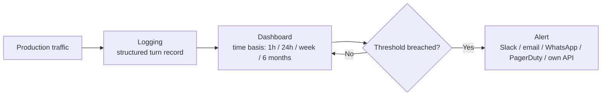
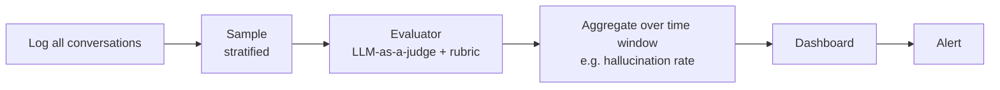

# CS-06 · Offline Evals vs Online Evals

> **Source transcript:** `Offline_Evals_Vs_Online_Evals_CampusX.txt` (Hinglish, 1,797 lines, runtime ≈ 1:21:05)
> **Domain:** methods
> **One-liner:** Offline evaluation proves your application is *correct* before you ship it; online evaluation proves it is *normal* after you ship — the two are complementary halves of one self-improving loop.
> **Prerequisites:** CS-03, CS-04, CS-05

---

## 0. Executive summary

Everything taught in the previous sessions was **offline evaluation** — every eval pipeline you run over an LLM application *before* deploy `[3:52]`–`[4:06]`. Offline eval buys you three things: **pre-release testing** as a CI/CD gate `[6:15]`–`[8:25]`, **variant comparison** (prompt vs prompt, model vs model, reranker vs reranker, vector DB vs vector DB) `[8:27]`–`[10:04]`, and **regression testing** of a change `[10:07]`–`[13:27]`.

But offline eval cannot see production. Three problems only appear live `[14:22]`–`[22:37]`: **unanticipated inputs**, **emergent/systematic failures** that only emerge at scale, and **drift** as prices, curricula and documents change underneath you. So a second discipline is needed.

**Online evaluation** = "evaluating your system on live production traffic after deployment as real users interact with it" `[22:37]`–`[23:36]`. Its defining feature: **it works without answers and without a golden dataset**.

The lecture's core framing, stated verbatim: **offline eval checks whether your application works *correctly*; online eval tells you whether it is running *normally*** `[23:38]`–`[28:00]`. "These two are not rivals… Ye donon complementary hai."

Online evaluation runs on a three-step production stack: **logging** `[41:22]`–`[48:36]`, **signals** (captured vs computed) `[48:47]`–`[52:33]`, then **dashboarding and alerting** `[52:33]`–`[59:02]`. Computed signals add a **sampling** step and an **evaluator** step `[58:59]`–`[1:16:34]`. Closing the circle back into the golden dataset produces what the speaker calls **the self-improving loop** `[1:16:15]`–`[1:16:39]`.

**Analyst note:** this is a conceptual lecture, not a coding one — the speaker says so himself at the end: "bahuta hee beginner-level class thee", no hands-on code `[1:16:50]`–`[1:18:13]`.

---

## 1. The problem this lecture solves

Application evals so far (CS-04's 12-step workflow, CS-03's multiple pipelines) all share a hidden assumption: **you have a golden dataset and you know what the right answer is.** That assumption is true only before deploy.

After deploy, three things break the assumption `[14:22]`–`[22:37]`:

1. **Unanticipated inputs** `[14:54]`–`[16:32]` — the golden dataset held 200–500 anticipated questions. Production brings Hinglish mixing, ambiguous questions, "angry rants that hide the actual question", and adversarial prompt injections.
2. **Emergent / systematic failures** `[16:38]`–`[18:23]` — failures that "only become visible at scale". A new CampusX course launch brings **concurrent thousands of users** and a latency spike — that load pattern cannot be reproduced offline. Likewise **latent bias** against users from a non-technical background appears only after thousands of real conversations.
3. **Drift** `[18:23]`–`[20:40]` — over a year, prices, curricula, policies and RAG documents change. The document distribution shifts, so the golden dataset and the whole eval pipeline become obsolete. Offline scores still look good while online users give negative feedback.

The problem statement: **how do you evaluate a system when you no longer have a golden dataset and no longer know the correct answer?**

---

## 2. Definitions & mental models

| Term | Definition as given in source | Anchor |
|---|---|---|
| **Offline eval** | "agar aap koi bhi eval pipeline apane LLM application ke oopar lagaate ho usako deploy karane ke pahale, to usako hum offline eval bolate hain" — any eval pipeline run before deploy | `[3:52]`–`[4:06]` |
| **Online eval** | "evaluating your system on live production traffic after deployment as real users interact with it" | `[22:37]`–`[23:36]` |
| **Correctness** | how close the system's output is to what a human would consider right | `[28:03]`–`[34:14]` |
| **Normality** | whether the system's *distribution of behaviour* today matches its own baseline | `[28:03]`–`[34:14]` |
| **Captured signal** | a quantity already present in the interaction — just store it | `[48:47]`–`[52:33]` |
| **Computed signal** | a quantity you must calculate by building an **evaluator** | `[48:47]`–`[52:33]` |
| **Late signal attachment** | a signal that arrives *after* the conversation and must be traced back by conversation ID | `[45:08]`–`[48:09]` |
| **Stratified sampling** | divide conversations into categories first, then draw more samples from problematic categories | `[1:04:55]`–`[1:08:01]` |

**The mental model that carries the whole lecture** `[28:03]`–`[34:14]`: offline → *correctness*; online → *normality*. The speaker's analogy is a UPSC answer-sheet grader:

- **Correctness** = how close the grader's marks are to the human evaluator's marks. Offline you can measure this exactly.
- Online you **cannot**, because — said verbatim — "**Human ka perspective hi nahin hai production men**". There is no ground truth streaming in with the traffic.

What you *can* compare online is the **baseline distribution of scores**. The source's constructed example: week 1 scores land at 300 / 456 / 700 and stay stable across weeks. Then suddenly the marks cluster around **800–900**. Nothing told you the *correct* mark — but the distribution moved, so something is off. The conclusion is stated flatly: "**online eval aapako correctness guarantee nahin kara sakataa**" `[33:52]`–`[34:14]`.

**Analyst note:** the source explicitly flags its own example as constructed for explanation and "not universally applicable" `[33:52]`–`[34:14]`. Treat it as an analogy for distribution shift, not as an exam-grading claim.

---

## 3. Core content, decomposed

### 3.1 Offline eval — the three benefits `[6:15]`–`[13:27]`

**(1) Pre-release testing / the CI/CD gate** `[6:15]`–`[8:25]`
"You cannot deploy an LLM-based software in production without testing it." The mechanics:

1. Developer pushes to Git → CI trigger fires.
2. The eval script runs against the golden dataset.
3. If the eval score is **above 95%** → auto-deploy; **below** → notify the team / roll back.

**(2) Comparing variants** `[8:27]`–`[10:04]`
Same eval, same golden dataset, **only the variable changes**. Legitimate variables named in source: different **prompts**, different **models**, different **rerankers**, different **vector databases**, different **software architectures**.

**(3) Regression testing** `[10:07]`–`[13:27]`
"A test of change" — the source's worked example:

- CampusX chatbot answers **refund** questions coldly → the system prompt is edited to "you have to be very kind and very polite".
- Side effect: over-softening. The **Insider plan costs 19,500** but the bot now says "around **19,000**" in an attempt to sound impressive.
- Why this was caught: the golden dataset must contain **every type of question** (refund, pricing, curriculum).
- The rule: if refund-type success was **90%** before the change, it should stay ≈90. If it drops to **80%,** that is a **regression** and the change should not be made.

### 3.2 The differences table `[23:38]`–`[28:00]`

| Dimension | Offline eval | Online eval |
|---|---|---|
| **Timing** | before deployment | after deployment, continuously |
| **Data** | fixed golden dataset | live production traffic |
| **Answers** | present in the dataset | estimated on the go |
| **Input** | only anticipated inputs | anything can arrive |
| **Catches** | regressions | drift, surprises, emergent bugs |
| **Best used for** | gating a release | detecting drift |
| **Cost & speed** | fast, cheap, repeatable | costly at scale → requires **sampling** |

Sampling order of magnitude given: out of **50,000** conversations, sample roughly **1,000** at random `[23:38]`–`[28:00]`.

### 3.3 Measuring quality without correct answers `[34:54]`–`[37:56]`

Three routes, in increasing order of convenience:

1. **Faithfulness** — checkable with *no reference at all*. Both the retrieved context and the generated answer are in hand, so you can ask an LLM whether the answer actually came from the context.
2. **Baseline-distribution comparison** — the jugaad route from §2.
3. **User feedback as the substitute for correctness** — the thumbs-up / thumbs-down example: if many conversations in the last hour get a thumbs-down, something is wrong. Stated as: "**correctness ka alternative huaa user ka feedback**".

### 3.4 Step 1 — LOGGING `[41:22]`–`[48:36]`

Definition given: "you capture a structured, reliable record of every conversation turn" `[42:10]`–`[42:15]`. Fields to store, grouped as the source groups them:

| Group | Fields |
|---|---|
| **Identity** | conversation ID, turn ID, user ID, session ID |
| **Time** | timestamp |
| **Content** | the question asked, the **context generated** while answering, the **output** produced |
| **Operational** | **latency in milliseconds**, prompt tokens, completion tokens, total cost, error yes/no + status code |
| **User signals** | thumbs up/down, email request, escalation, repeated rephrased questions |

Tool demonstrated: **LangSmith** (transcribed `laindasmitha`) — projects storing all conversations and their metadata `[44:24]`–`[45:08]`.

**Four engineering properties of logging** `[45:08]`–`[48:09]`:

1. **Non-blocking** — logging and chat must not add latency together.
2. **Durable and queryable** — write to a data warehouse or observability tool so it is fetchable in future.
3. **Late signal attachment** — signals arrive after the conversation. The source's example: an escalation email sent **one day later** to `su@campusx.in`; you must trace back to the conversation via its conversation ID.
4. **PII handling / masking** — "**PII matlab Personally Identifiable Information**" (phone number, card number, date of birth, Aadhaar number) must be masked or blurred before storage so that no teammate can extract it.

### 3.5 Step 2 — two signal types `[48:47]`–`[52:33]`

- **Captured signals** — already exist, just store them: **thumbs up/down**, **latency**, **cost per conversation** (token counting; the provider supplies it, or it is pre-computed).
- **Computed signals** — must be calculated by building an **evaluator**: **faithfulness**, **answer relevance**, **correctness**, **hallucination**, **toxicity**, **bias and fairness**.

The source's caution here: most of these general quantities exist in ordinary software too — "**LLM-based software special nahin hai**" `[48:47]`–`[52:33]`.

### 3.6 The LangSmith evaluator catalogue `[1:08:43]`–`[1:13:22]`

Under **Evaluators**, LangSmith ships templates, each labelled **LLM-as-a-judge**:

| Category | Evaluators named |
|---|---|
| **Safety** | PII leakage, prompt injection detection, code injection detection, toxicity, bias and fairness |
| **Quality** | hallucination, correctness, assertion, conciseness, conversational quality |
| **Other** | Tracing — noted as being for **agents**, not chatbots; also image-based and voice-based chatbots |

Configuration walkthrough `[1:10:04]`–`[1:11:10]`: name the evaluator → select the **application** → select the LLM-as-a-judge **model** (OpenAI or Claude) → provide the **API key** and temperature/settings → write the **prompt/rubric** with site instructions, reminders, context → specify the output **format**.

**The key toggle** `[1:11:10]`–`[1:13:22]`: point the evaluator at **tracing** → it is an **online evaluator**; point it at a **dataset** → it is an **offline evaluator** — because datasets live in the offline setup. This is what makes LangSmith, in the source's words, "an overall evaluation platform": datasets (under **Datasets and Experiments**), offline experiments, logging, monitoring, alerting, and both evaluator modes in one tool.

### 3.7 The self-improving loop `[1:14:37]`–`[1:16:58]`

CS-04's rule was that production failures become part of the dataset. LangSmith implements it literally: any conversation in **tracing** has an **Add to dataset** option, so a bad conversation joins the offline dataset and the next offline evaluation runs on the updated data. There is also an **Annotation queue** to record what was right and wrong in a conversation.

The full circle, verbatim `[1:16:15]`–`[1:16:39]`: "offline evaluation huaa → production men gayaa → production men failures hue hain → usako uthaa ke vaapasa offline waale dataset men add kiyaa → phir se offline evaluations run kie → deploy kiyaa → nae failures aae → sarkal men pooraa kaam hotaa jaa rahaa hai." **"This is the self-improving loop."**

---

## 4. Frameworks & decision procedures

### 4.1 Captured-quantity flow: Logging → Dashboarding → Alerting `[52:33]`–`[59:02]`

**Dashboarding.** The dashboard shows quantities on a **time basis** — last 1 hour, last 24 hours, one week, six months. Worked example: a new course launch brings **500 simultaneous users**, latency spikes, the graph *shape* changes, you allocate resources (more **AWS EC2** instances, a load balancer) and latency recovers.

**Alerting.** "Nobody watches graphs 24/7," so you set a threshold alert delivered via Slack, email, WhatsApp, PagerDuty, or your own API. Example threshold given: "latency **4 seconds se zyaadaa**". The LangSmith demo shows graphs for **trace latency, error rate, LLM call count, LLM latency, cost** across windows **last 1 / over 3 / over 6**, plus an Alerts sidebar where you pick a metric, "is greater than", and a window of the last **5 minutes**. A worked number in the demo: a recorded trace latency of **2.03 seconds**.

**Key rule:** a single conversation does not matter — the **aggregated** latency over the last hour does `[52:33]`–`[59:02]`.

### 4.2 Computed-quantity flow: the hallucination example `[58:59]`–`[1:16:34]`

Step by step:

1. **Log** — e.g. **500 conversations/day**.
2. **Recognise this is reference-free.** No golden dataset, no correct answer. The source recaps: reference-based = answers present in the golden dataset (the UPSC grader); reference-free = no answers `[1:00:23]`–`[1:01:50]`.
3. **Use a more powerful LLM as a judge**, shown the **retrieved context**, the user's question and the generated output, guided by a **detailed rubric**, and asked whether the original LLM is hallucinating `[1:01:54]`–`[1:02:44]`.
4. **The problem:** applying this to all 500 conversations is "**very very costly**" — "cost double se bhi zyaadaa ho sakataa hai" `[1:02:44]`–`[1:03:40]`.
5. **Sample** `[1:03:40]`–`[1:04:02]` — randomly select conversations, run the judge, get a **hallucination rate**, push it to the dashboard. "Flow bilkul wahee hai" — with an extra sampling step and an extra evaluation step.

**Sampling strategy** `[1:04:55]`–`[1:08:01]`: random sampling is *not* optimal. Ignore thumbs-up conversations; weight thumbs-down ones; also weight conversations that ended abruptly, had escalations, had repeated rephrased questions, or discussed **money / refund / admission / fees**. The principle, stated verbatim: "**Not all conversations are the same**." That leads to **stratified sampling**: divide conversations into **categories** first, then draw more samples from **problematic categories** — which requires a **small classifier model**, effectively **clustering** `[1:07:39]`–`[1:07:56]`.

Full flow restated `[1:08:01]`–`[1:08:31]`: **log → sample → evaluator → aggregate over a time period → dashboard → alert.** "Ab ye sirf ek evaluation pipeline hai. Aap isa taraha ke **multiple evaluators** bithaate ho."

### 4.3 Decision procedure — when to use which

1. **A change is being made and you know the right answers for the affected queries** → offline eval (regression test) `[10:07]`–`[13:27]`.
2. **A release is being gated** → offline eval with a pass threshold `[6:15]`–`[8:25]`.
3. **Two variants must be compared** → offline eval, one variable at a time `[8:27]`–`[10:04]`.
4. **You need to know whether live behaviour is drifting** → online eval, comparing today's distribution to the offline-derived baseline `[1:16:50]`–`[1:21:05]`.
5. **A quantity cannot be judged without ground truth** (correctness) → do not attempt it online; use **faithfulness**, **distribution comparison**, or **user feedback** instead `[34:54]`–`[37:56]`.

---

## 5. Worked end-to-end example

### 5.1 The baseline question (closing Q&A) `[1:16:50]`–`[1:21:05]`

Asked: *how do you judge whether a number on the dashboard is good or bad?* The answer is the load-bearing rule of the whole lecture:

> "**har cheeja kaa ek baseline define hotaa hai aur vo baseline generally aapake offline evaluation se aataa hai**" — every quantity has a baseline, and that baseline generally comes from your *offline* evaluation.

Worked: if the baseline is **85**, an observed **87** is fine. But **75** in the last 24 hours against an **85** baseline is concerning and fires an alert. This is the concrete mechanism by which offline and online are complementary rather than rival: **offline sets the reference line that online is measured against.**

### 5.2 The correctness-vs-normality trace (UPSC grader) `[28:03]`–`[34:14]`

| Question | Offline answer | Online answer |
|---|---|---|
| Is the grader's mark close to the human's mark? (correctness) | Yes — measurable; the human mark is in the dataset | Not measurable — "Human ka perspective hi nahin hai production men" |
| Is the grader behaving as it usually does? (normality) | Not the point | Yes — compare the score distribution week over week |
| What signal tells you something broke? | A drop in correctness score | A distribution shift (300/456/700 stable → suddenly 800–900) |

### 5.3 The closing trade-off question `[1:20:23]`–`[1:21:05]`

Asked: *"if offline increases from 92 to 99, is it good for online production?"* The answer given: the question is incomplete — **which quantity improved, and did others drop?** It is good only if everything improved. The general law stated: "**LLM-based systems men yahee hotaa hai — ek cheeja ko improve karane jaate ho, regression ho jaataa hai… vo naheen honaa chaahiye.**"

### 5.4 Numeric inventory of this lecture

| Number | Meaning | Anchor |
|---|---|---|
| **95%** | offline eval score threshold above which CI auto-deploys | `[6:15]`–`[8:25]` |
| **19,500 vs "around 19,000"** | Insider plan price vs the over-polite bot's softened claim | `[10:07]`–`[13:27]` |
| **90% → 80%** | refund-question success before and after a prompt change = regression | `[10:07]`–`[13:27]` |
| **200–500** | size of the offline golden dataset | `[14:54]`–`[16:32]` |
| **50,000 → ~1,000** | conversations/day vs random sample size | `[23:38]`–`[28:00]` |
| **500 simultaneous users** | new course launch load that spikes latency | `[52:33]`–`[59:02]` |
| **500 conversations/day** | volume in the hallucination pipeline example | `[58:59]`–`[1:16:34]` |
| **4 s** | example latency alert threshold | `[52:33]`–`[59:02]` |
| **2.03 s** | trace latency shown in the LangSmith monitoring demo | `[52:33]`–`[59:02]` |
| **85 → 87 vs 85 → 75** | baseline vs acceptable vs alerting deviation | `[1:16:50]`–`[1:21:05]` |
| **92 → 99** | offline improvement whose online meaning is ambiguous | `[1:20:23]`–`[1:21:05]` |

**Analyst note:** the hallucination-pipeline section first says the chatbot handles **500 conversations/day**, then says "randomly let's say **1000** conversations" should be selected `[1:03:40]`–`[1:04:02]`. 1,000 exceeds the stated daily total at 500, so the two figures cannot both be literal. The likely reading is that each number is illustrative of a *different* scale, or that 1,000 was a per-window count. The lecture's actual claim — that full-volume judging is prohibitively costly and sampling is mandatory — stands regardless.

---

## 6. Pros, cons, exceptions

| | Offline eval | Online eval |
|---|---|---|
| **Strengths** | Repeatable; cheap; fast; gives a hard pass/fail gate; the only place you can measure **correctness**; the source of the **baseline** | Works with no golden dataset and no answers; sees real inputs; catches drift, bias, load failures; uses real user signals |
| **Weaknesses** | Blind to unanticipated inputs; blind to scale effects; goes stale as content drifts; only as good as the golden dataset's coverage | Expensive at full volume → must sample; **cannot measure correctness**; signals are delayed and probabilistic; needs logging infrastructure before it can run at all |
| **Exceptions / caveats** | The 90/80 regression rule assumes the golden dataset covers that question class — if refund questions were absent, the regression would be invisible | The UPSC distribution example is explicitly constructed and "not universally applicable" `[33:52]`–`[34:14]` |

**The complementarity claim, verbatim** `[23:38]`–`[28:00]`: "**These two are not rivals… Ye donon complementary hai**" — offline proves correctness, online proves normality.

---

## 7. Failure modes & anti-patterns

1. **Treating online eval as a correctness check.** It cannot be one — there is no human perspective in production `[28:03]`–`[34:14]`. Teams that alert on "correctness" online are alerting on a quantity they cannot compute.
2. **Judging every conversation with an LLM judge.** "Very very costly" — cost can more than double `[1:02:44]`–`[1:03:40]`. Sampling is not optional.
3. **Random sampling when stratified sampling is available.** Random sampling wastes budget on thumbs-up conversations. "Not all conversations are the same" `[1:04:55]`–`[1:08:01]`.
4. **Synchronous logging.** If logging adds latency to the chat path, the act of measuring degrades the product. Must be **non-blocking** `[45:08]`–`[48:09]`.
5. **Storing raw PII.** Phone numbers, card numbers, dates of birth and Aadhaar numbers must be masked before storage `[45:08]`–`[48:09]`.
6. **Losing late signals.** An escalation email one day later must be attachable back to its conversation — that requires conversation IDs preserved end to end `[45:08]`–`[48:09]`.
7. **Alerting on a single conversation.** Aggregation over a window is the unit of alerting, not the individual trace `[52:33]`–`[59:02]`.
8. **Assuming offline improvement is online improvement.** 92 → 99 offline can hide a regression in another quantity `[1:20:23]`–`[1:21:05]`.
9. **Letting the golden dataset go stale.** Drift invalidates both the dataset and the pipeline; offline still looks good while users complain `[18:23]`–`[20:40]`.

---

## 8. Implementation notes

**Minimum viable production eval stack**, in build order:

1. **Logging layer** — structured per-turn records, written asynchronously, with conversation/user/session IDs as join keys, PII masked at write time, durable store (warehouse or observability tool).
2. **Captured signals** — thumbs up/down, latency ms, token counts, cost, error/status code. No model needed.
3. **Baseline** — produced by the offline evaluation from CS-04 and CS-05. Without this, no dashboard number can be judged `[1:16:50]`–`[1:21:05]`.
4. **Dashboard** — time-windowed aggregates (last 1h / 24h / week / 6 months).
5. **Alerting** — metric + comparison + window, routed to Slack / email / WhatsApp / PagerDuty / your own API.
6. **Evaluators** — LLM-as-a-judge with rubric; reference-free where no ground truth exists.
7. **Sampling layer** — stratified, with a small classifier to bucket conversations; over-weight problematic categories.
8. **Feedback loop** — "Add to dataset" from tracing back into the offline golden dataset, plus an annotation queue for right/wrong marking.

**Tool surface in this lecture:** LangSmith (logging, tracing, datasets & experiments, evaluators, dashboards, alerts). **Named as upcoming in the curriculum:** **LangChain**, **DeepEval**, **RAGAS** `[1:19:17]`–`[1:20:14]`. **AWS EC2** appears only as the scaling example `[52:33]`–`[59:02]`.

**Sequencing stated at the end** `[1:19:17]`–`[1:20:14]`: golden dataset creation → offline evals → online evals → tools/libraries (LangChain, DeepEval, RAGAS) → **model-level evals and benchmarks**, then back to application evals.

**Analyst note (outside source):** the lecture names no vendor lock-in and no cost figures for the online path; the only cost number is the qualitative "cost double se bhi zyaadaa ho sakataa hai" for judging at full volume.

---

## 9. Interview-ready Q&A

**Q1. One sentence each: offline vs online eval?**
Offline: any eval pipeline run over the application *before* deploy `[3:52]`–`[4:06]`. Online: evaluating the system on live production traffic after deployment, as real users interact with it `[22:37]`–`[23:36]`.

**Q2. What is the single biggest capability difference?**
Online evaluation works **without answers and without a golden dataset** `[22:37]`–`[23:36]`. Offline evaluation structurally requires both.

**Q3. Give the correctness/normality framing.**
Offline eval checks whether the application works **correctly**; online eval tells you whether it is running **normally** `[23:38]`–`[28:00]`. They are complementary, not rivals.

**Q4. Why can't online eval measure correctness?**
Because "**Human ka perspective hi nahin hai production men**" — no ground truth arrives with live traffic. You can only compare the live distribution to a baseline `[28:03]`–`[34:14]`.

**Q5. Name the three problems that only appear in production.**
Unanticipated inputs `[14:54]`–`[16:32]`; emergent/systematic failures visible only at scale `[16:38]`–`[18:23]`; drift in prices, curricula, policies and documents `[18:23]`–`[20:40]`.

**Q6. Name the three benefits of offline eval.**
Pre-release testing as a CI/CD gate `[6:15]`–`[8:25]`; comparing variants (prompts, models, rerankers, vector DBs, architectures) `[8:27]`–`[10:04]`; regression testing of change `[10:07]`–`[13:27]`.

**Q7. Differentiate captured vs computed signals and give examples of each.**
Captured: thumbs up/down, latency, cost per conversation — already present, just store them. Computed: faithfulness, answer relevance, correctness, hallucination, toxicity, bias and fairness — require building an evaluator `[48:47]`–`[52:33]`.

**Q8. What is late signal attachment and why does it matter?**
A signal that arrives after the conversation — e.g. an escalation email sent **one day later** — must be traceable back to the conversation by conversation ID. Without stable IDs the signal is lost `[45:08]`–`[48:09]`.

**Q9. Why is stratified sampling better than random sampling for online evals?**
"Not all conversations are the same." Random sampling spends budget on thumbs-up conversations; stratified sampling buckets conversations by category and draws more from problematic ones — thumbs-down, abrupt endings, escalations, repeats, and money/refund/admission/fees topics `[1:04:55]`–`[1:08:01]`.

**Q10. Where does the dashboard's baseline come from?**
From the **offline evaluation**: "har cheeja kaa ek baseline define hotaa hai aur vo baseline generally aapake offline evaluation se aataa hai." Baseline 85 → observed 87 is fine; 75 in 24 hours fires an alert `[1:16:50]`–`[1:21:05]`.

**Q11. Trap — "Our offline score went from 92 to 99, so production will improve." What's wrong?**
The question is incomplete: which quantity improved, and did any other quantity drop? Improvement is only good if nothing else regressed. In LLM-based systems, improving one thing commonly regresses another `[1:20:23]`–`[1:21:05]`.

**Q12. Trap — "Set the online evaluator to measure correctness and alert when it falls." Why is this wrong?**
Two reasons: online traffic carries no ground truth, so correctness is not computable `[28:03]`–`[34:14]`; and running an LLM judge on 100% of traffic is prohibitively expensive, so it must be sampled anyway `[1:02:44]`–`[1:04:02]`. Use faithfulness, distribution shift, or user feedback as substitutes.

**Q13. Trap — "Log everything synchronously in the request path so nothing is lost." Why is this wrong?**
Logging must be **non-blocking**; adding logging latency to the chat path degrades the product you are trying to measure. It must also mask PII before storage `[45:08]`–`[48:09]`.

**Q14. What is the self-improving loop?**
offline eval → deploy → production failures → add those conversations back to the offline dataset → re-run offline evals → redeploy → new failures → repeat. LangSmith implements the middle step with "Add to dataset" from tracing plus an annotation queue `[1:14:37]`–`[1:16:39]`.

**Q15. What single configuration decision converts an offline evaluator into an online one?**
The data source it is pointed at: **tracing** → online evaluator; **dataset** → offline evaluator — because datasets live in the offline setup `[1:11:10]`–`[1:13:22]`.

---

## 10. Cheat sheet

**The 60-second version**
Offline = before deploy, golden dataset, known answers, catches regressions, gates releases, fast and cheap, measures **correctness**. Online = after deploy, live traffic, no answers, catches drift and emergent failures, costs money at volume, measures **normality** against a baseline that offline produced. They are complementary. Production online eval = logging → signals (captured/computed) → dashboard → alert, with sampling and an LLM-as-a-judge evaluator in the computed path. Production failures get added back to the offline dataset: that is the self-improving loop.

**Core concepts (table)**

| Concept | One-line meaning |
|---|---|
| Offline eval | eval pipeline run before deploy |
| Online eval | eval on live production traffic after deploy |
| Correctness | matches the human/ground-truth answer |
| Normality | today's distribution matches the baseline |
| Captured signal | already present; just store it |
| Computed signal | must be calculated by an evaluator |
| Reference-free evaluator | no golden answer needed (e.g. faithfulness) |
| Late signal attachment | post-hoc signal joined back by conversation ID |
| Stratified sampling | bucket first, then sample problem categories harder |
| Self-improving loop | production failures → dataset → offline eval → deploy |

**Decision rules (numbered)**
1. Ship gate → offline, threshold-based (source example: >95%).
2. Comparing two prompts/models/rerankers/vector DBs → offline, one variable at a time.
3. Judging a change → offline regression test on a dataset covering **every** question class.
4. Detecting drift in the wild → online, distribution vs baseline.
5. No ground truth available → faithfulness, distribution comparison, or user feedback.
6. Full-volume LLM judging → never; sample.
7. Random sampling available vs stratified → always stratify.
8. Alert on aggregated windows, never on single conversations.
9. Every dashboard number needs an offline-derived baseline before it can be interpreted.

**Thresholds & defaults worth memorising**
- Offline CI deploy threshold in the source's example: **>95%**.
- Golden dataset size (offline): **200–500** rows.
- Sampling order of magnitude: **50,000** conversations → **~1,000** sampled.
- Regression rule: 90% → 80% on a question class = regression; do not ship.
- Baseline 85 → 87 acceptable; 85 → 75 in 24h = alert.
- Alert window example: last **5 minutes**; dashboard windows: 1h / 24h / week / 6 months.
- Latency alert example: greater than **4 s**.

**Tool commands / surfaces (from the LangSmith demo — no CLI shown)**
- **Evaluators** → template gallery, each tagged LLM-as-a-judge.
- Evaluator config: name → application → judge model (OpenAI/Claude) → API key + temperature → prompt/rubric + output format.
- **Data source toggle:** tracing = online; dataset = offline.
- **Datasets and Experiments** → create offline datasets and run experiments.
- **Tracing** → per-conversation view with **Add to dataset**; **Annotation queue** for right/wrong marking.
- **Alerts** sidebar → metric + "greater than" + window.
- Monitoring graphs available: trace latency, error rate, LLM call count, LLM latency, cost.

**Top 10 mistakes**
1. Using online eval to measure correctness.
2. Running the LLM judge on every conversation.
3. Random instead of stratified sampling.
4. Blocking logging in the request path.
5. Storing unmasked PII.
6. Dropping late signals by not preserving conversation IDs.
7. Alerting on single conversations.
8. Reading an offline 92→99 as an unqualified win.
9. Letting the golden dataset go stale as documents drift.
10. Deploying without an offline baseline, then having no way to judge the dashboard.

**If you only remember three things**
1. Offline = correctness, online = normality; **they are complementary, not rivals**.
2. Online eval works **without answers and without a golden dataset** — that is its defining feature.
3. The baseline every online metric is judged against **comes from your offline evaluation**, and production failures flow back into the offline dataset — the self-improving loop.

---

## 11. Glossary

- **Offline eval** — any eval pipeline applied to the LLM application before deployment `[3:52]`–`[4:06]`.
- **Online eval** — evaluation on live production traffic after deployment `[22:37]`–`[23:36]`.
- **Correctness / normality** — the source's paired framing: matching ground truth vs matching your own baseline `[23:38]`–`[28:00]`.
- **Golden dataset** — fixed set of questions with known correct answers; the offline substrate (see CS-04).
- **Captured signal** — a quantity already emitted by the interaction (thumbs, latency, cost) `[48:47]`–`[52:33]`.
- **Computed signal** — a quantity requiring an evaluator (faithfulness, hallucination, toxicity, bias) `[48:47]`–`[52:33]`.
- **Evaluator** — the component that computes a signal, typically an LLM-as-a-judge with a rubric `[1:01:54]`–`[1:02:44]`.
- **Reference-free evaluation** — evaluation that needs no ground-truth answer `[1:00:23]`–`[1:01:50]`.
- **Late signal attachment** — joining a signal that arrives after the conversation back to it `[45:08]`–`[48:09]`.
- **PII masking** — blurring personally identifiable information before storage `[45:08]`–`[48:09]`.
- **Stratified sampling** — categorise conversations first, then sample over-weighting problematic categories `[1:04:55]`–`[1:08:01]`.
- **Baseline** — the reference value for a metric, generally produced by offline evaluation `[1:16:50]`–`[1:21:05]`.
- **Drift** — the change over time in documents, prices, policies and user behaviour that invalidates the golden dataset `[18:23]`–`[20:40]`.
- **Self-improving loop** — production failures → dataset → offline eval → deploy `[1:15:00]`–`[1:16:39]`.

---

## 12. Cross-references

- **CS-03** — why one application needs multiple eval pipelines; this lecture assumes that pipeline set exists.
- **CS-04** — the 12-step workflow whose "monitor" and "feed failures back" steps this lecture expands into full production machinery.
- **CS-05** — model evals: the offline/custom-eval half that produces the baselines used here.
- **CS-07** — LLM-as-a-judge, reference-based vs reference-free; the evaluator used in §4.2 is exactly a reference-free judge.
- **CS-08** — G-Eval, a deterministic judging framework for the evaluators described here.
- **CS-13 … CS-16** (Track B, `04-rag`) — RAG-specific evals; faithfulness and answer-relevance in §3.3 belong to that pipeline family.
- **CS-17 … CS-20** (Track B, `05-agentic`) — tracing is called out in this lecture as being for **agents**, not chatbots.
- **CS-21 … CS-24** (Track B, `06-production`) — production concerns; this lecture is the bridge from methods into that domain.
