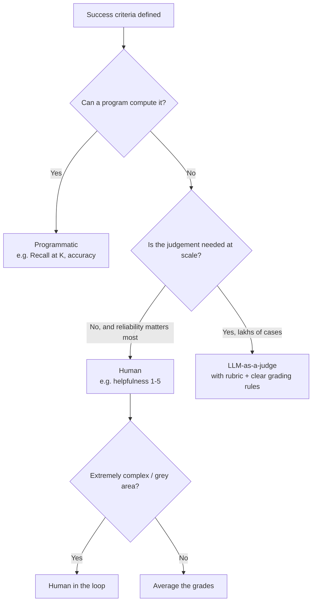

# CS-07 · Eval Methods: LLM-as-a-Judge, Reference-Based vs Reference-Free

> **Source transcript:** `LLM_Eval_Methods_LLM-as-a-Judge_Reference_Based_Evals_Vs_Reference_Free_Evals_Ca.txt` (Hinglish, 1,158 lines, runtime ≈ 53:08)
> **Domain:** methods
> **One-liner:** Every eval pipeline in existence is executed by exactly one of three graders — a program, a human, or an LLM — and every test case is either reference-based (a correct answer exists) or reference-free (it does not).
> **Prerequisites:** CS-03, CS-04, CS-06

---

## 0. Executive summary

This lecture answers the question the previous ones left open: **who actually runs the evaluation?** Given that you have a golden dataset and a success criteria, the source states flatly that there are only **three methods** — **programmatic / deterministic**, **human**, and **model-graded / LLM-graded** — and "isake alaavaa aura kuchha naheen hotaa" `[1:13]`–`[2:05]`.

The lecture then walks one full worked example of each `[3:40]`–`[3:47]`:

| # | Method | Worked example | Success criteria | Metric |
|---|---|---|---|---|
| 1 | **Programmatic** | CampusX RAG chatbot's **retriever** | **Recall@K** | Recall = 67% observed |
| 2 | **Human** | CampusX general **chatbot** | **Helpfulness** on a 1–5 rubric | Average human grade |
| 3 | **LLM-as-a-judge** | CampusX **UPSC Mains answer-evaluation platform** | Matches a human expert's marking | **MAE** = 2.3 marks |

Two structural facts emerge along the way. First, **the eval method is independent of the eval level** — the same three methods apply at component level, workflow level and application level; what varies is which one is *feasible* `[16:03]`–`[16:15]`. Second, **the golden dataset is always created by a human**, and that is a separate activity from executing the eval pipeline `[16:16]`–`[16:34]`.

The lecture closes with the vocabulary pair that is most commonly asked about in interviews `[48:31]`–`[52:44]`: **reference-based** (a correct answer exists in the golden dataset; you grade by comparison) vs **reference-free** (no correct answer exists; you grade against a rubric on the output's own terms). The single diagnostic question that separates them: **"does your golden dataset hand you a correct answer?"**

---

## 1. The problem this lecture solves

Once you have built a golden dataset and defined a success criteria (CS-04), someone or something must still produce a judgement per test case. The lecture's definition of an eval method, spoken as a formal sentence and then unpacked `[0:32]`–`[0:52]`:

> "an LLM eval method is the mechanism you use to decide whether an LLM's output is good or not — a procedure that takes an output and produces a judgement about it."

Two questions follow `[2:16]`–`[2:58]`:

1. Which of the three graders executes your pipeline?
2. Given that, how do you handle the case where **no correct answer exists at all** — e.g. "how helpful was this answer?"

The lecture's recalled hook is CS-04's Zomato email-classifier: accuracy there was computed by **Python code**, so that pipeline was **programmatic** `[3:00]`–`[3:25]`.

---

## 2. Definitions & mental models

**The three eval methods** `[1:13]`–`[2:05]`:

| Method | Also called | Executed by |
|---|---|---|
| 1. **Programmatic** | deterministic | a program / Python code |
| 2. **Human** | human-in-the-loop grading | a person given instructions |
| 3. **Model-graded** | **LLM-graded**, the technique named **LLM-as-a-judge** | another LLM given a rubric |

The lecture's framing: "aap koi bhi evaluation pipeline banaaoge, usako inheen three men se koee eka cheeja execute karegee" `[3:25]`–`[3:40]`. There is no fourth option.

**Reference-based vs reference-free** `[48:51]`–`[52:44]`:

| | **Reference-based** | **Reference-free** |
|---|---|---|
| Source definition | "you have a reference and/or correct answer and the key things a correct answer must contain … for each test case. You grade by comparing the output against the reference" | "you have no predefined correct answer. You judge the outputs' quality directly on its own terms against a criteria and rubric" |
| What the golden dataset contains | question **+ correct answer** | question **only** |
| What the grader does | compares output to the reference | applies judgement via a rubric |
| Diagnostic question | does the golden dataset give you a correct answer? → **yes** | → **no** |
| The source's memory hook | "agar diyaa jaa rahaa hai to it is a reference based one" | "agar naheen diyaa jaa rahaa hai it is a reference V1" |

**Critical clarification the source makes explicitly** `[52:06]`–`[52:17]`: a **rubric is not a correct answer**. A rubric is "a scale, not a particular correct answer". So the presence of a rubric does *not* make an evaluation reference-based. Only a stated correct answer does.

**The mental model for graders** `[16:03]`–`[16:15]`: whether an eval is programmatic, human-based or model-generated "depends on this one thing — when we execute it, who is running it." The *method* is a property of the executor, not of the pipeline's shape.

---

## 3. Core content, decomposed

### 3.1 Example 1 — Programmatic: evaluating a RAG retriever `[4:02]`–`[13:52]`

**Setup.** A RAG chatbot for CampusX; the pipeline being built is at **component level**, and the component under test is the **retriever** `[4:50]`–`[5:16]`.

**Step 1 — define task and target** `[5:31]`–`[5:48]`. Task: the retriever works correctly. Target: a **single component** which is the retriever.

**Step 2 — define success criteria** `[5:48]`–`[9:04]`. The retriever's job: given a question, pull the most relevant documents out of the vector database. The metric chosen is **Recall@K**, defined verbatim as: "out of all the correct items that exist, how many did the system retrieve in its top K results?" `[6:12]`–`[6:36]`

Worked calculation with real document IDs `[6:36]`–`[8:23]`:

- Question: *"What are the prerequisites for the email course and how long is it?"*
- Ground truth: the correct answer lives in documents **1001 and 1003**.
- Retriever called with **K = 5**, returned: **1001, 102, 104, 105, 106**.
- Recall = correct items retrieved / total correct items = **1 / 2** = **50%**.
- Bounds stated: ideal is **100%**; it can never exceed 100 and never go below zero `[8:13]`–`[8:18]`.

The source notes other retrieval metrics exist — **precision** and various **rank** measures — but keeps the discussion simple by using Recall@K alone `[8:37]`–`[8:49]`.

**Step 3 — build the golden dataset** `[9:07]`–`[10:12]`. 50–100 questions sampled to cover **all cases** — "we tried to cover all the cases: easy cases, difficult questions, edge questions, random questions" — then a **human expert** opened each question and identified which document in the vector database hides its correct answer. The result is a golden dataset carrying, per question, the IDs of the documents that count as correct.

**Step 4 — define the evaluation method** `[10:15]`–`[10:29]`. Programmatic: compute Recall@K in code.

**Step 5 — run and evaluate** `[10:32]`–`[12:12]`. Send each of the 50 questions to **the retriever alone — not the whole RAG chatbot** `[10:42]`–`[10:46]` — with K = 5. Per-question recall is computed, then the average over the whole dataset gives dataset-level Recall@K. Worked per-question results: question 1 had all its information in document 1001 and the retriever returned 1001 → **100%**; question 2 needed 1001 and 1003 but only 1001 came back → **5** (i.e. 50%) `[11:35]`–`[12:00]`.

**Step 6 — analyse** `[12:38]`–`[12:42]`. Final measured score: **67%**. Then deep-dive the questions where recall was poor.

**Step 7 — improve** `[13:01]`–`[13:46]`. Four levers named:
1. Improve the **embedding model** — it may not be capturing semantic meaning properly.
2. **Query expansion** — instead of sending the user's raw question, pass it through an LLM to expand it first, then send the expanded question to the retriever.
3. **Increase K** — currently 5; try 10.
4. **Reranking** — "it's possible it was in your top 10 but didn't make the top 5; you added a reranker and the thing at position 10 moved to position 3."

**The relevance sub-discussion** `[14:40]`–`[16:03]` — three aspects of relevance:
1. Of the documents that were truly correct, how many did you actually fetch from the vector DB? (**recall**)
2. Of the documents you fetched, how many were not useful? (**precision**)
3. Are the fetched documents properly ranked? (**ranking**)

Point (1) — the ground truth of which documents are relevant — was supplied by **the person who created the golden dataset**, not by the code `[15:17]`–`[15:35]`.

**The closing observation** `[14:16]`–`[14:40]`: no human was needed to grade this pipeline, only to *build the dataset*. "Humans are costly, we'd have to pay a salary" — so wherever a program suffices, use the program.

### 3.2 Example 2 — Human: grading chatbot helpfulness `[16:47]`–`[28:01]`

**Setup.** A general CampusX chatbot over the website; questions of the form *"When is the next course launching?", "What is the fee?", "Will I get a certificate?", "What is the course validity?"* `[16:47]`–`[17:14]`. The lecture explicitly narrows scope: this evaluates the **application-quality** part, not the safety/operations parts — specifically the **helpfulness of the answer** `[17:26]`–`[17:46]`.

**Step 1 — define task and target** `[17:46]`–`[18:04]`. Target: the **entire application** — not a component, not a workflow. Task: evaluate its helpfulness. Definition given: "helpfulness means the answer that came out was accurate, its tone was right, and the answer was complete in itself" `[18:04]`–`[18:16]`.

**Step 2 — define success criteria** `[18:18]`–`[19:17]`. The lecture's key teaching point: **this is where it gets very tricky**, because you are evaluating a whole application on an abstract property. Verbatim: *"is there a direct metric for this? The answer is: there is no direct metric."* So a **kind of rubric** was defined — a helpfulness scale from 1 to 5:

| Score | Meaning (as given) |
|---|---|
| **5** | the answer is correct, complete, and in exactly the right tone |
| **3** | partially helpful |
| **1** | not helpful at all — the bot started saying something else |

**Step 3 — build the dataset** `[19:20]`–`[20:17]`. 50–100 questions covering the full breadth again (normal, difficult, edge, random). The structural detail the source stresses: **this dataset has only ONE column — the question being asked to the chatbot** `[19:53]`–`[20:02]`. There is no answer column. Sample questions named: *"How long is the email course?"*, *"Is the email course right for me if I already know Python?"*, *"What's the fee for the DSMP course?"*, *"Do I get a refund if I drop out midway?"*, *"Can I pay the fee in instalments?"*

**Step 4 — define the evaluation method** `[20:20]`–`[21:21]`. The source asks the class directly: can you measure helpfulness programmatically? Answer: no — "this is a very new one, and here you need human judgement." So the evaluation method becomes **human**.

**Step 5 — run** `[21:21]`–`[22:28]`. The loop: take one question → send to the chatbot → chatbot generates an answer → put a person in front of it → instruct them: *look at this question, look at this answer, give a grade* → next question. Repeat for the entire dataset, then average. The score that comes out is attributable to the human's judgement `[24:03]`–`[24:16]`.

**Why more than one grader** `[22:28]`–`[23:57]`. The source raises this as a design question with a concrete answer:

- If two graders' ratings **disagree repeatedly** (one says 2, the other says 4), that is evidence that **there is ambiguity in your rubric** — the criteria were not defined tightly enough.
- If graders **agree a lot**, that means "this instruction is pretty clear."
- Therefore multiple graders are commonly seated **to refine the rubric** in exactly this way.

**The five things humans do in LLM evaluation** `[24:34]`–`[27:59]`. Important qualifier stated first: "in LLM evals, humans don't evaluate in only one way — they evaluate in more than one way." The direct grading described above is "the simplest evaluation humans do." The other four:

| # | Human activity | What it is |
|---|---|---|
| 1 | **Direct grading and rating** | look at the answer, give a score — the flow above |
| 2 | **Red teaming** | "a situation where a group of individuals humans deliberately attack an LLM-based system and try to figure out where the system is breaking." Done before major LLM launches; the breaking data is sent back to the development team and fixed `[25:01]`–`[25:39]` |
| 3 | **A/B testing** | two chatbot variants both deployed to production; users are told to rate their experience; the better-rated variant is selected and deployed to the whole region. "Here your users are evaluating your application in production" `[25:44]`–`[26:21]` |
| 4 | **Annotation** | humans creating golden datasets and defining rubrics `[26:26]`–`[27:03]` |
| 5 | **Human in the loop** | when cases are too complex for programmatic or LLM-based evaluation, "you pass on the responsibility to a human". Trigger condition named: "if an LLM can't handle it, or programmatic checks can't handle it, or a threshold creates a **grey area** — there you pass on the responsibility to a human" `[27:03]`–`[27:39]` |

**Advantage and disadvantage** `[28:08]`–`[29:35]`:
- **Biggest advantage — reliability.** Verbatim: "their judgement is reliable". The framing: a human being can give an "A-grade" judgement in comparison to a machine, so trust in the system is higher and reliability is "very high" — higher than a program or an LLM.
- **Biggest disadvantage — cost.** "You'll have to pay to hire people." And the decisive consequence: **at scale you cannot use humans at all** — "if your application works at scale, lakhs or crores of users are using it, then most likely you cannot use humans for evaluation."

**Analyst note (outside source):** the source says the human advantage is "reliability, trust" without qualification, then immediately says graders disagree repeatedly enough that you need several of them. The two statements sit together only if you read reliability as *comparative* — a human is more trustworthy than an LLM-as-judge per case, not that human judgement is noise-free. The rubric-refinement mechanism in `[22:28]`–`[23:57]` is precisely the acknowledgement that human judgement carries variance.

### 3.3 Example 3 — LLM-as-a-judge: the UPSC Mains platform `[31:00]`–`[47:30]`

**The setup** `[31:00]`–`[33:55]`. CampusX runs a UPSC preparation website and YouTube channel. UPSC is described as "India's most difficult exam"; clearing it makes you an IAS officer. Its structure:

| Stage | Format | Grading |
|---|---|---|
| **Prelims** | MCQ-based, objective | easy to conduct automatically |
| **Mains** | subjective written answers | needs subject-matter experts |
| **Interview** | — | — |

The business problem, stated as arithmetic: lakhs of students visit the channel, so lakhs could sit a mock test. If even **10,000 students** sit a mock test, then 10,000 subjective papers must be evaluated. That requires many **subject-matter experts** paid per paper, and "my profitability went down." A company then offered a platform: send any number of students, an **LLM-based system** evaluates against your defined rubrics for a **fraction of the cost** `[33:23]`–`[33:49]`. The task for this lecture: **evaluate that platform** — and the source states the constraint explicitly: "lakhs of humans cannot come into the picture here; it has to be done through LLMs" `[34:19]`–`[34:25]`.

**Step 1 — define task and target** `[34:32]`–`[34:50]`. Target: the application built — note the level shift, it is neither component nor workflow but the whole platform. Task: evaluate whether it checks papers correctly, i.e. the way a human expert would.

**Step 2 — define success criteria** `[34:51]`–`[37:16]`. The source lets the class attempt it and then states its own choice: *if my platform is able to evaluate UPSC answers exactly the way a human expert does, then my platform is successful* — I can deploy it, launch it, make money with it. It acknowledges other success criteria are possible and this is "also a good success criteria" `[37:02]`–`[37:07]`. **The metric is deliberately deferred**: "I'm not telling you the metric right now, only the success criteria" `[37:16]`–`[37:21]`.

**Step 3 — build the rubric first** `[37:33]`–`[39:20]`. This is the novel part. The paper is assumed to have **three questions**:

| Q | Question | Marks |
|---|---|---|
| 1 | "Ethical governance is impossible without administrative accountability — discuss" | **15** |
| 2 | "Examine the role of the Governor in centre–state relations" | **10** |
| 3 | "Federalism in India is more cooperative than competitive — critically analyse" | **15** |

A **human expert** who evaluates papers well was asked: *tell me which dimensions I should check in an answer to this question; what must be written for me to consider it a good answer?* That expert produced **four or five things** per question. For question 1, the named dimensions were: if the answer talks about **ethical governance and accountability** it is good; if it **explains the link between them**; if it **gives mechanisms**; if it **cites examples**; if it has a **balanced conclusion**. So a **rubric is defined per question**, and the source is emphatic about the distinction that follows: **"this is not the dataset. This is a rubric which will evaluate a question."** `[39:13]`–`[39:20]`

**Step 4 — build the dataset** `[39:24]`–`[41:25]`. The golden dataset's columns: **answer ID**, **which question this answer belongs to**, **what is written in the answer**, and — critically — **the marks the human evaluator gave it**. Size: **50 to 100** answers. The source's reassurance: you do *not* need to evaluate many papers; one subject-matter expert evaluating 50–100 answers is enough to build the golden dataset `[39:58]`–`[40:26]`.

Worked marking examples from the source `[40:39]`–`[41:02]`:
- One student's answer covered dimension 1 fully, 2, 3, 4, 5 → **13 out of 15**.
- Another student's answer partially covered dimension 1, and dimension 5 → **4 marks**.

**Step 5 — define the evaluation method: LLM** `[41:28]`–`[42:07]`. Programmatic evaluation was ruled out explicitly — you cannot put the human-evaluated answers into Python and compare them to a human's marking. Human grading is ruled out because "obviously it's costly" and the platform is meant to serve lakhs. So the method is **LLM**.

**Step 6 — run it** `[42:10]`–`[44:18]`. The prompt assembled for the judging LLM, in the source's own order:

1. **Role and instruction:** "You are a grader. You are grading a UPSC Mains answer against an evaluation rubric."
2. **The question**, extracted from the question paper.
3. **How many marks the question is** (10 or 15).
4. **The specific rubric for that question.**
5. **The student's answer** — "basically this quantity, take this and give it to it."
6. **Grading guidance, quoted near-verbatim:** *"For each dimension, decide whether the answer genuinely addresses it. Do not reward verbosity, keyword stuffing, and confident assertions that lack substantiation. Reward structure, relevant examples, and balanced argumentation."* `[43:15]`–`[43:34]`
7. **Requested output:** which dimensions the answer addressed, the **total marks** given, and **a one-sentence justification** of why those marks `[43:36]`–`[43:48]`.

The loop: every user answer goes to this judging LLM, and the LLM returns marks for it `[43:48]`–`[44:18]`.

**Step 7 — the metric: Mean Absolute Error** `[44:18]`–`[47:30]`. The setup is a comparison of two columns for the same answer: marks given by the **human** vs marks given by the **LLM**, both against the same rubric. The success criterion lives in those two columns: if they are very similar, the LLM evaluates the way a human does.

The metric chosen is **MAE — Mean Absolute Error**:

```
MAE = ( Σ | llm_marks − human_marks | ) / n
```

The source's illustrative arithmetic: take the differences such as `13 − 12`, `4 − 8`, `8 − 8`, do this for all **50** answers, and divide by 50. Suppose the result is **2.3**. Interpretation, verbatim: "on average, my LLM, when evaluating answers, deviates from a human by **plus–minus 2.3**." The goal is then stated: **bring this number down toward zero**, because zero means the LLM evaluates answers exactly the way a human does — which is the success criteria. Levers named for closing the loop: bring in a **better LLM**, change the **system prompt**, change the **rubric** `[46:51]`–`[47:08]`.

**Analyst note:** the source's arithmetic chain `13 − 12 + 4 − 8 + 8 − 8 …` is presented as an illustration of the formula's shape, not as a real marking dataset; the individual student examples elsewhere are 13/15 and 4/15 while this chain uses 12 and 8 as the comparison values. Read it as a formula demonstration.

**Sidebar worth keeping** `[47:38]`–`[48:22]`: the speaker's own remark is that building the earlier examples was "very, very boring," then exploring finally produced this UPSC one, which he judges the most interesting — and the reason given is pedagogical: *"until today you people were happy just building LLM-based applications. Now you are thinking like a production engineer — first figuring out whether the application will actually work correctly, and only then deploying it. How much sense does this change in mindset make?"*

---

## 4. Frameworks & decision procedures

### 4.1 Choosing the eval method `[3:25]`–`[3:40]`, `[28:08]`–`[29:35]`, `[41:28]`–`[42:07]`



The lecture's own reasoning trace is the same order every time: task and target → success criteria → dataset → **evaluation method** → run → score → analyse → improve `[5:31]`–`[13:46]`, `[17:46]`–`[24:16]`, `[34:32]`–`[47:30]`. This is CS-04's workflow, and the *method* choice is a single decision inside it.

### 4.2 Reference-based vs reference-free: the test

The source gives a one-question test for classifying any eval pipeline you are shown `[52:14]`–`[52:38]`:

> **"Simply ask: is a correct answer being given to you in your golden dataset? If not, it is reference-free. If yes, it is reference-based."**

Applying the test to the lecture's own three examples `[49:18]`–`[52:44]`:

| Example | Golden dataset contains | Classification | Reasoning given |
|---|---|---|---|
| Retriever / Recall@K | which document IDs hold the answer (1001; 1001 and 1003) | **Reference-based** | "for this question I had already told you the answer is in document 1001" |
| Human grading of helpfulness | **questions only** — one column | **Reference-free** | "the dataset is simply the list of questions … there is no correct answer defined" |
| UPSC LLM-as-a-judge | the human's marks per answer | **Reference-based** | "what is correctness here? We want to evaluate the way a human does — so who is the correct one? The human's evaluation" |

The source notes it chose the helpfulness example deliberately so that at least one of the three would be reference-free: "I intentionally took that example in the human one so there would be no reference there" `[52:41]`–`[52:52]`.

### 4.3 When reference-based is possible, prefer it

Implicit but consistent across all three examples: wherever a correct answer exists, it removes ambiguity from the metric. Recall@K is arithmetic because the correct documents are known. MAE against human marks is arithmetic *because the human marks are the reference*. Only helpfulness had to fall back on a 1–5 rubric, and that is also the only example where the source had to introduce **multiple graders to detect rubric ambiguity** `[22:28]`–`[23:57]`.

---

## 5. Worked end-to-end example

**The full programmatic trace, start to finish** `[10:32]`–`[13:46]`:

1. Golden dataset: 50 questions, each annotated by a human expert with the IDs of the documents containing the answer.
2. Send question 1 to the **retriever only**, K = 5 → returns documents 1001, 102, 104, 105, 106.
3. Ground truth for question 1: document 1001 only → recall = 1/1 = **100%**.
4. Send question 2 → ground truth 1001 and 1003; retriever returned 1001 but missed 1003 → recall = 1/2 = **50%**.
5. Repeat for all 50, average → dataset-level Recall@K = **67%**.
6. Deep-dive the questions where recall is poor.
7. Improve: better embedding model, query expansion via an LLM, raise K from 5 to 10, or add a reranker that lifts a document from rank 10 into rank 3.
8. Re-run and compare against 67%.

**The full LLM-as-a-judge trace** `[34:32]`–`[47:30]`:

1. Success criteria: the platform evaluates UPSC answers the way a human expert does.
2. Human expert defines a **per-question rubric** of 4–5 dimensions.
3. Golden dataset: 50–100 answers, each with the question it belongs to and the marks a human evaluator gave it.
4. Judging prompt: role + question + marks available + that question's rubric + student answer + "don't reward verbosity/keyword stuffing/unsubstantiated assertions; do reward structure, examples, balanced argumentation" + output format (dimensions addressed, total marks, one-sentence justification).
5. Run over all 50–100 answers.
6. Metric: `MAE = Σ|llm − human| / n`. Illustration: **2.3** marks average deviation.
7. Target: drive MAE toward **0** by improving the LLM, the system prompt, or the rubric.

---

## 6. Pros, cons, exceptions

| Method | Biggest advantage (source wording) | Biggest disadvantage (source wording) | When the source says to use it |
|---|---|---|---|
| **Programmatic** | free at scale; exact; repeatable | only possible when a deterministic check exists | anything computable — recall, accuracy, exact match |
| **Human** | **reliable judgement** — "their judgement is reliable"; trust is higher | **cost** — "you'll have to pay to hire people"; unusable at lakh/crore scale | small-scale, high-stakes judgement; rubric definition; golden-dataset creation; red teaming; A/B testing; human in the loop |
| **LLM-as-a-judge** | sits **between** the two — has a program's scalability and a human's judgemental capability | depends on the judge model and the rubric; not free, but cheaper than humans | subjective-but-scalable tasks, e.g. evaluating lakhs of UPSC answers |

The source's framing of why LLM-as-a-judge exists at all `[29:37]`–`[30:36]`: there are scenarios where you *cannot* use the programmatic route (the thing being evaluated "is very ambiguous" — e.g. how helpful a chatbot is) and you *cannot* use humans (they are costly). "So what is the alternative? What comes between programmatic and human — something that has the good qualities of both?" The answer is the **third category**, LLM-as-a-judge, "and it is the most useful category if you use it correctly" — noting that most LLM evaluation pipelines built today are based on it.

**Exception / boundary case:** the **grey area**. Where an LLM and programmatic checks both fail to handle a case, or a threshold creates ambiguity, responsibility is passed to a human — this is **human in the loop** `[27:03]`–`[27:39]`. It is not a fourth method; it is the human method invoked as a fallback inside an otherwise automated pipeline.

---

## 7. Failure modes & anti-patterns

1. **Reaching for a human when a program would do.** The retriever example is the counter-example: no human was needed to grade, only to build the golden dataset, because a program computes recall exactly. "If a program can do it, why bring a human into the picture?" `[14:34]`–`[14:40]`
2. **Trying to measure an abstract property programmatically.** Helpfulness has "no direct metric" `[18:18]`–`[18:39]`. Writing code that pretends to compute it produces a number that means nothing.
3. **Using one human grader and trusting the number.** Repeated disagreement between two graders is the signal that **the rubric is ambiguous**; with one grader you never see it `[22:28]`–`[23:57]`.
4. **Confusing a rubric with a reference.** A rubric is a scale, not a correct answer — its presence does not make an evaluation reference-based `[52:06]`–`[52:17]`.
5. **Concluding reference-free is worse.** It is not a quality judgement; it is a statement about whether a correct answer exists. Reference-free simply requires a rubric and puts more weight on grader judgement.
6. **Grading an answer without grading rules.** The UPSC prompt carries explicit anti-patterns to suppress: *do not reward verbosity, keyword stuffing, or confident assertions that lack substantiation* `[43:15]`–`[43:34]`. Without them a judge LLM rewards length.
7. **Judging with a weaker model than the one under test.** The source's improvement lever is explicit: bring a **better LLM** into the picture `[46:51]`–`[47:02]`.
8. **Evaluating the wrong level.** In the retriever example the questions were sent to **the retriever alone, not the whole RAG chatbot** `[10:42]`–`[10:46]` — mixing levels makes a retrieval failure indistinguishable from a generation failure.
9. **Assuming the golden dataset grades itself.** Golden-dataset creation is "a separate activity" from executing the eval pipeline, and it is always a human's work `[16:16]`–`[16:34]`.

---

## 8. Implementation notes

**Building the golden dataset, as this lecture does it**

- Size: **50–100** rows in all three examples `[9:20]`–`[10:12]`, `[19:26]`–`[20:17]`, `[40:00]`–`[40:11]`.
- Coverage over volume: sample across **easy, difficult, edge and random** cases so every question class is represented `[9:32]`–`[9:42]`.
- Reference-based datasets add the correct answer (document IDs; human marks). Reference-free datasets carry **only the question column** `[19:53]`–`[20:02]`.
- A **human expert** does the annotation. For the retriever that meant opening the vector DB and finding which documents hold the answer `[9:46]`–`[10:03]`; for UPSC it meant marking 50–100 answers against the rubric `[39:58]`–`[40:26]`.

**Writing the judging prompt** `[42:27]`–`[43:48]` — the source's own template in order:

| Slot | Content |
|---|---|
| Role | "You are a grader. You are grading a UPSC Mains answer against an evaluation rubric." |
| Task | the question text |
| Weight | how many marks the question is worth |
| Criteria | that question's specific rubric |
| Input | the student's answer |
| Anti-patterns | do not reward verbosity / keyword stuffing / unsubstantiated confident assertions |
| Positives | reward structure, relevant examples, balanced argumentation |
| Output format | dimensions addressed + total marks + one-sentence justification |

**Computing the metric** `[45:34]`–`[46:34]`:

```
MAE = ( Σ | llm_marks − human_marks| ) / n_answers
```

Symbols: `llm_marks` = marks the judging LLM assigned to one answer; `human_marks` = marks the human evaluator assigned to the same answer; `n_answers` = number of answers in the golden dataset. Reported value in the illustration: **2.3** → "on average the LLM deviates from a human by ±2.3 marks." Ideal: **0**.

**Loop closure levers** `[46:51]`–`[47:08]`: better judging LLM → changed system prompt → changed rubric. The source frames this as the point of the whole exercise: "you now have an evaluation mechanism by which you can define how you will build a system that evaluates UPSC answers exactly the way a human does."

**Tooling:** no library or product is named in this lecture. The retriever example was implemented as plain **Python code** `[3:15]`–`[3:25]`; LangSmith appears only in the *next* lecture (CS-06) as the platform for running these evaluators.

---

## 9. Interview-ready Q&A

**Q1. What is an LLM eval method?**
"An LLM eval method is the mechanism you use to decide whether an LLM's output is good or not — a procedure that takes an output and produces a judgement about it." `[0:32]`–`[0:52]`

**Q2. How many eval methods are there, and what are they?**
Exactly three: **programmatic / deterministic**, **human-based**, and **model-graded (LLM-graded / LLM-as-a-judge)**. "Isake alaavaa aura kuchha naheen hotaa." `[1:13]`–`[2:05]`

**Q3. Which one is most commonly used in real LLM eval pipelines, and why?**
LLM-as-a-judge. It sits **between** programmatic and human: it has the good qualities of both — a program's scalability and a human's judgemental capability. "Most of the LLM evaluation pipelines that get built are mostly based on LLMs." `[29:37]`–`[30:36]`

**Q4. Give the biggest advantage and disadvantage of human evaluation.**
Advantage: **reliable judgement** — trust in the system is higher. Disadvantage: **cost** — you must pay people, and at lakh/crore scale you simply cannot use humans. `[28:08]`–`[29:35]`

**Q5. Name the five things humans do in LLM evaluation.**
Direct grading and rating; **red teaming** (deliberately attacking a system to find where it breaks, before launches); **A/B testing** (two variants in production, users rate, the better one ships); **annotation** (creating golden datasets and rubrics); **human in the loop** (fallback when programmatic and LLM checks can't handle a case). `[24:34]`–`[27:59]`

**Q6. Define Recall@K for a retriever and compute it for one case.**
"Out of all the correct items that exist, how many did the system retrieve in its top K results?" Worked: the answer lives in documents 1001 and 1003; the retriever with K = 5 returned 1001, 102, 104, 105, 106 → recall = 1/2 = **50%**. Dataset average in the source's run: **67%**. `[6:12]`–`[8:23]`, `[12:38]`–`[12:42]`

**Q7. Name four ways to improve a retriever whose Recall@K is poor.**
Improve the embedding model; do **query expansion** (send the question through an LLM to expand it before retrieval); increase **K** (5 → 10); add a **reranker** (a document at rank 10 can be lifted to rank 3). `[13:01]`–`[13:46]`

**Q8. How do you build an LLM-as-a-judge metric for a subjective task like grading exam answers?**
Define a per-question **rubric** of 4–5 dimensions with a human expert; build a golden dataset of 50–100 answers carrying the human's marks; prompt a judge LLM with role + question + marks + rubric + student answer + grading rules + output format; then compare the judge's marks to the human's marks using **MAE**, and drive MAE toward zero. `[37:33]`–`[47:30]`

**Q9. What is MAE here, symbol by symbol?**
`MAE = (Σ |llm_marks − human_marks|) / n`. The illustration yields **2.3**, meaning "on average my LLM, when evaluating answers, deviates from a human by plus–minus 2.3." Ideal is 0. Levers to reduce it: a better judge LLM, a changed system prompt, a changed rubric. `[45:34]`–`[47:08]`

**Q10. Define reference-based and reference-free evaluation.**
Reference-based: you have a reference and/or a correct answer and the key things a correct answer must contain for each test case; you grade by comparing the output against the reference. Reference-free: you have no predefined correct answer; you judge the output's quality directly on its own terms, against a criteria and rubric. `[48:51]`–`[52:44]`

**Q11. What is the fastest test to classify an eval pipeline as reference-based or reference-free?**
Ask whether the golden dataset hands you a correct answer. If it does → reference-based; if not → reference-free. `[52:14]`–`[52:38]`

**Q12. Trap — "This evaluation has a rubric, so it must be reference-based." Why is that wrong?**
A rubric is a **scale, not a particular correct answer**. Reference-based-ness depends only on whether a stated correct answer exists in the golden dataset. The helpfulness example had a 1–5 rubric and was still reference-free. `[52:06]`–`[52:17]`, `[51:03]`–`[51:53]`

**Q13. Trap — "Our pipeline runs fully automatically, so the human is out of the loop." Why is that wrong?**
The golden dataset is **always created by a human** — "golden dataset creation is a separate activity" and "obviously the golden dataset is created by a human" `[16:16]`–`[16:34]`. Even the pure-programmatic retriever example depended on a human expert having annotated which documents held the answer `[9:46]`–`[10:03]`.

**Q14. Trap — "Two human graders disagreeing means human evaluation is unreliable; use an LLM instead." Why is that wrong?**
Repeated disagreement is diagnostic of an **ambiguous rubric**, not of human unreliability: "it means there is some ambiguity in your rubric." The standard response is to use multiple graders *to refine the rubric*, since high agreement indicates the instructions are clear. `[22:28]`–`[23:57]`

**Q15. When do you use human in the loop?**
When the case exceeds what programmatic checks and the LLM judge can handle, or when a threshold creates a **grey area** — there you "pass on the responsibility to a human" `[27:03]`–`[27:39]`.

**Q16. Which of the three worked examples were reference-based?**
The retriever (correct document IDs known) and the UPSC judge (human's marks are the standard of correctness) — both reference-based. The chatbot helpfulness example — reference-free, dataset of questions only. `[49:18]`–`[52:44]`

---

## 10. Cheat sheet

**The 60-second version**
Three graders exist and only three: a program, a human, an LLM. Every pipeline uses one of them, regardless of whether it is measuring a component, a workflow or a whole application. Programmatic is free and exact but only works when a deterministic check exists. Human is the most reliable and the most expensive — unusable at scale. LLM-as-a-judge sits between them and is what most real pipelines use; it is the technique called **LLM-as-a-judge**. Separately, every test case is either **reference-based** (the golden dataset contains a correct answer — grade by comparison) or **reference-free** (it does not — grade against a rubric). A rubric is a scale, not a reference. The golden dataset is always built by a human.

**Core concepts (table)**

| Term | Meaning |
|---|---|
| Programmatic / deterministic method | a program computes the score, e.g. recall, accuracy |
| Human-based method | a person grades against instructions and a rubric |
| Model-graded / LLM-graded | another LLM produces the judgement |
| LLM-as-a-judge | the name of the model-graded technique |
| Reference-based eval | golden dataset has correct answers; grade by comparison |
| Reference-free eval | no correct answer; judge on the output's own terms against a criteria + rubric |
| Rubric | a scale, not a correct answer |
| Golden dataset creation | always a human activity; separate from running the eval |
| Human in the loop | human fallback for grey-area cases |
| Red teaming | humans deliberately attacking the system to find breakages |
| A/B testing | two variants in production, users rate, better one ships |

**Formulas & metrics**

- **Recall@K** = (number of correct items retrieved in the top K) / (total number of correct items that exist). Bounds: `0 ≤ Recall@K ≤ 1` (or 0–100%). Worked: 1 correct retrieved of 2 existing → 1/2 = 50%. Dataset-level = average over all questions.
- **MAE** = `( Σ |llm_marks − human_marks| ) / n_answers`. Measures average absolute deviation of the judge LLM from the human. Target: 0.
- **Helpfulness rubric** (the source's reference-free example): 5 = correct + complete + right tone; 3 = partially helpful; 1 = not helpful at all.
- **Aggregation rule (all methods):** compute the per-item score, then **average over the entire golden dataset** to get the pipeline's score.

**Decision rules (numbered)**
1. Can a program compute the metric? → programmatic. Always prefer it.
2. No, and the property is abstract with "no direct metric"? → human or LLM.
3. Is it needed at lakh/crore scale? → human is out; use LLM-as-a-judge.
4. Do you need maximum reliability on few cases? → human.
5. Case too complex for programs and LLMs, or a threshold creates a grey area? → human in the loop.
6. Does the golden dataset contain a correct answer? → reference-based. If not → reference-free.
7. Is the grader producing marks far from the human's? → bring a better judge LLM, change the system prompt, change the rubric.
8. Two human graders disagreeing often? → the rubric is ambiguous; refine the rubric.

**Thresholds & defaults worth memorising**
- Golden dataset size in all three examples: **50–100** rows.
- Coverage: easy + difficult + edge + random cases.
- Retriever K in the example: **5** (the improvement suggestion: try **10**).
- Observed Recall@K: **67%**. Ideal: **100%**.
- Observed MAE: **2.3** marks. Ideal: **0**.
- Sample documents: the answer lives in **1001** and **1001 + 1003**.
- Worked human marks: **13/15** (all five dimensions) and **4/15** (only dimension 1 partially and dimension 5).
- UPSC paper used: 3 questions at **15 / 10 / 15** marks.

**Prompt template (judge LLM — copy-pasteable shape)**

```
You are a grader. You are grading a UPSC Mains answer against an evaluation rubric.
Question: <question text>
Marks available: <10 or 15>
Rubric for this question: <dimension 1..5>
Student's answer: <answer text>
For each dimension, decide whether the answer genuinely addresses it.
Do not reward verbosity, keyword stuffing, and confident assertions that lack substantiation.
Reward structure, relevant examples, and balanced argumentation.
Return: dimensions addressed + total marks + one-sentence justification.
```

**Top 10 mistakes**
1. Using a human where a program would compute the metric exactly.
2. Trying to measure helpfulness (or any abstract property) programmatically.
3. Single human grader with no cross-check.
4. Treating the presence of a rubric as proof of reference-based evaluation.
5. Assuming reference-free means low quality.
6. Giving a judge LLM no anti-pattern instructions, so it rewards verbosity and keyword stuffing.
7. Judging with a weaker model than the one under test.
8. Sending questions to the whole RAG chain when you meant to test the retriever.
9. Forgetting that the golden dataset is a human artefact and must be budgeted for.
10. Reporting the raw score without deep-diving the items where it was worst.

**If you only remember three things**
1. There are exactly **three** eval methods — programmatic, human, LLM-as-a-judge — and LLM-as-a-judge is what most real pipelines use because it sits between the other two.
2. **Reference-based vs reference-free** is decided by one question: does the golden dataset contain a correct answer? A rubric is **not** a correct answer.
3. The golden dataset is always built by a human, no matter which of the three graders executes the pipeline.

---

## 11. Glossary

- **Eval method** — the mechanism that decides whether an output is good; a procedure that takes an output and produces a judgement `[0:32]`–`[0:52]`.
- **Programmatic / deterministic method** — a program executes the evaluation `[1:23]`–`[1:26]`.
- **Human method** — a person grades, given instructions and a rubric; the "human in the human" method in the transcript's romanisation `[1:29]`–`[1:34]`.
- **Model-graded / LLM-graded** — an LLM executes the evaluation `[1:34]`–`[1:39]`.
- **LLM-as-a-judge** — the popular name of the model-graded technique `[30:43]`–`[30:55]`.
- **Recall@K** — out of all correct items that exist, how many did the system retrieve in its top K results `[6:20]`–`[6:36]`.
- **Precision / ranking** — the other two aspects of retrieval relevance `[14:40]`–`[15:14]`.
- **Query expansion** — passing a user's question through an LLM to expand it before retrieval `[13:15]`–`[13:26]`.
- **Reranker** — a component that reorders retrieved documents so a relevant one moves up `[13:34]`–`[13:46]`.
- **Rubric** — a per-question set of dimensions a good answer must satisfy; a scale, not a correct answer `[37:33]`–`[39:20]`, `[52:06]`–`[52:17]`.
- **Reference-based evaluation** — evaluation with a correct answer or reference present `[48:55]`–`[49:17]`.
- **Reference-free evaluation** — evaluation with no predefined correct answer, judged against criteria and a rubric `[51:50]`–`[52:06]`.
- **MAE (Mean Absolute Error)** — average absolute difference between the judge LLM's marks and the human's marks `[45:42]`–`[46:10]`.
- **Red teaming** — a group of humans deliberately attacking an LLM system to find where it breaks `[25:03]`–`[25:39]`.
- **A/B testing** — two variants live in production, users rate, better one deployed `[25:44]`–`[26:21]`.
- **Human in the loop** — human judgement as a fallback when automated checks can't resolve a case `[27:05]`–`[27:39]`.
- **Grey area** — the condition the source gives for invoking human in the loop `[27:26]`–`[27:30]`.

---

## 12. Cross-references

- **CS-04** — the 12-step workflow this lecture plugs a decision into; the Zomato accuracy example is recalled here as the canonical programmatic method `[3:00]`–`[3:25]`.
- **CS-05** — model evals vs application evals; this lecture's three examples span component (retriever), application (chatbot), and a production platform (UPSC).
- **CS-06** — offline vs online evals, which the source names as the very next topic at the close of this lecture `[52:52]`–`[53:08]`. A/B testing in §3.2 is the human-performed ancestor of online evaluation.
- **CS-08** — G-Eval, a deterministic framework for the LLM-as-a-judge technique introduced here.
- **CS-03** — why one application needs multiple eval pipelines; the three examples here are three different pipelines over the same organisation's products.
- **CS-13 … CS-16** (Track B, `04-rag`) — RAG-specific evals; the retriever example in §3.1 and the recall/precision/ranking discussion belong to that pipeline family.
- **CS-21 … CS-24** (Track B, `06-production`) — the A/B testing and human-in-the-loop practices in §3.2 are production-side; the source explicitly frames "your users are evaluating your application in production" `[26:08]`–`[26:13]`.
