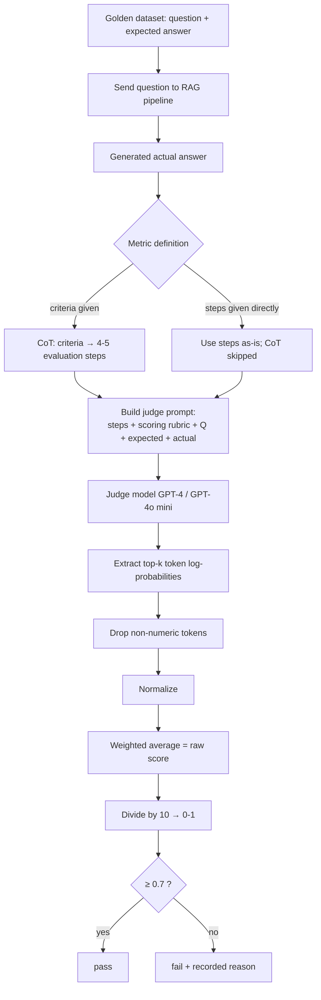

# CS-08 · G-Eval: The Deterministic LLM-as-a-Judge

> **Source transcript:** `Mastering_G-Eval_The_Deterministic_LLM-as-a-Judge_Framework_Explained_CampusX.txt` (English, 1,886 lines, runtime ≈ 1:26:51)
> **Domain:** methods
> **One-liner:** G-Eval fixes the two causes of variance in naive LLM-as-a-judge — a one-line criteria and integer token sampling — by expanding the criteria into a CoT-derived rulebook and replacing the emitted score with a probability-weighted average of the top-k numeric tokens.
> **Prerequisites:** CS-04, CS-07

---

## 0. Executive summary

The context is a **RAG pipeline's offline eval suite**, built at three levels — **component, pipeline, application** `[0:11]`–`[0:33]`. Component and pipeline levels are done (five metrics: **Recall, Precision, Faithfulness, Answer Relevance, Context Relevance**) `[3:15]`–`[3:34]`. This lecture moves to the **application level**, which has three suites: **quality, safety, operations** `[0:50]`–`[1:10]`. Today covers **quality only**, via three metrics: **correctness, completeness, style** `[1:19]`–`[2:11]`.

The pivot that motivates everything: all five earlier metrics share one pattern — they are **count-based**. Faithfulness is computed by breaking the answer into claims, checking each claim against the context, and counting (3/4) `[4:05]`–`[5:22]`. But some metrics have **no concept of counting at all** `[6:21]`–`[6:33]`: **style** (Why-What-How exists at answer level, not sentence level `[7:10]`–`[7:22]`), **correctness** (an analogy read in isolation looks unrelated to the golden answer and gets penalised `[9:05]`–`[10:02]`), plus **completeness**, **helpfulness**, and **all safety metrics** `[10:26]`–`[10:41]`. These need **judgment**, not counting `[7:37]`–`[7:55]`.

The obvious answer — point an LLM judge at it and ask for a 0–10 score — **does not work reliably** `[15:20]`–`[15:36]`. The score has **very high variance** `[17:43]`–`[18:08]`, for two reasons: (1) a one-line criteria is not a tight enough **constitution or rulebook**, so the LLM perceives it differently on each call `[18:58]`–`[20:17]`; (2) the output is an **integer token**, and token probabilities fluctuate between adjacent integers `[20:21]`–`[21:48]`. Averaged over 15 questions the score might be 60 one run and 75 the next — versus count-based metrics, which move 85 → 86 → 84 `[23:09]`–`[23:31]`.

**G-Eval** is a **2023 research paper** `[24:25]`–`[24:36]` with exactly **two core innovations** `[42:05]`–`[42:10]`:

1. **Convert high-level criteria into evaluation steps via Chain-of-Thought** — a rulebook the judge must follow, leaving it "no scope to use its own brain" `[26:04]`–`[27:48]`.
2. **Probability-weighted scores** — extract the **log probabilities of the top-k numeric tokens**, drop non-numeric tokens, normalize, and take the **weighted average** instead of the emitted integer `[30:35]`–`[36:03]`.

Worked numbers: a naive judge emits **8**; the weighted score for the same distribution is **7.84** `[36:03]`–`[37:03]`, divided by 10 → **0.784**, compared against a **0.7** threshold → pass `[37:47]`–`[38:10]`.

Live results on a 15-question golden dataset: correctness **66%** → after fixing the metric's over-strictness, **84%** `[1:01:04]`–`[1:08:28]`; completeness **68%** → after generator prompt engineering, **75%** `[1:13:56]`–`[1:16:49]`; style **54%** → after two fixes, **74%** `[1:20:48]`–`[1:24:41]`.

---

## 1. The problem this lecture solves

**Two classes of metric, and the wall the second one hits.**

| Class | Examples | How the score is produced |
|---|---|---|
| **Count-based** | Recall, Precision, Faithfulness, Answer Relevance, Context Relevance | break into claims → mark each favourable/unfavourable → count → apply a formula `[5:41]`–`[6:04]` |
| **Judgment-based** | **Style, Correctness, Completeness, Helpfulness, all safety metrics** | someone reads the whole answer and assigns a score `[7:37]`–`[7:55]`, `[10:26]`–`[10:49]` |

**Why style cannot be counted** `[6:34]`–`[8:16]`. CampusX's style is **Why-What-How**. But Why-What-How "will not exist in every single sentence. That Why-What-How will exist at the answer level. It will not exist at the sentence level." So claim-level decomposition destroys the very property you are measuring.

**Why correctness cannot be counted either** `[8:18]`–`[10:25]`. Suppose the chatbot uses an **analogy**. Break the answer into claims; one claim is now the analogy. Compare that claim in isolation against the golden answer — "obviously my judge LLM will say that this statement, this analogy, is not related to the golden answer … and it will penalize it." Verbatim conclusion: "you cannot check whether an answer is correct or not at the claim level. You will have to check it at the level of the entire answer."

**Why the obvious fix fails.** Using LLM-as-a-judge directly gives a theoretically valid but practically unreliable number `[15:20]`–`[15:36]`. The lecture names and rules out the wrong explanations first — judge errors ("that is always true"), latency and cost (negligible at 15 questions), a too-large system prompt ("the question might be one or two lines … the expected answer will be 10 lines … it isn't very large"), LLM bias `[15:54]`–`[17:41]`. The real answer is **variance** `[17:43]`–`[18:08]`: "when you evaluate once, you get one score. When you evaluate it a second time, you get a different score. This variation will be very high."

---

## 2. Definitions & mental models

**G-Eval, defined by what it is not** `[41:43]`–`[42:20]`:

> "G-Eval is actually a very simple thing. It only does two things differently. First, it breaks down your criteria into evaluation steps and a rubric, and second, rather than taking tokens as a score, we take a weighted score of log probabilities. That's it." … "If someone asks you why G-Eval is special? Is there anything particularly new? No, this is also just LLM-as-a-judge. But there are two core innovations."

**The mental model: determinism.** Every design choice in the lecture is justified by one objective. Verbatim at the end of the correctness run `[1:10:36]`–`[1:10:39]`: **"The whole point of G-Eval is to make the evaluation process more deterministic. Less probabilistic."**

**Auto-regression, the mechanism behind innovation 2** `[30:44]`–`[32:18]`. The final layer of the network has as many nodes as output tokens (assume 10,000). Each token gets a probability. The highest-probability token is printed, then appended to the input, and the process repeats — "your output gets printed in an auto-regressive manner." Because the prompt demands a number between 0 and 10, the digits 0–10 receive the large probabilities and words like "is", "the" receive very low ones `[32:22]`–`[33:24]`.

**The variance mechanism** `[33:28]`–`[34:00]`: probabilities across the ten digit tokens must sum to 1, so the model is often "a bit unsure between seven and eight" — 40% to seven and 51% to eight on one run, and 51% to seven and 40% to eight on the next. Different runs, different emitted integer.

| Term | Definition as used in the lecture |
|---|---|
| **Criteria** | the high-level statement of what to measure, e.g. "compare the actual answer against the expected answer and decide how factually correct it is" `[25:19]`–`[25:43]` |
| **Evaluation steps** | the 4–5 concrete rules CoT derives from the criteria; "a rulebook … a constitution on how we will measure correctness" `[26:35]`–`[26:50]` |
| **Scoring rubric** | explicit score bands (9–10 / 5–8 / 0–4) so the judge does not decide the scale itself `[29:48]`–`[30:02]`, `[1:09:21]`–`[1:09:44]` |
| **Log probabilities / weighted score** | the normalized top-k numeric-token probabilities, combined into a fractional score `[30:35]`–`[36:03]` |
| **strict_mode** | DeepEval flag: `False` → weighted calculation happens; `True` → the raw emitted integer is taken `[59:51]`–`[1:00:20]` |

**The correctness-vs-faithfulness distinction** `[50:52]`–`[52:18]`, introduced before the code walkthrough:

- **Faithfulness** = the answer is **grounded in the context** — extracted from what was taught in this course.
- **Correctness** = the answer is **factually right at a Google / world level**.
- There are **four combinations**: correct + faithful (ideal); **not faithful but correct** (I taught something wrong, and the generator answered from its own training knowledge); **factually incorrect but faithful** (I taught it wrong and it repeated my error); **both wrong** (it ignored the context, hallucinated, and the hallucination is also wrong).
- "Your RAG application's answer should be both faithful and correct."

---

## 3. Core content, decomposed

### 3.1 The naive LLM-as-a-judge baseline, and its two flaws `[11:08]`–`[24:09]`

**Setup.** Golden dataset of **15 rows**: a question and its correct answer, where "correct answer means a universally accepted answer — you would find the same on Google. It doesn't have to be what I taught in class." `[11:57]`–`[12:12]`

**The prompt** `[12:15]`–`[13:24]`, reproduced as given:

```
You are evaluating whether an AI's answer is correct.
You will be given a question and an expected answer.
Compare the actual answer against the expected answer and decide how factually
correct it is. Give a score from 0 to 10, where 10 is fully correct.
0 means completely wrong.
```

**The flow** `[13:24]`–`[14:05]`: pick a question from the golden dataset → send it to the RAG application → get a generated answer → put question + correct answer + generated answer into the prompt → judge LLM returns a score → repeat for all 15 → **take the average**.

**The structural difference from count-based metrics** `[14:05]`–`[14:41]`, stated verbatim: "Earlier, we used LLM as a judge for a small task — to break it down into claims and check if they are in the context or not — and then we would derive a score by calculating a ratio. Here, **no such ratio exists**. We are relying entirely on the LLM's judgment, asking it to look and simply give me a number out of 10."

**Flaw 1 — the criteria is not a rulebook** `[18:58]`–`[20:17]`. "You have only written this line … for every subsequent question you are making independent calls to the LLM, and it is possible that in each call, it perceives this statement differently. Because currently, this is not a very tight statement." The consequence: in one call the judge measures correctness from one aspect, in the next call from a different angle. "You haven't provided a very tight constitution … a rulebook on how exactly to measure correctness."

**Flaw 2 — integer tokens fluctuate** `[20:21]`–`[21:48]`. The model's internal distribution over digits was 7 → 40%, 8 → 51%, 6 → 9%, so it emits **8**. Re-run: 8 → 40%, 7 → 51%, 6 → 9%, so it emits **7**. "So it keeps fluctuating."

**Impact at dataset level** `[23:09]`–`[23:31]`: one run 60, one run 70, one run 75. Contrast with count-based metrics, where "if it was 85, it would become 86 or 84, but there isn't a jump from 75 to 85." Verbatim conclusion: "This is the biggest reason why this method is not used directly in the industry. **You don't use LLM as a judge directly.**"

**A homework assignment the lecturer sets** `[23:44]`–`[24:07]`: write the naive correctness metric yourself and run it three or four times — "I guarantee you that your result will vary a lot."

### 3.2 G-Eval innovation 1 — criteria → CoT evaluation steps `[24:21]`–`[30:11]`

**Step 1 — specify the metric and the criteria** `[24:53]`–`[25:57]`. Two inputs: *which* metric (correctness) and *what* the high-level criteria is ("compare the actual answer against the expected answer and decide how factually correct it is").

**Step 2 — bring in the judge and expand the criteria via CoT** `[26:00]`–`[27:48]`. The judge is generally **GPT-4** — "the paper states that G-Eval gives the best results with the GPT-4 model" `[26:08]`–`[26:13]`. Ask it to use **Chain of Thought** — "thinking step-by-step" — to convert the criteria into **four to five exact steps** `[26:35]`–`[26:44]`. The result is "a rulebook … a constitution on how we will measure correctness," and "all the evaluation you do afterward is based on this constitution."

**Step 3 — build the judge prompt** `[27:51]`–`[30:11]`. The example G-Eval system prompt given in the lecture:

```
You are an evaluator scoring the correctness of an AI-generated answer.
You will judge the actual output against the expected output.
[Evaluation steps:]
 - Compare only the factual claims in the actual output against the expected output.
 - A claim is wrong only if it contradicts the expected output or is factually false.
 - A factually accurate answer scores high even if it's shorter or covers fewer
   points; do not deduct for brevity or omitted points; only wrong statements count.
 - Additional correct information must never lower the score.
[Scoring rubric:]
 - 9 to 10 if ...
 - 5 to 8  if ...
 - 0 to 4  if ...
[Then: question, expected output, actual output.]
```

Two things are worth noticing. First, the steps explicitly **close the loophole** that broke the naive version: they forbid penalising brevity, omitted points, and extra correct information — the exact failure mode that the lecture later demonstrates live in §3.4. Second, a **scoring rubric** is added on top of the steps `[29:48]`–`[30:02]`, so the judge is not free to choose the scale either.

**Why this solves flaw 1** `[29:00]`–`[29:45]`: "As soon as you, rather than having a high-level criterion, convert it into a four-five set of bullet points — a constitution, a rulebook — then suddenly it becomes more deterministic compared to before. Now we haven't left any scope for it to use its own brain."

### 3.3 G-Eval innovation 2 — probability-weighted scores `[30:35]`–`[38:10]`

The mechanism, step by step, with the lecture's own numbers:

1. The prompt forces the output to be a digit 0–10, so the digit tokens carry the high probabilities while words carry near-zero ones `[32:22]`–`[33:24]`.
2. Extract the **top-k** tokens — k = **5** in the example — because extracting all 10,000 is too much compute `[33:59]`–`[34:22]`.
3. Assume the top 5 are **8 (0.70), 7 (0.20), 9 (0.05)**, plus non-numeric tokens "the" (0.01) and a colon `[34:22]`–`[34:47]`.
4. **Ignore the non-numerical tokens** — "numerical tokens are what matter" `[34:47]`–`[34:55]`.
5. The three remaining probabilities sum to **0.95**, not 1. **Normalize** by dividing all three by 0.95: **0.70 → 0.73, 0.20 → 0.21, 0.05 → 0.0526** `[35:04]`–`[35:37]`.
6. **Weighted average:**

```
score = 8 × 0.7368  +  7 × 0.2105  +  9 × 0.0526
      = 5.8944      +  1.4737      +  0.4737
      = 7.84
```

7. The naive route would have emitted **8**, because 8 had the highest probability `[36:09]`–`[36:46]`. G-Eval emits **7.84**.
8. Why this stabilises: "In every next run, your number won't jump from six to eight … it will go to 7.4 or 7.9. But it won't jump from six to eight." `[37:08]`–`[37:29]`
9. **Normalise to 0–1**: divide by 10 → **0.784** `[37:47]`–`[37:54]`.
10. **Threshold** at **0.7** — "as we have kept in every metric so far". Above 0.7 → pass (the answer is correct); below → fail `[37:54]`–`[38:10]`.

The lecture also points at the paper's own illustration of the same point `[40:00]`–`[40:22]`: with standard token usage the output would be **3**; with weighting it is **2.59**.

### 3.4 The DeepEval implementation `[42:42]`–`[1:00:35]`

DeepEval ships a `G-Eval` class, so "you could have done all this work manually as well … but the DeepEval library said that they are providing the G-Eval implementation for you" `[42:47]`–`[43:01]`.

| Parameter | Value used | Notes |
|---|---|---|
| **name** | `"correctness"` | identifies the metric `[43:46]`–`[43:52]` |
| **criteria** *or* **evaluation_steps** | see below | exactly one of the two `[55:52]`–`[57:09]` |
| **evaluation_params** | input, actual output, expected output | extracted from the golden dataset `[44:07]`–`[44:21]` |
| **model** | **GPT-4o mini** | "you can use any other GPT-4 model here as well" `[44:21]`–`[44:26]` |
| **threshold** | **0.7** | score is compared against it to label pass/fail `[44:26]`–`[44:40]` |
| **strict_mode** | **False** | `True` → skip the weighted calculation and take the emitted integer `[59:51]`–`[1:00:20]` |

**Criteria vs evaluation steps — a genuine design decision** `[55:52]`–`[59:33]`. If you provide **criteria**, G-Eval generates the steps internally via CoT. If you provide **evaluation steps** directly, the CoT step is **skipped**. The lecture's recommendation, stated as a rule:

> "When you have just started to design the evaluation pipeline, try sending criteria and trust the LLM that it will generate good evaluation steps. But as you run it two or three times and you start to understand what the picture is, then **send your own evaluation steps; that is the best**."

The reason is determinism: if the model regenerates the steps on every call, the steps themselves vary slightly between calls, reintroducing the variance you are trying to remove. Providing them yourself means "every single time I call the LLM, I am telling it exactly these same steps" `[57:32]`–`[58:26]`.

**The runtime flow** `[44:50]`–`[45:35]`, as the lecture narrates it: DeepEval breaks the criteria into evaluation steps → creates the prompt → sends it to the model → extracts the log probabilities of the top tokens → normalizes them → computes the weighted average → divides by 10 → compares with 0.7 → labels the test case true or false.

**File and command surface** `[53:00]`–`[54:35]`: the golden dataset lives at `goldens/correct_n_s_goldens.json` (15 questions, each with the ideal answer and the session in which that discussion took place); the eval file is `eval_application.py`; it is run with `python -m evals.eval_application`.

---

## 4. Frameworks & decision procedures

### 4.1 The G-Eval pipeline



### 4.2 Which metric requires which construction

| Metric | Golden dataset needs an ideal answer? | Why |
|---|---|---|
| **Correctness** | **Yes** `[11:38]`–`[11:53]` | it is judged against a reference answer |
| **Completeness** | **Yes** | judged by comparing coverage of the ideal answer's points `[1:12:03]`–`[1:12:23]` |
| **Style** | **No** | verbatim: "you don't even need an ideal answer here. There is no ideal answer here. You simply need to define a rubric very clearly describing what the CampusX style is like" `[1:17:48]`–`[1:18:03]` |

This is the reference-based / reference-free distinction from CS-07 appearing inside a single pipeline: correctness and completeness are reference-based, style is reference-free.

### 4.3 The debugging procedure this lecture actually follows

A repeating 4-step loop, applied three times:

1. **Run** the metric and read the pass/fail counts.
2. **Read the failure reasons** the judge cited, for the failing test cases specifically.
3. **Identify the common pattern** across failures.
4. **Change one of the two knobs** — the evaluator (criteria / evaluation steps / rubric) or the generator (system prompt) — and re-run.

Correctness used knob 1 `[1:01:19]`–`[1:08:23]`; completeness used knob 2 `[1:14:15]`–`[1:16:38]`; style used both `[1:17:51]`–`[1:23:46]`.

---

## 5. Worked end-to-end example

### 5.1 Correctness — 66% → 84% `[1:01:01]`–`[1:11:14]`

**First run.** Output: **66%**, with **8 of 15 passed and 7 failed**. For each failure the tool reports question, actual output, expected output, and the **reason** — e.g. one failure had a weighted average of **58** `[1:01:31]`–`[1:01:36]`.

**Diagnosis** `[1:01:39]`–`[1:02:46]`. The lecturer had tested this offline before class and knew the cause: the golden dataset's ideal answers were written **very thoroughly** by a human expert, while the RAG pipeline's generated answers were not of that quality — "if my question is 'What is an offline eval?', we have defined offline eval very well in our golden dataset, and our generated answer might only be covering 70% of it. So just because it is covering 70%, our evaluator, the LLM judge, is considering it incorrect because the coverage is not complete."

**Fix** `[1:02:50]`–`[1:06:52]` — two changes to the evaluator:

- **Refined evaluation steps** to say outright: reward statements matching the expected output in meaning regardless of wording; **"do not penalize the actual output for omitting information; only wrong statements count here."**
- **Added a scoring rubric** so the judge does not choose the scale itself: **0–4** if the generated answer contains any clear factual error; **5–8** if mostly correct with a couple of minor inaccuracies; **9–10** if all claims are factually correct. Stated rationale: "If you don't provide this scoring rubric yourself, G-Eval decides on its own how much to score an answer."

**Second run.** Score **84**, **14 passed, 1 failed** `[1:08:26]`–`[1:10:53]`.

**Determinism check** `[1:10:06]`–`[1:11:09]`. Re-run → **83**. "It won't be that it goes from 84 to 80, or 90, or 75." And the failing test case is the **same one both times — test case 7**. Verbatim: "So you can see this is very, very deterministic."

### 5.2 Completeness — 68% → 75% `[1:13:56]`–`[1:17:26]`

**Definition and method** `[1:11:20]`–`[1:12:36]`. Same golden dataset. If the ideal answer has **three points A, B, C** and the generated answer covers only **A and B**, ask an LLM to compare and say how complete the generated answer is. The lecture's example judge output: **6.5 out of 10**. Implementation: "just bring in another metric called completeness and just patch it into your existing code" — declare it below correctness, modify the `evaluate` call to take two metrics, run → both scores returned `[1:12:53]`–`[1:13:53]`.

**First run.** Correctness **0.83**; **completeness 0.68**, with only **5 passed and 10 failed** — "this is not a good result" `[1:13:56]`–`[1:14:15]`.

**Diagnosis** `[1:14:15]`–`[1:15:02]`. Read the failure reasons; they point at the **generator**, not the evaluator. The RAG pipeline's generator prompt instructs it to give **very concise answers from the context** — "essentially telling it to quietly generate an answer from the context without saying anything else." The generator's scope was limited by its own prompt.

**Fix — generator prompt engineering** `[1:15:08]`–`[1:16:27]`. Two lines added:

> "Answer thoroughly, identify every distinct part of the question and cover each one, and include all the relevant points the context provides for answering it. If the question has multiple parts or the concept has multiple components, address all of them rather than stopping at the first."

Crucially, the constraint is preserved: "I am not telling it to invent things on its own. It still has to provide the answer from the context."

**Second run.** Completeness **75**, **14 passed, 1 failed** — from 5 passed / 10 failed `[1:16:42]`–`[1:17:11]`.

### 5.3 Style — 54% → 74% `[1:17:28]`–`[1:24:41]`

**Definition and rubric** `[1:17:28]`–`[1:20:09]`. Two questions: does the answer follow CampusX style, does it follow our brand style? This is where the lecture explicitly notes **no ideal answer is needed**. The rubric text given:

> Reward an intuitive explanatory tone, plain language, the idea explained before any formula or jargon, and technical terms briefly unpacked when used. Reward a direct conversational register that addresses the student as a CampusX lecturer would, rather than a dry formal or textbook tone. Reward the use of a concrete example, analogy, or 'why it matters' framing.

And its score bands: **9–10** clearly in a CampusX teaching voice, intuitive conversational explanation before formalising; **5–8** reasonably clear but somewhat flat, formal, or textbook-sounding; **0–4** completely dry, stiff, jargon-heavy, or robotic, and does not read like a teaching explanation.

**First run.** Correctness 84 (reported as 8), completeness 75, **style 54** `[1:20:48]`–`[1:20:55]`. Expected, and the reason is stated: "we never guided our RAG chatbot on how to answer in the CampusX style."

**Fix — both knobs at once** `[1:21:06]`–`[1:23:41]`:

1. **Generator prompt.** Added: "write in flowing conversational prose, the way a teacher explains something out loud, not as a bulleted or numbered list. Only use a list when the question genuinely calls for enumeration. Explain the intuition first in plain language and briefly unpack any technical terms you use."
2. **Fixed an over-corrected evaluator metric.** The style rubric said to reward analogies and examples, and the judge then cited "the answer lacked analogies or examples" as its reason for every low score. The lecturer's own diagnosis: "I took that point to heart, deciding that every answer explanation must contain analogies or examples — which is not correct. Not every answer should contain analogies or examples. So this was kind of an over-correction." The counter-line added: **"An analogy or concrete example is a bonus when the concept is abstract, but a clear, direct, well-explained answer is fully acceptable."**

**Second run.** Style **74**, with **9 passed and 6 failed** `[1:24:41]`–`[1:25:19]`.

**Two closing notes on style.** First, threshold tuning: "You can also reduce the threshold slightly here. **7 is a bit harsh. It is too much. You can bring it down to six.**" `[1:25:19]`–`[1:25:26]` Second, the trade-off: "if this metric starts to reach too high, other metrics will start taking a hit. **Faithfulness** and such will start taking a hit. So, 74 is good." `[1:24:59]`–`[1:25:12]`

---

## 6. Pros, cons, exceptions

| | G-Eval | Naive LLM-as-a-judge |
|---|---|---|
| **Determinism** | score moves 84 → 83 between runs; the same test case fails `[1:10:06]`–`[1:11:09]` | score moves 60 → 70 → 75 `[23:09]`–`[23:16]` |
| **Cost** | same order — still one judge call per test case | same |
| **Latency** | same order | same |
| **Setup effort** | higher: you must write criteria, and eventually steps and a rubric | one-line prompt |
| **Requirement** | needs a model that exposes **token log probabilities** for the top-k | works with any chat endpoint |
| **Quality** | "you will see that G-Eval mostly gives you better results" `[39:50]`–`[39:56]` | unreliable in production |

**When to use it** `[50:18]`–`[50:33]`, answering a student question directly: "any metrics that are somewhat judgment-based. Correctness, completeness, style, your helpfulness, safety-related metrics. For all of these, you use G-Eval."

**When you can skip it** `[50:01]`–`[50:14]`: "you can simply use LLM as a judge. That will also work. But what's the problem? The score will jump around a lot. Ran it once and got 85. Ran it a second time and got 95."

**Exception — the reference-free case.** Style needed **no ideal answer at all** `[1:17:51]`–`[1:17:56]`. An answer to a student question confirms the general principle `[49:41]`–`[49:52]`: "What if we want to evaluate an LLM response based on specific guidelines but we do not have the expected answer?" — the answer given is "it depends on what you want to measure."

**Exception — the over-correction risk.** A rubric that is too strict produces a **false failure signal** that then drives a wrong prompt fix. The style rubric's analogy requirement is the worked case `[1:22:22]`–`[1:23:22]`. The lesson is that the failure reasons must be read as evidence about the *metric*, not only about the application.

---

## 7. Failure modes & anti-patterns

1. **Using LLM-as-a-judge with a one-line criteria.** It is "not a very tight statement"; the model perceives it differently per call `[19:26]`–`[20:17]`. Verbatim verdict: "You don't use LLM as a judge directly" `[23:34]`–`[23:37]`.
2. **Accepting the emitted integer as the score.** The integer is the argmax of a distribution that is often nearly tied; taking it throws away the model's own uncertainty `[20:21]`–`[21:48]`, `[48:01]`–`[48:07]`.
3. **Leaving the scoring scale to the judge.** If you do not supply a rubric, "G-Eval decides on its own how much to score an answer" `[1:05:49]`–`[1:05:55]`.
4. **Leaving the evaluation steps to be regenerated every call** once you understand your pipeline — the steps themselves drift and reintroduce variance `[57:32]`–`[58:26]`.
5. **Assuming count-based decomposition works for judgment metrics.** The analogy failure is the canonical counter-example `[9:05]`–`[10:02]`.
6. **Setting `strict_mode=True` in DeepEval** and silently losing innovation 2 — the weighted calculation will not happen `[59:51]`–`[1:00:20]`.
7. **Blaming the generator when the evaluator is the problem, and vice versa.** Correctness needed an evaluator fix `[1:08:52]`–`[1:09:01]`; completeness needed a generator fix `[1:14:15]`–`[1:15:02]`; style needed both `[1:23:36]`–`[1:23:46]`. Reading the failure reasons is what distinguishes them.
8. **Letting one metric be pushed to its maximum.** "If this metric starts to reach too high, other metrics will start taking a hit. Faithfulness and such will start taking a hit." `[1:25:05]`–`[1:25:12]`
9. **Keeping the default threshold without judgement.** 0.7 was described as "a bit harsh … you can bring it down to six" for style `[1:25:21]`–`[1:25:26]`.
10. **Confusing correctness with faithfulness.** They are different metrics; an answer can be one without the other in any of four combinations `[50:52]`–`[52:18]`.

---

## 8. Implementation notes

**DeepEval surface used**

```python
from deepeval.metrics import GEval
from deepeval.test_case import LLMTestCase, LLMTestCaseParams

correctness = GEval(
    name="correctness",
    evaluation_steps=[...],        # or criteria="..." to let CoT generate them
    evaluation_params=[LLMTestCaseParams.INPUT,
                       LLMTestCaseParams.ACTUAL_OUTPUT,
                       LLMTestCaseParams.EXPECTED_OUTPUT],
    model="gpt-4o-mini",
    threshold=0.7,
    strict_mode=False,             # must stay False to get the weighted score
)

test_case = LLMTestCase(input=q, actual_output=generated, expected_output=ideal)
evaluate([test_case], metrics=[correctness, completeness, style])
```

The lecture notes for correctness there is **no built-in metric in DeepEval** — recall and precision exist as built-ins, which is why G-Eval is used here `[43:22]`–`[43:38]`.

**File layout demonstrated** `[53:00]`–`[54:35]`:

| Path | Contents |
|---|---|
| `goldens/correct_n_s_goldens.json` | 15 questions with ideal answers, plus the session each discussion came from |
| `eval_application.py` | imports the goldens, builds the RAG pipeline, loops the 15 questions, builds the metrics, calls `evaluate` |
| run command | `python -m evals.eval_application` |

**Golden dataset construction** `[52:20]`–`[53:18]`: questions on one side, correct answers on the other; the correct answers are "what is considered correct by the world", created by "a human expert who has significant knowledge of the subject". Size: **15 questions**.

**Loop structure per run** `[54:45]`–`[55:38]`: read the golden dataset → build the RAG pipeline → loop 15 times → send the current question to the RAG pipeline → get the actual (generated) answer → build an `LLMTestCase` with question, actual output, expected output → evaluate with the metric list.

**Output surface** `[1:01:01]`–`[1:01:36]`: an overall score percentage, a passed/failed count out of 15, and per-failure detail — question, actual output, expected output, and **the reason for failure** including the raw weighted average (e.g. 58).

**Extensibility** `[1:25:37]`–`[1:26:28]`: the DeepEval G-Eval documentation lists further measurable properties — **coherence**, **tonality**, style, helpfulness. "The method is the same as we saw today." **Safety** metrics are flagged as the next session's topic and are also stated to use G-Eval `[1:26:14]`–`[1:26:21]`.

---

## 9. Interview-ready Q&A

**Q1. What are the two core innovations of G-Eval?**
(1) It converts high-level **criteria** into 4–5 **evaluation steps** using Chain of Thought — a rulebook or constitution. (2) Instead of taking the emitted integer token as the score, it takes a **probability-weighted average of the top-k numeric-token log probabilities** `[42:05]`–`[42:10]`.

**Q2. Is G-Eval a new evaluation paradigm?**
No. "It is also just LLM-as-a-judge." It is a way to **improve** LLM-as-a-judge, with exactly those two innovations and "nothing else in it" `[42:10]`–`[42:20]`.

**Q3. What exactly is wrong with naive LLM-as-a-judge?**
The score has **very high variance**: the same setup re-run gives a different score. Two causes — a one-line criteria is not a tight enough rulebook, so the LLM interprets it differently per call; and the output is an integer token chosen from a frequently near-tied distribution `[17:43]`–`[21:48]`. Dataset-level effect: 60 one run, 70 the next, 75 the next `[23:09]`–`[23:16]`.

**Q4. Why can't style be computed by the count-based approach used for faithfulness?**
Because style is an **answer-level** property, not a sentence-level one. CampusX's Why-What-How "will not exist in every single sentence. That Why-What-How will exist at the answer level. It will not exist at the sentence level" `[7:10]`–`[7:22]`.

**Q5. Why can't correctness be computed claim-by-claim against a golden answer?**
Because of things like **analogies**. An analogy is meaningful only inside the answer; decomposed into an isolated claim and compared against the golden answer, a judge LLM will call it unrelated and penalise it `[9:05]`–`[10:02]`.

**Q6. Walk through the probability-weighted score.**
Take top-k (k=5) tokens; suppose 8 → 0.70, 7 → 0.20, 9 → 0.05, plus non-numeric "the" → 0.01 and a colon. Drop non-numeric tokens. The remaining three sum to 0.95, so normalize: 0.7368, 0.2105, 0.0526. Weighted average = 8(0.7368) + 7(0.2105) + 9(0.0526) = **7.84**, versus the naive emitted **8**. Divide by 10 → **0.784**; compare against a **0.7** threshold → pass `[34:22]`–`[38:10]`.

**Q7. Why does the weighted average reduce variance?**
Because it incorporates the model's uncertainty rather than discarding it. "It won't jump from six to eight … it will go to 7.4 or 7.9" `[37:08]`–`[37:29]`.

**Q8. What model does the G-Eval paper recommend as the judge?**
**GPT-4** — "the paper states that G-Eval gives the best results with the GPT-4 model" `[26:08]`–`[26:13]`. The DeepEval demo uses **GPT-4o mini** `[44:21]`–`[44:26]`.

**Q9. When should you pass `criteria`, and when should you pass `evaluation_steps` directly?**
At the start of designing the pipeline, pass **criteria** and let the LLM generate the steps via CoT. After two or three runs, once you understand which questions pass and fail, write and pass the **evaluation steps yourself** — that removes the run-to-run step variation entirely `[58:31]`–`[59:33]`.

**Q10. What is the difference between correctness and faithfulness?**
Faithfulness = the answer is **grounded in the context**. Correctness = the answer is **factually right at the world level**. An answer can be one without the other: not faithful but correct (the generator answered from its own training knowledge instead of the context), or factually incorrect but faithful (the course itself taught it wrong). The ideal is both `[50:52]`–`[52:18]`.

**Q11. What were the observed scores in the demo, before and after fixes?**
Correctness **66%** (8/15 passed) → **84%** after refining the evaluation steps and adding a scoring rubric. Completeness **68%** (5/15 passed) → **75%** (14/15 passed) after generator prompt engineering. Style **54%** → **74%** (9/15 passed) after both a generator prompt fix and an evaluator over-correction fix `[1:01:04]`, `[1:08:28]`, `[1:13:56]`, `[1:16:49]`, `[1:20:55]`, `[1:24:41]`.

**Q12. Trap — "G-Eval's main innovation is that it uses GPT-4 as the judge." Why is that wrong?**
GPT-4 is a recommendation, not the innovation. The two innovations are CoT-derived evaluation steps and probability-weighted scoring. The lecture states this explicitly: "There is nothing else in it" `[42:05]`–`[42:10]`.

**Q13. Trap — "The evaluation criteria is too lenient, so raise the threshold." Why is that the wrong lever?**
Threshold and criteria do different jobs. The criteria and evaluation steps decide **what the score means**; the threshold decides **where you cut**. In the correctness case the fix was to the evaluation steps (stop penalising omitted information) and to add a scoring rubric — not to move the threshold. In the style case, adjusting the threshold was an explicit *afterthought* once the metric was already fixed `[1:02:50]`–`[1:06:52]`, `[1:25:19]`–`[1:25:26]`.

**Q14. Trap — "The completeness score is low, so the RAG pipeline is broken." Why might that be wrong?**
The low completeness score traced to the **generator prompt**, which explicitly instructed concise answers from the context. The fix was prompt engineering, and completeness then went 68 → 75 and failures dropped from 10 to 1 — with no change to retrieval or the model `[1:14:15]`–`[1:17:11]`.

**Q15. Trap — "A perfect style score is the goal." Why is that wrong?**
Because metrics trade off. "If this metric starts to reach too high, other metrics will start taking a hit. Faithfulness and such will start taking a hit. So, 74 is good." `[1:24:59]`–`[1:25:12]`

**Q16. Trap — "We have no expected answer, so we cannot evaluate this output at all." Why is that wrong?**
Style required **no ideal answer**: "you don't even need an ideal answer here. There is no ideal answer here. You simply need to define a rubric very clearly" `[1:17:48]`–`[1:18:03]`. This is a **reference-free** evaluation (CS-07).

---

## 10. Cheat sheet

**The 60-second version**
Count-based metrics (recall, precision, faithfulness, answer relevance, context relevance) work by decomposing the answer into claims and counting. Judgment-based metrics (style, correctness, completeness, helpfulness, safety) cannot — the property lives at the answer level. Using LLM-as-a-judge naively gives high variance for two reasons: a one-line criteria is not a rulebook, and the emitted integer token is chosen from a near-tied distribution. G-Eval fixes both: convert criteria into 4–5 CoT evaluation steps plus a scoring rubric, and replace the emitted integer with a probability-weighted average of the top-k numeric-token log probabilities. Divide by 10, compare against a 0.7 threshold. It is still LLM-as-a-judge — just deterministic.

**Core concepts (table)**

| Term | Meaning |
|---|---|
| Count-based metric | decompose into claims, mark, count, apply a formula |
| Judgment-based metric | read the whole output and assign a score |
| Criteria | high-level statement of what to measure |
| Evaluation steps | 4–5 concrete rules derived from the criteria via CoT |
| Scoring rubric | explicit score bands (e.g. 0–4 / 5–8 / 9–10) |
| Probability-weighted score | normalized weighted average of top-k numeric-token probabilities |
| strict_mode | DeepEval flag; must be **False** for the weighted score |
| Threshold | 0.7 default; pass/fail cut on the 0–1 score |
| Correctness | factually right at the world level |
| Faithfulness | grounded in the retrieved context |

**Formulas & metrics**

- Faithfulness (count-based, for contrast): `faithful claims / total claims` — e.g. 3/4 if three of four claims came from the context.
- G-Eval weighted score:
  `raw = Σ (digit_i × p_i) / Σ p_i` over the numeric top-k tokens only.
  Worked: digits 8, 7, 9 with raw probabilities 0.70, 0.20, 0.05 → divisor 0.95 → normalized 0.7368, 0.2105, 0.0526 → `raw = 7.84`.
- Normalized score: `score = raw / 10` → 0.784.
- Pass rule: `score ≥ threshold (0.7)` → pass; else fail.
- Dataset metric: **average** the per-question scores over the golden dataset.

**Decision rules (numbered)**
1. Property computable by counting? → use the count-based method.
2. Not computable by counting? → judgment-based → LLM-as-a-judge.
3. If you use LLM-as-a-judge, use **G-Eval** — do not use the naive one-shot version in production.
4. Designing the pipeline for the first time? → pass `criteria`, let CoT generate the steps.
5. After 2–3 runs, once you understand the pass/fail picture? → pass your own **evaluation steps**.
6. Always supply a **scoring rubric** if you want to control the scale.
7. Keep `strict_mode=False`.
8. Metric failing? → read the judge's stated failure reasons, look for the common pattern, then decide whether to fix the **evaluator** or the **generator**.
9. Ideal answer present in the golden set? → correctness / completeness style metric. Absent? → rubric-only, reference-free (style).

**Thresholds & defaults worth memorising**
- Default **threshold = 0.7** → above passes, below fails.
- Style threshold: 0.7 described as "a bit harsh"; **0.6** suggested.
- Golden dataset in the demo: **15 questions**.
- Token extraction: **top-5** tokens.
- Normalization divisor in the worked example: **0.95**.
- Worked weighted score: **7.84** (naive would print **8**); normalized **0.784**.
- Paper's illustration of the same effect: naive **3** vs weighted **2.59**.
- Score bands used in the rubric: **0–4 / 5–8 / 9–10**.
- Observed scores: correctness **66 → 84**; completeness **68 → 75**; style **54 → 74**.
- Determinism check: 84 → 83 on re-run, same failing test case.

**Tool commands (copy-pasteable shape)**

```python
from deepeval.metrics import GEval
from deepeval.test_case import LLMTestCase, LLMTestCaseParams

metric = GEval(
    name="correctness",
    evaluation_steps=[
        "Compare only the factual claims in the actual output against the expected output.",
        "A claim is wrong only if it contradicts the expected output or is factually false.",
        "A factually accurate answer must score at least 9 even if it is shorter; do not "
        "deduct for brevity, missing elaboration, fewer examples, or omitted points.",
        "Additional correct information must never lower the score.",
    ],
    evaluation_params=[LLMTestCaseParams.INPUT,
                       LLMTestCaseParams.ACTUAL_OUTPUT,
                       LLMTestCaseParams.EXPECTED_OUTPUT],
    model="gpt-4o-mini",
    threshold=0.7,
    strict_mode=False,
)
```

```bash
python -m evals.eval_application
```

**Top 10 mistakes**
1. Naive LLM-as-a-judge in production — high run-to-run variance.
2. One-line criteria with no evaluation steps.
3. Accepting the emitted integer instead of the weighted score.
4. `strict_mode=True` (silently disables innovation 2).
5. Letting the LLM regenerate evaluation steps on every call after you know them.
6. No scoring rubric, so the judge picks its own scale.
7. Decomposing a judgment metric into claims (the analogy trap).
8. Fixing the generator when the evaluator is at fault, or vice versa, without reading the failure reasons.
9. Over-correcting a rubric (the analogy-mandate mistake) and manufacturing false failures.
10. Driving one metric to its maximum and degrading faithfulness.

**If you only remember three things**
1. G-Eval = **LLM-as-a-judge + two fixes**: CoT-derived evaluation steps (a rulebook) and **probability-weighted log-probability scoring** instead of the emitted integer.
2. It exists because naive LLM-as-a-judge scores **jump around** (60 → 70 → 75); after G-Eval they move **84 → 83** with the same failing case.
3. Judge-based metrics need **judgment**, not counting — style and correctness cannot be decomposed claim by claim.

---

## 11. Glossary

- **Count-based metric** — a metric produced by decomposing output into claims, marking them, and computing a ratio or formula `[3:56]`–`[4:03]`.
- **Judgment-based metric** — a metric where someone (human or LLM) reads the output and assigns a score `[6:21]`–`[7:55]`.
- **Criteria** — the high-level statement of what to measure `[25:19]`–`[25:43]`.
- **Evaluation steps** — 4–5 concrete rules CoT derives from the criteria; the "rulebook" or "constitution" `[26:35]`–`[26:50]`.
- **Chain of Thought (CoT)** — thinking step-by-step; used here to expand criteria into steps `[27:16]`–`[27:36]`.
- **Scoring rubric** — explicit score bands supplied to the judge `[29:48]`–`[30:02]`.
- **Log probability / weighted score** — the normalized top-k numeric-token probabilities combined into a fractional score `[30:35]`–`[36:03]`.
- **Auto-regressive generation** — each emitted token is appended to the input and the process repeats `[32:09]`–`[32:18]`.
- **Threshold** — the 0–1 cut used to label a test case pass or fail `[37:54]`–`[38:10]`.
- **strict_mode** — DeepEval setting; `True` takes the raw integer and skips the weighted calculation `[59:51]`–`[1:00:20]`.
- **Correctness** — factually right at the world level `[51:20]`–`[51:23]`.
- **Faithfulness** — the answer is grounded in the retrieved context `[51:06]`–`[51:13]`.
- **Completeness** — how many of the ideal answer's points the generated answer covers `[1:11:48]`–`[1:12:23]`.
- **Style** — whether the answer matches the brand's teaching voice; reference-free `[1:17:37]`–`[1:18:03]`.
- **Over-correction** — a rubric rule stricter than the actual requirement, manufacturing false failures `[1:22:55]`–`[1:23:00]`.

---

## 12. Cross-references

- **CS-07** — LLM-as-a-judge, reference-based vs reference-free. This lecture is the production-strength version of that technique; style here is reference-free, correctness and completeness are reference-based.
- **CS-04** — the eval workflow; this lecture is a worked instance of its "define evaluation method" step under the judgment-metric case.
- **CS-06** — offline vs online evals; the whole lecture is an **offline** eval suite, and the source opens by framing it that way `[0:17]`–`[0:19]`.
- **CS-03** — multiple eval pipelines per application; here three metrics (correctness, completeness, style) run as three separate metrics over one pipeline.
- **CS-13 … CS-16** (Track B, `04-rag`) — RAG evals; the five count-based metrics (recall, precision, faithfulness, answer relevance, context relevance) and the RAG pipeline being tested belong there.
- **CS-21 … CS-24** (Track B, `06-production`) — the source's own roadmap: **safety and operations** suites, plus **regression testing**, come next `[1:26:47]`–`[1:26:51]`.
