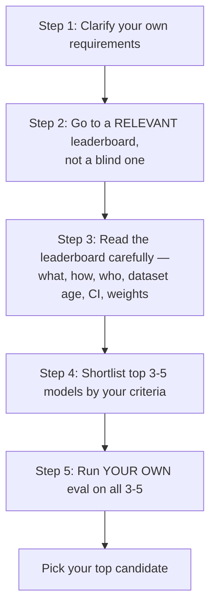

# CS-09 · How to Read LLM Leaderboards

> **Source transcript:** `How_to_Use_LLM_Leaderboards_CampusX.txt` (Hinglish, 707 lines, runtime ≈ 30:06)
> **Domain:** benchmarks
> **One-liner:** A leaderboard is a filtering tool, not a decision tool — use it to shortlist three to five candidate models, then run your own eval to pick one.
> **Prerequisites:** CS-05, CS-10

---

## 0. Executive summary

The lecture's definition, given verbatim: **"an LLM leaderboard is a public ranking and comparison table that shows how different LLMs perform on a common set of evaluations"** `[0:50]`–`[1:02]`. A **benchmark is an exam** scoring LLMs on one particular aspect `[0:23]`–`[0:31]`; the exam's results get published, and the place they are published is the leaderboard `[0:31]`–`[0:44]`.

Leaderboards exist for reasons that are named one by one: **comparing models across labs on a common reference** `[1:25]`–`[1:39]`; **providing third-party trust** rather than trusting a lab's own claims about its own model `[1:42]`–`[2:16]`; **guiding model selection when you cannot evaluate 100 models yourself** `[2:18]`–`[3:18]`; **detecting benchmark saturation** — when the top 10 models all score between **92 and 94** on a knowledge benchmark, the benchmark is saturated `[3:21]`–`[3:49]`; and **discovering new models** below the top three, which are "generally cheaper" `[3:51]`–`[4:27]`.

Six stakeholder groups use them: **AI engineers** (shortlisting), **frontier labs** (release strategy), **researchers** (research direction), **policy makers and safety institutes** (monitoring), and the **open-source community** (discovery and publicity) `[4:36]`–`[8:42]`.

Four leaderboard types exist, and the lecture ranks them by usefulness `[9:00]`–`[17:43]`:

| Type | What it does | Example named |
|---|---|---|
| **Benchmark-specific** | ranks on one benchmark only | **HLE (Humanity's Last Exam)** — Gemini 3 Pro at **38%** `[9:57]`–`[10:09]` |
| **Multi-benchmark** | joins many benchmarks into a composite score | **LiveBench** (23 objective tasks, 7 categories); **Artificial Analysis** |
| **Human-preference** | users vote between two anonymous answers | **LMArena** (battle mode) |
| **Application-specific** | one domain, many benchmarks | **Berkeley Function Calling Leaderboard** |

The bulk of the lecture is the **six or seven reasons not to trust a leaderboard blindly** `[18:30]`–`[25:13]`, including **Goodhart's Law** ("when a measure becomes a target, it becomes less useful as a measure") `[21:06]`–`[21:55]` and the warning that a **0.2-point gap between rank 3 and rank 5 means nothing** `[22:50]`–`[23:41]`.

It closes with the five-step reading procedure and the sentence the lecture calls the most important line of the session: **"Leaderboards are not a selection tool. Leaderboards are a filtering tool, not a decision tool."** `[28:50]`–`[29:03]`

---

## 1. The problem this lecture solves

Benchmarks (CS-10, CS-11) produce scores. But a score for one model is not comparable to a score for another unless both sat the same exam under the same conditions. The leaderboard is the artefact that makes comparison possible — "leaderboard ek single jagah ho jaatee hai jahaan para hum alag-alag models ko ek jagaha pe ek benchmark ke oopar compare kara sakte hain. So that hamen turanta ek overview mila jaae ki is benchmark men sabse badhiya model kaun saa hai?" `[1:08]`–`[1:22]`

The lecture's real problem, though, is behavioural rather than technical. The speaker names the bias directly `[18:13]`–`[18:29]`:

> "Most of the time, when you go to build an application, step one is **model selection** — and in model selection, step one is **going to the leaderboards to see which model is on top**. So we develop a bias inside us that if it is on the leaderboard, it must be right. But that is not the case."

Everything from `[18:30]` onward exists to dismantle that bias, and everything from `[25:13]` onward replaces it with a procedure.

---

## 2. Definitions & mental models

| Term | Definition as given |
|---|---|
| **Benchmark** | "an exam that tests LLMs on one particular aspect" `[0:25]`–`[0:31]` |
| **Leaderboard** | "a public ranking and comparison table that shows how different LLMs perform on a common set of evaluations" `[0:50]`–`[1:02]` |
| **Benchmark saturation** | visible when many top models cluster around the same score on a benchmark `[3:21]`–`[3:29]` |
| **Composite score** | a single number formed by joining multiple benchmarks' results `[10:39]`–`[10:48]` |
| **Human-preference ranking** | ranking produced from user votes between two anonymous model answers `[14:00]`–`[14:03]` |

**The school analogy** `[0:41]`–`[0:48]`: "just like your school has leaderboards that show who topped." The benchmark is the exam; the leaderboard is the notice board.

**The Kaggle analogy — why benchmark performance does not transfer** `[18:34]`–`[19:31]`. The lecture recalls a well-known claim: that solving Kaggle problems makes you a good data scientist in a real job. Why was that said? "Because the data you are given on Kaggle is very clean data. The problem statement is very clear, so generally you get easy work. In the real world, everything is messy." The parallel is exact:

> "The data in benchmarks is generally clean. Models will perform well on it. In the real world there are many things — ambiguous requests, missing information, company-specific data, tool failures, unusual edge cases. Whether the model handles all of these — don't know."

**Goodhart's Law** `[21:06]`–`[21:55]`, quoted as: **"when a measure becomes a target, it becomes less useful as a measure."** The lecture's own illustration is a car: "if you know that in India people buy cars only by mileage, then your whole engineering team focuses only on how to improve mileage. The whole engineering effort revolves around mileage. But the overall car becomes bad, because you are not focusing on things like how many seconds 0-to-100 takes. So if you make one metric a target, that metric is no longer a good metric."

---

## 3. Core content, decomposed

### 3.1 Why leaderboards exist — the five benefits `[1:25]`–`[4:27]`

**1. Cross-lab comparison on a common reference** `[1:25]`–`[1:39]`. "Same exam sat by all models. Who topped, who came second, who came last — that becomes known." The purpose named: deciding which model to use in your application.

**2. Third-party trust** `[1:42]`–`[2:16]`. "Generally leaderboards are third-party. If OpenAI or Claude says by itself that we scored this much on this benchmark, you probably won't trust it that much — because obviously OpenAI will want its model praised. But if a third party says we tested Claude too and OpenAI too, and these are the results, you will believe it more — because the third party's stake is not as high as OpenAI's or Claude's."

**3. Model selection without your own resources** `[2:18]`–`[3:18]`. You want a chatbot with maths capabilities. You obviously want to test it yourself. But is it possible for you to test **100 models** that currently exist? No. "You have to select one model. So your work becomes: bring 100 models and run those evaluations on all 100. That will take a lot of money, a lot of time and effort." If someone else is doing it for you, you simply go to the leaderboard, take the **top 10**, and pick from those.

**4. Detecting benchmark saturation** `[3:21]`–`[3:49]`. "If many top models start clustering around the same score. There is a benchmark that tests a knowledge capability — and the top 10 LLMs' scores are between **92 and 94**. As soon as clustering starts appearing on the LLM leaderboard, we understand that this benchmark is saturating."

**5. Discovering new models** `[3:51]`–`[4:27]`. The speaker's own practice since **2022–23**: "whenever I need to discover new models, I use LLM leaderboards. Because generally the top three stay the same — Google, OpenAI, and Anthropic models. But if you scroll down a bit, to **10, 12, 15, 20**, you start seeing new models. And these models are not the best, but they can be useful for your purpose — because they are generally **cheaper**."

### 3.2 Who uses leaderboards — the six stakeholders `[4:36]`–`[8:42]`

| Stakeholder | What they use it for |
|---|---|
| **AI engineers** (you and me) | **Shortlisting.** "Generally you do not select a single model from a leaderboard. You select **candidate models**." Then run your own evals on them → your best model. "100 → 5 filtering." `[4:36]`–`[5:14]` |
| **Frontier labs** | Where they are lacking, where they exist, and **whether to release the next model at all**. Worked: an OpenAI with GPT-5.5 against a competitor at Opus 4.8 — if the next model being trained can't beat Opus 4.8, don't release it: "people will immediately say this is worse than Opus 4.8, the previous model. So my brand's marketing is gone. I'd rather go back, do another iteration, go to the next iteration, and release when I see I can significantly leave the others behind on the benchmark." This is genuinely done as internal plans and strategy. `[5:17]`–`[6:25]` |
| **Frontier labs (stealth releases)** | A model appears on a leaderboard under a hidden name, without disclosing that it is a Google model, and "smashed all the benchmarks". Once the lab sees it significantly beating everything, it releases it publicly — and because the pseudonym has become famous, keeps the name. `[6:26]`–`[7:05]` |
| **Researchers** | What is happening now, which benchmarks are saturated, which are progressing well — and from that, new techniques and new AI ideas; a new research direction opens for people. `[7:07]`–`[7:28]` |
| **Policy makers and safety institutes** | Monitoring which models operate at which level, and whether a new model has suddenly left everyone far behind. Then "they have to come into the picture, they have to stop it, and they try to make changes in between" — the lecture's example is a U.S. government intervention triggered because a model looked dangerous. `[7:28]`–`[7:57]` |
| **Open-source community** | **Discovery.** A research lab of 101 people releases a small model that scores well on a single benchmark and lands in the top three → the lab gets publicity and the model becomes famous. "This is how the Chinese labs entered the picture" — "suddenly a new model came overnight and started competing with the top model on one benchmark, so it got discovered, publicised, marketed." `[7:57]`–`[8:42]` |

### 3.3 The four types of leaderboard `[9:00]`–`[17:43]`

**Type 1 — Benchmark-specific.** Ranks models using the results of **one particular benchmark** — "either it's MMLU, or HumanEval for coding, or GSM8K for maths, or GPQA" `[9:05]`–`[9:31]`. Its only claim: "which model performs best on this benchmark." **The problem**: "it gives you a very narrow view. How one model performs on one benchmark — that's all you find out. You get no idea about the overall model." Example shown: the **HLE (Humanity's Last Exam)** website, with **Gemini 3 Pro at 38%**. "Most of the famous benchmarks have their own leaderboards" — built and maintained by the research teams themselves on their own steam. "Not very useful, these kinds of leaderboards." `[9:33]`–`[10:29]`

**Type 2 — Multi-benchmark.** "Leaderboards that bring the results of multiple benchmarks together, give a composite score, and create the leaderboard" `[10:33]`–`[10:48]`. Named combination dimensions: **knowledge, reasoning, mathematics, coding, instruction following, data analysis** `[11:01]`–`[11:08]`.

Example given: **LiveBench** — "a challenging contamination-free LLM benchmark" with **23 objective tasks across 7 categories** — reasoning, coding, agentic coding — giving a score per category **and an overall score** `[11:13]`–`[11:33]`. Verdict: "a more useful leaderboard, because it gives you an overall view of how a model is on these general multiple capabilities."

**Bonus information these leaderboards carry** `[11:47]`–`[12:01]`: **cost per token, latency, output speed, context window size**. Example company: **Artificial Analysis** — "a company whose whole job is making leaderboards and providing this kind of information." Shown: separate leaderboards for **intelligence**, for **speed**, and for **cost per task**; also HLE, GPQA, Diamond; and further boards for **coding agents, speech, image, audio, hardware** — and an **overall** board that composites everything `[12:03]`–`[12:51]`.

Verdict `[12:51]`–`[13:11]`: "This is the most useful category, which personally I use the most and people also use the most." It answers: *which model provides the strongest overall combination of **capability, cost and performance**?* — "this is the leaderboard you will use the most."

**Type 3 — Human-preference based.** No benchmark ranking at all; you **get a comparison** `[13:13]`–`[13:25]`. The mechanism:

1. A user comes to your site.
2. You ask them to enter a question.
3. The same question goes to **two models**, A and B.
4. Both answers come back.
5. The user is asked: did you prefer A or B?
6. "So basically you, the user yourself, are scoring on the basis of helpfulness, clarity, writing quality, creativity — whatever the way of giving the answer is."
7. After many such votes are collected, a ranking is built and shown on the leaderboard.

Example: **LMArena** `[14:17]`–`[14:20]`. The lecture demonstrates it live in battle mode: enter "what are LLM leaderboards"; two anonymous models answer; the user reads both and is asked which is better; after a pick, the site **reveals** the two models. The lecture's own pick was then revealed against the other model, and the speaker's point is that he had not actually read carefully before voting `[14:20]`–`[14:58]`. "This is how, day and night, they collect votes from people all over the world and build this leaderboard."

**The limitation, stated explicitly** `[15:25]`–`[16:00]`:

> "It is not necessary that if a user finds one answer better, that answer is actually better. Many times we humans don't know — has it been formatted very well, or has it given an answer I personally like? So there is a bit of **human bias** here. But again, at scale, people all over the world are doing it, so you can still trust it. And that is why you'll see the top models are also leading in these leaderboards."

**Type 4 — Application-specific.** "Leaderboards built around a particular domain or task" `[16:03]`–`[16:12]`. Examples named: a dedicated **coding** leaderboard that combines all coding benchmarks into a single score; an **agentic task** leaderboard; one for **SQL query generation**; one for **medical questions** `[16:12]`–`[16:37]`. Named example: the **Berkeley Function Calling Leaderboard**, which "specifically tells you how good your model's **tool calling** capability is" and ranks models on that basis — "it operates in a single domain, even though it may be using multiple benchmarks" `[16:37]`–`[17:11]`.

**The usefulness ranking** `[17:11]`–`[17:43]`:
- **Least useful**: the single-benchmark leaderboard.
- **Most useful**: the multi-benchmark general-capability one, because it also tells you many other things — cost, latency, everything.
- **Human-based**: "popular for marketing — who is at the top on LMArena" — but it is also a category.
- **Application-specific**: use it if you are building an application for a particular domain.

### 3.4 Why you must not trust leaderboards blindly — six reasons `[18:30]`–`[25:13]`

**Reason 1 — Benchmark performance does not transfer to real applications** `[18:34]`–`[19:31]`. "If a model is hitting 80–90 on a general leaderboard, it does not mean it will give you equally good results in your real application." Full comparison: benchmarks are clean data with clear problem statements; the real world has **ambiguous requests, missing information, company-specific data, tool failures, unusual edge cases**.

**Reason 2 — Contamination** `[19:31]`–`[19:59]`. "Benchmarks are very easily contaminated, and if benchmarks are contaminated then their leaderboard score is also contaminated and inflated. It will look better than it is." The displayed score may be genuine — "or the model may have **memorised** it, or it already knew such questions."

**Reason 3 — Over-optimisation for the leaderboard** `[20:01]`–`[21:06]`. "A very genuine problem, and in the last one or two years people have started discussing it: models get over-optimised for the leaderboard."

The mechanism, step by step:

1. A particular leaderboard becomes very popular — e.g. LMArena.
2. The most-discussed question becomes "who is topping LMArena?"
3. Companies see that, so they want to top it.
4. To top LMArena you must please humans; to please humans you format answers a certain way and give slightly verbose answers, because verbose answers have a higher chance of being selected and voted for.
5. So they **feed that kind of data into their training or fine-tuning stages**.
6. Result: "your model will score well on the leaderboard, but its real-world capabilities will not improve."

**Reason 4 — Composite leaderboards are opaque about their construction** `[22:04]`–`[22:47]`. For leaderboards that combine multiple benchmarks:

- Which benchmarks are **included**, which are **excluded** — decided by the leaderboard, and not disclosed.
- How are the scores **normalised**?
- If an overall score is computed across different capabilities, **how much weight is given to each capability**? — also not disclosed.

"These kinds of things remain hidden, and sometimes they can trouble you. So whenever you are looking at a leaderboard, the more transparency it has, the better; the more you can find out about that leaderboard, the better."

**Reason 5 — Small differences are noise** `[22:50]`–`[23:41]`. "Small differences on the leaderboard don't matter." Worked: two models, one at **84.3**, one at **84.1**. One lands at **rank 3** and the other at **rank 5**. "But the difference was only 0.2." The failure mode this produces: "we start thinking, let's grab the third one, we won't even look at the fifth one for our application. But there's a good chance both are very similar — and the fifth might actually be better for your application." The consequence is **rank bias**. "If the difference is small, the models are at the same level." And in the **top 10 vs rank 25** there is not much difference either: "one or two questions can go wrong for anyone."

**Reason 6 — Human-preference leaderboards carry human biases** `[23:41]`–`[24:10]`. "The top model there does not necessarily mean it is objectively the top model. Humans like **longer answers**, **more confident answers**, **better-formatted answers**, **more entertaining answers**. But it's possible that the model that is actually better doesn't know how to do all these things — so it will fall behind in human leaderboard ranking."

**Reason 7 — Scores are still incomplete and self-reported** `[24:13]`–`[25:00]`. Using the HLE leaderboard as the example: Gemini 3 Pro is listed at **38.3**, but the most recent models are not there — "because these people haven't submitted yet." Therefore: old model versions' results appear while new ones' don't; sometimes **discontinued** models' results appear. And in some leaderboards, "the results are put up by the companies themselves. A company putting up its own result is also not a good thing — so why trust it?"

Closing: "there are six or seven reasons due to which you should not blindly trust leaderboards. But be a little careful — it's a useful thing, but don't be blind." `[25:00]`–`[25:13]`

---

## 4. Frameworks & decision procedures

### 4.1 The five-step leaderboard reading procedure `[25:13]`–`[29:25]`

**Step 1 — write down your own constraints before opening any leaderboard** `[25:36]`–`[26:21]`. Five questions, "write them down very clearly":

1. What type of application are you building?
2. How much **latency** does that application need?
3. How much **cost** can you bear?
4. What are your **context** needs?
5. Is there a **deployment constraint** — can I use generally publicly available models, or must I use an **on-premise** model?

Why it matters, verbatim: "if this is clear, then you won't be biased towards the rank-1 model. Automatically you'll start thinking objectively — if I have to use on-premise, then obviously I can't use Claude; I'll have to go towards open source. Your mind opens up."

**Step 2 — go to the leaderboard that relates to your work** `[26:21]`–`[27:11]`. Explicitly: "you won't go to a blind leaderboard."

| If you are building… | Go to |
|---|---|
| an **agent** | an agent-related leaderboard |
| a **chatbot** | an LMArena-type leaderboard, because that gives you a direct objective measurement of chatting |
| a **RAG** | **MTEB** — the embedding-model ranking leaderboard (RAG requires an embedding model) |
| under a **budget constraint** | **Artificial Analysis** or similar, because there you get an exact indication of which models cost how much and how much you will spend |

**Step 3 — read the leaderboard carefully** `[27:13]`–`[28:20]`. The checklist as given:

- What is being scored?
- How is it being scored?
- **Who evaluated it?**
- How much **inference budget** was there?
- Is **reasoning** happening or not?
- How old is the **evaluation dataset**? How much older?
- Is it being **updated**? Is a **private test set** maintained?
- Has the benchmark **saturated**?
- **Confidence intervals** — if the dataset is small, is the confidence interval given? "If it has not been given, then two very close models are effectively the same."
- If it is a **composite** leaderboard joining multiple benchmarks into one score, **what weight was given to the different capabilities**?

Verbatim: **"Blindly don't trust a number. You have to read the stars below it."** And: "read all these things, read the **FAQ** frequently — then you will be in a better position to judge that leaderboard."

**Step 4 — shortlist top 3–5 models** based on your criteria `[28:22]`–`[28:28]`.

**Step 5 — run your own evaluation** on all of them `[28:32]`–`[28:50]`. "When you have your own five models, then comes your fifth and most important step: you will run **your own evaluation** on all five models. And when those five models are run on your own evaluation set and the results they give — from that you get your top candidate."

### 4.2 The rule that governs the whole procedure

> **"This is the most important line that you have to take from this session: leaderboards are not a selection tool. Leaderboards are a filtering tool, not a decision tool."** `[28:50]`–`[29:03]`

The wrong strategy, named explicitly: "you don't go to a leaderboard and decide that I will use this model to build my application. No, that is the wrong strategy." The right one: "you shortlist four or five top models with the help of leaderboards, and then run your own custom evals on all of them and pick one model for your application." `[29:03]`–`[29:25]`

---

## 5. Worked end-to-end example

**The lecture's own live demonstration of LMArena** `[14:20]`–`[15:03]`:

1. Enter LMArena's battle mode and type a question — in this case, *"what are LLM leaderboards"*.
2. Two models sit behind the scenes; the user is not told which.
3. Both produce an answer.
4. The user reads both and is asked: **"A is better / B is better / Both are good / Both are bad."**
5. The speaker picks a winner **without having read the answers**. "Let's see — I said B is better."
6. The site then **reveals** which models were behind A and B.
7. Over a day, across the whole world, this voting continues and a leaderboard is built from it.

The speaker's self-critique is the teaching point: he voted without reading, which is exactly the human-bias mechanism that Reason 6 describes `[15:37]`–`[15:52]`.

**The frontier-lab release decision, worked as a decision** `[5:33]`–`[6:25]`:

| State | Value |
|---|---|
| Incumbent | GPT-5.5 (the lab's current model) |
| Competitor | Opus 4.8 |
| New model being trained | cannot beat Opus 4.8 on a particular benchmark |
| Decision | **do not release** |
| Reason | users would immediately say it is worse than the previous model → brand marketing destroyed |
| Alternative action | iterate again; release only when the benchmark shows a significant lead |

**The rank-3 vs rank-5 noise example** `[22:54]`–`[23:18]`:

| Rank | Score |
|---|---|
| 3 | 84.3 |
| 5 | 84.1 |

Difference: **0.2**. The lecture's judgement: at this gap the two models are at the same level and the rank-5 one may actually be better for your application.

**Saturation example** `[3:31]`–`[3:47]`: a knowledge benchmark where the **top 10 LLMs score between 92 and 94** → clustering → the benchmark is saturating.

---

## 6. Pros, cons, exceptions

| Leaderboard type | Pros | Cons |
|---|---|---|
| **Benchmark-specific** | simple; authoritative (maintained by the benchmark's own research team); gives a decisive answer for one capability | "a very narrow view"; no idea about the overall model; "not very useful" |
| **Multi-benchmark** | overall capability view; carries cost, latency, output speed, context window; answers the capability/cost/performance trade-off; **recommended** | construction is opaque — inclusion, exclusion, normalisation and weighting are undisclosed; vulnerable to saturation and contamination `[22:04]`–`[22:47]` |
| **Human-preference** | reflects real human judgement at global scale; "the top models are also leading in these leaderboards"; popular for marketing | human bias toward longer, more confident, better-formatted, more entertaining answers; the preferred answer need not be the better one; **also a target for over-optimisation** `[15:25]`–`[16:00]`, `[20:01]`–`[21:06]` |
| **Application-specific** | directly relevant to a domain; single-domain focus even when built from multiple benchmarks | only useful if you are building for that domain `[17:11]`–`[17:43]` |

**When to trust a leaderboard** — the conditions the lecture implies by its checklist: high transparency, disclosed benchmark selection and weights, disclosed evaluation method and evaluator, a maintained private test set, reported confidence intervals, and a recent update. "The more transparency it has, the better."

**When to distrust it** — small score gaps, an un-updated board, missing recent models, self-reported results, opaque composite weights, human-vote boards taken as objective quality.

---

## 7. Failure modes & anti-patterns

1. **Using a leaderboard to select rather than to filter.** Named as "the wrong strategy" `[29:03]`–`[29:12]`.
2. **Rank bias** — treating rank 3 as meaningfully better than rank 5 when the gap is 0.2 `[22:50]`–`[23:41]`.
3. **Assuming benchmark performance transfers.** Clean benchmark data with clear problem statements is not your production traffic with ambiguous requests, missing information, company-specific data, tool failures and unusual edge cases `[18:34]`–`[19:31]`.
4. **Ignoring contamination.** A leaderboard score can be inflated because the model memorised the questions `[19:31]`–`[19:59]`.
5. **Being the target, not the observer.** If your team optimises for a popular leaderboard, you get the leaderboard score without the real capability — Goodhart's Law in production `[20:01]`–`[21:55]`.
6. **Reading a composite score as a fact.** You do not know what was included, excluded, normalised or weighted `[22:04]`–`[22:47]`.
7. **Treating a missing confidence interval as a real gap.** With a small dataset and no CI, two close models are effectively the same `[27:41]`–`[27:53]`.
8. **Trusting the number instead of reading the definitions.** Verbatim: "Blindly don't trust a number. You have to read the stars below it." `[28:06]`–`[28:10]`
9. **Going to a blind leaderboard.** Not the one related to your work → you get an irrelevant signal `[26:23]`–`[26:31]`.
10. **Opening a leaderboard before writing down your own latency, cost, context and deployment constraints.** Without them you default to the rank-1 model `[25:36]`–`[26:21]`.
11. **Taking a human-preference board as objective quality** `[23:41]`–`[24:10]`.

---

## 8. Implementation notes

**Stakeholder analysis before you read anything** — the lecture's own framing of the ecosystem `[4:30]`–`[4:36]`: three kinds of stakeholder, then extended to six. Knowing who publishes a board tells you what incentive shaped it: labs (release strategy and stealth launches `[5:17]`–`[7:05]`), research teams (their own benchmark's board `[10:20]`–`[10:27]`), a third-party analytics company (Artificial Analysis `[12:03]`–`[12:51]`), a crowdsourced voting site (LMArena `[14:17]`), or the community at large `[7:57]`–`[8:42]`.

**Boards and sites named in this lecture**

| Name | Type | What it shows |
|---|---|---|
| **HLE / Humanity's Last Exam** | benchmark-specific | Gemini 3 Pro at **38%** (also cited as **38.3**) `[9:57]`–`[10:09]`, `[24:21]`–`[24:26]` |
| **LiveBench** | multi-benchmark | "challenging contamination-free" benchmark; **23 objective tasks** across **7 categories**; per-category and overall score `[11:13]`–`[11:33]` |
| **Artificial Analysis** | multi-benchmark (analytics company) | separate boards for intelligence, speed, cost per task; HLE, GPQA, Diamond; coding agents, speech, image, audio, hardware; plus an overall composite `[12:03]`–`[12:51]` |
| **LMArena** | human-preference | battle mode; pairwise anonymous votes; revealed after voting `[14:17]`–`[15:05]` |
| **BFCL / Berkeley Function Calling Leaderboard** | application-specific | tool-calling capability ranking `[16:40]`–`[17:01]` |
| **MTEB** | application-specific (embeddings) | embedding-model ranking; recommended for RAG work `[26:46]`–`[26:54]` |

**Benchmarks referenced by name** `[9:23]`–`[9:28]`: **MMLU**, **HumanEval** (coding), **GSM8K** (maths), **GPQA**.

**What a good multi-benchmark board must disclose** — derived from the checklist in §4.1: benchmark list, normalisation method, per-capability weights, evaluator identity, inference budget, dataset age, update cadence, private-test-set maintenance, saturation status, and confidence intervals.

**Analyst note:** the model names in this transcript are romanised and therefore uncertain. The forms appearing are *GPT-5.5*, *Opus 4.8* (`OPS 4.8`), *Gemini 3 Pro*, a stealth name rendered `Naino banana`, and a ranking line rendered `phebala phaaiva 5.6 sola 4.8 thinkinga`. These are almost certainly future or placeholder model names used for teaching, and the romanisation makes exact spelling unreliable. The structural claims — that a stealth-released model topped leaderboards before being publicly attributed, and that Anthropic/Google/OpenAI occupy the top three — are what the source asserts; treat the specific version numbers as illustrative.

---

## 9. Interview-ready Q&A

**Q1. Define an LLM leaderboard.**
"A public ranking and comparison table that shows how different LLMs perform on a common set of evaluations." `[0:50]`–`[1:02]`

**Q2. What is the difference between a benchmark and a leaderboard?**
A benchmark is an exam testing LLMs on a particular aspect; a leaderboard is where the exam's results are published so models can be compared in one place `[0:23]`–`[0:44]`, `[1:05]`–`[1:22]`.

**Q3. Give the most important line from this topic.**
"Leaderboards are not a selection tool. Leaderboards are a filtering tool, not a decision tool." `[28:50]`–`[29:03]`

**Q4. Name the four types of leaderboards.**
Benchmark-specific; multi-benchmark (composite); human-preference based; application-specific. Least useful is benchmark-specific; most useful is the multi-benchmark general-capability one `[9:00]`–`[17:43]`.

**Q5. What extra information do multi-benchmark leaderboards give beyond scores?**
Cost per token, latency, output speed, and context window size `[11:47]`–`[12:01]`.

**Q6. Why can't you trust a leaderboard blindly? Give reasons.**
Benchmark performance does not transfer to real applications (clean data vs ambiguous, incomplete, company-specific real-world inputs); benchmarks are easily contaminated and inflate scores; models get over-optimised for popular leaderboards; composite boards hide their benchmark selection, normalisation and weights; small score differences are noise; human-preference boards carry human biases; and scores are incomplete and sometimes self-reported `[18:30]`–`[25:13]`.

**Q7. Explain Goodhart's Law and its application here.**
"When a measure becomes a target, it becomes less useful as a measure." If a leaderboard becomes the goal, training and fine-tuning data get shaped to please that leaderboard — e.g. verbose, well-formatted answers to win human votes — so the board score rises without real capability improving `[20:01]`–`[21:55]`.

**Q8. What is the car analogy for Goodhart's Law?**
If Indian buyers choose cars only by mileage, the whole engineering team focuses on mileage and the overall car gets worse because nobody is working on 0-to-100 time `[21:23]`–`[21:47]`.

**Q9. What should you clarify before opening any leaderboard?**
Five things: what type of application you are building; the latency it needs; the cost you can bear; your context requirements; and whether there is a deployment constraint (public models vs on-premise) `[25:36]`–`[26:21]`.

**Q10. Which leaderboard should you use for a RAG application, and why?**
**MTEB** — because RAG requires an embedding model, and MTEB ranks embedding models `[26:46]`–`[26:54]`.

**Q11. Give the checklist for reading a leaderboard carefully.**
What is scored; how it is scored; who evaluated it; how much inference budget was used; whether reasoning was enabled; how old the evaluation dataset is; whether it is updated; whether a private test set is maintained; whether the benchmark is saturated; whether confidence intervals are reported; and, for composites, what weights the capabilities carry `[27:13]`–`[28:03]`.

**Q12. Trap — "Model A is rank 3 at 84.3 and Model B is rank 5 at 84.1, so pick A." Why is this wrong?**
A 0.2 gap is noise; the two models are at the same level, and the rank-5 model may actually be better for your application. "If the difference is small, the models are at the same level." Rank bias is the failure mode `[22:50]`–`[23:41]`.

**Q13. Trap — "We topped the leaderboard, so our model is genuinely better." Why might that be false?**
Three ways it can be false: contamination (the model memorised the questions), over-optimisation (training data shaped to please that board rather than to improve capability), and non-transfer (clean benchmark data does not predict performance on messy real-world inputs) `[19:31]`–`[21:06]`, `[18:34]`–`[19:31]`.

**Q14. Trap — "The dataset is small, but the model is 1 point ahead, so it wins." What's missing?**
A **confidence interval**. If the dataset is small and no CI is reported, two very close models are effectively the same `[27:41]`–`[27:53]`.

**Q15. What decision does a leaderboard legitimately support?**
Shortlisting. "Generally you do not select a single model from a leaderboard. You select candidate models" — then run your own evaluations on the shortlist `[4:55]`–`[5:06]`, `[28:32]`–`[28:50]`.

**Q16. Why does a lab sometimes withhold a trained model?**
If the new model cannot beat the competitor's current model on a benchmark, releasing it invites "this is worse than the previous model" and destroys the brand's marketing. The lab iterates again and releases only when the benchmark shows a significant lead `[5:33]`–`[6:15]`.

---

## 10. Cheat sheet

**The 60-second version**
A benchmark is an exam; a leaderboard publishes the exam results so models can be compared on one common reference. Leaderboards give you cross-lab comparison, third-party trust, model selection without doing 100 evaluations yourself, saturation detection, and new-model discovery. There are four types: single-benchmark (least useful), multi-benchmark composite (most useful, also carries cost/latency/speed/context), human-preference (LMArena; biased toward long, confident, well-formatted answers), and application-specific (BFCL, MTEB). Do not trust them blindly: benchmark performance does not transfer to real applications, benchmarks get contaminated, models get over-optimised for popular boards (Goodhart's Law), composite boards hide their weights, small gaps are noise, human boards carry human bias, and scores are often incomplete or self-reported. Read them in five steps: clarify your constraints, go to the relevant board, read the definitions carefully, shortlist 3–5 models, then run your own eval. **Leaderboards filter; they do not decide.**

**Core concepts (table)**

| Term | Meaning |
|---|---|
| Benchmark | an exam testing LLMs on one aspect |
| Leaderboard | public ranking table over a common set of evaluations |
| Benchmark-specific board | ranks on one benchmark only |
| Multi-benchmark board | composites many benchmarks into one score |
| Composite score | one number joining multiple benchmarks' results |
| Human-preference board | ranking from pairwise user votes |
| Application-specific board | built around one domain or task |
| Saturation | top models clustering at the same score |
| Goodhart's Law | when a measure becomes a target it becomes less useful as a measure |
| Rank bias | over-weighting small rank differences |
| Confidence interval | the missing disclosure that makes a small gap meaningless |

**Thresholds & defaults worth memorising**
- Saturation signal in the lecture: top 10 LLMs **between 92 and 94** on a knowledge benchmark.
- Meaningless gap: **84.3 (rank 3) vs 84.1 (rank 5)** — a **0.2** difference.
- Top **10** models are the standard slice to take from a board when you cannot evaluate everything.
- Shortlist size before your own eval: **top 3 to 5**.
- Discovery scroll depth: look at ranks **10, 12, 15, 20** — not just the top 3.
- HLE figure cited: Gemini 3 Pro at **38%** / **38.3**.
- LiveBench: **23 objective tasks** across **7 categories**.

**The five-step procedure (copy-pasteable)**
1. Write down: application type, latency need, cost ceiling, context need, deployment constraint (public vs on-premise).
2. Choose the board that matches your work — agent board / LMArena-type / **MTEB** for RAG / Artificial Analysis for budget.
3. Read the definitions: what is scored, how, by whom, inference budget, reasoning on/off, dataset age, update cadence, private test set, saturation, confidence intervals, composite weights.
4. Shortlist the **top 3–5** models against your criteria.
5. Run **your own** evaluation on all of them; pick the top candidate.

**Top 10 mistakes**
1. Using a leaderboard as a decision tool instead of a filter.
2. Rank bias on sub-point differences.
3. Assuming a benchmark score predicts your application's performance.
4. Ignoring contamination.
5. Training to top a leaderboard instead of to improve capability.
6. Treating a composite score as transparent when its weights are hidden.
7. Reading a gap with no confidence interval as real.
8. Trusting the number without reading the definitions and FAQ.
9. Going to a leaderboard unrelated to your use case.
10. Opening a board before clarifying your own latency, cost, context and deployment constraints.

**If you only remember three things**
1. **Leaderboards are a filtering tool, not a selection tool** — shortlist 3–5, then run your own eval.
2. **Benchmark performance does not transfer** — clean benchmark data is not your messy production traffic, and contamination plus Goodhart's Law can inflate a score without improving the model.
3. **Read the stars, not the number** — what is scored, how, by whom, on what data, at what age, with what confidence interval, and with what weights.

---

## 11. Glossary

- **LLM leaderboard** — a public ranking and comparison table over a common set of evaluations `[0:50]`–`[1:02]`.
- **Benchmark** — an exam testing LLMs on one particular aspect `[0:25]`–`[0:31]`.
- **Third-party trust** — the belief that a lab-neutral evaluator's result is more credible than a lab's own claim `[1:42]`–`[2:16]`.
- **Benchmark saturation** — clustering of top models at the same score, so the benchmark no longer discriminates `[3:21]`–`[3:47]`.
- **Candidate models** — the shortlist a leaderboard produces, from which your own eval selects `[4:57]`–`[5:06]`.
- **Stealth release** — a model appearing on a leaderboard under a hidden name before public attribution `[6:40]`–`[6:56]`.
- **Benchmark-specific leaderboard** — ranking built from one benchmark's results `[9:05]`–`[9:23]`.
- **Multi-benchmark leaderboard** — ranking built from a composite of several benchmarks `[10:33]`–`[10:48]`.
- **Composite score** — the single number formed by joining multiple benchmarks `[10:39]`–`[10:48]`.
- **Human-preference leaderboard** — ranking from pairwise user votes on anonymous answers `[13:13]`–`[14:03]`.
- **Application-specific leaderboard** — a leaderboard scoped to one domain or task `[16:03]`–`[16:12]`.
- **Contamination** — benchmarks being leaked into training data, inflating scores `[19:31]`–`[19:48]`.
- **Over-optimisation for the leaderboard** — shaping training data to please a board's scoring rather than improving capability `[20:01]`–`[21:06]`.
- **Goodhart's Law** — "when a measure becomes a target, it becomes less useful as a measure" `[21:06]`–`[21:18]`.
- **Confidence interval** — the disclosure that tells you whether a small score gap is meaningful `[27:41]`–`[27:53]`.
- **Rank bias** — over-weighting rank position when the underlying scores are close `[23:25]`–`[23:28]`.
- **MTEB** — the embedding-model ranking leaderboard, recommended for RAG work `[26:46]`–`[26:54]`.
- **BFCL (Berkeley Function Calling Leaderboard)** — the tool-calling capability ranking `[16:40]`–`[17:01]`.

---

## 12. Cross-references

- **CS-10** — the evolution of AI knowledge benchmarks (MMLU, GSM8K, HumanEval, HLE and the rest); this lecture assumes you know what a benchmark is and focuses on where its results get published.
- **CS-11** — benchmark saturation vs contamination; two of the six reasons not to trust a leaderboard are treated in full there.
- **CS-05** — model evals and capabilities; the eight capabilities a multi-benchmark leaderboard composites are defined there, and the model-selection decision this lecture supports is the "selection" use case from that lecture.
- **CS-12** — selecting the right LLM and running custom model evals; this lecture's step 5 ("run your own eval on the shortlist") is that lecture's subject, and the source names it as the immediate next session `[29:27]`–`[30:06]`.
- **CS-02** — the curriculum map; the source places custom evals next and application evals (RAG and agent) after that `[29:54]`–`[30:06]`.
- **CS-13 … CS-16** (Track B, `04-rag`) — RAG evals; MTEB as the embedding-model leaderboard is the bridge from this lecture into that domain.
- **CS-17 … CS-20** (Track B, `05-agentic`) — agent evals; the source's step 2 recommends going to an agent-related leaderboard when building an agent.
