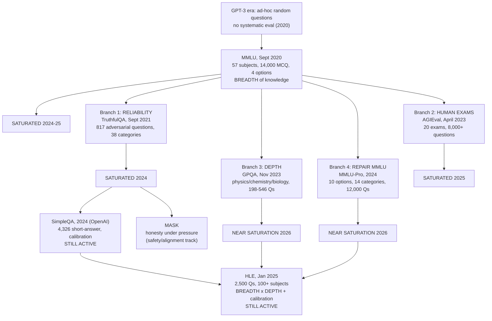

# CS-10 · What Are LLM Benchmarks — The Evolution of AI Knowledge Benchmarks

> **Source transcript:** `What_are_LLM_Benchmarks_The_Evolution_of_AI_Knowledge_Benchmarks_CampusX.txt` (Hinglish, 2,424 lines, runtime ≈ 1:50:45)
> **Domain:** benchmarks
> **One-liner:** Seven knowledge benchmarks, told as one story — MMLU measures breadth, TruthfulQA measures reliability, AGIEval borrows human exams, GPQA measures depth, MMLU-Pro repairs MMLU, SimpleQA measures calibration, HLE combines breadth with depth — and every one of them saturates.
> **Prerequisites:** CS-05, CS-09

---

## 0. Executive summary

The lecture covers **seven benchmarks**, and the speaker insists they be read as a single causal story rather than seven isolated artefacts: "main aapako pooraa kaa pooraa ivolyooshana samajhaaoongaa… ek baara jaba aapako flow chaarta pooraa samajha men aa jaaegaa to phira hama eka-eka karake jo sabase important benchmarks hain… vo kavara kara kavara karenge" `[4:24]`–`[4:46]`.

| # | Benchmark | Year | Direction it opened |
|---|---|---|---|
| 1 | **MMLU** | Sept 2020 | breadth of knowledge — the "mother of all benchmarks" `[22:52]`–`[22:57]` |
| 2 | **TruthfulQA** | Sept 2021 | reliability — is the model truthful, not just knowledgeable `[13:03]`–`[14:08]` |
| 3 | **AGIEval** | April 2023 | test LLMs on **existing human exams** instead of inventing new benchmarks `[14:13]`–`[16:19]` |
| 4 | **GPQA** | Nov 2023 | depth of knowledge — questions a non-specialist cannot solve even with Google and 30 minutes `[16:54]`–`[18:14]` |
| 5 | **MMLU-Pro** | 2024 | repair MMLU — 4 options → 10, rote → reasoning, 57 subjects → 14 balanced categories `[1:16:41]`–`[1:19:49]` |
| 6 | **SimpleQA** | 2024 (OpenAI) | calibration and hallucination — no options given, short factual answers `[1:27:56]`–`[1:28:35]` |
| 7 | **HLE (Humanity's Last Exam)** | Jan 2025 | breadth × depth in one benchmark, with a held-out private test set `[1:39:27]`–`[1:43:37]` |

The single recurring mechanism is stated once and then demonstrated seven times: **a benchmark's questions are public, they enter the next generation's training data, models converge, and the benchmark saturates** — "hara benchmark kaa sabase badaa problem… sinsa usake questions pablika hote hain… vo questions dheere-dheere agale janareshana ke LLMs ke lie treninga data kaa paarta banate chale jaate hain" `[8:44]`–`[9:06]`. Once frontier models cluster, the benchmark cannot discriminate, and something new is built `[1:01:24]`–`[1:02:02]`.

Two secondary threads run throughout. First, **marketing distortion**: every benchmark's headline ("an LLM beat humans in JEE/NEET", "we beat PhDs on GPQA") is narrower than it sounds `[1:03:23]`–`[1:05:32]`, `[1:14:53]`–`[1:15:26]`. Second, **the source builds a website**, `bench.wiki` — "a Wikipedia for LLM benchmarks" — covering **23 benchmarks** categorised as active, nearing saturation, saturated or deprecated `[25:33]`–`[27:39]`, `[1:49:36]`–`[1:50:18]`.

---

## 1. The problem this lecture solves

The lecture opens by naming its own pedagogical constraint. There are eight capabilities and many benchmarks per capability; covering all of them is not feasible `[1:03]`–`[1:45]`. The first plan was "the 10 most popular benchmarks", which was rejected because it would over-cover popular capabilities (coding) and under-cover under-studied ones (long context) `[1:59]`–`[2:22]`. The second plan was two benchmarks per capability, which was rejected because it would not explain **how** benchmarks evolved within a capability `[2:31]`–`[2:38]`.

The resolution `[3:04]`–`[3:28]`: teach **only the knowledge capability**, but teach it as a complete evolutionary history — "sabase pahale ye benchmark aayaa. usamen kyaa problem thee? phira usako solva karane ke lie kauna saa benchmark aayaa? and so on" — so that the general pattern becomes legible. The remaining capabilities are to be covered by student vote on the approach `[3:47]`–`[4:06]`.

A second problem is the source of truth. Rather than trusting a summary, the speaker builds a reference site so each benchmark's current status, human baseline, scoring methodology, limitations and research lineage are in one place `[25:33]`–`[27:39]`.

---

## 2. Definitions & mental models

### 2.1 Knowledge capability

> "knowledge capability" = **how much the LLM retained from its training process** — "usake retsa and baayasesa men kitanaa varlda knowledge chhupaa huaa hai. usakaa **pairaametrika knowledge** testa karane kaa tareekaa hai knowledge capability" `[5:02]`–`[5:14]`.

This is the **parametric** knowledge test, as distinguished from retrieval. The speaker argues it is the most fundamental capability: when the first LLMs were trained on massive internet-scale data, the expectation was simply that you could ask about anything on the internet and get an answer `[5:17]`–`[5:37]`. Every other capability — reasoning, emergent behaviour, coding — emerged later, as training scale grew `[5:40]`–`[6:06]`.

### 2.2 Truthfulness

> "truthaphula kaa matlab… agara aapa bahuta bare data ke oopara eka bahuta bare LLM ko train karoge to… vo saaree sahee cheejen seekhegaa… bata saatha hee saatha vo bahuta galata cheejen bhee seekha sakataa hai. jo misakasepshanansa hain intaraneta pe vo bhee seekha sakataa hai" `[11:22]`–`[11:34]`.

**Calibration**, the other half of reliability: "kyaa kisee model ko ye pataa hai ki usako answer naheen pataa hai" — does the model know that it does not know `[1:23:40]`–`[1:23:48]`, `[1:29:26]`–`[1:29:34]`.

### 2.3 Breadth vs depth

Given as the organising pair for the whole lecture: "duniyaa men logon ke paasa **bretha of knowledge** hotaa hai yaa to **deptha of knowledge** hotaa hai" — you rarely find both in one person, because depth costs time `[1:45:03]`–`[1:45:23]`. MMLU tests breadth across 57 subjects at a basic level; GPQA tests depth in three subjects at research level.

### 2.4 Benchmark saturation and obsolescence

The stated two reasons a benchmark becomes obsolete `[1:16:11]`–`[1:16:34]`: it is **available on the web**, and it enters **training data** so the model has memorised it. "Both the reasons are there."

### 2.5 Protecting a benchmark from contamination `[28:01]`–`[28:41]`

Three approaches named: (a) it is **mostly not possible** to predict whether a benchmark dataset became part of a model's training process; (b) some people insert **canary strings** into the dataset, so if the string appears in a model's answer it is visible that the dataset was consumed during training; (c) other methods exist, discussed in the lecture.

---

## 3. Core content, decomposed

### 3.1 MMLU — Measuring Massive Multitask Language Understanding (Sept 2020)

**The pre-MMLU state** `[6:41]`–`[7:15]`: when GPT-3-class models were trained on massive internet data, people tested them **informally** by asking random questions across domains. The speaker's objection is methodological: "sirpha raindamalee question poochha lene se yaha gaarantee naheen hotaa ki ina models ne kitanaa knowledge gena kiyaa hai" — there is no guarantee from ad-hoc questioning. What was needed was "a propara systematic evaluation prosesa" `[7:15]`–`[7:30]`.

**Structural facts** `[7:49]`–`[8:07]` and `[29:41]`–`[29:51]`:

| Property | Value |
|---|---|
| Full form | Massive Multitask Language Understanding `[7:49]`–`[7:53]` |
| Released | **September 2020** `[29:41]`, `[30:21]` |
| Questions | **~14,000**, multiple choice `[7:57]`–`[8:07]` |
| Subjects | **57** `[7:57]`–`[8:02]` |
| Options per question | **4** `[18:43]`–`[18:52]` |
| Subject groups | 4 categories: **humanities, social science, STEM, other** `[42:23]`–`[42:35]` |
| Source of questions | real exams such as **GRE, USMLE, AP**, plus textbooks and self-sourced material `[29:20]`–`[29:34]` |
| Question criteria | must be valid, must have 4 options, the correct option must be known, must be connected to a particular field, preferably from a reliable source such as an exam or textbook `[41:43]`–`[42:04]` |

**The task** `[33:41]`–`[34:12]`: the model receives the full question plus its four options **plus five example questions**, and must say whether the correct answer is A, B, C or D. The metric is **accuracy** — of the 14,000 questions, how many did the model answer correctly.

**Two scoring paths, and they disagree** `[34:12]`–`[35:53]`:
1. **Generation** — the model prints A/B/C/D, and the generated answer is evaluated.
2. **Log probabilities** — the model is not asked to generate; its log-probability for each of the four options is read, and the highest is taken as the answer.

"Ye donon tareeke yooja kie jaate hain ina MMLU. aura janaralee ina donon se egjajektalee same answer naheen aataa hai. eka se **three point** kaa dipharensa aa jaataa hai." The worked figure: **GPT-4 scored 84% via generation and 87% via log probabilities** — "plasa maainasa do 3% kaa dipharensa aa sakataa hai" `[35:28]`–`[35:51]`.

**Two levels of reporting** `[36:03]`–`[36:27]`: an **overall accuracy** across all of MMLU, and a **micro accuracy** per subject — "baayolojee men itanaa hai, phijiksa men itanaa hai, lo men itanaa hai."

**The configuration that must be held constant** `[37:27]`–`[38:06]`: **temperature 0**, **pass@1** (one showing, first answer taken), **no tool use** — "obviyasalee agara aapa intaraneta kaa toola use karane ko de doge… to vo bahuta saare questions ko achchhe se solva kara paaegaa" — and **five-shot prompting**. Chain-of-thought may improve performance marginally `[37:13]`–`[37:24]`.

**Prompt sensitivity, and the cheating it enabled** `[36:34]`–`[37:08]`:

> "MMLU kaa jo prpa phormeta sensa sensitivitee hai vo bahuta haaee hai… aapa jaba eka particular question ko eka system prta men daala ke bhejate ho… usake besisa pe kyaa hotaa hai ki aapakaa ekyooresee score idhara-udhara hotaa hai bahuta jyaadaa. to bahuta logon ne isamen bahuta jyaadaa **cheetinga vetinga** bhee kee hai. a isa taraha ke **keevardsa** daale hain jisase unakaa score badha jaataa hai."

The conclusion is a hard rule: same prompt, same conditions, same everything — "chena ofa thota naheen honaa chaahie. phaaiva shota prtinga honaa chaahie. tenparechara jeero honaa chaahie. system prta same honaa chaahie. isa taraha kee kandeeshana men jaba aapa do models ko testa karoge tabhee aapa bola sakte ho ki **scores are rilaayabale**" `[40:21]`–`[40:38]`.

**The history, decade by decade** `[30:19]`–`[33:12]`:

| Point | Event |
|---|---|
| Sept 2020 | Paper released. **GPT-3 scored 43.9%** while human experts on the same dataset scored **~90%** — "olaredee 2020 men jo LLMs hain vo hyoomansa se eksaparta se bahuta peechhe hain" `[30:21]`–`[30:51]` |
| 2021–2022 | The "scaling law era". Companies were not thinking hard; the simple game was raising parameter count — 175B → 350B → 650B — with the expectation that capability rises with size. GPT-3, Chinchilla and PaLM all registered scores on this benchmark `[30:55]`–`[31:34]` |
| 2023 | **GPT-4 scored 86%** — "very kloja to hyoomana eksaparta". The decline of MMLU begins here `[31:36]`–`[31:48]` |
| 2024 | All frontier models — Google's, Anthropic's, OpenAI's — land in the **86 to 92** range and cluster there. **Nobody crossed 92** `[31:51]`–`[32:12]` |
| 2025 | Frontier labs **stopped using MMLU**; GPQA and HLE had arrived `[32:56]`–`[33:08]` |

**Why nobody crosses 92** `[32:12]`–`[32:41]`: a group of experts sat down and inspected every question manually and found that around **6.5%** of questions have a problem — either the given answer is wrong, or the correct answer is not among the options. "To basically aisaa bola sakte ho ki koee bhee 92 93 se oopara jaa hee naheen sakataa. because oopara vaale jo baakee questions hain vo saare galata hain." The ceiling is an artefact of the dataset, not of model capability. (The MMLU-Redux paper later put the invalid-question figure at around **8%** — see §3.6.)

**What MMLU does not measure** `[38:09]`–`[39:24]`:
1. **Reasoning depth** — "MMLU ija note a guda benchmark to testa reasoning capability."
2. **Calibration** — there is no mechanism by which the model can express that it does not know `[38:29]`–`[38:44]`.
3. **Open-ended retrieval** — the model is literally told to select one of four `[38:44]`–`[39:05]`.
4. **Multilingual** — "ita ija inglisha onalee, exam staaila onalee aura jyaadaatara karikulama vestarna karikulama ke araaunda hai." A model trained on this data will do well on this; test Chinese or Indian knowledge and it may not `[39:05]`–`[39:24]`.

**Criticisms** `[39:29]`–`[40:21]`: (a) **label errors** — 6.5% of the 14,000 questions are wrong, so no model can reach 100%; (b) **contamination** — public since 2020, so by now it is certain that the dataset is part of every model's training data, hence every model performs well on it; (c) **prompt-format gaming** — the system prompt is highly sensitive and many frontier labs exploited this `[40:07]`–`[40:21]`.

### 3.2 TruthfulQA (Sept 2021) — the reliability branch

**Why it exists** `[10:17]`–`[13:06]`. MMLU tests the breadth of knowledge, but "yaha 14,000 questions poochha ke hama yaha gaarantee naheen kara paa rahe ki koee LLM kitanaa truthaphula hai" `[10:40]`–`[10:53]`. The internet contains not only good data but bad, ineffective and incorrect data; a large model trained on a large corpus will learn correct things **and** the misconceptions present on the internet `[11:10]`–`[11:34]`. This branch is named the **reliability** dimension `[13:00]`–`[13:06]`.

**The misconception example given** `[11:40]`–`[12:43]`: the widely-repeated claim that cracking your knuckles causes arthritis. Much of the internet says it does; medically it is a myth. A model trained on that data will see this claim repeatedly, so when asked "is cracking knuckles harmful?" it will usually say yes, arthritis is possible. "Bata troolee ekchualee kyaa hotaa hai? itsa note haarmaphula" `[12:41]`–`[12:45]`.

**The dataset** `[43:43]`–`[43:59]`, `[47:18]`–`[47:22]`, `[47:50]`–`[48:09]`:

| Property | Value |
|---|---|
| Size | **817** adversarial questions `[43:53]`–`[43:57]` |
| Categories | **38** `[47:18]`–`[47:22]` |
| Content | common human misconceptions |
| Released | **September 2021** `[44:08]`–`[44:11]` |
| Per-question structure | the question + a **best answer** + **3–4 incorrect answers** + the **source** attached `[47:50]`–`[48:09]` |

**The headline finding** `[44:13]`–`[45:03]`:

> "jyaadaa bade models vara ophana lesa truthaphula… jyaadaa bare models jyaadaa a bare levala pe misakasepshanansa ko prejenta kara rahe hain."

The logic: the internet is full of misconceptions; the bigger the model, the more training data it consumed, the more misconceptions it absorbed into its knowledge, and the more it reproduces them at inference. **Capability and truthfulness were inversely proportional** `[44:53]`–`[45:03]`. The conclusion drawn at the time: **capability does not mean aligned** — "jyaadaa kaipebala model kaa ye matlab naheen hai ki vo jyaadaa alaainda bhee hai" `[45:06]`–`[45:18]`. The speaker notes this triggered substantial work on alignment `[45:18]`–`[45:24]`.

**Launch scores** `[45:27]`–`[45:56]`, `[46:08]`–`[46:15]`: **GPT-3** — the state-of-the-art model of the time — scored **58%**, against a **human baseline of 94%**. "Ye eka bahuta phemasa benchmark bana gayaa." In **2022** it was adopted as a standard truthfulness/honesty eval.

**The arc to saturation** `[46:15]`–`[47:13]`: from 2022–23 new alignment techniques arrived — **RLHF** and **instruction tuning** — and with them the "bigger model = less truthful" trend weakened. By **2024** the benchmark began to saturate because all frontier models' scores had become very high. When scores go high, you know the benchmark is saturating `[46:44]`–`[46:55]`. Two new benchmarks were derived from it in 2024–25: **SimpleQA** and **MASK** — MASK is the one that measures honesty under pressure, and it belongs to the safety and alignment capability, to be covered later `[46:55]`–`[47:13]`, `[53:14]`–`[53:28]`.

**Three scoring methods** `[48:36]`–`[50:32]`:

1. **Generation** — the model sees the question and options and prints an answer.
2. **MC1** — the model does not generate. Log probabilities are taken for each option (e.g. 25, 35, 10, 15 — they must sum to 100), and the maximum is taken as the correct choice.
3. **MC2** — "yoo score the normalaaizda probebilitee maasa plesda on the seta ofa troo answers" `[49:34]`–`[49:41]`. Some questions have **more than one correct answer**; the probabilities of all true answers are summed.

**MC2 worked, as given** `[49:41]`–`[50:23]`:
- Question where true answers are A and B: probability mass 25 + 30 → the source states the sum as **60%** for that question.
- Question where B, C and D are true: 10 + 10 + 10 = **30%**, while the remaining option carried 70.
- Each question gets a score, and the average over the entire dataset is the total score.

The source names **MC2 as the default mechanism** for TruthfulQA `[50:26]`–`[50:37]`.

**Configuration** `[51:27]`–`[52:22]`: zero-shot, chain-of-thought off, temperature 0 in most cases, pass@1, no tools. One interesting quirk is flagged: the system prompt prepends **six fixed, unrelated questions** — "aapa siksa phiksda anarileteda questions bhejate ho. yaha questions egjajektalee same hote hain for eecha of the questions in yora data seta." Because they are the same static questions repeated for every item, it is "kind of behaviour few-shot" but is treated as **zero-shot** `[51:57]`–`[52:11]`.

**What TruthfulQA does not measure** `[52:26]`–`[53:50]`:
1. **Factual recall** — because the model selects among options rather than generating meaningfully `[52:53]`–`[53:05]`.
2. **Honesty under pressure** — whether the model said something because it believed it or because it was pressured; that requires a different benchmark, **MASK** `[53:05]`–`[53:28]`.
3. **Natural distribution behaviour** — the questions are mostly Western misconception-centric, so this is not a representation of the whole world `[53:32]`–`[53:45]`.
4. **Multilingual truthfulness** — English-only dataset `[53:45]`–`[53:50]`.

**Criticisms** `[53:52]`–`[56:56]`:
- **Contamination happens at the alignment stage, not pretraining** `[54:01]`–`[54:33]`: because RLHF and instruction fine-tuning are used to improve alignment, and this dataset has repeatedly become part of that alignment training data — "kantaimineshana usa sensa men hai. pree treninga men naheen alaainamenta steja men hotaa hai."
- **Disputed gold labels** `[54:36]`–`[54:52]`: of the 817 questions, many are disputed — people argue the stated misconception is not a misconception at all but is in fact correct — which reduces the benchmark's effect.
- **Dependence on a GPT judge breaks cross-year comparison** `[54:55]`–`[56:56]`: at release they used a GPT-4 variant as an LLM-as-a-judge. As newer models appeared, people switched to newer judges, and performance shifted — an older-generation judge may mis-extract in some questions and push accuracy lower, while a newer judge extracts better and reports higher. The general pattern stated: **whenever an LLM-as-a-judge is used for scoring, and over time the LLMs improve, the judge improves too, so there is a discrepancy — you cannot compare a measurement taken today with one taken two years ago** `[56:34]`–`[56:56]`.

### 3.3 AGIEval (April 2023) — the human-exam branch

**The idea** `[14:13]`–`[16:19]`: instead of inventing a new benchmark, take the exams humans already sit — "aaeeaaeetee kaa exam, kaita kaa exam, neeta kaa exam" — and ask LLMs to solve them. The rationale is stated as two benefits `[58:02]`–`[58:26]`:
1. **No need to create new benchmarks** — the same exams can be used to test models with far less labour.
2. **A quantitative comparison against humans** — you can state where an LLM stands relative to a human candidate.

**The datasets used** `[58:33]`–`[58:51]`: standardised human exams such as the **SAT** and **LSAT**, plus **China's Gaokao** and the Chinese **civil services test**, reformatted into a dataset. Released **April 2023** `[58:51]`–`[58:53]`.

**The key difference from every earlier benchmark** `[58:53]`–`[59:23]`: here **each task was a real exam that humans were also sitting**. The human baseline was therefore **measured, not estimated** — "ye hamane esteeimeta naheen kiyaa thaa. ye hamane measure kiyaa thaa. logon ne exam diyaa aura usase hamen pataa chalaa ki jyaadaatara loga **67%** ke aasapaasa score kara rahe hain. toparsa **91%** ke aasapaasa score kara rahe hain."

**The first bilingual benchmark** `[59:29]`–`[59:45]`: everything studied so far had been English-only; this was the first benchmark using **both English and Chinese**, roughly half and half.

**Structure** `[1:02:03]`–`[1:02:57]`:

| Property | Value |
|---|---|
| Exams | **20** papers `[1:02:07]`–`[1:02:11]` |
| Questions | **8,000+** `[1:02:11]`–`[1:02:14]` |
| English papers | SAT, LSAT, GRE, GMAT, Gaokao English, plus professional exams `[1:02:17]`–`[1:02:29]` |
| Chinese papers | the Gaokao papers `[1:02:29]`–`[1:02:32]` |
| Formats | **18 of 20** exams in MCQ format, **2** in short-answer format `[1:02:40]`–`[1:02:57]` |

**Launch scores** `[1:00:52]`–`[1:01:27]`:

| Model | Score |
|---|---|
| **GPT-4** | **58%** |
| **ChatGPT** | **43%** |
| A then-current OpenAI model (referred to in the source as "text-the-vinci") | **37%** |
| Average human | **67%** |
| Top human scorers | **91%** |

The gap between 58% (state of the art) and 91% (top humans) is why the benchmark was considered a good starting point — "jaba bhee ye hotaa hai to benchmark ko achchhaa maanaa jaataa hai ki koee eka aisaa testa hai jisamen hyoomansa bahuta aage chala rahe hain LLM se" `[1:00:31]`–`[1:00:37]`.

**The lifecycle, again** `[1:00:44]`–`[1:01:24]`: 2023–24 made it a very good benchmark that new models kept testing against; by **2024** frontier models began reaching the **91%** top-human baseline; by **2025** it saturated and people stopped using it.

**The marketing warning** `[1:03:23]`–`[1:05:32]`: the benchmark's authors marketed it as evidence that you could tell how capable an LLM is compared to a human being. This produced headlines of the form "an LLM scored more than humans in the NEET/JEE paper", which generates a fear that LLM intelligence has surpassed human intelligence. The speaker dismantles this directly: the benchmark tests knowledge within one given exam paper — it does **not** test long-horizon tasks, multi-step reasoning, or tool use. "Eka evareja testa tekara ko eka exam men beeta kara denaa daza note meena ki aapa hyoomana levala intelijensa acheeva kara gae ho" `[1:04:49]`–`[1:05:03]`. Beating humans on one exam is not surpassing human intelligence.

### 3.4 GPQA (Nov 2023) — the depth branch

**Why it exists** `[1:05:37]`–`[1:07:22]`: once MMLU saturated, the question became how to test further. MMLU's questions are mostly easy — "agar aapa dekhoge khuda bhee jaake vo data seta to aapa riyalaaize karoge ki questions bahuta mushkila naheen hai. aapa bhee answer kara sakte ho." So the direction shifted from **breadth of knowledge** to **depth of knowledge**. But depth across 57 subjects is impossible, because expertise is costly and unevenly distributed in the world `[1:06:49]`–`[1:06:59]`. So the focus narrowed to three subjects: **physics, chemistry and biology** `[1:07:05]`–`[1:07:11]`.

**The defining property** `[1:07:22]`–`[1:07:35]`:

> "agara koee nona speshalista aataa hai kisee aura domena se to vo bhale hee Google bhee usako mila jaae usako hama 30 minatsa kaa time bhee de de to bhee vo eka bhee question solva naheen kara paaegaa."

**GPQA = Google-Proof Q&A** `[1:05:41]`–`[1:05:44]`, and that is the origin of the name `[1:08:23]`–`[1:08:26]`.

**Construction** `[1:07:39]`–`[1:08:21]`: released **November 2023**; researchers collected the hardest questions from physics, chemistry and biology. Its biggest differentiator: **every question was validated by two domain experts**, so the chance of error is very low `[1:08:00]`–`[1:08:10]`.

**The three dataset splits** `[1:09:18]`–`[1:10:11]`:

| Split | Questions |
|---|---|
| **Extended** | **546** — all questions `[1:09:40]`–`[1:09:44]` |
| **Main** | **443** — the extended set after errors were edited out `[1:09:36]`–`[1:10:02]` |
| **Diamond** | **198** — the hardest questions selected from the 443 `[1:09:44]`–`[1:10:11]` |

**Scores over time** `[1:08:29]`–`[1:11:22]`:

| Point | Value |
|---|---|
| GPT-4, main set, Nov 2023 | **39%** `[1:09:00]`–`[1:09:06]` |
| GPT-4o, 2024, diamond | **56%** `[1:09:11]`–`[1:09:15]`, `[1:10:27]`–`[1:10:31]` |
| OpenAI o1, 2024, diamond | **78%** `[1:10:31]`–`[1:10:37]` |
| OpenAI's own hired PhD experts, diamond | **69.7%** `[1:10:42]`–`[1:10:55]` |
| The PhD experts' score as reported in the paper | **81.3%** `[1:11:08]`–`[1:11:17]` |
| Grok-4, 2025 | **~87%** `[1:11:08]`–`[1:11:14]` |
| 2026 | frontier models **80%+**; near saturation `[1:08:29]`–`[1:08:51]` |

**The marketing dispute, stated carefully** `[1:10:55]`–`[1:11:22]` and `[1:14:53]`–`[1:15:26]`: because OpenAI's hired PhDs scored 69.7%, the claim went out that they had beaten PhDs on GPQA. But when the paper was published, the paper's authors stated that the PhD experts they tested scored **81.3** — so what the PhDs actually scored is, as of this recording, not clearly known. The speaker's judgement: this is not a concrete fact in the way it was marketed.

**Criticisms** `[1:14:18]`–`[1:16:34]`:
1. **Very few questions** — "paasta data setsa ke kanpairijana men jahaan pe hamane dekhaa 14,000 15,000 questions hain, yahaan pe sirpha 198 questions hain." Fewer questions means **lower confidence** in the result — "jitanaa questions kama hote jaaenge naa to utanaa aapakaa konphidensa on the rijalta kama hotaa jaataa hai… to aapakaa konphidensa intaravala retinga iza note very we" `[1:14:29]`–`[1:14:47]`.
2. **The "beat PhDs" claim is not concrete** (above).
3. **Contamination** — the benchmark is two years old; its questions are progressively entering training data `[1:15:30]`–`[1:15:44]`.
4. **Only three domains** — physics, chemistry, biology; it does not test overall general-level knowledge `[1:15:46]`–`[1:15:54]`.

**What GPQA does not measure** `[1:12:18]`–`[1:14:14]`:
1. **General knowledge** — "abhee taka hamaare jo bhee data setsa the vo janarala knowledge ko taarageta kara rahe the. ye striktalee saainsa ke araaunda taarageteda benchmark hai." A strong score here means only that the model has absorbed science knowledge well `[1:12:42]`–`[1:12:48]`.
2. **Open-ended problem solving** — the model selects one of the given options, so it is not told to tackle a science problem openly `[1:12:50]`–`[1:13:04]`.
3. **The reasoning trace** — reasoning models do internal reasoning before answering and are given a token budget for it; GPQA does not evaluate that trace at all `[1:13:06]`–`[1:14:11]`. "Vhicha basically meensa ki agara model tukkaa lagaa rahaa hai intaranalee aura vo sahee hai to hama usako bhee maarksa de rahe hain" — a lucky internal guess is scored as correct.

### 3.5 MMLU-Pro (2024) — the repair branch

**The thinking** `[1:16:41]`–`[1:17:42]`: if a product is good, its next iteration should also be good. Rather than abandoning MMLU, take its problems one by one and fix them. Tagline: **"MMLU re-bilta to fix its flaws"** `[1:17:46]`–`[1:17:52]`.

**The three changes** `[1:18:01]`–`[1:19:49]`:

| Change | From | To |
|---|---|---|
| **Options per question** | 4 | **10** `[1:18:01]`–`[1:18:08]` |
| **Question type** | trivia / rote factual recall | **reasoning-based** questions `[1:18:56]`–`[1:19:24]` |
| **Subject structure** | 57 subjects, unevenly sampled | **14 broad categories**, roughly equal questions each `[1:19:26]`–`[1:19:49]` |

The rationale for 10 options `[1:18:40]`–`[1:18:56]`: everyone has sat exams where you eliminate options to reach the answer. With four options, eliminating three is easy; with ten it becomes much harder. "Kompleksitee badhaane ke lie rischararsa ne chaara ke badale 10 opshansa de die."

The rationale for 14 categories `[1:19:26]`–`[1:19:49]`: with 57 subjects, some get more attention than others, which is not good — so the researchers selected **14 broad categories** and put questions in each so that no category is under-represented.

**The proof it worked** `[1:19:59]`–`[1:20:30]`: models capable of reasoning were found to be **20 points ahead** of non-reasoning models — evidence that the dataset now requires thinking rather than mere factual recall.

**Structure** `[1:22:05]`–`[1:22:12]`: **12,000 questions** across **14 disciplines**, versus MMLU's 14,000 across 57.

**Configuration** `[1:23:00]`–`[1:23:08]`: five-shot, chain-of-thought off, temperature 0, **pass@1**, no tools. Metric is again **accuracy** `[1:22:52]`–`[1:23:00]`.

**What MMLU-Pro does not measure** `[1:23:12]`–`[1:24:15]`:
1. **Open-ended generation** — options A–J are given, so generation capability is not checked.
2. **The reasoning trace** — only the final answer is measured.
3. **Calibration** — "yahaan pe hama kailibeshana check naheen kara rahe… kyaa kisee model ko ye pataa hai ki usako answer naheen pataa hai" `[1:23:37]`–`[1:24:13]`.

**Criticisms** `[1:24:19]`–`[1:25:32]`:
1. **No human baseline** — unlike every benchmark discussed earlier, no human baseline is given, so there is no comparison threshold for where humans operate versus where models have reached `[1:24:19]`–`[1:24:34]`.
2. **Approaching saturation and contamination** — frontier models have advanced, and the questions are drawn from public sources such as standard STEM problems and physics textbooks, so contamination is likely `[1:24:37]`–`[1:25:12]`.
3. **Reasoning models have an unfair advantage** — the questions were explicitly designed to require reasoning, so reasoning models are favoured. MMLU by contrast could be applied to any kind of model `[1:24:49]`–`[1:25:02]`.

**The MMLU-Redux finding** `[1:20:33]`–`[1:21:38]`: the 2024 paper reported that MMLU has many kinds of problem, the biggest being that **around 8% of questions are incorrect** — either no correct answer is given, or the answer labelled correct is not actually correct. This is why no model could reach 100%; people were reasoning that they were approaching 1992 (a transcription artefact for a score in the low 90s) when in fact the ceiling was structural. MMLU-Pro followed from this. Note the source gives the invalid-question figure as **~6.5%** earlier `[32:12]`–`[32:35]` and **~8%** here — the two figures refer to the same finding with different precision.

**Status in 2026** `[1:21:52]`–`[1:22:02]`: MMLU-Pro is itself nearing saturation, with models scoring around **80–90**.

### 3.6 SimpleQA (2024, OpenAI) — calibration and hallucination

The source is explicit that this benchmark is structurally different from the previous six `[1:25:47]`–`[1:25:57]`: "abhee taka hamane jitane benchmarks discuss kie ye unase thodaa alaga hai."

**Where it sits in the tree** `[1:27:02]`–`[1:27:56]`: when TruthfulQA saturated, the reliability question was still live — the model's answers must be checked for how correct and truthful they are. So TruthfulQA was replaced by **SimpleQA**. The speaker notes SimpleQA is possibly the first benchmark in this whole series that is **still active** — "itsa note saichureteda, itsa note niyara saichureshana, ita iza ektiva" `[1:27:39]`–`[1:27:56]`.

**Structure** `[1:27:58]`–`[1:28:35]`, `[1:30:08]`–`[1:30:33]`:

| Property | Value |
|---|---|
| Size | **4,326** short factual questions `[1:30:08]`–`[1:30:14]` |
| Format | **short-answer**, not MCQ — "aapako opshansa naheen die jaate… aapako answer likha ke bataanaa hogaa" `[1:28:18]`–`[1:28:32]` |
| Origin of questions | questions that **GPT-4 failed to answer** in 2024 — "yaha 4000 questions aise questions hain jinako usa time kaa steta of the aarta model answer naheen kara paayaa" `[1:30:18]`–`[1:30:33]` |
| Released | **2024**, by **OpenAI** `[1:30:36]`–`[1:30:41]` |

**Why short-answer matters** `[1:28:35]`–`[1:29:11]`: subjective exams requiring written answers are harder than MCQ — for LLMs too. This is named as one of SimpleQA's strengths. Illustration of the gap: **the same model that scored 88% on MMLU scored only 40% on SimpleQA** `[1:30:48]`–`[1:30:56]`.

**Design philosophy** `[1:31:43]`–`[1:32:00]`: **"get a as many questions correct as possible while not attempting the ones you are not confident about"** — correctness and calibration are both tested.

**Three metrics** `[1:33:18]`–`[1:33:57]`:

1. **Correct** — of all questions, how many answers were right (headline metric).
2. **Correct-given-attempted** — accuracy only over the questions the model actually attempted. Worked: of 4,300 questions the model attempted only 3,500, saying "I don't know" to the rest; of those 3,500, how many did it get right?
3. **F-score** — the **harmonic mean** of the two, which reports on both together: how good its factuality is **and** how good its calibration is.

**How abstention is handled** `[1:33:00]`–`[1:33:14]`, `[1:32:38]`–`[1:32:58]`: an **LLM judge** reads the answer and classifies it into one of three categories — **correct**, **incorrect**, or **attempted-but-not-correct** — where the third category includes the model saying "I am not certain about that." The example question given: *who received the IEEE Frank Rosenblatt Award in 2010*, with the three possible outcomes being the correct answer, an incorrect answer, or "I am not certain about that" `[1:32:38]`–`[1:32:54]`.

**Scores over time** `[1:32:03]`–`[1:32:23]`: **GPT-4o 38%**; **o1-preview 42%**; by **February 2025** a 4.5-class model had reached only **62.5%**.

**What SimpleQA does not measure** `[1:34:16]`–`[1:35:39]`:
1. **Long-form factual accuracy** — "yaha shorta phorma fakchualitee hai… eka lanbe answer men kitanaa sahee rahegaa ye model? ye hama naheen bataa sakte" `[1:34:23]`–`[1:34:36]`.
2. **RAG behaviour** — it measures that the model hallucinates less, but it cannot guarantee the model will not hallucinate when you build a RAG chatbot and supply documents `[1:34:39]`–`[1:34:56]`.
3. **Representative recall/factuality** — the dataset is deliberately built from questions GPT-4 failed, i.e. hard, non-average questions, so the number is skewed `[1:34:59]`–`[1:35:39]`.

**Criticisms** `[1:36:18]`–`[1:37:43]`:
1. **LLM-judge dependency** `[1:35:42]`–`[1:36:15]`: an LLM-as-a-judge grades the short-form answers, and that judge improves over time — so today's SimpleQA result cannot be compared with the result from two years ago. "Disa iza the main phlopa."
2. **Answer staleness** `[1:36:18]`–`[1:37:02]`: the dataset was built in 2024; by 2026 facts have changed. The example: a question about the number-one rugby world ranking — in 2024 the answer was the ABC (South Africa, per the source's rendering); by 2026 it may be Exa Jed (Japan? — the romanisation is unclear). "Answer kee stelanesa kaa problem hai ki bahuta saare jo answers hain vo ab vo naheen rahe jo 2 saala pahale the."
3. **Adversarial selection bias** `[1:37:02]`–`[1:37:43]`: the entire dataset is built from questions **GPT-4 failed** — "deyara iza a edavarsiyala baayasa against jeepeetee4 models. to ab ye doosare models ke lie phaayadaa bhee ho sakataa hai, nukasaana bhee… basically ye pheyara treetamenta naheen hai to ola the models."

Verdict `[1:37:31]`–`[1:37:51]`: despite these, **SimpleQA is a highly respectable benchmark** — "bhale isakaa naama simple kyooe hai bata itsa a greta benchmark to have. ye aapake helusineshansa vagairaha ko pakadane men bahuta helpa karataa hai."

### 3.7 HLE — Humanity's Last Exam (Jan 2025)

**The design idea** `[1:39:42]`–`[1:40:45]`: HLE **absorbed the ideas of the previous benchmarks**. It took **breadth from MMLU** and **depth from GPQA**, and produced a breadth × depth benchmark of **2,500 questions**, all expert-level, across **100+ subjects** — "from klaasiksa to roketa injeeniyaringa" — each filtered so that frontier models cannot answer it.

**Why the name** `[1:41:04]`–`[1:41:39]`:

> "agara itanaa diphikalta benchmark koee model kraika kara le rahaa hai jo deptha aura bretha donon ko haindala kara paa rahaa hai to phira aura kuchha bachaa naheen check karane ke lie… ye nema isa theesisa note maarketinga. ipha models saichureta a broda eksaparta levala anbiguasa answer exam, disa haarda dena klojda endeda question aansaringa haiza nathinga lephta to measure and evaluation masta move to **opana endeda ejentika task**."

So the name is a thesis, not marketing: once an ambiguous-answer exam no longer separates models, evaluation must move to open-ended agentic tasks.

**Construction — a massive effort** `[1:42:21]`–`[1:42:44]`:

| Property | Value |
|---|---|
| Contributors | **1,000 experts** from **500 institutions** in **50 countries** `[1:42:21]`–`[1:42:27]` |
| Questions | **2,500** across **100+ subjects** `[1:42:27]`–`[1:42:33]` |
| Released | **January 2025** `[1:44:17]`–`[1:44:22]` |
| Original size | **3,000** questions, reduced to 2,500 after disputes removed 500 `[1:47:52]`–`[1:48:01]` |
| Private test set | yes — a held-out set not available on the internet, kept by the research institute, so they can evaluate a new model on it and publish results `[1:43:06]`–`[1:43:37]` |

The contrast with normal benchmarks is stated plainly `[1:42:33]`–`[1:42:44]`: "janaralee benchmarks eka chhotaa risarcha grupa se aataa hai. disa iza laaika a propara duniyaa bharaa ke loga eka projekta pe kaama kara rahe hain."

**The philosophy of breadth-and-depth** `[1:45:03]`–`[1:45:34]`: in the world, a person has either breadth of knowledge or depth of knowledge — nobody has both across 100 subjects, because depth costs time. HLE deliberately asks the model for depth across 100 subjects. That is the open-ended side of the same problem.

**Format mix** `[1:45:36]`–`[1:46:01]`: **80% short-answer** questions where the answer must be generated, **20% MCQ**, and **10% of all questions are multimodal** — an image is shown and the question is asked about it. Consequence: models without vision capability will only score on the 90% text portion `[1:46:29]`–`[1:46:44]`.

**Calibration is measured** `[1:43:42]`–`[1:44:17]`, `[1:46:54]`–`[1:47:15]`: alongside each question the model is asked how confident it was — "AI ema 80% konphidenta, AI ema 75% konphidenta". So it is not only accuracy being measured but also the confidence score, to tell how well the model knows itself and how truthful it is. There is an internal mechanism computing the **root mean square between the confidence of the model and the correctness of the model** — "agena bahuta teknikala thaa kuchha" — and it is deferred to the paper.

**Configuration** `[1:46:47]`–`[1:46:54]`: tools cannot be used.

**Scores** `[1:41:43]`–`[1:42:02]`, `[1:44:22]`–`[1:44:30]`:

| Point | Value |
|---|---|
| Initial (before Jan 2025) | every model that sat it operated in **single digits** |
| After Gemini 3 Pro | **38%** |
| Grok-4, 2025 | **24%** |
| GPT-5, 2025 | **25%** |
| Gemini, 2025 | **38%** |

**Status** `[1:44:22]`–`[1:44:51]`, `[1:48:50]`–`[1:49:12]`: as of 2026 HLE is still active, and it remains the benchmark the newest models cite when they want to show their knowledge, reasoning and mathematics are strong — mathematics is also a domain inside HLE. The speaker states it directly: if someone asks today what the state-of-the-art benchmark is for testing these capabilities, **the answer is HLE** `[1:48:50]`–`[1:49:12]`.

**Criticisms** `[1:47:52]`–`[1:48:46]`:
1. **Disputed answers** — of the original 3,000 questions, disputes about whether a stated answer is correct forced removal of 500 `[1:47:52]`–`[1:48:01]`.
2. **LLM-judge grading** — short-form answers are graded by an LLM-as-a-judge, so grading error and non-reliability apply, and results vary accordingly `[1:48:01]`–`[1:48:20]`.
3. **Selection bias / not general knowledge** — the dataset was built from questions 2024's frontier models failed, so it does not represent the general knowledge people actually ask about `[1:48:20]`–`[1:48:46]`.

**What HLE does not measure** `[1:47:20]`–`[1:47:48]`: open-ended and agentic problem solving (it is closed-ended); everyday usefulness (questions are extremely expert-level, not normal questions); and multilingual capability (the dataset is entirely English-only). Vision is partially tested because 10% of the data has images `[1:47:36]`–`[1:47:44]`.

---

## 4. Frameworks & decision procedures

### 4.1 The evolution tree of knowledge benchmarks

### 4.2 The universal benchmark lifecycle

Stated at `[1:01:24]`–`[1:02:02]` as the pattern every one of the seven followed:

1. A benchmark **arrives**.
2. It performs very well — LLMs score poorly on it and humans score well.
3. Work is done on the capability.
4. **New generations of models arrive**; they improve on the previous generation.
5. Contamination and/or genuine improvement push scores toward the human baseline.
6. Frontier models **cluster around a single score** and can no longer be discriminated.
7. The benchmark is **retired** and a new one is built.

### 4.3 The decision rule for when to retire a benchmark

From `[46:44]`–`[46:55]`: **"jaise hee score haaee aane laga jaataa hai aapako samajha men aa jaataa hai that benchmark ija getinga saichureteda"** — when scores become uniformly high across frontier models, the benchmark is saturating. Reinforced at `[33:04]`–`[33:08]` and `[1:24:37]`–`[1:24:42]`.

The corollary rule for interpreting any benchmark score: the ceiling may be an artefact of the dataset, not the model. Check the invalid-question rate before treating a plateau as a capability limit `[32:12]`–`[32:41]`.

---

## 5. Worked end-to-end example

**TruthfulQA MC2 scoring, worked twice in the source** `[49:41]`–`[50:23]`:

*Case A — a question with two true answers.* The model assigns probability 25 to one true option and 30 to another. These are summed: the source states the result as **60%** for that question.

*Case B — a question with three true answers.* The model assigns 10 to each of B, C and D, and 70 to the remaining option. The three true answers are summed: **10 + 10 + 10 = 30%**, and that is the question's score.

Then: this is repeated for every question in the 817-question dataset and averaged to produce the overall TruthfulQA score.

**Analyst note:** Case A's arithmetic does not close — 25 + 30 = 55, not the 60 the transcript states. The romanised transcript may have dropped a third true option's probability, or the spoken figure may have been approximate. The *method* is unambiguous (sum the probability mass on all true answers), and Case B's arithmetic is internally consistent at 30%.

**MMLU's two scoring paths, worked** `[35:28]`–`[35:51]`: the same model, GPT-4, evaluated on the same benchmark two ways:
- answer generation → **84%**
- log probabilities over the four options → **87%**

A gap of about **2–3 percentage points**, which is why the source insists the scoring method be stated whenever an MMLU number is quoted.

**Analyst note (outside source):** the source's figure of 84/87 for GPT-4 on MMLU is presented as illustrative of the generation-vs-log-prob gap rather than as a citable benchmark result; the original GPT-4 technical report's five-shot MMLU figure sits near 86.4%. What matters for the KB is the principle, which the source states independently: quote the scoring path or the number is not comparable.

---

## 6. Pros, cons, exceptions

| Benchmark | Strength | Fatal flaw(s) at maturity |
|---|---|---|
| **MMLU** | first systematic knowledge benchmark; 57 subjects; 14,000 questions; became the marketing standard 2021–2024 | **6.5%–8% invalid questions** hard-caps scores at ~92; contaminated since 2020; prompt-format gaming; English-only; single-correct-answer only; no calibration; no reasoning depth |
| **TruthfulQA** | first truthfulness/reliability benchmark; measured, not estimated, human baseline (94%); exposed the inverse capability-truthfulness relationship | contaminated **at the alignment stage**; disputed gold labels; dependency on an evolving GPT judge breaks cross-year comparison; English-only; Western-misconception-centric |
| **AGIEval** | no new benchmark construction needed; **measured** human baseline (avg 67%, top 91%); first bilingual (English + Chinese) | only tests knowledge within one exam paper; the "beat humans" headline overstates; contaminated; saturated by 2025 |
| **GPQA** | genuine depth; **two-expert validation** per question; Google-proof by construction | 198 questions in the hardest split → wide confidence interval; "beat PhDs" claim contradicted by the paper's own 81.3%; only 3 domains; saturation imminent at 87% |
| **MMLU-Pro** | fixes all three MMLU flaws; reasoning models 20 points ahead proves it works | no human baseline at all; contaminated from public sources; structurally favours reasoning models; near saturation at 80–90 by 2026 |
| **SimpleQA** | short-answer generation; explicit calibration design; F-score combines factuality and calibration; catches hallucination | built from GPT-4's failures → adversarial bias; answers go stale; LLM-judge grading is not comparable across years; long-form and RAG factuality untested |
| **HLE** | breadth × depth in one; 1,000 experts, 500 institutions, 50 countries; **held-out private test set**; calibration measured; 10% multimodal | 500 of 3,000 questions dropped after disputes; LLM-judge grading; selection bias toward what frontier models failed; English-only; single-digit to 38% range is a coarse signal |

---

## 7. Failure modes & anti-patterns

1. **Quoting a benchmark score without its configuration.** For MMLU the generation path gives 84% and the log-probability path 87% on the same model; the prompt wording alone can move the number materially. Always report temperature (0), shots (5), pass@1, tool access (none), and system prompt `[36:34]`–`[38:06]`.
2. **Treating a plateau as a capability ceiling.** MMLU's ~92 wall was caused by 6.5–8% invalid questions `[32:12]`–`[32:41]`.
3. **Reading a benchmark name as an intelligence claim.** "Beat humans in JEE/NEET" and "beat PhDs on GPQA" are both narrower than they sound `[1:03:23]`–`[1:05:32]`, `[1:14:53]`–`[1:15:26]`.
4. **Comparing judge-graded results across years.** Whenever an LLM-as-a-judge scores a benchmark, the judge improves with the models, so today's number is not comparable to one from two years ago. This applies to TruthfulQA, SimpleQA and HLE `[56:34]`–`[56:56]`, `[1:35:42]`–`[1:36:15]`, `[1:48:01]`–`[1:48:20]`.
5. **Assuming a knowledge benchmark predicts agentic performance.** None of the seven tests open-ended problem solving, multi-step reasoning traces, or tool use `[1:04:49]`–`[1:05:03]`, `[1:13:06]`–`[1:14:11]`.
6. **Confusing abstention with failure.** SimpleQA explicitly scores "correct-given-attempted" because saying "I don't know" is the desired behaviour, not a miss `[1:33:30]`–`[1:33:44]`, `[1:31:43]`–`[1:31:52]`.
7. **Ignoring contamination stage.** For TruthfulQA the leak is at the **alignment/instruction-tuning** stage, not pretraining — so "we filtered our pretraining corpus" does not protect you `[54:01]`–`[54:33]`.
8. **Forgetting dataset size when reading a score.** 198 questions (GPQA-Diamond) carries far less confidence than 14,000 (MMLU), and confidence intervals are frequently not reported at all `[1:14:18]`–`[1:14:47]`.
9. **Assuming answer keys stay true.** SimpleQA answers from 2024 have changed by 2026 `[1:36:18]`–`[1:37:02]`.
10. **Using an old benchmark because it is familiar.** Every one of these seven saturated; check the status before quoting a number `[1:01:24]`–`[1:02:02]`.

---

## 8. Implementation notes

**The reference site.** The source builds and deploys `bench.wiki` — "vikee vhicha vila ekta eja a vikapeediyaa for LLM benchmarks" `[25:45]`–`[25:48]` — built with Claude's help. Per benchmark it records: which capability it belongs to, **current status** (active / nearing saturation / saturated / deprecated), a one-line description, overall performance, the **human baseline**, an overview, task details, an example from the dataset, the scoring methodology, what it does **not** measure, non-issues and criticisms, and **history and lineage** with the research paper the benchmark came from `[26:01]`–`[26:58]`. The site started with **23 benchmarks** — the 7 covered in this lecture plus reasoning and maths ones — and was to gain another **20–25** over the following two weeks `[1:49:36]`–`[1:50:35]`.

**The canonical per-benchmark record** (the checklist the source's own notes use, worth reusing for any new benchmark):
- capability and current status
- one-line description
- overall performance
- **human baseline** — and whether it was measured or estimated
- overview and task details
- example dataset item
- scoring methodology
- what it does **not** measure
- non-issues and criticisms
- history and lineage, with the source paper

**Configuration defaults across the seven.** All use **temperature 0**, **pass@1**, and **no tool access**; all are **zero-shot or few-shot** (MMLU and MMLU-Pro use five shots; TruthfulQA and GPQA use zero-shot with six static unrelated questions prepended in TruthfulQA's case); chain-of-thought is disabled or treated as absent; the metric is **accuracy** throughout except SimpleQA (correct / correct-given-attempted / F-score) and HLE (accuracy + calibration RMS) `[37:27]`–`[38:06]`, `[1:23:00]`–`[1:23:08]`, `[51:27]`–`[52:22]`, `[1:33:18]`–`[1:33:57]`.

**The anti-cheating note.** Keywords injected into a system prompt can lift an MMLU score, and many frontier labs did this — so a reported MMLU number without the exact prompt is untrustworthy `[36:55]`–`[37:08]`, `[40:07]`–`[40:21]`.

**Two ways to check for contamination** `[28:03]`–`[28:41]`: it is mostly not possible to determine whether a dataset entered a model's training; the tractable trick is **canary strings** injected into the dataset and checked for in model outputs.

---

## 9. Interview-ready Q&A

**Q1. What does the "knowledge capability" of an LLM mean, and how is it tested?**
It is how much world knowledge the model retained from its training process — its parametric knowledge, hidden in weights and biases. It is tested by asking questions with known answers and measuring accuracy `[5:02]`–`[5:17]`.

**Q2. State MMLU's specifications.**
Released September 2020; ~14,000 multiple-choice questions; **57 subjects**; **4 options** per question; 4 subject categories (humanities, social science, STEM, other); questions drawn from real exams (GRE, USMLE, AP) and textbooks; metric is accuracy `[7:57]`–`[8:07]`, `[29:41]`–`[29:51]`, `[42:23]`–`[42:35]`.

**Q3. Why can no model exceed roughly 92% on MMLU?**
Manual inspection found that about **6.5%** of the 14,000 questions are broken — either the labelled answer is wrong or the correct answer is not among the options. Those questions are unanswerable, so the ceiling is structural. The MMLU-Redux paper put the invalid rate at around **8%** `[32:12]`–`[32:41]`, `[1:20:39]`–`[1:21:18]`.

**Q4. What are MMLU's two scoring paths, and do they agree?**
Generation (the model prints A/B/C/D) and log probabilities (read the log-prob of each option, take the max). They do **not** agree — on GPT-4 the source reports **84%** by generation and **87%** by log-probability, a 2–3 point gap `[33:34]`–`[35:53]`.

**Q5. Name four things MMLU does not measure.**
Reasoning depth; calibration (whether the model knows it does not know); open-ended retrieval (it must pick one of four); multilingual knowledge (English-only, Western-curriculum) `[38:09]`–`[39:24]`.

**Q6. What was TruthfulQA's headline finding, and what did it imply?**
**Bigger models were less truthful** — the more training data consumed, the more internet misconceptions were absorbed and reproduced. Capability and truthfulness were inversely proportional, implying capability does not mean alignment `[44:13]`–`[45:18]`.

**Q7. Give TruthfulQA's specifications and its human baseline.**
817 adversarial questions in 38 categories; each with a best answer, 3–4 incorrect answers and a source; released September 2021. GPT-3 scored **58%** against a human baseline of **94%** `[43:53]`–`[43:59]`, `[45:27]`–`[45:56]`.

**Q8. What is MC2 in TruthfulQA, and why is it the default?**
MC2 sums the model's normalized probability mass over the set of all true answers, which matters because some questions have more than one true answer. It is the default scoring mechanism `[49:34]`–`[49:41]`, `[50:26]`–`[50:37]`.

**Q9. Trap — "An LLM beat humans in NEET/JEE, so it has surpassed human intelligence." What is wrong with this?**
AGIEval tests knowledge inside one exam paper. It does not test long-horizon tasks, multi-step reasoning or tool use. Beating humans on one exam is not surpassing human intelligence; the marketing encouraged the wrong inference `[1:03:23]`–`[1:05:32]`.

**Q10. Trap — "OpenAI said its model beat PhDs on GPQA." What is the complication?**
OpenAI's own hired PhDs scored **69.7%**, below the model. But when the paper was published, the paper's authors reported their PhD experts scored **81.3%** — so what the PhDs actually scored is not clearly known, and the marketing claim is not a concrete fact `[1:10:42]`–`[1:11:22]`, `[1:14:53]`–`[1:15:26]`.

**Q11. Name GPQA's three splits and their sizes.**
**Extended** 546 questions (all), **Main** 443 (after errors removed), **Diamond** 198 (the hardest of the 443). Diamond's small size is a criticism, because fewer questions means lower confidence in the result `[1:09:18]`–`[1:10:11]`, `[1:14:18]`–`[1:14:47]`.

**Q12. What three changes did MMLU-Pro make, and what proved they worked?**
(1) 4 options → **10**; (2) trivia/rote questions removed and replaced with **reasoning-based** questions; (3) 57 subjects → **14 broad categories** with roughly equal questions each. The proof: reasoning-capable models were found to be **20 points ahead** of non-reasoning models, showing the dataset now requires thinking rather than factual recall `[1:18:01]`–`[1:20:30]`.

**Q13. What is the single biggest criticism of MMLU-Pro?**
It has **no human baseline** — unlike MMLU, TruthfulQA, AGIEval and GPQA — so there is no threshold showing where humans operate versus where models have reached `[1:24:19]`–`[1:24:34]`.

**Q14. Trap — "The model said 'I don't know', so it failed that question." Why is this wrong for SimpleQA?**
SimpleQA's design philosophy is to get as many questions correct as possible **while not attempting the ones you are not confident about**. Abstention is desired behaviour, which is why SimpleQA reports three metrics: correct, **correct-given-attempted**, and their harmonic mean (F-score). The F-score captures factuality and calibration together `[1:31:43]`–`[1:33:57]`.

**Q15. Why does SimpleQA have an adversarial bias?**
Its questions were selected because **GPT-4 failed them** in 2024. That makes them systematically harder than ordinary questions, and gives other models neither fair nor unfair treatment — "ye pheyara treetamenta naheen hai to ola the models" `[1:30:18]`–`[1:30:33]`, `[1:37:02]`–`[1:37:26]`.

**Q16. What does HLE combine, and why is it named that?**
It combines **breadth from MMLU** with **depth from GPQA**: 2,500 expert-level questions across 100+ subjects, built by 1,000 experts from 500 institutions in 50 countries, released January 2025. The name is a thesis: if a model cracks this — covering both breadth and depth — then nothing is left to test with exams, and evaluation must move to **open-ended agentic tasks** `[1:39:42]`–`[1:41:39]`.

**Q17. What does HLE do that no earlier benchmark does?**
It holds a **private test set** off the internet so the research institute can evaluate a new model on it without contamination, and it **measures calibration** by asking the model for its confidence and computing the root mean square between confidence and correctness `[1:43:06]`–`[1:43:37]`, `[1:46:54]`–`[1:47:15]`.

**Q18. State the universal benchmark lifecycle.**
A benchmark arrives → LLMs score badly, humans score well → work is done on the capability → new generations of models arrive and improve → scores converge on the human baseline → frontier models cluster and can no longer be discriminated → the benchmark is retired and a new one is built `[1:01:24]`–`[1:02:02]`.

**Q19. Trap — "We measured the model two years ago and today with the same benchmark; the numbers are comparable." Where does this break?**
Whenever an **LLM-as-a-judge** is used for scoring, the judge improves along with the models, creating a discrepancy. This affects TruthfulQA, SimpleQA and HLE. A judge-graded result today cannot be compared to one from two years ago `[56:34]`–`[56:56]`, `[1:35:42]`–`[1:36:15]`.

**Q20. At which training stage does contamination hit TruthfulQA, and why does that matter?**
The **alignment stage** (RLHF, instruction fine-tuning), not pretraining — the dataset repeatedly became part of alignment training data. This matters because filtering your pretraining corpus does not protect a benchmark that leaks through alignment data `[54:01]`–`[54:33]`.

---

## 10. Cheat sheet

**The 60-second version**
Knowledge capability is the model's **parametric** world knowledge — what it retained from training. MMLU (Sept 2020, 57 subjects, 14,000 4-option MCQs) was the first systematic test of **breadth**, and saturated by 2024–25 — partly because ~6.5–8% of its questions are simply wrong, capping every model at ~92. That saturation branched four ways: **TruthfulQA** (Sept 2021, 817 adversarial questions, **reliability** — bigger models were *less* truthful), **AGIEval** (April 2023, 20 real human exams, 8,000+ questions, **measured** human baseline 67% average / 91% top), **GPQA** (Nov 2023, physics/chemistry/biology, "Google-proof" — a non-specialist cannot solve one question in 30 minutes with search), and **MMLU-Pro** (2024, repair MMLU: 10 options, reasoning questions, 14 balanced categories). TruthfulQA's successor is **SimpleQA** (OpenAI 2024, 4,326 short-answer questions GPT-4 failed, scoring factuality *and* calibration). Everything culminates in **HLE** (Jan 2025, 2,500 questions, 100+ subjects, 1,000 experts from 50 countries, private test set, calibration measured) — breadth × depth, and the current state-of-the-art exam. Every one of them follows the same lifecycle: arrive → LLMs fail → improve → converge → saturate → retire.

**Core concepts (table)**

| Term | Meaning |
|---|---|
| Knowledge capability | how much world knowledge the model retained from training, tested as parametric knowledge `[5:02]`–`[5:17]` |
| Breadth of knowledge | many subjects at a basic level (MMLU) `[1:45:03]`–`[1:45:23]` |
| Depth of knowledge | few subjects at research level (GPQA) |
| Truthfulness | answering without reproducing internet misconceptions `[11:22]`–`[11:34]` |
| Calibration | whether the model knows that it does not know `[1:23:40]`–`[1:23:48]` |
| Benchmark saturation | frontier models cluster at one score; the benchmark stops discriminating `[3:21]` |
| Contamination | benchmark questions entering training data, inflating scores `[8:44]`–`[9:06]` |
| Canary string | a marker injected into a dataset to detect whether it was trained on `[28:30]`–`[28:38]` |
| MC1 | log-prob per option, take the max `[49:01]`–`[49:24]` |
| MC2 | sum normalized probability mass over all true answers; TruthfulQA's default `[49:34]`–`[50:37]` |
| F-score | harmonic mean of correct and correct-given-attempted (SimpleQA) `[1:33:44]`–`[1:33:57]` |
| Google-proof | solvable only by a domain specialist, not by a non-specialist with search `[1:07:22]`–`[1:07:35]` |

**Formulas & metrics**

- **Accuracy** (MMLU, GPQA, MMLU-Pro, HLE):
  `accuracy = (questions answered correctly) / (total questions)` — MMLU over 14,000 questions `[34:02]`–`[34:10]`.
- **Micro accuracy** — the same ratio computed **per subject**, giving one number per subject (`[36:10]`–`[36:27]`).
- **MC1** — `argmax` over the log-probabilities assigned to each option; the highest is taken as the answer `[49:06]`–`[49:22]`.
- **MC2** — for question *q*, `score(q) = Σ p(true answer)` over the set of true answers, normalized; the dataset score is `mean over q` `[49:34]`–`[50:23]`.
- **Correct-given-attempted** — `correct answers / attempted questions` (SimpleQA), where "attempted" excludes abstentions `[1:33:30]`–`[1:33:44]`.
- **F-score** — `2 × (correct × correct-given-attempted) / (correct + correct-given-attempted)`; the harmonic mean of factuality and calibration `[1:33:44]`–`[1:33:57]`.
- **Calibration (HLE)** — the **root mean square** between the model's self-reported confidence and its actual correctness, computed internally; details deferred to the paper `[1:46:54]`–`[1:47:15]`.

**Decision rules**
1. Before quoting any benchmark number, state the config: temperature 0, shots, pass@1, no tools, exact system prompt.
2. Before treating a plateau as a capability limit, check the invalid-question rate.
3. When scores become uniformly high across frontier models, the benchmark is saturating — retire it.
4. When a benchmark is graded by an LLM judge, do not compare results across years.
5. When a claim says a model beat humans on exam X, ask what else exam X does and does not test.
6. For reliability benchmarks, ask *which training stage* leaked — alignment contamination is not caught by pretraining filters.
7. When dataset size is small (198 questions), demand a confidence interval before believing a rank difference.

**Numbers worth memorising**

| Number | What it is |
|---|---|
| **14,000 / 57 / 4** | MMLU: questions / subjects / options `[7:57]`–`[8:07]` |
| **43.9% vs ~90%** | GPT-3 vs human experts on MMLU, Sept 2020 `[30:27]`–`[30:37]` |
| **86%** | GPT-4 on MMLU, 2023 `[31:36]`–`[31:39]` |
| **86–92** | frontier-model band on MMLU, 2024 `[31:51]`–`[32:02]` |
| **6.5% / 8%** | invalid-question rate in MMLU `[32:12]`–`[32:26]`, `[1:21:03]` |
| **84% vs 87%** | GPT-4 on MMLU by generation vs log-probability `[35:28]`–`[35:44]` |
| **817 / 38** | TruthfulQA questions / categories `[43:53]`, `[47:18]` |
| **58% vs 94%** | GPT-3 vs human on TruthfulQA `[45:30]`–`[45:47]` |
| **20 / 8,000+ / 18 of 20** | AGIEval exams / questions / MCQ-format exams `[1:02:07]`–`[1:02:46]` |
| **67% / 91%** | AGIEval average-human / top-human baselines `[1:00:13]`–`[1:00:21]` |
| **58 / 43 / 37** | GPT-4 / ChatGPT / third model on AGIEval `[59:55]`–`[1:00:09]` |
| **546 / 443 / 198** | GPQA extended / main / diamond `[1:09:40]`–`[1:09:47]` |
| **39% → 56% → 78% → ~87%** | GPT-4 → GPT-4o → o1 → Grok-4 on GPQA `[1:09:00]`–`[1:11:14]` |
| **69.7% vs 81.3%** | OpenAI's hired PhDs vs the paper's reported PhD score `[1:10:51]`–`[1:11:17]` |
| **10 options / 14 categories / 12,000 questions** | MMLU-Pro `[1:18:01]`–`[1:22:12]` |
| **20 points** | reasoning vs non-reasoning model gap on MMLU-Pro `[1:20:03]`–`[1:20:11]` |
| **4,326** | SimpleQA questions `[1:30:08]`–`[1:30:14]` |
| **88% → 40%** | same model on MMLU vs SimpleQA `[1:30:48]`–`[1:30:56]` |
| **38% / 42% / 62.5%** | GPT-4o / o1-preview / a 4.5-class model on SimpleQA `[1:32:11]`–`[1:32:23]` |
| **2,500 / 100+ / 1,000 / 500 / 50** | HLE questions / subjects / experts / institutions / countries `[1:42:21]`–`[1:42:33]` |
| **3,000 → 2,500** | HLE questions before and after dispute removal `[1:47:52]`–`[1:48:01]` |
| **80% / 20% / 10%** | HLE short-answer / MCQ / multimodal split `[1:45:36]`–`[1:45:54]` |
| **24% / 25% / 38%** | Grok-4 / GPT-5 / Gemini on HLE, 2025 `[1:44:22]`–`[1:44:30]` |
| **23** | benchmarks on the source's reference site `[1:49:53]`–`[1:49:55]` |

**Top 10 mistakes**
1. Quoting a benchmark number without its configuration.
2. Treating an invalid-question ceiling as a model capability ceiling.
3. Reading "beat humans on exam X" as "surpassed human intelligence".
4. Comparing judge-graded results across years.
5. Assuming knowledge benchmarks predict agentic or open-ended performance.
6. Scoring abstention as failure on calibration benchmarks.
7. Assuming pretraining filters protect against alignment-stage contamination.
8. Ignoring dataset size when comparing two close scores.
9. Assuming answer keys stay true over time.
10. Continuing to quote a saturated benchmark because it is familiar.

**If you only remember three things**
1. **Seven benchmarks, one lifecycle**: MMLU → TruthfulQA → AGIEval → GPQA → MMLU-Pro → SimpleQA → HLE, each built to fix the previous one's failure and each destined to saturate.
2. **Breadth then depth then both**: MMLU measured breadth, GPQA measured depth, HLE measures breadth × depth with calibration and a private test set.
3. **A score is only as good as its configuration and its dataset**: same model, same benchmark, 84% or 87% depending on the scoring path — and ~6.5–8% of MMLU's questions were never answerable at all.

---

## 11. Glossary

- **Knowledge capability** — the parametric world knowledge an LLM retained from training `[5:02]`–`[5:17]`.
- **Breadth of knowledge** — many subjects at a basic level `[16:54]`–`[17:06]`.
- **Depth of knowledge** — few subjects at an expert/research level `[17:09]`–`[17:14]`.
- **MMLU** — Massive Multitask Language Understanding; 57 subjects, 14,000 MCQs, Sept 2020 `[7:49]`–`[8:07]`.
- **TruthfulQA** — 817 adversarial misconception questions in 38 categories, Sept 2021 `[43:53]`–`[43:59]`.
- **AGIEval** — a benchmark built by reformatting 20 real human exams; 8,000+ questions; April 2023 `[58:42]`–`[58:53]`.
- **GPQA** — Google-Proof Q&A; expert-level physics, chemistry and biology; Nov 2023 `[1:05:41]`–`[1:07:11]`.
- **Diamond set** — the 198 hardest GPQA questions `[1:09:44]`–`[1:10:11]`.
- **MMLU-Pro** — the repaired MMLU: 10 options, reasoning questions, 14 categories, 12,000 questions, 2024 `[1:22:05]`–`[1:22:12]`.
- **MMLU-Redux** — the 2024 paper documenting MMLU's defects; it is **not** a benchmark `[1:20:43]`–`[1:20:56]`.
- **SimpleQA** — OpenAI's 2024 short-answer factual benchmark of 4,326 questions `[1:30:08]`–`[1:30:41]`.
- **Correct-given-attempted** — accuracy over attempted questions only; rewards abstention `[1:33:30]`–`[1:33:44]`.
- **F-score** — harmonic mean of correct and correct-given-attempted `[1:33:44]`–`[1:33:57]`.
- **HLE** — Humanity's Last Exam; 2,500 questions, 100+ subjects, Jan 2025 `[1:39:29]`–`[1:40:27]`.
- **MC1 / MC2** — TruthfulQA's two log-probability scoring modes `[49:01]`–`[49:41]`.
- **MASK** — the benchmark measuring honesty under pressure, descended from TruthfulQA `[47:02]`–`[47:13]`.
- **Calibration** — whether a model knows that it does not know `[1:23:40]`–`[1:23:48]`.
- **Saturation** — the state where frontier models cluster and the benchmark no longer discriminates `[3:21]`–`[3:49]`.
- **Canary string** — an injected marker used to test whether a dataset entered training `[28:30]`–`[28:38]`.

---

## 12. Cross-references

- **CS-09** — how to read the leaderboards these seven benchmarks feed; the saturation signal described there (top 10 clustered between 92 and 94) is this lecture's MMLU story seen from the leaderboard side.
- **CS-11** — benchmark saturation vs contamination; this lecture demonstrates both mechanisms repeatedly, and that lecture formalises them.
- **CS-05** — model evals and capabilities; knowledge is one of the eight capabilities, and this lecture is the deep dive on it.
- **CS-12** — selecting the right LLM and running your own custom model evals; the reason to know the benchmarks' expiry dates is that they cannot answer your application's question.
- **CS-02** — the curriculum map; the source places the remaining capabilities (reasoning, maths, long context, coding) as the next lectures in this track, and states that reasoning and maths benchmarks were already added to the reference site `[1:49:55]`–`[1:50:01]`.
- **CS-17 … CS-20** (Track B, `05-agentic`) — agent evals; HLE's stated thesis is that once exam-style benchmarks saturate, evaluation must move to open-ended agentic tasks `[1:41:04]`–`[1:41:11]`.
