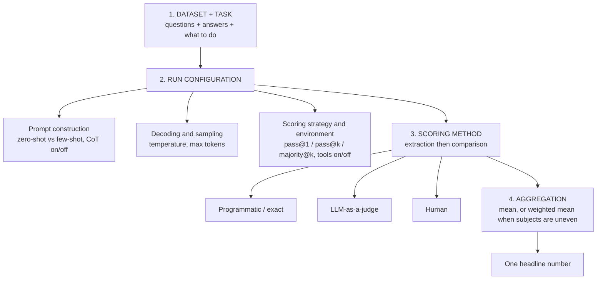
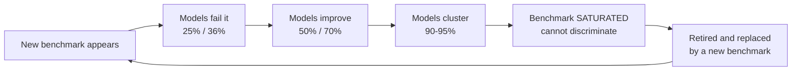

# CS-11 · What Is LLM Benchmarking — Benchmark Saturation vs Contamination

> **Source transcript:** `Whats_is_LLM_Benchmarking_Benchmark_Saturation_vs._Contamination_CampusX.txt` (Hinglish, 1,170 lines, runtime ≈ 51:18)
> **Domain:** benchmarks
> **One-liner:** A benchmark is a standardised test with four parts — dataset+task, run configuration, scoring, aggregation — and a number from it is untrustworthy for four separate reasons: contamination, saturation, configuration gaming, and aggregation-level cherry-picking.
> **Prerequisites:** CS-09, CS-10

---

## 0. Executive summary

The definition, given twice and identically `[1:15]`–`[1:27]` and `[43:44]`–`[43:47]`:

> "a **benchmark is basically a standardized test used to measure a particular model capability**"

Every benchmark has exactly **four components** `[1:42]`–`[2:20]`:

| # | Component | What it covers |
|---|---|---|
| 1 | **Dataset + task** | questions and their answers, plus what the model is asked to do |
| 2 | **Run configuration** | prompt construction, decoding/sampling, scoring strategy and environment |
| 3 | **Scoring method** | extraction of the answer, then comparison against the ground truth |
| 4 | **Aggregation method** | how per-question scores become one headline number |

All four are documented in the benchmark's **research paper** `[18:17]`–`[18:23]`.

The lecture then walks the full evaluation loop on **GSM8K** (Grade School Math, ~**8,500** questions, ~**8K** rows) `[2:29]`–`[3:08]`, `[4:54]`, explains why the loop is not as simple as it looks — extraction, batching, retries, rate limits `[26:12]`–`[27:15]` — and introduces **eval harnesses** (`lm-evaluation-harness`, **Inspect**, **HELM**) as the standardised plumbing `[27:20]`–`[28:38]`, demonstrated live with a working `lm_eval` command `[29:18]`–`[33:17]`.

It closes with three stakeholder groups who benchmark (`[36:10]`–`[42:11]`) and the four problems that make any single number untrustworthy `[42:50]`–`[50:48]`:

1. **Contamination** — public dataset + public answers + full-internet pretraining scrape = the model may have memorised it `[43:27]`–`[45:47]`.
2. **Saturation** — a static benchmark, improving models: 25% → 36% → 50% → 70% → 90–95%, then everyone clusters and the benchmark cannot discriminate `[45:51]`–`[48:06]`.
3. **Configuration gaming** — labs give their own model the most favourable conditions and rivals the default ones; a 5–10% swing `[48:09]`–`[49:41]`.
4. **Aggregation-level hiding** — reporting a 57-subject average instead of per-subject scores, concealing a weak subject `[49:41]`–`[50:48]`.

Final instruction: **do not accept the number thrown in your face; implement your own methodology and decide from that** `[50:44]`–`[51:03]`.

---

## 1. The problem this lecture solves

The course flow to this point `[0:00]`–`[0:37]`: model evals are needed → what model evals are (standardised benchmarks vs custom evals) → which **core capabilities** exist → and now, finally, "actually study what benchmarks are" `[0:35]`–`[0:37]`.

The problem the lecture identifies is that the word "benchmark" is in daily use and almost nobody can define it. Verbatim `[0:48]`–`[0:58]`:

> "bahuta phemasa tarma hai. dina bhara lephta right sentara koee bhee model aataa hai, aapake oopara benchmarks hee thro kie jaate hain ki svee bencha pe isa model ne itanaa score kiyaa."

Everyone says "our model scored X on benchmark Y"; YouTube is full of such videos `[0:58]`–`[1:13]`. But *what a benchmark actually is* — its parts, its settings, its lifecycle — is never explained.

The second problem the lecture takes up at `[35:42]`–`[36:03]`, phrased as a question: since almost all these benchmarks are open-source and publicly available on the internet, **anyone can evaluate any LLM** — so whose evaluations should you actually believe?

---

## 2. Definitions & mental models

| Term | Definition as given |
|---|---|
| **Benchmark** | "a standardized test used to measure a particular model capability" `[1:15]`–`[1:27]` |
| **Dataset + task** | a collection of questions **and** their answers, plus the instruction of what the model must do `[3:24]`–`[3:47]`; "its a like a **golden dataset**" `[3:35]`–`[3:36]` |
| **Run configuration** | the settings that must be **identical** across every model being compared `[5:33]`–`[6:02]` |
| **Zero-shot** | the question alone is sent, with no worked examples `[7:15]`–`[7:21]` |
| **Few-shot** | a few solved examples are shown in the prompt before the real question `[7:21]`–`[7:34]` |
| **Chain-of-thought** | instructing the model to solve step by step rather than answer directly `[8:22]`–`[8:36]` |
| **pass@1** | one showing, one answer: right or wrong `[10:13]`–`[10:27]` |
| **pass@k** | the same question asked *k* times; correct if **at least one** attempt is right — "a more lenient strategy" `[10:32]`–`[10:55]` |
| **majority@k** | the same question asked *k* times; the **mode** of the answers is taken as the answer `[11:26]`–`[11:49]` |
| **Extraction** | pulling the answer out of free-form model output; "the first step during scoring" `[14:30]`–`[14:58]` |
| **Aggregation** | combining per-question scores into one headline number `[15:58]`–`[16:28]` |
| **Eval harness** | "a piece of code that you write in order to execute model evaluation" `[27:41]`–`[27:48]` |
| **Static benchmark** | the dataset published in the paper five years ago is the same dataset today `[45:23]`–`[45:34]` |
| **Dynamic benchmark** | a benchmark whose dataset is **updated** based on the latest data or a particular window `[45:34]`–`[45:45]` |
| **Contamination** | the benchmark's questions and answers became part of the model's pretraining data, so you cannot tell thinking from memorising `[43:29]`–`[43:44]`, `[44:48]`–`[44:55]` |
| **Saturation** | all models cluster at the same high score, so the benchmark can no longer differentiate them `[45:51]`–`[47:22]` |
| **Configuration gaming** | tinkering with run-configuration details so your own model gets the most favourable conditions and the rival gets the default ones `[48:09]`–`[48:29]` |

**The governing rule for run configuration** `[5:41]`–`[5:59]`: "aisaa naheen hai ki eka model ko aapane kisee particular setinga men chalaa diyaa aura doosare model ko kisee doosare setinga men chalaa diyaa… donon models ko chalaane ke time pe saaree setingsa jo hai vo bilkula same honee chaahie."

**The exam analogy** `[28:41]`–`[28:59]`: treat the **benchmark as the exam paper**, and treat the **eval harness as the entire examination administration** that handles everything behind the scenes, so you have to do very little yourself.

**The car-mileage analogy** `[38:20]`–`[38:26]`: a car's brochure claims 25 km/l; when you actually drive it you get 5–10. A lab's self-reported benchmark number behaves the same way.

---

## 3. Core content, decomposed

### 3.1 Component 1 — Dataset + task, worked on GSM8K `[2:29]`–`[5:29]`

**Why GSM8K was chosen as the teaching example** `[2:46]`–`[2:53]`: it is old — released around 2020–2021 — and no longer much used.

| Property | Value |
|---|---|
| Name | **GSM8K** = **G**rade **S**chool **M**ath **8K** `[2:53]`–`[2:57]` |
| Task | the model is given a grade-school maths problem and must **generate** the answer `[5:16]`–`[5:25]` |
| Dataset contents | the question **plus** its answer `[3:24]`–`[3:35]` |
| Size | **~8K rows** / **~8,500** question-answer pairs `[3:01]`–`[3:08]`, `[4:54]` |
| Where it lives | Hugging Face and GitHub; the files-and-versions tab of the repository `[4:30]`–`[4:46]` |

**The sample question reproduced in the lecture** `[3:47]`–`[4:10]`:

> *"Natalia sold clips to 48 friends in April, and then she sold half as many clips in May. How many clips did she sell altogether?"* — Answer: **72**, because you must simply add the two together.

The difficulty level is deliberately trivial — "bahuta sinpala-sinpala maithametikala questions jo hote hain greda skoola maithsa saventh siksa saventh etha kaa jo maithsa hai" `[4:10]`–`[4:17]`.

**The universal structure** `[5:02]`–`[5:14]`: every benchmark has its own dataset; every dataset contains questions and answers; and a task is stated. "MMLU kaa apanaa khudaa kaa data seta hai, kisee aura benchmark kaa apanaa khudaa kaa data seta hai."

### 3.2 Component 2 — Run configuration `[5:29]`–`[13:20]`

Three parts `[6:04]`–`[6:16]`: **prompt construction**, **decoding and sampling configuration**, **scoring strategy and environment**.

**(a) Prompt construction** `[6:18]`–`[9:12]`.

*Zero-shot vs few-shot.* Zero-shot means you simply took a question and told the model to solve it. Few-shot means you showed a few solved questions in the prompt, then appended a new question — "dekho ina questions ko maine aise solva kiyaa samajha men aayaa. ab isa question ko solva karake bataao" `[7:23]`–`[7:34]`. The benchmark states which one applies, "kyonki agara vo prta alaga-alaga hogaa to eka model alaga rijalta degaa doosaraa model alaga rijalta degaa" `[6:42]`–`[6:48]`.

The consequence is stated bluntly: "obviyasalee agara aapa jeero shota rakhoge to paraphormensa kharaaba hogaa model kaa aura agara aapa phyoo shotsa rakhoge to aapakaa paraphormensa inproova karegaa" `[8:08]`–`[8:15]`. **GSM8K uses the few-shot strategy** `[7:43]`–`[7:52]`.

*Analyst note:* the source gives the GSM8K shot count inconsistently — **five-shot** at `[7:47]`–`[8:08]` and **eight examples** in the prompt-construction walkthrough at `[23:22]`, and again `five-shot` in the demo code's `--num_fewshot` discussion at `[31:04]`–`[31:11]`. The canonical GSM8K configuration in the literature is **8-shot chain-of-thought**; treat the "5" as a transcription slip, but the *principle* the source is teaching — the benchmark dictates the shot count and you must match it — is unaffected.

*Chain-of-thought.* If chain-of-thought is off, you tell the model to produce the answer directly, and "to galatee hone ke chaansesa jyaadaa hai" `[8:51]`–`[8:56]`. GSM8K turns chain-of-thought **on**, and the dataset's own answers are written as step-by-step solutions — the lecture shows `48 / 2 = 24`, then `48 + 24 = 72` `[8:36]`–`[8:48]`.

**(b) Decoding and sampling configuration** `[9:12]`–`[10:01]`.

- **Temperature ≈ 0.** "because jeero se agara jyaadaa barhaaoge to krietiva answers aane laga jaate hain aura hara baara vo vereeree karane laga jaate hain" — raise it above zero and answers become creative and vary on every run, which destroys comparability `[9:19]`–`[9:27]`.
- **Max tokens.** Set it too low and a chain-of-thought model runs out of budget mid-reasoning and never emits the answer at all — "beecha men sochate-sachate men hee answer khatma ho gayaa aura model answer janareta kara hee naheen paayaa" `[9:34]`–`[9:45]`. Set it too high and a powerful model can reason for a very long time — "bahuta straangalee reejana kara sakataa hai" `[9:45]`–`[9:49]`. So the benchmark specifies a max-token budget that is **neither too small nor too large**, and the same budget must be given to every model `[9:49]`–`[9:59]`.

**(c) Scoring strategy and environment** `[10:03]`–`[13:20]`.

Three scoring strategies:

| Strategy | Mechanism | Trade-off |
|---|---|---|
| **pass@1** | one showing, take the answer | the stricter, more honest strategy `[10:55]`–`[10:59]` |
| **pass@k** | ask the same question *k* times; if **any one** of the *k* is correct, count it correct | "a **more lenient** strategy to evaluate your LLM" `[10:44]`–`[10:55]` |
| **majority@k** | ask *k* times, collect *k* different answers, take the **mode** as the answer | also lenient `[11:22]`–`[11:49]` |

The practical consequence, stated as a reading rule `[11:49]`–`[12:13]`:

> "jabhee bhee aapa reeda kara rahe ho kisee benchmark men… kisee ne bolaa ki hamaaraa kisee particular benchmark men 82% score kara rahaa hai hamaaraa model. to yahaan pe ghusa ke thodaa aapako ye poochhanaa chaahie ki **pass@1 strategy yooja kiyaa, pass@k strategy yooja kiyaa yaa majority@k strategy yooja kiyaa**."

For GSM8K the source states it is probably **pass@1** but is not certain from memory — "egjaiktalee mujhe yaada naheen hai. pepara dekhanaa padegaa. mosta laaikalee pass@1 use kiyaa gayaa hai" `[11:07]`–`[11:13]` — while noting that some benchmarks use pass@k depending on how difficult their questions are `[11:13]`–`[11:20]`.

*Analyst note:* the source's description of `majority@k` drifts between "mode" and "median" (`[11:47]`–`[11:49]`: "jo meena meediyana moda to jo moda hotaa hai usee ko aap answer maana lete ho"). The operative definition is **mode** — the answer that appeared the most times.

**(d) Tool access** `[12:16]`–`[13:20]`.

Whether tools are enabled is also specified in advance, and it swings results enormously:

- Give the model **web search** and "vaha to jhata se jaakara kisee question kaa answer intaraneta se khoja ke laa sakataa hai" `[12:28]`–`[12:36]`.
- Give it a **code interpreter** and "ye to saare maithametikala questions code ke throo karavaa ke answer nikaala degaa" `[12:38]`–`[12:44]`.

**GSM8K has tools disabled** `[12:51]`–`[12:53]`. **SWE-bench is the counterexample** — it requires tools, because you must go to GitHub, fetch an issue and fix it `[12:57]`–`[13:18]`.

### 3.3 Component 3 — Scoring method `[13:47]`–`[15:54]`

"Scoring method men do important cheejen hotee hain" — two important things.

**Step one: extraction** `[14:09]`–`[14:58]`. The model's answer can arrive in **any** format, because it is an LLM. It may say "the answer is 72"; it may say just "72"; it may say "72 …" with trailing matter. Since you want exactly the number 72 and nothing else, you must first extract it. The lecture's methods: **structured LLMs**, **structured output enforcement**, or **regex** — "meka shyora ki aapa sahee phormeta men answer ko pharsta of ola eksatraikta kara paa rahe ho" `[14:32]`–`[14:47]`. "Itsa emits jo bhee hai matlab yoo geta the point right" `[14:54]`–`[14:58]`. Verdict: "**extraction is the first step during scoring**" `[14:58]`.

**Step two: comparison** `[15:00]`–`[15:54]`. Once extracted, you simply compare:
- **Programmatic / exact**, for closed answers: `72 == 72` is true; anything else is false and scores zero. Worked: "yahaan pe 72 ikvala to ikvala to 72 aapa testa karoge… kuchha bhee aura nanbara hai matlab galata hai vana aura zeero" `[15:04]`–`[15:16]`.
- **LLM-as-a-judge**, for open-ended answers: some benchmarks have answers that are a whole paragraph. That cannot be compared programmatically and requires a judge `[15:16]`–`[15:48]`.
- **Human**, as the third option.

Summary line `[15:48]`–`[15:54]`: "yaa kanpairijana jo hotaa hai vo yaa to streta phoravarda prograametikalee ho jaataa hai yaa phira **LLM eja a judge** yaa phira **hyoomana** ke throo hotaa hai."

### 3.4 Component 4 — Aggregation method `[15:58]`–`[17:39]`

**The simple case** `[16:01]`–`[16:28]`: 8,000 questions, each scored 0 or 1; you aggregate — "mere paasa 1000 questions the. usamen se 920 LLM ne sahee bataae… vhicha basically meensa ki hamaare benchmark pe 92% score kiyaa." Aggregation is usually straightforward `[16:28]`–`[16:31]`.

**The non-simple case — and this is where the lecture plants a trap it will return to at `[49:41]`** `[16:43]`–`[17:39]`. Take MMLU: general knowledge across **57 subjects**. You may need to publish a separate result for each subject — the lecture's illustrative figures are **biology 87%, physics 91%, economics 72%**. Then you must combine them into an overall MMLU score. And here is the rule:

> "yahaan pe aapa aisaa naheen kara sakte ki seedhe saare parasentejesa ko joraa 57 se divaaida maaraa diyaa. kyonki aisaa ho sakataa hai ki data men baayolojee ke questions kama ho, ikonomiksa ke questions jyaadaa ho. to yahaan pe phira ho sakataa hai aapako **veteda meena** karanaa pare."

You cannot sum all 57 percentages and divide by 57, because the dataset may contain fewer biology questions than economics questions. You need a **weighted mean**. "Egreegeshana kee bhee alaga-alaga stretajeesa hotee hain" `[17:36]`–`[17:39]`.

### 3.5 Everything is in the paper

`[17:40]`–`[19:53]`. The task, dataset, run configuration, scoring mechanism and aggregation mechanism are all written down — in the **research paper** `[18:17]`–`[18:23]`. Every benchmark in use today was originally published as a research paper; searching "GSM8K" or "MMLU" takes you to the paper where the researchers first brought it to the world, and the dataset itself is on the internet `[18:23]`–`[19:04]`. Structurally every one is the same: task, dataset, run configuration, scoring mechanism, aggregation mechanism `[19:11]`–`[19:20]`.

The meta-comment about research itself `[19:27]`–`[19:56]`: researchers in each field bring out benchmarks for their own field, those benchmarks become popular, their datasets become popular, and every new LLM arriving in the market is measured on them. "Rischarsa kaa yahee kaama hai — de are ekchualee stadinga ki kisee particular LLM kee kisee particular capability ko hama kaise testa kara sakte hain."

### 3.6 The evaluation loop, end to end `[21:35]`–`[25:48]`

The scenario is set deliberately: **you are a frontier lab** (OpenAI, Anthropic, or similar); you have trained a new model — call it `kaimapasa x v1`; a new benchmark has appeared called GSM8K testing mathematical capability; you want to test your LLM on it `[20:17]`–`[21:32]`.

> "sinpalee puta model evaluation jo hotaa hai kisee benchmark ke oopar vo basically **eka loopa** hotaa hai." `[21:40]`–`[21:45]`

The pseudocode, as narrated `[22:43]`–`[22:59]` and `[23:29]`–`[24:57]`:

| Step | Action |
|---|---|
| 1 | **Load the item** — the first question from the dataset `[22:47]`–`[22:53]` |
| 2 | **Build the prompt** — inject the few-shot examples if few-shot, apply the model's **chat template**, add the instructions; "now you have the exact string you want to send to the model" `[23:01]`–`[23:29]` |
| 3 | **Call the model** with the decoding config — set temperature, set max tokens, set stop criteria `[23:29]`–`[23:56]` |
| 4 | **Capture the raw output** — whatever the model returned `[23:56]`–`[24:00]` |
| 5 | **Extract the answer** — `the answer is 72` becomes `72`, stored somewhere; this is the `prediction` `[24:00]`–`[24:23]` |
| 6 | **Score** — is the prediction true or false against the ground truth `[24:23]`–`[24:29]` |
| 7 | **Store the score** — append it into a list `[24:29]`–`[24:34]` |
| 8 | **Repeat** for all 8,000 items; when the loop ends you hold a big list with a 1 or 0 against every question `[24:34]`–`[24:49]` |
| 9 | **Aggregate** — take the mean; that is your final benchmark score `[24:49]`–`[24:57]` |

Two framing rules stated before the loop `[22:08]`–`[22:21]`: you define the prompt **exactly as the benchmark tells you**, and you keep the settings **exactly as the benchmark tells you**. "So basically hama risarcha pepara ko pholo kara rahe hain" — you are following the research paper `[22:40]`–`[22:43]`.

### 3.7 Why the loop is not actually simple `[25:49]`–`[27:20]`

> "ye dekha karake… aisaa lagataa hai ki ye to bahuta simple cheeja hai… loopa hee to chalaanaa hai. main aaraama se kara loongaa. bata **the problem ija** ki jaba aapa yaha karane jaaoge, isakaa code jaba aapa likhoge…"

The engineering that the "simple loop" hides:

1. **Extraction code** — you must write extra code to pull the correct answer out of `the answer is 72` `[26:27]`–`[26:37]`.
2. **Benchmark-specific scoring code** — the score mechanism differs per benchmark paper, so it must be written per benchmark `[26:37]`–`[26:42]`.
3. **Batching** — you are sending thousands of questions to an LLM; a batching strategy must be applied over them `[26:42]`–`[26:51]`.
4. **Retries** — when an API call fails midway, retry logic must be written `[26:53]`–`[26:57]`.
5. **Rate limits** — must be handled `[26:57]`–`[27:02]`.

The verdict: "kaama to loopa hee chalaane kaa hai bata eka rilaayabala loopa chalaanaa eta the skela ofa **8000 10 LLM kolsa** yoo needa a lota mora injeeniyaringa araaunda disa" `[27:05]`–`[27:15]`.

### 3.8 Eval harnesses — the industry answer `[27:17]`–`[29:02]`

Because writing all of this by hand is "hectic" and — more importantly — **non-standardised**, so that one evaluation run gives one result and another run gives another `[28:16]`–`[28:31]`, libraries exist.

Named harnesses:
- **LM Evaluation Harness** (EleutherAI) — the one the lecture calls "bahuta phemasa" and later "the most premium option, big companies use it too" `[27:23]`–`[27:29]`, `[35:27]`–`[35:34]`
- **Inspect** `[28:01]`–`[28:04]`
- **HELM** `[28:04]`–`[28:06]`

Their purpose `[28:08]`–`[28:13]`: "inakee helpa se aapa sinpalee kisee bhee benchmark ke oopar apane LLM ko testa kara sakte ho. aapako bahuta jyaadaa code likhane kee jaroorata naheen hai."

### 3.9 The live demonstration `[29:18]`–`[33:17]`

Setup and command, as narrated:

| Element | Value |
|---|---|
| Library installed | `lm_eval` (the LM Evaluation Harness) — installable from PyPI `[29:25]`–`[29:27]` |
| Provider key | an OpenAI API key, provided interactively `[29:18]`–`[30:30]` |
| Model under test | **GPT-5.6** — "we are targeting jeepeetee 5.6 jo abhee aayaa hai" `[30:44]`–`[30:50]` |
| `--model_args num_concurrent=5` | how many concurrent requests are handled at once `[30:50]`–`[30:56]` |
| `--tasks gsm8k` | the benchmark being run `[30:56]`–`[31:01]` |
| `--apply_chat_template` | applies the chat template `[31:03]`–`[31:04]` |
| `--num_fewshot` | because this is a few-shot prompting setup `[31:04]`–`[31:11]` |
| `--limit 20` | **not** evaluating all 8,000 questions — only 20, because this is a smoke test to check that the setup works `[31:11]`–`[31:26]` |
| `--output_path` | where results are printed `[31:50]`–`[31:52]` |
| `--log_samples` | logs all the individual results `[31:52]`–`[31:56]` |

**The cost numbers, which are the practical justification for `--limit`** `[31:31]`–`[31:46]`: a full GSM8K evaluation over 8,000 questions would cost **₹2,300** in a single evaluation. Running 20 questions cost **₹3–4**, or less. "Main naheen karanaa chaahataa because maine jitanaa pataa kiyaa hai agara main 8000 questions ko evaluate karane jaaoon jeeesaama 8 ke vaale kaa to ₹2300 chale jaaenge eka evaluation men."

**The result** `[32:21]`–`[33:05]`: 20 API calls were made automatically; the result came back at **~90%** — "20 men se 18 questions sahee nikaala ke de die hamaare model ne" — i.e. **18/20**. The log output shows the GSM8K results, the model folder, and a **JSON object for every question** containing the `doc_id`, which question it was, what answer came back, and the whole evaluation — all readable in the output directory `[32:44]`–`[33:10]`.

**The framing that matters** `[33:26]`–`[33:54]`: this was not a significant evaluation. But remove the `--limit` and you would genuinely be testing GPT-5.6 on the GSM8K benchmark, and that result could be published — "matlab opana AI bhee yahee karataa" — OpenAI does exactly this.

**DeepEval as the alternative** `[34:06]`–`[35:20]`: DeepEval also gives a benchmarks option and also supports benchmark running, but it is oriented more toward **application evals**, requires much more code to be written (especially to run a custom OpenAI model), and its benchmark list is dominated by **saturated** benchmarks. Verdict: "the most premium option is this lm-evaluation-harness. baree kanpaneeza bhee isako use karatee hain" `[35:27]`–`[35:34]`.

### 3.10 Who actually benchmarks — three stakeholder groups `[35:42]`–`[42:11]`

The framing question `[35:42]`–`[36:03]`: since the benchmarks are open-source and publicly available, **anyone** can evaluate any LLM — so who actually wants to, and for whom is it important?

**Group 1 — Frontier labs themselves** `[36:10]`–`[39:35]`. They will obviously evaluate, and they do it at **three distinct points**:

| When | Why |
|---|---|
| **During pretraining** | they pull models out at **different checkpoints** and run benchmarks, to see whether training is heading in the right direction, and whether mid-course corrections are needed. "Vahaan pe ita helpsa a lota." `[36:54]`–`[37:14]` |
| **At release-getting time** | to decide whether the new version of the model is better than the previous one, and **whether to release it at all** `[37:14]`–`[37:27]` |
| **Marketing** | if the model scores very well on one benchmark for one particular capability, that becomes excellent marketing — "ye nayaa model aayaa hai aura ye kodinga benchmarks ko ekadama phoda ke rakhaa diyaa", and every YouTuber covers it `[37:27]`–`[37:49]` |

**And this is exactly why you must not take their numbers at face value** `[37:49]`–`[39:29]`:

> "agar phrantiyara laiba aapako ye poochhanaa chaahie ki ye jo nanbara aapa dikhaa rahe ho ye evaluation **kisane kiyaa**? aapane khudaa kiyaa? agara vo bole ki haan hamane khudaa kiyaa hamaaree kantrololda setingsa men to aapa jyaadaa trasta mata karo."

The car-mileage analogy follows: "kaara kaa maaileja bataate hain 25 aura jaba aapa ekchualee chalaaoge to 510 kaa maaileja detee hai" `[38:20]`–`[38:24]`. A lab number is a **ceiling**, not an expectation, "because vo hara tareeke se apanee phevarebala kandeeshaa krieta karake benchmarks chalaate hain aura usake nanbarsa pablisha karate hain" `[38:26]`–`[38:39]`.

Two specific distortions named:

1. **Cherry-picking** `[38:39]`–`[38:51]`: the benchmarks where the model scores well get shown at the top; the ones where it scores badly get pushed down, so it appears the model is very strong.
2. **Hype exceeding experience** `[38:55]`–`[39:29]`: "bahuta hee phoroo phoroo models aae abhee phebala kee baata kara lo — phebala main use kiyaa, maine jitanaa bhee jo usakee haaipa thee mere ko to naheen maicha kara paayaa." The speaker's own experience of a heavily hyped model did not match what was said about it; users reported that behind the scenes it was sometimes sending queries to OpenAI. The lesson: "agena yahaan pe thodaa aapako bacha ke rahanaa hai" `[39:27]`–`[39:29]`.

**Group 2 — Third-party evaluators** `[39:40]`–`[41:24]`. Leaderboards like **LMArena**, and companies whose entire product is benchmarking — "jinakaa prodakta hee hai evaluation, unako paise hee isee baata ke milate hain" `[40:18]`–`[40:27]`. Why their numbers are more reliable `[40:02]`–`[40:18]`: they test a Claude model and an OpenAI model **under identical conditions**, so their ranking is more trustworthy and long-standing enough that people have come to trust them.

A bonus advantage `[41:03]`–`[41:20]`: third parties also report **cost and latency**, which most leading labs do not — "vo basa benchmark ke oopara nanbara bataa denge. ye naheen bataaenge ki kitanaa time lagegaa yaa kitanaa kosta lagegaa."

**Group 3 — AI engineering teams** building LLM-based applications `[41:27]`–`[42:08]`. They rely on neither labs nor third parties. They have the tools themselves — public benchmarks and harnesses like `lm-evaluation-harness` — so they run their own evaluations, in their own conditions, and in doing so test **score, latency and cost together** on their own level `[41:41]`–`[42:02]`.

**Summary of the three** `[42:02]`–`[42:11]`: "three steka holdarsa hain jinako ye evaluations karane hote hain yaa kara sakte hain — phrantiyara laibsa, tharda paartee ivailyooetarsa and kanpaneeza, and AI injeeniyarsa khud."

**Leaderboards are deferred** `[42:15]`–`[42:46]`: leaderboards are "like **an MDb ranking for models**" and can be taken as-is; they are described as **aggregations of multiple benchmarks** — "leader boards ekchualee kyaa hotaa hai naa vo egreegeshana hote hain malteepala benchmarks ke" — and are covered in the next session.

### 3.11 The four reasons a benchmark number misleads `[42:50]`–`[50:48]`

Opening framing `[42:50]`–`[43:26]`: benchmarks are important and they help you learn about a model's capability in one area — but they are **not flawless** and in many scenarios they are **misleading**. "Yoo have to bee very vereeree keyaraphula" whenever you read one.

#### Problem 1 — Benchmark contamination `[43:27]`–`[45:47]`

Most benchmarks — MMLU, GSM8K, and the many more to come — are **public benchmarks**: their research paper, their entire methodology and their **dataset** are all available on the public internet `[43:43]`–`[43:55]`. Especially the older ones from 2021, 2022, 2023 whose datasets have sat online for years `[43:58]`–`[44:08]`.

The mechanism, worked `[44:08]`–`[44:48]`:

1. Recently — say six months ago — OpenAI trains **5.6**.
2. They **scrape the whole internet** and put it into pretraining.
3. The public benchmark's dataset — which means the questions **and their correct answers** — becomes part of that model's pretraining.
4. If the model has seen all 8,000 questions and their answers, then when you ask it a question in production, "deyara ija **no gaarantee** ki vo socha ke bola rahaa hai yaa phira usane **memoraaija** kara liyaa."

Consequence: for large models pretrained on large datasets, "ye benchmarks are kantaimineteda — because de olaredee no the answer" `[44:58]`–`[45:08]`. This is a big problem specifically with public benchmarks.

The two solutions named `[45:13]`–`[45:45]`:
- **Private benchmarks** — many exist; to be discussed in a later class `[45:16]`–`[45:22]`.
- **Dynamic benchmarks** — as against **static** benchmarks, where "ekaa baara risarcha men jo pablisha ho gayaa jo data seta hai pichhale 5 saala se vahee data seta hai". A dynamic benchmark's dataset is **updated** on the basis of the latest data or a particular time window `[45:23]`–`[45:45]`.

#### Problem 2 — Benchmark saturation `[45:51]`–`[48:06]`

The mechanism, step by step as narrated:

1. A benchmark **enters the picture** — say in 2021.
2. At that point it is new, and no model has any idea about it; nobody has seen it. On these questions most models perform **poorly**: "25% score aa rahaa hai, 36% score aa rahaa hai. saare models isee araaunda hovara kara rahe hain" `[46:04]`–`[46:18]`.
3. Over time, "benchmark to staitika hai. isamen to koee chenjesa naheen hue" — **the benchmark is static; nothing about it changed**. But your models keep improving, every six months.
4. So their performance on those questions improves: "pichhalaa janareshana ofa models 36% pe the. ab 50 pe chale gae. phira 70 pe chale gae" `[46:38]`–`[46:44]`.
5. Eventually models cluster at **90–95%** and there is no meaningful difference between them. The lecture's illustrative cluster: "aapakaa sabase reesenta vaalaa 95% pe hai. jeepeetee 5.6 94% pe hai. Google jeminaaee 92% pe hai" `[46:58]`–`[47:06]`.

> "Isako bolaa jaataa hai **benchmark saichureshana**. Isakaa yaha matlab huaa ki ab yaha benchmark yoozaphula naheen rahaa. isase aapa models ko dipharenshieta naheen kara sakte. because agara sabake eka jaise hee maarksa aa rahe hain to phira vo exam kaa aaegaa — phira pataa hee kaise chalegaa ki kauna achchhaa hai, kauna buraa hai?" `[47:08]`–`[47:22]`

Then: the benchmark is retired, a new one is brought in, and the industry starts working on that new benchmark instead `[47:24]`–`[47:33]`.

**Which benchmarks are named as saturated** `[47:33]`–`[47:49]`: **GSM8K** — "isamen sabakaa hee 94 95 97% aataa hai"; **MMLU**; and **SWE-bench**.

**The lifecycle, stated as a general law** `[47:49]`–`[48:06]`:

> "mostalee benchmarks kaa eka **laaipha saaikila** hotaa hai. vo aate hain. saare models ko vo diphikalta lagate hain. phira dheere-dheere models inproova karate hain. saba loga usa pe achchhaa score karane lagate hain. phira aapakaa benchmark saichureta kara jaataa hai. usako ritaayara kara diyaa jaataa hai. usako riplesa kara diyaa jaataa hai vida a nyoo benchmark. That is how benchmarking ka prosesa is done."

#### Problem 3 — Configuration gaming `[48:09]`–`[49:41]`

> "konfigareshana geminga ija basically a tarma jahaan pe phrantiyara AI laibsa jaba khudaa benchamaarkinga karatee hain to vahaan pe vo **konfigareshana rileteda chherachhaara** karatee hain."

The basic mechanism `[48:38]`–`[48:46]`: within the run configuration you were given, you **provide yourself the most favourable conditions** — and give the rival model the default conditions `[48:23]`–`[48:29]`.

The worked example `[48:46]`–`[48:59]`: you are benchmarking on **GSM8K**, and you give **your own model** the **Python interpreter tool**. It then writes code and solves every mathematical question. "To obviyasalee usakaa score betara hogaa."

The magnitude: "**5–10% kaa verieshana aa jaataa hai**" `[49:05]`–`[49:07]`.

The protective rule `[49:09]`–`[49:15]`: "phrantiyara laibsa agara bola rahee hai ki hamaaraa model phoda ke rakhaa diyaa ekadama — vo baata kabhee bhee maanane kee naheen hai. because aapane apane ghara ke andara model ko kaise testa kiyaa? mujhe kyaa pataa?"

The checklist of undisclosed variables `[49:15]`–`[49:41]`:

- What changes did they make to **their** eval harness?
- Did they set the **max tokens**?
- What level of **reasoning setting** did they use?
- Did they set a **temperature value**? — "AI have no vailyoo. AI have no aaeediyaa" ("I have no value, I have no idea")
- What **latency** value?
- What **cost** did it take?

"You're simply giving me a number — 92% on this benchmark — I don't trust you."

#### Problem 4 — Aggregation-level hiding `[49:41]`–`[50:48]`

The last step of benchmarking is aggregation, where all the per-question numbers are combined. "Vahaan para bahuta loga **smaartalee ple kara jaate hain**" — many people play it cleverly there `[49:45]`–`[49:53]`.

The worked scenario, and this is the payoff of the aggregation example planted in §3.4 `[49:53]`–`[50:40]`. A frontier lab can do this with MMLU, which has **57 subjects**:

1. Their model scores **well in physics**, but **very poorly in economics**.
2. The model provider, instead of giving you the individual scores, gives you the **average score**.
3. They will **not** tell you that their model is not good at economics.
4. You wanted to build an **economics-based chatbot**. You saw the MMLU score was good — good across 57 subjects — so you deployed it.
5. You then find it performs **very badly** on economics questions. "Because ikonomiksa men alaga se usake maarksa bahuta kharaaba the."
6. "To agena because benchmarks men chhupaayaa jaa sakataa hai. to aapako pataa naheen chalaa aura aapake saatha phira ye ho gayaa."

**Closing rule** `[50:44]`–`[51:05]`:

> "These are the four major reasons why you have to take benchmarks with a pinch of salt. **Jo nanbara aapake munha para phenkaa gayaa hai usako aapako maananaa naheen hai. Aapako apanee eka methodolojee inpleementa karanee hai** aura usake besisa pe hee aapako disaaida karanaa hai ki kauna saa model aapako chalegaa kauna saa naheen chalegaa."

(Do not accept the number thrown in your face; you must implement your own methodology, and on that basis decide which model works for you and which does not.)

The session closes by saying a further session will discuss how to handle this practically `[51:05]`–`[51:18]`.

---

## 4. Frameworks & decision procedures

### 4.1 The four components of any benchmark

All five artefacts — task, dataset, run configuration, scoring mechanism, aggregation mechanism — are documented in the benchmark's **research paper** `[18:17]`–`[18:23]`, `[19:11]`–`[19:20]`.

### 4.2 The benchmark lifecycle

Stated as a general law at `[47:49]`–`[48:06]`.

### 4.3 The reading rule for any quoted score

Derived from the whole lecture; each question maps to a section above.

1. **Who ran this evaluation?** If the frontier lab ran it on itself, discount it `[38:00]`–`[38:20]`.
2. **Which scoring strategy — pass@1, pass@k or majority@k?** `[12:00]`–`[12:13]`.
3. **What run configuration was used, and is it the same for every model compared?** `[5:41]`–`[5:59]`, `[49:15]`–`[49:41]`.
4. **Were tools enabled?** `[12:16]`–`[13:20]`.
5. **Is this benchmark saturated?** If everyone scores 94–97%, it tells you nothing `[47:33]`–`[47:40]`.
6. **Is it contaminated?** Public dataset + public answers + internet-scale pretraining `[43:27]`–`[45:08]`.
7. **Am I being given per-subject scores or only an average?** For a 57-subject benchmark, ask for the breakdown `[49:53]`–`[50:40]`.
8. **Would my own eval on my own data agree?** The lecture's final instruction `[50:50]`–`[51:03]`.

---

## 5. Worked end-to-end example

**GSM8K through all four components**, as the lecture builds it:

| Component | GSM8K's value | Anchor |
|---|---|---|
| **Dataset + task** | ~8,000 rows / ~8,500 question-answer pairs; the model must **generate** the answer to a grade-school maths problem | `[3:01]`–`[3:08]`, `[4:54]`, `[5:16]`–`[5:25]` |
| **Prompt construction** | **few-shot** — worked examples are placed in the system prompt before the real question (the source says five in one place and eight in another; canonical GSM8K is 8-shot) | `[7:43]`–`[8:08]`, `[23:22]` |
| **Chain-of-thought** | **on** — the model must solve step by step, and the dataset's own answers are written as steps | `[8:22]`–`[8:59]` |
| **Decoding** | temperature **≈ 0**; max tokens set neither too low (the model would be cut off mid-reasoning) nor too high | `[9:12]`–`[10:01]` |
| **Scoring strategy** | probably **pass@1** — the source says "mosta laaikalee pass@1 use kiyaa gayaa hai" but is not certain | `[11:07]`–`[11:13]` |
| **Tools** | **disabled** — "jeeesaema 8 ke vaale benchmark men toolsa are note alaauda" | `[12:51]`–`[12:53]` |
| **Scoring method** | **extraction then exact comparison** — pull `72` out of `the answer is 72`, then test `72 == 72`; anything else scores zero | `[13:47]`–`[15:16]` |
| **Aggregation** | simple mean over 8,000 zero-or-one scores | `[15:58]`–`[16:31]` |
| **Status** | **saturated** — everyone scores 94–97% | `[47:36]`–`[47:40]` |

**The comparison to MMLU's aggregation** `[16:43]`–`[17:39]` and `[49:53]`–`[50:40]`: MMLU has 57 subjects with illustrative per-subject scores of **biology 87%, physics 91%, economics 72%**. You may not average the 57 percentages directly, because the question counts per subject differ — a **weighted mean** is required. And a provider who reports only that weighted average is hiding the 72% economics figure, which is exactly the trap for anyone building an economics chatbot.

**The live run, as a worked example of the harness** `[29:18]`–`[33:17]`:

| Item | Value |
|---|---|
| Command surface | `lm_eval` invoked with `--model openai-chat-completions` |
| `--model_args` | includes `num_concurrent=5` |
| Model target | GPT-5.6 |
| `--tasks` | `gsm8k` |
| Flags | `--apply_chat_template`, `--num_fewshot`, `--limit 20`, `--output_path`, `--log_samples` |
| API calls made | **20**, automatically |
| Cost of this run | **₹3–4** |
| Cost of the full 8,000-question run | **₹2,300** |
| Result | **~90%** — **18 of 20** correct |
| Artefacts logged | GSM8K results, model folder, and a **JSON object per question** with `doc_id`, the question, the answer and the evaluation |

---

## 6. Pros, cons, exceptions

**What benchmarks are good for** `[42:50]`–`[43:03]`: they are important and they genuinely help you learn about a model's capability in a particular area.

| Stakeholder | What they gain | What they risk |
|---|---|---|
| **Frontier labs** | checkpoint-level signal during pretraining; a release decision; marketing | the temptation to game configuration and cherry-pick results; a credibility hit when hype exceeds user experience `[38:55]`–`[39:29]` |
| **Third-party evaluators** | identical conditions across rival models; trust built over years; they report **cost and latency** as well as score | their product is the evaluation, so their incentive is different from a lab's but not absent `[40:18]`–`[40:27]` |
| **AI engineering teams** | full control: score, latency and cost measured together in their own conditions `[41:41]`–`[42:02]` | they must build the methodology themselves, which is the work this lecture's last line demands |

**When to trust a number**: third-party leaderboards that publish their methodology `[40:51]`–`[41:01]`, or your own harness run on your own conditions.

**When to distrust it**: it came from the model's own lab; the benchmark is public and old; everyone scores 94%+; you were given an average with no subject breakdown; or you cannot find out the run configuration, scoring strategy, or tool setting.

**Exceptions the source names**: tools are disabled for GSM8K but **required** for SWE-bench `[12:51]`–`[13:18]`; pass@1 is stricter but pass@k is legitimate for very hard benchmarks `[11:13]`–`[11:20]`; aggregation is trivial in some benchmarks and requires a weighted mean in MMLU's case `[16:28]`–`[17:39]`.

---

## 7. Failure modes & anti-patterns

1. **Comparing two models run under different settings.** "Donon models ko chalaane ke time pe saaree setingsa jo hai vo bilkula same honee chaahie" `[5:52]`–`[5:57]`.
2. **Reading a score without knowing the scoring strategy.** pass@1, pass@k and majority@k give very different numbers for the same model `[11:49]`–`[12:13]`.
3. **Raising temperature.** Creative answers vary on every run and destroy comparability `[9:19]`–`[9:27]`.
4. **Setting max tokens too low.** A chain-of-thought model runs out of budget mid-reasoning and never emits an answer `[9:34]`–`[9:45]`.
5. **Forgetting that extraction is a code problem.** The model may emit "the answer is 72", "72", or "72 …" — scoring breaks without an extractor `[14:09]`–`[14:58]`.
6. **Averaging percentages when question counts differ.** For MMLU's 57 subjects this produces a wrong headline number; a weighted mean is required `[17:24]`–`[17:36]`.
7. **Treating a public benchmark score as evidence of reasoning.** The questions and their answers may be memorised from pretraining `[44:48]`–`[44:55]`.
8. **Quoting a saturated benchmark.** GSM8K, MMLU and SWE-bench all let everyone score in the 90s `[47:33]`–`[47:49]`.
9. **Accepting a lab's self-reported number.** They create their own most-favourable conditions; the swing from configuration gaming alone is 5–10% `[38:26]`–`[38:39]`, `[49:05]`–`[49:07]`.
10. **Building on a headline average.** A 57-subject average can conceal a subject where the model scores badly — which is exactly the subject your application needs `[50:08]`–`[50:40]`.
11. **Hand-rolling evaluation plumbing.** It is non-standardised, so one run gives one result and the next gives another `[28:16]`–`[28:31]`.

---

## 8. Implementation notes

**The harness commands and flags, as shown** `[30:36]`–`[31:56]`:

| Flag / argument | Purpose |
|---|---|
| `--model` | which model family/interface to call (the demo uses `openai-chat-completions`) |
| `--model_args` | model arguments; the demo sets `num_concurrent=5` — concurrent requests in flight |
| `--tasks` | which benchmark to run — the demo uses `gsm8k` |
| `--apply_chat_template` | applies the model's chat template to the constructed prompt |
| `--num_fewshot` | the few-shot count, matching the benchmark's specification |
| `--limit 20` | caps the number of evaluated items — used here purely as a setup smoke test |
| `--output_path` | where results are written |
| `--log_samples` | logs every individual item result |

**Installation and keys**: `lm_eval` installs from PyPI `[29:25]`–`[29:27]`; an OpenAI API key is entered interactively and is not printed `[29:18]`–`[30:30]`. Models can also be pulled from Hugging Face rather than a hosted API `[29:43]`–`[29:46]`.

**Cost discipline in practice** `[31:31]`–`[31:46]`: full GSM8K = **₹2,300** per evaluation; 20-question smoke test = **₹3–4**. Always run a `--limit` smoke test before removing the limit.

**The `--limit` semantics** `[31:11]`–`[31:31]`: the flag is not a benchmark feature — it exists so you can validate the plumbing. Removing it means you are genuinely benchmarking the model, and the result becomes publishable.

**Outputs to keep** `[32:44]`–`[33:10]`: the aggregate result line, the model folder in the output path, and the per-question JSON objects carrying `doc_id`, the question, and the returned answer.

**Library choice guidance** `[34:06]`–`[35:34]`:
- **lm-evaluation-harness** — the standard, industry-used, minimal-code option; "the most premium option" `[35:27]`–`[35:34]`.
- **Inspect**, **HELM** — other harnesses named `[28:01]`–`[28:06]`.
- **DeepEval** — supports benchmark runs, but it is oriented toward **application evals**, needs substantially more code (especially to run a custom OpenAI model), and its built-in benchmark catalogue is largely composed of **saturated** benchmarks `[34:06]`–`[35:20]`.

**The anti-contamination controls to reach for** `[45:13]`–`[45:45]`: **private benchmarks** (dataset not on the public internet) and **dynamic benchmarks** (dataset refreshed against the latest data or a rolling window), as against the default **static** benchmark whose dataset has not changed in five years.

**The four-component checklist to record for any benchmark you adopt** — dataset+task, run configuration (prompt / decoding / scoring strategy and tools), scoring method (extraction + comparison mechanism), aggregation method — sourced from the original research paper `[18:17]`–`[18:23]`.

---

## 9. Interview-ready Q&A

**Q1. Define an LLM benchmark.**
"a standardized test used to measure a particular model capability" `[1:15]`–`[1:27]`.

**Q2. Name the four components of any benchmark.**
Dataset + task; run configuration; scoring method; aggregation method `[1:42]`–`[2:20]`.

**Q3. What are the three parts of the run configuration?**
Prompt construction; decoding and sampling configuration; scoring strategy and environment `[6:04]`–`[6:16]`.

**Q4. Distinguish zero-shot from few-shot, and say why it matters.**
Zero-shot sends the question alone; few-shot places a few worked examples in the prompt before the question. Zero-shot lowers performance and few-shot raises it, so the shot count must be fixed and identical for every model compared `[7:15]`–`[8:15]`.

**Q5. Distinguish pass@1, pass@k and majority@k.**
pass@1 is one showing, right or wrong — the strict strategy. pass@k asks the same question k times and counts the item correct if **at least one** attempt is right — more lenient. majority@k asks k times and takes the **mode** of the answers `[10:13]`–`[11:49]`.

**Q6. Why does temperature have to be near zero for benchmarking?**
Raise it and answers become creative and vary on every run — "hara baara vo vereeree karane laga jaate hain" — which destroys comparability `[9:19]`–`[9:27]`.

**Q7. What goes wrong if max tokens is set too low, and too high?**
Too low and a chain-of-thought model's budget runs out mid-reasoning so it never emits the answer. Too high and a powerful model can reason at excessive length. The benchmark fixes a budget that is neither, and the same budget is given to every model `[9:32]`–`[10:01]`.

**Q8. Why is extraction a mandatory scoring step?**
Because the answer comes from an LLM, it can be "the answer is 72", "72", or "72 …" — you need exactly 72. Structured LLMs, structured output, or regex are used to pull it out. "Extraction is the first step during scoring" `[14:09]`–`[14:58]`.

**Q9. What are the three possible comparison mechanisms after extraction?**
Programmatic/exact for closed answers (`72 == 72`); LLM-as-a-judge for open-ended answers that are a whole paragraph; or human `[15:04]`–`[15:54]`.

**Q10. Trap — "MMLU has 57 subjects, so overall MMLU is the sum of the 57 subject scores divided by 57." Why is this wrong?**
Because the number of questions per subject is uneven — biology may have fewer questions than economics — so you must take a **weighted mean**, not a plain average `[17:24]`–`[17:36]`.

**Q11. What is an eval harness, and name three.**
"a piece of code that you write in order to execute model evaluation." Named: **lm-evaluation-harness**, **Inspect**, **HELM** `[27:41]`–`[28:06]`.

**Q12. Give the analogy for a benchmark vs an eval harness.**
The benchmark is the **exam paper**; the eval harness is the **entire examination administration** that handles everything behind the scenes so you have to do very little yourself `[28:41]`–`[28:59]`.

**Q13. What is benchmark contamination, and why does it happen to public benchmarks specifically?**
A public benchmark's paper, methodology and dataset are on the open internet. A model pretrained on an internet-scale scrape consumes the questions **and their correct answers**, so at inference there is "no guarantee" whether it is thinking or has memorised `[43:43]`–`[45:08]`.

**Q14. What two defences against contamination are named?**
**Private** benchmarks (dataset not publicly available) and **dynamic** benchmarks (dataset updated against the latest data or a rolling window), as opposed to **static** benchmarks whose dataset is unchanged from the original paper `[45:13]`–`[45:45]`.

**Q15. Define benchmark saturation and explain the mechanism.**
Saturation is when all models cluster at the same high score so the benchmark can no longer differentiate them. The benchmark is static, but models improve every six months: 25%/36% → 50% → 70% → 90–95%, everyone clusters, and the benchmark becomes useless and is retired `[45:51]`–`[48:06]`.

**Q16. Give the four numbers in the saturation walkthrough, and the cluster example.**
Models start around **25%** and **36%**, progress to **50%** then **70%**, and finally cluster at **90–95%**. The illustrative cluster: newest model **95%**, GPT-5.6 **94%**, Google Gemini **92%** `[46:11]`–`[47:06]`.

**Q17. Trap — "GSM8K is a good benchmark, so a high GSM8K score tells me a lot." What's wrong?**
GSM8K is **saturated** — "isamen sabakaa hee 94 95 97% aataa hai" — so it no longer differentiates models. MMLU and SWE-bench are named as saturated too `[47:33]`–`[47:49]`.

**Q18. What is configuration gaming, and how large is its effect?**
Frontier labs tinkering with run-configuration details so their own model gets the most favourable conditions while the rival gets the default ones. Worked example: giving your own model a **Python interpreter** on GSM8K so it writes code and solves every maths question. The swing is **5–10%** `[48:09]`–`[49:07]`.

**Q19. Trap — "A frontier lab says its model smashed the coding benchmarks; I'll trust it." What should you check?**
Don't accept it: you do not know what changes they made to their own harness, what max tokens they set, what reasoning setting they used, what temperature value, what latency, or what cost. "AI have no vailyoo. AI have no aaeediyaa." `[49:09]`–`[49:41]`

**Q20. What is the aggregation-level trap, worked?**
A lab reports only the MMLU **average** across 57 subjects. Its model is strong in physics but weak in economics (illustratively economics **72%**), and the average conceals this. You build an economics chatbot on the strength of the average and find it performs badly. Ask for per-subject scores `[49:53]`–`[50:40]`.

**Q21. Name the three stakeholder groups who benchmark.**
Frontier labs; third-party evaluators (leaderboards like LMArena and evaluation companies); and AI engineering teams building applications `[36:10]`–`[42:11]`.

**Q22. Why are third-party evaluator numbers more trustworthy than a lab's own?**
They test different vendors' models **under identical conditions**, so their ranking is more reliable; and they report cost and latency, which most labs do not `[40:02]`–`[41:20]`.

**Q23. What is the single instruction the lecture ends on?**
"Do not accept the number thrown in your face. You must implement your own methodology, and on that basis decide which model works for you and which does not" `[50:50]`–`[51:03]`.

---

## 10. Cheat sheet

**The 60-second version**
A benchmark is a standardised test of one model capability, made of **four** parts: dataset + task, run configuration, scoring method, aggregation method. Run configuration splits into prompt construction (zero-shot vs few-shot, chain-of-thought on/off), decoding (temperature ≈ 0, max tokens), scoring strategy (pass@1 / pass@k / majority@k) and tool access. Scoring is extraction first, then comparison — programmatic, LLM-as-a-judge, or human. Aggregation is a mean, or a **weighted** mean when subjects are uneven (MMLU's 57 subjects). Everything is documented in the research paper. Evaluation is a loop over the dataset, and at 8,000 items × LLM calls it needs batching, retries and rate-limit handling — which is why **eval harnesses** like `lm-evaluation-harness`, Inspect and HELM exist. A live `lm_eval` run on GSM8K with `--limit 20` cost ₹3–4 and scored 18/20; the full run costs ₹2,300. Three groups benchmark: frontier labs (during pretraining, at release, and for marketing), third-party evaluators (leaderboards, same conditions for all), and AI engineering teams (their own methodology). Four things make any number untrustworthy: **contamination** (public dataset + internet pretraining = possible memorisation), **saturation** (25→36→50→70→90–95%, then everyone clusters), **configuration gaming** (favourable conditions for your own model; 5–10% swing), and **aggregation hiding** (a 57-subject average concealing a weak subject). Final rule: never accept the number; build your own methodology.

**Core concepts (table)**

| Term | Meaning |
|---|---|
| Benchmark | a standardised test of a particular model capability `[1:15]` |
| Dataset + task | questions + answers + the instruction; "like a golden dataset" `[3:35]` |
| Run configuration | the settings that must be identical across compared models `[5:52]` |
| Zero-shot / few-shot | no worked examples / worked examples in the prompt `[7:15]`–`[7:34]` |
| pass@1 | one showing, right or wrong `[10:13]` |
| pass@k | correct if at least one of k attempts is right `[10:32]` |
| majority@k | take the mode of k answers `[11:26]` |
| Extraction | pulling the answer out of free-form output `[14:30]` |
| Aggregation | combining per-item scores into one headline number `[15:58]` |
| Weighted mean | required when per-subject question counts differ `[17:24]` |
| Eval harness | the code that executes model evaluation `[27:41]` |
| Static benchmark | dataset unchanged since the original paper `[45:23]` |
| Dynamic benchmark | dataset refreshed against latest data / a window `[45:34]` |
| Contamination | benchmark data entered pretraining `[43:29]` |
| Saturation | all models cluster; no discrimination `[45:51]` |
| Configuration gaming | favourable conditions for one's own model `[48:09]` |

**Formulas & metrics**

- **Simple aggregation**: `score = (number of correct items) / (total items)`. Worked: 920 correct out of 1,000 → **92%** `[16:15]`–`[16:26]`.
- **Per-item score**: `1` if the extracted prediction matches the ground truth, `0` otherwise — "kuchha bhee aura nanbara hai matlab galata hai vana aura zeero" `[15:10]`–`[15:16]`.
- **Weighted aggregation**: when subjects have unequal question counts, `overall = Σ (n_s × score_s) / Σ n_s` over subjects *s* — never `Σ score_s / 57` `[17:24]`–`[17:36]`.
- **pass@k scoring**: an item scores 1 if **any** of *k* attempts is correct `[10:41]`–`[10:49]`.
- **majority@k scoring**: the item's prediction is the **mode** of the *k* answers `[11:26]`–`[11:49]`.
- **Saturation signal**: when every frontier model's score falls in a narrow high band (the lecture's example: 95 / 94 / 92), the benchmark is saturated `[46:58]`–`[47:22]`.
- **Contamination condition**: dataset is public **and** the model's pretraining included a scrape of the public internet containing it `[44:08]`–`[44:42]`.

**Decision rules**
1. Never compare two models evaluated under different settings.
2. Always ask which scoring strategy was used: pass@1, pass@k or majority@k.
3. Always ask who ran the evaluation; discount self-reported lab numbers.
4. If the benchmark is public and old, assume contamination risk.
5. If everyone scores 94–97%, the benchmark is saturated — stop quoting it.
6. For multi-subject benchmarks, demand per-subject scores, never just the average.
7. Smoke-test with `--limit` before paying for a full benchmark run.
8. Use an eval harness rather than hand-rolling plumbing, so results are standardised.

**Thresholds & defaults worth memorising**

| Value | What it is |
|---|---|
| **temperature ≈ 0** | the decoding setting for benchmark comparability `[9:19]` |
| **8K rows / ~8,500 Q&A** | GSM8K's dataset size `[3:01]`, `[4:54]` |
| **57 subjects** | MMLU's subject count, the reason aggregation needs weighting `[16:58]`, `[49:56]` |
| **25% → 36% → 50% → 70% → 90–95%** | the saturation progression `[46:11]`–`[46:48]` |
| **95 / 94 / 92** | the illustrative saturated cluster `[46:58]`–`[47:06]` |
| **5–10%** | the swing achievable by configuration gaming `[49:05]`–`[49:07]` |
| **₹2,300** | cost of one full 8,000-question GSM8K evaluation `[31:36]`–`[31:41]` |
| **₹3–4** | cost of a 20-question `--limit` smoke test `[31:41]`–`[31:46]` |
| **18/20 ≈ 90%** | the demo model's result on the limited run `[32:31]`–`[32:41]` |
| **3** | stakeholder groups who benchmark `[42:02]`–`[42:11]` |
| **4** | components of a benchmark `[1:42]`–`[2:18]` |
| **4** | problems that make a benchmark number misleading `[50:44]` |

**Top 10 mistakes**
1. Comparing models run under different settings.
2. Not asking which scoring strategy (pass@1 / pass@k / majority@k) was used.
3. Raising temperature and losing comparability.
4. Setting max tokens too low and cutting off chain-of-thought.
5. Skipping the extraction step and comparing raw output strings.
6. Averaging subject percentages without weighting by question count.
7. Treating a public benchmark score as evidence of reasoning rather than recall.
8. Quoting a saturated benchmark.
9. Accepting a frontier lab's self-reported number.
10. Building on a headline average that hides a weak subject.

**If you only remember three things**
1. **A benchmark has four components** — dataset + task, run configuration, scoring, aggregation — and a number is meaningless unless all four are known and identical across the models compared.
2. **Two forces kill a benchmark**: *contamination* (it entered the model's training data) and *saturation* (everyone now scores 90–95%).
3. **Two forces distort a reported number**: *configuration gaming* (5–10% swing from favourable settings) and *aggregation hiding* (a 57-subject average that conceals a weak subject) — so build your own methodology instead of trusting the number.

---

## 11. Glossary

- **Benchmark** — a standardised test measuring a particular model capability `[1:15]`–`[1:27]`.
- **Dataset + task** — questions and their answers plus the instruction of what to do `[3:24]`–`[3:47]`.
- **Run configuration** — prompt construction, decoding/sampling, scoring strategy and environment; must be identical across compared models `[5:33]`–`[6:16]`.
- **Zero-shot / few-shot** — no worked examples / worked examples shown before the question `[7:15]`–`[7:34]`.
- **Chain-of-thought** — instructing step-by-step solving rather than a direct answer `[8:22]`–`[8:36]`.
- **pass@1 / pass@k / majority@k** — the three scoring strategies `[10:13]`–`[11:49]`.
- **Extraction** — isolating the answer from free-form output, the first scoring step `[14:30]`–`[14:58]`.
- **Aggregation** — combining per-item scores into one number `[15:58]`–`[16:31]`.
- **Weighted mean** — the correct aggregation when per-subject question counts differ `[17:24]`–`[17:36]`.
- **Eval harness** — code that executes model evaluation `[27:41]`–`[27:48]`: lm-evaluation-harness, Inspect, HELM.
- **lm-evaluation-harness** — the standard harness; "the most premium option" `[35:27]`–`[35:34]`.
- **GSM8K** — Grade School Math 8K; ~8,500 grade-school maths questions `[2:53]`–`[3:08]`.
- **SWE-bench** — the software-engineering benchmark requiring tool use (GitHub issue fixing) `[12:57]`–`[13:18]`.
- **Contamination** — benchmark questions and answers entering the model's pretraining data `[43:29]`–`[45:08]`.
- **Static benchmark** — a dataset unchanged since the original paper `[45:23]`–`[45:34]`.
- **Dynamic benchmark** — a dataset updated against the latest data or a rolling window `[45:34]`–`[45:45]`.
- **Private benchmark** — a benchmark whose dataset is not on the public internet `[45:16]`–`[45:22]`.
- **Saturation** — all models clustering at one high score, destroying discriminative power `[45:51]`–`[47:22]`.
- **Configuration gaming** — tinkering with run configuration so one's own model gets favourable conditions `[48:09]`–`[48:46]`.
- **Cherry-picking** — displaying the benchmarks where a model does well and burying the rest `[38:39]`–`[38:51]`.

---

## 12. Cross-references

- **CS-09** — how to read LLM leaderboards; that lecture's rule "leaderboards are a filtering tool, not a decision tool" is the reading counterpart of this lecture's rule that you must implement your own methodology. The source explicitly defines a leaderboard here as "an aggregation of multiple benchmarks" and defers the topic to the next session `[42:33]`–`[42:46]`.
- **CS-10** — the evolution of AI knowledge benchmarks; that lecture tells the story of MMLU, GSM8K, GPQA and the rest, and this lecture supplies the machinery (four components) and the failure modes (contamination, saturation) that explain why each of them expired.
- **CS-04** — the complete eval workflow; the nine-step evaluation loop demonstrated here on GSM8K is the benchmark-execution form of that workflow.
- **CS-08** — G-Eval and the deterministic LLM-as-a-judge; the judge used for open-ended comparison in this lecture's scoring step `[15:16]`–`[15:48]` is that lecture's subject.
- **CS-12** — selecting the right LLM and running custom model evals; the source's final instruction here ("implement your own methodology") is that lecture's entire topic.
- **CS-06** — offline vs online evals; the eval harness shown here is the offline-eval execution layer, and the "run your own eval" step in the offline pipeline is the same instruction.
- **CS-17 … CS-20** (Track B, `05-agentic`) — agent evals; SWE-bench, named here as a benchmark that **requires** tool access `[12:57]`–`[13:18]`, is the bridge from benchmark-style evaluation to agentic evaluation.
