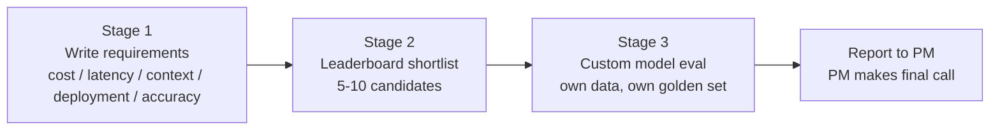
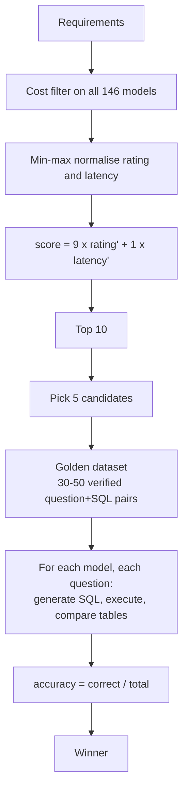

# CS-12 · Selecting the Right LLM for Your AI App: Running Custom Model Evals

> **Source transcript:** `Selecting_the_Right_LLM_for_Your_AI_App_Running_Custom_Model_Evals_CampusX.txt` (≈1 h 57 min / 7,422 lines, Banglish-Hinglish auto-transcript, romanised)
> **Domain:** benchmarks
> **One-liner:** A two-hour live build that turns "which LLM should we use?" into an engineering procedure — collect requirements, filter the leaderboard on cost, rank the survivors on a weighted capability:latency score, then run your own execution-based eval on your own golden dataset and let the numbers pick the winner.
> **Prerequisites:** CS-01, CS-09, CS-10, CS-11

---

## 0. Executive summary

This lecture closes the *model evaluation* arc of the course and hands the learner the last missing skill: **custom model evaluation** — running candidate LLMs on your own data, on your own application, to answer "which model is best *for me*" rather than "which model is best" `[1:06]–[1:43]`. The framing is stated at the top: LLM evaluation splits into **model evaluation** and **application evaluation** `[0:42]–[0:56]`; model evaluation further splits into **benchmarks** and **custom model evaluation** `[1:06]–[1:43]`. Benchmarks tell you the top 4–5 models in the market; they do not tell you which is right for your product `[1:56]–[2:24]`.

The vehicle is a concrete business scenario: a cricket website (ESPNcricinfo-style, ball-by-ball commentary) wants a chatbot where any fan can ask any cricket question `[5:54]–[6:13]`. The architecture is **Text-to-SQL** — the user's question plus the database schema go into the LLM, the LLM emits SQL, the SQL runs against the live database, the result is shown to the user `[6:48]–[7:52]`. It is explicitly *not* RAG, because the only context injected is a fixed schema, not retrieved documents `[10:36]–[10:56]`.

The selection procedure is three stages `[12:27]–[13:03]`: **(1) write down requirements; (2) shortlist 5–10 candidates off leaderboards; (3) run custom evals on your own data and pick the winner.** The governing aphorism is that **leaderboards filter, they do not select** `[11:59]–[12:03]`.

The end-to-end numbers are the value of the lecture: a 400-input-token + 100-output-token request at $10/$50 per million tokens costs **$0.009**; at 50,000 requests/day that is **$450/day → $13,500/month → ₹12.82 lakh/month**, four times over budget `[27:24]–[30:52]`. Filtering 146 leaderboard models by a ₹3 lakh/month ceiling removed 50–60 of them `[56:34]–[56:42]`. Candidates were ranked with `score = 9 × normalised_capability + 1 × normalised_latency` (90:10) `[58:21]–[59:24]`. The custom eval used a 20-question golden dataset over an IPL SQLite database and scored by **executing both the generated SQL and the golden SQL and comparing the result tables** `[1:12:59]–[1:15:36]`. Final measured accuracy: **Grok ≈90%, Claude Sonnet 85%, GPT-5.6 Terra 80%, MiniMax 65%, K3 55%** — and the headline model of the week (K3) finished last `[1:47:45]–[1:53:41]`.

---

## 1. The problem this lecture solves

You are an AI engineer. A product manager asks: *"which LLM should we put in this feature?"* The naive answers are all wrong:

- **"The one at the top of the leaderboard."** Leaderboards are a *filter*, not a decision `[11:59]–[12:03]`. They are computed on someone else's data, for someone else's task, at someone else's price point.
- **"The one in the news."** The lecture demonstrates this the hard way: K3, a 2.7-trillion-parameter model with a week of hype behind it, was the **worst performer** of five candidates in the author's own eval `[1:43:46]–[1:53:45]`.
- **"The cheapest."** Cost is a *constraint*, not an objective — you filter on it first and then maximise quality within the survivors.

The lecture's answer is a repeatable three-stage procedure, and its real payload is the third stage: how to build and run a **custom model evaluation** whose result you can defend in a meeting. Everything is done by hand — no eval framework — because the point is to understand what the frameworks will later do for you (DeepEval and similar are explicitly deferred `[1:17:58]–[1:18:22]`).

The author is also explicit about the division of labour: the **AI engineer produces the report**; the **project manager makes the final call**, with much more business input than a pure score table provides `[1:49:30]–[1:49:45]`.

---

## 2. Definitions & mental models

| Term | Definition as given |
|---|---|
| **Model evaluation** | Judging the *model itself* — either against public benchmarks or against your own data `[0:42]–[1:43]` |
| **Application evaluation** | Judging the assembled application (retrieval, prompts, guardrails, the LLM together) `[0:42]–[0:56]` |
| **Benchmark** | A standardised public test of a model capability; gives you the market's top 4–5 models `[1:56]–[2:24]` |
| **Custom model evaluation** | Running an LLM on **your own data** for **your own application** to see which model is best for *that* application `[1:46]–[1:54]` |
| **Requirements** | The written constraints (cost, latency, context, deployment, accuracy) that turn a leaderboard into a shortlist `[13:52]–[45:10]` |
| **Text-to-SQL** | Application pattern where the LLM receives a schema and emits SQL that is executed against the database `[10:07]–[10:13]` |
| **Golden dataset** | A set of `(question, verified correct SQL)` rows that mirrors real user traffic `[1:09:30]–[1:12:15]` |
| **Execution-based evaluation** | Scoring by running both queries and comparing result tables — not by comparing SQL strings `[1:13:01]–[1:14:12]` |

**Mental model — the funnel.** 146 models → cost filter → ~90 models → weighted rank → top 10 → 5 candidates → 1 winner. Each stage uses a *different* signal: money, then a blended score, then real measured accuracy. No single signal is allowed to make the decision.

**Mental model — leaderboard as alias.** When no trustworthy leaderboard exists for your exact task, use a leaderboard for the *nearest task*. Here, generating SQL is treated as a **coding activity**, so the coding leaderboard is used as an **alias** for Text-to-SQL capability `[48:56]–[49:43]`.

---

## 3. Core content, decomposed

### 3.1 The scenario

A cricket website wants a chatbot for cricket questions `[5:54]–[6:13]`. The team previously answered questions manually and wrote ball-by-ball commentary, and could not scale `[14:36]–[14:46]`. The build: user question + **database schema** → LLM → **SQL** → execute → result to user `[6:48]–[7:52]`. The schema has **two tables** — `matches` (all IPL match records) and `deliveries` (ball-by-ball data) `[19:48]–[20:33]`. One T20 match = **240 balls / 40 overs** `[20:37]–[20:39]`. This is "not RAG" because the schema is fixed and injected every time `[10:36]–[10:56]`.

### 3.2 Stage 1 — Requirements

| Requirement | Value in the scenario | Anchor |
|---|---|---|
| **Cost** | company-wide monthly spend **> ₹30 lakh**; manager's guideline **under ₹3 lakh, don't cross ₹3 lakh**; the author's own working "magic number" **₹1 lakh** | `[16:15]–[16:18]`, `[16:59]–[17:04]`, `[38:37]–[38:42]`, `[44:14]–[44:16]` |
| **Latency** | **2–3 seconds**; >3 s makes users restless; 5 s is too long | `[40:18]–[40:49]` |
| **Context window** | **not important** for this app; would matter for a chatbot or coding assistant | `[41:10]–`[42:12]` |
| **Deployment** | public APIs preferred (better infra and reliability); Anthropic, OpenAI, Google all acceptable; no private data involved | `[42:13]–[42:58]` |
| **Accuracy** | **the critical one** — a wrong name goes straight to Instagram/Twitter and damages the brand | `[43:05]–[45:03]` |

Two ways to check accuracy were named: inspect the leaderboard's **coding** results `[43:47]–[43:58]`, and run your **own custom eval** `[43:58]–[44:06]`.

### 3.3 The cost model (this is the arithmetic worth copying)

**Step 1 — tokens per request.** The full prompt (system prompt + schema + question) measured **352 tokens**, rounded up to **400** `[22:39]–[22:59]`. Output assumed **~100 tokens** `[23:17]–[23:26]`. Total **500 tokens/request** `[55:14]–[55:18]`.

**Step 2 — price.** The model (romanised "Feb", glossed in the transcript as Claude Haiku `[27:41]–[27:43]`) is priced at **$10 per million input tokens** and **$50 per million output tokens**.

**Step 3 — per-query cost.**

```
400 × 10/1e6  = $0.004
100 × 50/1e6  = $0.005
total         = $0.009 per query
```

**Step 4 — scale.** × 50,000 requests/day = **$450/day** (the speaker visibly self-corrects from $25 to $450 here `[29:07]–[29:53]`) → × 30 = **$13,500/month** → × 95 (USD→INR) = **₹12.82 lakh/month** `[29:55]–[30:33]`. Against a ₹3 lakh budget that is **~4× over** `[30:42]–`[30:52]`, so the model needs to be about **a quarter** the price `[30:55]–[30:58]`.

**Step 5 — the blended-price shortcut.** Leaderboards often publish one blended price. At a **4:1 input:output ratio**: `(4×10 + 1×50) / 5 = 90/5 = $18 per million tokens` `[52:53]–[54:07]`. The course's own prompt is **400:100 = exactly 4:1**, so the blended figure applies directly `[54:24]–[55:06]`. 500 tokens at $18/M = $0.009/query — the same number, reached faster `[55:18]–[55:30]`.

### 3.4 Prompt caching

The system prompt + schema is the large, unchanging part of every request, so it can be cached `[31:50]–[37:47]`. Cache **write** rates are quoted for a **5-minute** window and a **1-hour** window, plus **hit** and **refresh** rates `[31:50]–[31:57]`. On a cache hit the static prefix costs **$1 instead of $10** — a **10× saving** on input `[34:29]–[34:56]`. The 5-minute TTL means the cache must be kept warm `[37:36]–[37:47]`.

> **Analyst note:** the source is internally inconsistent here. It quotes the 5-minute cache **write** as **$50** at `[33:41]–[33:50]` and as **$12.50** at `[33:56]–[34:19]`, and the romanised "67%" saving at `[37:36]–[37:47]` cannot be reconciled with either without knowing the hit ratio. Record the *mechanism* (write cost once, hit cost ~1/10th, 5-minute TTL) as the transferable content; do not quote the write price as a fact.
>
> **Analyst note:** the "$10 input / $50 output" price paired with the gloss "Claude Haiku" does not match any Haiku list price. Treat the model identity and the price as an illustrative pair chosen to make the arithmetic work.

### 3.5 Stage 2 — Leaderboards, and why the obvious ones were rejected

Search "text to SQL leaderboard" `[46:15]–[46:35]` returned **BIRD SQL** `[46:37]` and **Spider** `[47:47]`. Both were rejected:

- **BIRD** — not up to date; only old models are listed; fine-tuned models are admitted; no dedicated entry for current general models; and the author objects to the naming convention (B-I-R-D formed from middle letters, as RAG was) `[46:56]–[47:46]`.
- **LiveSQLBench** — the board exists but is stale: the newest entries are Claude 3.5 and GPT-4.0, and it is unclear what data was benchmarked `[48:21]–[48:49]`.
- The **top entry on BIRD is not a model at all** but a submitted system ("Loopa Sentinel Agent V2 Pro") — a company entered a whole harness `[48:02]–[48:20]`.

Conclusion: **text-to-SQL leaderboards cannot be trusted** `[48:50]–[48:54]`. Move to the **coding** leaderboard, because SQL generation is coding `[48:56]–[49:06]`.

The board used is **LLMstats.com**, a third-party aggregator that computes its own overall rating from many underlying coding benchmarks and has a "best AI for coding" section `[49:45]–[50:40]`. Named leaders at the time: **GPT-4.5** first, then **Feb 3**, **Mistral 3.5**, **Terra 2.0**, plus **Claude Opus 4.8** and **Opus 5**; **146 models** in total `[50:44]–[51:11]`.

### 3.6 Shortlisting: filter on cost, then rank on a weighted score

1. **Compute a monthly production cost for all 146 models** using the token formula `[56:00]–[56:31]`. Reference points: the Claude "Feb" model came out at **₹12 lakh/month**, cheaper models at **₹8 lakh/month** `[56:09]–[56:16]`.
2. **Filter:** reject everything above **₹3 lakh/month** — this removed **50–60 models** `[56:34]–[56:42]`.
3. **Min–max normalise the rating to 0–1** `[57:16]–[58:03]`: `x' = (x − x_min)/(x_max − x_min)`. Worked example: our model's rating minimum is **50** and the observed minimum is **GPT-4.1 nano's −1.1**, so the first step is `50 − (−1.1) = 51.1` `[57:23]–[57:36]`.
4. **Min–max normalise the latency** the same way, using the board's reported speed in tokens (characters) per second `[58:03]–[58:19]`.
5. **Combine:** `score = 9 × normalised_rating + 1 × normalised_latency` — i.e. **90 % capability, 10 % latency** `[58:21]–[59:24]`.

**Why 90:10.** The output is one SQL query of at most ~100 tokens; even a slow model finishes it quickly (a fast model ~1–1.5 s, a slow one 2–4 s), so latency barely matters here while capability matters enormously `[59:29]–[1:00:59]`. The author states plainly that the weights are a personal judgement and could be 98:2 or 75:25 `[1:00:43]–[1:00:53]`.

**Output:** the **top 10** by combined score; the leader was **GPT-5.6 Terra** `[1:01:05]–[1:01:23]`. **Microsoft Spark 1.1** was excluded for availability (UAE only) `[1:03:19]–[1:03:31]`. A structural finding: **proprietary models are expensive, open-source models are cheap and close behind** — e.g. **MiniMax M3 scores 76 on coding where GPT-5.6 Terra scores 100, at a fraction of the cost** `[1:03:40]–[1:04:28]`.

**The five candidates** `[1:04:29]–[1:06:19]`: **GPT-5.6 Terra** (top-ranked), **Grok** (chosen on a week of hype), **Claude Sonnet** (the only Anthropic entry), **KMI K3** (the 2.7-trillion-parameter headline model), and one cheap Chinese model — **Gemini / MiniMax** — since they are comparable `[1:05:42]–[1:05:55]`. GPT-5.6 Luna was skipped in favour of Terra (same vendor, Terra should be stronger) `[1:05:30]–[1:05:41]`; Gemini 3.6 was rejected `[1:05:56]–[1:06:00]`.

### 3.7 Stage 3 — The custom model evaluation

**Data.** The IPL dataset from **Kaggle**, 2008–2024 `[1:09:13]–[1:09:21]`, truncated to **2020–2024** for the live session `[1:19:16]–[1:19:33]`. Two CSVs — `deliveries.csv` and `matches.csv` `[1:19:01]` — loaded into a **SQLite** database by `db.py` `[1:19:36]–[1:20:39]`. `schema_extractor.py` reads the DB and writes `schema.sql` (both tables, every column, with descriptions), because the schema must be embedded in the **system prompt** on every request `[1:21:04]–[1:21:53]`.

**The golden dataset.** Ideally **30–50 questions**; **20** were used in class `[1:09:43]–[1:09:46]`, `[1:17:53]–[1:17:56]`. Each row is `(question, correct SQL)` `[1:10:03]–[1:10:07]`, and the correct SQL is **run against the database to verify it produces the right answer** before it is admitted `[1:10:10]–[1:10:27]`. Composition rules: **mirror the distribution of real user questions** `[1:11:07]–[1:11:16]`; keep roughly **20 medium and 20 hard** (do not make everything easy) `[1:11:17]–[1:11:31]`; ensure **diversity of SQL constructs** — not five joins and five subqueries `[1:11:32]–[1:11:47]`. Creation is normally **manual by a data analyst**; in class an LLM generated them and **each one was verified by execution** `[1:23:10]–[1:23:22]`. Example rows: *"How many sixes did Virat Kohli hit in IPL from 2018 to 2022?"* `[1:09:49]–[1:10:03]` and *"Which ground did Jasprit Bumrah play the most matches at from 2012 to 2016?"* `[1:10:33]–[1:10:44]`. The prompt-question used for cost modelling was harder: *"Who has taken the most wickets in the death overs among bowlers who have bowled at least 500 legal balls?"* `[21:06]–[21:14]`.

**The metric — execution-based comparison** `[1:12:59]–[1:15:36]`. Run the **LLM's SQL** and the **golden SQL** and compare the **result tables**. **String-matching SQL is wrong**: one result table can be produced by many different queries, so string equality tests the wrong thing `[1:13:56]–[1:14:12]`. Metric: **accuracy = correct questions / total questions** `[1:15:19]–[1:15:36]`.

**`evaluator.py` logic** `[1:33:55]–[1:38:28]`: compare **row counts** first (a mismatch = wrong) `[1:34:04]–[1:34:34]`; if equal, **normalise values** (decimal vs integer: `2.0` vs `2`; precision: `2.999` vs `2.99`), **sort rows** so ordering differences do not cause false failures `[1:35:31]–[1:36:12]`; where **order is semantically meaningful**, skip the sort and require identical order `[1:36:13]–[1:37:47]`.

**Tooling.** **OpenRouter** as a single gateway so all five models are callable with one API key; it integrates with **LangChain** so models can be swapped like `ChatOpenAI`; free credits are available and the whole run cost about **$5 / ₹500** `[1:27:12]–[1:29:27]`.

**Files** `[1:29:32]–[1:40:13]`: `first_test.py` (smoke test on GPT-4o — not a candidate, only a plumbing check) `[1:29:32]–[1:31:13]`; `model_openrouter_slug.py` (five `(display name, slug)` tuples) `[1:31:27]–[1:32:24]`; `golden_dataset_generator.py` (generates the 20 questions with a difficulty label and flags any whose SQL errors) `[1:23:10]–[1:25:40]`; `golden_hard_dataset.csv`, renamed to `golden_dataset` to match the code `[1:40:34]–[1:40:51]`; and `main.py`, the orchestrator that loads models + schema + golden set, loops over questions per model, generates SQL, executes it, calls `evaluator.py`, and aggregates scores `[1:38:44]–[1:40:13]`.

### 3.8 Results

| Model (as named in the transcript) | Accuracy | Latency | Projected monthly cost | Anchor |
|---|---|---|---|---|
| **Grok** | **~90 %** (2 wrong) | fastest (~1 s) | **₹2.5 lakh** | `[1:49:46]–[1:50:16]` |
| **Claude Sonnet 5** | **85 %** (2 wrong) | fastest of the three at that point | **₹284** *(see note)* | `[1:50:19]–[1:51:04]` |
| **GPT-5.6 Terra** | **80 %** (4 wrong of 18) | — | ~₹5 lakh (≈2× Grok) | `[1:43:17]–[1:43:24]`, `[1:50:09]` |
| **MiniMax M3** | **65 %** (5–6 wrong) | fast | cheap (Chinese) | `[1:53:33]–[1:53:37]` |
| **KMI/KB K3** | **~50–55 %** (11 correct) | **very slow** | more than Grok | `[1:47:35]–[1:47:47]`, `[1:50:11]` |

Notable detail: **question 2 was failed by GPT-5.6 Terra and by K3 but solved by Grok** `[1:48:11]–[1:48:24]`; questions **10 and 11** (the hardest) were failed by three models `[1:51:09]–[1:51:22]`. **K3 produced SQL syntax errors** — 3 at one count, 5–6 by the end — and its accuracy sat "around 50 %" `[1:45:04]`, `[1:47:29]`, `[1:47:35]`. K3 is a **reasoning model run with default reasoning settings**, which is why it was slow `[1:46:16]–[1:46:35]`. The **Chinese models produced SQL syntax errors; the American models at least produced valid syntax** `[1:52:13]–[1:52:17]`.

**The lesson stated in the source:** a model at the top of the news performed poorly in practice — a leaderboard headline is **no guarantee** that a model will be good for *your* task `[1:46:36]–[1:47:03]`.

**Caveats the author raises himself:** 20 questions means each question is worth **5 %**, so the dataset should be larger `[1:52:37]–[1:52:51]`; and because each API call is independent, one run is one sample — running the whole evaluation **five times** gives statistical confidence, at higher cost `[1:52:52]–[1:53:17]`.

**Closing decision** `[1:53:50]–[1:55:20]`: Terra is dropped because it is **very expensive** for a lower score; the two finalists are **Grok 4.5 and Claude Sonnet 5**, with indices of **90 and 85** and costs described as nearly the same. The instructor personally **leans toward Sonnet** — Anthropic's API is more reliable, Grok carries Elon Musk's personal volatility — but says it is the learner's call, and that when a company cannot reach consensus it **votes**.

> **Analyst note:** the two cost figures do not reconcile. Grok is reported as ₹2.5 lakh/month (`[1:50:06]`) while Sonnet is reported as "₹284" (`[1:50:57]`), yet the source simultaneously says their costs are nearly the same and that Grok is the cheaper one so far (`[1:51:02]`, `[1:54:08]–[1:54:10]`). A plausible but unconfirmed reading is that "284" is truncated or mis-transcribed from ₹2.84 lakh, which would make the statements consistent. Both readings are recorded; do not cite ₹284 as established.
>
> **Analyst note:** all model names in this lecture are romanised and partly obfuscated by the transcript (GPT-5.6 Terra/Luna, Grok 4.5, Claude Sonnet 5, KMI/KB K3, MiniMax M3, Mistral 3.5, GPT-4.5, Feb 3). They are reproduced as the source gives them and should not be treated as verifiable product names or current pricing.

---

## 4. Frameworks & decision procedures





**Decision rules**

1. If a good leaderboard exists for your exact task, use it; if not, use the **nearest task as an alias** (SQL → coding).
2. Filter on cost **before** ranking on quality. A model you cannot afford is not a candidate.
3. Score on **at most two** normalised dimensions with explicit weights, and state the weights out loud.
4. Evaluate with **execution**, not string comparison, whenever the output is a program or query.
5. Verify every golden answer by running it before it enters the dataset.
6. If two candidates are within a few points, the tie-break is **operational** (API reliability, vendor stability), not statistical.

---

## 5. Worked end-to-end example

*Cricket chatbot, one complete pass.*

1. **Requirements written down.** Cost ≤ ₹3 lakh/month (manager), accuracy critical, latency 2–3 s, context window irrelevant, public API preferred `[13:52]–[45:10]`.
2. **Cost modelled.** 400 input + 100 output tokens; $10/M input, $50/M output → $0.009/query → ₹12.82 lakh/month at 50,000 queries/day → 4× over budget → need ~1/4 the price `[27:24]–[30:58]`. Cache the static schema prefix to attack the input side `[31:50]–[37:47]`.
3. **Shortlist built.** "text to SQL leaderboard" → BIRD and LiveSQLBench rejected as stale/misleading → switch to the coding board on LLMstats.com → 146 models → compute monthly cost for each → drop those above ₹3 lakh (50–60 removed) → min–max normalise rating and speed → `9×rating' + 1×latency'` → top 10 → 5 candidates `[46:03]–[1:06:19]`.
4. **Golden dataset built.** IPL 2020–2024 CSVs → SQLite → `schema_extractor.py` → `schema.sql`; 20 questions generated with a difficulty label, each verified by executing its SQL `[1:19:01]–[1:26:43]`.
5. **Eval run.** `main.py` loops models × questions through OpenRouter, executes both queries, calls `evaluator.py` (row count → normalise → sort → compare), aggregates accuracy `[1:33:55]–[1:40:13]`.
6. **Result.** Grok ~90 % at ₹2.5 lakh/month, Sonnet 85 %, Terra 80 % at ~₹5 lakh, MiniMax 65 %, K3 ~55 % and slow `[1:43:17]–[1:53:37]`.
7. **Decision.** Terra dropped on price; Grok and Sonnet finalists; engineer reports, PM decides (vote if no consensus) `[1:53:50]–[1:55:20]`.

---

## 6. Pros, cons, exceptions

**Pros of the procedure**

- Every claim in the final report is traceable to a number you computed yourself.
- The cost filter runs on 146 models in minutes and eliminates the most common failure — choosing a model you cannot afford.
- Execution-based scoring is implementation-agnostic: two different SQL queries with the same result both count as correct.
- Requires no eval framework; the whole apparatus is a handful of Python files.

**Cons / limits stated or demonstrated**

- A 20-question set gives each question 5 % weight — noisy `[1:52:37]–[1:52:51]`.
- A single run is a single sample; five runs are advised for confidence `[1:52:52]–[1:53:17]`.
- Public leaderboards can be **stale** (new models missing) or **not model-only** (whole harnesses submitted) `[46:56]–[48:49]`.
- Latency weights are a judgement call with no ground truth `[1:00:43]–[1:00:53]`.
- The procedure produces a *report*; a human still decides `[1:49:30]–[1:49:45]`.

**Exceptions / when this does not apply**

- **Context window matters** for chat assistants and coding assistants; it is irrelevant here `[41:10]–[42:12]`.
- **Latency matters little** when outputs are short; it dominates in interactive, long-generation apps `[59:29]–[1:00:59]`.
- **A reliable task-specific leaderboard** would let you skip Stage 2's alias step entirely.
- **Data that must stay private** would rule out public APIs and invalidate the cost basis `[42:13]–[42:58]`.

---

## 7. Failure modes & anti-patterns

| Anti-pattern | Why it fails | Anchor |
|---|---|---|
| Taking leaderboard rank as the decision | Leaderboards **filter, they do not select** | `[11:59]–[12:03]` |
| Trusting a stale task-specific board | BIRD/LiveSQLBench missing every current model | `[46:56]–[48:49]` |
| Submitting a whole harness, not a model | Makes the board's ranking meaningless for model choice | `[48:02]–[48:20]` |
| Comparing SQL strings | Many correct queries; string equality rejects valid answers | `[1:13:56]–[1:14:12]` |
| Shipping a golden answer without executing it | An unverified "correct" SQL poisons the whole score | `[1:10:10]–[1:10:27]` |
| An all-easy or single-construct golden set | Inflates accuracy and hides real weaknesses | `[1:11:17]–[1:11:47]` |
| A 20-question dataset read to the decimal point | 5 % granularity; treat differences under a few points as noise | `[1:52:37]–[1:52:51]` |
| One evaluation run | Each call is independent; one run is one sample | `[1:52:52]–[1:53:17]` |
| Letting hype choose the model | K3 was the news leader and finished last | `[1:46:36]–[1:47:03]` |
| Ignoring output-token pricing | Output tokens cost more than input; long answers dominate cost | `[21:51]–[21:54]` |

---

## 8. Implementation notes

- **Database:** SQLite; two tables (`matches`, `deliveries`) loaded from `deliveries.csv` + `matches.csv` by `db.py`.
- **Schema injection:** `schema_extractor.py` → `schema.sql`, embedded verbatim in the system prompt on every request.
- **Gateway:** OpenRouter, one API key for all candidates, LangChain-compatible so the model object is swappable in one line.
- **Candidate registry:** a list of `(display name, OpenRouter slug)` tuples in `model_openrouter_slug.py`.
- **Smoke test:** `first_test.py` against GPT-4o to prove the plumbing before spending money on candidates.
- **Golden set file:** CSV named to match the code exactly (renaming cost the author a debugging round `[1:40:34]–[1:40:51]`).
- **Evaluator order of operations:** row count → value normalisation (int/decimal, precision) → row sort (unless order is semantic) → compare.
- **Cost control:** the full 20-question, five-model run cost about **$5 / ₹500** through OpenRouter.
- **Observability:** measure per-model latency; the author regrets not logging it and notes it can be re-run later `[1:47:19]–[1:47:27]`.
- **Deliberate omission:** no eval framework was used; DeepEval and friends arrive later in the curriculum `[1:17:58]–[1:18:22]`.

> **Analyst note (outside source):** the lecture does not give the literal source code of `evaluator.py`, `main.py` or the OpenRouter client, and the GitHub repository promised in the lecture **was not published** — the author states at the end that he never created it and the class worked on local machines `[1:56:11]–[1:56:19]`. Any code reconstruction must be treated as illustrative.

---

## 9. Interview-ready Q&A

**Q1. What is the difference between model evaluation and application evaluation?**
Model evaluation judges the model itself, via public benchmarks or your own data. Application evaluation judges the whole assembled application. This lecture covers the *custom model evaluation* branch of model evaluation `[0:42]–[1:43]`.

**Q2. Why isn't the top of the leaderboard the answer?**
Because leaderboards filter rather than select `[11:59]–[12:03]`. They are computed on someone else's data and don't reflect your cost ceiling, latency budget or query distribution. In the lecture's own eval, the headline model K3 finished last `[1:53:41]`.

**Q3. Walk me through costing an LLM feature.**
Measure prompt tokens (here 352 → rounded to 400) and expected output tokens (~100). Multiply each by its per-million price ($10 input / $50 output), sum → $0.009/query. Multiply by daily volume (50,000) × 30 days × 95 to get ₹ → ₹12.82 lakh/month `[22:39]–[30:33]`.

**Q4. Which is more expensive, input or output tokens?**
Output, usually `[21:51]–[21:54]`. That is why the blended leaderboard price depends on the input:output ratio — at 4:1 the blend is `(4×10 + 1×50)/5 = $18`/M `[52:53]–[54:07]`.

**Q5. How does prompt caching change the maths?**
The unchanging prefix — system prompt plus schema — is cached, so a cache hit costs about a tenth of the normal input rate ($1 vs $10 in the source's example). The 5-minute TTL means the cache has to be kept warm `[31:50]–[37:47]`.

**Q6. How do you pick candidates off a leaderboard?**
Compute a monthly production cost for every model using your own token profile, drop everything above budget (50–60 of 146 here), min–max normalise the capability rating and the speed, combine with explicit weights, take the top 10, then choose 5 `[56:00]–[1:06:19]`.

**Q7. Why 90 % capability and 10 % latency?**
Because the output is a short SQL query — even a slow model finishes it within seconds, so capability dominates. The author explicitly says the weights are a judgement call and could be 98:2 or 75:25 `[59:29]–[1:00:53]`.

**Q8. What is min–max normalisation and why do it?**
`x' = (x − x_min)/(x_max − x_min)`, mapping every metric onto 0–1 so that a rating on a 0–100 scale and a speed in tokens/second can be added with weights. The source's worked step: ratings range from 50 down to GPT-4.1 nano's −1.1 `[57:16]–[58:03]`.

**Q9. How do you score a Text-to-SQL model?**
Execute both the generated SQL and the golden SQL and compare the **result tables** `[1:12:59]–[1:13:56]`. Never string-match SQL: different queries legitimately produce the same result set `[1:13:56]–[1:14:12]`. Metric: accuracy = correct / total `[1:15:19]–[1:15:36]`.

**Q10. What does the table comparator have to handle?**
Different row counts → wrong. Equal counts → normalise value representations (2.0 vs 2, precision), sort rows so ordering doesn't cause false negatives, and skip sorting when order is semantically meaningful `[1:33:55]–[1:37:47]`.

**Q11. How do you build a golden dataset?**
30–50 questions ideally; each is `(question, correct SQL)`; every correct SQL is executed to verify it before admission; the set must mirror real user question distribution; keep a medium/hard mix; diversify SQL constructs `[1:09:30]–[1:12:15]`, `[1:11:17]–[1:11:47]`.

**Q12. Can you use an LLM to generate the golden set?**
Yes, and the lecture does — but each generated item is executed and verified before it counts `[1:23:10]–[1:23:22]`. The normal production route is a data analyst writing them manually.

**Q13. What did the eval actually find?**
Grok ~90 % and fastest at ₹2.5 lakh/month; Claude Sonnet 85 %; GPT-5.6 Terra 80 % at roughly twice Grok's cost; MiniMax 65 %; K3 ~55 %, slow, with SQL syntax errors `[1:43:17]–[1:53:41]`.

**Q14. Why was K3 slow?**
It is a reasoning model and the author left its default reasoning settings untouched, so it spent a long time thinking before answering `[1:46:16]–[1:46:35]`.

**Q15. What is the statistical weakness of this evaluation?**
20 questions → each worth 5 %; and each API call is independent, so one run is one sample. Running the whole evaluation five times is the suggested remedy `[1:52:37]–[1:53:17]`.

**Q16. Who makes the final model decision?**
The AI engineer produces the report; the project manager makes the call with additional business input. If consensus fails, the team votes `[1:49:30]–[1:49:45]`, `[1:55:14]–[1:55:20]`.

**Q17. When would you *not* use this procedure?**
When a trustworthy task-specific leaderboard already exists; when private data forbids public APIs; or when the task's cost/latency profile differs enough that the weightings and token model change `[41:10]–[42:58]`.

**Q18. Trap: "So the cheapest model that passes the accuracy bar wins?"**
No. Cost is a filter, not an objective. You filter on budget first, then maximise the weighted capability score among survivors, then confirm with a custom eval — and the source shows a cheap-looking candidate (K3) that was worse on both axes `[1:47:35]–[1:47:45]`.

---

## 10. Cheat sheet

### The 60-second version

Leaderboards **filter, they do not select** `[11:59]`. Write your requirements first (cost, latency, context, deployment, accuracy). Compute the monthly cost of *every* model with your own token profile. Filter on budget. Min–max normalise capability and speed, combine with explicit weights (90:10 here). Take the top 10, pick 5. Build a 30–50 question golden set and verify every answer by execution. Score by **comparing result tables, not SQL strings**. Report; the PM decides.

### Core concepts

| Concept | One-line meaning |
|---|---|
| Custom model eval | Running models on **your** data for **your** app |
| Leaderboard as alias | Use the nearest-task board when no exact one exists (SQL → coding) |
| Cost filter | Compute monthly cost for all candidates, drop the unaffordable |
| Min–max normalisation | Map every metric to 0–1 before weighting |
| Execution-based eval | Compare query **results**, not query text |
| Golden dataset | Verified `(question, correct SQL)` pairs mirroring real traffic |

### Formulas & metrics

| Formula | Symbols | Anchor |
|---|---|---|
| `cost_per_query = (T_in × P_in + T_out × P_out) / 1e6` | `T_in/T_out` = input/output tokens, `P_in/P_out` = price per million | `[27:24]–[28:xx]` |
| `monthly = cost_per_query × QPD × 30 × FX` | `QPD` = queries/day, `FX` = USD→INR (95 used) | `[55:28]–[55:46]` |
| `blended_price = (r × P_in + P_out) / (r + 1)` | `r` = input:output ratio (4 here) → $18/M | `[52:53]–[54:07]` |
| `x' = (x − x_min)/(x_max − x_min)` | min–max normalisation to [0, 1] | `[57:16]–[58:03]` |
| `score = 9 × rating' + 1 × latency'` | 90 % capability / 10 % latency | `[58:21]–[59:24]` |
| `accuracy = correct / total` | the eval metric | `[1:15:19]–[1:15:36]` |
| `weight_per_question = 100 / N %` | 20 questions → 5 % each | `[1:52:42]–[1:52:45]` |

### Decision rules

1. Requirements before leaderboards.
2. Filter on cost; never rank on it.
3. Two normalised dimensions, explicit weights, stated out loud.
4. Alias a nearby capability when the exact leaderboard is unusable.
5. Execute golden answers before trusting them.
6. Compare result tables, never query strings.
7. Report to the PM; vote if the room is split.

### Thresholds & defaults worth memorising

| Value | Meaning |
|---|---|
| **352 → 400 tokens** | measured system prompt + schema, rounded up |
| **100 tokens** | assumed output per SQL query |
| **$10 / $50 per million** | input / output price used in the model |
| **$0.009** | per-query cost |
| **50,000 / day** | the volume used in the arithmetic |
| **₹12.82 lakh/month** | the resulting cost — 4× over budget |
| **₹3 lakh/month** | manager's ceiling; the filter threshold |
| **₹1 lakh/month** | the author's own working target |
| **2–3 s** | latency target |
| **30–50 questions** | ideal golden dataset size (20 used here) |
| **90:10** | capability:latency weight |
| **~$5 / ₹500** | cost of the whole five-model eval run |
| **5 runs** | recommended repetitions for statistical confidence |

### Tool commands

The source names the tools but does not print the command lines. Illustrative shapes:

```text
# Load CSVs into SQLite, extract schema
python db.py                 # deliveries.csv + matches.csv -> SQLite
python schema_extractor.py   # -> schema.sql (injected into the system prompt)

# Build and run the evaluation
python golden_dataset_generator.py   # emits question + SQL + difficulty label
python first_test.py                 # smoke test (GPT-4o), proves the plumbing
python main.py                       # loops models x questions, calls evaluator.py
```

> **Analyst note (outside source):** command names are the source's; argument lists are not given and the snippet above is a reconstruction of the workflow, not of the author's CLI.

### Top 10 mistakes

1. Using leaderboard rank as the decision.
2. Choosing the hyped model without measuring (K3).
3. Forgetting that output tokens cost more than input.
4. Not modelling prompt caching when a static schema dominates the prompt.
5. String-matching generated SQL against golden SQL.
6. Never executing the "correct" golden SQL.
7. An all-easy or single-construct golden set.
8. A golden set that doesn't mirror real user questions.
9. Reading a 20-question result to the nearest percent.
10. Running the evaluation once and declaring a winner.

### If you only remember three things

1. **Leaderboards filter; your own evaluation selects** `[11:59]`.
2. **Cost is a filter, capability is the objective** — normalise both, weight them explicitly.
3. **Score programs by executing them, not by comparing their text** `[1:13:56]–[1:14:12]`.

---

## 11. Glossary

- **Custom model evaluation** — running LLMs on your own data for your own application to select the best model `[1:46]–[1:54]`.
- **Text-to-SQL** — generating SQL from a natural-language question plus a database schema `[10:07]–[10:13]`.
- **Schema injection** — embedding the DB schema in the system prompt on every request `[1:21:25]–[1:21:53]`.
- **Golden dataset** — verified `(question, correct SQL)` pairs used as ground truth `[1:09:30]–[1:12:15]`.
- **Execution-based evaluation** — scoring by comparing query result tables `[1:12:59]–[1:15:36]`.
- **Min–max normalisation** — rescaling a metric to [0, 1] via `(x − min)/(max − min)` `[57:16]–[58:03]`.
- **Prompt caching** — reusing the unchanged prompt prefix at a reduced input price, with a TTL (5 minutes here) `[31:50]–[37:47]`.
- **Blended price** — one price per million tokens derived from an assumed input:output ratio `[52:53]–[54:07]`.
- **Alias capability** — a proxy capability (coding) standing in for the target capability (SQL) when no usable board exists `[48:56]–[49:43]`.
- **OpenRouter** — a multi-model gateway exposing many models behind one API key `[1:27:12]–[1:29:31]`.

---

## 12. Cross-references

**Within this knowledge base**

- [CS-01 model evals vs application evals](../01-foundations/CS-01-model-evals-vs-application-evals.md) — the model/application split this lecture reprises in its first two minutes.
- [CS-04 complete eval workflow](../01-foundations/CS-04-complete-eval-workflow.md) — the generic 12-step workflow this custom eval instantiates.
- [CS-05 model evals and capabilities](../01-foundations/CS-05-model-evals-and-capabilities.md) — the requirement dimensions (cost, latency, context, accuracy) first introduced there.
- [CS-07 LLM-as-a-judge, reference-based vs reference-free](../02-methods/CS-07-llm-as-a-judge-reference-based-vs-reference-free.md) — why this case uses a *reference-based, programmatic* judge rather than an LLM judge.
- [CS-09 reading LLM leaderboards](CS-09-reading-llm-leaderboards.md) — how to read the boards that form Stage 2.
- [CS-10 evolution of AI knowledge benchmarks](CS-10-evolution-of-ai-knowledge-benchmarks.md) — BIRD, Spider and the knowledge benchmarks behind the shortlist.
- [CS-11 benchmark saturation vs contamination](CS-11-benchmark-saturation-vs-contamination.md) — why a stale or harness-contaminated board cannot be trusted for selection.
- [CS-06 offline vs online evals](../02-methods/CS-06-offline-vs-online-evals.md) — this whole lecture is an *offline* eval; the online half comes in the application-evals track.

**Track B (written separately)**

- CS-13 … CS-18 (RAG evaluation) and CS-19 … CS-24 (agentic and production evaluation) continue from where this lecture stops: the author closes by announcing that **application evaluation** is the next section `[1:56:40]–[1:56:47]`.
