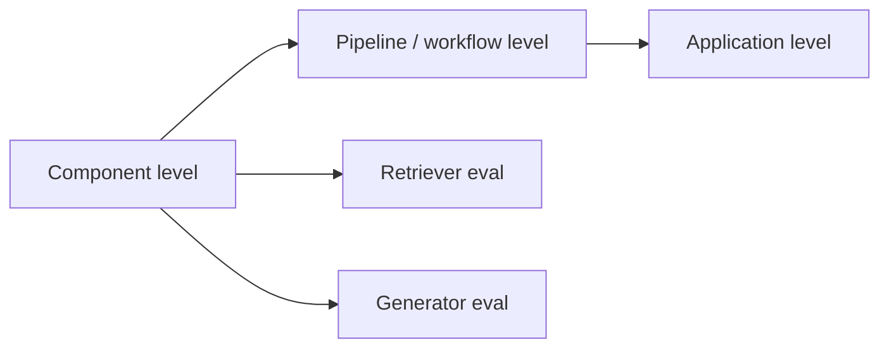
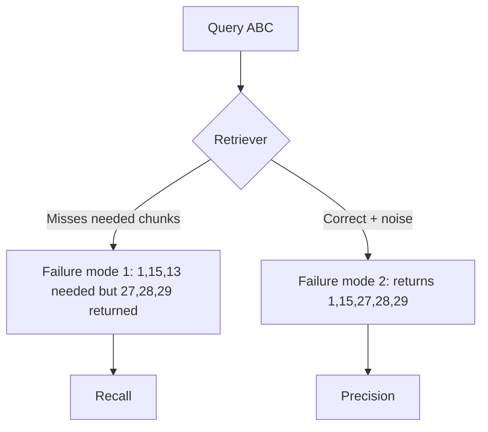

# CS-13 · Testing RAG Retrievers, Hands-On

> **Source transcript:** `How_to_Test_RAG_RetrieversHands-On_CampusX.txt` (English, 2,227 lines / ~1h47m)
> **Domain:** rag
> **One-liner:** A full hands-on build-and-measure loop for a RAG retriever: build it, learn why `Recall@K` over chunk IDs is the wrong golden dataset, replace it with LLM-as-judge *contextual recall* and rank-aware *contextual precision*, then iterate chunk size → reranker → embedding model → k and read the score deltas.
> **Prerequisites:** CS-07 (LLM-as-judge, reference-based vs reference-free), CS-06 (offline vs online evals)

---

## 0. Executive summary

- The eval suite has **three levels — component, pipeline/workflow, application** — and you build/test component-by-component exactly like software, never "build the whole app then test it" `[1:07]`–`[8:57]`.
- A retriever has exactly **two failure modes**: it misses a needed context, or it brings the right context *plus noise*. One metric per failure mode: **recall** for the first, **precision** for the second `[22:00]`–`[25:45]`.
- The **naive golden dataset (question → chunk IDs)** is rejected: labelling 50 questions against **~800 chunks** is brutal human labour, and any chunk-size change **invalidates every ID**, forcing a full relabel `[41:15]`–`[46:07]`. It is only acceptable when source documents are cleanly separated so chunk parameters never move `[44:50]`.
- The correct golden dataset is **question → ideal answer**, where the "ideal answer" is what was taught *in this corpus*, not what Google says `[46:27]`–`[47:54]`. It survives chunk-size changes, so the labelling cost is paid once.
- The resulting metrics are RAGAS's **Contextual Recall** (break the ideal answer into atomic claims, ask the judge how many claims live in the retrieved chunks) and DeepEval's **Contextual Precision** (per-chunk yes/no relevance, then average rank-aware precision) `[55:36]`, `[1:01:09]`–`[1:07:50]`.
- **Contextual precision is rank-aware** — two retrievals with identical 2/5 precision get different scores because moving correct chunks to the top raises every prefix-precision term `[1:01:09]`–`[1:06:03]`.
- Baseline run: recall **80**, precision **80**, **10/15** test cases passing, **5** failing, at chunk size **750** / overlap **100** / k=**5** with `text-embedding-3-small` `[1:34:03]`.
- Chunk size 750→**1000**, overlap 100→**150** (chunk count 800→**697**) moved recall 80→**97** and precision 80→**83** with failures 5→**3** — the single biggest win in the session `[1:36:54]`–`[1:37:54]`.
- Adding a **sentence-transformer reranker** from Hugging Face gave precision 83→**85** but recall slipped to **92** (failures 3→2); swapping to `text-embedding-3-large` pushed recall to **99** with precision flat at **85** and failures back to **3** `[1:41:14]`, `[1:43:38]`.
- Final position: **recall 95+, precision ~85**, with `k=3` tried and rejected (dropped to 84) and residual run-to-run variance attributed to the tiny **15-row** golden set `[1:44:53]`–`[1:45:39]`.

## 1. The problem this lecture solves

Teams ship RAG systems and can only say "it feels okay." Nobody can answer *"is my retriever actually good?"* with a number. The lecture exists because retrieval quality is the ceiling on answer quality: if the needed chunk never arrives, no generator, no prompt and no model swap can save you.

The pre-existing state of practice the speaker attacks is the YouTube/blog-standard retriever metric: *build a dataset of question → correct chunk IDs, compute recall and precision over that*. It looks right and it is taught widely, but it collapses under parameter tuning — precisely the activity RAG development consists of `[37:59]`–`[38:06]`.

There is also a workflow bug being fixed: people build the whole RAG app, then try to evaluate. The source insists on the software-engineering discipline of *build a module → test that module → move on*, applied to retriever and generator separately `[8:46]`–`[9:38]`.

## 2. Definitions & mental models

| Term | Definition (source's words) | Why it matters |
|---|---|---|
| Retriever | "A component that receives a query as input", embeds it, and fetches the k nearest vectors from the vector DB as the context `[9:48]`–`[10:25]` | The component under test in this session |
| Generator | Produces an answer given a query + retrieved context `[2:13]` | Next session's component under test |
| Eval suite | The union of component-level, pipeline-level and application-level evaluations, used for **regression testing** `[1:20]`–`[1:31]` | Regression testing = "run the eval suite once" `[18:42]` |
| Recall | "Out of all the correct contexts available in the vector database, how many did the retriever bring?" `[25:01]` | Metric #1, born from failure mode 1 |
| Precision | "Out of the contexts it brought, how many were correct?" `[25:31]` | Metric #2, born from failure mode 2 |
| Recall@K | The naive metric: fraction of gold chunk IDs present in the top-k `[55:47]` | Explicitly **not used** in this course |
| Contextual Recall | RAGAS's name for claim-coverage recall judged by an LLM `[55:36]`–`[55:54]` | The metric actually used |
| Contextual Precision | DeepEval's rank-aware precision `[1:03:44]` | The metric actually used |
| Ideal answer | The answer built from *our* corpus, not from Google `[47:21]`–`[47:54]` | The second golden-dataset column |
| LLMTestCase | "One row of your golden dataset" in DeepEval `[1:22:45]` | The unit of evaluation |

**Mental model — the eval-suite ladder** `[1:07]`–`[1:28]`:



**Mental model — the two failure modes** `[22:00]`–`[24:23]`:



## 3. Core content, decomposed

### 3.1 Project setup and the component-first discipline  `[2:45]`

- **What the source says.** Create a folder `RAG Eval Project`, then a fixed directory structure: `data/` (lecture transcripts in `.vtt` form), `src/` (retriever, generator, pipeline code), `evals/` (evaluation pipelines), `goldens/` (golden datasets) `[3:55]`–`[5:05]`. Environment via **UV**, Python **3.11**; dependencies: **LangChain, OpenAI, DeepEval, Pytest, python-dotenv**; API key in `.env` `[6:44]`–`[8:28]`.
- **Mechanism.** The transcripts *are* the knowledge base. `.vtt` files are parsed line-by-line; any line containing a timestamp is dropped, surviving lines are concatenated into a LangChain `Document` whose metadata records the session ID so answers can cite "sir taught this in session N" `[14:05]`–`[15:27]`.
- **Analyst note:** the metadata-for-citation trick is the cheapest way to get grounded citations in a RAG chatbot; it costs nothing at query time and it is what makes the `source` field of the golden dataset meaningful.

### 3.2 Building the retriever  `[11:41]`

- **What the source says.** `build_retriever()` calls `load_store()`, which (a) instantiates the embedding model **`text-embedding-3-small`**, (b) checks whether the Chroma store exists, (c) if not, loads + chunks + embeds + persists into `chroma_store/`, then (d) `as_retriever()` produces the retriever object `[12:45]`–`[16:08]`.
- **Numbers.** Chunk size **750**, chunk overlap **100**, `k = 5`, embedding model `text-embedding-3-small`, vector store **Chroma** persisted to `chroma_store` `[15:43]`, `[17:15]`.
- **Worked example.** Query "What is regression testing?" returns 5 chunks; the speaker eyeballs them and confirms regression testing is present — "it is working… how well it is working, we haven't evaluated that yet" `[17:36]`–`[19:04]`.
- **Document-change caveat (asked by a student).** Adding session 10 means: drop the transcript into `data/`, **delete `chroma_store/`**, re-run `retriever.py`. Ingestion and retrieval are not decoupled here — a deliberate simplification because the course is about evaluation, not production engineering `[19:14]`–`[20:45]`.
- **Analyst note:** the "delete the vector store to re-embed" workflow is the single biggest hidden cost in this tutorial. Re-embedding ~700 chunks of 2-hour transcripts with `text-embedding-3-small` on every parameter tweak is cheap in absolute terms but is exactly the operation a real system must make incremental.

### 3.3 The naive metric and why it fails  `[25:01]`–`[46:07]`

- **What the source says.** Golden dataset v1 = two columns: **question**, **chunk/document ID**. Example rows: "What is regression testing?" → chunks 72, 89, 100; "What is RAG Triad?" → 120, 111; "What are online evals?" → 151, 121, 130. About **50** questions planned `[31:20]`–`[33:21]`.
- **Mechanism / worked example.** Run the retriever per question, intersect returned IDs with gold IDs. Q1 returns 72, 81, 89, 99, 100 → recall 3/3 = 1.0, precision 3/5. Q2 returns 1, 2, 3, 120, 5 → recall 1/2 = 0.5. Average across all questions `[33:44]`–`[36:09]`.
- **Why it is rejected** `[39:53]`–`[46:07]`:
  1. **Human cost.** One question requires reading all **~800+ chunks** `[41:15]`. Fifty questions × 800 chunks. "Will they be happy in their life or will they feel like committing suicide?" `[40:13]`.
  2. **Fatal invalidation.** Change chunk size 750→1000 and chunks shift; the 800 chunks may become **700**. Every gold ID is now meaningless. You must relabel from scratch — *every time you tune*.
  3. "This will not work. This is a very bad example of engineering" `[44:44]`.
- **The exception.** If the corpus is *cleanly separated documents* (document 1 unrelated to document 2) and chunk parameters are set once and frozen, the ID-based method is fine `[44:50]`–`[45:38]`. In this corpus it is not: a topic can be taught in session 1 and again in session 5.
- **Analyst note:** the invalidation argument is the load-bearing insight and it generalises beyond RAG — any eval keyed to an artefact of the *indexing pipeline* rather than to *semantics* is unstable under exactly the tuning you want to do.

### 3.4 The right golden dataset: question → ideal answer  `[46:27]`

- **What the source says.** Two columns again, but the second is the **ideal answer**. "Ideal answer does not mean what we found on Google. Ideal answer means the answer we created based on what was taught in our vector database" `[47:21]`–`[47:31]`. A knowledgeable person goes to the relevant chunks, combines them, and writes the answer — which may not be objectively correct, but is the answer this corpus supports `[47:29]`–`[47:54]`.
- **Mechanism.** Because the gold artefact is now *semantic* rather than *positional*, changing chunk size does not touch it: "This information was in this chunk now. It moves and goes into another chunk. What difference does it make?" `[55:05]`.

### 3.5 Contextual Recall (RAGAS flavour)  `[49:16]`–`[55:54]`

- **Mechanism**, step by step:
  1. Feed question to the retriever → 5 contexts (`72, 81, 89, 99, 100`).
  2. Give the **ideal answer** to an LLM-as-judge and have it decompose the answer into **atomic claims**. Example: three claims — (i) regression testing tests whether the new version beats the previous version, (ii) it runs an eval suite against your software, (iii) it can be used for CI `[50:24]`–`[51:16]`.
  3. Ask the same judge, per retrieved chunk, which claims are covered: claim 1 in chunk 72, nothing in 81, claim 2 in 89, nothing in 99, claim 3 in 100.
  4. Recall = claims found / total claims = **3/3 = 1.0**.
- **Second worked example.** "What is RAG Triad?" → retriever returns `1, 2, 3, 120, 5`; ideal answer decomposes into **2** claims (it is a combination of three metrics; it includes answer relevance, faithfulness and context relevance); only claim 2 is found (in chunk 120) → recall **1/2 = 0.5** `[53:00]`–`[54:08]`.
- **What it is called.** "This is the technique RAGAS uses, and in RAGAS language, we call this **Contextual Recall**." The rejected one was **Recall@K**. "The metric we are using is indeed recall, but it has a different flavor. It has an LLM-as-a-judge flavor" `[55:36]`–`[56:04]`.
- **Student objection (good one):** what if the judge fuses claims that sit in different chunks? The speaker's answer — **two design choices** `[56:10]`–`[57:15]`:
  1. Write the ideal answer as a composition of **atomic claims**, so decomposition is easy by construction.
  2. Use a **good-quality judge model with well-written system instructions** that it actually follows.
- **Analyst note:** this is the classic limitation of claim-level recall — scores are only comparable across runs if the judge model and its prompt hold constant. Pin both in the run log (the source does exactly that `[1:30:27]`).

### 3.6 Contextual Precision (DeepEval flavour, rank-aware)  `[57:25]`–`[1:07:50]`

- **Mechanism (unranked part).** Send question → retriever → 5 chunks. For each chunk, ask the judge: *here is the question, here is the ideal answer, here is one retrieved chunk — is this chunk relevant? Does it contain information that helps produce the expected answer? Answer yes or no and give a reason.* This is the literal system prompt the source quotes `[59:09]`–`[59:53]`. Chunks get labelled correct/noise; precision = correct/5 = 3/5 `[59:59]`–`[1:01:02]`.
- **The rank subtlety.** Two cases, both 5 chunks with 2 correct and 3 noisy `[1:01:09]`–`[1:02:41]`:
  - **Case A** (correct first): `✓ ✓ ✗ ✗ ✗` — plain precision **2/5**.
  - **Case B** (correct last): `✗ ✗ ✗ ✓ ✓` — plain precision **2/5**.
  - Plain precision cannot tell them apart, yet A is obviously the better retriever. A ranks the useful chunks higher; B buries them at the bottom `[1:02:44]`–`[1:03:31]`.
- **The fix — average precision over prefixes** `[1:03:49]`–`[1:07:12]`:

| Rank seen | Case A correct-so-far | A prefix precision | Case B correct-so-far | B prefix precision |
|---|---|---|---|---|
| 1 | 1/1 | 1.00 | 0/1 | 0.00 |
| 2 | 2/2 | 1.00 | 0/2 | 0.00 |
| 3 | 2/3 | 0.667 | 0/3 | 0.00 |
| 4 | 2/4 | 0.500 | 1/4 | 0.250 |
| 5 | 2/5 | 0.400 | 2/5 | 0.400 |
| **mean** | | **≈0.713** | | **≈0.130** |

- **The rule.** "This method of calculating precision while being rank-aware is used in DeepEval" `[1:07:16]`. Precision's core question — how many of what came are correct — is retained; ranking is layered on top `[1:07:21]`–`[1:07:36]`.
- **Analyst note (outside source):** the construction is mean **average precision** (AP) with a single relevant-set, i.e. the retrieval-IR definition, not the "interpolated" variant. The source arrives at it from first principles rather than naming it — worth naming in an interview because it is the same quantity as the area under the precision-recall curve for this query.

### 3.7 Golden-dataset creation — four methods  `[1:08:53]`–`[1:19:00]`

| # | Method | How | Pros | Cons |
|---|---|---|---|---|
| 1 | **Hand-authored** | You write the Q and ideal answer yourself | Best quality; human judgement; low error | **Not scalable** — tiring after 50 questions; hiring costs money `[1:10:15]`–`[1:10:31]` |
| 2 | **LLM-assisted drafting** | Upload transcripts to **Claude**, ask for the two-column dataset, then **review every row yourself** | Lower cost, time and effort | Error risk: the LLM may write what it learned on the internet, not what was taught `[1:11:41]` |
| 3 | **DeepEval synthesizer** | `Synthesizer` class + an LLM + a formatting instruction; run `goldens_generator.py` → `retriever_dp_golden.json` | Fully automated, one command | **Output quality was poor** in this application — see below |
| 4 | **Production logs** | Harvest real interactions with positive signals (thumbs-up) into the golden set | Real distribution, free | Cannot bootstrap — you need seed entries before you have users `[1:18:09]`–`[1:18:48]` |

- **The DeepEval synthesizer failure, verbatim examples** `[1:15:38]`–`[1:17:38]`: it produced *"What specific grade school math problems does the GSM8K dataset contain for model training?"*, *"Access methodologies to validate LLMs' robustness against adversarial exploits and misinformation generation"*, and *"Is the platform's success criteria to evaluate UPSC answers exactly as human experts do…"* The speaker's verdict: "a student would never ask this… This cannot be their language at all… DeepEval kind of over-optimized and generated the question." It has "no idea where to give importance, where to focus, or what kind of questions people will ask when they have doubts" `[1:17:04]`. **Not used for this project.**
- **What was actually used:** method 2. Transcripts → Claude → **15 questions**, generated **one at a time** (first, then second, third, fourth…) and manually reviewed, saved as `retriever_golds.json` with IDs `G01`–`G15`. Sample questions: "What is an online eval and how is it different from offline eval?", "What is faithfulness versus groundedness?", "How do I know if my eval is reference-based or reference-free?", "Why can't we test LLM apps the same way we test normal software?" `[1:19:02]`–`[1:20:47]`.
- **Analyst note:** generating questions *one at a time* is a cheap quality trick — batched generation drifts toward generic, over-optimised phrasing, which is exactly the synthesizer failure above.

### 3.8 DeepEval's three-part code shape  `[1:22:12]`–`[1:26:48]`

Every DeepEval evaluation has exactly three things:

```python
from deepeval.test_case import LLMTestCase
from deepeval.metrics import ContextualRecallMetric, ContextualPrecisionMetric
from deepeval import evaluate

# 1. One LLMTestCase per golden-dataset row
case = LLMTestCase(
    input=question,                     # the user question
    expected_output=ideal_answer,       # gold column 2
    retrieval_context=retrieved_chunks, # what the retriever returned
    actual_output="Generator not evaluated in this run."  # placeholder
)

# 2. Metrics, with judge model + threshold + reason
recall = ContextualRecallMetric(threshold=0.7, model=judge_model, include_reason=True)
prec   = ContextualPrecisionMetric(threshold=0.7, model=judge_model, include_reason=True)

# 3. One evaluate() call
evaluate(test_cases=all_cases, metrics=[recall, prec])
```

- `input` = the question; `expected_output` = the ideal answer; `retrieval_context` = the five retrieved chunks; `actual_output` = placeholder text because the generator does not exist yet `[1:28:57]`–`[1:29:35]`.
- **Threshold semantics:** score below threshold → that test case **fails**; above → **passes** `[1:24:58]`–`[1:25:38]`. The session uses **0.7** `[1:41:40]`.
- The loop runs **15 times**, once per golden row, calling the real retriever each time `[1:28:04]`–`[1:28:17]`.
- The run also **logs the configuration** — embedding model, chunk size, chunk overlap, top-k, judge model, golden dataset — so results are attributable `[1:30:27]`–`[1:30:43]`. The speaker's summary: "the main code is just these two lines."

## 4. Frameworks & decision procedures

**Procedure — how to evaluate any RAG retriever**

```mermaid
flowchart TD
    S1[1. Enumerate failure modes of the component] --> S2[2. Assign one metric per failure mode]
    S2 --> S3{3. Can I express ground truth positionally, and will my chunking stay frozen?}
    S3 -->|Yes| S4[Recall@K + plain precision over chunk IDs]
    S3 -->|No| S5[Question to ideal-answer golden set]
    S5 --> S6[4. Build golden set: hand-author / LLM+review / synthesizer / prod logs]
    S6 --> S7[5. LLM decomposes ideal answer into atomic claims]
    S7 --> S8[6. Judge labels each retrieved chunk for claim coverage -> Contextual Recall]
    S8 --> S9[7. Judge labels each chunk yes/no vs ideal answer, average prefix precision -> Contextual Precision]
    S9 --> S10[8. Tune in this order: chunk size/overlap -> reranker -> embedding model -> k]
    S10 --> S11[9. Re-run; record config with the score]
```

**Tuning decision table** — the levers the source tried, in the order tried:

| Lever | Direction | Expected effect on recall | Expected effect on precision | Re-embed needed? |
|---|---|---|---|---|
| Increase `k` | 5 → 10 | ↑ (nearly always) `[27:19]` | ↓ `[27:39]`–`[27:57]` | No |
| Decrease `k` | 5 → 3 | ↓ | ↑ in theory (measured: dropped to 84) `[1:44:53]` | No |
| Increase chunk size + overlap | 750/100 → 1000/150 | ↑↑ `[1:37:28]` | ↑ slightly `[1:37:31]` | **Yes** |
| Add reranker | — | ↓ slightly (92) | ↑ (85) `[1:41:23]` | No |
| Better embedding model | small → large | ↑↑ (99) | flat (85) `[1:43:52]` | **Yes** |

## 5. Worked end-to-end example

The session's own running example, carried all the way through:

1. **Corpus.** Eight 2-hour lecture transcripts as `.vtt`; timestamps stripped; each `Document` tagged with its session `[5:37]`–`[15:27]`.
2. **Index.** Chunk 750 / overlap 100 → **~800 chunks**; `text-embedding-3-small`; Chroma at `chroma_store/`; `k=5` `[15:43]`, `[41:15]`.
3. **Golden set.** 15 question→ideal-answer rows (`G01`–`G15`), Claude-drafted one at a time, all manually reviewed and rewritten in student language `[1:19:02]`.
4. **Judge + threshold.** One LLM-as-judge for both metrics; threshold **0.7**; `include_reason=True` `[1:30:05]`.
5. **Baseline.** recall **80**, precision **80**, **10/15** pass / **5** fail `[1:34:03]`.
6. **Iteration 1 — chunking.** 750/100 → 1000/150; vector store deleted and rebuilt; chunks 800 → **697**. Result: recall **97**, precision **83**, **3** failures. *This becomes the new baseline* `[1:36:54]`–`[1:37:54]`.
   - **Analyst note:** the transcript garbles this sentence — "Our precision reached 97 straight away and this reached 83" `[1:37:44]` — but the immediately preceding lines and the recap at `[1:45:34]` confirm **recall 97 / precision 83**.
7. **Iteration 2 — reranker.** A sentence-transformer reranker downloaded from Hugging Face reorders the retrieved chunks to lift meaningful ones and sink noise `[1:39:04]`–`[1:39:33]`, `[1:41:14]`. Result: precision **83 → 85**, recall down to **92**, failures **3 → 2**. Speaker's read: "some benefit", but expected more `[1:41:23]`–`[1:41:48]`.
8. **Iteration 3 — embedding model.** `text-embedding-3-small` → `text-embedding-3-large`; vector store rebuilt. Result: recall **92 → 99**, precision flat **85**, failures back to **3** `[1:43:38]`–`[1:44:08]`.
9. **Iteration 4 — k.** k=5 → k=3, no re-embed needed. Result: dropped to **84** — rejected. "Reducing K further actually made it lower" `[1:44:53]`–`[1:45:10]`.
10. **Decision.** Ship the retriever forward: **recall above 95, precision around 85**. Remaining levers named but not tried: a *better-quality reranker* and overlap **200** instead of 150 `[1:45:31]`–`[1:45:59]`.

## 6. Pros, cons, exceptions

| Metric | Pros | Cons | Works when | Fails when | Cost |
|---|---|---|---|---|---|
| **Recall@K over chunk IDs** | Programmatic, deterministic, free, no judge | Brutal labelling (~50 Q × 800 chunks); **invalidated by any chunk-parameter change** | Documents are cleanly separated; chunking frozen forever `[44:50]` | Corpus is interrelated; you intend to tune chunking `[45:38]` | Human hours, repeatedly |
| **Contextual Recall** (RAGAS) | Survives re-chunking; gold paid once; no positional gold | Needs an LLM judge; sensitive to how atomically the ideal answer is written | Multi-chunk, interrelated corpora; chunk parameters still in flux | Ideal answer written as one dense blob; weak judge `[56:38]` | 1 judge call to decompose + 1 per retrieved chunk |
| **Contextual Precision** (DeepEval) | Rank-aware — distinguishes good ordering from bad `[1:01:09]` | Cannot distinguish "2 correct buried" from "2 correct on top" on its own *without* the prefix averaging; needs per-chunk judge calls | Ranked retrieval, reranker in play | Only one chunk retrieved; ties | 1 judge call per retrieved chunk |
| **Reranker** | Lifts precision by pushing noise down `[1:38:23]` | Cheap rerankers give small gains; may cost recall | Precision is the bottleneck | Recall is the bottleneck (here: recall fell 97→92) | Extra model download + per-query inference |

| Tool | Role in this session | Verdict |
|---|---|---|
| **DeepEval** | Metric library (`ContextualRecallMetric`, `ContextualPrecisionMetric`, `LLMTestCase`, `evaluate`) | Core of the session; its **`Synthesizer`** was tried and rejected for golden-set generation `[1:17:41]` |
| **RAGAS** | Naming/definition source for **Contextual Recall** `[55:36]` | Referenced, not executed |
| **LangChain** | `Document` objects, chunking, Chroma wrapper, `as_retriever()` | Build layer |
| **Chroma** | Vector store persisted at `chroma_store/` | Must be deleted to re-embed |
| **UV** | Env + dependency management, Python 3.11 | Setup |
| **pytest** | Installed as (the speaker believes) a DeepEval dependency | Not central |

## 7. Failure modes & anti-patterns

1. **Chunk-ID golden set.** *Symptom:* you change chunk size and every gold row is meaningless. *Root cause:* gold labels encode an artefact of the indexing pipeline. *Detection:* ask "does this label survive re-chunking?" *Fix:* switch to question→ideal-answer `[43:34]`–`[46:07]`.
2. **Building the app before testing components.** *Symptom:* a broken answer with no idea whether retrieval or generation caused it. *Root cause:* skipping component-level evals. *Detection:* can you quote a retriever recall number? *Fix:* build → test → advance, per module `[8:46]`.
3. **`ModuleNotFoundError: No module named src`.** *Symptom:* running `python evals/eval_retriever.py` from inside `evals/` — `src/` looks nonexistent. *Root cause:* the eval script is run from the wrong working directory / packages are not packages. *Detection:* the traceback points at the `from src... import build_retriever` line. *Fix:* add `__init__.py` to **both** `src/` and `evals/`, then run `python3 -m evals.eval_retriever` `[1:31:55]`–`[1:33:47]`.
4. **Stale vector store after a parameter change.** *Symptom:* scores do not move after changing chunk size or embedding model. *Root cause:* `load_store()` reuses the existing `chroma_store/`. *Detection:* the log prints the *old* chunk count. *Fix:* delete `chroma_store/` before re-running `[1:36:36]`, `[1:42:56]`.
5. **Over-optimised synthetic questions.** *Symptom:* the DeepEval synthesizer emits academic-sounding queries no user would type. *Root cause:* the generator has no model of the real user. *Detection:* read the questions aloud. *Fix:* hand-author, or LLM-draft **one question at a time** and review every row `[1:15:38]`–`[1:19:02]`.
6. **Trusting a score delta that is noise.** *Symptom:* k=3 gives 84, k=5 gives 85, you conclude something. *Root cause:* **15 rows**. *Detection:* variance across repeat runs of identical settings. *Fix:* treat sub-~2-point moves as noise and grow the golden set `[1:45:12]`–`[1:45:27]`.
7. **Judging without reasons.** *Symptom:* a number with no diagnosis. *Fix:* `include_reason=True` and actually read the failure reasons — "only then will you be able to understand what kind of mistakes are happening" `[1:34:23]`.

## 8. Implementation notes

**File layout produced by the session**

```
RAG Eval Project/
  data/                  # .vtt transcripts (the knowledge base)
  src/
    __init__.py
    retriever.py         # build_retriever(), load_store(), load_transcripts()
    re_ranker.py         # added later
  evals/
    __init__.py
    eval_retriever.py    # LLMTestCase loop + 2 metrics + evaluate()
  goldens/
    generate_gold.py     # DeepEval Synthesizer experiment (not adopted)
    goldens_generator.py # the synthesizer run
    retriever_dp_golden.json  # synthesizer output (rejected)
    retriever_golds.json      # the ADOPTED 15-row golden set (G01..G15)
  .env                   # OPENAI_API_KEY
  pyproject.toml         # uv-managed
```

**Run commands** `[1:14:08]`, `[1:33:34]`

```bash
uv init --python 3.11
uv add langchain openai deepeval pytest python-dotenv
python goldens/goldens_generator.py     # only to experiment with the synthesizer
python3 -m evals.eval_retriever         # the actual eval run
```

**Retriever chunking knobs** `[15:37]`, `[17:15]`

```python
CHUNK_SIZE    = 1000   # was 750
CHUNK_OVERLAP = 150    # was 100
K             = 5      # tried 3 -> 84, rejected
EMBED_MODEL   = "text-embedding-3-large"   # was text-embedding-3-small
VECTOR_STORE  = "chroma_store"             # delete this directory to force re-embed
```

**CI shape.** The eval script is designed as a regression gate: the suite is the thing you "run once" to confirm nothing regressed `[18:42]`–`[18:45]`; DeepEval's pass/fail-at-threshold semantics are what make it a gate rather than a report `[1:25:33]`.

## 9. Interview-ready Q&A

**Q1. Why not just compute recall and precision over gold chunk IDs?**
Because the label is tied to the chunking, not to the content. If you tune chunk size from 750 to 1000, the same passage lands in a different chunk with a different ID and every gold row becomes invalid — so you would have to relabel the whole set after every parameter change. It is also punishing to build: 50 questions × ~800 chunks of manual reading. It is defensible only when your corpus is cleanly separated documents and you will never touch the chunk parameters.
*Red flag:* "chunk IDs are the standard way."

**Q2. What is Contextual Recall and how is it computed?**
It is RAGAS's LLM-as-judge variant of recall. Take the golden ideal answer, have a judge decompose it into atomic claims, then for each retrieved chunk ask which of those claims appear in it. Recall is (claims found somewhere in the retrieved set) / (total claims). It is reference-based — you still need a golden answer — but the reference is semantic, so it survives re-chunking.

**Q3. *(Trap)* Two retrievers both return 5 chunks of which 2 are correct. Are they equally good?**
Plain precision says yes (2/5 both). But if one returned `✓✓✗✗✗` and the other `✗✗✗✓✓`, they are not equivalent — the first ranks useful context where the generator will weight it. DeepEval's contextual precision handles this by averaging prefix precision at each rank: case A gives (1/1 + 2/2 + 2/3 + 2/4 + 2/5)/5 ≈ 0.71 versus case B's (0 + 0 + 0 + 1/4 + 2/5)/5 ≈ 0.13.
*Red flag:* reciting a single precision formula and stopping.

**Q4. *(Trap)* Increasing k improves recall, so should you just set k high?**
No — recall and precision trade off directly through k. Raising k from 5 to 10 will pull in the missing gold chunks but also pulls in noise, and the noise is what you hand to the generator. The correct move is to fix the other levers first — chunk geometry, reranker, embedding model — and only then tune k, because k is the one lever with no free lunch.

**Q5. How should the ideal answer be written?**
As a composition of atomic claims, deliberately. The judge has to decompose it into claims, and if the answer is one dense paragraph the decomposition is unstable and scores are not comparable run to run. The source calls this a "deliberate design choice" — write it so an LLM can split it easily.

**Q6. Which four ways are there to build a RAG golden dataset, and which do you pick?**
(1) Hand-author — best quality, not scalable. (2) LLM-assisted drafting with mandatory human review — the balance point, and what this session used. (3) A library synthesizer such as DeepEval's `Synthesizer` — fully automated but produced academic, over-optimised questions no real user would ask in this corpus. (4) Harvest production logs with positive feedback — realistic but cannot bootstrap. Start with (2) and graduate to (4) once you have traffic.

**Q7. You changed the embedding model and the score did not move. What do you check first?**
Whether the vector store was rebuilt. The loader checks for an existing store and reuses it, so a chunking or embedding change silently runs against the old index. Delete the store directory and re-run. This bit the source twice `[1:36:36]`, `[1:42:56]`.

**Q8. Rank the retrieval levers by observed effect.**
From this session's measurements: chunk geometry (750/100 → 1000/150) moved recall 80 → 97, the largest single gain; upgrading the embedding model small → large moved recall 92 → 99 with precision flat; the reranker moved precision 83 → 85 while costing ~5 points of recall; reducing k to 3 lost 1 point (noise at n=15). Chunking and embedding require re-embedding; reranker and k do not.

**Q9. What makes a reranker worth adding?**
It reorders the retrieved set so the meaningful chunks move to the top and noise sinks. Because contextual precision is rank-aware, reordering improves the score by construction. The caveat is that a weak reranker (a stock sentence-transformer) delivers only a couple of points — the source expected more and explicitly recommends a better-quality reranker.

**Q10. How large does the golden set need to be?**
The source's 15 rows are enough to detect large moves but not small ones — the speaker attributes run-to-run fluctuation to the row count and treats a 1-point change as noise. Plan for a set large enough that repeat runs of identical settings agree before you trust deltas. *(Source does not give a target N.)*

**Q11. Why is `include_reason=True` not optional?**
Because the aggregate number does not tell you what to fix. Every failing test case carries the judge's reasoning, and the source's instruction is that you read them all — "only then will you be able to understand what kind of mistakes are happening."

**Q12. What does the eval suite look like at the end of the three-part roadmap?**
Component level (retriever metrics here, generator metrics next), pipeline/workflow level (the retrieval-plus-generation path), and application level (end-to-end behaviour). All three together are the suite you run as regression tests on every change.

## 10. Cheat sheet

```
RETRIEVER EVAL — ONE PAGE
────────────────────────────────────────────────────────────────────
FAILURE MODES -> METRICS
  misses needed context        -> RECALL      (correct retrieved / all correct that exist)
  correct + noise              -> PRECISION   (correct retrieved / all retrieved)

GOLDEN DATASET
  WRONG : question | chunk_id          (dies on re-chunking; ~50Q x ~800 chunks to label)
  RIGHT : question | ideal_answer      (answer built FROM this corpus, not from Google)
  EXCEPTION for chunk IDs: cleanly separated docs + chunking frozen forever

BUILD THE GOLDEN SET (best -> worst effort/quality)
  1 hand-authored         best quality, not scalable
  2 LLM draft + REVIEW    <- used here; 15 rows, one question at a time
  3 lib synthesizer       DeepEval Synthesizer -> rejected (questions no user would ask)
  4 production logs       realistic, cannot bootstrap

CONTEXTUAL RECALL (RAGAS)
  judge splits ideal answer into ATOMIC CLAIMS
  per retrieved chunk: which claims are present?
  recall = claims_found / total_claims
  write the ideal answer atomically BY DESIGN; use a strong judge with a tight prompt

CONTEXTUAL PRECISION (DeepEval, RANK-AWARE)
  per chunk: "Is this chunk relevant? Does it help produce the expected answer? yes/no + reason"
  then average prefix precision:
      A: 1/1, 2/2, 2/3, 2/4, 2/5  -> 0.713
      B: 0/1, 0/2, 0/3, 1/4, 2/5  -> 0.130   (same plain precision 2/5!)

DEEPEVAL CODE SHAPE
  LLMTestCase(input, expected_output=ideal, retrieval_context=chunks, actual_output=placeholder)
  metric(threshold=0.7, model=judge, include_reason=True)
  evaluate(test_cases=[...], metrics=[...])
  -> score < threshold = FAIL ; score >= threshold = PASS

TUNING ORDER (observed deltas, chunk 750/100, k=5, emb-3-small)
  baseline                     recall 80   precision 80   5/15 fail
  chunk 1000/150               recall 97   precision 83   3/15 fail   (+re-embed)
  + reranker (sent-transformer)recall 92   precision 85   2/15 fail
  + embed text-embedding-3-large recall 99 precision 85   3/15 fail   (+re-embed)
  k=3                          ~84         -              -            (rejected)
  FINAL                        recall 95+  precision ~85

FORCE RE-EMBED WHEN: chunk size | overlap | embedding model changes
  -> delete chroma_store/ else load_store() reuses the stale index

RUN FROM REPO ROOT:  python3 -m evals.eval_retriever
  (needs __init__.py in BOTH src/ and evals/)

WATCH OUT
  n=15 rows -> ~1-2 point moves are NOISE
  always log config WITH the score (model, chunk size, overlap, k, judge, golden file)
```

## 11. Glossary

| Term | Meaning |
|---|---|
| `.vtt` | WebVTT subtitle format; the transcript file type used as the corpus |
| Eval suite | Combined component + pipeline + application evaluations, run as regression tests |
| Recall@K | Naive recall over gold chunk IDs — the rejected metric |
| Contextual Recall | RAGAS's LLM-as-judge claim-coverage recall |
| Contextual Precision | DeepEval's rank-aware precision |
| Atomic claim | The indivisible factual statement the judge decomposes an ideal answer into |
| Ideal answer | Gold answer constructed from the corpus itself |
| LLMTestCase | DeepEval's representation of one golden-dataset row |
| Reranker | Model that reorders retrieved chunks, useful chunks to the top |
| Chroma | The vector database used, persisted at `chroma_store/` |
| Regression testing | Re-running the whole eval suite after a change |
| Reference-based eval | Evaluation requiring a golden answer/dataset |

## 12. Cross-references

- **Builds on:** CS-07 (LLM-as-judge, reference-based vs reference-free — the framing reused verbatim at `[28:57]`), CS-06 (offline vs online evals — the "online evals" question in the golden set)
- **Leads to:** CS-14 (the same RAG evaluation framing in interview form), CS-15 (making the RAG system *faster and cheaper* once quality is measurable), CS-16 (the adversarial/safety surface of the same application)
- **External:** DeepEval (`LLMTestCase`, `ContextualRecallMetric`, `ContextualPrecisionMetric`, `evaluate`, `Synthesizer`), RAGAS (Contextual Recall naming), LangChain, Chroma, OpenAI `text-embedding-3-small` / `text-embedding-3-large`, UV, pytest
