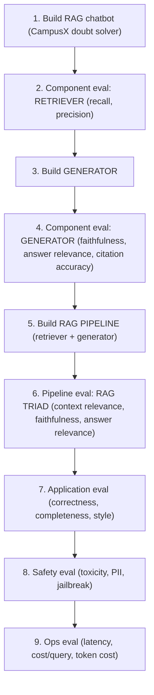
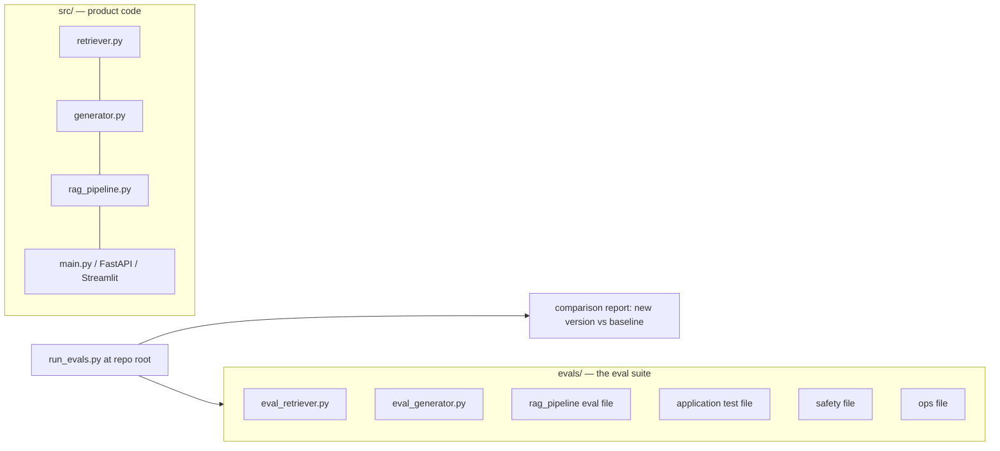

# CS-14 · Answering "How Do You Evaluate Your RAG App?" in GenAI Interviews

> **Source transcript:** `How_to_Answer_How_Do_You_Evaluate_Your_RAG_App_in_GenAI_Interviews_CampusX.txt` (Banglish, 3,213 lines / ~46m)
> **Domain:** rag
> **One-liner:** The framing lecture that turns RAG evaluation into a spoken answer: an eight-step build-and-evaluate roadmap, a three-level eval suite, the `run_evals.py` regression gate, and a five-part interview script that names every metric.
> **Prerequisites:** CS-04 (the complete workflow), CS-13 (retriever metrics in practice)

---

## 0. Executive summary

- The interview question is **"How do you evaluate your RAG app?"** and it appears in roughly **8 out of 10 GenAI interviews** `[5:46]`. Most candidates cannot answer it satisfyingly — either they never studied evaluation, or they studied it but the answer comes out scattered `[5:49]`–`[6:00]`.
- Evaluation is organised as a **three-level eval suite**: **component level** (retriever, generator), **pipeline level**, **application/system level** `[10:01]`–`[10:27]`.
- The build order *is* the evaluation order: build retriever → evaluate retriever → build generator → evaluate generator → wire the pipeline → evaluate the pipeline (RAG Triad) → evaluate the application → evaluate safety → evaluate ops `[18:53]`–`[21:03]`.
- **Component level** uses **recall + precision** on the retriever `[12:46]`; **generator** uses **faithfulness, answer relevance, and citation/attribution accuracy** `[13:43]`–`[14:25]`.
- **Pipeline level** is the **RAG Triad** — three metrics, checked immediately after the pipeline is wired: **context relevance** (question ↔ retrieved context), **faithfulness** (answer ↔ context), **answer relevance** (answer ↔ question) `[16:19]`–`[17:43]`.
- **Application level** adds **correctness, completeness, and style** — the speaker wants the chatbot's explanation style to match the human teachers' style `[18:56]`–`[20:09]`.
- The last two bands are **safety** (toxicity, PII leakage, jailbreaking) `[20:09]`–`[20:34]` and **ops** (latency, cost per query, token cost) `[20:43]`–`[21:03]`.
- Everything lives in one repo: `src/` for product code, `evals/` for one file per evaluation band, and a root **`run_evals.py`** that runs all of them and prints a comparison report — that bundle *is* the eval suite `[26:33]`–`[28:18]`.
- **Regression testing** is running the whole suite against the whole application; the report says which metric values dropped and by how much, and that decides deploy/no-deploy `[24:39]`–`[26:29]`. Its three maturity levels are **simple (baseline numbers) → experiment tracking (MLflow) → dashboarding + CI** `[35:56]`–`[36:36]`.
- Concrete gate: if a metric falls **more than 3 units below baseline**, block the deploy `[34:01]`–`[34:16]`. **Online** evaluation adds tracing (latency, cost, tokens, thumbs up/down) plus **drift detection** on a 24-hour graph, alerting if a metric degrades over the last ~8 hours `[38:37]`–`[40:54]`.

## 1. The problem this lecture solves

Interviewers ask a question that sounds simple and is actually a system-design question in disguise. The speaker's diagnosis of the two failure populations `[5:53]`–`[6:00]`:

1. People who never studied evaluation at all — they do not know the question exists.
2. People who *have* studied it but answer in a tangled way — they mention recall, precision, answer relevance, faithfulness as a flat list with no structure, and "they think that's the answer" `[45:25]`–`[45:35]`.

The lecture exists to install a **framework** — a fixed order in which the metrics are spoken — because the interviewer's real test is whether you can place a metric in a structure, not whether you can name it `[45:36]`–`[45:47]`. The source states plainly that anyone who answers in this framework "the person opposite will consider you equal — 'yes, he knows this, he knows this deeply'" `[45:39]`–`[45:46]`.

There is a second, non-interview reason: without this structure, teams evaluate everything at once, cannot localise a regression, and cannot decide whether to deploy.

## 2. Definitions & mental models

| Term | Definition (source's words) | Why it matters |
|---|---|---|
| Eval suite | All the evaluation files inside `evals/`, run together — "this is our complete testing suite" `[27:43]`–`[28:18]`, `[21:19]` | The thing you run as a regression gate |
| Component level | Evaluating retriever and generator **separately**, at build time `[10:08]`–`[10:17]` | Localises failures |
| Pipeline level | Evaluating the connected retriever→generator path — the **RAG Triad** `[15:42]`–`[16:18]` | Catches integration failures |
| Application level | Evaluating the whole product against user-facing quality (correctness, completeness, style) `[18:56]`–`[20:05]` | The level the business actually cares about |
| Regression testing | "The process of running your eval suite on your application" `[24:55]`–`[25:12]` | Answers "is the new version worse than the old one?" |
| Baseline | The metric values from the first run of the app — recall 82, precision 68 in the source's example `[31:16]`–`[31:31]`, `[31:51]`–`[31:59]` | Everything is judged relative to it |
| Online eval | Evaluation that continues after deployment: tracing, drift, feedback `[38:28]`–`[38:35]` | Offline evals do not end the job |
| Drift | The app's parameters degrading with respect to the world, e.g. faithfulness falling over the last 8 hours `[40:26]`–`[40:50]` | Triggers an alert and a fix |
| Trace / observability | Instrumentation added to the code so every interaction's latency, cost, tokens and thumbs-up/down are captured `[39:23]`–`[39:48]` | The raw material for online eval |

**Mental model — the eight-step roadmap** `[7:26]`–`[21:03]`:



**Mental model — the eval-suite directory shape** `[26:33]`–`[28:18]`:



## 3. Core content, decomposed

### 3.1 What counts as an LLM application  `[2:20]`

- **What the source says.** There are several shapes: a plain **chatbot**, a **RAG-based chatbot**, an **agent**, a **multi-modal** app that also generates images (e.g. an image generator), and a **fixed-schema output** app (e.g. an email classifier that must output *support email / refund email / technical email* and nothing else) `[2:23]`–`[3:32]`.
- **Scope decision.** The series covers **RAG** and **agents** only. A plain chatbot with no RAG and no agent is easy, and the speaker explicitly will not teach it — the harder two topics subsume it `[4:23]`–[4:42]. Multi-modal is deliberately dropped: "very few companies, very few projects are multi-modal in nature… in most cases you will not see RAG and agent design patterns" `[4:48]`–`[5:07]`.
- **Running example.** A **CampusX course doubt solver** — every lecture's transcript is a document, embedded, and the student can ask any question about the whole playlist `[7:26]`–`[8:07]`.
- **Analyst note:** the four-application taxonomy is the useful takeaway here, and it maps onto eval strategy — fixed-schema apps are evaluated like classifiers (exact match on the label), while RAG and agent apps need the graded, LLM-judged metrics this lecture lists.

### 3.2 Level 1 — component evaluation  `[10:08]`

- **What the source says.** Evaluate the retriever and the generator *independently and separately*, as you build each `[12:22]`–`[12:24]`.
- **Retriever metrics `[12:46]`–`[13:10]`:**
  - **Recall** — "out of the total correct documents, how many documents was I able to bring?"
  - **Precision** — "out of the documents I brought, how many were useful?"
- **Generator metrics `[13:43]`–`[14:25]`:** the source names **three**:
  - **Faithfulness** — whether the answer comes from the provided context or the model invented something (hallucination).
  - **Answer relevance** — whether the answer is relevant to the question.
  - **Citation accuracy** — whether the cited document/line is accurate. This mirrors the production behaviour where a chatbot says "I took this from this document, this line" `[14:14]`–`[14:24]`.
- **Why evaluate the generator with no retriever?** Because you hand it a manually chosen question and manually chosen context — "a kind of golden dataset" — so it is a clean unit test, not a pipeline test `[14:53]`–`[15:13]`.
- **Completion criterion.** When retriever *and* generator both "work well in isolation", the component phase is done and you graduate to the pipeline phase `[15:23]`–`[15:39]`.

### 3.3 Level 2 — pipeline evaluation and the RAG Triad  `[15:42]`

- **What the source says.** Wire retriever + generator into the RAG pipeline, then immediately check the **RAG Triad** — three metrics that always exist together because the pipeline has three entities: **user question**, **retrieved context**, **generated answer** `[16:30]`–`[16:53]`.
- **The triad, mapped to its pairs** `[16:58]`–`[17:43]`:

| Metric | Pair it checks | Source wording |
|---|---|---|
| **Context relevance** | question ↔ retrieved context | "the context that came from the retriever is relevant to the question" |
| **Faithfulness** | answer ↔ context | "has the generated answer come from the context, or has the model created some hallucination?" |
| **Answer relevance** | answer ↔ question | "is there a connection between your answer and the question?" |

- **The rule.** If all three check out, the pipeline works; if all three pass, "this particular level is finished" `[17:56]`–`[18:09]`.
- **Analyst note:** this is the same triad as RAGAS's, and the source uses RAGAS's names throughout — but the *library* used for implementation is DeepEval, not RAGAS (see §3.5).

### 3.4 Level 3 — application evaluation  `[18:53]`

- **What the source says.** Now evaluate the whole product ("the doubt solver") end-to-end. Metrics named:
  - **Correctness** — is the answer that came out correct? `[19:10]`–`[19:17]`
  - **Completeness** — does the answer fully answer the question? The source's example: the question has two parts but the answer only covers one, so completeness is 0 *even though the one part it answered is correct* `[19:30]`–`[19:44]`
  - **Style** — the explanation style should match the human teachers' style `[19:46]`–`[19:57]`
- **Safety band** `[20:09]`–`[20:34]`: is the response **toxic**? does it leak **personally identifiable information**? can the application be **jailbroken**?
- **Ops band** `[20:43]`–`[21:03]`: three quantities — **latency**, **cost per query**, and **token cost**.
- **Analyst note:** completeness is the metric teams most often forget, and the source's two-part-question example is the cleanest justification for it — a correct-but-partial answer scores 1.0 on correctness and 0 on completeness. (Full treatment in CS-15 and CS-16.)

### 3.5 Why DeepEval and not RAGAS  `[22:26]`–`[24:26]`

- **What the source says.** Custom eval code could be written by hand — and was, in the custom model-eval lecture — but for a project this size it becomes "a very big project" `[22:17]`–`[22:23]`. So a library is used: **DeepEval** `[22:26]`–`[22:28]`.
- **Reuse argument.** Everything already discussed exists off the shelf in DeepEval: **answer relevancy, faithfulness, contextual precision, contextual recall** for RAG; **toxicity, PII leakage** for safety `[22:39]`–`[22:58]`.
- **Why DeepEval specifically, over RAGAS** — two stated reasons `[23:34]`–`[23:49]`:
  1. RAGAS metrics are **already covered** in the course, so using it adds nothing new.
  2. DeepEval is a **much more extensive library** — it covers **agents, multi-turn conversations, LLM applications, images, multi-modal** — whereas RAGAS cannot do all of that `[23:56]`–`[24:08]`. The speaker predicts DeepEval will become "exactly the benchmark library for LLM evaluation" within a year or two and become a standard `[24:12]`–`[24:21]`.
- **DeepEval is built on Pytest** — "the primary library for software testing in Python"; if you have written pytest tests, the library will feel familiar `[23:16]`–`[23:31]`.
- **Golden datasets:** some evaluations need one, some do not `[21:47]`–`[22:00]`.
- **Analyst note:** the framework choice is presented as a bet on ecosystem breadth, not on metric quality. In practice both libraries cover RAG Triad metrics; the differentiator the source names (agents, multi-turn, multi-modal) is exactly what the rest of the series needs.

### 3.6 The regression-testing gate and its three maturity levels  `[24:39]`–`[36:36]`

- **Definition.** Regression testing = run the **whole eval suite** on the **whole application**, and get a complete report saying which metric values fell and which rose `[25:49]`–`[26:08]`.
- **Worked example of the report.** Baseline: retriever **recall 82, precision 68** `[31:16]`–`[31:31]`. Then you change a chunk size, a chunk size setting, an overlap setting, an embedding-model setting; you re-run through `run_evals.py`; new numbers arrive; the file gives you a **comparison against the previous run** so you can see whether the move helped `[31:31]`–`[32:35]`.
- **The three levels of regression-testing sophistication** `[36:00]`–`[36:36]`:

| Level | What you do | Tool named |
|---|---|---|
| **1. Simple regression testing** | Run the app once, capture baseline numbers; on each subsequent run, manually compare new numbers to baseline | none (manual) |
| **2. Experiment tracking** | Track each run as a named experiment with its configuration so comparisons are systematic and automated | **MLflow** `[30:26]` |
| **3. Dashboarding + CI/CD** | Push results to a dashboard and wire the suite into CI so the gate is automatic | dashboard + CI (GitHub Actions) |

- **The CI mechanism, concretely** `[33:12]`–`[34:16]`:
  1. Choose a CI tool — example given: **GitHub Actions**.
  2. Add a condition: whenever code is pushed, re-run the entire eval suite.
  3. The new run produces new metric values.
  4. Compare the new values against the current baseline.
  5. Set a **threshold**: "if it is 3 units lower than before, it should not be allowed." The source's phrasing: *"eti aagera cheye 3-era beshi kama haoyaa uchita nay"* — a drop greater than 3 must not be permitted.
  6. If the drop exceeds the threshold, **stop the deployment**: "this new change was made, I cannot deploy it, because compared to our current baseline the new change is worse."
  7. If the change improves on baseline, the deploy is **permitted**.
- **The principle stated at the end.** A change is deployed only if it has an **incremental effect on the current baseline**; otherwise it is rejected `[35:00]`–`[35:08]`. The speaker summarises the whole thing as an "engineering time" problem — the eval suite is a **gating mechanism** that lets you change, push and deploy your software without worry `[35:11]`–`[35:25]`.
- **Alternatives to MLflow** `[37:05]`–`[37:23]`: experiment tracking is not MLflow-only. **Confident AI** (the company behind DeepEval) offers the same capability, and **Weights & Biases** is named as another platform. The speaker's advice: don't memorise the *tool*, understand the *concept* — "once you understand the concept, you can learn any tool in a week"; there is no settled standard in the LLM world the way MLflow became the de-facto standard for machine learning `[37:24]`–`[37:54]`.

### 3.7 Online evaluation, tracing and drift  `[38:37]`–`[41:43]`

- **Tracing.** Add tracing code to your application so that every interaction's **latency, cost, tokens, thumbs-up, thumbs-down** are captured and shown on a dashboard `[39:23]`–`[39:55]`. Platforms named: **LangSmith** (an option), **LangFuse**, and **Confident AI** `[39:14]`–`[39:22]`.
- **Online metrics.** Once deployed, the **same metrics you tested offline** — faithfulness, answer relevance/relevance, correctness — are measured online `[40:05]`–`[40:21]`.
- **Drift detection, with the source's own numbers** `[40:34]`–`[40:54]`: keep a graph of the **last 24 hours** and track one metric on it, say faithfulness. If faithfulness suddenly drops over the **last 8 hours**, that is a kind of drift — you detect it and set up an alert and a remediation path.
- **The feedback loop back to the golden set** `[41:02]`–`[41:43]`: when a user's conversation makes the app misbehave, take those specific examples and make them part of your **offline evaluation dataset / golden dataset**, so that the next time you build a new version and evaluate, those cases are covered properly. The source explicitly calls this "a loop".
- **Analyst note:** this is the same loop CS-13 describes from the other direction (production logs as a golden-dataset source), and it is the reason CS-06 (offline vs online) is a prerequisite.

## 4. Frameworks & decision procedures

**The interview answer, in the order the source prescribes** `[43:52]`–`[45:07]`:

| # | What to say | Detail to include |
|---|---|---|
| 1 | "I build an **eval suite**" | Define it: multiple evaluation files run together |
| 2 | "I evaluate at **three levels**" | Component → pipeline → application |
| 3 | "At component level I test **retriever and generator**" | Name the metrics: recall + precision; faithfulness + answer relevance + citation accuracy |
| 4 | "At pipeline level I test the **RAG Triad**" | Name all three: context relevance, faithfulness, answer relevance |
| 5 | "At application level I test **correctness, completeness**" | Plus style, plus **safety** (toxicity, PII, jailbreak) and **operational** metrics (latency, cost) |
| 6 | "Then I do **regression testing**" | Three levels: simple → experiment tracking → dashboard + CI/CD |
| 7 | "I wire it into **CI/CD** as a gate" | Threshold rule, e.g. block if a metric drops > 3 vs baseline |
| 8 | "After deployment I keep doing **online evaluation**" | Tracing, drift detection, and feeding failures back into the golden dataset |

**Metric-to-level placement table** (the thing the interviewer is really testing):

| Level | Metrics | Needs golden data? |
|---|---|---|
| Component — retriever | Recall, Precision | Yes (golden contexts/answers) |
| Component — generator | Faithfulness, Answer relevance, Citation accuracy | Yes (`[14:53]`–`[15:13]`) |
| Pipeline | RAG Triad: Context relevance, Faithfulness, Answer relevance | Yes for some `[21:47]` |
| Application | Correctness, Completeness, Style | Yes |
| Safety | Toxicity, PII leakage, Jailbreak resistance | Varies |
| Ops | Latency, Cost per query, Token cost | No |

## 5. Worked end-to-end example

The source's own running project, the **CampusX doubt solver**, walked through in build order:

1. **Corpus.** Every lecture's transcript, stored as a `Document`, embedded into a vector store. A student can ask anything about the whole playlist `[7:26]`–`[8:07]`.
2. **Build & evaluate the retriever** — component level, on recall and precision only. Do not touch the whole app yet `[12:22]`–`[13:22]`.
3. **Build & evaluate the generator** — handed a manually-selected question and manually-selected context (a "golden dataset"-style unit test), scored on faithfulness, answer relevance and citation accuracy `[13:22]`–`[15:39]`.
4. **Wire the pipeline** and run the **RAG Triad** `[15:42]`–`[18:09]`.
5. **Application level** — correctness, completeness, style; then safety (toxicity, PII, jailbreak); then ops (latency, cost per query, token cost) `[18:53]`–`[21:03]`.
6. **First full run gives the baseline.** In the source's illustrative numbers: retriever **recall 82, precision 68**, recorded as experiment 1 `[31:16]`–`[31:59]`.
7. **Change something** — chunk size, chunk overlap, embedding model, temperature, over-lapping — and re-run through `run_evals.py` `[30:43]`–`[32:12]`.
8. **Compare new numbers to baseline.** Improvement → allowed to deploy and the baseline is replaced with the new metric values. Regression beyond the **3-unit** threshold → deployment blocked `[32:12]`–`[34:16]`.
9. **After deploy**, tracing captures latency/cost/tokens/thumbs; faithfulness and relevance are re-measured online; a 24-hour drift graph with an 8-hour window triggers alerts; failures from real conversations are folded back into the offline golden dataset `[38:37]`–`[41:43]`.

## 6. Pros, cons, exceptions

| Evaluation level | Pros | Cons | Works when | Fails when | Cost |
|---|---|---|---|---|---|
| **Component (retriever)** | Cheap; localises retrieval failures precisely; no generator noise | Does not tell you whether the final answer is good | Always — it is the first thing to build | You skip it and cannot tell where a bad answer came from | 1 retriever call + judge calls per question |
| **Component (generator)** | Pure unit test — you control the context, so a failure is unambiguously the generator's | Uses hand-fed context, so it is not representative of real retrieval | Before the pipeline exists | You keep tuning the generator against unrealistic contexts | Judge calls per case |
| **Pipeline (RAG Triad)** | Three metrics cover the three entities; catches integration failures | Three LLM-judge calls per query; the three can move in compensating directions | After the pipeline is wired, before release | You use it as your *only* evaluation and miss product-level quality | 3× judge cost per query |
| **Application level** | Closest to what users and the business care about (correctness, completeness, style) | Needs the hardest golden data; style is subjective | Pre-release acceptance | Golden set is stale | High |
| **Safety** | Non-negotiable for anything user-facing (toxicity, PII, jailbreak) | Adversarial cases are unbounded | Always, before launch | You treat it as a one-off check rather than a suite | Varies |
| **Ops** | Directly controls unit economics (latency, cost/query, tokens) | Not a quality signal — a fast wrong answer still scores well | Always, from first deploy | You optimise cost before quality | Free (instrumentation only) |
| **Regression + CI gate** | Lets you refactor without fear; blocks regressions automatically | Needs a stable baseline and a threshold you must pick | Once the suite exists | The golden set is too small for the threshold to be meaningful | CI minutes |

**Tool selection — evaluation libraries `[22:26]`–`[24:26]`:**

| Tool | Role | Verdict in this source |
|---|---|---|
| **DeepEval** | The chosen library; pre-built RAG + safety metrics; built on **Pytest** | Chosen. Broader coverage (agents, multi-turn, images, multi-modal); expected to become a de-facto standard |
| **RAGAS** | Same RAG metrics, narrower scope | Not used — already covered by the course's own material, fewer capabilities for what comes later |
| **Pytest** | Underlying test-runner paradigm DeepEval adopts | Familiarity advantage for anyone who has written Python tests |
| **MLflow** | Experiment tracking for runs | Named as the canonical example; the concept matters more than the tool |
| **Confident AI** | DeepEval's own tracking platform; also does tracing | Named as an alternative |
| **Weights & Biases** | Experiment tracking platform | Named as an alternative |
| **LangSmith / LangFuse** | Observability + tracing | Named for the online-eval band |

## 7. Failure modes & anti-patterns

1. **Answering with a flat metric list.** *Symptom:* the candidate says "recall, precision, answer relevance, faithfulness" with no structure; the interviewer is unimpressed. *Root cause:* no framework for placing metrics. *Detection:* can you say *which level* each metric belongs to? *Fix:* recite the eight-step script `[45:25]`–`[45:47]`.
2. **Building the whole app and then evaluating.** *Symptom:* a bad answer with no idea whether it is retrieval or generation. *Root cause:* no component-level phase. *Detection:* is there an `eval_retriever.py` that runs before the generator exists? *Fix:* build → evaluate → advance, per component `[18:13]`–`[18:47]`.
3. **One evaluation for everything.** *Symptom:* a single "score" that swings for unclear reasons. *Root cause:* conflating the three levels. *Detection:* can you attribute a score change to one component? *Fix:* keep one file per band inside `evals/` and run them separately as well as together `[27:36]`–`[27:52]`.
4. **Deploying on vibes.** *Symptom:* "the new prompt feels better, ship it." *Root cause:* no baseline and no threshold. *Detection:* can you state the current baseline numbers for your app? *Fix:* capture the first run as baseline, then gate on the delta `[31:51]`–`[35:08]`.
5. **Memorising a tool instead of the concept.** *Symptom:* the candidate can only talk about MLflow and freezes when asked about another stack. *Root cause:* tool-first learning. *Detection:* can you describe experiment tracking without naming a product? *Fix:* learn the concept; tools take a week `[37:24]`–`[37:54]`.
6. **Stopping at deployment.** *Symptom:* quality silently degrades over weeks. *Root cause:* offline-only evaluation. *Detection:* is there a faithfulness graph with a 24-hour window? *Fix:* online eval with drift alerts `[40:26]`–`[40:54]`.
7. **A golden dataset that never grows.** *Symptom:* the same handful of failure categories recur in production and are never caught offline. *Root cause:* no feedback loop. *Detection:* does the offline dataset contain last month's production failures? *Fix:* harvest misbehaving production conversations into the golden set `[41:02]`–`[41:43]`.

## 8. Implementation notes

**Repository layout** `[26:33]`–`[28:18]`

```
<project>/
  src/
    retriever.py          # build_retriever()
    generator.py          # the LLM answerer
    rag_pipeline.py       # retriever + generator wired together
    main.py               # entry point; FastAPI or Streamlit for the UI
  evals/                  # == "the eval suite"
    eval_retriever.py     # component level
    eval_generator.py     # component level
    eval_<pipeline>.py    # RAG Triad
    eval_<application>.py # correctness / completeness / style
    eval_<safety>.py      # toxicity / PII / jailbreak
    eval_<ops>.py         # latency / cost / tokens
  run_evals.py            # triggers every file above, emits the comparison report
```

**The gate, in pseudo-shape** (source describes the mechanism, not literal code) `[33:12]`–`[34:16]`

```yaml
# CI (example: GitHub Actions) — run the suite on every push
on: [push]
jobs:
  evals:
    steps:
      - run: python run_evals.py           # produces new metric values
      - run: python compare_to_baseline.py  # new vs stored baseline
        # fail (block deploy) if any metric dropped by more than 3 units
```

**Configuration captured per run** — the settings you sweep when hunting improvements `[30:43]`–`[31:00]`: **chunk size**, **chunk overlap**, **embedding model settings**, **temperature**. Each run is stored as a named experiment (MLflow-shaped) so runs are comparable `[31:33]`–`[32:35]`.

**Observability instrumentation** `[39:23]`–`[39:48]`: add tracing code into the application so that **every** interaction's latency, cost, token count, thumbs-up and thumbs-down are recorded — LangSmith, LangFuse or Confident AI.

**Analyst note (outside source):** the source does not give the literal `run_evals.py` body or the compare script. The CI threshold of "more than 3 units" is stated for *any* metric, which is aggressive for metrics on a 0–1 scale versus a 0–100 scale — pick the threshold per metric and per metric variance, not globally.

## 9. Interview-ready Q&A

**Q1. "How do you evaluate your RAG app?" — give me the short version.**
I build an eval suite and evaluate at three levels. At component level I test the retriever with recall and precision, and the generator in isolation with faithfulness, answer relevance and citation accuracy. At pipeline level I test the RAG Triad — context relevance, faithfulness, answer relevance. At application level I test correctness, completeness and style, plus safety (toxicity, PII, jailbreak) and operational metrics (latency, cost per query, token cost). Then I run the whole suite as regression testing, wire it into CI with a threshold against the baseline, and continue with online evaluation and drift detection after deploy.

**Q2. *(Trap)* Why would you evaluate the generator with the retriever removed?**
Because otherwise a bad answer is ambiguous — you cannot tell whether the retriever brought the wrong context or the generator misused good context. By feeding the generator a hand-picked question and hand-picked context you make it a unit test: any failure is unambiguously the generator's. The naive answer is "just evaluate end-to-end", which loses all localisation.

**Q3. Name the three RAG Triad metrics and the pair each one checks.**
Context relevance checks question ↔ retrieved context. Faithfulness checks answer ↔ context — did the answer come from the context or is it a hallucination. Answer relevance checks answer ↔ question. They exist as a triad because the pipeline has exactly three entities: the question, the context, and the answer.

**Q4. *(Trap)* Correctness is 1.0 — can you ship?**
Not necessarily. Completeness is separate. If the user's question has two parts and the answer only covers one, the answer is correct but incomplete, and completeness scores 0. A correct-but-partial answer is a real failure mode that a single "correctness" metric hides.

**Q5. What is regression testing in this context?**
It is running your entire eval suite against your entire application and getting a full report of which metrics went up and which went down, so you can decide whether the new version is objectively better than the old one. That report is the basis of the deploy decision. Its sophistication has three levels: plain baseline comparison, experiment tracking with a tool like MLflow, and a dashboard plus CI/CD integration.

**Q6. How do you gate a deploy in CI?**
Pick a CI tool, e.g. GitHub Actions. Add a step that re-runs the whole eval suite on every push. Compare the new metric values against the stored baseline. Set a threshold — in the source's example, a drop of more than 3 units in any metric is not allowed. If the threshold is breached, the pipeline stops the deployment; if the change improves on baseline, the deploy is permitted and the baseline is updated.

**Q7. Why DeepEval over RAGAS?**
Two reasons. First, RAGAS's metrics were already covered in the course material, so it adds no new coverage. Second, DeepEval is substantially broader — it covers agents, multi-turn conversations and multi-modal/image evaluation, which RAGAS does not — and it is built on pytest, so it fits an existing Python testing workflow. The speaker's bet is that DeepEval becomes the standard library.

**Q8. What belongs in the ops band and why does it matter at all for evaluation?**
Latency, cost per query, and token cost. They matter because a quality improvement that triples cost is often a net loss, and because a slow RAG app fails users even when every quality metric is green. These are free to measure once tracing is instrumented.

**Q9. What is drift and how do you detect it?**
Drift is the app's parameters degrading relative to the world it operates in. The source's mechanism: keep a 24-hour graph of one online metric — say faithfulness — and if faithfulness drops over the last 8 hours, treat it as drift, fire an alert, and remediate. That is impossible without online evaluation and tracing.

**Q10. What do you do with production failures?**
Fold them back into the offline golden dataset. When a real conversation makes the app misbehave, take those specific examples, add them to the offline eval and golden datasets, so the next version is evaluated against them. This is the loop that makes the suite get better over time instead of going stale.

**Q11. Which metrics need a golden dataset and which do not?**
The source is explicit that some evaluations need a golden dataset and some do not. Component and application quality metrics generally do — recall and precision against golden contexts or answers, faithfulness and citation accuracy against a reference. Operational metrics — latency, cost, tokens — need no golden data at all, only instrumentation.

**Q12. Which LLM application shapes exist, and does the eval strategy differ?**
A plain chatbot, a RAG-based chatbot, an agent, a multi-modal app that also generates images, and a fixed-schema-output app such as an email classifier that must emit one of three labels. Yes, the strategy differs: fixed-schema apps are evaluated like classifiers (did it emit the right label), while RAG and agent apps need the graded, LLM-judged metrics above.

## 10. Cheat sheet

```
RAG EVAL — INTERVIEW ANSWER SKELETON
────────────────────────────────────────────────────────────────────
OPEN: "I build an eval suite and evaluate at three levels."

LEVEL 1 — COMPONENT (evaluate each piece AS YOU BUILD IT)
  Retriever : RECALL      (of the correct docs, how many did I bring?)
              PRECISION   (of the docs I brought, how many were useful?)
  Generator : FAITHFULNESS        (from context, or hallucinated?)
              ANSWER RELEVANCE    (relevant to the question?)
              CITATION ACCURACY   (is the cited doc/line right?)
  -> generator tested with HAND-FED question + context (a unit test)

LEVEL 2 — PIPELINE: RAG TRIAD (check right after wiring retriever+generator)
  CONTEXT RELEVANCE  : question  <-> retrieved context
  FAITHFULNESS       : answer    <-> context
  ANSWER RELEVANCE   : answer    <-> question
  (three entities -> three metrics)

LEVEL 3 — APPLICATION
  CORRECTNESS, COMPLETENESS, STYLE
  (two-part question answered partially = correct but completeness 0)

BAND 4 — SAFETY      : toxicity | PII leakage | jailbreak resistance
BAND 5 — OPERATIONS  : latency | cost per query | token cost

REPO SHAPE
  src/    retriever.py generator.py rag_pipeline.py main.py
  evals/  eval_retriever.py eval_generator.py <pipeline> <application> <safety> <ops>
  run_evals.py  -> runs them all, prints new-vs-baseline comparison report

REGRESSION TESTING — 3 LEVELS
  1 simple              baseline numbers, manual compare
  2 experiment tracking MLflow (alternatives: Confident AI, Weights & Biases)
  3 dashboard + CI/CD   GitHub Actions; gate on the delta

THE GATE
  baseline (example) : retriever recall 82, precision 68
  on every push      : re-run the FULL suite
  rule               : metric > 3 units below baseline -> BLOCK THE DEPLOY
  principle          : deploy only if the change is incrementally better

ONLINE / POST-DEPLOY
  tracing  : latency, cost, tokens, thumbs up/down  (LangSmith, LangFuse, Confident AI)
  metrics  : same as offline (faithfulness, relevance, correctness)
  drift    : 24h graph, alert if a metric degrades over the last 8h
  feedback : fold production failures into the offline golden dataset  <- THE LOOP

LIBRARY CHOICE
  DeepEval over RAGAS: broader (agents, multi-turn, multi-modal), built on Pytest
  Learn the CONCEPT, not the tool — a tool is a week's work
```

## 11. Glossary

| Term | Meaning |
|---|---|
| Eval suite | All evaluation files in `evals/`, run together as one testing suite |
| Component level | Evaluating retriever and generator separately, at build time |
| Pipeline level | Evaluating the connected retriever→generator path |
| Application / system level | Evaluating the whole product on user-facing quality |
| RAG Triad | Context relevance, faithfulness, answer relevance |
| Faithfulness | Whether the answer is grounded in the provided context |
| Answer relevance | Whether the answer addresses the question |
| Context relevance | Whether retrieved context is relevant to the question |
| Completeness | Whether the answer covers every part of the question |
| Citation accuracy | Whether the cited source/line is the one actually used |
| Golden dataset | Curated question (+ reference) set used as ground truth |
| Baseline | The metric values from the first full run; the comparison point |
| Regression testing | Running the whole suite against the whole app after a change |
| Experiment tracking | Storing each run with its configuration so runs are comparable |
| Drift | A deployed app's metrics degrading relative to the world |
| Trace | Instrumented record of one interaction (latency, cost, tokens, feedback) |
| Jailbreak | Getting the application to bypass its intended behaviour |
| PII | Personally identifiable information |
| LLM Ops | The operational discipline this work belongs to |

## 12. Cross-references

- **Builds on:** CS-04 (the complete evaluation workflow), CS-03 (why multiple eval pipelines), CS-02 (the eval playlists)
- **Leads to:** CS-13 (hands-on retriever metrics — executes step 2 of this roadmap), CS-15 (making the RAG system faster and cheaper — the ops band), CS-16 (the safety band in full: toxicity, leakage, scope drift)
- **Companion:** CS-06 (offline vs online evals — the closing third of this lecture)
- **External:** DeepEval, RAGAS, Pytest, MLflow, Confident AI, Weights & Biases, LangSmith, LangFuse, GitHub Actions, FastAPI, Streamlit
