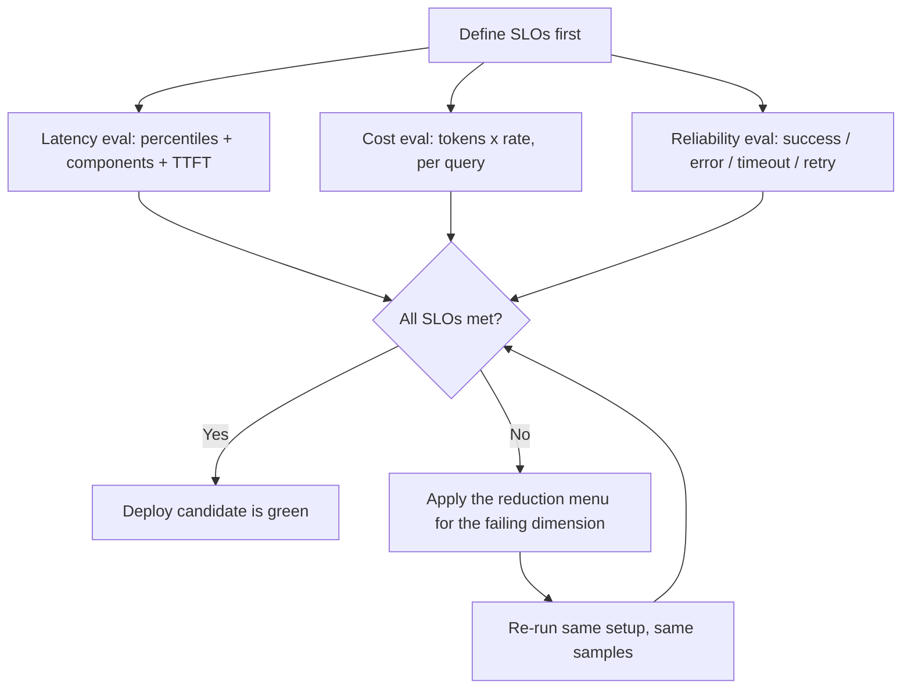

# CS-15 · RAG Operational Evals: Building Faster, Cheaper RAG Systems

> **Source transcript:** `RAG_Operational_Evals_Building_Faster_Cheaper_RAG_Systems_CampusX.txt` (English, 1,751 lines / ~1 h 19 min)
> **Domain:** rag
> **One-liner:** The third and last pillar of RAG evaluation — latency, cost and reliability — measured with telemetry and stopwatches instead of LLM judges and golden datasets, and used to decide whether a quality-improving change is actually deployable.
> **Prerequisites:** CS-13, CS-14

---

## 0. Executive summary

- Operational evals answer a different question from quality evals: "Even if the RAG system gives good answers, can it run reliably, quickly, and economically in production?" `[2:49]`
- They are software-driven, not judge-driven: **no LLM-as-judge, no golden dataset** — just timers, token counters and try/except blocks `[3:41]` `[1:06:21]`
- Three categories are in scope — **latency, cost, reliability**. Throughput is deliberately out of scope because it needs load/stress testing `[4:53]` `[1:17:38]`
- The worked decision: a reranker + top-10 chunks + a bigger LLM raised correctness 91→95, faithfulness 94→96, relevance 93→95, but pushed average latency 2.3 s→4.1 s and average cost 72 paise→1.08 — a quality win that may still be a deployment loss `[9:08]`
- Offline latency numbers are not trustworthy in absolute terms (laptop vs server) but the **differential between two runs on the same setup is** `[11:19]` `[13:05]`
- The hands-on suite is three scripts in `evals/`: `eval_latency.py`, `eval_cost.py`, `eval_reliability.py`, all run as `python3 -m evals.<name>` `[1:00:10]` `[1:14:13]`
- Measured latency report: mean 3.6 s, median 3.8 s, **P95 5.3 s**, retrieval ~700 ms, generation 2.9 s, **TTFT mean 1.6 s / P95 2.0 s**, average answer length 1,158 characters — and both SLOs (P95 ≤ 3,000 ms, TTFT ≤ 1,200 ms) **fail** `[41:50]` `[44:42]`
- Measured cost report: GPT-4o mini at $0.15/1M input and $0.60/1M output, 12 samples, average input 1,700 tokens (1,109 auto-cached), average output 209 tokens, **average cost ≈ 2 paise/query**, projection ₹57/day and ₹1,700/month at 2,000 questions/day — budget **passes** `[1:01:59]` `[1:03:45]`
- Measured reliability: 4 questions × 5 sends = 20 API hits, max 2 retries → 100% success, 0% error, 0 retries; the speaker calls this a "too ideal" setup and says real numbers only appear after deployment `[1:15:09]` `[1:16:37]`
- The operational evals cost nothing to run — no judge model is billed, only the application's own LLM calls `[1:06:40]`

---

## 1. The problem this lecture solves

CS-13 and CS-14 ended with a suite that can prove an answer was *correct*. This session is the counterweight: a RAG system can be 95% correct and still be unshippable because it takes six seconds to answer, costs 40 paise a query at 20,000 queries/day, or silently drops 2% of requests.

The transcript frames the whole thing as a before/after. Baseline pipeline: correctness 91%, faithfulness 94%, answer relevance 93%, average latency 2.3 s, P95 4.8 s, average cost 72 paise, timeout rate 2%, success rate 99.8% `[9:08]`. The team then adds a reranker, raises the chunk count from 5 to 10, and moves to a larger LLM. Quality moves the right way — correctness 95, faithfulness 96, relevance 95 — but average latency goes to 4.1 s, P95 to 6.2 s, and average cost to 1.08 `[10:01]`. Timeout rate improves to 1% and success rate to 99.9%, but the cost nearly doubles and latency nearly doubles.

Nothing in the quality suite can adjudicate that trade-off, because all its numbers improved. Operational evals exist to make the other side of the ledger measurable: *"Do not wait until production to discover that your RAG pipeline is too slow or too expensive"* `[13:27]`.

Why the pre-LLM playbook does not transfer: a classic web service has a fixed work-per-request shape, so a single P95 and a monthly bill tell you most of what you need. An LLM pipeline's cost and latency are *content-dependent* — a short factual question and a long-context question differ by an order of magnitude in both — so averages hide the behaviour that actually breaks budgets `[57:48]` `[1:13:30]`.

---

## 2. Definitions & mental models

| Term | Definition (source's words) | Why it matters |
|---|---|---|
| Operational evals | "Even if the RAG system gives good answers, can it run reliably, quickly, and economically in production?" `[2:49]` | The third pillar after component-level (CS-13) and pipeline/application-level (CS-14) evals |
| Latency | Time taken to serve one request, end to end `[14:43]` | Reported as a distribution, never a single number |
| TTFT | Time To First Token — how long until the user sees the first streamed token `[22:55]` | The number the user actually perceives; needs streaming to measure |
| Cold start | First-request penalty from connection init, model loading, vector-DB connect, network handshake, cache init, container start `[24:50]` | Discard warm-up runs or you measure your own boot, not your pipeline |
| Cost | "The monetary expense incurred to process a user query, driven primarily by the LLM tokens consumed during generation" `[55:03]` | The dominant cost line in nearly every LLM application |
| Reliability | "The ability of a RAG system to successfully serve requests without errors, timeouts, crashes, or broken pipeline stages" `[1:08:11]` | If 8 of 10 users get an answer, the system is "80% reliable" |
| Error rate | 1 − success rate; percentage of requests that failed `[1:09:14]` | Complement of success rate; must be *categorised*, not just totalled |
| Timeout rate | Percentage of requests that exceed the allowed time `[1:09:50]` | Distinct from error rate — a request that never returns is not an error, it is a hang |
| Retry rate | Percentage of requests that require at least one retry `[1:09:44]` | Hides instability that success rate alone masks |
| SLO | Service Level Objective — the threshold you commit to `[45:07]` | The pass/fail line for an operational eval, e.g. "P95 ≤ 3,000 ms" |
| Throughput | Requests served per unit time `[1:17:38]` | Out of scope here; requires load/stress testing |

**The mental model the speaker draws:** two ledgers running in parallel for the same pipeline. The left ledger holds quality metrics (correctness, faithfulness, relevance) produced by judges and golden data. The right ledger holds operational metrics (latency, cost, reliability) produced by timers and counters. A deployment decision requires both ledgers; CS-14's regression gate reads only the left one.

---

## 3. Core content, decomposed

### Band A — Scope and method

### 3.1 Why offline operational evals are legitimate `[11:19]`
- **What the source says:** you can run latency, cost and reliability evals offline, on your laptop, before deployment — with one caveat that applies to latency only.
- **Mechanism:** the argument is differential. Absolute latency on a laptop is meaningless because your machine is not the server; but if you measure the *same* pipeline on the *same* machine before and after a change, the delta is real and it will survive deployment approximately intact `[12:29]`.
- **Constraint:** the compared experiments must run on the same setup — same machine, same network, same model, same sample set `[13:05]`. Change the setup between runs and the delta is confounded.
- **Numbers:** the running example's before/after deltas are the whole point of the section (2.3 s → 4.1 s mean, 72 paise → 1.08 per query).
- **Analyst note:** this is the most transferable idea in the session. Absolute-threshold evals on a dev box are noise; relative-delta evals on a dev box are signal, provided the workload is fixed. The corollary the source does not state is that you should freeze the sample set as a checked-in fixture rather than regenerating the questions each run.

### 3.2 Latency — ten considerations `[14:43]`
- **What the source says:** latency is "time taken to serve one request", and there are ten ways to get it wrong.
- **Mechanism and list:**
  1. **Report distributions, not the mean.** P50/P95/P99 over mean, because the tail is what users complain about `[17:08]`. The source's illustration: 2,000 questions in an hour producing a latency PDF — the mean hides that some requests took three times as long.
  2. **Break latency down per component.** A 4.5 s end-to-end that is 1.5 s retriever + 3 s generator tells you where to optimise `[21:46]`. Break further into embedding, vector retrieval, re-ranking and generation.
  3. **Measure TTFT separately.** "Time To First Token" is what the user perceives; streaming makes it observable `[22:55]`.
  4. **Handle cold starts.** Connection init, model loading, vector-DB connection, network handshake, cache init, container/serverless spin-up all inflate the first call; **skip the first one or two questions and measure from the third** `[24:50]`.
  5. **Always report token count and context size** alongside latency — latency is not comparable across runs with different output lengths `[27:05]`.
  6. **Latency ≠ throughput.** The restaurant analogy: a table served in 10 minutes but only four tables an hour; the source's example is 10,000 concurrent users looking fine and 20,000 collapsing `[27:47]`.
  7. **Repeat runs.** 10 questions × 5 sends = 50 latency values, then average; API noise means a single send per question is not a measurement `[30:20]`.
  8. **Track failures and timeouts separately.** A P95 that improves from 3 s to 2 s while timeouts rise from 2% to 8% is a *worse* system, not a better one — failed requests are silently excluded from a latency distribution `[31:43]`.
  9. **Define latency budgets** at system and component level: e.g. RAG P95 must never exceed 3 s, retriever must never exceed 1 s `[34:01]`.
  10. **Use representative, segmented workloads** — in the source's example 3 simple, 4 medium and 3 complex questions out of 10, not ten variations of an easy question `[35:05]`.
- **Analyst note:** point 8 is the one most teams get wrong in dashboards. Any percentile computed only over successful requests is a survivorship-biased metric; report the timeout share on the same chart as the percentile or the percentile lies.

### 3.3 The latency script and its report `[36:37]`
- **What the source says:** `eval_latency.py`, written with Claude's help from the ten considerations, placed in `evals/` and run as `python3 -m evals.eval_latency`.
- **Mechanism:** five questions × five repetitions = 25 LLM calls; `warm-up runs = 2`; SLOs of end-to-end P95 ≤ 3,000 ms and TTFT ≤ 1,200 ms; the report prints one row per metric.
- **Numbers from the actual run:**

| Metric | Mean | Median | P95 | P99 | Min | Max |
|---|---|---|---|---|---|---|
| End-to-end latency | 3.6 s | 3.8 s | 5.3 s | 5.3 s | 1.3 s | 5.3 s |
| — retrieval only | ~0.7 s (756 / 762) | — | 983 ms | >1 s | — | — |
| — generation only | 2.9 s | — | — | — | — | — |
| TTFT | 1.6 s | ~1.6 s | 2.0 s | 2.1 s | 1.3 s | — |

  Average answer length across the five questions: **1,158 characters**; the report states explicitly that *"latency scales with output length"* `[44:44]`.
- **Verdict:** both SLOs fail — end-to-end P95 5.3 s against a 3 s budget, TTFT P95 2,081 ms against a 1,200 ms budget `[45:23]`. The generator is the culprit at roughly 4× the retriever's time.
- **Correction the source makes on air:** the speaker first says warm-up discards the first two runs *of every question*, then corrects himself — **only the first two runs in total are discarded**, out of the 25 `[40:44]`.
- **Scale caveat:** "you would probably do this 500 or 1,000 times to get a good reliable number. But again, this is all we can do for now" `[41:06]`.
- **Analyst note:** 25 samples is enough to see a 2 s regression but not to estimate a P99. Treat the P99 column in this report as decorative; with n = 25 the P99 is just the maximum.

### 3.4 Ten ways to reduce latency `[46:04]`
- **What the source says:** the pipeline failing both SLOs triggers a team discussion, and this is the menu.
- **Mechanism:**
  - *Generator side:* use a faster model (the source's example: "if you are currently using Gemini 3.1, you can use its flash variant instead", accepting a slight quality hit) `[46:23]`; use a **model router** that classifies the question and sends simple questions to a small model and complex ones to a large model `[46:45]`; instruct concise answers and set a hard cap, e.g. "make sure your answer does not exceed 500 words" in the system prompt `[47:21]`.
  - *Context side:* reduce the context sent to the generator — lower `k` (e.g. 10 → 5) or apply **contextual compression** (send a compressed version of the retrieved context; note the source flags that compression itself costs time) `[47:51]`.
  - *Retriever side:* break the ~700 ms retriever into query-embedding time, vector-DB retrieval time and reranker time, then target the largest — the source suggests 700 ms could plausibly come down to 500 ms `[48:28]`.
  - *Caching:* embeddings (same question asked repeatedly), retrieval results, reranking results, and the system prompt — the last is the highest-value one, because only the question and the context vary per request while "these large rules you have created" are resent every time `[48:55]`.
  - *Infrastructure placement:* co-locate vector DB, reranker API and LLM in the serving region. The worked example is a vector DB in Mumbai, a Cohere reranking API in the US and an LLM API in Europe, where the inter-region distance alone adds a fraction of a second `[50:31]`.
- **Analyst note (outside source):** prompt caching on the system-prompt prefix is only effective when the prefix is byte-stable across requests — any per-request interpolation near the top invalidates it. The source does not mention this ordering constraint, and it is the usual reason a "we already cache" claim fails.

### Band B — Cost

### 3.5 Where the money goes `[51:57]`
- **What the source says:** cost is "how much money your system has to spend to answer one query" `[52:01]`, and the audience is asked to enumerate the spend points before being told.
- **Mechanism — the five cost lines:** the LLM API (billed per request on tokens; **the biggest line by far** — "go to any company and ask where they have spent money like water… the token burn from our LLMs is the biggest cost factor" `[54:28]`); a commercial vector database such as Pinecone `[53:02]`; a paid reranker such as Cohere `[53:25]`; the embedding model that turns every question into a vector (small, but nonzero) `[53:35]`; and the infrastructure hosting the application `[53:46]`.
- **Scope decision:** the session measures **LLM cost only**, on the stated assumption that the vector DB is free, the reranker is free, embedding is a small/local model and nothing is deployed yet, so infrastructure is out of the picture `[54:44]`.
- **Cost formula:** input tokens × input rate + output tokens × output rate = total LLM cost `[56:09]`.
- **Rate mechanics:** rates are published per **1 million tokens**, input and output priced separately, and *"generally assume that output is 4× more costly than input"* `[55:53]`. The source points at OpenRouter as the place to look up per-model pricing `[55:28]`.

### 3.6 Five cost considerations `[57:02]`
- **What the source says:** concept is simple, execution is not.
- **Mechanism:**
  1. **Cost per query is the most important number** — not spend per hour, day or month, though those are computed too `[57:05]`.
  2. **Split input and output cost.** It tells you which lever you have: "can I reduce my input cost? Can I reduce my output cost?" `[57:28]`
  3. **Measure cost as a distribution, not a total.** With 2,000 queries an hour you have 2,000 cost numbers; plot them and inspect the long tail. The source's numbers: a typical query costs 2 paise, but some cost 1.5 rupees and some cost 3 rupees — a 75–150× tail that a total would hide `[57:55]`.
  4. **Segment cost by query type** — simple / medium / difficult, mirroring the latency segmentation `[58:46]`.
  5. **Set a cost budget.** The business team says "we cannot spend more than this many rupees running an application for a month"; translate that into a per-query ceiling, e.g. **not more than 50 paise per complex query** `[59:01]`.

### 3.7 The cost script and its report `[1:01:23]`
- **What the source says:** `eval_cost.py` in `evals/`, generated with Claude from the five considerations; the distribution view was not implemented, "you can do it, though" `[59:57]`.
- **Mechanism:** four questions × three sends = **12 samples**; pricing hard-coded from the known model name; budgets hard-coded.
- **Setup detail:** the application uses **GPT-4o mini** and the evaluations use the same model — the speaker warns "don't get confused" `[1:01:49]`. Rates: **$0.15 per 1M input tokens, $0.60 per 1M output tokens** (the 4× ratio).
- **Numbers from the run:**

| Line | Value |
|---|---|
| Samples | 12 (4 questions × 3 sends) |
| Average input tokens | ~1,700 (1,753), of which **1,109 auto-cached** |
| Average output tokens | 209 |
| Average cost per query | ≈ **$0.0002 / 2 paise** |
| Min–max spread | tight — "the cost is stable, unlike latency" `[1:02:59]` |
| Input vs output split | more spent on input than output (the inverse of the usual pattern) `[1:03:09]` |
| Projection | 2,000 questions/day → **₹57/day, ₹1,700/month** |
| Budget verdict | within budget → **SLO passes** `[1:03:58]` |

- **Why cost is a more trustworthy offline metric than latency:** "costs don't fluctuate much because the rates are the same… cost will work just fine even offline. So this is a slightly more reliable metric" `[1:01:23]`.
- **The caching caveat:** 1,109 of 1,753 input tokens were cached because the *same* question was sent three times in a row, which makes the provider's automatic prefix cache fire far more aggressively than it would in production, where every question differs. The source explicitly says the real-world caching factor will be **lower** `[1:07:17]`. No caching code was written — "the provider, OpenAI, is doing the caching on their end" `[1:07:54]`.
- **Analyst note:** the source states the cached-token count twice with different numbers — "1,109 of them" at `[1:02:17]` and "119 out of 1753" at `[1:07:09]`. The 1,109 figure is consistent with the arithmetic around the average input token count; the 119 line appears to be a transcription or slip error. Either way, the conclusion the speaker draws is the same: this caching rate is an artefact of the test harness, not a property of the application.

### 3.8 Five ways to reduce cost `[1:04:27]`
- **What the source says:** "there aren't too many ways to save costs, unlike latency."
- **Mechanism:** reduce context size (smaller chunks, contextual compression) so input tokens fall and output tokens often fall with them; make the system prompt more efficient (the source's example: "if it's currently 1,000 tokens, how can I reduce it to 800 without losing the essence"); instruct the model to answer concisely; use a cheaper model; and use caching wherever possible — the source notes caching helps more on cost than on latency because of prompt caching, but "it won't be beneficial at every level here" `[1:05:24]`.
- **The governing asymmetry:** latency can be attacked at the whole-system level; cost is dominated by the LLM, so the **biggest single lever is which model you are using** — switching to a self-hosted open-source model is the only change that moves the number significantly, and everything else is "just minor optimizations… plus or minus 5%" `[1:05:37]`.
- **Analyst note:** the "±5%" figure is the speaker's rough characterisation of the secondary levers, not a measured result. It is directionally right — prompt trimming and k-reduction typically move cost by single-digit percentages once the model is fixed — but do not cite it as an experimental finding.

### Band C — Reliability

### 3.9 Reliability: what to measure `[1:08:02]`
- **What the source says:** reliability is the ability to serve requests without errors, timeouts, crashes or broken pipeline stages `[1:08:11]`. The illustration: ten users arrive, eight get answers, two see "try again after some time" — the system is 80% reliable `[1:08:30]`.
- **Mechanism — four metrics:**
  - **Success rate** / **error rate** — complements of each other, `1 − error rate` and `1 − success rate` `[1:09:14]`.
  - **Timeout rate** — requests exceeding the allowed time; the source stresses this is *different from an error* `[1:09:26]`.
  - **Retry rate** — percentage of requests requiring at least one retry `[1:09:44]`.

### 3.10 Five reliability considerations `[1:10:09]`
- **What the source says:**
  1. **Measure overall success and failure rates.**
  2. **Categorise failures instead of one generic error rate.** With a 20% failure rate, break it into LLM API failure, retriever failure, reranker failure, timeout, rate-limit error ("you can't make more than a certain number of API requests in a given time period"), parser/formatting error, and internal exceptions from your own code `[1:10:19]`. Implementation is "many try-except blocks" — one around every API call, one around reranking `[1:11:31]`. The source admits this extra code was **not written** in the demo and that a company writing a proper evaluation would write it.
  3. **Measure reliability under load separately.** "A pipeline may be highly reliable in a single-user offline test but starts failing when concurrency rises" `[1:11:55]`. The demo's 20 questions from a laptop will likely show a 100% success rate; thousands of concurrent users will not.
  4. **Use enough samples.** 25 or 50 questions is "too little" — all will pass. At 1,000 questions you start seeing that one errored `[1:12:38]`.
  5. **Use representative requests and include different query kinds** — simple, long-context (very large context), complex, long-answer, and edge cases — because a complex query may have a systematically higher error rate than a simple one `[1:13:02]`.

### 3.11 The reliability script and its report `[1:13:40]`
- **What the source says:** `eval_reliability.py` in `evals/`, and the speaker volunteers that "this code is not quite production-grade… but it will do the work."
- **Mechanism:** four questions × five sends = **20 API hits**; `max retries = 2`; measures error rate, success rate and retry rate.
- **Numbers from the run:** **success rate 100%, error rate 0%, zero retries** — every question answered on the first try `[1:15:09]`.
- **The interpretation the source insists on:** this is not evidence of a reliable system. It is evidence that the test setup is "too ideal" — 20 requests from a laptop against a reliable API. Swapping to Ollama models, "Ollama has cloud models too", would bring the reliability score down `[1:14:57]`. The numbers only become meaningful post-deployment with thousands of users `[1:15:24]`.
- **Audience Q&A folded into the section:** a participant notes DeepEval's cost of five metrics per 100 golden items, and the speaker agrees that using an expensive judge model additionally produces rate-limiting errors — reinforcing that the reliability profile of a *judge* is itself a production concern `[1:16:13]`.

### 3.12 Budgets in dev vs prod `[1:16:46]`
- **What the source says:** asked whether to set separate testing budgets for dev and prod mode, the answer is **no for cost** — one budget serves both, because cost does not change when you deploy.
- **Mechanism:** latency *should* get a separate, looser dev-mode budget, because production latency is usually higher than laptop latency — the system is online, one server is here and another there, tokens can spike. Cost, in the source's judgement, stays the same `[1:17:11]`.

### 3.13 What is deliberately excluded `[1:17:38]`
- **What the source says:** throughput — requests served per unit time — is the fourth operational dimension and is **out of scope** for this session.
- **Mechanism:** throughput needs load testing and stress testing, "there are dedicated softwares for that," which emulate many requests hitting the application. In a company production setting this is performed; here it is deferred.

---

## 4. Frameworks & decision procedures

### 4.1 The operational eval build order



### 4.2 Latency diagnosis order

| Step | Question | Instrument |
|---|---|---|
| 1 | Is the end-to-end P95 over budget? | Full-run percentile table |
| 2 | Which component dominates? | Retrieval vs generation split |
| 3 | Is retrieval slow in embed, search or rerank? | Three-way retriever breakdown |
| 4 | Is the user-visible delay TTFT or total? | Streaming first-token timer |
| 5 | Is the run contaminated by cold start? | Compare first 2 calls vs the rest |
| 6 | Is the workload representative? | Simple / medium / complex mix |
| 7 | Are failures hidden? | Timeout rate reported on the same line |

### 4.3 Cost reduction priority

1. Change the model (largest effect) → 2. Reduce context size (smaller chunks or contextual compression) → 3. Shrink the system prompt → 4. Cap answer length → 5. Cache the stable prefix. Everything below step 1 is in the ±5% band `[1:05:37]`.

### 4.4 Which operational dimensions can be evaluated offline

| Dimension | Offline on a laptop? | Why |
|---|---|---|
| Cost | Yes, and trustworthy | Rates are fixed by the provider; "cost will work just fine even offline" `[1:01:23]` |
| Latency | Yes, but only as a **delta** | Absolute values depend on machine and network `[11:19]` |
| Reliability | Weakly | Concurrency and real network conditions are missing `[1:11:55]` |
| Throughput | No | Requires load/stress tooling `[1:17:38]` |

---

## 5. Worked end-to-end example

The source's own running scenario, carried through all three dimensions.

**Starting point.** A RAG chatbot on GPT-4o mini, k = 5 chunks, no reranker. **Change under test:** add a reranker, raise k to 10, move to a larger LLM.

| Ledger | Metric | Before | After |
|---|---|---|---|
| Quality | Correctness / faithfulness / relevance | 91 / 94 / 93 | 95 / 96 / 95 |
| Operations | Mean latency · P95 · cost/query | 2.3 s · 4.8 s · 72 paise | 4.1 s · 6.2 s · 1.08 |
| Operations | Timeout rate · success rate | 2% · 99.8% | 1% · 99.9% |

Every quality number improved; every economic number got worse. The reranker additionally introduces a new failure surface (the rerank API) and a new latency component.

**Diagnosis.** Run `python3 -m evals.eval_latency` on the fixed 5-question × 5-repetition fixture, discarding 2 warm-up runs. Report: mean 3.6 s, P95 5.3 s, retrieval ~0.7 s, generation 2.9 s, TTFT mean 1.6 s / P95 2.0 s, average answer length 1,158 characters. Both SLOs fail `[45:23]`, and the generator is the target at roughly four times the retriever — so the remediation menu is the generator-side one: lower k or compress the context, cap answer length in the system prompt, or route simple questions to a small model `[46:04]`.

**Cost and reliability.** `eval_cost.py` passes its SLO — ≈ 2 paise/query, ₹57/day and ₹1,700/month at 2,000 questions/day `[1:03:58]`. `eval_reliability.py` returns 100% success with 0 retries, which the source itself refuses to treat as evidence: "the current setup is too ideal to give us any bad numbers" `[1:16:37]`.

**The decision the source draws.** Latency is failing, so the pipeline goes back for improvement before any deploy; cost and reliability provide no blockers but also no reassurance at this sample size. The point of the example is that the two ledgers must be read separately — the same change passes one and fails the other.

---

## 6. Pros, cons, exceptions

| Approach | Pros | Cons | Works when | Fails when | Cost |
|---|---|---|---|---|---|
| Offline latency eval | Free, fast, no judge, no golden data; deltas are trustworthy | Absolute values are not; needs warm-up handling and repeats | Comparing two pipeline variants on one machine | You need a production SLA number | 25–50 LLM calls per run |
| Offline cost eval | Most reliable offline operational metric; near-zero variance | Only covers LLM spend in this demo; caching rate distorted by the harness | Rates are provider-fixed and the model is known | Your spend is dominated by vector DB or infra | 12 LLM calls per run |
| Offline reliability eval | Cheap; exercises retry/error paths | 100% success is the expected and useless result on a laptop | Pre-deploy smoke test | Concurrency, rate limits or flaky providers matter | 20 API hits per run |
| Load / stress testing | The only measure of throughput | Needs dedicated tooling; out of scope here | Production readiness sign-off | — | Not stated |

| Metric | Pros | Cons | Threshold used here |
|---|---|---|---|
| End-to-end latency P95 | Captures the tail users feel | Sensitive to cold start and workload mix | ≤ 3,000 ms `[45:13]` |
| TTFT | The perceived responsiveness number | Requires streaming | ≤ 1,200 ms `[45:20]` |
| Cost per query | Stable, comparable, budget-friendly | Hides the long tail unless distributed | Budget set per query, e.g. 50 paise/complex query `[59:17]` |
| Success / error rate | Simple, universal | One number hides cause | Categorise failures `[1:10:19]` |
| Retry rate | Exposes instability | Needs retry logic instrumented | max 2 retries in the demo `[1:14:35]` |

---

## 7. Failure modes & anti-patterns

1. **The improvement that is a regression.** *Symptom:* all quality metrics up, users complain. *Root cause:* no operational ledger. *Detection:* run the before/after latency and cost evals on the same fixture. *Fix:* make operational SLOs a deploy gate alongside quality gates (see CS-14's regression flow).
2. **Averaging away the tail.** *Symptom:* mean latency looks fine, users are unhappy. *Root cause:* a mean over a long-tailed distribution. *Detection:* plot the distribution; report P95/P99. *Fix:* percentile reporting and per-component attribution `[17:08]`.
3. **Cold-start contamination.** *Symptom:* an inflated first measurement or two. *Root cause:* model loading, connection setup, container spin-up. *Detection:* compare the first two calls against the rest. *Fix:* discard the first two runs — in total, not per question `[40:44]`.
4. **Survivorship-biased percentiles.** *Symptom:* P95 improves while users get angrier. *Root cause:* timeouts excluded from the latency sample. *Detection:* report timeout rate next to the percentile. *Fix:* count timeouts as the worst-case latency, or report both side by side `[31:43]`.
5. **Unrepresentative workload.** *Symptom:* green evals, red production. *Root cause:* ten easy questions. *Detection:* segment the fixture by difficulty and context size. *Fix:* fixed simple/medium/complex mix `[35:05]`.
6. **Harness-induced caching.** *Symptom:* an impossibly low cost per query. *Root cause:* repeating the same question N times triggers the provider's automatic prefix cache. *Detection:* compare cached-token count against the production expectation. *Fix:* use distinct questions per sample, or state the caching rate in the report `[1:07:17]`.
7. **One generic error rate.** *Symptom:* "we have 20% errors" and no idea what to do. *Root cause:* no failure categorisation. *Detection:* the error log has no labels. *Fix:* try/except around each stage — LLM call, reranker, parser — and label the failures `[1:10:19]`.
8. **Testing reliability on a laptop and believing it.** *Symptom:* 100% success rate pre-launch. *Root cause:* no concurrency, an ideal network, a reliable provider. *Detection:* increase sample size to ~1,000; introduce a less reliable provider. *Fix:* measure reliability under load post-deployment; treat the offline result as a smoke test only `[1:16:37]`.
9. **Optimising cost in the wrong order.** *Symptom:* weeks spent trimming prompts for a 3% saving. *Root cause:* ignoring that the model choice dominates. *Detection:* compare the model's rate against the rest of the bill. *Fix:* change the model first; treat everything else as ±5% `[1:05:37]`.

---

## 8. Implementation notes

**Layout.** Three scripts under `evals/`, run as modules from the project root:

```
python3 -m evals.eval_latency
python3 -m evals.eval_cost
python3 -m evals.eval_reliability
```

This matches the `src/` + `evals/` layout and the `__init__.py` requirement described in CS-13 — a module-style invocation avoids the `ModuleNotFoundError: No module named src` class of failure.

**Streaming was added to `src/generator.py` specifically to make TTFT measurable** `[39:02]`. Without a streaming call there is no first-token timestamp to record; the generator had to be modified before the latency eval could report the metric.

**Latency eval shape.** Five questions × five repetitions = 25 LLM calls; `warm-up runs = 2` discarded at the start of the run; SLO constants for end-to-end P95 (3,000 ms) and TTFT (1,200 ms); the report prints one row per metric with mean, median, P95, P99, min, max, plus the average answer length, plus the SLO verdict.

**Cost eval shape.** Four questions × three sends = 12 samples; pricing constants for the model (`$0.15` / `$0.60` per 1M tokens); a budget constant; a USD→INR conversion factor — the speaker notes the 88 used in the script is stale and "maybe it's 95 or 96 now" `[1:00:32]`; the report prints average input tokens (with the cached subset), average output tokens, average/min/max cost per query, the input-vs-output split, and daily/monthly projections from an assumed request volume.

**Reliability eval shape.** Four questions × five sends = 20 API hits; `max_retries = 2`; three counters — success, error, retry — with the caveat that production-grade code would add per-stage try/except labels.

**Cost formula to implement:**

```
input_cost  = input_tokens  / 1_000_000 * input_rate
output_cost = output_tokens / 1_000_000 * output_rate
total_cost  = input_cost + output_cost          # per query
```

**Analyst note (outside source):** the scripts are described but not printed in the transcript. The shapes above are reconstructed from the speaker's walkthrough of the outputs; do not treat the constant names as the source's actual identifiers.

---

## 9. Interview-ready Q&A

**Q1. Why do operational evals need neither an LLM judge nor a golden dataset?**
Because nothing about speed, spend or uptime requires a judgement of meaning. Latency is a stopwatch reading, cost is tokens × rate, reliability is a success/failure counter. The source makes the point explicitly: "We haven't created any golden dataset anywhere, and you won't see any LLM being used in these scripts… These scripts are free to run" `[1:06:21]`. The only LLM calls in the run are the application's own, not a judge's. That is why operational evals can run on every commit where a judge-based suite would be too expensive.

**Q2. A change improves correctness, faithfulness and relevance but doubles cost and latency. What do you do?**
Read both ledgers against their SLOs. In the source's example the quality change took correctness 91→95 and faithfulness 94→96, but mean latency 2.3 s→4.1 s and cost 72 paise→1.08 `[9:08]` `[10:01]`. If the operational SLO is a hard business constraint — a per-query cost budget or a P95 latency ceiling — the quality gain does not earn a deploy, and you go back to the reduction menu for whichever dimension broke. The correct answer is never "quality wins" unilaterally; it is "which constraint is hard".

**Q3. You measure P95 latency of 3 s on your laptop. Is that a production number?**
No — the absolute value depends on your machine and network `[11:19]`. What is portable is the differential: measure the same pipeline on the same setup before and after a change, and the delta survives deployment approximately intact. The prerequisite is identical setup and identical questions across the compared runs `[13:05]`.

**Q4. Why does a P95 that improves from 3 s to 2 s sometimes mean the system got worse?**
Because failed and timed-out requests are not in the latency distribution. If the timeout rate rose from 2% to 8% while the P95 fell, you have not made the system faster — you have made it drop more requests, and the survivors are faster `[31:43]`. Always report the timeout rate on the same line as the percentile.

**Q5. Trap: your latency eval reports a P99 of 5.3 s from 25 samples. How much should you trust it?**
Almost none. With n = 25 the P99 is essentially the maximum, and in the source's run the P99 and P95 are identical at 5.3 s — a tell that the sample is too small `[42:18]`. The speaker himself says you would run this 500 or 1,000 times for a reliable number and that 25 is "too less" `[41:06]`. Use the run to detect large regressions, not to quote tail percentiles.

**Q6. Trap: our cost per query is 2 paise with 63% of input tokens cached. Can we quote that in a budget proposal?**
Be careful. The caching rate is an artefact of the harness. Because the eval sends the same question three times in a row, the provider's automatic prefix cache fires aggressively — 1,109 of 1,753 input tokens in the source's run — and the speaker says the real production factor "will be a bit lower" because production questions differ `[1:07:17]`. Recompute without the cache credit, or use distinct questions per sample, before quoting the number.

**Q7. How do you decide where to spend latency-optimisation effort?**
Break the end-to-end number into components first. In the source's run, 4.5 s end-to-end was 1.5 s retriever plus 3 s generator, and the real report showed ~0.7 s retrieval against 2.9 s generation `[21:46]` `[42:51]`. The generator dominates by roughly 4×, so the levers are generator-side: a faster model, a model router, a concise-answer constraint, or a smaller context. Optimising the retriever first would be working on the smaller half.

**Q8. What is TTFT and why does measuring it require a code change?**
Time To First Token is the delay before the user sees the first character of the answer `[22:55]`. Without streaming, the only observable timestamp is the end of the response, so the source added a streaming call to `src/generator.py` specifically to capture the first token `[39:02]`. In the run, TTFT averaged 1.6 s and P95 was 2.0 s — which matters because a user who waits 1.6 s for the first token and 3.6 s for the whole answer experiences the first number, not the second.

**Q9. Enumerate the cost lines in a RAG application and say which dominates.**
The LLM API (dominant — billed on input and output tokens), a commercial vector database such as Pinecone, a paid reranker such as Cohere, the embedding model, and the hosting infrastructure `[52:27]` `[53:46]`. The source's claim, stated bluntly, is that token burn is the biggest cost factor for essentially every LLM application `[54:18]`. Consequently the biggest reduction lever is the model choice, and everything else — prompt trimming, k-reduction, answer caps — is single-digit percentage work `[1:05:53]`.

**Q10. How do you set a cost budget that engineering can act on?**
Take the business constraint ("we cannot spend more than X rupees a month") and translate it into a per-query ceiling, e.g. "we can't spend more than 50 paise per complex query" `[59:17]`. Then measure cost per query as a *distribution*, not a total, so you can see the tail — the source notes a typical query at 2 paise against outliers at 1.5 and 3 rupees `[58:22]` — and segment by query type.

**Q11. What are the four reliability metrics, and how do they differ?**
Success rate and error rate are complements — one minus the other `[1:09:14]`. Timeout rate is separate because a request that exceeds the allowed time has not errored, it has hung `[1:09:50]`. Retry rate is the share of requests needing at least one retry, which surfaces instability that a success rate hides. All four should be broken down by *cause*: LLM API failure, retriever failure, reranker failure, timeout, rate limit, parser/formatting error, internal exception `[1:10:36]`.

**Q12. What is out of scope for operational evals, and why does it matter?**
Throughput — requests served per unit time. It cannot be measured by running 25 requests from a laptop; it requires load and stress testing with dedicated tooling that emulates concurrent traffic `[1:17:38]`. The consequence is that an offline reliability result of 100% success is essentially uninformative; the source says so directly: "The current setup is too ideal to give us any bad numbers" `[1:16:37]`.

---

## 10. Cheat sheet

```
OPERATIONAL EVALS — three dimensions, no judge, no golden data

SCOPE
  in : latency | cost | reliability
  out: throughput (needs load/stress testing)

LATENCY
  end-to-end = retrieval + generation        (~0.7s + ~2.9s in the demo)
  report     : mean, median, P50/P95/P99, min, max — never mean alone
  TTFT       : needs streaming; separate from total
  cold start : discard first 2 runs TOTAL, not per question
  repeats    : 5x per question minimum; 25 samples = directional only
  context    : always publish token count + answer length with latency
  rule       : timeouts are excluded from a percentile -> report them together
  budget     : system-level P95 <= 3,000 ms ; TTFT <= 1,200 ms

COST
  total = (input_tokens / 1e6 * in_rate)
        + (output_tokens / 1e6 * out_rate)
  out_rate is generally 4x in_rate                        (GPT-4o mini: .15 / .60)
  headline metric : cost PER QUERY (not per hour / day / month)
  always          : split input vs output; plot the distribution; segment by
                    query type; set a per-query budget (e.g. 50 paise/complex)
  caution         : repeated identical questions inflate provider-side prompt
                    caching -> understated cost. Real cache rate is lower.
  levers ranked   : model >> context size > system prompt > answer cap > caching

RELIABILITY
  metrics : success rate | error rate (1 - success) | timeout rate | retry rate
  rule    : categorise failures, never one generic error rate
            categories = LLM API | retriever | reranker | timeout | rate limit
                         | parser/format | internal exception
  load    : offline single-user success rate is not a production number
  samples : 25-50 is too few; push toward 1,000 to see the rare error
  mix     : simple + long-context + complex + long-answer + edge cases

OFFLINE TRUSTWORTHINESS (best -> worst)
  cost > latency (deltas only) > reliability > throughput (not offline)

BUDGETS
  cost     : one budget for dev and prod (rates are identical)
  latency  : dev budget can be looser; prod latency is usually higher

FILES
  evals/eval_latency.py      5 questions x 5 runs, warm-up 2
  evals/eval_cost.py         4 questions x 3 runs, pricing + budget constants
  evals/eval_reliability.py  4 questions x 5 runs, max_retries = 2
  run:  python3 -m evals.eval_latency   (and eval_cost / eval_reliability)

RUNNING EXAMPLE
  before : corr 91 / faith 94 / rel 93 | 2.3s avg | 4.8s P95 | 72p | 2% timeout
  after  : corr 95 / faith 96 / rel 95 | 4.1s avg | 6.2s P95 | 1.08 | 1% timeout
  verdict: quality up, economics down -> read both ledgers before deploying
```

---

## 11. Glossary

| Term | Meaning |
|---|---|
| Operational evals | Evals of how a pipeline runs — speed, spend, reliability — as opposed to what it answers |
| SLO | Service Level Objective; the threshold a metric must meet, e.g. P95 ≤ 3,000 ms |
| TTFT | Time To First Token; delay before the first streamed token appears |
| Cold start | First-request overhead from connection, model load, cache init and container start |
| Warm-up run | An early run discarded so cold-start cost does not enter the distribution |
| Contextual compression | Sending a compressed form of the retrieved context to the generator to cut input tokens |
| Model router | Classifier that sends simple questions to a small model and complex ones to a large model |
| Rate | A provider's price per 1M tokens for a given model, priced separately for input and output |
| Cost per query | Average monetary cost of answering one user query — the headline cost metric |
| Long-tail query | An infrequent query whose cost or latency is orders of magnitude above the median |
| Success rate | Share of requests served successfully; complement of error rate |
| Error rate | Share of requests that failed; 1 − success rate |
| Timeout rate | Share of requests exceeding the allowed time — distinct from an error |
| Retry rate | Share of requests requiring at least one retry |
| Throughput | Requests served per unit time; out of scope here, needs load testing |
| Prompt caching | Provider-side reuse of an unchanged prompt prefix, billed at a lower input rate |
| Load / stress testing | Emulating concurrent traffic with dedicated tooling to measure throughput |

---

## 12. Cross-references

- **Builds on:** [CS-13](./CS-13-testing-rag-retrievers-hands-on.md) (retriever metrics and the `src/` + `evals/` layout), [CS-14](./CS-14-rag-evaluation-interview-framing.md) (the evaluation ladder, the regression gate, the same running example)
- **Leads to:** CS-16 (RAG safety and security testing — the fourth surface after quality, latency, cost and reliability), and the regression-testing and online-eval sessions the source announces at `[1:18:49]`
- **External:** OpenRouter (rate lookup, `[55:28]`), Cohere (reranking API, `[50:51]`), Pinecone (paid vector DB, `[53:09]`), Ollama (lower-reliability counterfactual, `[1:15:00]`), GPT-4o mini pricing page (`$0.15` / `$0.60` per 1M tokens)

**Analyst note — promises the source makes for other sessions.** At `[1:18:49]` the speaker commits to two further sessions, regression testing and online evaluation, and at `[1:19:17]` to a shorter agent-evaluation sequence. At `[1:17:38]` throughput is named as a fourth operational dimension and then explicitly deferred, with no promise to return to it.
