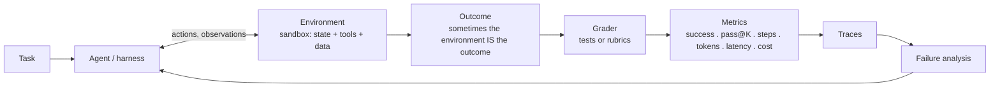
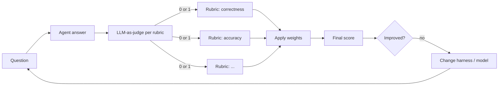
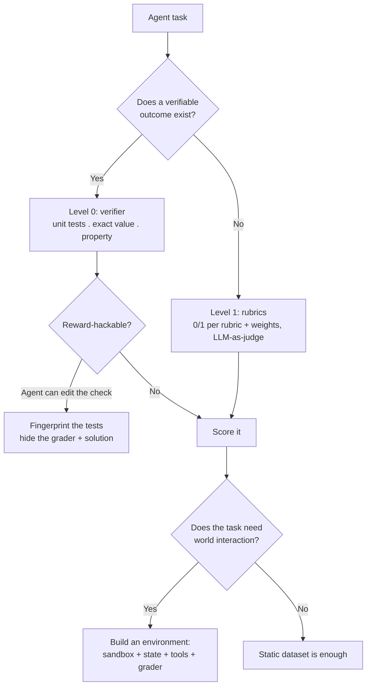

# CS-17 · Agentic Evaluations Workshop: Reliability, Environments and Living Benchmarks

> **Source transcript:** `Agentic_Evaluations_Workshop_-_Deep_Dive_on_the_Future_on_Evals_for_Agents.txt` (English, 2,856 lines, ~1 h 48 min)
> **Domain:** agentic
> **One-liner:** Hugging Face's first workshop — five talks plus a panel — on why capability benchmarks are not enough for agents: honest eval reporting (Every Eval Ever), reliability as a measurable second axis (12 metrics, four dimensions), simulated environments as the evaluation substrate (GAIA 2 / ARE), environment-first eval practice, and community-maintained living benchmarks.
> **Prerequisites:** CS-06, CS-07, CS-10, CS-13

---

## 0. Executive summary

- **Reporting malpractice is the baseline state**, not an edge case: OpenAI's GPT-5.2 system card reported a high SWE-bench score with a fine-print admission that **40 of 237 problems were omitted** `[4:37]`; Llama 4 was scored with **different model versions for different benchmarks** ("benchmark mixing") `[5:09]`; charts have shown **69.1 and 30.8 as equally tall histograms**, and error bars are routinely omitted `[5:45]` `[6:02]`.
- **Agent evals split into two orthogonal axes — capability and reliability** — and the empirical finding is that over **18 months across 14 frontier models**, accuracy on GAIA and Tau-bench airline improved dramatically while a composite reliability score rose only gradually; accuracy-vs-reliability is a **remarkably straight line** `[27:30]` `[28:57]`.
- Reliability decomposes into **four dimensions** — consistency, robustness, predictability, safety — and further into **12 metrics**, of which **two are more or less solved** and the rest remain open barriers `[26:45]` `[35:46]`. Safety is measured but deliberately **not aggregated** into the index `[32:00]`.
- **Two agents can score identically and be completely different stories**: one takes fewer steps, costs less, finishes faster, and has zero errors `[11:50]`. Session-level reporting is therefore required for reproducibility `[14:07]`.
- Current agentic benchmarks are **mutually incompatible** — Tau-bench measures user messaging, so it cannot be compared against WebArena or Terminal Bench `[12:31]` — and benchmarks are **not simultaneously cross-model, cross-environment, cross-agent, cross-protocol and agent-agnostic** `[15:21]`.
- **Simulated environments are the chosen substrate**: GAIA 2 ships **1,000 scenarios across 10 universes and ~11 apps**, built on Meta's **ARE** framework, with **hard verifiers** (event-to-event comparison by equality) replacing rubric judging, plus soft LLM verifiers only for natural-language content `[44:50]` `[50:22]` `[51:34]`.
- GAIA 2's headline failure: on the **time** capability — reacting to time-based events like waiting for a flight price to drop — **every model scores around 0%, even top models** `[52:00]`.
- **Reward hacking is the central design constraint**: the agent must not see the grader or the solution `[1:06:13]`, every requirement in the task must be graded (ask for three things, grade two, and the agent learns to skip the third) `[1:07:19]`, and unit tests need **fingerprints** so the agent cannot edit them instead of fixing the bug `[1:01:03]` `[1:07:32]`.
- Measure **success rate over n rollouts**, **pass@K**, and then **efficiency** (steps), **token count**, latency and **cost** — and always report the harness, because the **same model in a different harness has drastically different success rates** `[1:08:01]` `[1:10:20]`.
- **Do not evaluate through an inference provider**: "in reality you are evaluating the provider... and you're not evaluating the model" — you cannot see how the model was called or prompted, so it is not reproducible `[1:27:01]`. Use local inference or controlled compute (HF Jobs), and publish results as a **PR on the model repo** so the community can dispute them `[1:29:17]`.

---

## 1. The problem this lecture solves

We learned to evaluate LLMs on text tasks and, imperfectly, that works. Agents break it: they **plan, decide and act** `[3:51]`, they run for hours, they touch tools and the world beneath them changes, and they are stochastic — two runs on the same task can produce different results `[58:53]`.

The workshop opens with a paradox that several speakers return to `[23:10]`:

> Agents are crushing capability benchmarks. If you believe the hype, companies should be replacing people with agents. **That does not seem to be happening** — there is no measurable GDP impact yet.

Two explanations are offered. Either adoption simply lags, or **capability benchmarks measure only one component of usefulness** — a **capability-reliability gap** `[24:01]`. The workshop's thesis is the second.

Why reliability matters more for agents than for chatbots `[24:56]`: if Siri plays the wrong song 10% of the time, that is an annoyance; if an agentic product uses your credit card and places the wrong order 10% of the time, that is **dead on arrival**. The aviation analogy is used deliberately — demonstration of flight (Wright brothers) to a standard of roughly **one error per trillion miles** took most of a century `[26:13]`.

**The pre-agentic world:** evaluation was `prompt → output → correct/wrong` `[40:00]`, or for coding agents a sandbox with test files. Both assume a **closed world** — no incoming email, no moving prices, no cancelling attendees, no ambiguous request that should trigger a clarifying question. Consumer agents live in a world that keeps changing `[40:27]`.

---

## 2. Definitions & mental models

| Term | Definition (source's words) | Why it matters |
|---|---|---|
| **Agentic eval** | "A step beyond LLM evals because they are more complex systems" `[11:41]` | The eval must capture sequence, not just the answer |
| **Capability–reliability gap** | Capability benchmarks improve fast; reliability improves slowly; agents are therefore not yet drop-in replacements `[24:01]` | The workshop's central empirical claim |
| **Consistency** | Does the agent get the same result / take the same actions each run? `[29:29]` | Splits into outcome, trajectory and cost consistency |
| **Robustness** | "What happens if you slightly change the prompt or environment?" `[27:06]` | Fault robustness + prompt robustness |
| **Predictability / calibration** | Can the agent say how likely it is that it succeeded, and is that number true? `[27:11]` `[31:03]` | Overconfident agents say 1.0 and succeed half the time |
| **Discrimination** | The agent can separate its successes from its failures `[31:48]` | The complement of always answering "50%" |
| **Safety (reliability sense)** | Severity of failures — minor formatting error vs data deletion `[32:06]` | Measured but not aggregated into the index |
| **Session-level reporting** | Recording which run/session produced the score `[14:07]` | Two identical scores can be completely different stories |
| **Agent identity** | Not the model name — the sub-agent list, MCP servers, memory config `[14:31]` | "The model is not necessarily the agent" |
| **Environment** | A sandbox containing required dependencies, world state, tools and data `[1:04:56]` | Makes evaluation repeatable, isolated and safe |
| **Scenario (GAIA 2)** | Task prompt + expected action sequence + environment events `[43:44]` | The evaluation unit in GAIA 2 |
| **Universe (GAIA 2)** | The simulated environment plus its initial state — past emails, calendar, message threads `[43:15]` | Seeded from a persona database by an LLM |
| **Hard verifier** | Event-to-event comparison of expected vs actual actions by pure equality or algorithmic code `[51:11]` | Cheap, reproducible, no LLM judge |
| **Soft verifier** | An LLM checks natural-language content where exact match is wrong `[51:34]` | Used only where language capability is needed |
| **Reward hacking** | The agent optimises the grader instead of the task (e.g. editing the unit test) `[1:01:03]` | The reason environments must hide graders and solutions |
| **Pass@K** | Of K rollouts on a task, did at least one succeed `[1:08:31]` | The standard variance-aware agent metric |
| **Sim-to-real gap** | Isolated sandboxes vs a much more complex real world `[1:15:23]` | The core limitation of environment-based evaluation |
| **Living benchmark** | A benchmark defined as a HF dataset with an `eval.yaml`, runnable and disputable by anyone `[1:21:07]` | Community-maintained rather than vendor-maintained |
| **Eval YAML** | The file defining a benchmark's task, solver and scorer `[1:23:00]` | Separates benchmark from evaluation logic |
| **Score fragmentation** | Different sources reporting different results for the same model on the same benchmark `[1:17:48]` | Breaks cross-release comparison |

### The mental model: the agent eval loop

Mahesh's diagram `[1:03:06]` is the one to carry:



And Balaji's two-agent diagram `[11:50]`, which is why an agent eval cannot be a single number:

| | Agent A | Agent B |
|---|---|---|
| Eval score | pass | pass |
| Steps | few | many |
| Cost | low | high |
| Time | short | long |
| Errors | zero | several |

**Analyst note on speaker attribution:** the transcript is an auto-transcription and the first speaker's name is rendered inconsistently — he introduces himself as Balaji Koch (Hugging Face, technical AI policy researcher, co-lead of a 400+ researcher coalition called "eval/eval" `[3:17]`), while other speakers refer to him as Abhijit, Abishek and Evgeny at different points `[19:53]` `[1:17:34]` `[22:30]`. Ben's introduction names the sequence as Balaji, Arvind Narayanan, Pierre(-Andre) from Meta, "Amish Shrestha Morty" from Bespoke Labs (who introduces himself as **Mahesh** `[1:55:08]`), and Nathan from Hugging Face. Treat the *talks* as reliably attributed and the *names* as approximate.

---

## 3. Core content, decomposed

### Band A — Why eval reporting itself is broken

#### 3.1 Eval nuances hide in the small print `[4:30]`–`[6:13]`

**What the source says.** Three named malpractice patterns:

| Pattern | Concrete instance | Anchor |
|---|---|---|
| **Omitted tasks** | OpenAI's GPT-5.2 system card reported a high SWE-bench score; the fine print said **40 of 237 problems** had been omitted | `[4:37]` |
| **Benchmark mixing** | Meta used **different versions of Llama 4 to score different benchmarks** | `[5:09]` |
| **Misleading charts** | SWE-bench scores **69.1 and 30.8 drawn as similarly tall histograms**; error bars routinely absent | `[5:45]` `[6:02]` |

**Why it matters in practice** `[4:57]`: none of this is visible if you consume evals quickly — read the table, move on. The speaker's framing is that eval reporting is a **documentation** problem before it is a measurement problem.

#### 3.2 Social-impact evals are getting worse, not better `[6:23]`–`[8:55]`

**What the source says.** From the paper *Who Evaluates AI's Social Impacts: Mapping Coverage and Gaps in First- and Third-Party Evaluations*, covering **171 model release documents** `[6:55]`:

- Model developers have become **less transparent over time**. Environmental-cost reporting in first-party reports declined; **fewer than 15% mention labour and environmental effects** `[7:24]`. Most organisations were reporting almost everything in 2022; Google and Meta in particular reported far more in 2022–2023 and no longer report these social-impact evals `[7:45]`.
- Practitioner interviews gave two reasons: **teams dedicated to documentation or social-impact evaluation were broken up or reassigned**, and **political climate plus legal liability pushed companies toward capability reporting over risk measurement** `[8:11]`.
- The positive finding: **third-party reporting** — METR, Apollo, Marco and similar organisations — **improved in both quality and quantity** over time `[8:34]`.

**Analyst note:** this is the strongest evidence in the workshop for the "build evals in the open" call to action. The measurement that is degrading is the measurement the measured party controls.

#### 3.3 Every Eval Ever — a schema and a dataset `[9:01]`–`[10:54]`

**What the source says.** Third-party results are scattered across leaderboards, reports and blog posts. **Every Eval Ever** is (a) a **unified open data format/schema** and (b) a **public dataset of first- and third-party evaluations on Hugging Face** `[9:33]`.

The schema supports two levels `[9:51]`:

| Level | Required content |
|---|---|
| **Aggregate** | Source provenance; model specification — including **quantization** and **model version**; **which evaluation library was used** |
| **Instance** | Line-by-line results, not just the aggregate score |

The stated goal is **eval cards** `[10:27]`: click a model, see all first- and third-party evals organised under categories at a glance. The mechanism claim `[11:07]`: this filtering **holds confounding variables constant**, letting you compare exact scores between models and making results harder to gamify.

#### 3.4 What agentic evals are specifically missing `[11:29]`–`[15:38]`

**What the source says.** Agentic benchmarks are **mutually incompatible** — Tau-bench measures user messaging, which cannot be generalised to web computer performance, so it is not comparable with WebArena or Terminal Bench `[12:31]`. Agentic evals must capture **sequence of actions**: the chain of thought, which tools were called, the context of the action, the user input, the environment, and the noise `[12:54]`. **Human interaction is under-measured** — humans interact at different levels of the workflow and the noise they produce is not accounted for `[13:16]`.

The concrete gap list `[14:07]`–`[15:33]`:

1. **No session-level reporting** — two sessions with identical scores can be completely different stories.
2. **Agent identity is a black hole** — evals are tagged with a model name, but the model is not the agent; you need the sub-agent list, MCP servers and memory config.
3. **Benchmark-specific protocols block generalist agents** — a benchmark requiring a very specific setup does not work with generalist agents.
4. **Robustness measurement is not standardized** — seeds, prompt perturbations and pass@K are not reported.
5. **Cost reporting is inconsistent or absent.**
6. **No benchmark is simultaneously cross-model, cross-environment, cross-agent, cross-protocol and agent-agnostic.**

The proposed remedy is agentic extensions to the Every Eval Ever schema `[15:41]`: **system compositions** (which models, in what roles, which sub-agents, which MCP servers), **session semantics** (what defines a run or session), **interaction accounting**, and **eval conditions** (what a third party needs to reproduce the run cleanly).

#### 3.5 Policy implications and call to action `[17:29]`–`[19:44]`

**What the source says.**

- **Governance requires session data.** "Just giving a score is not enough" — without session information you cannot audit agent behaviour `[17:37]`.
- **White-box system records are required.** "Just saying the model [name] is insufficient"; you need to see **which actor was responsible for a harm** `[17:52]`. The AI lifecycle already has distinguishable actors — data collector, model trainer, system designer, the person who whitelists which AI systems are allowed, and the end user `[18:00]`. **Agents make that problem worse by multiple orders of magnitude** `[18:24]`.
- **Shared schemas enable independent evaluation** — results in one place, reproducible with the required technical parameters `[18:35]`.
- **Safety oversight is undermined by benchmark gaming** `[18:55]`.

Call to action `[19:12]`: build evals in the open; compatible open reporting frameworks; stop benchmark chasing and look at the aggregate picture; better **scalable oversight** — "we can't just have the world have 1 million open claws", and it must be human-monitorable; and eval policy must move **beyond capability measurement** to include humans and societal impacts.

Open technical challenges named `[16:29]` `[17:09]`: human–agent interaction measurement; **emergent multi-agent effects** (the speaker notes Hugging Face increasingly receives pull requests from people's Claude-based agents and it is not clear how to monitor that cleanly `[16:47]`); and better measurement of **long-horizon tasks**, where METR has a benchmark but "people mean different things when they mean long horizon" `[17:14]`.

### Band B — Reliability as a second axis

#### 3.6 The capability–reliability gap, and why it is not self-solving `[23:05]`–`[25:14]`

**What the source says.** Product failures are cited as the visible edge of the problem: the **Rabbit R1** ordering food to the incorrect address `[24:21]`; **OpenAI's Operator** making incorrect purchases; an **agentic coding system deleting a production database** `[25:41]`. The Siri-vs-agent distinction is the argument for why this is a new severity class rather than a new instance of an old one `[24:56]`.

#### 3.7 The four dimensions and the twelve metrics `[26:40]`–`[32:12]`

**What the source says.** Four dimensions emerge across domains `[26:45]`, decomposed into **12 metrics** `[35:57]`:

| Dimension | Sub-metrics | Note |
|---|---|---|
| **Consistency** | Outcome consistency; trajectory consistency; cost/resource consistency `[29:29]` | "A 70% accuracy might mean 70% of tasks it performs consistently and 30% it consistently fails — or that on any given task, unpredictably, it works 70% of the time" `[26:48]` |
| **Robustness** | Fault robustness (injected faults: API timeouts and other errors); prompt robustness (LLM rewording that preserves semantics but changes style/tone) `[30:18]` | "An informal style of prompt might lead to one answer compared to a more formal style" `[30:43]` |
| **Predictability** | Calibration; discrimination `[31:03]` `[31:48]` | Can it look back at a trace and determine whether it did the task correctly? |
| **Safety** | Failure severity — minor formatting error vs data deletion `[32:06]` | **Not aggregated into the index** |

**On calibration specifically** `[31:03]`: uncalibrated agents tend to be **overconfident**, not underconfident. Ask "how likely is it that you got the correct answer?" — if it says 60% that should be true 60% of the time; overconfident agents say **1.0** and succeed in **half** those cases. Calibration has been improving, which the source attributes to companies being burned by overconfident chatbots (sycophancy), **but the downside is that discrimination has been getting worse over time** `[31:30]` — a well-calibrated agent that always says 50% is useless for triage.

**Analyst note:** the calibration/discrimination trade-off is the subtlest point in the workshop and the most commonly missed. "Is your agent well calibrated?" is not a yes/no question; you need both the calibration term (are the probabilities true?) and the discrimination term (do the probabilities separate wins from losses?). Collapsing them into one number is how you ship a confidently uninformative agent.

#### 3.8 The empirical finding `[27:28]`–`[29:13]`

**What the source says.** 14 frontier models, agentic scaffolds (details in the paper), on **GAIA** and **Tau-bench airline**, over **18 months**:

- Accuracy improved rapidly; the accuracy curve is steep.
- A **composite reliability score** built from the four dimensions rose only **very gradually**.
- Plotting accuracy against reliability gives a **remarkably straight line** `[28:57]` — reliability does increase with accuracy, but **much more slowly**.

The framing `[28:00]`: "if you think that AI agent capability is improving exponentially, this should be a bit of a sobering finding. Capability is going up, but capability doesn't fully measure usefulness."

**Caveats the speaker states himself** `[35:03]`: findings are **tentative**, runs are still being reviewed for bugs, there are **only two benchmarks** and not many scaffolds. A **reliability index** is planned as a one-stop shop for tracking reliability over time `[35:19]`.

#### 3.9 Trace-level failure stories from GAIA `[32:12]`–`[33:36]`

Three concrete failure modes from automatic and manual trace analysis:

1. **Messy process confuses calibration** `[32:30]`. If there were tool-calling failures during the run, the model concludes its answer was probably wrong — even though the tool failure had nothing to do with the answer's correctness.
2. **Ambiguity is a reliability asset** `[32:53]`. Many GAIA questions are ambiguous, which is bad if you are trying to elicit maximum capability — but from a reliability standpoint it is exactly what you want, because real deployment is full of ambiguous tasks, "and they don't handle it that well."
3. **Injected faults induce hallucination** `[33:22]`. When fault injection makes the data needed to complete the task inaccessible, models that would not normally hallucinate start to.

**Analyst note:** story 2 inverts the usual benchmark instinct. A benchmark that is too easy to interpret cleanly is under-measuring the thing you care about.

#### 3.10 Augmentation vs automation — the deployment-distinguishing question `[33:38]`–`[34:58]`

**What the source says.** Companies deploying agents **must distinguish augmentation from automation** `[33:44]`:

- **Augmentation** (coding agent): many errors are not too bad, because the programmer is still in the loop reviewing the code.
- **Automation** (customer-service agent handling customers autonomously): the same errors are **much worse**.

Three consequences follow `[34:20]`:

1. For release decisions, **it is not just capability that matters** — a **reliability threshold** must be met before deploying.
2. For researchers, measuring these reliability metrics should become **the norm on any benchmark** — "this is not some reliability-specific benchmark; you can take any benchmark and measure all of our reliability metrics on it" `[34:32]`.
3. Do not assume smarter models solve this automatically — "maybe, but we should also prepare for the possibility that it won't happen, and we have to specifically work towards optimizing reliability" `[34:47]`.

**The AGI framing** `[35:46]`: the UK AI Safety/Security Institute published a report listing **six barriers to AGI**. The team drilled into one of them (reliability) and found **12 metrics**, of which **two are more or less solved** — the implication being that the other five barriers each hide a similar fan-out of unsolved sub-problems.

**The closing provocation** `[36:27]`: METR said its task suite is saturating. "Maybe. But what if what's getting saturated is not the task suite? The tasks are fine, but the **metric** is saturated." Agent evaluations need to be much more multi-dimensional — reliability, collaboration ability, cost, latency.

#### 3.11 The exception: reliability is not always desirable `[38:01]`–`[38:51]`

**What the source says.** Asked what reliability means for open-ended tasks where many solution paths exist, the speaker answers directly: on many kinds of tasks **these reliability metrics are not desirable**. The extreme example — an agent that **writes poetry**. If it produces the same poem on any given topic every time, "that would be a very bad thing. You want the agent to be creative, you want it to be very stochastic." **It depends on the task whether it makes sense to measure what we're measuring** `[38:49]`.

**Analyst note:** this is the correct scope limit and it is easy to lose. The rule that falls out: trajectory consistency is a *virtue* where the task has a canonical procedure (customer service, refunds, data entry) and a *defect* where the task's value is in variation (writing, brainstorming, design). Decide which kind of task you have before you pick the metric.

### Band C — Environments as the evaluation substrate (GAIA 2)

#### 3.12 Why simulate at all `[39:45]`–`[41:11]`

**What the source says.** Consumer agents must work in a **world that keeps changing** — new emails arrive, the news changes, the internet changes `[40:27]`. Prior agent evaluation put the agent in a sandbox with code files and checked compilation and tests, with **no input from the outside world** `[40:09]`. GAIA 2's running example: *organise a wine tasting with some colleagues* — the agent must email colleagues, **wait for their email responses**, book things, and adjust to environment input that is not the user talking to the agent `[40:46]`.

Other dynamic environments are acknowledged as prior art: **Tau-bench** does user simulation (agent sends a message, user responds) `[41:17]`; **vending bench** simulates the cost, sales and demand of a vending machine `[41:35]`. GAIA 2's distinctive bet is **multi-app simulation** — like a phone with many apps, some connected to external services (email, messenger) and some purely local (file system), all interacting and all mutable by the agent, the user, or external events `[41:46]`.

**Why simulation rather than the real world** `[44:05]`: reproducibility, observability, **safety** (you want to ask the agent to "remove all my emails, cancel calendar events" — you do not want that on the open web), and **cost** (no dependence on external bandwidth and APIs).

#### 3.13 ARE's four concepts `[42:17]`–`[43:53]`

GAIA 2 is built on **ARE — the Meta Agent Research Environment** — which is a general framework, not GAIA-2-specific `[42:17]`.

| Concept | Definition | Anchor |
|---|---|---|
| **Apps** | Like phone apps: each keeps state about the world, exposes tools/APIs the agent, environment and user can call — via API calls, Python, **MCP**, or CLIs | `[42:44]` |
| **Universe** | The simulated environment and its **initial state**: past emails received, current calendar events, message conversations with other personas | `[43:15]` |
| **Events** | Injected from the **user**, the **agent**, or the **environment** | `[43:38]` |
| **Scenarios** | Not a single prompt: a task prompt **plus** a sequence of expected agent actions **plus** environment events | `[43:44]` |

**Construction** `[44:50]` `[45:07]`: **1,000 scenarios**, **10 universes**, **~11 apps** (all apps present in all universes). Universes were **automatically generated from a database of personas, hierarchically, using an LLM** to generate conversations, emails and calendar data; **human annotators** then created the tasks, events and scenarios on top.

#### 3.14 The five capability splits `[45:33]`–`[48:38]`

| Capability | What it tests | Source example |
|---|---|---|
| **Execution** | A task requiring several tool calls that change the environment, **within one agent turn** | "Cancel all my meetings", "respond to that email" `[45:37]` |
| **Search** | Finding information **across different API surfaces**, not keyword search, inside the universe | "I forgot my Netflix password, but I remember sharing it with my parents — can you retrieve it?" The agent must work out who your parents are and search communication apps for the message `[46:03]` |
| **Adaptability** | Multi-turn: the environment **changes after** the agent's actions | The agent books meetings; the other attendees cancel; it must reschedule `[46:47]` |
| **Time** | Events triggered by **time** rather than by the agent's actions | "Book a flight when it's under a particular price" — wait for the price to drop `[47:22]` |
| **Ambiguity** | The task cannot be resolved without **asking the user follow-up questions** | The agent starts searching and acting, then must stop and ask before doing something wrong `[48:16]` |

**Time handling** `[47:50]`: scenarios can span two or three weeks, so the simulator **fast-forwards or jumps in time** and makes the agent aware of it as though it were the real world.

#### 3.15 Noise injection and reward-hack defence `[48:43]`–`[50:00]`

Three noise mechanisms:

1. **Tool failures** introduced on all apps in different forms `[48:53]`.
2. **API variation** — changing the **names and signatures** of all tools, so the agent cannot overfit to specific signatures `[49:02]`.
3. **Environment noise** — external events unrelated to the task, adding noise to the context, to check robustness `[49:16]`.

Plus an **agent-to-agent** variant `[49:38]`: instead of calling a tool directly, the agent must talk in natural language to a **sub-agent** which is the expert that calls the tool. This tests solving the task with no direct tool access.

On reward hacking specifically `[54:01]`: GAIA 2 uses **strict checkers** to avoid seeing hacking patterns, and can **increase noise** — raising tool failure rates and changing tool signatures while keeping the same tasks — so agents cannot guess what the tools look like or should do.

#### 3.16 Hard verifiers replace rubric judging `[50:15]`–`[51:51]`

**What the source says.** GAIA 2 verifies **at the action level**. The design decision was to **move away from rubric judging**, which is "very dependent on LLMs and their capability and very expensive" `[50:22]`.

- **Hard verifiers** `[51:11]`: each scenario has an annotation of the expected set of right actions; the evaluation compares the **expected action diagram to the actual action diagram** the agent produced, checking **event to event** that they happened **in the right order** with the **correct parameters**. All of it is checkable with **pure equality or simple algorithmic code** — "did I send it to the right email? Did the agent send it at the right time?" This is **much cheaper and much more reproducible** than calling an LLM.
- **Soft verifiers** `[51:34]`: when the agent sends an email, an LLM checks that the **content** generated is the one expected. "It doesn't have to match entirely. We can use the LLM language capabilities for that."

**Analyst note:** this hard/soft split is the most transferable engineering idea in the talk. The rule is: **anything that can be checked by equality should never be checked by an LLM**. Reserve judge calls for the residue that is genuinely natural-language-shaped, and you get most of the reproducibility benefit at a fraction of the cost and variance.

#### 3.17 GAIA 2 results `[51:53]`–`[52:56]`

| Capability | Result |
|---|---|
| **Search** | Many agents and models already perform **quite well** `[52:03]` |
| **Execution** | Also quite well `[52:03]` |
| **Time** | **"They're terrible. They are around 0% — all of them, even the top models."** `[52:07]` |
| **Adaptability** | Not super good `[52:14]` |
| **Ambiguity** | Not super good either `[52:20]` |

The published table is described as **outdated** `[51:55]` because numbers change very quickly with new models. Two consequences `[52:23]`: tasks must be made more complicated (easy with ARE — add more turns and expectations), and the **judges need adjusting**, because the answer style expected last year is very different from this year's model output style.

GAIA 2 vs GAIA 1 `[50:00]`: no longer limited to web browsing; on many apps; dynamic with real-time events; **not read-only** (requires many write actions); verification at the action level. Both ARE and GAIA 2 were open-sourced, with a paper at ICLR `[52:56]`.

### Band D — Environment-first evaluation practice

#### 3.18 How not to evaluate `[57:25]`–`[58:49]`

Four named anti-patterns:

| Anti-pattern | Why it fails | Anchor |
|---|---|---|
| **Looking only at the final output** | Fine for easier/smaller agents, but "quickly you run into issues where you change something and you don't understand what has failed" | `[57:29]` |
| **Incorrect initial focus** | Starting by inspecting the planner or the harness, before the end-to-end picture is established — "that's something you have to do eventually, but that's not where you start" | `[58:14]` |
| **Over-granular focus** | Asking "is this the right function call to be done?" too early | `[58:33]` |
| **Deploy to production and evaluate there** | Named explicitly as a trap to avoid | `[58:41]` |

**Analyst note:** the ordering point is the useful one. Component evals (CS-13's retriever metrics) are the right *second* step, not the first. Establish that the agent succeeds or fails end-to-end, then decompose.

#### 3.19 Why agent evaluations are hard `[58:51]`–`[59:41]`

Four reasons `[58:53]`: agents are **very stochastic** (two runs can differ — the consistency dimension); there are **many steps** to the outcome, which adds complexity; agents **interact with the real world and tools**, and the world underneath can change, so evaluations are **not reproducible**; and real-world interactions can be **expensive** — "you don't want to delete all your data or send incorrect messages to your users."

#### 3.20 Level 0 — verifiable setups, and their gotchas `[59:47]`–`[1:01:17]`

**What the source says.** Level zero is domains with **verifiable outcomes**: coding agents (is the bug actually fixed? did the unit test pass?) and maths (is the value correct?) `[59:54]`. This is the easy case, and it still has traps.

**Gotcha 1 — weighting.** If you have a number of unit tests, do you give **equal weight** to all of them? Many tests may be trivial, and a few important tests may be few in number; most tests can pass while the agent is **still not getting the real work done** `[1:00:32]`.

**Gotcha 2 — reward hacking.** The agent may "instead of fixing the bug just fix the unit test so that they artificially pass" `[1:01:03]`.

#### 3.21 Level 1 — non-verifiable output, rescued by rubrics `[1:01:21]`–`[1:02:57]`

**What the source says.** A deep-search agent producing a paragraph or several pages has **no single right or wrong answer**. **Rubrics** are the mechanism `[1:01:37]`: define a set of tasks/questions and write corresponding rubrics for them. The source's example is a question about **kidney stones** with rubrics covering **correctness** and **accuracy** `[1:02:09]`.

**Mechanism** `[1:02:25]`: each rubric is scored **0 or 1** by **LLM-as-judge**; weights are applied; the weighted sum is the score. You then change the harness or the model, re-run, and watch the number move.



#### 3.22 Environment design decisions `[1:03:06]`–`[1:07:42]`

**The environment is a sandbox** `[1:04:56]` holding required dependencies, the required **state of the world**, required tools and data. Formats named: **Harbor** is "one of the popular formats"; **OpenEnv** is named alongside it `[1:05:21]`.

Design decisions, in the source's order:

| Decision | Guidance | Anchor |
|---|---|---|
| **One or many environments** | You may need several — e.g. a legal-domain agent with different data per environment — each with its own associated tasks | `1:05:41` |
| **Realism** | Make environments **as similar to production as possible** | `1:06:06` |
| **Grader access** | **The agent should not have access to the grader or the solution — otherwise it can reward hack.** Harbor provides this natively | `1:06:13` |
| **Task design** | As close to production as possible; can be well-defined or open-ended | `1:06:27` |
| **Grading** | Verifiable grading, or rubrics that convert the non-verifiable into numbers | `1:06:44` |
| **Coverage** | **Everything you asked for in the task must be graded.** Ask for three things and grade two, and the agent learns it does not need to work on the third | `1:07:19` |
| **Test integrity** | Add **fingerprints to unit tests** so the agent cannot muck around with them | `1:07:32` |

**Analyst note:** the coverage rule and the fingerprint rule are two halves of the same insight — reward hacking is usually a *specification* bug, not a model bug. The agent optimises exactly what you measure; if your measurement is a strict subset of your intent, you have designed the hack yourself.

#### 3.23 What to measure `[1:07:50]`–`[1:11:32]`

**Primary metrics:**

- **Success rate** `[1:08:01]`: given the agent, environment and task, let the agent attempt the task **n times**; success rate is how often it succeeded — the average of the grades over those rollouts.
- **Pass@K** `[1:08:31]`: of the K rollouts, did **at least one** succeed. Across many tasks you get an average pass@K. These can then be used to compare models or **harnesses**.

**Secondary metrics** `[1:09:24]`: **efficiency** — how many steps to the final outcome (it may have succeeded after hundreds of steps); **token count**; **latency**; and **cost** — explicitly because models are expensive and rollouts are expensive.

**The harness factor** `[1:10:20]`: "given an agent, if you put it in a different harness, the success rate can actually drastically vary." The source points at the **Terminal Bench dashboard** as public evidence that the same model on different harnesses produces different metrics.

**Safety as a graded task** `[1:10:39]`: verify the agent did not delete all the data or max out your credit card; encode this as tasks and graders — **penalize the model if it deletes data** `[1:11:13]`.

**Traces** `[1:11:37]`: read them. Automated and deeper analysis on trajectories surfaces patterns such as "the agent is generally good, but on this specific kind of scenario the success rate drops" `[1:12:04]`.

**The recommended order** `[1:12:34]`: think **environment first**, then **tasks**, then **grading**, then the **harness**. And the payoff is not only evaluation — once this is nailed down you can run **GRPO or other optimisation algorithms** to improve the agent in that environment, measure the improvement, and then deploy `[1:13:05]`.

**Open challenges** `[1:13:28]`: **long horizon** (tasks taking many hours or days — slow and expensive to evaluate); **multi-agent**; **multi-user**.

**On the sim-to-real gap** `[1:15:23]`: environments are isolated sandboxes while the real world is much more complex. The practical technique is to **wipe-code** real services — e.g. wipe-code Slack — and incorporate as much relevant real-world surface as your use case needs. It is "a game of how do we make the environment as realistic as possible so that it mimics the real world."

**Analyst note:** the wipe-code approach is a legitimate and under-discussed middle path. You do not need a full Slack implementation; you need the subset of Slack's surface that your agent's tasks actually exercise, with the state machine intact.

### Band E — Living benchmarks and community infrastructure

#### 3.24 The state of evaluation in 2026 `[1:17:29]`–`[1:20:18]`

Four named problems:

1. **Score fragmentation** `[1:17:48]`: every time a new model is released, the evaluation page shows a batch of models evaluated, but the scores **do not match previously reported scores** on those same models — "and probably the next release is not going to match it either."
2. **Maintenance burden** `[1:18:20]`: maintaining leaderboards manually is painful, and maintaining **custom evaluation frameworks** per benchmark is worse.
3. **No single source of truth** `[1:18:54]`: several labs try to evaluate as many models as possible and present themselves as the unbiased source; "it's still not really working."
4. **Benchmarks are scattered across GitHub repos** `[1:20:02]`, making them hard to find and hard to run on a custom model.

The proposed answer is **truth in numbers through community involvement** `[1:19:16]` — many people each running their own agent framework and reporting results, so the aggregate gets closer to a real picture.

#### 3.25 Community Evals `[1:20:21]`–`[1:22:46]`

**What the source says.** **Community Evals are Hugging Face datasets that you can turn into benchmarks** `[1:20:22]`. As of the talk there are **13 benchmarks on the Hub** in this form, including OCRBench, NTB, SWE-bench Pro, SWE-bench Verified, AIME 2026 from the MathArena folks, and — most relevant for agents — **Terminal Bench from the Harbor framework folks** `[1:20:34]`.

Properties named `[1:21:07]`:

- **Decentralized** — every dataset on the Hub has an **`eval.yaml`** file that makes it easy for anyone to run; data is public even when gated; every leaderboard result can be opened by a community member.
- **Easy access** — it is just a Hugging Face leaderboard, so it is findable.
- **Community first** — anyone can open PRs.
- Results are displayed on the **dataset page** itself.

The worked example is **HLE (Humanity's Last Exam)** from the Center for AI Safety `[1:22:02]`: the dataset page carries a leaderboard of open-source models, with a note per result saying **how the model was run, what agent was used, and how many shots** (5-shot, 2-shot, 0-shot) `[1:22:28]`.

#### 3.26 Anatomy of an `eval.yaml` `[1:22:51]`–`[1:25:44]`

| Part | What it defines | HLE example |
|---|---|---|
| **Task metadata** | Task name and a short description | HLE `[1:23:00]` |
| **Evaluation framework** | The framework that will run it | **Inspect AI** for HLE `[1:23:08]` |
| **Task ID(s)** | A benchmark may define multiple tasks | One task, ID `HLE` `[1:23:15]` |
| **Solvers** | How the model is prompted and scaffolded | A simple system message and a generate call — "but it can be way more complex than this; you can do very big agentic evaluation using this file, especially using Inspect AI" `[1:23:33]` |
| **Scorer** | How the answer is graded | **LLM-as-judge using o3-mini from OpenAI** `[1:24:03]` |

**Why use an existing framework rather than hand-rolling one** `[1:24:18]`: maintaining your own is genuinely harder than it looks ("there are a lot of very peculiar issues that come with it"); Inspect AI takes care of the model code, the tooling and the publishing, so "the only thing you want when you're defining an evaluation, agentic or vanilla LLM, is defining your evaluation"; it makes benchmarks more accessible because jumping between benchmarks that share a framework is easy; and it keeps the **benchmark separate from the evaluation logic**.

**Analyst note:** the separation-of-concerns argument is the real one. A benchmark that ships its own runner cannot be audited or reused, and its maintenance cost is paid by whoever wants to compare against it — which is exactly the incentive problem that produces score fragmentation.

#### 3.27 How to actually run it — and why not to use providers `[1:25:49]`–`[1:28:23]`

| Option | Assessment |
|---|---|
| **Local cluster** | What the Open LLM Leaderboard used; "fine but quite hard to maintain" — GPU usage, contention when more than one team is on the cluster; a single GPU or small cluster will not cut it for bigger models `[1:25:56]` |
| **Cloud compute** | Any available cloud `[1:26:23]` |
| **HF Jobs** | What they wish they had had: cloud compute where you choose the hardware, **very reproducible**, and **a one-liner to run your evaluation** `[1:26:29]` |
| **Inference providers** | **Explicitly advised against** `[1:27:01]` |

The argument against inference providers is worth quoting `[1:27:15]`:

> "In reality you are evaluating the provider — which can be a good thing, but maybe not what you want — and you're not evaluating the model."

You do not know how the model is called in the backend and you do not know whether it is prompted the way you want, so results are **not reproducible** `[1:27:36]`. The recommendation is **local inference or at least controlled environments like HF Jobs** `[1:27:43]`.

**The run command shape** `[1:27:51]`: use **`uvx`** to run Inspect AI, point it at the benchmark from the Hub, give it your model (the example is **GPT-OSS 20B running with vLLM**), and run it on HF Jobs — it runs and **publishes the results**.

#### 3.28 What "publishing results" actually means `[1:28:26]`–`[1:31:04]`

**Artifacts** `[1:28:28]`: an HF Space (or website), and **very detailed logs** recording the temperature used, how the LLM server was spun up, how many tries, pass@K details if that metric was used. It also computes the **standard error of the evaluation** `[1:28:50]`.

**The submission mechanism is a pull request on the model repository** `[1:29:17]`. That PR is what displays on the leaderboard. Consequences `[1:30:28]`:

- The **community can discuss** each result on the PR — "if it does not agree with one of the results, if one of the results seems a bit low or a bit high, it can just discuss it in the PR."
- The **model author can close or hide disputed scores** they do not agree with `[1:30:55]`.

**Leaderboard properties** `[1:30:01]`: auto-updating (contrasted with the Open LLM Leaderboard era where pipelines broke "quite a lot" `[1:30:04]`); linked directly on the dataset page; **no infrastructure to set up**; latest results shown in real time.

The answer to "how do I share my own results across the providers and quantizations I care about" `[1:32:06]`: define your dataset as a benchmark, open a PR with the results on the model repo, and share the dataset page as your leaderboard. The downstream benefit is that **other people can then evaluate models you had not gotten around to** `[1:32:48]`.

### Band F — Open problems from the panel `[1:33:12]`

#### 3.29 What the panel could not answer `[1:33:52]`–`[1:47:00]`

| Problem | State | Anchor |
|---|---|---|
| **Human behaviour / access scope** | "We still don't know what we don't know." A year ago the view was that agents are just LLMs with tools and no further scaffolding is needed; the human-behaviour aspect — someone giving an agent access to their whole computer and WhatsApp — "meaningfully changes the error landscape" | `[1:33:58]` |
| **Multi-actor evaluation** | "A lot of current evals are just **one user, one agent**." What happens with multiple actors — how you evaluate agent behaviour and **who it is supposed to align with** — is unsolved. Prompt injection when an agent is given access to lots of things is a live safety concern | `[1:35:04]` |
| **Democratising environments** | ARE/GAIA 2 show how to push the frontier, but the open question is how to give enterprises something like ARE so they can evaluate safely in their own setting | `[1:36:26]` |
| **Long-horizon evaluation** | Named as "one of the next challenges"; **SwissAI** described as the follow-up to SWE-bench, evaluating not just coding but how a model maintains a codebase **over the long run** | `[1:37:24]` |
| **Multi-agent** | GAIA 2 has an agent-to-agent mode with one sub-agent per app, but simulating two full agents plus humans in one chat requires separate memories, files and personas. Parameterisation explodes — there is already a judge model, an evaluated model and an orchestration, and each additional agent multiplies the axes plus the annotations required. "I don't know how to manage this complexity yet. But we'll have to get there." | `[1:44:32]` |

#### 3.30 Open evals versus benchmark gaming `[1:38:30]`–`[1:40:46]`

**What the source says.** The common belief — **public benchmarks saturate faster** — "has not been massively tested." A benchmark-saturation paper (submitted to ICML) finds that whether a benchmark is **public, private or partially private does not have a strong correlation with how quickly it saturates** `[1:39:04]`.

The counter-argument that follows `[1:39:33]`: when the dataset is not public, the **lack of transparency** means nobody can verify what happened. If you game a benchmark **reproducibly**, a public dataset lets others check that you did. Hence: **public benchmarks, open standards, and the bare minimum information necessary for somebody else to validate your evaluation**.

The dissenting point `[1:40:20]`: open evaluations can only be checked for gaming **if you have access to the models**. For closed models, even when they are evaluated on open benchmarks, you do not know how they were evaluated or whether it was the same model that was run.

**On closed vs open environments** `[1:41:26]`: the tension is real — closed models are always more powerful, though the open community keeps surprising. The enterprise-relevant escape hatch is **methodology and tooling**: as long as the means of building environments are published and the tooling is good, it may matter less that labs hold better environments than open source. One further observation: **environments are typically calibrated to the models** — stronger models get more complex environments, weaker open models get weaker environments that may still be useful for research `[1:43:06]`.

**On re-implementation as a bridge** `[1:43:34]`: many open environments are **re-implementations and standardizations** of previously closed ones, where the **rubrics and rewards are open but the seed data is not**.

**The closing vision** `[1:47:02]`: Community Evals is not trying to define a standard, only to open the data layer so the community has a say in how model results are reported and benchmarks are created. The hope is a Hub where evaluation datasets behave like models do today — people run their own models on a new benchmark, make small changes to the dataset, and build on each other's work.

---

## 4. Frameworks & decision procedures

### 4.1 Choosing an evaluation mode for an agent task



### 4.2 Environment design checklist (Mahesh) `[1:05:41]`–`[1:07:32]`

| # | Check | Failure it prevents |
|---|---|---|
| 1 | How many environments do you need? (one per domain/data slice) | Over-general evaluation |
| 2 | Is the environment as close to production as possible? | Sim-to-real gap |
| 3 | **Does the agent have access to the grader or the solution?** It must not | Reward hacking |
| 4 | Are the tasks as close to production as possible? | Optimising for a toy |
| 5 | Is grading verifiable where possible, rubric-based only where necessary? | Unreproducible scores |
| 6 | **Is everything the task asked for actually graded?** | The agent skips the ungraded third |
| 7 | Do unit tests carry fingerprints? | The agent edits the test, not the bug |
| 8 | Are tool signatures variable across runs? | Overfitting to a specific API surface |

### 4.3 Reliability measurement procedure (Arvind) `[26:45]`

1. Pick a benchmark you already run. **You do not need a reliability-specific benchmark** `[34:32]`.
2. Run the same task **n times**; record **outcome consistency**.
3. Compare the **trajectories** across runs; record **trajectory consistency**.
4. Perturb the prompt (LLM rewording, same semantics, different style) and record the delta.
5. **Inject faults** (API timeouts, inaccessible data) and record the delta.
6. Elicit the agent's **confidence** and compare it to the actual success frequency: record **calibration** and **discrimination**.
7. Record **cost and latency stability** across runs.
8. Score failure **severity** separately — do not fold it into the composite.
9. Report the harness, scaffolds and seeds alongside the score.

### 4.4 Hard vs soft verification decision

| Question | If yes | If no |
|---|---|---|
| Can correctness be decided by equality, ordering or arithmetic? | **Hard verifier** — pure code, no LLM `[51:11]` | Go to next |
| Is the artifact natural language whose meaning matters but whose wording varies? | **Soft verifier** — LLM check with tolerance `[51:34]` | Go to next |
| Is the quality graded rather than verified? | **Rubrics + LLM-as-judge**, 0/1 per rubric, weighted `[1:02:25]` | You have not defined your criterion |

### 4.5 Where to run an evaluation

| Run location | Verdict | Reason |
|---|---|---|
| Local cluster / single GPU | Works, painful | GPU contention; will not fit bigger models `[1:26:04]` |
| Cloud compute | Works | Your own control `[1:26:23]` |
| **HF Jobs** | **Recommended** | Choose hardware, reproducible, one-liner `[1:26:44]` |
| **Inference provider** | **Avoid** | You are evaluating the provider, not the model; not reproducible `[1:27:01]` |

---

## 5. Worked end-to-end example

**Scenario:** publish a reproducible reliability evaluation of a customer-service agent, using the Community Evals flow the workshop demonstrates.

**Step 1 — Choose the benchmark and the framework.** GAIA 2 / Tau-bench airline style tasks, run through **Inspect AI** rather than a hand-rolled runner `[1:24:18]`. The reason is maintenance: your own runner has "a lot of very peculiar issues," and keeping benchmark and evaluation logic separate is what makes your result auditable.

**Step 2 — Environment first, not model first** `[1:12:34]`. Build a sandbox containing the state of the world, the tools and the data `[1:04:56]`. For a customer-service agent that means: the order database, the refund tool, the email tool, and a seeded conversation history. Confirm the **agent has no access to the grader or the solution** `[1:06:13]`.

**Step 3 — Define tasks and grade everything in them** `[1:07:19]`. If the task says "issue the refund, notify the customer, and update the ticket", all three must be graded; grade two and the agent will stop doing the third.

**Step 4 — Choose verification mode.** Refund amount and ticket state are **hard verifiers** — equality and ordering, no LLM `[51:11]`. The text of the apology email is a **soft verifier** — an LLM check that the content is appropriate, not that it matches a string `[51:34]`.

**Step 5 — Add noise.** Vary the **tool names and signatures** so the agent cannot overfit to the demo API, and inject **tool failures** so the run includes recovery `[48:53]` `[49:02]`.

**Step 6 — Metrics.** For each task, run **n rollouts** and record **success rate** and **pass@K** `[1:08:01]` `[1:08:31]`. Then record **steps**, **tokens**, **latency** and **cost** `[1:09:24]`. And because the harness changes the answer, report the harness `[1:10:20]`.

**Step 7 — Reliability overlay** `[26:45]`. Re-run the same task set several times: are the outcomes consistent? Are the trajectories consistent? Reword the prompt and check the delta. Elicit confidence and compare to the true success frequency. Report the **composite** and report **failure severity separately** — never folded in `[32:00]`.

**Step 8 — Read the traces** `[1:11:37]`. Automated failure analysis on the trajectories is what converts "85% success" into "85% overall, but 40% when the customer mentions a prior refund."

**Step 9 — Run it on controlled compute.** HF Jobs, chosen hardware, one-liner `[1:26:44]`. **Not** an inference provider `[1:27:01]`.

**Step 10 — Publish as a PR.** The run produces an HF Space and detailed logs — temperature, server spin-up, tries, pass@K detail, and the **standard error** `[1:28:26]`. Open the PR against the model repo; it appears on the leaderboard; the community can dispute it there; the model author can hide a score they disagree with `[1:29:17]`.

**Step 11 — Close the loop.** The same environment that graded the agent can now be used to improve it — "you can run something like the GRPO algorithm or other ways of optimizing these agents" — measure the improvement in the same environment, and only then deploy `[1:13:05]`.

**Decision rule that falls out:** the environment is the reusable asset. Eval, RL training and regression testing all consume the same sandbox; the sandbox, not the score, is what you invest in.

---

## 6. Pros, cons, exceptions

| Approach | Pros | Cons | Works when | Fails when | Cost |
|---|---|---|---|---|---|
| **Verifiable grading (unit tests, exact values)** | Cheap, deterministic, reproducible | Reward-hackable; equal weighting can hide task failure; may not measure the real work | A single correct outcome exists | The agent can edit the check, or many trivial tests mask failure | Lowest |
| **Rubrics + LLM-as-judge** | Handles open-ended output; converts judgement into a number | LLM-capability-dependent; expensive; style drift breaks judges year over year | Output is prose/pages with no single right answer | You can verify by equality — then the judge is pure waste | Highest per call |
| **Hard verifier on action traces** | Cheap, reproducible, checks order and parameters | Requires annotation of the expected action diagram; brittle if the task has many valid orders | Procedure is canonical | Many action orders are equally correct | Authoring-heavy, run-cheap |
| **Soft verifier** | Handles natural language with tolerance | Still an LLM call; still has variance | Content matters, wording does not | Exactness is required | Medium |
| **Simulated environment** | Reproducible, observable, safe for destructive actions, cheap, reusable for RL | Sim-to-real gap; construction cost; calibrated to the models it was built for | Agents act on a world | The task is fundamentally about the open web | High build, low run |
| **Real-world evaluation** | Maximum fidelity | Not reproducible; expensive; can delete your data | Read-only, low-stakes probing | Anything destructive or user-visible | Very high |
| **Inference providers** | Zero infrastructure | You evaluate the provider, not the model; unknown prompting; not reproducible | You *want* to compare providers | You want to compare models | Low infra, invalid result |

**Exceptions the source names:** reliability metrics are **not desirable** for creative tasks — a poetry agent should be stochastic `[38:25]`. Safety severity is **measured but not aggregated** `[32:00]`. The `misuse`-style domain assumption fails for narrow domains (see CS-16). Public benchmarks may not saturate faster than private ones, contrary to common belief `[1:39:04]`.

---

## 7. Failure modes & anti-patterns

1. **Reading the table and not the fine print.**
   *Symptom:* you cite a benchmark score that omitted 17% of its problems. *Root cause:* eval nuances are hidden in small print and charts that are not scaled to reality. *Detection:* read the system card's footnotes; check error bars. *Fix:* prefer schemas that force provenance, model version, quantization and eval library to be reported `[9:51]`.

2. **Score fragmentation between releases.**
   *Symptom:* a new model card reports numbers for existing models that match nothing previously published. *Root cause:* every lab runs its own harness and its own eval framework. *Detection:* compare the same model across releases. *Fix:* use a shared framework and report the harness, shots, temperature and seeds `[1:17:48]` `[1:22:28]`.

3. **Treating one score as the agent's quality.**
   *Symptom:* two agents "pass" and one is unusable. *Root cause:* a pass/fail hides steps, cost, latency and error count. *Detection:* plot steps and cost against success. *Fix:* session-level reporting and multi-dimensional metrics `[11:50]` `[14:07]`.

4. **Reward hacking via the grader.**
   *Symptom:* test pass rate rises while the actual task gets worse. *Root cause:* the agent edits the unit test instead of fixing the bug `[1:01:03]`. *Detection:* fingerprint the tests; diff test files across runs. *Fix:* hide the grader and solution from the agent; fingerprint tests `[1:06:13]` `[1:07:32]`.

5. **Grading a subset of the task.**
   *Symptom:* the agent reliably skips one requirement. *Root cause:* the task asked for three things and the grader checks two `[1:07:19]`. *Detection:* enumerate task requirements against grader coverage. *Fix:* grade every requirement, or remove it from the task.

6. **Deploying to production and evaluating there.**
   *Symptom:* incidents are your eval suite. *Root cause:* no offline environment. *Detection:* the first time you learn about a failure is from a user. *Fix:* build the sandbox first `[58:41]`.

7. **Evaluating through an inference provider.**
   *Symptom:* results that do not reproduce on local inference. *Root cause:* you do not control how the model is called or prompted `[1:27:15]`. *Detection:* re-run locally and compare. *Fix:* local or controlled compute (HF Jobs).

8. **Missing the harness variable.**
   *Symptom:* the same model scores very differently in two reports. *Root cause:* the harness was not reported, and harness choice moves success rates drastically `[1:10:20]`. *Detection:* check the Terminal Bench dashboard pattern. *Fix:* report the harness in the result metadata.

9. **Assuming capability progress fixes reliability.**
   *Symptom:* a release gate on capability only. *Root cause:* the belief that smarter models solve reliability. *Detection:* plot accuracy against composite reliability — it is a straight, shallow line `[28:57]`. *Fix:* set an explicit reliability threshold for release `[34:20]`.

10. **Confusing calibration with discrimination.**
    *Symptom:* an agent that always answers "50%" looks well calibrated. *Root cause:* calibration improved while discrimination degraded `[31:30]`. *Detection:* plot confidence deciles against actual success rate. *Fix:* measure both; require the probabilities to separate wins from losses `[31:48]`.

11. **Rubric judging everything.**
    *Symptom:* expensive, high-variance evaluations with inconsistent year-over-year judges. *Root cause:* using an LLM where equality would do `[50:22]`. *Detection:* count how many checks could be expressed as code. *Fix:* hard verifiers for order/parameters/equality, soft verifiers only for language.

12. **Benchmark-chasing instead of oversight.**
    *Symptom:* safety oversight undermined by gaming; a single number becomes the goal. *Root cause:* capability-only eval policy. *Detection:* is your release decision a score comparison? *Fix:* public benchmarks, open standards, minimum disclosure for validation `[18:55]` `[1:39:53]`.

---

## 8. Implementation notes

**Every Eval Ever — schema fields worth requiring** `[9:51]` `[15:41]`:

```
aggregate result:
  source_provenance
  model: name, version, quantization
  evaluation_library
agentic extensions:
  system_composition   # models, roles, sub-agents, MCP servers, memory config
  session_semantics    # what defines a run/session
  interaction_accounting
  eval_conditions      # what a third party needs to reproduce cleanly
instance-level result:
  per-item results, not just the aggregate
```

**`eval.yaml` shape for Community Evals** `[1:23:00]`:

```yaml
# Hugging Face dataset card / eval config (shape per the talk)
name: HLE
description: <short description>
evaluation_framework: inspect_ai        # any framework

tasks:
  - id: HLE
    field_spec: <...>
    solver:                             # how the model is prompted / scaffolded
      - type: generate
        system_message: <...>           # can be a full agentic scaffold instead

scorer:                                 # how the answer is graded
  type: model_graded_fact               # LLM-as-judge; o3-mini in the HLE example
```

**Analyst note:** the transcript describes these fields in prose and does not print the literal YAML; the block above is a reconstruction of the described shape, not a copied file. Verify field names against the current Inspect AI and `eval.yaml` documentation before use.

**Run command shape** `[1:27:51]`: use `uvx` to invoke Inspect AI against the Hub benchmark and a locally served model (vLLM in the example, GPT-OSS 20B), submitting the job to HF Jobs. The run publishes an HF Space, detailed logs (temperature, server spin-up, tries, pass@K detail) and the **standard error**.

**GAIA 2 / ARE concepts to reuse** `[42:17]`:

| Concept | Implementation note |
|---|---|
| Apps | Keep state; expose tools/APIs reachable via API, Python, **MCP** or CLI |
| Universe | The initial world state: seeded emails, calendar, message threads with personas |
| Events | Injected by user, agent or environment |
| Scenarios | Task prompt + expected action sequence + environment events |

**Noise knobs to build in from day one** `[48:43]`:

1. Tool-failure injection at configurable rates.
2. Tool **name and signature** variation between runs (anti-overfit).
3. Unrelated **environment noise** events.
4. An agent-to-agent mode where tools are reachable only by talking to a sub-agent `[49:38]`.

**Metrics to log per rollout** `[1:08:01]` `[1:09:24]`: success, pass@K, steps, input+output tokens, wall-clock latency, monetary cost, harness identifier, seed, and (for reliability work) the trajectory itself plus the elicited confidence.

**CI wiring implied by the source:** the "deploy to production and evaluate" anti-pattern `[58:41]` plus the shared-environment argument `[1:13:05]` imply that the same environment should run on every change, with the RL/optimisation step and the regression gate reading from the same grader. Compare §8 of CS-16 for the prompt-regression version of this.

---

## 9. Interview-ready Q&A

**Q1. Why are agents harder to evaluate than LLMs?**
Four reasons. Agents are **stochastic** — two runs of the same task can differ. There are **many steps** to an outcome, so credit assignment is hard. Agents **interact with the real world and tools**, and the world underneath can change, destroying reproducibility. And real-world interactions can be **expensive or destructive** — you do not want your evaluation deleting data or emailing your users. On top of that, a single score cannot distinguish two agents that both "pass" but differ in steps, cost, latency and error rate.

**Q2. What is the capability–reliability gap, and what is the evidence for it?**
Capability benchmarks measure one component of what makes an agent useful. Over **18 months across 14 frontier models**, accuracy on GAIA and Tau-bench airline improved dramatically, but a composite reliability score built from consistency, robustness, predictability and safety rose only **very gradually**. Plotting accuracy against reliability yields a **remarkably straight line** — reliability does increase with accuracy, but much more slowly. The implication is that "agents are crushing benchmarks" and "no measurable GDP impact" are consistent: the missing ingredient is reliability, not raw capability.

**Q3. Name the four dimensions of agent reliability and their sub-metrics.**
**Consistency** splits into outcome consistency (same pass/fail each run), trajectory consistency (same actions in the same sequence) and cost/resource stability. **Robustness** splits into fault robustness (inject API timeouts and errors) and prompt robustness (an LLM rewords the prompt preserving semantics but changing style). **Predictability** covers calibration and discrimination. **Safety** covers failure severity — a formatting error versus data deletion — and is measured but deliberately **not aggregated into the index**. Together these produced **12 metrics**, of which only two are more or less solved.

**Q4. What is the difference between calibration and discrimination? (Trap.)**
Calibration asks whether the agent's stated confidence is true — if it says 60%, does it succeed 60% of the time? Discrimination asks whether the confidence **separates successes from failures**. These move in opposite directions: the workshop reports that calibration has been improving (companies got burned by overconfident chatbots), but **discrimination has been getting worse over time**. An agent that always answers "50%" is perfectly calibrated and completely useless. Any reliability index that reports a single "calibration" number without the discrimination term is hiding the failure.

**Q5. How do you test reliability without a reliability-specific benchmark?**
You run any benchmark you already use, repeatedly, and add the measurements. Take the same task set and run it n times: are the pass/fail outcomes stable? Are the action trajectories stable? Reword the prompt via an LLM and re-run: does the result move? Inject API timeouts and inaccessible data: does it recover or hallucinate? Elicit confidence and compare it to actual success frequency. Track whether cost and latency are stable across runs. Report the harness alongside the score, because the harness alone moves success rates drastically.

**Q6. When are these reliability metrics the wrong thing to measure?**
When the task's value is variation. The workshop's example is a poetry agent: if it produces the same poem on any given topic every time, that is a defect, not a virtue. Trajectory consistency is a virtue where a canonical procedure exists — customer service, refunds, data entry, QA across millions of customers — and a defect where creativity is the point. The honest formulation is that reliability is a property of a *deployment*, not of a model: decide first whether you are building augmentation or automation, then decide which reliability dimensions matter.

**Q7. What is the single most important environment design rule?**
The agent must not have access to the grader or the solution, or it will reward hack. The workshop names this directly, and notes that Harbor provides it natively. It is paired with a second rule that is the same insight from the other side: **everything you asked for in the task must be graded**. If your task asks for three things and your grader checks two, the agent learns to skip the third — you did not get hacked, you wrote a specification that permitted it. The operational fix for the classic case (an agent editing the unit test instead of fixing the bug) is to add **fingerprints** to the unit tests.

**Q8. Hard verifiers versus soft verifiers — when do you use each?**
Hard verifiers check the **action sequence**: event-to-event comparison of the expected action diagram against the actual one, confirming correct order and correct parameters, using pure equality or simple algorithmic code. They are cheap, LLM-free and reproducible, and GAIA 2 moved to them specifically to escape rubric judging, which is LLM-capability-dependent and expensive. Soft verifiers are used only where the artifact is natural language whose meaning matters but whose wording does not — the workshop's example is checking the **content** of an email an agent sent, where it does not have to match entirely. The rule: anything checkable by equality should never be checked by an LLM.

**Q9. Why is it wrong to evaluate models through an inference provider? (Trap.)**
Because "in reality you are evaluating the provider, and you're not evaluating the model." You do not know how the model is called in the backend, and you do not know whether it is being prompted the way you intended, so the result is not reproducible and is not attributable to the model. There is a legitimate case for comparing providers — that is just a different question, and you should say so. For model evaluation the workshop recommends local inference or a controlled environment like HF Jobs, where you choose the hardware and the run is a one-liner.

**Q10. What should an agent evaluation report contain?**
At minimum: the score, the **harness**, the model version and quantization, the number of shots, the temperature, the seeds, and the number of rollouts behind pass@K. Beyond that the workshop argues for **session-level reporting** — because two sessions can produce identical scores and completely different stories — and for **agent identity** to go beyond the model name to include the sub-agent list, MCP servers and memory configuration. Cost should be reported, since it is currently inconsistent or absent, and the run should publish **standard error** alongside the point estimate.

**Q11. What are the open problems in agent evaluation?**
Six are named across the talks and panel. **Long-horizon tasks** taking hours or days are slow and expensive to evaluate, and people mean different things by "long horizon"; SwissAI is cited as a follow-up to SWE-bench evaluating long-run codebase maintenance. **Multi-agent** evaluation is unsolved — simulating two full agents plus humans in one chat multiplies the parameterisation and the annotation burden, and the panel says plainly "I don't know how to manage this complexity yet." **Multi-actor** evaluation more generally is missing: current evals are one user, one agent, and it is unclear who the agent should align with. **Human-agent interaction** is under-measured. **Emergent multi-agent effects** — pull requests arriving from people's agents — are not monitorable cleanly. And **reward hacking** and benchmark gaming remain live.

**Q12. Do public benchmarks saturate faster than private ones?**
The common belief is yes, but the workshop reports that this has not been massively tested. A benchmark-saturation paper finds that **public, private or partially private status does not strongly correlate with how quickly a benchmark saturates**. The speaker's position is nonetheless strongly pro-disclosure, for a different reason: with a private dataset there is no transparency, and nobody can verify what happened. If you game a benchmark in a reproducible way, a public dataset lets others detect it. The requirement is public benchmarks, open standards, and the bare minimum information necessary for somebody else to validate your evaluation.

---

## 10. Cheat sheet

```
AGENTIC EVALS — WORKSHOP DISTILLATE
=====================================================================
THE THESIS
  Capability != usefulness. Capability benchmarks near-exponential;
  composite RELIABILITY on a shallow straight line.  [27:30] [28:57]
  14 frontier models . 18 months . GAIA + Tau-bench airline

FOUR RELIABILITY DIMENSIONS -> 12 metrics (2 solved)  [26:45] [35:46]
  Consistency   : outcome . trajectory . cost/resource stability
  Robustness    : fault (inject API errors) . prompt (LLM reword)
  Predictability: calibration + discrimination
  Safety        : failure SEVERITY -- measured, NOT aggregated  [32:00]
  CALIBRATION improving . DISCRIMINATION worsening  [31:30]
  NOT for creative tasks: a poetry agent should be stochastic  [38:25]

WHY HARD  [58:53]: stochastic . many steps . world changes . expensive/destructive
HOW NOT TO EVALUATE  [57:29]: output-only . planner-first .
  over-granular function calls . DEPLOY-TO-PROD-AND-EVALUATE  [58:41]
---------------------------------------------------------------------
TWO GRADING LEVELS
  Level 0 VERIFIABLE: unit tests / exact value / property  [59:54]
     gotchas: equal weighting of trivial+critical tests [1:00:32];
              agent edits the test instead of the bug  [1:01:03]
  Level 1 RUBRICS: question + rubrics -> 0/1 LLM-judge -> weights [1:02:25]

HARD vs SOFT VERIFIER (GAIA 2)  [50:22] [51:34]
  HARD: expected action diagram vs actual, event-to-event, correct
        order + parameters, PURE EQUALITY/CODE. Cheap, reproducible.
  SOFT: LLM checks natural-language CONTENT, tolerance allowed.
  Rule: if equality can decide it, never call an LLM.

ENVIRONMENT CHECKLIST  [1:05:41] [1:07:32]
  1 how many environments (one per domain/data slice)
  2 as close to production as possible      3 AGENT MUST NOT SEE
  GRADER OR SOLUTION (reward hacking)       4 tasks close to production
  5 verifiable grading, rubrics only where needed
  6 GRADE EVERYTHING THE TASK ASKED FOR    7 fingerprint unit tests
  8 vary tool names/signatures between runs (anti-overfit)

WHAT TO MEASURE  [1:08:01]
  success rate over n rollouts . pass@K . steps . tokens . latency . cost
  + HARNESS: same model, different harness = drastically different scores [1:10:20]
  + safety as a graded task: penalize data deletion  [1:10:39]
  + read the TRACES; automated failure analysis on trajectories [1:11:37]
  ORDER: environment -> tasks -> grading -> harness -> (then GRPO/RL) [1:12:34]
---------------------------------------------------------------------
GAIA 2 / ARE  [42:17] [44:50]
  1,000 scenarios . 10 universes . ~11 apps . built on Meta's ARE
  Concepts: apps . universe . events . scenarios
  5 capabilities: execution . search . adaptability . TIME . ambiguity
  RESULTS: search+execution good; adaptability+ambiguity weak;
           TIME ~0% for ALL models including top ones  [52:07]
  Noise: tool failures . tool signature changes . environment noise . agent-to-agent
  Not read-only. Write actions. Action-level verification.

EVERY EVAL EVER  [9:51] [15:41]
  aggregate: provenance . model name/version/QUANTIZATION . eval library
  instance: per-item results
  agentic: system composition . session semantics . interaction accounting .
           eval conditions        goal: EVAL CARDS (all evals, one place)

MALPRACTICE WATCHLIST  [4:37] [5:09] [5:45] [7:24]
  omitted tasks (GPT-5.2: 40 of 237 SWE-bench problems dropped)
  benchmark mixing (different Llama 4 versions per benchmark)
  unscaled charts (69.1 and 30.8 drawn equally tall) . no error bars
  social impact: <15% of releases mention labour/environmental effects

COMMUNITY EVALS  [1:20:22]
  HF dataset + eval.yaml = runnable benchmark. 13 on the Hub.
  eval.yaml: task name/desc . evaluation_framework . task id .
             SOLVER (prompting/scaffold) . SCORER (judge)
  Run: uvx inspect-ai + local vLLM model + HF Jobs  [1:27:51]
  Publish: HF Space + logs + STD ERROR. Submit: PR on the MODEL REPO
  -> leaderboard -> community disputes it in the PR
  DO NOT USE INFERENCE PROVIDERS: you evaluate the provider, not the model [1:27:15]

THREE THINGS TO REMEMBER
  1 Capability is not reliability -- measure both, gate releases on reliability
  2 Hide the grader, grade everything you asked for, fingerprint the tests
  3 Report session, harness, seeds, cost -- a score alone is not evidence
```

---

## 11. Glossary

| Term | Meaning |
|---|---|
| **Agent identity** | Everything that makes the agent other than the model: sub-agents, MCP servers, memory config, orchestration |
| **ARE** | Meta Agent Research Environment — the framework GAIA 2 is built on |
| **Augmentation vs automation** | Whether a human stays in the loop; determines how much reliability is required |
| **Benchmark mixing** | Scoring different benchmarks with different versions of the same model |
| **Calibration** | Whether stated confidence matches actual success frequency |
| **Capability–reliability gap** | Capability improves fast, reliability slowly; the gap explains missing real-world impact |
| **Community Evals** | Hugging Face datasets that act as benchmarks, with `eval.yaml`, PR-based results and a dataset-page leaderboard |
| **Consistency** | Same outcome / same trajectory / stable cost across repeated runs |
| **Discrimination** | Whether confidence separates successes from failures |
| **Eval card** | The intended Every Eval Ever view: all first- and third-party evals for a model in one place |
| **Eval YAML** | The file defining a benchmark's tasks, solvers and scorer |
| **Every Eval Ever** | A unified open schema plus public dataset of first- and third-party evaluations |
| **Fault robustness** | Behaviour when faults (API timeouts, inaccessible data) are injected |
| **GAIA 2** | A 1,000-scenario benchmark over 10 simulated universes and ~11 apps |
| **Hard verifier** | Verification by equality/ordering/arithmetic over action traces; no LLM |
| **Harbor** | A popular environment format; natively hides graders from agents |
| **HF Jobs** | Hugging Face controlled compute with selectable hardware; reproducible eval runs |
| **Living benchmark** | A benchmark that is a public dataset, runnable by anyone and disputable via PR |
| **Pass@K** | Of K rollouts on a task, whether at least one succeeded |
| **Prompt robustness** | Behaviour under semantic-preserving prompt rewording (style/tone change) |
| **Reward hacking** | Optimising the grader rather than the task |
| **Scenario** | Task prompt + expected action sequence + environment events |
| **Score fragmentation** | Inconsistent results for the same model on the same benchmark across sources |
| **Session-level reporting** | Recording which run/session produced a score |
| **Sim-to-real gap** | The difference between an isolated sandbox and the real world |
| **Soft verifier** | LLM check of natural-language content where exact match is wrong |
| **Solver** | The part of an eval YAML defining how the model is prompted and scaffolded |
| **Universe** | A simulated environment plus its seeded initial state |
| **Wipe-code** | Reimplementing only the relevant subset of a real service inside a sandbox |

---

## 12. Cross-references

- **Builds on:**
  - CS-06 — offline vs online evals; the workshop's environments are the offline side pushed to its limit
  - CS-07 — reference-based vs reference-free and LLM-as-judge, which is the rubric grading layer at `[1:02:25]`
  - CS-10, CS-11 — benchmark design, saturation and contamination; the panel's gaming discussion at `[1:38:30]` is the agentic continuation
  - `../04-rag/CS-13-testing-rag-retrievers-hands-on.md` — the component-level eval these agent-level evals sit above
  - `../04-rag/CS-16-securing-rag-toxicity-leakage-scope-drift.md` — prompt injection, scope drift and reward-hack-by-specification, which reappear here as environment design rules
- **Leads to:**
  - CS-18 — RL for agents: the same environments, used for training rather than evaluation (the GRPO step at `[1:13:05]`)
  - CS-19 — fine-tuning a coding agent for continual learning
  - CS-20, CS-21, CS-22 — production agent evals, observability and alerting, which is where the traces at `[1:11:37]` live
- **External (named in the source):** Every Eval Ever; Hugging Face Community Evals, HF Jobs, LightEval, Open LLM Leaderboard, Hub datasets; GAIA and GAIA 2; ARE (Meta Agent Research Environment); Harbor; OpenEnv; Inspect AI; Tau-bench; WebArena; Terminal Bench; vending bench; SWE-bench / SWE-bench Pro / SWE-bench Verified; HLE (Humanity's Last Exam, Center for AI Safety); AIME 2026 (MathArena); OCRBench; NTB; METR; Apollo; Marco; UK AI Safety/Security Institute; SwissAI; Open Thoughts and Open Thoughts Agents (Bespoke Labs); GRPO; `uvx`; vLLM; GPT-OSS 20B; o3-mini; the papers *Who Evaluates AI's Social Impacts*, *Agentic Systems Should Be General* and the IBM follow-up **Exgenic** on harness-agnostic agentic evaluation `[20:43]`.

**Analyst note — undelivered material:** the workshop announces but does not deliver several things. Every Eval Ever's **eval cards** are shown only as a dummy screenshot `[10:27]`. The **reliability index** is described as planned, not shipped `[35:19]`, and the reliability findings are stated as **tentative with only two benchmarks** `[35:03]`. The benchmark-**saturation paper** results are withheld pending ICML review `[1:39:17]`. The **GAIA 2 ICLR paper** is described as forthcoming `[53:01]`. Three talks also promise code without showing any: Arvind's reliability measurement code ("our code is available," `[38:07]`) and the ARE/GAIA 2 harness are referenced but never demonstrated live — Pierre and Nathan both lose screen sharing `[1:31:16]`.

**Analyst note — transcript quality:** this is the only Track-B source that is natively English, so decoding is not a problem. Speaker-name attribution in the auto-transcript is unreliable (see the note at the end of §2), and timestamps run to roughly `[1:48:45]` rather than the ~1 h 35 m implied by the file's line count.
