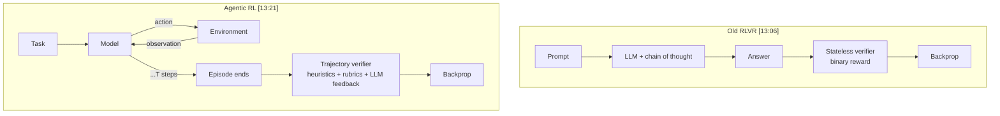
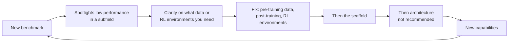
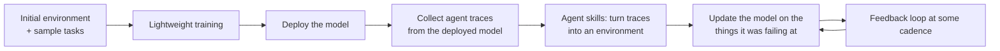
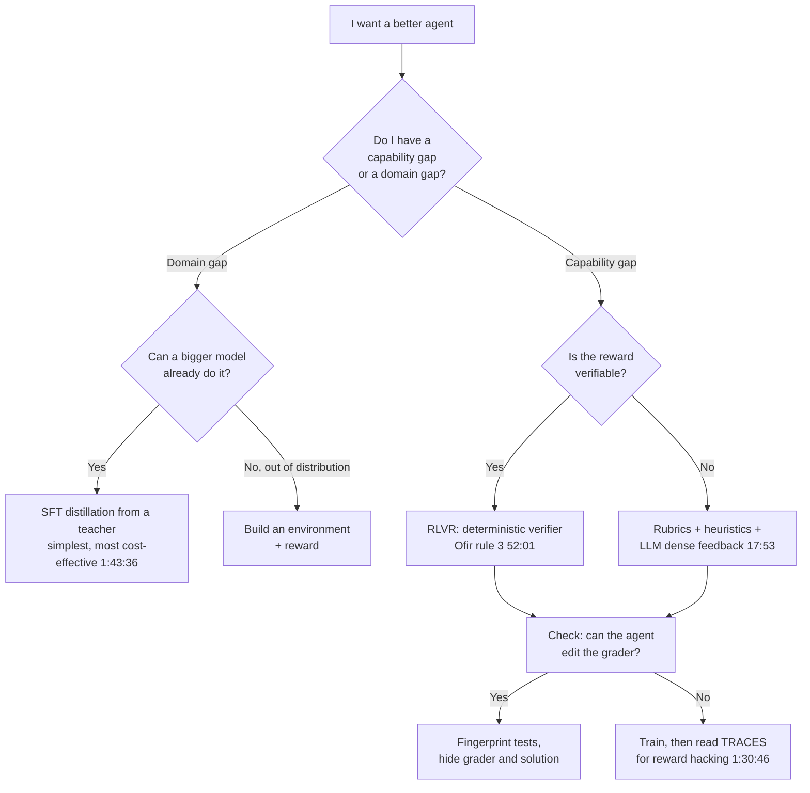

# CS-18 · RL for Agents Workshop: Training Agents, Not Just Models

> **Source transcript:** `RL_for_Agents_Workshop_-_Deep_Dive_on_Training_Agents_with_RL_and_Open_Source.txt` (English, 3,391 lines, ~1 h 54 min)
> **Domain:** agentic
> **One-liner:** Four talks plus a panel on the open-source stack for training agents with RL — why the rollout loop changed, how benchmarks saturate and how to build ones that don't, recursive language models as a scaffold that trains, and Will Brown's claim that *evals and environments are the same object*.
> **Prerequisites:** CS-06, CS-10, CS-13, CS-17

---

## 0. Executive summary

- **The unit of training moved from the model to the agent**: the old RLVR loop was prompt → answer → binary reward with a **stateless verifier** and **minute-scale rollouts** `[13:06]`; the agentic loop is a task, **T environment-interacting steps**, an episode end, and verification of the **whole trajectory** `[13:21]` `[13:46]` — with rollouts that can run **hours** `[14:17]`.
- **Credit assignment is the unsolved core problem.** With T turns, hundreds of tool calls and up to hundreds of thousands of tokens, "it's not kind of super clear at what step in that process the model perhaps made the key insight or made some errors" `[15:30]`. **Process rewards** (labelling every step) **"hasn't proved scalable"** `[15:50]`.
- **Benchmarks are a perishable asset** `[35:13]`: they always saturate — **usually within a year or two, sometimes within two months** `[35:35]`. SWE-bench launched at **~1.5% top accuracy** `[37:52]` and now sits at **93.9 on SWE-bench Verified** `[38:01]`.
- **Ofir Press's three rules** `[50:12]`: correlate with real-world usefulness; launch near **0–1% accuracy, not 40%** (40% means the labs already know about that capability) `[50:58]` `[51:10]`; and make answers **deterministically verifiable — "I don't really like LLM as a judge right now"** `[51:59]` `[52:01]`.
- **A benchmark that measures a budget beats one that measures raw capability**: AlgoTune gives the model **$1 to make a program run faster**, and **cheaper models sometimes beat frontier models** because they get more iterations while a frontier model burns its budget on one candidate `[43:00]` `[44:26]`.
- **Recursive language models (RLMs)** are a thin layer over an LM with a REPL, where sub-LM calls are **functions inside the REPL** `[59:55]` `[1:00:15]`. The point is that *"the only tool that a language model should have access to is a coding tool and all other tools should be embedded inside of this coding environment"* `[1:01:30]`. RLM is **not** a sub-agent proposal and **not** context-offloading-to-a-file `[58:40]` `[58:47]`.
- **Will Brown's central claim: "evals and environments are the same thing"** `[1:13:28]` — not similar, not adjacent. An environment is **tasks + harnesses + metrics** `[1:16:15]`, where metrics are reward functions, **tasks play the role of the dataset**, and **harnesses play the role of the agent** `[1:16:36]` `[1:16:39]`.
- **Synthetic worlds transfer**: Prime Intellect reuses Tau-bench's engine logic but rewrites all data, and finds that **training on the synthetic environment transfers to the real one** — training on library, tech support and a fitness gym produced **uplift on telecom** `[1:27:41]` `[1:28:10]`.
- **Reward hacking is found in the traces, not the score**: the rollout viewer exists so you can "understand and interact with the tool calls and the prompts" and find "some reward hacking backdoor where your eval is like not actually capturing these things" `[1:30:40]` `[1:30:46]`. Zapier's automation bench on the platform hit reward hacking in earlier iterations and **fixed the benchmark** in response `[1:33:09]`.
- **The practical default is still SFT distillation**: "if you're on Twitter too much, you just think RL is the only game in town, but in reality, most people, especially enterprises, are doing SFT distillation... it is very powerful" `[1:43:29]` `[1:43:36]`.

---

## 1. The problem this lecture solves

Lewis Tunstall's title states the thesis: **"we're going to be training agents, not just models"** `[0:02]`. Three interface shifts got us here `[0:17]`: ChatGPT made the **chat UI** the dominant way to interact with a model `[0:24]`; Cursor made **tab autocomplete** the interface `[0:49]`; and **Claude Code** introduced "a very complex multi-agent system, not just giving you answers which then you would go and implement yourself, but actually going ahead and doing the implementation semi-autonomously" `[1:00]` `[1:12]`.

At Hugging Face, the speaker reports the practical consequence: **"in the past 6 months most of us very quickly shifted from writing a lot of our own code in open source libraries to now generating a lot of code with agents"** `[1:24]` `[1:28]`.

The evidence that this is not just hype:

| Evidence | Detail | Anchor |
|---|---|---|
| **METR task-horizon plot** | 50% success rate relative to a human baseline, plotted in hours against date; frontier models now do tasks a skilled human would take **half a day or a bit longer**; **doubling roughly every 4 to 7 months** | `[2:15]` `[2:43]` `[2:58]` |
| **Cursor** | Autonomous agents building a web browser | `[3:31]` |
| **Anthropic** | A whole bunch of parallel Claude instances working together to build **their own C compiler** | `[3:38]` |
| **Hugging Face** | Wrapping Claude in custom scaffolding to try to **automate the speaker's own job** (fine-tuning open models) — with context engineering and dedicated tools it beat vanilla Claude Code, and it managed **multi-day training runs** continuously | `[4:20]` `[4:47]` `[5:12]` |
| **Kimi K2.6** | Asked to optimize quant-model inference on a Mac, chose to write it in **Zig** (heavily underrepresented in training data), ran for **12 hours**; baseline was **LM Studio** | `[5:55]` `[6:20]` `[6:30]` |

**Why open models matter here, and the three reasons to train your own** `[7:01]`:

1. **Size and serving.** Kimi K2.6 is a **trillion parameters** and "is probably going to blow up your Mac Mini" `[7:09]`. Open local-agent projects — **Hermes Agent, Open Claw, Pie** — have reached **300K and 100K GitHub stars** far faster than Transformers did `[7:24]` `[7:36]`, driven by privacy (not sending sensitive conversations to OpenAI or Anthropic) `[7:47]`.
2. **Cost.** **Opus 4.7 is 1.5x more expensive than 4.6** `[8:40]`. Cursor post-trained its own model, **Composer**, comparable in performance to GPT-5.4 or Opus but **significantly cheaper to run** `[9:09]`. The H company released a strong computer-use model small enough to run locally `[9:34]`; Chroma built a much cheaper search agent `[9:45]`. "People are flexing how many tokens they burn every day" — if you burn a billion tokens a day, you want them cheap `[9:56]`.
3. **Domain specialization.** The **jagged intelligence frontier** `[10:21]`: models great at mathematics and suddenly dumb at something else. Allen AI trained **Dr. Tulu** by extending RL "from just using binary rewards to using **rubrics**", producing a very strong **7–8B** deep-research model `[11:22]` `[11:29]` `[11:31]`. The speaker expects science to be the next specialization frontier, because "it seems highly unlikely that a single model is able to fully grasp the whole breadth of science" `[11:52]` `[11:56]`.

---

## 2. Definitions & mental models

| Term | Definition (source's words) | Why it matters |
|---|---|---|
| **RLVR** | Reinforcement learning from **verifiable rewards**; "the dominant paradigm that most of open source has focused on" `[12:09]` | Popularized by **DeepSeek R1** with binary rewards `[12:21]` |
| **Stateless verifier** | "It just takes in inputs, gives you outputs" `[13:08]` | The old-world assumption that breaks with multi-step rollouts |
| **Rollout / episode** | Task → T steps interacting with an environment → episode ends → verify the trajectory `[13:28]` `[13:46]` | The unit of training is now a trajectory, not an answer |
| **Environment** | Tasks + an execution backend + state management + a reward mechanism `[17:07]` `[17:10]` `[17:18]` `[17:31]` `[17:53]` | The reusable asset for eval and RL alike |
| **Scaffold / harness** | The scaffolding around a static model that elicits capability `[27:02]` | Lewis marks it with a **question mark** — Noam Brown says scaffolds get washed away by scale `[16:49]` |
| **Credit assignment** | Working out **which step** in a long trajectory produced the insight or the error `[15:30]` | The reason long-horizon RL is hard |
| **Process reward** | Labelling **every single step** rather than only the outcome `[15:44]` | "So far this hasn't proved scalable" `[15:50]` |
| **Recursive language model (RLM)** | A thin layer over an LM with access to a REPL, where sub-LM calls exist as **functions in the REPL** `[59:55]` `[1:00:15]` | Makes tool calls first-class primitives instead of JSON calls |
| **Context rot** | Feed a model lots of context and "all of a sudden it makes very stupid decisions" `[1:04:52]` | The failure RLM's length generalization avoids |
| **Deterministic verifier** | A check expressible as equality/algorithmic code, not an LLM judgement `[52:01]` | Press's third rule for building benchmarks |
| **Perishable asset** | "Benchmarks are a perishable asset" — they always saturate `[35:13]` | The reason a benchmark pipeline must be continuous |
| **Sim-to-real gap** | The requirement that "the harness that you are deploying it into be the harness you can train it in" `[1:33:46]` | Forces eval inside your production harness |
| **Reward hacking** | Exploiting a weakness in benchmark design to get a high score `[26:26]` | The reason evals must be adversarially robust to the agent |
| **Data flywheel** | Invert "where does your data come from?" into "where is your system running?" `[1:34:49]` `[1:34:54]` | Bootstraps evals from production traces |

### The mental model: what changed in the RL loop



Three consequences the source draws: rollouts go from **minutes to hours** `[13:12]` `[14:17]`; the step count makes **credit assignment** unclear `[15:30]`; and because the agent has terminals, bash, code and sandboxes, the eval becomes **hackable by the agent** `[26:16]` `[26:23]`.

---

## 3. Core content, decomposed

### Band A — The open-source training stack

#### 3.1 The four things you need `[16:10]`

**What the source says.** To train agents you need four things, one of which is marked uncertain:

| # | Component | Source's description | Anchor |
|---|---|---|---|
| 1 | **Environments** | Provide the ability for the model to interact dynamically with a system that has some notion of state | `[16:15]` |
| 2 | **Training frameworks** | "Which make that easy to do" | `[16:24]` |
| 3 | **Evals** | "Tell us if we're making progress on a particular domain" | `[16:27]` |
| 4 | **Scaffolds (question mark)** | Emerged as "a very interesting way of eliciting capabilities from existing models" | `[16:33]` |

**Analyst note:** the question mark on scaffolds is the workshop's most honest moment and it recurs. Noam Brown of OpenAI is quoted as saying scaffolds "are going to die, they're just going to get washed away by scale" `[16:49]`. Lewis's own position is that in the current paradigm they are "a pretty important way to kind of improve the performance of our existing agents" `[16:55]`. Alex Wang later dissolves the question entirely — see §3.7.

#### 3.2 Anatomy of an environment `[17:03]`

Four universal components `[17:03]`:

| Component | Examples given | Anchor |
|---|---|---|
| **Tasks** | "The things that you want your agent to be able to do" | `[17:13]` |
| **Execution backend** | A sandbox to run code; the browser; a bash terminal | `[17:18]` `[17:21]` `[17:24]` |
| **State management** | A database (monitoring queries, file changes); for a coding agent, something like running inside open code and editing files | `[17:31]` `[17:34]` `[17:43]` |
| **Reward assignment** | Historically binary; **"now much more common is a mix of heuristics plus potentially rubrics with other LLMs giving that kind of dense feedback to the policy"** | `[17:53]` `[18:00]` |

**Analyst note:** the move from binary to dense rubric+heuristic rewards is the single most consequential infrastructure change described in the talk, and it is stated almost in passing. It is what makes non-verifiable domains (deep research, support conversations) trainable at all — the same mechanism Dr. Tulu used at `[11:22]`.

#### 3.3 Where environments live, and why there is no winner `[18:20]`

Three kinds of location `[18:20]`:

| Category | Named examples | Anchor |
|---|---|---|
| **Building frameworks** | Nvidia **NeMo Gym**; **Prime Intellect `verifiers`**; Meta's framework (transcript renders this as "OpenM"); "a fairly large list" | `[18:41]` `[18:41]` `[18:46]` |
| **Environment hubs** | Prime Intellect's **environment hub**; **Open Rewards by General Reasoning** (described as very new); Hugging Face's neutral, agnostic **Spaces** | `[19:06]` `[19:09]` `[19:22]` `[19:30]` |
| **Training frameworks** | Many; for very large models you typically bring in **Megatron from Nvidia** | `[22:34]` `[22:59]` |

**Analyst note:** the transcript renders Meta's framework as "OpenM"; CS-17 (which covers the GAIA 2 talk by the same organisation) names Meta's framework **ARE**, and the agentic-eval workshop names **OpenEnv** as an environment format alongside Harbor. The rendered string is ambiguous — do not treat "OpenM" as the verified name without checking.

The source's own conclusion: **"We don't have this kind of single reference framework. It's basically pick whatever is best for your use case"** `[23:06]` `[23:09]` — and this diversity is judged healthy because the frameworks learn from each other `[23:13]` `[23:17]`.

#### 3.4 Asynchronous training and the "in flight" weight update `[20:13]`

**What the source says.** The modern RL paradigm is to make things **as asynchronous as possible**, with two degrees of asynchronicity `[20:16]` `[20:22]`:

**Degree one — decouple generation from training.** Inference engines continuously generate rollouts from the current policy; trainers update the policy. The old synchronous loop waited for rollouts, then optimised, then updated weights, then rolled out again — which "creates a lot of very big bubbles in your training because if I have one rollout that takes a very long time to terminate, then my whole batch is basically blocked until this rollout finishes, and therefore there's a lot of idle time for all the other GPUs" `[20:57]` `[21:01]` `[21:07]`.

**Degree two — update while generating.** With long-horizon agent rollouts the bubble problem gets far worse, so updates now happen **in flight**: as soon as the buffer reaches a certain degree of staleness, "you can just update the weights, and this means that your generators can basically switch out the KV cache in the middle of generating, which adds some **off-policyness** to the training, but typically doesn't hurt overall performance" `[22:13]` `[22:17]` `[22:21]` `[22:25]`.

**Attribution:** the source credits **Mistral's "Magisterial" tech report** as "one of the first to recognise this and visualize it", with a diagram showing policies updating in flight rather than terminating first `[21:42]` `[21:48]` `[22:02]` `[22:05]`.

**Analyst note:** "Magisterial" is almost certainly a transcription of **Magistral**, Mistral's reasoning-model report. Verify before citing the report by name; the substance of the claim (in-flight weight updates trading off-policyness for GPU utilisation) is unambiguous in the transcript.

#### 3.5 Why evaluating agents is harder, per Lewis `[23:30]`

Three named problems:

1. **Public benchmarks saturate extremely quickly** `[23:55]`. The Epoch AI plot shows most benchmarks — especially traditional language benchmarks — saturating in **6 months to a year**, so "it's hard to actually get any additional signal if your reference model is already saturated" `[24:05]` `[24:13]`. The response is **harder evals**: **SWE-bench** and, more recently, a benchmark the transcript calls **"Post-training Bench"**, which asks whether models can fine-tune open models to beat a **human baseline** — "for now they're still much, much worse than the human baseline" `[24:26]` `[24:31]` `[24:26]` `[24:46]`.
2. **Open models overfit to public benchmarks** `[24:55]`. Kimi looks state-of-the-art on a benchmark, but on new benchmarks "they tend to underperform relative to the proprietary models" `[25:09]` `[25:14]`. The consensus explanation: OpenAI and Anthropic "have spent many years building a large set of internal evals and environments they can use to really calibrate their models" `[25:21]` `[25:26]`.
3. **Agent evals are reward-hackable.** Old benchmarks were single-turn and easy to grade; agent evals "typically have terminals, like you can run bash, you can run code, sandboxes", and agents "are able to basically get very high scores just by exploiting a weakness in the benchmark design" `[26:08]` `[26:17]` `[26:29]`. The root cause is historical: the community built evals for **capability**, not "adversarially robust to the agent itself trying to hack the environment" `[26:37]` `[26:45]`.

**The actionable message** `[25:44]`:

> "You should really have your own evals internally that are relevant for the task you care about, and don't just rely on looking at a bar plot where you say, 'Okay, all the metrics go up. This is the best model for my task.' You really have to be able to test it yourself."

#### 3.6 Scaffolds and test-time compute `[27:02]`

Three families of scaffold `[27:12]`:

| Family | Mechanism | Anchor |
|---|---|---|
| **Parallel** | Generate **n rollouts** from the model; aggregate or reject bad ones → **best-of-n** | `[27:20]` `[27:26]` `[27:32]` |
| **Sequential** | Generate rollouts, revise them, generate a new sequence, and so on | `[27:36]` |
| **Recursive self-aggregation** | Brings the best of both — parallel and hybrid scaling in the **same scaffold** | `[27:45]` `[27:51]` |

Evidence cited: applying it to **Gemini** gives significant gains over a single-turn rollout `[27:58]` `[28:02]`; **OpenAI** used a scaffold to derive "a pretty new interesting result in theoretical physics", with an internal scaffold version of a GPT model generalizing a hard set of equations "which probably only a handful of humans in the world actually can verify" `[28:16]` `[28:25]` `[28:32]`.

**The key training insight** `[28:46]` `[28:55]`: scaffolds have mostly been applied on top of a **static** model. But if you **train** the agent with the scaffold — the scaffold itself acting as an environment — you get "dramatically better performance" `[29:01]` `[29:05]` `[29:10]`. The community is "still fairly early on and haven't really got very good recipes" for this `[29:28]` `[29:32]`.

**Analyst note:** this is the hinge between CS-17's eval world and CS-18's training world. In CS-17, Mahesh says the environment you grade in can also be the environment you RL in. Here Lewis says the *scaffold* can serve as the environment. Both reduce to: the outer loop is trainable, not fixed.

#### 3.7 Three gaps open source should close `[29:38]`

| # | Gap | Source's criticism | Anchor |
|---|---|---|---|
| 1 | **Open environments** | "Most of them thus far tend to be sort of **toys**" — games and simplified tasks, versus frontier labs presumably using "full replicas of Excel, full replicas of enterprise tools" | `[29:53]` `[29:58]` `[30:11]` |
| 2 | **Open recipes** | Pre-training recipes existed (All Mo, Small LM, Intellect, Image Tron) and post-training recipes too, but in the current era "most of the information we get is kind of distilled through **Chinese tech reports**" which "tend to miss many of the actual super important details when it comes to implementing yourself"; what is missing is a recipe showing real-world generalization, not just **AIME** scores | `[30:33]` `[30:47]` `[30:51]` `[31:05]` |
| 3 | **Long-horizon capabilities** | Task horizon doubling every 4–7 months, "tackled by the labs that are really training large models, again mostly in China, for now"; for the individual AI developer "there's still lots of open questions on how we can do long horizon RL" | `[31:26]` `[31:38]` `[31:47]` |

---

### Band B — Ofir Press: benchmarks as the source of everything

#### 3.8 The benchmark cycle `[33:24]`

**The three facts that open the talk** `[33:10]`: "If you want to make honey, you need bees. If you want to make a wall, you need bricks. And if you want to make AI, you need benchmarks."

The causal loop `[33:26]` `[34:22]` `[34:29]` `[34:39]` `[34:41]` `[34:52]` `[34:58]` `[35:00]`:



Evidence for the loop: SWE-bench showed language models aren't good at programming `[33:43]`; GSM8K five years ago showed they weren't good at math word problems `[33:49]`.

**"Benchmarks are a perishable asset"** `[35:13]`. They take a long time to build and "we kind of hope that the benchmark will live on forever, but it's just never the case — even when you build the toughest benchmark you can think of, it always gets saturated, **usually within a year or two, if you're lucky**... **sometimes it happens within two months, if you're not very lucky**" `[35:24]` `[35:35]` `[35:41]` `[35:43]`.

**The call to action** `[35:50]`: it does not matter whether your job is pre-training, mid-training, post-training, RL or architecture — "you should always be thinking of a benchmark that really excites you, and you really want to work towards" `[35:59]` `[36:02]`.

#### 3.9 Five stages of benchmarking `[36:32]`

| Stage | What it measures | Example benchmark | Status | Anchor |
|---|---|---|---|---|
| **1** | **School exams** — word problems | **GSM8K** ("Ophir had five apples and Ben had three...") | Saturated | `[36:36]` `[36:38]` |
| **2** | **College exams** across math, science, many topics | **MMLU** | Saturated ~3–4 years ago | `[37:01]` `[37:03]` |
| **3** | **Human evals** — e.g. questions from a first programming class ("program the Fibonacci sequence in Python") | — | Saturated ~3 years ago | `[37:12]` `[37:15]` `[37:20]` `[37:27]` |
| **4** | **Tasks a human solved over a few days** — real-world work | **SWE-bench** (first, or one of the first); **Commit Zero** | SWE-bench paradigm nearing saturation | `[37:32]` `[38:37]` |
| **5** | **Tasks that can be verified but nobody has ever done** | Claude writing a **C compiler in Rust** (Nicholas Carlini); "rewrite the Linux kernel in Go" | Just beginning | `[39:20]` `[39:27]` `[39:35]` `[39:52]` |

**Stage 3→4 detail:** moving away from exams "and into real-world work that people have done" `[37:46]`.

**Stage 4 detail:** SWE-bench's **top accuracy was around 1.5%** at release and the team "thought it would take a really, really long time to saturate it" `[37:52]`. Recently **Anthropic scored 93.9 on SWE-bench Verified** `[38:01]` `[38:04]`. **SWE-bench multilingual and SWE-bench multimodal** are to launch "in the next month" and have not been saturated `[38:06]` `[38:08]`.

**Commit Zero** (Cornell Tech, not the speaker's) `[38:37]` `[38:41]`: take a full Python repo, keep **all the function signatures**, empty out the contents of every function, and ask the model to re-implement the whole repository — with unit tests to check correctness `[38:46]` `[38:50]` `[38:52]` `[38:56]`. Work that "would take a team of humans probably a few years sometimes to solve" `[39:06]` `[39:08]` `[39:11]`.

**Stage 5 detail:** the criterion is verifiability *without* precedent. A C-to-Rust compiler "as far as I know... was never written before in Rust" `[39:35]` `[39:40]`; rewriting the Linux kernel in Go is "something that's verifiable" but never done `[39:52]` `[39:55]` `[39:59]`.

**Analyst note:** stage 5 is the epistemically interesting one. Stage 4 benchmarks risk contamination because the human solution exists somewhere; stage 5 tasks are verifiable but unperformed, which removes the lookup path entirely. That is a contamination answer, not just a difficulty answer.

#### 3.10 Three benchmark case studies `[40:58]`

**Crit Point** `[40:58]` `[41:00]` — "incredibly complex, but it's really easy to explain":

| Aspect | Detail | Anchor |
|---|---|---|
| Construction | Assistant professors of physics think of a recent paper of theirs and a question they would assign a **first-year PhD student** | `[41:04]` `[41:07]` `[41:10]` `[41:15]` |
| Anti-contamination | Questions must be **changed so they don't match anything in their actual published research** — "because if we take something from the published research, the language model might have been trained on it or it could find it online" | `[41:23]` `[41:25]` `[41:29]` |
| Verification | Answers are a **number or an equation**; math equivalence checking against the correct answer | `[41:44]` `[41:46]` `[41:48]` `[41:51]` |
| Calibration finding | **PhD-student-written questions were too easy** and were answered by all existing models — so they went to professors; even the professor questions "are now becoming solved pretty quickly" | `[42:14]` `[42:16]` `[42:21]` `[42:26]` |
| Adoption | Tracked by **Artificial Analysis**; "a lot of the big labs are working on it" | `[42:04]` `[42:06]` |

**AlgoTune** `[42:33]` `[43:56]` — capability **bounded by a budget**:

- **~150 programs**: Python's **gzip**, NumPy's **QR decomposition**, NetworkX **pagerank**, **AES encryption**, plus a lot of math, physics and computer-science code `[42:39]` `[42:41]` `[42:45]` `[42:48]` `[42:50]` `[42:52]`.
- The prompt: **"you have $1 and you have to make this program run faster"** `[43:00]` `[43:02]`. The model writes code, is told whether it improved or was slower or failed to compile, and iterates `[43:05]` `[43:08]` `[43:10]` `[43:12]`.
- **Two checks**: correctness — a **held-out set of inputs** run through the generated code compared against the reference implementation from the Python library or NumPy `[43:22]` `[43:26]` `[43:40]` `[43:43]` `[43:47]`; and speed `[43:28]`. Grade = **average speedup** across programs `[43:33]` `[43:36]`.
- Difficulty rationale: "you have to actually take code that humans have optimized — Python's gzip functionality has probably been worked on for more than a decade — and then you give that code to a model and you ask them to make it even faster" `[44:01]` `[44:04]` `[44:08]`.
- **The budget changes the ranking** `[44:26]` `[44:32]` `[44:35]`: "sometimes we see cool things that **cheaper models actually do better than frontier models** because they have more opportunities to iterate on their ideas, whereas a frontier model might just generate one kind of candidate solution and then totally run out of budget" `[44:38]` `[44:39]` `[44:42]` `[44:44]` `[44:47]` `[44:49]` `[44:51]`. **GPT-5.2 was top**; Opus 4.5 "didn't have as many opportunities to iterate, so it doesn't do as well" `[44:56]` `[45:01]` `[45:03]`. Trajectories are browsable `[45:06]`.

**Code Clash** `[45:12]` `[45:14]` — long-horizon competition:

- **Seven arenas**; the example shown is **Robot Rumble** `[45:21]` `[45:31]`. Two players (blue and pink) each control a team of robots which "must move along the grid and try to attack the other robots"; **each robot has 5 HP**; you must kill the other team while keeping yours alive `[45:45]` `[45:47]` `[45:50]` `[45:52]`.
- Players do not use a keyboard — **each writes a script** that decides how the robots act `[45:36]` `[45:38]` `[45:41]`. This is a format used in undergrad competitions and as a company job-interview exercise `[45:59]` `[46:04]` `[46:12]`.
- **One agent per side**: GPT writes the pink player's code, Anthropic writes the blue player's `[46:19]` `[46:24]` `[46:26]` `[46:30]`. They compete, then each receives the **log of what happened** turn by turn, and is asked to improve its code `[46:35]` `[46:37]` `[46:39]` `[46:42]`.
- **15 rounds**; every model plays every other model; final ranking is **ELO** `[46:50]` `[46:54]` `[47:04]` `[47:06]`.
- Why it is long horizon: "you have to read these massive logs, and you have to play 15 rounds, and you have to edit your code, and then edit again, and again, and again" `[47:09]` `[47:11]` `[47:13]` `[47:15]`.
- **It discriminates where SWE-bench could not**: "at the time we built this, Code Three Coder and Sonnet 4.5 had pretty similar SWE-bench scores, but when you put them up against each other in Code Clash, it really showed that **Sonnet was a much stronger model** because these tasks were just so much tougher" `[47:38]` `[47:42]` `[47:44]` `[47:48]` `[47:51]`.

**The four failure modes Code Clash surfaced** `[48:12]`:

| Failure | Source's words | Anchor |
|---|---|---|
| Cannot abandon a failing strategy | "even the very best models struggle to recover after losing rounds... when they have kind of a strategy they want to go with, even if you tell them that it's not really working, they kind of just want to keep on doing it" | `[48:12]` `[48:16]` `[48:20]` `[48:23]` |
| Codebase entropy | "code bases managed by models in Code Clash become extremely messy over time. They just create main1.py, main2... they just create so many files and it's really hard to maintain" | `[48:29]` `[48:31]` `[48:33]` |
| Cannot read its own logs | "the agents struggle to interpret logs or derive meaningful insights about their performance" | `[49:04]` `[49:07]` |
| Acts without measuring | "the worst thing we saw is that **models make changes without assessing their effects**" | `[49:14]` `[49:16]` |

**Human gap:** the best human-written solution beat the best agent (Claude 4.5/4.6 at the time) "like **a thousand rounds in a row**" `[49:45]` `[49:49]` `[49:51]` `[49:53]`.

**Why an artificial benchmark is still worth building** `[48:41]` `[48:43]`: "nobody's actually going to become more economically productive because they have a better Code Clash model, but through this kind of intermediate thing of playing this game, we're actually discovering a lot of weaknesses in these models that we can analyze and use to improve them, and they will become better in the real world, too" `[48:51]` `[48:55]` `[48:57]` `[48:59]` `[49:00]`.

#### 3.11 Three rules for building benchmarks `[50:12]`

| # | Rule | Detail | Anchor |
|---|---|---|---|
| 1 | **Correlate with real-world usefulness** | "My way of saying that I don't really like IQ testy benchmarks. I like benchmarks that kind of mimic or are a real-world task" | `[50:18]` `[50:22]` `[50:24]` `[50:26]` |
| 2 | **Make it as challenging as possible** | "If you launch a benchmark and it's **40% accuracy at launch**, that probably means that you're targeting a capability which all the big language model builders are already aware of" — "start at **0% or 1%**, find something that nobody has tried training for" | `[50:58]` `[51:07]` `[51:10]` `[51:12]` `[51:39]` `[51:41]` |
| 3 | **Answers simple to deterministically verify** | "I don't really like LLM as a judge right now... they sometimes prefer their own outputs. They're not very accurate or robust... don't be lazy. Just think about it more until you figure out how to have a deterministic verifier. **Sometimes it seems impossible, but usually you can find one.**" | `[51:59]` `[52:01]` `[52:04]` `[52:39]` `[52:44]` `[52:48]` `[52:52]` |

**The framing for rule 2** `[51:20]` `[51:25]`: "The point of a benchmark is to kind of be a map that shows us a North Star, how do we get to the next frontier of AI. It's a map, and we should start at zero."

**The calibration window** `[53:06]` `[53:09]` `[53:13]` `[53:15]` `[53:18]` `[53:20]`: don't launch something that takes 20 years, "you don't want something that within 2 months will get to 75% but you also don't want something that will be stuck at zero for 5 years cuz then people will just get tired of your benchmark". "Building a benchmark is really hard cuz you have to make it hard but not way too hard."

**"Don't be nice to the models when you're building a benchmark. Just be very tough."** `[52:58]` `[52:59]`

**Open questions** `[53:43]` `[53:54]` `[54:03]` `[54:13]`: how to find more verifiable tasks that are currently unsolved (stages 4 and 5); and once those saturate, **what does stage 6 look like** — "it's really tough for me to imagine what that would look like".

---

### Band C — Alex Wang: recursive language models as a trainable scaffold

#### 3.12 What an RLM actually is `[59:55]` `[1:00:15]`

**The definition** `[59:55]` `[1:00:00]` `[1:00:05]` `[1:00:07]` `[1:00:15]`:

> A recursive language model is **a very thin layer on top of a language model that has access to some kind of REPL** — Python, Bash, IPython, whatever — and within this REPL your language model has access to **sub-language-model or recursive-language-model calls that exist as functions inside of this REPL**.

Context offloading and storing the prompt inside the REPL are "equally as important" `[1:00:36]` `[1:00:39]`.

**Two things RLM explicitly is not** `[58:40]` `[58:43]` `[58:47]` `[58:50]`:

| Not this | Why the distinction matters |
|---|---|
| **Not a proposal of sub-agents** | "Sub-agents have existed before RLMs" `[58:45]` |
| **Not a proposal to offload context into a file** | Claude Code and Codex could already do this as a "trick" to avoid a long context; a Claude Code instance "is never actually going to look at the entire code base at once... it's not going to fit in context" `[58:54]` `[59:04]` `[59:23]` `[59:29]` `[59:31]` |

**Why the REPL-function design matters** `[1:00:43]` `[1:00:52]` `[1:00:55]` `[1:00:58]`: it **forces all tool calls, including sub-agent calling, to be first-class primitives inside your coding environment**, as opposed to JSON tool calling `[1:01:05]` `[1:01:07]` `[1:01:09]`. The maximal version of the claim `[1:01:30]` `[1:01:32]` `[1:01:33]` `[1:01:36]`:

> "The only tool that a language model should have access to is a coding tool, and all other tools should be embedded inside of this coding environment."

This "very abstract minimalist design" is carried forward in all their RLM implementations `[1:01:40]` `[1:01:43]` `[1:01:46]`.

**Analyst note:** this is the cleanest available answer to Lewis's question mark on scaffolds. An RLM is not a scaffold bolted onto a model — it is a **minimal, uniform interface** under which everything else becomes a library call. That is why the line between "model" and "scaffold" blurs, which is the next point.

#### 3.13 The model/scaffold boundary is fuzzy, by construction `[1:02:03]`

**What the source says.** Asked whether scaffolds matter or whether Noam Brown is right that scale washes them away `[1:02:17]` `[1:02:19]`, the answer is that **"the line between what a language model is and what a scaffold is is very fuzzy"** `[1:02:22]` `[1:02:25]` `[1:02:27]`.

The functional argument `[1:02:29]` `[1:02:32]` `[1:02:42]` `[1:02:43]` `[1:02:45]` `[1:02:47]` `[1:02:50]`: treat the language model as a function, and the scaffold as a function **composed** with it — then "an RLM will look suspiciously like a language model to you", because the abstract definition of a model is just "a function mapping text to some semantically meaningful transformation of that text" `[1:02:55]` `[1:02:57]` `[1:02:58]` `[1:03:02]` `[1:03:04]`.

**Analyst note:** this is a definitional move with a practical payoff. If scaffold-composition preserves the type, then scaling and scaffold design are not competing research programmes — they are the same programme, and you should design models "so that they can use all of the capabilities that are sort of native to their architecture" `[1:03:15]` `[1:03:19]` `[1:03:22]` `[1:03:25]` `[1:03:29]`.

#### 3.14 Long context: why RLM gets length generalization for free `[1:03:47]`

**What the source says.** The field scaled context windows **4K → 16K → 128K → 1–2 million** over the past one to two years `[1:04:08]` `[1:04:10]` `[1:04:13]` `[1:04:15]` `[1:04:17]`. Two problems:

1. **Systems-level** limitations of scaling a transformer to those windows `[1:04:31]` `[1:04:33]`.
2. **A data issue** `[1:04:38]` `[1:04:41]` `[1:04:43]` `[1:04:47]`: "most data does not naturally occur or naturally happen at certain context lengths", which produces **context rot** — "you feed your language model lots and lots of context and all of a sudden it makes very stupid decisions" `[1:04:52]` `[1:04:54]` `[1:04:56]` `[1:04:58]` `[1:05:00]`.

**The RLM result** `[1:05:08]` `[1:05:10]` `[1:05:13]` `[1:05:16]` `[1:05:18]` `[1:05:21]` `[1:05:24]`: the paper shows **length generalization naturally comes out of the RLM design**, "because in some sense each individual language model call never actually has to see beyond a certain context window length".

**The framing worth quoting** `[1:05:28]` `[1:05:32]` `[1:05:38]` `[1:05:42]` `[1:05:44]` `[1:05:46]` `[1:05:48]` `[1:05:50]` (attributed to a blog by someone the transcript renders as **Raymond Whitecamp**, "not written by me"): RLMs "are a way to use tool calls and the existing kind of reasoning paradigm that we got through RL-style training and basically merge them into something that is meaningful. So in some sense we can **start scaling tool use natively within the models**."

#### 3.15 QED Nano: reasoning beyond the context window `[1:06:40]`

**What the source says.** The **QED Nano** paper, which Lewis co-authored, builds a small language model to solve very difficult math questions `[1:06:43]` `[1:06:46]` `[1:06:57]` `[1:07:00]`. The trick is **iterative refinement of its own reasoning** `[1:07:06]` `[1:07:07]` `[1:07:10]`:

| Standard reasoning model | QED Nano |
|---|---|
| Single model samples **one very long reasoning trace** `[1:07:21]` `[1:07:29]` `[1:07:32]` | The model **summarizes its own reasoning traces as it goes**, then continues off the **summarized/compacted** trace to produce an even longer one `[1:07:44]` `[1:07:46]` `[1:07:49]` `[1:07:52]` |
| Bounded by the model's context window `[1:07:34]` `[1:07:36]` `[1:07:38]` | Reaches a final answer the model otherwise **would not be able to solve** `[1:07:59]` `[1:08:01]` |

**The generalization** `[1:08:09]` `[1:08:12]` `[1:08:15]` `[1:08:18]` `[1:08:20]`: "it is reasonable to expect that models can actually reason well beyond their context windows if you chain together model reasoning calls beyond a single model call."

**Why this motivates RLM** `[1:08:26]` `[1:08:27]` `[1:08:32]` `[1:08:35]` `[1:08:36]` `[1:08:41]` `[1:08:43]` `[1:08:46]` `[1:08:48]` `[1:08:51]` `[1:08:54]`: coding capability with embedded sub-calls lets an RLM "chain together multiple language model calls or sub calls in somewhat of a more interesting way, described or written through code, to do different reasoning patterns and reason for longer."

**The benchmark it should win** `[1:08:58]` `[1:09:00]` `[1:09:03]` `[1:09:07]` `[1:09:09]` `[1:09:11]` `[1:09:14]` `[1:09:16]` `[1:09:18]` `[1:09:20]` `[1:09:23]` `[1:09:25]`: **Long CoT / "long chain of thought"**, where problems form a **reasoning graph** and the model must solve each node and traverse the graph to a final answer — "one of these benchmarks where I think RLMs, if they're trained properly, can actually do very very very well".

#### 3.16 The design goal: models that build their own scaffolds `[1:09:31]`

**What the source says.** Test-time compute methods — **best-of-n**, **iterative refinement** — currently exist as external scaffolds. The goal is that models "natively do this thing": "we don't actually really want to build these like one-off scaffolds or sampling strategies for these models. In some sense, we want the model themselves to have the capability of implementing these strategies on their own" `[1:09:37]` `[1:09:38]` `[1:09:40]` `[1:09:42]` `[1:09:45]` `[1:09:47]` `[1:09:50]` `[1:09:53]` `[1:09:54]` `[1:09:56]` `[1:09:58]`.

The reframing of "agent" `[1:10:13]` `[1:10:17]` `[1:10:20]` `[1:10:22]` `[1:10:23]` `[1:10:26]` `[1:10:28]` `[1:10:31]`:

> "RLMs are sort of this deviation from the standard agentic view of like a human engineer designs the agent that solves the task. I think in some sense, what we actually want is a **language model to design its own execution flow or 'agent'** to solve a more interesting and complex task."

**The predicted endpoint** `[1:11:23]` `[1:11:25]` `[1:11:28]` `[1:11:31]` `[1:11:33]` `[1:11:36]` `[1:11:38]` `[1:11:41]` `[1:11:43]` `[1:11:46]` `[1:11:48]`:

> "You can imagine in the future, these super high thinking — like GPT-6 x high — is actually going to be sort of this thin RLM-like scaffold on top of an existing model that can do super, super long reasoning, where actually when you train the model, in some sense, **you're only still training the base, let's say, 1 million context window model, that can reason for a billion tokens**."

**Analyst note:** this is the talk's real training claim, and it is easy to miss under the architecture talk. If the outer loop is a program the model writes, you train the **base** model on a context window you can afford, and get unbounded effective horizon at inference. That directly addresses Lewis's "long-horizon capabilities" gap at `[31:26]` — you do not need to train on million-token rollouts if the recursion is expressible in code.

**Open problems, in the source's own list** `[1:12:03]` `[1:12:06]` `[1:12:08]` `[1:12:09]` `[1:12:12]` `[1:12:14]` `[1:12:17]` `[1:12:19]`: there are "a lot of directions here that are open problems", and the training strategies involved were explicitly deferred to the panel `[1:11:55]` `[1:11:57]` `[1:11:58]` `[1:12:00]`.

---

### Band D — Will Brown: evals and environments are the same object

#### 3.17 The claim `[1:13:28]`

**What the source says.** The talk is framed as "perhaps slightly controversially, but hopefully by the end actually not so much so":

> "**Evals and environments are the same thing.** They're not similar, they're not adjacent to each other, they're like actually the same thing." `[1:13:28]` `[1:13:31]` `[1:13:33]` `[1:13:34]` `[1:13:36]` `[1:13:38]` `[1:13:40]`

**Why it is a useful claim, not a rhetorical one** `[1:13:45]` `[1:13:46]` `[1:13:48]` `[1:13:52]` `[1:13:55]` `[1:13:56]` `[1:13:59]` `[1:14:01]`: if environments are "fully an RL thing", then you do not think about them as a general abstraction **until you are doing RL** — but building a system involves optimizing the harness, tuning prompts, selecting a model, and running evaluations long before any RL happens. Treating them as one object "gives you a lot of flexibility in iterating on multiple parts of your system in parallel where you're not having to kind of maintain multiple versions of these things for every different part of the pipeline" `[1:14:18]` `[1:14:21]` `[1:14:26]` `[1:14:27]` `[1:14:29]` `[1:14:32]` `[1:14:34]`.

**The purpose of an eval, stated plainly** `[1:15:26]` `[1:15:30]` `[1:15:32]` `[1:15:35]`:

> "The goal of the eval is to describe via examples what your system with code and prompts should do on a range of tasks according to metrics that you care about."

And the operational test `[1:15:07]` `[1:15:09]` `[1:15:13]` `[1:15:15]` `[1:15:18]` `[1:15:20]` `[1:15:22]`: you want confidence that your system does what you want, and that a change you make is "either improving or harming or maintaining the performance of your system along the axes you care about."

**The stance on evals as artifacts** `[1:15:45]` `[1:15:48]` `[1:15:50]` `[1:15:51]` `[1:15:56]` `[1:15:59]` `[1:16:00]` `[1:16:02]`: these are **disposable, personal** evals — "not an eval you're going to try to show everybody as the coolest new eval. It's more of an eval that you personally want your system to be able to do very well."

**Analyst note:** contrast this with CS-17, where the whole argument is for public, durable, disputable benchmarks. Both are right, and they are different objects: CS-17's benchmarks are *infrastructure for the field*; Will's environments are *infrastructure for one system*. Confusing the two produces either benchmarks nobody can compare against or evals that leak your product.

#### 3.18 The three-part anatomy, and why each part maps to something you already know `[1:16:15]`

| Environment part | What it plays the role of | Anchor |
|---|---|---|
| **Tasks** | "Kind of play the role of the **data set**" | `[1:16:36]` `[1:16:37]` |
| **Harnesses** | "Play the role of the **agent or the system or the tool call interfaces**" | `[1:16:39]` `[1:16:41]` `[1:16:44]` |
| **Metrics** | "In the RL context, **reward functions**" — also scoring functions, rules, pass-fail criteria, **rubrics**; "all interchangeable essentially" | `[1:16:24]` `[1:16:27]` `[1:16:30]` `[1:16:33]` |

**What this unification buys you** `[1:16:47]` `[1:16:50]` `[1:16:53]`: the same three-part object is useful not only for RL and evals but also for **synthetic data**, **prompt optimization**, and **ablations of different models you might want to use** `[1:16:55]` `[1:16:58]` `[1:17:00]`. The model-selection questions named explicitly `[1:17:03]` `[1:17:05]` `[1:17:08]` `[1:17:11]`: "Should I change out Opus for Sonnet? Should I use Haiku? Should I use GPT-5.4, 5.4 mini, or nano? Is Gemini useful for my task?"

The stated goal is "the trade-off between **cost, speed, and performance** as tuned as possible, especially if you're running these systems at scale" `[1:17:23]` `[1:17:25]` `[1:17:27]` `[1:17:28]`.

**The problem this solves** `[1:18:15]` `[1:18:17]` `[1:18:18]` `[1:18:21]` `[1:18:23]` `[1:18:25]` `[1:18:28]` `[1:18:29]`: "there's a lot of systems that just don't have evals period, that really should have evals period, and these systems don't necessarily know when to change out a model or should they update the prompt. People are kind of stuck in this setting where they have to kind of like **vibe check** things."

**"Environments kind of unlock optimization"** `[1:18:35]` `[1:18:36]`. The diagnosed reason people skip evals `[1:18:41]` `[1:18:43]` `[1:18:44]` `[1:18:47]`: they think of it as "not actionable. It's like, 'Oh, I evaluate my system. Now what?'" — and manually rewriting a prompt or swapping a model "is not enough to get people as a force of function over the hump of 'I'm going to go build evals'" `[1:18:51]` `[1:18:53]` `[1:18:55]` `[1:18:57]` `[1:18:58]` `[1:19:00]`.

#### 3.19 The `verifiers` library and the minimal example `[1:19:09]` `[1:19:11]`

**What the source says.** Prime Intellect's `verifiers` "allows you to kind of create an environment, whether for the environments hub or just locally, to encapsulate tasks, harnesses, and datasets" `[1:19:15]` `[1:19:16]` `[1:19:17]` `[1:19:20]` `[1:19:23]`.

The minimal worked example `[1:19:24]` `[1:19:28]` `[1:19:30]` `[1:19:31]` `[1:19:33]` `[1:19:35]` `[1:19:37]` `[1:19:39]` `[1:19:40]` `[1:19:42]` `[1:19:44]` `[1:19:45]`:

| Part | Here |
|---|---|
| **Harness** | "Trivial. It's just a single-turn like chat completion style answer, where the model will be given a prompt from this dataset in the question column" |
| **Metric** | Correct answer — "an explicit check, very verifiable, very deterministic: is the exact output equal to what we had" — appropriate for a math problem where the answer is parsed in some format |
| **Rubric** | "The function into a rubric, which is just an object for doing this sort of scoring" |
| **Environment** | "We plug these things all together and we call this an environment" |

**The new default pattern in progress** `[1:19:57]` `[1:19:59]` `[1:20:01]` `[1:20:09]` `[1:20:11]` `[1:20:13]` `[1:20:15]` `[1:20:21]` `[1:20:24]` `[1:20:26]` `[1:20:28]` `[1:20:32]` `[1:20:35]` `[1:20:37]` `[1:20:38]` `[1:20:40]` `[1:20:42]`: after a year and a half of patterns, tool-call and harness and skills conventions have "stabilized a little bit", so they are introducing a proposed default — "thinking of the **task set and the harness very explicitly and composing them together with automatic rules for determining whether they do fit together**."

**The design space, which is wider than terminal benchmarks** `[1:20:44]` `[1:20:46]` `[1:20:48]` `[1:20:50]` `[1:20:52]` `[1:20:54]` `[1:20:56]` `[1:21:00]` `[1:21:02]` `[1:21:03]` `[1:21:04]` `[1:21:07]` `[1:21:08]` `[1:21:10]` `[1:21:12]` `[1:21:15]` `[1:21:17]` `[1:21:19]` `[1:21:20]` `[1:21:22]` `[1:21:23]`:

| Harness shape | When you want it |
|---|---|
| **Harbor** format | "A very popular format for encapsulating these task sets... what people use for most benchmarks nowadays that are in the **terminal format**" — agent harness running in a terminal, sandboxed, **test cases run at the end** |
| **User simulator** | Benchmarks where an LLM plays the user |
| **Synthetic backend / MCP servers** | Tool calls interacting with something running as a lightweight process |
| **Trivial harness / third-party agent libraries** | Cases that need no CLI agent at all |

**Analyst note:** Harbor appears in CS-17 as well (named by Mahesh as "one of the popular formats", used by Terminal Bench). The two independent confirmations make Harbor the safest environment-format name to cite in this KB.

#### 3.20 Tau-bench as the reference environment, and the synthetic-worlds experiment `[1:23:53]`

**The reference environment** `[1:23:59]` `[1:24:01]` `[1:24:03]` `[1:24:05]` `[1:24:07]` `[1:24:11]` `[1:24:14]` `[1:24:16]` `[1:24:17]` `[1:24:19]` `[1:24:20]`: a **telecom agent** doing technical support, where "the world is simulated by some like database in the back end that is like records"; **the user is simulated by an LLM** with a **script**, and the agent interacts with that user.

**Why this shape matters commercially** `[1:24:24]` `[1:24:27]` `[1:24:28]` `[1:24:30]` `[1:24:32]` `[1:24:34]` `[1:24:36]`: it is closer to "the sorts of LM systems that people are often building in practice" — agents that interface with end users for a company's app or tool.

**The abstraction argument** `[1:24:39]` `[1:24:41]` `[1:24:44]` `[1:24:47]` `[1:24:49]` `[1:24:51]` `[1:24:54]` `[1:24:55]` `[1:24:58]` `[1:25:00]` `[1:25:01]` `[1:25:03]` `[1:25:10]` `[1:25:11]` `[1:25:14]` `[1:25:16]` `[1:25:18]` `[1:25:19]` `[1:25:21]` `[1:25:23]`:

> "Agentic interfaces allow you to **abstract away complexity by pushing the complexity onto the agent**... think of Amazon Web Services, where there's like a bajillion things... Instead of having to do menu diving, **the menu diving is done by the agent, not the human**. The human just kind of talks about in semantic sense where they want to go."

And the reliability argument that follows `[1:25:26]` `[1:25:28]` `[1:25:31]` `[1:25:33]` `[1:25:35]` `[1:25:36]` `[1:25:38]` `[1:25:40]` `[1:25:43]` `[1:25:45]` `[1:25:46]` `[1:25:47]` `[1:25:50]`: agents are good at managing database and edge-case complexity; "the agent can backtrack much more easily. Sometimes humans will get very frustrated if they have to kind of keep backtracking. And so, we can push this onto the agent."

**The explicit anti-benchmark-chasing statement** `[1:26:01]` `[1:26:02]` `[1:26:03]` `[1:26:05]` `[1:26:08]` `[1:26:10]` `[1:26:12]` `[1:26:14]` `[1:26:16]`: "we don't want to just train on it directly. The goal of it is not to just train on exactly the tasks there. **That's like kind of cheating if the goal is to climb the benchmark.**"

**The synthetic-worlds method** `[1:26:18]` `[1:26:21]` `[1:26:23]` `[1:26:25]` `[1:26:27]` `[1:26:29]` `[1:26:30]` `[1:26:33]` `[1:26:35]` `[1:26:38]` `[1:26:39]` `[1:26:41]` `[1:26:43]` `[1:26:44]` `[1:26:47]` `[1:26:49]` `[1:26:51]`: keep the **general interface** — a domain policy, a user simulator, tools with a simulated backend — but "completely rewrite all of the tasks, all of the worlds". New worlds built: **incident response**, **daily planning**, **electric vehicle charging**, in addition to telecom, library, airline, and a gym one `[1:26:53]` `[1:26:55]` `[1:26:57]`.

**Why it is cheap to do** `[1:27:01]` `[1:27:02]` `[1:27:05]` `[1:27:07]` `[1:27:09]` `[1:27:10]` `[1:27:12]` `[1:27:13]`: "we're still using the logic from the underlying engine, but we're not using the data... we're essentially **getting the harness for free**. We're just swapping out the data pieces."

**How the generation is done** `[1:27:16]` `[1:27:17]` `[1:27:19]` `[1:27:21]` `[1:27:24]` `[1:27:25]` `[1:27:26]` `[1:27:28]` `[1:27:30]` `[1:27:31]` `[1:27:32]` `[1:27:34]` `[1:27:36]` `[1:27:37]`: they prompt a **coding agent** to write user-sim scripts and invent new synthetic tasks, constraining what it can and cannot do, then **look at its traces** to check it is doing this properly and **code-review** the output.

**The headline transfer result** `[1:27:41]` `[1:27:43]` `[1:27:45]` `[1:27:47]` `[1:27:54]` `[1:27:56]` `[1:27:58]` `[1:28:00]` `[1:28:03]` `[1:28:05]` `[1:28:07]` `[1:28:09]` `[1:28:10]` `[1:28:12]` `[1:28:14]`:

> "**We find that actually training on the synthetic one transfers to the real one.**... here we're training on the library, the tech support, and the fitness gym, and we're seeing **uplift on the telecom**."

**Analyst note:** this is the strongest empirical claim in the talk and it is exactly the opposite of benchmark-chasing. Synthetic worlds built from the same *interface* generalize to a held-out real world; the same world used as training data does not count as evaluation. The design implication is that you should build **families** of environments sharing a harness, not one environment.

#### 3.21 The stack, the metrics, and the loop `[1:28:43]`

| Element | Detail | Anchor |
|---|---|---|
| **RL run shown** | A **LoRA adapter on top of a Qwen 30B mixture-of-experts** model | `[1:28:45]` `[1:28:48]` |
| **Serving** | **Hot-swap LoRAs** on top of Prime RL, for both training and deployment | `[1:28:53]` `[1:28:56]` `[1:28:58]` |
| **Framework** | **Prime RL** — open source, **Apache 2.0**, used for all their large-scale RL training | `[1:29:00]` `[1:29:03]` `[1:29:04]` |
| **Rollout viewer** | Used for **both evals and RL rollouts** | `[1:30:30]` `[1:30:32]` |

**Why the viewer matters more than the score** `[1:30:37]` `[1:30:40]` `[1:30:42]` `[1:30:44]` `[1:30:46]` `[1:30:47]` `[1:30:50]` `[1:30:51]` `[1:30:52]` `[1:30:55]`:

> "Being able to actually not just look at the score but understand and interact with the tool calls and the prompts is very useful for understanding when your system **has a bug in it** or there is some **reward hacking backdoor** where your eval is like not actually capturing these things, and it is an **iterative process** to refine your systems to be able to sufficiently measure performance in a way that is faithful to what you actually care about."

**The abstraction goal** `[1:31:03]` `[1:31:05]` `[1:31:06]` `[1:31:08]` `[1:31:10]` `[1:31:12]` `[1:31:14]` `[1:31:16]` `[1:31:18]` `[1:31:21]` `[1:31:22]` `[1:31:24]` `[1:31:26]` `[1:31:27]` `[1:31:29]` `[1:31:30]` `[1:31:32]` `[1:31:34]` `[1:31:37]` `[1:31:40]` `[1:31:42]` `[1:31:45]` `[1:31:46]` `[1:31:48]`: "we want the interfaces for specifying what you care about to be increasingly **high-level and require less and less technical depth in terms of the algorithmics, because RL is like very complicated**" — the infra spans resource orchestration, numerics, algorithms and distributed training. The platform abstracts all of it, and evals can be **shared privately or publicly** `[1:31:50]` `[1:31:51]` `[1:31:53]` `[1:31:54]`.

**The Zapier case study** `[1:32:05]` `[1:32:07]` `[1:32:09]` `[1:32:12]` `[1:32:14]` `[1:32:17]` `[1:32:20]` `[1:32:22]` `[1:32:24]` `[1:32:26]` `[1:32:28]` `[1:32:30]` `[1:32:31]` `[1:32:33]` `[1:32:35]` `[1:32:36]` `[1:32:38]` `[1:32:39]` `[1:32:42]` `[1:32:44]` `[1:32:45]` `[1:32:47]` `[1:32:48]` `[1:32:51]` `[1:32:54]` `[1:32:55]` `[1:32:57]` `[1:33:00]` `[1:33:02]` `[1:33:05]` `[1:33:06]` `[1:33:08]` `[1:33:09]` `[1:33:12]` `[1:33:14]` `[1:33:15]`:

| Aspect | Detail |
|---|---|
| What it is | **Zapier's automation bench**, released on the platform "earlier this week" — Zapier is the pipelining layer connecting Slack, Linear, Notion and similar tools |
| What it contains | "A lot of simulated tools... spiritually similar to the Tau-bench benchmark but with a much more real... breadth of tools closer to the ones that look like what you would see in the real world for your real world agents" |
| Dual use | Usable as a benchmark **and** as a starting point for creating your own environment, which you could train on directly |
| The reward-hacking story | "They were doing a lot of these training runs to kind of poke at some of the sharp edges and they were able to **see some reward hacking come up in earlier iterations of it that they were then able to address** — things in the benchmark based on seeing how models can try to hack them" |
| The conclusion | "The loop of creating evals and training models is **not a one-and-done thing**" |

#### 3.22 Sim-to-real, and the harness you must not change `[1:33:35]`

**What the source says.** To close the sim-to-real gap, "you want to ensure that your model is going to be deployed in a setting that matches where it was trained. Which means **you want the harness that you are deploying it into to be the harness you can train it in**. Which means you also want to be able to **evaluate in this harness**" `[1:33:40]` `[1:33:43]` `[1:33:44]` `[1:33:46]` `[1:33:48]` `[1:33:49]` `[1:33:50]` `[1:33:51]`.

Named harnesses this applies to `[1:33:54]` `[1:33:55]` `[1:33:57]` `[1:33:58]` `[1:33:59]` `[1:34:02]` `[1:34:03]` `[1:34:06]`: **Claude Code, Open Code, Pie, Open Claw, Hermes** — "it's important to be able to have access to evaluations within the context of your agent harness, if you care about model optimization."

**Analyst note:** this is a concrete, checkable requirement that most teams fail. If you RL a model inside your own toy harness and then deploy it behind a different agent framework, you have changed the policy's observation and action distributions at deployment time. The rule that follows: **the harness is part of the model artifact**.

#### 3.23 The data flywheel: invert the question `[1:34:46]`

**What the source says.** "The hard part about evals is like **where does your data come from?** And I think you can kind of invert this — where it's not about 'where does your data come from' but **'where is your system running?'**" `[1:34:46]` `[1:34:47]` `[1:34:49]` `[1:34:51]` `[1:34:52]` `[1:34:54]`.

The bootstrap sequence for a personal agent with no eval at the start `[1:34:56]` `[1:34:58]` `[1:35:00]` `[1:35:01]` `[1:35:02]` `[1:35:04]` `[1:35:06]` `[1:35:07]` `[1:35:10]` `[1:35:13]` `[1:35:15]` `[1:35:17]` `[1:35:20]` `[1:35:21]`: start **logging all your prompts** — every time you use your Open Claw setup you have "some snapshot of the current state and you have some task you're giving to your agent. And this is actually a really great eval." Collect these over the course of your interaction, "and you can kind of start **bootstrapping this data flywheel** by collecting examples of what the agent is actually doing."

**The most important sentence in the section** `[1:35:32]` `[1:35:33]` `[1:35:36]` `[1:35:38]` `[1:35:39]` `[1:35:41]` `[1:35:44]` `[1:35:45]` `[1:35:48]` `[1:35:50]`:

> "The goal isn't to like train on the thinking traces of the model, it's mostly to collect the **prompts** as well as to collect the **criteria** — how did you decide whether an answer is right or wrong? ... **RL doesn't actually want to train on tokens directly. RL wants to train on example settings and it wants to have criteria for evaluating these things.**"

**The cleanest criterion: code-based merges** `[1:35:57]` `[1:35:59]` `[1:36:02]` `[1:36:03]` `[1:36:04]` `[1:36:07]` `[1:36:09]` `[1:36:11]` `[1:36:13]` `[1:36:15]` `[1:36:17]` `[1:36:20]` `[1:36:23]` `[1:36:25]` `[1:36:26]` `[1:36:28]` `[1:36:29]` `[1:36:31]` `[1:36:33]` `[1:36:35]` `[1:36:37]` `[1:36:38]` `[1:36:41]` `[1:36:43]` `[1:36:46]` `[1:36:47]` `[1:36:48]` `[1:36:50]` `[1:36:51]` `[1:36:54]` `[1:36:56]` `[1:36:58]` `[1:37:01]`:

| Step | Mechanism |
|---|---|
| Trace the harness | "Add tracing to your agent harness that will store all of your prompts for the initial snapshot" |
| Anchor the state | "Maybe it remembers the commit hash when you type your prompts" |
| Anchor the outcome | "It also ties this to when the PR was merged, what was the diff that was accepted" |
| Why it is a good label | Work with agents is usually **not one-shot**: "we're iterating on the task with the agent... we're looking at the diff, we're telling the agent more stuff... until we're like, 'Okay, it's good.' And this then is a nice snapshot where we've kind of **verified along the way in real time as a human**" |
| Corroborating signals | Automatic review tools, the **PR description**, the **comment threads** in GitHub, and the final merged diff |

**The replay mechanism** `[1:37:16]` `[1:37:17]` `[1:37:19]` `[1:37:20]` `[1:37:22]` `[1:37:24]` `[1:37:27]` `[1:37:29]` `[1:37:31]` `[1:37:33]` `[1:37:36]`: where a diff adds new test cases, "you could then kind of ensure that the old test cases were saved, **they're hidden from the initial state**, and then when you kind of give the prompt again, the new code should pass these test cases."

**The LLM-judge rule** `[1:37:38]` `[1:37:39]` `[1:37:41]` `[1:37:42]` `[1:37:44]` `[1:37:46]` `[1:37:47]` `[1:37:49]` `[1:37:52]` `[1:37:54]` `[1:37:56]` `[1:37:59]` `[1:38:00]` `[1:38:02]` `[1:38:03]` `[1:38:05]` `[1:38:08]` `[1:38:10]` `[1:38:12]` `[1:38:13]` `[1:38:15]` `[1:38:17]` `[1:38:19]` `[1:38:24]` `[1:38:26]` `[1:38:28]` `[1:38:30]`:

> "I think a way I think about LLM judges is like: if you have a context and you have a question, and you would imagine that **the vast majority of smart humans who are aware of the domain that's relevant would agree on the answer to the yes-or-no question** — these sorts of things are usually pretty reliable for judges."

Plus three operational rules: prefer a model you can judge with **cheaply, maybe locally** `[1:38:32]` `[1:38:33]` `[1:38:35]` `[1:38:37]`; use **multiple different criteria** `[1:38:39]`; and "the way you can also build robustness in judges is to have **many different individual criteria which you then aggregate together by summing or averaging**" `[1:38:41]` `[1:38:43]` `[1:38:45]` `[1:38:48]` `[1:38:49]`.

**Analyst note:** this is a genuinely useful reconciliation of the two positions in this same workshop. Ofir says "don't use LLM judges, find a deterministic verifier" `[52:04]`; Will says LLM judges are fine *if* the question is one where domain-aware humans would unanimously agree, and you build robustness by aggregating many such binary judgments. These are not in conflict: Ofir is rejecting judges for **fuzzy quality questions**, Will is endorsing them for **near-verifiable binary questions**. CS-16's rubric work (§3.21 there) is the same design.

**Proto continual learning** `[1:39:05]` `[1:39:06]` `[1:39:08]` `[1:39:09]` `[1:39:12]` `[1:39:14]` `[1:39:16]` `[1:39:18]` `[1:39:20]` `[1:39:23]` `[1:39:24]` `[1:39:27]` `[1:39:29]` `[1:39:30]` `[1:39:32]` `[1:39:33]` `[1:39:35]` `[1:39:36]` `[1:39:38]` `[1:39:40]` `[1:39:42]` `[1:39:44]` `[1:39:46]` `[1:39:48]` `[1:39:50]` `[1:39:53]` `[1:39:54]` `[1:39:56]` `[1:39:57]`:



The key property `[1:39:48]` `[1:39:50]`: you update on failures **"even if those things weren't in your previous training set"**, online, in real time, at some cadence.

**The convergence claim that closes the talk** `[1:40:05]` `[1:40:07]` `[1:40:09]` `[1:40:11]` `[1:40:13]` `[1:40:15]` `[1:40:17]` `[1:40:19]` `[1:40:22]` `[1:40:24]` `[1:40:25]` `[1:40:27]` `[1:40:30]` `[1:40:33]` `[1:40:35]` `[1:40:38]` `[1:40:40]` `[1:40:42]` `[1:40:44]` `[1:40:45]` `[1:40:47]` `[1:40:49]`:

> "The ability for models to do these sorts of tasks that are required for agents to do to make an eval **are becoming smaller** because you have more infra you can build on top of, as well as the models themselves are getting better. And so... evals should just be much easier to create. And they can be much more automatized, and you still are in the loop, but **you're in the loop at a higher level of abstraction**."

---

### Band E — Panel: what nobody has solved `[1:41:28]`

#### 3.24 The practical advice question `[1:41:48]`

Asked for the advice that works every time (not just on paper) for people starting in RL and post-training, two answers are given.

**The data engine** `[1:42:29]` `[1:42:31]` `[1:42:33]` `[1:42:34]` `[1:42:37]` `[1:42:40]` `[1:42:41]` `[1:42:42]` `[1:42:45]` `[1:42:49]` `[1:42:51]` `[1:42:53]` `[1:42:54]` `[1:42:56]` `[1:42:58]` `[1:43:00]` `[1:43:02]` `[1:43:03]` `[1:43:06]` `[1:43:07]` `[1:43:10]` `[1:43:11]` `[1:43:13]` `[1:43:15]` `[1:43:18]` `[1:43:20]` `[1:43:22]`:

> "If you want to train a small model and you have a big model and you have a set of questions... I would still call this an environment, but you're not doing it in the context of optimization. It's more of a **data engine**. You can just have it be your agent harness and you are just kind of taking as an axiom that **big models are better than small models**... taking my Kimi 2.6 traces and training them into my small local fine model is going to make it better in that distribution, maybe at the cost of worse out-of-sample performance for very different types of questions."

Note the honest cost: distribution-specific improvement traded against out-of-sample degradation `[1:43:10]` `[1:43:11]` `[1:43:13]`.

**Lewis's correction to the field's self-image** `[1:43:26]` `[1:43:29]` `[1:43:31]` `[1:43:33]` `[1:43:34]` `[1:43:36]` `[1:43:38]` `[1:43:39]` `[1:43:41]` `[1:43:42]` `[1:43:44]`:

> "If you're on Twitter too much, you just think **RL is the only game in town**, but in reality, most people, especially in enterprises, are doing **SFT distillation**, because, as you say, it's like the simplest, most cost-effective way, and I think it's a bit underappreciated — that it is very powerful."

#### 3.25 The spicy question: what if the APIs shut off? `[1:43:46]`

**The premise** `[1:43:46]` `[1:43:48]` `[1:43:50]` `[1:43:53]` `[1:43:55]` `[1:43:57]` `[1:44:00]` `[1:44:02]` `[1:44:03]` `[1:44:05]`: if all proprietary companies shut off their APIs so nobody can distill Claude, and if the Chinese labs (currently training the biggest models) also go proprietary — **is RL then the way forward?**

**The answer** `[1:44:16]` `[1:44:18]` `[1:44:20]` `[1:44:22]` `[1:44:24]` `[1:44:26]` `[1:44:28]` `[1:44:29]` `[1:44:31]` `[1:44:32]` `[1:44:33]` `[1:44:36]` `[1:44:37]` `[1:44:40]` `[1:44:42]` `[1:44:44]` `[1:44:46]` `[1:44:47]` `[1:44:50]` `[1:44:51]` `[1:44:53]` `[1:44:54]` `[1:44:56]` `[1:44:58]` `[1:44:59]` `[1:45:01]` `[1:45:03]` `[1:45:06]` `[1:45:08]` `[1:45:10]` `[1:45:12]` `[1:45:15]`:

| Point | Source's words |
|---|---|
| RL is less dependent on distillation | "One big benefit of doing RL is that it requires — it doesn't need distillation... it needs essentially like PR descriptions and like commit diffs" |
| The boundary is fuzzy | "Is that distillation if you're RLing against a commit diff? I don't know. I feel like the boundary of what counts as distillation or not is quite fuzzy" |
| Even a minimal signal suffices | "Even if it's only like Claude Code or Codex as a very productized agent where that's all you get — you don't get any traces or even intermediate tool calls, you just get the final diff that's fully approved — I think you still are making forward progress on a code base" |
| Data percolates anyway | The diff "ends up on the internet, ends up in the ecosystem... people are using open-source code bases all the time to seed these pipelines for generating new environments" |
| RL gets cheaper *and* easier | "It'll both get cheaper per token as the infra stabilizes and gets more efficient, but it'll also just get easier" |
| Practical conclusion | "A lot of people feel like right now SFT is easy to do and practical RL is hard. And I think that is going to start to change... **medium-size models are actually quite good for specific use cases after RL**, and so closing the gap with the frontier models is pretty doable for a lot of cases without too much heavy lifting" |

#### 3.26 What the closed labs have `[1:46:24]`

**The question** `[1:46:31]` `[1:46:33]` `[1:46:36]` `[1:46:38]` `[1:46:41]`: what do the frontier closed labs have that open source does not?

| Speaker | Answer | Anchor |
|---|---|---|
| **Alex** | "A lot of people say it's data. I'd imagine it's probably a little bit more than that" — not just product-usage data. "I don't think there is some crazy secret sauce that's difficult for us to imagine, but in some sense it's probably a **combination of a lot of smaller things that are harder for us to access** — maybe data, compute, kind of a common infra" | `[1:46:51]` `[1:46:54]` `[1:46:56]` `[1:47:09]` `[1:47:11]` `[1:47:12]` `[1:47:16]` `[1:47:19]` `[1:47:22]` `[1:47:25]` `[1:47:28]` `[1:47:30]` |
| **Alex** (the scaffold-fit observation) | "When you apply them, for example when we do this for RLM-style things, **the closed frontier models tend to fit the scaffold better**... none of these models have generally trained on RLM-style things... but a lot of the closed models are actually able to generalize on these scaffolds a lot better. I don't exactly know the reason why. It's one of those things where we don't directly often see it in benchmark reports, but **there clearly is something better going on internally**" | `[1:47:45]` `[1:47:47]` `[1:47:55]` `[1:47:58]` `[1:48:00]` `[1:48:02]` `[1:48:05]` `[1:48:09]` `[1:48:11]` `[1:48:32]` `[1:48:34]` `[1:48:37]` `[1:48:40]` `[1:48:42]` `[1:48:45]` `[1:48:47]` `[1:48:50]` `[1:48:52]` `[1:48:55]` |
| **Will** | "**Reward modeling is probably the sub-discipline that's probably much more mature inside of the labs.** Open infra has gotten quite good, open benchmarks and recipes have gotten quite good, architectures — they have their own little tweaks but that's not the big difference. The biggest difference is probably both that they have a lot of **environments and data sets that they've gotten really good at refining for QA**, as well as probably some more elaborate things going on in terms of **training a good reward model that can both do the verifiable and the RLHF style in tandem**" | `[1:49:03]` `[1:49:05]` `[1:49:07]` `[1:49:08]` `[1:49:10]` `[1:49:11]` `[1:49:15]` `[1:49:16]` `[1:49:19]` `[1:49:21]` `[1:49:22]` `[1:49:23]` `[1:49:26]` `[1:49:27]` `[1:49:28]` `[1:49:31]` `[1:49:33]` `[1:49:34]` `[1:49:39]` `[1:49:41]` `[1:49:44]` |

**Analyst note:** Will's answer is the most actionable single sentence in the panel for a practitioner. If the labs' real moat is a reward model that handles **verifiable and RLHF-style rewards in tandem**, then the highest-leverage open-source contribution is not another environment — it is a good dense reward model for domains where you only have heuristics.

#### 3.27 The environments industry `[1:49:57]`

**The question** `[1:49:57]` `[1:50:00]` `[1:50:02]` `[1:50:04]` `[1:50:06]` `[1:50:09]` `[1:50:12]` `[1:50:14]` `[1:50:16]`: what does an open-source environments industry look like, and who builds them — the owners of the applications, or the models? (The host notes the analogy to the dataset/annotation industry, where only companies with scale, resources **and** domain access could build their own.)

**Ofir — you can do this on a small budget** `[1:51:01]` `[1:51:07]` `[1:51:09]` `[1:51:11]` `[1:51:13]` `[1:51:15]` `[1:51:18]` `[1:51:20]` `[1:51:22]` `[1:51:25]` `[1:51:27]` `[1:51:30]` `[1:51:32]` `[1:51:35]` `[1:51:38]` `[1:51:40]` `[1:51:43]` `[1:51:45]` `[1:51:46]` `[1:51:50]` `[1:51:51]` `[1:51:57]` `[1:51:59]` `[1:52:01]` `[1:52:03]` `[1:52:04]`:

> "We have this paper called **SWE-smith**, where we automatically generated like **tens of thousands of environments for SWE-bench**, and then we actually used some **Modal credits that we got for free** to train — I think it was **32B models** — and we actually **showed an improvement on SWE-bench**. And since that there's been a lot of these papers that kind of generally find new methods to generate data, and then actually prove it on small models, and then people build on top of that."

His conclusion: "I've seen academics with very, very low budgets do really, really cool data work. So I really encourage people even on lower budgets to do data work."

**Will — three structural predictions** `[1:52:06]` `[1:52:07]` `[1:52:09]` `[1:52:12]` `[1:52:13]` `[1:52:16]` `[1:52:18]` `[1:52:20]` `[1:52:22]` `[1:52:23]` `[1:52:24]` `[1:52:27]` `[1:52:29]` `[1:52:31]` `[1:52:33]` `[1:52:34]` `[1:52:36]` `[1:52:37]` `[1:52:39]` `[1:52:41]` `[1:52:44]` `[1:52:45]` `[1:52:47]` `[1:52:49]` `[1:52:51]` `[1:52:53]` `[1:52:55]` `[1:52:57]` `[1:52:59]` `[1:53:00]` `[1:53:02]` `[1:53:03]` `[1:53:04]` `[1:53:06]` `[1:53:08]` `[1:53:10]`:

| Prediction | Detail |
|---|---|
| **Artifacts become less precious** | Benchmarks, models and datasets "become like less precious, but they become just much easier to like do the incremental step forward" |
| **Demand for tokens keeps rising** | "People want more tokens faster all the time. The amount of people who want them is going up, too. And so where are these tokens going to come from?" — possibly from **smaller specialized models**, "another way of multiplying the amount of tokens we can get in the world because there's just less compute needed per token" |
| **Domain experts get interfaces** | "Having interfaces that allow the people who know what they're doing — for let's say **accounting** — to be able to interact with it and see what's happening, and then have that expertise kind of get **compiled down into the data sets**, feels like a workable approach that then makes training models just much easier" |

Also named as an existing segment: "the **data companies that are largely selling to the labs**" `[1:52:45]` `[1:52:47]` `[1:52:49]`.

**Analyst note (outside source):** the SWE-smith claim is the panel's most concrete falsifiable number — tens of thousands of auto-generated environments, 32B models, free Modal credits, measurable SWE-bench improvement, published. Anyone evaluating whether environment construction is capital-intensive should start there.

---

## 4. Frameworks & decision procedures

### 4.1 Choosing your training method



### 4.2 Ofir Press's benchmark rubric `[50:12]`

| # | Rule | Test question | Anchors |
|---|---|---|---|
| 1 | **Real-world correlation** | Would anyone become more economically productive because of a better score here? If no, is it still exposing a weakness that transfers? | `[50:18]` `[48:49]` |
| 2 | **Challenge at launch** | Is accuracy near **0–1%**? If it is 40%, the big labs already know about this capability and you are adding nothing | `[51:10]` `[51:39]` |
| 3 | **Deterministic verification** | Can I express the answer check as equality or simple algorithmic code? If not, keep thinking until I can | `[51:59]` `[52:48]` |
| + | **Calibration window** | Not solvable in 2 months (to 75%), not stuck at zero for 5 years | `[53:13]` `[53:18]` |

### 4.3 The environment design procedure (Prime Intellect)

1. **Declare the three parts explicitly**: task set, harness, metrics `[1:16:15]`. Do not let them blur.
2. **Decide the harness shape**: Harbor/terminal+sandbox+end-of-run tests; user simulator; synthetic backend (MCP servers); or a trivial harness plugging in third-party agent libraries `[1:20:44]` `[1:21:02]` `[1:21:07]` `[1:21:15]` `[1:21:19]`.
3. **Confirm the harness you evaluate in is the harness you deploy in** `[1:33:46]`.
4. **Build a family, not a single environment** — share the engine logic, swap the data, and hold one world out for evaluation `[1:27:01]` `[1:27:41]`.
5. **Generate tasks with a coding agent under constraints**, then inspect its traces and code-review the result `[1:27:16]` `[1:27:32]`.
6. **Choose the metric layer**: deterministic check where possible; otherwise binary LLM-judge questions where domain-aware humans would agree, aggregated by summing or averaging many criteria `[1:37:54]` `[1:38:43]`.
7. **Point the same environment at every consumer**: RL, evals, synthetic data, prompt optimization, model ablation `[1:16:50]`.
8. **Read the rollouts, not the score** `[1:30:37]`.
9. **Iterate**: reward hacking found in a training run is a bug in the benchmark `[1:33:09]`.

### 4.4 The data flywheel procedure `[1:34:46]`

| Step | Action |
|---|---|
| 1 | Ship the system and **log every prompt**, with a snapshot of world state at the time `[1:35:04]` |
| 2 | Capture the **criteria**, not the reasoning traces — how did you decide right from wrong? `[1:35:36]` |
| 3 | For coding: record the **commit hash**, the merged **PR diff**, the PR description and review comments `[1:36:28]` `[1:37:07]` |
| 4 | Hide the held-out tests from the initial state; require the new code to pass them `[1:37:27]` |
| 5 | Turn the traces into an environment; train on failures **not in the previous training set** `[1:39:24]` `[1:39:50]` |
| 6 | Repeat at a cadence — this is **proto continual learning** `[1:39:05]` |

---

## 5. Worked end-to-end example

**Scenario:** you own a customer-support agent for a telecom product and you want to improve it with RL rather than just swapping models. This follows Prime Intellect's Tau-bench-derived workflow `[1:23:53]` `[1:26:18]` `[1:27:41]`.

**Step 1 — Assemble the three parts** `[1:16:15]`. Tasks = a set of support scenarios. Harness = the agent loop plus the user simulator plus the tool interfaces. Metrics = the rubric.

**Step 2 — Simulate the world.** A database of customer records, plan details and ticket state in the backend; the **user is an LLM with a script** `[1:24:14]` `[1:24:19]`. Decide the policy the agent must follow — this is the *domain policy* `[1:26:29]`.

**Step 3 — Build the family, hold one out.** Keep the engine logic; rewrite the data to create sibling worlds — **incident response, daily planning, electric vehicle charging**, plus the existing telecom, library, airline and gym worlds `[1:26:41]`. Train on library + tech support + fitness gym; **hold telecom out** `[1:28:09]`. This is what makes the transfer result meaningful.

**Step 4 — Generate tasks with an agent, then audit.** Prompt a coding agent to write **user-sim scripts** and invent new synthetic tasks with an explicit statement of what it can and cannot do. Then **read its traces** and **code-review** the environments it produced `[1:27:16]` `[1:27:28]` `[1:27:32]` `[1:27:34]`.

**Step 5 — Set the metric.** Where the outcome is checkable (did the ticket get resolved, was the right plan applied, were the correct tool arguments used), use a **deterministic check**. Where it is a conversation, decompose into **binary questions domain-aware humans would unanimously answer**, aggregate by averaging `[1:37:54]` `[1:38:43]`.

**Step 6 — Fix the harness coupling.** Confirm the harness you train in is the harness you will deploy into — Claude Code, Open Code, Pie, Open Claw or Hermes `[1:33:46]` `[1:33:54]`.

**Step 7 — Train.** The reference configuration shown is a **LoRA adapter on top of a Qwen 30B mixture-of-experts**, trained with **hot-swap LoRAs** on **Prime RL** (open source, Apache 2.0) `[1:28:45]` `[1:28:53]` `[1:29:00]`.

**Step 8 — Watch the transfer.** Expect uplift on the held-out telecom world from training on the other three `[1:28:10]`. If the held-out world improves, you have generalization, not memorization.

**Step 9 — Read the rollouts.** Open the viewer and inspect tool calls and prompts, not the aggregate score `[1:30:32]`. This is where you find the bug or the **reward hacking backdoor** `[1:30:46]`.

**Step 10 — Repair and re-run.** If a training run discovers a hack, **fix the benchmark**, not the model — this is exactly what happened with Zapier's automation bench `[1:33:09]`.

**Step 11 — Close the loop in production.** Deploy, log every prompt with its world snapshot, capture the human accept/reject decision as the criterion, and feed it back as a new environment at a cadence — proto continual learning `[1:39:05]` `[1:39:24]`.

**The decision rule that falls out:** the environment is the artifact you invest in, and it is **the same object** whether you are evaluating, training, or doing model selection `[1:13:36]`.

---

## 6. Pros, cons, exceptions

| Approach | Pros | Cons | Works when | Fails when | Cost |
|---|---|---|---|---|---|
| **SFT distillation** | Simplest, most cost-effective, very powerful `[1:43:36]`; no reward function needed | Improves in-distribution, degrades out-of-sample `[1:43:10]`; depends on a teacher you may lose access to | You have a bigger model and a set of tasks | Teacher traces are unavailable or the domain is out of distribution | Lowest |
| **RLVR with a deterministic verifier** | Cheap, reproducible, unhackable by equality checks | Only covers verifiable domains; still hackable if the grader is reachable | Coding, maths, optimisation | The task's output is language | Low per call |
| **Rubrics + heuristics + LLM dense feedback** | Makes non-verifiable domains trainable at all `[17:53]`; Dr. Tulu is the existence proof `[11:22]` | Judge cost and variance; needs many criteria for robustness `[1:38:43]` | Deep research, support conversations | A deterministic verifier exists — then it is waste | Highest per call |
| **Verifiable-with-budget benchmark (AlgoTune)** | Measures cost-efficiency, not raw capability; produces different and more useful rankings `[44:26]` | Requires a program to optimise and a held-out correctness set | You have reference implementations | No reference implementation exists | Medium |
| **Artificial long-horizon benchmark (Code Clash)** | Discriminates where SWE-bench cannot `[47:38]`; surfaces strategy-and-entropy failures `[48:29]` | No direct economic value `[48:43]` | You want to expose weaknesses that transfer | You need an economic argument for the benchmark | Medium |
| **Synthetic sibling worlds** | Harness for free `[1:27:10]`; transfers to the real world `[1:27:41]` | Only as good as the engine shared; needs agent-generated tasks audited by humans | The interface generalizes across domains | The domains differ structurally, not just in data | Low marginal |
| **Test-time scaffold (best-of-n, refinement)** | Gains without training `[28:02]` | External, one-off, not native to the model `[1:09:47]` | You cannot train | You can train — then RLM/training dominates | Inference cost |
| **RLM as a scaffold** | Length generalization for free `[1:05:16]`; trains the base 1M model to reason for a billion tokens `[1:11:48]` | Early; "haven't really got very good recipes" `[1:29:32]` | The task decomposes into programmatic sub-calls | The task needs a single long pass | Research-stage |

**Exceptions the source names:** Ofir dislikes LLM-as-judge outright `[52:04]` while Will endorses a narrow, unanimously-answerable form of it `[1:38:02]` — the reconciliation is the fuzzy/binary distinction. Synthetic-training-to-real-transfer is claimed but only for the Tau-bench family `[1:27:41]`. The scaffold question is explicitly left open by Lewis `[16:33]` and dissolved by Alex `[1:02:27]`.

---

## 7. Failure modes & anti-patterns

1. **Synchronous RL with long rollouts.**
   *Symptom:* GPU utilisation collapses; trainers sit idle. *Root cause:* one long rollout blocks the whole batch `[21:04]`. *Detection:* watch for idle time while a single rollout is outstanding. *Fix:* decouple generation from training, then update **in flight** at a staleness threshold, accepting off-policyness `[22:13]` `[22:25]`.

2. **Process rewards as the credit-assignment answer.**
   *Symptom:* an enormous labelling effort that never converges. *Root cause:* you tried to label every step in a trajectory with hundreds of tool calls `[15:44]`. *Detection:* count the labels per trajectory. *Fix:* accept trajectory-level rewards; use rubrics/hessities for density rather than per-step labels — "so far this hasn't proved scalable" `[15:50]`.

3. **Benchmark saturation as a surprise.**
   *Symptom:* your eval stops producing signal within months. *Root cause:* benchmarks are a **perishable asset** `[35:13]`; "sometimes it happens within two months" `[35:43]`. *Detection:* track headroom, not just the score. *Fix:* run a continuous benchmark pipeline; plan stage N+1 while stage N is live `[35:50]`.

4. **Launching a benchmark at 40%.**
   *Symptom:* your benchmark adds no information. *Root cause:* a capability all the big labs already know about `[51:16]`. *Detection:* look at the launch number. *Fix:* find something nobody has trained for; start at 0–1% `[51:39]`.

5. **Laundering a benchmark through an LLM judge.**
   *Symptom:* scores that cannot be reproduced and drift year over year. *Root cause:* the answer check is an LLM judgement rather than an equality `[52:01]`. *Detection:* count how many checks could be expressed as code. *Fix:* "don't be lazy... usually you can find one" `[52:48]`; where you cannot, restrict judging to binary questions domain-aware humans would unanimously answer `[1:38:02]`.

6. **Benchmark chasing in training.**
   *Symptom:* the score climbs and the product does not improve. *Root cause:* training on exactly the benchmark's tasks — "that's like kind of cheating if the goal is to climb the benchmark" `[1:26:10]`. *Detection:* does your training set overlap your eval set? *Fix:* hold a world out; build sibling worlds and verify transfer `[1:28:07]`.

7. **Deploying in a different harness than you trained in.**
   *Symptom:* the model underperforms in production despite good eval numbers. *Root cause:* the harness is part of the policy's environment `[1:33:46]`. *Detection:* compare the harness identifier at train and deploy time. *Fix:* evaluate and train inside the deployment harness `[1:34:02]`.

8. **Never reading the trajectories.**
   *Symptom:* a high score that hides a broken eval. *Root cause:* looking only at the number `[1:30:37]`. *Detection:* can you describe the tool calls in a failing rollout? *Fix:* use the rollout viewer as a first-class tool; look for reward hacking backdoors `[1:30:46]`.

9. **Treating the eval as one-and-done.**
   *Symptom:* reward hacking appears after the first training run. *Root cause:* the benchmark was not adversarially tested against the agent. *Detection:* Zapier found it exactly this way — training runs "poke at some of the sharp edges" `[1:33:06]`. *Fix:* fix the benchmark in response and re-run `[1:33:09]`.

10. **Believing RL is the only game in town.**
    *Symptom:* an expensive RL programme where distillation would have worked. *Root cause:* Twitter-driven methodology choice `[1:43:29]`. *Detection:* is your domain actually verifiable and does a bigger model already solve it? *Fix:* SFT distillation first; RL when you need out-of-distribution capability `[1:43:36]`.

11. **Assuming scaffold gains survive training.**
    *Symptom:* a scaffold that helps a static model stops helping a trained one. *Root cause:* scaffolds were applied post hoc; training changes the policy `[28:55]`. *Detection:* re-measure the scaffold after training. *Fix:* train **with** the scaffold, treating it as an environment `[29:05]`.

12. **Assuming the eval harness is a fixed outer loop.**
    *Symptom:* long-horizon capability never arrives. *Root cause:* you are waiting for a model that can hold everything in context. *Detection:* are you asking for a single long pass? *Fix:* RLM — a thin layer over a REPL that lets a 1M-context model reason for a billion tokens `[1:11:41]` `[1:11:48]`.

---

## 8. Implementation notes

**The minimal `verifiers` environment** `[1:19:15]` `[1:19:24]` `[1:19:31]` `[1:19:33]` `[1:19:40]` `[1:19:49]` `[1:19:54]`:

```
environment = dataset(tasks) + harness + rubric(metrics)

dataset column: "question"          # tasks play the role of the dataset
harness:        single-turn chat completion
metric:         exact-match correctness check
                -> deterministic, "very verifiable", for a parsed math answer
rubric:         the object that collects the scoring functions
```

**Analyst note:** the transcript describes this structure in prose and does not print source code. The block above is a reconstruction of the described shape, not a copied file — verify field and class names against the current `verifiers` documentation and the Harbor format specification before use.

**Harness shapes to choose between** `[1:20:44]` `[1:21:02]` `[1:21:19]`:

| Shape | Requirement |
|---|---|
| Harbor / terminal | Sandbox; run test cases at the end |
| User simulator | An LLM playing the user, driven by a script `[1:24:19]` |
| Synthetic backend | MCP servers or a lightweight process `[1:21:10]` |
| Trivial harness | Third-party agent libraries, no CLI agent needed `[1:21:22]` |

**Named tools and frameworks in this source** — for cross-referencing:

| Name | Role | Anchor |
|---|---|---|
| **Prime RL** | Open-source (Apache 2.0) large-scale RL training framework; hot-swap LoRAs | `[1:29:00]` `[1:29:03]` `[1:28:53]` |
| **`verifiers`** | Prime Intellect's library for authoring environments | `[1:19:09]` |
| **Harbor** | Popular task-set format for terminal benchmarks | `[1:20:44]` |
| **NeMo Gym** | Nvidia's environment-building framework | `[1:18:41]` |
| **Megatron** | Nvidia framework for very large-model training | `[22:59]` |
| **Open Rewards** (General Reasoning) | Environment hub, described as very new | `[1:19:09]` |
| **Open Claw / Open Code / Pie / Hermes / Claude Code** | Harnesses you must evaluate and train inside | `[1:33:54]` `[1:33:57]` `[1:33:59]` |
| **Modal** | Used (with free credits) for SWE-smith training runs | `[1:51:25]` `[1:51:27]` |
| **`uv tool` / `prime lab setup`** | CLI affordances for agent-assisted environment authoring | `[1:22:54]` |

**Model scale points referenced:** Qwen **30B** mixture-of-experts as the RL base `[1:28:48]`; **7–8B** for Dr. Tulu `[11:31]`; **32B** for the SWE-smith training runs `[1:51:27]`; Kimi K2.6 at **a trillion parameters** `[7:09]`.

**Context-window progression cited** `[1:04:08]` `[1:04:10]` `[1:04:13]` `[1:04:15]` `[1:04:17]`: 4K → 16K → 128K → ~1–2 million.

---

## 9. Interview-ready Q&A

**Q1. What changed in the RL loop when we moved from models to agents?**
Three things. The verifier stopped being stateless — it now judges a trajectory rather than an answer, and the reward is typically a mix of heuristics and rubrics with LLM-provided dense feedback rather than a binary correct/incorrect. The rollouts got long — from order-of-minutes to potentially hours, because the agent is spinning up containers and interacting with an environment over T steps. And credit assignment became unclear: with hundreds of tool calls and hundreds of thousands of tokens, "it's not kind of super clear at what step in that process the model perhaps made the key insight or made some errors" `[15:30]`.

**Q2. Why are process rewards not the answer to credit assignment?**
Because they require labelling every single step of every trajectory, and at agent scale that means hundreds of tool calls per episode. The workshop states plainly that this "hasn't proved scalable" `[15:50]`, while noting that some Chinese labs describe partial solutions in their tech reports `[15:58]`. The practical alternative is trajectory-level reward plus a dense reward signal from heuristics and rubrics, rather than per-step human labels.

**Q3. What are the three rules for building a benchmark?**
Ofir Press's, from his blog and this talk. First, correlate with real-world usefulness — avoid "IQ testy" benchmarks; the test is whether the task mimics real work. Second, make it as challenging as possible: launching at 40% accuracy means you are targeting a capability the big labs already know about, so start at 0–1%. Third, make the answers simple to verify **deterministically** — he does not like LLM-as-a-judge because judges prefer their own outputs and are neither accurate nor robust, and his advice is "don't be lazy, just think about it more until you figure out how to have a deterministic verifier."

**Q4. How long does a benchmark last, and what follows from that? (Trap.)**
"Benchmarks are a perishable asset" `[35:13]` — even the toughest one you can build always saturates, usually within a year or two and sometimes within two months `[35:35]` `[35:43]`. SWE-bench is the illustration: it launched with top accuracy around 1.5% and the team thought it would take a very long time to saturate, and it is now at 93.9 on SWE-bench Verified `[37:52]` `[38:01]`. The trap is treating this as a reason to be cynical. The correct conclusion is that benchmark *construction* has to be a continuous practice, and the speaker's call to action is that everyone — pre-training, post-training, RL, architecture — should have a benchmark they are personally working towards `[35:59]`.

**Q5. Ofir's stages of benchmarking — name them.**
Five. Stage 1, school exams: GSM8K word problems. Stage 2, college exams: MMLU. Stage 3, human evals like first-programming-class questions such as "program the Fibonacci sequence in Python", saturated about three years ago. Stage 4, tasks a human solved over a few days: SWE-bench first, and Commit Zero — a full Python repo with function signatures kept and bodies emptied, which the model must reimplement under unit tests. Stage 5, tasks that are verifiable but that nobody has ever done: a C compiler written in Rust, or rewriting the Linux kernel in Go. The open question is what stage 6 is, and the speaker says he cannot yet imagine it.

**Q6. Why does AlgoTune produce different rankings than capability benchmarks?**
Because it bounds capability by a **budget**: the model gets **$1** to make a program run faster, and it is scored on the average speedup achieved across about 150 real programs, subject to a correctness check against reference implementations. Cheaper models sometimes beat frontier models because they get more iterations within the budget, whereas "a frontier model might just generate one kind of candidate solution and then totally run out of budget" `[44:47]`. GPT-5.2 was top; Opus 4.5 did worse because it ran out of iterations. The general lesson is that any benchmark measuring agents should consider the budget explicitly, because a capability score with no cost axis is not a deployment-relevant score.

**Q7. What is a recursive language model, and what is it not? (Trap.)**
An RLM is a thin layer over a language model that has access to a REPL — Python, Bash, IPython — where sub-model calls exist as **functions inside the REPL** `[59:55]` `[1:00:15]`. It forces all tool calls, including sub-agent calls, to be first-class primitives in the coding environment rather than JSON tool calls `[1:01:01]`. The trap is the two things people assume it is: it is **not** a sub-agent proposal, since sub-agents predate it, and it is **not** a proposal to offload context into a file, which Claude Code and Codex could already do as a trick `[58:40]` `[58:47]`.

**Q8. Why does RLM give you length generalization?**
Because each individual language-model call never has to see beyond a fixed context window `[1:05:16]` `[1:05:18]`. The problem with simply scaling context windows — 4K to 16K to 128K to one or two million — is not only systems-level but a **data issue**: most data does not naturally occur at extreme context lengths, which produces **context rot**, where feeding lots of context makes the model "make very stupid decisions" `[1:04:38]` `[1:04:52]`. If recursion is expressible in code, the base model can stay at a context window you trained properly, and you get unbounded effective horizon at inference — the prediction is a base 1M-context model "that can reason for a billion tokens" `[1:11:48]`.

**Q9. State Will Brown's central claim and justify it.**
"Evals and environments are the same thing" — not similar, not adjacent `[1:13:28]`. The justification is operational: an environment is **tasks + harnesses + metrics**; metrics are reward functions; **tasks play the role of the dataset**; **harnesses play the role of the agent or tool-call interfaces** `[1:16:15]` `[1:16:36]` `[1:16:39]`. If environments are considered purely an RL concept, teams do not build them until they do RL — but they optimize harnesses, tune prompts, choose models and run evals long before that. One object serving all of those uses avoids maintaining parallel versions of the same thing across each pipeline stage, and it also serves synthetic data generation, prompt optimization and model ablation.

**Q10. How do you build an environment family that proves generalization rather than memorization?**
Keep the **interface** — domain policy, user simulator, tools with a simulated backend — and rewrite the data and tasks entirely, which gives you "the harness for free" `[1:27:10]`. Prime Intellect did this on Tau-bench, producing incident response, daily planning and EV charging worlds alongside telecom, library, airline and gym. Then hold one world out: training on library, tech support and fitness gym produced **uplift on the held-out telecom world** `[1:28:07]` `[1:28:10]`. Training on exactly the tasks you evaluate on "is like kind of cheating if the goal is to climb the benchmark" `[1:26:10]`.

**Q11. When is an LLM judge acceptable? (Trap.)**
This workshop contains both positions and they reconcile cleanly. Ofir Press rejects LLM-as-a-judge for benchmark answers because judges prefer their own outputs and are neither accurate nor robust `[52:39]`. Will Brown accepts a narrow form: a **binary yes/no** question where "the vast majority of smart humans who are aware of the domain that's relevant would agree on the answer" — these are "pretty close to verifiable" `[1:37:54]` `[1:38:02]`. The trap is treating these as contradictory. The discriminator is whether the judgement is fuzzy or near-unanimous: for fuzzy quality, find a deterministic proxy or do not measure it; for near-unanimous binary questions, judge it, use a cheap local model, and aggregate **many individual criteria by summing or averaging** to get robustness `[1:38:43]`.

**Q12. What does the data flywheel look like in production?**
Invert the question from "where does your data come from" to "where is your system running" `[1:34:51]` `[1:34:54]`. Start by logging every prompt with a snapshot of world state. Capture the **prompts and the criteria**, not the model's reasoning traces — "RL doesn't actually want to train on tokens directly; RL wants to train on example settings and it wants to have criteria for evaluating these things" `[1:35:41]` `[1:35:48]`. For a coding agent the cleanest criterion is a code-based merge: record the commit hash, the accepted diff, the PR description and review comments, and replay against hidden test cases. Then train on the failures — "even if those things weren't in your previous training set" — at a cadence. That is **proto continual learning**, human in the loop but at a higher level of abstraction `[1:39:05]` `[1:39:50]`.

---

## 10. Cheat sheet

```
RL FOR AGENTS — WORKSHOP DISTILLATE
=====================================================================
WHAT CHANGED  [13:06] -> [13:21]
  OLD: prompt -> answer -> STATELESS verifier -> binary reward . minutes
  NEW: task -> T env steps -> episode ends -> TRAJECTORY verifier .
       heuristics + rubrics + LLM dense feedback . rollouts up to HOURS
  Credit assignment: unclear which step mattered  [15:30]
  Process rewards (label every step): HASN'T PROVED SCALABLE  [15:50]

FOUR THINGS YOU NEED  [16:15]
  environments . training frameworks . evals . scaffolds (?)  [16:33]
  Noam Brown: scaffolds die to scale  [16:49]
  ENVIRONMENT = tasks + execution backend + state mgmt + rewards  [17:07]
  Rewards today: heuristics + rubrics + LLM dense feedback  [17:53]

ASYNC RL  [20:13]
  decouple generation from training -> kill the batch bubble  [21:04]
  update IN FLIGHT at a staleness threshold; generator swaps KV
  cache mid-generation -> some off-policyness, usually harmless [22:17]
  (credited to Mistral's "Magisterial" tech report  [21:42])

WHY AGENT EVALS ARE HARD (Lewis)  [23:30]
  benchmarks saturate in 6-12 months  [23:55]
  open models overfit to public benchmarks  [24:55]
  agent evals have terminals/bash/sandboxes -> REWARD HACKABLE  [26:16]
  => HAVE YOUR OWN INTERNAL EVALS  [25:44]

SCAFFOLDS  [27:12]: parallel (best-of-n) . sequential (revise) .
  recursive self-aggregation. TRAIN WITH the scaffold -> big gains [29:05]
---------------------------------------------------------------------
OFIR PRESS — BENCHMARKS                                  [33:10]
  "Benchmarks are a perishable asset"  [35:13] -- saturate in 1-2 yrs,
  sometimes 2 MONTHS  [35:35]
  STAGES: school exams (GSM8K) -> college exams (MMLU) ->
    human evals (Fibonacci in Python) -> days-of-human-work
    (SWE-bench, Commit Zero) -> NEVER-DONE-BUT-VERIFIABLE
    (C compiler in Rust / Linux kernel in Go)  [36:32] [39:20]
  SWE-bench: 1.5% at launch -> 93.9 on SWE-bench Verified  [37:52] [38:01]
  THREE RULES  [50:12]
    1 correlate with real-world usefulness (no IQ tests)
    2 launch at 0-1%, NOT 40%  [51:10]
    3 DETERMINISTIC verifier -- "don't be lazy"  [52:48]
    window: not 75% in 2 months, not 0% for 5 years  [53:13]
  Crit Point . AlgoTune ($1 budget, ~150 programs, GPT-5.2 top) .
  Code Clash (7 arenas, 15 rounds, ELO, 5 HP robots)
  Code Clash failures: won't abandon failing strategy . codebase
  entropy (main1.py) . can't read own logs . ACTS WITHOUT
  MEASURING EFFECTS  [48:12]-[49:16]
---------------------------------------------------------------------
ALEX WANG — RECURSIVE LANGUAGE MODELS                     [59:55]
  RLM = thin layer over an LM with a REPL; sub-LM calls are
  FUNCTIONS in the REPL  [1:00:15]
  NOT sub-agents . NOT context-offloading-to-a-file  [58:40] [58:47]
  "the only tool an LM should have is a coding tool"  [1:01:30]
  Length generalization for free: no single call exceeds its
  window  [1:05:16]. Problem it solves: CONTEXT ROT  [1:04:52]
  QED Nano: model summarizes its own CoT and continues off the
  compacted trace -> reasons past its context window  [1:07:44]
  Endpoint: train a 1M-context base model that reasons for a
  BILLION tokens  [1:11:48]
---------------------------------------------------------------------
WILL BROWN — EVALS AND ENVIRONMENTS ARE THE SAME THING  [1:13:28]
  ENVIRONMENT = TASKS (the dataset) + HARNESS (the agent) +
  METRICS (reward functions / rubrics / pass-fail)  [1:16:15]
  One object serves: RL . evals . synthetic data . prompt
  optimization . model ablation  [1:16:50]
  "environments unlock optimization"  [1:18:35]
  Harbor (terminal/sandbox/end-of-run tests) is the popular format
  SYNTHETIC WORLDS: same engine logic, all-new data -> harness for
  free  [1:27:10]. Train on library+tech support+gym -> UPLIFT ON
  HELD-OUT TELECOM  [1:28:10]
  STACK: LoRA on Qwen 30B MoE . hot-swap LoRAs . Prime RL (Apache 2.0)
  SIM-TO-REAL: train in the harness you deploy in  [1:33:46]
  DATA FLYWHEEL: log prompts + CRITERIA (not thinking traces);
  code-based merges = commit hash + accepted diff; hide the tests
  -> proto continual learning  [1:34:54] [1:39:05]
  LLM JUDGE RULE: binary, domain-aware humans would unanimously
  agree; aggregate MANY criteria  [1:38:02] [1:38:43]
---------------------------------------------------------------------
PANEL
  Default in enterprises is SFT DISTILLATION, not RL  [1:43:36]
  Closed labs' real moat: REWARD MODELING -- verifiable + RLHF
  style in tandem  [1:49:41]
  SWE-smith: tens of thousands of auto-generated environments,
  32B models, free Modal credits, improved SWE-bench  [1:51:15]
  Synthetic data improvement may cost out-of-sample performance [1:43:10]

THREE THINGS TO REMEMBER
  1 The environment is the artifact -- and it is the same object as
    your eval  [1:13:36]
  2 Launch benchmarks at 0%, verify deterministically, and never
    train on the eval  [51:10] [52:48] [1:26:10]
  3 Read the trajectories, not the score -- that is where reward
    hacking shows up  [1:30:46]
```

---

## 11. Glossary

| Term | Meaning |
|---|---|
| **AlgoTune** | Benchmark giving a model **$1** to speed up ~150 real programs, scored on average speedup subject to correctness |
| **Asynchronous RL** | Decoupling rollout generation from training, with weight updates applied in flight at a staleness threshold |
| **Calibration window** | The acceptable difficulty band for a new benchmark: not saturated in months, not stuck at zero for years |
| **Code Clash** | 7-arena, 15-round competitive coding benchmark ranked by ELO |
| **Commit Zero** | Benchmark that empties a full Python repo's function bodies and asks for reimplementation under unit tests |
| **Context rot** | Degradation when a model is fed far more context than its training distribution supports |
| **Credit assignment** | Determining which step in a long trajectory produced the outcome |
| **Crit Point** | Physics benchmark of unpublished, professor-written, numerically verifiable questions |
| **Data engine** | Running tasks through a harness and saving the traces for distillation, with no reward function |
| **Data flywheel** | Bootstrapping evals from logged production prompts and human acceptance criteria |
| **Deterministic verifier** | An answer check expressible as equality or simple algorithmic code |
| **Environment** | tasks + harness + metrics; the unit of eval, RL, synthetic data and model selection |
| **Every object here is disposable** | Will Brown's framing of personal evals as non-durable, system-specific artifacts |
| **Gym-style world** | A simulated domain (telecom, library, airline, gym, incident response, EV charging) sharing one engine |
| **Harness** | The agent loop, system, or tool-call interfaces; plays the role of the agent in an environment |
| **Harbor** | Popular format for terminal-format task sets: sandboxed agent, tests run at the end |
| **In-flight update** | Updating policy weights while a generator is still producing, swapping the KV cache mid-generation |
| **LLM-as-a-judge (narrow form)** | Binary question where domain-aware humans would unanimously agree; aggregated across many criteria |
| **Long CoT** | Benchmark structured as a reasoning graph the model must traverse node by node |
| **Perishable asset** | A benchmark; it always saturates |
| **Prime RL** | Prime Intellect's open-source (Apache 2.0) large-scale RL training framework |
| **Process reward** | Per-step labelling of a trajectory |
| **Proto continual learning** | Environment → train → deploy → harvest traces → new environment → retrain, at a cadence |
| **QED Nano** | Small model that summarizes its own reasoning trace and continues off the summary |
| **Recursive language model (RLM)** | Thin layer over an LM with a REPL in which sub-LM calls are functions |
| **Reward hacking** | Exploiting benchmark design to score highly without doing the task |
| **RLVR** | Reinforcement learning from verifiable rewards |
| **Sim-to-real gap** | The mismatch between an isolated training harness and deployment |
| **Stage 5 benchmark** | Verifiable task that nobody has ever performed |
| **Stateless verifier** | Old-style verifier taking inputs and returning an output, with no trajectory awareness |
| **SWE-smith** | Method that auto-generated tens of thousands of SWE-bench-style environments |
| **`verifiers`** | Prime Intellect's library for authoring environments (tasks + harness + rubric) |

---

## 12. Cross-references

- **Builds on:**
  - CS-06 — offline vs online evals; the data flywheel at `[1:34:54]` is the production-side version
  - CS-10, CS-11 — benchmark design, saturation and contamination; Ofir's five stages and three rules are the applied case
  - `../04-rag/CS-13-testing-rag-retrievers-hands-on.md` — component-level metrics, which sit inside the environment's metric layer
  - [CS-17](CS-17-agentic-evaluations-workshop.md) — the sibling workshop: GAIA 2's ARE environments, Mahesh's hard/soft verifiers and environment-first procedure, and Harbor. CS-17 §3.22 and CS-18 §3.22 are the same design decision from the eval side and the training side.
- **Leads to:**
  - CS-19 — fine-tuning a coding agent for continual learning; the concrete implementation of the loop in §3.23
  - CS-20, CS-21, CS-22 — production evals, observability and alerting, where the traces at `[1:30:37]` become an operational system
- **External (named in the source):** Prime Intellect (`verifiers`, environment hub, Prime RL), Harbor, Nvidia NeMo Gym and Megatron, Meta's environment framework (transcript: "OpenM"), Open Rewards by General Reasoning, SWE-bench / SWE-bench Verified / SWE-bench multilingual / SWE-bench multimodal, Commit Zero (Cornell Tech), Crit Point, AlgoTune, Code Clash, Long CoT, QED Nano, Dr. Tulu (Allen AI), SWE-smith, Tau-bench, Zapier automation bench, METR, Epoch AI, Artificial Analysis, Mistral's "Magisterial" report, DeepSeek R1, Kimi K2.6, Qwen 30B MoE, LoRA, Modal, Hermes Agent / Open Claw / Pie / Open Code.

**Analyst note — undelivered material:** several things are announced or promised without delivery. Alex Wang defers the RL training strategies for RLMs to the panel `[1:11:55]`, and the panel does not take it up — an attendee's question intended for him is dropped when he says he did not hear it `[1:46:12]` `[1:46:21]`, so **the training recipe for recursive language models is never given**. Prime Intellect's new default environment pattern is described as "still very much in progress" and "a preview of where we're going" `[1:21:36]` `[1:21:38]`. Post-training Bench is named but not detailed `[24:31]`. Lewis's three "open recipes" gap is stated without a proposed recipe `[31:01]`. Ofir names SWE-bench multilingual and multimodal as launching "in the next month" and does not describe them `[38:06]`.

**Analyst note — naming and transcription:** the transcript is English but auto-transcribed, and proper nouns are unstable. Names appear in several spellings: Ofir Press is rendered "Ofer Press", "Ofir", "Afear" and "Ophir"; Will Brown's employer appears as "Prime Intellect", "Prim Intellect", "Primary Instinct", "private elect" and "primary"; SWE-bench appears as "SWE-bench", "SweetBench", "SWEE bench" and "SweepBench"; SWE-smith as "Sweet Smith"; Tau-bench as "Tau bench", "Tao 2", "Taobao" and "Tattoo"; Crit Point as "Point" and "Crit Point"; Mistral's report as "Magisterial". Two names are uncertain enough to flag: the Anthropic result on SWE-bench Verified is rendered as **"Methuselah"** at `[38:01]` with no model of that name otherwise identifiable, and Meta's framework is rendered **"OpenM"** at `[18:46]`. Verify both before citing. The blog author behind the RLM framing is rendered "Raymond Whitecamp" `[1:05:32]`.

