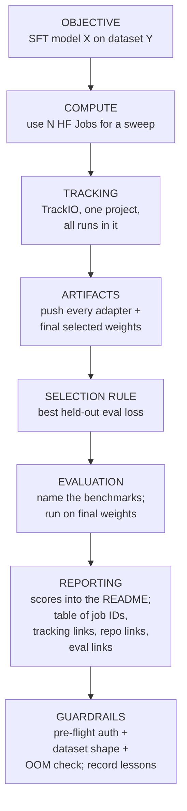

# CS-19 · Training Agents, Episode 1: Fine-Tuning a Coding Agent on Real Agent Traces

> **Source transcript:** `Training_Agents_Live_tutorial_on_how_to_fine-tune_a_coding_agent_for_continual_l.txt` (59:55, 1,502 lines)
> **Domain:** agentic
> **One-liner:** A live Hugging Face tutorial in which a coding agent — not a human — is given a contract prompt and drives an entire SFT parameter sweep on Hugging Face Jobs, while the presenter explains the masking mechanics of SFT underneath it.
> **Prerequisites:** CS-17, CS-18

## 0. Executive summary

- The session is **episode 1 of a three-part series** announced as SFT → basic RL → advanced RL with an environment `[4:01]` `[4:07]` `[4:12]`, delivered **every two weeks** `[3:36]`; the stated endpoint of the series is a working **code agent** `[12:51]`.
- **The meta-method is the actual contribution:** instead of writing a training script and launching runs by hand, the presenter gives an agent **a contract prompt** and acts as "a human operator who would be just watching the decision that the agent makes and verifying these artifacts" `[11:42]` `[11:45]`.
- The contract is explicit and complete: train **Gemma 4 2B** on a named dataset, **use multiple HF Jobs for a parameter sweep** `[8:08]`, track every run in **TrackIO** under one project `[8:13]` `[14:32]`, push **every adapter** `[8:23]`, **run evals** `[8:25]`, add eval scores to the model README `[8:27]`, and produce a table of **job IDs, TrackIO links, repo links and eval links** `[16:25]`.
- **The selection metric is held-out eval loss, not agent quality** — the agent picks "the one that is best at imitating the dataset. Not the one that is the best agent" `[39:06]` `[39:11]`. The source is explicit that agent capability is not being evaluated at this stage at all.
- **Training data is real agent traces**: sessions from **Mario Zechner's Pi harness running Claude Opus 4.5** `[9:15]` `[9:33]` `[9:39]`, containing multi-turn tool calls, thinking, and a **tree structure with branches** `[22:09]`.
- **Trace hygiene is a prerequisite**: real traces contain secrets and tokens, and the source names a tool for sanitising them before publishing `[34:09]` `[35:28]`.
- **SFT is taught from the loss up**: instruction–completion pairs with the prompt masked using **`-100` label notation** so "we won't calculate the loss on that" `[45:55]` `[46:31]`; then `apply_chat_template`, tokenize, copy input IDs, mask the user turns `[46:42]` `[47:12]` `[47:31]`.
- **Cost control is designed into the loop**: the agent runs **smoke jobs** first to test the infrastructure `[40:23]`, and the presenter says that if your agent is not doing this, "add that to a skill and encourage it, because that's going to save you dollars" `[40:28]` `[40:32]`.
- **The evaluation guidance is the most transferable lesson:** traces collected for your own use case will not line up with a public benchmark `[56:22]` `[56:27]`, so bring a **mixture** — the small benchmark for your use case *plus* a general coding or terminal benchmark to confirm you "haven't compromised its general abilities" `[56:42]` `[57:05]`.
- **The title overpromises.** The transcript is "how to fine-tune a coding agent for continual learning", but this episode delivers SFT imitation only: "we are not using reward functions, we are not using RL environments at this point" `[20:06]` `[20:09]`. Continual learning is deferred to the later episodes `[12:21]` `[12:26]`.

## 1. The problem this lecture solves

**The stated problem is the cost of getting a model to speak an agent's language.** A small open model like Gemma 4 2B "is already able to follow instructions", already has chat formatting `[19:08]` `[19:10]` `[19:14]` — "but it's not able to follow the same tool calls that the agent would be generating, or it's not able to basically imitate what the agent should be generating" `[19:18]` `[19:21]` `[19:24]`. So it cannot be dropped into a harness like Pi and given a task such as "fix this failing release workflow in this repo" `[32:30]` `[32:33]`.

**The second problem is the labour of the training loop itself.** Training a model is a multi-step pipeline — generate Python for each step, run each training with different parameters, compare on an evaluation set, inspect the live metrics, pick the winner, package adapters, run benchmarks, publish a model card `[11:02]` `[11:08]` `[11:12]`. The session's answer is to move **one step up the abstraction layer** `[10:45]` `[10:48]`: you "just give a prompt to the agent directly, defining the outcome that we would like to generate" `[11:18]` `[11:21]`, and "it's not us that are considering every number in the live metrics in TrackIO, but instead it's the agent itself which is selecting the best set of parameters" `[15:38]` `[15:44]` `[15:49]`.

**The third problem is money.** HF Jobs means the runs cost real money `[20:36]` `[20:41]`, which is why the contract requires the agent to **orient itself and confirm everything is correct before it spends** `[21:36]` `[21:40]` `[21:43]`.

**Analyst note:** this is a different answer to CS-18's question about scaffolds and environments. CS-18 asks how to train an agent. CS-19 asks how to *run the training* — and answers that the operator of the training pipeline should itself be an agent with a tested set of skills. Framed that way, skills are the environment for the trainer.

## 2. Definitions & mental models

| Term | Definition | Why it matters |
|---|---|---|
| **Trace** | A saved agent session containing multi-turn tool calls, thinking, and a tree of branches from earlier turns `[22:09]` `[22:15]` `[22:20]` | The training unit in this episode; the object the whole pipeline consumes |
| **Contract prompt** | The set of constraints handed to the agent — model, dataset, sweep tool, tracking tool, artifact destinations, eval set, and required outputs `[16:44]` `[18:28]` | It is what turns a vague "train a model" ask into a verifiable pipeline |
| **Skill** | A markdown-ish instruction file the agent reads to learn *how* to do a task in your preferred way `[24:08]` `[26:08]` | The mechanism by which a human's tested procedure is injected into the agent's context |
| **HF Jobs** | Hugging Face's remote GPU job runner, used here because the agent runs on a laptop and has no local GPU `[24:53]` `[25:01]` | Decouples the operator machine from the compute that costs money |
| **TrackIO** | Free Python + web-app experiment tracker; runs locally, no account needed, deployable on HF Spaces to share `[51:46]` `[51:55]` | The live-metrics surface the *agent* must read to pick parameters `[15:55]` |
| **Held-out eval loss** | Loss computed on the portion of the dataset not used for training; used here as the model-selection proxy `[14:50]` `[38:51]` | Makes "best model" objective and automatable — but it selects the best *imitator*, not the best agent `[39:11]` |
| **SMOKE job** | A short run whose only purpose is to verify the infrastructure, permissions and memory fit before the real sweep `[40:23]` `[40:25]` | The cheap step that protects the expensive step |
| **Masking (`-100`)** | Replacing the label IDs of prompt tokens with `-100` so they contribute no loss `[45:55]` `[46:03]` | The single mechanism that distinguishes SFT from continued pre-training `[45:25]` |
| **`apply_chat_template`** | Transformers method that converts a structured message list into the model's chat format before tokenisation `[46:40]` `[46:45]` | The standard hook where the harness's tool-call format is re-expressed in the training data |
| **Emulation ceiling** | The limit that SFT cannot exceed the quality of the traces it imitates `[49:26]` `[50:06]` | Sets expectations: SFT narrows a model, it does not lift it past its teacher |
| **Sweep** | A set of runs varying hyperparameters — here **learning rate, LoRA rank and sequence length** `[38:22]` `[38:25]` | Sequence length is singled out because traces are long `[38:28]` |

**The mental model, drawn:**

```mermaid
flowchart TB
    subgraph Operator["What the human does"]
        P[Write the contract prompt] --> V[Watch decisions<br/>verify artifacts]
    end
    subgraph Agent["What the agent does  [13:53]"]
        O[Orient: resolve model ID,<br/>check dataset shape,<br/>confirm push + Jobs authorisation]
        O --> S[Smoke-test the infra]
        S --> SW[Create sweep over lr,<br/>LoRA rank, seq length]
        SW --> J[Schedule HF Jobs]
        J --> M[Read TrackIO live metrics]
        M --> B[Select best run<br/>by held-out eval loss]
        B --> A[Push every adapter<br/>+ final weights]
        A --> E[Run Inspect AI evals:<br/>HumanEval, MBPP]
        E --> R[Write model card +<br/>link table into the repo]
    end
```



## 3. Core content, decomposed

### 3.1 The series shape and the session contract `[4:01]` `[6:22]`

**What the source says.** The presenter opens by framing the series before the content: at least three sessions `[4:01]`, roughly "one on SFT like we're doing now, let's say a basic RL one, and then maybe an advanced RL one with an environment" `[4:09]` `[4:12]` `[4:14]`. Cadence every two weeks `[3:36]`, possibly rescheduled for India time `[3:39]`, recorded for asynchronous viewing `[3:46]`. The presenter explicitly says a complete beginner can follow: "if you've come into that you've never trained a model before, that's great" `[2:38]` `[2:40]`, with the caveat "there'll be some work" `[2:58]`.

**The meta-framing** `[6:12]` `[6:18]` `[6:22]` `[6:24]` `[6:26]` `[6:28]` `[6:30]`:

> "We're talking about training agents, right? They're the output of these sessions, but we're also going to be using agents. So it is a kind of meta aspect of the course... We won't necessarily be writing scripts. We'll be using agents to do those."

**The team named on the call** `[4:42]` `[4:44]` `[4:58]` `[5:00]`: **Sergio Paniego**, developer advocacy, co-presenting; **Quentin Galludec**, "maintainer of TRL", present in chat and described as "probably the best person to answer these questions that you could really get" `[5:07]`. The host is addressed as **Ben** `[10:38]`.

**Analyst note:** having the TRL maintainer in the chat while an agent generates TRL code is not incidental — it is the failure mode this format is exposed to (see §7.5). The presenter's own hedge, "we're kind of figuring it out a little bit as we go along, so bear with us" `[39:57]` `[39:59]`, is accurate.

### 3.2 The opening trace: the pipeline as a single prompt `[6:53]` `[7:39]`

**What the source says.** The whole session is reverse-engineered from one artifact: "this is the trace that this whole session is based on" `[6:53]` `[6:55]`. The prompt is minimal — "SFT train Gemma 4 2B model on this specific dataset" plus a dataset ID `[6:57]` `[7:00]` `[7:04]`. It is dropped into **Codex** `[7:11]`, with the explicit caveat that you "don't necessarily have to use any specific agent... you can just kind of use whatever you like" `[7:15]` `[7:18]` `[7:24]`.

**A concrete cost point stated before anything else** `[7:41]` `[7:43]` `[7:45]`: "Last time I did it, it actually took about **2 and 1/2 hours** and we don't have 2 and 1/2 hours" `[7:45]`. The prompt was then tweaked so it "should get the job done more quickly" `[7:51]` `[7:53]`.

**The observable benefit of the Hub format** `[6:42]` `[6:44]` `[6:46]` `[6:48]`: "if you push a trace to the hub in like a standard format, it gets rendered in this nice way. So it's really useful for us when we're trying to study them."

### 3.3 The contract, enumerated `[16:44]` `[8:03]`

The presenter calls this "the kind of contract that we presented in these prompts" `[16:44]`, and says the point is "we would like the agent to plan and to turn this high-level ask into a certain approach" `[16:46]` `[16:49]`.

| # | Constraint | Anchor |
|---|---|---|
| 1 | SFT-train a specific model on a specific dataset | `[8:03]` `[8:06]` |
| 2 | **Use multiple HF Jobs for a parameter sweep** | `[8:08]` `[8:10]` |
| 3 | Use **TrackIO**, under a specific project name | `[8:13]` `[8:15]` |
| 4 | **All runs must be in the same TrackIO project** | `[14:32]` `[14:34]` |
| 5 | Push **every adapter** to an HF repository | `[8:23]` `[14:38]` `[14:42]` |
| 6 | Push the **final weights of the selected model** too | `[14:45]` `[14:48]` |
| 7 | **Run best run by held-out eval loss** | `[14:50]` `[14:51]` |
| 8 | Run evals on the final weights — **HumanEval and MBPP** | `[8:25]` `[16:05]` `[16:10]` |
| 9 | Add the eval scores to the model README | `[8:27]` |
| 10 | Produce a table with **job IDs, TrackIO link, final repo link and every evaluation link** | `[16:25]` `[16:28]` `[16:31]` |

**The seven behaviours the contract demands of the agent** `[16:53]` `[18:41]`:

1. **Plan** — turn the high-level ask into a concrete approach `[16:46]` `[16:49]`.
2. **Verify documentation** — "we just gave the agent the model name, so Gemma 4 2B, and it should be able to turn that into the actual HF ID" `[16:59]` `[17:02]` `[17:06]`.
3. **Implement or configure its own training script** — one "that we may have in its repository" `[17:10]` `[17:13]` `[17:15]`.
4. **Run a smoke test** and **failure analysis** before the real runs `[17:22]` `[17:25]` `[17:29]`.
5. **Pre-flight the spend**: check authorisation to push the model, authorisation to use HF Jobs, that the format is correct, and that training will not produce an out-of-memory error — "everything just should be confirmed before looking for the best parameters" `[17:31]` `[17:38]` `[17:40]` `[17:44]` `[17:48]` `[17:50]`.
6. **Log and track every artifact** `[17:59]` `[18:03]`.
7. **Run an integrity check** against the evaluation set plus the benchmark evals, and **record every lesson** `[18:04]` `[18:08]` `[18:16]` `[18:18]`.

**Why the contract is shaped this way** `[20:32]` `[20:33]` `[20:37]` `[20:41]` `[20:43]` `[20:46]` `[20:47]`:

> "Since we are using HF Jobs and we are going to spend some money on running these training runs, we would like the agent to orientate itself and to be really sure about what's going to happen before it really goes and runs the runs."

**The orientation checklist, restated in the source's own words** `[20:56]` `[21:00]` `[21:07]` `[21:11]` `[21:13]` `[21:15]` `[21:18]` `[21:21]` `[21:23]` `[21:25]` `[21:27]` `[21:30]` `[21:35]`: read its skills and the prompt instructions; resolve the model to its specific HF ID; check that the dataset exists and that **its shape is the shape the training needs**; confirm authorisation to push to repositories and to run HF Jobs.

**Analyst note:** "check that the shape of the dataset is really the shape that we are going to need" `[21:15]` `[21:18]` is the highest-value clause in the contract and the easiest to omit. A schema mismatch discovered after four billed GPU jobs is the most expensive class of error in this pipeline.

### 3.4 Where the traces come from, and what has to happen to them first `[9:06]` `[22:00]` `[34:09]`

**A deliberate shortcut, stated as such** `[8:46]` `[8:47]` `[8:50]` `[9:01]` `[9:03]` `[9:06]` `[9:08]`: the ideal would be "a real-world dataset that we might have collected from our own agent traces", but collecting them "would be quite a long start to the course", so instead a public dataset of traces was used.

**The provenance** `[9:13]` `[9:15]` `[9:17]` `[9:20]` `[9:23]` `[9:26]` `[9:33]` `[9:35]` `[9:38]` `[9:41]` `[9:46]` `[9:48]`:

| Property | Value |
|---|---|
| Collected by | **Mario Zechner**, "the author of Pi, the agent harness" |
| Rationale | "That's a really good engineer and I bet the traces are really good as well" `[9:20]` `[9:23]` |
| Model | **Claude Opus 4.5** |
| Harness | **Pi** |
| Portability | "They could be any other harness and they could be any other model and they would work like this" `[9:46]` `[9:48]` `[9:50]` |

**What a trace contains** `[22:09]` `[22:15]` `[22:18]` `[22:20]` `[22:23]` `[22:26]`: a safe set of real sessions in a real repository containing "multi-turn tool calls, thinking, this tree structure with different set of branches and branches from any earlier turn" `[22:20]` `[22:23]`.

**The worked shape of one session** `[22:26]` `[22:28]` `[22:32]` `[22:34]` `[22:35]` `[22:38]` `[22:39]` `[22:42]` `[22:44]` `[22:46]` `[22:48]` `[22:52]` `[22:55]` `[22:57]` `[23:00]`:

```
user:      fix failing release workflow in this repo
assistant: fetch/read message — "let me inspect this workflow file
           and recent runs"
           -> emits a TOOL CALL
tool:      <result of that tool call returned into the transcript>
...        session continues over many turns, and is saved whole
```

**The sanitisation step** `[34:09]` `[34:11]` `[34:13]` `[34:24]` `[34:26]` `[34:30]` `[34:32]` `[34:36]` `[34:38]` `[34:41]` `[34:43]` `[34:46]` `[34:49]`: traces from real sessions can contain "some secrets or some tokens that we would like to get rid of or that we would like to modify prior to pushing that into a public dataset in the hub". The dataset may live either as a **HF dataset** or as a **HF bucket** `[34:43]` `[34:46]` `[34:49]` — and the source names a Hugging Face tool that turns discovered tokens/secrets into something safe so the data "can actually save that in public" `[35:18]` `[35:21]` `[35:30]` `[35:31]`. The dataset used in the session is stated to be already clean `[35:47]` `[35:50]` `[35:52]`.

**Analyst note:** the tool is described only as "search HF" `[35:18]` with a link on the slides and the instruction that "you can directly search for that" `[35:15]`. The transcript does not give the tool's name or command, so treat the specific mechanism as unspecified. The requirement — **sanitise before publishing** — is stated unambiguously and is the security-relevant step in this pipeline. Compare CS-16, where leakage is treated as a first-class RAG failure mode; here it is a *training-data* leak.

### 3.5 Skills: how a human's tested procedure gets into the agent `[26:05]` `[27:07]`

**What the source says.** The agent works inside a local repository that functions as its home directory `[25:49]` `[25:57]` `[26:13]` `[26:15]` `[26:17]`. In the trace, the agent "reads some skills, right? So it gets stuff into context, so that it does things in the way that we want, which is what skills tell the agent" `[24:02]` `[24:04]` `[24:06]` `[24:08]` `[24:10]`.

**The skills in the repository** `[26:05]` `[26:08]` `[26:26]` `[26:29]` `[26:38]` `[26:47]` `[26:50]` `[26:59]` `[27:02]`:

| Skill | Content | Anchor |
|---|---|---|
| **TRL skill** | Taken from existing public skills; tells the agent how to use TRL, and lets you use the repo as your home directory to reproduce the on-screen setup | `[26:08]` `[26:10]` `[26:13]` |
| **HF Jobs skill** | How to use Hugging Face Jobs | `[24:28]` |
| **TrackIO skill** | "How to use TrackIO within the script in a way that is consistent" — an observability skill | `[24:30]` `[26:47]` `[26:50]` `[26:52]` |
| **Custom SFT skill** | Guides the SFT process "in the way that we want" — it encodes the workflow and identifies the training stages | `[26:26]` `[26:31]` `[26:33]` `[26:35]` `[26:38]` |
| **Parallel environments** | Named as a skill they would come back to | `[26:59]` |
| **HF auth** | Basic Hugging Face authentication | `[27:02]` |

**Installability** `[26:20]` `[26:21]`: skills "can also be installed via the TRL CLI and via the HF CLI."

**Why the skills exist** `[27:05]` `[27:07]` `[27:11]` `[27:14]` `[27:16]`:

> "What we're doing here really is just guiding the agent in a direction that I've tested to be kind of right and most efficient."

**The maintenance model** `[27:16]` `[27:18]` `[27:20]` `[27:21]` `[27:22]` `[27:25]` `[27:27]` `[27:28]` `[27:31]` `[27:33]` `[27:36]` `[27:37]`: "As your experiments mature, you might actually want to change these... The best way to do that is usually to get the agent to update them for you." And the failure-driven use: "You can use them, for example, to record mistakes that the agents frequently make, and kind of make sure that they don't go down those routes too often."

**How the agent actually used them in the trace** `[23:48]` `[23:50]` `[23:52]` `[23:55]` `[23:59]` `[24:02]` `[24:43]` `[24:45]` `[24:47]` `[24:49]` `[24:52]` `[24:53]` `[25:12]` `[25:14]`:

1. Opens with "I'll treat this as a real training run request, not just a plan" — "does the usual kind of agent stuff" `[23:55]`.
2. "Verify the target model licenses things for launch" `[23:59]`.
3. Reads skills to get its preferred procedure into context.
4. Reads more files, finds "a specific skill that it needs to use the Hugging Face CLI to interact with the hub, and to interact with jobs" `[24:45]` `[24:47]` `[24:49]`.
5. Notes that it is running on a laptop, so "it doesn't have the computer to train a model, so it needs to go to Hugging Face Hub to get that, and it has the instructions how to do that" `[24:55]` `[24:57]` `[24:59]` `[25:01]` `[25:03]` `[25:05]`.
6. Finds a similar example added deliberately "to speed up this process so that it was a bit quicker and it will fit inside the session" `[25:12]` `[25:14]` `[25:15]` `[25:18]` `[25:20]`.
7. Confirms the TrackIO dashboard name from the prompt and the correct model `[25:21]` `[25:24]` `[25:27]` `[25:29]` `[25:31]` `[25:33]` `[25:36]`.
8. Starts defining its training script `[25:36]` `[25:38]`.

**Analyst note:** "the agent isn't going to get that knowledge into you" `[49:03]` `[49:05]` is the presenter's own caveat on this method, and it is the correct one. Skills make the agent reliable; they do not make the operator competent. The presenter's explicit prescription is to read the article and understand masking "because... without having this solid understanding of how the data looks, you might not be able to get any results from it" `[49:07]` `[49:12]` `[49:15]` `[49:17]`.

### 3.6 What the agent produced, and what it costs you in abstraction `[29:18]` `[30:16]`

**What the source says.** The agent generates a "pretty verbose, agent-written script based on the instructions and the skills that we had" `[29:47]` `[29:49]` `[29:51]` `[29:53]`. The important structural detail `[29:56]` `[29:58]` `[30:00]` `[30:02]` `[30:05]` `[30:07]`:

> "At its core, it uses TRL, and it references — it's in line with the docs of TRL. And you can see we're configuring our SFT here and then we're using an SFT trainer here. But other than that, it's a really verbose script and a lot of it has to be guided by the skills and instructions that we set."

**The presenter's own honesty about the abstraction level** `[48:28]` `[48:30]` `[48:32]` `[48:33]` `[48:36]` `[48:38]`: "in most of the video we're kind of getting the agent to do a lot of this for us. We're even using TRL, so we're two abstraction levels above this."

**Analyst note:** this is a real cost of the method and the source names it. The agent writes a long script that is *conforming to a documented library*, and the human no longer inspects it line by line. When it breaks, the debugging entry point is the skill file, not the script — which is a workflow change, not just a productivity gain.

### 3.7 Why SFT on traces, and what it can and cannot buy you `[18:41]` `[49:20]`

**The capability argument** `[18:45]` `[18:48]` `[18:49]` `[18:51]` `[18:52]` `[18:55]` `[19:01]` `[19:04]`: the base is "a small model, an open model", and the goal is for it to learn "how to speak the same agent language". It already follows instructions and already has chat formatting `[19:08]` `[19:10]` `[19:14]`; what it cannot do is emit the harness's tool calls `[19:18]` `[19:21]` `[19:24]`.

**What the trained model becomes** `[19:32]` `[19:35]` `[19:38]` `[19:43]` `[19:46]` `[19:50]` `[19:52]` `[19:55]` `[19:58]` `[20:00]` `[20:02]`: "a small model that imitates these traces" — able to "generate these tool calls and multi-turn conversations following the same format that the Pi agent is using".

**The explicit scope limit** `[20:04]` `[20:06]` `[20:09]` `[20:11]` `[20:13]` `[20:17]` `[20:20]` `[20:22]`: "We are not using reward functions, we are not using RL environments at this point... in this case we are just at the first iteration where we are just using SFT on this set of traces." Follow-up sessions will explore the rest `[20:11]` `[20:14]`.

**The ceiling** `[49:26]` `[49:30]` `[49:32]` `[49:35]` `[49:38]` `[49:42]` `[49:44]` `[49:46]` `[49:48]` `[49:50]` `[49:52]` `[49:55]` `[49:58]` `[50:01]` `[50:06]` `[50:09]` `[50:12]` `[50:15]`: "SFT is a type of emulation... they are the responses of a better model. We can expect that this very large model is better than the small Gemma model... We **can't expect the model to learn to generate better than the instructions that are there**. And we also have to have — there's a **ceiling to the ability of a small model**."

**What SFT *can* buy: focus** `[50:17]` `[50:21]` `[50:24]` `[50:26]` `[50:30]` `[50:32]` `[50:34]` `[50:35]` `[50:37]` `[50:39]` `[50:42]` `[50:44]` `[50:46]` `[50:49]` `[50:51]` `[50:54]` `[50:56]` `[50:57]` `[50:59]` `[51:01]` `[51:03]` `[51:05]` `[51:07]` `[51:09]`:

| The general model | The specialised model |
|---|---|
| Opus "is a general model that's very good at many tasks" | You "might just have one task that's like triaging pull requests to know whether they're relevant to my interest" |
| — | "I could set traces on that small use case. I could get good examples of that. And then I could train my model to be good at that small use case" |
| — | "Its performance might dip in other areas, but on this small use case, it would improve. And I could use it for that limited set of tasks" |

**Analyst note:** the trade is stated as narrow-and-better vs general-and-degraded, and the source calls it "really the achievable goal that we might expect from SFT on traces" `[51:05]` `[51:07]` `[51:09]`. This is the same distribution-shift caveat CS-18's panel gave for distillation `[1:43:10]` there — two independent sources, same conclusion. It is also why §3.11's mixed-eval recommendation is necessary rather than nice-to-have.

### 3.8 What SFT actually is, down to the loss `[43:01]`

**The opening definition** `[43:01]` `[43:04]` `[43:06]` `[43:09]` `[43:11]` `[43:13]` `[43:15]` `[43:17]` `[43:19]` `[43:23]` `[43:26]` `[43:27]`: "SFT is a continuation of pre-training, in that we're predicting the next token in a series of tokens." The illustration is the string "the cat sat on the" → the model must "predict the correct following word from its dictionary".

**The difference** `[43:32]` `[43:34]` `[43:37]` `[43:40]` `[43:42]` `[43:45]` `[43:47]` `[43:49]` `[43:51]` `[43:54]` `[43:55]` `[43:57]` `[43:59]` `[44:00]` `[44:03]` `[44:05]` `[44:07]`: "rather than using arbitrary strings that we pull from datasets, we're specifically using **traces** — what we now call traces, but are **instruction-completion pairs, prompt-completion pairs**, something that goes into the model and then comes out." Example given: "what's the capital of France?" and the answer "Paris".

**Two things SFT teaches** `[44:05]` `[44:07]` `[44:10]` `[44:12]` `[44:14]` `[44:16]` `[44:18]` `[44:21]` `[44:22]` `[44:25]` `[44:28]`:

1. That the model should **respond to** the string rather than merely complete it.
2. **How to use tools** — "which when we're talking about agents becomes really important. So it will show it how to structure that tool use in a chat template."

And it learns it "through the same approach and through a similar loss to how it learned in its pre-training" `[44:22]` `[44:25]` `[44:28]`.

**The data format: prompt, completion, and mask** `[44:30]` `[44:32]` `[44:34]` `[44:37]` `[44:39]` `[44:41]` `[44:43]` `[44:45]` `[44:47]` `[44:50]` `[44:52]` `[44:55]`:

| Field | Content in this dataset |
|---|---|
| Prompt | From **Mario** (the human user in the traces) |
| Completion | From **Pi** and from the **Claude Opus 4.5** model that was used |

**The masking rule and why it is the definition of SFT** `[44:56]` `[45:00]` `[45:02]` `[45:05]` `[45:06]` `[45:10]` `[45:11]` `[45:14]` `[45:16]` `[45:18]` `[45:20]` `[45:22]` `[45:25]` `[45:27]` `[45:29]`:

> "We don't want to get the model to learn to generate the user's instructions. We want to get the model to generate the model's completions so that it learns to emulate that model. And to do that, we need to mask out that trace. And that's one of the core parts of SFT — actually just masking out the data in such a way that the model will learn the completions rather than the prompt. And that's really what differentiates it from pre-training."

**The worked mask example** `[45:31]` `[45:32]` `[45:35]` `[45:36]` `[45:37]` `[45:40]` `[45:44]` `[45:45]` `[45:47]` `[45:48]` `[45:51]` `[45:55]` `[45:57]` `[45:59]` `[46:00]` `[46:03]` `[46:05]` `[46:07]` `[46:09]` `[46:11]` `[46:15]` `[46:18]` `[46:20]` `[46:22]` `[46:23]` `[46:25]` `[46:26]` `[46:29]` `[46:31]` `[46:34]` `[46:36]`:

```
tokens:  user be concise :   concise
labels:  -100 -100 -100 -100   <real token ids>
                              ^ model learns from these
         ^ -100 notation = "ignore this thing"
```

The source notes the example is "a little bit funny" — the model responds `concise` to the instruction "be concise" `[45:45]` `[45:48]`. The point stands: "the model will learn this completion based on these token IDs, and it will update those weights as it's trained... but this user side here, it won't learn that because that's been lost. We won't calculate the loss on that" `[46:15]` `[46:18]` `[46:20]` `[46:22]` `[46:25]` `[46:29]` `[46:31]`.

**The pipeline in Transformers** `[46:38]` `[46:40]` `[46:42]` `[46:45]` `[46:48]` `[46:50]` `[46:52]` `[46:55]` `[46:57]` `[46:59]` `[47:01]` `[47:03]` `[47:06]` `[47:08]` `[47:12]` `[47:14]` `[47:17]` `[47:20]` `[47:22]` `[47:25]` `[47:27]` `[47:29]` `[47:31]` `[47:34]` `[47:38]` `[47:40]` `[47:42]` `[47:44]` `[47:46]` `[47:48]`:

1. `apply_chat_template` converts the trace into the model's chat format, "now in a Python format", with a **user message** and an **assistant message** — "the thing that we want the agent to learn" `[46:52]` `[46:55]` `[46:57]`.
2. The tokenizer "creates this encoding" `[46:59]` `[47:01]` `[47:03]`.
3. Copy the input IDs `[47:14]` `[47:17]` `[47:20]`.
4. "Mask out all the ones that aren't from the assistant... Everything that the user said, mask with this `-100` notation" `[47:22]` `[47:25]` `[47:27]` `[47:29]` `[47:31]` `[47:34]` `[47:38]` `[47:40]`.
5. That "is just saying, 'okay, ignore that in the loss calculation when we update the weights.' So, don't learn from the user, just learn from the model" `[47:40]` `[47:42]` `[47:44]` `[47:46]` `[47:48]`.

**The training loop** `[47:51]` `[47:53]` `[47:56]` `[47:58]` `[48:01]` `[48:03]` `[48:06]` `[48:08]` `[48:11]` `[48:13]` `[48:16]` `[48:18]` `[48:20]`: forward pass → generate text → **shift and align the logits** based on the message received → calculate a **cross-entropy loss** → update and optimise. "In PyTorch that looks like this. We use our Adam optimizer and we use a cross-entropy loss based on the logits."

**The educational PyTorch article** `[42:20]` `[42:23]` `[42:25]` `[42:27]` `[42:28]` `[42:31]` `[42:32]` `[42:35]` `[42:37]` `[42:40]` `[42:42]` `[42:44]` `[42:46]` `[42:48]` `[42:50]` `[42:51]` `[42:54]` `[42:55]` `[42:57]` `[42:59]` `[43:01]`:

| Property | Value |
|---|---|
| Dependencies | **`torch` and `transformers` only** — deliberately **not TRL** |
| Why not TRL | "I really just do that purely for educational reasons. TRL is a great library, but it does abstract some things away, so from an educational point of view we can drop that abstraction" |
| Honest limitation | "It's kind of pseudo code, because it's not code that you could scale to production, and not code that you would want to use with these models. But it is educational" |

**Analyst note:** this is a rare and useful artifact — a from-scratch SFT loop whose only purpose is to expose the mask. The two aspects the presenter calls "the key to how SFT works" `[48:58]` `[49:00]` are the prompt/completion structure and the `-100` masking.

### 3.9 The stack, end to end `[36:06]`

| Layer | Tool | Anchor |
|---|---|---|
| Traces | **HF datasets** (or an HF bucket) | `[36:08]` `[36:12]` `[34:46]` |
| Training | **TRL** or **PyTorch** | `[36:12]` `[36:15]` |
| Remote compute | **HF Jobs** — "to run this remotely without us needing to have a GPU locally" | `[36:23]` `[36:26]` `[36:29]` `[36:31]` |
| Live metrics | **TrackIO** | `[36:31]` `[36:35]` |
| Artifacts | HF Hub repos — **adapters, the final model, the model card** | `[36:40]` `[36:43]` `[36:46]` `[36:48]` |
| Evaluation | **Inspect AI** on benchmarks, "run in parallel using again HF Jobs plus **vLLM**" | `[36:55]` `[36:59]` `[37:04]` `[37:07]` `[37:11]` `[37:13]` |
| Under the hood | **Transformers** for the model, plus **bitsandbytes** or **QLoRA** for parameter-efficient fine-tuning | `[37:21]` `[37:23]` `[37:28]` `[37:31]` |

**The trace itself is published** `[37:34]` `[37:35]` `[37:40]` `[37:41]` `[37:44]` `[37:45]` `[37:48]` `[37:52]` `[37:53]` `[37:56]` `[37:59]` `[38:01]` `[38:04]` `[38:06]` `[38:08]` `[38:11]`: the full Codex session — every tool call and every parameter it checked and trained on — is available as a **bucket inside Hugging Face**, linked in the description.

**Analyst note:** the whole stack is Hugging Face end to end — dataset, compute, tracking, artifacts, evaluation — with TRL and Transformers underneath and Inspect AI as the only external evaluation framework. That verticality is what makes the single-contract-prompt approach viable: there is one credential and one CLI surface for the agent to learn.

### 3.10 The sweep and the selection metric `[38:16]` `[55:04]`

**The swept parameters** `[38:20]` `[38:22]` `[38:25]` `[38:27]` `[38:28]`:

| Parameter | Why |
|---|---|
| Learning rate | Standard |
| **LoRA rank** | Parameter-efficient fine-tuning capacity |
| **Sequence length** | "Something that really matters, since we are training on long traces... traces are basically long sequences of text. So context and truncation here really matter" `[38:28]` `[38:30]` `[38:33]` `[38:36]` `[38:39]` `[38:41]` `[38:43]` |

**The selection rule, and its limit** `[38:46]` `[38:48]` `[38:51]` `[38:53]` `[38:56]` `[38:58]` `[39:01]` `[39:03]` `[39:06]` `[39:09]` `[39:11]` `[39:13]` `[39:16]` `[39:24]` `[39:26]` `[39:28]` `[39:30]`:

> "We have this proxy for the evaluation with this held-out loss, which is basically a proxy for us, since we are rewarding just the best imitator... the best model for us, the one that we would decide to continue on with, would be the one that is best at imitating the dataset. **Not the one that is the best agent** — that's not something that we are actually evaluating at this point... we are just rewarding the best imitator."

The rule was written into the agent's program directory as an explicit rule `[39:30]` `[39:32]` `[39:35]`.

**Analyst note:** this is the single most quotable limitation in the episode and it is exactly the gap CS-18's environments are built to close. Held-out loss is a cheap, automatable, deterministic proxy — and it can be perfect while the agent is useless, because imitation loss does not measure whether the trajectory solved the task. The correct reading is that this is a *stage-1 acceptance test* (did the model learn the format?), not a capability measure.

### 3.11 Reading the TrackIO dashboard `[51:39]`

**The tool** `[51:46]` `[51:48]` `[51:50]` `[51:53]` `[51:55]` `[51:57]` `[52:00]` `[52:02]` `[52:05]` `[52:07]`: free; deployable on Hugging Face if you want to share results; runs locally; "doesn't require an account or anything to use — it's just a Python tool and this nice little web app." It creates **runs**, **projects**, and groups runs together; the dashboard is colour-coded into a **train group** and an **eval group** `[52:13]` `[52:16]` `[52:17]` `[52:19]` `[52:21]`.

**The metric set** `[52:25]` `[52:28]` `[52:30]` `[52:32]` `[52:34]` `[52:35]` `[52:38]` `[52:40]` `[52:43]` `[52:46]`: "TRL has a default set of metrics that it will track with its trainer... It's a sort of semi-opinionated set of metrics. These are the things that you would want to track when you do SFT training."

**How to read each curve — this is the operational core of the episode** `[52:46]` `[52:49]` `[52:52]` `[52:56]` `[52:58]` `[53:01]` `[53:02]` `[53:04]` `[53:06]` `[53:08]` `[53:11]` `[53:12]` `[53:14]` `[53:17]` `[53:19]` `[53:21]` `[53:23]` `[53:25]` `[53:27]` `[53:29]` `[53:33]` `[53:37]` `[53:38]` `[53:41]` `[53:44]` `[53:46]` `[53:49]` `[53:50]` `[53:52]` `[53:54]` `[53:57]` `[53:59]` `[54:01]` `[54:04]` `[54:07]` `[54:08]` `[54:11]` `[54:13]` `[54:14]` `[54:17]` `[54:19]` `[54:23]` `[54:25]` `[54:28]` `[54:31]` `[54:32]` `[54:35]`:

| Metric | What it should do | How the presenter read it here |
|---|---|---|
| **Loss** | Decrease | "The loss is decreasing. Not significantly" — "the smoothing there is probably more than I'd prefer" `[52:56]` `[53:02]` `[53:04]` |
| **Step count** | Be high enough | "The step count isn't necessarily that high. You might want to try higher steps than this" `[53:11]` `[53:12]` `[53:14]` |
| **Entropy** | Decrease | "The entropy is getting lower, which means... the randomness of its predictions is getting lower... its guesses are getting less random, and then you'd expect therefore it's more accurate" `[53:27]` `[53:29]` `[53:41]` `[53:44]` `[53:46]` `[53:49]` `[53:50]` |
| **Token accuracy** | Increase | "You can see going up... if things are going right, token accuracy should go up, and the entropy go down" `[53:54]` `[53:57]` `[53:59]` `[54:01]` `[54:04]` |
| **Learning rate** | Decay | "You'd expect that learning rate to go down, so that at the beginning of the process it learns more, and at the end it starts to learn less as the problems get more acute" — and here "this might be not a sufficiently high enough learning rate" `[54:08]` `[54:11]` `[54:14]` `[54:17]` `[54:19]` `[54:23]` `[54:25]` `[54:28]` `[54:31]` `[54:32]` |

**The overfitting check** `[54:35]` `[54:37]` `[54:39]` `[54:41]` `[54:44]` `[54:45]` `[54:47]` `[54:50]` `[54:52]` `[54:54]` `[54:56]` `[54:57]` `[55:00]` `[55:03]`: the same metrics were computed on the held-out set, "and you can see we get a similar kind of metrics... which is a good sign. It means that we're not necessarily overfitting."

**The presenter's own verdict on the run** `[54:54]` `[54:56]` `[54:57]` `[55:00]` `[55:03]` `[55:32]` `[55:34]` `[55:36]` `[55:38]` `[55:41]`: "If I was to take another look at this, I think I'd expand this training and maybe run more steps and more sweeps on a different set of learning rates." On the trace: "I would probably get it to do more sweeps and learn from its mistakes more... but it was improving as it went on through the experiment."

**Analyst note:** this is the diagnostic triad to burn in — **loss down, entropy down, token accuracy up, learning rate decaying**, with the held-out curves tracking the train curves as the no-overfit check. Any two of those agreeing while the third disagrees is the signal worth investigating.

### 3.12 The evals the agent chose, and the ones it should have `[55:04]`

**What the agent did** `[55:42]` `[55:45]` `[55:48]` `[55:51]` `[55:54]`: "eventually it comes to perform evals and it sets off separate jobs where it uses **Inspect AI** to evaluate the models on **HumanEval** and **MBPP**."

**The presenter's critique** `[55:57]` `[55:59]` `[56:01]` `[56:02]` `[56:05]` `[56:07]` `[56:09]`: "I don't think this eval process that it came up with was necessarily the best, and I think that we could probably do a video just about evals... These evals are probably a bit saturated now. But I think they're still relevant in this case."

**The transferable eval-design argument** `[56:16]` `[56:19]` `[56:21]` `[56:22]` `[56:25]` `[56:27]` `[56:30]` `[56:32]` `[56:35]`:

> "If you were taking a set of traces that you'd collected or generated for your own use case, you wouldn't expect those traces to necessarily line up with a benchmark like HumanEval. They might by chance, but you wouldn't necessarily expect them to line up."

**The two-benchmark prescription** `[56:35]` `[56:37]` `[56:39]` `[56:42]` `[56:44]` `[56:46]` `[56:48]` `[56:50]` `[56:52]` `[56:55]` `[56:58]` `[57:00]` `[57:03]` `[57:05]` `[57:06]` `[57:09]` `[57:11]` `[57:13]` `[57:15]` `[57:17]` `[57:18]` `[57:20]` `[57:22]`:

| Benchmark type | Purpose |
|---|---|
| **A small benchmark for your use case** (e.g. PR triage) | "I'm training this model on my use case... and maybe I have a small benchmark there and I'm going to watch the scores go up" `[56:42]` `[56:48]` `[56:50]` |
| **A general benchmark** (e.g. coding, or terminal usage) | "I don't necessarily want to overfit to PR triage... maybe I want to have another benchmark just on coding or on terminal usage so that I know that the model is generally still capable and **I haven't compromised its general abilities**" `[56:52]` `[56:55]` `[56:58]` `[57:00]` `[57:03]` `[57:05]` `[57:06]` |
| **A mixture of other evals** | "You might bring in a mixture of other evals into your experiment, as well as the benchmark that you're focusing on — or maybe you won't have that, depending on the maturity of your experiment" `[57:09]` `[57:11]` `[57:13]` `[57:15]` `[57:17]` `[57:18]` `[57:20]` |

**The result obtained** `[57:25]` `[57:28]` `[57:31]` `[57:33]` `[57:35]` `[57:38]`: "we get a score here on MBPP on a limited set of examples, and eventually we get a model out of it, and we get a TrackIO dashboard." The model was private at recording time and promised to be made public after the call `[57:40]` `[57:42]` `[57:44]`.

**Analyst note:** "a bit saturated now" is the presenter's own saturation judgement about HumanEval and MBPP `[56:07]` `[56:09]`, which is the same perishable-benchmark argument CS-18 makes at length `[35:13]` there. Worth noting that the agent chose them unprompted — a small model agent defaulting to saturated benchmarks is a predictable failure of contract-based delegation, and the fix is to name the benchmark in the contract rather than let the agent pick.

### 3.13 Cost control: smoke jobs, hardware, budget `[40:21]` `[40:53]`

**The smoke-test behaviour** `[40:21]` `[40:23]` `[40:25]` `[40:27]`: "It's set off a lot more jobs. You'll see it's doing these like smoke jobs, so it's just testing out the infra, which is pretty good."

**The generalisable instruction** `[40:28]` `[40:30]` `[40:32]` `[40:33]` `[40:35]`:

> "If your agent isn't doing that, I would definitely add that to a skill and encourage it, because that's going to save you dollars — to make sure that things are working."

**Hardware and budget** `[40:38]` `[40:41]` `[40:44]` `[40:46]` `[40:47]` `[40:49]`: "it's finding a specific hardware dependent on the model size. You could also instruct that... you could also just say **use this hardware. This is my budget**."

**Error handling observed** `[40:53]` `[40:55]` `[40:56]` `[40:59]`: "It's encountering errors and dealing with them, mainly on the **TrackIO space**."

**Resource-usage summary from the trace** `[28:28]` `[28:31]` `[28:34]` `[28:40]` `[28:43]` `[28:51]` `[28:54]` `[28:56]` `[28:57]` `[28:59]` `[29:02]` `[29:04]` `[29:06]` `[29:09]` `[29:11]`: lists its jobs → starts sweeping → creates repos → creates the sweep → schedules jobs → "selecting a specific type of hardware" → works through this → moves on to evals.

**Analyst note:** the observable cost controls in this episode are all *procedural* — smoke jobs, hardware-by-model-size, explicit budget, pre-flight authorisation checks — rather than a numeric budget. The source gives **no cost figures**, no per-job dollar amounts, and no total spend for the sweep. Anyone needing unit economics should take the structure (verify cheaply, then spend) rather than a number from this source.

## 4. Frameworks & decision procedures

### 4.1 The contract template



### 4.2 What to put in the pre-flight check `[17:22]` `[21:36]`

| Check | Failure it prevents | Anchor |
|---|---|---|
| Resolve the model name to a real HF ID | Training the wrong checkpoint | `[17:06]` |
| Dataset exists | Job fails after provisioning | `[21:13]` |
| **Dataset shape matches what training needs** | Silent or late crash in the data collator | `[21:15]` `[21:18]` |
| Authorisation to push to the target repo | Finished run, no artifact | `[21:27]` `[21:30]` |
| Authorisation to run HF Jobs | Job rejected after queueing | `[21:31]` `[21:35]` |
| Format correctness | Unusable training data | `[17:38]` `[17:40]` |
| **No out-of-memory error expected** | The most expensive failure — a billed run that dies | `[17:44]` `[17:48]` |
| A smoke job has actually run | All of the above, empirically | `[40:23]` |

### 4.3 The dashboard triage rubric `[52:46]` `[54:35]`

| Observation | Reading | Action |
|---|---|---|
| Loss flat or barely decreasing | Under-trained, or LR too low | More steps; raise LR `[53:11]` `[54:25]` `[54:31]` |
| Entropy not falling | Predictions still random | Check masking — is the loss landing on the right tokens? `[53:46]` |
| Token accuracy not rising | Same as above | Same `[54:01]` |
| LR not decaying | Scheduler misconfigured | Fix the trainer config `[54:14]` |
| Train and held-out curves diverge | Overfitting | Regularise, reduce steps, or add data `[54:52]` |
| All four healthy but task performance poor | **The proxy is wrong** — you selected the best imitator, not the best agent `[39:11]` | Move to RL / environment-based eval (CS-18) |

### 4.4 Choosing your eval set after fine-tuning on your own traces `[56:35]`

1. **Is there a public benchmark that matches your use case?** Usually not — "you wouldn't expect those traces to necessarily line up with a benchmark like HumanEval" `[56:25]` `[56:27]`.
2. **Build or find a small benchmark for the use case** and watch it rise `[56:42]` `[56:48]`.
3. **Add a general benchmark** — coding or terminal usage — to detect general-capability loss `[57:00]` `[57:03]`.
4. **Expect degradation off-distribution** and decide it is acceptable, per the focus trade in §3.7 `[50:57]` `[51:01]`.
5. **Match eval maturity to experiment maturity** — "maybe you won't have that, depending on the maturity of your experiment" `[57:17]` `[57:18]` `[57:20]`.

## 5. Worked end-to-end example

**The episode's own run, reconstructed from the trace commentary.**

**Step 0 — Prepare the data.** Take real agent traces (here: Mario Zechner's Pi + Claude Opus 4.5 sessions `[9:33]` `[9:39]`), **sanitise secrets and tokens** `[34:26]` `[34:30]`, and publish as an HF dataset or bucket `[34:46]` `[34:49]`.

**Step 1 — Build the operator environment.** A repository that is the agent's home directory `[26:13]`, containing skills for **TRL**, **HF Jobs**, **TrackIO**, **HF auth**, **parallel environments**, and the **custom SFT workflow** `[26:59]` `[27:02]`, plus a README and the course program `[27:45]` `[27:53]`.

**Step 2 — Write the contract.** Objective, sweep, tracking, artifacts, selection rule, evals, reporting table `[8:03]` `[16:31]`.

**Step 3 — Send it and walk away.** The prompt goes to **Codex** `[7:11]`; the agent responds "I'll treat this as a real training run request, not just a plan" `[23:48]` `[23:50]` and starts reading skills `[24:02]`.

**Step 4 — Orientation.** The agent resolves the model name to an HF ID, checks the dataset exists and has the right shape, confirms push and Jobs authorisation `[20:56]` `[21:40]`. It discovers there is no local GPU and that the Hugging Face CLI skill covers hub and job interaction `[24:47]` `[25:03]`.

**Step 5 — Smoke test, then sweep.** It creates repos, builds the sweep, runs smoke jobs to prove the infra `[40:23]`, selects hardware by model size `[40:41]`, and schedules the real jobs `[29:02]` `[29:04]`. It handles errors as they appear, mostly on the TrackIO Space `[40:55]`.

**Step 6 — Read metrics and select.** Runs land in TrackIO in one project, grouped into train and eval `[52:13]` `[52:17]`. The agent selects by **held-out eval loss** `[38:51]` `[14:50]`. Observed curves: loss decreasing slowly, entropy falling, token accuracy rising, learning rate decaying, held-out metrics tracking train `[52:56]` `[53:49]` `[53:54]` `[54:14]` `[54:47]`.

**Step 7 — Push artifacts.** Every adapter plus the final weights of the selected model `[14:38]` `[14:45]`.

**Step 8 — Evaluate.** Separate HF Jobs run **Inspect AI** on **HumanEval** and **MBPP** `[55:48]` `[55:51]`, in parallel, with **vLLM** `[37:11]` `[37:13]`.

**Step 9 — Report.** Eval scores go into the model README, alongside a table of job IDs, TrackIO links, repo links and every evaluation link `[16:25]` `[16:31]`.

**Step 10 — Read the trace and improve.** The presenter's verdict: more steps, more sweeps, a different set of learning rates, and a better eval design `[54:56]` `[55:00]` `[55:59]` `[56:05]`. The improvement mechanism is to **edit the skills** — "the best way to do that is usually to get the agent to update them for you" `[27:25]` `[27:27]`.

## 6. Pros, cons, exceptions

| Approach | Pros | Cons | Works when | Fails when | Cost |
|---|---|---|---|---|---|
| **Agent-operated training pipeline** | Human is "just watching the decision that the agent makes and verifying these artifacts" `[11:45]`; procedure is versioned in skills; sweeps scale | Two abstraction levels from the loss `[48:36]`; verbose generated scripts `[29:47]`; debugging routes through the skill file | The procedure is already known and can be written down | The procedure is still being discovered | Agent tokens + GPU |
| **SFT on agent traces** | Teaches the harness's tool-call format and multi-turn structure `[19:50]` `[19:55]`; no reward function needed | Cannot exceed the teacher `[50:01]`; small-model ceiling `[50:12]`; degrades off-distribution `[50:57]` | You want a narrow, well-specified task done reliably | You want capability beyond the traces | Low |
| **Held-out loss as selection metric** | Deterministic, cheap, automatable, agent-readable | "Best imitator, not best agent" `[39:11]` | Stage-1: did the model learn the format? | You need to know whether it *works* | Trivial |
| **Public benchmarks (HumanEval/MBPP)** | Familiar, Inspect AI supported, comparable | "Probably a bit saturated now" `[56:07]` `[56:09]`; do not match your use-case traces `[56:25]` | As a general-capability regression check | As your primary success metric | Job cost |
| **Codex/any agent as operator** | Any agent works `[7:18]` `[7:24]`; trace renders on the Hub `[6:46]` | Long-running: 2.5 hours on the first attempt `[7:43]` `[7:45]` | The contract is complete and the skills are tested | The prompt is vague — the agent chooses saturated benchmarks | Agent tokens |
| **TrackIO** | Free, local, no account `[51:53]` `[51:55]`; shareable as an HF Space `[51:48]`; groups runs into projects `[52:05]` | Errors were concentrated on the TrackIO Space `[40:56]` | You want the agent to read metrics programmatically | You need enterprise observability | Free |
| **PyTorch-only SFT article** | Exposes masking and the loss directly `[48:58]` | "Pseudo code... not code that you could scale to production" `[42:51]` `[42:54]` | Learning the mechanics | Running a real training | Free |

## 7. Failure modes & anti-patterns

1. **Agent spends before it checks.**
   *Symptom:* billed GPU jobs that fail on a missing dataset or an OOM. *Root cause:* the contract did not require orientation `[20:43]`. *Detection:* the first job in the trace is a real run, not a smoke job. *Fix:* the pre-flight checklist in §4.2, run **before** the sweep `[21:36]` `[21:40]`.

2. **No smoke test.**
   *Symptom:* a sweep where every run dies identically. *Root cause:* infra untested. *Detection:* no short-duration jobs in the job list. *Fix:* make smoke jobs a skill — "that's going to save you dollars" `[40:28]` `[40:32]`.

3. **Optimising the proxy and calling it the goal.**
   *Symptom:* a beautiful loss curve and a model that cannot complete a task. *Root cause:* held-out loss measures imitation, not capability `[39:11]` `[39:13]`. *Detection:* the selection metric is a loss, and no task-level eval exists. *Fix:* stage the metrics — loss for format acceptance, a task benchmark for capability, and an environment (CS-18) once you need trajectory-level truth.

4. **Evaluating a specialised model on a saturated general benchmark only.**
   *Symptom:* flat scores that say nothing about the training. *Root cause:* the traces were collected for a use case that HumanEval does not measure `[56:22]` `[56:27]`. *Detection:* the eval set and the trace set come from different distributions. *Fix:* the two-benchmark mix in §4.4 `[56:35]` `[57:09]`.

5. **Letting the agent choose the benchmark.**
   *Symptom:* an eval plan you did not design and do not endorse. *Root cause:* the contract named "run evals" but not *which* `[8:25]`. *Detection:* the presenter's own verdict — "I don't think this eval process that it came up with was necessarily the best" `[55:57]` `[55:59]`. *Fix:* name the benchmarks in the contract.

6. **Publishing traces without sanitising.**
   *Symptom:* secrets or tokens in a public dataset. *Root cause:* real sessions carry credentials `[34:26]` `[34:30]`. *Detection:* scan before upload. *Fix:* the sanitisation step at `[35:18]`, and prefer a private bucket if unsure `[34:46]` `[34:49]`.

7. **Sequence length too short for the traces.**
   *Symptom:* a model that is fine on short turns and falls apart on long ones. *Root cause:* "traces are basically long sequences of text, so context and truncation here really matter" `[38:36]` `[38:39]` — truncation silently discards the tool-call context. *Detection:* compare the truncation rate to the trace length distribution. *Fix:* sweep sequence length explicitly as this source does `[38:28]`.

8. **Debugging the generated script instead of the skill.**
   *Symptom:* the same class of error recurs across runs. *Root cause:* the fix was applied to one artifact rather than to the procedure. *Detection:* the mistake appears in a later, unrelated run. *Fix:* "record mistakes that the agents frequently make" in a skill `[27:28]` `[27:31]` `[27:33]`.

9. **Assuming the operator learns by delegation.**
   *Symptom:* you can launch runs and cannot diagnose them. *Root cause:* the agent absorbs the mechanics you needed `[49:03]` `[49:05]`. *Detection:* can you explain the mask? *Fix:* read the mechanics first — "without having this solid understanding of how the data looks, you might not be able to get any results from it" `[49:12]` `[49:15]`.

10. **Expecting the title's promise.**
    *Symptom:* you came for continual learning and got imitation SFT. *Root cause:* the source is episode 1 of 3, and the series promises GRPO and RL environments later `[12:21]` `[12:26]` `[12:28]`. *Detection:* the episode explicitly disclaims rewards and environments `[20:06]` `[20:09]`. *Fix:* treat this as the imitation-format prerequisite for those later stages, not as the continual-learning method.

## 8. Implementation notes

**The masking code shape, as described** `[47:12]` `[47:31]` `[47:48]`:

```python
# 1. structure the trace as messages
messages = [
    {"role": "user",      "content": user_text},
    {"role": "assistant", "content": assistant_text},
]

# 2. apply the model's chat template, then tokenize
#    (Transformers method: apply_chat_template)          [46:42]
encoding = tokenizer.apply_chat_template(messages, ...)

# 3. labels = input_ids, then mask the non-assistant spans
labels = list(encoding["input_ids"])
#    -100 == "ignore this thing" in the loss             [46:00] [46:05]
for i in positions_of_user_tokens:
    labels[i] = -100
```

**Analyst note:** this is a reconstruction of the described mechanism, not copied source. The presenter shows a diagram and a PyTorch loop on slides; the transcript does not print the actual code. Confirm the exact call signature of `apply_chat_template` and the collator's label handling against the current Transformers documentation before use.

**The training loop shape** `[47:51]` `[48:20]`:

```
forward pass  ->  logits
shift and align logits against the labels
cross-entropy loss                      # not computed on -100 positions
Adam optimizer step
```

**The stack configuration, as named** `[36:06]` `[37:31]`:

| Component | Concrete choice in this episode |
|---|---|
| Model | **Gemma 4 2B** |
| Method | **SFT** (later episodes: GRPO, RL environments `[12:35]`) |
| Trainer | **TRL** `SFTConfig` + `SFTTrainer` `[30:02]` `[30:05]`, or a from-scratch `torch` + `transformers` loop for teaching `[42:25]` |
| PEFT | **bitsandbytes** / **QLoRA** `[37:28]` `[37:31]` |
| Swept | **learning rate, LoRA rank, sequence length** `[38:22]` `[38:25]` `[38:27]` |
| Compute | **HF Jobs** `[36:23]` |
| Tracking | **TrackIO** — one project, runs grouped into train and eval `[52:05]` `[52:17]` |
| Serving for eval | **vLLM** `[37:13]` |
| Eval framework | **Inspect AI**, benchmarks **HumanEval** and **MBPP** `[55:51]` `[55:54]` |
| Artifacts | HF Hub repos: adapters, final weights, model card, README scores, link table `[36:40]` `[16:25]` |
| Operator agent | **Codex** (any agent acceptable) `[7:11]` `[7:18]` |

**The skills layout** `[26:05]` `[27:02]`:

```
<home dir>/
  skills/
    trl/                    # installable via the TRL CLI       [26:20]
    hf-jobs/                # how to launch remote GPU jobs      [24:28]
    trackio-observability/  # consistent metric tracking         [26:47]
    hf-auth/                # authentication                     [27:02]
    parallel-environments/  # referenced, not shown              [26:59]
    sft-workflow/           # custom: the SFT stages, tested     [26:26] [26:38]
  program/                  # course program; holds the rules    [27:53] [39:35]
  README.md
```

**The learning path the presenter prescribes** `[41:09]` `[41:12]` `[41:14]` `[41:16]` `[41:19]` `[41:23]` `[41:26]` `[41:27]` `[41:30]` `[41:32]` `[41:35]` `[41:37]` `[41:39]` `[41:41]` `[41:43]` `[41:45]` `[41:47]` `[41:51]`:

1. **The short article on SFT** written to accompany this stream — "really, really short"
2. **The LLM course at `hf.co/learn`** — "goes into a lot of detail about fine-tuning and SFT"
3. **The TRL docs** — for going beyond the agent

The presenter also says he intends to publish **one article per video**, each covering "just a bit of a bite-size section at one of the main parts" rather than walking through the video `[41:55]` `[41:57]` `[41:59]` `[42:01]` `[42:04]` `[42:06]` `[42:08]` `[42:10]` `[42:13]`.

**Published resources referenced** `[58:00]` `[58:06]` `[58:10]` `[58:23]` `[58:26]` `[58:30]` `[58:36]` `[58:56]` `[59:01]`: the trace named **"SFT on traces"**; the **skills repository** (the home directory used); the **dataset**; the **article**; the **LLM course**; the **TrackIO dashboard** on the presenter's HF account; and the **trained model**, private at recording time and promised public afterwards `[57:40]` `[57:42]` `[59:01]` `[59:04]`. The full Codex session is available as an **HF bucket** linked in the description `[37:45]` `[38:11]`.

## 9. Interview-ready Q&A

**Q1. What is the actual innovation in this session?**
Not the training — the SFT mechanics are textbook. The innovation is that the **operator of the training pipeline is an agent given a contract**, with the human moved to "a human operator who would be just watching the decision that the agent makes and verifying these artifacts" `[11:42]` `[11:45]`. The contract specifies objective, compute, tracking, artifact destinations, the selection rule, the evals, and the required reporting table. The presenter frames this as going "one step up in the abstraction layer" `[10:45]` `[10:48]`: you no longer write Python for each step, you describe the outcome.

**Q2. What does SFT actually change in the model, mechanically?**
It continues pre-training's next-token objective but on **instruction–completion pairs** rather than arbitrary strings `[43:32]` `[43:40]`, and it **masks the prompt** so the loss only lands on the completion `[45:11]` `[45:22]`. The masking is done with the `-100` label convention, meaning "ignore this thing" `[46:00]` `[46:05]`. In Transformers the flow is: `apply_chat_template` → tokenize → copy input IDs → set the user-side labels to `-100` `[46:42]` `[47:12]` `[47:31]`. "That's really what differentiates it from pre-training" `[45:25]` `[45:27]`.

**Q3. What did the agent use as its selection metric, and what is wrong with it? (Trap.)**
**Held-out eval loss** `[14:50]` `[38:51]`. What is wrong is stated by the source itself: it selects "the one that is best at imitating the dataset. **Not the one that is the best agent** — that's not something that we are actually evaluating at this point" `[39:06]` `[39:11]` `[39:13]`. The trap is concluding the method is broken. It is a stage-1 acceptance test for format learning, and the correct next step is a task-level eval and then an environment, not a different loss.

**Q4. What are the three parameters swept, and why is one of them unusual?**
**Learning rate, LoRA rank and sequence length** `[38:22]` `[38:25]` `[38:27]`. Sequence length is the one people omit — "since we are training on long traces... traces are basically long sequences of text, so **context and truncation here really matter**" `[38:28]` `[38:30]` `[38:36]` `[38:39]`. Truncating a tool-call trace mid-conversation silently removes the very structure you are trying to teach.

**Q5. Walk through the dashboard diagnostics.**
Five curves. **Loss** must decrease — here it decreased only slightly, with more smoothing than the presenter preferred `[52:56]` `[53:02]`. **Step count** should be higher `[53:11]` `[53:14]`. **Entropy** should fall, meaning the model's guesses are getting less random `[53:27]` `[53:46]`. **Token accuracy** should rise, and "if things are going right, token accuracy should go up and the entropy go down" — they are expected to correlate `[53:54]` `[53:57]` `[54:01]`. **Learning rate** should decay so the model learns more early and less late; here it may not have been high enough `[54:14]` `[54:25]` `[54:31]`. The overfitting check is that the **held-out curves track the train curves** — "which is a good sign. It means that we're not necessarily overfitting" `[54:47]` `[54:52]`.

**Q6. What are the limits of SFT on traces?**
Three, all stated. It is **emulation** — "we can't expect the model to learn to generate better than the instructions that are there" `[49:30]` `[50:01]` `[50:06]`. There is "a **ceiling to the ability of a small model**" `[50:12]` `[50:15]`. And it trades generality for focus — performance "might dip in other areas, but on this small use case, it would improve" `[50:57]` `[51:01]`. What it buys is a model that can hold a conversation in your harness's tool-call format `[19:50]` `[19:55]`.

**Q7. Why did the agent choose HumanEval and MBPP, and what does the presenter say about it? (Trap.)**
The agent chose them unprompted; the contract said "do evals" but did not name benchmarks `[8:25]`. The presenter's verdict: "I don't think this eval process that it came up with was necessarily the best" `[55:57]` `[55:59]`, and "these evals are probably a bit saturated now" `[56:07]` `[56:09]`. The trap is reading this as an eval-quality complaint. It is a **contract-completeness** complaint: an underspecified objective delegated to an agent produces the agent's defaults, and a small-model agent's default is the most familiar saturated benchmark. Name the benchmark.

**Q8. Why will your use-case traces not show up on a public benchmark, and what do you do about it?**
Because you collected them for a specific task, and "you wouldn't expect those traces to necessarily line up with a benchmark like HumanEval — they might by chance, but you wouldn't necessarily expect them to" `[56:22]` `[56:27]` `[56:30]` `[56:32]`. The prescription is a **mixture**: a small benchmark for your use case so you can "watch the scores go up" `[56:42]` `[56:48]` `[56:50]`, plus a general benchmark such as coding or terminal usage "so that I know that the model is generally still capable and I haven't compromised its general abilities" `[57:00]` `[57:03]` `[57:05]` `[57:06]`. How much of this you build depends on "the maturity of your experiment" `[57:17]` `[57:18]`.

**Q9. What are skills, and why are they the load-bearing part of this method?**
Skills are instruction files the agent reads into context so it acts "in the way that we want" `[24:06]` `[24:08]`. In the repository used here: TRL, HF Jobs, TrackIO observability, HF auth, parallel environments, and a custom SFT workflow skill `[24:28]` `[24:30]` `[26:26]` `[26:59]` `[27:02]`. They exist because they encode "a direction that I've tested to be kind of right and most efficient" `[27:07]` `[27:11]` `[27:14]`. They are load-bearing because the generated script is verbose and, apart from configuring the trainer, "a lot of it has to be guided by the skills and instructions that we set" `[30:10]` `[30:12]` `[30:13]`. And they are the improvement mechanism: when an experiment matures, "the best way to do that is usually to get the agent to update them for you" `[27:25]` `[27:27]`, including recording "mistakes that the agents frequently make" `[27:28]` `[27:31]` `[27:33]`.

**Q10. How does the source control cost?**
Procedurally, in four ways. It requires the agent to **orient itself** and confirm authorisation, dataset shape, format and memory fit **before** spending, because "we are going to spend some money on running these training runs" `[20:36]` `[20:41]` `[20:43]`. It has the agent run **smoke jobs** to test the infrastructure `[40:23]` `[40:25]`. It lets hardware be selected by model size or **pinned to a stated budget** — "you could also just say, use this hardware, this is my budget" `[40:44]` `[40:46]` `[40:47]` `[40:49]`. And the presenter's general instruction is that smoke-testing belongs in a skill: "if your agent isn't doing that, I would definitely add that to a skill and encourage it, because that's going to save you dollars" `[40:28]` `[40:32]`. **The source gives no dollar figures.**

**Q11. What must happen to real agent traces before they can be used or published?**
They must be sanitised. Real sessions from a real repository "may have some secrets or some tokens that we would like to get rid of or that we would like to modify **prior to pushing that into a public dataset**" `[34:24]` `[34:26]` `[34:30]` `[34:32]` `[34:36]` `[34:38]`. The source names a Hugging Face tool for turning found tokens and secrets into something safe `[35:18]` `[35:21]` `[35:30]`, notes the data can live as an HF dataset **or a bucket**, and confirms the dataset used here was already clean `[35:50]` `[35:52]`.

**Q12. Does this episode deliver continual learning? (Trap.)**
No. The title says "for continual learning" and the content is SFT on static traces with **no reward functions and no RL environments** `[20:06]` `[20:09]`. The series roadmap puts **GRPO and RL environments** in later episodes `[12:21]` `[12:26]` `[12:28]` `[12:35]`, and the session closes by announcing that the next one will be on RL and "we'll also use environments" `[59:36]` `[59:38]`. The trap is treating this as a criticism — imitation SFT is presented explicitly as "the first step" toward the code agent that is "the final outcome of this series" `[12:44]` `[12:46]` `[12:49]` `[12:51]`. Continual learning in CS-18's sense — proto continual learning from deployed traces `[1:39:05]` there — is what the later episodes are for.

## 10. Cheat sheet

```
TRAINING AGENTS EP.1 — SFT ON REAL AGENT TRACES
=====================================================================
THE META-METHOD
  You do not write the training script. You write a CONTRACT and
  give it to an agent.  [6:26] [11:18]
  Human role: "watching the decision that the agent makes and
  verifying these artifacts"  [11:45]
  Series: SFT -> basic RL -> advanced RL + environments  [4:07]
  Cadence: every 2 weeks  [3:36].  Endpoint: a code agent  [12:51]

THE CONTRACT, 10 CLAUSES  [16:44]
  1 train model X on dataset Y    2 sweep via HF Jobs
  3 TrackIO, ONE project          4 push EVERY adapter
  5 push final selected weights   6 select by HELD-OUT EVAL LOSS
  7 evals on final weights (HumanEval, MBPP)  8 scores into README
  9 table of job IDs + tracking + repo + eval links
 10 pre-flight: auth, dataset shape, format, OOM   [21:36]

WHAT THE AGENT MUST DO  [16:53]
  plan -> verify docs (name -> HF ID) -> configure/implement the
  script -> SMOKE TEST + failure analysis -> log artifacts ->
  integrity check on eval set -> record every lesson

COST CONTROL  [40:23] [40:44]
  smoke jobs first -- "that's going to save you dollars"  [40:32]
  hardware by model size, or pin: "this is my budget"
  orientation BEFORE spending  [20:43]
  first attempt took 2.5 HOURS -- budget for it  [7:43]
  (source gives no dollar figures)
---------------------------------------------------------------------
WHAT SFT IS, MECHANICALLY                            [43:01]
  = pre-training objective, different data
  instruction-completion pairs, not arbitrary strings  [43:40]
  teaches: respond-to vs complete; tool use in the chat
  template  [44:05] [44:16]
  MASK: labels = -100 on prompt tokens = "ignore this"  [46:00]
  "we won't calculate the loss on that"  [46:31]
  "that's really what differentiates it from pre-training" [45:27]
  FLOW: apply_chat_template -> tokenize -> copy input_ids ->
        set user spans to -100  [46:42] [47:12] [47:31]
  LOOP: forward -> shift/align logits -> cross-entropy ->
        Adam step  [47:51] [48:16]
---------------------------------------------------------------------
DATA
  Source: Mario Zechner's Pi harness + Claude Opus 4.5  [9:15] [9:39]
  Content: multi-turn tool calls, thinking, a TREE of branches
  from earlier turns  [22:09] [22:20]
  MUST sanitise secrets/tokens before public upload  [34:26]
  HF dataset or HF bucket  [34:46]
  prompts from the human, completions from the model  [44:45]
---------------------------------------------------------------------
TRAINING STACK  [36:06]
  HF datasets -> TRL or PyTorch -> HF Jobs (remote GPU) ->
  TrackIO (live metrics) -> HF Hub (adapters, weights, card) ->
  Inspect AI + vLLM (evals).  Under: Transformers +
  bitsandbytes/QLoRA  [37:31]
  SWEEP: learning rate, LoRA RANK, SEQUENCE LENGTH  [38:22]
    seq length matters -- traces are long, truncation bites [38:36]
  SELECTION: held-out eval loss = "best IMITATOR, not best
  AGENT"  [39:11]
---------------------------------------------------------------------
DASHBOARD RUBRIC  [52:46]
  loss DOWN (slowly, over-smoothed here)  [53:02]
  steps: more  [53:14]
  entropy DOWN = guesses less random  [53:46]
  token accuracy UP -- should correlate with entropy  [54:01]
  LR decaying; here possibly too LOW  [54:31]
  held-out tracks train => not overfitting  [54:52]
---------------------------------------------------------------------
EVALS — THE TRANSFERABLE LESSON  [56:16]
  your use-case traces will NOT line up with HumanEval  [56:27]
  HumanEval/MBPP "probably a bit saturated now"  [56:09]
  => RUN A MIXTURE:
     (a) small benchmark for YOUR use case -> watch it rise
     (b) general coding/terminal benchmark -> prove you did not
         compromise general ability  [57:00]
  agent chose the benchmarks because the contract didn't  [8:25]
---------------------------------------------------------------------
SKILLS = YOUR TESTED PROCEDURE, IN CONTEXT  [26:05]
  trl . hf-jobs . trackio-observability . hf-auth .
  parallel-environments . custom-SFT-workflow
  installable via TRL CLI and HF CLI  [26:20]
  "a direction that I've tested to be kind of right and most
   efficient"  [27:11]
  MAINTENANCE: get the agent to update them; use them to record
  the mistakes agents frequently make  [27:25] [27:31]
  CAVEAT: skills make the agent reliable, not YOU competent —
  "the agent isn't going to get that knowledge into you"  [49:05]

THREE THINGS TO REMEMBER
  1 SFT = masked next-token prediction on prompt/completion
    pairs; nothing more  [45:27]
  2 Held-out loss selects the best imitator, not the best
    agent  [39:11]
  3 If you delegate the procedure, also delegate the FIX —
    edit the skill, not the script  [27:27]
```

## 11. Glossary

| Term | Meaning |
|---|---|
| **`-100` masking** | The label convention that excludes prompt tokens from the loss |
| **Contract prompt** | The full constraint set given to the agent: objective, sweep, tracking, artifacts, selection rule, evals, reporting |
| **Emulation ceiling** | The SFT limit: the student cannot exceed the traces it imitates |
| **Gemma 4 2B** | The base model trained in this episode — small, open, instruction-following but not tool-call-capable in the harness |
| **Held-out eval loss** | Loss on the non-training split; the automated selection proxy |
| **HF Jobs** | Hugging Face's remote GPU job runner |
| **HF bucket** | Alternative storage destination for a dataset |
| **Home directory (agent)** | The repository the agent treats as its working root; contains the skills |
| **HumanEval / MBPP** | The two code benchmarks used, described in the source as "probably a bit saturated now" |
| **Inspect AI** | The evaluation framework used to run the benchmarks |
| **Orientation** | The pre-flight phase in which the agent resolves the model ID, checks the dataset, and confirms authorisation before spending |
| **Pi** | Mario Zechner's agent harness, the source of the traces |
| **Prompt-completion pair** | The SFT data unit; also called instruction-completion pair |
| **QLoRA / bitsandbytes** | Parameter-efficient fine-tuning methods named as the under-the-hood options |
| **Skill** | A file the agent reads to learn your tested procedure |
| **Smoke job** | A short run used only to validate the infrastructure before a sweep |
| **SFT** | Supervised fine-tuning: continued next-token training on instruction-completion pairs with prompt masking |
| **TrackIO** | Free local experiment tracker with a web UI, deployable as an HF Space; groups runs into projects |
| **Trace** | A saved agent session: multi-turn tool calls, thinking, and branching |
| **TRL** | Hugging Face's post-training library; provides `SFTConfig`, `SFTTrainer`, and the default metric set |

## 12. Cross-references

- **Builds on:**
  - [CS-18](CS-18-rl-for-agents-workshop.md) — this episode is the concrete implementation of CS-18's §3.23 data flywheel at stage 1: log real agent traces, capture the criteria, train. CS-18's panel calls SFT distillation "the simplest, most cost-effective way" `[1:43:36]` there; this episode is that claim executed end to end.
  - CS-06 — offline vs online evaluation; the mixture-of-evals argument in §3.12 is the offline half
  - CS-10, CS-11 — benchmark saturation; HumanEval/MBPP are given as an example of it `[56:07]`
  - `../04-rag/CS-16-securing-rag-toxicity-leakage-scope-drift.md` — leakage as a failure class. Here it appears as **training-data** leakage: sanitise traces before publishing `[34:26]`
- **Leads to:**
  - CS-20, CS-21, CS-22 — production evals, observability and alerting. TrackIO is a toy version of the same surface; the dashboard-triage rubric in §4.3 generalises to production monitoring
- **External (named in the source):** Hugging Face TRL, HF Jobs, TrackIO, HF Hub datasets/buckets, Transformers (`apply_chat_template`), bitsandbytes, QLoRA, Inspect AI, vLLM, Codex, Pi harness, Claude Opus 4.5, Gemma 4 2B, HumanEval, MBPP, `hf.co/learn`.

**Analyst note — undelivered or unpursued material.** Several things are promised or referenced without being shown. The **custom SFT skill, the TrackIO skill and the HF Jobs skill are never displayed** — only listed and described `[26:26]` `[26:47]`; the repository is linked rather than read out. The **parallel environments skill is named twice and never returned to** `[26:59]` `[27:00]` `[26:57]`. The **sanitisation tool is unnamed** — "you can directly search for that" `[35:15]` `[35:18]`. The **actual MBPP score obtained is never stated**; the source says only that "we get a score here on MBPP on a limited set of examples" `[57:28]` `[57:31]`. The **trained model is private at recording time** `[57:40]` `[57:42]`. The **PyTorch-only SFT article is described but not printed** `[42:20]`. And the title's subject — continual learning — is deferred to later episodes `[12:21]` `[59:36]`. No dollar figures for the sweep appear anywhere in the transcript.

**Analyst note — naming and transcription.** The transcript is English but auto-transcribed, and several names are unstable. **TrackIO** appears as "TrackIO", "Track IO", "Trackio", "Trakeo", "Tracelo" and — confusingly — "Track your", including in the phrase "track your dashboard" `[57:35]`. **Gemma 4** appears once as "Yema 4" `[13:44]`. **SFT** appears as "SFG" in the opening task description `[6:57]` and as "safety train" at `[13:39]`. **bitsandbytes** appears as "bit pair" `[37:28]`. **HumanEval** is rendered "human eval" throughout. The TRL maintainer's name is rendered **"Quentin Galludec"** `[4:58]`, which does not match a name otherwise verifiable from this transcript — verify before citing. The host is addressed only as **Ben** `[10:38]` and gives no surname in this transcript. **Analyst note (outside source):** this workshop appears to be from 2026 given the model references (Gemma 4, Claude Opus 4.5), which is beyond the range in which I can verify the "Gemma 4 2B" checkpoint name independently.
