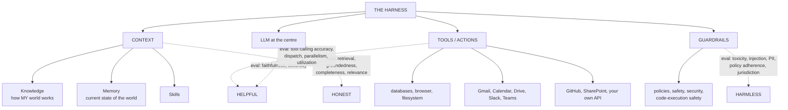
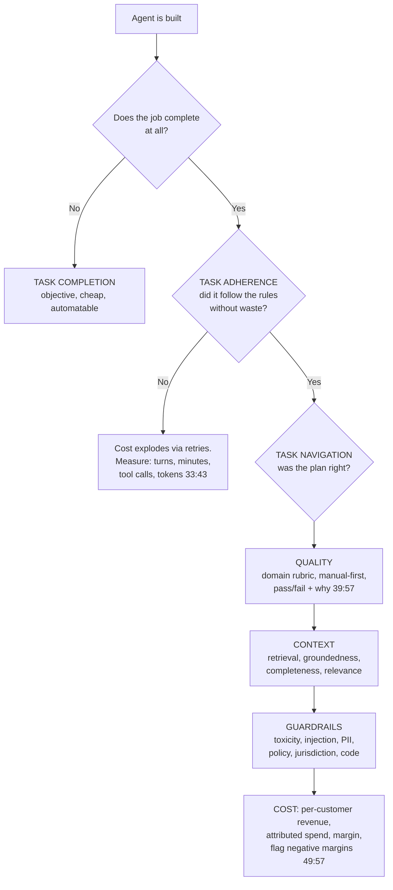

# CS-20 · Building Evaluations for AI Agents That Thrive in Production

> **Source transcript:** `Building_Evaluations_for_AI_Agents_That_Thrive_in_Prod.txt` (~1:03:52, 1,578 lines)
> **Domain:** production
> **One-liner:** A product manager's map of the agent evaluation landscape — three HH H buckets expanded into context, tool, task and cost metrics — with a live Azure AI Foundry walkthrough of turning production traces into a recurring eval, and the arithmetic that evaluation costs roughly 10x what serving costs.
> **Prerequisites:** CS-17, CS-19

## 0. Executive summary

- **Evaluations are the gate on production, not a quality nicety.** The source's headline statistic: "80 to 90% [of companies have] agent inside companies but only **15% are going to production** because nobody's doing evaluations and evaluations are costly" `[37:33]` `[37:35]` `[37:38]` `[37:40]`.
- **The cost claim is quantified from a real run**: an evaluation over a test set "took it **16 minutes** and it did these many tokens consumption to run the evaluations, which is I think **10x of what we spend when we launched the application** or what we gave to the customers" `[48:42]` `[48:44]` `[48:46]` `[48:49]` `[48:53]` `[48:56]`.
- **The `helpful / honest / harmless` frame is extended with an `R`** — "how can we add an R to it, which is now we need to make them even **ROI based**" `[2:16]` `[2:19]` `[2:21]` — because outcome-based pricing requires observing the agent `[1:45]` `[1:47]` `[1:49]`.
- **The agent is drawn as four parts**: an LLM at the centre, plus **context** (knowledge + memory), **tools** (actions + skills), and **guardrails/governance** `[21:12]` `[21:15]` `[21:17]` `[21:20]` `[21:24]` `[21:27]`. Every eval bucket maps to one of these.
- **Context gets four metrics**: **retrieval, groundedness, completeness, relevance** `[25:26]` `[25:28]` `[25:32]` `[25:34]` — with retention cost named explicitly: "am I retrieving too much... and that is costing me too much money downstream" `[24:43]` `[24:46]` `[24:48]` `[24:50]` `[24:52]`.
- **The agent-level metrics are the new material**: **task completion**, **task adherence** and **task navigation** `[31:24]` `[32:31]` `[34:02]`, plus **tool calling accuracy, tool dispatch, tool parallelism and tool utilization** `[34:34]` `[34:43]` `[34:56]`.
- **Task adherence is the cost lever**: a run that completes the task while ignoring the instructions "is taking 60 minutes because I can't follow instructions while it's a six minutes task, and... my cost is **10x** than what it should be" `[33:43]` `[33:45]` `[33:47]` `[33:50]`.
- **Manual evals come first and stay**: "you should do manual evals all along because **agents are not perfect to do evaluations**" `[41:58]` `[42:01]` `[42:03]` — with pass/fail plus "why yes or why no" so the builder learns the domain expert's world `[39:57]` `[40:00]` `[40:02]` `[40:05]`.
- **A real scorecard is shown**: 22 of 22 risks missed — "I was supposed to get 22 risks but I only got five. So I am **22%** there overall as my job to be done", with helpful at **52%**, retrieval relevance at **78%**, and guardrails fully passing `[41:15]` `[41:18]` `[41:21]` `[40:57]` `[41:01]` `[41:06]` `[41:09]`.
- **A promised artifact is not delivered**: asked for a prioritisation rubric across the evaluator list, the speaker says he does not have one and commits to publishing a **"Mahesh minimum list"** with minimum / medium / large tiers `[1:00:49]` `[1:00:53]` `[1:00:56]` `[1:00:58]`.

## 1. The problem this lecture solves

**The framing problem is that evaluation has no natural boundary.** "Evaluation is not a single shot or a small thing. It's where you should be spending as product or product teams **most of your time** to figure out what you need to go and evaluate" `[35:36]` `[35:38]` `[35:40]` `[35:43]` `[35:45]`. There are, by the speaker's own count, "30, 50" evaluators available in the platform `[1:00:44]` — and the count is growing because the platform is paid per evaluation `[1:00:19]` `[1:00:21]`.

**The commercial problem is the link between evaluation and pricing.** This session is explicitly a follow-up to a prior one on pricing: outcome-based pricing "is what customers want, but it's very hard to set up" `[1:37]` `[1:40]` `[1:42]`, and "if we want to do outcome-based pricing, then we have to start monitoring or observing our agents" `[1:45]` `[1:47]` `[1:49]`. The chain is stated directly: task completion produces usefulness, usefulness permits outcome pricing, and outcome pricing requires measurement hooks in the customer's own systems `[31:24]` `[31:46]` `[31:51]` `[32:26]`.

**The methodological problem is that the old framework stopped being sufficient.** The previous `helpful / honest / harmless` frame "may start to fail a little bit" once you want outcome-based pricing `[2:11]` `[2:13]` `[2:16]`. Hence the `R`.

**The cost problem is stated up front and answered at the end.** "We also saw that there's **10x cost in setting up evaluations**. So I want to touch on that and see where that cost comes from and how to work on reducing that cost or optimizing that cost — but maybe at least you will know where the cost comes from. That's a good start today" `[6:32]` `[6:34]` `[6:36]` `[6:39]` `[6:42]` `[6:44]` `[6:46]` `[6:48]` `[6:50]`.

**Analyst note:** the honest structure of this session is that it is a **taxonomy plus a tour**, not a benchmark study. There are exactly two numeric results in the whole transcript — the 22%-completion redlining scorecard and the 16-minute/10x-cost evaluation run — and no cost-per-eval, no precision/recall figures, no per-customer margin numbers. Treat it as a completeness checklist for what to instrument, and treat the numbers as illustrative. The speaker says as much: "it's very hard for me to put everything in 30 minutes, but at least I laid the lay of the land" `[1:03:20]` `[1:03:22]` `[1:03:24]` `[1:03:27]`.

## 2. Definitions & mental models

| Term | Definition | Why it matters |
|---|---|---|
| **Harness** | The whole scaffold around the model: context, tools, guardrails, skills | The evaluation target; "this is my harness. I have created the harness" `[19:44]` `[19:46]` |
| **Knowledge** | Content about *how my world works* — your company, files, contracts, policies `[15:07]` `[15:12]` `[15:14]` `[15:16]` | The static half of context |
| **Memory** | *The current state of the world* — this contract, the last question, what you were told before `[15:41]` `[15:44]` `[15:56]` `[15:59]` | The dynamic half of context; what makes multi-turn work |
| **Groundedness** | Whether the asserted information is actually backed by retrieved content `[24:27]` `[24:29]` `[24:31]` `[24:34]` | The anti-hallucination metric; placed under *honesty* |
| **Completeness** | Whether the retrieved information covers what the answer needs — and how much is missing `[25:08]` `[25:10]` `[25:15]` `[25:18]` `[25:20]` | Recall-side metric; the model can fill gaps, but you should know how many |
| **Relevance** | Whether what was retrieved is pertinent, positioned by the speaker as the least important of the four `[25:32]` `[25:34]` | Precision-side metric |
| **Task completion** | The objective "did the job get done" check `[31:24]` `[31:30]` | The numerator of outcome pricing |
| **Task adherence** | Did the agent follow the instructions and constraints it was given `[32:31]` `[32:38]` `[32:59]` | The cost and time control; bad adherence causes retry loops `[33:21]` `[33:23]` `[33:25]` |
| **Task navigation** | "Adherence is just did I adhere, and navigation is okay I got it, but did I follow the instruction in the plan? **Is the plan correct** and can I follow it correctly" `[34:10]` `[34:14]` `[34:16]` `[34:18]` `[34:21]` | Separates plan quality from execution quality |
| **Tool dispatch** | Which tool was chosen and invoked for a step `[34:38]` `[34:43]` | Each call is billed — "every tool call is a cost, double cost to you" `[34:48]` `[34:50]` |
| **Tool parallelism** | Whether independent calls were issued concurrently `[34:43]` `[34:45]` | Directly controls latency and cost `[34:45]` `[34:48]` |
| **Tool utilization** | How well the agent actually uses what the tools returned `[34:56]` `[34:58]` `[35:01]` | A tool can be called and its output ignored |
| **Playbook** | The reference document the agent must ground its contract edits in `[39:05]` `[39:07]` `[40:37]` `[40:40]` | The source of truth for the honesty check |
| **Ground truth data** | Human-produced answers uploaded to score the agent against `[45:38]` `[45:40]` `[45:42]` `[45:45]` `[45:47]` | Here: the human lawyer's redline |
| **ROI-first agent** | Build the agent to a cost target and work backwards — "set that agent cost to $1 or less than $1, ideally **50 cents** to run the agent, and then work backward from it" `[53:42]` `[53:45]` `[53:47]` `[53:50]` | Decides *which* agents are worth building at all |
| **High attribution / high autonomy** | The two conditions for outcome pricing: you can say the agent did the job, and it did it at high quality `[52:39]` `[52:42]` `[52:49]` | The selection criteria for what to automate first |

**The harness model, drawn:**



## 3. Core content, decomposed

### 3.1 What actually made LLMs useful: three things `[9:52]`

**What the source says.** The technology is not new — "that technology we have since 2018; these are transformers" `[9:04]` `[9:06]`. What changed in 2023 with ChatGPT is three things `[9:50]` `[9:52]`:

| # | Ingredient | What it added | Anchor |
|---|---|---|---|
| 1 | **Scale** | "GPT-3 they used, and it has **175 billion** [parameters]. So they were able to generalize on a large amount of text... across different fields" | `[10:23]` `[10:26]` `[10:30]` `[10:32]` `[10:34]` |
| 2 | **RLHF** | "Reinforcement learning with human feedback... they use the reinforcement learning to make it behave like you or give high accuracy to different aspects of how these models are getting used" | `[10:38]` `[10:40]` `[10:43]` `[10:45]` `[10:47]` `[10:49]` `[10:52]` |
| 3 | **SFT** | "Supervised fine-tuning. That was the idea of **instruction following**... they created different samples with human experts and then used that to train the models to sound like an expert" | `[10:59]` `[11:01]` `[11:04]` `[11:16]` `[11:18]` `[11:21]` `[11:23]` |

**The conclusion the speaker draws** `[11:48]` `[11:49]` `[11:52]` `[11:54]` `[11:56]`: "If you take a GPT-3 model, even if it is a large model, it fails on all these aspects. **These are the three aspects which makes it intelligent.**"

**Analyst note:** this is a compressed version of CS-19's SFT material and it is worth cross-reading, because the two sessions disagree in emphasis. CS-19 explains masking as the mechanical definition of SFT `[45:27]` there; CS-20 treats SFT as one of three ingredients with no mechanics at all. For an interview, CS-19's account is the one to give.

### 3.2 The harness, and the four contexts `[13:04]` `[21:12]`

**The progression the speaker walks through** `[12:34]` `[12:39]` `[12:41]` `[12:43]`:

| Era | What was added | Anchor |
|---|---|---|
| 2023 | Prompt engineering — "you just tell it what to do and it **morphs** into that": a contract makes it a lawyer, a medical report makes it a lab technician | `[12:29]` `[12:35]` `[12:37]` `[12:43]` `[12:46]` `[12:48]` |
| 2024–2025 | **Context**, in two forms — knowledge and memory — reached via RAG, then agentic RAG, then graph RAG | `[13:09]` `[13:12]` `[16:12]` `[16:17]` `[16:21]` `[16:25]` `[16:28]` `[16:48]` `[16:50]` |
| Mid-2024 | **Actions**, via tools | `[17:33]` `[17:37]` `[17:45]` `[17:49]` `[17:52]` |
| Then | **Skills**, then **guardrails** | `[19:23]` `[19:26]` `[19:29]` `[19:42]` |

**RAG, defined in one line** `[16:55]` `[16:57]` `[16:59]` `[17:02]` `[17:06]`: "The idea is that first I can retrieve my context, what is needed, then add that context to my prompt, and then send to the model."

**Why context is the point** `[14:50]` `[14:52]` `[14:54]`: "these models are not actually intelligent **unless they have our context**".

**Knowledge vs memory, side by side** `[15:04]` `[15:07]` `[15:10]` `[15:12]` `[15:14]` `[15:16]` `[15:21]` `[15:23]` `[15:25]` `[15:37]` `[15:39]` `[15:41]` `[15:44]`:

| | Knowledge | Memory |
|---|---|---|
| What it is | "How **my** world works" | "The **current state** of the world" |
| Examples | "Our company, my personal life, how I think, my personal files — if I want contracts to be processed, then I need to show it contracts of my company" | "I just gave you a contract. You have hundreds of contracts... but what's the current contract? In that contract, also, what question I just asked you and what question I asked after that" |
| Contrast | The model "is trained on world knowledge, but it doesn't have knowledge of how our world works" | The model must "keep those instructions in your memory and... learn from them" `[16:05]` `[16:07]` `[16:09]` |

**The tool list, which is the surface the agent must be evaluated over** `[17:59]` `[18:01]` `[18:05]` `[18:08]` `[18:12]` `[18:29]` `[18:33]` `[18:36]`: databases, web browser, file system, Gmail, calendar, Drive, Slack, Teams, GitHub, SharePoint, "anything in the world, right? Your own API also" `[18:30]` `[18:31]`. The speaker names these as the connectors visible in Claude Code `[17:54]`.

**Analyst note:** the reason this list matters for evaluation is stated later — every connected tool is a thing that can be called wrongly, a thing that costs money per call, and a thing whose output can be ignored. The tool list is the *test surface*, which is why it is enumerated here before the eval discussion begins.

### 3.3 The evaluation taxonomy — the core deliverable `[23:25]`

**The mapping** `[22:40]` `[22:45]` `[22:48]` `[22:50]` `[22:53]` `[22:55]` `[23:15]` `[23:19]` `[23:22]` `[23:25]` `[23:28]`:

| Framework term | Maps to | Contents |
|---|---|---|
| **Helpful** | Quality | Did it do the job; quality of the completed task; context and tool calling |
| **Honest** | Groundedness | "People call it hallucination detectors"; retrieval quality |
| **Harmless** | Guardrails, governance | Safety, policy, compliance |

The justification for reusing HHH: "this is how we check humans, right? When we hire humans... if the person is helpful, if they are honest and if they're harmless, we like that person more" `[22:55]` `[22:58]` `[23:00]` `[23:02]` `[23:04]` `[23:06]` `[23:11]`.

#### 3.3.1 Context quality: four metrics `[24:16]`

| Metric | The question it answers | Anchor |
|---|---|---|
| **Retrieval** | "How fast am I retrieving? How much I'm retrieving?" — including the cost question: "am I retrieving too much because maybe I'm retrieving too much information... and that is costing me too much money downstream" | `[24:40]` `[24:43]` `[24:45]` `[24:46]` `[25:10]` `[25:12]` |
| **Groundedness** | "Is the information grounded so I can check groundedness" — the check is "does the retrieved chunk contain the actual information that is needed to answer" | `[24:24]` `[24:27]` `[24:29]` `[24:31]` `[24:34]` |
| **Completeness** | "Is my information complete? Am I missing something? And if I'm missing something, **how much am I missing**? Because the model can fill in something, but model can't fill in something" | `[25:08]` `[25:10]` `[25:15]` `[25:18]` `[25:20]` `[25:22]` `[25:23]` |
| **Relevance** | Whether retrieved content is pertinent — deliberately downgraded: "maybe you can check it; it's not as big as this, so I will just put it like a dot, say relevance" | `[25:32]` `[25:34]` |

**Analyst note:** this is a coarser, more commercially-framed version of CS-13's retriever metrics. CS-13 gets to MRR, NDCG and recall@k with the actual formulas; CS-20 gives four names and one cost argument. The retrieval-cost point — that over-retrieval is a *money* failure and not just a precision failure — is the piece unique to this source.

#### 3.3.2 Guardrails: the full checklist `[26:07]`

The session elicits this list from the audience, and the speaker's remark that "this will make or break your interview" `[26:31]` `[26:33]` is directed at exactly this enumeration.

| Evaluator | Detail | Anchor |
|---|---|---|
| **Toxicity** | Decomposed into sexual, profanity, violence | `[26:07]` `[26:12]` `[26:15]` `[26:17]` `[26:20]` `[26:25]` |
| **Prompt injection / indirect attack** | "Information or prompt injection" | `[26:29]` `[26:31]` |
| **Bias** | Named but flagged as unreliable — "I will say bias, but **bias is very hard to detect**, but let's put it there anyway" | `[26:36]` `[26:39]` `[26:41]` |
| **Teen safety / age appropriateness** | Content appropriate for teens and kids; also addiction — "they should not get addicted to your platform or to your model" | `[26:53]` `[26:56]` `[27:02]` `[27:04]` `[27:07]` `[27:18]` `[27:22]` |
| **Protected material / copyright** | "Am I using copyrighted? This is becoming a big deal. Is my retrieval getting into internet, and if it is finding some copyright information and I have no checks for it, can I go check for that?" | `[27:24]` `[27:26]` `[27:30]` `[27:32]` `[27:34]` `[27:36]` `[27:39]` `[27:42]` |
| **PII** | "You need also a PII middleware for personal information" → personal identification | `[27:42]` `[27:45]` `[27:47]` `[27:50]` |
| **Compliance** | Domain-specific: "if you're working in the compliance industry, then you need to check for HIPAA and other information... you can't map them" | `[27:52]` `[27:53]` `[27:55]` `[27:57]` `[27:59]` `[28:01]` `[28:04]` |
| **Policy adherence** | "You will have your own policy... don't talk bad about my competition. This is our guidelines" — "the blanket you can give" | `[28:07]` `[28:09]` `[28:12]` `[28:19]` `[28:20]` `[28:23]` `[28:25]` |
| **Data jurisdiction** | "If I have data in Europe and I'm not supposed to use it in US, am I doing that?" | `[28:25]` `[28:34]` `[28:37]` `[28:42]` `[28:44]` `[28:47]` `[28:49]` |
| **Code security vulnerability** | "If I generate code, can I check how good and how bad is my security vulnerability?" | `[28:30]` `[28:50]` `[28:52]` `[28:54]` |

**Analyst note:** this list is nearly a superset of CS-16's RAG safety surface — toxicity, PII leakage and scope drift all appear here, with the additions of teen safety, data jurisdiction, protected material and code vulnerability. CS-16 supplies the hands-on test mechanics; CS-20 supplies the interview-facing enumeration. Cross-reference both.

#### 3.3.3 Quality: application-specific, by construction `[29:05]`

**What the source says.** Quality is "how many tasks I'm performing, [and] when I'm performing the task, what is the quality of that task — which can be defined, in our contract case... **based on the application**. Right? What you are building, you have to pick up different metrics" `[29:13]` `[29:16]` `[29:18]` `[29:20]` `[29:22]` `[29:24]` `[29:25]`.

**For the contract application specifically** `[29:28]` `[29:31]` `[29:34]` `[29:36]` `[29:39]` `[29:40]` `[29:44]` `[29:46]` `[29:48]`:

| Quality question | Anchor |
|---|---|
| "Are you giving all the complete risks when you write the risks in the contract?" | `[29:28]` `[29:31]` `[29:34]` `[29:36]` |
| "Do you cut or keep the grammar correctly?" | `[29:36]` `[29:39]` |
| "Are you succinct?" | `[29:40]` `[29:44]` |
| "When you explain, are you explaining in terms that a human can understand?" | `[29:44]` `[29:46]` `[29:48]` |

And the rule: "that's the question you will ask for every answer" `[29:51]` `[29:52]` `[29:54]`.

#### 3.3.4 The agent-level additions: task and cost `[30:08]`

**Why these were added** `[30:11]` `[30:14]` `[30:15]` `[30:19]`: "this year there is another thing that we discussed last time, which is **cost**, and that's the agent-level evaluation."

| Metric | Definition | Anchor |
|---|---|---|
| **Cost / tokenization economics** | What to measure "when the cost goes up" and someone says "our cost is up, how can we optimize our agent" | `[30:19]` `[30:23]` `[30:26]` `[30:34]` `[30:36]` `[30:40]` `[30:43]` `[30:45]` `[30:47]` |
| **Precision / recall balance** | "You need a balance between recall and precision **and the number of tokens used** to produce" | `[31:07]` `[31:08]` `[31:10]` `[31:12]` |
| **Task completion rate** | Did the task complete | `[31:24]` `[31:27]` `[31:30]` |
| **Task adherence** | Did the agent follow the rules set for it | `[32:31]` `[32:38]` `[32:40]` `[32:43]` |
| **Task navigation** | Was the plan right, and was it followed | `[34:02]` `[34:10]` `[34:14]` `[34:16]` `[34:18]` `[34:21]` |
| **Tool calling accuracy / dispatch / parallelism / utilization** | Tool choice, arguments, concurrency, and whether outputs were used | `[34:34]` `[34:36]` `[34:38]` `[34:43]` `[34:45]` `[34:56]` `[34:58]` |

**The task-completion → pricing chain** `[31:39]` `[31:42]` `[31:44]` `[31:46]` `[31:48]` `[31:51]` `[31:53]` `[31:55]` `[31:58]`:

> "If you gave me a contract, I gave you the risks, and I connected to your Gmail and if you use the exact same risk to send to your customers, I can say yeah, I did it... and the more and more closure I am to that task completion, then more and more I am useful, and the more and more I'm useful, I can price my product to outcome."

**The hooks argument, which is the pricing precondition** `[31:58]` `[32:01]` `[32:04]` `[32:05]` `[32:07]` `[32:09]` `[32:12]` `[32:15]` `[32:18]` `[32:20]` `[32:22]` `[32:24]` `[32:26]`:

> "I want to do outcome-based pricing, but I need to have **hooks**. So I need to complete the loop in my product — that you: I give you risks, but you can just remove all those risks, but when you send to your customers it's like 50% of what I gave and 50% is what I have. So I **can't price this for outcome** because I am almost already only 50% there. But then if I can measure on your Gmail that you have started sending exactly what I gave you, then I can say yeah, we are reaching that, at least for these type of contracts."

**The task-adherence cost mechanism, worked** `[33:13]` `[33:16]` `[33:18]` `[33:21]` `[33:23]` `[33:25]` `[33:28]` `[33:30]` `[33:31]` `[33:34]` `[33:37]` `[33:39]` `[33:41]` `[33:43]` `[33:45]` `[33:47]` `[33:50]` `[33:52]` `[33:55]` `[33:56]` `[33:58]`:

> "If I don't adhere to the task, this eval will fail for me in the agentic loop, and then I have to go and try again, and the more I fail the more I try, and the more my cost goes up... So even if I am completing my task, my task adherence decides how much close I am to do outcome-based pricing. Because yes, I have completed the task, but **I'm going bankrupt because I am having a bad task adherence. I'm taking 60 minutes because I can't follow instructions while it's a six minutes task** — and by the way my cost is 10x than what it should be. So I can't price the customer... Or I can start eating the cost. It's a choice of a product. **But without knowing this, you can't do that.**"

**The tool-cost argument** `[34:45]` `[34:48]` `[34:50]` `[34:52]` `[34:56]` `[34:58]` `[35:01]` `[35:04]` `[35:05]` `[35:08]` `[35:10]` `[35:12]` `[35:14]` `[35:16]` `[35:20]` `[35:24]` `[35:26]`:

> "Every tool call is a cost — double cost to you. So you want to measure that also. And then the utilization of tools... the tools are basically behind the agents, and now you are launching many agents: want to browse the internet to check what the contracts are, one for SharePoint to check what's our policy, want to go and check my Gmail if I have used this same kind of contract in past — can you actually get that and utilize them, and what output they get, how good you are at processing them."

**The scope conclusion** `[35:30]` `[35:33]` `[35:36]` `[35:38]` `[35:40]` `[35:43]` `[35:45]`: "now you see the landscape of evaluation... it's where you should be spending as product or product teams **most of your time** to figure out what you need to go and evaluate."

### 3.4 The redlining example: how the criteria were actually built `[38:05]`

**The application** `[38:05]` `[38:07]` `[38:10]` `[38:12]` `[38:17]` `[38:20]` `[38:24]` `[38:30]` `[38:33]`: a contract-redlining agent. "You take a contract, you put it in, and in Word this will go and redline the contract."

**What redlining means here** `[38:35]` `[38:38]` `[38:40]` `[38:42]` `[38:44]` `[38:46]` `[38:49]` `[38:51]` `[38:53]` `[38:56]` `[38:58]`: "you say that hey, I don't want to take this clause or this line, and I will write **3 years rather than four years** because my term says that... so it will modify your contract: if these lines are written, it will go and modify this with this, **which clause removed, part is this, added part is this**." `[39:02]` `[39:05]`

**The playbook as the reference** `[39:05]` `[39:07]` `[39:09]` `[39:11]` `[39:14]` `[39:19]` `[39:21]` `[39:24]` `[39:28]`: "we have a playbook. So this was the originally written lines, this is the modified lines. But you check if the human goes in and human modifies it like this, while we go and modify — so big, right? **We have cut, like, the whole sentence while the human is just modifying a small three to four** [words]."

**The three-stage acceptance structure** `[39:30]` `[39:32]` `[39:35]` `[39:38]` `[39:40]` `[39:42]` `[39:45]`:

| Stage | Question | Concrete checks |
|---|---|---|
| **1. Does it work** | "Did we do the job" | Was annotation done? Was the text edit successful? |
| **2. Quality** | "Then we check the quality of the job" | The helpful criteria |
| **3. Honesty** | Is it grounded | Which tool annotation text was added; was it grounded; **was the playbook used**, or did it hallucinate `[40:34]` `[40:37]` `[40:40]` `[40:42]` |

**How the criteria were authored — this is the methodologically important part** `[39:45]` `[39:47]` `[39:49]` `[39:52]` `[39:54]` `[39:57]` `[40:00]` `[40:02]` `[40:05]` `[40:07]` `[40:09]` `[40:11]` `[40:13]` `[40:15]` `[40:18]` `[40:22]` `[40:25]` `[40:28]` `[40:30]`:

> "We have set up these questions of **what a helpful human will do for the same job**. And we are setting it up and we are asking somebody to say 'hey, is it pass or fail', and when they say yes or no, we will ask them **'why yes or why no', so that we understand their world** — because you're going to build these for domain experts, like in this case legal lawyers. And if you don't know them, you can set up something objective like this, and then you can keep adding to this list so that you have a clear idea of how their world works. And when it fails, what exactly instructions, or what prompts, or what context you need to go add to your agents."

**The scorecard produced** `[40:44]` `[40:46]` `[40:49]` `[40:51]` `[40:54]` `[40:57]` `[41:01]` `[41:04]` `[41:06]` `[41:09]` `[41:12]` `[41:15]` `[41:18]` `[41:21]` `[41:25]` `[41:27]` `[41:28]` `[41:31]`:

| Dimension | Result |
|---|---|
| Helpfulness | **52%** — "I am only 52% of the time I'm helpful, based on my own criteria" |
| Groundedness / relevance | **78%** — "I have retrieved the right information only 78% of the time" |
| Guardrails | "I am adhering to all my guardrails. I am cool." |
| **Task completion (job to be done)** | **22%** — "I was supposed to get **22 risks but I only got five**. So I am 22% there overall as my job to be done" |

**The launch gate that follows from it** `[41:34]` `[41:37]` `[41:39]` `[41:42]` `[41:45]` `[41:48]` `[41:51]` `[41:53]`:

> "You can set up your criteria for your product: 'before we ship we are 22% there, but I want us to be 60% helpful, 70% honest, and I can launch to one or two percent of my customers. I can increase these as we go to larger customers and increase it more.'"

**The manual-first principle** `[41:58]` `[42:01]` `[42:03]` `[42:05]`:

> "This was all manual, and **you should do manual evals all along, because agents are not perfect to do evaluations.** But you want to go and automate these evals."

### 3.5 The Foundry walkthrough: traces → dataset → recurring eval `[42:11]`

**What the source says.** The workflow, end to end:

| Step | Action | Anchor |
|---|---|---|
| 1 | Open **traces** — "this shows all the interactions that have happened with my agents in past" | `[42:28]` `[42:31]` `[42:33]` |
| 2 | Inspect one trace: "the agent was invoked and this was the chat. The user view was this. The user came in, gave a contract and then asked a question... the final answer was this" | `[42:39]` `[42:42]` `[42:44]` `[42:46]` `[42:48]` `[42:56]` `[43:03]` `[43:06]` `[43:09]` |
| 3 | **Create a dataset from live interactions** — pick the agent, pick how many samples | `[43:12]` `[43:15]` `[43:18]` `[43:20]` `[43:23]` `[43:27]` `[43:28]` `[43:31]` `[43:47]` `[43:49]` |
| 4 | Open the **evaluations** tool, pick the agent to evaluate | `[43:51]` `[43:54]` `[43:58]` `[44:01]` |
| 5 | **Choose scope: single turn or multi-turn** — "do you want to evaluate all of the conversations or just individual turns?" The session uses individual turns "because this is the easy one" | `[44:03]` `[44:06]` `[44:08]` `[44:11]` `[44:15]` `[44:17]` `[44:19]` `[44:22]` `[44:24]` `[44:26]` |
| 6 | **Choose run-once or recurring** — "you can just set it up and **every day you can just evaluate 100 interactions recurringly**" | `[44:26]` `[44:30]` `[44:33]` `[44:35]` `[44:38]` |
| 7 | Choose data: **generate synthetic data** or **bring your existing dataset** | `[44:41]` `[44:43]` `[44:45]` `[44:47]` `[44:49]` |
| 8 | Inspect the loaded rows — here **15 conversations**; fields are role, conversation, user query, response, **tools called**, and metadata such as a **trace ID** | `[44:56]` `[44:58]` `[45:00]` `[45:02]` `[45:05]` `[45:09]` `[45:11]` `[45:14]` `[45:17]` |
| 9 | **Field mapping** — map which field is the query, which is the response, add context if retrieved, add ground truth if you have it | `[45:23]` `[45:25]` `[45:27]` `[45:29]` `[45:31]` `[45:34]` `[45:36]` `[45:38]` |
| 10 | Ground truth from the human: "This is my ground truth, right? **The human redline.** I can also upload that here" | `[45:40]` `[45:42]` `[45:45]` `[45:47]` `[45:50]` |
| 11 | Tool definitions are **auto-detected** — "it automatically picks most of it. The only thing you need to provide is the **context** if there was one, and what is your **ground truth**" | `[45:53]` `[45:55]` `[45:58]` `[46:01]` `[46:03]` `[46:05]` `[46:07]` `[46:09]` |
| 12 | Select evaluators — "all the evaluators we discussed are coming **out of the box**" | `[46:19]` `[46:25]` `[46:27]` |
| 13 | Review and submit; results appear under evaluations | `[47:27]` `[47:31]` `[47:33]` `[47:35]` |

**The out-of-the-box evaluator set named** `[46:27]` `[46:30]` `[46:33]` `[46:36]` `[46:38]` `[46:40]`:

| Category | Evaluators |
|---|---|
| Task | **Task adherence, intent resolution, task completion** |
| Quality | Meta metrics such as **BLEU**, and **coherence** `[46:56]`; the speaker notes the platform's versions "are not doing exactly what I was showing you" `[46:33]` `[46:36]` |
| Safety / security | **Code vulnerability, indirect attack** (the injection check `[47:11]` `[47:13]` `[47:17]`), **self-harm, protected material** `[47:03]` `[47:08]` `[47:11]` |

**BLEU, defined by the source** `[46:40]` `[46:42]` `[46:44]` `[46:46]` `[46:49]` `[46:51]` `[46:53]`: "BLEU score is basically matching a human answer with the answer given by the agent and checking **how much of the words are there** in what the human expert said and what your agent said, and gives you a higher score if the words or the sentences match more."

**The result dashboard** `[47:44]` `[47:47]` `[47:49]` `[47:52]` `[47:54]` `[47:57]` `[48:00]` `[48:03]` `[48:06]` `[48:08]` `[48:11]` `[48:14]` `[48:17]` `[48:20]`:

> "It gives you your scores across all these. Your overall score is **89%**, your fluency, your violence, your self-harm is doing good... and I can go and I can analyze the results and I can quickly have a look at what is working well for me and what's not. Seems like **I'm not able to select tools, or my tool selection is not working perfectly**, so I can go and analyze the results and I can select different models."

**The cost numbers from that run** `[48:37]` `[48:39]` `[48:42]` `[48:44]` `[48:46]` `[48:49]` `[48:53]` `[48:56]` `[48:58]`:

> "My tool selection, my accuracy is not that great, and it was done on this test set. It took it **16 minutes** and it did these many tokens consumption to run the evaluations, which is I think **10x of what we spend when we launched the application** or what we gave to the customers."

**Analyst note:** the "16 minutes / 10x tokens" pair is the single most useful operational datum in the transcript, and it is also its most under-specified. The source never gives the test-set size, the token count, or the model used, so this is a **ratio to plan against, not a number to quote**. The mechanism it implies is straightforward and worth stating: evaluation re-runs the whole harness over a frozen set of inputs, so its cost scales with the *evaluation corpus*, not with production traffic — and it is billed even when production traffic is zero.

**The adjacent capabilities named** `[49:09]` `[49:12]` `[49:15]` `[49:17]` `[49:20]` `[49:22]` `[49:27]` `[49:29]` `[49:32]` `[49:35]`:

| Capability | Detail |
|---|---|
| **Alerts** | "You can set it up live and if it drops by a certain [amount] you can get an alert on your email" — the speaker has a LinkedIn course on setting it up: "it's a little involved but possible" |
| **Red teaming** | "You can go and launch these attacks and see how good it is based on those attacks, **which is beyond evaluations**" |
| **Continuous evaluation** | `[49:52]` `[49:55]` |

**The recommendation and the unit-economics requirement** `[49:37]` `[49:40]` `[49:44]` `[49:47]` `[49:52]` `[49:55]` `[49:57]` `[49:59]` `[50:01]` `[50:03]` `[50:06]` `[50:08]`:

> "This is my idea: you should combine these... at least all of these before you go and ship your agents. This is beyond HHH at the agent level, and you can set up continuous evaluations. And I want you to make sure that you are **tracking for each customer what's the revenue, what is the attributed spend, margin per customer, [and] flag negative margins** to do this. You need all of the other metrics that I discussed."

**Analyst note:** "flag negative margins" is the operational conclusion of the whole session and it is the bridge into CS-23. The argument is that the eval stack is not a quality function — it is the **cost accounting system** that makes per-customer pricing decisions possible. If you cannot attribute spend per customer, you cannot tell which customers are loss-making.

### 3.6 The ROI-first agent: how to choose what to build `[51:52]`

**The context shift** `[52:00]` `[52:03]` `[52:04]` `[52:07]` `[52:09]` `[52:11]` `[52:14]` `[52:15]` `[52:17]` `[52:19]` `[52:22]` `[52:23]`:

> "With AI, everything that is done by humans can be built by agents, and the problem was there because we are putting a human body to this and we are paying that person. So at least the automation... the innovation piece is a little harder, but at least the automation is straightforward for agents. So now **how should you plan your agents, and which agent to build and which agent not to build — that is the idea of ROI-first agent.**"

**The two selection conditions** `[52:36]` `[52:39]` `[52:42]` `[52:44]` `[52:49]` `[52:52]`:

| Condition | Test |
|---|---|
| **High attribution** | "If I get a job done, can I say that the agent did the job?" |
| **High autonomy** | "And I can do the job at high quality also" |

"If I can do that, then I can charge for outcomes... and if I can charge for outcome, those are the things you should go and automate first" `[52:52]` `[52:55]` `[52:58]` `[53:00]` `[53:02]` `[53:03]`.

**The daily-briefs counterexample, with numbers** `[53:07]` `[53:10]` `[53:12]` `[53:15]` `[53:17]` `[53:20]` `[53:23]` `[53:26]` `[53:29]` `[53:32]` `[53:35]` `[53:37]` `[53:40]`:

| Quantity | Value |
|---|---|
| Cost to run the agent | **$5** |
| What the beneficiary will pay | **$1** — "it's a 2 minutes job for me and I can just go through my calendar. I won't pay like a dollar... I want to give a dollar for this job and it costs you $5 for it" |
| Verdict | Do not build it |

**The rule** `[53:40]` `[53:42]` `[53:45]` `[53:47]` `[53:48]` `[53:50]` `[53:52]`:

> "The ROI-first AI agent is that you need to set that agent cost to **$1 or less than $1, ideally 50 cents** to run the agent, and then **work backward from it**: can you actually build it at 50 cents or not? So the idea of ROI-first agent was: first figure out what is the outcome, can you find the right attribution and autonomy if you build that agent — and even if you build it, first figure out what's the ROI on this, and if the ROI exists, **set the bar there and then work backward**."

Only after that do you decide "do you want to have it a multi-agent, do you want to have 20 tool calls — all that comes later" `[54:12]` `[54:14]` `[54:15]` `[54:18]`. And then "with these evaluations and evaluators [you can figure out] what actual cost is of creating the agent and running the agent" `[54:27]` `[54:29]` `[54:31]` `[54:34]`.

**Analyst note:** the $5 vs $1 worked example is the only price-point arithmetic in the transcript, and the "50 cents" target is the only absolute cost target. Note the direction of the constraint: it is a **willingness-to-pay ceiling** derived from the human alternative ("it's a 2 minutes job for me"), not a compute budget. That framing — price from the displaced human's cost, not from your inference bill — is the reusable part.

### 3.7 The tool-vs-harness distinction `[54:42]`

**The audience question** `[54:47]` `[54:53]` `[54:55]` `[54:57]` `[54:59]` `[55:02]` `[55:06]` `[55:07]` `[55:12]`: Foundry works for a user-facing agent, but for a middle-of-the-pipeline agent with a specific input and a specific output "it's kind of tricky" — "is this something that Foundry should be used for, or is it only for user-facing agents?"

**The answer** `[55:14]` `[55:16]` `[55:19]` `[55:20]` `[55:22]` `[55:24]` `[55:26]` `[56:22]` `[56:25]` `[56:27]` `[56:29]` `[56:33]` `[56:35]` `[56:37]` `[56:39]` `[56:41]` `[56:44]` `[56:46]` `[56:48]` `[56:51]` `[56:55]` `[56:57]` `[57:01]` `[57:04]` `[57:06]`:

> "There will always be a user... the user can be a consumer or a business person, inside your company or outside. But the idea is: **this is a framework to build the harness. What you are evaluating is a tool.** So you are calling a tool — but AI Foundry is for creating harnesses and testing the harnesses, or evaluating the harnesses. But if you create a tool, then you have to use the tools only. So maybe what you want to do is **create an agent, and then that agent's job is to find the links, and then there is only one tool to it, which is the link validator**, and then you can say 'what's the quality of the link validator — does it do the job or does it not do the job'. But I think it needs to be **designed as a harness first**, and then check the quality of it."

**The JSON-output problem, and the answer** `[58:03]` `[58:06]` `[58:09]` `[58:11]` `[58:14]` `[58:16]` `[58:17]` `[58:19]` `[58:20]` `[58:23]` `[58:24]` `[58:27]` `[58:28]` `[58:42]` `[58:43]` `[58:45]` `[58:48]` `[58:49]` `[58:51]` `[58:52]` `[58:55]` `[58:56]`:

| Position | Detail |
|---|---|
| The user's problem | "The output is coming out to be like more of a chat, and I want the output to be more of a JSON that actually can be connected to my app in a set format" |
| The user's finding | "It's saying either it can be JSON **or** you can connect the tools. You cannot do both in Foundry" |
| The speaker's answer | "When you get the output of the agent you can set the criteria and you can say I only want JSON, and then it will enforce it. When we built that in the beginning it was a lot of work to get a right JSON out because **the models were just screwing up the JSONs**, but I think it has matured enough, so I think we will be fine — but I would love to double-click on it" |
| Resolution | Unresolved on the call; taken offline `[58:34]` `[58:58]` `[58:58]` `[59:01]` |

**Analyst note:** the speaker's claim and the user's finding directly conflict — the user reports the platform forces a choice, the speaker says the output criteria can enforce JSON. The source does not resolve it. This is worth flagging because "structured output versus tool use" is a real constraint in several agent platforms, and the transcript records a genuine disagreement rather than a resolution.

### 3.8 Prioritising among 30–50 evaluators `[59:04]`

**The question, which is the sharpest one asked** `[59:04]` `[59:06]` `[59:08]` `[59:11]` `[59:14]` `[59:16]` `[59:17]`: "now there are so many evals, so many categories. Is there a litmus test for me to prioritise for my use case, which dimension to go after? Because there are also overlaps — like quality could have some overlaps with task completion."

**The answer, part one: the categories are not overlapping once you order them** `[59:19]` `[59:22]` `[59:25]` `[59:27]` `[59:29]` `[59:32]` `[59:35]` `[59:37]` `[59:39]` `[59:43]` `[59:47]` `[59:49]` `[59:51]` `[59:53]` `[59:55]` `[59:58]` `[59:59]` `[1:00:02]` `[1:00:04]` `[1:00:07]`:

> "Quality is mostly measuring that specific domain thing, and the task completion is an **objective metric** which is 'did I complete the task or not'. If I gave you the risk, I'm done — **task completion is 100%**, as you saw in my case. But then I take that and then I go and check helpful, then I'm saying it's only 22% helpful, because it gave me the risk but the risk it gave me is not to the quality that a lawyer will give me... So **you do the task completion, but then after task completion you check the quality of that completed task.**"

**The answer, part two: the cost/coverage tension, and an honest refusal** `[1:00:09]` `[1:00:13]` `[1:00:15]` `[1:00:17]` `[1:00:19]` `[1:00:21]` `[1:00:24]` `[1:00:26]` `[1:00:30]` `[1:00:32]` `[1:00:35]` `[1:00:39]` `[1:00:42]` `[1:00:44]` `[1:00:46]` `[1:00:49]` `[1:00:50]` `[1:00:53]` `[1:00:56]` `[1:00:58]`:

> "**You want to reduce the cost of evals, and at the same time you don't want to miss it** — and now, because Azure gets paid the more you evaluate, they're going to throw more and more evals at you, so you feel like a kid in a candy land. So should I actually pick the candy which are good enough, and what are the rubrics for it... **I think I should give one, but I don't have [one].** These are all new, and at this point there are **30, 50**, and I agree with you. So let me give you my Mahesh list — I think that's the contribution I can make, on top of Foundry — and say 'this is the **Mahesh minimum list**', and then **minimum / medium / large** — let's create those sizes, and I can do that."

Asked to give it on the call: "if I had 15 minutes I would have given you, but let's take it offline and publish it" `[1:00:00]` `[1:01:02]` `[1:01:03]`.

**Analyst note:** this non-answer is the most valuable thing in the Q&A. The session's own taxonomy is not a prioritisation, and the speaker says so directly. The ordering rule he *does* give — completion first, then quality of the completion — is the partial answer, and it is the one to reuse: **cheap objective gates before expensive subjective ones**.

### 3.9 Platform choice, and a strong opinion `[1:01:06]`

**The question** `[1:01:06]` `[1:01:08]` `[1:01:11]` `[1:01:13]` `[1:01:15]` `[1:01:18]` `[1:01:20]` `[1:01:24]` `[1:01:27]`: an agent built on Claude, currently evaluated with **Langfuse**, considering Foundry.

**The answer** `[1:01:30]` `[1:01:32]` `[1:01:34]` `[1:01:37]` `[1:01:40]` `[1:01:43]` `[1:01:46]` `[1:01:50]` `[1:01:53]` `[1:01:56]` `[1:01:59]` `[1:02:01]` `[1:02:02]` `[1:02:04]` `[1:02:06]` `[1:02:09]` `[1:02:10]` `[1:02:12]` `[1:02:14]` `[1:02:17]` `[1:02:21]` `[1:02:23]` `[1:02:25]` `[1:02:28]` `[1:02:30]` `[1:02:32]` `[1:02:36]` `[1:02:39]` `[1:02:41]`:

> "You can bring your agents wherever you build them and use Foundry... I prefer Foundry because it's production, and most of my students and I are using Azure or AWS or GCP. **I don't want to go to open-source things like Langfuse**, because I was grown up in cloud and I think cloud does more for the same amount of money and it's easy to get to production. When you're going to companies, they want to use the cloud provider if the cloud provider has it. And personally I have not seen Langfuse have something that Foundry doesn't. Same for **Arize**, by the way, and **BrainTrust** — I think they are just fancy Foundry evaluations which **do less but say more and price more**. So I have always gone back to Azure or AWS for evaluations. But that's a personal choice and I can be wrong. Google Vertex also... I think Azure is the top, then AWS, then Vertex, in terms of feature richness. **Azure leads the way because they got some lead with OpenAI earlier on.**"

**Analyst note:** this is an explicitly opinionated and commercially-situated answer — the speaker sells a Maven course and runs a cohort, and he discloses the platform does not pay him `[7:20]` `[7:23]`. The specific claim that Arize and BrainTrust "do less but say more and price more" is a comparative claim with **no benchmark, no feature matrix and no pricing data** behind it in this transcript. Record it as one practitioner's opinion, not as a finding. The ranking Azure > AWS > Vertex is likewise asserted, with OpenAI's early lead as the only stated reason.

### 3.10 The evals time budget `[1:02:43]`

**The question** `[1:02:43]` `[1:02:45]` `[1:02:47]` `[1:02:50]`: will the Claude course cover evals?

**The answer** `[1:02:51]` `[1:02:53]` `[1:02:54]` `[1:02:56]` `[1:02:59]` `[1:03:01]` `[1:03:03]`:

> "Yes — we will spend a whole one or two weeks just on evals, because I think... **at least 30–40% of your time should go into evals.** So we will be spending a lot of time **breaking your agents and making them eval ready**."

**Analyst note:** "30–40% of your time" is the only effort-allocation number in the transcript and it lines up with the earlier claim that evaluation "is where you should be spending most of your time" `[35:38]` `[35:40]`. Note "breaking your agents" — the framing is adversarial testing, not score-tracking, which is the same posture as CS-16 and CS-21.

## 4. Frameworks & decision procedures

### 4.1 The eval-selection triage



### 4.2 The criteria-authoring procedure `[39:45]` `[40:02]`

1. **Recruit a domain expert** — here, lawyers `[40:07]` `[40:09]`.
2. **Write the questions a helpful human would answer** — "what a helpful human will do for the same job" `[39:47]` `[39:49]` `[39:52]`.
3. **Ask for a pass/fail verdict first**, then **ask why** — "when they say yes or no, we will ask them 'why yes or why no'" `[39:57]` `[40:00]` `[40:02]`.
4. **Keep adding to the list** — "you can keep adding to this list so that you have a clear idea of how their world works" `[40:13]` `[40:15]` `[40:18]` `[40:22]`.
5. **Convert failures into backlog items** — "when it fails, what exactly instructions, or what prompts, or what context you need to go add to your agents" `[40:22]` `[40:25]` `[40:28]` `[40:30]`.
6. **Do it manually first and keep doing it** — "you should do manual evals all along, because agents are not perfect to do evaluations" `[41:58]` `[42:01]` `[42:03]`.

**Analyst note:** step 3 is the design decision that makes this work. A bare pass/fail gives you a score; pass/fail **plus a reason** gives you the domain model you need to write the next eval and to fix the agent. This is the same "record every lesson" instruction CS-19's contract makes of its training agent `[18:16]` there.

### 4.3 Stage gating before launch `[41:34]`

| Stage | Gate | Anchor |
|---|---|---|
| Internal / manual | 22% task completion observed; run manually | `[41:15]` `[41:21]` |
| Set the target | "I want us to be 60% helpful, 70% honest" | `[41:42]` `[41:45]` |
| Canary | "I can launch to **one or two percent** of my customers" | `[41:45]` `[41:48]` |
| Ramp | "I can increase these as we go to larger customers and increase it more" | `[41:51]` `[41:53]` |
| Steady state | Continuous evaluations plus per-customer margin tracking | `[49:52]` `[49:55]` `[49:57]` |

### 4.4 Platform capability checklist `[49:09]`

| Capability | Why you need it | Anchor |
|---|---|---|
| Trace capture | It is the raw material for datasets | `[42:28]` |
| Dataset creation from traces | Turns live traffic into a frozen eval corpus | `[43:15]` |
| Turn-scope selection (single vs multi-turn) | Multi-turn and single-turn failures differ | `[44:06]` `[44:08]` |
| **Recurring evaluation** | "Every day you can just evaluate 100 interactions recurringly" | `[44:33]` `[44:35]` `[44:38]` |
| Synthetic data generation | For cold start before you have traffic | `[44:43]` `[44:45]` |
| Field mapping | Query, response, context, ground truth | `[45:23]` `[45:25]` `[45:31]` |
| Auto-detected tool definitions | Removes manual wiring | `[46:01]` `[46:03]` |
| Out-of-the-box evaluators | Task, quality, safety categories | `[46:25]` `[46:27]` |
| **Alerts on drops** | "If it drops by a certain [amount] you can get an alert on your email" | `[49:12]` `[49:15]` `[49:17]` |
| **Red teaming** | Attack launching, "beyond evaluations" | `[49:27]` `[49:29]` `[49:32]` |

## 5. Worked end-to-end example

**The contract-redlining agent, from build to launch gate.** This is the only end-to-end case in the source and it is assembled from §3.4, §3.5 and §3.6.

**Step 1 — Choose the use case by ROI, not by feasibility.** Contract redlining involves a human lawyer doing a bounded, repetitive job. Test attribution — can you say the agent did it? — and autonomy — can it be done at quality? `[52:39]` `[52:42]` `[52:49]`. Compare the agent's cost to the displaced human's willingness to pay, as with the daily-briefs example where a $5 agent cannot be sold for $1 `[53:17]` `[53:37]`.

**Step 2 — Build the harness.** LLM at the centre; **knowledge** = the company's contracts and playbook; **memory** = this contract and the conversation so far; **tools** = Word integration, Gmail, SharePoint, calendar, Slack, a browser; **guardrails** = policy adherence, confidentiality, PII `[21:12]` `[15:07]` `[15:39]` `[18:12]` `[18:36]` `[19:29]`.

**Step 3 — Define "does it work".** Was the annotation applied? Was the text edit successful? This is binary and needs no expert `[39:32]` `[39:35]` `[39:38]` `[39:40]`.

**Step 4 — Define quality, with a lawyer in the loop.** Write the questions a helpful lawyer would answer — completeness of the risks, preservation of grammar, succinctness, plain-language explanation `[29:28]` `[29:36]` `[29:40]` `[29:44]` `[39:47]`. Present them as pass/fail, then ask why `[39:57]` `[40:00]`.

**Step 5 — Define honesty.** Was the playbook used, or was the edit hallucinated? Which tool supplied the annotation text? `[40:34]` `[40:37]` `[40:40]`.

**Step 6 — Define harmlessness.** The guardrail list in §3.3.2 `[26:07]` `[28:54]`.

**Step 7 — Collect ground truth.** The human lawyer's redline, uploaded as ground truth for the eval set `[45:42]` `[45:45]` `[45:47]`.

**Step 8 — Run it manually and read the scorecard.** Observed: **22%** of the 22 expected risks found; **52%** helpful by the lawyer's own criteria; **78%** retrieval relevance; guardrails passing `[41:15]` `[41:18]` `[41:21]` `[40:57]` `[41:01]` `[41:06]` `[41:09]`.

**Step 9 — Diagnose from the comparison, not the score.** The critical artifact is the side-by-side: "we have cut, like, the whole sentence while the human is just modifying a small three to four [words]" `[39:19]` `[39:21]` `[39:24]`. That comparison is what tells you the agent is over-editing, which no aggregate number reveals.

**Step 10 — Set the launch gate and canary.** Target 60% helpful / 70% honest; launch to 1–2% of customers; expand as the numbers hold `[41:42]` `[41:45]` `[41:48]` `[41:51]` `[41:53]`.

**Step 11 — Move from manual to automated and recurring.** Build a dataset from traces `[43:15]`, map the fields `[45:23]`, pick the out-of-the-box evaluators `[46:25]`, and schedule it — "every day you can just evaluate 100 interactions recurringly" `[44:35]` `[44:38]`. Budget for it: the observed run took **16 minutes** and about **10x** the production token spend `[48:42]` `[48:49]`.

**Step 12 — Wire alerts and red teaming.** Alert on drops `[49:12]`; launch attacks `[49:29]`.

**Step 13 — Close the loop financially.** Track per customer: revenue, attributed spend, margin; flag negative margins `[49:57]` `[49:59]` `[50:01]` `[50:03]`.

**The decision rule that falls out:** task completion is the *gate*, quality is the *product*, adherence is the *cost control*, and per-customer margin is the *business decision* — and they must be evaluated in that order because each one is cheaper than the next.

## 6. Pros, cons, exceptions

| Approach | Pros | Cons | Works when | Fails when | Cost |
|---|---|---|---|---|---|
| **Manual expert evaluation** | Produces the domain model, not just a score `[40:02]`; you learn "how their world works" `[40:18]` | Slow; needs domain experts (lawyers) `[40:07]` | Always — the source says do it "all along" `[42:01]` | You scale it instead of automating | Expert time |
| **Automated eval platform** | Recurring, out-of-the-box evaluators `[46:25]`, alerts, red teaming | "**10x**" the production token spend `[48:49]` `[48:53]`; vendor upsell pressure `[1:00:21]` | You have a stable harness and trace data | The harness is still changing daily | 10x serving |
| **Traces as eval source** | Real distribution; no synthetic-data mismatch; auto field detection `[46:01]` | Needs tracing already in place; needs sanitisation and ground truth | You have production traffic | Cold start — no traffic yet | Storage |
| **Synthetic data** | Available before you launch `[44:43]` `[44:45]` | The audience question at `[22:30]` `[22:34]` `[22:36]` is exactly this — how close is synthetic to real, and the source does not answer it | Bootstrap phase | You need production realism | Model cost |
| **HHH + R** | Maps to how humans are judged `[22:58]`; stable interview vocabulary | Not a prioritisation — "there are 30, 50" `[1:00:44]` | Communicating scope | Deciding what to do first | Free |
| **Task adherence as a metric** | Detects the retry-cost failure that completion metrics miss entirely `[33:43]` | Needs trajectory-level instrumentation | Agentic loops with retries | Single-turn systems | Low |
| **Tool utilization** | Catches called-but-ignored tool output `[35:01]` | Requires per-call tracing | Multi-tool agents | One-tool agents | Low |
| **Cloud platform over open source** | "Easy to get to production"; companies want it `[1:01:56]` `[1:02:02]` | Speaker's own bias, disclosed; lock-in | Enterprise delivery | You need portability | Licence |

## 7. Failure modes & anti-patterns

1. **Shipping without evaluations.**
   *Symptom:* the agent is "not performing well and people are not happy. The CSAT score is low and people are complaining about the quality" `[20:38]` `[20:40]` `[20:43]` `[20:46]`. *Root cause:* no eval gate. *Detection:* can you state the agent's task-completion rate? *Fix:* the stage gates in §4.3. The base rate is that only **15%** of agents reach production "because nobody's doing evaluations" `[37:38]` `[37:40]`.

2. **Optimising for task completion alone.**
   *Symptom:* "yes, I have completed the task, but **I'm going bankrupt** because I am having bad task adherence" `[33:39]` `[33:41]`. *Root cause:* completion is an outcome metric with no efficiency term. *Detection:* compare wall-clock and cost per task against the human baseline — 60 minutes versus six `[33:43]` `[33:45]`. *Fix:* measure task adherence and treat retry loops as the cost driver `[33:21]` `[33:28]`.

3. **Pricing for outcomes without hooks.**
   *Symptom:* you cannot prove the customer used your output — "when you send to your customers it's like 50% of what I gave and 50% is what you have" `[32:04]` `[32:05]` `[32:07]`. *Root cause:* no instrumentation in the customer's system. *Detection:* can you observe the downstream action? *Fix:* "I need to have hooks... complete the loop in my product" `[31:55]` `[31:58]`.

4. **Measuring retrieval quality without its cost.**
   *Symptom:* grounded answers at unacceptable spend. *Root cause:* relevance checked, retrieval volume not. *Detection:* tokens retrieved per query. *Fix:* "am I retrieving too much... and that is costing me too much money downstream" `[24:43]` `[24:48]` `[24:52]`.

5. **Delegating evaluation to an agent too early.**
   *Symptom:* an automated eval you cannot trust and cannot debug. *Root cause:* skipping the manual phase. *Detection:* no human has ever scored a sample. *Fix:* "you should do manual evals all along, because agents are not perfect to do evaluations" `[41:58]` `[42:01]` `[42:03]`.

6. **Collecting a verdict without a reason.**
   *Symptom:* a score that does not tell you what to change. *Root cause:* pass/fail without the "why". *Detection:* does each failure map to a prompt, instruction or context change? *Fix:* always ask why `[40:00]` `[40:02]`, so you can say "what exactly instructions, or what prompts, or what context you need to go add" `[40:25]` `[40:28]`.

7. **Boiling the ocean on evaluators.**
   *Symptom:* 30–50 candidate evaluators and no decision. *Root cause:* no prioritisation rubric exists. *Detection:* you are asking this question out loud, as the audience member does at `[59:04]` `[59:08]`. *Fix:* order by cost and objectivity — completion, then adherence, then navigation, then quality, then context, then guardrails. The published rubric was promised, not delivered `[1:00:58]`.

8. **Ignoring the evaluator-vendor incentive.**
   *Symptom:* an ever-growing eval bill. *Root cause:* "because Azure gets paid the more you evaluate, they're going to throw more and more evals at you" `[1:00:19]` `[1:00:21]`. *Detection:* cost per eval run tracked as a line item. *Fix:* treat evaluations as a budget line with a cost target, which is the ROI-first framing applied inward.

9. **Budgeting the agent without budgeting the eval.**
   *Symptom:* a viable agent whose evaluation programme is not funded. *Root cause:* the 10x ratio is invisible until you measure it. *Detection:* the observed evaluation consumed 16 minutes and ~10x production tokens `[48:42]` `[48:49]`. *Fix:* size the eval corpus deliberately — the recurrence and row count are both configurable `[43:47]` `[44:38]`.

10. **Confusing a tool with a harness.**
    *Symptom:* "we don't really have a user per se... the output has to be a very specific dataset" and the platform will not let you do both `[55:55]` `[56:00]` `[58:27]` `[58:28]`. *Root cause:* the deterministic component is being modelled as an agent. *Detection:* does this step need autonomy, or just a call? *Fix:* the source's answer — "create an agent... and then there is only one tool to it... **it needs to be designed as a harness first**, and then check the quality of it" `[56:44]` `[56:48]` `[56:51]` `[57:01]` `[57:04]` `[57:06]`.

11. **Believing there is one platform answer.**
    *Symptom:* platform churn. *Root cause:* treating a preference as a benchmark. *Detection:* is there any measured comparison? *Fix:* note that the source's Azure > AWS > Vertex ranking and its dismissal of open-source tooling are asserted, not demonstrated `[1:02:36]` `[1:02:25]`.

## 8. Implementation notes

**The trace → dataset → eval pipeline, as configured in the walkthrough** `[42:28]` `[43:15]` `[43:54]` `[44:38]` `[45:23]` `[46:25]`:

```
traces (all agent interactions, with tool calls + trace ID)
  └─ create dataset:  select agent, select row count           [43:15]
       └─ evaluations tool:
            agent          = which agent to evaluate           [44:01]
            scope          = invoke one turn | many turns      [44:06]
            schedule       = once | recurring (e.g. 100/day)   [44:33] [44:38]
            data           = synthetic | existing dataset      [44:43]
            field mapping  = query, response, context,         [45:23]-[45:50]
                             ground truth, tool definitions
                             (tools auto-detected               [46:01])
            evaluators     = task / quality / safety sets       [46:25]-[47:17]
            → review → submit                                   [47:27] [47:31]
```

**The evaluator names to expect out of the box** `[46:25]` `[46:30]` `[46:33]` `[47:01]` `[47:03]` `[47:08]` `[47:11]`:

| Group | Names |
|---|---|
| Task | task adherence, intent resolution, task completion |
| Quality | BLEU (word-overlap against a human answer `[46:40]` `[46:53]`), coherence |
| Safety | code vulnerability, indirect attack (injection `[47:13]` `[47:17]`), self-harm, protected material |

**The data fields a trace-based eval row contains** `[44:58]` `[45:00]` `[45:02]` `[45:05]` `[45:09]` `[45:11]` `[45:14]` `[45:17]`:

| Field | Content |
|---|---|
| Role | Who spoke |
| Conversation | The turn content |
| Query | The user's question |
| Response | The agent's answer |
| **Tools called** | The tool-call list for the turn |
| Metadata | Trace ID and related identifiers |

**The metrics to instrument, consolidated** — this is the practical output of the session:

| Layer | Metrics |
|---|---|
| Context | retrieval (speed, volume, cost), groundedness, completeness, relevance `[24:40]` `[25:34]` |
| Tools | calling accuracy, dispatch, parallelism, utilization `[34:34]` `[34:56]` |
| Task | completion, adherence, navigation `[31:24]` `[32:31]` `[34:02]` |
| Quality | domain rubric authored with an expert `[29:28]` `[39:47]` |
| Guards | toxicity (sexual/profanity/violence), bias, injection, teen safety, protected material, PII, HIPAA/compliance, policy adherence, data jurisdiction, code vulnerability `[26:07]` `[28:54]` |
| Cost | token economics, precision/recall vs tokens, retries, per-customer revenue, attributed spend, margin `[30:19]` `[31:12]` `[49:57]` |
| Operational | alert on score drop, recurring schedule, red-team runs `[49:12]` `[44:38]` `[49:29]` |

**The effort budget** `[1:02:56]`: "at least **30–40% of your time** should go into evals."

## 9. Interview-ready Q&A

**Q1. What is the harness, and why is it the evaluation target rather than the model?**
Four parts: an **LLM at the centre**, plus **context** (knowledge — "how my world works" — and memory — "the current state of the world"), **tools** (the actions the agent can take), and **guardrails/governance** (policy, safety, security) `[21:12]` `[21:15]` `[15:07]` `[15:39]` `[17:52]` `[19:29]`. The model is not the evaluation target because "these models are not actually intelligent unless they have our context" `[14:50]` `[14:52]` `[14:54]` — the same base model scores completely differently depending on the harness around it. Every eval bucket maps to one of the four parts, which is why the taxonomy is stable across applications.

**Q2. Name the four context metrics and explain why one of them is a cost metric.**
**Retrieval, groundedness, completeness, relevance** `[25:26]` `[25:28]` `[25:32]` `[25:34]`. Retrieval is a cost metric because the question it asks is not only "how fast" but "how much I'm retrieving — am I retrieving too much, because maybe I'm retrieving too much information, and that is costing me too much money downstream" `[24:40]` `[24:43]` `[24:46]` `[24:48]` `[24:52]`. Groundedness checks whether the retrieved chunk actually contains what the answer needs `[24:24]` `[24:29]`. Completeness asks "am I missing something, and if I'm missing something, how much am I missing" `[25:15]` `[25:18]`. Relevance is explicitly the smallest of the four `[25:32]`.

**Q3. What is the difference between task completion, task adherence and task navigation? (Trap.)**
Completion is the objective "did the job get done" `[31:24]` `[31:30]`. Adherence is "did I adhere to the instructions that were given to me" `[32:59]` `[33:00]`. Navigation is "adherence is just did I adhere, and navigation is okay, I got it — but did I follow the instruction in the plan? **Is the plan correct**, and can I follow it correctly" `[34:10]` `[34:14]` `[34:16]` `[34:18]` `[34:21]`. The trap is treating them as overlapping. They are ordered: a wrong plan is a navigation failure, a right plan executed wastefully is an adherence failure, and either one can coexist with successful completion — which is exactly why completion alone is a dangerous metric.

**Q4. Why does task adherence decide whether you can price on outcomes? (Trap.)**
Because bad adherence causes retries inside the agentic loop: the eval fails, the agent tries again, "the more I fail the more I try, and the more my cost goes up" `[33:21]` `[33:23]` `[33:25]` `[33:28]`. So a run that completes the task can still be unpriceable: "yes, I have completed the task, but I'm going bankrupt... I'm taking 60 minutes because I can't follow instructions while it's a six minutes task, and my cost is **10x** than what it should be" `[33:39]` `[33:41]` `[33:43]` `[33:45]` `[33:47]` `[33:50]`. The trap is assuming completion implies margin. The source's resolution: "I can't price the customer, or I can start eating the cost. It's a choice of a product — but without knowing this, you can't do that" `[33:50]` `[33:52]` `[33:55]` `[33:56]` `[33:58]`.

**Q5. What is the 10x cost claim, and what is it actually measuring?**
On a real evaluation run: "it took it **16 minutes** and it did these many tokens consumption to run the evaluations, which is I think **10x of what we spend when we launched the application** or what we gave to the customers" `[48:42]` `[48:44]` `[48:46]` `[48:49]` `[48:53]` `[48:56]`. It measures the cost of re-running the full harness over a frozen evaluation corpus, compared with the cost of serving one production interaction. The important property is that eval cost scales with **corpus size**, not traffic — so it is a fixed bill you choose, which is why the platform exposes both row count `[43:47]` and recurrence `[44:38]` as settings.

**Q6. What was the scorecard, and what did each number mean?**
On the contract-redlining agent: **22%** task completion — "I was supposed to get 22 risks but I only got five" `[41:15]` `[41:18]` `[41:21]`; **52%** helpful by the lawyers' own criteria `[40:57]` `[41:01]`; **78%** retrieval relevance — "I have retrieved the right information only 78% of the time" `[41:04]` `[41:06]`; and guardrails fully passing `[41:09]` `[41:12]`. The two numbers to notice are the 22% and the 52%: they are different questions. Completion asks whether the artifact was produced; helpfulness asks whether it was produced to the standard a domain expert would accept, and "the risk it gave me is not to the quality that a lawyer will give me" `[59:47]` `[59:49]`.

**Q7. How were the quality criteria written? (Trap.)**
With a domain expert, by asking "what a helpful human will do for the same job" `[39:47]` `[39:49]` `[39:52]`, presented as pass/fail, and then followed with **"why yes or why no"** `[39:57]` `[40:00]` `[40:02]`. The trap is thinking the "why" is optional metadata. It is the point: "so that we understand their world, because you're going to build these for domain experts, like in this case legal lawyers. And if you don't know them, you can set up something objective like this... so that you have a clear idea of how their world works. And when it fails, what exactly instructions, or what prompts, or what context you need to go and add to your agents" `[40:02]` `[40:05]` `[40:07]` `[40:09]` `[40:18]` `[40:22]` `[40:25]` `[40:28]` `[40:30]`.

**Q8. Why does the source insist on manual evaluations even when automation exists?**
"**You should do manual evals all along, because agents are not perfect to do evaluations.** But you want to go and automate these evals" `[41:58]` `[42:01]` `[42:03]` `[42:05]`. The manual phase is where the criteria are authored and where you learn the domain; the automated phase is where you get recurrence and scale. Automating before the criteria exist just scales a rubric you cannot defend. The source's own sequence is manual scorecard first `[40:44]` `[41:31]`, platform automation second `[42:11]`.

**Q9. What does the ROI-first agent framework say, with the numbers?**
Two selection conditions: **high attribution** ("can I say that the agent did the job?") and **high autonomy** ("I can do the job at high quality also") `[52:39]` `[52:42]` `[52:49]` `[52:52]`. The rule: "set that agent cost to **$1 or less than $1, ideally 50 cents** to run the agent, and then work backward from it — can you actually build it at 50 cents or not?" `[53:42]` `[53:45]` `[53:47]` `[53:50]`. The worked counterexample: a daily-brief agent that costs **$5** to run, for which the beneficiary says "it's a 2 minutes job for me and I can just go through my calendar. I won't pay like a dollar" `[53:17]` `[53:23]` `[53:29]` `[53:32]` `[53:35]` `[53:37]`. Only after the ROI test do you decide multi-agent versus single-agent and how many tool calls `[54:12]` `[54:14]` `[54:15]`.

**Q10. What is the per-customer instrumentation requirement?**
"Make sure that you are **tracking for each customer what's the revenue, what is the attributed spend, margin per customer, [and] flag negative margins**" `[49:57]` `[49:59]` `[50:01]` `[50:03]`. This is the operational purpose of the whole eval stack — evaluations are what let you attribute spend, and attribution is what lets you price. Without per-customer margin you cannot tell a customer who is profitable from one who is being subsidised, and the source's own scenario — the customer who removes 50% of the risks before sending `[32:04]` `[32:07]` — is exactly a case where the value delivered is less than the value assumed.

**Q11. Tool-versus-harness: what did the source say about an agent with a fixed JSON output? (Trap.)**
The user reported that Foundry "is saying either it can be JSON or you can connect the tools — you cannot do both" `[58:24]` `[58:27]` `[58:28]`. The speaker's answer was architectural: "**this is a framework to build the harness. What you are evaluating is a tool**... if you create a tool, then you have to use the tools only. So maybe what you want to do is create an agent, and then that agent's job is to find the links, and then there is only one tool to it, which is the link validator... **it needs to be designed as a harness first**, and then check the quality of it" `[56:22]` `[56:25]` `[56:27]` `[56:39]` `[56:41]` `[56:44]` `[56:46]` `[56:48]` `[56:51]` `[57:04]` `[57:06]`. The trap is treating this as a solved question: the two positions were not reconciled, and the speaker took it offline `[58:34]` `[58:58]` `[59:01]`.

**Q12. How do you prioritise when the platform offers 30–50 evaluators? (Trap.)**
The source's partial answer is an **ordering**: task completion is the objective gate — "if I gave you the risk, I'm done, task completion is 100%... but then I take that and then I go and check helpful, then I'm saying it's only 22% helpful... So you do the task completion, but then **after task completion you check the quality of that completed task**" `[59:32]` `[59:35]` `[59:37]` `[59:39]` `[59:43]` `[59:47]` `[59:55]` `[59:57]` `[59:58]` `[1:00:02]`. The trap is expecting a complete rubric: the speaker explicitly says he does not have one, that the evaluators "are all new", that there are "30, 50", and that he will publish a "**Mahesh minimum list**" with minimum/medium/large tiers — offline, later `[1:00:42]` `[1:00:44]` `[1:00:46]` `[1:00:49]` `[1:00:53]` `[1:00:56]` `[1:00:58]`. The honest answer to give an interviewer is the ordering rule plus the cost/coverage tension he names: "you want to reduce the cost of evals, and at the same time you don't want to miss it" `[1:00:13]` `[1:00:15]` `[1:00:17]`.

## 10. Cheat sheet

```
BUILDING EVALS FOR AGENTS IN PROD
=====================================================================
THE PROBLEM
  agents are easy to build, hard to ship:                [37:33]
  80-90% of companies have an agent; only 15% reach prod
  "because nobody's doing evaluations"                   [37:40]
  eval cost ~10x serving cost                            [6:32]
  30-40% of your time should go into evals               [1:02:56]
  old frame HHH needs an R: ROI-based                    [2:16] [2:21]

THE HARNESS = THE EVAL TARGET                            [21:12]
  LLM . CONTEXT . TOOLS/ACTIONS . GUARDRAILS
  CONTEXT = knowledge ("how MY world works")             [15:07]
          + memory ("current state of the world")        [15:41]
  TOOLS  = DB, browser, FS, Gmail, Calendar, Drive,
           Slack, Teams, GitHub, SharePoint, your API    [17:59]
  EVAL BUCKETS:  helpful=quality . honest=context .
                 harmless=guardrails                     [23:15]
---------------------------------------------------------------------
CONTEXT METRICS (4)                                      [25:26]
  RETRIEVAL      speed + VOLUME -- over-retrieval is a
                 MONEY failure                           [24:43]
  GROUNDEDNESS   does the chunk contain what the answer
                 needs                                   [24:29]
  COMPLETENESS   how much is MISSING (model may fill it
                 in, or may not)                         [25:15]
  RELEVANCE      smallest of the four                    [25:32]
TOOL METRICS (4)                                         [34:34]
  calling accuracy . dispatch . parallelism .
  utilization (was the output actually USED)             [35:01]
  "every tool call is a cost -- double cost to you"      [34:48]
TASK METRICS (3)                                         [31:24] [32:31] [34:02]
  COMPLETION   did the job get done          -- objective
  ADHERENCE    did it follow the instructions
  NAVIGATION   was the PLAN right + followed
  ADHERENCE FAILURE => retries => cost explosion:
    "60 minutes for a 6-minute task, 10x the cost"       [33:43]
GUARDRAILS (10+)                                         [26:07]-[28:54]
  toxicity (sexual/profanity/violence) . bias .
  prompt injection / indirect attack . teen safety +
  addiction . protected material / copyright . PII /
  personal identification . HIPAA / compliance .
  policy adherence / prohibited actions .
  data jurisdiction . code vulnerability
  bias: "very hard to detect, but let's put it there"    [26:38]
---------------------------------------------------------------------
THE WORKING SCORECARD (contract redlining)               [40:54]
  task completion  22%   (22 risks expected, 5 found)    [41:21]
  helpful          52%   (by the lawyer's own criteria)  [41:01]
  retrieval        78%   (right info found)              [41:06]
  guardrails       PASS                                  [41:09]
  LAUNCH GATE: target 60% helpful / 70% honest,
  canary to 1-2% of customers, then ramp                 [41:42]-[41:53]
  DIAGNOSIS comes from the side-by-side, not the score:
  "we cut the whole sentence while the human modifies
   3-4 words"                                            [39:19]

HOW THE CRITERIA ARE AUTHORED                           [39:45]
  1 ask what a HELPFUL HUMAN would do for the same job
  2 pass/fail verdict
  3 then ask WHY yes / why no -- this teaches you the
    domain expert's world                                [40:02]
  4 keep adding; convert each failure into "what
    instruction / prompt / context needs to change"      [40:25]
  5 MANUAL FIRST AND ALWAYS -- "agents are not perfect
    to do evaluations"                                   [42:01]
---------------------------------------------------------------------
THE PIPELINE (traces -> recurring eval)                 [42:28]
  traces -> dataset (pick agent + row count)            [43:15]
  -> evaluations: agent / scope (1 turn vs many) /
     schedule (once or recurring, e.g. 100/day) /
     data (synthetic or existing) / field mapping
     (query, response, context, GROUND TRUTH, tools
     auto-detected) / evaluators / review / submit
  OUT-OF-BOX EVALUATORS: task adherence, intent
  resolution, task completion, BLEU, coherence, code
  vulnerability, indirect attack, self-harm,
  protected material                                    [46:25]-[47:17]
  OBSERVED RUN: 16 minutes, ~10x production tokens      [48:42]
  PLUS: alerts on score drop, red teaming               [49:12] [49:29]
  PLUS: per-customer revenue, attributed spend, margin,
        FLAG NEGATIVE MARGINS                           [49:57]
---------------------------------------------------------------------
ROI-FIRST AGENT                                          [52:26]
  high ATTRIBUTION (can I say the agent did it?)
  + high AUTONOMY (at high quality)  => charge outcomes
  TARGET COST: $1 or less, ideally 50 CENTS -- then
  work backward to whether it is buildable              [53:45]
  COUNTEREXAMPLE: daily briefs cost $5, user will pay
  $1 ("2 minutes job for me") -> do not build           [53:17] [53:37]
  multi-agent / 20 tool calls: decide LAST              [54:12]

KNOWN GAPS
  no prioritisation rubric exists (30-50 evaluators);
  "Mahesh minimum list" promised, not delivered         [1:00:58]
  JSON output + tools: two positions unreconciled       [58:27] [58:58]
  platform ranking Azure > AWS > Vertex: asserted, not
  benchmarked                                           [1:02:36]

THREE THINGS TO REMEMBER
  1 Order the metrics by cost: completion -> adherence ->
    quality -> context -> guardrails  [59:55]
  2 Adherence, not completion, decides your margin  [33:41]
  3 Evals are your cost-accounting system, not your QA
    system -- they exist so you can price  [49:57]
```

## 11. Glossary

| Term | Meaning |
|---|---|
| **Attribution** | Being able to say the agent, not a human, produced the outcome — a precondition for outcome pricing |
| **Autonomy (high)** | The agent completes the job at high quality without human completion |
| **BLEU** | Word/sentence overlap between an agent answer and a human answer; higher when they match more `[46:40]` |
| **Completeness** | How much of the needed information the retrieval actually supplied |
| **Data jurisdiction** | Whether data was used in the region its governance permits `[28:44]` |
| **Groundedness** | Whether the assertion is backed by retrieved content |
| **Harness** | The LLM plus context, tools and guardrails — the actual thing being evaluated |
| **High attribution / high autonomy** | The two ROI-first selection conditions |
| **Indirect attack** | Injected instructions arriving through retrieved or tool content `[47:11]` |
| **Knowledge** | Static context about how your world works |
| **Memory** | Dynamic context: current state, current document, conversation history |
| **Negative margin flag** | The alert that a customer costs more than they pay `[50:03]` |
| **Playbook** | The reference document an edit must be grounded in |
| **ROI-first agent** | Designing to a cost target (≤ $1, ideally 50¢) derived from the displaced human's willingness to pay |
| **Task adherence** | Following the given instructions and constraints |
| **Task completion** | The objective did-the-job-get-done metric |
| **Task navigation** | Whether the plan was correct and correctly followed |
| **Tool dispatch** | Which tool was selected and invoked |
| **Tool parallelism** | Concurrent rather than sequential tool invocation |
| **Tool utilization** | Whether the agent actually used the tool's output |
| **Trace** | A recorded agent interaction including tool calls and metadata |

## 12. Cross-references

- **Builds on:**
  - CS-17 — agentic evaluation and agent identity; the reliability axes there are the measurement-side counterpart of this session's taxonomy
  - CS-19 — SFT and harness mechanics; CS-19 explains the loss and the training loop, CS-20 treats the same harness as a production evaluation target
  - `../04-rag/CS-13-testing-rag-retrievers-hands-on.md` — the real retrieval metrics (hit rate, MRR, NDCG, recall@k) behind this session's four context names
  - `../04-rag/CS-16-securing-rag-toxicity-leakage-scope-drift.md` — the hands-on safety test plan for the guardrail list in §3.3.2
- **Leads to:**
  - CS-21 — observability, traces, evals, alerts and red teaming explained; this session's traces-and-alerts section is the preview
  - CS-22 — setting up agent evals and scaling them
  - CS-23 — pricing AI agents; the ROI-first framework, the $5-vs-$1 example and "flag negative margins" all point directly at it
- **External (named in the source):** Azure AI Foundry, Microsoft, Langfuse, Arize, BrainTrust, Google Vertex, AWS, GCP, Bedrock, Gemini, GPT-3 (175B), ChatGPT, Word, Word redlining, Gmail, SharePoint, Slack, Teams, GitHub, Claude Code connectors, HIPAA, BLEU, Maven (course platform), LinkedIn (course platform).

**Analyst note — undelivered material.** Three things are promised or referenced and not delivered. The **"Mahesh minimum list"** — a prioritisation rubric with minimum/medium/large tiers across the evaluator catalogue — is committed to and explicitly deferred: "I think I should give one, but I don't have [it]... let's take it offline and publish it" `[1:00:42]` `[1:00:49]` `[1:01:02]` `[1:01:03]`. The **JSON-output-versus-tools conflict** is raised, partially answered and left unresolved pending an offline conversation `[58:34]` `[58:58]` `[59:01]`. And the **synthetic-data fidelity question** — raised by the audience, that synthetic data should be validated for "how close it is to the real data" `[22:30]` `[22:34]` `[22:36]` — is never answered anywhere in the session. Additionally, the session promises a follow-up on building production-ready agents with Claude `[50:16]` `[50:18]` `[50:20]`, and mentions a LinkedIn course on setting up alerts `[49:20]` `[49:22]` that is not delivered here.

**Analyst note — numbers this source does not give.** There is no cost per evaluation run, no token count, no test-set size, no per-customer margin figure, no precision or recall value, and no alert threshold. The "10x" and the "16 minutes" are a ratio and a duration from a single unnamed run `[48:42]` `[48:44]`. The scorecard percentages (22 / 52 / 78) are one illustrative evaluation of one agent. Anyone building a budget from this source should use the *structure* — eval cost scales with corpus size, not traffic — and derive their own numbers.

**Analyst note — speaker identity and transcription.** The host introduces himself as **Mahesh**, a former Microsoft engineer who worked on Bedrock and on the first agents GCP used with Gemini models, and who now runs a Maven course and a weekly Friday session — this being the **194th** `[3:13]` `[3:30]` `[3:33]` `[3:36]` `[3:39]` `[3:41]` `[3:44]` `[3:47]` `[3:49]` `[3:51]`. **Analyst note:** a different speaker of the same first name appears in CS-17 (Bespoke Labs / Community Evals). Nothing in either transcript establishes whether these are the same person, and this transcript gives no surname; do not merge them. Transcription noise in this file is heavy: **"outlook based pricing"** is consistently **outcome-based pricing** `[1:37]` `[1:45]` `[2:21]` `[31:51]`; **"Azure AI founded deal"** is **Azure AI Foundry** `[7:03]`; **"c set score"** is **CSAT score** `[20:43]`; **"arise"** and **"brain trust"** are **Arize** and **Braintrust** `[1:02:10]` `[1:02:12]`; **"arising"** is **Arize** again `[1:02:06]`; **"Google vortex"** is **Google Vertex** `[1:02:28]`; and participant names appear in multiple spellings (Hardika/Harika, Sachin/Suchin, Lit/Loit). The platform's speech-to-text also mangles **"evals"** as "events" and "ewells" several times `[20:49]` `[42:05]` `[1:02:59]`.
