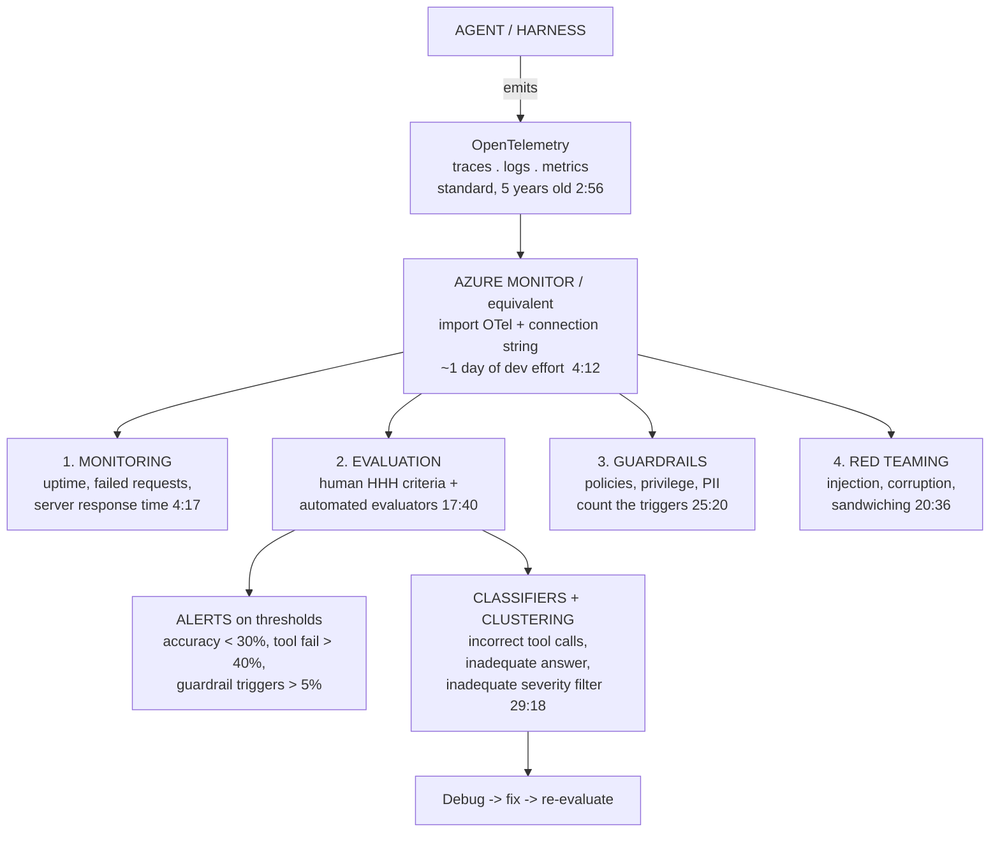
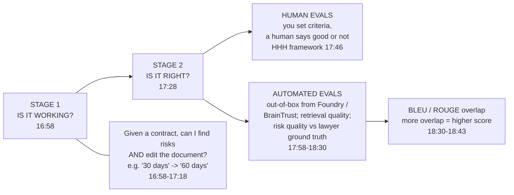
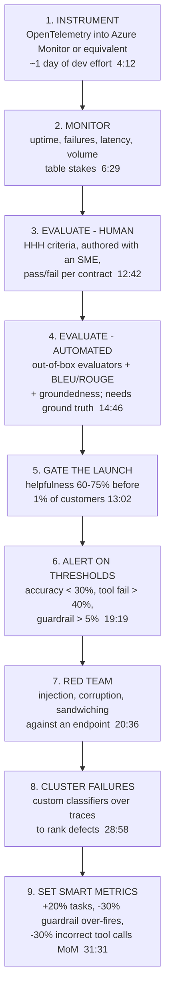

# CS-21 · Building AI Agents with Observability: Traces, Evals, Alerts and Red Teaming

> **Source transcript:** `Building_AI_Agents_with_Observability_Traces_Evals_Alerts_Red_Teaming_Explained.txt` (~39:12, 352 lines)
> **Domain:** production
> **One-liner:** The four pillars of agent observability — monitoring, evaluation, guardrails and red teaming — stacked on OpenTelemetry, with the human-eval cost arithmetic ($250 per contract), the alert thresholds (30%, 40%, 5%), and the explicit PM-versus-engineering responsibility split.
> **Prerequisites:** CS-20, CS-17

## 0. Executive summary

- **Observability has four pillars, and only one is old.** "Monitoring was always there... But evaluations and guardrails are new" `[1:29]` `[1:35]` `[1:38]` `[1:40]`; red teaming is the fourth `[20:21]` `[20:28]`.
- **The foundation is OpenTelemetry, and it is a five-year-old standard.** "There is this thing called open telemetry that I want all of you to go learn. This is there for five years. This is a common standard which every company uses, or at least every cloud provider, as well as most of the new people... support open telemetry" `[2:56]` `[2:58]` `[3:02]` `[3:05]` `[3:08]` `[3:11]` `[3:15]`. Wiring it into Azure Monitor is "maybe **one day effort** for devs" `[4:12]` `[4:17]`.
- **The human-eval cost arithmetic is the single most valuable number in the transcript**: one human question cost **25 cents**; a contract has ~**20 risks**; each risk has **20–30 questions** → ~**1,000 questions** → **$250 to evaluate one contract** `[13:52]` `[14:00]` `[14:08]` `[14:15]` `[14:22]`.
- **The launch gate is a percentage before a ramp**: "I want my helpfulness to be **60% / 75%** before even I launch it internally to **1% of customers**" `[13:02]` `[13:05]` `[13:09]` `[13:12]`.
- **The alert thresholds are stated as numbers**: alert if ground-truth accuracy drops below **30%**; alert if tool calling fails above **40%** `[19:19]` `[19:24]` `[19:29]`; alert if agents respond "with a lot of guardrails more than **5%**" `[30:08]` `[30:11]` `[30:14]`.
- **Cost per session, per user and per task is now PM-owned**, because "starting cost is **20 bucks** but people are paying as they are using the product and if you're not able to manage that cost for them they are going to leave your product" `[23:32]` `[23:35]` `[24:18]` `[24:20]` `[24:23]` `[24:26]`.
- **Two war stories set the scale of failure**: a fix-my-Outlook session that ran three hours and billed **$786** where a human takes five minutes `[7:35]` `[7:53]` `[8:02]` `[8:23]` `[8:29]`; and a company that exhausted its IT budget in three months with expenses "growing **9x month on month**" `[9:23]` `[9:28]` `[9:31]` `[9:35]`.
- **The counter-example that defines over-guarding**: Google's first support agent was so policy-bound that "**six out of 10 customers were just denied access**", not by 500s but by the agent saying "I can't answer this question, it's against my policy" `[24:44]` `[24:51]` `[25:06]` `[25:14]` `[25:20]`.
- **The PM/engineering split is the deliverable**: the PM owns success criteria, cost targets, helpfulness targets, failure definitions, thresholds and alert placement; engineering owns traces, dashboards, alerts and guardrail enforcement `[30:24]` `[30:42]` `[30:53]` `[31:04]` `[31:22]` `[31:27]`.

## 1. The problem this lecture solves

**The framing problem in observability is definitional.** "When people say observability, they sometimes mean monitoring, sometimes mean evaluation, sometimes means guardrails. Monitoring was always there. So monitoring and observability was used interchangeably depending upon who you are buying stuff from. But evaluations and guardrails are new" `[1:25]` `[1:29]` `[1:32]` `[1:35]` `[1:38]`. The session exists to separate the four terms and show where each is configured.

**The accountability problem arrives with production.** "You start hearing things like uptime, reliability, and then you start giving SLAs — that 'hey, we will respond in 2 minutes', 'we will be back to you in 30 seconds', 'we have enough time of 97 9 [99.9]'. All these are SLAs that you sign in your master service agreement. Once you go in production, you are held accountable for everything that you have set up" `[2:23]` `[2:26]` `[2:31]` `[2:36]` `[2:44]` `[2:47]` `[2:50]`.

**The determinism problem is what agents break.** In the old world "any SLA you put was good enough because you could determine what the output would be, and then you can compare, you can run your tests, you can do — every time you make a change you can also run more tests... and if not then you fix it or you make it working" `[6:11]` `[6:14]` `[6:19]` `[6:22]` `[6:24]` `[6:29]`. In the new world, "**is it working is table stakes**. You have to make sure that it's right. You have to make sure it is following the policies or the guardrails — which is don't delete customer data, or don't update customer data, and you should not have privilege to update customer data — and what is the cost" `[6:29]` `[6:32]` `[6:38]` `[6:41]` `[6:45]` `[6:50]`. The reason: "it's not a single call, [and you can't] deterministically say that every time an agentic call [happens] it only makes one call [for] a job" `[6:59]` `[7:02]` `[7:05]`.

**The cost problem is now a product problem, not an infrastructure problem.** This is the argument the session builds toward and it is worth stating in the source's own words: "last year, if you asked me — 'Mah, I'm setting evaluations, do you want me to just evaluate input-output?' — I would have said yeah, just as a PM you should set the quality bar on what the user got and not what happened inside your traces... don't monitor them, that's your engineering responsibility. **This year that responsibility shifts to you, because it started impacting customer behavior and customer cost**" `[23:40]` `[23:44]` `[23:47]` `[23:50]` `[23:56]` `[23:59]` `[24:04]` `[24:09]`.

**The scope-creep risk in observability itself.** A warning delivered early and never repeated: "the challenge with setting a lot of observability is that you might set your team for a **long ship cycle**" `[2:02]` `[2:05]` `[2:10]`.

**Analyst note:** this is the same host as CS-20 — the references to having been at Google `[24:44]`, to a LinkedIn course `[34:22]` `[34:26]`, and to the contract-redlining agent `[11:08]` `[11:22]` are shared. CS-21 is the observability half of the same argument CS-20 makes for evaluation: CS-20 supplies the metric catalogue, CS-21 supplies the instrumentation and the operating cadence. Read them as a pair.

## 2. Definitions & mental models

| Term | Definition | Why it matters |
|---|---|---|
| **Observability** | The umbrella term; in practice the source splits it into monitoring, evaluation, guardrails and red teaming `[1:14]` `[1:20]` `[1:25]` | The word is used interchangeably with monitoring by vendors, which obscures what you are buying `[1:32]` `[1:35]` |
| **Monitoring** | Uptime, failed requests, response time, request volume — the pre-agent discipline `[4:12]` `[4:17]` `[6:03]` `[6:11]` | Table stakes; it does not tell you whether the agent was *right* `[6:29]` `[6:32]` |
| **Evaluation** | Comparing agent behaviour against ground truth and against stated criteria `[10:36]` `[10:42]` | Answers "is it right", which monitoring cannot `[17:28]` |
| **Guardrails** | The constraints the agent must not cross — policies, safety, privilege limits `[6:45]` `[6:50]` `[12:36]` `[12:42]` | Both under- and over-triggering are failures `[25:20]` `[30:11]` |
| **Red teaming** | "You go and voluntarily attack your agent and try to see where it breaks" `[20:28]` `[20:31]` `[20:34]` | The only proactive pillar; the other three are reactive |
| **OpenTelemetry (OTel)** | "A common standard which every company uses... [which] allows you to put traces or put logs in a standard that **any tool can process**" `[3:02]` `[3:05]` `[3:15]` `[3:18]` `[3:23]` | Portability: "if I go to AWS tomorrow I should be able to set it up and run it" `[33:50]` `[33:53]` `[33:55]` |
| **Trace** | The recorded sequence of an agent run, including tool calls and where time and money were spent `[27:33]` `[27:55]` `[28:03]` | The raw material for both debugging and evaluation datasets |
| **Custom trace** | A user-defined view over the raw OTel stream, filtered to what you care about `[27:22]` `[27:25]` `[27:28]` | You do not have to read everything; you have to read the right thing |
| **BLEU / ROUGE** | Word-overlap metrics comparing an agent answer to a human ground-truth answer — "if they have a lot of overlap then your BLEU score is higher" `[18:24]` `[18:30]` `[18:33]` `[18:36]` `[18:37]` `[18:43]` | Cheap, automatic and only as good as the ground truth you supply `[16:02]` `[16:09]` |
| **Groundedness** | "Is your response grounded in the text or is it just hallucinated" `[15:55]` `[15:58]` `[16:02]` | The RAG-specific automatic evaluator |
| **LLM-as-judge** | What you build when "automated evals are not available for everything" `[16:33]` `[16:36]` `[16:39]` `[16:41]` | The escape hatch when no out-of-box evaluator exists |
| **Classifier / clustering** | Custom evaluators or regex applied to traces so conversations can be grouped into failure categories `[28:58]` `[29:02]` `[29:05]` `[29:08]` | Turns a stream of traces into a ranked defect list `[29:18]` `[29:22]` `[29:25]` `[29:32]` |
| **Unbounded agent** | An agent that can red team, draft contracts, compare agents, hold a chat interface and spawn sub-agents `[22:19]` `[22:22]` `[22:26]` `[22:28]` `[22:32]` | Removes the single-task focus that made earlier observability sufficient `[21:54]` `[22:01]` |
| **Agentic loop** | Plan → gather context → take action → run evaluations → repeat until done `[22:45]` `[22:48]` `[22:54]` `[22:57]` | The reason cost is unbounded and long-horizon monitoring is mandatory `[23:03]` `[23:06]` |
| **Smart metric** | A target attached to an evaluator, phrased as a rate of change — "+20% tasks month on month" `[31:27]` `[31:31]` `[31:35]` | Without a target, "they are not going to do that" `[32:31]` `[32:38]` |

**The stack, drawn as it is described:**



## 3. Core content, decomposed

### 3.1 OpenTelemetry as the substrate `[2:56]`

**What the source says.** OTel is presented as the one thing the audience must go and learn, and the reason given is interoperability: "open telemetry allows you to put traces or put logs in a standard that **any tool can process**. Then downstream, once you put open telemetry constructs, then downstream there are open-source or open tools which can process your traces or your logs and give you dashboards or stuff" `[3:15]` `[3:18]` `[3:23]` `[3:23]` `[3:26]` `[3:31]` `[3:35]` `[3:38]`.

**The setup, with an effort estimate** `[3:38]` `[3:40]` `[3:45]` `[3:48]` `[3:51]` `[3:59]` `[4:04]` `[4:12]` `[4:17]`:

| Step | Action |
|---|---|
| 1 | Import OpenTelemetry |
| 2 | Set your application connection string — "and that's pretty much it" |
| 3 | Set how many traces you want |
| 4 | Get logs, insights, visualisations and a dashboard |

"All the apps are working like this, not very hard — maybe **one day effort** for devs to set it up" `[4:08]` `[4:12]` `[4:17]`.

**What you get for that day** `[4:17]` `[4:23]` `[4:29]`: how many requests are failing, server response time, the request being sent, and custom logs surfaced through the same traces.

**Analyst note:** the strategic value of OTel is stated much later, in the tooling discussion: "using open telemetry I'm already setting my traces in a way that if I go to AWS tomorrow I should be able to set it up and run it" `[33:50]` `[33:53]` `[33:55]`. That is the real argument — the standard is what prevents the observability backend from becoming a lock-in. Adopt it for the exit option, not for the dashboard.

### 3.2 Why agents break the old model `[4:47]`

**The agent definition** `[4:47]` `[4:51]` `[4:54]`: "agents are **intelligent machines which have access to your knowledge as signals, tools and guardrails**."

**The capability that makes this dangerous** `[5:32]` `[5:38]` `[5:41]` `[5:45]` `[5:51]`: "these folks can have access to your VMs, knows what is the current state, and has tools like **bash commands to go and delete, update or read stuff**. Obviously you have given it — but **anybody in your team can give these kind of access**, which if you fail to put some guardrails can do things."

**The incident, reported live during the session** `[4:54]` `[5:01]` `[5:08]` `[5:15]` `[5:20]` `[5:26]` `[5:32]`: "somebody pinged us today on our Zoom link or our Teams that somebody gave access to our VM to Claude Code and **it went ahead and deleted all the databases** in experiment... we're trying to figure out who gave Claude Code access to our VM which has access to our database. Somebody must have figured out that doing coding on their side is not much fun — let's just put it on the production VM. But it's an **experiment VM**, that's the saving grace here."

**Analyst note:** this incident is quoted at the top of the transcript as a hook `[0:26]` `[0:28]` `[0:31]` and then told properly at `[5:01]`–`[5:32]`. It is a *privilege* failure, not a model failure — no evaluator would have caught it, which is exactly why the session places guardrails alongside evaluation rather than inside it.

#### 3.2.1 The old-world / new-world table `[5:57]`

| | Old world | New world |
|---|---|---|
| The question | "Is it working?" `[6:03]` | "Is it working is **table stakes**. You have to make sure that it's **right**" `[6:29]` `[6:32]` `[6:35]` |
| Determinism | "You could determine what the output would be and then you can compare" `[6:19]` `[6:22]` | "It's not a single call... [you can't] deterministically say that every time an agentic call it only makes one call... to get a job done" `[6:59]` `[7:02]` `[7:05]` |
| What you measured | Uptime, failed requests, elapsed time, any SLA `[6:03]` `[6:05]` `[6:11]` | Whether it followed policy, whether it had privilege it should not have, and **what it cost** `[6:38]` `[6:45]` `[6:50]` `[6:53]` |
| Cadence | Test on every change `[6:24]` `[6:29]` | Continuous, because failure is non-deterministic `[9:01]` `[9:10]` |

#### 3.2.2 The fix-my-Outlook story, with the bill `[7:14]`

This is the transcript's most concrete cost anecdote and it is worth recording in full.

| Element | Detail | Anchor |
|---|---|---|
| The customer | A company the speaker works with on managing AI cost and impact | `[7:14]` `[7:21]` |
| The rollout | "They use Claude Code and co-work and they gave it to their IT team, gave it to everybody" | `[7:21]` `[7:27]` |
| The request | "Somebody came in and said, hey, **fix my Outlook**" | `[7:27]` `[7:35]` |
| The failure | "Then they just went on a **three-hour fix-my-Outlook fail**. Every time fix-my-Outlook is a very broad task and Claude Code or co-work goes in and tries to debug it, and then it keeps asking questions and the user keeps saying 'yes, yes, yes'" | `[7:35]` `[7:42]` `[7:45]` `[7:53]` |
| **The bill** | "End of 3 hours the bill is **$786**" | `[7:53]` `[8:02]` |
| The actual fix | "It figured that problem out **in 2 minutes** by saying 'hey, your Outlook is not working — what is not working?' 'Oh, we are not able to send emails.' 'Here is my email address, I put it and I send it and it doesn't go.' And then they say, 'Oh, **you put a rule that before sending this email to this client, wait 3 hours**. That's the problem.'" | `[8:02]` `[8:07]` `[8:11]` `[8:15]` `[8:20]` `[8:23]` |
| The lesson | "A human can fix it in **5 minutes** and an agent can't figure it out after spending **$1,000**" | `[8:23]` `[8:26]` `[8:29]` |

**Analyst note:** note that the bill is quoted twice with different numbers — **$786** for the actual session `[7:53]` `[8:02]` and **$1,000** in the rhetorical framing `[8:23]` `[8:29]` (also repeated in the opening hook `[0:09]` `[0:15]`). The $786 is the observed figure; the $1,000 is the speaker rounding up for effect. Quote the $786. The root cause of the blowup is not model quality — it is that the task was accepted at the wrong level of abstraction and the clarifying question ("what is not working?") that resolves it in one turn was asked at hour three instead of minute one.

#### 3.2.3 The 9x-month-on-month cost story `[9:18]`

**What the source says** `[9:18]` `[9:23]` `[9:28]` `[9:31]` `[9:35]` `[9:42]` `[9:49]` `[9:55]`:

> "We're talking to another company where they have **run out of their IT budget in 3 months** of rolling out Claude Code, because the expenses are growing **9x month on month** and they have no money left to buy anything. So now they are figuring out how to get extra money, or stop pushing Claude Code to at least five or six departments where they don't see any impact as much as they thought. And we are helping them to see the impact — where the impact should be or not."

**The two named enterprise constraints** `[9:55]` `[9:58]` `[10:00]` `[10:08]` `[10:12]` `[10:15]`: "one is **cost**, second is the **TPM / RPM limits** throughout the enterprise that people can go hit. So those are the real challenges." TPM/RPM here means tokens-per-minute and requests-per-minute quota, not a per-seat metric — the constraint is the enterprise's shared rate ceiling.

**The long-horizon argument that frames both stories** `[8:35]` `[8:38]` `[8:41]` `[8:49]` `[8:55]` `[9:01]` `[9:10]` `[9:14]` `[9:18]`:

> "You're going from hair to hair as you are shipping agents, and especially in production, especially **unbounded agents** which are supposed to plan, act, gather context, take action, [and] eval — the agentic loop... And we have **long-horizon jobs** so that these agents can go and run for 10 minutes, 15 minutes, 30 minutes, maybe **16 hours**. That means failure, or not observing how they fail, or how much it cost for us to get things done [for] what our customers ask it to, will be a **recipe for failure of a product**."

### 3.3 Evaluation: human first, then automatic `[10:36]`

**The definition of evaluation given here** `[10:36]` `[10:42]` `[10:48]` `[10:55]`: "you can set up what the agent should behave like — **a ground truth** — and also set up what it **should do and what it should not do**, and then compare it and then figure out whether it's working or not."

**The HHH adaptation** `[10:55]` `[10:58]` `[11:02]` `[11:05]` `[11:08]`: "instead of just saying that it's right, we also say it's **helpful, it's honest, it's harmless**. What does that mean? That means that you can set up a list of questions or criteria."

#### 3.3.1 Helpful criteria, worked on the contract agent `[11:08]`

The agent: "goes and finds risk and also edits your document or contract to avoid those risks" `[11:08]` `[11:14]` `[11:22]`.

| Criterion (from a lawyer's perspective) | Anchor |
|---|---|
| The replacement text should be in the **right location** | `[11:22]` `[11:29]` |
| It should be **clear** | `[11:29]` `[11:31]` |
| It should keep the **grammar intent** | `[11:31]` `[11:37]` |
| It should **preserve the original clause** | `[11:37]` `[11:40]` |
| It should **not be too verbose but not too shallow** also | `[11:40]` `[11:45]` |
| And you can quickly **verify** it | `[11:45]` `[11:48]` |

**The test of the criteria** `[11:53]` `[11:59]` `[12:06]` `[12:14]` `[12:20]` `[12:26]`: "'Okay, it did the redlines, it gave me the risk and it inserted it in the document — but is it really helpful?' And if it is, then you can define the criteria of what helpful means in your domain... If that agent is helpful, it will be able to answer most of these questions as yes. And then you can say if most of these questions are no, then it's not very helpful — **even if it is working**."

**Analyst note:** "even if it is working" is the load-bearing phrase. It is the same distinction CS-20 draws between task completion and quality `[59:55]` there, arrived at independently in this session. Both speakers — the same person — converge on: working is a gate, helpful is the product.

#### 3.3.2 Honest and harmless `[12:26]`

| Bucket | Criteria | Anchor |
|---|---|---|
| **Honest** | "If you can **map its things on the source**, if you can **verify its work**, if it is **telling truth most of the time**" | `[12:26]` `[12:28]` `[12:31]` `[12:33]` `[12:36]` |
| **Harmless** | "You can also have your **policies, your guardrails**, and those questions are in your harmless criteria" | `[12:36]` `[12:39]` `[12:42]` |

**The operating cadence** `[12:42]` `[12:48]` `[12:55]`: "ask these questions to your subject matter expert on **every time a contract is uploaded** or [a] risk [is] specified — you can go and evaluate your agents."

#### 3.3.3 The launch gate `[13:02]`

> "You can also set up criteria which is: I want my helpfulness to be **60%, 75%**, before even I launch it **internally to 1% of customers**. So before internal launch, these are my targets. Okay, you're cool — you have set up evaluations. That means at least you are heading in the right direction, [and] you are **50% there**."

**Analyst note:** note the sequencing claim — evaluations alone get you "50% there" `[13:19]` `[13:24]`. The remaining half is the automation and monitoring stack in §3.5 and §3.7. Note also that the gate is two-tiered: 60% is the floor, 75% the target, and the exposure is 1% of customers, internal first.

### 3.4 The human-eval cost arithmetic `[13:44]`

This is the section the transcript exists for. It is stated as a measured figure.

**The setup** `[13:44]` `[13:52]`: "But this is humans. **Humans are expenses.** There are expenses on humans. We also checked: just asking a **single question** to a human evaluator was costing **25 cents**, with Azure, with the AWS Bedrock evaluations."

**The multiplication** `[14:00]` `[14:08]` `[14:15]` `[14:22]`:

| Quantity | Value |
|---|---|
| Cost per human question | **$0.25** `[13:58]` `[14:00]` |
| Risks per contract | **20** `[14:00]` `[14:05]` |
| Questions per risk | **20 to 30** `[14:05]` `[14:08]` |
| Questions per contract evaluation | "around **1,000**... thousand questions of yes-no-yes-yes-no-yes-no" `[14:08]` `[14:15]` |
| **Cost per contract evaluation** | **$250** — "if you multiply that by 25 cents you are basically spending **$250 evaluating one contract[‘s] results**" `[14:15]` `[14:18]` `[14:22]` |

**The three blockers to scaling it** `[14:31]` `[14:34]` `[14:39]`: "One, it's expensive. Second is time-consuming. Third, you may not be able to finish these things on the right kind of talent that is needed."

**Analyst note:** this arithmetic is the strongest quantitative content in the source, and it is also the clearest statement anywhere in Track B of *why* automated evaluation is not a convenience but a precondition. At $250 per contract, human evaluation has a hard throughput ceiling that has nothing to do with quality. Note the two embedded assumptions: that 20 risks per contract and 20–30 questions per risk are typical, and that the 25 cents is a *platform-charged* per-question rate (Azure / Bedrock evaluations), not an internal labour cost. Substitute your own labour rate and the number gets worse, not better.

#### 3.4.1 Automated evaluators `[14:46]`

| Capability | Detail | Anchor |
|---|---|---|
| What they are | "Microsoft Foundry — you can set up evaluators. These are **automatic evaluators** which can answer these questions yes or no for us" | `[14:46]` `[14:53]` `[14:56]` `[14:59]` |
| Human-vs-agent comparison | "If you give it an answer by a lawyer and an answer by your agent, this score can tell you whether they are similar or not" | `[14:59]` `[15:02]` `[15:06]` |
| Precision | "Then you can find out how many words, if a lawyer said this is a risk, or the risk explanation from a lawyer, are there in the evaluator versus what you have... This checks how many **precise words**" | `[15:06]` `[15:12]` `[15:22]` `[15:29]` |
| Recall | "This checks how many words you are able to **recall**" | `[15:29]` `[15:32]` |
| Other implementations | "**Google have their own version of it.** You can read more about these metrics" | `[15:29]` `[15:32]` `[15:35]` |
| RAG evaluators | "Document retrieval, **groundedness** — is your response grounded in the text or is it just hallucinated" | `[15:55]` `[15:58]` `[16:02]` |
| The blocker | "All these can be automatically applied, **but they require ground truths**. So now your blocker becomes **getting the data**" | `[16:02]` `[16:09]` `[16:14]` |
| Availability | "These evaluators are available **out of box**. You can just throw this and machines will be able to tell you" | `[16:14]` `[16:19]` |
| The gap-filler | "Automated evals are not available for everything, but for that you can **create your LLM as the judge**" | `[16:33]` `[16:36]` `[16:39]` `[16:41]` `[16:44]` |

**Analyst note:** "your blocker becomes getting the data" `[16:09]` `[16:14]` is the correct framing of the whole automated-eval proposition, and it is understated here. Everything downstream — BLEU, ROUGE, groundedness, LLM-as-judge — is only as good as the human ground truth it is scored against, and the ground truth is exactly the thing that costs $250 a contract to produce. The automation does not remove the human cost; it converts a per-evaluation cost into a one-time dataset cost.

#### 3.4.2 The two-stage structure `[16:49]`



| Stage | The question | Detail | Anchor |
|---|---|---|---|
| 1 | "Is it working?" | "Given a contract, can I find risks and also go and edit the document with my language — saying '30 days, I don't take payment in 30 days, I need payment in... I will pay only in 60 days' — I can also edit it. So this is just validating, is it working" | `[16:58]` `[17:02]` `[17:05]` `[17:12]` `[17:18]` `[17:24]` `[17:28]` |
| 2 | "Is it right?" | Split into human evals with HHH criteria, and automated out-of-box evaluators | `[17:28]` `[17:40]` `[17:46]` `[17:52]` `[17:58]` |

**BLEU and ROUGE, as defined here** `[18:24]` `[18:30]` `[18:33]` `[18:36]` `[18:37]` `[18:43]`: "the risk quality, comparing it to a human ground truth which is a lawyer, versus this — and say how similar are these, how many words from this are taken into this, which is the **BLEU score**. If they have a lot of overlap then your BLEU score is higher. If you have less overlap then your BLEU score is lower... **if similarity is just an overlap on these BLEU or ROUGE metrics**, good."

### 3.5 Alerts: the third pillar, with thresholds `[18:53]`

**The transition** `[18:53]` `[19:02]` `[19:09]`: "If you set that up then your challenge is — how about real data? This is all post[-hoc]... then you need to set up pre[-production] or deploy these things in production. So what you can do is you can **set up alerts**, and these alerts allow you to go or **track your agents in real time**."

**The example alert rules, quoted verbatim** `[19:19]` `[19:24]` `[19:29]` `[19:35]` `[19:38]`:

> "Say: 'hey, if the **ground truth accuracy drops below 30%, then send me an email**. If this **tool calling fails above this 40%, then send me an email**, or send in an alert, or file a bug.' All this is possible."

| Alert | Threshold | Direction | Anchor |
|---|---|---|---|
| Ground-truth accuracy | **< 30%** | Floor breach | `[19:19]` `[19:24]` |
| Tool-calling failure | **> 40%** | Ceiling breach | `[19:29]` |
| Guardrail trigger rate | **> 5%** | Ceiling breach | `[30:08]` `[30:11]` `[30:14]` |

**Where it is configured** `[19:48]` `[19:55]` `[20:00]` `[20:05]` `[20:13]`: "in **Azure Monitor**. Azure Monitor allows you to set up alerts. You can figure out what kind of alert rule [you need] and then you can set this up. This also applies to these AI or agentic evaluators. So you can say 'hey, if **my score for this particular question drops below this**, I want to be alerted.'"

**Analyst note:** these three thresholds are given as illustrative examples in a demo, not as calibrated recommendations. They are still the only concrete alert numbers in Track B's production sources and are worth recording as such. Note the asymmetry — accuracy has a floor, failures have ceilings, and the guardrail alert is a **ceiling on guardrail activations**, which only makes sense once you accept §3.6's argument that over-triggering is itself a defect.

### 3.6 Red teaming: the fourth pillar `[20:21]`

**What it is** `[20:21]` `[20:24]` `[20:28]`: "people are trying to break or use my agents in bad ways. How can I solve it? That's the third piece in this story, which is this idea of **red teaming**, where you go and **voluntarily attack your agent** and try to see where it breaks."

**The named attack techniques** `[20:36]` `[20:39]` `[20:42]` `[20:45]` `[20:50]`:

| Technique | Named at |
|---|---|
| **Prompt injection** | `[20:39]` `[20:42]` |
| **Prompt corruption** | `[20:42]` `[20:45]` |
| **Prompt sandwiching** | `[20:45]` `[20:50]` |

"These are the techniques people use to hack your agents, to do bad things, or get past your guardrails or your security threats" `[20:45]` `[20:47]` `[20:50]`.

**The tooling and the workflow** `[20:57]` `[21:04]` `[21:10]` `[21:16]` `[21:23]` `[21:29]` `[21:37]`:

| Element | Detail |
|---|---|
| Automation | "All these are also automated — **not perfection**, but a lot of these things you can also offload with tools like Azure Monitor or BrainTrust" |
| Defaults | Tools ship with "by default what kind of attacks they have seen" |
| Input | "You just give it an **endpoint**" |
| Behaviour | "It will **plan the attack**, it will make those attacks, and then say whether it failed or passed the attacks" |
| Output | Pass/fail plus **how much time it took** |

**Analyst note:** "not perfection" is the speaker's own qualifier and should be carried with the claim. The endpoint-only interface described here is materially thinner than the red-team workflow in CS-16, which walks the actual toxicity, leakage and scope-drift tests. Use CS-21 for the pillar's place in the stack and CS-16 for the test design.

### 3.7 The 2026 shift: unbounded agents `[21:45]`

**The thesis** `[21:45]` `[21:48]` `[21:54]` `[22:01]`:

> "We have done everything right, we have set up alerts, we are evaluating, we have alerts and we have done red teaming. **Is that enough in 2026?** So 2026, what one thing has changed, is that **you need to remove a lot of boundaries**. These all things worked if you narrowed the focus and did only one thing."

**What an unbounded agent is** `[22:12]` `[22:19]` `[22:22]` `[22:26]` `[22:28]` `[22:32]` `[22:39]`:

| Capability | Anchor |
|---|---|
| It can do red teaming | `[22:19]` `[22:22]` |
| It can also draft contracts | `[22:22]` `[22:26]` |
| It can compare two agents | `[22:26]` |
| It has a chat interface | `[22:28]` `[22:32]` |
| It can be given different skills, or create your own agents or sub-agents | `[22:32]` |
| Named example | **Claude Co-work** "and the apps that you will build" `[22:32]` `[22:35]` `[22:39]` |

**Why this arrives now** `[22:39]` `[22:45]` `[22:48]` `[22:54]` `[22:57]` `[23:03]` `[23:10]` `[23:18]`:

> "Your customers are going to push you this year to not narrow the focus to one task but give them an **unbounded agent** which can plan, [gather] context, run the [action], run evaluations, and then keep doing this again and again **unless the job is done**. So more and more apps that you will build in 2026 will hopefully be built on top of the **agentic loop**... This is an **opportunity as well as new responsibility**."

#### 3.7.1 What must now be observed `[23:32]`

**The new metric list** `[23:32]` `[23:35]` `[23:37]` `[23:40]`:

| Metric | Anchor |
|---|---|
| **Cost per session, per user, per task** | `[23:32]` `[23:35]` |
| **Time taken to complete tasks** | `[23:37]` `[23:40]` |
| **Error rate across all components** | `[23:40]` |

**The responsibility shift, argued in full** `[23:40]` `[23:44]` `[23:47]` `[23:50]` `[23:56]` `[23:59]` `[24:04]` `[24:09]` `[24:12]` `[24:18]` `[24:20]` `[24:23]` `[24:26]` `[24:28]`:

> "Last year if you asked me, 'Mah, I'm setting evaluations, do you want me to just evaluate input-output?' — I would have said yeah, just as a PM you should set the quality bar on what the user got, and not what happened inside your traces. If you had multi-agent, or if you had a lot of agents just gathering context — **don't monitor them, that's your engineering responsibility**. This year that responsibility **shifts to you**, because it started impacting customer behavior and customer cost. And not to the measure of 5, 10% — **the cost is the deciding factor**, because the starting cost is **20 bucks** but people are paying as they are using the product, and if you're not able to manage that cost for them, **they are going to leave your product**. So it's a critical product decision now to measure these things and also the failure rates."

**Analyst note:** this is the intellectual centre of the session. The claim is that the boundary between product metrics and infrastructure metrics moved because the infrastructure metric became a customer-facing one. The "starting cost is 20 bucks" figure `[24:18]` `[24:20]` is a per-seat or per-month list price for the coding assistant in question, contrasted against usage-based billing that can run away — the same shape as CS-20's ROI-first constraint, seen from the buyer's side rather than the seller's.

#### 3.7.2 The Google support agent: over-guarding as a defect `[24:37]`

**The story, in the source's words** `[24:37]` `[24:44]` `[24:51]` `[24:59]` `[25:06]` `[25:14]` `[25:20]`:

> "When we launched our first agent, when I was at Google, we launched this support agent and we put a lot of guardrails. And then I looked at the traces and **60% of the time** if the user came to us we said 'hey, we can't answer this question' — because we said if it says credit card, if it asks for personal information, if it asks any question about Google, we put so many policies that **six out of 10 customers were just denied access** — not by the error or 500 errors on the service level, but by the agent saying 'I can't answer this question, **it's against my policy**.'"

**The two metrics this produces** `[25:20]` `[25:23]` `[25:27]` `[25:34]` `[25:41]`:

| Metric | Question |
|---|---|
| Guardrail trigger rate | "How many times are you triggering these guardrails" |
| Missed tool opportunity | "How many times you have a tool which could have been called and you could have got a more precise, correct answer or more precise solution much faster, but because you're failing to call that tool" |

And the conclusion: "**that's why your agent is failing today**" `[25:34]` `[25:38]` `[25:41]`.

**Analyst note:** the 60% figure and the 6-in-10 figure are the same measurement stated twice `[24:51]` `[25:06]` `[25:14]`. This is the strongest argument in Track B for treating guardrails as a **two-sided** control: a guardrail that fires when it should not is as much a production defect as one that fails to fire, and only the alert at `[30:14]` ("more than 5%") operationalises that. CS-16's scope-drift material is the test design counterpart.

**The limits of pre-production measurement** `[25:41]` `[25:49]` `[25:55]` `[26:02]`:

> "Without these, the quality of your agent is best of luck. And by the way, you can do these evaluations pre[-production], you can set the alerts, you can have the red teaming — **these costs or these things won't be captured in that**, or even if you are able to capture some of that, most of it is going to happen **live** and you will see these traces."

### 3.8 Agent monitoring metrics and custom traces `[26:12]`

**The metric set available in agent monitoring** `[26:12]` `[26:20]` `[26:25]` `[26:31]` `[26:37]` `[26:43]` `[26:50]` `[26:56]` `[27:02]`:

| Metric | Definition, as given |
|---|---|
| **Tool call accuracy** | "This measures how many times you are supposed to call a tool **and it's called correctly**" |
| **Task adherence** | "If I gave you a task, you have **not drifted away from the task** and start doing something else — what is at each step you are staying with the plan" |
| **Task navigation** | "How many times you're able to get the right task and map it to the right tools and **create right plans**" |
| **Safety** | "This of course is the safety piece which all of you have seen" |

The speaker notes these are Azure's names "and most of the observability frameworks will give you something like that" `[26:25]` `[26:28]` `[26:31]` — and that Azure "allows you to **combine multiple evaluators**" `[26:12]` `[26:15]` `[26:20]`.

#### 3.8.1 Custom traces `[27:14]`

**Why they are possible at all** `[27:14]` `[27:18]` `[27:22]` `[27:25]` `[27:28]`: "you got a trace so you can get all the traces **because you use OpenTelemetry that dumps everything** — and then what you can do is you can build just **custom traces**, so you can just go and see what is important to you."

**The worked example** `[27:33]` `[27:36]` `[27:42]` `[27:49]` `[27:55]` `[28:03]` `[28:10]` `[28:15]`:

> "They will ask the question: where you have gone ahead in a **bash tool** and you have seen errors? That means you have tried to run a command on this machine and that failed. And now it will just give you **all the instances**. And this trace shows you the tool calls made, and this is **the failure call where you spend 1 minute recovering, trying again and again**. And then ideally they should map it to the **tokens** also, which shows that every time this kind of failure happens, **how much money is getting wasted** in your agent's journey."

**The closing claim** `[28:20]` `[28:25]` `[28:32]`: "these are the kind of tools... and this is the kind of things your engineering needs for you to be successful in 2026 onwards."

#### 3.8.2 Custom classifiers and clustering `[28:32]`

**What you build** `[28:32]` `[28:39]` `[28:44]` `[28:51]` `[28:58]` `[29:05]`:

> "You should be able to build your **own classifier** — which is what they did here — that 'hey, how many times a bash command fails in my trace'. I want to observe that. I want to observe just how many times a customer is saying in a trace 'I just told you that', or '**this is not a violation, why are you stopping me**'... So the customer phrases — once you have these custom evaluators you can put a classifier, you can put **regex**, and this allows you to then **cluster all your conversations** into different categories."

**The example clusters** `[29:18]` `[29:22]` `[29:25]` `[29:32]` `[29:38]` `[29:44]`:

| Cluster | What it means |
|---|---|
| **Incorrect tool calls** | Wrong or malformed tool invocations |
| **Inadequate final answer** | The answer was insufficient |
| **Inadequate severity filtering** | "We are just saying that [we should stop this] — this is a guardrail which is not correct," i.e. over-triggering |

**The purpose** `[29:38]` `[29:44]` `[29:49]` `[29:56]`: "you can set these classifiers and then cluster each conversation, or all your conversations that happen every day, and then go deep [on] debugging or figuring out how and where things are going wrong. So these are the new observable tools that you have to tackle the new requirements — which is **unbounded agents and long-horizon jobs costing you as well as your customers a lot of money**."

**Analyst note:** the "why are you stopping me" phrase `[28:51]` `[28:58]` is the highest-signal classifier input in the transcript, because it detects the over-guarding failure from the customer's own words rather than from a rubric. It requires no ground truth and no evaluator — just clustering on customer phrasing — which makes it the cheapest high-value signal described in this session.

### 3.9 Targets on the observables `[30:03]`

**What the source says** `[30:03]` `[30:08]` `[30:11]` `[30:14]` `[30:14]` `[30:24]`: "you can also **set targets** like you did earlier on these observable things, and you can say 'hey, if our agents start responding with a lot of **guardrails more than 5%**, then give me an alert.' You can also use these traces to go **test your evaluations** or **set your evaluations for the future**."

### 3.10 The PM-versus-engineering split `[30:24]`

This is the session's terminal deliverable and it is stated as two lists.

**What the PM owns** `[30:24]` `[30:30]` `[30:35]` `[30:42]` `[30:48]` `[30:53]` `[30:59]` `[31:04]` `[31:11]` `[31:17]`:

| PM responsibility | Anchor |
|---|---|
| "What does **success** look like for each **user intent**?" | `[30:42]` `[30:45]` |
| "You need to specify what the **average cost** is" | `[30:45]` `[30:48]` |
| "You need to **set the target for helpfulness**" | `[30:48]` |
| "You need to specify **what a helpful response is**" | `[30:48]` `[30:53]` |
| "What does **failure** look like? Are we measuring **tool failures**? Are we measuring **knowledge failures**?" | `[30:53]` `[30:56]` `[30:59]` |
| "If we are measuring them, then what are the **targets** we are setting for improvements?" | `[30:59]` `[31:04]` |
| "What are the **thresholds**? **Where** should we set alerts?" | `[31:04]` `[31:08]` |
| "Which behaviors from the agent perspective are **accepted and what's not accepted** that we need to measure and control" | `[31:08]` `[31:11]` `[31:14]` `[31:17]` |

**What engineering owns** `[31:17]` `[31:22]` `[31:27]`: "Once you define these responsibilities, your engineers will be able to go **write these traces, build the dashboards, write the alerts, enforce these guardrails**. That's their responsibilities."

**Analyst note:** the split is clean and it is a *definitions-versus-implementation* line, not a "who cares about quality" line. The rhetorical question that produces it — "if we are going to set up clusters, if we're going to set up traces, then what is the engineer going to do? Why are they getting paid?" `[30:30]` `[30:35]` — is answered by the fact that the PM supplies the *what*, and engineering supplies the *how*. Without the PM's definitions, engineering instruments the wrong things: "even if they are going to do that, they will set this up incorrectly and **not what your customers are facing the maximum pain from**" `[32:43]` `[32:45]` `[32:48]`.

#### 3.10.1 Smart metrics `[31:27]`

**What a smart metric is** `[31:27]` `[31:31]` `[31:35]` `[31:42]` `[31:48]`: a target expressed as a rate of change, tied to a business outcome. The three examples given:

| Target | Wording | Anchor |
|---|---|---|
| Task volume | "I want to be able to **increase the number of tasks** that our agent is performing **20% month on month**" | `[31:31]` `[31:35]` `[31:38]` `[31:42]` |
| Guardrail over-triggering | "A target of **removing incorrect guardrail triggers, 30%**" | `[31:56]` `[31:59]` `[32:03]` |
| Tool calling | "Reduce the **incorrect tool calling month-on-month by 30%**" | `[32:03]` `[32:06]` |

**The business logic behind the first one** `[31:42]` `[31:48]` `[31:51]`: "Uber metrics: every time you perform a task you get paid, either by getting more customer usage or by money. Then you want it to be more helpful, and you can set that as a target."

**Why targets are the enforcement mechanism** `[32:03]` `[32:09]` `[32:17]` `[32:25]` `[32:31]` `[32:38]` `[32:43]` `[32:48]`:

> "Once you set these targets, your engineering is now **forced to use the tools** I was just showing you, which is available in agent [Foundry] as well as AWS Core [AgentCore]... And once you have these things, they will be able to give you a number [of] where they are, and then they can set a target for next month or next 6 months and then show you progress month on month. **If you don't set it up, then they are not going to do that.**"

### 3.11 The tool landscape `[32:48]`

| Tool | The source's assessment | Anchor |
|---|---|---|
| **Azure AI Foundry / Azure agent observability** | Stated personal preference. "Two reasons for that: one is we are on Azure and not on AWS" | `[32:48]` `[33:15]` `[33:18]` `[33:23]` |
| **AWS Bedrock AgentCore** | "I have looked at Agent Core from AWS Bedrock and that also sounds **very very promising**" — recommended if you are on AWS | `[33:23]` `[33:30]` `[33:50]` `[34:02]` |
| **Braintrust** | "They are trying to be cool but they don't have the kind of **scale and the kind of ease**, at least for me, which will be compelling for me to leave Azure and get to a third party" | `[33:30]` `[33:36]` `[33:42]` |
| **LangSmith** | Same assessment as Braintrust; "**LangSmith is here, so it made it to the chart for us**" | `[33:08]` `[33:15]` `[33:30]` |
| **Arize** | "I won't say Arize, because **their PMs are not even interested in solving evaluations for themselves**" | `[32:57]` `[33:03]` |
| **GCP** | "I have **not looked at GCP**, but hopefully GCP also has a way of offering the observability tools that I was showing you" | `[34:02]` `[34:05]` `[34:10]` |

**The portability argument** `[33:42]` `[33:45]` `[33:50]` `[33:53]` `[33:55]`:

> "Using **OpenTelemetry** I'm already setting my traces in a way that **if I go to AWS tomorrow I should be able to set it up and run it**. So my suggestion will be going to AI Foundry, or Agent Core if you're on AWS."

**Analyst note:** this is the same speaker as CS-20 and the same opinion, delivered more bluntly — see CS-20's §3.9. Note that the ranking of the *same* tools is identical across both sessions (Azure first, AWS second, third-party dismissed), which raises confidence that it is a considered position and lowers confidence that it is an independent data point. The Arize remark here goes further than CS-20's "do less but say more and price more": it is an **ad hominem about a vendor's product managers** `[32:57]` `[33:03]`, with no technical claim attached. Both sessions disclose no commercial relationship with Azure, and CS-20 discloses the platform does not pay the speaker `[7:20]` there.

### 3.12 The promotional tail `[34:16]`

Recorded because it is part of the source, not because it is technical.

| Item | Detail | Anchor |
|---|---|---|
| LinkedIn course | "I recorded this awesome course on LinkedIn" — how to set up red teaming, Azure Monitor, how to monitor these things | `[34:16]` `[34:22]` `[34:26]` |
| Refresh | "I'm going to do a **refresh** of that, hopefully in **September** this year, where I will add a lot of agent observability" | `[34:29]` `[34:31]` `[34:36]` |
| Price | "It's **free if you have LinkedIn Premium** subscription. If not, I think it's **10 bucks or 15 bucks**. So watch it and then you can cancel it" | `[34:42]` `[34:47]` `[34:47]` `[34:53]` |
| Existing capability | "You need not wait for me till September. You can just go and upgrade your [agents] by using the **new agent observability that they launched, I believe, 2 months ago**" | `[35:11]` `[35:16]` `[35:18]` |
| Next session | Amplitude plus Claude Co-work to generate weekly / daily / monthly business reports and "become a data-driven PM" | `[35:28]` `[35:34]` `[35:40]` `[35:48]` |
| Session after | "**21 days of technical prep road map** — how can you become more technical and get ready for technical interviews" | `[36:04]` `[36:09]` |
| Course | Starting **June 29** / first week of July, upgraded from **3 to 6 weeks**, **25% off** with code **early bird** | `[36:17]` `[36:24]` `[36:50]` `[37:42]` `[37:52]` |
| Course content | "Four phases of AI PM interviews — how to succeed in case studies, product sense interviews, technical interviews, and how to articulate your current experience" | `[37:04]` `[37:11]` `[37:17]` `[37:24]` |
| Channels | Substack (free sessions, invitations) and a YouTube channel with three years of recordings | `[37:52]` `[37:57]` `[38:41]` `[38:48]` `[38:53]` |

## 4. Frameworks & decision procedures

### 4.1 The four-pillar build order



### 4.2 Triage: which pillar does this problem belong to?

| Symptom | Pillar | First instrument |
|---|---|---|
| Service is down or slow | Monitoring | Uptime, latency, error rate `[4:17]` |
| The answer is wrong | Evaluation | Ground truth + evaluators `[10:36]` |
| The agent did something it should not | Guardrails | Privilege scope + policy `[6:45]` |
| The agent refused something it should have done | Guardrails (over-trigger) | Guardrail trigger count `[25:20]` `[30:11]` |
| An adversary got past the agent | Red teaming | Attack endpoint `[21:23]` `[21:29]` |
| The bill is out of control | Cost observability | Cost per session / user / task `[23:32]` |
| You cannot tell which of the above it is | Clustering | Classifiers over traces `[28:58]` |

### 4.3 The PM/engineering responsibility split, as a checklist

**PM `[30:42]`–`[31:17]`:**

1. Success definition per user intent
2. Average cost per unit of work
3. Helpfulness target
4. The definition of a helpful response
5. Failure taxonomy — tool failures vs knowledge failures
6. Improvement targets per failure class
7. Thresholds and alert placement
8. Accepted vs unaccepted agent behaviours

**Engineering `[31:17]`–`[31:27]`:**

1. Write the traces
2. Build the dashboards
3. Write the alerts
4. Enforce the guardrails

## 5. Worked end-to-end example

**A contract-redlining agent, instrumented end to end.** Assembled from §3.3, §3.4, §3.6, §3.8 and §3.9.

**Step 1 — Define the work.** The agent finds risks in a contract and edits the document to avoid them, e.g. changing a "30 days" payment term to "60 days" `[11:08]` `[11:14]` `[17:02]` `[17:18]`.

**Step 2 — Instrument.** Emit OTel traces and logs; point them at Azure Monitor with the connection string; set the trace volume. Budget one developer-day `[3:38]` `[4:12]` `[4:17]`.

**Step 3 — Stage 1 gate: does it work?** Given a contract, were risks found and was the document edited `[16:58]` `[17:24]`. Binary, no expert needed.

**Step 4 — Stage 2: author the human criteria with a lawyer.** Helpful: right location, clear, preserves grammar intent, preserves the original clause, not verbose and not shallow, verifiable `[11:22]` `[11:48]`. Honest: maps to the source, verifiable, truthful `[12:26]` `[12:36]`. Harmless: policies and guardrails `[12:36]` `[12:42]`.

**Step 5 — Run the human eval once and price it.** 20 risks × 20–30 questions = ~1,000 yes/no questions × $0.25 = **$250 per contract** `[14:00]` `[14:08]` `[14:15]` `[14:22]`. This is the number that forces automation.

**Step 6 — Automate against ground truth.** Upload the lawyer's answer; run out-of-box evaluators for precision and recall of risk words `[15:06]` `[15:29]`; add BLEU/ROUGE overlap against the human answer `[18:24]` `[18:43]`; add retrieval and groundedness evaluators if the agent is RAG-based `[15:55]` `[16:02]`. Where nothing out of box exists, build an LLM judge `[16:36]` `[16:44]`. Expect the binding constraint to be the ground-truth dataset, not the evaluator `[16:09]` `[16:14]`.

**Step 7 — Gate the launch.** Helpfulness 60% (floor) to 75% (target) before an internal launch to 1% of customers `[13:02]` `[13:12]`.

**Step 8 — Set the alerts.** Ground-truth accuracy below **30%**; tool-calling failure above **40%** `[19:19]` `[19:29]`. Add a guardrail-trigger ceiling later at **5%** `[30:11]` `[30:14]`.

**Step 9 — Red team.** Give the tool the endpoint, let it plan and run injection, corruption and sandwiching attacks, and read pass/fail plus duration `[20:36]` `[21:10]` `[21:23]` `[21:29]`.

**Step 10 — Cluster the live failures.** Custom classifiers for: bash-tool errors, "why are you stopping me", incorrect tool calls, inadequate final answer, inadequate severity filtering `[27:42]` `[28:51]` `[29:18]` `[29:32]`. Overlay token cost on the failure clusters to see "how much money is getting wasted" `[28:03]` `[28:15]`.

**Step 11 — Set month-on-month targets.** +20% tasks performed; −30% incorrect guardrail triggers; −30% incorrect tool calling `[31:31]` `[32:03]`. These are what force engineering to keep the instrumentation alive `[32:03]` `[32:09]` `[32:38]`.

**The decision rule that falls out:** instrument once, monitor always, evaluate against ground truth, gate the launch on a number, alert on thresholds, attack on purpose, cluster what actually happens, and attach every one of those to a month-on-month target — because "if you don't set it up, then they are not going to do that" `[32:38]`.

## 6. Pros, cons, exceptions

| Approach | Pros | Cons | Works when | Fails when | Cost |
|---|---|---|---|---|---|
| **OpenTelemetry-first instrumentation** | Portable across backends `[33:50]` `[33:55]`; standard for five years `[3:02]`; any tool can process `[3:23]` | Requires developer effort up front | Always | You adopt a proprietary agent trace format instead | ~1 dev-day `[4:12]` `[4:17]` |
| **Human evaluation** | Produces defensible criteria and domain knowledge `[12:42]` | **$250 per contract** `[14:22]`; slow; needs scarce talent `[14:31]` `[14:39]` | Authoring criteria; spot-checking | You try to run it on every unit of work | $0.25/question `[14:00]` |
| **Automated out-of-box evaluators** | Cheap at scale; available off the shelf `[16:14]` | "**Require ground truths**" `[16:02]` `[16:09]` | You have a ground-truth set | No ground truth exists — you are blocked `[16:14]` | Dataset creation |
| **LLM-as-judge** | Fills the gaps `[16:36]` `[16:44]` | Its own reliability is unevaluated in this source | No out-of-box evaluator exists | You need a certified number | Model calls |
| **BLEU / ROUGE** | Trivial to compute; interpretable overlap `[18:30]` `[18:37]` | Rewards surface word overlap, not correctness | Comparing against a human answer | Paraphrase-heavy domains | Near zero |
| **Threshold alerts** | Catches live regressions `[19:09]` | Thresholds are examples, not calibrations `[19:19]` `[19:29]` | Stable metric definitions exist | Metrics still changing weekly | Platform |
| **Red teaming** | Proactive; automated by tooling `[20:57]` `[21:04]` | Speaker's own qualifier: "**not perfection**" `[21:04]` | Before launch and on every change | Treated as a one-off exercise | Platform |
| **Clustering on customer phrases** | No ground truth needed; finds over-guarding `[28:51]` `[28:58]` | Requires volume to cluster meaningfully | You have live traffic | Low-traffic agents | Near zero |
| **Guardrails as a hard gate** | Prevents the deleted-database class of failure `[5:08]` | **Over-triggering is itself a defect** — 60% denial rate `[24:51]` `[25:06]` | Scoped to genuine risk | Policies are broad and blanket | Lost utility |

## 7. Failure modes & anti-patterns

1. **Treating "is it working" as the finish line.**
   *Symptom:* green dashboards, unhappy users. *Root cause:* determinism assumptions carried over from pre-agent systems `[6:19]` `[6:22]`. *Detection:* can you state whether the output was *right*? *Fix:* add the evaluation pillar — "is it working is **table stakes**. You have to make sure that it's right" `[6:29]` `[6:32]` `[6:35]`.

2. **Letting a broad task run unbounded.**
   *Symptom:* a three-hour session and a **$786** bill for a five-minute human fix `[7:53]` `[8:02]` `[8:23]`. *Root cause:* the request was accepted at the wrong abstraction level; the clarifying question came at hour three `[8:02]` `[8:07]`. *Detection:* cost per task versus human baseline. *Fix:* force clarification early, and set a cost ceiling per task `[23:32]`.

3. **Unbounded enterprise spend with no per-team attribution.**
   *Symptom:* "they have **run out of their IT budget in 3 months**... expenses are growing **9x month on month**" `[9:23]` `[9:28]` `[9:31]` `[9:35]`. *Root cause:* rollout without impact measurement. *Detection:* cost per department versus measured impact. *Fix:* "we cannot just let them be out and do things... one is cost, second is the TPM/RPM limits" `[9:55]` `[10:00]` `[10:12]`.

4. **Over-guarding.**
   *Symptom:* "**six out of 10 customers were just denied access**" — "not by the error or 500 errors on the service level, but by the agent saying 'I can't answer this question, it's against my policy'" `[25:06]` `[25:14]` `[25:20]`. *Root cause:* policies written to be safe rather than to be correct `[24:59]` `[25:06]`. *Detection:* count guardrail triggers and cluster on "why are you stopping me" `[25:20]` `[28:51]` `[28:58]`. *Fix:* a guardrail-trigger ceiling alert at 5% `[30:11]` `[30:14]`, and a −30% target on incorrect triggers `[32:03]`.

5. **Failing to call the tool that would have answered it.**
   *Symptom:* slow, imprecise answers. *Root cause:* tool-selection failure, not knowledge failure. *Detection:* "how many times you have a tool which could have been called and you could have got a more precise, correct answer... much faster" `[25:27]` `[25:34]`. *Fix:* tool call accuracy metric and a −30% target on incorrect tool calls `[26:31]` `[32:06]`.

6. **Trying to scale human evaluation.**
   *Symptom:* an eval programme that cannot keep up. *Root cause:* $250 per contract, ~1,000 questions each `[14:15]` `[14:22]`. *Detection:* eval cost per unit of work. *Fix:* automate against a ground-truth set, and treat the ground truth as the asset `[16:09]` `[16:14]`.

7. **Assuming pre-production covers it.**
   *Symptom:* surprises in production. *Root cause:* "these costs or these things **won't be captured in that** — or even if you are able to capture some of that, most of it is going to happen **live**" `[25:55]` `[26:02]`. *Detection:* is anything alerting on live traffic? *Fix:* the alerts pillar `[19:09]` and clustering `[28:58]`.

8. **Instrumenting what is easy rather than what hurts.**
   *Symptom:* dashboards nobody uses. *Root cause:* no PM definition of failure. *Detection:* can engineering name the customer's top three pains? *Fix:* the PM/engineering split and smart metrics — "they will set this up incorrectly and **not what your customers are facing the maximum pain from**" `[32:43]` `[32:45]` `[32:48]`.

9. **Setting no targets.**
   *Symptom:* instrumentation decays. *Root cause:* no rate-of-change commitments. *Detection:* is there a month-on-month number? *Fix:* "+20% tasks", "−30% incorrect guardrail triggers", "−30% incorrect tool calling" `[31:31]` `[32:03]` — because "**if you don't set it up, then they are not going to do that**" `[32:38]`.

10. **Over-building the observability stack itself.**
    *Symptom:* shipping slows down. *Root cause:* scope without priority. *Detection:* is the ship cycle lengthening? *Fix:* the warning given at the start and never repeated — "you might set your team for a **long ship cycle**" `[2:02]` `[2:05]` `[2:10]`.

11. **Storing traces in a proprietary format.**
    *Symptom:* you cannot leave a vendor. *Root cause:* skipping OTel. *Detection:* could you point the same traces at a different backend today? *Fix:* OTel first — "if I go to AWS tomorrow I should be able to set it up and run it" `[33:50]` `[33:55]`.

## 8. Implementation notes

**The instrumentation shape `[3:38]` `[3:51]`:**

```
app emits: traces + logs + metrics  (OpenTelemetry standard)
  └─ Azure Monitor: import OTel, set application connection string,
                    set trace volume                        [3:38]-[3:51]
       ├─ monitoring view: failing requests, server response time,
       │                   request payloads, custom logs       [4:17]-[4:29]
       ├─ evaluation view: combine multiple evaluators          [26:12]
       │     task adherence . tool call accuracy .
       │     task navigation . safety                           [26:20]-[27:02]
       ├─ custom traces: filter to "bash tool saw errors"       [27:42]-[27:49]
       ├─ custom classifiers + regex -> cluster conversations   [28:58]-[29:08]
       └─ alerts: rule type + threshold -> email / alert / bug  [20:00]-[20:13]
```

**Alert configuration, as demonstrated `[20:00]` `[20:05]` `[20:13]`:** pick the alert rule type, attach it to the metric or to an agentic evaluator's per-question score, and route to email / alert / bug.

**The evaluation surface, consolidated:**

| Layer | Evaluator | Ground truth needed | Anchor |
|---|---|---|---|
| Working | Task completion, edit applied | No | `[16:58]` `[17:24]` |
| Helpful | SME-authored criteria, pass/fail | SME judgement | `[11:22]` `[11:48]` |
| Honest | Source mapping, verifiability, truthfulness | Yes | `[12:26]` `[12:36]` |
| Risk quality | Precision and recall of risk words vs a lawyer | Yes — a lawyer's answer | `[15:06]` `[15:29]` |
| Similarity | BLEU / ROUGE overlap | Yes | `[18:24]` `[18:43]` |
| Retrieval | Document retrieval, groundedness | Yes | `[15:55]` `[16:02]` |
| Agent behaviour | Tool call accuracy, task adherence, task navigation, safety | Traces | `[26:20]` `[27:02]` |
| Gaps | LLM-as-judge | Varies | `[16:36]` `[16:44]` |

**The thresholds to configure, as given `[19:19]` `[19:29]` `[30:11]`:**

| Rule | Value |
|---|---|
| Ground-truth accuracy floor | < 30% |
| Tool-calling failure ceiling | > 40% |
| Guardrail trigger ceiling | > 5% |

**The cost model to price the eval programme against `[14:00]` `[14:22]`:** human evaluation ≈ **$0.25 per question**, ≈ **1,000 questions per contract**, ≈ **$250 per contract**. Automated evaluation trades that per-unit cost for a one-time ground-truth dataset cost.

**The long-horizon jobs to size for** `[8:55]` `[9:01]`: agent runs of **10, 15, 30 minutes, up to 16 hours**.

## 9. Interview-ready Q&A

**Q1. What are the pillars of observability for agents, and which ones are new?**
Four: **monitoring, evaluation, guardrails and red teaming** `[1:14]` `[1:20]` `[20:21]` `[20:28]`. "Monitoring was always there. So monitoring and observability was used interchangeably depending upon who you are buying stuff from. **But evaluations and guardrails are new**" `[1:29]` `[1:32]` `[1:35]` `[1:38]` `[1:40]`. The reason the older discipline is insufficient: it answered "is it working", and in the new world "**is it working is table stakes. You have to make sure that it's right**" `[6:29]` `[6:32]` `[6:35]`. The four map to different questions — uptime, correctness, constraint, and adversary — and a metric from one cannot substitute for another.

**Q2. What is OpenTelemetry and why does the source insist on it?**
"A common standard which every company uses, or at least every cloud provider, as well as most of the new people who introduce things, support open telemetry. Open telemetry allows you to put traces or put logs in a standard that **any tool can process**" `[3:02]` `[3:05]` `[3:08]` `[3:11]` `[3:15]` `[3:18]` `[3:23]`. It has existed "for five years" `[3:02]`. The payoff is portability: "using open telemetry I'm already setting my traces in a way that **if I go to AWS tomorrow I should be able to set it up and run it**" `[33:42]` `[33:50]` `[33:55]`. The setup cost is quoted as "maybe **one day effort** for devs" `[4:12]` `[4:17]`.

**Q3. Walk through the human-eval cost arithmetic. (Trap.)**
One human question costs **25 cents** `[13:52]` `[14:00]`. One contract contains about **20 risks** `[14:00]` `[14:05]`. Each risk generates **20 to 30 questions** `[14:05]` `[14:08]`. That is "around **1,000**... questions of yes-no-yes-yes-no-yes-no" per contract `[14:08]` `[14:15]`. At 25 cents each, "you are basically spending **$250 evaluating one contract[‘s] results**" `[14:15]` `[14:22]`. The trap is hearing this as a complaint about cost. It is a throughput argument: at $250 per unit, human evaluation "is expensive, time-consuming, and you may not be able to finish these things on the right kind of talent that is needed" `[14:31]` `[14:34]` `[14:39]` — so automation is a precondition for evaluation existing at all, not an optimisation of it.

**Q4. What do the automated evaluators actually need, and what is the real blocker? (Trap.)**
They need **ground truth**. "All these can be automatically applied, **but they require ground truths. So now your blocker becomes getting the data**" `[16:02]` `[16:09]` `[16:14]`. The trap is believing automation removes the human cost. It does not — it converts a **per-evaluation** human cost into a **one-time dataset** cost, and the dataset is produced by the same scarce domain experts at the same 25-cents-a-question rate. Where no out-of-box evaluator exists, you build an LLM judge `[16:33]` `[16:36]` `[16:41]` `[16:44]`, but that judge is then itself unevaluated.

**Q5. What did the Google support agent teach about guardrails? (Trap.)**
That over-triggering is a defect. "I looked at the traces and **60% of the time** if the user came to us we said 'we can't answer this question'... we put so many policies that **six out of 10 customers were just denied access** — not by the error or 500 errors on the service level, but by the agent saying 'I can't answer this question, **it's against my policy**'" `[24:44]` `[24:51]` `[24:59]` `[25:06]` `[25:14]` `[25:20]`. The trap is treating a guardrail as purely protective. Every guardrail has a false-positive rate, and at a 60% denial rate that rate is the product's dominant failure mode. The fix is to count it: "how many times are you triggering these guardrails" `[25:20]` `[25:23]`, alert above **5%** `[30:11]` `[30:14]`, and target "**removing incorrect guardrail triggers, 30%**" `[32:03]`.

**Q6. Walk through the two cost blowup stories.**
First, the **fix-my-Outlook** session: a company gave Claude Code and co-work to its whole IT team; "somebody came in and said, hey, fix my Outlook... then they just went on a **three-hour fix-my-Outlook fail**... keeps asking questions and the user keeps saying 'yes, yes, yes', and end of 3 hours the bill is **$786**" `[7:27]` `[7:35]` `[7:42]` `[7:45]` `[7:53]` `[8:02]`. The actual cause — a rule delaying outbound email by three hours — "it figured that problem out **in 2 minutes**" once it asked the right question `[8:02]` `[8:07]` `[8:23]`. Second, the enterprise rollout that "**ran out of their IT budget in 3 months**... because the expenses are growing **9x month on month**" and is now deciding whether to stop pushing Claude Code to "five or six departments where they don't see any impact as much as they thought" `[9:23]` `[9:28]` `[9:31]` `[9:35]` `[9:42]` `[9:49]`. Note the speaker says **$1,000** when telling the first story rhetorically `[8:23]` `[8:29]`; the observed bill is **$786**.

**Q7. What are the alert thresholds given, and how should they be treated?**
Ground-truth accuracy **below 30%** → email; tool calling failing **above 40%** → email/alert/bug `[19:19]` `[19:24]` `[19:29]` `[19:35]`. Later: guardrail responses **above 5%** → alert `[30:08]` `[30:11]` `[30:14]`. They should be treated as **illustrative defaults from a demo, not calibrated recommendations** — nothing in the source explains how they were derived. What is reusable is the *shape*: floors on quality metrics, ceilings on failure metrics, and a ceiling on guardrail activations, the last of which only makes sense once you accept Q5.

**Q8. What is red teaming here, and what are the named techniques?**
"You go and **voluntarily attack your agent** and try to see where it breaks, and make sure that you have done all the ways of **prompt injection, or prompt corruption, or prompt sandwiching**" `[20:28]` `[20:31]` `[20:36]` `[20:39]` `[20:42]` `[20:45]` `[20:50]`. The workflow is endpoint-based and automated: "you just give it an **endpoint**. It will **plan the attack**, it will make those attacks, and then say whether it failed or passed the attacks," plus how long it took `[21:23]` `[21:29]` `[21:37]`. The speaker's own qualifier is "**not perfection**" `[21:04]`, and the tools that ship it "have by default what kind of attacks they have seen" `[21:10]` `[21:16]`.

**Q9. Why is cost now a PM responsibility? (Trap.)**
Because of an explicit reversal. "Last year... as a PM you should set the quality bar on what the user got and not what happened inside your traces... **don't monitor them, that's your engineering responsibility**. This year that responsibility **shifts to you**, because it started impacting customer behavior and customer cost" `[23:40]` `[23:44]` `[23:47]` `[23:50]` `[23:56]` `[23:59]` `[24:04]` `[24:09]`. The argument: "the starting cost is **20 bucks** but people are paying as they are using the product, and if you're not able to manage that cost for them, **they are going to leave your product**" `[24:18]` `[24:20]` `[24:23]` `[24:26]`. The trap is treating this as a billing concern. It is a churn concern — cost variance becomes a customer-visible product property the moment billing is usage-based, which is the same argument CS-20 makes from the vendor's side.

**Q10. What is the PM/engineering split, precisely?**
The PM owns **definitions and numbers**: success per user intent, average cost, the helpfulness target, the definition of a helpful response, the failure taxonomy (tool failures versus knowledge failures), the improvement targets, the thresholds, and where the alerts go `[30:42]` `[30:48]` `[30:53]` `[30:59]` `[31:04]` `[31:11]` `[31:17]`. Engineering owns **implementation**: "write these traces, build the dashboards, write the alerts, enforce these guardrails" `[31:17]` `[31:22]` `[31:27]`. The question that produces the split is worth quoting — "if we are going to set up clusters, if we're going to set up traces, then what is the engineer going to do? Why are they getting paid?" `[30:30]` `[30:35]`. And the failure mode of getting the split wrong is explicit: without PM definitions, engineering "will set this up incorrectly and **not what your customers are facing the maximum pain from**" `[32:43]` `[32:45]` `[32:48]`.

**Q11. How do clusters and custom classifiers fit in? (Trap.)**
They turn an unstructured trace stream into a ranked defect list without ground truth. You build your own classifier — "how many times a bash command fails in my trace" `[28:39]` `[28:44]` — or simply cluster on **customer phrasing**, such as "I just told you that" or "**this is not a violation, why are you stopping me**" `[28:44]` `[28:51]` `[28:58]`. With "a classifier" and "**regex**" you "**cluster all your conversations into different categories**" `[29:02]` `[29:05]` `[29:08]`, yielding clusters like incorrect tool calls, inadequate final answer, and inadequate severity filtering `[29:18]` `[29:25]` `[29:32]`. The trap is thinking you need ground truth to find defects. You do not — you need ground truth to *score* them. Clustering finds them for free, and the "why are you stopping me" phrase is the cheapest over-guarding detector available.

**Q12. What is an unbounded agent and why does it change the observability requirement? (Trap.)**
"2026, what one thing has changed, is that **you need to remove a lot of boundaries**... these all things worked if you narrowed the focus and did only one thing" `[21:54]` `[22:01]`. An unbounded agent "can do red teaming, it can also draft contracts, it can go and tell you to compare two agents, it has to have a chat interface, and it has to have [the ability] for me to give different skills or create my own agents or sub-agents" `[22:19]` `[22:22]` `[22:26]` `[22:28]` `[22:32]`. Because it runs the agentic loop until the job is done `[22:45]` `[22:57]`, the things you must observe expand to "**cost per session, per user, per task, time taken to complete tasks, [and] error rate across all components**" `[23:32]` `[23:35]` `[23:37]` `[23:40]`, over runs of "10 minutes, 15 minutes, 30 minutes, maybe **16 hours**" `[8:55]` `[9:01]`. The trap is assuming a scoped agent's instrumentation generalises. It does not: a bounded agent had a single task definition and a predictable call pattern, and an unbounded one has neither.

## 10. Cheat sheet

```
AGENT OBSERVABILITY
=====================================================================
FOUR PILLARS
  1 MONITORING   uptime, failed reqs, latency   -- old [4:17]
  2 EVALUATION   is it RIGHT                    -- new [1:38]
  3 GUARDRAILS   policies, privilege, PII       -- new [1:38]
  4 RED TEAMING  attack your own agent          -- new [20:28]
  "monitoring and observability [are] used interchangeably
   depending upon who you are buying stuff from"       [1:29] [1:35]

FOUNDATION: OPENTELEMETRY                          [2:56]
  5-year-old common standard; "any tool can process"  [3:15]
  setup = import OTel + connection string + trace
  volume -> dashboard.  ~1 DEV DAY                    [3:12] [4:17]
  WHY: portability -- "if I go to AWS tomorrow I
  should be able to set it up and run it"             [33:50]

WHY AGENTS BREAK THE OLD MODEL                    [6:19] [6:29]
  old world: output deterministic -> compare, test, fix
  new world: "is it working is TABLE STAKES.
              You have to make sure it's RIGHT"
  + not one call + not deterministic + cost is variable
  long-horizon: 10 / 15 / 30 min ... 16 HOURS         [8:55]
  WARNING: too much observability = LONG SHIP CYCLE   [2:02]
---------------------------------------------------------------------
THE COST STORIES
  FIX MY OUTLOOK: 3-hour session, kept asking
  questions, user kept saying yes -> BILL $786
  (speaker rounds to $1,000). Real cause found in
  2 MINUTES once it asked "what is not working?"      [7:35] [8:02]
  A HUMAN FIXES IT IN 5 MINUTES                       [8:23]
  ENTERPRISE: IT budget gone in 3 MONTHS; expenses
  growing 9X MONTH ON MONTH; cutting to 5-6 depts     [9:23] [9:35]
  CONSTRAINTS: cost + TPM/RPM limits                  [10:00] [10:12]
---------------------------------------------------------------------
EVALUATION
  HHH: HELPFUL / HONEST / HARMLESS                    [10:55]
  HELPFUL criteria for contract redlining:            [11:22]
    right LOCATION . CLEAR . keeps GRAMMAR INTENT .
    PRESERVES ORIGINAL CLAUSE . not verbose, not
    shallow . QUICKLY VERIFIABLE
  HONEST: maps to source . verifiable . truthful      [12:26]
  HARMLESS: your policies + guardrails                [12:36]
  LAUNCH GATE: helpfulness 60% / 75% before
  internal launch to 1% OF CUSTOMERS                  [13:02] [13:12]
  "evals alone = you are 50% there"                   [13:19]
  TWO STAGES: 1 is it WORKING  2 is it RIGHT          [16:58] [17:28]

THE HUMAN-EVAL ARITHMETIC   <<< the key number        [13:52]
  $0.25 per human question
  x 20 risks per contract
  x 20-30 questions per risk
  = ~1,000 yes/no questions per contract
  = $250 PER CONTRACT                                 [14:22]
  -> too expensive, too slow, not enough talent       [14:31]
  AUTOMATE: out-of-box evaluators, but they
  "REQUIRE GROUND TRUTHS" -- blocker is the DATA      [16:02] [16:14]
  precision + recall of risk words vs a lawyer        [15:06] [15:29]
  BLEU / ROUGE: word overlap, more = higher           [18:24] [18:43]
  groundedness: "grounded in the text or hallucinated" [15:55]
  no out-of-box? build LLM-AS-JUDGE                   [16:36] [16:44]
---------------------------------------------------------------------
ALERTS -- THE THRESHOLDS                            [19:19] [19:29]
  ground-truth accuracy DROPS BELOW 30%  -> email
  tool calling FAILS ABOVE 40%           -> email/bug
  guardrail responses ABOVE 5%           -> alert     [30:11]
  set per-evaluator too: "if my score for this
  particular question drops below this"               [20:13]
RED TEAMING                                          [20:36]
  prompt INJECTION . prompt CORRUPTION .
  prompt SANDWICHING
  give it an ENDPOINT; it PLANS + RUNS the attacks,
  reports pass/fail + time. "NOT PERFECTION"          [21:23] [21:04]
---------------------------------------------------------------------
AGENT MONITORING METRICS                             [26:20]
  TOOL CALL ACCURACY  supposed to call -> called right
  TASK ADHERENCE      did not drift; stayed with plan
  TASK NAVIGATION     right task -> right tools -> plan
  SAFETY
  + COST PER SESSION / USER / TASK                    [23:32]
  + TIME TO COMPLETE . ERROR RATE ALL COMPONENTS      [23:37] [23:40]

CUSTOM CLASSIFIERS + CLUSTERING                      [28:32]
  classify on: bash tool errors . "I just told you
  that" . "THIS IS NOT A VIOLATION, WHY ARE YOU
  STOPPING ME?" (over-guarding detector, free)        [28:51] [28:58]
  clusters seen: incorrect tool calls . inadequate
  final answer . INADEQUATE SEVERITY FILTERING        [29:18] [29:32]
  overlay TOKENS to see money wasted per failure      [28:03]
---------------------------------------------------------------------
THE GOOGLE STORY -- OVER-GUARDING IS A DEFECT        [24:44]
  first support agent, too many policies
  -> 60% / SIX OUT OF TEN customers denied
  -> not 500s; the agent saying "against my policy"
  MEASURE: guardrail trigger rate
         + tools not called that should have been      [25:20]
---------------------------------------------------------------------
PM vs ENGINEERING                                    [30:24]
  PM OWNS: success per user intent . avg cost .
  helpfulness target . definition of helpful .
  failure taxonomy (tool vs knowledge) . improvement
  targets . THRESHOLDS + ALERT PLACEMENT . accepted
  vs unaccepted behaviours                            [30:42]-[31:17]
  ENG OWNS: write the traces . build the dashboards .
  write the alerts . enforce the guardrails           [31:17]-[31:27]
  NO PM DEFINITIONS -> they instrument the WRONG
  THING, "not what your customers are facing the
  maximum pain from"                                  [32:43] [32:48]
SMART METRICS                                        [31:31]
  +20% tasks performed month on month
  -30% incorrect guardrail triggers
  -30% incorrect tool calling
  "IF YOU DON'T SET IT UP, THEY ARE NOT GOING TO
   DO THAT"                                           [32:38]

TOOLS -- speaker's stated preference                  [32:48]
  Azure AI Foundry / agent observability (preferred)
  AWS Bedrock AgentCore ("very very promising")
  Braintrust, LangSmith ("trying to be cool, but
  no scale/ease")  [33:30]  Arize ("their PMs are
  not even interested in solving evaluations")  [32:57]
  GCP: "I have not looked at"                         [34:02]
```

## 11. Glossary

| Term | Meaning |
|---|---|
| **Agentic loop** | Plan, gather context, act, evaluate, repeat until done `[22:45]` `[22:57]` |
| **BLEU / ROUGE** | Word-overlap similarity between an agent answer and a human ground-truth answer `[18:30]` `[18:43]` |
| **Classifier (custom)** | A user-built evaluator or regex applied to traces to tag behaviour `[28:39]` `[28:58]` |
| **Clustering** | Grouping conversations into failure categories for debugging `[29:05]` `[29:38]` |
| **Custom trace** | A filtered view over the raw OTel trace stream `[27:22]` `[27:28]` |
| **Ground truth** | The human-produced answer that automated evaluators compare against `[16:02]` `[16:09]` |
| **Guardrail** | A policy constraint on agent behaviour; both failure to fire and firing wrongly are defects `[12:36]` `[25:20]` |
| **LLM-as-judge** | A model used as an evaluator where no out-of-box evaluator exists `[16:36]` `[16:44]` |
| **Long-horizon job** | An agent run measured in tens of minutes up to 16 hours `[8:55]` `[9:01]` |
| **OpenTelemetry** | The vendor-neutral standard for traces, logs and metrics `[2:56]` `[3:15]` |
| **Prompt corruption** | A red-team attack technique that degrades the prompt's intent `[20:42]` `[20:45]` |
| **Prompt injection** | A red-team attack technique that inserts adversarial instructions `[20:39]` `[20:42]` |
| **Prompt sandwiching** | A red-team attack technique that wraps legitimate instructions around a malicious one `[20:45]` `[20:50]` |
| **Red teaming** | Voluntarily attacking your own agent to find where it breaks `[20:28]` `[20:31]` |
| **Smart metric** | A month-on-month target attached to an observable `[31:27]` `[31:35]` |
| **SME** | Subject matter expert; the domain authority whose judgement becomes ground truth `[12:42]` `[12:55]` |
| **TPM / RPM** | Tokens-per-minute and requests-per-minute enterprise rate limits `[10:08]` `[10:12]` |
| **Trace** | The recorded sequence of an agent run including tool calls `[27:33]` `[27:55]` |
| **Unbounded agent** | An agent without a single-task scope, running the agentic loop to completion `[22:19]` `[22:32]` |

## 12. Cross-references

- **Builds on:**
  - CS-20 — same host, same contract-redlining example, same platform preference; CS-20 gives the metric catalogue and the ROI arithmetic, CS-21 gives the instrumentation and the operating cadence
  - CS-17 — agent evaluation and reliability; the axes there are the conceptual version of the tool-call-accuracy / adherence / navigation set here
  - `../04-rag/CS-16-securing-rag-toxicity-leakage-scope-drift.md` — the hands-on toxicity, leakage and scope-drift test plan that CS-21 mentions only as a pillar
- **Leads to:**
  - CS-22 — setting up agent evals and scaling them; the natural continuation of the PM/engineering split
  - CS-23 — pricing AI agents; the "cost is the deciding factor" argument `[24:09]` `[24:18]` is the buyer-side view of that session's seller-side framework
- **External (named in the source):** OpenTelemetry, Azure Monitor, Azure AI Foundry, AWS Bedrock, AWS Bedrock AgentCore, Amazon Bedrock evaluations, Microsoft Foundry evaluators, Google's evaluation metrics, Braintrust, LangSmith, Arize, GCP, Google (support agent), Claude Code, Claude Co-work, LinkedIn Learning, Maven, Substack, YouTube, Amplitude, Snowflake, TPM/RPM quota.

**Analyst note — undelivered material.** The session promises a September refresh of the LinkedIn course that will "add a lot of agent observability, the things I talked about today" `[34:29]` `[34:31]` `[34:36]`. The red-teaming section is explicitly hedged as "not perfection" `[21:04]` and the workflow is described at endpoint level only — no attack catalogue, no scoring rubric, no pass threshold. The alert thresholds arrive as three examples in a demo with no derivation or tuning guidance. And the LinkedIn course itself, which the speaker says contains the actual setup walkthroughs for red teaming and Azure Monitor `[34:22]` `[34:26]`, is outside the transcript.

**Analyst note — numbers this source does not give.** No token counts, no per-session cost for the contract agent, no latency figures, no trace volume, no retention policy, and no evaluation-run cost. The "20 bucks" starting cost `[24:18]` `[24:20]` is the only price point and its unit is not stated. The $786 / $1,000 discrepancy in the fix-my-Outlook story is the source's own and should be quoted as $786 with the $1,000 flagged as rhetorical.

**Analyst note — transcription quality and a factual caution.** This transcript is cleaner than most in this collection but has specific artefacts: "**Mah**" `[23:44]` `[1:00:43]` is the speaker's own name used as a vocative by questioners; "**97 9**" `[2:41]` is almost certainly **99.9**; "**hair to hair**" `[8:35]` is **here to there**; "**agent Fry**" `[32:09]` and "**AI foundry**" `[32:48]` are **AI Foundry**; "**AWS core agents**" `[32:17]` and "**agent core**" `[33:23]` are **Bedrock AgentCore**; "**brain test**" `[33:30]` and "**brain trust**" `[21:04]` are **Braintrust**; "**lang**" `[33:00]` `[33:30]` is **LangSmith**; "**cloud code**" `[5:15]` `[9:28]` is **Claude Code**; "**cloud co-work**" `[7:21]` `[35:40]` is **Claude Co-work**; "**plot code**" `[5:01]` is **Claude Code**; "**blue score**" `[18:30]` is **BLEU score**; "**IV vals**" `[16:39]` is **evals**; "**reax**" `[29:02]` is **regex**. Note also a live-session artefact: the transcript contains the speaker's own real-time aside that someone in the session's chat had reported deleting databases with Claude Code `[4:54]` `[5:01]` — this is an audience report relayed by the speaker, not a verified incident, and the speaker himself says they were still trying to establish who granted the access `[5:15]` `[5:20]`.
