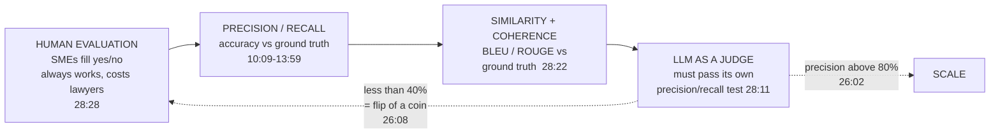
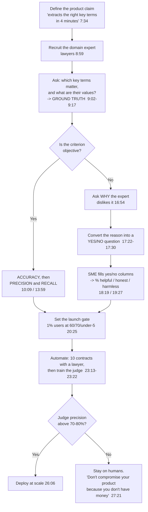

# CS-22 · Setting Up Agent Evaluations and Scaling Them

> **Source transcript:** `How_to_set_Evaluation_for_AI_Agents_Scale_them.txt` (~34:38, 857 lines)
> **Domain:** production
> **One-liner:** A product manager's worked method for evaluating a contract-reading agent — ground truth from lawyers, precision and recall with actual arithmetic, subjectification of subjective criteria into HHH yes/no questions, and the precision/recall test you run on an LLM judge before you are allowed to deploy it.
> **Prerequisites:** CS-20, CS-21

## 0. Executive summary

- **The thesis is quoted from Y Combinator**: "the **crown jewel** of AI applications or agent is no more prompts, **it's evaluations**" `[6:34]` `[6:36]` `[6:38]` `[6:41]`.
- **The definition the session settles on**: "evaluation means **how good is my agent in doing what it claims to do**" `[6:56]` `[6:58]` `[7:00]` `[7:03]`.
- **Ground truth requires domain experts, and that is the whole point**: "if you want to build agents you need **domain expertise**. Without that you can't build, because you can't build this evaluation — and if you can't build this evaluation, then one day when your customer tells you it doesn't work, then you ask them these questions and then you just fix that one problem and you think you have an aha moment" `[9:23]` `[9:26]` `[9:28]` `[9:31]` `[9:33]` `[9:36]` `[9:40]`.
- **Precision and recall are worked with real numbers**: a lawyer names **10** key terms, the agent names **12** containing all 10 plus 2 extras → **precision = 10/12**; the agent finds only **8** of 10 → **recall = 8/10** `[11:01]` `[11:09]` `[11:16]` `[12:06]` `[12:09]` `[13:41]` `[13:52]`.
- **Subjective criteria are converted to objective ones by asking *why*** — a lawyer's "indemnity should have insurance in it" becomes the checkable question "does the indemnification clause have insurance or not?" `[16:56]` `[17:03]` `[17:06]` `[17:13]` `[17:22]` `[17:26]` `[17:30]`.
- **The launch gate, with all three numbers**: "we can only launch this product to **1% user** when we reach helpfulness of **60%**, honesty of **70%** and less than **5% harmlessness**" `[20:25]` `[20:28]` `[20:31]` `[20:34]` `[20:38]`.
- **The LLM-judge finding is a measured result**: "what we did is we calculated recall and precision of these things and **they were less than 40%**" — less than 40% means "it's a **flip of a coin**" `[24:04]` `[24:07]` `[24:09]` `[26:08]` `[26:10]`.
- **The deployment threshold for an LLM judge**: above **80%** precision "you can replace this because this can run at scale"; in the Q&A the same rule is restated as **70%**, and below it — "**don't do it. Still do whatever the lawyer is saying and hire the lawyers. Don't compromise your product because you don't have money**" `[26:02]` `[26:06]` `[27:05]` `[27:10]` `[27:17]` `[27:21]` `[27:24]` `[27:27]`.
- **The three team targets are specific**: **+20%** completed tasks, **+40%** helpfulness, **−30%** cost — and "**none of your business**" is the PM's stance on *how* engineering achieves them `[30:41]` `[30:45]` `[31:08]` `[31:12]` `[31:26]` `[31:46]` `[31:50]`.

## 1. The problem this lecture solves

**The problem is that there is no standardized benchmark for a bespoke agent.** An audience member asks it directly: "how will I evaluate this product using **standardized benchmarks**? ... there's **no standardized benchmark** at a very high level" `[4:05]` `[4:09]` `[4:14]` `[4:26]` `[4:28]`. The speaker accepts this and reframes it: "you are alluding to a problem that **I don't know what is a good key term**, or for a given contract what are the right key terms to extract — that could be one benchmark, and then on those key terms **what are the correct values**, which we can say the ground truth or what is my ideal output" `[4:36]` `[4:38]` `[4:41]` `[4:44]` `[4:46]` `[4:49]` `[4:51]` `[4:55]`.

**The problem is that builders discover the benchmark only after a customer complains.** The SFO friend story: "he built this agent — this agent mines all the data of a company... takes like **one terabyte** of data as an input, and then you can ask any question, it generates insight. **No magic, nothing.** But then he said, 'you know what, this customer told me the agent is not working', and they complained about these **three things** where they wanted something else but the agent gave them something else. And then he was able to figure after that — he was like, '**show me what you want**'" `[5:18]` `[5:21]` `[5:23]` `[5:26]` `[5:28]` `[5:30]` `[5:32]` `[5:36]` `[5:38]` `[5:40]` `[5:42]` `[5:45]` `[5:48]`. Then: "the customer gave him the right answer and he built something which evaluated **for that particular thing**, and he was talking as if this is the magic thing he did" `[5:55]` `[5:56]` `[5:59]` `[6:01]` `[6:04]` `[6:06]` `[6:08]`.

**Analyst note:** the sentence that carries the whole critique is "these are how **developers** are thinking about it" `[6:12]` `[6:13]`. The failure is that ground truth was reverse-engineered from one customer's complaint instead of authored up front, which is exactly what makes it feel like magic to the builder and fragile to everyone else. The PM's job in this session is to move that discovery to before the customer call.

**The problem is that "evaluation" means something narrower outside the room.** "This is **not what people are talking about** [when they talk about] evaluation outside this room. They're talking about how to set up logging metrics, how to find out what this does, how many times it fails, did it find the right thing. **All these are good engineering metrics. But without setting what is your accuracy, what is your precision-recall, and then what is helpful, honest and harmless, you are not bringing the domain-specific expertise into your products, and you are not setting the right goals for your engineering**" `[21:18]` `[21:20]` `[21:22]` `[21:24]` `[21:28]` `[21:30]` `[21:33]` `[21:36]` `[21:38]` `[21:39]` `[21:42]` `[21:44]` `[21:46]` `[21:48]`.

## 2. Definitions & mental models

| Term | Definition | Why it matters |
|---|---|---|
| **Evaluation** | "How good is my agent in doing **what it claims to do**" `[6:56]` `[7:00]` `[7:03]` | Ties the metric to the product claim, not to model quality in the abstract |
| **Ground truth** | The expert's answer: the right key terms and their correct values `[4:49]` `[4:55]` `[9:13]` `[9:17]` | Also called the benchmark — "these are one and the same thing" `[14:20]` `[14:21]` |
| **Accuracy** | How many times the agent's answer matched the ground truth `[10:09]` `[10:14]` `[10:17]` | The first-order metric; insufficient on its own |
| **Precision** | Of the items the agent **flagged**, how many were correct — "10 divided by 12" `[11:25]` `[11:27]` `[11:29]` `[12:06]` `[12:09]` | Penalises **false positives** |
| **Recall** | Of the items that should have been found, how many the agent found — 8 of 10 `[13:41]` `[13:52]` | Penalises **false negatives** `[12:32]` `[12:34]` |
| **True / false positive, true / false negative** | The confusion matrix between what you said and what the model said `[12:49]` `[12:55]` `[13:01]` `[13:04]` `[13:08]` `[13:11]` `[13:19]` `[13:23]` | "What you are penalising — false positives or false negatives — decides your precision and recall" `[13:52]` `[13:54]` `[13:56]` `[13:59]` |
| **Helpful** | Whether the answer serves the expert's actual need, expressed as yes/no questions `[16:26]` `[16:30]` `[19:03]` `[19:06]` | Turns subjectivity into an answerable checklist |
| **Honest** | "Is the answer fabricated? Is the cited response... does it take me to the right page?" `[19:29]` `[19:31]` `[19:40]` | "This answer can be **correct but it's not honest if I cannot verify it**" `[19:56]` `[19:58]` `[20:00]` |
| **Harmless** | The policy and safety questions `[20:06]` `[20:07]` | Reported as a rate that must stay *below* 5% `[20:31]` `[20:34]` |
| **LLM as a judge / AI evaluator** | A model trained or prompted to fill the yes/no column in place of the expert `[23:35]` `[23:38]` `[23:41]` `[23:44]` | Must itself be validated by precision and recall before deployment `[24:04]` `[26:02]` |
| **Northstar metric** | Total tasks completed — "how many contracts I was able to extract these key terms [from] and people **accepted** them" `[29:08]` `[29:11]` `[29:13]` `[29:15]` `[29:16]` | Ties the whole eval stack to adoption |
| **L1 metric** | Task completion rate plus helpfulness, honesty and harmlessness `[29:19]` `[29:21]` `[29:42]` `[29:44]` | The week-on-week operating number |
| **Technical performance metrics** | Latency, quality, reliability — "P99, P95 these things matter a lot. What is your recovery? What is your first meaningful response time?" `[29:54]` `[29:59]` `[30:01]` `[30:04]` `[30:06]` `[30:07]` | The familiar engineering layer |

**The escalation ladder, which is the session's throughline** `[28:11]` `[28:16]` `[28:18]` `[28:22]` `[28:24]` `[28:28]` `[28:32]` `[28:35]`:



## 3. Core content, decomposed

### 3.1 The example product, stated precisely `[1:23]`

**What it does** `[1:23]` `[1:25]` `[1:27]` `[1:31]` `[1:45]` `[1:48]` `[1:51]` `[1:54]` `[1:57]`: it reads contracts and extracts key terms. You upload a contract, it identifies what kind of contract it is, and it files it into a contract repository.

**The output layout** `[2:06]` `[2:08]` `[2:09]` `[2:12]` `[2:14]` `[2:16]` `[2:18]` `[2:20]`: "on the left-hand side you see the contract, [on the] right-hand side you can quickly see what is the **renewal clause**, what are the **terms**, what is the **limitations of liability**, what is **indemnification**, is there a clause" — with a details answer, and "good answers, bad answers" `[2:20]` `[2:23]`.

**The provenance feature** `[2:23]` `[2:26]` `[2:27]`: "termination notice period **30 days**, and you can click here and **check where I read it from**."

**The reasoning feature** `[3:13]` `[3:16]` `[3:18]`: "let's say you are very smart — you also give **reasoning** why you think that answer is that answer."

**The stated value and the pitch** `[3:22]` `[3:24]` `[3:26]` `[3:29]` `[7:32]` `[7:34]` `[7:36]` `[7:38]` `[7:39]`: "a lawyer need not read the contract; if they have like **30 things** they want from this contract, they can get [them] in **2 minutes**" `[3:22]` `[3:24]` `[3:26]` `[3:29]`. The product pitch: "if you use my product in **four minutes** you can get the insights [about] whatever you care about from your contract."

**The integration** `[2:41]` `[2:43]` `[7:42]` `[7:44]` `[7:46]` `[7:49]`: it inserts the extracted terms into **HubSpot** or **Salesforce**, "which allows you to have a **single source of truth** for everything you have ever signed."

**The career advice attached to it** `[2:30]` `[2:32]` `[2:35]` `[2:37]` `[2:39]` `[2:41]`: "if somebody asks you, have you done any AI agent? You can just say: I built an AI agent which takes a contract, finds all the key terms, and actually **I can change these key terms** [and] automatically insert [them] in HubSpot."

**Analyst note:** note the discrepancy between the 2-minute claim `[3:26]` `[3:29]` and the 4-minute pitch `[7:34]` `[7:36]`. Both are the speaker's; the 2-minute figure describes the extraction step and the 4-minute figure is the product pitch as a whole. Use 4 minutes as the advertised number.

### 3.2 Building ground truth `[8:56]`

**The procedure** `[8:51]` `[8:53]` `[8:55]` `[8:57]` `[8:59]` `[9:02]` `[9:04]` `[9:06]` `[9:08]`:

| Step | Action |
|---|---|
| 1 | Reject "industry has it" as the source — go to the actual expert: "in this case I can work with **lawyers**" |
| 2 | Ask the lawyer: "you read the contract — tell me **which key terms are important to you** and **what are their values**" |
| 3 | That produces a "**key term and value pair** for each contract" |

**The three things you now hold** `[9:13]` `[9:15]` `[9:17]`: the link to the contract, its key terms, and the right values from an expert — "which in this case would be a lawyer."

**The sourcing options, restated later** `[9:54]` `[9:56]` `[9:57]` `[10:00]` `[10:02]` `[10:04]` `[10:06]` `[10:08]`: either "I download some contracts [with] their key values [and] where the location is," or "if it is not there, I hired lawyers to create this ground truth."

**The comparison step** `[10:09]` `[10:11]` `[10:14]` `[14:05]` `[14:07]` `[14:09]` `[14:12]` `[14:14]` `[14:16]` `[14:20]` `[14:24]` `[14:26]` `[14:29]` `[14:31]`: "once I have the ground truth I can compare my agent responses to these responses and then [say] how many times I have **matched accurately**... this is the contract in the master service agreement, I hired somebody to say these are the right key terms, these are the values — this is the benchmark or ground truth, **these are one and the same thing** — and this [is what] some lawyer gave me, and then I can find the same values from my product and compare them."

**The domain-expertise argument, in full** `[9:23]` `[9:25]` `[9:26]` `[9:28]` `[9:29]` `[9:31]` `[9:33]` `[9:34]` `[9:36]` `[9:38]` `[9:40]` `[9:43]` `[9:44]` `[9:46]` `[9:49]` `[9:51]`:

> "Domain expertise matters here. That's why people are saying that **if you want to build agents you need domain expertise. Without that you can't build, because you can't build this evaluation** — and if you can't build this evaluation, then one day when your customer tells you it doesn't work, then you ask them these questions and then you just fix that one problem and you think you have an aha moment. [Instead,] somebody who actually hires a product manager from this community is able to actually **create these ground truths** — and once you have the ground truths can you compare these."

**Analyst note:** this is the strongest single argument in Track B for why domain expertise is not a soft skill. The claim is causal, not motivational: no domain expert → no ground truth → no evaluation → no way to know you are improving → the customer discovers your defects for you, one at a time. CS-19 makes the same point from the training side, where the skill file *is* the encoded domain procedure `[26:05]` there.

### 3.3 Precision and recall, worked with numbers `[10:17]`

The speaker walks the audience through this on the board because, he says, "this is all I want to lay down as a **foundation**" `[10:37]` `[10:39]`.

#### 3.3.1 The precision case `[11:01]`

**Setup** `[10:54]` `[10:56]` `[10:58]` `[11:01]` `[11:03]`:

| Actor | Says |
|---|---|
| The lawyer (ground truth) | "These **10** key terms are important" |
| The agent | "**12** key terms are important" — containing all 10, plus **2 extra** `[11:09]` `[11:12]` `[11:16]` `[11:18]` |

**The question put to the room** `[11:18]` `[11:20]` `[11:22]`: "will you call it **100% accurate** that it got all 10? So the precision will be lower."

**The rule** `[11:25]` `[11:27]` `[11:29]`: "of the items you flagged, **how many were correct**."

**The arithmetic** `[11:32]` `[11:36]` `[11:39]` `[11:41]` `[11:43]` `[11:45]` `[11:58]` `[12:00]` `[12:02]` `[12:06]` `[12:09]` `[12:11]` `[12:13]` `[12:16]`:

| Quantity | Value |
|---|---|
| True positives | **10** — "if I say something and the agent says something, then both of us mean that's true positive" |
| False positives | **2** — the two extra terms |
| **Precision** | **10 / 12** |

And the conclusion the speaker draws: "I got everything right, I'm **100% accurate** maybe — but **my precision has dropped**. I am 10 to 12" `[12:11]` `[12:13]` `[12:16]`.

#### 3.3.2 The recall case `[12:20]`

**Setup** `[12:20]` `[12:22]` `[12:25]` `[12:27]` `[12:28]`: the agent "only got **eight**" and is accurate on those eight.

**The rule** `[12:28]` `[12:32]` `[12:34]`: "then there is a **recall** idea, which is I did not get the last two — so I'm **penalising false negatives**."

**The arithmetic** `[12:36]` `[12:40]` `[13:41]` `[13:44]` `[13:46]` `[13:52]`: with eight found out of ten required, **recall = 8 / 10**. (The transcript renders the speaker's board arithmetic as "12 divided by 10" at `[12:40]` and then "8 by 10" at `[13:52]`; the worked reading is 8/10, and 8/10 is the figure the speaker repeats.)

#### 3.3.3 The confusion matrix `[12:49]`

**As the speaker constructs it** `[12:49]` `[12:52]` `[12:55]` `[12:57]` `[13:01]` `[13:04]` `[13:07]` `[13:08]` `[13:11]` `[13:15]` `[13:17]` `[13:19]` `[13:23]`:

| | Model says needed | Model says not needed |
|---|---|---|
| **You say needed** | True positive `[12:57]` `[13:01]` | False negative `[13:08]` `[13:11]` `[13:19]` |
| **You say not needed** | False positive `[13:01]` `[13:04]` | True negative `[13:04]` `[13:07]` |

**The worked false-negative** `[13:23]` `[13:24]` `[13:26]` `[13:30]` `[13:33]` `[13:34]` `[13:36]` `[13:39]`: "let's say key terms **net payment and liability** are needed. The model is saying that these terms should be there, but **you are saying they are not needed**" — that is a false negative, and the count is **2** if you found eight.

**The closing rule** `[13:52]` `[13:54]` `[13:56]` `[13:59]`: "**what you are penalising — are you penalising false positives or false negatives — decides your precision and recall**."

**Analyst note:** the framing value here is that precision and recall are not two metrics but **one choice about which error hurts more**, made explicit. For a contract-review product the choice is a product decision: a false positive (a spurious "key term") wastes a lawyer's reading time, a false negative (a missed indemnity clause) creates legal exposure. The source does not make this trade-off for you; it only shows that the choice exists and must be made. CS-13 is the retrieval-side counterpart, where the same trade-off is expressed as k and reranking.

### 3.4 The subjectivity wall `[14:46]`

**The case that breaks the objective method** `[14:46]` `[14:48]` `[14:50]` `[14:52]` `[14:55]` `[14:56]` `[14:58]` `[15:01]` `[15:03]` `[15:06]`:

> "This idea [of] customer **indemnification** — what are the terms for customer indemnification — and when I tried to evaluate this one, some people said it is great, some people said it's not that great. One lawyer I got, he made this evaluation so obviously he thought it's great. But the other one said 'no, no, no, [it] should be a **one-line answer**.' The other one said 'in indemnity you actually forgot — indemnity also has **insurance**, and insurance and indemnity should be **combined**.' And now I don't know, because it's such a subjective one, and **every lawyer thought very differently about the same question**."

**The state of things before HHH** `[15:29]` `[15:32]` `[15:34]` `[15:37]` `[15:40]` `[15:42]` `[15:44]` `[15:46]`: "we got the objective ones right — if it is a yes-or-no answer, or [if] the value I need to extract [is unambiguous], I can just put accuracy, I can then calculate precision and recall, and I will be very happy and I have set evaluations for my team. But now I am [taking] you forward and saying: what if you have more **subjective, non-deterministic responses** from the people you are doing this for?"

**Analyst note:** the speaker's three-lawyer disagreement is the most useful failure story in the session, because none of the three lawyers is wrong. "Should be one line" and "should combine insurance" are both defensible house styles. The consequence is that **there is no ground truth to measure against until the organisation picks one**, which is the point §3.5 turns into a procedure.

### 3.5 Turning subjective into objective: the HHH procedure `[16:04]`

**The framework** `[16:19]` `[16:21]` `[16:24]` `[16:26]` `[16:30]` `[16:32]` `[16:35]` `[16:38]` `[16:41]` `[16:43]`:

> "For things which are subjective... you can actually set up three things. You can say: **is it helpful, is it honest, and is it harmless.** These are the three ways [I] think you can start trying to bring some **objectivity to this subjective world**."

**The mechanism is asking *why*** `[16:43]` `[16:46]` `[16:47]` `[16:50]` `[16:54]` `[16:56]` `[17:00]` `[17:03]`:

> "Instead of saying 'this lawyer says this is not good', I will ask a question to him or her and I will say: 'hey, **why is it not** [good], why [don't] you like it?' — and they say 'the indemnity should have insurance in it; without that I can't make a call [on] whether indemnity is good for us or not.'

**The conversion, worked three times** `[17:03]` `[17:06]` `[17:08]` `[17:11]` `[17:13]` `[17:15]` `[17:18]` `[17:19]` `[17:22]` `[17:26]` `[17:30]` `[17:32]` `[17:34]`:

| The lawyer's complaint | The checkable question it becomes |
|---|---|
| "For the indemnity clause to be helpful it needs to also know **what is the insurance we have bought**, so we can [tell] whether this number is good or not" | "**Is the indemnification clause [having] insurance or not?** If my response has insurance then it's helpful; if it doesn't, then" it isn't |
| "It has to be **two to three sentences**" `[17:34]` `[17:37]` | A length criterion |
| "I have seen the amount on like the **ninth line** — I don't want to read that much. Can you **start with what is the amount** so I can ignore everything else?" `[17:40]` `[17:42]` `[17:45]` `[17:47]` `[17:49]` `[17:51]` | "**Does indemnification start with amount?** Trust the response" `[17:53]` `[17:57]` `[17:58]` `[18:04]` |

**The transformation rule** `[17:15]` `[17:18]` `[18:04]` `[18:06]` `[18:08]` `[18:12]` `[18:15]`: "now I know I have a **domain expertise** — a domain expert told me something that I didn't know, and now I can **put it in a question**... if it does it's helpful, if it is not then it's not helpful. And if you go on and on like that, then you can **take that subjective thing but objectify it**."

**Who evaluates** `[18:19]` `[18:21]` `[18:24]` `[18:26]` `[18:29]` `[18:33]` `[18:34]`:

> "**Your subject matter experts are doing this evaluation, not you.** Your lawyer is saying 'did I get this, is the indemnification done, is this there or not', and they are filling [in] these **yes-no-yes-no columns**."

**The aggregate it produces** `[18:38]` `[18:42]` `[18:46]` `[19:21]` `[19:24]` `[19:27]`: "then you can get broader metrics... **our product is 60% helpful**."

**The criteria grow** `[19:11]` `[19:13]` `[19:15]` `[19:17]`: "there can be many questions — **as you learn, as you grow, you will have many questions**. You can continue to evolve this."

**Analyst note:** the mechanism is a single move repeated: **"why don't you like it" → a stated reason → a binary question**. This is the same procedure CS-20 describes from the same speaker `[40:00]` there, and it is the most reusable technique in both sessions. The reason it works is that domain experts can articulate a *criterion* far more reliably than they can score an *output* — asking for a verdict yields disagreement, asking for the reason yields a rubric.

#### 3.5.1 The honesty criteria `[19:29]`

**The two questions given** `[19:29]` `[19:31]` `[19:34]` `[19:36]` `[19:40]`:

| Question | Detail |
|---|---|
| "**Is the answer fabricated?**" | `[19:29]` `[19:31]` |
| "**Is the cited response** — if I click on it, does it take me to the right page?" | `[19:31]` `[19:34]` `[19:36]` `[19:40]` |

**The worked case, which is the cleanest statement of honesty in Track B** `[19:40]` `[19:42]` `[19:44]` `[19:47]` `[19:50]` `[19:53]` `[19:56]` `[19:58]` `[20:00]` `[20:03]`:

> "This answer says it's [a party that] will comply to **CCPA**. But if I click this and it tells me **whose party is it**, [and] why I think [the] service provider name is this one, then it's correct. But **this answer can be correct but it's not honest if I cannot verify it** — and that goes into your honesty metric."

**Analyst note:** the distinction is precise and worth preserving: *correct* and *verifiable* are separate properties, and the agent can be the first without the second. The test is mechanical — click the citation and see whether the cited page actually supports the claim — which makes honesty the cheapest of the three HHH buckets to check.

#### 3.5.2 The launch gate `[20:25]`

**The gate, with all three numbers** `[20:25]` `[20:28]` `[20:31]` `[20:34]` `[20:38]`:

> "You can set a target for your team saying: **we can only launch this product to 1% user when we reach helpfulness of 60%, honesty of 70% and less than 5% harmlessness.**"

**The volume requirement** `[20:38]` `[20:40]` `[20:42]` `[20:44]` `[20:47]` `[20:49]` `[20:51]` `[20:54]` `[20:55]`: "you have to verify for each and every contract... you can say 100 contracts — you can justify 100 contracts, and across 100 contracts you will calculate how helpful you are. **You can start with 10, but if you are not passing 10, don't send it to your customers.**"

**The business consequence, stated as a warning** `[20:55]` `[20:59]` `[21:02]` `[21:04]` `[21:05]` `[21:07]` `[21:09]` `[21:11]` `[21:13]` `[21:15]` `[21:18]`:

> "And then that day [you will] learn [that] all indemnification is just a clause full of blob and **nobody wants your product** — while some guy who did this due diligence, their product will look a little **crisp** because they will have the indemnification amount, they will have all the insurance, because they did the due diligence and their product manager knows what evaluation is."

**Analyst note:** "less than 5% harmlessness" `[20:34]` `[20:38]` is an awkward construction that means *harmful responses must be under 5%*, not *harmlessness below 5%*. The two readings are opposites, and the sense is fixed by the direction of the other two gates (60% helpful and 70% honest are floors). Record it as a ceiling on harm, and note that CS-21 gives the same number as an alert threshold: "if our agents start responding with a lot of guardrails more than **5%**, then give me an alert" `[30:11]` `[30:14]` there.

### 3.6 From human to automated `[21:54]`

**The problem with the human path** `[22:40]` `[22:44]` `[22:48]` `[22:50]` `[22:52]` `[22:54]` `[22:56]` `[22:59]` `[23:02]` `[23:04]` `[23:07]` `[23:10]` `[23:11]`:

> "When you scale these products, what will happen is that... he felt it somewhere inside his head that this is **too boring and too much work** — that now I have to go [through] 100 contracts and hire a lawyer to do this. Best of luck. I want to just build, ship, and then take a badge and live happily ever after. So that's a hard thing. **It's very expensive also. Lawyers are the most expensive** if you are building something like this."

**The transfer-learning idea** `[23:13]` `[23:16]` `[23:18]` `[23:22]` `[23:25]` `[23:27]` `[23:30]` `[23:33]`: "can you do it for **10 contracts with a lawyer**, and then can you **train a model to fill this column for you**? The column looks at this answer, looks at this definition of what is helpful, has a prompt, and then fills this column for you."

**The name and the prior art** `[23:35]` `[23:38]` `[23:41]` `[23:44]` `[23:46]` `[23:48]` `[23:50]` `[23:53]`: "that is called an **LLM as a judge**, or they are saying **AI evaluators**, and these evaluators can fill this sheet for you. There's already an API called the **content moderation API**, and I can use that to fill this column — 'does it ask for [or] solicit personal information?' — that I can [do] with an LLM as a judge."

**The limitation, stated flatly** `[23:56]` `[23:59]` `[24:02]` `[24:04]`:

> "But if you go and ask it, 'hey, is it too verbose or not to the point?' — **train it as much as you want. It will always miss the mark.**"

**The measurement that follows** `[24:04]` `[24:07]` `[24:09]`:

> "**What we did is we calculated recall and precision of these things and they were less than 40%.**"

**Analyst note:** this is the single most important number in the session and it deserves to be read carefully. It is a reported measurement of a real LLM-judge implementation on a subjective criterion ("is this too verbose or not to the point") which came in **below 40%** on both precision and recall. The source does not give the sample size, the model, the prompt or the exact figures — so it is a directional finding, not a benchmark. But the direction is unambiguous, and it is the reason the next section exists.

#### 3.6.1 Auditing an LLM judge with precision and recall `[24:12]`

**The challenge posed to the room** `[24:12]` `[24:15]` `[24:17]` `[24:19]` `[24:21]` `[24:23]` `[24:26]` `[24:28]` `[24:30]` `[24:33]` `[24:35]` `[24:37]` `[24:39]` `[24:41]` `[24:44]`:

> "**How will you calculate recall and precision of an LLM as a judge?** Can somebody help me? Because I gave you recall and precision — [so] I can ask you this question now. Anybody says 'hey, AI is automated, I have this LLM judge, I [have] done this evaluation, I generated this synthetic data and now I have done this' — and you are asking them, 'hey, what is the LLM judge's precision and recall?'"

**The proposed method from the room** `[24:44]` `[24:49]` `[24:52]` `[24:55]` `[24:57]` `[25:00]` `[25:02]` `[25:04]`:

> "You [give] the LLM those **10 entities** and ask it to **verify if those 10 entities are included** in the response, and then also ask it if there are **additional entities** that are included in the response, to really understand if it's verbose or not."

**The procedure the speaker endorses** `[25:04]` `[25:06]` `[25:08]` `[25:09]` `[25:11]` `[25:13]` `[25:15]` `[25:21]` `[25:23]` `[25:27]` `[25:30]` `[25:31]` `[25:33]` `[25:36]`:

> "If anybody's talking about LLM as a judge you should just ask them: 'hey, here is my use case, can you just go and tell me the precision and recall?' And what you should give them is: 'hey, this is my evaluation, this is my **indemnity key value**, this is my response, this whole thing — and [the question to the judge is] **is this response verbose?**' And let's say they say yes, and then next contract they say no, next contract they say yes. Right? **They have their numbers.**"

**The scoring step** `[25:39]` `[25:41]` `[25:43]` `[25:45]` `[25:47]` `[25:51]` `[25:53]` `[25:54]` `[25:56]` `[25:59]` `[26:00]`:

> "Then you ask your subject matter [expert]: 'what do you think? **This is your ground truth, this is what the model said.**' Yes, yes, no. Right? And then you can figure out how many **false positives, true positives, false negatives, true negatives** you have — and then you can calculate precision and recall."

**The worked disagreement** `[26:10]` `[26:12]` `[26:15]` `[26:19]` `[26:21]` `[26:24]` `[26:27]` `[26:30]` `[26:32]`:

> "**The idea is that your model is saying that this is verbose and your lawyer is saying it's not verbose.** So you got that one wrong. **It's a false positive** — because the lawyer is the ground truth."

**Analyst note:** the audit method is the deliverable here, and it is portable to any LLM judge on any criterion. The pattern is: pick one binary criterion, run the judge over a sample, have the SME answer the same binary question on the same sample, build the 2×2, compute precision and recall, and compare against the deployment threshold. That is a half-day exercise which most teams building LLM judges do not do — which is exactly the speaker's complaint at `[25:06]` `[25:09]` `[25:11]`.

#### 3.6.2 The deployment threshold `[26:02]`

**The first statement of the rule, with the scale argument** `[26:00]` `[26:02]` `[26:06]` `[26:08]` `[26:10]`:

| Precision | Verdict | Anchor |
|---|---|---|
| **Above 80%** | "you can **replace** this, because this can run at scale" | `[26:02]` `[26:06]` |
| **Less than 40%** | "then it's a **flip of a coin**" | `[26:08]` `[26:10]` |

**The second statement, in the Q&A, with the refusal clause** `[27:02]` `[27:05]` `[27:07]` `[27:10]` `[27:12]` `[27:14]` `[27:17]` `[27:19]` `[27:21]` `[27:24]` `[27:27]`:

> "If this value, if it is coming and it's saying that I am accurately doing it **70%** of the time, I will deploy this LLM as a judge. But **if it's not coming at 70% in your test, then don't do it. Still do whatever the lawyer is saying and hire the lawyers. Don't compromise your product because you don't have money.** You still try to scale it."

**Analyst note — a genuine inconsistency in the source.** The deployment threshold is given as **above 80%** at `[26:02]` `[26:06]` and as **70%** at `[27:05]` `[27:10]`, in the same session, without acknowledgment. Both readings are plausible: 80% as the "replace the human" bar and 70% as the "deploy alongside the human" bar, or simply a slip. The transcript does not resolve it. Report both, flag the conflict, and do not pick one silently.

**What to do with multiple experts** `[26:32]` `[26:34]` `[26:37]` `[26:40]` `[26:42]` `[26:44]` `[26:45]` `[26:48]`:

| Situation | Source's guidance |
|---|---|
| Several lawyers disagree | "You have to **zero down on one** for getting these ground truths" `[26:37]` `[26:40]` `[26:42]` |
| How to pick | "Talk to **three** and then finally get one" `[26:42]` `[26:45]` `[26:48]` |
| Weighted ground truth across firms | "That's the **next level** — but right now where the industry is... if you can find one lawyer and he says that, and that's your best lawyer in your company, people are just going with that" `[27:30]` `[27:41]` `[27:44]` `[27:46]` `[27:48]` `[27:49]` `[27:52]` |
| The speaker's own view of it | "This would be a good idea — talking to five lawyers and then [taking a] weighted average... Simple ideas are easy to implement; the more complex you make them it's a little harder. So **I have not seen that**, but it's a good idea" `[27:52]` `[27:53]` `[27:55]` `[27:58]` `[28:01]` `[28:02]` `[28:05]` |

### 3.7 The escalation ladder, stated as a fallback chain `[28:08]`

**The synthesis, in the source's own ordering** `[28:08]` `[28:11]` `[28:14]` `[28:16]` `[28:18]` `[28:19]` `[28:22]` `[28:24]` `[28:26]` `[28:28]` `[28:31]` `[28:32]` `[28:35]` `[28:36]` `[28:38]` `[28:40]` `[28:43]` `[28:44]` `[28:46]`:

> "We got the LLM idea, we got the precision-recall idea — that **to get to LLM [as] a judge you need to get to precision and recall**. And if you don't have LLM as judge, [and] you don't have the precision recall, you get to **similarity and coherence** — this idea of calculating **BLEU and ROUGE** scores — and if you can have that compared to ground truth, that's good enough to make some decisions. And **if nothing works, then please, please, please set the human evaluations** and make sure you have that in your product and you are meeting your numbers. And if you don't have human evaluations, please **become that product manager who does it. If you can't hire lawyers, become that lawyer.** Do your best, but **have these numbers in your evaluations.**"

**The consequence of skipping it** `[28:48]` `[28:51]` `[28:55]` `[28:56]` `[28:59]` `[29:00]` `[29:03]` `[29:05]`: "without that you will be **surprised [by] what you get out from customers**, and you will be losing more customers than gaining, and your **CAC** [cost of customer acquisition] would [be] a decimal matrix as you continue without doing this thing."

**Analyst note:** read as a ladder, the ordering is by cost and fidelity: human SME (highest fidelity, highest cost) → precision/recall against ground truth → BLEU/ROUGE similarity → LLM judge (lowest cost, and only admissible once it has passed its own precision/recall audit). The non-obvious claim is that **an LLM judge is the last rung, not the first** — its legitimacy is derived from having been validated against the rungs below it. The source states this explicitly: "to get to LLM [as] a judge you need to get to precision and recall" `[28:11]` `[28:14]` `[28:16]`.

### 3.8 The metrics hierarchy `[29:08]`

**The three levels, plus the technical layer** `[29:08]` `[29:11]` `[29:13]` `[29:15]` `[29:16]` `[29:19]` `[29:21]` `[29:23]` `[29:25]` `[29:27]` `[29:29]` `[29:30]` `[29:32]` `[29:34]` `[29:37]` `[29:39]` `[29:42]` `[29:44]` `[29:47]` `[29:50]` `[29:51]` `[29:54]` `[29:56]` `[29:59]` `[30:01]` `[30:04]` `[30:06]` `[30:07]`:

| Level | Metric | Definition |
|---|---|---|
| **Northstar** | **Total tasks completed** | "How many contracts I was able to extract these key terms [from] and people **accepted** them" |
| **L1** | **Task completion rate** | "You will also have a failure rate... this will just manage week on week how many are we completing, how many contracts we are processing" |
| **L1** | **Helpfulness, honesty, harmlessness** | "Your helpfulness, your honesty and harmless" |
| **Detailed** | **Not delivered** | "Which we can talk about some other day. **I will send you a document**" `[29:47]` `[29:50]` `[29:51]` |
| **Technical** | Latency, quality, reliability | "P99, P95 these things matter a lot. What is your recovery? What is your first meaningful response time?" |

**The completion-rate example worked** `[29:30]` `[29:32]` `[29:34]` `[29:37]` `[29:39]` `[29:42]`: "let's say I try five and I can only extract four, and one always fails because we can't even find out what is in [the] return — then you are **80%**."

**Analyst note:** the northstar is deliberately an **acceptance** metric, not an extraction metric: "people **accepted** them" `[29:15]` `[29:16]`. That makes the northstar a product-adoption number rather than a model-quality number, which is the correct choice for a PM scorecard and is consistent with CS-20's per-customer attribution argument.

### 3.9 The three team targets `[30:34]`

**The framing** `[30:32]` `[30:34]` `[30:35]` `[30:38]`: "the second question they will ask is, 'okay, I got the metrics — but **how [do] you set up the team to succeed**?'"

**Target 1 — task completion** `[30:41]` `[30:45]` `[30:47]` `[30:49]` `[30:51]` `[30:54]` `[30:57]` `[30:59]` `[31:03]` `[31:06]`:

> "**20% growth in completed tasks** — because what you will learn shipping agents is that your **non-completion rate is more than [your] completion rate**. So if you're doing 10 contracts you [will] actually be able to do **three contracts only** in your first cut, and if you can improve that by 20% week on week or month on month, that's a good target to have."

**Target 2 — helpfulness** `[31:08]` `[31:12]` `[31:15]` `[31:17]` `[31:18]` `[31:20]` `[31:22]` `[31:24]` `[31:26]` `[31:28]` `[31:31]` `[31:34]` `[31:36]` `[31:37]` `[31:41]` `[31:42]` `[31:44]` `[31:46]`:

> "**40% improvement in [the] helpfulness score** — and now they can figure out whatever they need to do. They need to do RAG, they need to do fine-tuning, all those fancy things which we talk about in other sessions — we will put tools, we will do [focus], we will do multi-agents. **None of your business.** You are saying: I want the helpfulness to be 40% more in [the] next 6 months. That's [about] 5% this week. Can somebody show me what [they] are doing? Are you doing prompts? Are you improving RAG? Are you changing the model? What is our plan? Show me the strategy. **That's your discussion with [the] engineering manager.**"

**Target 3 — efficiency** `[31:46]` `[31:50]` `[31:53]` `[31:55]` `[31:58]` `[31:59]` `[32:03]` `[32:04]` `[32:07]` `[32:10]` `[32:12]` `[32:16]` `[32:18]` `[32:20]` `[32:23]` `[32:26]` `[32:29]` `[32:31]` `[32:33]` `[32:36]` `[32:38]`:

> "**30% efficiency**, because **the cost of serving your customers should always go down. That's the whole promise of AI.** And I can one day tell you why I picked up these numbers. But the idea here is: what is the **cost per token**, or what is the **cost per contract processing** — which is how many times we try again, how many times we got things wrong, how many times we have to go and **reverify** things just because our first prompts are not good. What's that cost look like? And I'm trying to reduce that by 30%. This could be latency, this could be the cost of tokens, [the] number of tokens consumed in [getting] the whole job done."

**Why the targets are the enforcement mechanism** `[32:31]` `[32:33]` `[32:36]` `[32:38]`: "you set this, [and] forward and backward the whole team can innovate — which is: we went to smaller models, we did this, we did that."

**Analyst note:** the source declines to justify the specific numbers: "I can one day tell you why I picked up these numbers" `[31:58]` `[31:59]`. Treat 20/40/30 as illustrative magnitudes, and note the one empirical claim that supports the first — "your non-completion rate is more than [your] completion rate... if you're doing 10 contracts you [will] actually be able to do three" `[30:47]` `[30:49]` `[30:51]` `[30:54]` `[30:57]`. That is a 30% first-cut completion rate, which makes +20% a modest ask. Note also the reversal of the usual PM posture: the PM owns the *number* and explicitly disclaims the *method* — "none of your business" `[31:26]` — which mirrors CS-21's responsibility split from the other direction.

### 3.10 The career application `[32:38]`

**The CV line the session prescribes** `[32:38]` `[32:41]` `[32:46]` `[32:51]` `[32:56]` `[32:58]`:

> "Your CV should look like: '**I help[ed] make [the] agent 15% more helpful after launch by introducing agent[ic] RAG and by putting a pipeline of RLHF.**'"

**Why that line works** `[32:56]` `[32:58]` `[33:01]` `[33:03]` `[33:04]` `[33:06]` `[33:08]` `[33:10]` `[33:12]` `[33:14]` `[33:18]` `[33:20]` `[33:22]`:

> "If I read that, I want to talk to you — I want to know why. Because my [product] doesn't improve anything. My team has not improved anything for [the] last 6 months. They launched it and I'm just dealing with [it]. And if I look at your CV and I read that, I want to talk to you — and maybe I don't want to hire you, I'm just curious to know how you did it, because you have given me enough [to be intrigued]."

**Analyst note:** the structure of the line is worth extracting because it maps exactly onto the metrics hierarchy: a **baseline** (15%), a **direction** (more helpful), a **time frame** (after launch), and a **named mechanism** (agentic RAG plus an RLHF pipeline). It is a before/after claim with the causality attached. The same structure is what CS-20's northstar and CS-19's training runs produce — a number that moved, and the change that moved it.

### 3.11 The promotional tail `[33:20]`

Recorded because it is part of the source.

| Item | Detail | Anchor |
|---|---|---|
| LinkedIn | "I'm on this LinkedIn channel, I am becoming an influencer, I have more than **10,000 followers**" | `[33:20]` `[33:24]` `[33:26]` `[33:28]` |
| Next sessions | "Build and deploy enterprise agent"; "Microsoft Copilot is a cool tool" | `[33:29]` `[33:33]` `[33:34]` `[33:36]` |
| Course | "This is the course we're starting in **July**" | `[33:38]` `[33:40]` |
| Interview prep | A separate programme "starting **June 21st**", "three to four weeks of just what people ask in interviews" | `[33:43]` `[33:45]` `[33:47]` `[33:50]` `[33:52]` |
| Bundle offer | Join now and "we will give you the next cohort as a bundle"; "do not wait till **July 26th**" | `[33:59]` `[34:02]` `[34:04]` `[34:06]` |
| Channels | YouTube channel (sessions are recorded and posted) and a Slack community | `[34:09]` `[34:17]` `[34:20]` `[34:23]` `[34:28]` `[34:30]` `[34:32]` |

## 4. Frameworks & decision procedures

### 4.1 The full measurement build



### 4.2 Choosing the metric: a triage

| If the answer is... | Use | Anchor |
|---|---|---|
| A yes/no, or an extractable value | **Accuracy**, then precision and recall | `[15:32]` `[15:37]` `[15:40]` |
| Subjective but the expert can articulate a reason | **HHH questions** derived by asking why | `[16:43]` `[17:22]` |
| Correct but you cannot verify the citation | **Honesty** metric — "correct but not honest" | `[19:56]` `[20:00]` |
| A policy or safety matter | **Harmless**, plus the content moderation API for PII | `[20:06]` `[23:44]` `[23:48]` |
| Too expensive to ask a human at volume | **LLM judge**, but only after auditing it | `[23:35]` `[24:04]` |
| A criterion the LLM judge cannot hold | Stay on humans — "it will always miss the mark" | `[24:02]` `[24:04]` |

### 4.3 The LLM-judge acceptance test `[24:44]` `[26:00]`

1. Pick **one binary criterion** — e.g. "is this response verbose?"
2. Assemble a sample set with the **SME's ground-truth answer** for each item.
3. Run the judge over the same set, recording its yes/no per item.
4. Build the 2×2 against the SME: true positives, false positives, false negatives, true negatives `[25:53]` `[25:56]` `[25:59]`.
5. Compute **precision and recall** `[25:59]` `[26:00]`.
6. Compare to the bar — **above 80%** at `[26:02]` `[26:06]`, **70%** at `[27:05]` `[27:10]`.
7. Below the bar: **do not deploy**. "Still do whatever the lawyer is saying and hire the lawyers" `[27:17]` `[27:19]` `[27:21]`.

### 4.4 The scorecard to carry into a review

| Layer | What to report | Target shape |
|---|---|---|
| Northstar | Total tasks completed and accepted `[29:11]` `[29:15]` | +20% growth `[30:45]` |
| L1 | Task completion rate, helpfulness %, honesty %, harm % `[29:21]` `[29:42]` | Completion: `[29:34]` example gives 80%; helpfulness `[31:12]` |
| Gate | 1% user launch at 60% helpful / 70% honest / under 5% harm `[20:25]` `[20:38]` | — |
| Cost | Cost per token, cost per contract processed, retries, reverification `[32:03]` `[32:07]` `[32:10]` `[32:12]` | −30% `[31:50]` |
| Technical | Latency, quality, reliability, P99/P95, recovery, first meaningful response time `[29:54]` `[30:01]` `[30:04]` `[30:07]` | — |
| Eval health | SME sample size; LLM-judge precision and recall `[20:42]` `[26:00]` | Judge ≥ 70–80% `[26:02]` `[27:05]` |

## 5. Worked end-to-end example

**The contract-term extraction agent, from claim to scorecard.** This is the source's single running case.

**Step 1 — State the claim.** "If you use my product in four minutes you can get the insights [about] whatever you care about from your contract," and it inserts them into HubSpot or Salesforce as a single source of truth `[7:34]` `[7:36]` `[7:38]` `[7:39]` `[7:42]` `[7:46]` `[7:49]`. Evaluation is then defined as "how good is my agent in doing what it claims to do" `[7:00]` `[7:03]`.

**Step 2 — Get the expert.** Work with lawyers, not with an industry benchmark — "in this case I can work with lawyers" `[8:55]` `[8:57]` `[8:59]`.

**Step 3 — Build ground truth.** Ask each lawyer which key terms are important and what their values are, producing a key-term/value pair for each contract, plus the source location `[9:02]` `[9:04]` `[9:08]` `[10:02]` `[10:04]`. If no existing contracts with values are available, hire the lawyers to create it `[10:04]` `[10:06]` `[10:08]`.

**Step 4 — Score the objective criteria.** Compare agent values to ground-truth values for accuracy `[10:09]` `[10:14]`. Then decompose: for key-term selection, a lawyer names 10 and the agent names 12 with 2 extras gives **precision 10/12** `[11:01]` `[11:09]` `[11:12]` `[11:16]` `[12:06]` `[12:09]`; an agent that finds only 8 of 10 gives **recall 8/10** `[12:22]` `[12:28]` `[13:41]` `[13:52]`.

**Step 5 — Hit the subjectivity wall.** On indemnification, one lawyer calls the answer great, one wants a one-line answer, one insists insurance and indemnity must be combined `[14:55]` `[15:01]` `[15:06]` `[15:08]` `[15:12]` `[15:19]`. There is no ground truth to score against `[15:21]` `[15:24]` `[15:27]`.

**Step 6 — Convert via why.** Ask the dissenting lawyer why `[16:54]` `[16:56]`. The answer — "indemnity should have insurance in it, without that I can't make a call" `[16:56]` `[17:00]` `[17:03]` — becomes the question "**does the indemnification clause have insurance or not?**" `[17:22]` `[17:26]` `[17:30]`. Two more follow: the two-to-three-sentence length rule `[17:34]` `[17:37]`, and "does indemnification start with amount?" `[17:53]` `[17:57]` `[17:58]` `[18:04]`.

**Step 7 — Have the SME fill the columns.** The lawyer, not the PM, answers yes/no per question per response `[18:19]` `[18:26]` `[18:33]` `[18:34]`. Aggregate to "our product is **60% helpful**" `[19:21]` `[19:24]` `[19:27]`.

**Step 8 — Add honesty and harmlessness.** Honesty: is it fabricated, and does the citation take you to the page that supports it — the CCPA example, where the answer may be correct but unverifiable `[19:29]` `[19:40]` `[19:47]` `[19:53]` `[19:56]` `[20:00]`. Harmlessness: the policy and safety questions, plus the content moderation API for personal-information solicitation `[20:06]` `[23:44]` `[23:48]`.

**Step 9 — Set the gate.** Launch to **1% of users** only at **60% helpful, 70% honest, under 5% harm** `[20:25]` `[20:38]`. Verify across **100 contracts**; "you can start with 10, but if you are not passing 10, don't send it to your customers" `[20:42]` `[20:54]` `[20:55]`.

**Step 10 — Decide whether to automate.** Do **10 contracts with a lawyer**, then train a judge to fill the column `[23:13]` `[23:16]` `[23:18]` `[23:22]`.

**Step 11 — Audit the judge before trusting it.** Run it over the sample, compare to the lawyer's answers, build the 2×2, compute precision and recall `[25:39]` `[25:53]` `[25:59]` `[26:00]`. Expect trouble on subjective criteria — "is it too verbose or not to the point? Train it as much as you want. **It will always miss the mark**" `[23:59]` `[24:02]` `[24:04]` — and the observed result was "**less than 40%**" `[24:04]` `[24:07]` `[24:09]`, which is "a flip of a coin" `[26:08]` `[26:10]`.

**Step 12 — Set the team targets.** **+20%** completed tasks, **+40%** helpfulness, **−30%** cost `[30:45]` `[31:08]` `[31:12]` `[31:50]`.

**The decision rule that falls out:** the PM owns the claim, the ground truth, the criteria, the gate and the three numbers — and explicitly does not own the method by which engineering hits them `[31:26]`.

## 6. Pros, cons, exceptions

| Approach | Pros | Cons | Works when | Fails when | Cost |
|---|---|---|---|---|---|
| **Human SME evaluation** | Highest fidelity; produces the criteria as a by-product `[16:43]` | "**Lawyers are the most expensive**" `[23:10]` `[23:11]`; boring; does not scale `[22:50]` `[22:52]` | Authoring and validating; the "start with 10" gate | You run it on every unit of work | SME time |
| **Accuracy alone** | Simple; directly comparable to ground truth `[10:09]` `[10:14]` | Hides the false-positive/false-negative split — "100% accurate" with precision 10/12 `[12:11]` `[12:16]` | A single yes/no field | Multi-item extraction, where both error types matter `[13:52]` | Low |
| **Precision and recall** | Separates the two error types; forces the trade-off into the open `[13:52]` `[13:59]` | Needs ground truth; the trade-off is a judgement call the metric does not make | Entity or term extraction | You cannot define the denominator | Low |
| **HHH questions** | Objectifies the subjective `[18:12]` `[18:15]`; grows as you learn `[19:13]` `[19:15]` | Needs an SME to fill columns; answers are only as good as the questions | Expert disagreement exists but reasons can be elicited | The expert cannot articulate why | SME time |
| **BLEU / ROUGE similarity** | Cheap; "good enough to make some decisions" `[28:26]` `[28:28]` | Surface overlap, not correctness; needs ground truth anyway `[28:24]` | A rough first signal | Paraphrase-heavy or subjective criteria | Near zero |
| **LLM as a judge** | Runs at scale `[26:06]`; fills the sheet for you `[23:41]` `[23:44]` | "**Will always miss the mark**" on subjective criteria `[24:02]` `[24:04]`; measured under 40% `[24:07]` `[24:09]` | It has passed its own precision/recall audit | Precision below 70–80% `[26:02]` `[27:05]` | Model calls |
| **Content moderation API** | Off-the-shelf for a known criterion `[23:44]` `[23:46]` | Covers only what it covers — PII solicitation is the example given `[23:48]` `[23:53]` | Safety and PII checks | Domain-specific quality questions | API calls |
| **Weighted multi-expert ground truth** | Correct in principle `[27:41]` `[27:52]` | "**I have not seen that**" `[28:02]` `[28:05]`; complexity slows implementation `[27:58]` `[28:01]` | Multiple experts with genuinely different standards | You need to ship this quarter | Expert time × N |

## 7. Failure modes & anti-patterns

1. **Discovering your benchmark from a customer complaint.**
   *Symptom:* the SFO friend's customer reports three problems, and the fix feels like magic to the builder `[5:32]` `[5:36]` `[6:06]` `[6:08]`. *Root cause:* no ground truth was authored up front `[9:31]` `[9:33]`. *Detection:* can you name your benchmark before a customer does? *Fix:* hire the domain expert and build the key-term/value ground truth `[8:59]` `[9:08]`.

2. **Reporting accuracy alone.**
   *Symptom:* "I got everything right, I'm 100% accurate" while precision is 10/12 `[12:11]` `[12:13]` `[12:16]`. *Root cause:* accuracy hides which error type is being made. *Detection:* compute precision and recall separately. *Fix:* "what you are penalising — false positives or false negatives — decides your precision and recall" `[13:52]` `[13:54]` `[13:56]` `[13:59]`.

3. **Treating expert disagreement as noise.**
   *Symptom:* "every lawyer thought very differently about the same question" and "now I don't know" `[15:21]` `[15:24]` `[15:27]`. *Root cause:* subjectivity was left unaddressed. *Detection:* are your experts disagreeing on the same item? *Fix:* ask **why**, and convert the reason into a binary question `[16:54]` `[17:22]` `[17:30]`.

4. **Skipping the "why".**
   *Symptom:* a verdict you cannot act on. *Root cause:* asking for scoring instead of reasoning. *Detection:* does each failed question map to a product change? *Fix:* "instead of saying this lawyer says this is not good, I will ask **why is it not, why [don't] you like it**" `[16:46]` `[16:47]` `[16:50]` `[16:54]`.

5. **Confusing correct with verifiable.**
   *Symptom:* an answer that is right but that no one can check. *Root cause:* honesty was never defined as a separate criterion. *Detection:* click the citation — does it support the claim? *Fix:* "this answer can be correct but **it's not honest if I cannot verify it**" `[19:56]` `[19:58]` `[20:00]`.

6. **Deploying an unaudited LLM judge.**
   *Symptom:* an eval programme that reports confident numbers nobody has validated. *Root cause:* the judge's own precision and recall were never measured. *Detection:* ask "what is your LLM judge's precision and recall?" `[24:39]` `[24:41]` `[24:44]`. *Fix:* the audit at §4.3, and if it fails — "**don't do it. Still do whatever the lawyer is saying and hire the lawyers**" `[27:17]` `[27:19]` `[27:21]`.

7. **Assuming the judge handles subjective criteria.**
   *Symptom:* the judge scores well on entity checks and badly on "is this too verbose". *Root cause:* the criterion resists the judge's competence. *Detection:* per-criterion precision and recall, not aggregate. *Fix:* isolate the failing criteria and keep humans on them — the observed figure was under 40% `[24:04]` `[24:09]`, which the speaker calls "a flip of a coin" `[26:08]` `[26:10]`.

8. **Launching on a small sample.**
   *Symptom:* a product that looks good on 10 contracts and fails on 100. *Root cause:* insufficient verification volume. *Detection:* how many contracts were verified? *Fix:* "you can start with 10, but **if you are not passing 10, don't send it to your customers**" `[20:54]` `[20:55]`; the target scale is 100 `[20:42]` `[20:44]`.

9. **Shipping a blob.**
   *Symptom:* "all indemnification is just a clause full of blob and nobody wants your product" `[20:55]` `[20:59]` `[21:02]`. *Root cause:* no due diligence on the domain criteria. *Detection:* does your output contain the amount and the insurance? *Fix:* the crisp version — "they will have the indemnification amount, they will have all the insurance, because they did the due diligence" `[21:05]` `[21:07]` `[21:09]` `[21:11]` `[21:13]`.

10. **Buying tooling before defining ground truth.**
    *Symptom:* a platform subscription and no usable metrics. *Root cause:* the tools automate the computation, not the definition. *Detection:* do you have ground truth? *Fix:* the source's critique — the tools "say 'we tell you precision and recall, these numbers automatically, once you give us the ground truth' — **but nobody knows what the ground truth is and nobody's setting that**" `[22:17]` `[22:19]` `[22:20]` `[22:22]` `[22:24]`.

11. **Letting the PM specify the method.**
    *Symptom:* a PM prescribing RAG, fine-tuning or multi-agent architecture. *Root cause:* the PM moved from outcomes to implementation. *Detection:* is the PM's ask a number or a technique? *Fix:* set "helpfulness 40% more in 6 months" and leave RAG, fine-tuning, prompts and model choice to engineering — "**none of your business**" `[31:17]` `[31:20]` `[31:22]` `[31:24]` `[31:26]`.

## 8. Implementation notes

**The ground-truth artifact shape** `[9:13]` `[9:17]` `[10:02]`:

| Field | Source |
|---|---|
| Link to the contract | `[9:13]` `[9:15]` |
| Key term | From the lawyer `[9:06]` `[9:08]` |
| Correct value | From the lawyer `[9:08]` `[9:17]` |
| Location | "their key values where the location is" `[10:02]` `[10:04]` |

**The metrics to compute** `[10:09]` `[12:06]` `[13:52]`:

```
accuracy       = matches / total                             [10:09] [10:14]
precision      = true positives / (true positives + false positives)
               = 10 / 12   in the worked example              [12:06] [12:09]
recall         = true positives / (true positives + false negatives)
               = 8 / 10    in the worked example              [13:41] [13:52]
```

**The criterion sheet** `[18:19]` `[18:34]` `[19:21]`:

```
for each response, the SME answers yes/no:
  HELPFUL        does the indemnification clause have insurance?   [17:22]-[17:30]
                 does indemnification start with the amount?       [17:53]-[17:58]
                 is it two to three sentences?                     [17:34]-[17:37]
  HONEST         is the answer fabricated?                         [19:29]-[19:31]
                 does the citation take you to the right page?      [19:31]-[19:40]
  HARMLESS       the policy, PII and safety questions               [20:06] [23:48]
  -> aggregate to % helpful / % honest / % harmful   [19:21] [20:25]
```

**The LLM-judge audit, as code shape** `[24:44]` `[25:53]` `[25:59]`:

```
judge(criterion, response) -> "yes" | "no"
sme(criterion, response)   -> "yes" | "no"     # ground truth
  -> 2x2: TP, FP, FN, TN                                   [25:53]-[25:59]
  -> precision, recall                                     [25:59]-[26:00]
  -> precision > 80% (26:02) / > 70% (27:05) -> deploy
     otherwise -> keep humans                               [27:17]-[27:27]
```

**The scorecard, as a reporting layout** `[29:08]` `[29:19]` `[29:42]` `[29:54]`:

```
NORSTAR      total tasks completed AND accepted        [29:11]-[29:16]
L1           task completion rate                      [29:19]-[29:42]
             helpfulness % / honesty % / harm %        [29:42]-[29:44]
DETAILED     (promised in a document, not delivered)   [29:47]-[29:51]
TECHNICAL    latency, quality, reliability,
             P99, P95, recovery,
             first meaningful response time            [29:54]-[30:07]
TEAM GOALS   +20% completed tasks / +40% helpfulness /
             -30% cost                                 [30:45] [31:12] [31:50]
```

**The gate to encode in CI or release criteria** `[20:25]` `[20:38]`:

| Gate | Value |
|---|---|
| Helpfulness | ≥ 60% |
| Honesty | ≥ 70% |
| Harm | < 5% |
| Exposure on pass | 1% of users |
| Verification volume | 10 contracts minimum; 100 at scale `[20:42]` `[20:55]` |

**Analyst note (outside source):** the arithmetic at `[12:40]` is transcribed as "12 divided by 10" while the surrounding text computes an eight-of-ten recall. The standard definition is TP / (TP + FN) = 8 / 10 = 0.8, and the speaker uses 8/10 at `[13:52]`. Treat the `[12:40]` rendering as a transcription artefact.

## 9. Interview-ready Q&A

**Q1. What is evaluation, and why does the source insist on a definition?**
"How good is my agent in **doing what it claims to do**" `[6:56]` `[6:58]` `[7:00]` `[7:03]`. The definition matters because it ties the metric to the *product claim* rather than to model quality in the abstract — the claim here is "in four minutes you can get the insights you care about from your contract" `[7:34]` `[7:36]` `[7:38]`, so the evaluation must measure extraction correctness and acceptance, not general language ability. The session opens with an audience member noting there is "no standardized benchmark" `[4:26]` `[4:28]`, and the answer is that a bespoke agent has no external benchmark — the benchmark is the ground truth you construct with a domain expert `[8:57]` `[9:08]`.

**Q2. How do you build ground truth for a bespoke agent?**
Hire or borrow the domain expert and ask for the specific judgment you need: "I can work with **lawyers**... tell me which key terms are important to you and what are their values" `[8:55]` `[8:57]` `[8:59]` `[9:02]` `[9:04]` `[9:06]` `[9:08]`, producing a "key term and value pair for each contract" `[9:08]` `[9:10]`. You end up holding three things per contract — the link, the key terms, and the expert's values `[9:13]` `[9:15]` `[9:17]`. Use published contracts and their values if they exist; otherwise pay the experts to create them `[10:00]` `[10:04]` `[10:06]` `[10:08]`. The claim attached to this is strong and causal: without domain expertise "you can't build this evaluation," and without the evaluation your customer discovers your defects one at a time `[9:25]` `[9:26]` `[9:28]` `[9:31]` `[9:33]`.

**Q3. Walk through precision and recall with the worked numbers.**
A lawyer names **10** important key terms; the agent names **12**, containing all 10 plus **2 extra** `[11:01]` `[11:03]` `[11:09]` `[11:12]` `[11:16]` `[11:18]`. All 10 true terms were found, so accuracy looks perfect — "I'm 100% accurate maybe" — but "of the items you flagged, how many were correct" gives **precision = 10/12** `[11:25]` `[11:29]` `[12:06]` `[12:09]` `[12:11]` `[12:13]` `[12:16]`. Conversely, an agent that finds only **8** of the 10 required terms gives **recall = 8/10** `[12:22]` `[12:28]` `[13:41]` `[13:52]`. The governing rule: "what you are penalising — false positives or false negatives — decides your precision and recall" `[13:52]` `[13:54]` `[13:56]` `[13:59]`.

**Q4. When does the objective method break, and what do you do? (Trap.)**
It breaks on criteria where experts legitimately disagree. On customer indemnification, "one lawyer... thought it's great, but the other one said 'no, no, no, it should be a one-line answer', [and] the other one said 'in indemnity you actually forgot — indemnity also has insurance, and insurance and indemnity should be combined'... **every lawyer thought very differently about the same question**" `[15:01]` `[15:03]` `[15:06]` `[15:08]` `[15:12]` `[15:16]` `[15:18]` `[15:19]` `[15:21]` `[15:24]` `[15:27]`. The trap is concluding the criterion is unmeasurable. The resolution is to ask **why** and convert the answer into a binary question: "instead of saying this lawyer says this is not good, I will ask **why is it not, why [don't] you like it**" `[16:46]` `[16:47]` `[16:50]` `[16:54]`, and the reason becomes "**does the indemnification clause have insurance or not?**" `[17:22]` `[17:26]` `[17:30]` — "you can take that subjective thing but **objectify it**" `[18:12]` `[18:15]`.

**Q5. Who performs the evaluation, and what does the output look like?**
Not the PM. "**Your subject matter experts are doing this evaluation, not you.** Your lawyer is saying 'did I get this, is the indemnification done, is this there or not', and they are filling [in] these **yes-no-yes-no columns**" `[18:19]` `[18:21]` `[18:24]` `[18:26]` `[18:29]` `[18:33]` `[18:34]`. The aggregate is a rate: "our product is **60% helpful**" `[19:21]` `[19:24]` `[19:27]`. The question list is not fixed — "as you learn, as you grow, you will have many questions. You can continue to evolve this" `[19:11]` `[19:13]` `[19:15]` `[19:17]`.

**Q6. What is the difference between correct and honest? (Trap.)**
Honest requires verifiability. The questions are "**is the answer fabricated?**" and "**is the cited response — if I click on it, does it take me to the right page?**" `[19:29]` `[19:31]` `[19:34]` `[19:36]` `[19:40]`. The worked case: an answer about a party complying with **CCPA** "can be correct but **it's not honest if I cannot verify it**" `[19:44]` `[19:47]` `[19:50]` `[19:53]` `[19:56]` `[19:58]` `[20:00]`. The trap is treating honesty as a synonym for accuracy. They are separable properties, and honesty is the cheaper one to test — you click the citation.

**Q7. What is the launch gate?**
"You can set a target for your team saying: **we can only launch this product to 1% user when we reach helpfulness of 60%, honesty of 70% and less than 5% harmlessness**" `[20:25]` `[20:28]` `[20:31]` `[20:34]` `[20:38]`. The verification volume is explicit: "across **100 contracts** you will calculate how helpful you are. You can **start with 10**, but if you are not passing 10, don't send it to your customers" `[20:42]` `[20:44]` `[20:47]` `[20:49]` `[20:51]` `[20:54]` `[20:55]`. Note that "less than 5% harmlessness" is a ceiling on harmful responses, not a floor on harmlessness — the direction is fixed by the other two gates being floors, and CS-21 uses the same 5% as a guardrail alert threshold.

**Q8. How do you validate an LLM judge before you deploy it? (Trap.)**
Give the judge one binary criterion over a sample — "this is my evaluation, this is my indemnity key value, this is my response... **is this response verbose?**" `[25:11]` `[25:13]` `[25:15]` `[25:21]` `[25:23]` `[25:27]`. Then have the SME answer the same binary question on the same sample: "**this is your ground truth, this is what the model said**" `[25:41]` `[25:43]`. Build the 2×2 — "false positives, true positives, false negatives, true negatives" `[25:53]` `[25:54]` `[25:56]` `[25:59]` — and compute precision and recall `[25:59]` `[26:00]`, remembering "**the lawyer is the ground truth**" `[26:24]` `[26:27]` `[26:30]` `[26:32]`. The trap is thinking an LLM judge is self-validating. It is a classifier, and like any classifier it has its own error rates, which must be measured against the human it replaces.

**Q9. What did the source's own LLM judge score, and what is the deployment bar? (Trap.)**
The measured result: "**what we did is we calculated recall and precision of these things and they were less than 40%**" `[24:04]` `[24:07]` `[24:09]`, and below 40% "it's a **flip of a coin**" `[26:08]` `[26:10]`. The reason given for the failure is specific: "if you go and ask it, 'hey, is it too verbose or not to the point?' — **train it as much as you want. It will always miss the mark**" `[23:56]` `[23:59]` `[24:02]` `[24:04]`. The bar to deploy is stated twice and **inconsistently** — "above **80%**... you can replace this, because this can run at scale" `[26:02]` `[26:06]`, and in the Q&A "if it is coming and it's saying that I am accurately doing it **70%** of the time, I will deploy this LLM as a judge" `[27:05]` `[27:07]` `[27:10]`. The trap is quoting one number as the rule. Report the conflict. And below the bar the instruction is unambiguous: "**don't do it. Still do whatever the lawyer is saying and hire the lawyers. Don't compromise your product because you don't have money**" `[27:17]` `[27:19]` `[27:21]` `[27:24]` `[27:27]`.

**Q10. What is the escalation ladder, in order?**
Human evaluation is the fallback that always works — "if nothing works, then please, please, please set the **human evaluations** and make sure you have that in your product and you are meeting your numbers" `[28:28]` `[28:31]` `[28:32]` `[28:35]` `[28:36]`. Above it sits precision and recall against ground truth `[28:11]` `[28:14]`. Where precision and recall are unavailable, similarity and coherence — "this idea of calculating **BLEU and ROUGE** scores — and if you can have that compared to ground truth, that's good enough to make some decisions" `[28:16]` `[28:18]` `[28:19]` `[28:22]` `[28:24]` `[28:26]` `[28:28]`. And an LLM judge is admissible only once validated against the rungs below it: "**to get to LLM [as] a judge you need to get to precision and recall**" `[28:11]` `[28:14]` `[28:16]`. The non-obvious ordering is that the LLM judge is the **last** rung, not the first.

**Q11. What are the three team targets, and what does the PM explicitly not own?**
"**20% growth in completed tasks**" `[30:41]` `[30:45]`, justified by the base rate that "your **non-completion rate is more than [your] completion rate**... if you're doing 10 contracts you [will] actually be able to do **three contracts only** in your first cut" `[30:47]` `[30:49]` `[30:51]` `[30:54]` `[30:57]` `[30:59]`. "**40% improvement in [the] helpfulness score**" `[31:08]` `[31:12]`. "**30% efficiency**, because the cost of serving your customers should always go down — that's the whole promise of AI" `[31:46]` `[31:50]` `[31:53]` `[31:55]`. The PM does not own the method: RAG, fine-tuning, tools, focus and multi-agents are "**none of your business**" `[31:17]` `[31:18]` `[31:20]` `[31:22]` `[31:24]` `[31:26]` — the PM's job is to state the number and then ask "what is our plan? Show me the strategy" `[31:38]` `[31:41]` `[31:42]` `[31:44]`. Cost is measured as "cost per token... or cost per contract processing, which is how many times we try again, how many times we got things wrong, how many times we have to go and **reverify** things just because our first prompts are not good" `[32:03]` `[32:04]` `[32:07]` `[32:10]` `[32:12]` `[32:16]`.

**Q12. What does the source say about the evaluation tooling market? (Trap.)**
It is dismissive on a specific ground: "these tools people talk about all the time — they're just doing so much **marketing** without solving the real problem which you should be hired for, which is setting helpful, honest and harmless — but they are saying 'hey, we tell you precision and recall, these numbers automatically, once you give us the ground truth'. **But nobody knows what the ground truth is and nobody's setting that**" `[22:05]` `[22:07]` `[22:09]` `[22:10]` `[22:13]` `[22:14]` `[22:17]` `[22:19]` `[22:20]` `[22:22]` `[22:24]`. What those tools genuinely provide is "precision and recall numbers, BLEU, ROUGE, coherence, groundedness" `[22:24]` `[22:28]` `[22:31]` `[22:34]` — computation, not definition. The trap is reading this as a vendor comparison; it is an argument about where the scarce input lies. The tool automates the arithmetic; the PM supplies the ground truth and the criteria, and without those the tool has nothing to compute.

## 10. Cheat sheet

```
SETTING UP AGENT EVALS AND SCALING THEM
=====================================================================
THE THESIS
  YC: "the CROWN JEWEL of AI applications or agent is
  no more prompts, IT'S EVALUATIONS"                  [6:34] [6:41]
  DEFINITION: "how good is my agent in doing
  WHAT IT CLAIMS TO DO"                               [6:56] [7:03]
  Outside this room "evaluation" means logging and
  failure counts -- "good engineering metrics, but
  without accuracy, precision-recall and HHH you are
  not bringing domain expertise into your product and
  you are not setting the right goals for engineering"
                                                      [21:18] [21:48]
---------------------------------------------------------------------
THE EXAMPLE: contract term extraction
  upload contract -> key legal terms on the right:
  renewal clause . terms . limitations of liability .
  indemnification . termination notice 30 days
  click -> "where I read it from" + reasoning
  pitch: "4 MINUTES" for insights; 30 things in 2 min
  insert into HubSpot / Salesforce                   [2:06] [7:34]

GROUND TRUTH
  experts, not "industry": "I can work with LAWYERS"
  ask: which key terms matter + what are their values
  -> key term / value pair per contract + location
  holds: contract link . key terms . expert values
  "if you want to build agents you need DOMAIN
  EXPERTISE. Without that you can't build, because
  you can't build this evaluation"                    [8:59] [9:23]
---------------------------------------------------------------------
PRECISION AND RECALL -- the worked numbers
  lawyer: 10 key terms.  agent: 12 (all 10 + 2 extra)
  -> accuracy looks 100%, PRECISION = 10/12           [12:06] [12:09]
  agent finds 8 of 10 required
  -> RECALL = 8/10                                    [13:41] [13:52]
  confusion matrix:
     you say needed  / model says needed  = TP
     you say not     / model says needed  = FP
     you say needed  / model says not     = FN
     you say not     / model says not     = TN        [12:49] [13:23]
  "what you are penalising -- false positives or
  false negatives -- DECIDES your precision and recall"
                                                      [13:52] [13:59]
---------------------------------------------------------------------
WHEN EXPERTS DISAGREE -- indemnification
  3 lawyers, 3 answers: "great" / "should be one
  line" / "forgot insurance, combine the two"
  "every lawyer thought very differently about the
  same question"                                      [15:01] [15:27]

THE FIX: ASK WHY AND CONVERT TO YES/NO
  "why is it not, why don't you like it?"             [16:46] [16:54]
  -> "indemnity should have insurance in it"
  -> QUESTION: "does the indemnification clause
     have insurance or not?"                          [17:22] [17:30]
  -> "is it two to three sentences?"                  [17:34]
  -> "does indemnification start with the amount?"    [17:53]
  "take that subjective thing but OBJECTIFY IT"       [18:12]
  WHO EVALUATES: "your SUBJECT MATTER EXPERTS are
  doing this, NOT YOU"; yes-no-yes-no columns         [18:19] [18:34]
  -> "our product is 60% HELPFUL"                     [19:21] [19:27]
  criteria EVOLVE: "as you learn, as you grow"        [19:13]

HONEST vs CORRECT  <<< distinct properties
  "is the answer FABRICATED?"                         [19:29]
  "does the citation TAKE ME TO THE RIGHT PAGE?"      [19:31] [19:40]
  "this answer can be CORRECT but it's NOT HONEST
   if I cannot VERIFY it"                            [19:56] [20:00]
---------------------------------------------------------------------
THE LAUNCH GATE                                       [20:25] [20:38]
  launch to 1% OF USERS only at:
    helpfulness >= 60%
    honesty     >= 70%
    harm        <  5%
  verify 100 contracts; START WITH 10 --
  "if you are not passing 10, DON'T SEND IT TO
   YOUR CUSTOMERS"                                    [20:42] [20:55]
  skip it -> "indemnification is just a clause full
  of blob and NOBODY WANTS YOUR PRODUCT"             [20:55] [21:02]
---------------------------------------------------------------------
SCALING: LLM AS A JUDGE
  "lawyers are the MOST EXPENSIVE"                    [23:10] [23:11]
  do 10 contracts with a lawyer, then TRAIN A MODEL
  to fill the column                                  [23:13] [23:22]
  column = answer + definition of helpful + prompt
  available: CONTENT MODERATION API for PII asks      [23:44] [23:48]
  LIMIT: "is it too verbose or not to the point?
  train it as much as you want. IT WILL ALWAYS MISS
  THE MARK"                                           [23:56] [24:04]

MEASURED RESULT: precision and recall of the judge
  "they were LESS THAN 40%"                           [24:04] [24:09]

HOW TO AUDIT A JUDGE  (the portable procedure)
  1 one binary criterion, e.g. "is this verbose?"
  2 run the judge over a sample                       [25:23] [25:36]
  3 SME answers the SAME question on the same sample
    "this is YOUR GROUND TRUTH, this is what the
     model said"                                      [25:41] [25:43]
  4 build TP / FP / FN / TN                           [25:53] [25:59]
  5 compute precision and recall                      [25:59] [26:00]
  6 "THE LAWYER IS THE GROUND TRUTH"                  [26:24] [26:32]
  BAR: >80% "you can replace this... run at scale"    [26:02] [26:06]
       >70% in the Q&A restatement                    [27:05] [27:10]
       <40% "it's a FLIP OF A COIN"                   [26:08] [26:10]
  BELOW THE BAR: "don't do it. Still do whatever the
  lawyer is saying and HIRE THE LAWYERS. Don't
  compromise your product because you don't have
  money"                                              [27:17] [27:27]
  MULTIPLE EXPERTS: "zero down on ONE"; talk to
  three, pick one; weighted average = "the next
  level... I have not seen that"                      [26:37] [28:05]
---------------------------------------------------------------------
THE ESCALATION LADDER (lowest rung is the fallback)
  "to get to LLM as a judge you need to get to
   PRECISION AND RECALL"                              [28:11] [28:16]
  no judge, no P/R -> SIMILARITY + COHERENCE
     (BLEU / ROUGE) "good enough to make some
     decisions"                                       [28:16] [28:28]
  "if NOTHING works, please please please set the
   HUMAN EVALUATIONS"                                 [28:28] [28:36]
  "if you can't hire lawyers, BECOME THAT LAWYER"     [28:43] [28:46]
---------------------------------------------------------------------
METRICS HIERARCHY                                     [29:08]
  NORTHSTAR   total tasks completed AND ACCEPTED      [29:11] [29:16]
  L1          task completion rate + helpfulness /
              honesty / harmlessness                  [29:19] [29:42]
              e.g. 5 contracts tried, 4 done = 80%    [29:34] [29:42]
  DETAILED    promised in a document -- NOT DELIVERED [29:47] [29:51]
  TECHNICAL   latency, quality, reliability, P99/P95,
              recovery, first meaningful response     [29:54] [30:07]

THREE TEAM TARGETS                                    [30:34]
  +20% COMPLETED TASKS  (base rate: 10 contracts ->
     3 done; non-completion > completion)            [30:45] [30:59]
  +40% HELPFULNESS  ("40% more in 6 months" = 5%/wk)
     HOW is "NONE OF YOUR BUSINESS" -- RAG,
     fine-tuning, multi-agent are engineering's call [31:12] [31:26]
  -30% COST  ("cost of serving should ALWAYS go down;
     that's the whole promise of AI")
     cost per token / per contract processing:
     retries, wrong answers, REVERIFICATION           [31:50] [32:16]

CV LINE: "I helped make the agent 15% more helpful
after launch by introducing agentic RAG and a
pipeline of RLHF"                                     [32:41] [32:51]

TOOLING: they sell precision/recall/BLEU/ROUGE/
coherence/groundedness "once you give us the ground
truth -- BUT NOBODY KNOWS WHAT THE GROUND TRUTH IS
AND NOBODY'S SETTING THAT"                            [22:17] [22:24]
```

## 11. Glossary

| Term | Meaning |
|---|---|
| **Accuracy** | Matches against ground truth divided by total |
| **BLEU / ROUGE** | Surface word-overlap similarity against a ground-truth answer |
| **Content moderation API** | Off-the-shelf classifier used for specific safety criteria such as PII solicitation `[23:44]` `[23:48]` |
| **CAC** | Cost of customer acquisition; the metric the source warns decays without evaluation `[28:59]` `[29:00]` |
| **False negative** | The model says the item is needed and you say it is not `[13:19]` `[13:23]` |
| **False positive** | You say the item is not needed and the model flags it `[13:01]` `[13:04]` |
| **Ground truth** | The expert's answer; identical in meaning to "the benchmark" `[14:20]` `[14:21]` |
| **Harmless** | The policy and safety questions; reported as a rate that must stay under 5% `[20:31]` `[20:34]` |
| **Helpful** | Whether the answer serves the expert's need, expressed as a binary question `[16:26]` `[17:22]` |
| **HHH** | Helpful, honest, harmless — the frame that objectifies subjective criteria `[16:26]` `[16:35]` |
| **Honest** | Not fabricated, and verifiable by following the citation `[19:29]` `[19:56]` |
| **L1 metric** | Task completion rate plus the HHH rates; the week-on-week operating number `[29:19]` `[29:42]` |
| **LLM as a judge / AI evaluator** | A model that fills the SME's yes/no column at scale, after being validated `[23:35]` `[23:41]` |
| **Northstar metric** | Total tasks completed and accepted by users `[29:11]` `[29:16]` |
| **Precision** | True positives divided by all flagged items — 10/12 in the worked case `[12:06]` `[12:09]` |
| **Recall** | True positives divided by all items that should have been found — 8/10 `[13:41]` `[13:52]` |
| **SME** | Subject matter expert; the lawyer who authors ground truth and fills the yes/no columns `[18:19]` `[18:24]` |
| **True negative** | You and the model both say the item is not needed `[13:04]` `[13:07]` |
| **True positive** | You and the model both say the item is needed `[11:41]` `[11:43]` |

## 12. Cross-references

- **Builds on:**
  - CS-20 — same host, same contract agent, same HHH frame and the same 60/70 launch gate; CS-20 supplies the broader metric catalogue and the ROI arithmetic, CS-22 supplies the precision/recall mechanics and the LLM-judge audit
  - CS-21 — same host; the responsibility split here (PM owns the number, not the method) is the mirror image of CS-21's split (PM owns definitions, engineering owns instrumentation)
- **Leads to:**
  - CS-23 — pricing AI agents; the "cost per contract processing" metric `[32:03]` `[32:07]` is the unit-economics input to that session's pricing framework
- **External (named in the source):** Y Combinator (YouTube channel), HubSpot, Salesforce, CCPA, content moderation API, RAG, RLHF, BLEU, ROUGE, Microsoft Copilot, LinkedIn, YouTube, Slack.

**Analyst note — undelivered material.** Two promised artifacts do not appear. The **detailed metrics** layer is deferred outright: "which we can talk about some other day. **I will send you a document**" `[29:47]` `[29:50]` `[29:51]`. And the justification for the three targets is withheld: "**I can one day tell you why I picked up these numbers**" `[31:58]` `[31:59]`. Also unresolved is the multi-expert ground-truth question — a participant asks directly about weighted ground truth across law firms `[27:30]` `[27:32]` `[27:36]`, and the answer is that it would be a good idea but "**I have not seen that**" `[28:02]` `[28:05]`.

**Analyst note — an internal inconsistency to carry forward.** The LLM-judge deployment bar is stated as **above 80%** precision at `[26:02]` `[26:06]` and as **70%** at `[27:05]` `[27:10]`, within the same session and without reconciliation. A participant even restates the 70% figure back to the speaker at `[26:51]` `[26:54]` `[26:56]` `[26:59]`, and the speaker neither confirms nor corrects the number before answering. Report both; do not silently choose.

**Analyst note — numbers this source does not give.** No sample size for the LLM-judge measurement, no model or prompt named, and no exact precision/recall values beyond "less than 40%" `[24:07]` `[24:09]`. No per-contract cost for the human evaluation path — the $0.25-per-question figure belongs to CS-20 and CS-21 `[13:58]` there, not here. No token counts, no latency values, and no contract volume. The 60/70/5 gate and the 20/40/30 targets are stated as targets with no derivation.

**Analyst note — transcription artefacts.** "**Mah**" `[4:14]` `[9:57]` `[22:56]` and "**Mahista**" `[9:56]` are the speaker's name used as a vocative by participants. "**indentity / indeification / indeify**" throughout `[2:16]` `[14:48]` `[15:12]` `[17:03]` `[17:13]` `[17:22]` `[17:53]` `[21:02]` are all **indemnification / indemnity**. "**blue**" `[22:28]` and "**blu**" `[22:31]` are **BLEU**; "**rule scores**" `[22:24]` is **ROUGE scores**; "**panalyzing**" `[13:54]` is **penalising**; "**Ka will comply to CCPA**" `[19:44]` `[19:47]` is a garbled party name. "**Anerban**" `[22:48]` and "**Anirban**" are a participant. "**take a badge**" `[23:04]` is likely **take a break**. The recall arithmetic at `[12:40]` is rendered "12 divided by 10" where the surrounding context computes 8/10. Participant names appear with varying spellings: Julia `[0:04]`, Jessica `[16:21]` `[26:44]`, Sham `[5:50]`.
