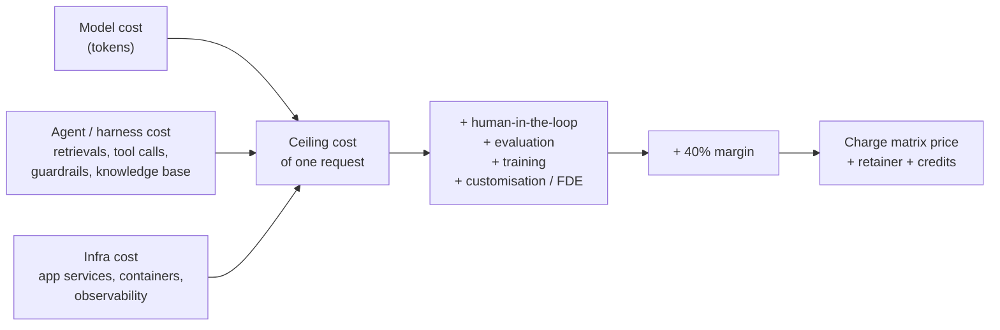
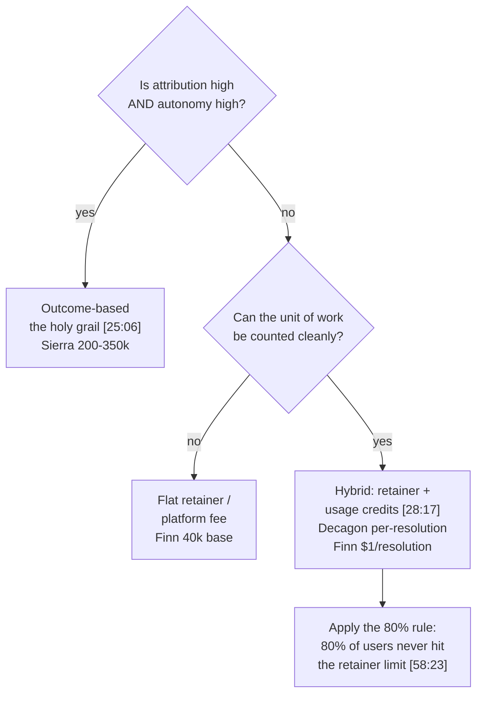

# CS-23 · Pricing AI Agents: Outcome, Usage, Retainers and Credits

> **Source transcript:** `How_to_Price_Your_AI_Agents_The_Framework_Companies_Use_Sierra_Decagon_Finn.txt` (529 lines, ~60 minutes)
> **Domain:** production
> **One-liner:** A pricing framework for AI agents that starts from *value created* rather than cost, derives a ceiling cost and a charge matrix from the eval bill, and lands on hybrid retainer-plus-credit models — the pricing shape Sierra, Decagon and Finn/Intercom are converging on.
> **Prerequisites:** CS-20, CS-21, CS-22 (same host, same contract-agent running example, same HHH+R framing)

## 0. Executive summary

- **You cannot price an agent without first pricing the value it creates** — the session opens by refusing to discuss pricing in isolation `[5:41]` and criticises the common product-manager habit of designing the feature, shipping it, and only then discovering there is no unit economics `[5:47]` `[49:08]`.
- **Three competitors, three different models in the same segment:** Sierra sells **outcome-based at ~$200–350k** `[6:48]`; Decagon sells **per-conversation and per-resolution at ~$400k** `[7:22]` `[7:30]`; Finn/Intercom sells a **~$40k platform fee plus $1 per resolution**, with a **65% resolution guarantee** or **$65k back** `[7:48]` `[8:11]` `[8:38]`.
- **The comparison baseline is a human:** a support human at **$35/hour** who resolves around **five tickets** in that hour sets the per-resolution value ceiling `[2:47]` `[2:55]`.
- **SaaS pricing history is the warning, not the template:** hardware → licensing → subscription (system of record) worked because software margins were **70–80%** `[12:39]` `[13:01]`; agents break it because token cost is non-deterministic and uncapped.
- **The 100x problem:** a median customer costs **$20** and a P90 customer costs **$2,000** `[16:33]` — *"your 10% customers are charging you 100x"* `[16:46]`. The P90 ChatGPT user who runs it three hours a day costs the vendor about **$2,000** while paying **$20** `[19:29]` `[19:50]` `[19:56]`.
- **Attribution × autonomy is the pricing map** `[18:03]`. The holy grail is high-attribution, high-autonomy (true outcome pricing) `[24:58]` `[25:06]`; almost all agents shipped today are **high attribution, low autonomy** — the vendor finds the risk but the customer must verify and owns the outcome `[37:37]` `[38:07]` `[38:33]`.
- **Credits are the biggest pricing innovation available today** `[29:03]`. They absorb model-price volatility (vendor gives less when models get expensive, margins stay stable `[32:50]`), decouple the customer from tokens, and — crucially — **re-align the sales incentive**, because a vendor on flat subscription has no reason to track usage `[30:09]` `[30:22]`.
- **Design rule: the retainer must cover 80% of users without hitting limits** `[58:23]`, and small/medium/large workloads must all fit inside the retainer, or *"your customers will just throw the product"* `[58:43]`.
- **Pricing is derived from the eval bill, worked backwards.** Cost the ceiling (not the average), add a **40% margin**, and only then decide model size, agent complexity, eval depth and the quality of the human in the loop `[40:53]` `[48:32]` `[48:55]`.
- **This is the same host as CS-20/21/22** — same contract-agent example, same HHH+R frame. Treat its claims as one practitioner's considered position, not as three independent data points.

## 1. The problem this lecture solves

A team builds a genuinely good agent, gets real customers, and discovers the business does not work. The cost of running it is non-deterministic (token counts vary per request), it scales with success (happy users use it more), and it is invisible to the buyer until the invoice arrives. Meanwhile the buyer's CFO cannot map "credits" to dollars to a budget, and neither can the vendor help them `[35:47]` `[36:29]`.

The lecture's claim is that this is a **product-management failure, not a finance failure**, and that it is fixable at design time: *"rather than making the best product in the world and then figuring out you don't have unit economics"* `[49:08]`. The method offered is to start from value, derive a charge matrix, cost the ceiling, fix a margin, and work backwards into the engineering constraints.

## 2. Definitions & mental models

| Term | Definition | Why it matters |
|---|---|---|
| **Value creation** | The hours saved × a defensible hourly rate, before any cost discussion `[38:33]` | The only anchor that survives CFO scrutiny |
| **Attribution** | How much of the outcome the vendor can credibly claim `[38:02]` | Low attribution forbids outcome-based pricing |
| **Autonomy** | Whether the agent completes the job end-to-end without a human owner `[38:15]` | High autonomy + high attribution = "the holy grail" `[25:06]` |
| **Charge matrix** | The billing unit of the product (here: one page = 500 words, plus a playbook of checks) `[39:39]` `[40:36]` | Turns a heterogeneous job (NDA vs 5,000-page loan agreement) into a countable unit |
| **Ceiling cost** | Cost at the P80-and-above band, averaged — not the mean `[46:42]` `[46:50]` | Mean cost lets your hungriest customers bankrupt you `[42:23]` |
| **Variance / credits** | The metered overage layer sold on top of a retainer `[54:34]` | Converts cost volatility into a sellable unit |
| **Rule of 40** | Growth % + profit % ≥ 40 `[50:38]` | Explains how loss-making agent companies survive on funding |

**The three cost buckets** `[43:41]` `[44:10]`:



## 3. Core content, decomposed

### 3.1 Value first, price second `[5:41]` `[5:47]`

**What the source says.** Pricing cannot be discussed without value creation `[5:41]`. The wrong order is the observed norm: a PM gets a feature in demand, builds it, ships it, gets promoted on the revenue, and *"after that they need not understand customers"* `[32:03`–`32:34]`.

**Mechanism.** The session's order is: value created → charge matrix → cost of goods → margin → ceiling cost → work backwards into engineering constraints.

**Analyst note:** The host says the topic needs four hours and that this is the compressed version `[51:16]`.

### 3.2 The competitive teardown `[6:48]` `[7:22]` `[7:48]`

| Vendor | Model | Number given | Anchor `[mm:ss]` |
|---|---|---|---|
| Sierra | Outcome-based | ~$200–350k | `[6:48]` |
| Decagon | Per-conversation and per-resolution | ~$400k | `[7:22]` `[7:30]` |
| Finn / Intercom | Platform fee + per resolution | ~$40k + **$1/resolution**; **65% resolution** promised or **$65k back** | `[7:48]` `[8:11]` `[8:38]` |
| Human baseline | Hourly | **$35/hour**, ~**5 tickets** resolved | `[2:47]` `[2:55]` |

**Worked comparison.** At $35/hour for five tickets, the human per-resolution cost is $7. Finn's $1/resolution is roughly a 7x undercut — which is the value argument, and also the reason the vendor must be confident about resolution rate.

**Analyst note:** The transcript renders the third vendor as "Finn" throughout; the speaker associates it with Intercom. The $65k-back guarantee is described as the vendor paying back if the 65% resolution commitment is missed.

### 3.3 Why the SaaS playbook breaks `[12:39]` `[16:05]` `[16:33]`

**History.** Hardware → licensing → subscription. Subscription worked because the product became the *system of record* and margins ran **70–80%** `[12:39]` `[13:01]`. A seat could be sold at **$20** because *"one user can be $2,000"* in value `[16:05]` `[16:13]`.

**The break.** *"My median is $20, but my P90 is $2,000… your 10% customers are charging you 100x"* `[16:33]` `[16:46]`. The concrete instance: *"if you use ChatGPT for 3 hours every day, you costed them $2,000 and you paid them 20 bucks"* `[19:29]` `[19:50]` `[19:56]`.

**Leverage ladder.** Labor → capital → code → **intelligence** `[20:03]` `[21:08]` `[21:54]` `[23:07]`, with the personal arithmetic *"$200 subscription… 100x of that, which is $20,000"* `[23:45]` `[23:58]`.

### 3.4 Why outcome pricing is not available yet `[25:28]`–`[26:47]`

Three stated reasons:

1. **Agents still fail and hallucinate** — you cannot stand behind an outcome you cannot guarantee `[25:28]`.
2. **They cannot learn from their mistakes** the way a human hire does `[26:00]`.
3. **There is no 10x-on-the-bet curve** — with a human hire you accept variance because a small number of hires return multiples: *"that's the bet we make on humans. We can't make the same bets here"* `[26:47]`.

*Analyst note:* the second and third reasons are the interesting ones and are the sharpest link between this session and CS-17/CS-18 (trajectory evaluation and RL) — the pricing model is blocked on the learning loop.

### 3.5 Why pure usage-based fails `[27:31]` `[27:48]`

Low attribution (the customer cannot see the connection between consumption and value) `[27:31]`, plus the inheritance of pay-as-you-go habits from AWS `[27:48]`. Evidence of instability: **AgentForce is on its third pricing iteration inside year one** `[28:00]`.

### 3.6 The hybrid sweet spot and credits `[28:17]` `[29:03]`

The landing zone is **retainer + usage with caps** `[28:17]` `[28:50]`, with **credits as the metering unit**. Credits solve three stated problems `[29:13]` `[29:30]`:

- The customer pays a round number and sees a round number, not tokens `[33:53]`.
- The vendor can vary how much a credit buys as model prices move — *"if the models become expensive tomorrow, you start giving less and… your margins increase"* `[32:50]` `[33:05]`.
- Sales is re-aligned: a flat-subscription vendor has no incentive to track usage; a credit vendor does `[30:09]` `[30:22]` `[31:18]`.

**How the mapping actually works** (answering a participant's question `[33:14]`): Anthropic-style credits — pay $100, get X; the vendor holds an internal equation mapping credits to tokens, tool calls and knowledge retrievals, and reports *"this query took five credits"* `[33:19]`–`[34:06]`. The host's own version: a retainer covers **100 contracts**, then **$20 buys five more contract credits**, where **one contract credit = a 200-page contract with 10 questions** `[34:12]`–`[34:32]`. *"It's like a top up you can buy on top of your top up"* `[34:32]`.

**The failure mode of credits.** A participant (working on Claude Code-style tooling) objects that credits are **a black box**: *"let's say I bought $25 of credit, I don't know how much coding will I get out of that $25"* `[35:02]`–`[35:30]`. The host's retort is the demand-side consequence: *"the CFOs are shouting that I got a bill of $3 million"*, IT budgets are exhausted mid-year, and *"nobody can plan their TCO and neither these companies can help them plan their TCO"* `[35:33]`–`[35:47]`. Vendors are responding by offering to true-up next year — reduce the price or give the overspend back — to get the signature now `[35:53]`–`[36:24]`.

**The job statement that follows:** *"justify your pricing based on these credits. Design the credits in a way that your customers can understand and pay for and it does not break the bank"* `[36:45]` `[37:01]`.

### 3.7 Deriving the price: value → charge matrix → ceiling cost `[37:23]` `[40:53]`

**Step 1 — value.** *"I do risks in contracts and I can just find 70%… I don't do 100% of that job, otherwise I would have priced outcome-based"* `[37:37]` `[37:47]`. Because the customer must still verify — *"you cannot trust us please verify please validate all the responsibility is yours"* `[38:02]` — this is **high attribution, low autonomy** `[38:07]` `[38:15]`. The analogy given: Claude Code writes most of the code, but the code pushed to production is the customer's responsibility `[38:21]` `[38:26]`.

**Step 2 — hours saved.** *"Let's say this is 7 hours job or 10 hours job. Now you can do it in six four three four hours. That means you're saving 6 hours"* `[38:33]` `[38:40]`. At **$200/hour** that is a **$1,200 job** the agent is doing `[38:47]`.

*Analyst note:* the transcript's hours arithmetic is internally muddled (7 or 10 in, "six four three four" out, "saving 6 hours" claimed). The $200/hour × 6 hours = $1,200 figure is the one that reconciles, and is used as stated.

**Step 3 — charge matrix.** *"Each contract is different… a 500-page contract looks very different than a 5,000-page contract [than] a five-page contract. A loan agreement looks different than an NDA. So figure out what's your charge matrix"* `[39:22]` `[39:26]` `[39:33]`. The host's unit: **one page = 500 words**, plus a **playbook of checks**; **50 checks** is the reference workload; the bundle is defined as **one contract** `[39:39]`–`[40:09]`. More checks costs more `[40:36]`.

**Step 4 — margin.** A chosen **40% margin** `[40:41]`.

**Step 5 — ceiling cost, not average cost** `[40:53]` `[41:01]`. A participant (Shivaji) states the rationale better than the host and is credited for it: ceiling cost *"helps you maintain the margin"* and hedge; with average cost *"you may or may not achieve margins 40% all the time consistently"* `[41:55]` `[42:05]`. Production reality: *"the sales will sell to everybody who's willing to buy and your first 100 customers will be hungry customers… and they will buy you and make you bankrupt"* `[42:23]` `[42:33]`.

**Definition used:** take the **P80 and above** band and **average it** — *"what is my most demanding users, what they are costing me, and that's my ceiling cost"* `[46:42]` `[46:50]`. The host also acknowledges average still matters, because it is what determines actual margin `[47:03]`.

**Worked ceiling.** *"It's costing me $100 to run this agent. Maximum times it runs for 3 hours. It calls five downstream agents. It calls six services, tools, checks, guardrails, knowledge, and everything downstream. And it costs me $100"* `[43:05]` `[43:13]` `[43:19]`.

### 3.8 The costs nobody counts `[44:32]`–`[45:30]` `[48:00]` `[54:41]`

A participant asks where the opex of the team sits — under infrastructure or outside the 40% margin `[44:32]` `[44:37]`. The answer: it comes out of margin, but it now *must* be counted, because in an agent product the *"CEO, your sales, your CTO are also involved because they are the human in the loop"*, and that cost **scales per customer rather than per business** `[44:53]`–`[45:23]`. Support teams and forward-deployed engineers (FDEs) are named explicitly `[45:23]` `[45:30]`. Customisation and FDE cost is added to the model `[48:00]` `[48:10]`.

The full hidden-cost list `[54:41]` `[54:47]` `[54:52]` `[55:00]`:

- monitoring
- training — *"at some point Harvey has gone and trained their models. That's where they paid us most of the money when I was at Azure or AWS"* `[54:47]` `[54:52]`
- human-in-the-loop
- evaluation — *"nobody's accounting for that. If you count for that then… the largest biggest ticket item is here"* `[55:00]` `[55:06]`

*Analyst note:* this is the clearest economic link to the rest of this track. The eval bill is not a line item on the customer's invoice; it is a line item inside cost of goods, and per CS-21 it is the one that arrives *after* a run to explain the run.

### 3.9 Working backwards `[48:32]` `[48:55]`

*"Let's say you figure it out and this is 10x. So now I have $1,000. I have $1,100 product which I need to sell for $1,200"* `[48:32]` `[48:42]`. From there you set, in order: how much evaluation to run, model size, agent complexity, tool restrictions, and the accuracy you can afford to support `[48:55]` `[49:01]`. The worked example of that constraint: *"I cannot afford the best lawyers in the law firm, Kirkland… I will give you emails from this XYZ lawyers"* — and if the ideal customer is a top-10 law firm, the cost base changes accordingly `[49:23]`–`[49:43]`.

**Harvey as the cautionary instance:** *"it cost Harvey to run $100 and to evaluate more than $1,000 for them, and they are charging $1,000. So they are at a loss of $100 per customer"* `[50:03]`–`[50:15]`.

**How that survives — Rule of 40** `[50:21]` `[50:38]` `[50:48]` `[50:56]`: growth % + profit % must be at least 40. With growth at 100%, 60% losses are fundable, *"and that's why every company is raising every 3 months, 6 months."*

### 3.10 What to instrument `[55:23]`–`[57:12]`

Per request to an LLM or agent, track: **user ID, customer ID, feature, prompt, agent run ID, deployment** `[55:23]` `[55:30]`. User ID vs customer ID matters because one is an individual and one is an enterprise, and the pair is what lets you compute cost-to-serve per customer `[55:37]` `[55:54]`.

The dashboard described: total AI runs, user growth, committed revenue, and **margins trending down** — then drill into which customers, and inside those customers which users, are making you lose money; *"then you can price… all AI will be custom priced"* `[55:54]` `[56:20]` `[56:27]`. Workloads must be tracked separately too — contract drafting, contract-to-cache extraction into HubSpot, risk finding, Q&A — so that add-on value can be attributed per workload, and demand itself must be tracked `[56:44]`–`[57:12]`.

*Analyst note:* the host states the dashboard shown was morphed and *"don't take it as our data"* `[56:37]` `[56:44]`.

## 4. Frameworks & decision procedures

**The pricing build order** (this is the session's spine):

1. State the value created in hours saved × an hourly rate the customer already pays.
2. Decide attribution and autonomy honestly; if attribution is low, outcome pricing is off the table `[38:07]`.
3. Define the charge matrix as a countable unit of the job `[39:39]`.
4. Pick a target margin (here **40%**) `[40:41]`.
5. Compute **ceiling cost** = average of the P80+ band, over the three buckets plus hidden costs `[46:42]` `[54:41]`.
6. Work backwards from the sellable price to model size, agent complexity, eval depth and human-in-the-loop quality `[48:55]`.
7. Choose the pricing shape from the map below.

**Pricing shape selection:**



**Credit design checklist** (assembled from `[34:12]`–`[37:01]`):

| Question | The answer the source gives |
|---|---|
| What is a credit? | A unit the customer can predict, internally mapped to tokens / tool calls / retrievals `[33:42]` |
| What anchors it to the product? | The charge matrix — one contract credit = 200-page contract, 10 questions `[34:25]` |
| Can the customer forecast a bill? | If not, they stop, and the CFO escalates `[35:30]` `[35:40]` |
| Does the vendor stay whole if models get dearer? | Yes, by giving fewer units per credit `[32:59]` |
| Does sales want usage tracked? | Only if commission depends on credits `[30:09]` |

## 5. Worked end-to-end example

The contract-risk agent, priced from scratch.

1. **Value.** Legal review of a contract is a 7–10 hour job; the agent cuts it to roughly 3–4, saving about 6 hours `[38:33]`. At $200/hour, the value is **$1,200 of work** `[38:47]`.
2. **Claim.** The agent finds **70%** of risks and explicitly does not stand behind the rest; the customer verifies `[37:37]` `[38:02]`. High attribution, low autonomy.
3. **Unit.** One page = 500 words; a playbook of **50 checks**; the bundle is **one contract** `[39:39]`–`[40:09]`.
4. **Cost.** Ceiling cost per contract-run = **$100**, taken as the average of the P80+ band, covering three hours of runtime, five downstream agents and six services/tools/checks/guardrails/knowledge `[43:05]`–`[43:19]` `[46:42]`.
5. **Margin.** Target **40%** `[40:41]`.
6. **Sell.** A retainer covering **100 contracts** a month; overage at **$20 per five additional contract credits** `[34:12]` `[34:18]`; tuned so that **80% of customers never hit the retainer limit** `[58:23]`.
7. **Backwards constraints.** From the resulting price, decide eval depth, model size, agent complexity, tool restrictions and tolerable accuracy `[48:55]`.

*Analyst note:* steps 4 and 6 do not reconcile to a stated final price in the source, and the source does not give one. The $100 ceiling and the "work backwards to $1,200" target are presented as two ends of the same calculation, not as a completed P&L.

## 6. Pros, cons, exceptions

| Approach | Pros | Cons | Works when | Fails when | Cost |
|---|---|---|---|---|---|
| Outcome-based | Fully aligned with customer value `[24:58]` | Requires high autonomy; not defensible today `[25:28]` | Agent completes the job end-to-end | Agent can hallucinate or fail `[25:28]` | ~$200–350k contracts `[6:48]` |
| Per-resolution / per-conversation | Directly comparable to human cost | Requires measurable resolution; disputes over what counts | Unit is countable | Resolution definition is contested | ~$400k `[7:22]`; $1/resolution `[7:48]` |
| Platform fee + per-resolution | Low entry price, upside on usage | Vendor must guarantee a resolution rate | Vendor confident in performance | 65% target missed → **$65k back** `[8:11]` `[8:38]` | ~$40k + $1 `[7:48]` |
| Pure usage-based | Simple, AWS-familiar `[27:48]` | Low attribution; CFO cannot plan `[27:31]` | Consumption maps obviously to value | Customer is an enterprise with a budget cycle | Varies; **AgentForce on its 3rd iteration in year 1** `[28:00]` |
| Retainer + credits | Predictable for the customer, hedged for the vendor `[32:50]` | Credits are a black box if poorly designed `[35:02]` | Charge matrix exists and 80% rule holds `[58:23]` | Customer cannot forecast a bill `[35:23]` | Retainer + top-up `[34:32]` |
| Flat subscription (legacy SaaS) | 70–80% margins historically `[13:01]` | Median $20 vs P90 $2,000 = 100x spread `[16:33]` | Marginal cost is near zero | Token cost is non-deterministic | Structural loss on P90 users `[50:15]` |

## 7. Failure modes & anti-patterns

1. **Pricing the product before the value.** *Symptom:* a launched feature with no unit economics `[49:08]`. *Root cause:* PM incentive to ship and get promoted `[32:03]`. *Detection:* can you name the hours saved and the hourly rate? *Fix:* run steps 1–6 of §4 before the roadmap.
2. **Average cost instead of ceiling cost.** *Symptom:* margins achieved on paper, missed in production `[42:00]`. *Root cause:* modelling a heterogeneous workload with a mean. *Detection:* compare mean and P80+ averaged cost. *Fix:* price against the ceiling `[46:42]`.
3. **A credit with no anchor to the customer's work.** *Symptom:* *"I don't know how much coding will I get out of that $25"* `[35:17]` `[35:23]`. *Root cause:* credits map to tokens, not to a job unit. *Detection:* can the buyer state the exchange rate in their own terms? *Fix:* anchor the credit to the charge matrix — a contract credit is 200 pages and 10 questions `[34:25]`.
4. **The $3M invoice.** *Symptom:* the CFO escalates; IT budget is gone mid-year `[35:33]` `[35:40]`. *Root cause:* unbounded consumption with no cap and no forecast. *Detection:* customer-side spend trajectory. *Fix:* capped hybrid plus an explicit true-up offer `[35:53]` `[36:18]`.
5. **Retainer limits hit by ordinary users.** *Symptom:* *"every time they touching it, you're asking more money"* and the product gets thrown out `[58:43]` `[58:47]`. *Root cause:* retainer sized on an average workload rather than the spread of small/medium/large ones `[58:54]`. *Fix:* the **80% rule** `[58:23]`.
6. **Claiming an outcome you cannot guarantee.** *Symptom:* an outcome-priced contract you cannot honour. *Root cause:* over-estimating autonomy `[38:15]`. *Detection:* write the sentence "the responsibility is yours" and see whether the customer accepts it `[38:02]`. *Fix:* price on attribution, and reserve outcome pricing for high/high `[25:06]`.
7. **Ignoring the hidden cost lines.** *Symptom:* a product that is profitable at model cost and unprofitable at COGS. *Root cause:* not counting training, evaluation, monitoring, human-in-the-loop, FDE and customisation `[54:41]` `[54:52]` `[55:00]`. *Fix:* add them to the ceiling before the margin `[48:00]`.

## 8. Implementation notes

- **Cost estimation tooling.** Use the cloud provider's own calculator — Azure is named, and *"every cloud provider has it"* `[51:39]` `[51:47]`. In Azure's case, take an **estimate template** from **Foundry**; the multi-agent template is the relevant one, and it also publishes the architecture (documents → document search index → chat experience; SharePoint/Teams/Outlook sources; Power Platform for personal agents) `[51:52]`–`[52:42]`. Clicking *start estimate* returns Azure service, database and OpenAI costs `[52:42]` `[52:50]`.
- **Model-price sensitivity.** Switching the model in the estimate moves the total by roughly **10x** in the demonstration `[52:55]` `[53:04]` `[53:23]`. The transcript records the estimate misbehaving on one model switch (identical $600 for 4-mini and for "GPT 5.6 Luna") and the host treating it as a tool bug `[53:33]` `[53:48]` `[53:58]`.
- **The observed cost ordering:** infra is the smaller line, model cost is the smallest, **harness cost is the largest** `[54:13]` `[54:20]`.
- **Instrumentation schema per request:** `user_id`, `customer_id`, `feature`, `prompt`, `agent_run_id`, `deployment` `[55:23]` `[55:30]`.
- **Dashboarding:** total runs, user growth, committed revenue, margin trend, with drill-down to customer and then user `[56:01]` `[56:10]` `[56:16]`.
- **Homework given to the audience** `[59:01]` `[59:07]`: find cost per request (or ceiling cost per request), find the variance drivers, and fix a target margin; the host offers a calculator that turns those three inputs into a price `[59:13]` `[59:18]`.

## 9. Interview-ready Q&A

**Q1. Why can't you price an AI agent the way you priced SaaS?**
Because SaaS was priced against near-zero marginal cost and became the system of record, which supported 70–80% margins and a flat per-seat price `[12:39]` `[13:01]`. An agent has a real, non-deterministic and usage-scaling marginal cost that is invisible at the point of sale. The spread between a median user and a P90 user is roughly 100x — $20 versus $2,000 `[16:33]` `[16:46]` — so a flat price is structurally loss-making on the heaviest decile.

**Q2. What is the single most important number to establish before setting a price?**
The value created, expressed in hours saved times an hourly rate the customer already recognises. The session's worked figure is six hours saved against a $200/hour rate, i.e. $1,200 of work performed `[38:33]` `[38:47]`. Everything downstream — charge matrix, margin, ceiling cost, model choice — is derived from it.

**Q3. What is ceiling cost and why not average cost?**
Ceiling cost is the average cost of the P80-and-above band `[46:42]` `[46:50]`. You price on it because pricing on the average means you only hit your target margin when your customer mix is typical — and in the first year your customers are the hungriest ones, the ones nobody else could serve, which is precisely the population that pushes you into the tail `[42:23]` `[42:33]`.

**Q4. What are the three buckets of agent cost?**
Model cost, agent/harness cost (retrievals, tool calling, guardrails, knowledge base) and infra cost (app services, containers, observability) `[43:41]` `[44:10]`. On top of those sit the costs most teams omit: training, evaluation, monitoring, human-in-the-loop, customisation and forward-deployed engineering `[54:41]` `[55:00]`.

**Q5. Why does outcome-based pricing not work today, even though everyone agrees it is the right model?**
Three reasons: agents fail and hallucinate, so you cannot stand behind the outcome `[25:28]`; they do not learn from mistakes the way a human does `[26:00]`; and unlike a human hire there is no distribution of returns that makes the variance worth taking — *"that's the bet we make on humans. We can't make the same bets here"* `[26:47]`.

**Q6. What are credits, and why does the source call them the biggest pricing innovation?**
A credit is a non-token unit the customer buys and the vendor internally maps to tokens, tool calls or retrievals `[33:42]` `[33:47]`. They matter because they let the vendor absorb model-price shocks by shrinking what a credit buys while holding headline price and margin `[32:50]` `[32:59]`, they give the customer a round number instead of a token count `[33:53]`, and they make sales care about tracking usage, which a flat subscription gives them no reason to do `[30:09]` `[30:22]`.

**Q7. What is the 80% rule?**
Design the retainer so 80% of users never hit its limit `[58:23]`. If they do, every ordinary interaction comes with an upsell prompt, and *"your customers will just throw the product"* `[58:43]` `[58:47]`. It is a churn-prevention rule expressed as a pricing parameter, and it must hold across small, medium and large workloads `[58:54]`.

**Q8. How do the three named competitors differ?**
Sierra prices on outcomes at roughly $200–350k `[6:48]`; Decagon prices per conversation and per resolution at roughly $400k `[7:22]` `[7:30]`; Finn/Intercom blends a platform fee near $40k with $1 per resolution and attaches a 65% resolution guarantee or a $65k refund `[7:48]` `[8:11]` `[8:38]`. Same buyer, same job, three different axes of metering.

**Q9. How do you know whether you are allowed to charge on outcomes?**
Plot yourself on attribution versus autonomy `[18:03]`. If the agent does the whole job and you can stand behind the result, you are high/high and outcome pricing is available `[24:58]` `[25:06]`. If you find 70% of the risks and the customer must verify the rest, you are high attribution and low autonomy, and you price on the unit of work `[37:37]` `[38:07]`.

**Q10. Why is the eval bill a pricing topic?**
Because it is a COGS line, not an invoice line. The Harvey example: about $100 to run and more than $1,000 to evaluate, against a $1,000 charge — a $100 loss per customer `[50:03]` `[50:15]`. That gap is covered by funding under the Rule of 40 — growth plus profit at 40 or better, so 100% growth permits 60% losses `[50:38]` `[50:48]` `[50:56]`.

**Q11 (trap). If a competitor is charging $1 per resolution and you are charging $7-equivalent for the same job, you are uncompetitive — true?**
Not necessarily. The $7 figure is a human at $35/hour resolving five tickets `[2:47]` `[2:55]`, and the $1 figure is only meaningful alongside the 65% resolution guarantee `[8:11]`. A cheaper per-resolution price with a weaker guarantee can be more expensive in expected terms, and a per-resolution price says nothing about the fixed platform fee that sits above it `[7:48]`.

**Q12 (trap). You should price on your median customer's cost, since that is what most customers are.**
That is the failure mode the ceiling-cost rule exists to prevent. Your first cohort is not representative — it is composed of users nobody else could serve, whose consumption is heaviest `[42:23]`. Price on the P80+ band and treat the median as the margin story, not the pricing story `[46:42]` `[47:03]`.

**Q13 (trap). Credits make pricing predictable, so a well-designed credit scheme solves the CFO problem.**
Only if the credit is anchored to a unit of the customer's work. A credit that maps only to tokens is *"a little bit of a black box"* — the buyer who spends $25 cannot say how much work that buys `[35:02]` `[35:17]`. The host's own answer is to define the credit as a contract: 200 pages, 10 questions `[34:25]`.

## 10. Cheat sheet

```
PRICING ORDER (never reorder)
  1. Value: hours saved x customer's hourly rate
  2. Attribution & autonomy:  high/high -> outcome pricing allowed
  3. Charge matrix: a countable unit of the job
  4. Target margin  (worked example: 40%)
  5. Ceiling cost = avg(cost | P80 and above)
  6. Work BACKWARDS -> evals, model size, agent complexity, accuracy

THE 100x PROBLEM
  median customer  $20        P90 customer  $2,000
  "your 10% customers are charging you 100x"        [16:46]
  P90 ChatGPT user: costs ~$2,000, pays $20         [19:56]

COMPETITOR MAP                              anchor
  Sierra    outcome-based   ~$200-350k       [6:48]
  Decagon   per-conv/per-resolution ~$400k   [7:22] [7:30]
  Finn      ~$40k + $1/resolution,
            65% guarantee or $65k back        [7:48] [8:11] [8:38]
  Human     $35/hr, ~5 tickets              [2:47] [2:55]

THE THREE COST BUCKETS                     [43:41] [44:10]
  model cost        (smallest)
  agent/harness     (largest): retrieval, tools, guardrails, KB
  infra             app services, containers, observability
  + HIDDEN: training, evaluation, monitoring, human-in-loop, FDE

CEILING COST WORKED                        [43:05]-[43:19]
  $100 per run; max 3 hours; 5 downstream agents;
  6 services/tools/checks/guardrails/knowledge

WHY OUTCOME PRICING IS BLOCKED             [25:28] [26:00] [26:47]
  1. agents hallucinate
  2. they don't learn from mistakes
  3. no 10x-on-the-bet curve like hiring a human

WHY PURE USAGE FAILS                       [27:31] [27:48] [28:00]
  low attribution + AWS pay-as-you-go inheritance
  AgentForce: 3rd pricing iteration in year one

CREDITS                                    [29:03] [33:42]
  vendor maps credits -> tokens / tool calls / retrievals
  "this query took five credits"
  own scheme: retainer = 100 contracts;
              $20 = 5 more contract credits;
              1 contract credit = 200 pages, 10 questions

THE 80% RULE                               [58:23]
  80% of users must never hit the retainer limit
  small / medium / large workloads must all fit inside it

INSTRUMENT PER REQUEST                     [55:23]
  user_id, customer_id, feature, prompt,
  agent_run_id, deployment

RULE OF 40                                 [50:38]
  growth% + profit% >= 40   (100% growth -> 60% loss OK)

HOMEWORK                                   [59:01]
  cost per request (or ceiling cost) | variance drivers | margin

FAILURE -> FIX
  priced before value known        -> run the 6 steps first
  average cost                     -> use ceiling cost
  unanchored credits               -> anchor to charge matrix
  $3M surprise invoice             -> capped hybrid + true-up
  80% rule violated                -> resize retainer
  outcome claimed, no autonomy     -> price on attribution
  hidden costs omitted             -> add them before margin
```

## 11. Glossary

| Term | Meaning |
|---|---|
| Attribution | The share of the outcome the vendor can credibly claim `[38:02]` |
| Autonomy | Whether the agent finishes the job without a human owning the result `[38:15]` |
| Ceiling cost | Average cost of the P80-and-above band, used as the pricing cost base `[46:42]` |
| Charge matrix | The countable unit the product bills on (page/word/check/contract) `[39:39]` `[40:36]` |
| Contract credit | The host's own credit unit: 200-page contract, 10 questions `[34:25]` |
| Credit | A non-token billing unit internally mapped to tokens, tool calls and retrievals `[33:42]` |
| FDE | Forward-deployed engineer; a per-customer cost that does not scale with the business `[45:23]` `[45:30]` |
| Rule of 40 | Growth percentage plus profit percentage must reach 40 for a startup to be fundable `[50:38]` |
| Variance drivers | The things that make a request cost more than the median `[59:07]` |
| The 80% rule | Design retainers so 80% of users never exceed the included limit `[58:23]` |

## 12. Cross-references

**Builds on**
- CS-20 · [CS-20](CS-20-building-evals-for-agents-that-thrive-in-prod.md) — the eval and guardrail costs that enter COGS here.
- CS-21 · [CS-21](CS-21-observability-traces-evals-alerts-red-teaming.md) — human-review and eval unit costs; the observability stack that is the infra bucket.
- CS-22 · [CS-22](CS-22-setting-up-agent-evals-and-scaling-them.md) — the 60%/70% launch gate and the eval-first discipline this session prices against.

**Leads to**
- CS-24 · [CS-24](CS-24-n8n-limitation-and-claude-code.md) — the next session from the same host.
- The trajectory-evaluation and RL material in CS-17 and CS-18 is the technical dependency for the "agents cannot learn from mistakes" blocker on outcome pricing `[26:00]`.

**External**
- Azure Pricing Calculator and Foundry estimate templates, as the cost-model source of truth `[51:39]` `[51:52]`.
- Sierra, Decagon and Finn/Intercom public pricing shapes, as the competitive anchors `[6:48]` `[7:22]` `[7:48]`.

---

**Analyst note (same host as CS-20/21/22).** This session shares the contract-agent example, the HHH+R framing and the audience with CS-20, CS-21 and CS-22. Its claims are therefore mutually corroborating with those three but are not independent observations; the tool and platform preferences in particular (Azure named first, Foundry estimate templates used as the worked tool) repeat the same pattern flagged in CS-21.

**Analyst note (promised but not delivered).** Two follow-ups are announced and not shown: a session on building the cost dashboards described in §3.10, scheduled for the following week `[57:19]` `[57:24]`, and a pricing calculator that converts cost-per-request, variance drivers and target margin into a price `[59:13]` `[59:18]`. Neither appears in this transcript. The "Mahesh minimum list" promised in CS-20 likewise remains undelivered across the series.

**Analyst note (internal inconsistency).** The hours-saved arithmetic at `[38:33]`–`[38:47]` is garbled in the transcript (a 7-or-10-hour job becoming "six four three four" hours, described as saving six hours). Only the $200/hour × 6 hours = $1,200 figure reconciles and is reported as stated. The Azure estimator demonstration also shows an implausible identical $600 result across two very different models `[53:33]`, which the host attributes to a tool bug rather than presenting as data.

**Analyst note (transcription).** Residual noise is present: "plot code" / "plot" appears to render a product or tool name that cannot be reliably reconstructed from context `[35:02]` `[35:09]`, "sealing cost" and "tilling cost" are garbles of *ceiling cost* `[41:55]`, "PAT" at `[47:03]` is a garble of *P80*, and "Shashan"/"Shashank"/"Shivaji" may be one participant or several. Names of vendors are reproduced as the transcript gives them.
