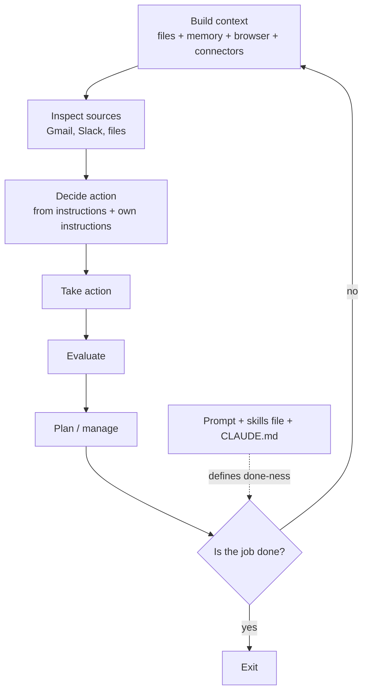
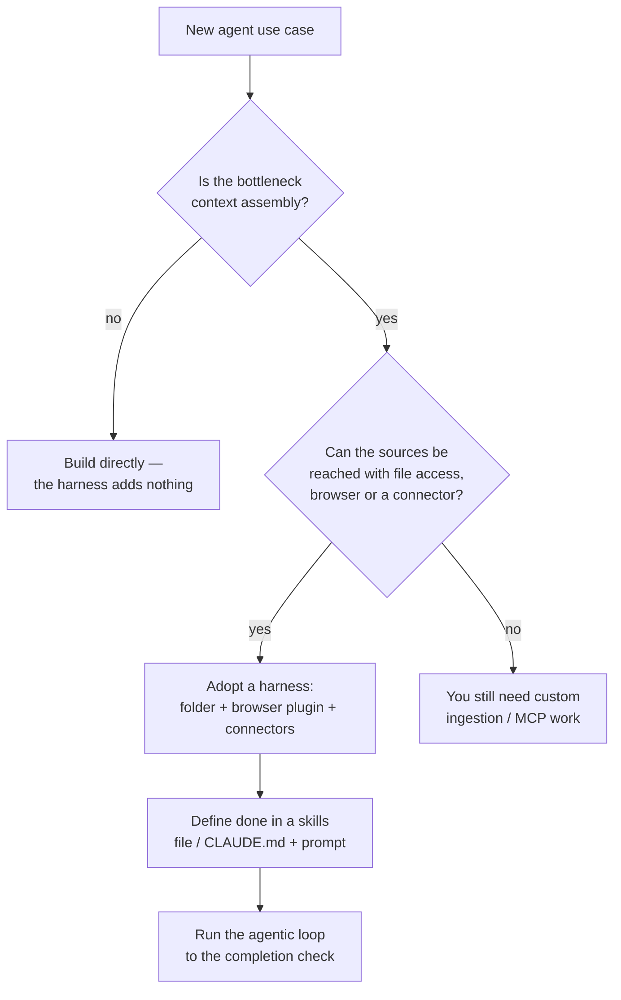

# CS-24 · The n8n Limitation Claude Code Solves: Harnesses, Context and the Agentic Loop

> **Source transcript:** `The_n8n_Limitation_Claude_Solves_How_Claude_Code_Accelerates_Everything.txt` (83 lines, ~9 minutes — a short community session, not a full lecture)
> **Domain:** production
> **One-liner:** The 2025 shift from "build your own agent" to "use a harness": Claude Code, Cowork and OpenClaw supply the context plumbing — file-system access, file/folder ingestion, memory, browser and 2,137 connectors — wrapped around an agentic loop that runs until a completion check passes.
> **Prerequisites:** CS-20, CS-23 (same host, same series)

## 0. Executive summary

- **The harness is the product, not the agent.** *"You need not worry about building all of this and doing lot of engineering on how to get to the right context"* `[8:22]` — the harness (agent + memory + tools + orchestration) is what Claude Code, OpenClaw and Codex actually sell `[1:29]` `[1:49]`.
- **2025's one solved problem:** connecting memory, writing MCP servers, wiring Gmail, adding guardrails and *"getting the right context all the time"* stopped being the builder's job `[0:46]` `[1:00]` `[1:08]` `[1:17]`.
- **The hard part was never the agent, it was the context** — specifically extraction from *"larger files or larger contracts"* `[1:23]` `[3:39]` `[3:48]`.
- **Three out-of-the-box context mechanisms** `[3:48]` `[3:54]`: **file-system access with plain search rather than embeddings** `[4:36]` `[5:00]`; **the ability to add files and folders** `[5:13]`; and **memory plus browser plus connectors** `[5:42]` `[5:58]`.
- **File-system access is the differentiator against the previous generation:** *"cursor asked for your databases, your code on GitHub, but did not get access to your computer"* `[4:50]` `[4:55]`.
- **2,137 out-of-the-box connectors** at the time of recording `[6:29]`, covering Gmail, Slack, Microsoft 365, SharePoint, OneDrive, Salesforce and Snowflake `[6:35]` `[6:44]`.
- **The loop is explicit:** build context → check Gmail/Slack → take actions → evaluate → plan → repeat, with a single exit condition, *"is the job done? If yes, then get out"* `[7:02]` `[7:14]` `[7:21]` `[7:41]` `[7:50]`.
- **Two unblocks arrived together:** the harness *and* model intelligence — *"Opus 4 onwards the models became really smart at this also"* `[7:50]` `[8:00]`.
- **Where the success criterion lives:** the audience asks what the loop compares against, and the answer is the **skills file, the `CLAUDE.md` files, and the prompt** `[8:42]` `[8:54]` `[9:02]`.
- **Scope caveat:** this is a nine-minute session. It names evaluation as a step in the loop but teaches no eval method; anything below beyond that is drawn from the transcript's own claims, and the gaps are flagged.

## 1. The problem this lecture solves

Through 2024 and into 2025, building an agent meant assembling everything yourself: choosing a memory strategy, writing MCP servers, wiring Gmail into the pipeline, adding guardrails, and repeatedly re-solving *"how can I get the right context"* from a large file or a long contract `[0:54]` `[1:00]` `[1:08]` `[1:17]` `[1:23]`.

The session's claim is that this stopped being the builder's problem in 2025. The agent-building work was absorbed into a **harness** — and the harness is what makes multi-agent systems, tool connection and scaling tractable for someone who does not want to do the plumbing `[1:29]` `[1:49]` `[1:56]`.

**Analyst note:** the title frames this as "the n8n limitation", but the transcript never uses the word n8n and never states a limitation of it explicitly. The implied contrast is a visual-workflow tool against a harness that has direct file-system, browser and connector access. Because the source does not make that argument in words, this case study does not attribute one to it.

## 2. Definitions & mental models

| Term | Definition | Why it matters | Anchor |
|---|---|---|---|
| **Harness** | The agent plus everything around it — memory, tools, context assembly, multi-agent orchestration | It is the unit that is now bought rather than built | `[1:29]` `[1:49]` |
| **Agentic loop** | The repeat-until-done cycle that drives Claude Code, OpenClaw and Codex | Named as the core mechanism that made Claude Code succeed | `[3:00]` `[3:19]` |
| **Context (as built here)** | What the model needs, assembled from files, memory, browser and connectors | The stated hard problem, and the thing the harness solves | `[3:48]` `[4:18]` |
| **Connector** | An out-of-the-box integration to a system of record | Removes MCP-server authoring from the builder | `[6:29]` `[6:49]` |
| **Skills file / `CLAUDE.md`** | The instruction surface that defines what "done" means | The loop is unbounded without it | `[8:54]` `[9:02]` |

**The loop, as the source describes it** `[7:02]`–`[7:50]`:



## 3. Core content, decomposed

### 3.1 The harness moment `[0:00]` `[0:46]` `[1:29]`

**What the source says.** *"Mid week there was Claude that was released, right — Claude Code came out, and then came out Co-work, and then came out OpenClaw"* `[0:00]` `[0:08]`. These are described as *"the agents or… the harnesses which basically allows you to have this whole agent which you are building with knowledge, memory, connecting the tools"* `[0:15]` `[0:23]` `[0:31]`. They also *"take care of creating multi-agents also, and which to call, how to call them"* `[0:37]`.

**Mechanism.** The claim is a division of labour: the harness owns context assembly, memory lifecycle, tool connection, guardrails and multi-agent routing; the builder supplies the problem and the instructions.

**Analyst note (transcription):** the transcript renders these as "Claude Code", "Co-work" and "open claw"/"OpenClaw". The first and third are recognisable product names; "Cowork" is the likely reading of the second. Product availability dates are not given and are not asserted here.

### 3.2 The problem that got solved in 2025 `[0:46]` `[1:17]`

The enumerated list of things that *"now it's no more your problem"* `[0:54]`:

- creating the agent `[0:54]`
- connecting and loading memory, and deciding *"which memory should go into what"* `[0:54]` `[1:00]`
- writing MCP servers to bring Gmail and similar sources in `[1:00]` `[1:08]`
- putting guardrails in place `[1:08]`
- *"keep iterating on this element on getting the right context all the time"* `[1:17]`

The last is called out as the genuinely hard part, with the specific example of extracting from *"larger files or larger contracts"* when *"your problem is a hard problem"* `[1:17]` `[1:23]` `[1:29]`.

**Analyst note:** the contract-extraction example is the same running example used across CS-20, CS-21, CS-22 and CS-23 by this host.

### 3.3 Why coding came first, and the agentic loop `[2:43]` `[3:00]` `[3:19]`

**What the source says.** The first problem the harness builders attacked was coding `[2:43]`. Before that, options were *"a tool from cursor"* or *"like 10 tools"* `[2:50]` `[2:55]`. What they introduced was *"something called an agentic loop"* `[3:00]`, and *"the agentic loop that drives the core of Claude Code… or any tool, even OpenClaw, Claude Code or Codex, they have this new idea which is agentic loop"* `[3:19]` `[3:32]`.

**The rationale given:** *"all of us, the world, knows how to create agents but most of the world is struggling to build the right context to these and how to get access to the context. So they figure out context"* `[3:32]` `[3:39]` `[3:48]`.

**Analyst note:** the sentence is elliptical in the transcript; "they figure out context" appears to mean "they solved for context". The attribution of the agentic-loop idea to Claude Code specifically, with Codex described later as *"copied off from that"* `[8:11]`, is the speaker's characterisation and is reported as such.

### 3.4 The three out-of-the-box context mechanisms `[3:48]` `[3:54]`

The session poses this as a class-participation question and takes three answers `[3:54]` `[3:59]`.

**Mechanism 1 — file-system access with plain search, not embeddings** `[4:18]` `[4:36]` `[5:00]`

> *"I can have access to your file system and I can go search in those folders, I can go modify these files"* `[4:36]` `[4:45]`

The contrast drawn is with the previous generation of coding tools: *"give me access to your file system, which Cursor didn't ask for by the way. Earlier Cursor asked for your databases, your code on GitHub, but did not get access to your computer"* `[4:45]` `[4:50]` `[4:55]`.

And the retrieval method is deliberately blunt: *"from the file system, instead of doing semantic or embedding search, they are just doing simple search inside your files to build the context your model needs or your agent needs"* `[5:00]` `[5:05]`.

**Analyst note:** this is the most consequential technical claim in the session for an evals audience. A grep-style search over an accessible file tree trades recall for determinism — there is no embedding index to keep in sync and no approximate-nearest-neighbour failure mode, but also no semantic generalisation. Compare the retrieval metrics and chunking trade-offs in CS-13 and CS-15.

**Mechanism 2 — you can add context** `[5:13]` `[5:20]`

*"You're able to write context or add context and add files to your system"* `[5:13]`. Concretely: add a folder `[5:20]` `[5:24]` — the file system it already has access to, *"or you can give it access to your whole C drive and then they will be in La La Land"* `[5:24]` `[5:30]`.

**Mechanism 3 — memory, browser and connectors** `[5:42]` `[5:58]` `[6:20]` `[6:29]`

Three participant answers are accepted in sequence: *"learning from its own memory, the ongoing work, that directions, connectors"* `[5:48]` `[5:53]`.

- **Browser:** *"install the Claude plugin in your Chrome and then this Claude will automatically go to Chrome and do whatever it wants… you need not to connect this Tavily thing or anything — just apply a Claude plugin into your browser and now I can go and browse everything and build my own context"* `[5:58]` `[6:03]` `[6:08]` `[6:12]`.
- **Connectors:** *"last I checked [it] has 2,137 connectors"* `[6:20]` `[6:29]`, naming Gmail, Slack, *"all Microsoft 365 or your SharePoint or OneDrive"*, Salesforce and Snowflake `[6:35]` `[6:44]` `[6:49]`.

### 3.5 The loop and its exit condition `[7:02]`–`[7:50]`

The described cycle:

1. *"all they have to do is install a plug-in, give me access to the folder, and click buttons to do connectors"* `[6:56]` `[7:02]`
2. *"I will go and build the context for them. I will go and check their Gmail. I will go check their Slack. And I will figure out how to take action and what actions to take"* `[7:02]` `[7:09]` `[7:14]`
3. *"based on their instructions and my own instructions, I can go and do evaluations"* `[7:14]` `[7:21]`
4. *"based on this, I can go and build or manage or do a better plan and repeat this unless the job is done"* `[7:32]`
5. *"I have a check here. Is the job done? If yes, then get out. If not, then keep doing this"* `[7:41]` `[7:50]`

**Analyst note:** the word "evaluations" appears exactly once and is used loosely — it sits inside the loop as a step, not as an offline measurement suite with datasets, judges or thresholds of the kind described in CS-20 through CS-22. Read as written, this is a *self-check inside the trajectory*, which is the trajectory-evaluation surface discussed in CS-17. The source does not connect the two.

### 3.6 Two unblocks, not one `[7:50]` `[8:00]`

> *"Opus 4 onwards the models became really smart at this also. So there was an unblock and intelligence also, and then this loop is what made Claude Code so successful"* `[7:50]` `[8:00]` `[8:05]`

The claim is that the harness alone would not have worked; it needed models that could use the loop. And on lineage: *"OpenClaw was built on top of that and Codex was copied off from that"* `[8:05]` `[8:11]` — *"this is the real thing that is driving the economy, driving Anthropic, driving everybody"* `[8:11]` `[8:16]`.

### 3.7 What defines "done" `[8:42]` `[8:54]` `[9:02]`

An audience member asks the sharpest question in the session: *"where did you give the objective that it compares against as a success criteria to say that the job is done?"* `[8:42]` `[8:48]`.

The answer: *"those are your skills file, those [are] your CLAUDE.md files, and they all start with your prompt also. So prompt combined with your skills gives it instructions on how to do it, where to do it, where to find things"* `[8:54]` `[9:02]` `[9:07]`.

**Analyst note:** this is the only place in the session where an evaluation criterion is given any substance, and it is deliberately informal — a markdown file plus a prompt. There is no pass threshold, no scoring rubric and no dataset. It is a *termination condition*, not an evaluation.

### 3.8 The commercial tail `[9:07]` `[9:12]` `[9:16]`

The session closes on training and certification: *"we will go and train you on and then we will make sure that you can go and clear at least developer-level certification so you can show the world that you know this"* `[9:07]` `[9:12]` `[9:16]`. No certification body, cost or syllabus is named.

## 4. Frameworks & decision procedures

**Should you build the plumbing or adopt a harness?** (derived from `[0:46]`–`[1:29]`)



**Context-source selection:**

| Source of truth | Mechanism the source names | Constraint it removes | Anchor |
|---|---|---|---|
| Local files, contracts, repos | File-system access + plain search | Building and maintaining an embedding index | `[4:36]` `[5:00]` |
| A folder you curate | Add folder / add files | Deciding what the model may see | `[5:13]` `[5:24]` |
| The open web | Browser plugin in Chrome | A separate search API | `[5:58]` `[6:12]` |
| Gmail, Slack, M365, Salesforce, Snowflake | One of 2,137 connectors | Writing MCP servers | `[6:29]` `[6:49]` |
| Prior work | Memory | Re-establishing state each run | `[5:42]` `[5:48]` |

## 5. Worked end-to-end example

The source does not present a numbered worked example. The nearest thing is the loop narrative itself `[6:56]`–`[7:50]`, reconstructed here as the shape it describes:

1. **Grant access.** Install the browser plugin, point the harness at a folder, click the connectors on `[6:56]` `[7:02]`.
2. **Assemble context.** The harness searches the files directly (not by embedding), pulls the folder contents, browses if needed, and reads memory `[5:00]` `[5:13]` `[5:42]` `[5:58]`.
3. **Inspect the systems of record.** Check Gmail, check Slack `[7:09]`.
4. **Decide and act.** Choose what action to take, from the user's instructions plus the harness's own `[7:14]`.
5. **Evaluate.** The self-check step `[7:21]`.
6. **Plan and repeat.** `[7:32]`.
7. **Terminate.** *"Is the job done? If yes, then get out."* `[7:41]` `[7:50]`.

**Numbers in the source:** 2,137 connectors `[6:29]`; "like 10 tools" as the pre-harness alternative `[2:55]`; "45 minutes" as a participant's thinking time before speaking on a call `[2:09]` `[2:14]` `[2:21]`. **No cost, latency, accuracy or pass-rate figures appear anywhere in this transcript.**

**Analyst note:** the 45-minute remark is audience banter about a participant named Vina and is reported because it carries an anchor, not because it is evidence of anything.

## 6. Pros, cons, exceptions

| Approach | Pros | Cons | Works when | Fails when | Cost |
|---|---|---|---|---|---|
| Harness with file-system search `[4:36]` `[5:00]` | No index to build or keep in sync; direct access to source of truth | Plain search, no semantic generalisation | Sources are files on disk | Content is not text-in-files, or recall needs semantics | Not stated |
| Harness with connectors `[6:20]` `[6:49]` | 2,137 integrations without writing MCP servers | Depends on the connector existing for your system | Your system is Gmail, Slack, M365, Salesforce, Snowflake | Your system is bespoke | Not stated |
| Browser plugin `[5:58]` `[6:12]` | No separate search API to wire | Broad access; the source jokes about *"La La Land"* `[5:30]` | You need the open web | Scope must be tightly bounded | Not stated |
| Memory `[5:42]` | Ongoing work carries forward | Not specified | Work spans sessions | Stale memory misleads | Not stated |
| Build your own | Full control | Every item on the `[0:54]`–`[1:29]` list is yours | The problem is genuinely novel | The bottleneck is plumbing | Not stated |

## 7. Failure modes & anti-patterns

1. **No completion criterion.** *Symptom:* the loop never terminates, or terminates arbitrarily. *Root cause:* the agentic loop has a `is the job done?` check `[7:41]` with nothing to check against. *Detection:* can a new engineer read the skills file and predict when the agent stops? *Fix:* write the objective into the prompt plus the skills file / `CLAUDE.md` `[8:54]` `[9:02]`.
2. **Over-broad file-system grants.** *Symptom:* the agent wanders. *Root cause:* granting the whole drive instead of a curated folder — the source's own joke: *"you can give it access to your whole C drive and then they will be in La La Land"* `[5:24]` `[5:30]`. *Fix:* scope to a folder `[5:20]`.
3. **Trusting plain file search to behave like retrieval.** *Symptom:* misses that a semantic search would have found. *Root cause:* the deliberate choice of *"simple search inside your files"* over embeddings `[5:00]` `[5:05]`. *Detection:* measure hit rate on a known-answer set, as in CS-13. *Fix:* not offered by the source.
4. **Treating the in-loop "evaluate" step as an eval suite.** *Symptom:* no offline evidence of quality. *Root cause:* the word covers a self-check `[7:21]`, not a dataset-and-judge harness. *Fix:* the methods in CS-20 through CS-22.
5. **Assuming the harness alone is the answer.** *Symptom:* a working loop that produces poor output. *Root cause:* the source explicitly pairs the harness with *"an unblock [in] intelligence also"* from Opus 4 onwards `[7:50]` `[8:00]`. *Fix:* model selection is part of the context problem, not separate from it.

## 8. Implementation notes

- **Access model:** browser plugin installed into Chrome `[5:58]` `[6:03]`; a folder added to the harness `[5:20]`; connectors clicked rather than coded `[6:56]` `[7:02]`.
- **Retrieval:** plain in-file search, explicitly *not* semantic or embedding search `[5:00]` `[5:05]`.
- **Connector inventory:** 2,137 at time of recording, including Gmail, Slack, Microsoft 365, SharePoint, OneDrive, Salesforce, Snowflake `[6:29]` `[6:35]` `[6:44]` `[6:49]`.
- **Instruction surface:** the prompt plus a skills file plus `CLAUDE.md` files, which between them say *"how to do it, where to do it, where to find things"* `[8:54]` `[9:02]` `[9:07]`.
- **Named harnesses:** Claude Code, Cowork, OpenClaw, Codex `[0:00]` `[0:08]` `[3:32]` `[8:05]`.

## 9. Interview-ready Q&A

**Q1. What is a harness, and how does it differ from an agent?**
The agent is the reasoning-and-acting component; the harness is everything around it — knowledge, memory loading, tool and connector wiring, guardrails, multi-agent routing, and the loop that drives it `[1:29]` `[1:49]`. The session's argument is that the harness is where the engineering effort moved, and that in 2025 it stopped being something each team had to build `[0:46]` `[0:54]`.

**Q2. What was the single hardest unsolved problem before harnesses?**
Context. *"Most of the world is struggling to build the right context to these and how to get access to the context"* `[3:32]` `[3:39]`. The concrete difficulty named is extracting the right context out of *"larger files or larger contracts"* `[1:23]`.

**Q3. Name the three out-of-the-box ways these harnesses build context.**
File-system access with plain search `[4:36]` `[5:00]`; the ability to add files and folders `[5:13]` `[5:20]`; and memory plus a browser plugin plus connectors `[5:42]` `[5:58]` `[6:20]`. Two of the three are access grants rather than algorithms — that is the point.

**Q4. Why is file-system access such a big deal?**
Because it changes both what the model can see and how it finds it. Earlier coding tools asked for databases and GitHub code but *"did not get access to your computer"* `[4:50]` `[4:55]`; the harness asks for the file system, and once it has it, it *"just [does] simple search inside your files"* instead of semantic or embedding search `[5:00]` `[5:05]`.

**Q5. What is the agentic loop?**
The repeat-until-done cycle: assemble context, inspect sources, decide and take action, evaluate, plan, then test whether the job is done and exit or iterate `[3:00]` `[7:02]`–`[7:50]`. The source credits it, alongside the jump in model capability from Opus 4 onwards, with Claude Code's success `[8:00]` `[8:05]`.

**Q6. How does the agent know when to stop?**
It is told, in the prompt, the skills file and the `CLAUDE.md` files, which together specify *"how to do it, where to do it, where to find things"* `[8:54]` `[9:02]` `[9:07]`. There is no scoring threshold — the completion criterion is textual and human-authored.

**Q7. How many connectors, and which ones are named?**
2,137 at the time of recording `[6:29]`, with Gmail, Slack, Microsoft 365, SharePoint, OneDrive, Salesforce and Snowflake named explicitly `[6:35]` `[6:44]` `[6:49]`.

**Q8. What does this session imply about evaluation?**
Very little directly. It places an *evaluate* step inside the loop `[7:21]` but teaches no dataset, judge, metric or threshold; the "success criteria" question from the audience is answered with configuration files rather than with measurement `[8:42]` `[8:54]`. Treat it as a description of runtime self-checking, not as eval methodology.

**Q9 (trap). So the harness solved context, and context was the only blocker.**
No. The source is explicit that two things unblocked together: the loop *and* model intelligence — *"Opus 4 onwards the models became really smart at this also. So there was an unblock and intelligence also"* `[7:50]` `[8:00]`. A harness around a weaker model would not have produced the same result.

**Q10 (trap). The title says this solves an n8n limitation. What is that limitation?**
The transcript never states it. It draws the contrast implicitly, by describing what the harness can do that earlier approaches could not — direct file-system access `[4:45]` `[4:55]`, a browser plugin instead of a separate search API `[6:08]` `[6:12]`, and click-to-connect integrations instead of authoring MCP servers `[6:56]` `[7:02]`. If asked in an interview, describe those three capabilities rather than attributing a specific defect to n8n, which the source does not do.

## 10. Cheat sheet

```
THE SHIFT                                            [0:46]-[1:29]
  before: build agent + memory + MCP servers + guardrails
          + "get the right context all the time"
  after:  adopt a harness; the plumbing is not your problem

NAMED HARNESSES                                      [0:00] [0:08] [3:32]
  Claude Code | Cowork | OpenClaw | Codex
  Claude Code first; OpenClaw built on top;
  Codex "copied off from that"                       [8:05] [8:11]

THE REAL HARD PROBLEM                                [3:32] [3:39]
  not the agent — the CONTEXT
  specifically: large files, large contracts         [1:23]

THREE CONTEXT MECHANISMS OUT OF THE BOX              [3:48] [3:54]
  1. FILE SYSTEM ACCESS  -> plain search, NOT embeddings   [5:00]
     differentiator: "Cursor... did not get access
     to your computer"                               [4:50] [4:55]
  2. ADD FILES / FOLDERS                             [5:13] [5:20]
  3. MEMORY + BROWSER PLUGIN + CONNECTORS            [5:42] [5:58]
     Chrome plugin replaces a search API             [6:08] [6:12]
     2,137 connectors                                [6:29]
     Gmail, Slack, M365, SharePoint, OneDrive,
     Salesforce, Snowflake                           [6:35]-[6:49]

THE AGENTIC LOOP                                     [7:02]-[7:50]
  context -> check Gmail/Slack -> decide & act
   -> evaluate -> plan -> "Is the job done?"
   yes -> exit | no -> repeat

DONE-NESS IS CONFIGURATION                           [8:54] [9:02]
  prompt + skills file + CLAUDE.md
  => how to do it, where to do it, where to find things

TWO UNBLOCKS, NOT ONE                                [7:50] [8:00]
  the loop  AND  model intelligence (Opus 4 onward)

NUMBERS IN THIS SOURCE
  2,137 connectors | "like 10 tools" before [2:55]
  NO cost, latency, accuracy or pass-rate figure appears

FAILURE -> FIX
  loop never terminates     -> write done-ness into skills/CLAUDE.md
  agent wanders             -> scope access to a folder, not the C: drive
  plain search misses        -> measure hit rate (see CS-13)
  "evaluate" read as evals  -> it is a runtime self-check (see CS-20-22)
```

## 11. Glossary

| Term | Meaning |
|---|---|
| Agentic loop | The repeat-until-done cycle driving Claude Code, OpenClaw and Codex `[3:00]` `[3:19]` |
| `CLAUDE.md` | A markdown instruction file the harness reads to learn how, where and what to do `[8:54]` `[9:02]` |
| Connector | A pre-built integration to an external system, clicked rather than coded `[6:20]` `[6:56]` |
| Harness | Agent plus knowledge, memory, tools, guardrails and orchestration `[1:29]` `[1:49]` |
| Skills file | The paired instruction surface to `CLAUDE.md`; carries the completion objective `[8:54]` |

## 12. Cross-references

**Builds on**
- CS-23 · [CS-23](CS-23-pricing-ai-agents-and-roi.md) — previous session from the same host; the contract-extraction example recurs here `[1:23]`.

**Leads to**
- CS-17 · `../05-agentic/CS-17-agentic-evaluations-workshop.md` — trajectory evaluation, which is the disciplined version of the in-loop "evaluate" step named here `[7:21]`.
- CS-20 · [CS-20](CS-20-building-evals-for-agents-that-thrive-in-prod.md) — the offline eval suite this session does not describe.
- CS-13 · `../04-rag/CS-13-testing-rag-retrievers-hands-on.md` — how to measure the retrieval the file-system search replaces `[5:00]`.

**External**
- The connectors catalogue and the browser plugin, as the access surfaces `[6:20]` `[5:58]`.

---

**Analyst note (scope and thinness).** This is a nine-minute community session, not a workshop. It contains no numbers other than the connector count and a passing "like 10 tools", and it teaches no evaluation method — the word "evaluations" appears once, as a step inside the runtime loop `[7:21]`. Sections 5, 6 and 7 above are therefore reconstructions of the source's own claims rather than transcriptions of a presented framework. Anyone using this case study for evals work should take it as context on *where agent work moved*, and take the measurement method from CS-17 and CS-20–CS-22.

**Analyst note (undelivered).** The session promises a walkthrough of how to build embeddings and do RAG and agentic RAG `[4:29]`, a demonstration of how to connect the connectors `[6:29]`, and developer-level certification `[9:12]` `[9:16]`. None of the three appears in this transcript.

**Analyst note (title).** The title promises "the n8n limitation". The word n8n never occurs in the transcript and no limitation of it is stated. The comparison the transcript actually makes is against earlier coding tools and against hand-built plumbing, and that is what is documented above.

**Analyst note (transcription).** "cloud code" is Claude Code; "open claw" is OpenClaw; "this tavi thing" is most likely Tavily `[6:08]`; "Co-work" is rendered here as Cowork `[0:08]`; "Vina", "Chanel" and "Mahesh" are participants named in the recording.
