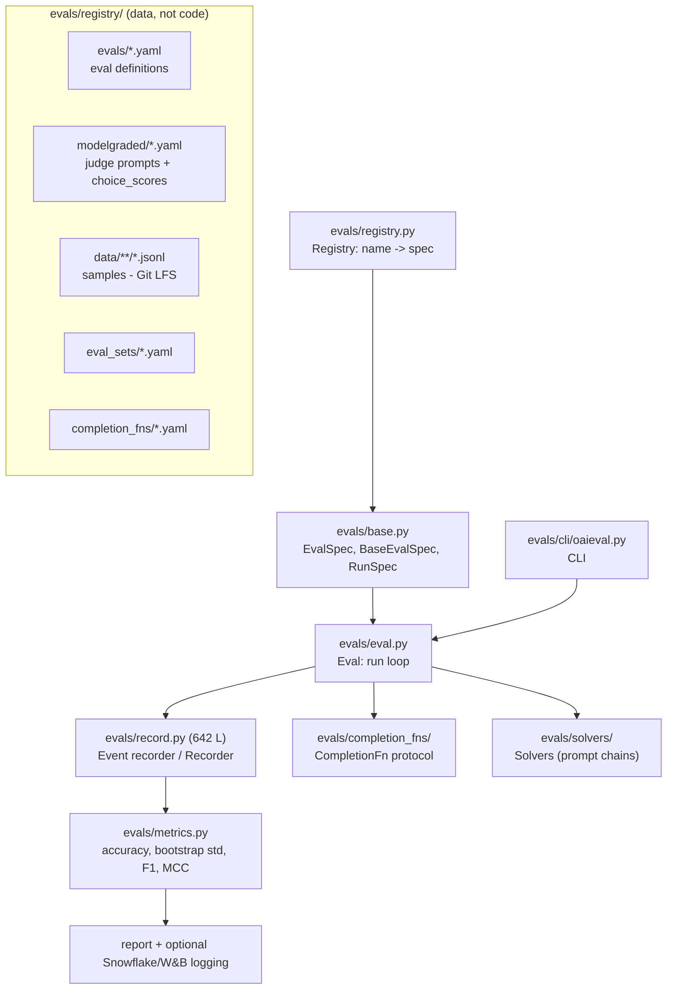

# Codebase · OpenAI `evals`

> **Repo path:** `zip_resources/… → extracted/evals-main/evals-main`
> **Language:** Python 3.9+ · **License:** MIT · **Scale:** ~2,400 LOC of framework core + 353 `.py`
> files and hundreds of registry YAMLs
> **Role in the stack:** The canonical **registry-driven eval framework**. Its lasting contribution is
> not the code but the *specification format*: an eval is data (YAML) plus optional code, and the
> most common eval type — model-graded classification — needs **no code at all**.

---

## 1. What it is / what it is not

**It is:** a way to declare an eval as two YAML files and a JSONL sample file, then run it against
any model behind a `CompletionFn`. It ships a large public registry of evals (`evals/registry/evals/`)
covering everything from `ab.yaml` (entity-relation facts) to `aime_evaluation.yaml`.

**It is not:**
- a hosted product — the README now points you at the OpenAI Dashboard for managed runs;
- an agent-trajectory evaluator — its agent-adjacent suites (`bugged_tools`, `multistep_web_tasks`,
  `error_recovery`) predate the modern tool-use eval paradigm;
- accepting new *custom-code* evals — the README explicitly says contributions must use existing
  templates or model-graded YAML.

**The design centre of gravity** is `ModelBasedClassify`: turn free-form output into a binary
`Y`/`N` with chain-of-thought, then map to `{1.0, 0.0}`. Everything else is plumbing around that.

---

## 2. Architecture



Two ideas carry the whole design:

1. **Registry indirection.** `Registry().get_class(name)` turns a string like
   `evals.elsuite.modelgraded.classify:ModelBasedClassify` into a class. YAML never imports Python;
   Python looks up YAML.
2. **Solver chains.** A `Solver` wraps a `CompletionFn` and can be *composed*
   (`evals.solvers.nested.*`), which is how prompt-chains and tool-use agents are expressed without
   new eval code. The README points at `docs/completion-fns.md` for this.

---

## 3. The 10 files that matter

| # | Path | Why |
|---|---|---|
| 1 | `evals/base.py` (89 L) | The four dataclasses that define the whole system: `CompletionFnSpec`, `BaseEvalSpec`, `EvalSpec`, `EvalSetSpec`, `RunSpec` |
| 2 | `evals/registry.py` (333 L) | Name → spec resolution, YAML loading, `Registry` singleton |
| 3 | `evals/eval.py` (255 L) | The run loop: get samples → record → compute metrics |
| 4 | `evals/record.py` (642 L) | The event model and recorder — the single biggest file |
| 5 | `evals/metrics.py` (73 L) | `get_accuracy`, `get_bootstrap_accuracy_std`, confusion matrix, F-score, MCC |
| 6 | `evals/elsuite/modelgraded/classify.py` | `ModelBasedClassify` — the workhorse |
| 7 | `evals/registry/evals/ab.yaml` | The minimal 3-key eval definition |
| 8 | `evals/registry/modelgraded/closedqa.yaml` | The canonical judge prompt + `choice_scores` |
| 9 | `evals/cli/oaieval.py` (311 L) | Real CLI surface (`oaieval`, `oaievalset`) |
| 10 | `docs/build-eval.md`, `docs/eval-templates.md` | The intended authoring path |

---

## 4. Core abstractions

### The spec dataclasses (`evals/base.py`)

```python
@dataclass
class BaseEvalSpec:
    id: Optional[str] = None
    metrics: Optional[Sequence[str]] = None
    description: Optional[str] = None
    disclaimer: Optional[str] = None
    higher_is_better: bool = True      # note: on the EVAL, not the metric
    key: Optional[str] = None
    group: Optional[str] = None

@dataclass
class EvalSpec:
    cls: str                      # "module.path:ClassName"
    registry_path: Path
    args: Optional[Dict[str, Any]] = None

@dataclass
class RunSpec:
    completion_fns: list[str]; eval_name: str; base_eval: str
    split: str; run_config: Dict[str, Any]; created_by: str
    run_id: str = None; created_at: str = None
```

`RunSpec.__post_init__` mints the run id as `%y%m%d%H%M%S` + 8 base32 chars from `os.urandom(5)` —
so run ids are sortable **and** collision-free without a coordinator.

**Analyst note:** `higher_is_better` living on the eval rather than the metric is a wart — the file
comments admit as much ("This should really be part of a metric, but it's easier to put it here").
If you add a metric like "cost per query" you must remember to flip the flag on every eval that uses it.

### The judge format (`modelgraded/closedqa.yaml`, quoted verbatim)

```yaml
closedqa:
  prompt: |-
    You are assessing a submitted answer on a given task based on a criterion. Here is the data:
    [BEGIN DATA]
    ***
    [Task]: {input}
    ***
    [Submission]: {completion}
    ***
    [Criterion]: {criteria}
    ***
    [END DATA]
    Does the submission meet the criterion? First, write out in a step by step manner your reasoning
    about the criterion to be sure that your conclusion is correct. Avoid simply stating the correct
    answers at the outset. Then print only the single character "Y" or "N" (without quotes or
    punctuation) on its own line corresponding to the correct answer. At the end, repeat just the
    letter again by itself on a new line.

    Reasoning:
  eval_type: cot_classify
  choice_scores:
    "Y": 1.0
    "N": 0.0
  choice_strings: 'YN'
  input_outputs:
    input: "completion"
```

That is the entire judge: **a prompt template, a two-letter vocabulary, a score map.** The prompt
contains four load-bearing instructions worth copying into any judge you write: reason step-by-step,
do not state the verdict first, print only the letter, repeat the letter at the end (a cheap
robustness trick against trailing prose).

### The eval definition (`evals/registry/evals/ab.yaml`)

```yaml
ab:
  id: ab.dev.v0
  description: ...
  metrics: [accuracy]

ab.dev.v0:
  class: evals.elsuite.modelgraded.classify:ModelBasedClassify
  args:
    samples_jsonl: ab/samples.jsonl
    eval_type: cot_classify
    modelgraded_spec: fact        # -> registry/modelgraded/fact.yaml
```

**Three keys and a pointer.** `samples_jsonl` locates the data (Git-LFS backed), `modelgraded_spec`
names the judge, `eval_type` names the grading strategy. This is why a prompt engineer who does not
code can ship an eval.

### Metrics (`evals/metrics.py`)

```python
def get_accuracy(events): num_correct / num_total          # NaN on empty
def get_bootstrap_accuracy_std(events, num_samples=1000):
    vals = [m.data["correct"] for m in events]
    return np.std([np.mean(random.sample(vals, len(vals)//2)) for _ in range(num_samples)])

def compute_matthew_corr(confusion_matrix): ...            # asserts shape (2,3)
def compute_precision(confusion_matrix, idx=0): ...
def compute_recall(confusion_matrix, idx=0): ...
def compute_f_score(confusion_matrix, idx=0, beta=1.0): ...
def compute_averaged_f_score(confusion_matrix, beta=1.0, average="macro"): ...
```

Two things to notice. First, the bootstrap std **half-samples without replacement** (`len(vals)//2`)
rather than resampling with replacement — it is a cheap spread indicator, not a proper bootstrap CI;
do not report it as a confidence interval. Second, the confusion matrix has **`len(labels)+1` columns**
— the extra column collects "no valid choice picked", so abstentions stay visible instead of being
silently folded into a wrong answer.

---

## 5. How an evaluation actually runs

1. `oaieval <model> <eval_name>` → `cli/oaieval.py`.
2. `Registry` resolves `<eval_name>` to an `EvalSpec`, and `modelgraded_spec` to a judge YAML.
3. The solver chain is built from `--completion_fn` specs; each `CompletionFnSpec` is
   `{cls, args, key, group}`.
4. `Eval.run()` iterates samples from `samples_jsonl`; each sample's `input` is dispatched through
   the solver chain.
5. For `cot_classify`: the judge prompt is rendered with `{input}`/`{completion}`/`{criteria}`,
   the judge model's reply is parsed for the `Y`/`N` tokens, and mapped via `choice_scores`.
6. Each outcome is recorded as an `Event` (`record.py`) — this is the substrate metrics read from.
7. `metrics` from the eval spec are computed over the event stream; results print and can be pushed
   to Snowflake or W&B.

---

## 6. Extending it

**Cheapest path — a pure model-graded eval (no Python):**
1. Put your samples at `evals/registry/data/<name>/samples.jsonl` with `input` (+ optional
   `ideal`, `criteria`) fields, then `git lfs track` it.
2. If existing judges don't fit, add `evals/registry/modelgraded/<myjudge>.yaml` with `prompt`,
   `eval_type: cot_classify`, `choice_scores`, `choice_strings`.
3. Add `evals/registry/evals/<name>.yaml` pointing at
   `evals.elsuite.modelgraded.classify:ModelBasedClassify`.

**Adding a metric** means editing `evals/metrics.py` and then referencing the name from the eval's
`metrics:` list — there is no metric registry, so the coupling is by string.

**Adding a new eval *type*** (new grading logic, e.g. trajectory grading) means a new class in
`evals/elsuite/` and a new `class:` pointer — this is where the framework shows its age, because the
README discourages exactly this contribution.

---

## 7. Configuration & CLI

| Item | Detail |
|---|---|
| Install | `pip install evals` (runner) or `pip install -e .` (contributor) |
| Data | Git-LFS: `git lfs fetch --all && git lfs pull`; or `--include=evals/registry/data/<eval>` for one eval |
| CLI | `oaieval <completion_fn> <eval_name>`; `oaievalset` for eval sets |
| Env | `OPENAI_API_KEY`; optionally `SNOWFLAKE_ACCOUNT`, `SNOWFLAKE_DATABASE`, `SNOWFLAKE_USERNAME`, `SNOWFLAKE_PASSWORD` |
| Known issue | The README documents a hang after the final report; safe to Ctrl-C |
| Python | ≥ 3.9 |
| Registry override | Private evals can live outside the public repo — "private evals which represent the common LLM patterns in your workflow without exposing any of that data publicly" |

---

## 8. Strengths, weaknesses, alternatives

| | Assessment |
|---|---|
| **Strengths** | Lowest-friction path from *idea* to *runnable eval* for subjective criteria (two YAMLs, zero Python). Huge public registry to clone-and-tweak. `choice_scores` makes the judge's output space explicit rather than parsing free text. Solver chains scale up to prompt-chains/tools. Records + metrics are cleanly separated. |
| **Weaknesses** | No trajectory/tool-call grading; binary `Y`/`N` on a single judge model with no built-in TPR/TNR calibration against human labels; `higher_is_better` misplaced; per-metric aggregation across evals is string-coupled; data in Git-LFS is awkward in CI; README says custom-code evals are not accepted; the framework is in maintenance relative to the Dashboard product. |
| **Choose it over…** | …a bespoke script when your eval is "does this output satisfy criterion X" — the YAML path is faster and the judge prompt template is battle-tested. …**Evalscope** when you need hundreds of academic benchmarks rather than custom product criteria. |
| **Don't choose it for** | Multi-turn agent trajectories, cost accounting, statistical significance, or anything where you need to grade *how* the model got there rather than *what* it produced. |

---

## 9. Minimal runnable example

```bash
# Data for one eval only
git lfs fetch --include=evals/registry/data/coqa
git lfs pull

# Run an existing eval
oaieval gpt-4o ab.dev.v0
```

A complete, self-contained custom judge eval — no Python:

```yaml
# evals/registry/modelgraded/grounded_reply.yaml
grounded_reply:
  prompt: |-
    You are assessing whether a support reply is grounded in the supplied context.
    [BEGIN DATA]
    ***
    [Question]: {input}
    ***
    [Context]: {context}
    ***
    [Submission]: {completion}
    ***
    [END DATA]
    Does the submission answer the question using ONLY facts present in the context?
    First, reason step by step. Do not state your verdict at the outset. Then print only the
    single character "Y" or "N" on its own line. At the end, repeat just the letter again.
    Reasoning:
  eval_type: cot_classify
  choice_scores: { "Y": 1.0, "N": 0.0 }
  choice_strings: 'YN'
  input_outputs: { input: "completion" }
```

```yaml
# evals/registry/evals/grounded_reply.yaml
grounded_reply:
  id: grounded_reply.dev.v0
  description: Binary groundedness judge for RAG replies.
  metrics: [accuracy]

grounded_reply.dev.v0:
  class: evals.elsuite.modelgraded.classify:ModelBasedClassify
  args:
    samples_jsonl: grounded_reply/samples.jsonl
    eval_type: cot_classify
    modelgraded_spec: grounded_reply
```

**Analyst note (outside source):** add a held-out human-labelled slice and report TPR/TNR per the
`awesome-evals` PATTERNS.md recipe (`CODE-01`) before you trust this number. Registry evals ship with
accuracy only, and on rare failure modes accuracy is the wrong statistic.

---

## 10. Reading order for a newcomer

| Step | File | Time |
|---|---|---|
| 1 | `README.md` | 10 min |
| 2 | `evals/registry/evals/ab.yaml` + `modelgraded/closedqa.yaml` | 10 min — see the whole model |
| 3 | `evals/base.py` | 15 min |
| 4 | `evals/registry.py` | 25 min |
| 5 | `evals/eval.py` | 25 min |
| 6 | `evals/metrics.py` | 10 min |
| 7 | `docs/build-eval.md` | 20 min |
| 8 | `evals/record.py` | 40 min — only if you're extending |
| 9 | `evals/elsuite/modelgraded/classify.py` | 30 min |

---

## Cross-references

- **Concepts:** CS-07 (LLM-as-a-judge, reference-based vs reference-free), CS-08 (G-Eval — the
  deterministic successor to `cot_classify`), CS-04 (complete eval workflow), CS-11 (contamination).
- **Sibling codebases:** `CODE-01` (awesome-evals `PATTERNS.md` shows how to *validate* a judge like
  this one with TPR/TNR), `CODE-03` (evals-skills — same judge discipline, packaged as agent skills),
  `CODE-04` (Evalscope — the opposite end: 206 benchmark implementations).
