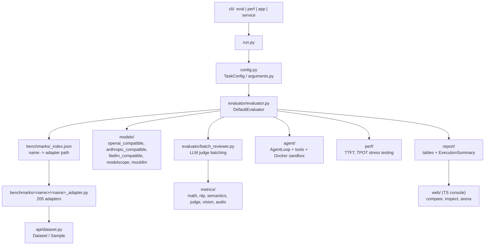

# Codebase · EvalScope (ModelScope)

> **Repo path:** `zip_resources/… → extracted/evalscope-main/evalscope-main`
> **Language:** Python ≥ 3.10 (+ a TypeScript web console) · **License:** Apache-2.0 (ModelScope)
> **Scale:** ~1,363 `.py` files, 727 `.md` docs, 236 `.ts` files, **205 benchmark adapters**
> **Role in the stack:** The **breadth** framework — a one-stop runner for model-capability
> benchmarking, **inference performance stress testing**, embedding/reranker/AIGC evaluation,
> agent-loop evaluation with a Docker sandbox, and multi-model arena battles, all behind one CLI.

---

## 1. What it is / what it is not

**It is:** the largest open benchmark harness in this collection. One command runs any of ~205
benchmarks (MMLU, C-Eval, GSM8K, AIME, ARC, SWE-bench-agentic, BFCL, BrowseComp, MMMU, …) against
any model reachable over an OpenAI/Anthropic-compatible API, with a web dashboard, a perf profiler,
and an arena mode.

**It is not:**
- a *product-specific* eval tool. It evaluates **foundation models on public benchmarks**, not your
  feature's failure modes. For that, see `CODE-03` (evals-skills) and `CODE-02` (custom judges).
- a tracing/observability platform — it is batch-oriented. For production monitoring see `CODE-06`.
- a hosted service — though it ships a `service/` layer and `web/` console for self-hosting.

**The design bet** is the opposite of `search_evals`: instead of one grader you control,
EvalScope standardises on **one adapter per benchmark**, so adding a benchmark is a self-contained
directory rather than a cross-cutting change.

---

## 2. Architecture



**The registry is a flat JSON map**, not Python imports:

```json
{ "aime24": "evalscope.benchmarks.aime.aime_adapter",
  "agieval": "evalscope.benchmarks.agieval.agieval_adapter",
  "air_bench_chat": "evalscope.benchmarks.air_bench.air_bench_chat_adapter" }
```

One benchmark directory = `__init__.py` + `<name>_adapter.py`. That is the whole extension unit.

---

## 3. The 10 files that matter

| # | Path | Why |
|---|---|---|
| 1 | `README.md` | Feature map + the one-line quickstart |
| 2 | `evalscope/benchmarks/_index.json` | The registry — every runnable benchmark name |
| 3 | `evalscope/benchmarks/arc/arc_adapter.py` | The adapter pattern at its simplest |
| 4 | `evalscope/evaluator/evaluator.py` | `DefaultEvaluator` — orchestrates load → predict → review → report |
| 5 | `evalscope/evaluator/perf_collector.py` | How latency/TTFT/TPOT are captured alongside accuracy |
| 6 | `evalscope/evaluator/batch_reviewer.py` | Batched LLM-judge review (cost/latency control) |
| 7 | `evalscope/metrics/judge/llm_judge.py` | The generic LLM-judge metric |
| 8 | `evalscope/metrics/` (dir) | The metric taxonomy: `math`, `nlp`, `semantics`, `judge`, `vision`, `audio`, `aggregators` |
| 9 | `evalscope/models/` (dir) | Model backends incl. `mockllm.py` — offline testing of the harness itself |
| 10 | `evalscope/cli/` | `start_eval.py`, `start_perf.py`, `start_app.py`, `benchmark_info.py` |

Notable: `DESIGN.md` in this repo is **not** an architecture document — it is the web console's design
token file (colour palette, typography for dark/light themes). Do not look for system design there;
read `evaluator/evaluator.py` and `AGENTS.md` instead.

---

## 4. Core abstractions

### `DefaultEvaluator`

Orchestrates, per its own docstring, "data loading, model inference, metric calculation, and report
generation". Internally it runs a **unified work pool** keyed on `_WorkItem`:

```python
@dataclass
class _WorkItem:
    subset: str
    sample: Optional[Sample] = None          # set when prediction is required
    task_state: Optional[TaskState] = None   # set when prediction is cached -> review only
    prediction_persisted: bool = False       # durably written before review began
```

That `_WorkItem` split is the important design detail: **prediction and review are separate phases
over one pool**, and `prediction_persisted` guarantees that a crash during judging never loses an
expensive generation. It also makes "re-judge an existing run with a different judge" a first-class
operation — the single most useful cost-control move when tuning a judge.

Other collaborators: `ExecutionTracker` (multi-threaded progress), `PerfCollector` (latency
metrics), `BatchReviewer` (batched judging), `CacheManager` / `TaskState` (resume).

### The adapter contract

Every benchmark dir ships `<name>_adapter.py` registering with the decorator-based
`api/registry.py` (`register_benchmark` / `register_evaluator`). The adapter supplies: dataset
loading + subsetting, prompt formatting from a template, the extraction of a model answer from raw
output, and the metric(s) to apply. **All benchmark-specific weirdness is confined to the adapter.**

### Model backends

`models/` contains `openai_compatible.py`, `anthropic_compatible.py`, `litellm_compatible.py`,
`openai_responses.py`, `modelscope.py`, `mockllm.py`, plus non-text models
(`text2image_model.py`, `image_edit_model.py`). `mockllm.py` is deliberately included so the harness
itself can be unit-tested without API spend — a discipline worth copying.

---

## 5. How an evaluation actually runs

```bash
evalscope eval --model your-model-name \
  --api-url $OPENAI_API_BASE_URL --api-key $OPENAI_API_KEY \
  --eval-type openai_api --datasets gsm8k --limit 5
```

1. **CLI** (`cli/start_eval.py`) parses into a `TaskConfig`.
2. **Benchmark resolution** — `--datasets gsm8k` looks up `benchmarks/_index.json` → adapter path →
   instantiate.
3. **Data** — adapter loads/pins the dataset and yields `Sample`s, possibly per `subset`.
4. **Inference** — the `Model` backend is called through the pool; each `_WorkItem.sample` produces a
   prediction that is **persisted before review**.
5. **Review** — metric computation. Closed-form metrics (`math`, `semantics`, `nlp`) run inline;
   `judge/llm_judge.py` runs through `BatchReviewer` for batching and cost control.
6. **Agent mode** (optional) — benchmarks like SWE-bench-Agentic drive a multi-turn `AgentLoop` with
   pluggable strategies, tools and a Docker sandbox; a **full per-sample agent trace** is recorded.
7. **Perf** (parallel concern, `--perf` / `start_perf.py`) — stress-tests the served endpoint
   reporting **TTFT** (time to first token) and **TPOT** (time per output token).
8. **Report** — `report/` builds tables + `ExecutionSummary`; the TS console renders comparison,
   per-sample inspection, and arena results.

---

## 6. Extending it

### Add a benchmark (the canonical workflow)

1. `evalscope/benchmarks/<name>/__init__.py`.
2. `evalscope/benchmarks/<name>/<name>_adapter.py` — subclass the benchmark base, decorate with
   `register_benchmark`, supply `name`, dataset loader, `subset_list`, prompt template, answer
   extraction, and metrics.
3. Add `"<name>": "evalscope.benchmarks.<name>.<name>_adapter"` to `benchmarks/_index.json`.
4. Verify with `evalscope eval --datasets <name> --limit 5`.

### Add a metric

Drop it under the right family in `metrics/` (`math`, `nlp`, `semantics`, `judge`, `vision`,
`audio`), register it, and reference it from the adapter. `metrics/aggregators/` handles
per-subset → overall rollup; check it whenever you add a subsetted benchmark, because macro vs
micro averaging is decided there.

### Add a model backend

Subclass the compatible-API base in `models/`; keep the streaming/non-streaming split explicit so
`PerfCollector` can measure TTFT.

### Use it from an agent

The repo ships `skills/evalscope/` (`SKILL.md`, `eval-reference.md`, `perf-reference.md`,
`rag-reference.md`, `examples.md`, `troubleshooting.md`) — an agent-facing interface to the same CLI.
If you drive evals from a coding agent, read those before the source.

---

## 7. Configuration & CLI surface

| Command | Purpose |
|---|---|
| `evalscope eval --model … --datasets … --limit N` | Run a benchmark |
| `evalscope perf …` | Inference performance stress test (TTFT, TPOT, throughput) |
| `evalscope app` / `start_app.py` | Launch the web dashboard |
| `evalscope service` / `start_service.py` | Serve evaluation as a service |
| `evalscope/benchmarks/benchmark_info.py` | Introspect available benchmarks |

| Config surface | Notes |
|---|---|
| `config.py` / `arguments.py` | `TaskConfig`: datasets, subsets, limit, eval-type, api-url/key, generation params, `--work-dir` |
| `eval-type` | `openai_api`, and other compatible backends (litellm/anthropic) |
| Backends | Also integrates **OpenCompass**, **VLMEvalKit** and **RAGEval** as external engines |

---

## 8. Strengths, weaknesses, alternatives

| | Assessment |
|---|---|
| **Strengths** | Unmatched benchmark breadth (205 adapters incl. multimodal, agentic, Chinese-language suites like C-Eval). Prediction/review phase split with durable persistence — cheap judge iteration. Agent mode with real Docker sandboxing and full traces. **Perf testing in the same tool as accuracy** — you get quality and TTFT/TPOT from one run. Arena mode for pairwise comparisons. `mockllm` makes the harness testable offline. Bilingual docs. |
| **Weaknesses** | Large surface = steep onboarding; ~205 adapters of varying freshness means benchmark integrity (contamination, saturation — see CS-11) is *your* problem, not the tool's. Python ≥3.10 + heavy optional deps; some benchmarks need Docker/GPU. It will not tell you what your product should measure — it gives you a library of someone else's questions. The web console is a separate TS build. |
| **Choose it over…** | …`search_evals` when you want open-model + offline + multimodal coverage. …`evals-main` when you need *published, comparable* benchmark numbers rather than a custom criterion. …a hand-rolled harness whenever your need is "run MMLU/GSM8K/C-Eval and show me a table". |
| **Don't choose it for** | Feature-level product evals, judge calibration against your own human labels, or anything where the answer is "what are *my* failure modes?" — that is CS-04 / `CODE-03` territory. |

---

## 9. Minimal runnable example

```bash
pip install evalscope

# Accuracy on a public benchmark against an OpenAI-compatible endpoint
evalscope eval \
  --model Qwen/Qwen2.5-7B-Instruct \
  --api-url $OPENAI_API_BASE_URL \
  --api-key $OPENAI_API_KEY \
  --eval-type openai_api \
  --datasets gsm8k \
  --limit 5

# Same model, performance profile (TTFT / TPOT)
evalscope perf \
  --model Qwen/Qwen2.5-7B-Instruct \
  --url $OPENAI_API_BASE_URL/v1/chat/completions \
  --api-key $OPENAI_API_KEY \
  --parallel 1 10 --number 10 20

# Browse what's available, then launch the dashboard over the run output
evalscope app
```

---

## 10. Reading order for a newcomer

| Step | Path | Time |
|---|---|---|
| 1 | `README.md` | 10 min |
| 2 | `skills/evalscope/SKILL.md` + `eval-reference.md` | 20 min — fastest correct mental model |
| 3 | `evalscope/benchmarks/_index.json` + `benchmarks/arc/arc_adapter.py` | 20 min |
| 4 | `evalscope/config.py` / `arguments.py` | 20 min |
| 5 | `evalscope/evaluator/evaluator.py` | 40 min — the `_WorkItem` pool |
| 6 | `evalscope/metrics/` (skim each family) | 30 min |
| 7 | `evalscope/models/openai_compatible.py` | 20 min |
| 8 | `evalscope/evaluator/batch_reviewer.py` + `metrics/judge/llm_judge.py` | 25 min |
| 9 | `evalscope/agent/` | 30 min — only if you need agentic benchmarks |
| 10 | `evalscope/perf/` | 20 min |

---

## Cross-references

- **Concepts:** CS-12 (running custom model evals to select a model — the canonical use of this tool),
  CS-10/CS-11 (benchmark taxonomy, saturation, contamination → read every adapter's dataset provenance
  with these in mind), CS-06 (offline vs online), CS-13/CS-15 (RAG metrics — see `rag-reference.md`).
- **Sibling codebases:** `CODE-02` (OpenAI evals — custom criteria, not public benchmarks),
  `CODE-07` (search_evals — hosted agentic search), `CODE-05` (frontier-evals — containerised
  research-grade replication tasks), `CODE-06` (Langfuse — the production/observability counterpart).
