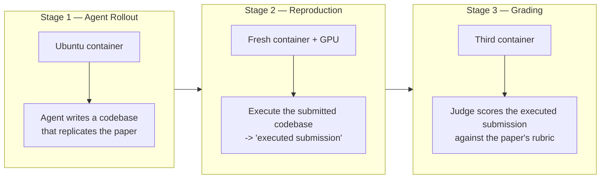

# Codebase · `frontier-evals`

> **Repo path:** `zip_resources/… → extracted/frontier-evals-main/frontier-evals-main`
> **Language:** Python (+ Dockerfiles, ~660 `.md`) · **License:** see `LICENSE.md`
> **Scale:** three self-contained eval projects, 1,081 files, ~417 `.py`
> **Role in the stack:** The **containerised, long-horizon** end of evaluation. Where other repos
> grade a response, this one runs an agent for up to **36 hours** inside a VM, executes the artefact
> it produced, and then grades the *result* against a rubric. It is the reference implementation of
> "grade the world state, not the transcript".

---

## 1. What it is / what it is not

**It is:** code for three frontier-capability evals, each an isolated `uv` project with its own
`README.md`, `pyproject.toml` and `uv.lock`:

| Eval | What it measures | Paper |
|---|---|---|
| **PaperBench** | End-to-end **replication of state-of-the-art AI papers** from scratch | arXiv 2504.01848 |
| **SWE-Lancer** | Real **freelance software-engineering tasks** with end-to-end tests | arXiv 2502.12115 |
| **EVMbench** | **Smart-contract security** tasks | evmbench.pdf |

**It is not:** a general framework. There is no shared plugin API, no registry of reusable metrics,
no CLI that spans the three evals. `project/common/` holds deliberately thin shared tooling
(`alcatraz`, `nanoeval`, `tooling`, `preparedness_turn_completer`), and the README warns that
"changes there may affect multiple evals".

**The design bet:** the hardest capabilities cannot be scored from text. They require
**execution** — build a container, let the agent work, actually run its output, then grade.

---

## 2. Architecture — the PaperBench three-stage model

PaperBench is the clearest illustration of the pattern and the most reusable contribution:



Three properties make this different from ordinary agent evals:

1. **Each stage gets a fresh container.** The grading container never shares state with the agent's
   container, so the agent cannot influence its own grader. This is the strongest defence against
   reward hacking available without a separate grader model.
2. **The artefact is executed before grading.** A submission that looks plausible but does not run
   scores zero — "does it run" is a deterministic, verifiable gate ahead of the judged rubric.
3. **Grading uses a paper-specific rubric**, not a generic quality prompt. Each of the 20 samples
   ships "a research paper and a rubric that defines the requirements for a successful replication".

There is also a **Code-Dev** variant (score only the code development, not the execution results),
which isolates "can it write the code" from "does the code reproduce the numbers".

---

## 3. The files that matter

| # | Path | Why |
|---|---|---|
| 1 | `README.md` (root) | The three evals + the layout rule (one isolated `uv` project per eval) |
| 2 | `project/paperbench/README.md` | The 3-stage spec, leaderboard, LFS data hydration, env vars |
| 3 | `project/paperbench/paperbench/grade.py` | Stage 3 entry point |
| 4 | `project/paperbench/paperbench/reproduce.py` | Stage 2 entry point |
| 5 | `project/paperbench/paperbench/judge/` | `base.py`, `simple.py`, `create_judge.py`, `graded_task_node.py`, `token_usage.py`, `judge_eval/` |
| 6 | `project/paperbench/paperbench/rubric/` | The rubric representation (a tree of graded task nodes) |
| 7 | `project/paperbench/paperbench/solvers/` | `basicagent/`, `direct_submission/`, `human/`, `dummy`, `apply_patch.py` |
| 8 | `project/paperbench/paperbench/reproducer.Dockerfile` + `Dockerfile.base` | How the execution environment is pinned |
| 9 | `project/paperbench/paperbench/metrics.py` | Score aggregation |
| 10 | `project/swelancer/` + `project/evmbench/` | The other two evals; note `evmbench/{ploit,veto,audits,splits}` for the security split |

**Notable in `solvers/`:** `dummy` and `human` are first-class solvers. A dummy that always fails and
a human baseline bracket the score, which is how you detect that your eval's floor or ceiling has
drifted.

---

## 4. Core abstractions

### Solver / agent abstraction

`solvers/base.py` defines the interface; implementations include `basicagent` and `direct_submission`
(the README's leaderboard distinguishes **BasicAgent** from **IterativeAgent** — i.e. the *harness*
is part of the reported result):

| Agent (leaderboard) | Score (%) | Runs | Date |
|---|---|---|---|
| IterativeAgent o1-high (36h limit) | **26.0 ± 0.3** | 3 | 2025-04-02 |
| IterativeAgent o1-high (24h limit) | 24.4 ± 0.7 | 3 | 2025-04-02 |
| BasicAgent claude-3.5-sonnet | 21.0 ± 0.8 | 3 | 2025-04-02 |
| IterativeAgent claude-3.5-sonnet | 16.1 ± 0.1 | 3 | 2025-04-02 |
| BasicAgent o1-high | 13.2 ± 0.3 | 3 | 2025-04-02 |
| IterativeAgent o3-mini-high | 8.5 ± 0.8 | 3 | 2025-04-02 |
| BasicAgent deepseek-r1 | 6.0 ± 0.3 | 3 | 2025-04-02 |
| BasicAgent gpt-4o | 4.1 ± 0.1 | 3 | 2025-04-02 |
| BasicAgent gemini-2.0-flash | 3.2 ± 0.2 | 3 | 2025-04-02 |
| BasicAgent o3-mini-high | 2.6 ± 0.2 | 3 | 2025-04-02 |

PaperBench **Code-Dev**, for contrast: IterativeAgent o1-high scores **43.4 ± 0.8** — nearly double
its full-task 26.0. That gap is the eval's most informative number: **writing the code is much easier
than making the code reproduce the result.**

**Analyst note on the harness confound.** `BasicAgent o1-high` (13.2) scores below
`BasicAgent claude-3.5-sonnet` (21.0) but `IterativeAgent o1-high` (26.0) scores above
`IterativeAgent claude-3.5-sonnet` (16.1) — the *ranking of the two models flips with the harness*.
This is the AlgoTune/harness-confound phenomenon in the wild (see CS-09 and `CODE-01` README § 3),
and it is why the leaderboard names the agent scaffolding in the same column as the model. Also note
the 36h→24h time limit costs o1-high 1.6 points: **time budget is a hyperparameter**, not a constant.

### Judge abstraction

`judge/base.py` + `judge/simple.py` + `judge/create_judge.py` — grading is a *tree walk* over
`graded_task_node.py`, with `judge/judge_eval/` providing a meta-evaluation of the judge itself, and
`judge/token_usage.py` accounting for judge cost. The rubric is decomposed into nodes so partial
credit is structural rather than a judge's gestalt impression.

---

## 5. How an evaluation actually runs

From `project/paperbench/`:

```bash
uv sync
git clone https://github.com/openai/frontier-evals.git --filter=blob:none
cd frontier-evals
git lfs fetch --include "project/paperbench/data/**" --exclude ""
git lfs checkout project/paperbench/data
export PAPERBENCH_DATA_DIR="$(pwd)/project/paperbench/data"

cp .env.example .env      # fill in keys; GRADER_OPENAI_API_KEY defaults to OPENAI_API_KEY
```

1. **Stage 1** — the solver runs in an Ubuntu container and produces a submission codebase.
2. **Stage 2** — `reproduce.py` executes that codebase in a **fresh container with GPU access**,
   producing the *executed submission*.
3. **Stage 3** — `grade.py` runs the judge in a **third container**, scoring against the rubric.
4. **Metrics** — `metrics.py` aggregates the rubric tree walk into the reported percentage.
5. `judge/token_usage.py` records judge spend, so a run's cost includes grading, not just rollouts.

Data is deliberately **not** fetched at install time — it is Git-LFS and must be hydrated explicitly,
which keeps `uv sync` fast and makes the data dependency visible.

---

## 6. Extending it

The repo is explicitly **not** a plugin framework, so extension means forking a project:

- **New task in an existing eval** — SWE-Lancer's layout (`all_swelancer_tasks.csv`, `issues/`,
  `Dockerfile_x86_per_task`, `runtime_scripts/`) shows the per-task container pattern: one Dockerfile
  variant per task granularity (per-task vs monolith) so you can trade build time against isolation.
- **New eval** — create `project/<name>/` with its own `README.md`, `pyproject.toml`, `uv.lock`, per
  the root README's layout rule. Put genuinely shared code in `project/common/` and bump editable
  dependencies, accepting cross-eval risk.
- **New agent/harness** — add to `paperbench/solvers/` following `basicagent/`; register it so the
  leaderboard can name it. **Always report the harness alongside the score.**
- **Tooling** — Ruff + Black, with autofix profiles in `pyproject.toml` and
  `project/common/tooling/ruff_autofix_minimal.toml`; `uv run pytest` per project.

---

## 7. Configuration surface

| Item | Detail |
|---|---|
| Env manager | `uv` (`uv sync` per project, from the checked-in `uv.lock`) |
| Data | Git-LFS; `PAPERBENCH_DATA_DIR` points at hydrated `data/` |
| Keys | `OPENAI_API_KEY`; `GRADER_OPENAI_API_KEY` defaults to it |
| Judge data | JudgeEval tarballs not redistributable → rebuild via `python -m paperbench.judge.judge_eval.download_data` |
| Runtimes | Docker required; GPU required for reproduction; long wall-clock (24–36h limits observed) |
| Tests | `pytest` per project |
| Style | Ruff (autofix profiles) + Black |

---

## 8. Strengths, weaknesses, alternatives

| | Assessment |
|---|---|
| **Strengths** | The only eval family here that **executes** the artefact before grading — a deterministic gate in front of a judged rubric. Fresh-container isolation between rollout, reproduction and grading is a strong anti-reward-hacking design. Rubrics are structural trees, so partial credit is principled. `judge_eval/` meta-evaluates the judge. Human and dummy baselines included. Reports ± over 3 runs. Code-Dev vs full-task split cleanly separates coding from reproducing. |
| **Weaknesses** | Brutally expensive (GPU containers, hours of agent time, judge tokens). Rubrics are hand-authored per paper, so scaling to new papers is labour-bound. Long horizons mean high variance and heavy infrastructure; not runnable in CI. Data is Git-LFS and partly non-redistributable. No shared abstraction across the three evals — triples the onboarding cost. The headline absolute scores are low (top ≈ 26%), which is honest but makes small deltas hard to interpret. |
| **Choose it over…** | …any transcript-graded agent eval when the question is *"can it actually do the research/engineering task?"* rather than *"does it sound like it did?"* |
| **Don't choose it for** | Product evals, fast iteration, or anything needing a score in minutes. For those use `CODE-02`/`CODE-07`; for breadth use `CODE-04`. |

---

## 9. Minimal runnable example

The smallest honest path is a single project, smoke-scaled:

```bash
cd project/paperbench
uv sync

git clone https://github.com/openai/frontier-evals.git --filter=blob:none
cd frontier-evals
git lfs fetch --include "project/paperbench/data/**" --exclude ""
git lfs checkout project/paperbench/data
export PAPERBENCH_DATA_DIR="$(pwd)/project/paperbench/data"
cd - 

cp .env.example .env      # set OPENAI_API_KEY / GRADER_OPENAI_API_KEY

# Stage 1+2+3 for a small run, per the local README's instructions
uv run python -m paperbench.grade --help
uv run python -m paperbench.reproduce --help
```

**Analyst note (outside source):** read `solvers/dummy` first and run it end to end. It exercises all
three stages with no model spend, which is the cheapest way to validate your Docker/LFS/GPU setup
before you commit to a 36-hour rollout.

---

## 10. Reading order for a newcomer

| Step | Path | Time |
|---|---|---|
| 1 | `README.md` (root) | 5 min — the three evals + layout rule |
| 2 | `project/paperbench/README.md` | 20 min — 3 stages, leaderboard, data hydration |
| 3 | `project/paperbench/paperbench/solvers/base.py` + `basicagent/` | 25 min |
| 4 | `project/paperbench/paperbench/rubric/` | 30 min — the graded task tree |
| 5 | `project/paperbench/paperbench/judge/base.py` + `simple.py` | 30 min |
| 6 | `project/paperbench/paperbench/reproduce.py` + `grade.py` | 30 min |
| 7 | `reproducer.Dockerfile`, `Dockerfile.base` | 15 min |
| 8 | `project/swelancer/README.md` + `runtime_scripts/` | 30 min — the per-task container pattern |
| 9 | `project/evmbench/README.md` | 20 min — the security-task variant |
| 10 | `project/common/` | 20 min — shared tooling (touch with care) |

---

## Cross-references

- **Concepts:** CS-17 (agentic/trajectory evaluation — this is its most extreme form), CS-11
  (benchmark contamination; PaperBench's papers are public, so contamination risk is real), CS-09
  (leaderboards and the harness confound visible in the table above), CS-18 (verifiable rewards and
  RL environments — PaperBench's Docker+test-suite shape is an RL environment), CS-23 (the economics
  of agentic workloads: 36h rollouts are the cost baseline).
- **Sibling codebases:** `CODE-04` (Evalscope — breadth over depth), `CODE-07` (search_evals — hosted
  agents with rigorous cost accounting), `CODE-02` (custom criteria, minutes not hours).
