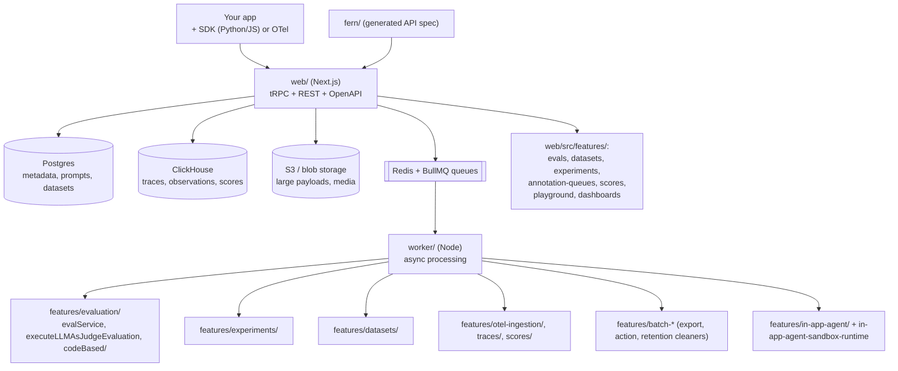

# Codebase · Langfuse

> **Repo path:** `zip_resources/… → extracted/langfuse-main/langfuse-main`
> **Language:** TypeScript (~5,190 `.ts`/`.tsx`) with a Python SDK and a Fern-generated API layer
> · **License:** MIT (core; `ee/` is the enterprise tier) · **Scale:** 3,751 files, 299 `.md`
> **Role in the stack:** The **platform**. Everything else in this collection produces a score; Langfuse
> is where traces, scores, datasets, experiments, annotation queues and prompt versions live
> together so that a score can be attached to a real user session and acted on.

---

## 1. What it is / what it is not

**It is:** an open-source LLM engineering platform — "develop, monitor, evaluate, and debug AI
applications" — self-hostable, built on **ClickHouse** (traces/observations at volume) plus Postgres
(metadata), with S3 blob storage for large payloads. Its five capability blocks, from the README:

1. **LLM Application Observability** — instrument the app; ingest traces covering LLM calls,
   retrieval, embeddings, agent actions; inspect sessions.
2. **Prompt Management** — central versioning with server- and client-side caching so iterating on
   prompts "without adding latency".
3. **Evaluations** — LLM-as-a-judge, **code evaluators**, user feedback, manual labelling, and custom
   pipelines via API/SDK.
4. **Datasets** — test sets and benchmarks for pre-deployment testing and structured experiments,
   with LangChain/LlamaIndex integration.
5. **LLM Playground** — jump from a bad trace straight into iterating on the prompt.

**It is not:** a benchmark runner. It has no MMLU/GSM8K. It is also not a judge library — it *hosts*
judges you write, and its value is the plumbing around them (sampling, targeting, storage,
comparison).

**The design bet:** evaluation is not a batch job, it is a **property of the trace store**. If a
score is not attached to the same object as the latency, cost and user feedback, you cannot act on it.

---

## 2. Architecture



Four planes, and keeping them separate is the architecture:

| Plane | Where | Responsibility |
|---|---|---|
| **Ingest/query** | `web/` (Next.js) | UI, tRPC/REST, OpenAPI, auth, entitlements |
| **Async work** | `worker/` (BullMQ) | Evaluation runs, experiments, exports, retention, OTel ingestion |
| **Storage** | ClickHouse + Postgres + S3 | Traces/observations at scale vs metadata vs blobs |
| **Contracts** | `packages/shared/src/` | `domain/`, `interfaces/`, `tableDefinitions/`, `server/`, `eventsTable.ts`, `observationsTable.ts` |

`packages/` also holds `langfuse-skills` (agent skills for the platform), `config-eslint`,
`config-typescript`, `eslint-plugin`, `native`, and `in-app-agent-sandbox-runtime`.

**Analyst note:** ClickHouse for traces and Postgres for metadata is the right split for this
workload — evaluations generate a lot of append-only rows, while datasets/prompts/queues are small,
mutable and transactional. Self-hosting cost is dominated by ClickHouse.

---

## 3. The files that matter (evaluation path)

| # | Path | Why |
|---|---|---|
| 1 | `worker/src/features/evaluation/evalService.ts` | The evaluation orchestrator — start here |
| 2 | `worker/src/features/evaluation/executeLLMAsJudgeEvaluation.*` | LLM-as-judge execution path (has tests) |
| 3 | `worker/src/features/evaluation/codeBased/` | **Code evaluators** — deterministic scorers |
| 4 | `worker/src/features/evaluation/deterministicSampling.ts` | How a config samples which traces to evaluate |
| 5 | `worker/src/features/evaluation/evalScoreEvent.ts` | How a score re-enters the events stream |
| 6 | `worker/src/features/evaluation/observationEval/` | Evaluating spans/observations, not only whole traces |
| 7 | `worker/src/features/evaluation/decisionModel/` | Which evaluator applies to which target |
| 8 | `worker/src/features/evaluation/traceFilterUtils.ts` | Targeting traces by filter |
| 9 | `worker/src/features/evaluation/evalExecutionMetrics.ts` | Operational metrics for eval runs |
| 10 | `packages/shared/src/eventsTable.ts` + `observationsTable.ts` | The storage contracts everything writes through |

The `decisionModel/` + `deterministicSampling.ts` + `traceFilterUtils.ts` trio is the practically
important part: **you never evaluate everything.** You define which evaluator applies to which
subset, and sampling must be *deterministic* so the same trace is scored consistently across
retries — a subtle correctness requirement that a naive `Math.random()` sampler gets wrong.

---

## 4. Core abstractions

### Scores as first-class events

Everything evaluative — LLM-as-judge results, code-evaluator results, human labels, end-user thumbs,
manual annotations — lands as a **score** attached to a trace, observation, or session. That
unification is why Langfuse can show "quality" next to "cost" and "latency" on one dashboard.

| Score source | Mechanism |
|---|---|
| LLM-as-judge | Evaluator config → `executeLLMAsJudgeEvaluation` → score |
| Code evaluator | `codeBased/` — deterministic functions over input/output/metadata |
| Human | Annotation queues + manual labelling in `web/src/features/annotation-queues/` |
| End user | SDK feedback capture (`user feedback collection`) |

### Evaluators are configuration, not code you run by hand

An evaluator (judge prompt + model + output schema, or a code function) is stored, versioned and
**targeted**. The worker applies it on ingest, by filter, or in a batch experiment — the same
evaluator can therefore run online (production sampling) and offline (dataset runs), which is exactly
the offline↔online duality of CS-06.

### Datasets and experiments

`web/src/features/datasets/` + `experiments/` + `worker/src/features/experiments/` implement
pre-deployment testing: a frozen dataset, a candidate configuration, an experiment run, and a
side-by-side comparison. This is the CI-gating substrate described in `CODE-01` PATTERNS.md, with a
UI on top.

### Prompt management

Prompts are versioned objects with strong caching. Combined with tracing, this closes the loop the
README advertises: bad trace → playground → prompt version → experiment on the dataset → deploy.

---

## 5. How an evaluation actually runs

**Online (production sampling):**
1. Your app emits a trace via SDK/OTel → API → queue.
2. Worker ingests and persists to ClickHouse.
3. Evaluation config matches the trace (`traceFilterUtils` + `decisionModel`) and
   `deterministicSampling` decides whether this trace is in scope.
4. `evalService` runs the judge (`executeLLMAsJudgeEvaluation`) or code evaluator.
5. Result is written as a score (`evalScoreEvent`) — now queryable next to cost/latency in the UI.

**Offline (dataset experiment):**
1. Build/curate a dataset in `web/src/features/datasets/`.
2. Run an experiment across the dataset for a given configuration.
3. Each item produces a trace + scores; the experiment view diffs configurations.

**Human-in-the-loop:** annotation queues route sampled traces to humans; their labels land as scores
and — importantly — become the **held-out labels** you validate a judge against (the TPR/TNR
discipline of `CODE-01`/`CODE-03`).

---

## 6. Extending and integrating

- **Self-host:** documented at `langfuse.com/docs/deployment/self-host`; you operate Next.js, worker,
  Postgres, ClickHouse, Redis and blob storage. `ee/` gates enterprise features.
- **Instrument:** Python and JS/TS SDKs on PyPI/npm; OTel ingestion is supported
  (`features/otel-ingestion/`, `otel-media`), which matters if you already emit OpenTelemetry.
- **Automate:** the README notes Langfuse "is frequently used to power bespoke LLMOps workflows"
  via the API — there is an OpenAPI spec, a Postman collection and typed SDKs. `fern/` generates the
  API layer.
- **Custom evaluators:** implement a code evaluator under `codeBased/` or register a judge config;
  both surface through the same score contract.
- **Agent-driven use:** `packages/langfuse-skills` ships skills so a coding agent can operate the
  platform — the same packaging idea as `CODE-03`.
- **Housekeeping:** `batch-*` features (export, action, retention cleaners, trace-deletion,
  media/blob cleaners) are how data lifecycle is handled; relevant to any retention policy.

---

## 7. Configuration surface

| Item | Detail |
|---|---|
| Deployment | Langfuse Cloud, or self-host via Docker (Docker Hub `langfuse/langfuse`) |
| Datastores | Postgres (metadata), ClickHouse (traces/observations/scores), Redis (queues), S3-compatible (blobs) |
| Contracts | `packages/shared/src/tableDefinitions/` + `eventsTable.ts` + `observationsTable.ts` |
| SDKs | `langfuse` on PyPI, `langfuse` on npm; OTel OTLP ingestion |
| API | OpenAPI spec, Postman collection, typed clients; `fern/` for generation |
| Licensing | MIT core; `ee/` enterprise |
| Project docs in-repo | `specs/` (e.g. `lfe-8485-…-saved-views.md`), `.agents/`, `.cursor/` — contributor conventions |

---

## 8. Strengths, weaknesses, alternatives

| | Assessment |
|---|---|
| **Strengths** | The only place in this collection where **online and offline evaluation share one store** — the same evaluator runs on sampled production traces and on dataset experiments, which is what makes offline numbers predictive of online behaviour (CS-06). Scores unified across judges, code checks, humans and end users. Deterministic sampling avoids inconsistent scoring across retries. Prompt versioning closes the iterate loop. Self-hostable with a real OpenAPI surface, so no lock-in on the data plane. OTel ingestion means you may not need to re-instrument. |
| **Weaknesses** | Operationally heavy for a small team (five stateful components). TypeScript/Next.js codebase with a large surface — the evaluation logic is a few files inside a very large app. It hosts judges but does not help you *write or validate* them (use `CODE-03`); it provides no benchmark datasets (`CODE-04`); it cannot execute agent artefacts (`CODE-05`). ClickHouse is the cost and skill bottleneck when self-hosting. Enterprise features are gated. |
| **Choose it over…** | …spreadsheets + ad-hoc scripts once more than one person needs to look at traces. …a pure eval runner when your problem is *production* quality (CS-20, CS-21, CS-22) rather than a leaderboard number. |
| **Don't choose it for** | Benchmark scores, model selection (CS-12), or as a substitute for the judge-validation discipline. |

---

## 9. Minimal usable example

```python
# 1. Trace — the substrate everything else attaches to
from langfuse import Langfuse
langfuse = Langfuse()

with langfuse.start_as_current_span(name="rag-answer") as span:
    docs = retriever.search(question)
    answer = llm(question, docs)          # your app
    span.update(input=question, output=answer,
                metadata={"k": 5, "retrieved": [d.id for d in docs]})

# 2. Score — judge, code evaluator, human label and end-user feedback all land here
langfuse.score_current_trace(
    name="groundedness",
    value=1.0,
    comment="Every claim traceable to a retrieved passage.",
)

langfuse.flush()
```

**Analyst note (outside source):** the highest-leverage configuration is *not* a judge — it is a
**code evaluator** for the deterministic properties (did the answer cite a retrieved doc id? is the
JSON schema valid? is latency under budget?) plus a validated judge for the one or two subjective
criteria you identified in error analysis. Most teams over-invest in judges and under-invest in code
evaluators.

---

## 10. Reading order for a newcomer

| Step | Path | Time |
|---|---|---|
| 1 | `README.md` (Core Features) | 10 min |
| 2 | `packages/shared/src/eventsTable.ts`, `observationsTable.ts` | 30 min — the data model |
| 3 | `worker/src/features/evaluation/evalService.ts` | 40 min — the orchestrator |
| 4 | `worker/src/features/evaluation/deterministicSampling.ts` + `traceFilterUtils.ts` + `decisionModel/` | 30 min — targeting and sampling |
| 5 | `worker/src/features/evaluation/codeBased/` | 20 min — deterministic evaluators |
| 6 | `worker/src/features/evaluation/executeLLMAsJudgeEvaluation.*` (with tests) | 30 min |
| 7 | `web/src/features/evals/`, `datasets/`, `experiments/` | 40 min — the UI surface |
| 8 | `worker/src/features/datasets/`, `experiments/` | 30 min |
| 9 | `fern/` + the OpenAPI spec | 20 min — programmatic surface |
| 10 | `ee/` | as needed |

---

## Cross-references

- **Concepts:** CS-06 (offline vs online evals — this repo is where the two meet), CS-20 (evals that
  thrive in prod), CS-21 (traces, evals, alerts, red teaming), CS-22 (scaling evals), CS-04 (the
  complete workflow), CS-07/CS-08 (the judges you host here).
- **Sibling codebases:** `CODE-03` (write and validate the judges Langfuse stores), `CODE-01`
  (the patterns, including CI gating, that Langfuse datasets/experiments implement), `CODE-04`
  (benchmark breadth it deliberately lacks), `CODE-05` (execution-based grading it cannot do).
