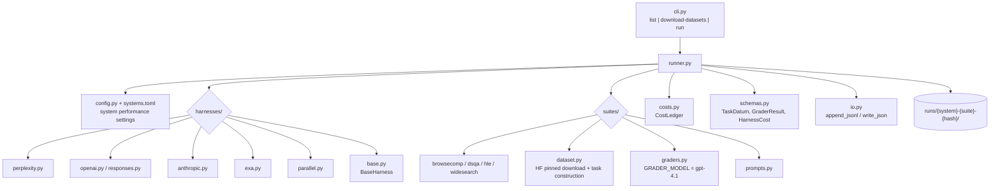

# Codebase · `search_evals` (Perplexity Research)

> **Repo path:** `zip_resources/… → extracted/search_evals-main/search_evals-main`
> **Language:** Python 3 (async, `uv`-managed) · **License:** MIT · **Scale:** ~28 modules, ~2,300 LOC
> **Role in the stack:** An **agentic search / deep-research evaluation harness** — it scores
> whole *agentic retrieval systems* (Perplexity Agent API, OpenAI Responses API, Anthropic
> Managed Agents, Exa, Parallel) against four web-research benchmarks, with per-task traces
> and dollar-accurate cost accounting.

---

## 1. What it is / what it is not

**It is:** a *system-level* runner. You give it one configured **system** (a hosted deep-research
product) and one **suite** (a benchmark), and it produces a score plus a fully inspectable
artifact tree: the normalized task, every provider request/response, the grader's chain-of-thought,
the cost ledger, and the final score.

**It is not:**
- a model-weights evaluation tool — it never loads a model locally;
- a generic eval framework — there is no plugin DSL, no YAML metric language, no local model support;
- a RAG *component* evaluator — it does not separately measure retriever recall@k or embedding
  quality. It measures **end-to-end answer correctness** after the agent has done its own searching.
  (For component-level RAG metrics see `CODE-04 Evalscope` and case studies CS-13/CS-15.)

The key design bet: **agentic search must be evaluated on outcomes, not on retrieval
intermediates**, because you do not control the retrieval stack of a hosted agent.

---

## 2. Architecture



Two orthogonal axes that never leak into each other:

| Axis | Abstraction | Implementations |
|---|---|---|
| **Who answers** | `BaseHarness` | perplexity, openai (+responses), anthropic, exa, parallel |
| **What is asked / how it's graded** | `BaseSuite` + `BaseGrader` | browsecomp, dsqa, hle, widesearch |

`BaseSuite` (in `suites/base.py`) is deliberately tiny — three class attributes and two abstract
methods:

```python
class BaseSuite(ABC):
    name: str
    instructions: str
    primary_metric: str
    dataset_fingerprint: str

    def __init__(self): self.grader = self.make_grader()
    @abstractmethod
    def make_grader(self) -> BaseGrader: ...
    @abstractmethod
    def load_tasks(self, limit: int | None) -> list[TaskDatum]: ...
```

That is the whole contract: **a suite is a dataset-provider plus a grader factory.**

---

## 3. The 10 files that matter

| # | Path | Why | What to read |
|---|---|---|---|
| 1 | `README.md` | The leaderboard + suite table | Results matrix, suite task counts, run-artifact layout |
| 2 | `search_evals/runner.py` (443 L) | The orchestrator | Concurrency, resume logic, per-attempt directories |
| 3 | `search_evals/schemas.py` (367 L) | The data contract | `TaskDatum`, `GraderResult`, `HarnessCost`, `require_*` validators |
| 4 | `search_evals/suites/graders.py` (195 L) | The judge | `DeepResearchGrader`, `DSQAGrader`, JSON-schema grading |
| 5 | `search_evals/suites/base.py` (65 L) | The extension point | `BaseGrader`, `BaseSuite`, the three grader exceptions |
| 6 | `search_evals/costs.py` (117 L) | Cost accounting | `CostLedger`, `openai_token_usage`, `token_cost_components` |
| 7 | `search_evals/suites/prompts.py` (156 L) | Judge prompts | `DEEP_RESEARCH_GRADER_PROMPT`, `DSQA_GRADER_PROMPT` |
| 8 | `search_evals/suites/dataset.py` (280 L) | Pinned data loading | HF dataset pinning + `dataset_fingerprint` |
| 9 | `search_evals/suites/widesearch.py` (347 L) | A non-binary suite | `f1_by_row` metric — the only non-accuracy scorer |
| 10 | `systems.toml` | Per-provider performance settings | Temperature, token limits, provider knobs |

---

## 4. Core abstractions (signature level)

### `BaseGrader` — the judge interface

```python
class BaseGrader(ABC):
    def __init__(self): self.costs = CostLedger()

    async def preflight(self) -> None: ...                     # validate creds BEFORE spending money
    def hydrate_costs(self, run_dir: Path) -> None: ...        # reload cost ledger on resume
    def record_cost(self, attempt_dir: Path, cost: HarnessCost) -> None: ...
    @abstractmethod
    async def grade(self, task: TaskDatum, predicted_answer: str,
                    trace_dir: Path) -> GraderResult: ...
```

Three exception classes encode the retry policy:

| Exception | Meaning | Retry? |
|---|---|---|
| `GraderPreflightError` | Missing credential / bad model id, raised **before** agent work | N/A — abort run |
| `NonRetryableGraderError` | HTTP 400/401/403/404/422 from the judge | No |
| `GraderError` | Anything else | Yes |

### `GraderResult` — a *typed* grade, not a float

The judge does not return a number. It returns a record carrying the grade type, the score,
free-form metrics, the **grader's reasoning text**, which provider/model graded it, and what the
grading cost:

```python
GraderResult(
    grade_type="CORRECT" if correct else "INCORRECT",
    score=1.0 if correct else 0.0,
    metrics={},
    grade_text=str(parsed.get("reasoning", "")),
    provider=GRADER_PROVIDER,   # "openai"
    model=GRADER_MODEL,         # "gpt-4.1"
    cost=cost,                  # HarnessCost
)
```

**Why this matters:** every score in the artifact tree is *auditable back to the judge's own
words and its price*. Most eval frameworks drop the reasoning; this one persists it.

---

## 5. How an evaluation actually runs (end-to-end trace)

1. **CLI** — `python -m search_evals run --system perplexity --suite browsecomp --concurrency 5`
2. **Preflight.** `runner.py` validates provider creds *and* grader creds. `OpenAIGrader.preflight()`
   even round-trips `client.models.retrieve("gpt-4.1")` and converts a 4xx into a
   `GraderPreflightError`. **No paid agent task starts until grading is known to be possible.**
3. **Run directory.** `runs/{system}-{suite}[-{run-suffix}]-{config-hash}/`. The hash includes the
   **dataset-contract fingerprint**, so repinning a dataset creates a *new* directory rather than
   silently reusing stale tasks.
4. **Task materialisation.** `suite.load_tasks(limit)` → `list[TaskDatum]`.
5. **Per task, per attempt:** the harness calls the provider; the request body is appended to
   `requests.jsonl` and the response to `responses.jsonl` **before** grading — so a crash mid-run
   still leaves an audit trail. Attempts accumulate history rather than overwriting.
6. **Grading.** `suite.grader.grade(task, predicted_answer, trace_dir)`.
   The deep-research grader uses OpenAI **structured outputs with a strict JSON schema**:

   ```python
   "schema": {
     "type": "object", "additionalProperties": False,
     "required": ["extracted_final_answer","reasoning","correct","confidence","strict"],
     "properties": {
       "extracted_final_answer": {"type": "string"},
       "reasoning": {"type": "string"},
       "correct": {"enum": ["yes","no"]},
       "confidence": {"type": "integer"},
       "strict": {"type": "boolean", "const": True}}}
   ```

   Note `"strict": true` is enforced as a **`const`** in the schema — the judge must assert its own
   strictness, which is a cheap guard against a lazy paraphrase-match.
7. **Cost.** Token usage → `HarnessCost` → written to `attempts/*/grader/cost.json` and registered in
   the `CostLedger`. Agent cost and grader cost are tracked **separately** in `summary.json`.
8. **Resume.** Re-running the same command reuses completed tasks and continues incomplete ones;
   `CostLedger.hydrate()` reloads prior spend so the reported total is cumulative.
9. **Summary.** `summary.json` reports **failed-as-zero** and **failed-excluded** metrics side by side —
   i.e. the harness refuses to hide infra failures inside the accuracy number.

---

## 6. Extending it

### Add a new suite (new benchmark)

1. Create `search_evals/suites/<name>.py` subclassing `BaseSuite`; set `name`, `instructions`,
   `primary_metric`, `dataset_fingerprint`.
2. Implement `load_tasks(limit)` → `list[TaskDatum]`. Pin the dataset revision explicitly and feed
   the pin into `dataset_fingerprint` (this is what makes runs non-resumable across data changes —
   by design).
3. Implement `make_grader()` returning either `DSQAGrader`, `DeepResearchGrader`, or a new
   `OpenAIGrader` subclass.
4. Register in `suites/registry.py`.
5. Add the suite to `README.md`'s table with task count and references.

### Add a new system (new provider)

1. Subclass `BaseHarness` in `harnesses/<name>.py` (`base.py` is only 67 lines — the contract is thin).
2. Handle the provider's own agent loop: you send a question, you get back a final answer
   **plus the provider's own search trace**, which should be persisted.
3. Declare performance settings in `systems.toml`.
4. Add the key to the `Credentials` section of the README and to the preflight check.

### Add a new metric

Only `widesearch` deviates from binary accuracy. It computes **`f1_by_row`** — per-row F1 over the
set of independently verifiable facts the answer was expected to collect — and the README reports the
**average** `f1_by_row`. To add a graded metric, return it in `GraderResult.metrics` and declare the
suite's `primary_metric`, then make `summary.json` aggregate it. The binary suites
(`browsecomp`, `dsqa`, `hle`) deliberately keep `metrics={}` and score 1.0/0.0.

---

## 7. Configuration & CLI surface

```bash
uv run python -m search_evals list

uv run python -m search_evals download-datasets          # provision all
uv run python -m search_evals download-datasets --suite hle

uv run python -m search_evals run \
  --system anthropic --suite browsecomp \
  --limit 5 --concurrency 5 --run-suffix smoke

uv run python -m search_evals run --system perplexity --suite browsecomp --concurrency 5
```

| Flag | Meaning |
|---|---|
| `--system` | one of the configured harnesses |
| `--suite` | one of the four benchmarks |
| `--limit N` | smoke-test on N tasks (use this — full runs are paid) |
| `--concurrency N` | parallel tasks |
| `--run-suffix` | start a *separate* run with the same config (otherwise the config hash collides) |

**Credentials:** `OPENAI_API_KEY` (also required for grading), `PERPLEXITY_API_KEY`,
`ANTHROPIC_API_KEY`, `EXA_API_KEY`, `PARALLEL_API_KEY`. HLE additionally needs a gated
`cais/hle` HuggingFace acceptance + `HF_TOKEN`.

---

## 8. Strengths, weaknesses, alternatives

| | Assessment |
|---|---|
| **Strengths** | Cost accounting is first-class (Decimal-based, per-component, agent vs grader split). Preflight prevents burning money on ungradable runs. Strict JSON-schema judging. Full request/response/trace persistence. Resume-by-config-hash is genuinely reproducible. Explicit failed-as-zero vs failed-excluded reporting. |
| **Weaknesses** | Only 4 suites and 5 systems; no local/open-weight model support; English/web-search only; grading hard-wired to a single OpenAI judge model (`GRADER_MODEL = "gpt-4.1"`, not configurable via CLI); no statistical-significance or variance machinery beyond what the README's `# runs` column implies; benchmark data not redistributed, so you depend on upstream HF availability. |
| **Choose it over…** | …**Evalscope** when you care about *hosted agentic search products* rather than open models on static benchmarks. …**Langfuse** when you want a one-shot benchmark score, not a continuous observability platform. …**OpenAI evals** when you need to test a third-party deep-research API you don't control. |
| **Don't choose it for** | Component-level RAG diagnostics (retriever recall, context precision), offline/self-hosted models, or custom domains — there is no dataset-authoring path beyond adding a suite in Python. |

**Reading the shipped leaderboard critically:** Perplexity leads dsqa (0.871) and browsecomp (0.805)
and widesearch (0.651); OpenAI leads hle (0.614, with Perplexity at 0.612 — a 0.002 gap, i.e. a tie
within any plausible noise band). Exa trails everywhere. Note this is a *vendor-published* table for a
*vendor's own* harness — treat it as a reproducible methodology, not a neutral ranking.

---

## 9. Minimal runnable example

```bash
# 1. Environment
export OPENAI_API_KEY=...        # harness + grader
export ANTHROPIC_API_KEY=...     # system under test

# 2. Provision data once
uv run python -m search_evals download-datasets --suite browsecomp

# 3. Smoke test — 5 tasks, cheap
uv run python -m search_evals run \
  --system anthropic --suite browsecomp \
  --limit 5 --concurrency 5 --run-suffix smoke

# 4. Inspect the artifacts
# runs/anthropic-browsecomp-smoke-<hash>/
#   summary.json
#   tasks/<task-id>/attempts/<n>/requests.jsonl
#                              /responses.jsonl
#                              /grader/requests.jsonl
#                              /grader/cost.json
```

Writing a custom suite end-to-end:

```python
from search_evals.suites.base import BaseSuite
from search_evals.suites.graders import DSQAGrader
from search_evals.schemas import TaskDatum

class MySuite(BaseSuite):
    name = "mysuite"
    instructions = "Answer the question. Return a final answer line."
    primary_metric = "accuracy"
    dataset_fingerprint = "mysuite@v1+revision=abc123"

    def make_grader(self):        # reuse the DSQA-style rubric judge
        return DSQAGrader()

    def load_tasks(self, limit):
        rows = load_pinned_rows()          # your own pinned loader
        return [TaskDatum(problem=r["q"], answer=r["a"], metadata={}) for r in rows[:limit or None]]
```

---

## 10. Reading order for a newcomer

| Step | File | Time | Why |
|---|---|---|---|
| 1 | `README.md` | 10 min | Results matrix + suite table + artifact layout |
| 2 | `search_evals/schemas.py` | 20 min | The data contract everything else obeys |
| 3 | `search_evals/suites/base.py` | 5 min | The only two extension points |
| 4 | `search_evals/suites/graders.py` | 20 min | How judging + cost actually work |
| 5 | `search_evals/suites/dataset.py` | 15 min | Pinning and fingerprints |
| 6 | `search_evals/costs.py` | 10 min | Why cost is trustworthy |
| 7 | `search_evals/runner.py` | 30 min | Concurrency, resume, attempt directories |
| 8 | `search_evals/harnesses/base.py` + one harness | 15 min | Provider integration shape |
| 9 | `search_evals/suites/widesearch.py` | 20 min | The one non-binary metric |

---

## Cross-references

- **Concepts:** CS-15 (RAG operational evals — cost-per-query discipline), CS-13 (retrieval metrics
  this harness deliberately does *not* measure), CS-09 (leaderboards — how to read the results table), CS-11 (benchmark contamination).
- **Sibling codebases:** `CODE-04` (Evalscope) for open-model + benchmark breadth; `CODE-06`
  (Langfuse) for the observability counterpart; `CODE-05` (frontier-evals) for the opposite extreme —
  containerised, months-long, rubric-graded research replication.
