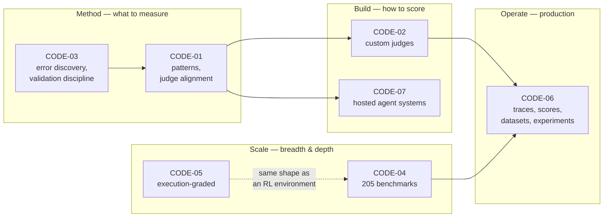

# Codebase Dossiers

Seven real repositories, read at source level and written up as dossiers: what each one is, the
abstractions that carry it, how an evaluation actually flows through the code, how to extend it, and
when to pick it over the others.

These repos are complementary rather than competing — together they cover the whole eval stack.

| Dossier | Repo | Stack | The one thing it is best at | Choose it when |
|---|---|---|---|---|
| [CODE-01](CODE-01-awesome-evals.md) | `awesome-evals` | Markdown | **Judgement + runnable patterns.** The judge-alignment recipe (binary PASS/FAIL, few-shot critiques, TPR/TNR validation) and pass@k vs pass^k | You need to write or audit an evaluator and want the canonical recipe |
| [CODE-02](CODE-02-openai-evals.md) | OpenAI `evals` | Python + YAML | **Zero-code custom evals.** A judge is a YAML prompt + `choice_scores`; an eval is 3 keys | Your criterion is subjective and custom to your product |
| [CODE-03](CODE-03-evals-skills.md) | `evals-skills` | Markdown / agent skills | **Process enforcement.** Error analysis *before* evaluator-writing; validate before trust | Your problem is process drift, not missing tooling |
| [CODE-04](CODE-04-evalscope.md) | EvalScope | Python + TS | **Breadth + performance.** 205 benchmark adapters, multimodal, agent mode with Docker sandbox, TTFT/TPOT | You need published benchmark numbers, or quality *and* latency |
| [CODE-05](CODE-05-frontier-evals.md) | `frontier-evals` | Python + Docker | **Execution-based grading.** Rollout → reproduce in a fresh GPU container → rubric-grade in a third | The question is "can it actually do the task", not "does it sound like it did" |
| [CODE-06](CODE-06-langfuse.md) | Langfuse | TypeScript | **The platform.** Traces, scores, datasets, experiments, annotation queues in one store | Your problem is production quality and you have real users |
| [CODE-07](CODE-07-search-evals.md) | `search_evals` | Python (async) | **Cost-accounted hosted-agent evals.** Per-component Decimal cost, agent vs grader split, resumable runs | You are evaluating a hosted deep-research/agent product you don't control |

## How they fit together

**A realistic stack:** `CODE-03` to find your failure modes → `CODE-01` to write and validate the
judge → `CODE-02` (or a code evaluator) to implement it → `CODE-06` to run it offline on datasets and
online on sampled production traces → `CODE-04` when you need to choose or regression-test the model
underneath.

## Reading order if you are new to all seven

1. **CODE-01** `PATTERNS.md` § LLM-as-judge — 20 minutes, the highest-value page in the collection.
2. **CODE-03** — the order of operations your team should follow.
3. **CODE-02** — see how cheap a real evaluator is to declare.
4. **CODE-06** — see where all of it has to live to be useful.
5. **CODE-07** — see cost treated as a first-class metric.
6. **CODE-04** — see the difference between a benchmark and an eval.
7. **CODE-05** — see the ceiling of what execution-based grading demands.

## Cross-cutting observations

- **Four of the seven are registries.** `CODE-02` resolves `class:` strings, `CODE-04` maps a
  benchmark name to an adapter path in `_index.json`, `CODE-06` targets evaluators via a decision
  model, `CODE-07` maps a suite name to a loader+grader pair. The registry pattern is what makes an
  eval framework extensible without touching its core.
- **Persistence before scoring is a recurring safety property.** `CODE-07` writes
  `prediction_persisted` before review begins; `CODE-04` separates prediction from review over one
  work pool. Both exist so that re-judging is cheap and a crash never costs you a generation.
- **`CODE-02` and `CODE-01` share DNA.** The `cot_classify` judge format — reason first, print only
  the letter, repeat the letter — appears verbatim in `CODE-02`'s registry and is the code
  `CODE-01` reconstructs and then teaches you to *validate*.
- **Only `CODE-05` grades execution.** Everything else grades output, trajectory or world state
  reachable through an API. That is the single biggest design axis in the collection.
- **`mockllm.py` in `CODE-04` and the `dummy` solver in `CODE-05`** are the same idea: a way to test
  the harness itself without spend. Copy this into any eval you build.
